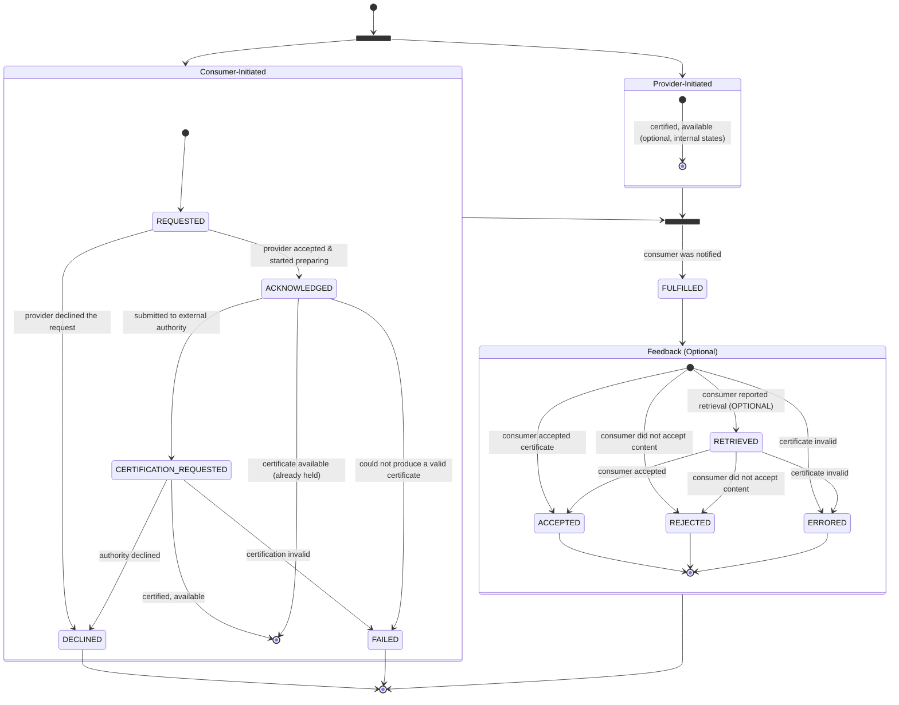
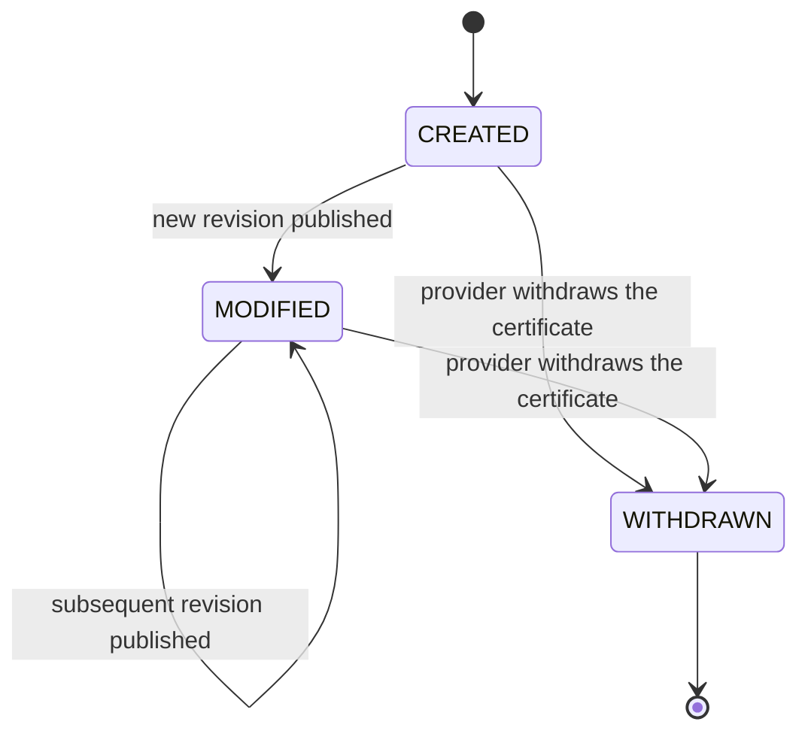

---
tags:
  - CAT/Value Added Services
---

# CX-0135 Business Partner Company Certificate Management (CCM) v3.0.0

## ABSTRACT

In the world of business, company certificates are often mandatory for conducting transactions between two companies.
However, the process of provisioning, maintaining, and validating these certificates can be a major challenge. For
example, if a company has 100 customers, it may need to provide its company certificates in 100 different ways and
maintain them at 100 different points. To address this, this standard defines a standardized but generic data model 
and a wire protocol for company certificates. 

## 1 Introduction

### 1.1 Audience & Scope

> *This section is non-normative*

This specification builds upon [CX-0151](#cx-0151) and [CX-0002](#cx-0002) to define a Company Certificate 
Management (CCM) wire protocol for exchanging company certificate data between Catena-X participants.

The following company certificate business requirements are supported in this release:

- Certificate Provider wants to create, modify, withdraw a certificate.
- Certificate Consumer wants to be notified about all changes to a certificate.
- Certificate Consumer wants to discover a published certificate.
- Certificate Consumer wants to request a certificate from a specific Certificate Provider.
- Certificate Consumer wants to provide Certificate Provider with feedback on a certificate.

This standard is relevant to the following parties:

- Data Provider and Consumer
- Business Application Provider
- Enablement Service Provider

It especially applies to business application providers who aim to offer a solution for managing and exchanging company
certificates and returning them to customers, and to Data Providers and Consumers who manage and exchange certificates,
e.g., through such a business application.

> **Context regarding the naming of involved parties:**
> The Catena-X operating model and the [Dataspace Protocol](#dsp) use the roles `Data Consumer` and `Data Provider`,
> defined in terms of which party offers and consumes a dataset. In some cases these align with the direction of
> certificate flow, but — particularly for the notification mechanisms — a mismatch can occur. To avoid ambiguity,
> this standard uses the terms `Certificate Provider` and `Certificate Consumer` to designate the business entities,
> independently of the data-plane roles they assume for a given interaction.

### 1.2 Conformance and Proof Of Conformity

The keywords **MAY**, **MUST**, **MUST NOT**, **OPTIONAL**, **RECOMMENDED**, **REQUIRED**, **SHOULD**, and **SHOULD
NOT** in this document are to be interpreted as described in BCP 14 [RFC2119](#rfc2119) [RFC8174](#rfc8174) when, and
only when they appear in all capitals, as shown here.

- A participant **MAY** support any of the APIs (based on their need; more explicitly, a consumer role without
  support of the Certificate Consumer API is valid):
  - Certificate Consumer API (see [Section 3.1](#31-certificate-consumer-api))
  - Certificate Provider API (see [Section 3.2](#32-certificate-provider-api))
- Business Application Provides **MUST** support both, the Certificate Provider API and the Certificate Consumer API.
- Based on the previous requirements, the participant **MUST** be compliant with all normative requirements defined 
  in the respective sections of this standard. Especially the state machines, APIs and data model. Even a consumer
  without a Certificate Consumer API **MUST** proof to be compliant with 
  [Section 2](#2-relevant-parts-of-the-standard-for-specific-use-cases) and [Section 5](#5-certificate-data-model) 
  of this standard.

## 2 RELEVANT PARTS OF THE STANDARD FOR SPECIFIC USE CASES

This section describes the conceptual model underpinning the specification wire protocol. It is background material: the
model introduces the entities and lifecycle that the normative sections build upon, but defines no normative
requirements of its own.

The model consists of two concepts:

- The `Certificate Exchange` ([Section 2.1](#21-certificate-exchange)) — a single, correlatable interaction in which one
  certificate is delivered from a Certificate Provider to a Certificate Consumer and its outcome is reported back. A
  `Certificate Exchange` has its own identity and a well-defined lifecycle.
- The `Certificate Lifecycle` ([Section 2.2](#22-certificate-lifecycle)) — the independent lifecycle of a certificate as
  an artifact (its creation, modification, and (optionally) withdrawal).

### 2.1 Certificate Exchange

A `Certificate Exchange` represents one end-to-end interaction between a Certificate Provider and a Certificate Consumer
involving the delivery of a single certificate from the time the interaction is started until it reaches a terminal
outcome.

#### 2.1.1 Identity and Correlation

> *This section is non-normative*

A `Certificate Exchange` is identified by an **`exchangeId`** assigned when it is started. The `exchangeId` is the
correlation handle for the entire interaction and is distinct from the identifier of any individual message or event
(for example, a CloudEvent `id` + `source`).

An exchange concerns a specific certificate, a (`certificateId`, `revision`) pair, and is conducted with a
`counterparty`, the authenticated Certificate Consumer.

A `Certificate Exchange` may be opened by the Certificate Consumer or Certificate Provider:

- **Consumer-Initiated:** the Certificate Consumer opens the exchange by requesting a certificate. The
  Certificate Provider assigns the `exchangeId` (together with the `certificateId` and `revision`) and returns them in
  the response. Every request opens an exchange — including one the provider declines synchronously, which could open an
  exchange that terminates immediately at `DECLINED`; the identifiers are still returned so the outcome remains
  correlatable.
- **Provider-Initiated:** the Certificate Provider opens the exchange when a certificate is already available (e.g.,
  freshly created by a user of the certificate application without a previous consumer-initiated request), 
  assigning an `exchangeId` and carrying it — with the `certificateId` and `revision` — in the notification.

**Idempotency.** Each `Certificate Exchange` has a unique `exchangeId`. A message that repeats an `exchangeId` refers to
the same exchange rather than opening a new one. Multiple exchanges **MAY** concern the same certificate and
`counterparty`.

Acceptance feedback is correlated to the exchange by its `exchangeId` for both flows.

A re-attempt after a terminal outcome — for example, re-evaluating a `REJECTED` or `ERRORED` certificate — is a new
`Certificate Exchange`, with a new `exchangeId`, for the same certificate.

#### 2.1.2 Phases and Ownership

> *This section is non-normative*

A `Certificate Exchange` progresses through two sequential phases, each owned by one party:

1. **Fulfillment (Provider-owned):** The Certificate Provider works to make the certificate available.
2. **Acceptance (Consumer-owned):** The Certificate Consumer retrieves and processes the certificate and reports the
   outcome.

The phases never overlap: the `Acceptance` phase begins only once `Fulfillment` has made the certificate available.
Provider-owned and Consumer-owned states use deliberately disjoint vocabulary, so the owner of a state is unambiguous.
Each phase can end in a negative decision or a business error: `DECLINED`/`REJECTED` are decisions (the provider
declines the request, or the consumer does not accept the certificate), while `FAILED`/`ERRORED` indicate a business
error such as an invalid certificate. These error states represent business-level problems only; technical and transport
failures (for example, connectivity errors or timeouts) are not modeled as `Certificate Exchange` states and are handled
at the transport layer.

#### 2.1.3 State Machine (Certificate Exchange)

> *This section is normative*

The states of a `Certificate Exchange` are defined below and use the past tense:


```mermaid
stateDiagram-v2
    state fork_state <<fork>>
        [*] --> fork_state
        fork_state --> ConsumerInitiated
        fork_state --> ProviderInitiated

        ConsumerInitiated: Consumer-Initiated
        state ConsumerInitiated {
            [*] --> REQUESTED
            REQUESTED --> ACKNOWLEDGED: provider accepted & started preparing
            REQUESTED --> DECLINED: provider declined the request
            CERTIFICATION_REQUESTED --> [*]: certified, available
            ACKNOWLEDGED --> CERTIFICATION_REQUESTED: submitted to external authority
            ACKNOWLEDGED --> [*]: certificate available (already held)
            CERTIFICATION_REQUESTED --> DECLINED: authority declined
            CERTIFICATION_REQUESTED --> FAILED: certification invalid
            ACKNOWLEDGED --> FAILED: could not produce a valid certificate
        }

        ProviderInitiated: Provider-Initiated
        state ProviderInitiated {
            [*] --> [*]: certified, available (optional, internal states)
        }
        
    state join_state <<join>>
        ConsumerInitiated --> join_state
        ProviderInitiated --> join_state
        join_state --> FULFILLED: consumer was notified
    
    FULFILLED --> Feedback
        
    Feedback: Feedback (Optional)
    state Feedback {
      [*] --> RETRIEVED: consumer reported retrieval (OPTIONAL)
      [*] --> ACCEPTED: consumer accepted certificate
      [*] --> REJECTED: consumer did not accept content
      [*] --> ERRORED: certificate invalid
      RETRIEVED --> ACCEPTED: consumer accepted
      RETRIEVED --> REJECTED: consumer did not accept content
      RETRIEVED --> ERRORED: certificate invalid
      ACCEPTED --> [*]
      REJECTED --> [*]
      ERRORED --> [*]
    }

    DECLINED --> [*]
    FAILED --> [*]
    Feedback --> [*]
```

| State                     | Correlation        | Phase       | Owner    | Terminal | Description                                                                                                      |
|---------------------------|--------------------|-------------|----------|----------|------------------------------------------------------------------------------------------------------------------|
| `REQUESTED`               | Consumer-Initiated | Fulfillment | Provider | No       | The exchange was opened by the consumer; the provider has not yet acted.                                         |
| `ACKNOWLEDGED`            | Consumer-Initiated | Fulfillment | Provider | No       | The provider accepted the request and began preparing the certificate.                                           |
| `CERTIFICATION_REQUESTED` | Consumer-Initiated | Fulfillment | Provider | No       | The provider submitted the request to an external certification authority and is awaiting issuance. *(Optional)* |
| `FULFILLED`               | Consumer-Initiated | Fulfillment | Provider | No       | The certificate is prepared and available for retrieval and the consumer was notified. Hand-off point.           |
| `DECLINED`                | Consumer-Initiated | Fulfillment | Provider | Yes      | The provider declined the request (a business decision; e.g. the certificate type is not offered).               |
| `FAILED`                  | Consumer-Initiated | Fulfillment | Provider | Yes      | The provider could not produce a valid certificate (a business error; e.g. the certificate is invalid).          |
| `RETRIEVED`               | -                  | Acceptance  | Consumer | No       | The consumer fetched the certificate and is processing it. *(Optional — see the note below.)*                    |
| `ACCEPTED`                | -                  | Acceptance  | Consumer | Yes      | The consumer accepted the certificate.                                                                           |
| `REJECTED`                | -                  | Acceptance  | Consumer | Yes      | The consumer did not accept the certificate content (a business decision).                                       |
| `ERRORED`                 | -                  | Acceptance  | Consumer | Yes      | The consumer found the certificate to be in error (a business error; e.g. the certificate is invalid).           |

##### 2.1.3.1 Consumer-Initiated

`REQUESTED` is instantaneous and internal to the Certificate Provider; it is never reported on the wire. The first
Fulfillment status a Certificate Consumer observes is the one carried in the request response (see
[Section 4.4.1](#441-certificate-request)), which is `ACKNOWLEDGED` or a later state. A provider that can satisfy a
request without intermediate steps **MAY** report a later Fulfillment state directly—for example `FULFILLED` when the
certificate is already held, or `CERTIFICATION_REQUESTED` when the request is immediately forwarded to an external
authority—having passed through the earlier states instantly in an automated fashion. A reported `status` therefore 
reflects the exchange's current state, not necessarily a single transition from the one before it.

##### 2.1.3.2 Provider-Initiated

A provider-initiated exchange enters the lifecycle at `FULFILLED` (with potential internal states beforehand when a user 
creates a certificate). There is no request, so `REQUESTED`, `ACKNOWLEDGED` and `CERTIFICATION_REQUESTED` are never 
visited.

##### 2.1.3.3 Feedback

Any feedback is optional. 
`RETRIEVED` is a non-terminal acknowledgment that the consumer has fetched the certificate and is
evaluating it; the consumer **MAY** report it as a delivery receipt but is not required to. 
An exchange therefore reaches a terminal acceptance state either by way of `RETRIEVED` 
(`FULFILLED → RETRIEVED → {ACCEPTED, REJECTED, ERRORED}`) 
or directly from `FULFILLED` (`FULFILLED → {ACCEPTED, REJECTED, ERRORED}`). 
The terminal acceptance verdicts remain consumer-owned in both cases. If the consumer never provides any feedback, the
terminal state is never reached for that exchange; it remains in `FULFILLED` indefinitely.

#### 2.1.4 Terminal States and Immutability

A `Certificate Exchange` is single-shot. The five terminal states — `DECLINED`, `FAILED`, `ACCEPTED`, `REJECTED`, and
`ERRORED` — conclude the exchange permanently. A terminal exchange is never reopened, reused, or transitioned further.

#### 2.1.5 Relationship to the Certificate Lifecycle

A `Certificate Exchange` governs the *delivery* of a certificate, not the certificate itself. Modifications, updates,
and revocations of a certificate are changes to the certificate artifact and are **not** transitions of a
`Certificate Exchange`. In particular, a change to a certificate that has already been delivered does not reopen or
alter the (possibly terminal) exchange that delivered it. A modification revises the certificate in place under the same
`certificateId` and does not open a new `Certificate Exchange`. The certificate's own lifecycle is described in
[Section 2.2](#22-certificate-lifecycle).

### 2.2 Certificate Lifecycle

The `Certificate Lifecycle` tracks a certificate as an artifact over time, independently of how many times it is
delivered. Whereas a `Certificate Exchange` is single-shot and concerns one delivery interaction, a certificate is
long-lived: it may be published, revised, and eventually withdrawn.

#### 2.2.1 Identity and Versioning

A certificate is identified by a **`certificateId`** that is stable for the life of the certificate. 
A modification does not create a new identifier; instead, the certificate is versioned by a **`revision`** counter:

- `CREATED` makes the first `revision` of the certificate available for retrieval.
- Each `MODIFIED` publishes a new `revision` under the same `certificateId`, superseding the previous one. The latest
  `revision` is authoritative.
- A certificate is therefore identified by the pair (`certificateId`, `revision`). 
  A `Certificate Exchange` delivers one specific `revision`.

The `certificateId` and the initial `revision` number may be assigned before the certificate is published. When a
Certificate Provider accepts a consumer's request and produces the certificate only later (see
[Section 2.1.1](#211-identity-and-correlation)), the identifier is allocated at acceptance so that an in-progress
`Certificate Exchange` can reference its certificate. Publication (`CREATED`) then occurs when the certificate becomes
available.

A certificate covers a **fixed set of locations** — the sites (BPNS) and addresses (BPNA) it applies to. On the full
certificate record these are carried as structured `enclosedSites` (each with an optional per-location area of 
application; see [Section 4.4.3](#443-certificate-retrieval)); lighter projections such as query results and lifecycle 
events carry only the bare BPNs as `enclosedSiteBpns`. The location set is a static property of the certificate; 
a certificate that would cover a different set of locations is a distinct certificate.

#### 2.2.2 State Machine (Certificate Lifecycle)

> *This section is normative*

The states use the past tense and describe the *publication* lifecycle of the certificate. They are independent of the
certificate's validity (see [Section 2.2.3](#223-validity-as-a-separate-dimension)).


```mermaid
stateDiagram-v2
    [*] --> CREATED
    CREATED --> MODIFIED: new revision published
    MODIFIED --> MODIFIED: subsequent revision published
    CREATED --> WITHDRAWN: provider withdraws the certificate
    MODIFIED --> WITHDRAWN: provider withdraws the certificate
    WITHDRAWN --> [*]
```

| State       | Terminal | Description                                                                                                                 |
|-------------|----------|-----------------------------------------------------------------------------------------------------------------------------|
| `CREATED`   | No       | The certificate was first published under a new `certificateId`, establishing its initial version (`revision` 0).           |
| `MODIFIED`  | No       | A new `revision` of the certificate was published under the same `certificateId`; the `revision` is incremented. May recur. |
| `WITHDRAWN` | Yes      | The provider withdrew (removed) the certificate; it is no longer available. Terminal.                                       |

#### 2.2.3 Validity as a Separate Dimension

> *This section is non-normative*

A certificate's validity is an independent dimension derived from its `validFrom` and `validUntil` dates, not from the
publication states defined above. A given `revision` is *active* within its validity window and *expired* afterward, and
this status changes with the passage of time alone — no lifecycle transition occurs. The two dimensions are orthogonal:
a certificate MAY be `WITHDRAWN` while still within its validity window, or remain `CREATED`/`MODIFIED`after it has
expired.

#### 2.2.4 Relationship to the `Certificate Exchange`

> *This section is non-normative*

Of the publication events, only `CREATED` MAY open a new `Certificate Exchange`—pushed by the provider, or discovered
and requested by the consumer—to deliver the certificate. `MODIFIED` and `WITHDRAWN` do not open an exchange: a
modification revises the certificate in place under the same `certificateId` without initiating a new delivery, and a
withdrawal ends the certificate's availability. Consistent with
[Section 2.1.5](#215-relationship-to-the-certificate-lifecycle), a lifecycle transition never alters an existing
`Certificate Exchange`. These transitions are communicated to Certificate Consumers as certificate lifecycle events (see
[Section 3.3.1](#311-certificate-lifecycle-events)).

## 3 APPLICATION PROGRAMMING INTERFACES

> *This section is normative*

The API specification is separated in two parts, one for the Certificate Provider and one for the Certificate Consumer.
Of course a network participant is not limited to either of those roles; for example, a participant could be a 
Certificate Consumer in one interaction and a Certificate Provider in another. This is based on the participant's needs.

This section introduces the certificate management notification API which is based on the following OpenAPI 
specifications which **MUST** be adhered to:
- [Certificate Consumer API](assets/certificate-consumer-api.yaml)
- [Certificate Provider API](assets/certificate-provider-api.yaml)

The OpenAPI specification **MUST** be used as the baseline, the following subsections add additional normative 
requirements and clarifications. Each supported API **MUST** be discoverable and made be accessible
via a [DSP Catalog](#dsp-catalog).

A dataspace participant that chooses to implement an API **MUST**
- offer an asset to expose the API for Certificate Provider in the connector catalog.
- reference the name of the certificate management API `cx-taxo:CCMAPI` for the property
  [[type]](http://purl.org/dc/terms/type).

Overview of possible API assets defined in this version of the standard:

| **Type**       | **Subject**                                     | **Version** | **Description**                                                                                                                                                                                                                            |
|----------------|-------------------------------------------------|-------------|--------------------------------------------------------------------------------------------------------------------------------------------------------------------------------------------------------------------------------------------|
| cx-taxo:CCMAPI | cx-taxo:CompanyCertificateManagementConsumerApi | 1.0         | Offers *Certificate Consumer API* according to [Section 3.1](#31-certificate-consumer-api) for receiving notifications on certificate lifecycle events and providing feedback on the status of provided certificates.                      |
| cx-taxo:CCMAPI | cx-taxo:CompanyCertificateManagementProviderApi | 1.0         | Offers *Certificate Provider API* according to [Section 3.2](#32-certificate-provider-api) for requesting certificates, retrieving certificates, providing feedback on the status of certificate requests, and searching for certificates. |

There **MUST** only be one unique asset per API (subject and version) across all connectors of one BPNL.
___
*Example*: it is possible to have these assets available next to one-another:

- ```{ "dct:subject": { "@id": "cx-taxo:CompanyCertificateManagementConsumerApi" }, "cx-common:version": "1.0" }```,
- ```{ "dct:subject": { "@id": "cx-taxo:CompanyCertificateManagementProviderApi" }, "cx-common:version": "1.0" }```,
- ```{ "dct:subject": { "@id": "cx-taxo:CompanyCertificateManagementNotificationApi" }, "cx-common:version": "3.0" }```

since they either differ in the value of the version or the subject.
But it would not be possible to have two of the same subject and the same version.

*Example that is not allowed:*

- ```{"dct:subject": { "@id": "cx-taxo:CompanyCertificateManagementConsumerApi" }, "cx-common:version": "1.0" }```,
- ```{"dct:subject": { "@id": "cx-taxo:CompanyCertificateManagementConsumerApi" }, "cx-common:version": "1.0" }```

It doesn't matter if the assets are offered in one or in different connectors, as long as they belong to the same BPNL 
this is not allowed, they **MUST** be unique.
___

### 3.1 Certificate Consumer API

> API specification:
> [Certificate Consumer API](assets/certificate-consumer-api.yaml)

The Certificate Consumer API enables a Certificate Consumer to receive notifications from Certificate
Provider (as certificate lifecycle events, see [Section 2.2](#22-certificate-lifecycle)) and provide certificate 
acceptance status for open exchanges (see [Section 3.1.2](#312-certificate-acceptance-status)):

This API is optional; a Certificate Consumer that does not wish to receive notifications or provide certificate 
acceptance status updates is not required to implement it. A Certificate Consumer that does implement it **MUST** 
adhere to the following normative requirements (as well as further requirements defined in this section):
- The Certificate Consumer signals to the Certificate Provider the existence of the API by the availability of the
  data asset. If no data asset is available, the Certificate Provider is relieved of their obligation to push
  notifications. If the Certificate Consumer wishes to receive notifications, they **MUST** provide the data asset.
- If the data asset exists, the Certificate Consumer **MUST** serve all specified endpoints and implement at least one
  of them, but **MAY** return `HTTP 501` for endpoints it does not wish to implement.
  For example, a consumer that wants to receive notifications but does not want to provide acceptance status updates 
  could return `HTTP 501` for the acceptance status endpoint.
- reference the name of the Certificate Provider API: `cx-taxo:CompanyCertificateManagementConsumerApi` for the property
  [[subject]](http://purl.org/dc/terms/subject).
- reference the version of the API according to the OpenAPI specification for the property
  [[version]](https://w3id.org/catenax/ontology/common#version): `1.0`

A Certificate Provider **MUST** push notifications to a Certificate Consumer that implements this API (and therefore
**MUST** check for its existence), and **MUST** follow the requirements defined in this section when doing so.

The API is based on CloudEvents (see [CloudEvents](#cloudevents)) and **MUST** follow the HTTP binding defined in 
[CloudEvents-HTTP](#cloudevents-http).

**Example Certificate EDC Asset:**

___
```json
{
  "@id": "81a0bdf8-732f-488e-bddb-1b9a78f0d1e0",
  "@type": "Asset",
  "properties": {
    "dct:type": {
      "@id": "cx-taxo:CCMAPI"
    },
    "dct:subject": {
      "@id": "cx-taxo:CompanyCertificateManagementConsumerApi"
    },
    "dct:description": "API for receiving certificate lifecycle notifications.",
    "cx-common:version": "1.0"
  },
  "dataAddress": {
      "@type": "DataAddress",
      "type": "HttpData",
      "baseUrl": "https://backend-base-url/certificate-consumer-api-base-path",
      "proxyQueryParams": "false",
      "proxyPath": "true",
      "proxyMethod": "false",
      "proxyBody": "true"
    },
  "@context": {
    "dct": "http://purl.org/dc/terms/",
    "cx-taxo": "https://w3id.org/catenax/taxonomy#",
    "cx-common": "https://w3id.org/catenax/ontology/common#"
  }
}
```
___

#### 3.1.1 Certificate Lifecycle Events

`POST /certificate-notifications`

The endpoint accepts a single CloudEvent or a batch (a JSON array) and follows the state machine defined in 
[Section 2.1.3](#213-state-machine-certificate-exchange).

The event **MUST** be one of the following **Event Type**: 
- `org.catena-x.ccm.CertificateLifecycleStatus.v1`
- `org.catena-x.ccm.CertificateFulfillmentStatus.v1`

The Certificate Provider **MUST** push notifications for all states from 
[2.2.2 State Machine](#222-state-machine-certificate-lifecycle) as Certificate Lifecycle Status.
An example notification history could be:
The Certificate Provider pushes a `CREATED` notification (this would always be the case), and a few days later a 
`MODIFIED` notification, because an error in the certificate metadata had to be corrected. A few years later the
provider could push a `WITHDRAWN` notification, because the certificate is no longer valid. This last step is not
mandatory, because a provider could decide to still keep the certificate available, even if it is expired.

The Certificate Provider **MUST** also push notifications for all provider owned terminal states from 
[2.1.3 State Machine](#213-state-machine-certificate-exchange) as Certificate Fulfillment Status.

> [!Important]
> **Push Mechanism explanation**
> 
> Previous versions of the standard made a distinction between a dedicated push and a pull mechanism.
> This standard consolidates both into a single mechanism.
> To still support the push mechanism, the Certificate Lifecycle Events endpoint has a unique functionality.
> Usually the notification would not contain any certificate payload, but only lifecycle events.
> However, the following will explain how a lifecycle event **MAY** also carry a certificate payload.

Certificate Consumers that want to receive also certificate payload with their lifecycle events, they can do 
the following way: When registering the asset as described in the previous section [3.1](#31-certificate-consumer-api), 
the Certificate Consumer **MUST** add the `property`:

```json
{
  "dct:notification-payload": {
    "@id": "true"
  }
}
```

The Certificate Provider **MUST** check for the presence of this property when pushing the lifecycle events `CREATED` or 
`MODIFIED` and, if the property is set, include the certificate payload in the `data` section of the CloudEvent.
The certificate payload **MUST** be according to [Section 5](#5-certificate-data-model), with the following caveat:
The `contentBase64` property **MUST** be included. For any other lifecycle event, the Certificate Provider **MUST NOT** 
include the certificate payload in the notification, even if the property is set.

If the `dct:notification-payload` is either omitted or `"false"`, then the Certificate Provider **MUST NOT** include the 
certificate payload in the `data` section of the CloudEvent.

The above **MUST** also be respected for batch notifications.

#### 3.1.2 Certificate Acceptance Status Query

`GET  /certificate-acceptance-status/{id}`

### 3.2 Certificate Provider API

> API specification:
> [Certificate Provider API](assets/certificate-provider-api.yaml)

The Certificate Provider API enables Certificate Providers to accept certificate requests, report request fulfillment
status, serve certificate data, answer certificate queries, and receive acceptance status from Certificate Consumers.

The Certificate Provider **MUST**:
- implement this API in its total, supporting all endpoints.
- reference the name of the Certificate Provider API: `cx-taxo:CompanyCertificateManagementProviderApi` for the property
  [[subject]](http://purl.org/dc/terms/subject).
- reference the version of the API according to the OpenAPI specification for the property
  [[version]](https://w3id.org/catenax/ontology/common#version): `1.0`

**Example Certificate EDC Asset:**

___
```json
{
  "@id": "81a0bdf8-732f-488e-bddb-1b9a78f0d1e0",
  "@type": "Asset",
  "properties": {
    "dct:type": {
      "@id": "cx-taxo:CCMAPI"
    },
    "dct:subject": {
      "@id": "cx-taxo:CompanyCertificateManagementProviderApi"
    },
    "dct:description": "API for requesting and searching certificates as well as documents, as well as to provide feedback.",
    "cx-common:version": "1.0"
  },
  "dataAddress": {
      "@type": "DataAddress",
      "type": "HttpData",
      "baseUrl": "https://backend-base-url/certificate-provider-api-base-path",
      "proxyQueryParams": "false",
      "proxyPath": "true",
      "proxyMethod": "false",
      "proxyBody": "true"
    },
  "@context": {
    "dct": "http://purl.org/dc/terms/",
    "cx-taxo": "https://w3id.org/catenax/taxonomy#",
    "cx-common": "https://w3id.org/catenax/ontology/common#"
  }
}
```
___

#### 3.2.1 Certificate Request

`POST /certificate-requests`,
`GET  /certificate-requests/{id}`

The Certificate Provider **MUST** respond with request states according to 
[2.1.3 State Machine](#213-state-machine-certificate-exchange).

#### 3.2.3 Certificate Retrieval

`GET  /certificates/{id}`
`GET  /documents/{id}`

The `/certificates/{id}` endpoint **MUST** be based on [CX-0002](#cx-0002) and return the certificate submodel
as defined in [Section 4.1](#41-aspect-model-business-partner-certificate).

Any certificate as part of the `/certificates/{id}` response **MUST NOT** have the `contentBase64` property included,
even if the consumer has registered for it in the notification payload
(see [Section 3.1.1](#311-certificate-lifecycle-events)). To receive the document content, 
the consumer **MUST** use the `/documents/{id}` based on the `documentId` property included in the certificate submodel.

#### 3.2.4 Certificate Acceptance 

`POST /certificate-acceptance-notifications`

This API is used by the Certificate Consumer to provide feedback on the status to the Certificate Provider, 
either accepting or rejecting the provided certificate. It is based on CloudEvents (see [CloudEvents](#cloudevents)).
The contents of the feedback message **MUST** be included in the `data` section of the CloudEvent, and set
according to the lifecycle of the certificate exchange as defined in 
[Section 2.1.3](#213-state-machine-certificate-exchange).

#### 3.2.5 Certificate Query

`POST /certificates/search`

The Certificate Provider **MUST** implement the search endpoint for certificates according to the 
Registry Service Specification - Query Profile (SSP-004) defined in [CX-0002](#cx-0002). This hard requirement
is softened in the following way:
- The only logical expressions that **MUST** be supported (all others **MAY** be supported) are:
  - `$match`
  - `$eq`
- The only fields that **MUST** be supported (all others **MAY** be supported) are:
  - `certifiedLocations.bpnl`
  - `certifiedLocations.bpns`
  - `certifiedLocations.bpna`
  - `type.certificateType`
- Therefore, the only matches that **MUST** be supported (all others **MAY** be supported) are:
  - `$field`: `certifiedLocations.bpnl`, `$eq`: any valid BPNL as string.
  - `$field`: `certifiedLocations.bpns`, `$eq`: any valid BPNS as string.
  - `$field`: `certifiedLocations.bpna`, `$eq`: any valid BPNA as string.
  - `$field`: `type.certifcateType`, `$eq`: any allowed certificate type.
___
**Example query 1**
```json
{
  "$condition": {
    "$match": [
      {
        "$field": "certifiedLocations.bpnl",
        "$eq": "BPNL00000001AXS"
      },
      {
        "$field": "certifiedLocations.bpns",
        "$eq": "BPNS00000001AXS"
      },
      {
        "$field": "certifiedLocations.bpna",
        "$eq": "BPNA00000001AXS"
      }
    ]
  }
}
```
This example would return all certificates that match all the following conditions:
- the certificate contains a certifiedLocations with BPNL: `BPNL00000001AXS`
- and the certificate contains a certifiedLocations with BPNS: `BPNS00000001AXS`
- and the certificate contains a certifiedLocations with BPNA: `BPNA00000001AXS`

**Example query 2**
```json
{
  "$condition": {
    "$match": [
      {
        "$field": "certifiedLocations.bpnl",
        "$eq": "BPNL00000001AXS"
      },
      {
        "$field": "type.certificateType",
        "$eq": "iso14001"
      }
    ]
  }
}
```
This example would return all certificates that match all the following conditions:
- the certificate contains a certifiedLocations with BPNL: `BPNL00000001AXS`
- and the certificate has the certificate type `iso14001`
___

#### 3.3 Policy Constraints for Data Exchange

In alignment with the commitment to data sovereignty, a framework governing the use of data within the Catena-X use
cases has been defined. As part of this framework, conventions for access policies, usage policies, and the constraints
they contain are specified in [CX-0152](#cx-0152) Policy Constraints for Data Exchange. [CX-0152](#cx-0152) **MUST** be
followed when providing services or applications for sharing or consuming data, and when sharing or consuming data, in
the Catena-X ecosystem. Which conventions are relevant for which roles named in [Chapter 1.1](#11-audience--scope) 
is specified in [CX-0152](#cx-0152) as well.

#### 3.4 Usage Policy

All dataspace offers of a participant — both the APIs defined in this standard and the certificate datasets — **MUST**
carry a usage policy following the requirements referenced in 
[Section 4.5.1](#451-policy-constraints-for-data-exchange). This use case introduces the following usage purpose:

- **`cx.ccm.base:1`** — *the legal meaning is defined in [CX-0152](#cx-0152) (see the Catena-X standard library).*

Additional, more general usage policies **MAY** be included, but every usage policy **MUST** contain the usage purpose
above, as shown below.

*Minimal example of a usage policy without a contract reference:*

```json
{
  "@context": [
    "https://w3id.org/catenax/2025/9/policy/odrl.jsonld",
    "https://w3id.org/catenax/2025/9/policy/context.jsonld"
  ],
  "@type": "Set",
  "@id": "CCMAPI-usage-policy-without-contract-reference",
  "permission": [
    {
      "action": "use",
      "constraint": {
        "and": [
          {
            "leftOperand": "FrameworkAgreement",
            "operator": "eq",
            "rightOperand": "DataExchangeGovernance:1.0"
          },
          {
            "leftOperand": "UsagePurpose",
            "operator": "isAnyOf",
            "rightOperand": "cx.ccm.base:1"
          }
        ]
      }
    }
  ]
}
```

The constraint `{ "leftOperand": "ContractReference" }` **MUST** be included only if such a bilateral framework contract
exists:

```json
{
  "leftOperand": "ContractReference",
  "operator": "isAllOf",
  "rightOperand": "x12345"
}
```

## 4 ASPECT MODELS

### 4.1 ASPECT MODEL "Business Partner Certificate"

> *This section is normative*

The semantic model **MUST** use the unique identifier

> urn:samm:io.catenax.business_partner_certificate:4.0.0

and this model and version **MUST** be used for the certificate exchange.

> **Note:**
> - You can find the corresponding Turtle file [here](#sldt-business-partner-certificate-400).

> **Important changes for version 4 of the aspect model:**
> - Introduction of versioning of a certificate (see lifecycle), with the property `revision`
> - Removal of the property `enclosedSites` in favor of `certifiedLocations`, which has a more complex 
>   structure and allows to capture more details about the certified locations 
>   (see [Section 4.2.4](#424-certified-locations))
> - Changes to the property `document`, which is now an array of documents, that by default only has a `documentID` 
>   reference to the document file, and only contains the inline `contentBase64` content in a special case 
>   (see [Section 3.1](#31-certificate-consumer-api)). It also now explicitly states the `contentType`.

### 4.2 TERMINOLOGY

> *This section is normative.*

#### 4.2.1 CERTIFICATE TYPE

The attribute *CertificateType* refers to the type of the certificate the BPN is certified for.
This data model is generic and currently supports, but is not limited to, the following list of certificate types:

- IATF 16949 (International Automotive Task Force) is a standard that defines the requirements for a quality management 
  system in the automotive industry.
- ISO 14001 is a standard that outlines the requirements for an environmental management system to help organizations 
  minimize their impact on the environment.
- ISO 9001 is a standard that sets out the requirements for a quality management system to help organizations 
  consistently provide products and services that meet customer and regulatory requirements.
- ISO 45001, OHSAS 18001 or national certification are occupational health and safety management system standards that 
  help companies identify and manage workplace hazards to prevent accidents and injuries.
- ISO/IEC 27001 is an information security management system standard that provides a framework for companies to manage 
  and protect their sensitive information.
- ISO 50001 or national certification is an energy management system standard that helps companies improve energy 
  efficiency and reduce costs.
- ISO/IEC 17025 is a laboratory accreditation standard that ensures the accuracy and reliability of testing and 
  calibration results.
- ISO 20000 is an IT service management system standard that helps companies deliver high-quality IT services to 
  their customers.
- ISO 22301 is a business continuity management system standard that helps companies prepare for and respond to 
  unexpected disruptions to their operations.
- AEO (Authorized Economic Operator), CTPAT (Customs-Trade Partnership Against Terrorism), Security Declaration is an 
  internationally recognized certificate that confirms a company's compliance with customs regulations and supply chain 
  security standards. CTPAT (Customs-Trade Partnership Against Terrorism) is a voluntary program that promotes supply 
  chain security and trade compliance with U.S. Customs and Border Protection. Security Declaration is a document that 
  outlines a company's security measures and procedures for the transportation of goods.
- VDA6.4 is a standard that defines the requirements for a quality management system in the automotive industry, with a 
  focus on process auditing.

Additional certificate types will be validated in the future, and others may already be compatible with this generic 
model.

For the exchange certificate types you **MUST** adhere to the following spelling rules:

1. Only Latin letters and numbers are allowed.
2. All letters are in lowercase.
3. No whitespaces, underscores or any other special characters are allowed.

Applying these rules to the supported list of certificate types leads to the following codes:

| Name          | Code        |
|---------------|-------------|
| IATF 16949    | iatf16949   |
| ISO 14001     | iso14001    |
| ISO 9001      | iso9001     |
| ISO 45001     | iso45001    |
| OHSAS 18001   | ohsas18001  |
| ISO/IEC 27001 | isoiec27001 |
| ISO 50001     | iso50001    |
| ISO/IEC 17025 | isoiec17025 |
| ISO 20000     | iso20000    |
| ISO 22301     | iso22301    |
| AEO           | aeo         |
| CTPAT         | ctpat       |
| VDA6.4        | vda64       |

#### 4.2.2 REGISTRATION AND ISSUING

The issuing authority is the authority that issues a certificate - e.g. TÜV Süd.
The registration number is the unique identifier of the certificate at the certification authority / issuing body.

Example: ISO 9001 certificate is issued by TÜV Süd, which is the certification authority.

#### 4.2.3 AREA OF APPLICATION

The attribute *areaOfApplication* refers the area of applications for the given certification i.e. additional details.

#### 4.2.4 Certified Locations

Each entry of a certified location in the data **MUST** represent exactly one certified location as stated on the 
certificate document. They **MUST** follow this structure and cardinality:

| Field               | Cardinality (schema) | Normative                  | Description                                                                                                                                                                                                                                                                                                                                                                                                                                |
|---------------------|----------------------|----------------------------|--------------------------------------------------------------------------------------------------------------------------------------------------------------------------------------------------------------------------------------------------------------------------------------------------------------------------------------------------------------------------------------------------------------------------------------------|
| `bpnl`              | 1..1                 | —                          | Legal entity the location belongs to. Enables group/matrix certificates across multiple legal entities. For the `MAIN_LOCATION` entry this is also the certificate holder.                                                                                                                                                                                                                                                                 |
| `bpna`              | **1..1**             | **MANDATORY**              | **Golden Record anchor.** Mandatory for every entry. Where the certificate prints a postal address, the BPNA is resolved by matching that address against the Golden Record (document-verifiable). Where no address is printed for a stated location, the data provider selects the corresponding BPNA from the Golden Record (site main address or legal address) — a provider statement analogous to the BPNS selection (rules 3. & 4.). |
| `bpns`              | 0..1                 | **MANDATORY**, if assigned | Site the BPNA is assigned to in the Golden Record. Not printed on the certificate, therefore not document-verifiable; taken over from the Golden Record (rule 4.).                                                                                                                                                                                                                                                                         |
| `locationRole`      | 1..1                 | —                          | Role as stated on the certificate. **MUST** be one of the following: `MAIN_LOCATION`, `ENCLOSED_LOCATION`, `REMOTE_SUPPORT_LOCATION`, `EXTENDED_MANUFACTURING_SITE`                                                                                                                                                                                                                                                                        |                                                                                                                                                                                                                                                                                                                                                                      |                                                                                                                                                                                                                                                                                                   |
| `areaOfApplication` | 0..1                 | **MANDATORY**, if existent | Verbatim location-specific scope, only if explicitly printed (e.g. in the annex) (rule 6.).                                                                                                                                                                                                                                                                                                                                                |

Certificate provisioning under this model requires the referenced master data to exist in the Golden Record before the 
certificate data set is created ([CX-0010 Business Partner Number](#cx-0010); 
Golden Record process per [CX-0074 Gate](#cx-0074) / [CX-0012 Pool](#cx-0012)). 
If a printed address cannot be resolved to a BPNA, the data provider completes the Golden Record process for that 
address first; the data set **MAY** be provided with the subset of resolved locations. 
Application providers **SHOULD** support address→BPNA/S resolution (lookup/suggestion) during certificate data entry.

The following rules **MUST** be complied with for adding certified locations:
1. Exactly one entry in certifiedLocations **MUST** have locationRole = MAIN_LOCATION.
2. The certificate holder is unambiguously derived as certifiedLocations[locationRole="MAIN_LOCATION"].bpnl.
3. Every entry **MUST** contain a BPNA. Where the certificate prints a postal address for the location, 
   the BPNA **MUST** be resolved by matching that address against the Golden Record (document-verifiable anchor). 
   Where the certificate states a location without a (full) printed address, the data provider **MUST** select the BPNA 
   from the Golden Record that corresponds to the stated location (site main address or legal-entity legal address); 
   this selection is a provider statement. Locations that cannot be resolved to any BPNA **MUST NOT** be included; 
   the data set **MAY** be provided with the subset of resolved locations.
4. BPNS **MUST** be provided if the BPNA is assigned to at least one site in the Golden Record and **MUST** be omitted 
   otherwise. If the BPNA is assigned to multiple sites, the data provider **MUST** select the BPNS that 
   organizationally corresponds to the certified unit or function stated on the certificate; arbitrary or first-match 
   selection is not conformant. The BPNS is derived from the Golden Record, not from the document.
5. BPNA and BPNS of an entry **MUST** belong to the BPNL of the same entry (Golden Record consistency).
6. The per-location areaOfApplication **MUST** only be set if a location-specific scope is explicitly stated on the 
   certificate or its annex; otherwise it **MUST** be absent. The root areaOfApplication carries the overall scope 
   statement verbatim. Every printed scope statement **MOST** appear exactly once in the payload.
7. The trustLevel **MUST** reflect the verification process actually performed as defined in 
   [Section 5.2.7](#527-trust-level).
8. Interpretation logic (scope inheritance to subordinate addresses, hierarchy expansion) 
   is explicitly out of scope of this standard and left to the certificate consumer.

#### 4.2.6 VALIDITY

The attribute *validity* refers to the date from which the certificate is valid.
If it is not defined, it is recommended to use the date of issue/signature of the document.
In connection with the valid-from date, there is the valid-to date for a certificate - 31.12.9999 for no expiration 
date.

#### 4.2.7 TRUST LEVEL

The following Trust Levels **MUST** be used. Each level builds upon the previous one and describes the verification 
process actually performed, not a subjective rating. The distinguishing criterion between medium and high is the source 
of the cross-check: third party vs. issuing authority.

| Value    | Name                                  | Verification process                                                                                                                                                                                                                                                     |
|----------|---------------------------------------|--------------------------------------------------------------------------------------------------------------------------------------------------------------------------------------------------------------------------------------------------------------------------|
| `low`    | Unverified                            | Provider submits PDF + structured data via standard EDC flow; no verification or validation performed                                                                                                                                                                    |
| `medium` | Self-verified / third-party validated | Submission via a Catena-X certified business application. **Mandatory:** OCR-based comparison of PDF vs. structured data, with human correction on discrepancy. Optionally in addition: cross-check against external third-party databases or services (e.g. NQC, Ariba) |
| `high`   | Issuer-verified                       | Validation via a trusted industry interface (API or SSI) directly to the issuing authority (e.g. TÜV Süd, IATF, ENX); OCR optional for data entry only                                                                                                                   |

The subsequent migration guide **MUST** be followed when upgrading from a previous version of the standard:

> **Migration mapping 3.1.0 → 4.0.0:**
>
>| Old value | New value              | Note                                                                                                                                                                                                                                                    |
>|-----------|------------------------|---------------------------------------------------------------------------------------------------------------------------------------------------------------------------------------------------------------------------------------------------------|
>| `none`    | `low`                  | No check performed                                                                                                                                                                                                                                      |
>| `low`     | `low`                  | Manual human check after upload does not meet the `medium` requirements — the mandatory OCR-based PDF↔data comparison in a certified application was not performed. Re-validation through a certified application elevates to `medium` (→ `revision`++) |
>| `high`    | `high` **or** `medium` | Depends on the cross-check source: issuing-authority interface (e.g. TÜV Süd, IATF) → `high`; third-party database (e.g. NQC, Ariba) → `medium`, provided the mandatory OCR validation is (re-)performed                                                |
>| `trusted` | `high`                 | Direct issuer provisioning                                                                                                                                                                                                                              |

#### 4.2.8 VALIDATOR

The *validator* is the one who can validate certificate information.
In the best way it is the authority that is issuing the certificates but there can be other validators.
This attribute has a relation to the trust level.

E.g. Business service providers that offer a validation service for company certificates.

*Note*: The property `validatorBpn` expects the BPNL as the default.
However, if deemed necessary, this property can be used as a free text field (string).

#### 4.2.9 CERTIFICATE UPLOADER

The attribute *uploader* defines the company (uploader) who originally provided the given certificate (e.g. company A 
provided it to business application provider B, business application provider B is a trusted validator). 
This company is also identified by a BPN.

### 4.2.10 CERTIFICATE HOLDER

The following rule **MUST** be complied with when determining the certificate holder:

```
certificateHolder := certifiedLocations
  .filter(entry ⇒ entry.locationRole = "MAIN_LOCATION")[0]
  .bpnl
```
#### 4.2.11 DOCUMENT

A certificate document is a (usually binary) file that is issued by an issuing-authority (e.g. TÜV-Süd).
Commonly it is a PDF file that contains the issued certificate in human-readable form.
To support certificates that consist of multiple documents (e.g., different language versions), the data model
supports documents in form of an array.

Each document **MUST** have 
- a unique identifier `documentId` (it is **RECOMMENDED** to use a UUID) that is resolvable under the mechanism 
  described in [Section 3 APPLICATION PROGRAMMING INTERFACES](#3-application-programming-interfaces), 
- a `createdDate` that states when the document was created,
- a `contentType` that states the media type of the document (e.g. `application/pdf`).

Each document **MAY** have a `contentBase64` that contains the Base64-encoded content of the document 
itself, according to the mechanism described in [Section 3.1](#31-certificate-consumer-api) but **MUST NOT**
have `contentBase64` property, under the mechanism described in [Section 3.2](#32-certificate-provider-api).

#### 4.2.12 REVISION

The `revision` property is a positive integer that is incremented with every update of the certificate information, 
including changes that do not affect the certificate's versioning (for example, a change in the `trustLevel` 
after re-validation does not affect the certificate version but requires incrementing the `revision` to signal 
an update to clients). The initial value is `1` and it **MUST** be incremented by `1` for every update. 
The `revision` **MUST** be included in the certificate query response and **MUST** be used for concurrency control 
when retrieving or updating certificate information.

The `revision` is bound to the mechanism & statemachine described in [Section 2.2](#22-certificate-lifecycle)
and its normative subchapter(s).

___
TODO additional rules?
___

## 5 References

### 5.1 Normative References

<a id="cx-0000"></a>
[CX-0000:1.0.0 Cloud Events](https://catenax-ev.github.io/docs/standards/CX-0000-CloudEventsFoundation).

<a id="cx-0002"></a>
[CX-0002:2.4.0 Digital Twins in Catena-X](https://catenax-ev.github.io/docs/next/standards/CX-0002-DigitalTwinsInCatenaX)

<a id="cx-0010"></a>
[CX-0010:3.1.0 Business Partner Number](https://catenax-ev.github.io/docs/standards/CX-0010-BusinessPartnerNumber)

<a id="cx-0018"></a>
[CX-0018:4.1.1 Dataspace Connectivity](https://catenax-ev.github.io/docs/standards/CX-0018-DataspaceConnectivity)

<a id="cx-0151"></a>
[CX-0151:1.0.0 Industry Core: Basics](https://catenax-ev.github.io/docs/standards/CX-0151-IndustryCoreBasics)

<a id="cx-0152"></a>
[CX-0152:1.0.0 Policy Constraints for Data Exchange](https://catenax-ev.github.io/docs/standards/CX-0152-PolicyConstrainsForDataExchange)

<a id="sldt-business-partner-certificate-400"></a>
[io.catenax.business_partner_certificate#4.0.0](https://github.com/eclipse-tractusx/sldt-semantic-models/tree/main/io.catenax.business_partner_certificate)

<a id="cloudevents"></a>
**[CloudEvents]** Cloud Native Computing Foundation, "CloudEvents 1.0.2 — Core Specification",
<https://github.com/cloudevents/spec/blob/v1.0.2/cloudevents/spec.md>.

<a id="cloudevents-http"></a>
**[CloudEvents-HTTP]** Cloud Native Computing Foundation, "HTTP Protocol Binding for CloudEvents 1.0.2",
<https://github.com/cloudevents/spec/blob/v1.0.2/cloudevents/bindings/http-protocol-binding.md>.

<a id="iso6391"></a>
**[ISO639-1]** International Organization for Standardization, "ISO 639-1:2002, Codes for the representation of names of
languages — Part 1: Alpha-2 code", <https://www.iso.org/standard/22109.html>.

<a id="rfc2119"></a>
**[RFC2119]** Bradner, S., "Key words for use in RFCs to Indicate Requirement Levels", BCP 14, RFC 2119, March 1997,
<https://www.rfc-editor.org/rfc/rfc2119>.

<a id="rfc8174"></a>
**[RFC8174]** Leiba, B., "Ambiguity of Uppercase vs Lowercase in RFC 2119 Key Words", BCP 14, RFC 8174, May 2017,
<https://www.rfc-editor.org/rfc/rfc8174>.

### 5.2 Non-Normative References

<a id="cx-0012"></a>
[CX-0012:5.1.1 Business Partner Data Pool API](https://catenax-ev.github.io/docs/next/standards/CX-0012-BusinessPartnerDataPoolAPI)

<a id="cx-0074"></a>
[CX-0074:4.1.1 Business Partner Gate API](https://catenax-ev.github.io/docs/next/standards/CX-0074-BusinessPartnerGateAPI)

<a id="dsp"></a>
**[DSP]** Eclipse Dataspace Working Group, "Dataspace Protocol 2025-1",
<https://eclipse-dataspace-protocol-base.github.io/DataspaceProtocol/2025-1-err1/>.

<a id="dsp-catalog"></a>
**[DSP-Catalog]** Eclipse Dataspace Working Group, "Dataspace Protocol 2025-1 — Catalog Protocol",
<https://eclipse-dataspace-protocol-base.github.io/DataspaceProtocol/2025-1-err1/#catalog-protocol>.

<a id="dps-98"></a>
**[DPS-98]** Eclipse Data Plane Signaling, "Issue #98",
<https://github.com/eclipse-dataplane-signaling/dataplane-signaling/issues/98>.

<a id="dps-99"></a>
**[DPS-99]** Eclipse Data Plane Signaling, "Issue #99",
<https://github.com/eclipse-dataplane-signaling/dataplane-signaling/issues/99>.

## ANNEXES

### FIGURES

> *This section is non-normative.*

not applicable

### TABLES

> *This section is non-normative.*

not applicable

## Legal

Copyright © 2026 Catena-X Automotive Network e.V. All rights reserved. For more information, please see [Catena-X Copyright Notice](https://catenax-ev.github.io/copyright).
