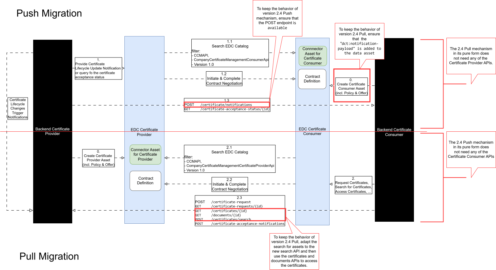

## Migration Guide from version 2.4.0 to version 3.0.0



### Certificate Consumer - Pull Mechanism

The biggest change to the Pull Mechanism is the change from a certificate asset-based approach to an API-based approach.
Certificate Consumers that rely on the Pull Mechanism from Version 2.4.0 migrate to Version 3.0.0 by:
- Connecting to the `POST /certificates/search` endpoint for searching for certificates based on specific criteria 
  (The provider must support the following criteria: `certificateType` or `certifiedLocations`, but only may support more).
- Connecting to the `GET /certificates/{id}` endpoint to retrieve the certificate metadata.
- Connecting to the `GET /documents/{id}` endpoint to retrieve the certificate document.

### Certificate Consumer - Push Mechanism

Certificate Consumers that rely on the Push Mechanism from Version 2.4.0 have two options to migrate to Version 3.0.0:

#### Option 1: Migrate with minimal changes

- Change from the `POST /companycertificate/push` endpoint to `POST /certificate-notifications`
  - Adjust the EDC data asset to the new cx-taxo:CompanyCertificateManagementConsumerApi in version 1.0
    - Add the `property`
      ```json
      {
          "dct:notification-payload": {
            "@id": "true"
          }
      }
      ```
      to the EDC asset.
  - Adjust message processing to new CloudMessage format.

This will ensure that the Cloud Message contains the certificate payload in the `data` field, 
including the `contentBase64` property.

#### Option 2: Migrate and adopt the new changes
- Change from the `POST /companycertificate/push` endpoint to `POST /certificate-notifications`
  - Adjust the EDC data asset to the new cx-taxo:CompanyCertificateManagementConsumerApi in version 1.0
    and do not add the `property` as in Option 1.
  - Adjust message processing to new CloudMessage format.
  - Implement a subsequent call to the Provider `GET /certificates/{id}` and `GET /documents/{id}` on receipt of a 
    notification to retrieve the certificate metadata and document.

This will ensure that the Cloud Message contains only the certificate ID in the `data` field, 
and the certificate payload can be retrieved via API calls to the Provider.