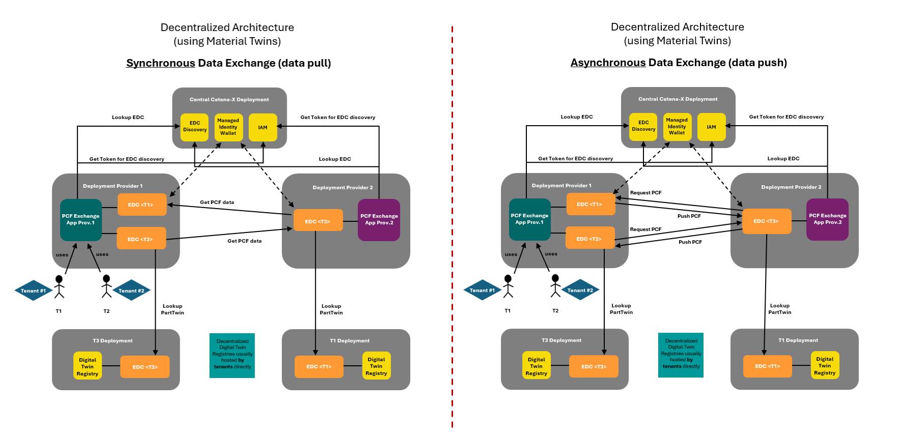
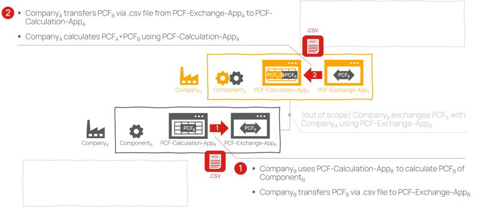
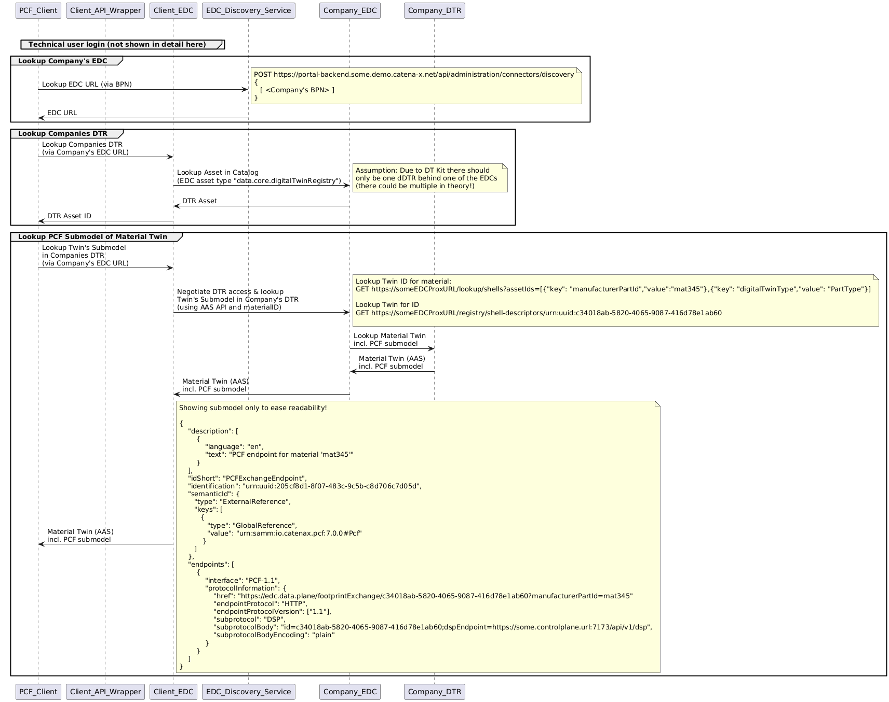
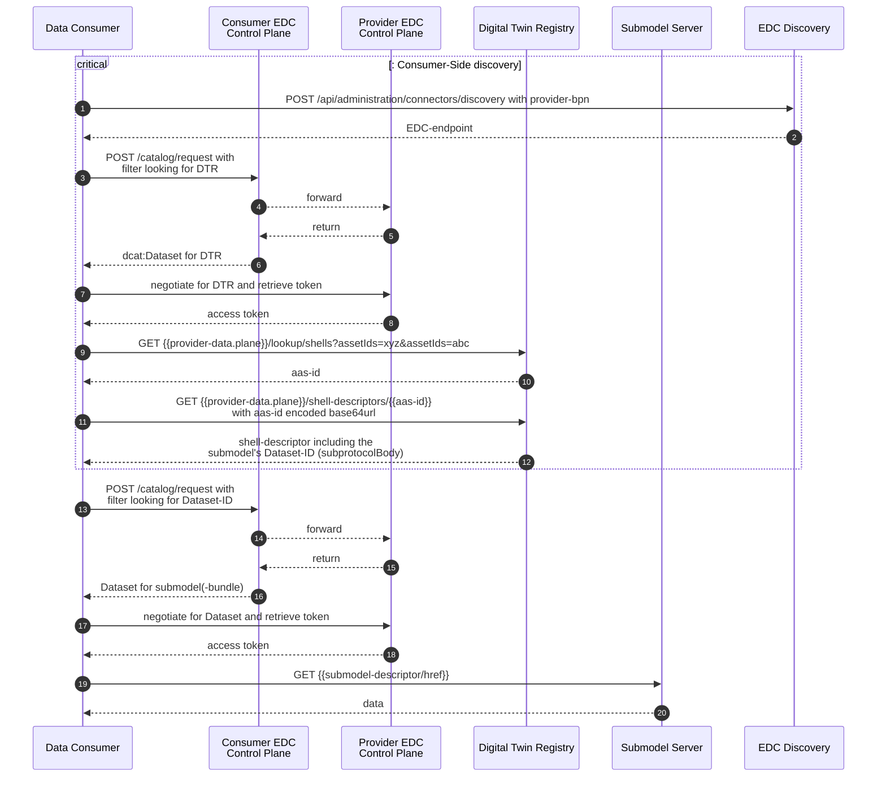
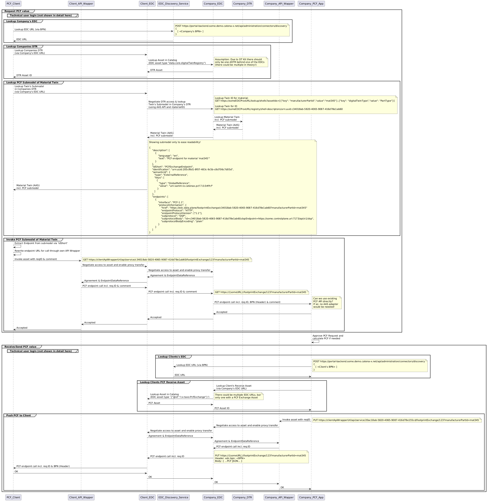
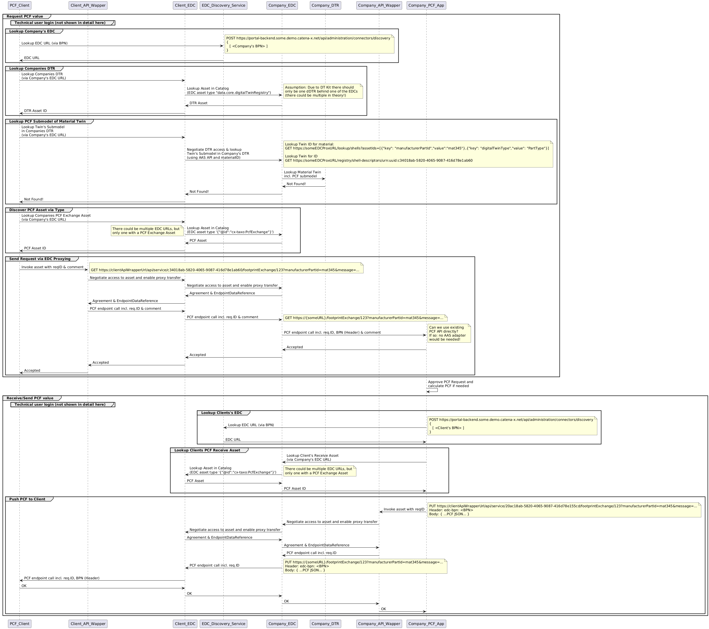
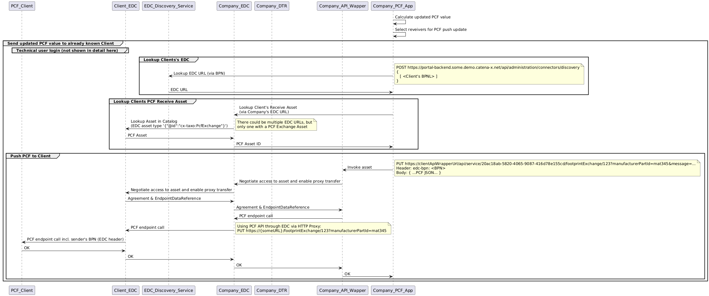

---
tags:
  - CAT/Business Application Provider
  - UC/PCF
---

# CX-0136 Use Case PCF 2.2.1

:::warning

The following standards was identified as not fully **backward compatibility with CX-Jupiter**  and was allowed to apply the required changes through a **fast-track process** to be included in the CX-Saturn release.
These exceptions will be released together with the  *CX-Saturn Go-Live** of all other standards on **25.11**.

**Therefore, this version of the standard is not eligible for certification yet**

:::

## ABSTRACT

This standard focuses on the PCF (Product Carbon Footprint) exchange use case. This includes relevant requirements for:

- data provider, that want to provide PCF data through Catena-X,
- data consumer, that are want to consume PCF values in Catena-X and
- application developer/ provider supporting the provisioning and consuming of PCF values.

It will provide information about the used core components as well as the structure of the Digital Twin Registry entry, the data model exchanged and the EDC (Eclipse Dataspace Connector) data structure.

## FOR WHOM IS THE STANDARD DESIGNED

## 1 INTRODUCTION

In an increasingly environmentally conscious world, the standardized exchange of PCF data is of great importance to promote more sustainable and environmentally friendly production and consumption.
The PCF refers to the amount of Greenhouse Gas (GHG) emissions generated during the manufacture, use and disposal of a product.
The exchange of data between companies in Catena-X makes it possible to measure, compare and reduce the environmental impact of products.

### 1.1 AUDIENCE & SCOPE

> *This section is non-normative*

List for which roles the standard is relevant:

- Data Provider / Consumer
- Business Application Provider

This documents defines how the PCF exchange in Catena-X takes place and which standards needs to fulfill to be interoperable in the Catena-X Network.

### 1.2 CONTEXT AND ARCHITECTURE FIT

> *This section is non-normative*

This document defines the so-called *standardization triangle* for the PCF exchange use case.
Standardization triangle hereby means the mandatory components, data models, APIs etc. that are required to enable the PCF exchange use case.
Additionally, search objects as well as procedures to registering/providing and consuming the data will be defined.

Here you see the architecture overview for **synchronous** and **asynchronous** data exchange:



### 1.3 CONFORMANCE AND PROOF OF CONFORMITY

> *This section is non-normative*

As well as sections marked as non-normative, all authoring guidelines, diagrams, examples, and notes in this specification are non-normative. Everything else in this specification is normative.

The key words **MAY**, **MUST**, **MUST NOT**, **OPTIONAL**, **RECOMMENDED**, **REQUIRED**, **SHOULD** and **SHOULD NOT** in this document document are to be interpreted as described in BCP 14 [RFC2119] [RFC8174] when, and only when, they appear in all capitals, as shown here.

All participants and their solutions will need to prove, that they are conform with the Catena-X standards.
To validate that the standards are applied correctly, Catena-X employs Conformity Assessment Bodies (CABs).

Please refer to: https://catena-x.net/en/catena-x-introduce-implement/certification for the process of conformity assessment and certification.
  
Since this document describes a set of standards to be fulfilled, all participants mentioned MUST fulfill all mentioned standards and the respective conformity assessment criteria in addition to the specific criteria mentioned in this document.

The specific criteria described in this document are describing the usage of the central tools as well as common tools described in the linked standardization documents and therefore compliance should be checked with the tools provided for these components.

The proof of conformity for a single semantic model is done according to the general rules for proving the conformity of data provided to a semantic model or the ability to consume the corresponding data.

In terms of conformity the openAPI specification of the application or endpoints being exposed via the EDC or any similar IDS conformant connector **MUST** be checked against the standardized openAPI specification.

Examples of data assets and contract offer structure in the EDC or any other IDS protocol compliant connector **MUST** correspond to the described structure.

**Disclaimer: The operating model released by the Catena-X association will define the roadmap, content and scope for the certification process.
This will include the roles, certification and further assessment procedures as well as the rollout phases.**

### 1.4 EXAMPLES

> *This section is non-normative*

For examples how to

- Request PCF data (with existing material twin including PCF submodel)
- Request PCF data (without existing material Twin or PCF submodel)
- Respond PCF data
- Update PCF data

please refer to [PCF Kit](https://eclipse-tractusx.github.io/docs-kits/category/product-carbon-footprint-exchange-kit).

### 1.5 TERMINOLOGY

> *This section is non-normative*

The following terms are especially relevant for the understanding of the standard:

**Product Carbon Footprint (PCF)**
The balance of Greenhouse Gas (GHG) emissions along the entire life cycle of a product in a defined application and in relation to a defined unit of use.
The Product Carbon Footprint (PCF) is the most established method for
determining the climate impact of a product. Within the boundary of the Catena-X PCF Rulebook (see [Product Carbon Footprint Rulebook v4.0.0](#211-list-of-standalone-standards)), emissions related to the product use and end-of-life stages are excluded from the PCF.

**Business Partner Number (BPN)**
A BPN is the unique identifier of a partner within Catena-X.
Additional terminology used in this standard can be looked up in the glossary on the association homepage.

**WBCSD Pathfinder**
At the 9th of November 2021, on the Industry Day at the United Nations
Climate Change Conference (COP26) in Glasgow, UK, the Carbon
Transparency Partnership published the Pathfinder Framework, a guidance
for the calculation and exchange of product-level carbon emissions data
across value chains.

The Framework was developed jointly by 35 stakeholders from industry and
the broader decarbonization ecosystem, harnessing WBCSD's role as
co-convenor of the Greenhouse Gas Protocol

The guidance enables companies to better understand carbon emissions on
a granular level, improving business decision-making and helping them
meet their net zero targets.

**Aspect Model**

A formal, machine-readable semantic description (expressed with RDF/turtle) of data accessible from an aspect.

> **Note**
> An Aspect Model must adhere to the Semantic Aspect Meta Model (SAMM), i.e., it utilizes elements and relations defined in the Semantic Aspect Meta Model and is compliant to the validity rules defined by the Semantic Aspect Meta Model, see [CX-0003 SAMM Aspect Meta Model v1.1.0](#211-list-of-standalone-standards).

> **Note**
> Aspect models are logical data models which can be used to detail a conceptual model in order to describe the semantics of runtime data related to a concept. Further, elements of an Aspect model can/should refer to terms of a standardized Business Glossary (if existing).

## 2 RELEVANT PARTS OF THE STANDARD FOR SPECIFIC USE CASES

> *This section is normative*

### 2.1 PCF EXCHANGE

#### 2.1.1 LIST OF STANDALONE STANDARDS

To participate in the CO2 use-case, the following standard MUST be fulfilled:

- [Product Carbon Footprint Rulebook v4.0.0]([https://catenax-ev.github.io/docs/next/non-functional/overview](https://catenax-ev.github.io/docs/non-functional/overview#product-carbon-footprint)

In addition, the following standards are used to support the PCF usecase. Athough they are NOT part of this specification, they are mentioned here, as APIs or other assets provided by them are used within the PCF usecase:

- [CX-0001 EDC Discovery API](https://catenax-ev.github.io/docs/standards/overview)
- [CX-0002 Digital Twins in Catena-X](https://catenax-ev.github.io/docs/standards/overview)
- [CX-0003 SAMM Aspect Meta Model](https://catenax-ev.github.io/docs/standards/overview)
- [CX-0018 Dataspace Connectivity](https://catenax-ev.github.io/docs/standards/overview)
- [CX-0118 Delivery Information Exchange](https://catenax-ev.github.io/docs/standards/overview)
- [CX-0126 Industry Core: Part Type](https://catenax-ev.github.io/docs/standards/overview)
- [CX-0151 Industry Core: Basics](https://catenax-ev.github.io/docs/standards/overview)

#### 2.1.2 ADDITIONAL REQUIREMENTS

##### 2.1.2.1 On Boarding and IAM

All participants mentioned under [1.1 AUDIENCE & SCOPE](#11-audience--scope) MUST be onboarded Catena-X members. Data provider and consumer must in addition be participants of the PCF use case. The standards covering this are NOT part of this document but can all be found within the [Catena-X standard repository](https://catenax-ev.github.io/docs/next/standards/overview).

##### 2.1.2.2 Fetching EDC Endpoints

To find the EDC endpoint addresses of related parties in Catena-X, app provider MUST follow the
[CX-0001 EDC Discovery API](#211-list-of-standalone-standards) standard.

##### 2.1.2.3 Searching for decentralized Digital Twin Registries

To find decentralized Digital Twin Registries of related parties in Catena-X, app provider MUST
follow the [CX-0002 Digital Twins in Catena-X](#211-list-of-standalone-standards) Standard.

##### 2.1.2.4 Registration at the BPN Discovery Service

> **Note**
Not needed for PCF as the BPN is known by the application.

##### 2.1.2.5 Registration of the Digital Twin and the PCF Submodel in the Digital Twin Registry

The PCF use case utilizes Asset Administration Shell (AAS) logic and Material Twins. Therefore Digital Twins SHOULD be registered in the decentralized Digital Twin Registry (DTR). In order to look up the twin ID, the data provider MUST register the twins with digitalTwinType=PartType, and MUST include either the ``manufacturerPartId``, the ``customerPartId``, or both, in the ``specificAssetIds``.

> **Note**
> The following JSON snippet only illustrates which specificAssetIds have to be used. It *cannot* be used as a copy paste template for twin creation! When setting up a digital twin the data provider has to ensure that these entries are visible to all consumers he wants to address by using the corresponding security mechanisms provided with the digital twin registry. For more information, please refer to [CX-0118 Delivery Information Exchange 2.0.0](../CX-0118-ActualDeliveryInformationExchange/CX-0118-ActualDeliveryInformationExchange.md).

```json
    "specificAssetIds": [
        {
            "key": "manufacturerPartId",
            "value": "%%PART-ID%%"
        },
        {
            "key": "customerPartId",
            "value": "%%CUSTOMER-PART-ID%%"
        },
        {
            "key": "digitalTwinType",
            "value": "PartType"
        }
    ],
```

- Data provider also MUST provide an Digital Twin registry API endpoint following the [CX-0002 Digital Twins in Catena-X v2.2.0](#211-list-of-standalone-standards).
- Data provider MUST register the related PCF submodel as shown in the example below.
- The submodel MUST be registered with the ``"idShort": "PCFExchangeEndpoint"``
- The subprotocolBody for PCF exchange MUST be defined like the following description
  
  ``"subprotocolBody": "id=AssetId_of_EDCasset;dspEndpoint=https://some.controlplane.url:7173/api/v1/dsp"``
- The id added to the subprotocolBody SHOULD be a UUIDv4
- The ``href`` definition follows [CX-0002 Digital Twins in Catena-X](#211-list-of-standalone-standards) and MUST have the
  following structure: ``https://edc.data.plane/productIds/mat345`` (URL to use via EDC proxy call to request PCF).

> **Note**
> Replace "edc.data.plane" with the locally needed URL parts to do a EDC proxy call.

```json
{
    "description": [
        {
            "language": "en",
            "text": "PCF endpoint for material 'mat345'"
        }
    ],
    "idShort": "PCFExchangeEndpoint",
    "identification": "urn:uuid:205cf8d1-8f07-483c-9c5b-c8d706c7d05d",
    "semanticId":{
      "type": "ExternalReference",
      "keys": [
        {
          "type": "GlobalReference",
          "value": "urn:samm:io.catenax.pcf:8.0.0#Pcf"
        }
      ]
    },
    "endpoints": [
        {
            "interface": "PCF-1.1",
            "protocolInformation": {
                "href": "https://edc.data.plane/productIds/mat345",
                "endpointProtocol": "HTTP",
                "endpointProtocolVersion": ["1.1"],
                "subprotocol": "DSP",
                "subprotocolBody": "id=c34018ab-5820-4065-9087-416d78e1ab60;dspEndpoint=https://some.controlplane.url:7173/api/v1/dsp",
                "subprotocolBodyEncoding": "plain"
            }
        }
    ]
}
```

##### 2.1.2.6 Requesting a PCF without an existing Digital Twin or PCF submodel

In case no Digital Twin or PCF submodel is registered (yet), the asset to use is identified by its type (``{"@id":"cx-taxo:PCFExchange"}``).

##### 2.1.2.7 EDC Data Asset Structure

###### 2.1.2.7.1 EDC Data Asset

The PCF asset MUST be registered as defined below (Management API v3):

```json
{
    "@context": {
        "edc": "https://w3id.org/edc/v0.0.1/ns/",
        "odrl": "http://www.w3.org/ns/odrl/2/",
        "dcat": "http://www.w3.org/ns/dcat#",
        "dct": "http://purl.org/dc/terms/",
        "rdfs": "http://www.w3.org/2000/01/rdf-schema#",
        "cx-taxo": "https://w3id.org/catenax/taxonomy#",
        "cx-common": "https://w3id.org/catenax/ontology/common#",
        "aas-semantics": "https://admin-shell.io/aas/3/0/HasSemantics/"
    },
    "@id": "c34018ab-5820-4065-9087-416d78e1ab60",
    "@type": "edc:Asset",
    "edc:properties": {
        "rdfs:label": "PCF Data",
        "rdfs:comment": "Endpoint for PCF data",
        "cx-common:version": "1.1",
        "aas-semantics:semanticId": {"@id":"urn:samm:io.catenax.pcf:8.0.0#Pcf"},
        "edc:contentType": "application/json",
        "dct:type": {"@id":"cx-taxo:PcfExchange"}
    },
    "edc:dataAddress": {
        "edc:type": "HttpData",
        "edc:baseUrl": "https://some.url/service",
        "edc:proxyBody": "true",
        "edc:proxyPath": "true",
        "edc:proxyQueryParams": "true",
        "edc:proxyMethod": "true",
        "edc:contentType": "application/json"
    }
}
```

The following values MUST be present as EDC asset properties:

- ``aas-semantics:semanticId``: MUST contain the value: ``"urn:samm:io.catenax.pcf:8.0.0#Pcf"``
- ``cx-common:version``: MUST contain the value: ``"1.1"``
- ``dct:type``: MUST follow the schema: ``{"@id":"cx-taxo:PCFExchange"}``

The following attributes MUST be set within the ``edc:dataAddress`` section:

- ``edc:type``: MUST contain the value: ``"edc:HttpData"``
- ``edc:proxyBody``: MUST contain the value: ``"true"``
- ``edc:proxyPath``: MUST contain the value: ``"true"``
- ``edc:proxyQueryParams``: MUST contain the value: ``"true"``
- ``edc:proxyMethod``: MUST contain the value: ``"true"``
- ``edc:contentType``: MUST contain the value: ``"application/json"``

The requester of an asset MUST be able to handle multiple assets for this endpoint, being differentiated only by the version. The requester SHOULD choose the asset with the highest compatible version number implemented by themselves. If the requester cannot find a compatible version with their own, the requester MUST terminate the data transfer.

###### 2.1.2.7.2 EDC Policy Structure

A participant mentioned under [1.1 AUDIENCE & SCOPE](#11-audience--scope) MUST agree to the overall
[Catena-X Terms and Condition](https://catena-x.net/en/catena-x-introduce-implement/governance-framework-for-data-space-operations)
as well as the general FrameworkAgreement
 [Data Exchange Governance](https://catenax-ev.github.io/docs/next/regulatory-framework/20000ft/data-exchange-governance).
This follows the first SSI setup originally released with Catena-X Rel. 3.2. For more details see the [corresponding standards](https://catenax-ev.github.io/docs/standards/overview) which are NOT part of this document.

The minimum set of **Membership**, the PCF **FrameworkAgreement** and the **UsagePurpose**
MUST to be added to the asset:

```json
{
"@context": [
    "http://www.w3.org/ns/odrl.jsonld",
    "https://w3id.org/catenax/2025/9/policy/context.jsonld"
  ],
  "@type": "Set",
  "@id": "some-id",
  "permission": [
      {
       "action": "use",
       "constraint": [
           {
               "and": [
                   {
                      "leftOperand": "FrameworkAgreement",
                      "operator": "eq",
                      "rightOperand": "DataExchangeGovernance:1.0"
                    },
                    {
                        "leftOperand": "Membership",
                        "operator": "eq",
                        "rightOperand": "active"
                   },
                   {
                        "leftOperand": "UsagePurpose",
                        "operator": "isAnyOf",
                        "rightOperand": "cx.pcf.base:1"
                    } 
                ]
            }
          ]   
        }
    ]
}
```

In addition, references to bilateral contracts can be added to the policy definition. For more details on how to do this, please refer to the [PCF Kit](https://eclipse-tractusx.github.io/docs-kits/category/product-carbon-footprint-exchange-kit). For further details on policy structure and the usage of verifiable credentials please refer paragraph [2.1.3](#213-policy-constraints-for-data-exchange).

###### 2.1.2.7.3 Contract Definition

Contract definitions of data providers MUST follow the structure below (also defined in [CX-0018 Dataspace Connectivity](#211-list-of-standalone-standards)):

```json
{
    "@id": "54ef3326-42b2-4221-8c5a-3a6270d54db8",
    "edc:accessPolicyId": "a343fcbf-99fc-4ce8-8e9b-148c97605aab",
    "edc:contractPolicyId": "a343fcbf-99fc-4ce8-8e9b-148c97605aab",
    "edc:assetsSelector":[
        {
            "@type": "Criterion",
            "edc:operandLeft": "@id",
            "edc:operator": "=",
            "edc:operandRight": "c34018ab-5820-4065-9087-416d78e1ab60"
        }
    ]
}
```

##### 2.1.2.8 Data Exchange

The PCF use case supports synchronous and asynchronous data exchange. In case an asynchronous data exchange is needed, app provider MUST follow the API definition specification in [4.1 PCF EXCHANGE API](#41-pcf-exchange-api). The exchanged data follows the standardized data model defind in [3.1 ASPECT MODEL PCF](#31-aspect-model-pcf).

#### 2.1.3 POLICY CONSTRAINTS FOR DATA EXCHANGE

In alignment with our commitment to data sovereignty, a specific framework governing the utilization of data within the Catena-X use cases has been outlined.  As part of this data sovereignty framework, conventions for access policies, for usage policies and for the constraints contained in the policies have been specified in standard 'CX-0152 Policy Constraints for Data Exchange'. This standard document CX-0152 **MUST** be followed when providing services or apps for data sharing/consuming and when sharing or consuming data in the Catena-X ecosystem. What conventions are relevant for what roles named in [1.1 AUDIENCE & SCOPE](#11-audience--scope) is specified in the CX-0152 standard document as well. CX-0152 can be found in the [standard library](https://catenax-ev.github.io/docs/standards/overview).

> **Note**
> In case of an asynchronous data exchange (data push) the access policies are not required to be restricted for a specific BPNL (PCF values are exchanged via the request and response process, is using public endpoints as specified in this specification, see [2.1 PCF EXCHANGE](#21-pcf-exchange)).

### 2.2 PCF CALCULATION TOOL INTEGRATION

This section specifies the integration of PCF calculation solutions in a way that application providers can integrate their solutions in Catena-X. For interoperability, business applications with functionalities for calculation of PCF data need to follow this specification.

#### 2.2.1 CONTEXT AND ARCHITECTURE FIT FOR PCF CALCULATION TOOL INTEGRATION

> *This section is non-normative*

This documents shows

- how PCF values are calculated in a Catena-X compliant manner
- how PCF data in Catena-X can be transferred between PCF Calculation and PCF Exchange tools
- which standards needs to be fulfilled in context of PCF calculation integration in order to be interoperable in the Catena-X network

The following scenario describes, how

- a supplier
  - calculates the PCF for his component
  - transfers the calculation result to the PCF exchange solution
  - provides the PCF to his customer
- a customer
  - consumes the PCF from his supplier
  - transfers the calculation result from his supplier to the PCF calculation tool
  - uses the suppliers calculation result for his PCF calculation



#### 2.2.2 EXAMPLES FOR PCF CALCULATION TOOL INTEGRATION

> *This section is non-normative*

Section [2.2.4 PCF DATA FORMAT FOR PCF CALCULATION INTEGRATION](#224-pcf-data-format-for-pcf-calculation-integration) describes the relevant data structure in context of integrating PCF calculationtools in Catena-X. An exemplary data set based on this specification can be found here: [CSV Example](./assets/PCF_Data_Model_Specification_for_Calculation_(Example).csv).

#### 2.2.3 PCF CALCULATION METHODOLOGY

> *This section is normative*

The methodology used for calculating a PCF MUST be conformant with [Product Carbon Footprint Rulebook](#211-list-of-standalone-standards).

#### 2.2.4 PCF DATA FORMAT FOR PCF CALCULATION INTEGRATION

> *This section is normative*

For the integration of PCF calculation solutions, the data format is derived from the standard PCF data model as described in section [ASPECT MODEL PCF](#31-aspect-model-pcf), though in integration context some individual properties are not mandatory but can be specified optionally.

The data format for the integration of PCF calculation solutions in Catena-X MUST be conformant to the specification defined in [Product Carbon Footprint Rulebook](#211-list-of-standalone-standards).

#### 2.2.5 PCF CALCULATION DATA EXCHANGE

> *This section is non-normative*

To prove conformity with the PCF calculation tool integration standard, the following criteria SHOULD be applied:

- The PCF calculation tool SHOULD provide the capability to
  - export calculation results in CSV format as described in section [2.2.4 PCF DATA FORMAT FOR PCF CALCULATION INTEGRATION](#224-pcf-data-format-for-pcf-calculation-integration)
  - import PCF values in CSV format as described in section [2.2.4 PCF DATA FORMAT FOR PCF CALCULATION INTEGRATION](#224-pcf-data-format-for-pcf-calculation-integration)
- The PCF exchange tool SHOULD provide the capability to
  - import calculation results in CSV format as described in section [2.2.4 PCF DATA FORMAT FOR PCF CALCULATION INTEGRATION](#224-pcf-data-format-for-pcf-calculation-integration)
  - export PCF values in CSV format as described in section [2.2.4 PCF DATA FORMAT FOR PCF CALCULATION INTEGRATION](#224-pcf-data-format-for-pcf-calculation-integration)

A template in CSV format can be found here: [CSV Template](./assets/PCF_Data_Model_Specification_for_Calculation.csv)

## 3 ASPECT MODELS

> *This section is normative*

### 3.1 ASPECT MODEL PCF

#### 3.1.1 INTRODUCTION

This section describes the PCF data model, which is the basis for the interoperable exchange of PCF values along the supply chain. The PCF data model defines the common format of a PCF value. Applications which allow the exchange of PCF data need to implement the PCF data model as specified as follows.

#### 3.1.2 SPECIFICATIONS ARTIFACTS

The PCF aspect model is written in SAMM 2.1.0 as a modeling language conformant to [CX-0003 SAMM Aspect Meta Model](#211-list-of-standalone-standards) as input for the semantic driven workflow.
Like all Catena-X data models, the PCF model is available in machine-readable format on GitHub conformant to [CX-0003 SAMM Aspect Meta Model](#211-list-of-standalone-standards).

#### 3.1.3 LICENSE

The Catena-X PCF data model is made available under the terms of the Creative Commons Attribution 4.0 International (CC-BY-4.0) license, which is available at Creative Commons.

#### 3.1.4 IDENTIFIER OF SEMANTIC MODEL

The semantic model has the unique identifier

> urn:samm:io.catenax.pcf:8.0.0

This identifier MUST be used by the data provider to define the semantics of the data being transferred.

#### 3.1.5 FORMATS OF SEMANTIC MODEL

All different formats of the semantic model can be found in the github repository.

https://github.com/eclipse-tractusx/sldt-semantic-models/tree/main/io.catenax.pcf/8.0.0

##### 3.1.5.1 RDF TURTLE

The RDF (Resource Description Framework) Turtle file, an instance of the Semantic Aspect Meta Model, is the master for generating additional file formats and serializations.

https://github.com/eclipse-tractusx/sldt-semantic-models/tree/main/io.catenax.pcf/8.0.0/Pcf.ttl

The open source command line tool of the Eclipse Semantic Modeling Framework is used for generation of other file formats like for example a JSON Schema, aasx for Asset Administration Shell Submodel Template or a HTML documentation. These other formats are saved in the "gen" folder in github.

##### 3.1.5.2 JSON SCHEMA

A JSON Schema can be generated from the RDF Turtle file. The JSON Schema defines the value-only
payload of the Asset Administration Shell for the API operation "GetSubmodel".

https://github.com/eclipse-tractusx/sldt-semantic-models/tree/main/io.catenax.pcf/8.0.0/gen/Pcf-schema.json

##### 3.1.5.3 AASX

An AASX file can be generated from the RDF Turtle file. The AASX file defines one of the requested artifacts for a Submodel Template Specification conformant to [SMT](#62-non-normative-references).

https://github.com/eclipse-tractusx/sldt-semantic-models/tree/main/io.catenax.pcf/8.0.0/gen/Pcf.aasx

##### 3.1.5.4 HTML

An HTML documentation of the PCF data model can be generated from the RDF Turtle file.

https://github.com/eclipse-tractusx/sldt-semantic-models/tree/main/io.catenax.pcf/8.0.0/gen/Pcf.html

#### 3.1.6 EXAMPLES

For an exemplary JSON payload based on the PCF data model see [Pcf.json](./assets/Pcf.json).

## 4 APPLICATION PROGRAMMING INTERFACES

> *This section is normative*

### 4.1 PCF EXCHANGE API FOR ASYNCHRONOUS DATA EXCHANGE

#### 4.1.1 PRECONDITIONS AND DEPENDENCIES

For asynchronous data exchange (data push) the PCF exchange API MUST be published towards the network using a data
asset/contract offer in terms of the DSP protocol.

Furthermore, the participants of these use case MUST follow the [CX-0001 EDC Discovery API](#211-list-of-standalone-standards) to find the relevant EDC Endpoints.

#### 4.1.2 API SPECIFICATION

##### 4.1.2.1 API Endpoints & resources

The PCF exchange API MUST be implemented as specified in the openAPI
documentation as stated [here](./assets/catena-x-pcf-endpoint-1_1_2.yaml)

The following two API SHOULD be provided as they reflect a revised version of requesting and responding to PCF exchange requests:

```text
GET https://\{someURL\}/footprintExchange/123?manufacturerPartId=456&customerPartId=789&message=...
```

```text
PUT https://\{someURL\}footprintExchange/123?message=...&update=false
```

- The caller's BPN is available through the HTTP header ``Edc-Bpn``.
- When sending a PCF exchange request, the ``requestId`` is *mandatory* in the ``GET`` call. Further, at least one of ``manufacturerPartId`` or ``customerPartId`` MUST be provided
- When responding to a PCF exchange request the ``requestId`` is *mandatory* in the ``PUT`` call.

> **Note:**

> To ensure backwards compatibility, the following API, albeit being deprecated, remain valid and MAY be used for one year after this current release:

> ```text
> GET https://\{someURL\}/productIds/mat345?requestId=123&message=...
> ```

> ```text
> PUT https://\{someURL\}/productIds/mat345?requestId=123
> ```

> - The caller's BPN is available through the HTTP header ``Edc-Bpn``.
> - When responding to a PCF exchange request the ``requestId`` is *mandatory* in the PUT call.
> - When sharing a PCF update the ``requestId`` is *NOT allowed* in the PUT call.
>
> **Note:**
> Before the PCF data can be pushed back to the requester the data provider needs again to search for the EDC Endpoint of the requester following the EDC Discovery Service API! [CX-0001 EDC Discovery API](#211-list-of-standalone-standards)

#### 4.1.2.2 Available Data Types

The PCF exchange API MUST use JSON as the payload is transferred via
HTTP.

#### 4.1.2.3 API recourses & endpoints

The HTTP GET and PUT endpoints introduced in this standard SHOULD NOT be
called from a participant of the use case directly. Rather, they MUST be
called via the EDC communication. Therefore, the endpoint MUST be
offered as EDC Data asset following [2.1.2.7 EDC Data Asset Structure](#2127-edc-data-asset-structure).

##### 4.1.2.4 Error Handling

HTTP standard response codes MUST be used.

###### 4.1.2.4.1 Error Messages & Explanation

The following http codes MUST be defined for HTTP GET endpoint to
request a defined PCF dataset.

- Code 202: Accepted

The following http codes MUST be defined for HTTP PUT endpoint to send a
defined PCF dataset back to the quested consumer.

- Code 200: OK

### 4.2 PCF EXCHANGE API FOR SYNCHRONOUS DATA EXCHANGE

The PCF exchange API for synchronous data exchange MUST be implemented according to Industry Core Standard CX-0151 [here](https://github.com/catenax-eV/product-standardization-prod/blob/main/standards/CX-0151-IndustryCoreBasics/CX-0151-IndustryCoreBasics.md#4-application-programming-interfaces).

## 5 PROCESSES

> *This section is normative*

The API wrapper shown in the following sequences is an optional component encapsulating the communication logic. This logic can also be implemented directly within the data exchange app.

### 5.1 EDC DISCOVERY AND DTR ACCESS



### 5.2 PCF REQUEST THROUGH AN EXISTING MATERIAL TWIN WITH A CORRESPONDING PCF RESPONSE

For synchronous data exchange (data pull):



For asynchronous data exchange (data push):



### 5.3 PCF REQUEST WITHOUT AN EXISTING MATERIAL TWIN OR SUBMODEL WITH A CORRESPONDING PCF RESPONSE



### 5.4 PUSHING A PCF UPDATE WITHOUT AN ADDITIONAL PCF REQUEST



## 6 REFERENCES

### 6.1 NORMATIVE REFERENCES

> *This section is normative*

see [2.1.1](#211-list-of-standalone-standards)

### 6.2 NON-NORMATIVE REFERENCES

> *This section is non-normative*
>
- How to create a submodel template specification. Guideline. Download from:https://industrialdigitaltwin.org/wp-content/uploads/2022/12/I40-IDTA-WS-Process-How-to-write-a-SMT-FINAL-.pdf

### 6.3 REFERENCE IMPLEMENTATIONS

> *This section is non-normative*

Currently there is no reference FOSS implementation. For information about available solutions please consult the [PCF Kit](https://eclipse-tractusx.github.io/docs-kits/category/product-carbon-footprint-exchange-kit).

## ANNEXES

### FIGURES

> *This section is non-normative*

### TABLES

> *This section is non-normative*
