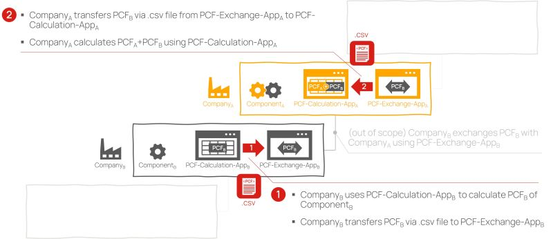
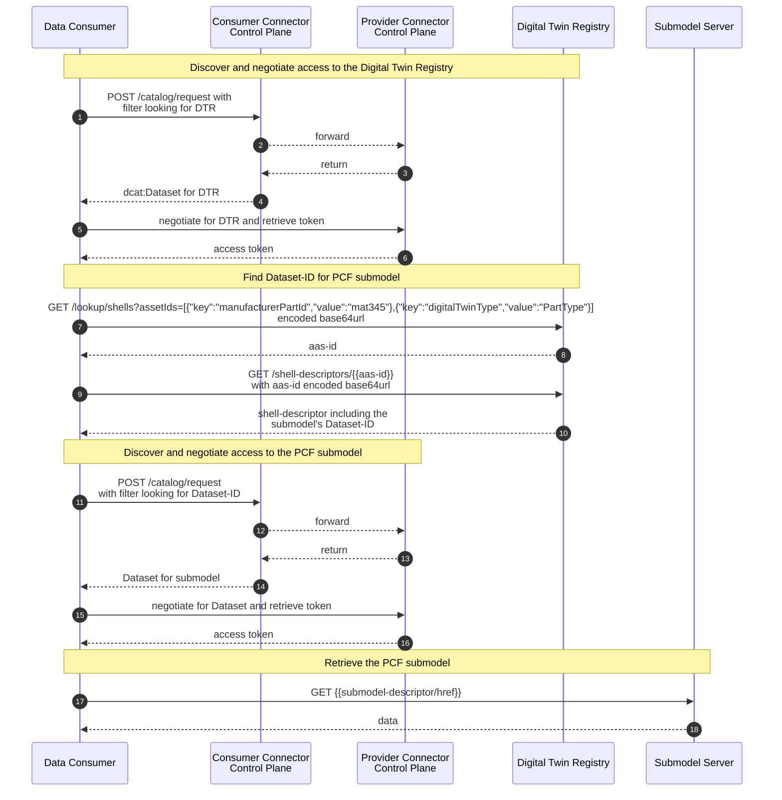
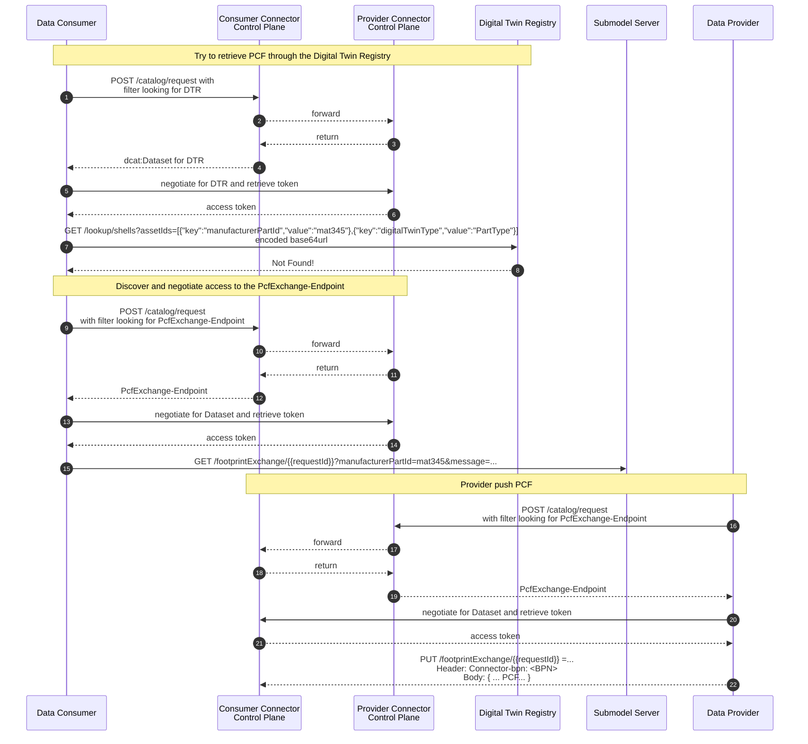
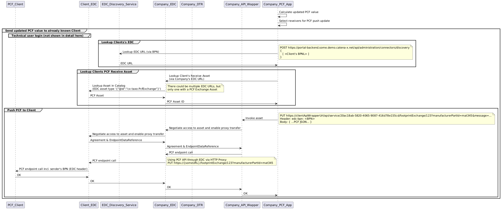

---
tags:
  - CAT/Business Application Provider
  - UC/PCF
---

# CX-0136 Use Case PCF 3.0.0

## ABSTRACT

This standard defines the basic rules and interoperability requirements to participate in the Product Carbon Footprint (PCF) exchange use case in Catena-X.

The use case builds on underlying Catena-X standards and specifies the PCF-use-case-specific requirements that are not covered there. In particular, this standard defines requirements for PCF data exchange (synchronous and asynchronous), Digital Twin and PCF submodel registration, the exchanged PCF data model, and the required connector asset and policy conventions.

## FOR WHOM IS THE STANDARD DESIGNED

This standard is designed for all participants and solution providers implementing the PCF exchange use case in Catena-X, in particular:

- Data Providers that publish PCF data via Catena-X-compliant interfaces and assets
- Data Consumers that request and process PCF data via Catena-X-compliant interfaces and assets
- Business Application Providers that implement interoperable PCF exchange capabilities for data provisioning and consumption

## 1 INTRODUCTION

In an increasingly environmentally conscious world, the standardized exchange of PCF data is of great importance to promote more sustainable and environmentally friendly production and consumption.
The PCF refers to the amount of Greenhouse Gas (GHG) emissions generated during the manufacture, use and disposal of a product.
The exchange of data between companies in Catena-X makes it possible to measure, compare and reduce the environmental impact of products.

### 1.1 AUDIENCE & SCOPE

> *This section is non-normative*

This standard is relevant for the following roles:

- Data Provider / Consumer
- Business Application Provider

This document defines how PCF data exchange is implemented in Catena-X and which standards must be fulfilled to ensure interoperability in the Catena-X network.

### 1.2 CONTEXT AND ARCHITECTURE FIT

> *This section is non-normative*

This document defines the so-called *standardization triangle* for the PCF exchange use case.
Standardization triangle hereby means the mandatory components, data models, APIs etc. that are required to enable the PCF exchange use case.
Additionally, search objects as well as procedures to registering/providing and consuming the data will be defined.

Here you see the architecture overview for **synchronous** and **asynchronous** data exchange:

### 1.3 CONFORMANCE AND PROOF OF CONFORMITY

> *This section is non-normative*

All sections explicitly marked as non-normative, as well as all authoring guidelines, diagrams, examples, and notes in this specification, are non-normative. All remaining content of this specification is normative.

The key words **MAY**, **MUST**, **MUST NOT**, **OPTIONAL**, **RECOMMENDED**, **REQUIRED**, **SHOULD** and **SHOULD NOT** in this document are to be interpreted as described in BCP 14 [RFC2119] [RFC8174] when, and only when, they appear in all capitals, as shown here.

All participants and their solutions will need to prove that they are compliant with the Catena-X standards.
To validate that the standards are applied correctly, Catena-X employs Conformity Assessment Bodies (CABs).

Please refer to: https://catena-x.net/en/catena-x-introduce-implement/certification for the process of conformity assessment and certification.
  
Since this document describes a set of standards to be fulfilled, all participants mentioned **MUST** fulfill all mentioned standards and the respective conformity assessment criteria in addition to the specific criteria mentioned in this document.

The specific criteria described in this document describe the usage of the central tools as well as common tools described in the linked standardization documents and therefore compliance should be checked with the tools provided for these components.

The proof of conformity for a single semantic model is done according to the general rules for proving the conformity of data provided to a semantic model or the ability to consume the corresponding data.

In terms of conformity, the OpenAPI specification of the application or endpoints being exposed via a connector or any similar IDS-conformant connector **MUST** be checked against the standardized OpenAPI specification.

Examples of data assets and contract offer structure in a connector or any other IDS protocol-compliant connector **MUST** correspond to the described structure.

**Disclaimer: The operating model released by the Catena-X association will define the roadmap, content and scope for the certification process.
This will include the roles, certification and further assessment procedures as well as the rollout phases.**

### 1.4 EXAMPLES

> *This section is non-normative*

For examples how to

- Retrieve PCF data (with existing material twin including PCF submodel)
- Request PCF data (without existing material Twin or PCF submodel)
- Respond PCF data
- Update PCF data

please refer to [PCF Kit](https://eclipse-tractusx.github.io/docs-kits/category/product-carbon-footprint-exchange-kit).

### 1.5 TERMINOLOGY

> *This section is non-normative*

The following terms are especially relevant for the understanding of the standard:

**Product Carbon Footprint (PCF)**
The balance of Greenhouse Gas (GHG) emissions along the entire life cycle of a product in a defined application and in relation to a defined unit of use.
The Product Carbon Footprint (PCF) is the most established method for
determining the climate impact of a product. Within the boundary of the Catena-X PCF Rulebook (see [Product Carbon Footprint Rulebook](#211-list-of-standalone-standards)), emissions related to the product use and end-of-life stages are excluded from the PCF.

**Business Partner Number (BPN)**
A BPN is the unique identifier of a partner within Catena-X.
Additional terminology used in this standard can be looked up in the glossary on the association homepage.

**Material Twin**
In the context of this standard, a Material Twin is used with the same meaning as a Part Type as defined in [CX-0126 Industry Core: Part Type](https://catenax-ev.github.io/docs/standards/overview).

**WBCSD Pathfinder**
At the 9th of November 2021, on the Industry Day at the United Nations
Climate Change Conference (COP26) in Glasgow, UK, the Carbon
Transparency Partnership published the Pathfinder Framework, a guidance
for the calculation and exchange of product-level carbon emissions data
across value chains.

The Framework was developed jointly by 35 stakeholders from industry and
the broader decarbonization ecosystem, harnessing WBCSD's role as
co-convenor of the Greenhouse Gas Protocol

The guidance enables companies to better understand carbon emissions on
a granular level, improving business decision-making and helping them
meet their net zero targets.

**Aspect Model**

A formal, machine-readable semantic description (expressed with RDF/turtle) of data accessible from an aspect. Aspect models are logical data models which can be used to detail a conceptual model in order to describe the semantics of runtime data related to a concept. Further, elements of an Aspect model can/should refer to terms of a standardized Business Glossary (if existing).
The mandatory semantic modeling framework and conventions are defined in [CX-0003 SAMM Aspect Meta Model](#211-list-of-standalone-standards).

**PCF Exchange API**

The Catena-X API used for asynchronous PCF exchange between Data Consumers and Data Providers. In this standard, "PCF Exchange API" refers to the versioned API specification defined in section [4.1 PCF EXCHANGE API FOR ASYNCHRONOUS DATA EXCHANGE](#41-pcf-exchange-api-for-asynchronous-data-exchange).

## 2 RELEVANT PARTS OF THE STANDARD FOR SPECIFIC USE CASES

> *This section is normative*

### 2.1 PCF EXCHANGE

#### 2.1.1 LIST OF STANDALONE STANDARDS

To participate in the CO2 use-case, the following standard **MUST** be fulfilled:

- [Product Carbon Footprint Rulebook V4](https://catenax-ev.github.io/docs/next/non-functional/overview)

CX-0136 is built on top of the following underlying standards, which provide the general interoperability framework for the PCF use case and therefore need to be followed. This specification focuses only on PCF use-case-specific topics that are not already described in those underlying standards:

- [CX-0002 Digital Twins in Catena-X](https://catenax-ev.github.io/docs/standards/CX-0002-DigitalTwinsInCatenaX)
- [CX-0018 Dataspace Connectivity](https://catenax-ev.github.io/docs/standards/CX-0018-DataspaceConnectivity)
- [CX-0126 Industry Core: Part Type](https://catenax-ev.github.io/docs/standards/CX-0126-IndustryCorePartType)
- [CX-0152 Policy Constraints For Data Exchange](https://catenax-ev.github.io/docs/standards/CX-0152-PolicyConstrainsForDataExchange)

> **Note**
Per Catena-X convention, the valid versions of the referenced underlying standards are the versions that are part of the current Catena-X release.

#### 2.1.2 ADDITIONAL REQUIREMENTS

The following requirements specify additional interoperability conditions for participants implementing the PCF exchange use case.

##### 2.1.2.1 On Boarding and IAM

All participants mentioned under [1.1 AUDIENCE & SCOPE](#11-audience--scope) **MUST** be onboarded Catena-X members. Data provider and consumer must in addition be participants of the PCF use case. The standards covering this are NOT part of this document but can all be found within the [Catena-X standard repository](https://catenax-ev.github.io/docs/next/standards/overview).

##### 2.1.2.2 Searching for decentralized Digital Twin Registries

To find decentralized Digital Twin Registries of related parties in Catena-X, [CX-0002 Digital Twins in Catena-X](#211-list-of-standalone-standards) **MUST** be followed.

##### 2.1.2.3 Registration of the Digital Twin and the PCF Submodel in the Digital Twin Registry

The PCF use case utilizes Asset Administration Shell (AAS) logic and Material Twins. Therefore Digital Twins **MUST** be registered in the decentralized Digital Twin Registry (DTR). In order to look up the twin ID, the data provider **MUST** register the twins according to  [CX-0126 Industry Core: Part Type](https://catenax-ev.github.io/docs/standards/overview).

> **Note**
> In this standard, the term "Material Twin" is used with the same meaning as "Part Type" as defined in [CX-0126 Industry Core: Part Type](https://catenax-ev.github.io/docs/standards/overview).

- Data provider **MUST** provide a Digital Twin Registry API endpoint following  [CX-0002 Digital Twins in Catena-X](#211-list-of-standalone-standards).

- Data provider **MUST** register their Digital Twins and submodels following  [CX-0002 Digital Twins in Catena-X](#211-list-of-standalone-standards).

##### 2.1.2.4 Requesting a PCF without an existing Digital Twin or PCF submodel

In case no Digital Twin or PCF submodel is registered (yet), a Data Consumer **MAY** send a request to the Data Provider by using PCF Exchange API v1.3.0.
The requester of an asset **MUST** be able to handle multiple assets for this endpoint, being differentiated only by the version. The requester **SHOULD** choose the asset with the highest compatible version number implemented by themselves. If the requester cannot find a compatible version with their own, the requester **MUST** terminate the data transfer.

##### 2.1.2.5 Connector Data Asset Structure

###### 2.1.2.5.1 Connector Data Asset for PCF Exchange API v1.3.0

The connector data asset representing the PCF Exchange API v1.3.0 **MUST** be registered following [CX-0018 Dataspace Connectivity](https://catenax-ev.github.io/docs/standards/overview)

The following values **MUST** be present as connector asset properties:

- ``cx-common:version``: **MUST** contain the value: ``"1.3.0"``
- ``dct:type``: **MUST** follow the schema: ``{"@id":"cx-taxo:PcfExchange"}``

###### 2.1.2.5.2 Connector Policy Structure

A participant mentioned under [1.1 AUDIENCE & SCOPE](#11-audience--scope) **MUST** agree to the overall
[Catena-X Terms and Condition](https://catena-x.net/en/catena-x-introduce-implement/governance-framework-for-data-space-operations)
as well as the general FrameworkAgreement
 [Data Exchange Governance](https://catenax-ev.github.io/docs/next/regulatory-framework/20000ft/data-exchange-governance).
This follows the first SSI setup originally released with Catena-X Rel. 3.2. For more details see the [corresponding standards](https://catenax-ev.github.io/docs/standards/overview) which are NOT part of this document.

The connector policies **MUST** follow [CX-0152 Policy Constraints For Data Exchange](https://catenax-ev.github.io/docs/standards/overview)

The Usage Policy **MUST** use the Usage Purpose ``cx.pcf.base:1`` for both the PCF Exchange API v1.3.0 as well as for submodel data offers.

In addition, references to bilateral contracts **MAY** be added to the policy definition. For more details on how to do this, please refer to the [PCF Kit](https://eclipse-tractusx.github.io/docs-kits/category/product-carbon-footprint-exchange-kit).

###### 2.1.2.5.3 Contract Definition

Contract definitions of data providers **MUST** follow [CX-0018 Dataspace Connectivity](#211-list-of-standalone-standards)

##### 2.1.2.6 Data Exchange

The PCF use case supports synchronous and asynchronous data exchange.
For asynchronous data exchange, application providers **MUST** follow the API definition specification in [4.1 PCF EXCHANGE API](#41-pcf-exchange-api-for-asynchronous-data-exchange).
The exchanged data **MUST** follow the standardized data model defined in [3 ASPECT MODELS](#3-aspect-models).

> **Explanation (non-normative):**
> In **synchronous** PCF exchange (data pull), the Data Consumer retrieves PCF values on demand by resolving the material twin and then fetching the value-only payload via the Connector-mediated submodel `href`. The response is returned directly within the same request flow.
>
> In **asynchronous** PCF exchange (data push), the Data Consumer first sends a PCF request and the Data Provider returns the PCF payload later via the PCF Exchange API v1.3.0. This mode is useful when data is not immediately available and needs to be prepared before delivery.

### 2.2 PCF CALCULATION TOOL INTEGRATION

This section specifies the integration of PCF calculation solutions in a way that application providers can integrate their solutions in Catena-X. For interoperability, business applications with functionalities for calculation of PCF data need to follow this specification.

#### 2.2.1 CONTEXT AND ARCHITECTURE FIT FOR PCF CALCULATION TOOL INTEGRATION

> *This section is non-normative*

This document shows

- how PCF values are calculated in a Catena-X compliant manner
- how PCF data in Catena-X can be transferred between PCF Calculation and PCF Exchange tools
- which standards need to be fulfilled in context of PCF calculation integration in order to be interoperable in the Catena-X network

The following scenario describes, how

- a supplier
  - calculates the PCF for his component
  - transfers the calculation result to the PCF exchange solution
  - provides the PCF to his customer
- a customer
  - consumes the PCF from his supplier
  - transfers the calculation result from his supplier to the PCF calculation tool
  - uses the suppliers calculation result for his PCF calculation

#### 2.2.2 EXAMPLES FOR PCF CALCULATION TOOL INTEGRATION

> *This section is non-normative*

Section [2.2.4 PCF DATA FORMAT FOR PCF CALCULATION INTEGRATION](#224-pcf-data-format-for-pcf-calculation-integration) describes the relevant data structure in context of integrating PCF calculationtools in Catena-X. An exemplary data set based on this specification can be found here: [CSV Example](./assets/PCF_Data_Model_Specification_for_Calculation_(Example).csv).

#### 2.2.3 PCF CALCULATION METHODOLOGY

> *This section is normative*

The methodology used for calculating a PCF value **MUST** be conformant with [Product Carbon Footprint Rulebook V4](#211-list-of-standalone-standards).

#### 2.2.4 PCF DATA FORMAT FOR PCF CALCULATION INTEGRATION

> *This section is normative*

For the integration of PCF calculation solutions, the data format is derived from the standard PCF data model as described in section [3 ASPECT MODELS](#3-aspect-models), though in integration context some individual properties are not mandatory but can be specified optionally.

The data format for the integration of PCF calculation solutions in Catena-X **MUST** be conformant to the specification defined in [Product Carbon Footprint Rulebook V4](#211-list-of-standalone-standards).

#### 2.2.5 PCF CALCULATION DATA EXCHANGE

> *This section is non-normative*

To prove conformity with the PCF calculation tool integration standard, the following criteria **SHOULD** be applied:

- The PCF calculation tool **SHOULD** provide the capability to
  - export calculation results in CSV format as described in section [2.2.4 PCF DATA FORMAT FOR PCF CALCULATION INTEGRATION](#224-pcf-data-format-for-pcf-calculation-integration)
  - import PCF values in CSV format as described in section [2.2.4 PCF DATA FORMAT FOR PCF CALCULATION INTEGRATION](#224-pcf-data-format-for-pcf-calculation-integration)
- The PCF exchange tool **SHOULD** provide the capability to
  - import calculation results in CSV format as described in section [2.2.4 PCF DATA FORMAT FOR PCF CALCULATION INTEGRATION](#224-pcf-data-format-for-pcf-calculation-integration)
  - export PCF values in CSV format as described in section [2.2.4 PCF DATA FORMAT FOR PCF CALCULATION INTEGRATION](#224-pcf-data-format-for-pcf-calculation-integration)

A template in CSV format can be found here: [CSV Template](./assets/PCF_Data_Model_Specification_for_Calculation.csv)

## 3 ASPECT MODELS

> *This section is normative*

The semantic model has the unique identifier

> urn:samm:io.catenax.pcf:10.0.0

This identifier **MUST** be used by the data provider for PCF submodels.

## 4 APPLICATION PROGRAMMING INTERFACES

> *This section is normative*

### 4.1 PCF EXCHANGE API FOR ASYNCHRONOUS DATA EXCHANGE

#### 4.1.1 PRECONDITIONS AND DEPENDENCIES

For asynchronous data exchange (data push), the PCF exchange API **MUST** be offered as a Data Asset with an associated Contract Offer via a connector implementing the Dataspace Protocol (DSP), in accordance with [CX-0018 Dataspace Connectivity](#211-list-of-standalone-standards).

#### 4.1.2 API SPECIFICATION

##### 4.1.2.1 API Endpoints and Resources

The PCF exchange API **v1.3.0** **MUST** be implemented in accordance with the [OpenAPI specification for the PCF endpoint v1.3.0](./assets/catena-x-pcf-endpoint-1_3_0.yaml).

The PCF exchange API **v1.3.0**  **MUST** be offered as Data Offer following [2.1.2.5 Connector Data Asset Structure](#2125-connector-data-asset-structure).

> **Note:**

- When sending a PCF exchange request, the ``requestId`` is *mandatory* in the ``GET`` call. Furthermore, at least one of ``manufacturerPartId`` or ``customerPartId`` **MUST** be provided
- When responding to a PCF exchange request the ``requestId`` is *mandatory* in the PUT call.
- Before the PCF data can be pushed back to the requester, the data provider needs to resolve the requester's connector endpoint using mechanisms compliant with [CX-0018 Dataspace Connectivity](#211-list-of-standalone-standards).

#### 4.1.2.2 Available Data Types

The PCF exchange API **MUST** use JSON as the payload is transferred via HTTP.

##### 4.1.2.4 Error Handling

HTTP standard response codes **MUST** be used.

###### 4.1.2.4.1 Error Messages & Explanation

The following http codes **MUST** be defined for HTTP GET endpoint to
request a defined PCF dataset.

- Code 202: Accepted

The following http codes **MUST** be defined for HTTP PUT endpoint to send a
defined PCF dataset back to the requested consumer.

- Code 200: OK

### 4.2 SYNCHRONOUS PCF DATA EXCHANGE

#### 4.2.1 PRECONDITIONS AND DEPENDENCIES

For synchronous data exchange in the PCF use case, Digital Twins **MUST** be implemented according to [CX-0002 Digital Twins in Catena-X](#211-list-of-standalone-standards).

#### 4.2.2 API SPECIFICATION (SYNCHRONOUS)

##### 4.2.2.1 Submodel registration in the Digital Twin

For **Synchronous PCF Data Exchange**, the Data Provider **MUST** register a PCF submodel submodel with the ``semanticId`` urn:samm:io.catenax.pcf:10.0.0 in the material’s Digital Twin:

> **Note:** In the path for `href`, the Data Provider is free to use **any URL format** as long as `href` is the **complete, resolvable Data Plane URL** to fetch the PCF values synchronously.

##### 4.2.2.2 Access pattern & endpoints

Data retrieval of a PCF submodel **MUST** be implemented according to [CX-0002 Digital Twins in Catena-X](#211-list-of-standalone-standards).

> **Note:**
  The requester resolves the material’s Digital Twin in DTR (e.g., by `manufacturerPartId` or `customerPartId`).

##### 4.2.2.3 Data types

- The synchronous response body **MUST** be the **value-only JSON** conforming to the PCF model `urn:samm:io.catenax.pcf:10.0.0#Pcf`.  
- `Content-Type` **MUST** be `application/json`.

##### 4.2.2.4 Error handling

For the synchronous **GET** to the submodel descriptor’s `href`:

- **`200 OK`** — PCF payload returned (value-only JSON).  
- **`500 Internal Server Error`** — Generic server error.

## 5 PROCESSES

> *This section is normative*

### 5.1 PROCESS FOR SYNCHRONOUS PCF DATA EXCHANGE

```mermaid
sequenceDiagram
  participant Con as Data Consumer
  participant CConnector as Consumer Connector <br/>Control Plane
  participant PConnector as Provider Connector <br/>Control Plane
  participant DTR as Digital Twin Registry
  participant SM as Submodel Server

  autonumber

  Note over Con,DTR: Discover and negotiate access to the Digital Twin Registry

  Con->>CConnector: POST /catalog/request with <br/>filter looking for DTR
  CConnector-->>PConnector: forward
  PConnector-->>CConnector: return
  CConnector-->>Con: dcat:Dataset for DTR

  Con->>PConnector: negotiate for DTR and retrieve token
  PConnector-->>Con: access token

  Note over Con,DTR: Find Dataset-ID for PCF submodel

  Con->>DTR: GET /lookup/shells?assetIds=[{"key":"manufacturerPartId","value":"mat345"},{"key":"digitalTwinType","value":"PartType"}] <br/> encoded base64url
  DTR-->>Con: aas-id

  Con->>DTR: GET /shell-descriptors/{{aas-id}} <br/>with aas-id encoded base64url
  DTR-->>Con: shell-descriptor including the <br/>submodel's Dataset-ID

  Note over Con,PConnector: Discover and negotiate access to the PCF submodel

  Con->>CConnector: POST /catalog/request <br/>with filter looking for Dataset-ID
  CConnector-->>PConnector: forward
  PConnector-->>CConnector: return
  CConnector-->>Con: Dataset for submodel

  Con->>PConnector: negotiate for Dataset and retrieve token
  PConnector-->>Con: access token

  Note over Con,SM: Retrieve the PCF submodel

  Con->>SM: GET {{submodel-descriptor/href}}
  SM-->>Con: data
```

### 5.2 PROCESS FOR ASYNCHRONOUS PCF DATA EXCHANGE

```mermaid
sequenceDiagram

  participant Con as Data Consumer
  participant CConnector as Consumer Connector <br/>Control Plane
  participant PConnector as Provider Connector <br/>Control Plane
  participant DTR as Digital Twin Registry
  participant SM as Submodel Server
  participant PCon as Data Provider

  autonumber

  Note over Con,DTR: Try to retrieve PCF through the Digital Twin Registry

  Con->>CConnector: POST /catalog/request with <br/>filter looking for DTR
  CConnector-->>PConnector: forward
  PConnector-->>CConnector: return
  CConnector-->>Con: dcat:Dataset for DTR

  Con->>PConnector: negotiate for DTR and retrieve token
  PConnector-->>Con: access token

  Con->>DTR: GET /lookup/shells?assetIds=[{"key":"manufacturerPartId","value":"mat345"},{"key":"digitalTwinType","value":"PartType"}] <br/> encoded base64url
  DTR-->>Con: Not Found!

  Note over Con,PConnector: Discover and negotiate access to the PcfExchange-Endpoint

  Con->>CConnector: POST /catalog/request <br/>with filter looking for PcfExchange-Endpoint
  CConnector-->>PConnector: forward
  PConnector-->>CConnector: return
  CConnector-->>Con: PcfExchange-Endpoint

  Con->>PConnector: negotiate for Dataset and retrieve token
  PConnector-->>Con: access token

  Con->>SM: GET /footprintExchange/{{requestId}}?manufacturerPartId=mat345&message=...

  Note over PCon,CConnector: Provider push PCF

  PCon->>PConnector: POST /catalog/request <br/>with filter looking for PcfExchange-Endpoint
  PConnector-->>CConnector: forward
  CConnector-->>PConnector: return
  PConnector-->>PCon: PcfExchange-Endpoint

  PCon->>CConnector: negotiate for Dataset and retrieve token
  CConnector-->>PCon: access token
  PCon-->>CConnector: PUT /footprintExchange/{{requestId}} =...<br/> Header: Connector-bpn: <BPN> <br/> Body: { ... PCF... }
```

### 5.2.1 REQUESTING A PCF VALUE AND PUSHING A PCF RESPONSE

### 5.2.2 PUSHING A PCF UPDATE WITHOUT AN ADDITIONAL PCF REQUEST

## 6 BACKWARD COMPATIBILITY

### 6.1 CONTEXT

The previous standard CX-0136 Use Case PCF 2.2.1 supports:

- Data model urn:samm:io.catenax.pcf:9.0.0 calculated based on Product Carbon Footprint Rulebook V4
- PCF Exchange API v1.1.2

The release CX-0136 Use Case PCF 2.3.0 introduces:

- Data model urn:samm:io.catenax.pcf:10.0.0 calculated based on Product Carbon Footprint Rulebook V4
- Enhanced asynchronous API v1.3.0 with optional parameter ``dataModelVersion``, that lets requestors explicitly request a data model version v10.x.x of the PCF value.
- Synchronous API fully based on [CX-0002 Digital Twins in Catena-X](#211-list-of-standalone-standards)

Applications developed under the new release **MUST** remain interoperable with those built on the previous version to ensure seamless data exchange across the ecosystem.

### 6.2 REQUIREMENTS FOR BACKWARD COMPATIBILITY

> *This section is normative*

Dual Interpretation Capability

- Applications **MUST** be able to retrieve submodels of type io.catenax.pcf for both v10 and v9 data model versions.
- Applications **MUST** be able to publish submodels of type io.catenax.pcf for both v10 and v9 data model versions.

PCF Exchange API Flexibility

- Applications **MUST** be able to identify the version of a PCF Exchange API exposed by other PCF Apps
- Applications **MUST** be able to communicate with version v1.3.0 and v1.2.0 of the PCF Exchange API

### 6.3 USECASES REQUIRING BACKWARD COMPATIBILITY

Mixed Ecosystem Communication

- When a PCF application according CX-0136 Use Case PCF 2.3.0 communicates with systems based on CX-0136 Use Case PCF 2.2.1, it **MUST** fallback gracefully to the data model version `urn:samm:io.catenax.pcf:9.0.0`.

Asynchronous Request Parameter Handling (API v1.3.0)

- In CX-0136 Use Case PCF 2.3.0 (PCF Exchange API v1.3.0), the request parameter `dataModelVersion` is **OPTIONAL**.
- Requesters **MAY** provide `dataModelVersion` in asynchronous PCF requests to explicitly indicate the expected PCF data model version.
- If a provider receives an asynchronous PCF request without `dataModelVersion`, the request **MUST** be treated as a legacy request, and the corresponding response payload **MUST** conform to `urn:samm:io.catenax.pcf:9.0.0`.
- If `dataModelVersion` is provided, the provider **MUST** respond with a PCF value that validates against the schema of the requested data model version.
- If the provider cannot return a PCF value that validates against the schema of the requested `dataModelVersion`, the PCF Exchange API **MUST** respond with HTTP status code `422 Unprocessable Entity`.

Digital Twins

- Applications implementing CX-0136 Use Case PCF 2.3.0 **MUST** support `urn:samm:io.catenax.pcf:9.0.0` for backward compatibility.
- Submodels with semantic identifier `urn:samm:io.catenax.pcf:9.0.0` **MUST** be registered with `idShort` set to `SynchronousPCFExchangeEndpoint`.
- Applications **MUST** be capable of attaching PCF submodels of type `io.catenax.pcf:9.0.0` and `io.catenax.pcf:10.0.0` to the same Digital Twin.

Policies

- The usage policy for the PCF Exchange API v1.3.0 **MUST** contain the `MembershipConstraint`

> **Note:** Due to an error in CX-0136 v2.2.1, the above constraint must be retained for backward compatibility. This issue will be corrected in a future version of this standard.

## 7 REFERENCES

### 7.1 NORMATIVE REFERENCES

> *This section is normative*

see [2.1.1](#211-list-of-standalone-standards)

### 7.2 NON-NORMATIVE REFERENCES

> *This section is non-normative*

- How to create a submodel template specification. Guideline. Download from:https://industrialdigitaltwin.org/wp-content/uploads/2022/12/I40-IDTA-WS-Process-How-to-write-a-SMT-FINAL-.pdf

### 7.3 REFERENCE IMPLEMENTATIONS

> *This section is non-normative*

Currently there is no reference FOSS implementation. For information about available solutions please consult the [PCF Kit](https://eclipse-tractusx.github.io/docs-kits/category/product-carbon-footprint-exchange-kit).

## Legal

Copyright © 2026 Catena-X Automotive Network e.V. All rights reserved. For more information, please see [Catena-X Copyright Notice](https://catenax-ev.github.io/copyright).
