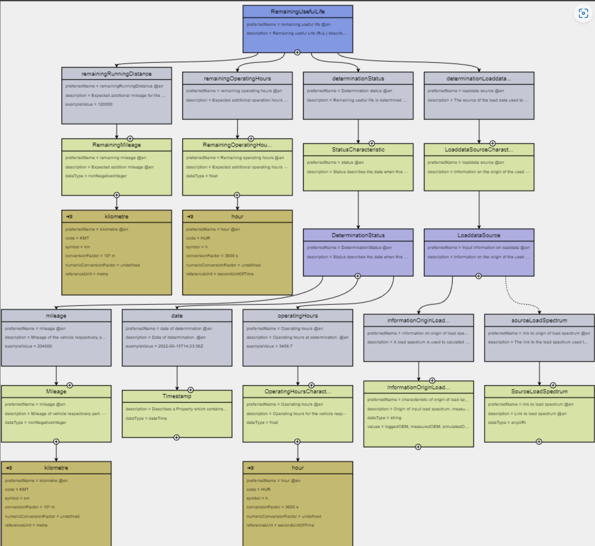

---
tags:
  - CAT/Business Application Provider
  - UC/Behaviroal Twin
---

# CX-0138 Use Case Behaviour Twin Endurance Estimator v1.0.2

## ABSTRACT

Behavioral product models, built on a consistent architecture of reusable functional components within ecosystems like Catena-X, unlock a wide range of innovative business ideas and digital services.

The focus of the 'data-centric and model-centric development and operational support' revolves around the 'digital behaviour twin.' This concept maps products, their functions, attributes, and business metrics by using a shared data model.

Part of this digital twin involves services providing information about existing or planned vehicles. Stakeholders like automobile clubs or recycler seek specific details, such as a component's expected lifespan. This information is crucial for determining the viability of recycling components.

This standard focuses on the Endurance Estimator. The Endurance Estimator receives user estimated load, that has been estimated by the service consumer, through the Catena-X network. The user estimated load, combined with additional product knowledge by the service provider, is used to calculate remaining useful life values for specific components.

## FOR WHOM IS THE STANDARD DESIGNED

The standard is relevant for the following roles within the scope of the Endurance estimator service:

- data & service provider/consumer
- business application provider

## COMPARISON WITH THE PREVIOUS VERSION OF THE STANDARD

The 1.0 version changed from a triangle (originally CX-0089) to an Use Case Standard and consolidates the contents of the previously independent standards CX-0057, CX-0088, CX-0090 within a single comprehensive standard.

## 1 INTRODUCTION

This document acts as a bracket for single standards required to request "Remaining Useful Life (RUL)" data as well as providing a service for its calculation at a component level. Included are APIs to be provided by the service provider and the service requestor, as well as aspect models for the respective payloads being exchanged in an asynchronous pattern leveraging those APIs.

### 1.1 AUDIENCE & SCOPE

> *This section is non-normative*

The standard is relevant for the following roles within the scope of Endurance estimator service:

- data & consumer provider/consumer
- business application provider

NOTE: Fulfilling a use-case standard by a data provider/consumer can be done in two ways: A\) purchase a certified app for the use case. In this case the data provider/consumer does not need to proof conformity again and B\) data provisioning/consumption without a certified app for the use case. In this case the data provider/consumer needs to proof conformity with all single standards listed in this document

### 1.2 CONTEXT AND ARCHITECTURE FIT

> *This section is non-normative*

This graphic illustrates the principles architecture of the Endurance estimator Service.


The data provider then has user estimated load available and sends it to the service provider via a connector compliant with [CX-0018] (e.g. Tractus-X EDC) as a notification payload.
After the calculation, the results are transfered back to the data provider through this connector.

This standard contains two aspect models described in detail in Chapter 3.

- Aspect Model for user estimated loading, acting as the input for the estimation of remaining useful life. (See section 3.1)
- Aspect Model for Remaining Useful Life data, acting as the main output for remaining useful life. (See section 3.2 It also contains the API descriptions for the APIs to exchange requests as well as results of a remaining useful life calculation:
- API Endurance Estimator (contains both API descriptions). (See section 5.1)

The calculation is asynchronous, therefore both parties involved in a calculation request require to provide API endpoints, as the results are sent back at a later stage and not as part of the HTTP response body.
Since Data Transfer in Catena-X requires IDSA compliance, both parties involved must use an IDSA compliant connector and provision the API endpoints as specific data assets in those connectors.

### 1.3 CONFORMANCE AND PROOF OF CONFORMITY

> *This section is non-normative*

All participants and their solutions will need to proof, that they are conform with the Catena-X standards. To validate that the
standards are applied correctly, Catena-X employs Conformity Assessment Bodies (CABs).
Since this document describes a set of standards to be fulfilled, participants MUST fulfill all mentioned standards and
the respective conformity assessment criteria in addition to the specific criteria mentioned in this document.
The specific criteria described in this document are describing the usage of the central tools as well as common tools described
in the linked standardization documents and therefore compliance should be checked with the tools provided for these
components.
The Tractus-X Eclipse Dataspace Connector (EDC) is RECOMMENDED to be used as an IDSA compliant connector, as it is the current reference implementation of the IDSA protocol.

### 1.4 EXAMPLES

The Endurance estimator can be used in many different contexts.

Tier-X: The overall product range becomes more attractive in the offer phase when model-based damage calculation is included as a product-related service.

During the usage phase, OEMs, car dealers and automotive clubs can further interpret the Remaining Useful Life calculation for a vehicle evaluation and offer it as vehicle-related services for their end customers and fleet operators.

Even during the usage phase, but particularly during the recycling phase, OEMs, Tier-X, automotive clubs, car dealers, insurers, fleet operators and recyclers benefit from residual value analyses of the entire vehicle and its components.

### 1.5 TERMINOLOGY

> *This section is non-normativ*

**Business Partner Number (BPN)**  
A BPN is the unique identifier of a partner within Catena-X

**Eclipse Dataspace Connector (EDC)**  
The EDC is a reference implementation of a connector for IDSA conform sovereign data exchange

**Behavioral Twin**  
Behavioural product models, based on a structured and consistent architecture of reusable and standard functional components and applied in a common ecosystem.

**Notification: Notification** - as described in CX-0023 Notification API v1.2.2, are - in contrast to classical data offers in Catena-X - a way to push data from a sender to a receiver and vice versa.

**Aspect Model**
: a formal, machine-readable semantic description (expressed with RDF/turtle) of data accessible from an Aspect.  

: Note 1 to entry: An Aspect Model must adhere to the Semantic Aspect Meta Model (SAMM), i.e., it utilizes elements and relations defined in the Semantic Aspect Meta Model and is compliant to the validity rules defined by the Semantic Aspect Meta Model.

: Note 2 to entry: Aspect model are logical data models which can be used to detail a conceptual model in order to describe the semantics of runtime data related to a concept. Further, elements of an Aspect model can/should refer to terms of a standardized Business Glossary (if existing).

*[Source: Catena-X, CX-0002:v1.2]*

Usecase specific glossary of used API and SAMM models can be found in the respective sections in this standard document.

## 2 RELEVANT PARTS OF THE STANDARD "Use Case Behavioral Twin Endurance estimator"

> *This section is normantive*

### 2.1 "STANDARDS FOR "Use Case Behavioral Twin Endurance estimator"

> *This section is normantive*

As a Service Provider for an Endurance Estimator Service I need to fulfill the following standards in the following contexts:

- Semantic Model: UserEstimatedLoading (Section 3.1) **MUST** be understood by my service and **MUST** be consumed by my service provider API.
- Semantic Model: Remaining Useful Life (Section 3.2) MUST be provided as part of my communication of the result towards the requestor and/or requesting application
- API: Endurance Estimator (Section 5.1) MUST be followed in terms of all relevant parts for a service provider

As a Service Requestor or Service Requestor Application I need to fulfill the following standards in the following contexts:

- Semantic Model: UserEstimatedLoading (Section 3.1) MUST be provided as part of the request for a remaining useful life calculation towards a service operator's API
- Semantic Model: Remaining Useful Life (Section 3.2) MUST be consumable by my connected underlying application.
- API: Endurance estimator (Section 5.1) MUST be followed in terms of all relevant parts for a service requestor.

#### 2.1.1 LIST OF STANDALONE STANDARDS

To participate in the Use Case Behavioral Twin Endurance estimator, the following single standards MUST be fulfilled:

- CX-0018 Dataspace Connectivity 3.0.0

#### 2.1.2 DATA REQUIRED

As a Service Requestor or Service Requestor Application I MUST provide the UserEstimatedLoading in the format of the aspect model described in Section 3.1.
As a Service Provider I MUST provide Remaining useful life information in the format of the aspect model described in Section 3.2.

#### 2.1.3 ADDITIONAL REQUIREMENTS

##### POLICY CONSTRAINTS FOR DATA EXCHANGE

In alignment with our commitment to data sovereignty, a specific framework governing the utilization of data within the Catena-X use cases has been outlined.  As part of this data sovereignty framework, conventions for access policies, for usage policies and for the constraints contained in the policies have been specified in standard 'CX-0152 Policy Constraints for Data Exchange'. This standard document CX-0152 **MUST** be followed when providing services or apps for data sharing/consuming and when sharing or consuming data in the Catena-X ecosystem. What conventions are relevant for what roles named in [1.1 AUDIENCE & SCOPE](#11-audience--scope) is specified in the CX-0152 standard document as well. CX-0152 can be found in the [standard library](https://catenax-ev.github.io/docs/standards/overview).

##### VERSIONING

Note: Data Assets differentiated only by major version MUST be offered in parallel. The current standard and API versions mark the start of Life Cycle Management in Catena-X operations. Previous versions are dismissed.

The API version described in this standard document MUST be published in the property https://w3id.org/catenax/ontology/common#version as version X.Y in dcat:Dataset(http://www.w3.org/ns/dcat#). The requester of an asset MUST be able to handle multiple assets for this endpoint, being differentiated only by the version. The requester SHOULD choose the asset with the highest compatible version number implemented by themselves.
If the requester cannot find a compatible version with their own, the requester MUST terminate the data transfer.

## 3 ASPECT MODELS

The following Aspect Models are part of this standard:

1. UserEstimatedLoading, V 1.0.0, urn:bamm:io.catenax.classified_load_spectrum:1.0.0
2. RemainingUsefulLife", V1.0.0, urn:bamm:io.catenax.rul:1.0.0##RemainingUsefulLife

> *This section is normantive*

### 3.1 ASPECT MODEL "ClassifiedLoadSpectrum"

The data model UserEstimatedLoading represents the load data of a vehicle component.
The load spectrum is a data set that represents the aggregated loading of a component.
Any kind of loading is covered: loading can be force or torque or revolutions or temperature or event or similar. The load data is classified and counted with specific counting methods.

This standard defines the format for the counted load data, so that the exchange of load data between different partners is possible.

#### 3.1.1 INTRODUCTION

The aspect model comprises basic vehicle data, vehicle status information, previous usage information and future usage information in a structured form in order to estimate the remaining useful life.  

Every data provider of userEstimatedLoading data MUST provide the data conformant to the semantic model specified in this document. The unique identifier of the semantic model specified in this document MUST be used by the data provider to define the semantics of the data being transferred. Every certified business application relying on userEstimatedLoading data MUST be able to consume data conformant to the semantic model specified in this document. This semantic model MUST be made available in the central Semantic Hub. Data consumers and data provider MUST comply with the license of the semantic model.

In the Catena-X data space userEstimatedLoading data MUST be requested and exchanged via a connector compliant with [CX-0018] (e.g. Tractus-X EDC). The JSON Payload of data providers MUST be conformant to the JSON Schema as specified in this document.

#### 3.1.2 CONTEXT

> *This section is non-normative*

"User estimated loading" is describing the vehicle and the usage of the vehicle. As named, the loading will be estimated from the usage in order to assess the remaining useful life of vehicle respectively the vehicle components.
The usage as well as the vehicle data are general information not specified for a specific component. Previous usage as well as future application are included.

#### 3.1.3 EXAMPLES

Example payload in JSON format:

```json
{
    "vehicleStatus": {
        "milage": 123456                      
    },
    "vehicleData": {                                                   
        "grossVehicleWeightKG": 1998,              
        "powerKW": 300,                          
        "energySourceCode": "0008",  
        "vehicleType": "limousine",                   
        "numberOfPoweredAxles": 2                  
    },

    "history": [
        {
            "percentage": 25,
            "drivingStyle": 80,
            "trailerUse": false,
            "cityDriving": false,
            "hilliness": 80,
            "curviness": 60
        },
        {
            "percentage": 75,
            "drivingStyle": 40,
            "trailerUse": false,
            "cityDriving": true,
            "hilliness": 30,
            "curviness": 50
        }
    ],
      "future": [
        {
            "futureScenarioId": 1,
            "futureScenario": [
                {
                    "percentage": 90.0,
                    "drivingStyle": 30,
                    "trailerUse": false,
                    "cityDriving": true,
                    "hilliness": 10,
                    "curviness": 50
                },
                {
                    "percentage": 10.0,
                    "drivingStyle": 20,
                    "trailerUse": true,
                    "cityDriving": true,
                    "hilliness": 10,
                    "curviness": 50
                }
            ]
        },
        {
            "futureScenarioId": 2,
            "futureScenario": [
                {
                    "percentage": 100,
                    "drivingStyle": 20,
                    "hilliness": 30,
                    "curviness": 20,
                    "trailerUse": true,
                    "cityDriving": false
                }
            ]
        }
    ]
}
```

#### 3.1.4 SPECIFICATIONS ARTIFACTS

The modeling of the semantic model specified in this document was done in accordance to the "semantic driven workflow" to create a submodel template specification [SMT](#52-non-normative-references).

This aspect model is written in BAMM 1.0.0 as a modeling language.

Like all Catena-X data models, this model is available in a machine-readable format on GitHub.

#### 3.1.5 LICENSE

This Catena-X data model is made available under the terms of the Creative Commons Attribution 4.0 International (CC-BY-4.0) license, which is available at Creative Commons.

#### 3.1.6 IDENTIFIER OF SEMANTIC MODEL

```text
    [Mandatory] 
```

The semantic model has the unique identifier

**urn:bamm:io.catenax.user_estimated_loading:1.0.0**

This identifier MUST be used by the data provider to define the semantics of the data being transferred.

#### 3.1.7 FORMATS OF SEMANTIC MODEL

##### 3.1.7.1 RDF Turtle

```text
    [Mandatory] 
```

The rdf turtle file, an instance of the Semantic Aspect Meta Model, is the master for generating additional file formats and serializations.

https://github.com/eclipse-tractusx/sldt-semantic-models/blob/main/io.catenax.user_estimated_loading/1.0.0/UserEstimatedLoading.ttl

The open source command line tool of the Eclipse Semantic Modeling Framework  is used for generation
of other file formats like for example a JSON Schema, aasx for Asset Administration Shell Submodel
Template or a HTML documentation.

##### 3.1.7.2 JSON Schema

A JSON Schema can be generated from the RDF Turtle file. The JSON Schema defines the Value-Only
payload of the Asset Administration Shell for the API operation "GetSubmodel".

##### 3.1.7.3 aasx

```text
    [Mandatory] 
```

An AASX file can be generated from the RDF Turtle file. The AASX file defines one of the requested
artifacts for a Submodel Template Specification conformant to \[[SMT](#52-non-normative-references)].

Note: As soon as the specification V3.0 of the Asset Administration Shell specfication is available
an update will be provided.

### 3.2 ASPECT MODEL "RemainingUsefulLife"

#### 3.2.1 INTRODUCTION

The data model Remaining Useful Life contains the two relevant values to describe the expected remaining life of a vehicle, remaining running distance and remaining operating hours.  

The data model is used for vehicle parts and vehicle components which cannot be visually assessed but need the loading information combined with a damage model to estimate the health of the component.  

#### 3.2.2 CONTEXT

> *This section is non-normative*

Remaining useful Life is describing the actual health of a vehicle component. Remaining useful Life is defined for vehicle and vehicle components; the values are “remaining running distance” and “remaining operating hours”. As it is a short-term property, the status of determination is part of the standard. Remaining useful Life is the result of a service determining the health of a vehicle component from the loading the component was subjected to. This loading might before example measured, simulate or estimated, this information on the origin of the loading is part of the standard.


*Figure 1: Overview*

#### 3.2.3 EXAMPLES

```json
{ 
  "remainingOperatingHours": 2500, 
  "remainingRunningDistance": 150000, 
  "determinationStatus": { 
    "date": "2022-06-15T14:23:56Z", 
    "operatingHours": 3456.7, 
    "mileage": 204000 
  }, 
  "determinationLoaddataSource": { 
    "informationOriginLoadSpectrum": "loggedOEM" 
  } 
}
```

#### 3.2.4 TERMINOLOGY

> *This section is non-normative*

- RemainingRunningDistance:  The estimated number of kilometers, the vehicle can drive without expectable failure of the component. This is an integer number, the unit is [km].
- Remaining operating hours: Estimated number of operating hours of the vehicle without expectable failure of the component. Floating number, unit is [h].
- determinationLoaddataSource:  The remaining life is estimated from the loading the component was subjected to. The loading of the component might be logged during vehicle life or simulated or estimated: this information on the origin is stored here. If available, the URL of the loadspectrum can be stored here.
- determinationStatus :  Comprising “date”, “mileage”, “operatingHours”, the timestamp the remainingUsefulLife was calculated and the according mileage and operating  hours of the vehicle.
- sourceLoadSpectrum:  if available, the URL of the used load spectrum
- informationOriginLoadSpectrum:  enumeration of possible loaddata sources:
  - "loggedOEM":  the data are collected during usage and provided on OEM side
  - "measuredOEM": load data are measured on OEM side
  - "simulatedOEM": load data are simulated on OEM side
  - "loggedSupplier":  the data are collected during usage and provided on supplier side
  - "measuredSupplier": load data are measured on supplier side
  - "simulatedSupplier": load data are simulated on supplier side
  - "otherOrigin": any other origin of load data, may be not even a load spectrum

Additional terminology used in this standard can be looked up in the glossary on the association homepage.

#### 3.2.5 SPECIFICATIONS ARTIFACTS

The modeling of the semantic model specified in this document was done in accordance to the "semantic driven workflow" to create a submodel template specification [SMT](#52-non-normative-references).

This aspect model is written in BAMM 1.0.0 as a modeling language.

Like all Catena-X data models, this model is available in a machine-readable format on GitHub conformant to CX-0003.

#### 3.2.6 LICENSE

This Catena-X data model is made available under the terms of the Creative Commons Attribution 4.0 International (CC-BY-4.0) license, which is available at Creative Commons.

#### 3.2.7 IDENTIFER OF SEMANTIC MODEL

The semantic model has the unique identifier:

urn:bamm:io.catenax.rul:1.0.0##RemainingUsefulLife

#### 3.2.8 FORMATS OF SEMANTIC MODEL

##### 3.2.8.1 RDF Turtle

The rdf turtle file, an instance of the Semantic Aspect Meta Model, is the master for generating additional file formats and serializations.

The ttl file can be found here:

https://github.com/eclipse-tractusx/sldt-semantic-models/blob/main/io.catenax.rul/1.0.0/RemainingUsefulLife.ttl

The open source command line tool of the Eclipse Semantic Modeling Framework  is used for generation
of other file formats like for example a JSON Schema, aasx for Asset Administration Shell Submodel
Template or a HTML documentation.

##### 3.2.8.2 JSON Schema

A JSON Schema can be generated from the RDF Turtle file. The JSON Schema defines the Value-Only
payload of the Asset Administration Shell for the API operation "GetSubmodel".

##### 3.2.8.3 aasx

An AASX file can be generated from the RDF Turtle file. The AASX file defines one of the requested
artifacts for a Submodel Template Specification conformant to \[[SMT](#52-non-normative-references)].

Note: As soon as the specification V3.0 of the Asset Administration Shell specfication is available
an update will be provided.

## 4 APPLICATION PROGRAMMING INTERFACES

> *This section is normantive*

> *The headings below should only be understood as a suggestion*

### 4.1 Endurance Estimator API

Endurance Estimator is a service which estimates the remaining useful life of a vehicle using basic information of the vehicle and the usage. It is aimed for normal customer without access to specific technical vehicle data or logged data stored in the ECU. Usage  data are estimated according to application like trailer use and geografical conditions like hilliness.
This document sets the standards for the API for the usage of services which estimates a so-called "remaining useful life value" (RUL-value) using estimated load data (UserEstimatedLoading).

#### 4.1.1 PRECONDITIONS AND DEPENDENCIES

The Endurance Estimator service was designed with interoperability in mind, thus the communication in both directions (input/input) fully supports the Catena-X Notification standard.

The two APIs described support the implementation of the dynamic behavior (i.e., service) of components (e.g., engine, gearbox..) in a digital behavior twin.

As the process is asynchronous, there are two APIs for different types of participants in the network.

1. API endpoint to be provided by a Service Provider providing a service to predict the expected lifetime based on user estimated loading.
2. API endpoint to be provided by a Service Requestor application or participant to receive the outcome of such an analysis in an asynchronous manner.

It is a non-central API, which can be implemented for various components. It relies on a load spectrum as input in order to calculate and return the corresponding RUL value.
The basic idea for the functionality of this API has been derived from CX-0023:v1.2 Notification API.

As already mentioned in the Introduction, this standard provides the specification of the HTTP REST API endpoint to request (with an according UserEstimatedLoading as input) and sending RUL value via the Catena X Dataspace. Without this API an interoperability between different application, with an aim to receive RUL data, is not given.

#### 4.1.2 API SPECIFICATION

##### 4.1.2.1 API Endpoints & resources

The notification API MUST be implemented as specified in the [[openAPI](https://github.com/catenax-eV/product-standardization-prod/blob/main/standards/CX-0089-APIEndurancePredictor/1.1.0/src/Endurance_Estimator_Notification_openapi.json)] documentation as stated here:

- POST /api/v1/routine/notification

In fact, it is OPTIONAL to implement the endpoint paths exactly as described above. The reason is that those endpoints are not called from any supply chain partner directly. Rather, they are called from the Eclipse Dataspace Connector (EDC) or a similar IDSA compliant connector as part of its data assets. In that sense, it is just important to implement endpoints that can process the defined request body and respond with the HTTP status codes and - if required - reply with the defined response body.

The EDCs/IDSA compliant data assets will act similar to a reverse proxy for the notification endpoints, therefore rather the EDC data assets are of significance, which should be exposed towards Catena-X through the Data Offer Catalogues in the EDC or any other IDSA Protocol compatible connector.

##### 4.1.2.2 Available Data Types

The API MUST use JSON as the payload transported via HTTP.
The APIs payload consists of a general notification header and a use-case specific content dictionary.
The request and response are linked by the unique notificationID.

#### Notification Request Payload Structure

The main part of the content dictionary MUST follow the main input towards the endurance estimator.

```json
{
    "header": {
        "notificationId": "b1a15145-4533-48e3-8d80-f5b83cc6c201",
        "referencedNotificationId": null,
        "relatedNotificationId": null,
        "senderBPN": "BPNL00000002HCQ9",
        "senderAddress": "https://connector2.cp.int.adac.openresearch.com",
        "recipientBPN": "https://edc-ocp0900009.apps.c7von4sy.westeurope.aroapp.io/BPNL00000003B2OM",
        "recipientAddress": "BPNL00000003B2OM",
        "severity": "MINOR",
        "status": "SENT",
        "targetDate": "2023-02-03T11:58:00.326439Z",
        "timeStamp": "2023-02-03T11:58:00.326439Z",
        "classification": "RemainingUsefulLifeEstimator",
        "respondAssetId": "enduranceEstimatorResult-receipt"
    },
    "content": {
        "requestRefId": "b1a15145-4533-48e3-8d80-f5b83cc6c201",
        "enduranceEstimatorInputs": [
            {
                "userEstimatedLoading": {
                    <UserEstimatedLoading as per semantic model : AspectModel_UserEsimatedLoading Section 3.1>
                }
            }
        ]        
    }
}

```

### Notification Response Payload Structure

The "Remaining Useful Life" as endurance estimator output MUST follow the semantics described in the corresponding model:

```json
{ 
    "header": { 
      "referencedNotificationID": "notification-UUID", 
      "senderBPN": "BPNL0000000", 
      "senderAddress": "https://edc-xxxx.xx/BPNL0000000", 
      "classification": "EnduranceEstimatorResult", 
      "recipientAddress": "https://connectorxx.com", 
      "recipientBPN": "BPNL0000000", 
      "severity": "MINOR", 
      "status": "SENT", 
      "targetDate": "target-date", 
      "timeStamp": "time-stamp", 
      "respondAssetId": "urn:pilot:service:EndurancePredictorEstimationNotification" 
    }, 
    "content": { 
      "enduranceEstimatorOutputs": [ 
        { 
          "remainingUsefulLife": { 
              <RuL as per standard as specified in section 3.2: Semantic Model: Remaining Useful Life>
          } 
        } 
      ] 
    } 
  } 
```

### Notification Response Error Payload Structure

```json
{ 
    "header": { 
      "referencedNotificationID": "notification-UUID", 
      "senderBPN": "BPNL0000000", 
      "senderAddress": "https://edc-xxxx.xx/BPNL0000000", 
      "classification": "EndurancePredictorResult", 
      "recipientAddress": "https://connectorxx.com", 
      "recipientBPN": "BPNL0000000", 
      "severity": "MINOR", 
      "status": "SENT", 
      "targetDate": "target-date", 
      "timeStamp": "time-stamp", 
      "respondAssetId": "urn:pilot:service:EndurancePredictorEstimationNotification" 
    }, 
    "content": { 
        "type": "Error", 
        "message": "Error Message", 
        "enduranceEstimatorOutputs": [] 
    } 
  } 
```

#### 4.1.3 DATA ASSET STRUCTURE

When using the EDC, the following asset MUST be registered by the specific roles in this process. Other connectors implementing the IDSA Protocol require a similar data asset with the same structure and provisioning towards Catena-X.

##### 4.1.3.1 Service Consumer

As an application provider or an data consumer calling an endurance predictor of another participant an API for asynchronous receival of the result is required.
The corresponding data asset **MUST** look like the following:

```json
{
  "@context": {
    "cx-common": "https://w3id.org/catenax/ontology/common#"
  },
  "asset": {
    "@type": "Asset",
    "@id": "enduranceEstimatorResult-receipt",
    "properties": {
      "dct:type": {
        "@id": "EnduranceEstimatorResult"
      },
      "cx-common:name": "enduranceEstimatorResult-receipt",
      "cx-common:description": "Asset to receive endurance estimator results.",
      "cx-common:version": "1.0",
      "cx-common:contenttype": "application/json"
    }
  },
  "dataAddress": {
    "@type": "DataAddress",
    "type": "HttpData",
    "baseUrl": "https://{{httpServerWhichOffersTheHttpEndpoint}}/api/v1/routine/notification",
    "proxyMethod": "true",
    "proxyQueryParams": "true",
    "proxyBody": "true"
  }
}
```

The variable \{\{httpServerWhichOffersTheHttpEndpoint\}\} MUST be set to the HTTP server that offers the endpoint. The path /api/v1/routine/notification MAY align with the HTTP POST path as stated in 2.2.1.
In that sense it can change dependent on the endurance application.

##### 4.1.3.2 Service Provider

As an service provider or data provider providing an endpoint for an endurance estimator service, an API for receival of the request including the user estimated loading data is required.
The corresponding data asset **MUST** look like the following:

```json
{
  "@context": {
    "cx-common": "https://w3id.org/catenax/ontology/common#"
  },
  "asset": {
    "@type": "Asset",
    "@id": "enduranceEstimatorRequest-receipt",
    "properties": {
      "dct:type": {
        "@id": "EnduranceEstimatorRequest"
      },
      "cx-common:name": "enduranceEstimatorRequest-receipt",
      "cx-common:description": "Asset to receive endurance estimator requests incl. load spectrum.",
      "cx-common:version": "1.0",
      "cx-common:contenttype": "application/json"
    }
  },
  "dataAddress": {
    "@type": "DataAddress",
    "type": "HttpData",
    "baseUrl": "https://{{httpServerWhichOffersTheHttpEndpoint}}/api/v1/routine/notification",
    "proxyMethod": "true",
    "proxyQueryParams": "true",
    "proxyBody": "true"
  }
}
```

The variable \{\{httpServerWhichOffersTheHttpEndpoint\}\} MUST be set to the HTTP server that offers the endpoint. The path /api/v1/routine/notification MAY align with the HTTP POST path as stated in 2.2.1.
In that sense it can change dependent on the endurance application.

The variable \{\{httpServerWhichOffersTheHttpEndpoint\}\} MUST be set to the HTTP server that offers the endpoint. The path /api/v1/routine/notification MAY align with the HTTP POST path as stated in 2.2.1.
In that sense it can change dependent on the endurance application.

#### 4.1.4 ERROR HANDLING

The following http response codes MUST be defined for HTTP POST endpoint for the Endurance estimator endpoint.

| Code | Description                      |
|------|----------------------------------|
| 202  | Accepted                         |
| 400  | Request body was malformed       |

## 5 REFERENCES

### 5.1 NORMATIVE REFERENCES

- CX–0018:v3.0 Dataspace Connectivity
- CX-0023:v1.2 Notification API
- CX-0003:v1.1 SAMM Aspect Meta Model
- CX-0152:v1.0 Policy Constraints For Data Exchange

### 5.2 NON-NORMATIVE REFERENCES

> *This section is non-normative*

- [Catena-X Operating Model](https://catenax-ev.github.io/docs/next/operating-model/why-introduction)

### 5.3 REFERENCE IMPLEMENTATIONS

> *This section is non-normative*

## Legal

Copyright © 2025 Catena-X Automotive Network e.V. All rights reserved. For more information, please visit [here](/copyright).
