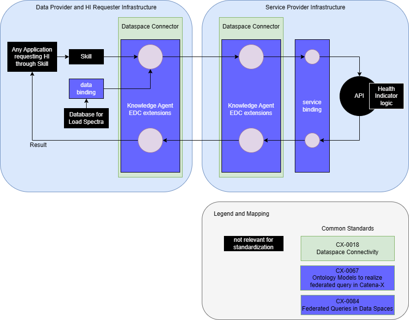

---
tags:
  - CAT/Business Application Provider
  - UC/Behaviroal Twin
---

# CX-0141 Use Case Behaviour Twin Health Indicator v1.0.1

## ABSTRACT

Behavioral product models, built on a consistent architecture of reusable functional components within ecosystems like Catena-X, unlock a wide range of innovative business ideas and digital services.

The focus of the 'data-centric and model-centric development and operational support' revolves around the 'digital behaviour twin'. This concept maps products, their functions, attributes, and business metrics using a shared data model.

Part of this digital twin involves dynamic services providing real-time information about existing or planned vehicles. Stakeholders like automobile clubs or recycler seek specific details, such as a component's expected lifespan. This information is crucial for determining the viability of recycling components.

This standard focuses on the Health Indicator Use Case. The Health Indicator recieves dynamic input data, that has been recorded in the vehicle, through the Catena-X network. The input data, combined with additional product knowledge by the service provider, is used to calculate precise health indicator values for specific components.

## FOR WHOM IS THE STANDARD DESIGNED

The standard is relevant for the following roles within the scope of the Health Indicator:

- data & service provider/consumer
- business application provider

## COMPARISON WITH THE PREVIOUS VERSION OF THE STANDARD

## 1 INTRODUCTION

This document acts as a umbrella for single standards required to request "Health Indicator" data as well as providing a service for its calculation at a component level.

### 1.1 AUDIENCE & SCOPE

> *This section is non-normative*

The standard is relevant for the following roles within the scope of a Health Indicator service

- data provider/consumer
- business application provider

NOTE: Fulfilling a use case standard by a data provider/consumer can be done in two ways: A\) Purchase a certified app for the
use case. In this case the data provider/consumer does not need to proof conformity again and B\) Data provisioning/consumption without a certified app for the use case. In this case the data provider/consumer needs to proof conformity with
all single standards listed in this document.

### 1.2 CONTEXT AND ARCHITECTURE FIT

> *This section is non-normative*

This graphic illustrates the principles architecture of the Health Indicator use case.

Since Data Transfer in Catena-X requires IDSA compliance, both parties involved must use an IDSA compliant connector and
provision the API endpoints as specific data assets in those connectors.

The Knowledge Agent functionality for the Dataspace Connector is required. This is defined in CX-0084:v1.2 Federated Queries in Data Spaces.

A standard for a semantic-driven and state-of-the-art compute-to-data architecture for Catena-X is the so-called Knowledge Agents (KA) approach. It builds on well-established W3C-standards of the semantic web.

Depending on your role, you must provide the following parts of this standard:

- **all**:
  - running Knowledge Agent Dataspace Connector extensions
- **data provider** and **service requester**:
  - bindings for load spectra to the knowledge graph, ideally by using a binding agent (see Binding Layer and related examples in CX-0084:v1.2)
  - graph asset, which describes and offers the data bindings in a Knowledge Agent compatible way (policies may also be required)
  - an own HI skill or a access to a remote skill
- **service provider**
  - bindings for a health indicator service (see cx-behaviour:VehicleHealth within the [behaviour ontology](https://w3id.org/catenax/ontology/behaviour)) to the knowledge graph, ideally by using a binding agent
  - graph asset, which describes and offers the service bindings in a Knowledge Agent compatible way (policies may also be required)

If the service requester requests HI values, he invokes the HI skill and provides a vehicle identification number to it. This can also be done for multiple vehicles at once in a batch mode. The data bindings and the service provider are resolved by the Knowledge Agent. Then, the data are transferred to the service provider via Knowledge Agent. There, the HI values are calculated and passed back to the requester.

### 1.3 CONFORMANCE AND PROOF OF CONFORMITY

> *This section is non-normative*

All participants and their solutions will need to proof, that they conform with the Catena-X standards. To validate that the standards are applied correctly, Catena-X employs Conformity Assessment Bodies (CABs).
Since this document describes a set of standards to be fulfilled, participants MUST fulfill all mentioned standards and
the respective conformity assessment criteria in addition to the specific criteria mentioned in this document.
The specific criteria described in this document are describing the usage of the central tools as well as common tools described in the linked standardization documents and therefore compliance should be checked with the tools provided for these components.
The Tractus-X EDC (Eclipse Dataspace Connector) is RECOMMENDED to be used as an IDSA compliant connector, as it is the current
reference implementation of the IDSA protocol.

### 1.4 EXAMPLES

The Health Indicator can be used in many different contexts.

OEM, TIER-X: During the usage phase, health indicators provide a continuous and comprehensive view of the condition of products in the field. Abnormalities, possible defects or failures can be detected reliably and early on. This provides the time advantage to initiate countermeasures in good time. During development phase, health indicators can be used to bring more mature products into series production.

TIER-X: The overall product range becomes more attractive in the offer phase, when the definition of health indicators as a product-related service is included.

Workshops: In case of failure analysis and repair, workshops benefit from an extended range of data on vehicle condition and its components. In return, service providers can standardize and facilitate access to the OEM.

### 1.5 TERMINOLOGY

> *This section is non-normative*

- **Business Partner Number (BPN):** A BPN is the unique identifier of a partner within Catena-X
- **Tractus-X EDC (Eclipse Dataspace Connector):** The Tractus-X EDC is a reference implementation of a connector for IDSA conform sovereign data exchange
- **Behaviour Twin:** Behavioral product models, based on a structured and consistent architecture of reusable and standard functional components and applied in a common ecosystem.
- **Knowledge Agent (KA):** The so-called Knowledge Agents (KA) approach. It builds on well-established W3C-standards of the semantic web, such as OWL, SPARQL, SHACL, RDF etc. and makes these protocols usable to formulate powerful queries to the data space. Those queries can be used to answer business questions directly (comparable to a search engine) or they can be embedded in apps to include query results into workflows with more advanced visualization.
- **Matchmaking Agent:** This component supports SparQL to traverse the federated data space as a large data structure. It interacts with the Dataspace Connector.
  The provider's Matchmaking Agent will be activated by its Dataspace Connector. Therefore, the Dataspace Connector must offer a Graph Asset (variant of ordinary data assets in the Catena-X Dataspace Connectivity standard).
  The consumer's Matchmaking Agent interacts with its Dataspace Connector to negotiate and perform the transfer of Sub-Skills to other dataspace participants.
  The Matchmaking Agents are matching the (sub)graphs and negotiate appropriated graph assets with the partner Dataspace Connectors.
- **Binding Agent:** The Binding Agent is a restricted version of the Matchmaking Agent (subset of OWL/SparQL, e.g., without federation) which is just focused on translating Sub-Skills of a particular business domain (Bill-Of-Material, Chemical Materials, Production Sites, etc.) into proper SQL- or REST based backend system calls. Implementation details: For data bindings, OnTop is used. For service bindings, RDF4J is used.
- **Ontology:** The ontology is a formal representation of knowledge that captures concepts, relationships, and properties. It allows a shared understanding and reasoning about the respective domain. It must be hosted in a way that all participants can access it. Currently, the ontology is hosted at GitHub.

## 2 RELEVANT PARTS OF THE STANDARD "Use Case Behaviour Twin Health Indicator"

### 2.1 STANDARDS FOR "Use Case Behaviour Twin Health Indicator"

> *This section is normative*

#### 2.1.1 LIST OF STANDALONE STANDARDS

To participate in the Use Case Behaviour Twin Health Indicator, the following single standards MUST be fulfilled:

- CX-0018:v3.0 Dataspace Connectivity
- CX-0067:v1.1 Ontology Models to realize federated query in Catena-X (only if using the Knowledge Agent)
- CX-0084:v1.2 Federated Queries in Data Spaces (only if using the Knowledge Agent)

#### 2.1.2 DATA REQUIRED

As a service requester or service requester application I MUST provide Health Indicator Input data (bound to the knowledge graph).
As a Service Provider I MUST provide Health indicator output information (service, bound to the knowledge graph).

#### 2.1.3 ADDITIONAL REQUIREMENTS

##### KNOWLEDGE AGENT SPECIFIC REQUIREMENTS

If you are engaged as a data provider, you MUST mount your data source to the federated knowledge graph as Graph Asset. Beside the policy and contract definition, a Graph Asset registration is needed.
As a service provider you MUST make the service available as part of the federated knowledge graph, a Graph Asset pointing to your Remoting Agent endpoint is needed.

##### POLICY CONSTRAINTS FOR DATA EXCHANGE

In alignment with our commitment to data sovereignty, a specific framework governing the utilization of data within the Catena-X use cases has been outlined.  As part of this data sovereignty framework, conventions for access policies, for usage policies and for the constraints contained in the policies have been specified in standard 'CX-0152 Policy Constraints for Data Exchange'. This standard document CX-0152 **MUST** be followed when providing services or apps for data sharing/consuming and when sharing or consuming data in the Catena-X ecosystem. What conventions are relevant for what roles named in [1.1 AUDIENCE & SCOPE](#11-audience--scope) is specified in the CX-0152 standard document as well. CX-0152 can be found in the [standard library](https://catenax-ev.github.io/docs/standards/overview).

##### Versioning

Note: Data Assets differentiated only by major version MUST be offered in parallel. The current standard and API versions mark the start of Life Cycle Management in Catena-X operations. Previous versions are dismissed.

The API version described in this standard document MUST be published in the property [https://w3id.org/catenax/ontology/common#version](https://w3id.org/catenax/ontology/common#version) as version X.Y in dcat:Dataset \([http://www.w3.org/ns/dcat#](http://www.w3.org/ns/dcat#)\). The requester of an asset MUST be able to handle multiple assets for this endpoint, being differentiated only by the version. The requester SHOULD choose the asset with the highest compatible version number implemented by themselves.
If the requester cannot find a compatible version with their own, the requester MUST terminate the data transfer.

## 3 ASPECT MODELS

In this standard, there are no use case specific Aspect Models required.

## 4 APPLICATION PROGRAMMING INTERFACES

> *This section is non-normative*

As the Health Indicator use case is using the Knowledge Agent technology, it provides no onw APIs. Instead, the APIs of the Knowledge Agent are used. Therefore, see CX-0084 Federated Queries in Data Spaces.

## 5 REFERENCES

### 5.1 NORMATIVE REFERENCES

- CX-0018:v3.0 Dataspace Connectivity
- CX-0067:v1.1 Ontology Models to realize federated query in Catena-X (only if using the Knowledge Agent)
- CX-0084:v1.2 Federated Queries in Data Spaces (Knowledge Agent)
- CX-0152:v1.0 Policy Constraints for Data Exchange

### 5.2 NON-NORMATIVE REFERENCES

> *This section is non-normative*

## Legal

Copyright © 2025 Catena-X Automotive Network e.V. All rights reserved. For more information, please visit [here](/copyright).
