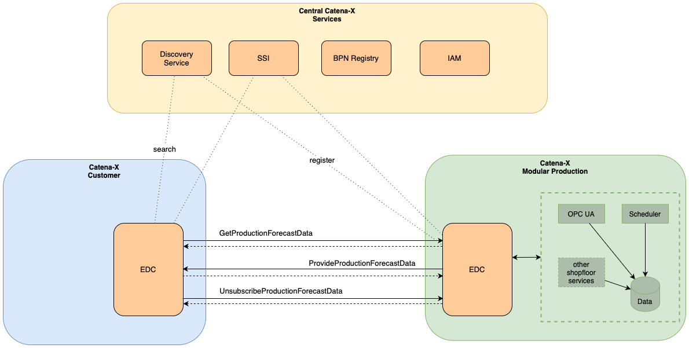
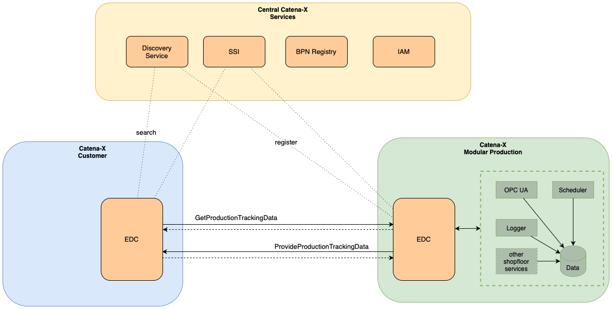
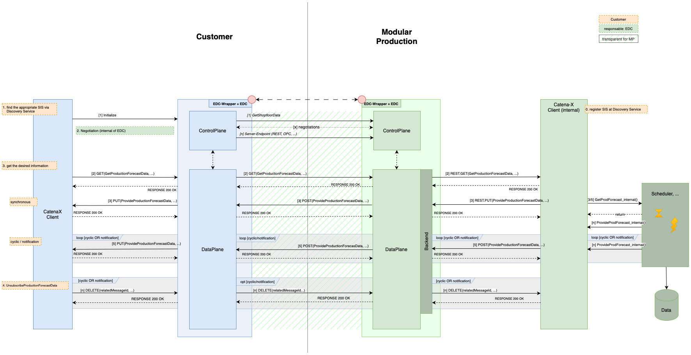
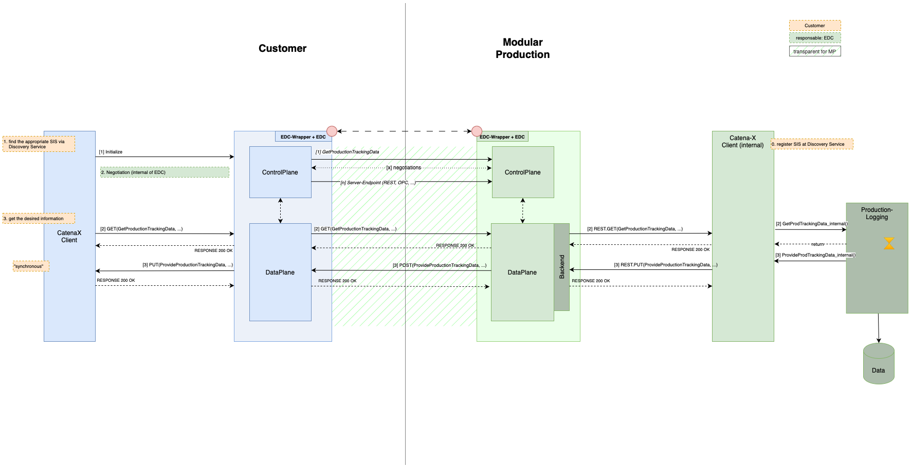

---
tags:
  - CAT/Business Application Provider
  - UC/Modular Production
---

# CX-0142 Shop Floor Information Service v1.0.1

## ABSTRACT

A Modular Production is part of the value chain. On the one hand, it has to guarantee flexibility and availability, and
on the other, it has to allow for product mixes with small lot sizes. The effects of disturbances and decisions in this
network are not limited to a local area, but also have a major impact on other partners in the value chain network. It
is therefore necessary to exchange values from the shop floor directly with other members of the network, such as
customers or their representatives, like logisticians. This communication is realized with the
Shop-Floor-Information-Service (SIS). This service provides different types of information that a factory can offer to
its customers. It is not dedicated to a specific purpose, as customers may decide how to handle the information
themselves.

The current version of the standard provides two different kinds of data: Production Forecasting, and Production
Tracking data. To give an example of forecasting data, suppose a customer wants to know when production is expected to
start. He can use the Shop-Floor-Information-Service in order to get the information either directly, via cyclic
messages or via notifications when the calculated production dates change. As an example of production tracking, a
customer can request certain production attributes collected during production, such as the torque of a particular
process step. This data can then be used for both documentation and tracking.

In order to exchange the data the Shop-Floor-Information-Service defines the necessary data models, such as the
GetProductionForecast data and the ProvideProductionForecast data model as well as GetProductionTracking data and
ProvideProductionTracking data model. This data exchange mechanism between Modular Production and the data consumer is
realized via the Shop-Floor-Information API.

COMPARISON WITH THE PREVIOUS VERSION OF THE STANDARD

- *Release 24.05*
  - *Merge CX-0068, CX-0069 and CX0075 by combining the different standards that describe the data model, the API and and the process into this combined standard.*
  - *Additional functionality added: production tracking aspects.*
  - *Update of Production Forecast Models due to update of CX-header.*
- *Release 23.09*
  - Initial Release

## 1 INTRODUCTION

### 1.1 AUDIENCE & SCOPE

This standard is relevant for

- Business Application Providers: their role is to implement the Shop-Floor-Information-Service,
- Data Providers, mainly Modular Productions: they have to provide the data required for the
  Shop-Floor-Information-Service,
- Data Consumers, e.g. tier n-1 factories, end customers or logisticians: they have to be able to process the data
  provided by the Shop-Floor-Information-Service.

Stakeholders within Catena-X

- PURIS, DCM: capacity planning requires a forecast of the products to be delivered,
- OSim: the Forecast Data from the SIS can serve as input for a OSim-simulation,
- Traceability: The production tracking aspect allows recalling production data for a specific product, which can be an asset for traceability.

### 1.2 CONTEXT AND ARCHITECTURE FIT

Higher-level, external influencing factors from the supply chain, such as delays in the logistics chain for supplier
parts or short-term order changes, may invalidate a production plan that has already been drawn up. Today, such
short-term changes in the general conditions of the production process can often only be taken into consideration
indirectly and made through manual corrections. The solution approaches in the Modular Production use case aim to
increase the flexibility of production in order to better leverage the existing business potential. For this purpose,
services, interface, and data model definitions based on industry standards are offered with the goal of increasing the
flexibility and reliability of industrial production. The shop floor is connected to the Catena-X network using the
Catena-X standardized connectors. Modular Production will offer a Shop-Floor-Information-Service that supplies
information about the production status and planning as needed by other partners in the Catena-X network. The goal is to enable individual production (lot size 1) at the price of series production. In particular, this is to be achieved by automating the orchestration of production resources and planning of production processes as much as possible, thus significantly reducing effort and planning times. A growth in efficiency in the sense of the OEE is achieved by reconfiguring the production in the event of faults to continue operation as well as possible. The increased flexibility creates the space for new business models, such as the interposition of highly prioritized, lucrative orders. As a consequence not only the production is required to be flexible and has to react quickly to changes, it also requires communication of future factory output to the customers. As part of a supply chain the products produced by a Modular Production are part of a bigger product. For this reason, certain parameters are offered to customers by the Production Tracking aspect for the overall documentation of the production process.

Both partners - a customer and a Modular Production - MUST be members of the Catena X network in order to communicate
with each other. By registering a Modular Production in advance with the Discovery Service, a customer can find it via a
so-called Business Partner Number (BPN). With the help of SSI (Self Sovereign Identity) the correct identity is
guaranteed.

#### 1.2.1 Forecasting

The customer uses the *GetProductionForecastData* call in order to request a production forecast, as specified in
section 4.1. The Modular Production generates the required information internally by internal services like a scheduler
and answers accordingly by calling *ProvideProductionForecastData* as specified in section 4.2. For cyclic messages or
notifications, the Customer must unsubscribe from the service when the service is no longer required as described in
Section 4.3.



The *GetProductionForecastData* as well as the *ProvideProductionForecastData* is using an AAS serialized as a JSON
string which is sent through a connector as defined in \[CX-0018\] (e.g. Tractus-X EDC) mechanism, namely:

- *GetProductionForecastData* uses "GetProductionForecast" data model and
- *ProvideProductionForecastData* uses "ProvideProductionForecast" data model.

The unsubscribe call has no corresponding data model, as it is a simple HTTP DELETE.

The JSON string is standardized in section 3.1-3.3. The standard only describes the sending and receiving of
Shop-Floor-Information-data through a data connector. The object is created and handled by applications of the companies
involved, but these applications are not part of the standard.

#### 1.2.2 Production Tracking

The customer uses the *GetProductionTrackingData* call in order to request production tracking information, as specified
in section 4.4. The Modular Production provides the data stored in internal databases and replies accordingly by calling
*ProvideProductionTrackingData* as specified section 4.5.



The *GetProductionTrackingData* as well as the *ProvideProductionTrackingData* is using an AAS serialized as a JSON
string which is sent through connector defined in \[CX-0018\] (e.g. Tractus-X EDC) mechanisms - namely:

- *GetProductionTrackingData* uses "*GetProductionTracking*" data model and
- *ProvideProductionTrackingData* uses "*ProvideProductionTracking*" data model.

The JSON string is standardized in section 3.4-3.5. The standard only describes the sending and receiving of
Shop-Floor-Information-data through a data connector. The object is created and handled by applications of the companies
involved, but these applications are not part of the standard.

### 1.3 CONFORMANCE AND PROOF OF CONFORMITY

#### 1.3.1 For Production Forecasting

All participants and their solutions will need to proof, that they conform to Catena-X standards. To validate that the
standards are applied correctly, Catena-X employs Conformity Assessment Bodies (CABs). Any actor using the Production
Forecasting aspect of the Shop-Floor-Information-Service, MUST implement, and follow the following standards:

- The Shop-Floor-Information-Service Forecasting core business logic – in section 5
- The Shop-Floor-Information-Service Forecasting standardized API – described section 4
- The Shop-Floor-Information-Service Forecasting standardized Data Model – described in section 3

In order to prove conformity, the participant needs to provide to the conformity assessment body:

- An example GetProductionForecast-JSON as created by their solution,
- An example ProvideProductionForecast-JSON as created by their solution,
- A proof that their solution can process the example payload JSON as listed below.

In case an assessee wants to get certified WHEN requesting assessment THEN the assessee produces a letter affirming that
they adhere to this standard and the letter is signed by person who has full power of attorney

Note that in a future revision of this standard it is planned to offer descriptions of test sets including test cases
and test data for validating API implementations.

As well as sections marked as non-normative, all authoring guidelines, diagrams, examples, and notes in this
specification are non-normative. Everything else in this specification is normative.

#### 1.3.2 For Production Tracking

All participants and their solutions will need to proof that they conform to Catena-X standards. To validate that the
standards are applied correctly, Catena-X employs Conformity Assessment Bodies (CABs). Any actor using the
Shop-Floor-Information-Service, MUST implement, and follow the following standards:

- The Shop-Floor-Information-Service Tracking core business logic – in section 5
- The Shop-Floor-Information-Service Tracking standardized API – described section 4
- The Shop-Floor-Information-Service Tracking standardized Data Model – described in section 3

In order to prove conformity, the participant needs to provide to the conformity assessment body:

- An example GetProductionTracking-JSON as created by their solution.
- An example ProvideProductionTracking-JSON as created by their solution.
- A proof that their solution can process the example payload JSON as listed below.

In case an assessee wants to get certified WHEN requesting assessment THEN the assessee produces a letter affirming that
they adhere to this standard and the letter is signed by person who has full power of attorney

Note that in a future revision of this standard it is planned to offer descriptions of test sets including test cases
and test data for validating API implementations.

As well as sections marked as non-normative, all authoring guidelines, diagrams, examples, and notes in this
specification are non-normative. Everything else in this specification is normative.

### 1.4 EXAMPLES

Disturbances of the supply chain always have a major impact on the following links in the chain. It is therefore
necessary to inform the customers resp. their logistician as soon as possible, as the real date of manufacturing might
vary from the one negotiated in the contract. The Shop-Floor-Information-Service therefore gives an update about the
scheduled production times to allow a better planning for both the tier n-1 customer as well as for the logistic
in-between.

#### 1.4.1 Production Forecast

The following sections are providing examples for the API call as well as for the data models corresponding to the
Production Forecast aspects.

##### 1.4.1.1 API

Production Forecast provides three API calls. Examples for each call are listed below.

###### 1.4.1.1.1 Example for GetProductionForecastData

An example JSON string for GetProductionForecast is discussed in section 1.4.1.2. GetProductionForecastData is the
request to receive Shop-Floor-Information. It contains the BPNS of the requesting partner, the customerID, which is the
internal customerID in the Modular Production management tool and the orderID, for which forecast information is
requested. In addition, the requester can select one of the three communication modes: synchronous (the answer will be
given immediately), cyclic (the information will be given cyclic with a negotiated cycle, e.g., every day etc.) and
notification (changed production date). Each mode requires some additional parameters.

The execution of the endpoint which is used as the base URL in the asset definition is done via a connector as defined
in \[CX-0018\] (e.g. Tractus-X EDC). As the endpoint execution parameters are sent as path parameters, they are added to
the endpoint call at the data plane of the Tractus-X EDC, which passes them on to the endpoint at the Modular
Production.

The GetProductionForecastData MUST be sent from the requestor of Shop-Floor-Information to the Modular Production using
an HTTP GET request.

An example HTTP request is provided below:

```text
GET /get-production-forecast HTTP/1.1
Host: localhost: 3000
Content-Type: application/json
Content-Length: 918
```

```json
{
  "request": {
    "orderId": "C95_SLM140_1_W1",
    "customerId": "BPNL7588787849VQ",
    "deviationOfSchedule": {
      "value": 12,
      "timeUnit": "unit:secondUnitOfTime"
    },
    "productionForecastForAll": false,
    "version": "2.0.0",
    "notificationInterval": {
      "value": 12,
      "timeUnit": "unit:secondUnitOfTime"
    },
    "communicationMode": "synchronous"
  },
  "header": {
    "senderBpn": "BPNL6666787765VQ",
    "relatedMessageId": "d9452f24-3bf3-4134-b3eb-68858f1b2362",
    "expectedResponseBy": "2023-06-19T21:24:00+07:00",
    "context": "urn:samm:io.catenax.shopfloor_information.get_production_forecast:2.0.0",
    "messageId": "3b4edc05-e214-47a1-b0c2-1d831cdd9ba9",
    "receiverBpn": "BPNL6666787765VQ",
    "sentDateTime": "2023-06-19T21:24:00+07:00",
    "version": "2.0.0"
  }
}
```

###### 1.4.1.1.2 Example for ProvideProductionForecastData

An example JSON string for ProvideProductionForecast is discussed in section 1.4.1.2. ProvideProductionForecastData
returns the current forecast results in synchronous mode. In the case of the cyclic, the notification and the
unsubscribe mode, it contains an immediate confirmation with the corresponding information. In case of a cyclic or
notification event the current forecasting information will be sent using the ProvideProductionForecastData mechanism.
The endpoint, which is used as the base URL in the asset definition, is executed via a connector as defined in
\[CX-0018\] (e.g. Tractus-X EDC). Since the endpoint execution parameters are sent as path parameters, they are added to
the endpoint call at the data plane of the Tractus-X EDC , which forwards them to the endpoint at the producer.

The ProvideProductionForecastData MUST be sent from the Modular Production to the consumer of the Shop-Floor-Information
using an HTTP POST request. An example HTTP request is provided below:

```text
POST /provide-production-forecast HTTP/1.1
Host: localhost:3001
Content-Type: application/json
Content-Length: 962
```

```json
{
  "productionForecastResponse" : {
    "listOfForecastItems" : [ {
      "returnCode" : "ok",
      "precisionOfForecast" : {
        "value" : 12,
        "timeUnit" : "unit:secondUnitOfTime"
      },
      "reasonsForDelay" : "supplyProblems",
      "positionId" : "C95_SLM140_1_W1",
      "productionStatus" : "itemReceived",
      "productionForecast" : "2023-06-19T21:24:00+07:00",
      "forecastDate" : "2023-06-19T21:24:00+07:00"
    } ],
    "version" : "2.0.0",
    "communicationMode" : "synchronous",
    "iterationNumber" : 6
  },
  "header" : {
    "senderBpn" : "BPNL7588787849VT",
    "relatedMessageId" : "d9452f24-3bf3-4134-b3eb-68858f1b2362",
    "expectedResponseBy" : "2023-06-19T21:24:00+07:00",
    "context" : "urn:samm:io.catenax.shopfloor_information.provide_production_forecast:2.0.0",
    "messageId" : "3b4edc05-e214-47a1-b0c2-1d831cdd9ba9",
    "receiverBpn" : "BPNL6666787765VQ",
    "sentDateTime" : "2023-06-19T21:24:00+07:00",
    "version" : "2.0.0"
  }
}
```

###### 1.4.1.1.3 Example for Unsubscribe

Unsubscribe is used to opt out of receiving information in the case of a cyclic or notification request. The endpoint,
which is used as the base URL in the asset definition, is executed via a connector as defined in \[CX-0018\] (e.g.
Tractus-X EDC). Since the endpoint execution parameters are sent as path parameters, they are added to the endpoint call
at the data plane of the Tractus-X EDC, which forwards them to the endpoint at the producer.\
The Unsubscribe request MUST be sent from the consumer of Shop-Floor-Information to the Modular Production using an HTTP
DELETE request.

`http://\{internal-server\}/relatedMessageId/00000000-0000-0000-C000-000000000042`

The final id value should be copied from the GetProductionForecast. An example HTTP request is seen below:

```text
DELETE /relatedMessageId/00000000-0000-0000-C000-000000000042  HTTP/1.1
Host: {\{internal-server\}}
```

##### 1.4.1.2 Data Models

In this chapter, examples for the data models of the production Forecast are listed, namely GetProductionForecast and
ProvideProductionForecast as well as ShopfloorInformationTypes for common data in form of JSON for reference.

###### 1.4.1.2.1 GetProductionForecast

The following dataset shows an example of a GetProductionForecast which will be sent to the GetProductionForecastData
endpoint.\
Example request in case of synchronous answers:

```json
{
  "header": {
    "senderBpn": "BPNL1234567890SE",
    "expectedResponseBy": "2023-07-01T21:24:00+07:00",
    "context": "urn:samm:io.catenax.shopfloor_information.get_production_forecast:2.0.0",
    "messageId": "00000000-0000-0000-C000-000000000042",
    "recipientBpn": "BPNL0987654321RE",
    "sentDateTime": "2023-06-19T21:24:00+07:00",
    "version": "2.0.0"
  },
  "request": {
    "precisionOfForecast": {
      "timeUnit": "day",
      "value": 1
    },
    "offset": {
      "timeUnit": "day",
      "value": 1
    },
    "orderId": "0007",
    "customerId": "BPNL7588787849VQ",
    "deviationOfSchedule": {
      "timeUnit": "day",
      "value": 7
    },
    "productionForecastForAll": false,
    "version": "2.0.0",
    "notificationInterval": {
      "timeUnit": "day",
      "value": 2
    },
    "communicationMode": "synchronous"
  }
}
```

###### 1.4.1.2.2 ProvideProductionForecast

The following dataset shows an example for a ProvideProductionForecast which will be sent to the
ProvideProductionForecastData endpoint.

```json
{
  "header": {
    "senderBpn": "BPNL1234567890SE",
    "relatedMessageId": "00000000-0000-0000-C000-000000000042",
    "expectedResponseBy": "2023-07-02T13:00:00.000+02:00",
    "context": "urn:samm:io.catenax.shopfloor_information.provide_production_forecast:2.0.0",
    "messageId": "00000000-0000-0000-C000-000000000046",
    "recipientBpn": "BPNL0987654321RE",
    "sentDateTime": "2023-06-19T21:24:00+07:00",
    "version": "2.0.0"
  },
  "productionForecastResponse": {
    "listOfForecastItems": [
      {
        "returnCode": "ok",
        "precisionOfForecast": {
          "timeUnit": "day",
          "value": 3
        },
        "reasonsForDelay": "supplyProblems",
        "positionId": "0007-3",
        "productionStatus": "itemReceived",
        "productionForecast": "2023-07-05T14:05:00.000+02:00",
        "forecastDate": "2023-07-01T14:05:20.255+02:00"
      }
    ],
    "version": "2.0.0",
    "communicationMode": "synchronous",
    "iterationNumber": 42
  }
}
```

###### 1.4.1.2.3 ShopfloorInformationTypes

In order to use common data in the different models, ShopfloorInformationTypes have also been defined, an example of
which is shown below::

```json
{
  "timeValue": {
    "value": 12,
    "timeUnit": "unit:secondUnitOfTime"
  },
  "communicationMode": "synchronous"
}
```

#### 1.4.2 Production Tracking

In the following sections examples for the API calls and the data models for production tracking are given.

##### 1.4.2.1 API

Production Tracking provides two API calls. Examples for each call are listed below.

###### 1.4.2.1.1 GetProductionTrackingData

An example JSON string for the GetProductionForecastData can be found in section 1.4.2.2. GetProductionTracking is the
request to obtain Shop-Floor-Information regarding the manufacturing steps of a product. The Model itself contains the
Catena-X Header Aspect
Model (https://github.com/eclipse-tractusx/sldt-semantic-models/tree/4d239fc5709f71f39c3cf13581b5bcf960905157/io.catenax.shared.message_header/2.0.0), so
that the BPNS of the requesting partner is provided. Within the request, the customerID, which is the internal
customerID in the Modular Production management tool, and the identifierNumber, which is used to identify the product
for which the production tracking data is requested, are required.

The execution of the endpoint which is used as the base URL in the asset definition is done via a connector as defined
in \[CX-0018\] (e.g. Tractus-X EDC). As the endpoint execution parameters are sent as path parameters, they are added to
the endpoint call at the data plane of the Tractus-X EDC, which passes them on to the Modular Production Tractus-X
endpoint.

The GetProductionForecastTracking MUST be sent from the requester of Shop-Floor-Information to the Modular Production
using an HTTP GET request.

An example of the HTTP request is listed below:

```text
GET /get-production-tracking HTTP/1.1
Host: localhost:3000
Content-Type: application/json
Content-Length: 1007
```

```json
{
  "request" : {
    "identifierNumber" : "box-12345678",
    "stepIdentifierList" : [ {
      "processStepId" : "Fuegen.Anpressen_Einpressen.Schrauben.Deckelverschrauben_01",
      "processParameterList" : [ {
        "processParameterSemanticId" : "0173-1#02-ABK233#001",
        "processParameterName" : "Drehmoment_Max"
      } ]
    } ],
    "customerId" : "550e8400-e29b-41d4-a716-446655440000",
    "identifierType" : "partInstanceId",
    "billOfProcessId" : "box-with-lid-12345678-bill-of-process",
    "version" : "1.0.0",
    "processReferenceType" : "processStep"
  },
  "header" : {
    "senderBpn" : "BPNL7588787849VQ",
    "relatedMessageId" : "d9452f24-3bf3-4134-b3eb-68858f1b2362",
    "expectedResponseBy" : "2023-06-19T21:24:00+07:00",
    "context" : "urn:samm:io.catenax.shopfloor_information.get_production_tracking:1.0.0",
    "messageId" : "3b4edc05-e214-47a1-b0c2-1d831cdd9ba9",
    "receiverBpn" : "BPNL6666787765VQ",
    "sentDateTime" : "2023-06-19T21:24:00+07:00",
    "version" : "2.0.0"
  }
}
```

###### 1.4.2.1.2 ProvideProductionTrackingData

An example JSON string for the ProvideProductionTracking can be found in section 1.4.2.2. ProvideProductionTrackingData
will return a set of manufacturing steps of a product, whereas each of these steps can feature one or multiple process
parameters, that were specified with the GetProductionForecastData request. These process step information will be
returned so that the requester will receive a single message, containing the ProvideProductionTracking information.

The execution of the endpoint which is used as the base URL in the asset definition is done via a connector as defined
in \[CX-0018\] (e.g. Tractus-X EDC). As the endpoint execution parameters are sent as path parameters, they are added to
the endpoint call at the data plane of the Tractus-X EDC , which passes them on to the producer's endpoint.

The ProvideProductionTrackingData MUST be sent from the Modular Production to the consumer of the Shop-Floor-Information
using an HTTP POST request. An example HTTP request is provided below:

```text
POST /provide-production-tracking HTTP/1.1
Host: localhost:3001
Content-Type: application/json
Content-Length: 1015
```

```json
{
  "header": {
    "senderBpn": "BPNL7588787849VQ",
    "relatedMessageId": "d9452f24-3bf3-4134-b3eb-68858f1b2362",
    "expectedResponseBy": "2023-06-19T21:24:00+07:00",
    "context": "urn:samm:io.catenax.shopfloor_information.get_production_tracking:1.0.0",
    "messageId": "3b4edc05-e214-47a1-b0c2-1d831cdd9ba9",
    "receiverBpn": "BPNL6666787765VQ",
    "sentDateTime": "2023-06-19T21:24:00+07:00",
    "version": "2.0.0"
  },
  "response": {
    "identifierNumber": "box-12345678",
    "catenaXId": "urn:uuid:580d3adf-1981-44a0-a214-13d6ceed9379",
    "identifierType": "partInstanceId",
    "version": "1.0.0",
    "processStepIdentifierList": [
      {
        "processStepId": "Fuegen.Anpressen_Einpressen.Schrauben.Deckelverschrauben_01",
        "processParameterValueList": [
          {
            "processParameterName": "Drehmoment_Max",
            "semanticId": "0173-1#02-ABK233#001",
            "processParameterQuality": "ok",
            "processParameterValue": "10"
          }
        ]
      }
    ]
  }
}
```

##### 1.4.2.2 Data Models

This chapter provides examples of the production tracking data models, namely GetProductionTracking and
ProvideProductionTracking, for common data in form of JSON for reference.

###### 1.4.2.2.1 GetProductionTracking

The GetProductionTracking data model contains three different cases for a request, namely a partInstanceId, a billOfMaterialId and
a billOfProcessId based request, which will be sent to the endpoint GetProductionTrackingData. The cases differ in the various
optional fields that become mandatory for the individual cases. The following example illustrates the overall model,
however, detailed examples for each of the aforementioned cases are provided in sections 1.4.2.2.1.1 through
1.4.2.2.1.3. In all cases, it is assumed that the required information is common knowledge to both the factory and the
customer requesting GetProductionTracking.

```json
{
  "request": {
    "identifierNumber": "box-12345678",
    "catenaXId": "urn:uuid:580d3adf-1981-44a0-a214-13d6ceed9379",
    "stepIdentifierList": [
      {
        "processStepId": "Fuegen.Anpressen_Einpressen.Schrauben.Deckelverschrauben_01",
        "processParameterList": [
          {
            "processParameterSemanticId": "0173-1#02-ABK233#001",
            "processParameterName": "Drehmoment_Max"
          }
        ],
        "capabilityId": "Fuegen.Anpressen_Einpressen.Schrauben.Deckelverschrauben",
        "billOfMaterialElementId": "Deckel-Bom-123-Schraube",
        "partInstanceLevel": "partInstanceId",
        "partInstanceId": "Deckel-Serial-123",
        "billOfMaterialId": "321-BomIdentifier"
      }
    ],
    "customerId": "550e8400-e29b-41d4-a716-446655440000",
    "billOfProcessId": "box-with-lid-12345678-bill-of-process",
    "identifierType": "partInstanceId",
    "version": "1.0.0",
    "processReferenceType": "processStep"
  },
  "header": {
    "senderBpn": "BPNL7588787849VQ",
    "relatedMessageId": "d9452f24-3bf3-4134-b3eb-68858f1b2362",
    "expectedResponseBy": "2023-06-19T21:24:00+07:00",
    "context": "urn:samm:io.catenax.shopfloor_information.get_production_tracking:1.0.0",
    "messageId": "3b4edc05-e214-47a1-b0c2-1d831cdd9ba9",
    "receiverBpn": "BPNL6666787765VQ",
    "sentDateTime": "2023-06-19T21:24:00+07:00",
    "version": "2.0.0"
  }
}
```

###### 1.4.2.2.1.1 PartInstanceId based Request

The following shows an example of a partInstanceId based request, where the product and the requested process steps are
identified based on on a partInstanceId and a performed capability:

```json
{
  "request": {
    "identifierNumber": "box-12345678",
    "stepIdentifierList": [
      {
        "processParameterList": [
          {
            "processParameterSemanticId": "0173-1#02-ABK233#001",
            "processParameterName": "Drehmoment_Max"
          }
        ],
        "capabilityId": "Fuegen.Anpressen_Einpressen.Schrauben.Deckelverschrauben",
        "partInstanceLevel": "partInstanceId",
        "partInstanceId": "Deckel-Serial-123"
      }
    ],
    "customerId": "550e8400-e29b-41d4-a716-446655440000",
    "identifierType": "partInstanceId",
    "version": "1.0.0",
    "processReferenceType": "capability"
  },
  "header": {
    "senderBpn": "BPNL7588787849VQ",
    "relatedMessageId": "d9452f24-3bf3-4134-b3eb-68858f1b2362",
    "expectedResponseBy": "2023-06-19T21:24:00+07:00",
    "context": "urn:samm:io.catenax.shopfloor_information.get_production_tracking:1.0.0",
    "messageId": "3b4edc05-e214-47a1-b0c2-1d831cdd9ba9",
    "receiverBpn": "BPNL6666787765VQ",
    "sentDateTime": "2023-06-19T21:24:00+07:00",
    "version": "2.0.0"
  }
}
```

###### 1.4.2.2.1.2 billOfMaterialId based Request

The following shows an example of the billOfMaterialId based request, where the product and the requested process steps are
identified based on on a billOfMaterialId and a performed capability:

```json
{
  "request": {
    "identifierNumber": "box-12345678",
    "stepIdentifierList": [
      {
        "processStepId": "Fuegen.Anpressen_Einpressen.Schrauben.Deckelverschrauben_01",
        "processParameterList": [
          {
            "processParameterSemanticId": "0173-1#02-ABK233#001",
            "processParameterName": "Drehmoment_Max"
          }
        ],
        "capabilityId": "Fuegen.Anpressen_Einpressen.Schrauben.Deckelverschrauben",
        "billOfMaterialElementId": "Deckel-Bom-123-Schraube",
        "partInstanceLevel": "bomId",
        "billOfMaterialId": "321-BomIdentifier"
      }
    ],
    "customerId": "550e8400-e29b-41d4-a716-446655440000",
    "identifierType": "bomId",
    "version": "1.0.0",
    "processReferenceType": "capability"
  },
  "header": {
    "senderBpn": "BPNL7588787849VQ",
    "relatedMessageId": "d9452f24-3bf3-4134-b3eb-68858f1b2362",
    "expectedResponseBy": "2023-06-19T21:24:00+07:00",
    "context": "urn:samm:io.catenax.shopfloor_information.get_production_tracking:1.0.0",
    "messageId": "3b4edc05-e214-47a1-b0c2-1d831cdd9ba9",
    "receiverBpn": "BPNL6666787765VQ",
    "sentDateTime": "2023-06-19T21:24:00+07:00",
    "version": "2.0.0"
  }
}
```

###### 1.4.2.2.1.3 billOfProcessId based Request

The following shows an example of the billOfProcessId based request, where the product can be identified based on a batchId, a
partInstanceId or a billOfMaterialId. However, instead of a capability, the process step is identified based on a commonly defined
bill of process:

```json
{
  "request": {
    "identifierNumber": "box-12345678",
    "stepIdentifierList": [
      {
        "processStepId": "Fuegen.Anpressen_Einpressen.Schrauben.Deckelverschrauben_01",
        "processParameterList": [
          {
            "processParameterSemanticId": "0173-1#02-ABK233#001",
            "processParameterName": "Drehmoment_Max"
          }
        ]
      }
    ],
    "customerId": "550e8400-e29b-41d4-a716-446655440000",
    "identifierType": "partInstanceId",
    "billOfProcessId": "box-with-lid-12345678-bill-of-process",
    "version": "1.0.0",
    "processReferenceType": "processStep"
  },
  "header": {
    "senderBpn": "BPNL7588787849VQ",
    "relatedMessageId": "d9452f24-3bf3-4134-b3eb-68858f1b2362",
    "expectedResponseBy": "2023-06-19T21:24:00+07:00",
    "context": "urn:samm:io.catenax.shopfloor_information.get_production_tracking:1.0.0",
    "messageId": "3b4edc05-e214-47a1-b0c2-1d831cdd9ba9",
    "receiverBpn": "BPNL6666787765VQ",
    "sentDateTime": "2023-06-19T21:24:00+07:00",
    "version": "2.0.0"
  }
}
```

###### 1.4.2.2.2 ProvideProductionTracking

The following dataset shows an example for a ProvideProductionTracking which will be sent to the
ProvideProductionTrackingData endpoint. Regardless of the case of the request, the response information is always the
same.

```json
{
  "header": {
    "senderBpn": "BPNL7588787849VQ",
    "relatedMessageId": "d9452f24-3bf3-4134-b3eb-68858f1b2362",
    "expectedResponseBy": "2023-06-19T21:24:00+07:00",
    "context": "urn:samm:io.catenax.shopfloor_information.provide_production_tracking:1.0.0",
    "messageId": "3b4edc05-e214-47a1-b0c2-1d831cdd9ba9",
    "receiverBpn": "BPNL6666787765VQ",
    "sentDateTime": "2023-06-19T21:24:00+07:00",
    "version": "2.0.0"
  },
  "response": {
    "identifierNumber": "box-12345678",
    "catenaXId": "urn:uuid:580d3adf-1981-44a0-a214-13d6ceed9379",
    "identifierType": "partInstanceId",
    "version": "1.0.0",
    "processStepIdentifierList": [
      {
        "processStepId": "Fuegen.Anpressen_Einpressen.Schrauben.Deckelverschrauben_01",
        "processParameterValueList": [
          {
            "processParameterName": "Drehmoment_Max",
            "semanticId": "0173-1#02-ABK233#001",
            "processParameterQuality": "ok",
            "processParameterValue": "10"
          }
        ]
      }
    ]
  }
}
```

### 1.5 TERMINOLOGY

> *This section is non-normative*

| Name  | Abbreviation                                 | Description                                                                                                                                                                                                                                                                                                                                                                                                                                                                                                                                                                                                                                                              |
| ----- | -------------------------------------------- | ------------------------------------------------------------------------------------------------------------------------------------------------------------------------------------------------------------------------------------------------------------------------------------------------------------------------------------------------------------------------------------------------------------------------------------------------------------------------------------------------------------------------------------------------------------------------------------------------------------------------------------------------------------------------ |
| AAS   | Asset Administration Shell                   | Specification to manage and administrate digital representations of assets (concepts, physical device, process, etc.). Used synonymously with the term "Digital Twin".                                                                                                                                                                                                                                                                                                                                                                                                                                                                                                   |
| AM    | Aspect Model                                 | a formal, machine-readable semantic description (expressed with RDF/turtle) of data accessible from an Aspect.Note 1 to entry: An Aspect Model must adhere to the Semantic Aspect Meta Model (SAMM), i.e., it utilizes elements and relations defined in the Semantic Aspect Meta Model and is compliant to the validity rules defined by the Semantic Aspect Meta Model.Note 2 to entry: Aspect model are logical data models which can be used to detail a conceptual model in order to describe the semantics of runtime data related to a concept. Further, elements of an Aspect model can/should refer to terms of a standardized Business Glossary (if existing). |
| BPN   | Business Partner Number                      | Business Partner Number                                                                                                                                                                                                                                                                                                                                                                                                                                                                                                                                                                                                                                                  |
| CX    | Catena-X                                     | Data ecosystem / data space for the automotive industry.                                                                                                                                                                                                                                                                                                                                                                                                                                                                                                                                                                                                                 |
| DCM   | Demand and Capacity Management               | Product within Catena-X for shortage identification.                                                                                                                                                                                                                                                                                                                                                                                                                                                                                                                                                                                                                     |
| DT    | Digital Twin                                 | Digital representation of an asset (concept, physical device, process, etc.). Realized using the Asset Administration Shell. Used synonymously with the term "Asset Administration Shell".                                                                                                                                                                                                                                                                                                                                                                                                                                                                               |
| EDC   | Eclipse Dataspace Connector                  | Open-Source Dataspace Connector Framework to participate in International Data Spaces.                                                                                                                                                                                                                                                                                                                                                                                                                                                                                                                                                                                   |
| JSON  | JavaScript Object Notation                   | Json is an open standard file format and data interchange format that uses human-readable text to store and transmit data objects.                                                                                                                                                                                                                                                                                                                                                                                                                                                                                                                                       |
| MP    | Modular Production                           | Product within Catena-X for shop floor activities                                                                                                                                                                                                                                                                                                                                                                                                                                                                                                                                                                                                                        |
| OSim  | Online Control and Simulation                | Product within Catena-X for Online Simulation along the supply chain                                                                                                                                                                                                                                                                                                                                                                                                                                                                                                                                                                                                     |
| PURIS | Predictive Unit Real-Time Information System | Product within Catena-X for shortage identification.                                                                                                                                                                                                                                                                                                                                                                                                                                                                                                                                                                                                                     |
| SAMM  | Semantic aspect meta model                   | Modelling specification to realize a standardized set of models with strict typing which can be used within the AAS. SAMMs are standardized via the Semantic Layer team and can be looked up via the Semantic Hub.                                                                                                                                                                                                                                                                                                                                                                                                                                                       |
| SIS   | Shop-Floor-Information-Service               | Service provided by MP in order to give information from the shop floor to customers and third parties                                                                                                                                                                                                                                                                                                                                                                                                                                                                                                                                                                   |
| SSI   | Self Sovereign Identity                      | Self Sovereign Identity                                                                                                                                                                                                                                                                                                                                                                                                                                                                                                                                                                                                                                                  |

```text
 Additional terminology used in this standard can be looked up in the glossary on the association homepage.
```

## 2 RELEVANT PARTS OF THE STANDARD FOR SPECIFIC USE CASES

> *This section is normative*

### 2.1 "Modular Production"

#### 2.1.1 LIST OF STANDALONE STANDARDS

- *CX-0001 EDC Discovery API* Version 1.0.2
- *CX-0003 SAMM Aspect Meta Model Version 1.1.0 or 1.0.2*
- *CX-0018  **Dataspace Connectivity** Version 3.0.0*
- *CX-0152 Policy Constraints for Data Exchange 1.0.0*

#### 2.1.2 DATA REQUIRED

No additional data requirements.

#### 2.1.3 POLICY CONSTRAINTS FOR DATA EXCHANGE

In alignment with our commitment to data sovereignty, a specific framework governing the utilization of data within the Catena-X use cases has been outlined.  As part of this data sovereignty framework, conventions for access policies, for usage policies and for the constraints contained in the policies have been specified in standard 'CX-0152 Policy Constraints for Data Exchange'. This standard document CX-0152 **MUST** be followed when providing services or apps for data sharing/consuming and when sharing or consuming data in the Catena-X ecosystem. What conventions are relevant for what roles named in [1.1 AUDIENCE & SCOPE](#11-audience--scope) is specified in the CX-0152 standard document as well. CX-0152 can be found in the [standard library](https://catenax-ev.github.io/docs/standards/overview).

#### 2.1.4 DIGITAL TWINS AND SPECIFIC ASSET IDs

This version of the document does not define any requirements for standardized integration and governance of digital
twins.

## 3 ASPECT MODELS

> *This section is normative*

### 3.1 ASPECT MODEL "GetProductionForecast"

#### 3.1.1 INTRODUCTION

The GetProductionForecast MUST be sent by the customer or a third party to the Modular Production via an HTTP request.
The data format described here MUST be followed. The GetProductionForecast data model MUST be implemented by all
participants who wish to use the Shop-Floor-Information-Service as a Modular Production, a customer or a participating
third party. For GetProductionForecast the requester MUST either select the "synchronous", "cyclic" or "notification"
communication mode. Companies which use the Shop-Floor-Information-Service as a customer or third party MUST be able to
send GetProductionForecastData requests. Companies which use the Shop-Floor-Information-Service as a Modular Production
MUST be able to receive GetProductionForecastData requests.

#### 3.1.2 SPECIFICATIONS ARTIFACTS

The modeling of the semantic model specified in this document was done in accordance to the "semantic driven workflow"
to create a submodel template specification [SMT](#62-non-normative-references).

This aspect model is written in SAMM 2.1.0 as a modeling language conformant to CX-0003 as input for the semantic driven
workflow.

Like all Catena-X data models, this model is available in a machine-readable format on GitHub conformant to CX-0003.

#### 3.1.3 LICENSE

This Catena-X data model is made available under the terms of the Creative Commons Attribution 4.0 International (
CC-BY-4.0) license, which is available at Creative Commons.

#### 3.1.4 IDENTIFIER OF SEMANTIC MODEL

The semantic model has the unique identifier

```text
    urn:samm:io.catenax.shopfloor_information.get_production_forecast:2.0.0
```

This identifier MUST be used by the data provider to define the semantics of the data being transferred.

#### 3.1.5 FORMATS OF SEMANTIC MODEL

##### 3.1.5.1 RDF TURTLE

The RDF turtle file, an instance of the Semantic Aspect Meta Model, is the master for generating additional file formats
and serializations.

> https://github.com/eclipse-tractusx/sldt-semantic-models/blob/4d239fc5709f71f39c3cf13581b5bcf960905157/io.catenax.shopfloor_information.get_production_forecast/2.0.0/GetProductionForecast.ttl

The open source command line tool of the Eclipse Semantic Modeling Framework is used for generation of other file
formats like for example a JSON Schema, aasx for Asset Administration Shell Submodel Template or a HTML documentation.

##### 3.1.5.2 JSON SCHEMA

A JSON Schema can be generated from the RDF Turtle file. The JSON Schema defines the Value-Only payload of the Asset
Administration Shell for the API operation "GetSubmodel".

##### 3.1.5.3 AASX

An AASX file can be generated from the RDF Turtle file. The AASX file defines one of the requested artifacts for a
Submodel Template Specification conformant to \[[SMT](#62-non-normative-references)\].

##### 3.1.5.4 SEMANTIC MODEL

This Catena-X data model is made available under the terms of the Creative Commons Attribution 4.0 International (
CC-BY-4.0) license, which is available at Creative Commons.

The GetProductionForecast model is described in detail in the table below:

| Field                  | Level       | REQUIRED                                 | Purpose                                                                                                                                                                                                                                                                                                   | Data Type                          | Example Value                                                                   |
| ---------------------- | ----------- | ---------------------------------------- | --------------------------------------------------------------------------------------------------------------------------------------------------------------------------------------------------------------------------------------------------------------------------------------------------------- | ---------------------------------- | ------------------------------------------------------------------------------- |
| senderBpn              | CX-header   | mandatory                                | identification of the sender                                                                                                                                                                                                                                                                              | string                             | BPNL1234567890SE                                                                |
| recipientBpn           | CX-header   | mandatory                                | identification of the recipient                                                                                                                                                                                                                                                                           | string                             | BPNL0987654321RE                                                                |
| expectedResponseBy     | CX-header   | mandatory                                | Deadline for the first response                                                                                                                                                                                                                                                                           | date                               | 2023-07-01T21:24:00+07:00                                                       |
| messageId              | CX-header   | mandatory                                | unique ID for message will be used as requestID for the following communication                                                                                                                                                                                                                           | UUID                               | 00000000-0000-0000-C000-000000000046                                            |
| context                | CX-header   | mandatory                                | Information about the context the message should be considered in, e.g. "MP-Request"                                                                                                                                                                                                                      | string                             | MUST BE urn:samm:io.catenax.shopfloor_information.get_production_forecast:2.0.0 |
| sentDateTime           | CX-header   | mandatory                                | time of request                                                                                                                                                                                                                                                                                           | string                             | 2023-06-19T21:24:00+07:00                                                       |
| version                | CX-header   | mandatory                                | of Meta model used for compatibility                                                                                                                                                                                                                                                                      | string                             | 2.0.0                                                                           |
| relatedMessageId       | CX-header   | optional                                 | not used for request; will be used in the following parts to refer to the request                                                                                                                                                                                                                         | UUID                               | 00000000-0000-0000-C000-000000000042                                            |
| version                | SIS-Payload | mandatory                                | version of the datamodel                                                                                                                                                                                                                                                                                  | string                             | 2.0.0                                                                           |
| customerId             | SIS-Payload | mandatory                                | The internal ID of the customer of the Modular Production in order to identify the customer in the database                                                                                                                                                                                               | string                             | VLhpfQGTMDYpsBZxvfBoeygjb                                                       |
| orderId                | SIS-Payload | mandatory                                | The orderID communicated between the Modular Production and the customer                                                                                                                                                                                                                                  | string                             | 0007                                                                            |
| communicationMode      | SIS-Payload | mandatory                                | Enum describing which communication mode is used for data exchange resp. the mode of the response: synchronous, cyclic or notification                                                                                                                                                                    | enum                               | synchronous                                                                     |
| productionForecast4All | SIS-Payload | mandatory                                | if true, the forecast for the entire order will be sent (more precise: latest production date of all suborders ) instead of splitting it in the suborders                                                                                                                                                 | bool                               | true                                                                            |
| offset                 | SIS-Payload | mandatory                                | timespan to activating of cyclic and notification; for immediate response it should be "0"                                                                                                                                                                                                                | TimeValue \[EnumTimeUnits, uint \] | \{"timeUnit": "day", "value": 1 \}                                                |
| notificationInterval   | SIS-Payload | optional if \[cyclic\] = mandatory       | in case of cyclic notification it is giving the period of the notification cycles if (communicationMode == \[cyclic\]) => mandatory                                                                                                                                                                       | TimeValue \[EnumTimeUnits, uint \] | \{"timeUnit": "day", "value": 2 \}                                                |
| deviationOfSchedule    | SIS-Payload | optional if \[notification\] = mandatory | in case of notification a tolerance will be defined for triggering a new notification to avoid too many notifications with smaa deviations in the forecasting date if (communicationMode == \[notification\]) => mandatory                                                                                | TimeValue \[EnumTimeUnits, uint \] | \{"timeUnit": "day", "value": 7 \}                                                |
| precisionOfForecast    | SIS-Payload | optional                                 | Requested precision of the forecasting date default, the production defines the date in case of a requested precisionOfForecast, the Modular Production delivers with the required precision if the precision is not possible, an error code is send and the forecast will be the best possible precision | TimeValue \[EnumTimeUnits, uint \] | \{"timeUnit": "day", "value": 1 \}                                                |

- The context field in the header MUST be urn:samm:io.catenax.shopfloor_information.get_production_forecast:2.0.0.
- The API GetProductionForecastData 4.1 call MUST use the GetProductionForecast data model.
- Communication Mode MUST be one of the following items: synchronous, cyclic and notification.
- EnumTimeUnits MUST be one of the following items: seconds, minutes, hour, day, week, month, year.

### 3.2 ASPECT MODEL "ProvideProductionForecast"

#### 3.2.1 INTRODUCTION

Companies which use the Shop-Floor-Information-Service as a customer or third party MUST be able to receive
ProvideProductionForecast information. Companies which use the Shop-Floor-Information-Service as a factory MUST be able
to send ProvideProductionForecast information.

#### 3.2.2 SPECIFICATIONS ARTIFACTS

The modeling of the semantic model specified in this document was done in accordance to the "semantic driven workflow"
to create a submodel template specification SMT.

This aspect model is written in SAMM 2.1.0 as a modeling language conformant to CX-0003 as input for the semantic driven
workflow.

Like all Catena-X data models, this model is available in a machine-readable format on GitHub conformant to CX-0003.

#### 3.2.3 LICENSE

This Catena-X data model is made available under the terms of the Creative Commons Attribution 4.0 International (
CC-BY-4.0) license, which is available at Creative Commons.

#### 3.2.4 IDENTIFIER OF SEMANTIC MODEL

The semantic model has the unique identifier:

```text
    urn:samm:io.catenax.shopfloor_information.provide_production_forecast:2.0.0
```

#### 3.2.5 FORMATS OF SEMANTIC MODEL

##### 3.2.5.1 RDF TURTLE

The rdf turtle file, an instance of the Semantic Aspect Meta Model, is the master for generating additional file formats
and serializations.

> https://github.com/eclipse-tractusx/sldt-semantic-models/blob/4d239fc5709f71f39c3cf13581b5bcf960905157/io.catenax.shopfloor_information.provide_production_forecast/2.0.0/ProvideProductionForecast.ttl

The open source command line tool of the Eclipse Semantic Modeling Framework is used for generation of other file
formats like for example a JSON Schema, aasx for Asset Administration Shell Submodel Template or a HTML documentation.

##### 3.2.5.2 JSON SCHEMA

A JSON Schema can be generated from the RDF Turtle file. The JSON Schema defines the Value-Only payload of the Asset
Administration Shell for the API operation "GetSubmodel".

##### 3.2.5.3 AASX

An AASX file can be generated from the RDF Turtle file. The AASX file defines one of the requested artifacts for a
Submodel Template Specification conformant to \[[SMT](#62-non-normative-references)\].

##### 3.2.5.4 SEMANTIC MODEL

The ProvideProductionForecastData model is described in detail in the following table:

| Field               | Level       | REQUIRED      | Purpose                                                                                                                                                                 | Datatype                           | Example Value                                                                      |
| ------------------- | ----------- | ------------- | ----------------------------------------------------------------------------------------------------------------------------------------------------------------------- | ---------------------------------- | ---------------------------------------------------------------------------------- |
| version             | CX-header   | mandatory     | of Meta model used for compatibility                                                                                                                                    | string                             | 2.0.0                                                                              |
| messageId           | CX-header   | mandatory     | unique ID for message will be used as requestID for the following communication                                                                                         | UUID                               | 00000000-0000-0000-C000-000000000046                                               |
| context             | CX-header   | mandatory     | Information about the context the message should be considered in, e.g. "MP-Request"                                                                                    | string                             | MUST BEurn:samm:io.catenax.shopfloor_information.provide_production_forecast:2.0.0 |
| sentDateTime        | CX-header   | mandatory     | time of request                                                                                                                                                         | string                             | 2023-06-19T21:24:00+07:00                                                          |
| senderBpn           | CX-header   | mandatory     | identification of the sender                                                                                                                                            | string                             | BPNL1234567890SE                                                                   |
| recipientBpn        | CX-header   | mandatory     | identification of the recipient                                                                                                                                         | string                             | BPNL0987654321RE                                                                   |
| expectedResponseBy  | CX-header   | mandatory     | Deadline for the first response                                                                                                                                         | date                               | 2023-07-02T13:00:00.000+02:00                                                      |
| relatedMessageId    | CX-header   | optional      | not used for request; will be used in the following parts to refer to the request                                                                                       | UUID                               | 00000000-0000-0000-C000-000000000042                                               |
| version             | SIS-Payload | mandatory     | version of the datamodel                                                                                                                                                | string                             | 2.0.0                                                                              |
| iterationNo         | SIS-Payload | optional      | in case of cyclic or notification mode this field is used to count the iterations to keep them in the correct order                                                     | int                                | 42                                                                                 |
| communicationMode   | SIS-Payload | mandatory     | Enum describing if synchronous, cyclic or notification is used for data exchange                                                                                        | enum                               | synchronous                                                                        |
| ListOfForecastItems | SIS-Payload | mandatory     | list containing the items corresponding to the order of this request                                                                                                    | List of Forecast Items             |                                                                                    |
| ForecastItem\*      | SIS-Payload |               |                                                                                                                                                                         |                                    |                                                                                    |
| positionId          | SIS-Payload | mandatory     | field referring to the ID of this item in the order list, e.g. item number in case of productionForecastForAll =true : provide order ID instead of position ID          | UUID / string                      | 0007-3                                                                             |
| productionForecast  | SIS-Payload | mandatory     | date of finalizing the production, this does not cover additional internal activities e.g. logistic                                                                     | datetime                           | 2023-07-05T14:05:00.000+02:00                                                      |
| precisionOfForecast | SIS-Payload | mandatory     | precision of the forecast in form of an interval e.g. +-3days, the precision either matches to the required precision of the request or the maximal possible precision. | TimeValue \[EnumTimeUnits, uint \] | \{ "timeUnit": "day", "value": 3 \},                                                 |
| productionStatus    | SIS-Payload | mandatory/opt | status of the production                                                                                                                                                | enum \<ProductionStatus\>            | itemReceived                                                                       |
| forecastDate        | SIS-Payload | mandatory     | date of determination the forecasting status                                                                                                                            | datetime                           | 2023-07-01T14:05:20.255+02:00                                                      |
| reasonForDelay      | SIS-Payload | mandatory     | in case of a delay a possible explanation                                                                                                                               | enum                               | supplyProblems                                                                     |

- The context field in the header MUST be urn:samm:io.catenax.shopfloor_information.provide_production_forecast:2.0.0.
- The API ProvideProductionForecastData call in section 4.2 MUST use the ProvideProductionForecast data model.
- Communication Mode MUST be one of the following items: synchronous, cyclic and notification.
- EnumTimeUnits MUST be one of the following items: unit:secondUnitOfTime, unit:minuteUnitOfTime, unit:hour, unit:day,
  unit:week, unit:month, unit:year.
- ProductionStatus MUST be one of the following items: itemReceived, itemPlanned, itemInProduction, itemCompleted,
  statusUndefined, ordered following the figure below.


- reasonsForDelay MUST be one of the following items: supplyProblems, internalProblems, otherCircumstances,
  noInformationAvailable.

### 3.3 ASPECT MODEL "ShopfloorInformationTypes "

The ShopfloorInformationTypes MUST be used for all parties using ProvideProductionForecastData or
GetProductionForecastData information.

#### 3.3.1 INTRODUCTION

The ShopfloorInformationTypes are a collection of commonly used data models of ProvideProductionForecastData or
GetProductionForecastData.

#### 3.3.2 SPECIFICATIONS ARTIFACTS

The modeling of the semantic model specified in this document was done in accordance to the "semantic driven workflow"
to create a submodel template specification SMT.

This aspect model is written in SAMM 2.1.0 as a modeling language conformant to CX-0003 as input for the semantic driven
workflow.

Like all Catena-X data models, this model is available in a machine-readable format on GitHub conformant to CX-0003.

#### 3.3.3 LICENSE

This Catena-X data model is made available under the terms of the Creative Commons Attribution 4.0 International (
CC-BY-4.0) license, which is available at Creative Commons.

#### 3.3.4 IDENTIFIER OF SEMANTIC MODEL

The semantic model has the unique identifier:

```text
    urn:samm:io.catenax.shared.shopfloor_information_types:2.0.0
```

This identifier MUST be used by the data provider to define the semantics of the data being transferred.

#### 3.3.5 FORMATS OF SEMANTIC MODEL

##### 3.3.5.1 RDF TURTLE

The rdf turtle file, an instance of the Semantic Aspect Meta Model, is the master for generating additional file formats
and serializations.

> https://github.com/eclipse-tractusx/sldt-semantic-models/blob/4d239fc5709f71f39c3cf13581b5bcf960905157/io.catenax.shared.shopfloor_information_types/2.0.0/ShopfloorInformationTypes.ttl

The open source command line tool of the Eclipse Semantic Modeling Framework is used for generation of other file
formats like for example a JSON Schema, aasx for Asset Administration Shell Submodel Template or a HTML documentation.

##### 3.3.5.2 JSON SCHEMA

A JSON Schema can be generated from the RDF Turtle file. The JSON Schema defines the Value-Only payload of the Asset
Administration Shell for the API operation "GetSubmodel".

##### 3.3.5.3 AASX

An AASX file can be generated from the RDF Turtle file. The AASX file defines one of the requested artifacts for a
Submodel Template Specification conformant to \[[SMT](#62-non-normative-references)\].

##### 3.3.5.4 SEMANTIC MODEL

This Catena-X data model is made available under the terms of the Creative Commons Attribution 4.0 International (
CC-BY-4.0) license, which is available at Creative Commons.

The ShopfloorInformationTypes model is described in detail in the following table:

| Field             | Purpose                                                                          | Datatype                           | Example Value                    |
| ----------------- | -------------------------------------------------------------------------------- | ---------------------------------- | -------------------------------- |
| communicationMode | Enum describing if synchronous, cyclic or notification is used for data exchange | enum                               | synchronous                      |
| timeValue         | dataFormat for storing timeValues                                                | TimeValue \[EnumTimeUnits, uint \] | \{ "timeUnit": "day", "value": 3 \} |

Communication Mode MUST be one of the following items: synchronous, cyclic and notification.

EnumTimeUnits MUST be one of the following items: unit:secondUnitOfTime, unit:minuteUnitOfTime, unit:hour, unit:day,
unit:week, unit:month, unit:year.

### 3.4 ASPECT MODEL "GetProductionTracking"

The GetProductionTracking data model MUST be used for all parties using GetProductionTrackingData.

#### 3.4.1 INTRODUCTION

#### 3.4.2 SPECIFICATIONS ARTIFACTS

The modeling of the semantic model specified in this document was done in accordance to the "semantic driven workflow"
to create a submodel template specification SMT.

This aspect model is written in SAMM 2.1.0 as a modeling language conformant to CX-0003 as input for the semantic driven
workflow.

Like all Catena-X data models, this model is available in a machine-readable format on GitHub conformant to CX-0003.

#### 3.4.3 LICENSE

This Catena-X data model is made available under the terms of the Creative Commons Attribution 4.0 International (
CC-BY-4.0) license, which is available at Creative Commons.

#### 3.4.4 IDENTIFIER OF SEMANTIC MODEL

The semantic model has the unique identifier

```text
urn:samm:io.catenax.shopfloor_information.get_production_tracking:1.0.0
```

This identifier MUST be used by the data provider to define the semantics of the data being transferred.

#### 3.4.5 FORMATS OF SEMANTIC MODEL

##### 3.4.5.1 RDF TURTLE

The rdf turtle file, an instance of the Semantic Aspect Meta Model, is the master for generating additional file formats
and serializations.

> https://github.com/eclipse-tractusx/sldt-semantic-models/blob/4d239fc5709f71f39c3cf13581b5bcf960905157/io.catenax.shopfloor_information.get_production_tracking/1.0.0/GetProductionTracking.ttl

The open source command line tool of the Eclipse Semantic Modeling Framework is used for generation of other file
formats like for example a JSON Schema, aasx for Asset Administration Shell Submodel Template or a HTML documentation.

##### 3.4.5.2 JSON SCHEMA

A JSON Schema can be generated from the RDF Turtle file. The JSON Schema defines the Value-Only payload of the Asset
Administration Shell for the API operation "GetSubmodel".

##### 3.4.5.3 AASX

An AASX file can be generated from the RDF Turtle file. The AASX file defines one of the requested artifacts for a
Submodel Template Specification conformant to \[[SMT](#62-non-normative-references)\].

#### 3.4.5.4 SEMANTIC MODEL

This Catena-X data model is made available under the terms of the Creative Commons Attribution 4.0 International (
CC-BY-4.0) license, which is available at Creative Commons.

The GetProductionTracking model is described in detail in the following table:

| Field                      | Level       | Required  | Purpose                                                                                                         | Datatype                                             | Example Value                                                                  |
| -------------------------- | ----------- | --------- | --------------------------------------------------------------------------------------------------------------- | ---------------------------------------------------- | ------------------------------------------------------------------------------ |
| header                     |             |           |                                                                                                                 |                                                      |                                                                                |
| senderBpn                  | CX-Header   | mandatory | of Meta Model used for compatibility                                                                            | BpnlCharacteristic                                   | BPNL1234567890SE                                                               |
| version                    | CX-header   | mandatory | of Meta model used for compatibility                                                                            | VersionCharacteristic                                | 2.0.0                                                                          |
| messageId                  | CX-header   | mandatory | unique ID for message will be used as requestID for the following communication                                 | UUID                                                 | 00000000-0000-0000-C000-000000000046                                           |
| context                    | CX-header   | mandatory | Information about the context the message should be considered in, e.g. "MP-Request"                            | string                                               | MUST BE urn:samm:io.catenax.shopfloor_information.get_production_tracking:1.0.0 |
| sentDateTime               | CX-header   | mandatory | time of request                                                                                                 | string                                               | 2023-06-19T21:24:00+07:00                                                      |
| recipientBpn               | CX-header   | mandatory | identification of the recipient                                                                                 | BpnlCharacteristic                                   | BPNL0987654321RE                                                               |
| expectedResponseBy         | CX-header   | mandatory | Deadline for the first response                                                                                 | date                                                 | 2023-07-02T13:00:00.000+02:00                                                  |
| relatedMessageId           | CX-header   | optional  | not used for request; will be used in the following parts to refer to the request                               | UUID                                                 | 00000000-0000-0000-C000-000000000042                                           |
| request                    |             |           |                                                                                                                 |                                                      |                                                                                |
| version                    | SIS-Payload | mandatory | of Meta model used for compatibility                                                                            | VersionCharacteristic                                | 1.0.0                                                                          |
| customerId                 | SIS-Payload | mandatory | internal customer number                                                                                        | string                                               | 550e8400-e29b-41d4-a716-446655440000                                           |
| catenaXId                  | SIS-Payload | optional  | identifier of a product that is registered in a catena-x digital twin registry                                  | uuid                                                 | urn:uuid:580d3adf-1981-44a0-a214-13d6ceed9379                                  |
| identifierType             | SIS-Payload | mandatory | specifies the kind of the identifierNumber                                                                      | enum  :  [partInstanceId, batchId, billOfMaterialId] | partInstanceId                                                                 |
| identifierNumber           | SIS-Payload | mandatory | identifier of a product                                                                                         | string                                               | box-12345678                                                                   |
| processReferenceType       | SIS-Payload | mandatory | determines whether a process step is identified with a capability or a processStepIdentifier of a billOfProcess | string                                               | processStep                                                                    |
| billOfProcessId            | SIS-Payload | optional  | identifier of a bill of process known by both partners                                                          | string                                               | box-with-lid-12345678-bill-of-process                                          |
| stepIdentifierList         | SIS-Payload | mandatory | lists all process steps from which parameters are requested                                                     | list                                                 |                                                                                |
| capabilityId               | SIS-Payload | optional  | identifier of a capability                                                                                      | string                                               | Fuegen.Anpressen_Einpressen.Schrauben.Deckelverschrauben                       |
| partInstanceLevel          | SIS-Payload | optional  | determines whether a sub-product is identified based on a bill of material or a partInstanceId                  | enum   :    [partInstanceId, billOfMaterialId]       | partInstanceId                                                                 |
| billOfMaterialId           | SIS-Payload | optional  | identifier of a bill of material                                                                                | string                                               | 321-BomIdentifier                                                              |
| billOfMaterialElementId    | SIS-Payload | optional  | identifies a concrete element of the bill of material referenced with the billOfMaterialId                      | string                                               | Deckel-Bom-123-Schraube                                                        |
| partInstanceId             | SIS-Payload | optional  | partInstanceId to identify a sub-product of a product                                                           | string                                               | Deckel-Serial-123                                                              |
| processStepId              | SIS-Payload | optional  | identifier of a process step referenced in the billOfProcessId                                                  | string                                               | Fuegen.Anpressen_Einpressen.Schrauben.Deckelverschrauben_01                    |
| processParameterList       | SIS-Payload | mandatory | Lists all process Parameter requested from a process step                                                       | list                                                 |                                                                                |
| processParameterName       | SIS-Payload | mandatory | name of a requested process parameter                                                                           | string                                               | Drehmoment_Max                                                                 |
| processParameterSemanticId | SIS-Payload | mandatory | link to a semantic that characterizes the type of the process parameter                                         | string                                               | 0173-1#02-ABK233#001                                                           |

- The context field in the header MUST be urn:samm:io.catenax.shopfloor_information.get_production_tracking:1.0.0.
- IdentifierType MUST be one of the following items: partInstanceId, batchId, billOfMaterialId
- processReferenceType Mode MUST be one of the following items: processStep, capability
- partInstanceLevel MUST be one of the following items: partInstanceId, billOfMaterialId
- partInstanceId COULD be a serial number or a different unique identifier for a specific part of an asset

### 3.5 ASPECT MODEL "ProvideProductionTracking"

The ProvideProductionTracking data model MUST be used for all parties using ProvideProductionForecastData.

#### 3.5.1 INTRODUCTION

The ProvideProductionTracking are a collection of commonly used data models of ProvideProductionTrackingData.

#### 3.5.2 SPECIFICATIONS ARTIFACTS

The modeling of the semantic model specified in this document was done in accordance to the "semantic driven workflow"
to create a submodel template specification SMT.

This aspect model is written in SAMM 2.1.0 as a modeling language conformant to CX-0003 as input for the semantic driven
workflow.

Like all Catena-X data models, this model is available in a machine-readable format on GitHub conformant to CX-0003.

#### 3.5.3 LICENSE

This Catena-X data model is made available under the terms of the Creative Commons Attribution 4.0 International (
CC-BY-4.0) license, which is available at Creative Commons.

#### 3.5.4 IDENTIFIER OF SEMANTIC MODEL

The semantic model has the unique identifier

```text
urn:samm:io.catenax.shopfloor_information.provide_production_tracking:1.0.0
```

This identifier MUST be used by the data provider to define the semantics of the data being transferred.

#### 3.5.5 FORMATS OF SEMANTIC MODEL

##### 3.5.5.1 RDF TURTLE

The rdf turtle file, an instance of the Semantic Aspect Meta Model, is the master for generating additional file formats
and serializations.

> https://github.com/eclipse-tractusx/sldt-semantic-models/blob/4d239fc5709f71f39c3cf13581b5bcf960905157/io.catenax.shopfloor_information.provide_production_tracking/1.0.0/ProvideProductionTracking.ttl

The open source command line tool of the Eclipse Semantic Modeling Framework is used for generation of other file
formats like for example a JSON Schema, aasx for Asset Administration Shell Submodel Template or a HTML documentation.

##### 3.5.5.2 JSON SCHEMA

A JSON Schema can be generated from the RDF Turtle file. The JSON Schema defines the Value-Only payload of the Asset
Administration Shell for the API operation "GetSubmodel".

##### 3.5.5.3 AASX

An AASX file can be generated from the RDF Turtle file. The AASX file defines one of the requested artifacts for a
Submodel Template Specification conformant to \[[SMT](#62-non-normative-references)\].

##### 3.5.5.4 SEMANTIC MODEL

This Catena-X data model is made available under the terms of the Creative Commons Attribution 4.0 International (
CC-BY-4.0) license, which is available at Creative Commons.

The ProvideProductionTracking data model is described in detail in the following table:

| Field                      | Level       | Required  | Purpose                                                                              | Datatype              | Example Value                                                                      |
| -------------------------- | ----------- | --------- | ------------------------------------------------------------------------------------ | --------------------- | ---------------------------------------------------------------------------------- |
| header                     |             |           |                                                                                      |                       |                                                                                    |
| senderBpn                  | CX-Header   | mandatory | of Meta Model used for compatibility                                                 | BpnlCharacteristic    | BPNL1234567890SE                                                                   |
| version                    | CX-header   | mandatory | of Meta model used for compatibility                                                 | VersionCharacteristic | 2.0.0                                                                              |
| messageId                  | CX-header   | mandatory | unique ID for message will be used as requestID for the following communication      | UUID                  | 00000000-0000-0000-C000-000000000046                                               |
| context                    | CX-header   | mandatory | Information about the context the message should be considered in, e.g. "MP-Request" | string                | MUST BEurn:samm:io.catenax.shopfloor_information.provide_production_tracking:1.0.0 |
| sentDateTime               | CX-header   | mandatory | time of request                                                                      | string                | 2023-06-19T21:24:00+07:00                                                          |
| recipientBpn               | CX-header   | mandatory | identification of the recipient                                                      | BpnlCharacteristic    | BPNL0987654321RE                                                                   |
| expectedResponseBy         | CX-header   | mandatory | Deadline for the first response                                                      | date                  | 2023-07-02T13:00:00.000+02:00                                                      |
| relatedMessageId           | CX-header   | optional  | not used for request; will be used in the following parts to refer to the request    | UUID                  | 00000000-0000-0000-C000-000000000042                                               |
| response                   |             |           |                                                                                      |                       |                                                                                    |
| version                    | SIS-Payload | mandatory | of Meta model used for compatibility                                                 | VersionCharacteristic | 1.0.0                                                                              |
| catenaXId                  | SIS-Payload | optional  | identifier of a product that is registered in a catena-x digital twin registry       | uuid                  | urn:uuid:580d3adf-1981-44a0-a214-13d6ceed9379                                      |
| identifierType             | SIS-Payload | mandatory | specifies the kind of the identifierNumber                                           | enum                  | partInstanceId                                                                     |
| identifierNumber           | SIS-Payload | mandatory | identifier of a product                                                              | string                | box-12345678                                                                       |
| processStepIdentifierList  | SIS-Payload | mandatory | Lists all process steps for which parameters are provided                            | list                  |                                                                                    |
| processStepId              | SIS-Payload | optional  | identifier of a process step referenced in the billOfProcessId                       | string                | Fuegen.Anpressen_Einpressen.Schrauben.Deckelverschrauben_01                        |
| processParameterValueList  | SIS-Payload | mandatory | Lists all process Parameter provided for a process step                              | list                  |                                                                                    |
| processParameterName       | SIS-Payload | mandatory | name of a requested process parameter                                                | string                | Drehmoment_Max                                                                     |
| processParameterSemanticId | SIS-Payload | mandatory | link to a semantic that characterizes the type of the process parameter              | string                | 0173-1#02-ABK233#001                                                               |
| processParameterValue      | SIS-Payload | mandatory | the concrete value of a process parameter                                            | string                | 10                                                                                 |
| processParameterQuality    | SIS-Payload | mandatory | indicates the quality of the parameters value measurement                            | enum                  | noValue                                                                            |

- The context field in the header MUST be urn:samm:io.catenax.shopfloor_information.provide_production_tracking:1.0.0.
- IdentifierType MUST be one of the following items: partInstanceId, batchId, billOfMaterialId
- processReferenceType Mode MUST be one of the following items: processStep, capability
- partInstanceLevel MUST be one of the following items: partInstanceId, billOfMaterialId

## 4 APPLICATION PROGRAMMING INTERFACES

> *This section is normative*

### 4.1 "GetProductionForecastData" API

This introduction holds for 4.1-4.3:

The GetProductionForecastData contains the request for forecast data sent by a Modular Production partner to a customer
or a third party at the next lower level. All participants using the Shop-Floor-Information-Service in the role of a a
customer or third party MUST be able to send GetProductionForecastData. All participants using the
Shop-Floor-Information-Service in the role of a Modular Production MUST be able to receive and process
GetProductionForecastData.

The following diagram shows the complete communication between the partners in an abstract way. It takes place in
different phases:

1. **Negotiation** between the connector as in \[CX-0018\] (e.g. Tractus-X EDC),
1. Data connector of the partners using the needed policies,
1. GetProductionForecastData(...) - the call of the customer,
1. get the desired information via ProvideProductionForecastData(...) - transferred by Modular Production (synchronous,
   cyclic or notification-like),
1. Unsubscribe from the "GetProductionForecastData" service to stop receiving further information.



The two boxes in the middle represent the data connector like Tractus-X EDC of the partners. The communication between
the respective connectors is transparent to the user (shaded). The transmission of the data for the request, as well as
the response to the ProductionForecast is transmitted via the payload of the message. The immediate response (http
response) does not contain any technical information. The left side represents the customer with his different requests.
On the right is the Modular Production with a scheduler that generates the requested answers.

#### 4.1.1 PRECONDITIONS AND DEPENDENCIES

The GetProductionForecastData API MUST be published towards the network using a Data Asset/Contract Offer in terms of
the Dataspace Protocol as defined by IDSA, following the CX-0018 Eclipse Data Space Connector (EDC).

#### 4.1.2 API SPECIFICATION

##### 4.1.2.1 API Endpoints & resources

When sending a request to the GetProductionForecastDataEndpoint, the body MUST be composed out of two information
objects: a *header* and *content*. Together they form the HTTP body that MUST be formatted as JSON.

The elements of the message are described in the following table:

| Field                  | Level       | REQUIRED                                 | Purpose                                                                                                                                                                                                                                                                                                   | Data Type                          | Example Value                                                                   |
| ---------------------- | ----------- | ---------------------------------------- | --------------------------------------------------------------------------------------------------------------------------------------------------------------------------------------------------------------------------------------------------------------------------------------------------------- | ---------------------------------- | ------------------------------------------------------------------------------- |
| senderBpn              | CX-header   | mandatory                                | identification of the sender                                                                                                                                                                                                                                                                              | string                             | BPNL1234567890SE                                                                |
| recipientBpn           | CX-header   | mandatory                                | identification of the recipient                                                                                                                                                                                                                                                                           | string                             | BPNL0987654321RE                                                                |
| expectedResponseBy     | CX-header   | mandatory                                | Deadline for the first response                                                                                                                                                                                                                                                                           | date                               | 2023-07-01T21:24:00+07:00                                                       |
| messageId              | CX-header   | mandatory                                | unique ID for message will be used as requestID for the following communication                                                                                                                                                                                                                           | UUID                               | 00000000-0000-0000-C000-000000000046                                            |
| context                | CX-header   | mandatory                                | Information about the context the message should be considered in, e.g. "MP-Request"                                                                                                                                                                                                                      | string                             | MUST BE urn:samm:io.catenax.shopfloor_information.get_production_forecast:2.0.0 |
| sentDateTime           | CX-header   | mandatory                                | time of request                                                                                                                                                                                                                                                                                           | string                             | 2023-06-19T21:24:00+07:00                                                       |
| version                | CX-header   | mandatory                                | of Meta model used for compatibility                                                                                                                                                                                                                                                                      | string                             | 2.0.0                                                                           |
| relatedMessageId       | CX-header   | optional                                 | not used for request; will be used in the following parts to refer to the request                                                                                                                                                                                                                         | UUID                               | 00000000-0000-0000-C000-000000000042                                            |
| version                | SIS-Payload | mandatory                                | version of the datamodel                                                                                                                                                                                                                                                                                  | string                             | 2.0.0                                                                           |
| customerId             | SIS-Payload | mandatory                                | The internal ID of the customer of the Modular Production in order to identify the customer in the database                                                                                                                                                                                               | string                             | VLhpfQGTMDYpsBZxvfBoeygjb                                                       |
| orderId                | SIS-Payload | mandatory                                | The orderID communicated between the Modular Production and the customer                                                                                                                                                                                                                                  | string                             | 0007                                                                            |
| communicationMode      | SIS-Payload | mandatory                                | Enum describing which communication mode is used for data exchange resp. the mode of the response: synchronous, cyclic or notification                                                                                                                                                                    | enum                               | synchronous                                                                     |
| productionForecast4All | SIS-Payload | mandatory                                | if true, the forecast for the entire order will be sent (more precise: latest production date of all suborders ) instead of splitting it in the suborders                                                                                                                                                 | bool                               | true                                                                            |
| offset                 | SIS-Payload | mandatory                                | timespan to activating of cyclic and notification; for immediate response it should be "0"                                                                                                                                                                                                                | TimeValue \[EnumTimeUnits, uint \] | \{ "timeUnit": "day", "value": 1 \}                                                |
| notificationInterval   | SIS-Payload | optional if \[cyclic\] = mandatory       | in case of cyclic notification it is giving the period of the notification cycles if (communicationMode == \[cyclic\]) => mandatory                                                                                                                                                                       | TimeValue \[EnumTimeUnits, uint \] | \{"timeUnit": "day", "value": 2 \}                                                |
| deviationOfSchedule    | SIS-Payload | optional if \[notification\] = mandatory | in case of notification a tolerance will be defined for triggering a new notification to avoid too many notifications with smaa deviations in the forecasting date if (communicationMode == \[notification\]) => mandatory                                                                                | TimeValue \[EnumTimeUnits, uint \] | \{ "timeUnit": "day", "value": 7 \}                                                |
| precisionOfForecast    | SIS-Payload | optional                                 | Requested precision of the forecasting date default, the production defines the date in case of a requested precisionOfForecast, the Modular Production delivers with the required precision if the precision is not possible, an error code is send and the forecast will be the best possible precision | TimeValue \[EnumTimeUnits, uint \] | \{"timeUnit": "day", "value": 1 \}                                                |

The following JSON object gives an example of a valid data model:

```json
{
  "header": {
    "senderBpn": "BPNL1234567890SE",
    "expectedResponseBy": "2023-07-01T21:24:00+07:00",
    "context": "urn:samm:io.catenax.shopfloor_information.get_production_forecast:2.0.0",
    "messageId": "00000000-0000-0000-C000-000000000046",
    "recipientBpn": "BPNL0987654321RE",
    "sentDateTime": "2023-06-19T21:24:00+07:00",
    "version": "2.0.0"
  },
  "request": {
    "precisionOfForecast": {
      "timeUnit": "day",
      "value": 1
    },
    "offset": {
      "timeUnit": "day",
      "value": 1
    },
    "orderId": "0007",
    "customerId": "BPNL7588787849VQ",
    "deviationOfSchedule": {
      "timeUnit": "day",
      "value": 7
    },
    "productionForecastForAll": false,
    "version": "2.0.0",
    "notificationInterval": {
      "timeUnit": "day",
      "value": 2
    },
    "communicationMode": "synchronous"
  }
}
```

**Available Data Types**:

- The API GetProductionForecastData call MUST use the GetProductionForecast data model defined in section 3.1.
- The API MUST use JSON as the payload transported via HTTPS. More information on the data objects supported by the
  endpoints is provided in the corresponding sections of Section 3.1.
- Communication Mode MUST be one of the following items: synchronous, cyclic and notification.
- EnumTimeUnits MUST be one of the following items: unit:secondUnitOfTime, unit:minuteUnitOfTime, unit:hour, unit:day,
  unit:week, unit:month, unit:year.

#### 4.1.2.2 DATA ASSET STRUCTURE

The HTTP GET endpoint introduced in chapter 4.1.1 MUST NOT be called from a partner directly. Rather, it MUST be called
via the communication defined in \[CX-0018\]. Therefore, the endpoint MUST be offered as an Data Asset.

- The latter MUST have a property “asset.properties.asset:prop:id”. This property MUST be used to identify the asset
  when searching the assets catalog of a supplier as well as initiating a transfer process. Because the asset reflects
  the contractual relationship between Shop-Floor-Information-Service partners, only one asset with the aforementioned
  property MUST be visible to the customer at any time to avoid ambiguity. The value for this property can be chosen
  freely but must be unique.
- The asset definition SHOULD contain a property “asset.properties.asset:prop.description” for a human readable
  description of the asset when providing the contract offer catalog for the consumer and make it easier and readable
  for a human what kind of data this asset contains.
- The asset definition MUST contain a property “asset.properties.asset:prop:version” containing a version number to
  identify if there have been updates on an asset definition.
- The latter MUST have a property “dataAddress.properties.baseUrl” with a value containing the URL of the endpoint where
  the function “GetProductionForecastData” is implemented.
- Additionally, the dataAddress property MUST contain the parameter proxyPath with a value set to TRUE to enable the
  possibility to use connectors compliant to \[CX-0018\] as a reverse proxy by adding parameters to the URL.

The API version described in this standard document MUST be published in the
property `<https://w3id.org/catenax/ontology/common#version>` as version 2.0 in the asset. The requester of an asset
MUST be able to handle multiple assets for this endpoint, being differentiated only by the version. The requester SHOULD
choose the asset with the highest compatible version number implemented by themselves. If the requester cannot find a
compatible version with their own, the requester MUST terminate the data transfer.

Each supplier MUST ensure that only their customers have access to the asset by using access and usage policies and
respective contract definitions.

An example Tractus-X Data Asset definition with corresponding access / usage policies and a contract definition is shown
below. Note: Expressions in double curly braces \{\{\}\} must be substituted with a corresponding value.

**Example Asset definition**:

```json
{
  "@context": {
    "": "[https://w3id.org//v0.0.1/ns/](https://w3id.org/edc/v0.0.1/ns/)",
    "cx-common": "[https://w3id.org/catenax/ontology/common#](https://w3id.org/catenax/ontology/common)",
    "cx-taxo": "[https://w3id.org/catenax/taxonomy#](https://w3id.org/catenax/taxonomy)",
    "dct": "<https://purl.org/dc/terms/>"
  },
  "@id": "sis-request-production-forecast-01",
  "properties": {
    "description": "Request Production Forecast Asset",
    "privateProperties": {},
    "cx-common:version": "2.0"
  },
  "dataAddress": {
    "@type": "DataAddress",
    "type": "HttpData",
    "baseUrl": "{SIS_REQUEST_PRODUCTION_FORECAST_ENDPOINT}}",
    "method": "GET",
    "proxyPath": "true",
    "contentType": "application/json"
  }
}
```

**Example Access Policy definition**:

```json
{
  "@context": [
    "http://www.w3.org/ns/odrl.jsonld",
    "https://w3id.org/catenax/2025/9/policy/context.jsonld",
  ],
  "@type": "Set",
  "@id": "sis-request-production-forecast-01-policy",
    "permission": [
      {
        "action": "access",
        "constraint": [
          {
            "and": [
              {
                "leftOperand": "BusinessPartnerNumber",
                "operator": "isAnyOf",
                "rightOperand": "{{BPNLs of BPs who are allowed to access the catalog}}"
              }
            ]
          }
        ]
      }
    ]
}
```

**Example Usage Policy definition**:

```json
{
  "@context": [
    "http://www.w3.org/ns/odrl.jsonld",
    "https://w3id.org/catenax/2025/9/policy/context.jsonld",
  ],
  "@type": "Set",
  "@id": "sis-request-production-forecast-02-policy",
    "permission": [
      {
        "action": "use",
        "constraint": [
          {
            "and": [
                {
                  "leftOperand": "FrameworkAgreement",
                  "operator": "eq",
                  "rightOperand": "DataExchangeGovernance:1.0"
                },
                {
                  "leftOperand": "UsagePurpose",
                  "operator": "isAnyOf",
                  "rightOperand": "cx.core.industrycore:1"
                } 
            ]
          }
        ]
      }
    ]
}
```

**Example Contract definition**:

```json
{
    "@context": {},
    "@id": "sis-request-production-forecast-01-contract",
    "@type": "ContractDefinition",
    "accessPolicyId": "sis-request-production-forecast-01-policy",
    "contractPolicyId": "sis-request-production-forecast-02-policy",
    "assetsSelector" : {
        "@type" : "CriterionDto",
        "operandLeft": "https://w3id.org//v0.0.1/ns/id",
        "operator": "=",
        "operandRight": "sis-request-production-forecast-01"
    }
}
```

#### 4.1.2.3 ERROR HANDLING

Every API endpoint defined in Chapter 4.1.2.11 MUST respond to incoming requests with HTTP status codes as described in
\[RFC9110\]. The status codes for each endpoint are defined in the following sections.

| Status Code | Description                   | Usage                                                                                                                                                                                                      |
| ----------- | ----------------------------- | ---------------------------------------------------------------------------------------------------------------------------------------------------------------------------------------------------------- |
| 200         | OK                            | The request has succeeded.                                                                                                                                                                                 |
| 201         | OK, Precision not possible    | The request has succeeded. Precision is not possible, the default precision will be used                                                                                                                   |
| 400         | Bad request                   | The server cannot or will not process the request due to something that is perceived to be a client error (e.g., malformed request syntax, invalid request message framing, or deceptive request routing). |
| 401         | Unauthorized                  | Although the HTTP standard specifies "unauthorized", semantically this response means "unauthenticated". That is, the client must authenticate itself to get the requested response.                       |
| 403         | Forbidden                     | The client does not have access rights to the content; that is, it is unauthorized, so the server is refusing to give the requested resource.                                                              |
| 420         | Unknown BPNS                  | The BPNS which is given as parameter is not registered in the data provider database as a direct partner.                                                                                                  |
| 421         | Invalid CustomerId            | The customerID unknown or invalid                                                                                                                                                                          |
| 422         | Invalid OrderId               | The orderID not found or invalid                                                                                                                                                                           |
| 423         | Invalid Notification Interval | The data field Notification interval is not set with a proper value or missing                                                                                                                             |
| 424         | Invalid Deviation             | The data field Deviation is not set with a proper value or missing                                                                                                                                         |
| 425         | Forbidden                     | The client does not have access rights to the content; that is, it is unauthorized, so the server is refusing to give the requested resource.                                                              |
| 426         | incomplete Request            |                                                                                                                                                                                                            |

### 4.2 "ProvideProductionForecastData" API

The ProvideProductionForecastData API sends the forecast data from a Modular Production to the customer or a third party
on the next lower level. All participants using the Shop-Floor-Information-Service in the role of a a Modular Production
MUST be able to send the ProvideProductionForecastData. All participants using the Shop-Floor-Information-Service in the
role of a customer or additional third party MUST be able to receive and process the ProvideProductionForecastData.

#### 4.2.1 PRECONDITIONS AND DEPENDENCIES

The ProvideProductionForecastData API MUST be published towards the network using a Data Asset/Contract Offer in terms
of the Dataspace Protocol as defined by IDSA, following the CX-0018 Eclipse Data Space Connector (EDC).

#### 4.2.2 API SPECIFICATION

#### 4.2.2.1 API Endpoints & resources

When sending a request to the ProvideProductionForecastData Endpoint, the body MUST be composed out of two information
objects: a *header* and *content*. Together they form the HTTP body that MUST be formatted as JSON Request Header.

> Note: This is not the HTTP Header but rather part of the HTTP Body.

| Field               | Level       | REQUIRED      | Purpose                                                                                                                                                                 | Datatype                           | Example Value                                                                      |
| ------------------- | ----------- | ------------- | ----------------------------------------------------------------------------------------------------------------------------------------------------------------------- | ---------------------------------- | ---------------------------------------------------------------------------------- |
| version             | CX-header   | mandatory     | of Meta model used for compatibility                                                                                                                                    | string                             | 2.0.0                                                                              |
| messageId           | CX-header   | mandatory     | unique ID for message will be used as requestID for the following communication                                                                                         | UUID                               | 00000000-0000-0000-C000-000000000046                                               |
| context             | CX-header   | mandatory     | Information about the context the message should be considered in, e.g. "MP-Request"                                                                                    | string                             | MUST BEurn:samm:io.catenax.shopfloor_information.provide_production_forecast:2.0.0 |
| sentDateTime        | CX-header   | mandatory     | time of request                                                                                                                                                         | string                             | 2023-06-19T21:24:00+07:00                                                          |
| senderBpn           | CX-header   | mandatory     | identification of the sender                                                                                                                                            | string                             | BPNL1234567890SE                                                                   |
| recipientBpn        | CX-header   | mandatory     | identification of the recipient                                                                                                                                         | string                             | BPNL0987654321RE                                                                   |
| expectedResponseBy  | CX-header   | mandatory     | Deadline for the first response                                                                                                                                         | date                               | 2023-07-02T13:00:00.000+02:00                                                      |
| relatedMessageId    | CX-header   | optional      | not used for request; will be used in the following parts to refer to the request                                                                                       | UUID                               | 00000000-0000-0000-C000-000000000042                                               |
| version             | SIS-Payload | mandatory     | version of the datamodel                                                                                                                                                | string                             | 2.0.0                                                                              |
| iterationNo         | SIS-Payload | optional      | in case of cyclic or notification mode this field is used to count the iterations to keep them in the correct order                                                     | int                                | 42                                                                                 |
| communicationMode   | SIS-Payload | mandatory     | Enum describing if synchronous, cyclic or notification is used for data exchange                                                                                        | enum                               | synchronous                                                                        |
| ListOfForecastItems | SIS-Payload | mandatory     | list containing the items corresponding to the order of this request                                                                                                    | List of Forecast Items             |                                                                                    |
| ForecastItem\*      | SIS-Payload |               |                                                                                                                                                                         |                                    |                                                                                    |
| positionId          | SIS-Payload | mandatory     | field referring to the ID of this item in the order list, e.g. item number in case of productionForecastForAll =true : provide order ID instead of position ID          | UUID / string                      | 0007-3                                                                             |
| productionForecast  | SIS-Payload | mandatory     | date of finalizing the production, this does not cover additional internal activities e.g. logistic                                                                     | datetime                           | 2023-07-05T14:05:00.000+02:00                                                      |
| precisionOfForecast | SIS-Payload | mandatory     | precision of the forecast in form of an interval e.g. +-3days, the precision either matches to the required precision of the request or the maximal possible precision. | TimeValue \[EnumTimeUnits, uint \] | \{ "timeUnit": "day", "value": 3 \},                                                 |
| productionStatus    | SIS-Payload | mandatory/opt | status of the production                                                                                                                                                | enum \<ProductionStatus\>            | itemReceived                                                                       |
| forecastDate        | SIS-Payload | mandatory     | date of determination the forecasting status                                                                                                                            | datetime                           | 2023-07-01T14:05:20.255+02:00                                                      |
| reasonForDelay      | SIS-Payload | mandatory     | in case of a delay a possible explanation                                                                                                                               | enum                               | supplyProblems                                                                     |

The following JSON object provides an example of a valid header and payload:

```json
{
  "header": {
    "senderBpn": "BPNL7588787849VQ",
    "relatedMessageId": "d9452f24-3bf3-4134-b3eb-68858f1b2362",
    "expectedResponseBy": "2023-06-19T21:24:00+07:00",
    "context": "urn:samm:io.catenax.shopfloor_information.provide_production_forecast:2.0.0",
    "messageId": "3b405-e214-47a1-b0c2-1d831cdd9ba9",
    "recipientBpn": "BPNL6666787765VQ",
    "sentDateTime": "2023-06-19T21:24:00+07:00",
    "version": "2.0.0"
  },
  "productionForecastResponse": {
    "listOfForecastItems": [
      {
        "returnCode": "ok",
        "precisionOfForecast": {
          "value": 12,
          "timeUnit": "unit:secondUnitOfTime"
        },
        "reasonsForDelay": "supplyProblems",
        "positionId": "00000000-0000-0000-C000-000000000046",
        "productionStatus": "itemReceived",
        "productionForecast": "2023-06-19T21:24:00+07:00",
        "forecastDate": "2023-06-19T21:24:00+07:00"
      }
    ],
    "version": "2.0.0",
    "communicationMode": "synchronous",
    "iterationNumber": 6
  }
}
```

**Available Data Types**:

- The API MUST use JSON as the payload transported via HTTPS. More information on the data objects supported by the
  endpoints is provided in the corresponding sections of Section 3.2.
- The API ProvideProductionForecastData call MUST use the ProvideProductionForecast data model defined in section 3.2.
- Communication Mode MUST be one of the following items: synchronous, cyclic and notification.
- EnumTimeUnits MUST be one of the following items: unit:secondUnitOfTime, unit:minuteUnitOfTime, unit:hour, unit:day,
  unit:week, unit:month, unit:year.
- ProductionStatus MUST be one of the following items: itemReceived, itemPlanned, itemInProduction,itemCompleted,
  statusUndefined.
- reasonsForDelay MUST be one of the following items: supplyProblems, internalProblems, otherCircumstances,
  noInformationAvailable.

#### 4.2.2.2 DATA ASSET STRUCTURE

The HTTP POST endpoint introduced in chapter 4.2.1 MUST NOT be called from a partner directly. Rather, it MUST be called
via a data connection compliant to \[CX-0018\] communication. Therefore, the endpoint MUST be offered as an Data Asset.

- The latter MUST have a property “asset.properties.asset:prop:id”. This property MUST be used to identify the asset
  when searching the assets catalog of a supplier as well as initiating a transfer process. Because the asset reflects
  the contractual relationship between Shop-Floor-Information-Service partners, only one asset with the aforementioned
  property MUST be visible to the customer at any time to avoid ambiguity. The value for this property can be chosen
  freely but must be unique.
- The asset definition SHOULD contain a property “asset.properties.asset:prop.description” for a human readable
  description of the asset when providing the contract offer catalog for the consumer and make it easier and readable
  for a human what kind of data this asset contains.
- The asset definition MUST contain a property “asset.properties.asset:prop:version” containing a version number to
  identify if there have been updates on an asset definition.
- The latter MUST have a property “dataAddress.properties.baseUrl” with a value containing the URL of the endpoint where
  the function “ProvideProductionForecast” is implemented.
- Additionally, the dataAddress property MUST contain the parameter proxyPath with a value set to TRUE to enable the
  possibility to use a connector compliant with \[CX-0018\] as a reverse proxy by adding parameters to the URL.

An example Data Asset definition with a corresponding access / usage policy and contract definition are shown below.
Note: Expressions in double curly braces \{\{\}\} must be substituted with a corresponding value.

**Example Asset definition**:

```json
{
  "@context": {
    "edc": "<https://w3id.org/edc/v0.0.1/ns/>",
    "cx-common": "[https://w3id.org/catenax/ontology/common#](https://w3id.org/catenax/ontology/common)",
    "cx-taxo": "[https://w3id.org/catenax/taxonomy#](https://w3id.org/catenax/taxonomy)",
    "dct": "<https://purl.org/dc/terms/>"
  },
  "@id": "sis-provide-production-forecast-01",
  "properties": {
    "description": "Provide Production Forecast Asset",
    "privateProperties": {},
    "cx-common:version": "2.0"
  },
  "dataAddress": {
    "@type": "DataAddress",
    "type": "HttpData",
    "baseUrl": "{SIS_PROVIDE_PRODUCTION_FORECAST_ENDPOINT}}",
    "method": "POST",
    "proxyPath": "true",
    "contentType": "application/json"
  }
}
```

**Example Access Policy definition**:

```json
{
  "@context": [
    "http://www.w3.org/ns/odrl.jsonld",
    "https://w3id.org/catenax/2025/9/policy/context.jsonld",
  ],
  "@type": "Set",
  "@id": "sis-provide-production-forecast-01-policy",
    "permission": [
      {
        "action": "access",
        "constraint": [
          {
            "and": [
              {
                "leftOperand": "BusinessPartnerNumber",
                "operator": "isAnyOf",
                "rightOperand": "{{BPNLs of BPs who are allowed to access the catalog}}"
              }
            ]
          }
        ]
      }
    ]
}
```

**Example Usage Policy definition**:

```json
{
  "@context": [
    "http://www.w3.org/ns/odrl.jsonld",
    "https://w3id.org/catenax/2025/9/policy/context.jsonld",
  ],
  "@type": "Set",
  "@id": "sis-provide-production-forecast-02-policy",
    "permission": [
      {
        "action": "use",
        "constraint": [
          {
            "and": [
                {
                  "leftOperand": "FrameworkAgreement",
                  "operator": "eq",
                  "rightOperand": "DataExchangeGovernance:1.0"
                },
                {
                  "leftOperand": "UsagePurpose",
                  "operator": "isAnyOf",
                  "rightOperand": "cx.core.industrycore:1"
                } 
            ]
          }
        ]
      }
    ]
}
```

**Example Contract definition**:

```json
{
    "@context": {},
    "@id": "sis-provide-production-forecast-01-contract",
    "@type": "ContractDefinition",
    "accessPolicyId": "sis-provide-production-forecast-01-policy",
    "contractPolicyId": "sis-provide-production-forecast-02-policy",
    "assetsSelector" : {
        "@type" : "CriterionDto",
        "operandLeft": "https://w3id.org/edc/v0.0.1/ns/id",
        "operator": "=",
        "operandRight": "sis-provide-production-forecast-01"
    }
}
```

### 4.3 "Unsubscribe" API

The Unsubscribe API contains the request to stop transferring forecasting data which is sent from a Modular Production
to a customer or a third party on the next lower level. All participants using the Shop-Floor-Information-Service in the
role of a a customer or third party MUST be able to send the unsubscribe request. All participants using the
Shop-Floor-Information-Service in the role of a Modular Production MUST be able to receive and process the unsubscribe
request.

#### 4.3.1 PRECONDITIONS AND DEPENDENCIES

#### 4.3.2 API SPECIFICATION

The GetProductionForecastData API MUST be published towards the network using a Data Asset/Contract Offer in terms of
the Dataspace Protocol as defined by IDSA, following the CX-0018 Eclipse Data Space Connector (EDC).

#### 4.3.2.1 API Endpoints & resources

The Unsubscribe API MUST be published towards the network using a Data Asset/Contract Offer in terms of the Dataspace Protocol as defined by IDSA, following the CX-0018 Eclipse Data Space Connector (EDC).

#### 4.3.2.2 DATA ASSET STRUCTURE

The HTTP DELETE endpoint introduced in chapter 4.3 MUST NOT be called from a partner directly. Rather, it MUST be called
via a connector conformant to \[CX-0018\] like Tractus-X EDC communication. Therefore, the endpoint MUST be offered as
an Data Asset.

- The latter MUST have a property “asset.properties.asset:prop:id”. This property MUST be used to identify the asset
  when searching the assets catalog of a supplier as well as initiating a transfer process. Because the asset reflects
  the contractual relationship between Shop-Floor-Information-Service partners, only one asset with the aforementioned
  property MUST be visible to the customer at any time to avoid ambiguity. The value for this property can be chosen
  freely but must be unique.
- The asset definition SHOULD contain a property “asset.properties.asset:prop.description” for a human readable
  description of the asset when providing the contract offer catalog for the consumer and make it easier and readable
  for a human what kind of data this asset contains.
- The asset definition MUST contain a property “asset.properties.asset:prop:version” containing a version number to
  identify if there have been updates on an asset definition.
- The latter MUST have a property “dataAddress.properties.baseUrl” with a value containing the URL of the endpoint where
  the function “unsubscribe” is implemented.
- Additionally, the dataAddress property MUST contain the parameter proxyPath with a value set to TRUE to enable the
  possibility to use the data connectorcompliant to CS-0018 as a reverse proxy by adding parameters to the URL.

An example Data Asset definition with a corresponding access / usage policy and contract definition are shown below.
Note: Expressions in double curly braces \{\{\}\} must be substituted with a corresponding value.

**Example Asset definition**:

```json
{
  "@context": {
    "edc": "<https://w3id.org/edc/v0.0.1/ns/>",
    "cx-common": "[https://w3id.org/catenax/ontology/common#](https://w3id.org/catenax/ontology/common)",
    "cx-taxo": "[https://w3id.org/catenax/taxonomy#](https://w3id.org/catenax/taxonomy)",
    "dct": "<https://purl.org/dc/terms/>"
  },
  "@id": "sis-unsubscribe-production-forecast-01",
  "properties": {
    "description": "Unsubscribe Production Forecast Asset",
    "privateProperties": {},
    "cx-common:version": "2.0"
  },
  "dataAddress": {
    "@type": "DataAddress",
    "type": "HttpData",
    "baseUrl": "{SIS_UNSUBSCRIBE_PRODUCTION_FORECAST_ENDPOINT}}",
    "method": "DELETE",
    "proxyPath": "true",
    "contentType": "application/json"
  }
}
```

**Example Access Policy definition**:

```json
{
  "@context": [
    "http://www.w3.org/ns/odrl.jsonld",
    "https://w3id.org/catenax/2025/9/policy/context.jsonld",
  ],
  "@type": "Set",
  "@id": "sis-unsubscribe-production-forecast-01-policy",
    "permission": [
      {
        "action": "access",
        "constraint": [
          {
            "and": [
              {
                "leftOperand": "BusinessPartnerNumber",
                "operator": "isAnyOf",
                "rightOperand": "{{BPNLs of BPs who are allowed to access the catalog}}"
              }
            ]
          }
        ]
      }
    ]
}
```

**Example Usage Policy definition**:

```json
{
  "@context": [
    "http://www.w3.org/ns/odrl.jsonld",
    "https://w3id.org/catenax/2025/9/policy/context.jsonld",
  ],
  "@type": "Set",
  "@id": "sis-unsubscribe-production-forecast-02-policy",
    "permission": [
      {
        "action": "use",
        "constraint": [
          {
            "and": [
                {
                  "leftOperand": "FrameworkAgreement",
                  "operator": "eq",
                  "rightOperand": "DataExchangeGovernance:1.0"
                },
                {
                  "leftOperand": "UsagePurpose",
                  "operator": "isAnyOf",
                  "rightOperand": "cx.core.industrycore:1"
                } 
            ]
          }
        ]
      }
    ]
}
```

**Example Contract definition**:

```json
{
    "@context": {},
    "@id": "sis-unsubscribe-production-forecast-01-contract",
    "@type": "ContractDefinition",
    "accessPolicyId": "sis-unsubscribe-production-forecast-01-policy",
    "contractPolicyId": "sis-unsubscribe-production-forecast-02-policy",
    "assetsSelector" : {
        "@type" : "CriterionDto",
        "operandLeft": "https://w3id.org/edc/v0.0.1/ns/id",
        "operator": "=",
        "operandRight": "sis-unsubscribe-production-forecast-01"
    }
}
```

#### 4.3.2.3 ERROR HANDLING

Every API endpoint defined in Chapter 4.3.1 MUST respond to incoming requests with HTTP status codes as described in
\[RFC9110\]. The status codes for each endpoint are defined in the following sections.

| Status Code | Description              | Usage                                                                                                                                                                                                      |
| ----------- | ------------------------ | ---------------------------------------------------------------------------------------------------------------------------------------------------------------------------------------------------------- |
| 200         | OK                       | The request has succeeded. Unsubscribe was successful                                                                                                                                                      |
| 400         | Bad Request              | The server cannot or will not process the request due to something that is perceived to be a client error (e.g., malformed request syntax, invalid request message framing, or deceptive request routing). |
| 401         | Unauthorized             | Although the HTTP standard specifies "unauthorized", semantically this response means "unauthenticated". That is, the client must authenticate itself to get the requested response.                       |
| 403         | Forbidden                | The client does not have access rights to the content; that is, it is unauthorized, so the server is refusing to give the requested resource.                                                              |
| 420         | Unknown relatedMessageID | The combination of relatedMessageId and BPNS does not fit                                                                                                                                                  |

### 4.4 "GetProductionTrackingData" API

**This introduction holds for 4.4-4.5**:

The GetProductionTrackingData contains the request for tracking data which is sent from a Modular Production partner to
a customer or a third party on the next lower level. All participants using the Shop-Floor-Information-Service in the
role of a a customer or third party MUST be able to send the GetProductionTrackingData . All participants using the
Shop-Floor-Information-Service in the role of a Modular Production MUST be able to receive and process the
GetProductionTrackingData .

The following diagram shows the complete communication between the partners in a abstract way. It takes place in
different phases:

1. **Negotiation** between the data connectors of the partners like Tractus-X EDC using the needed policies.
1. GetProductionTrackingData(...) - the call of the customer.
1. get the desired information via ProvideProductionTrackingData(...) - transfered by Modular Production.



#### 4.4.1 PRECONDITIONS AND DEPENDENCIES

#### 4.4.2 API SPECIFICATION

The GetProductionTrackingData API MUST be published towards the network using a Data Asset/Contract Offer in terms of
the Dataspace Protocol as defined by IDSA, following the CX-0018 Eclipse Data Space Connector (EDC).

#### 4.4.2.1 API Endpoints & resources

When sending a request to the GetProductionTrackingData Endpoint, the body MUST be composed out of two information
objects: a header and a content. Together they form the HTTP body that MUST be formatted as JSON Request Header.

| Field                      | Level       | Required  | Purpose                                                                                                         | Datatype              | Example Value                                                                  |
| -------------------------- | ----------- | --------- | --------------------------------------------------------------------------------------------------------------- | --------------------- | ------------------------------------------------------------------------------ |
| header                     |             |           |                                                                                                                 |                       |                                                                                |
| senderBpn                  | CX-Header   | mandatory | of Meta Model used for compatibility                                                                            | BpnlCharacteristic    | BPNL1234567890SE                                                               |
| version                    | CX-header   | mandatory | of Meta model used for compatibility                                                                            | VersionCharacteristic | 2.0.0                                                                          |
| messageId                  | CX-header   | mandatory | unique ID for message will be used as requestID for the following communication                                 | UUID                  | 00000000-0000-0000-C000-000000000046                                           |
| context                    | CX-header   | mandatory | Information about the context the message should be considered in, e.g. "MP-Request"                            | string                | MUST BE urn:samm:io.catenax.shopfloor_information.get_production_tracking:1.0.0 |
| sentDateTime               | CX-header   | mandatory | time of request                                                                                                 | string                | 2023-06-19T21:24:00+07:00                                                      |
| recipientBpn               | CX-header   | mandatory | identification of the recipient                                                                                 | BpnlCharacteristic    | BPNL0987654321RE                                                               |
| expectedResponseBy         | CX-header   | mandatory | Deadline for the first response                                                                                 | date                  | 2023-07-02T13:00:00.000+02:00                                                  |
| relatedMessageId           | CX-header   | optional  | not used for request; will be used in the following parts to refer to the request                               | UUID                  | 00000000-0000-0000-C000-000000000042                                           |
| request                    |             |           |                                                                                                                 |                       |                                                                                |
| version                    | SIS-Payload | mandatory | of Meta model used for compatibility                                                                            | VersionCharacteristic | 1.0.0                                                                          |
| customerId                 | SIS-Payload | mandatory | internal customer number                                                                                        | string                | 550e8400-e29b-41d4-a716-446655440000                                           |
| catenaXId                  | SIS-Payload | optional  | identifier of a product that is registered in a catena-x digital twin registry                                  | uuid                  | urn:uuid:580d3adf-1981-44a0-a214-13d6ceed9379                                  |
| identifierType             | SIS-Payload | mandatory | specifies the kind of the identifierNumber                                                                      | enum                  | partInstanceId                                                                 |
| identifierNumber           | SIS-Payload | mandatory | identifier of a product                                                                                         | string                | box-12345678                                                                   |
| processReferenceType       | SIS-Payload | mandatory | determines whether a process step is identified with a capability or a processStepIdentifier of a billOfProcess | string                | processStep                                                                    |
| billOfProcessId            | SIS-Payload | optional  | identifier of a bill of process known by both partners                                                          | string                | box-with-lid-12345678-bill-of-process                                          |
| stepIdentifierList         | SIS-Payload | mandatory | lists all process steps from which parameters are requested                                                     | list                  |                                                                                |
| capabilityId               | SIS-Payload | optional  | identifier of a capability                                                                                      | string                | Fuegen.Anpressen_Einpressen.Schrauben.Deckelverschrauben                       |
| partInstanceLevel          | SIS-Payload | optional  | determines whether a sub-product is identified based on a bill of material or a partInstanceId                  | enum                  | partInstanceId                                                                 |
| billOfMaterialId           | SIS-Payload | optional  | identifier of a bill of material                                                                                | string                | 321-BomIdentifier                                                              |
| billOfMaterialElementId    | SIS-Payload | optional  | identifies a concrete element of the bill of material referenced with the billOfMaterialId                      | string                | Deckel-Bom-123-Schraube                                                        |
| partInstanceId             | SIS-Payload | optional  | partInstanceId to identify a sub-product of a product                                                           | string                | Deckel-Serial-123                                                              |
| processStepId              | SIS-Payload | optional  | identifier of a process step referenced in the billOfProcessId                                                  | string                | Fuegen.Anpressen_Einpressen.Schrauben.Deckelverschrauben_01                    |
| processParameterList       | SIS-Payload | mandatory | Lists all process Parameter requested from a process step                                                       | list                  |                                                                                |
| processParameterName       | SIS-Payload | mandatory | name of a requested process parameter                                                                           | string                | Drehmoment_Max                                                                 |
| processParameterSemanticId | SIS-Payload | mandatory | link to a semantic that characterizes the type of the process parameter                                         | string                | 0173-1#02-ABK233#001                                                           |

The following JSON object gives an example of a valid data model:

```json
{
   "request" : {
      "identifierNumber" : "box-12345678",
      "stepIdentifierList" : [ {
         "processStepId" : "Fuegen.Anpressen_Einpressen.Schrauben.Deckelverschrauben_01",
         "processParameterList" : [ {
            "processParameterSemanticId" : "0173-1#02-ABK233#001",
            "processParameterName" : "Drehmoment_Max"
         } ]
      } ],
      "customerId" : "550e8400-e29b-41d4-a716-446655440000",
      "identifierType" : "partInstanceId",
      "billOfProcessId" : "box-with-lid-12345678-bill-of-process",
      "version" : "1.0.0",
      "processReferenceType" : "processStep"
   },
   "header" : {
      "senderBpn" : "BPNL7588787849VQ",
      "relatedMessageId" : "d9452f24-3bf3-4134-b3eb-68858f1b2362",
      "expectedResponseBy" : "2023-06-19T21:24:00+07:00",
      "context" : "urn:samm:io.catenax.shopfloor_information.get_production_tracking:1.0.0",
      "messageId" : "3b4edc05-e214-47a1-b0c2-1d831cdd9ba9",
      "receiverBpn" : "BPNL6666787765VQ",
      "sentDateTime" : "2023-06-19T21:24:00+07:00",
      "version" : "2.0.0"
   }
}

```

**Available Data Types**:

- The API MUST use JSON as the payload transported via HTTPS. More information on the data objects supported by the
  endpoints is provided in the corresponding sections of Section 3.4.
- The API GetProductionTrackingData call MUST use the ProvideProductionForecast data model defined in 3.4.
- IdentifierType MUST be one of the following items: partInstanceId, batchId, billOfMaterialId.
- processReferenceType Mode MUST be one of the following items: processStep, capability.
- partInstanceLevel MUST be one of the following items: partInstanceId, billOfMaterialId.

#### 4.4.2.2 DATA ASSET STRUCTURE

The HTTP GET endpoint introduced in chapter 4.4.1 MUST NOT be called from a partner directly. Rather, it MUST be called
via a connector as defined in \[CX-0018\]. Therefore, the endpoint MUST be offered as an Data Asset.

- The latter MUST have a property “asset.properties.asset:prop:id”. This property MUST be used to identify the asset
  when searching the assets catalog of a supplier as well as initiating a transfer process. Because the asset reflects
  the contractual relationship between Shop-Floor-Information-Service partners, only one asset with the aforementioned
  property MUST be visible to the customer at any time to avoid ambiguity. The value for this property can be chosen
  freely but must be unique.
- The asset definition SHOULD contain a property “asset.properties.asset:prop.description” for a human readable
  description of the asset when providing the contract offer catalog for the consumer and make it easier and readable
  for a human what kind of data this asset contains.
- The asset definition MUST contain a property “asset.properties.asset:prop:version” containing a version number to
  identify if there have been updates on an asset definition.
- The latter MUST have a property “dataAddress.properties.baseUrl” with a value containing the URL of the endpoint where
  the function “unsubscribe” is implemented.
- Additionally, the dataAddress property MUST contain the parameter proxyPath with a value set to TRUE to enable the
  possibility to use the connector compliant with \[CX-0018\] as a reverse proxy by adding parameters to the URL.

An example Data Asset definition with a corresponding access / usage policy and contract definition are shown below.
Note: Expressions in double curly braces \{\{\}\} must be substituted with a corresponding value.

**Example Asset definition**:

```json
{
 "@context": {
 "edc": "<https://w3id.org/edc/v0.0.1/ns/>",
 "cx-common": "[https://w3id.org/catenax/ontology/common#](https://w3id.org/catenax/ontology/common)",
 "cx-taxo": "[https://w3id.org/catenax/taxonomy#](https://w3id.org/catenax/taxonomy)",
 "dct": "<https://purl.org/dc/terms/>"
 },
  "@id": "sis-get-production-tracking-01",
  "properties": {
    "description": "Get Production Tracking Asset",
    "privateProperties": {
    },
 "cx-common:version": "2.0"
 },
 "dataAddress": {
 "@type": "DataAddress",
 "type": "HttpData",
 "baseUrl": "{SIS\_GET\_PRODUCTION\_FORECAST\_TRACKING}}",
 "method": "GET",
 "proxyPath": "true",
 "contentType": "application/json"
 }
}
```

**Example Access Policy definition**:

```json
{
  "@context": [
    "http://www.w3.org/ns/odrl.jsonld",
    "https://w3id.org/catenax/2025/9/policy/context.jsonld",
  ],
  "@type": "Set",
  "@id": "sis-get-production-tracking-01-policy",
    "permission": [
      {
        "action": "access",
        "constraint": [
          {
            "and": [
              {
                "leftOperand": "BusinessPartnerNumber",
                "operator": "isAnyOf",
                "rightOperand": "{{BPNLs of BPs who are allowed to access the catalog}}"
              }
            ]
          }
        ]
      }
    ]
}
```

**Example Usage Policy definition**:

```json
{
  "@context": [
    "http://www.w3.org/ns/odrl.jsonld",
    "https://w3id.org/catenax/2025/9/policy/context.jsonld",
  ],
  "@type": "Set",
  "@id": "sis-get-production-tracking-02-policy",
    "permission": [
      {
        "action": "use",
        "constraint": [
          {
            "and": [
                {
                  "leftOperand": "FrameworkAgreement",
                  "operator": "eq",
                  "rightOperand": "DataExchangeGovernance:1.0"
                },
                {
                  "leftOperand": "UsagePurpose",
                  "operator": "isAnyOf",
                  "rightOperand": "cx.core.industrycore:1"
                } 
            ]
          }
        ]
      }
    ]
}
```

**Contract definition**:

```json
{
    "@context": {},
    "@id": "sis-get-production-tracking-01-contract",
    "@type": "ContractDefinition",
    "accessPolicyId": "sis-get-production-tracking-01-policy",
    "contractPolicyId": "sis-get-production-tracking-02-policy",
    "assetsSelector" : {
        "@type" : "CriterionDto",
        "operandLeft": "https://w3id.org/edc/v0.0.1/ns/id",
        "operator": "=",
        "operandRight": "sis-get-production-tracking-01"
    }
}
```

#### 4.4.2.3 ERROR HANDLING

Every API endpoint defined in Chapter 4.4.1 MUST respond to incoming requests with HTTP status codes as described in
\[RFC9110\]. The status codes for each endpoint are defined in the following sections.

| Status Code | Description              | Usage                                                                                                                                                                                                      |
| ----------- | ------------------------ | ---------------------------------------------------------------------------------------------------------------------------------------------------------------------------------------------------------- |
| 200         | OK                       | The request has succeeded.                                                                                                                                                                                 |
| 400         | Bad request              | The server cannot or will not process the request due to something that is perceived to be a client error (e.g., malformed request syntax, invalid request message framing, or deceptive request routing). |
| 401         | Unauthorized             | Although the HTTP standard specifies "unauthorized", semantically this response means "unauthenticated". That is, the client must authenticate itself to get the requested response.                       |
| 402         | Unknown BPNS             | The BPNS which is given as parameter is not registered in the data provider database as a direct partner.                                                                                                  |
| 403         | CustomerId unknown       | The customerID unknown                                                                                                                                                                                     |
| 405         | Forbidden                | The client does not have access rights to the content; that is, it is unauthorized, so the server is refusing to give the requested resource.                                                              |
| 421         | uncomplete Request       |                                                                                                                                                                                                            |
| 422         | identifierNumber unknown | The identifierID unknown                                                                                                                                                                                   |
| 423         | billOfMaterialId unknown | The billOfMaterialId unknown                                                                                                                                                                               |
| 424         | billOfProcessId unknown  | The billOfProcessId unknown                                                                                                                                                                                |
| 425         | bomElementId unknown     | The bomElementId unknown                                                                                                                                                                                   |
| 426         | capabilityId unknown     | The capabilityId unknown                                                                                                                                                                                   |
| 427         | processStepId unknown    | The processStepId unknown                                                                                                                                                                                  |
| 428         | other parameters unknown | Other parameters unknown                                                                                                                                                                                   |

### 4.5 "ProvideProductionTrackingData" API

The ProvideProductionTrackingDataAPI sends the forecasting data from a Modular Production to the customer or a third
party on the next lower level. All participants using the Shop-Floor-Information-Service in the role of a a Modular
Production MUST be able to send the ProvideProductionForecastData. All participants using the
Shop-Floor-Information-Service in the role of a customer or additional third party MUST be able to receive and process
the ProvideProductionForecastData.

#### 4.5.1 PRECONDITIONS AND DEPENDENCIES

The ProvideProductionTrackingDataAPI MUST be published towards the network using a Data Asset/Contract Offer in terms of
the Dataspace Protocol as defined by IDSA, following the CX-0018 Eclipse Data Space Connector (EDC).

#### 4.5.2 API SPECIFICATION

#### 4.5.2.1 API Endpoints & resources

When sending a request to the ProvideProductionForecastData Endpoint, the body MUST be composed out of two information
objects: a header and a content. Together they form the HTTP body that MUST be formatted as JSON Request Header.

> Note: This is not the HTTP Header but rather part of the HTTP Body.

| Field                      | Level       | Required  | Purpose                                                                              | Datatype              | Example Value                                                                      |
| -------------------------- | ----------- | --------- | ------------------------------------------------------------------------------------ | --------------------- | ---------------------------------------------------------------------------------- |
| header                     |             |           |                                                                                      |                       |                                                                                    |
| senderBpn                  | CX-Header   | mandatory | of Meta Model used for compatibility                                                 | BpnlCharacteristic    | BPNL1234567890SE                                                                   |
| version                    | CX-header   | mandatory | of Meta model used for compatibility                                                 | VersionCharacteristic | 2.0.0                                                                              |
| messageId                  | CX-header   | mandatory | unique ID for message will be used as requestID for the following communication      | UUID                  | 00000000-0000-0000-C000-000000000046                                               |
| context                    | CX-header   | mandatory | Information about the context the message should be considered in, e.g. "MP-Request" | string                | MUST BEurn:samm:io.catenax.shopfloor_information.provide_production_tracking:1.0.0 |
| sentDateTime               | CX-header   | mandatory | time of request                                                                      | string                | 2023-06-19T21:24:00+07:00                                                          |
| recipientBpn               | CX-header   | mandatory | identification of the recipient                                                      | BpnlCharacteristic    | BPNL0987654321RE                                                                   |
| expectedResponseBy         | CX-header   | mandatory | Deadline for the first response                                                      | date                  | 2023-07-02T13:00:00.000+02:00                                                      |
| relatedMessageId           | CX-header   | optional  | not used for request; will be used in the following parts to refer to the request    | UUID                  | 00000000-0000-0000-C000-000000000042                                               |
| response                   |             |           |                                                                                      |                       |                                                                                    |
| version                    | SIS-Payload | mandatory | of Meta model used for compatibility                                                 | VersionCharacteristic | 1.0.0                                                                              |
| catenaXId                  | SIS-Payload | optional  | identifier of a product that is registered in a catena-x digital twin registry       | uuid                  | urn:uuid:580d3adf-1981-44a0-a214-13d6ceed9379                                      |
| identifierType             | SIS-Payload | mandatory | specifies the kind of the identifierNumber                                           | enum                  | partInstanceId                                                                     |
| identifierNumber           | SIS-Payload | mandatory | identifier of a product                                                              | string                | box-12345678                                                                       |
| processStepIdentifierList  | SIS-Payload | mandatory | Lists all process steps for which parameters are provided                            | list                  |                                                                                    |
| processStepId              | SIS-Payload | optional  | identifier of a process step referenced in the billOfProcessId                       | string                | Fuegen.Anpressen_Einpressen.Schrauben.Deckelverschrauben_01                        |
| processParameterValueList  | SIS-Payload | mandatory | Lists all process Parameter provided for a process step                              | list                  |                                                                                    |
| processParameterName       | SIS-Payload | mandatory | name of a requested process parameter                                                | string                | Drehmoment_Max                                                                     |
| processParameterSemanticId | SIS-Payload | mandatory | link to a semantic that characterizes the type of the process parameter              | string                | 0173-1#02-ABK233#001                                                               |
| processParameterValue      | SIS-Payload | mandatory | the concrete value of a process parameter                                            | string                | 10                                                                                 |
| processParameterQuality    | SIS-Payload | mandatory | indicates the quality of the parameters value measurement                            | enum                  | noValue                                                                            |

The following JSON object gives an example of a valid header and payload.

```json
{
   "header" : {
      "senderBpn" : "BPNL7588787849VQ",
      "relatedMessageId" : "d9452f24-3bf3-4134-b3eb-68858f1b2362",
      "expectedResponseBy" : "2023-06-19T21:24:00+07:00",
      "context" : "urn:samm:io.catenax.shopfloor_information.provide_production_tracking:1.0.0",
      "messageId" : "3b4edc05-e214-47a1-b0c2-1d831cdd9ba9",
      "receiverBpn" : "BPNL6666787765VQ",
      "sentDateTime" : "2023-06-19T21:24:00+07:00",
      "version" : "2.0.0"
      },
   "response" : {
      "identifierNumber" : "box-12345678",
      "catenaXId" : "urn:uuid:580d3adf-1981-44a0-a214-13d6ceed9379",
      "identifierType" : "partInstanceId",
      "version" : "1.0.0",
      "processStepIdentifierList" : [ {
         "processStepId" : "Fuegen.Anpressen_Einpressen.Schrauben.Deckelverschrauben_01",
         "processParameterValueList" : [ {
            "processParameterName" : "Drehmoment_Max",
            "semanticId" : "0173-1#02-ABK233#001",
            "processParameterQuality" : "ok",
            "processParameterValue" : "10"
         } ]
      } ]
   }
}
```

**Available Data Types**:

- The API MUST use JSON as the payload transported via HTTPS. More information on the data objects supported by the
  endpoints is provided in the corresponding sections of Section 4.4.1.
- The API ProvideProductionTrackingDatacall MUST use the ProvideProductionTrackingData data model as described in 4.4.1.
- processParameterQuality MUST be one of the following items: ok, inexact, noValue.

#### 4.5.2.2 DATA ASSET STRUCTURE

The HTTP POST endpoint introduced in chapter 4.5.1 MUST NOT be called from a partner directly. Rather, it MUST be called
via a connector compliant with \[CX-0018\] communication. Therefore, the endpoint MUST be offered as an Data Asset.

- The latter MUST have a property “asset.properties.asset:prop:id”. This property MUST be used to identify the asset
  when searching the assets catalog of a supplier as well as initiating a transfer process. Because the asset reflects
  the contractual relationship between Shop-Floor-Information-Service partners, only one asset with the aforementioned
  property MUST be visible to the customer at any time to avoid ambiguity. The value for this property can be chosen
  freely but must be unique.
- The asset definition SHOULD contain a property “asset.properties.asset:prop.description” for a human readable
  description of the asset when providing the contract offer catalog for the consumer and make it easier and readable
  for a human what kind of data this asset contains.
- The asset definition MUST contain a property “asset.properties.asset:prop:version” containing a version number to
  identify if there have been updates on an asset definition.
- The latter MUST have a property “dataAddress.properties.baseUrl” with a value containing the URL of the endpoint where
  the function “ProvideProductionForecast” is implemented.
- Additionally, the dataAddress property MUST contain the parameter proxyPath with a value set to TRUE to enable the
  possibility to use a connector compliant with \[CX-0018\] as a reverse proxy by adding parameters to the URL.

An example Data Asset definition with a corresponding access / usage policy and contract definition are shown below.
Note: Expressions in double curly braces \{\{\}\} must be substituted with a corresponding value.

**Example Asset definition**:

```json
{
  "@context": {
    "edc": "<https://w3id.org/edc/v0.0.1/ns/>",
    "cx-common": "[https://w3id.org/catenax/ontology/common#](https://w3id.org/catenax/ontology/common)",
    "cx-taxo": "[https://w3id.org/catenax/taxonomy#](https://w3id.org/catenax/taxonomy)",
    "dct": "<https://purl.org/dc/terms/>"
  },
  "@id": "sis-provide-production-tracking-01",
  "properties": {
    "description": "Provide Production Tracking Asset",
    "privateProperties": {},
    "cx-common:version": "2.0"
  },
  "dataAddress": {
    "@type": "DataAddress",
    "type": "HttpData",
    "baseUrl": "{SIS_PROVIDE_PRODUCTION_FORECAST_TRACKING}}",
    "method": "POST",
    "proxyPath": "true",
    "contentType": "application/json"
  }
}
```

**Example Access Policy definition**:

```json
{
  "@context": [
    "http://www.w3.org/ns/odrl.jsonld",
    "https://w3id.org/catenax/2025/9/policy/context.jsonld",
  ],
  "@type": "Set",
  "@id": "sis-provide-production-tracking-01-policy",
    "permission": [
      {
        "action": "access",
        "constraint": [
          {
            "and": [
              {
                "leftOperand": "BusinessPartnerNumber",
                "operator": "isAnyOf",
                "rightOperand": "{{BPNLs of BPs who are allowed to access the catalog}}"
              }
            ]
          }
        ]
      }
    ]
}
```

**Example Usage Policy definition**:

```json
{
  "@context": [
    "http://www.w3.org/ns/odrl.jsonld",
    "https://w3id.org/catenax/2025/9/policy/context.jsonld",
  ],
  "@type": "Set",
  "@id": "sis-provide-production-tracking-02-policy",
    "permission": [
      {
        "action": "use",
        "constraint": [
          {
            "and": [
                {
                  "leftOperand": "FrameworkAgreement",
                  "operator": "eq",
                  "rightOperand": "DataExchangeGovernance:1.0"
                },
                {
                  "leftOperand": "UsagePurpose",
                  "operator": "isAnyOf",
                  "rightOperand": "cx.core.industrycore:1"
                } 
            ]
          }
        ]
      }
    ]
}
```

**Example Contract definition**:

```json
{
    "@context": {},
    "@id": "sis-provide-production-tracking-01-contract",
    "@type": "ContractDefinition",
    "accessPolicyId": "sis-provide-production-tracking-01-policy",
    "contractPolicyId": "sis-provide-production-tracking-02-policy",
    "assetsSelector" : {
        "@type" : "CriterionDto",
        "operandLeft": "https://w3id.org/edc/v0.0.1/ns/id",
        "operator": "=",
        "operandRight": "sis-provide-production-tracking-01"
    }
}
```

## 5 PROCESSES

> *This section is normative*

### 5.1 "Production Forecast" PROCESS

#### 5.1.1 ACTORS AND ROLES

Any application provider that develops the Production Forecast Aspect of the Shop-Floor-Information-Service has to grant
fulfilllment of these requirements.

- The solution MUST be designed to consider requirements for a trusted usage environment (e.g., identity verification
  and /or verification process).
- The solution MUST be designed to require a contractual agreement in compliance with antitrust requirements in the
  usage environment (e.g., data contracts as a prerequisite for carrying out a data exchange). For reference see CX-0001
  guidelines.
- The solution MUST be designed to limit visibility and/or access to concrete data content as much as possible (e.g.,
  data offer does not yet allow data access).
- The solution MUST be designed to require the implementation of notice and/or acknowledgement concepts to raise
  awareness of antitrust issues during use (e.g., helpdesk or pop-up info).
- The solution MUST be designed to ensure traceability/reconstructability of processes through appropriate documentation
  and at the same time data sovereignty over concrete data content (e.g., through access, deletion or destination
  rights).

Any **Modular Production, their customer involved logistician** and subcontractors (in following called with “all
parties”) **in the Shop-Floor-Information Production Forecast Service process** (i.e., data provider and/or data
consumer) MUST fulfill following requirements:

- All parties are in a contractual relationship with each other and MUST agree to share data related using the
  Production Forecasts Aspects of the Shop-Floor-Information-Service.
- All parties MUST manage the access authorization to the Production Forecast Shop-Floor-Information-Service and to its
  related data.
- All parties MUST be technically able to participate within the Production Forecast Aspect of
  Shop-Floor-Information-Service Process.
- All parties in the role of data provider MUST be able to generate Shop-Floor-Information like forecasting information
  on the production as well as the current production state. Internal planning data of a Modular Production MUST be made
  accessible by authorized data consumers (e.g., logisticians or customers) of an upper level in the supply chain.
- All data providers (factories) MUST ensure that the authorized data consumers will get data directly relevant to them
  only.
- All parties in the role of data consumer MUST be able to request and receive data from the factory. Data MUST be
  exchanged either on request, cyclic and or on notification if a state is changing.
- It is RECOMMENDED to share forecasting information of a time window of 1 week.

### 5.2 "Production Tracking" PROCESS

#### 5.2.1 ACTORS AND ROLES

Any application provider that develops the Production Tracking Aspect of the Shop-Floor-Information-Service has to grant
fulfillment of these requirements.

- The solution MUST be designed to consider requirements for a trusted usage environment (e.g., identity verification
  and /or verification process).
- The solution MUST be designed to require a contractual agreement in compliance with antitrust requirements in the
  usage environment (e.g., data contracts as a prerequisite for carrying out a data exchange). For reference see CX-0001
  guidelines.
- The solution MUST be designed to limit visibility and/or access to concrete data content as much as possible (e.g.,
  data offer does not yet allow data access).
- The solution MUST be designed to require the implementation of notice and/or acknowledgement concepts to raise
  awareness of antitrust issues during use (e.g., helpdesk or pop-up info).
- The solution MUST be designed to ensure traceability/reconstructability of processes through appropriate documentation
  and at the same time data sovereignty over concrete data content (e.g., through access, deletion or destination
  rights).

Any **Modular Production, their customer**  **in the Production Tracking Aspect of the Shop-Floor-Information Service
process** (i.e., data provider and/or data consumer) MUST fulfilll following requirements:

- All parties are in a contractual relationship with each other and MUST agree to share data related using the
  Production Tracking related aspects of the Shop-Floor-Information-Service
- All parties MUST manage the access authorization to the Production Tracking Shop-Floor-Information-Service and to its
  related data.
- All parties MUST be technically able to participate within the Production Tracking Aspect of the
  Shop-Floor-Information-Service Process.
- All parties in the role of data provider MUST be able to generate Shop-Floor-Information like tracking information
  during the production
- All data providers (factories) MUST ensure that the authorized data consumers will get data directly relevant to them
  only.
- All parties in the role of data consumer MUST be able to request and receive data from the factory.

## 6 REFERENCES

### 6.1 NORMATIVE REFERENCES

> *This section is normative*

- CX-0001 EDC Discovery API* Version 1.0.2
- CX-0003 SAMM Aspect Meta Model Version 1.1.0 or 1.0.2
- CX-0010 Business Partner Number Version 2.0.0
- CX-0018 Dataspace Connectivity Version 3.0.0
- CX-0152 Policy Constraints For Data Exchange 1.0.0

### 6.2 NON-NORMATIVE REFERENCES

> *This section is non-normative*

```text
    n.a.
```

### 6.3 REFERENCE IMPLEMENTATIONS

> *This section is non-normative*

```text
  n.a.
```

## Legal

Copyright © 2025 Catena-X Automotive Network e.V. All rights reserved. For more information, please visit [here](/copyright).
