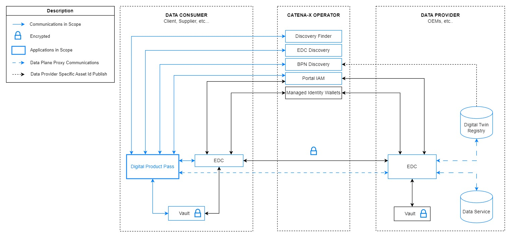

# Introduction

CX-0143 Use Case Circular Economy - Digital Product Passport v1.2.1

:::warning

The following standards was identified as not fully **backward compatibility with CX-Jupiter**  and was allowed to apply the required changes through a **fast-track process** to be included in the CX-Saturn release.
These exceptions will be released together with the  *CX-Saturn Go-Live** of all other standards on **25.11**.

**Therefore, this version of the standard is not eligible for certification yet**

:::

## ABSTRACT

This standard focuses on the digital product passport use case. This includes relevant requirements for

- data provider, that want to provide different passports through Catena-X,
- data consumer, that are searching for different passports in Catena-X, and
- application developer / provider supporting the provisioning and consuming of passport data.

Specific passports that shall be mentioned here are the battery passport and the transmission passport, which are first realizations of product passports in Catena-X.

In this document, keywords for registering and searching digital twins and their passports
submodels are defined.

## FOR WHOM IS THE STANDARD DESIGNED

See the audience and scope [1.1](#11-audience--scope)

## Scope

The Digital Product Passport (DPP) is a cornerstone of the European Union’s strategy to enable a more transparent, sustainable, and circular economy. By digitally linking product and process-related information across the entire value chain, the DPP empowers businesses, regulators, and consumers with reliable, real-time data. This facilitates informed decision-making, enhances traceability, and supports compliance with evolving regulatory frameworks.

Designed with interoperability and scalability in mind, the DPP fosters seamless data exchange between economic actors - particularly small and medium-sized enterprises - while ensuring that regulatory measures remain proportionate and manageable. It plays a vital role in integrating circularity into product design, manufacturing, and lifecycle management. Beyond regulatory compliance, the DPP serves as a strategic tool for efficiency gains by digitizing data exchange between partners and enabling continuous improvement of sustainability standards and policy refinement.

The concept of the Digital Product Passport (DPP) was first introduced through the EU Battery Regulation, which came into force in 2023. This regulation mandated DPPs for batteries used in electric vehicles, industrial applications, and portable electronics. Building on the foundational framework of the Battery Regulation, the European Union expanded the scope of DPPs through the Ecodesign for Sustainable Products Regulation (ESPR), which entered into force in July 2024 (see chapter [References](references#normative-references) ).

### AUDIENCE & SCOPE

> *This section is non-normative*

This document is meant for the following roles:

- Data Provider / Consumer
- Business Application Provider

The standard is of interest to all members of the automotive supply chain including suppliers, OEMs, dismantlers, recyclers and stakeholders within the recycling industry and the circular economy.

Additionally, the standard also applies to software providers and core service providers to ensure interoperability and data sovereignty between different core service providers. The scope of this standard is to define mandatory components, logics and data models as well as give guidance for the provisioning and consuming of product pass information.

### CONTEXT AND ARCHITECTURE FIT

> *This section is non-normative*

Manufacturers of physical goods will have to provide information on different aspects of their products, including components or ingredients, information about the manufacturing itself or information relevant to optimize aspects of repair, reusability or recycling.
This information is stored in in an aggregated form in a "passport", providing information on instances of the product.

Different stakeholders shall be able to read these passports such as legal authorities, dismantlers,
as well as the owner of the product in sense of public persons. This standards defines the basic interactions with passport information as standard for the use case "digital product passport".

This image depicts an overall image of the architecture this standard relates to. Further information can be read in the [Eco Pass KIT](https://eclipse-tractusx.github.io/docs-kits/kits/eco-pass-kit/adoption-view).
The standards related to these components are mentioned in more detail in
[2.1.1 LIST OF STANDALONE STANDARDS](#211-list-of-standalone-standards).

### CONFORMANCE AND PROOF OF CONFORMITY

> *This section is non-normative*
>
> As well as sections marked as non-normative, all authoring guidelines, diagrams, examples, and notes
> in this specification are non-normative. Everything else in this specification is normative.

The key words **MAY**, **MUST**, **MUST NOT**, **OPTIONAL**, **RECOMMENDED**, **REQUIRED**, **SHOULD**
and **SHOULD NOT** in this document document are to be interpreted as described in BCP 14 [RFC2119] [RFC8174]
when, and only when, they appear in all capitals, as shown here.

All participants and their solutions will need to proof, that they are conform with the Catena-X standards.
To validate that the standards are applied correctly, Catena-X employs Conformity Assessment Bodies (CABs).

All participants and their solutions will need to proof, that they are conform with the Catena-X standards.
To validate that the standards are applied correctly, Catena-X employs Conformity Assessment Bodies (CABs).
Since this standard document describes a set of standards to be fulfilled, participants MUST fulfill all mentioned standards listed at [2.1.1 LIST OF STANDALONE STANDARDS](#211-list-of-standalone-standards) and the respective conformity assessment criteria in addition to the specific criteria mentioned in this document. The specific criteria described in this document are describing the usage of the central tools as well as common tools described in the linked standardization documents and therefore compliance should be checked with the tools provided for these components.

In order to proof conformity with this use case digital product pass standard as a
data consumer or app provider demonstrate that you

- can find digital twins containing passport information in the Catena-X data space
- can distinguish the passport submodel information from other submodels within the digital twin
- are compliant with the consuming conditions in [ADDITIONAL REQUIREMENTS](#213-additional-requirements), [APPLICATION PROGRAMMING INTERFACES](#4-application-programming-interfaces) and [DIGITAL TWINS AND SPECIFIC ASSET IDs](#214-digital-twins-and-specific-asset-ids)

In order to proof conformity with this use case digital product pass standard as data provider show that you

- are conform with the provisioning conditions in [ADDITIONAL REQUIREMENTS](#213-additional-requirements), [APPLICATION PROGRAMMING INTERFACES](#4-application-programming-interfaces) and [DIGITAL TWINS AND SPECIFIC ASSET IDs](#214-digital-twins-and-specific-asset-ids)

### EXAMPLES

> *This section is non-normative*

The following examples can be checked as they offer further explanations and guidance how to stay compliant with the standard:

- [Eco Pass KIT](https://eclipse-tractusx.github.io/docs-kits/kits/eco-pass-kit/adoption-view)
- [Tractus-X Digital Product Pass Reference Application](#63-reference-implementations)

### TERMINOLOGY

> *This section is non-normative*

Use case relevant terminologies and explanations can be found in the [Eco Pass KIT](https://eclipse-tractusx.github.io/docs-kits/kits/eco-pass-kit/adoption-view)

The following terms are especially relevant for the understanding of the standard:

- **Asset Administration Shell (AAS):** The AAS is the chosen standard in Catena-X to define digital twins
  of an asset (e.g. a battery or a full vehicle). The AAS, developed by the [Industrial Digital Twin Association](https://industrialdigitaltwin.org/,) is the standardized digital representation of an digital twin asset, the corner stone for the interoperability of Industry 4.0 components organized in Industry 4.0 systems.
- **Business Partner Number (BPN):** A BPN is the unique identifier of a partner within Catena-X as standardized in [CX-0010 Business Partner Number](https://catenax-ev.github.io/docs/next/standards/CX-0010-BusinessPartnerNumber).
- **Ecodesign for Sustainable Products Regulation (ESPR):** The proposed regulation to improve EU products’ circularity, energy performance and other environmental sustainability aspects.
- **Digital Product Passport (DPP):** The Digital Product Passport is the core model of this standard. It can be used as the root class for other, specific, product models. The Passport itself is defined by the usage of Catena-X shared services, a standardized data model and an application which will enable stakeholders to access the relevant data.

## Legal

Copyright © 2025 Catena-X Automotive Network e.V. All rights reserved. For more information, please visit [here](/copyright).
