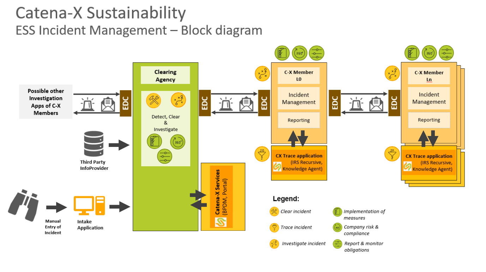

---
tags:
  - UC/ESS
---

# CX-0144 ESS Use Case Standard 1.0.1

## ABSTRACT

Catena-X aims to support supply chain due diligence obligations in a market environment that miss full up- and downstream transparency. This is argued to be relevant for Environmental and Social Standards (ESS) incident tracking, without compromising GAIA-X and Catena-X principles like data sovereignty, interoperability, standardization, and use of federated services.

In case a violation against these laws occurs, an ESS incident can be created and transmitted to the Catena-X network. The Catena-X network and the ESS use case standard support the Catena-X members in this process.

## FOR WHOM IS THE STANDARD DESIGNED

This standard is applicable for:

- Data Provider / Consumer
- Business Application Provider

## COMPARISON WITH THE PREVIOUS VERSION OF THE STANDARD

The ESS incident aspect model, which was described in CX-0113, has been integrated into this document.

## 1 INTRODUCTION

The German Supply Chain Due Diligence Act came into force on January 1st, 2023. This law regulates corporate responsibility for compliance with human rights in global supply chains. These include, for example, protection against child labour, the right to fair wages and the protection of the environment. This legislation can be added to a long list of existing and future legislation that regulate our global supply chains, like the EU Corporate Sustainability Due Diligence Directive (CSDDD), the EU Ecodesign for Sustainable Products Regulation (ESPR), EU Corporate Sustainability Reporting Directive (CRSD), or the International Bill of Human Rights. Companies governed by environmental and social standards (ESS) would like to determine if they are affected by an incident reported in the global supply network. Consequently, they could prove to be fully compliant with legal requirements, including but not limited to the German Supply Chain Due Diligence Act.

### 1.1 AUDIENCE & SCOPE

> *This section is non-normative*

This standard is relevant for the following roles:

- Data Provider / Consumer
- Business Application Provider

This standard is relevant for the Business Domain Sustainability / use case ESS incident. Scope of this document is to provide guidance about the structure of the data model and the processes behind the ESS use case.

Note: Fulfilling a use-case standard by a data provider / consumer can be done in two ways: A) Purchase a certified app for the use-case.
In this case the data provider / consumer does not need to proof conformity again and B) Data Provisioning / Consumption without a certified app for the use-case.
In this case the data provider / consumer needs to proof conformity with all single standards listed in this document.

### 1.2 CONTEXT AND ARCHITECTURE FIT

> *This section is non-normative*

In order to effectively manage ESS incidents in the supply chain, a standardized approach to capturing and exchanging ESS incident data is essential. A standardized ESS Incident data model and common guidelines for the data exchange as defined in the Catena-X network provide a structured framework for collecting, organizing, and sharing ESS incident information across industries and stakeholders. Thus, the ESS use case standard supports collaboration and taking measures to ensure that the legal regulations are followed.

To participate in the ESS use case, the following single standards mentioned in chapter REFERENCES MUST be fulfilled by all participants for which the standard is relevant.

### 1.3 CONFORMANCE AND PROOF OF CONFORMITY

> *This section is non-normative*

As well as sections marked as non-normative, all authoring guidelines, diagrams, examples, and notes in this specification are non-normative. Everything else in this specification is normative.

The key words **MAY, MUST, MUST NOT, OPTIONAL, RECOMMENDED, REQUIRED, SHOULD** and **SHOULD NOT** in this document are to be interpreted as described in BCP 14 \[RFC2119\] \[RFC8174\] when, and only when, they appear in all capitals, as shown here.

All participants and their solutions will need to prove that they conform with the Catena-X standards. To validate that the standards are applied correctly, Catena-X employs Conformity Assessment Bodies (CABs).

### 1.4 EXAMPLES

For examples please refer to [ESS KIT](https://eclipse-tractusx.github.io/docs-kits/category/ess-kit).

### 1.5 TERMINOLOGY

> *This section is non-normative*

Business Partner Number (BPN): A BPN is the unique identifier of a partner within Catena-X with BPN-L, BPN- S, BPN-A

ESS: Environmental and Social Standards ESS incident: An incident violating Environmental and / or Social Standards

IRS: Recursive Item Relationship is a service that can be used to recursively trace a supply chain

KA: Knowledge Agent is a standard to bring semantic web protocols into dataspaces

## 2 RELEVANT PARTS OF THE STANDARD FOR SPECIFIC USE CASES

> *This section is normantive*

### 2.1 ESS use case

#### 2.1.1 LIST OF STANDALONE STANDARDS

The standards from other use cases that are applicable here, are listed in chapter NORMATIVE REFERENCES.

#### 2.1.2 DATA REQUIRED

The mandatory data described in the aspect model MUST be provided by data providers. The optional data described in the aspect model SHOULD be provided by data providers. The mandatory data MUST be consumed by the data consumers. The optional data SHOULD be consumed by the data consumers.

Mandatory data MUST be managed by the Business Application Providers. Optional data SHOULD be managed by the Business Application Providers.

#### 2.1.3 POLICY CONSTRAINTS FOR DATA EXCHANGE

In alignment with our commitment to data sovereignty, a specific framework governing the utilization of data within the Catena-X use cases has been outlined.  As part of this data sovereignty framework, conventions for access policies, for usage policies and for the constraints contained in the policies have been specified in standard 'CX-0152 Policy Constraints for Data Exchange'. This standard document CX-0152 **MUST** be followed when providing services or apps for data sharing/consuming and when sharing or consuming data in the Catena-X ecosystem. What conventions are relevant for what roles named in [1.1 AUDIENCE & SCOPE](#11-audience--scope) is specified in the CX-0152 standard document as well. CX-0152 can be found in the [standard library](https://catenax-ev.github.io/docs/standards/overview).

#### 2.1.4 ADDITIONAL REQUIREMENTS

The standards mentioned in chapter REFERENCES MUST be fulfilled by all participants for which the standard is relevant.

## 3 ASPECT MODELS

> *This section is normantive*

### 3.1 ASPECT MODEL "essIncident"

#### 3.1.1 INTRODUCTION

This chapter describes the semantic model essIncident used in the Catena-X network.

see TABLES

#### 3.1.2 SPECIFICATIONS ARTIFACTS

see FORMATS OF SEMANTIC MODEL

#### 3.1.3 LICENSE

This Catena-X data model is made available under the terms of the Creative Commons Attribution 4.0 International (CC-BY-4.0) license, which is available at Creative Commons.

#### 3.1.4 IDENTIFIER OF SEMANTIC MODEL

The semantic model has a unique identifier.
https://github.com/eclipse-tractusx/sldt-semantic-models/tree/main/io.catenax.essincident
version 3.0.0

urn:bamm:io.catenax.essincident:3.0.0

#### 3.1.5 FORMATS OF SEMANTIC MODEL

All different formats of the semantic model can be found in the github repository.

[https://github.com/eclipse-tractusx/sldt-semantic-models/tree/4d239fc5709f71f39c3cf13581b5bcf960905157/io.catenax.essincident/3.0.0](https://github.com/eclipse-tractusx/sldt-semantic-models/tree/4d239fc5709f71f39c3cf13581b5bcf960905157/io.catenax.essincident/3.0.0)

##### 3.1.5.1 RDF TURTLE

The rdf turtle file, an instance of the Semantic Aspect Meta Model, is the master for generating additional file formats and serializations.

https://github.com/eclipse-tractusx/sldt-semantic-models/blob/4d239fc5709f71f39c3cf13581b5bcf960905157/io.catenax.essincident/3.0.0/EssIncident.ttl

The open-source command line tool of the Eclipse Semantic Modeling Framework is used for generation of other file formats like for example a JSON Schema, aasx for Asset Administration Shell Submodel Template or a HTML documentation.

https://github.com/eclipse-tractusx/sldt-semantic-models/tree/4d239fc5709f71f39c3cf13581b5bcf960905157/io.catenax.essincident/3.0.0/gen

##### 3.1.5.2 JSON SCHEMA

A JSON Schema can be generated from the RDF Turtle file. The JSON Schema defines the Value-Only payload of the Asset Administration Shell for the API operation \"GetSubmodel\".

https://github.com/eclipse-tractusx/sldt-semantic-models/blob/4d239fc5709f71f39c3cf13581b5bcf960905157/io.catenax.essincident/3.0.0/gen/EssIncident-schema.json

##### 3.1.5.3 AASX

An AASX file can be generated from the RDF Turtle file. The AASX file defines one of the requested artifacts for a Submodel Template Specification conformant to \\ \[\[SMT\](#32-non-normative-references)\].

Note: As soon as the specification V3.0 of the Asset Administration Shell specification is available an update will be provided.

https://github.com/eclipse-tractusx/sldt-semantic-models/blob/4d239fc5709f71f39c3cf13581b5bcf960905157/io.catenax.essincident/3.0.0/gen/EssIncident.aasx

##### 3.1.5.4 JSON SAMPLE

```JSON
{
  "flagAnonymous": false,
  "incidentStatusInformation": "new",
  "essIncidentIssuerLastName": "Testuser Last name",
  "rawMaterial": "Natural Rubber",
  "industry": "Extraction of raw materials",
  "subCaseOpCoIds": "9f47b3c8-b6d4-44f1-99ba-6bdb33916cac, 9f47b3c8-b6d4-44f1-99ba-6bdb33916cad",
  "incidentSubcategory": "Child labour",
  "incidentSubject": "Child labour on rubber producer Farm A",
  "essIncidentIssuerAddress": {
    "locality": {
      "value": "Mannheim",
      "technicalKey": "BLOCK"
    },
    "country": {
      "shortName": ""
    },
    "postCode": {
      "value": "68161\\12",
      "technicalKey": "CEDEX"
    },
    "thoroughfare": {
      "value": "Bernstra?e",
      "number": "45",
      "technicalKey": "STREET"
    },
    "premise": {
      "value": "Werk 1",
      "technicalKey": "BUILDING"
    },
    "postalDeliveryPoint": {
      "value": "Tor 1",
      "technicalKey": "INTERURBAN_DELIVERY_POINT"
    }
  },
  "essOriginatorCompanyName": "Rubbery Ltd.",
  "essOriginatorCountrySubdivision": "BR-SP",
  "productCommodity": "Tire",
  "essOriginatorAddress": {
    "locality": {
      "value": "Mannheim",
      "technicalKey": "BLOCK"
    },
    "country": {
      "shortName": ""
    },
    "postCode": {
      "value": "68161\\12",
      "technicalKey": "CEDEX"
    },
    "thoroughfare": {
      "value": "Bernstra?e",
      "number": "45",
      "technicalKey": "STREET"
    },
    "premise": {
      "value": "Werk 1",
      "technicalKey": "BUILDING"
    },
    "postalDeliveryPoint": {
      "value": "Tor 1",
      "technicalKey": "INTERURBAN_DELIVERY_POINT"
    }
  },
  "incidentCategory": "Environmental",
  "incidentAttachment": "telnet://192.0.2.16:80/",
  "productDescription": "Natural Rubber",
  "essOriginatorBpnA": "BPNA1234567890ZZ",
  "essIncidentIssuerPhoneNo": "+49-123-456789",
  "incidentExternalSubject": "Child labour on a rubber producer farm",
  "incidentShareFlag": false,
  "incidentExternalNotes": "Child labour at production site of a rubber producer in Brazil",
  "essIncidentIssuerFirstName": "Testuser First name",
  "essIncidentIssuerId": "9a47b3c8-b6d4-44f1-99ba-6bdb33916cac",
  "masterOpCoId": "9f47b3c8-b6d4-44f1-99ba-6bdb33916cac",
  "incidentSystemId": "123456789",
  "essOriginatorBpnL": "BPNL1234567890ZZ",
  "essOriginatorCoordinates": {
    "longitude": "-79.517415",
    "latitude": "-5.422077"
  },
  "essIncidentIssuerCountrySubdivision": "IN-AP",
  "essIncidentIssuerEmailAddress": "test@example.com",
  "essOriginatorBpnS": "BPNS1234567890ZZ",
  "systemDate": "2022-08-31T23:22:12Z",
  "incidentDisplayId": "123456789101",
  "incidentDate": "2022-08-31T00:00:00Z",
  "incidentId": "9f47b3c8-b6d4-44f1-99ba-6bdb33916cac",
  "incidentDescription": "Child labour at production site of the rubber producer Farm A in Brazil"
}
```

## 4 APPLICATION PROGRAMMING INTERFACES

> *This section is normantive*

Not applicable as no implemented application available.

## 5 PROCESSES

> *This section is normantive*

The ESS Incident management process is further described and illustrated in the [ESS KIT](https://eclipse-tractusx.github.io/docs-kits/category/ess-kit).



### 5.1 INTAKE APPLICATION - CLEARING AGENCY

An incident has been reported to the Catena-X network. The incident can be reported manually e.g. by a whistleblower or automated by a Third Party InfoProvider. The unstructured information (text and/or pictures) about each incident will be collected along with country-, company-, material-related data if available.

### 5.2 CLEARING AGENCY - CATENA-X SERVICES

The Clearing Agency is prompted to clear incidents. This independent body has the tasks among others, to improve quality of data and reduce fraud or fakes. This includes but is not limited to, manual search and input from expert, consolidation of reports of the same incident and finally accept or archive incidents.

The use case ESS is convinced that the most promising way to solve an ESS incident will be a bottom-up approach. Once the Clearing Agency found that the incident\'s originator (here called: L0) is a Catena-X member, the Clearing Agency can use Catena-X Services find out the BPN-L, BPN-S and the EDC endpoints of the incident originator. Then the ESS incident is transferred to the incident originator via the Catena-X network.

In case no Catena-X member can be identified as incident originator, the clearing agency will maintain the corresponding status "no member found".

If a Catena-X member wants to find out if a certain product is affected by an incident a top-down approach can be used. The Clearing Agency can initiate an occasion-related trace if a Catena-X member is affected by an ESS incident. To do so, the BPN-S of the incident originator and the product information, that shall be investigated, can be used to find out if a Catena-X member is affected or not. A spike has been implemented by recursive IRS to test this scenario.

### 5.3 CATENA-X SERVICES - CLEARING AGENCY

The Catena-X Services will return the requested information about the Catena-X incident originator.
In case no Catena-X member can be identified, this result will be returned to the Clearing Agency.

### 5.4 CLEARING-AGENCY - CATENA-X MEMBER L0

The Clearing Agency addresses the Catena-X Member L0 via the Catena-X network and transfers all information that is available about the ESS incident.
The Clearing Agency must prepare and fill in the fields for external communication (anonymized data) for the data transfer to Catena-X Members LN.

### 5.5 CATENA-X MEMBER L0 - CATENA-X TRACE APPLICATION

The Catena-X Member L0 receives, hosts and investigates the ESS incident. The Catena-X Member L0 is responsible for defining appropriate measures about the ESS incident.

To find affected Business Partners, Catena-X Member L0 can use Catena-X trace services like recursive IRS or Knowledge Agent. So, affected customers (respectively suppliers in case of a top-down approach) and their BPN-numbers and EDC endpoints can be identified.

### 5.6 CATENA-X TRACE APPLICATION - CATENA-X MEMBER L0

Catena-X trace services like recursive IRS or Knowledge Agent will return the requested information about the Catena-X Business Partners.

## 5.7 CATENA-X MEMBER L0 - CATENA-X MEMBER L1

Catena-X Member L0 will address Catena-X Member(s) L1 via the Catena-X network.

L1 Business partners have a direct relationship with L0. As already supported in existing legislation, L1 Business partners will have access to the status of the ESS incident and full information about this incident.

## 5.8 CATENA-X MEMBER L1 - C-X Member LN

To find affected Business Partners, Catena-X Member L1 can use Catena-X trace services like recursive IRS or Knowledge Agent. So, affected customers for a bottom-up approach, respectively affected suppliers in case of a top-down approach, along with their BPN-numbers and EDC endpoints can be identified.

Catena-X Members LN have an indirect relationship with the potential incident originator L0. They will receive anonymized incident information and relevant changes about the incident (anonymized data, incident category, incident subcategory, incident status etc.).

In case of a bottom-up approach, the process moves from Business partner to Business partner up the supply chain with the incident originator as the starting point.
In case of a top-down approach, the process moves from Business partner to Business partner down the supply chain until the incident originator can be reached.

### 5.9 CATENA-X Member L0 - CLEARING AGENCY

As soon as the Catena-X member L0 has fulfilled his duties and defined measures about the ESS incident according to the agreed Code of Conduct, the incident can be closed. The Catena-X Member L0 reports to the Clearing Agency that the incident can be closed.

The Clearing Agency sets the status to closed.

## 6 REFERENCES

### 6.1 NORMATIVE REFERENCES

> *This section is normative*

- CX-0001 EDC Discovery API 1.0.2
- CX-0003 BAMM Aspect Meta Model 1.1.0
- CX-0005 Item Relationship Service 2.0.0
- CX-0006 Registration and initial onboarding 1.1.3
- CX-0010 Business Partner Number 2.0.0
- CX-0014 Employees and Technical Users 1.0.1
- CX-0015 IAM & Access Control Paradigm 1.0.1
- CX-0016 Company Attribute Verification 1.1.0
- CX-0017 Company Role by the Connector 1.1.0
- CX-0018 Eclipse Data Space Connector (EDC) 2.1.0
- CX-0049 DID Document Schema 1.0.0
- CX-0050 Framework Agreement Credential 1.0.0
- CX-0053 BPN Discovery Services 1.0.1
- CX-0067 Ontology models in Catena-X 1.0.0
- CX-0084 Federated Queries in Data Spaces 1.0.0
- CX-0152 Policy Constraints for Data Exchange 1.0.0

### 6.2 NON-NORMATIVE REFERENCES

> *This section is non-normative*

The principles and requirements described in the ESS - code of conduct shall be followed by all participants of the ESS use case.
Further information can be found in the [ESS KIT](https://eclipse-tractusx.github.io/docs-kits/category/ess-kit).

### 6.3 REFERENCE IMPLEMENTATIONS

> *This section is non-normative*

Two spikes have been implemented for the tracing of an ESS incident:

Recursive IRS - a spike has been implemented for a top-down approach (not preferred approach) in the kit:
[Traceability KIT | Eclipse Tractus-X (eclipse-tractusx.github.io)](https://eclipse-tractusx.github.io/docs-kits/category/traceability-kit)

Knowledge Agent – has been implemented in a reference environment by the consortia for a bottom – up approach (preferred approach) using the kit:  
[Agents Kit | Eclipse Tractus-X (eclipse-tractusx.github.io)](https://eclipse-tractusx.github.io/docs-kits/category/agents-kit)

## ANNEXES

### FIGURES

> *This section is non-normative*


### TABLES

> *This section is non-normative*

#### SEMANTIC MODEL

##### Incident Information

| **Attribute Name** | **Type** | **Description** | **Optional or Mandatory** | **Example** |
|--------------------|----------|-----------------|--------------------------|-------------|
| incidenCategory | String, value from list | Environmental and social standards related according to Supply Chain Due Diligence Act | M | Social |
| incidentSubcategory | String, value from list | Subcategory of an incident | M | Child labour |
| incidentSubject | String | Subject of an ESS incident | O | Child labour in country A on rubber producer "Farm A" |
| incidentExternalSubject | String | Replaces subject valid for external communication (anonymized data) | O | Child labour on rubber producer farm |
| incidentDescription | String | Full text description of an incident in the context of ESS | M | Small children under the age of 15 cleaning barrels with bare hands on rubber producer "Farm A" |
| incidentExternalNotes | String | Replaces description valid for external communication (anonymized data) | O | Small children under the age of 15 cleaning barrels with bare hands on rubber producer farm |
| incidentAttachment | URI | Picture(s) about the reported incident in the context of ESS (Environmental and Social Standards) | O | URL-link to picture |
| systemDate | DateTime | System created timestamp when the incident in the context of ESS (Environmental and Social Standards) was issued and saved | M | 2022-08-31T23:22:12Z |
| incidentDate | DateTime | Date and time information about the incident in the context of ESS (Environmental and Social Standards) | M | 2022-08-31T00:00:00Z |
| incidentId | UUIDv4 | Unique identifier for an incident in the context of ESS (Environmental and Social Standards) | M | 9f47b3c8-b6d4-44f1-99ba-6bdb33916cac |
| masterOpCoId | UUIDv4 | Incident ID that has been checked and validated. In case of duplicates the "parent" incident ID will be used as Master Operating Company ID | O | 9f47b3c8-b6d4-44f1-99ba-6bdb33916cac |
| subCaseOpCoIds | String | The related incidents that belong to a masterOpCoId, e.g. comma separated UUIDs | O | 9f47b3c8-b6d4-44f1-99ba-6bdb33916cac, 9f47b3c8-b6d4-44f1-99ba-6bdb33916cad |
| incidentStatusInformation | String, value from list | Status of incident progress, (default = new, in cleansing, in process, completed, closed)  | M | new |
| incidentDisplayId | String | Human readable format of Incident ID | O | 123456789101 |
| incidentShareFlag | Bool | Flag, that can be set to true to request to publish the incident, default = false | M | false |
| incidentSystemId | String | SystemID that defines the system of origin | O | 123456789 |

##### Product Information

| **Attribute Name** | **Type** | **Description** | **Optional or Mandatory** | **Example** |
|--------------------|----------|-----------------|--------------------------|-------------|
| productCommodity | String | Free-text description for commodity of a product affected by an incident in the context of ESS (Environmental and Social Standards) | O | Rubber |
| productDescription | String | Description of product or component affected by an incident in the context of ESS (Environmental and Social Standards) | O | Natural Rubber |
| rawMaterial | String | Raw material that causes an incident in the context of ESS (Environmental and Social Standards) | O | Natural Rubber |
| industry | String, value from list | Industry/ Branch that causes the incident according to questionnaire BAFA: Extraction of raw materials, Manufacture of components/intermediates, Manufacture of final products, Distribution/Trade, Waste treatment/recycling, Services,  Lending/financing/insurance, Other | O | Extraction of raw materials |

##### Company Information

| **Attribute Name** | **Type** | **Description** | **Optional or Mandatory** | **Example** |
|--------------------|----------|-----------------|--------------------------|-------------|
| essOriginatorCountrySubdivision | String | Region within a country to which an ESS incident belongs | O | BR-SP |
| essOriginatorCoordinates | String | Longitude and Latitude that define exact geographic position of an incident in the context of ESS (Environmental and Social Standards) respectively GPS data | O | Latitude: -5.422077; Longitude: -79.517415 |
| essOriginatorCompanyName | String | Name of a company / an organisation that is the originator of an incident in the context of ESS (Environmental and Social Standards) | O | Rubbery Ltd. |
| essOriginatorAddress | String | Address of ESS originator (street, zip code, city) | O | Mainroad 1, 73230 Model City |
| essOriginatorBpnL | String | BPN-L of the company that causes the incident | O | BPNL1234567890ZZ |
| essOriginatorBpnS | String | BPN-S of the company that causes the incident | O | BPNS1234567890ZZ |
| essOriginatorBpnA | String | BPN-A of the company that causes the incident | O | BPNA1234567890ZZ |

##### ESS Contact Information

| **Attribute Name** | **Type** | **Description** | **Optional or Mandatory** | **Example** |
|--------------------|----------|-----------------|--------------------------|-------------|
| essIncidentIssuerFirstName | String | First name of ESS incident issuer | O | Testuser First name |
| essIncidentIssuerLastName | String | Last name of ESS incident issuer | O | Testuser Last name |
| essIncidentIssuerEmailAddress | String | Mail address of ESS incident issuer | O | test@example.com |
| essIncidentIssuerPhoneNo | String | Phone number of ESS incident issuer | O | +49-123-456789 |
| essIncidentIssuerAddress | String | Address of ESS incident issuer | O | XYZ-Road 73230 Model City |
| essIncidentIssuerCountrySubdivision | String | Region within a country to which an ESS incident issuer | O | IN-AP |
| essIncidentIssuerId | UUIDv4 | System generated unique identifier of incident issuer | M | 9a47b3c8-b6d4-44f1-99ba-6bdb33916cac |
| flagAnonymous | Bool | Flag that indicates if the ESS incident issuer wants to be anonymous | M | false |

## Legal

Copyright © 2025 Catena-X Automotive Network e.V. All rights reserved. For more information, please visit [here](/copyright).
