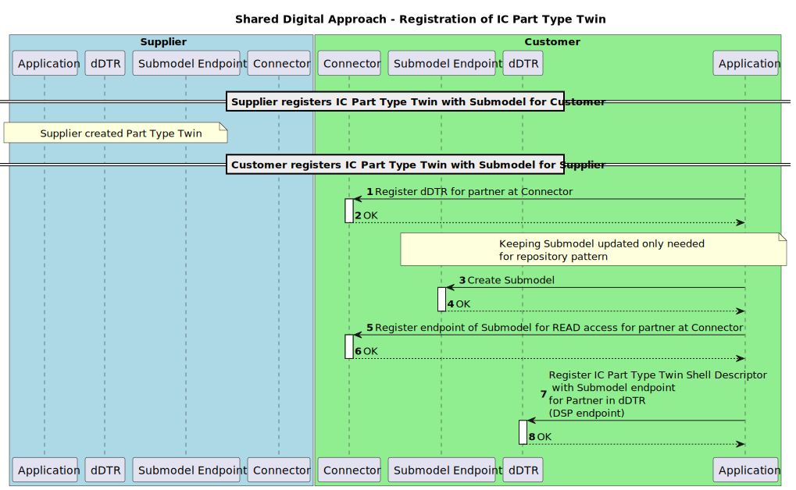

---
tags:
  - CAT/Business Application Provider
  - UC/PURIS
---

# CX-0145 Days of supply Exchange 1.0.1

## ABSTRACT

*Days of Supply (DoS)* in logistics is a critical metric used to estimate how long current inventory
levels will last under normal consumption patterns. This calculation is essential in supply chain
management as it assists in forecasting when stock replenishment is needed, thereby preventing stock
shortages or overstocking. It plays a significant role in ensuring efficient inventory turnover,
maintaining a balance between having enough stock to meet demand and avoiding excess inventory that
ties up capital.

To effectively address the challenges associated with manual calculation and estimation of *Days of Supply*, the standardization and interoperable exchange of this data among Catena-X business
partners is essential. Establishing a standardized semantic definition to describe *Days of Supply* and a common API is a fundamental step to enable this exchange and foster compatibility. This
approach maximizes the range of solutions available to mitigate potential supply shortages and
supports precise inventory planning.

## FOR WHOM IS THE STANDARD DESIGNED

## COMPARISON WITH THE PREVIOUS VERSION OF THE STANDARD

This is the first version of the standard.

## 1 INTRODUCTION

In the intricate frameworks of supply chain management and manufacturing, the *Days of Supply* metric emerges as a critical tool for optimizing inventory levels and ensuring effective planning.
It measures how long the current inventory will suffice to meet future demands under the assumption
that no additional inventory is received. This key figure, calculated in days, is essential for
maintaining efficient inventory turnover and preventing both shortages and excesses that can impact
business operations.

Effective monitoring and calculation of *Days of Supply* are paramount for businesses to anticipate
and mitigate potential inventory imbalances. However, accurately capturing and analyzing this data
poses a significant challenge, as conventional methods and systems may not offer comprehensive
support for this nuanced metric.

The necessity for a standardized and semantically precise definition of *Days of Supply* cannot be
overstated. By establishing clear standards for this metric, supply chain participants can ensure
interoperable data exchange, enhancing collaboration and operational efficiency across the board.
This initiative not only aids in avoiding inventory-related issues but also contributes to more
streamlined and responsive supply chain operations.

The initiative towards standardizing *Days of Supply* is aimed at providing businesses with the
tools they need for more effective inventory and production planning, enabling them to improve
process efficiency, minimize risks of inventory mismatches, and bolster overall supply chain
resilience.

*Days of Supply* can be applied in various use cases in logistics and supply chain management:

1. **Manufacturing Sector** : Manufacturers rely on it to maintain adequate levels of raw materials
   and components, ensuring uninterrupted production lines.
2. **Retail Industry** : Retailers use it to manage inventory levels of fast-moving consumer goods.
   They can predict when they need to reorder items to avoid stockouts, especially during peak
   shopping seasons.
3. **Healthcare and Pharmaceuticals** : It's crucial for managing the inventory of medicines and
   medical supplies, particularly those with short shelf lives or critical to patient care.

### 1.1 AUDIENCE & SCOPE

> *This section is non-normative*

This standard is relevant for the following roles defined in [[CX-OMW]](#62-non-normative-references):

- **Data Providers**  willing to provide *Days of Supply* data
- **Data Consumers**  interested in requesting and receiving *Days of Supply* data
- **Business Application Providers** interested in providing solutions implementing this standard
- **Consulting Services Providers** interested in supporting companies fulfilling the standard

The scope of this standard is only the *Days of Supply* aspect model and the corresponding API usage.
It describes the exchange of *Days of Supply* data through a connector compliant with [[CX-0018]](#61-normative-references).

### 1.2 CONTEXT AND ARCHITECTURE FIT

> *This section is non-normative*

In a typical item manufacturing and procurement process, a company determines the need to maintain
stock levels to meet demand. As part of this process, *Days of Supply* typically refers to metrics
or details about how long the existing inventory will last to satisfy current demand without
additional delivery or production. It includes calculations on the number of days the current
inventory is expected to meet demand based on average daily consumption. This metric provides key
insights into inventory efficiency and assists in planning reorders to ensure continuous operation
and is crucial for maintaining efficient inventory management and ensuring a smooth supply chain.

Within the framework of the Catena-X network, this standard defines the *DaysOfSupply* aspect model.
Its purpose is to establish a consistent and uniform interpretation and handling of *Days of Supply*
among all interested parties, ensuring that this data is understood and managed in the same manner
by all stakeholders.

*Figure 1* shows the high-level architecture of the *Days of Supply* exchange in the Catena-X
dataspace and the services that are involved. Both the data provider and the data consumer must be
members of the Catena-X network in order to communicate with each other.  With the help of
Credential Service and the Identity Access Management (IAM) each participant can authenticate
itself, verify the identity of the requesting party and decide whether to authorize the request. The
*Days of Supply* data is provisioned in accordance with [[CX-0002]](#61-normative-references).


*Figure 1: High-level architecture of the Days of Supply in the Catena-X*

### 1.3 CONFORMANCE AND PROOF OF CONFORMITY

> *This section is non-normative*

The sections marked as non-normative, all authoring guidelines, diagrams, examples, and notes in
this specification are non-normative. Everything else in this specification is normative. The key
words  **MAY** ,  **MUST** ,  **MUST NOT** ,  **OPTIONAL** ,  **RECOMMENDED** ,  **REQUIRED** ,
**SHOULD** and  **SHOULD NOT** in this document are to be interpreted as described in [BCP 14]
[[RFC2119]](#62-non-normative-references) [[RFC8174]](#62-non-normative-references) when, and only when, they appear in all capitals, as shown here.

All participants and their solutions will need to prove that they are conform with the Catena-X
standards. To validate that the standards are applied correctly, Catena-X employs Conformity
Assessment Bodies (CABs). The proof of conformity for a single semantic model is done according to
the general rules for proving the conformity of data provided to a semantic model or the ability to
consume the corresponding data. Furthermore participants agree to follow the normative language of
this standardization document and to implement the required API-Endpoints described in [Chapter 4](#4-application-programming-interfaces).

### 1.4 EXAMPLES

The following JSONs provide an example of the value-only serialization of the "*Days Of Supply*"
aspect model for Days of Supply for one (see example one) and multiple days of supply (see example
too).

Value-only JSON serialization of the with present day values of days of supply - "DoS for one day only".

```json
{
  "materialGlobalAssetId": "urn:uuid:48878d48-6f1d-47f5-8ded-a441d0d879df",
  "allocatedDaysOfSupply": [
    {
      "stockLocationBPNA": "BPNA1234567890ZZ",
      "lastUpdatedOnDateTime": "2023-04-28T14:23:00.123456+14:00",
      "amountOfAllocatedDaysOfSupply": [
        {
          "date": "2024-01-01T14:23:00+01:00",
          "daysOfSupply": 3.51
        }
      ],
      "stockLocationBPNS": "BPNS1234567890ZZ"
    }
  ],
  "direction": "INBOUND"
}
```

Value-only JSON serialization of the with present day and two additional consecutive dates paired with
days of supply values  - "DoS for multiple days".

```json
{
  "materialGlobalAssetId": "urn:uuid:48878d48-6f1d-47f5-8ded-a441d0d879df",
  "allocatedDaysOfSupply": [
    {
      "stockLocationBPNA": "BPNA1234567890ZZ",
      "lastUpdatedOnDateTime": "2023-04-28T14:23:00.123456+14:00",
      "amountOfAllocatedDaysOfSupply": [
        {
          "date": "2024-02-01T14:23:00+01:00",
          "daysOfSupply": 3.51
        },
        {
          "date": "2024-02-02T14:23:00+01:00",
          "daysOfSupply": 4.25
        },
        {
          "date": "2024-02-03T14:23:00+01:00",
          "daysOfSupply": 2.78
        }
      ],
      "stockLocationBPNS": "BPNS1234567890ZZ"
    }
  ],
  "direction": "INBOUND"
}
```

### 1.5 TERMINOLOGY

> *This section is non-normative*

| **Name** | **Abrev.** | **Description** |
| --- | --- | --- |
| **Business Partner Number** | BPN | A BPN is the unique identifier of a partner within Catena-X as defined in [[CX-0010]](#61-normative-references). |
| **Business Partner Number Site** | BPNS | A BPNS is the unique identifier of a partner site within Catena-X as defined in [[CX-0010]](#61-normative-references). |
| **Business Partner Number Address** | BPNA | A BPNA is the unique identifier of a partner address within Catena-X as defined in [[CX-0010]](#61-normative-references). |
| **Direction** | / | Direction of the stock from data provider perspective. |
| **Date** | / | Date refers to the specific calendar day (current or projected) associated with the measured (or expected) inventory level. It serves as a timestamp for calculating Days of Supply, indicating when the inventory count was taken or projected. |
| **Days of Supply** | DoS | Amount of days, before the current stock is expected to be exhausted.  <br /> <br />  Days of supply of a customer:  <br />  <br /> Number of days where;  <br />  (Stock) - Σ(daily Demand) >= 0  <br />  <br />  Days of supply of a supplier:  <br /> <br />   Number of days where;  <br />  (Stock) - Σ(daily Outgoing Shipments) >= 0 |
| **Allocated Days of Supply** | / | Defines the number of days with allocated supply for an item stock in a given location that is available for the use in production or deliveries. The allocated days of supply are not available for other customers. |
| **Digital Twin** | DT | Digital representation of an asset that provides data on aspects of the represented data following [[CX-0002]](#61-normative-references). |
| **decentralized Digital Twin Registry** | dDTR | Component providing registration and discovery API implementations following [[CX-0002]](#61-normative-references). Sometimes referred to without the "decentralized" BUT in Catena-X those are always decentralized. |
| **Asset Administration Shell** | AAS | Technical concept for Digital Twins consisting of different standards. Application in Catena-X is described in Digital Twins in Catena-X standard ([[CX-0002]](#61-normative-references))  |
| **Shell Descriptor** | | Technical concept of the AAS API describing metadata of an Asset Administration Shell representing a Digital Twin. It holds identification information and metadata about which submodels are available and where to get the data from (see [[CX-0002]](#61-normative-references), [[IDTA-01002-3-0]](#62-non-normative-references)). There may exist multiple Shell Descriptor for the same represented Asset (see [[CX-0126]](#61-normative-references)). |
| **Submodel Descriptor** | | Technical concept of the AAS API describing metadata of Submodels within a Shell Descriptor (Asset Administration Shell) (see [[CX-0002]](#61-normative-references), [[IDTA-01002-3-0]](#62-non-normative-references)). |
| **Specific Asset Ids** | | Identifiers of the Shell Descriptor (Asset Administration Shell) that refer to common identification data for an asset/material at hand e.g., manufacturer part Id. Common specific asset ids used for identification are described in Industry Core Part Type Standard (see [[CX-0126]](#61-normative-references)). |
| **Asset Administration Shell Identifier** | AAS ID | Also referred to as Shell Descriptor id, is the technical identifier of the Shell Descriptor.  |
| **Global Asset Id** | | Also referred to as Catena-X Id, is the Catena-X identifier for assets represented by Digital Twins (see [[CX-0126]](#61-normative-references)). |
| **Aspect** | | A domain-specific view on information and functionality associated with a specific Digital Twin with a reference to a concrete Aspect Model (see [[CX-0002]](#61-normative-references)). Within Catena-X, an aspect is formally described using the Semantic Aspect Meta Model (see [[CX-0003]](#61-normative-references)). |
| **Semantic Id** | | Identifier including namespace to specify the semantic description of submodels using the Semantic Aspect Meta Model (SAMM). It allows partners to know the exact data format and semantics when e.g., browsing catalogs (see [[CX-0003]](#61-normative-references)). |
| **Data Space Protocol** | DSP | A set of specifications designed to facilitate interoperable data sharing between entities governed by usage control and based on Web technologies. These specifications define the schemas and protocols required for entities to publish data, negotiate Agreements, and access data as part of a Dataspace. It is governed by the International Data Spaces Association. Connectors compliant to [[CX-0018]](#61-normative-references) support the Data Space Protocol. |
| **Shared Asset Approach** | | Digital twin pattern in which each party has a twin for the same asset (Part Type). They share the same identification data in terms of specific asset ids and global asset id. The digital twins do have different technical identifiers. |

*Table 1: Terminology Days of Supply Exchange Standard*

Additional terminology used in this standard can be looked up in the glossary on the association homepage.

## 2 RELEVANT PARTS OF THE STANDARD FOR SPECIFIC USE CASES

> *This section is normative*

### 2.1 "DAYS OF SUPPLY"

#### 2.1.1 LIST OF STANDALONE STANDARDS

| **Number** | **Standard** | **Version** |
| --- | --- | --- |
| [[CX-0001]](#61-normative-references) | EDC Discovery API | 1.0.2 |
| [[CX-0002]](#61-normative-references) | Digital Twins in Catena-X | 2.2.0 |
| [[CX-0003]](#61-normative-references) | SAMM Aspect Meta Model | 1.1.0 |
| [[CX-0006]](#61-normative-references) | Registration and initial onboarding | 2.0.0 |
| [[CX-0010]](#61-normative-references) | Business Partner Number (BPN) | 2.0.0 |
| [[CX-0018]](#61-normative-references) | Dataspace Connectivity | 3.0.0 |
| [[CX-0126]](#61-normative-references) | Industry Core Part Type | 2.0.0 |

*Table 2: List of mandatory standards*

The usage of this standard may be complemented with the following Catena-X standards to further extend
the range of shortage prevention possibilities:

| **Number** | **Standard** | **Version** |
| --- | --- | --- |
| [[CX-0118]](#61-normative-references) | Delivery Information Exchange | 2.0.0 |
| [[CX-0120]](#61-normative-references) | Short-term Material Demand Exchange | 2.0.0 |
| [[CX-0121]](#61-normative-references) | Planned Production Output Exchange | 2.0.0 |
| [[CX-0122]](#61-normative-references) | Item Stock Exchange | 2.0.0 |
| [[CX-0146]](#61-normative-references) | Supply Chain Disruption Notifications | 1.0.0 |

*Table 3: List of* *non-mandatory* *complementary standards*

#### 2.1.2 DATA REQUIRED

No additional data requirements.

#### 2.1.3 ADDITIONAL REQUIREMENTS

##### POLICY CONSTRAINTS FOR DATA EXCHANGE

In alignment with our commitment to data sovereignty, a specific framework governing the utilization of data within the Catena-X use cases has been outlined.  As part of this data sovereignty framework, conventions for access policies, for usage policies and for the constraints contained in the policies have been specified in standard 'CX-0152 Policy Constraints for Data Exchange'. This standard document CX-0152 **MUST** be followed when providing services or apps for data sharing/consuming and when sharing or consuming data in the Catena-X ecosystem. What conventions are relevant for what roles named in [1.1 AUDIENCE & SCOPE](#11-audience--scope) is specified in the CX-0152 standard document as well. CX-0152 can be found in the [standard library](https://catenax-ev.github.io/docs/standards/overview).

##### REMINDER OF ANTITRUST

Notice and/or acknowledgement concepts to raise awareness of antitrust issues during use of this standard
are **RECOMMENDED**, for example through the implementation of a help desk or pop-up info.

#### 2.1.4 DIGITAL TWINS AND SPECIFIC ASSET IDs

This standard builds upon the Industry Core Part Type [[CX-0126]](#61-normative-references) and the Digital Twins in
Catena-X [[CX-0002]](#61-normative-references) standards. It follows the following design patterns:

- Usage of Digital Twins as shared assets to follow a pull approach for data.
- Usage of the specific asset IDs and further identification data for the Digital Twin for the Part Type
  (see [[CX-0126]](#61-normative-references)).
- Provisioning of the *PartTypeInformation* on supplier side (see [[CX-0126]](#61-normative-references)).

Because both parties may provide data regarding different aspects of the same Part Type Twin, they need
to use the same identification data to pinpoint it.

- The supplier of the part has a Digital Twin representation and is then able to offer
  *Days of Supply* data to customers.
- The customer, who orders or uses the part, has a Digital Twin representation to offer
  *Days of Supply* data to a supplier.
- Both twins refer to the same asset and provide complementary information. They share the same
  identification data in two partners' context.
  - The supplier
    - **MUST** create the Digital Twin first.
    - **MUST** generate the Catena-X ID and ensure that the customer-specific asset IDs and submodel
      descriptors are only accessible by the specific customer.
    - **MAY** use the Digital Twin for multiple customers.
  - The customer
    - **MUST** create one Digital Twin per supplier.
    - **MUST** use the Catena-X ID generated by the supplier.

The definition of identification data (Catena-X ID, Asset Administration Shell ID, specific asset ID)
**MUST** follow the Industry Core Part Type [[CX-0126]](#61-normative-references). Refer to [Chapter 4.1.2](#412-industry-core-part-type-twin-registration-and-definition) for further details.

>***Note:*** The Part Type Twin's data is considered sensitive. Data providers **MUST** implement appropriate
measures ensuring that competitors-specific asset IDs and/or information about submodels is accessible
only to the data consumers it concerns, but not to their competitors.

Figure 2 shows how the shared asset approach is realized. The orange lines show which submodels belong
to the respective AAS. All *Days of Supply* specific submodels are bound to the specific
Part Type's context e.g., meaning that the *Days of Supply* aspect is described for the specific
catalog item on supplier and customer side represented by the AASs. The orange submodels are the
submodels used within this standard's context. The grey submodels are used within the Industry Core
[[CX-0126]](#61-normative-references)(*PartTypeInformation, SingleLevelBomAsPlanned, SingleLevelUsageAsPlanned*).
The blue dashed lines show the references between DTs based on Catena-X UUIDs and BPNL information that
may be resolved by the Item Relationship Service (see [[CX-0126]](#61-normative-references)).


*Figure 2: Conceptual levels of provisioning digital twins in the shared asset approach.*

Figure 2 details two conceptual levels:

- The Asset level contains the asset (Industry Core Part Type) represented by a Digital Twin.
  The latter is provisioned as an Asset Administration Shell (AAS) within the decentralized Digital
  Twin Registry (dDTR) of the data provider (supplier or customer).
- The Submodel level represents the actual information that are held by a Digital Twin (DT). Those
  submodels follow the respective definition of the in Semantic Aspect Meta Model (SAMM) format
  (see [Chapter 3](#3-aspect-models)). The dDTR only holds metadata about the Submodel
  (e.g. kind of submodel via semantic ID or connector endpoint information).

## 3 ASPECT MODELS

> *This section is normative*

### 3.1 "DAYS OF SUPPLY" ASPECT MODEL

#### 3.1.1 INTRODUCTION

This section describes the *Days Of Supply* semantic model used in the Catena-X network. For the complete
semantics and detailed description of its properties refer to the SAMM model in [Chapter 3.1.5.1](#3151-rdf-turtle).

#### 3.1.2 SPECIFICATIONS ARTIFACTS

The modeling of the semantic model specified in this document was done in accordance to the
"semantic-driven workflow" to create a submodel template specification [[SMT]](#62-non-normative-references).

This aspect model is written in SAMM 2.1.0 as a modeling language conformant to [[CX-0003]](#61-normative-references) as
input for the semantic driven workflow.

Like all Catena-X data models, this model is available in a machine-readable format on GitHub
conformant to [[CX-0003]](#61-normative-references).

#### 3.1.3 LICENSE

This Catena-X data model is made available under the terms of the Creative Commons Attribution 4.0
International (CC-BY-4.0) license, which is available at Creative Commons.

#### 3.1.4 IDENTIFIER OF SEMANTIC MODEL

The semantic model has the unique identifier

> `urn:samm:io.catenax.days_of_supply:2.0.0`

This identifier **MUST** be used by the data provider to define the semantics of the data being transferred.

#### 3.1.5 FORMATS OF SEMANTIC MODEL

##### 3.1.5.1 RDF TURTLE

The RDF turtle file, an instance of the Semantic Aspect Meta Model, is the master for generating additional
file formats and serializations. It can be found under the following link:

> [https://github.com/eclipse-tractusx/sldt-semantic-models/blob/4d239fc5709f71f39c3cf13581b5bcf960905157/io.catenax.days_of_supply/2.0.0/DaysOfSupply.ttl](https://github.com/eclipse-tractusx/sldt-semantic-models/blob/4d239fc5709f71f39c3cf13581b5bcf960905157/io.catenax.days_of_supply/2.0.0/DaysOfSupply.ttl)

The open source command line tool of the Eclipse Semantic Modeling Framework is used for generation of
other file formats like for example a JSON Schema, aasx for Asset Administration Shell Submodel Template
or a HTML documentation.

##### 3.1.5.2 JSON SCHEMA

A JSON Schema can be generated from the RDF Turtle file. The JSON Schema defines the Value-Only payload
of the Asset Administration Shell for the API operation *"GetSubmodel"*.

##### 3.1.5.3 AASX

An AASX file **MUST** be generated from the RDF Turtle file. The AASX file defines one of the requested
artifacts for a Submodel Template Specification conformant to [[SMT]](#62-non-normative-references).

## 4 APPLICATION PROGRAMMING INTERFACES

### 4.1 API USED TO EXCHANGE "DAYS OF SUPPLY" INFORMATION

As described in [Chapter 2.1.4](#214-digital-twins-and-specific-asset-ids) this standard builds upon the [[CX-0002]](#61-normative-references) Digital Twins in Catena-X
and [[CX-0126]](#61-normative-references) Industry Core Part Type standards. Therefore, the APIs provided by the Digital Twin
standard are combined with the part identification defined in the Industry Core standard. This chapter
defines how the aforementioned standards and the [[CX-0018]](#61-normative-references)
standard **MUST** be used to facilitate the provisioning of *Days of Supply* data. The
usage of the Discovery Services defined in [[CX-0001]](#61-normative-references), [[CX-0053]](#61-normative-references) is not mandatory,
because this standard assumes an already existing business relationship between the involved parties.

The sequence diagram in *Figure 3* provides an overview of the interactions required to register the
Part Type Twin following the shared asset approach.

- Steps 1 & 2: Register the dDTR access for the partner at the connector
- Steps 3 & 4: When using the repository pattern, create the submodel (and twin)
- Steps 5 & 6: Register the submodel endpoint for the partner at the connector
- Steps 7 & 8: Register or update the twin Shell Descriptor relying on the registered Connector asset
  for the submodel endpoint and the identification data of the partners.

>***Note:*** This sequence diagram is simplified and does not cover the generation of the Part Type Twin
on supplier side and the handling of the identification data needed. Both partners need to create a
Part Type Twin of the shared asset as well as provide *Days of Supply* data.


*Figure 3: Flow to create and register a digital twin*

The sequence diagram in Figure 4 provides an overview of the interactions required when a customer
(acting as data provider) provisions *Days of Supply* data to a supplier (acting as data consumer).

The flow "*Supplier reads (updated) Submodel from Customer*" visualizes the sequence of calls when consuming data:

- Steps 3 - 8: Contract dDTR usage in the connector.
- Steps 9 - 12: Lookup the Industry Core Part Type Twin for a Part Type based on the common identification data.
- Steps 13 - 18: Read the Shell Descriptor of the Industry Core Part Type Twin to extract the *Days of Supply*
  submodel endpoint (registered at the connector).
- Steps 19 - 24: Contract the *Days of Supply* data usage in the connector.
- Steps 25 - 29: Consume and use the *Days of Supply* data.


*Figure 4: Flow to lookup a digital twin and get a submodel.*

>***Note:*** Depending on the use of repository patterns and the design of the Digital Twins, the data
may be updated manually in the Submodel endpoint.

#### 4.1.1 CONNECTOR DATA ASSET STRUCTURE

The endpoints for the dDTR and the Submodel Endpoint **MUST** be made available BUT they **MUST NOT**
be directly called data consumer. Rather, for access to dDTRs and Submodels, there **MUST** be contracts
negotiated in accordance with the DSP. Therefore, the endpoints **MUST** be offered as connector data
assets. To make these assets easily identifiable in the connector's catalog, each asset **MUST** be
configured with a set of properties as described in the corresponding sections below.

The following table provides an overview of the connector data assets that the parties **MUST** offer
to be able to provision and/or consume *Days of Supply* data.

| **Party** | **REQUIRED** | **Asset** | **Purpose** |
| --- | --- | --- | --- |
| Provider | Yes | "Digital Twin Registry" | Allows a consumer to query for Part Type Twins and their *Days of Supply* submodels. |
| Provider | Yes | "Submodel Days of Supply" | Allows a consumer to read actual *Days of Supply* information related to a Part Type Twin. |
| Consumer | Yes | "Digital Twin Registry" | Allows a consumer to query for Part Type Twins and their *Days of Supply* submodels. |
| Consumer | Yes | "Submodel Days of Supply" | Allows a consumer to read actual *Days of Supply* information related to a Part Type Twin. |

*Table 4: Connector data assets*

In the sections below the asset definitions of the two different kinds of assets are defined.

##### CONNECTOR DATA ASSET STRUCTURE FOR "Digital Twin Registry"

To allow partners to find the "Days of Supply" data for a specific Industry Core Part Type Twin,
the provider **MUST** register a connector data asset (see details in [[CX-0018]](#61-normative-references)) specifying the address
of the Digital Twin Registry of the provider (see [[CX-0002]](#61-normative-references)).

The data asset **MUST** be configured with the set of properties as defined in the table below.

| **Object** | **Property** | **Purpose** | **Usage & Constraints** |
| --- | --- | --- | --- |
| | ***@id*** | Identifier of the asset | The asset ID **MUST** be unique and therefore **MUST NOT** be reused elsewhere. |
| properties | [**http://purl.org/dc/terms/type**](http://purl.org/dc/terms/type) | Defines the "Digital Twin Registry" according to the Catena-X taxonomy. | **MUST** be set to `{"@id": "https://w3id.org/catenax/taxonomy#DigitalTwinRegistry"}` to allow filtering the data assets catalog for the respective "Digital Twin Registry". |
| properties | [**https://w3id.org/catenax/ontology/common#version**](https://w3id.org/catenax/ontology/common#version) | The version of the standard defining the implemented API of the "Digital Twin Registry" | **MUST** correspond to the version of the standard defining the Interfaces of the "Digital Twin Registry". The value **MUST** be set to `"3.0"` for "Digital Twin Registries" used by this standard. |
| dataAddress | **@type** | Type of the DataAddress node. | **MUST** be set to `"DataAddress"`. |
| dataAddress | ***baseUrl*** | Defines the HTTPS endpoint of the corresponding "Digital Twin Registry Endpoint". | The `{{ DIGITAL_TWIN_REGISTRY_ENDPOINT }}` refers to an URL under which the API of the "Digital Twin Registry" endpoint is available. HTTPS transport protocol **MUST** be used. |
| dataAddress | ***proxyBody*** | Defines whether the endpoint allows to proxy the HTTPS body | **SHOULD** be set to `"false"` to not allow the API endpoint to receive a HTTPS body via the HTTPS request. |
| dataAddress | ***proxyMethod*** | Defines whether the endpoint allows to proxy the HTTPS method | **SHOULD** be set to `"false"` to only allow the API endpoint to receive GET requests. |
| dataAddress | ***proxyPath*** | Defines whether the endpoint allows to proxy paths for the URL | **MUST** be set to `"true"` to allow the API endpoint to receive appended paths of the HTTPS request. |
| dataAddress | ***type*** | Defines the type of data plane extension handling the data exchange | **MUST** be set to `"HttpData"` to provide an API via an HTTPS proxy endpoint. |

*Table 5: Connector data assets request properties*

Additionally security identification information **MAY** be added to secure the "Decentralized Digital Twin Registry".

When searching the Catalog of a provider, a consumer **SHOULD** use the following properties AND
their values to identify the Data Asset specifying "Digital Twin Registry". In the connector Data Asset
descriptions the API version valid for this standard is mentioned for the property
[`https://w3id.org/catenax/ontology/common#version`](https://w3id.org/catenax/ontology/common#version). The requester of a Data Asset **MUST** be
able to handle multiple Data Asset for this endpoint, being differentiated only by the version.
The requester **SHOULD** choose the Data Asset set with the highest compatible version number implemented
by themselves. If the requester cannot find a compatible version with their own, the requester **MUST**
terminate the data transfer.

| **Property** | **Value** |
| --- | --- |
| http://purl.org/dc/terms/type | `{"@id": "https://w3id.org/catenax/taxonomy#DigitalTwinRegistry"}` |

*Table 6: Connector data assets request properties values.*

An example connector data asset definition is given below.

>**Note:** Expressions in double curly braces \{\{\}\} must be substituted with a corresponding value.

```json
{
  "@context": {
    "@vocab": "https://w3id.org/edc/v0.0.1/ns/",
    "cx-common": "https://w3id.org/catenax/ontology/common#",
    "cx-taxo": "https://w3id.org/catenax/taxonomy#",
    "dct": "http://purl.org/dc/terms/"
  },
  "@id": "{{CONNECTOR_ASSET_ID}}",
  "properties": {
    "dct:type": {"@id": "cx-taxo:DigitalTwinRegistry"},
    "cx-common:version": "3.0"
  },
  "privateProperties": {
  },
  "dataAddress": {
    "@type": "DataAddress",
    "type": "HttpData",
    "baseUrl": "{{ DIGITAL_TWIN_REGISTRY_ENDPOINT }}",
    "proxyQueryParams": "true",
    "proxyBody": "false",
    "proxyPath": "true",
    "proxyMethod": "false",
  }
}
```

##### CONNECTOR DATA ASSET STRUCTURE FOR "Submodel"

To allow partners to receive the "Days of Supply" data as defined in [Chapter 3](#3-aspect-models),
the provider  **MUST** register a connector data asset (see details in[[ CX-0018]](#61-normative-references)) specifying the
address of the submodel endpoint (see [[CX-0002]](#61-normative-references)) providing the actual data.

The data asset **MUST** be configured with the set of properties as defined in the table below.

| **Object** | **Property** | **Purpose** | **Usage & Constraints** |
| --- | --- | --- | --- |
| | ***@id*** | Identifier of the asset | The asset ID **MUST** be unique and therefore **MUST NOT** be reused elsewhere. |
| properties | [**http://purl.org/dc/terms/type**](https://purl.org/dc/terms/type) | Defines the "Submodel API" according to the Catena-X taxonomy. | **MUST** be set to `{"@id": "https://w3id.org/catenax/taxonomy#Submodel"}` to allow filtering the data assets catalog for the respective "Submodel API". |
| properties | [**https://admin-shell.io/aas/3/0/HasSemantics/semanticId**](https://admin-shell.io/aas/3/0/HasSemantics/semanticId) | The semantic identifier of the "Days of Supply" SAMM. | **MUST** be set to `{"@id": "urn:samm:io.catenax.days_of_supply:2.0.0#DaysOfSupply"}` to externally define how the Submodel must be interpreted. **MUST NOT** be set, if different submodels may be returned by this API. |
| properties | [**https://w3id.org/catenax/ontology/common#version**](https://w3id.org/catenax/ontology/common#version) | Version of the Submodel Interface Specification | **MUST** be set to `"3.0"` in accordance to [[CX-0002]](#61-normative-references). |
| dataAddress | **@type** | Type of the DataAddress node. | **MUST** be set to `"DataAddress"`. |
| dataAddress | ***baseUrl*** | Defines the HTTPS Submodel endpoint provisioning the *Days of Supply* data | The `{{ SUBMODEL_ENDPOINT }}` refers to an URL under which the Submodel API Endpoint ([[CX-0002]](#61-normative-references)) is available to provide the "Days of Supply" . HTTPS transport protocol **MUST** be used. |
| dataAddress | ***proxyBody*** | Defines whether the endpoint allows to proxy the HTTPS body | **SHOULD** be set to `"false"` to not allow the API endpoint to receive a HTTPS body via the HTTPS request. |
| dataAddress | ***proxyMethod*** | Defines whether the endpoint allows to proxy the HTTPS method | **SHOULD** be set to `"false"` to only allow the API endpoint to receive GET requests. |
| dataAddress | ***proxyPath*** | Defines whether the endpoint allows to proxy paths for the URL | **MUST** be set to `"true"` to allow the API endpoint to receive appended paths of the HTTPS request. Setting this parameter depends on the implementation of the submodel lookup. |
| dataAddress | ***type*** | Defines the type of data plane extension handling the data exchange | **MUST** be set to `"HttpData"` to provide an API via an HTTPS proxy endpoint. |

*Table 7: Connector data assets request properties*

Additionally security identification information **MAY** be added to secure the "Submodel API".

When searching the data assets catalog of a provider, a consumer **SHOULD** use the `assetId` previously
determined via `subprotocolBody` of the SubmodelDescriptor's endpoint definition of subprotocol type "DSP".
Refer to [Chapter 4.1.2](#412-industry-core-part-type-twin-registration-and-definition) for the definition of the `subprotocolBody`.

| **Property** | **Value** |
| --- | --- |
| [https://w3id.org/edc/v0.0.1/ns/id](https://w3id.org/edc/v0.0.1/ns/id) | `{{CONNECTOR_ASSET_ID}}` specified in the DSP endpoint of the SubmodelDescriptor (see [Chapter 4.1.2](#412-industry-core-part-type-twin-registration-and-definition)) |

*Table 8: Connector data assets request properties values*

An example connector data asset definition is given below.

>**Note:** Expressions in double curly braces \{\{\}\} must be substituted with a corresponding value.

```json
{
  "@context": {
    "@vocab": "https://w3id.org/edc/v0.0.1/ns/",
    "cx-common": "https://w3id.org/catenax/ontology/common#",
    "cx-taxo": "https://w3id.org/catenax/taxonomy#",
    "dct": "http://purl.org/dc/terms/",    
    "aas-semantics": "https://admin-shell.io/aas/3/0/HasSemantics/"
   },
  "@id": "{{CONNECTOR_ASSET_ID}}",
  "properties": {
    "dct:type": {"@id": "cx-taxo:Submodel"},
    "cx-common:version": "3.0",
    "aas-semantics:semanticId": {"@id": "urn:samm:io.catenax.days_of_supply:2.0.0#DaysOfSupply"}   
  },
  "privateProperties": {
  },
  "dataAddress": {
    "@type": "DataAddress",
    "type": "HttpData",
    "baseUrl": "{{ SUBMODEL_ENDPOINT }}",
    "proxyQueryParams": "false",
    "proxyBody": "false",
    "proxyPath": "true",
    "proxyMethod": "false",
  }
}
```

#### 4.1.2 INDUSTRY CORE PART TYPE TWIN REGISTRATION AND DEFINITION

##### 4.1.2.1 SHELL DESCRIPTOR REGISTRATION

To allow partners to receive the actual "*Days of Supply*" data as defined in [Chapter 3](#3-aspect-models),
the provider **MUST** register a Shell Descriptor in the dDTR (see [[CX-0002]](#61-normative-references)) so that a partner:

- May lookup the Industry Core Part Type Twin based on known identification data.
- May identify the connector endpoint providing access to the "Days of Supply" submodel data.

The Shell Descriptors represent an Industry Core Part Type Twin and **MUST** follow the rules as defined
in [Chapter 2.1.4](#214-digital-twins-and-specific-asset-ids).

The Shell Descriptor **MUST** be configured with the set of properties as defined in the table below.

| **Object in ShellDescriptor** | **Property** | **Purpose** | **Usage & Constraints** |
| --- | --- | --- | --- |
| | ***id*** | Defines the technical ID of the Asset Administration Shell representing a partner's twin. | **MUST** be unique following Industry Core Part Type standard ([[CX-0126]](#61-normative-references)) and is a technical Id randomly assigned as multiple Part Type Twins may be created for one Part Type. E.g. this number differs for the twins created at supplier and customer side. |
| | ***globalAssetId*** | Defines the Catena-X ID of the twin. | **MUST** be aligned with the partner's material. When referring to the same Part Type Twin, the same number **MUST** be used (see [[CX-0126]](#61-normative-references)). |
| | **specificAssetIds** | Identifiers that may be used to lookup Part Type Twins. | **MUST** be set to according to the Industry Core Part Type standard ([[CX-0126]](#61-normative-references)). See *Table 10* for respective specific asset IDs. The `"customerPartId"` **MUST** be set by Customers and **SHOULD** be set by Suppliers. |
| submodelDescriptor | **id** | Technical identifier of a SubmodelDescriptor. | **MUST** be set to a unique identifier. |
| submodelDescriptor | **semanticId** | The semantic identifier of the "Days of Supply" SAMM. | **MUST** be set to `{ "type": "ExternalReference", "keys": [{ "type": "GlobalReference", "value": "urn:samm:io.catenax.days_of_supply:2.0.0#DaysOfSupply" }] }` to externally define how the Submodel must be interpreted. |
| submodelDescriptor > endpoint | **interface** | Defines the Submodel Interface [[CX-0002]](#61-normative-references) and the version. | **MUST** be set to `"SUBMODEL-3.0"` to rely on current specification. |
| submodelDescriptor > endpoint > protocolInformation | **href** | Defines the direct link to the public API of the connector's data plane with a path that **SHOULD** be appended by the proxy, if needed. | **MUST** be set to the public API of the dataplane providing the data with the path appended to directly access the submodel. |
| submodelDescriptor > endpoint > protocolInformation | **subprotocol** | Defines the usage of the connector based on DSP to access and use the submodel.  | **MUST** be set to `"DSP"` to define the connector endpoint of the subprotocol. |
| submodelDescriptor > endpoint > protocolInformation | **subprotocolBody** | Defines the asset id in the connector and the connector address to access and use the submodel. | **MUST** be set to `"id={{CONNECTOR_ASSET_ID}};dspEndpoint={{SUPPLIER_CONNECTOR_DSP_ENDPOINT}}"` to provide the necessary information for contracting the submodel endpoint. Refer to [Chapter 4.1.2](#412-industry-core-part-type-twin-registration-and-definition) for the definition of the asset of the subprotocolBody. |

*Table 9: Properties relevant for the Shell Descriptor definition*

When searching the submodel in the dDTR of a provider, a consumer **SHOULD** use the specific asset IDs
as defined in [[CX-0126]](#61-normative-references). Table 10 gives an overview of the specific asset IDs that the data provider
added to the ShellDescriptor so that the data consumer may find the Industry Core Part Type Twin.

| **Specific Asset Id** | **Value** |
| --- | --- |
| digitalTwinType | "PartType". Set to identify twins compliant to the Industry Core Part Type (see [[CX-0126]](#61-normative-references)). |
| manufacturerId | Supplier / Manufacturer partner BPNL (see [[CX-0010]](#61-normative-references)) |
| manufacturerPartId | Supplier / Manufacturer partner identification number of the part. |
| customerPartId | Customer partner identification number of the part. |

*Table 10: Specific asset IDs of Industry Core Part Type Twins proposed to be used to lookup a twin in the dDTR*

The Shell Descriptor defines the metadata of the Industry Core Part Type Twin. The following example
Shell Descriptor represents a supplier's Shell Descriptor of a supplier who provides two customers access
to an "Days of Supply" submodel. For further information on the creation of Part Type Twins,
refer to [Chapter 2.1.4](#214-digital-twins-and-specific-asset-ids).

Following [[CX-0002]](#61-normative-references), when searching the data assets catalog of a provider, a consumer  **SHOULD**
use the `assetId` determined via `subprotocolBody` of the SubmodelDescriptor's endpoint definition
of subprotocol type `"DSP"` of the Submodel Descriptor of interest.

> **Note:** Expressions in double curly braces \{\{\}\} must be substituted with a corresponding value.

```json
{
  "id": "{{TECHNICAL_TWIN_ID}}",
  "globalAssetId": "{{MATERIAL_NUMBER_CX}}",
  "idShort": "Semiconductor",
  "specificAssetIds": [
    {
      "name": "digitalTwinType",
      "value": "PartType",
      "externalSubjectId": {
        "type": "ExternalReference",
        "keys": [
          {
            "type": "GlobalReference",
            "value": "{{SUPPLIER_BPNL}}"
          },
          {
            "type":"GlobalReference",
            "value":"{{CUSTOMER_BPNL}}"
          },
          {
             "type":"GlobalReference",
             "value":"{{OTHER_CUSTOMER_BPNL}}"
          }
          ]
      }
    },
    {
      "name": "manufacturerPartId",
      "value": "{{MATERIAL_NUMBER_SUPPLIER}}",
      "externalSubjectId": {
        "type": "ExternalReference",
        "keys": [
          {
              "type": "GlobalReference",
              "value": "{{SUPPLIER_BPNL}}"
          },
          {
              "type":"GlobalReference",
              "value":"{{CUSTOMER_BPNL}}"
          },
          {
             "type":"GlobalReference",
             "value":"{{OTHER_CUSTOMER_BPNL}}"
          }
        ]
      }
    },
    {
      "name": "manufacturerId",
      "value": "{{SUPPLIER_BPNL}}",
      "externalSubjectId": {
        "type": "ExternalReference",
        "keys": [
          {
            "type": "GlobalReference",
            "value": "{{SUPPLIER_BPNL}}"
          },
          {
            "type":"GlobalReference",
            "value":"{{CUSTOMER_BPNL}}"
          },
          {
            "type":"GlobalReference",
            "value":"{{OTHER_CUSTOMER_BPNL}}"
          }
        ]
      }
    },
    {
      "name": "customerPartId",
      "value": "{{MATERIAL_NUMBER_CUSTOMER}}",
      "externalSubjectId": {
        "type": "ExternalReference",
        "keys": [
          {
            "type": "GlobalReference",
            "value": "{{SUPPLIER_BPNL}}"
          },
          {
            "type":"GlobalReference",
            "value":"{{CUSTOMER_BPNL}}"
          }
        ]
      }
    },
    {
      "name": "customerPartId",
      "value": "{{MATERIAL_NUMBER_OTHER_CUSTOMER}}",
      "externalSubjectId": {
        "type": "ExternalReference",
        "keys": [
          {
            "type": "GlobalReference",
            "value": "{{SUPPLIER_BPNL}}"
          },
          {
            "type":"GlobalReference",
            "value":"{{OTHER_CUSTOMER_BPNL}}"
          }
        ]
      }
    }
  ],
  "submodelDescriptors": [
    {
      "id": "e5c96ab5-896a-482c-8761-efd74777ca97",
      "semanticId": {
        "type": "ExternalReference",
        "keys": [
          {
            "type": "GlobalReference",
            "value": "urn:samm:io.catenax.days_of_supply:2.0.0#DaysOfSupply"
          }
        ]
      },
      "endpoints": [
        {
          "interface": "SUBMODEL-3.0",
          "protocolInformation": {
            "href": "{{SUPPLIER_CONNECTOR_DATAPLANE_PUBLIC_API}}/{{PATH_IF_NEEDED}}",
            "endpointProtocol": "HTTP",
            "endpointProtocolVersion": [
              "1.1"
            ],
            "subprotocol": "DSP",
            "subprotocolBody": "id={{CONNECTOR_ASSET_ID}};dspEndpoint={{SUPPLIER_CONNECTOR_DSP_ENDPOINT}}",
            "subprotocolBodyEncoding": "plain",
            "securityAttributes": [
              {
                "type": "NONE",
                "key": "NONE",
                "value": "NONE"
              }
            ]
          }
        }
      ]
    },
    {
      "id": "a6c96ab5-896a-482c-8761-efd74777ca99",
      "semanticId": {
        "type": "ExternalReference",
        "keys": [
          {
            "type": "GlobalReference",
            "value": "urn:samm:io.catenax.days_of_supply:2.0.0#DaysOfSupply"
          }
        ]
      },
      "endpoints": [
        {
          "interface": "SUBMODEL-3.0",
          "protocolInformation": {
            "href": "{{SUPPLIER_CONNECTOR_DATAPLANE_PUBLIC_API}}/{{PATH_IF_NEEDED}}",
            "endpointProtocol": "HTTP",
            "endpointProtocolVersion": [
              "1.1"
            ],
            "subprotocol": "DSP",
            "subprotocolBody": "id={{CONNECTOR_ASSET_ID}};dspEndpoint={{SUPPLIER_CONNECTOR_DSP_ENDPOINT}}",
            "subprotocolBodyEncoding": "plain",
            "securityAttributes": [
              {
                "type": "NONE",
                "key": "NONE",
                "value": "NONE"
              }
            ]
          }
        }
      ]
    }
  ]
}
```

##### 4.1.2.2 LOOKING UP A PART TYPE TWIN IN THE DDTR

To query the dDTR of a data provider, after contracting the usage via the data provider's connector
(see [[CX-0018]](#61-normative-references)), the lookup API (see [[CX-0002]](#61-normative-references)) can be used relying on the specific
asset IDs defined by the Industry Core Part Type (see [[CX-0126]](#61-normative-references)) that can be seen in
Table 10 (table of shellDescriptorRegistration with specific asset IDs).

An example call relying on all information is given in the code sample below.

> **Note:** Expressions in double curly braces \{\{\}\} must be substituted with a corresponding value.

```code
GET: {{PARTNER_CONNECTOR_DATA_PLANE}}/lookup/shells?assetIds={"name":"digitalTwinType", "value": "PartType"},{"name":"manufacturerPartId", "value": "{{MATERIAL_NUMBER_SUPPLIER}}"},{"name":"manufacturerId", "value": "{{SUPPLIER_BPNL}}"},{"name":"customerPartId", "value": "{{MATERIAL_NUMBER_CUSTOMER}}"}
```

As a result identifiers of the ShellDescriptors will be returned. With this data, a data provider can
read the ShellDescriptor to extract the endpoint data of the data provider. An example is given in the
code sample below.

> **Note:** Expressions in double curly braces \{\{\}\} must be substituted with a corresponding value.

```code
GET: {{PARTNER_CONNECTOR_DATA_PLANE}}/shell-descriptors/{{AAS_IDENTIFIER}}
```

##### 4.1.2.3 FETCHING SUBMODEL DATA

To fetch the *Days of Supply* Submodel data at the submodel endpoint of a data provider, after
contracting the usage via the data provider's connector (see [[CX-0018]](#61-normative-references)), the submodel API (see [[CX-0002]](#61-normative-references))
can be used.

An example call relying on all information is given in the code sample below.

> **Note:** Expressions in double curly braces \{\{\}\} must be substituted with a corresponding value.

```code
GET: {{HREF_PATH}}/$value
```

## 5 PROCESSES

> *This section is normative*

### 5.1 DAYS OF SUPPLY PROCESS

The determination of *Days of Supply,* the measure of how long stocks and projected stock will cover
demand, is predicated on the establishment and allocation of inventories to specific customers or
suppliers, following an existing order or call-off (Build-to-Order). This standard must not be
applied in situations where inventory is built up without a specific allocation to a customer or
supplier (Build-to-Stock).

This information pertains to planning periods of about 1 to 4 weeks. This approach ensures a
comprehensive view that supports short-term operational planning without excluding considerations
for future supply projections. Thus, this standard facilitates a balanced perspective that includes
immediate availability as well as anticipated supply levels.

Consequently, neither long-term planning nor strategic planning is included in its scope.

We distinguish exactly two scenarios:

1. On one hand, the exchange of information from supplier to customer and,
2. on the other hand, from customer to supplier.

In both scenarios, information must not be shared horizontally under any circumstances. This means
that the *Days of Supply* in relation to other customers or suppliers must not be shared.

The data exchange among C-X participants refers to the direct business relationship between them. In
the case of consignation, the warehouse is identified through the actual location - the
customer/supplier site. In this instance, the allocated stock is not considered as taken and,
according to our definition, not delivered (has not yet been shipped)

### 5.2 DAYS OF SUPPLY PROVISIONING WITHIN SINGLE SOURCING AND SINGLE CUSTOMER SCENARIOS

#### 5.2.1 ACTORS AND ROLES

The following actors and roles occur in the described processes. The common definitions are found in
[Chapter 1.5](#15-terminology). This section describes respective scenarios.

| **Actors** | **Role** | **Description** |
| --- | --- | --- |
| **Customer** | The customer acts as the data consumer and provider in this standard. | A business partner that procures items from its supplier and processes inquiries about its *Days of Supply* metrics related to the allocated stock/inventories. The customer shares information regarding its own *Days of Supply* in the context of the designated supplier. |
| **Supplier** | The supplier acts as the data consumer and provider in this standard. | A business partner that supplies items to a customer and requests information on the *Days of Supply* for allocated stock/inventories. The supplier shares details about the *Days of Supply* for items already produced for the customer, irrespective of the location of these stock/inventories. |

*Table 11: Actors and roles 1*

#### 5.2.2 PROCESS REPRESENTATION

The exchange of information regarding *Days of Supply* occurs in both directions between the
customer and the supplier, meaning, information is shared from the customer to the supplier and vice
versa. The following example demonstrates how the object *Days of Supply* indicates the duration for
which the projected stock of a period would be sufficient to meet the demands of subsequent periods,
assuming no additional receipts occur during these periods. Thus, the exchange of *Days of Supply*
information early on reveals potential issues, allowing the customer to adjust its production
planning accordingly.

**Note:** The *Days of Supply* information for both supplier and customer always refers to the value
at the end of the business day. The supplier's production output, determined at the end of the
business day, influences the *Days of Supply* for deliveries and the build up of stock for the
following day.

**Recommended procedure in case of single sourcing with information about Days of Supply from customer to supplier and vice versa**

**Customers' Days of Supply**

This option provides a day-by-day forecast of the *Days of Supply*, incorporating the concept of
dynamically adjusting the planned stock against future demands in order to anticipate material
shortages. As the following table shows, in the customers' *Days of Supply* view, the stock
decreases through internal demand and increases through incoming deliveries.

*Note: In this example the calculations are as follows:*

| **Customers' Days of Supply** | **Key Figures** | **Day 0** | **Day 1** | **Day 2** | **Day 3** | **Day 4** | **Day 5** | **Day 6** |
| --- | --- | --- | --- | --- | --- | --- | --- | --- |
| Production ends at 23:59:57 | Demand | | 40 | 60 | 50 | 50 | 60 | 50 |
| Deliveries arrive at 23:59:58 | Delivery (incoming) | | 0 | 60 | 100 | 0 | 0 | 40 |
| Stock Stand at 23:59:59 | Projected Item Stock | 100 | 60 | 60 | 110 | 60 | 0 | -10 |
| | Days of Supply | 2.00 | 1.00 | 1.20 | 2.00 | 1.00 | 0.80 | |

*Table 12: Single sourcing customer example*

It is assumed that the customer has an initial inventory of 100 items in the warehouse, which are
relevant for the calculation of customers' *Days of Supply* for the following day(s). On day 1, a
demand of 40 items is fully met by the existing inventory, leaving 60 items. This remaining stock is
exactly enough to satisfy the demand on day 2 of 60 items (Demand day 1: 40 + Demand day 2: 60),
resulting in a *Days of Supply* of 2.00 days.

**Days of Supply on Day 1**

On Day 1, due to no further deliveries, the projected item stock is insufficient to meet the
outgoing demand expected on day 3. As a result, the Days of Supply, calculated based on the inventory
at the end of day 1, is 1.00 day.

**Days of Supply on Day 2**

On day 1, 60 remained in stock. These are enough to meet the demand of 60 on day 2. With the
addition of new planned receipts/stocks of 60 items on day 2, the Projected Item Stock at the end of
the day remains at 60. This is sufficient to completely cover the demand for the third day (50). The
remaining 10 are sufficient to cover 20 percent (10/50 = 0.2) of the demand of 50 on Day 4. The
*Days of Supply* on day 2 is 1.20 days.

**Days of Supply on Day 3**

At the end of Day 3, the Projected Item Stock is 110. This is sufficient for day 4 (Demand day 4: 50 + Demand day 5: 60). The *Days of Supply* is therefore 2.00 on the third day.

**Days of Supply on Day 4**

At the end of day 4, the Projected Item Stock is 60. No further deliveries are expected/No
deliveries of goods have arrived. Thus, the *Days of Supply* on day 4 is 1.00.

**Days of Supply on Day 5**

At the end of day 5, the Projected Item Stock is 0. The demand on day 5 (60) was met by the previous
day's Projected Item Stock (60). Thus, the *Days of Supply* on day 5 is 0.80

**Days of Supply on Day 6**

At the end of day 6, the Projected Item Stock is 0, and therefore cannot cover any demands in the
subsequent periods.

**Suppliers' Days of Supply**

This option provides a day-by-day forecast of the *Days of Supply*, incorporating the concept of
dynamically adjusting the planned stock against future demands in order to anticipate material
shortages. As the following table shows, in the suppliers' Days of Supply view, the stock decreases
through outgoing deliveries and increases through internal production.

*Note: In this example the calculations are as follows:*

| **Suppliers' Days of Supply** | **Key Figures** | **Day 0** | **Day 1** | **Day 2** | **Day 3** | **Day 4** | **Day 5** | **Day 6** |
| --- | --- | --- | --- | --- | --- | --- | --- | --- |
| Shipment ends at 23:59:57 | Delivery (outgoing) | | 40 | 60 | 50 | 50 | 60 | 50 |
| Internal Production  at 23:59:58 | Production Output | | 0 | 60 | 100 | 0 | 0 | 40 |
| Stock Stand at 23:59:59 | Projected Item Stock | 100 | 60 | 60 | 110 | 60 | 0 | -10 |
| | Days of Supply | 2.00 | 1.00 | 1.20 | 2.00 | 1.00 | 0.80 | |

*Table 13: Single sourcing supplier example*

It is assumed that the supplier has an initial inventory of 100 items in the warehouse, which are
relevant for the calculation of suppliers' *Days of Supply* for the following day(s). On day 1, a
delivery (outgoing) of 40 items is fully met by the existing inventory, leaving 60 items. This
remaining stock is exactly enough to satisfy the delivery (outgoing) on day 2 of 60 items (Delivery
(outgoing) day 1: 40 + Delivery (outgoing) day 2: 60), resulting in a *Days of Supply* of 2.00 days.

**Day 1**

On Day 1, due to no production output, the projected item stock is insufficient to meet the delivery
(outgoing) expected on day 3. As a result, the *Days of Supply*, calculated based on the inventory
at the end of day 1, is 1.00 day.

**Day 2**

On day 1, 60 remained in stock. These are enough to meet the delivery (outgoing) of 60 on day 2.
With the addition of new planned receipts/stocks of 60 items on day 2, the Projected Item Stock at
the end of the day remains at 60. This is sufficient to completely cover the delivery (outgoing) for
the third day (50). The remaining 10 are sufficient to cover 20 percent (10/50 = 0.2) of the
delivery (outgoing) of 50 on Day 4. The *Days of Supply* on day 2 is 1.20 days.

**Day 3**

At the end of Day 3, the Projected Item Stock is 110. This is sufficient for day 4 (Delivery
(outgoing) day 4: 50 + Delivery (outgoing) day 5: 60). The *Days of Supply* is therefore 2.00 on the
third day.

**Day 4**

At the end of day 4, the Projected Item Stock is 60. No further production output is expected/There
is no production output. Thus, the *Days of Supply* on day 4 is 1.00.

**Day 5**

At the end of day 5, the Projected Item Stock is 0. The delivery on day 5 (60) was met by the
previous day's Projected Item Stock (60). Thus, the *Days of Supply* on day 5 is 0.80

**Day 6**

At the end of day 6, the Projected Item Stock is 0, and therefore cannot cover any delivery
(outgoing) in the subsequent periods.

**Important Note:**

- For more information on how to calculate the allocated Item Stock please see below in the Annex.

### 5.3 DAYS OF SUPPLY MANAGEMENT WITHIN MULTI-SOURCING SCENARIOS

#### 5.3.1 ACTORS AND ROLES

The following actors and roles occur in the described processes. The common definitions are found in[Chapter 1.5](#15-terminology). This section describes respective scenarios.

| **Actors** | **Role** | **Description** |
| --- | --- | --- |
| **Customer** | The customer acts as the data provider in this standard. | A business partner that procures items from its supplier and provides information about its own *Days of Supply* in relation to the assigned supplier. |
| **Supplier A** | The supplier A acts as the data consumer in this standard. | A business partner that supplies items to a customer and requests information on the *Days of Supply* for allocated stock/items from the customer. Regardless of the warehouse in which the inventory is held. Supplier A has no knowledge of the business relationship between the customer and Supplier B. |
| **Supplier B** | The supplier B acts as the data consumer in this standard. | A business partner that supplies items to a customer and requests information on the Days of Supply for allocated stock/items from the customer. Regardless of the site in which the inventory is located. Supplier B has no knowledge of the business relationship between the customer and Supplier A. |

*Table 14: Actors and roles 2*

#### 5.3.2 PROCESS REPRESENTATION

**Note:**  Multi-sourcing: In this case one customer has more than one supplier for one item.
Customer **MUST** make sure that allocated *Days of Supply* based on Allocated Item Stock are sent
to the particular supplier and **MUST** avoid horizontal exchange of competitive sensible
information. On how to calculate Allocated Item Stock please see the **Annex 1**. Once the allocated
item stock is calculated, the *Days of Supply* allocation is calculated using the process described in
[Chapter 5.2.2](#522-process-representation).

### 5.4 DAYS OF SUPPLY MANAGEMENT WITHIN MULTI-CUSTOMER SCENARIO

#### 5.4.1 ACTORS AND ROLES

The following actors and roles occur in the described processes. The common definitions are found
in [Chapter 1.5](#15-terminology). This section describes respective scenarios.

| **Actors** | **Role** | **Description** |
| --- | --- | --- |
| **Customer A** | The customer acts as the data consumer in this standard. | A business partner that procures items from its supplier and requests information about the supplier's allocated item stock information. |
| **Customer B** | The customer acts as the data consumer in this standard. | A business partner that procures items from its supplier and requests information about the supplier's allocated item stock information. |
| **Supplier** | The supplier acts as the data provider in this standard. | A business partner that supplies items to more than one customer. It provides the item stock already produced for the customer. Regardless of the site in which the item stock is located.  |

*Table 15: Actors and roles 3*

#### 5.4.2 PROCESS REPRESENTATION

**Note:**  Multi-customer: In this case one supplier delivers the same item to more than one
customer. Supplier **MUST** make sure that allocated DoS based on allocated Item Stock are sent to
the particular customer and **MUST** avoid horizontal exchange of competitive sensible information.
On how to calculate Allocated Item Stock please see the **Annex 2**. Once the allocated item stock is
calculated, the *Days of Supply* allocation is calculated using the process described in [Chapter 5.2.2](#522-process-representation).

### 5.5 DAYS OF SUPPLY USE OF ASSIGNMENT TO SITES AND ADDRESSES

#### 5.5.1 ACTORS AND ROLES

The following actors and roles occur in the described processes. The common definitions are found in
[Chapter 1.5](#15-terminology). This section describes respective scenarios.

| **Actors** | **Role** | **Description** |
| --- | --- | --- |
| **Customer** | The customer acts as the data consumer and provider in this standard. | Is a business partner that procures items from its supplier and requests information about its allocated Days of Supply. The customer provides information about its own Days of Supply in relation to the assigned supplier. |
| **Supplier** | The supplier acts as the data consumer and provider in this standard. | Is a business partner that supplies items to a customer. It requests information on the Days of Supply for allocated stock/items from the customer and provides information on the Days of Supply for items already produced for the customer. Regardless of the site in which the inventory is located. |

*Table 16: Actors and roles 4*

#### 5.5.2 PROCESS REPRESENTATION

The distinction between customer and supplier locations must be made via the unique breakdown to
BPNS and BPNA. This means that a legal entity can have several sites and addresses with its BPNL and
these are mapped via the BPNS and BPNA. This distinction is used because a location is always
assigned to the customer and supplier via the site with its BPNS. However, a site can have several
addresses, e.g. for delivery. Furthermore, additional addresses can belong to a site via
consignation and external warehouses. It is therefore also possible that, for example, the customer
address is the same as the address of the external warehouse which is assigned to the supplier. In
addition, the delivery information may also be enriched in this way, because a delivery time results
from the respective location with its address.

## 6 REFERENCES

### 6.1 NORMATIVE REFERENCES

| **Number** | **Standard** | **Version** |
| --- | --- | --- |
| [CX-0001] | EDC Discovery API | 1.0.2 |
| [CX-0002] | Digital Twins in Catena-X | 2.2.0 |
| [CX-0003] | SAMM Aspect Meta Model | 1.1.0 |
| [CX-0006] | Registration and initial onboarding | 2.0.0 |
| [CX-0010] | Business Partner Number (BPN) | 2.0.0 |
| [CX-0018] | Dataspace Connectivity | 3.0.0 |
| [CX-0053] | Discovery Finder and BPN Discovery Service APIs | 1.1.0 |
| [CX-0118] | Delivery Information Exchange | 2.0.0 |
| [CX-0120] | Short-term Material Demand Exchange | 2.0.0 |
| [CX-0121] | Planned Production Output Exchange | 2.0.0 |
| [CX-0122] | Item Stock Exchange | 2.0.0 |
| [CX-0126] | Industry Core Part Type | 2.0.0 |
| [CX-0128] | Demand and Capacity Management | 2.0.0 |
| [CX-0146] | Supply Chain Disruption Notifications | 1.0.0 |
| [CX-0152] | Policy Constraints For Data Exchange | 1.0.0 |

### 6.2 NON-NORMATIVE REFERENCES

> *This section is non-normative*

| **Context** | **Link** |
| --- | --- |
| [CX-OMW] | [Catena-X Operating Model](https://catenax-ev.github.io/docs/next/operating-model/why-introduction) |
| [RFC2119] | Bradner, S. Key words for use in RFCs to Indicate Requirement Levels. Available online: https://datatracker.ietf.org/doc/html/rfc2119
| [RFC8174] | Leiba, B. Ambiguity of Uppercase vs Lowercase in RFC 2119 Key Words. Available online: https://datatracker.ietf.org/doc/html/rfc8174 |
| [SMT] | How to create a submodel template specification. Guideline. Download from: https://industrialdigitaltwin.org/wp-content/uploads/2022/12/I40-IDTA-WS-Process-How-to-write-a-SMT-FINAL-.pdf |
| [IDTA-01002-3-0] | Specification of the Asset Administration Shell Part 2: Application Programming Interfaces. Download from: https://industrialdigitaltwin.org/wp-content/uploads/2023/04/IDTA-01002-3-0_SpecificationAssetAdministrationShell_Part2_API.pdf |

### 6.3 REFERENCE IMPLEMENTATIONS

> *This section is non-normative*

Not applicable.

### ANNEXES

## Multi-Sourcing and Multi-Customer scenarios for Allocated Item Stock

Here are some examples on how to calculate allocated item stock in the multi-sourcing and multi-customer scenarios:

### 1 ITEM STOCK PROVISIONING WITHIN MULTI-SOURCING SCENARIOS

#### 1.1 ACTORS AND ROLES

The following actors and roles occur in the described processes. The common definitions are found in
[Chapter 1.5](#15-terminology). This section describes respective scenarios.

| **Actors** | **Role** | **Description** |
| --- | --- | --- |
| **Customer** | The customer acts as the data provider in this standard. | A business partner that procures items from its supplier and provides information about its own stock in relation to the assigned supplier. |
| **Supplier A** | The supplier A acts as the data consumer in this standard. | A business partner that supplies items to a customer and requests the allocated *Item Stock* from the customer. Regardless of the warehouse in which the *Item Stock* is located. Supplier A has no knowledge of the business relationship between the customer and Supplier B. |
| **Supplier B** | The supplier B acts as the data consumer in this standard. | A business partner that supplies items to a customer and requests the allocated *Item Stock* from the customer. Regardless of the site in which the *Item Stock* is located. Supplier B has no knowledge of the business relationship between the customer and Supplier A. |

*Table A1.1: Actors and roles 2*

#### 1.2 PROCESS REPRESENTATION

Multi-sourcing is a common scenario in the field. Suppliers usually supply several customers with the
same material. And customers purchase the same material from different suppliers.  Because of that,
in the case of multi-sourcing, when there is no possibility of differentiating the items received
from different suppliers (i.e. by using different item numbers for each supplier), the customer must
be aware that competition sensitive information from one supplier must not be shared with other
suppliers. After evaluating different alternatives, the following procedure is the one recommended
from the item stock standardization team and legal advisors to all users in order to ensure a
compliant exchange of information from customer to suppliers in the case of multi-sourcing.

In this example, the shortage situation occurs at supplier B on days 5 and 6 and at supplier A on
days 8 and 9. To alleviate the shortage, a larger quantity is requested from supplier A on day 5 and
from supplier B on day 9. This ensures that the bottleneck situation has no effect on the customer's
production.

**Recommended procedure in case of multi-sourcing with information exchange from customer to supplier: quoting consumption, keeping track of deliveries**

*Note 1: in this example Item Stock A and Item Stock B make reference to the Item stock at the customer's site that is allocated respectively to supplier A and B.*

*Note 2: in this example the calculations are as follows (example on Supplier A, also applies to Supplier B):*

*Item Stock A (day n) = Item Stock A (day n-1) + Delivery A (day n) - Allocated consumption A (day n);*

*if Stock B (day n) ≤ 0  then Allocated consumption A (day n  new) = Allocated consumption A (day n old)+ |Stock B (day n)|*

*and Stock B (day n new)= 0*

*Note 3: This quote is only necessary in case keeping track of the parts supplied by different suppliers is not possible (i.e. by using different item numbers for each supplier):*


*Table A1.2: Multi-source customer example*

Note: In this standard, only current/actually *Item Stock* quantities are transmitted.

This procedure (*quoting consumption, keeping track of deliveries*) takes in consideration the following aspects:

- The customer may share with the supplier A the following information on a daily basis:
-
  - Information on the volumes called off by the customer but only in relation to the specific supplier ("Allocated call-off A")
  - the supply volumes delivered in response to this call off ("Delivery A") (covered by the standard [[CX-0118]](#61-normative-references))
  - the consumption allocated to the supplier's products ("Allocated consumption A") (covered by the standard [[CX-0120]](#61-normative-references))
  - the actual *Item Stock* at the customer ("Item Stock A"), (covered in this standard)

- The customer must not share the following information with the supplier and the supplier must not otherwise be able to derive this information from the information available to it:

-
  - Capacity data of other suppliers,
  - the overall volumes called off by the customers ("Call off customer TOTAL"),
  - information on the volumes called off by the customer in relation to another supplier ("Allocated call off B"),
  - the supply volumes delivered by another supplier ("Delivery B"),
  - the overall consumption delivered by all suppliers ("Consumption customer TOTAL"),
  - the consumption allocated to another supplier ("Allocated consumption B"),
  - the customer's total *Item Stock*("Item stock customer TOTAL"), (covered in this standard)
  - the *Item Stock* from another supplier at the customer ("Item Stock B"). (covered in this standard)

Note: For Supplier B, the same procedure applies in reverse.

### 2 ITEM STOCK PROVISIONING WITHIN MULTI-CUSTOMER SCENARIO

#### 2.1 ACTORS AND ROLES

The following actors and roles occur in the described processes. The common definitions are found in
Chapter 1.5. This section describes respective scenarios.

| **Actors** | **Role** | **Description** |
| --- | --- | --- |
| **Customer A** | The customer acts as the data consumer in this standard. | A business partner that procures items from its supplier and requests information about the supplier's allocated *Item Stock* information. |
| **Customer B** | The customer acts as the data consumer in this standard. | A business partner that procures items from its supplier and requests information about the supplier's allocated *Item Stock* information. |
| **Supplier** | The supplier acts as the data provider in this standard. | A business partner that supplies items to more than one customer. It provides the *Item Stock* already produced for the customer. Regardless of the site in which the *Item Stock* is located.  |

*Table A2.1: Actors and roles 3*

**2.2 PROCESS REPRESENTATION**

In this scenario, two customers procure the same item from one supplier. In addition to the *Item Stock*, the call-offs and the actual delivery quantity are displayed once for each day. There is a
distribution of the supplier's total production output in a ratio of 1:3, i.e. each customer
receives 1/3 of the planned production quantity and 1/3 is left in the supplier's warehouse. The
information transmitted must be separated for each customer.  The information must not be shared
horizontally under any circumstances. This means that the *Item Stock* in relation to other
customers must not be shared. On day 5 and 6, a complete production downtime occurs at the supplier.
The supplier now supplies its customers from its own stock and transmits the *Item Stock*
information in the corresponding ratio. From day 7, production continues as planned.

**Recommended procedure in case of multi customer with single sourcing**


*Table A2.2: Single supplier to multi customer example*

A suitable measure must be found for the allocation and provision of information. We recommend the
use of the ratio or the quoting of the call-off.

Note: In this standard, only current/actual *Item Stock* quantities are transmitted.

This procedure takes in consideration the following aspects:

- The customer may share with the supplier the following information on a daily basis:
  - Information on the volumes called off by the customer
  - the supply volumes delivered in response to this call-off (covered by the standard [[CX-0118]](#61-normative-references))
  - the consumption allocated to the supplier's products (covered by the standard [[CX-0120]](#61-normative-references))
  - the actual *Item Stock* of its products at the customer's site (covered in this standard)

- The supplier may share with the customers the following information on a daily basis:
  - the supply volumes delivered in response to the customer's call off (covered by the standard [[CX-0118]](#61-normative-references))
  - the production output allocated to the customer's material or products (covered by the standard [[CX-0121]](#61-normative-references))
  - the actual *Item Stock* of its material or products at the supplier site (covered in this standard)

- The supplier must not share the following information with the customer and the customer must
  not otherwise be able to derive this    information from the information available to it:
  - Capacity and delivery data of other customer,
  - the overall volumes called off by the customers,
  - the supply volumes delivered to another customer,
  - the supplier's total *Item Stock* (covered in this standard),
  - the supplier *Item Stock* allocated for another customer (covered in this standard)

### REFERENCES

| **Number / Reference** | **Standard / Context** |
| --- | --- |
| Chapter 5.2.2 / Calculation Days of Supply | Information on SAP's Calculation of Days of Supply https://help.sap.com/saphelp_snc70/helpdata/en/c8/96cb530898214be10000000a174cb4/content.htm |

## Legal

Copyright © 2025 Catena-X Automotive Network e.V. All rights reserved. For more information, please visit [here](/copyright).
