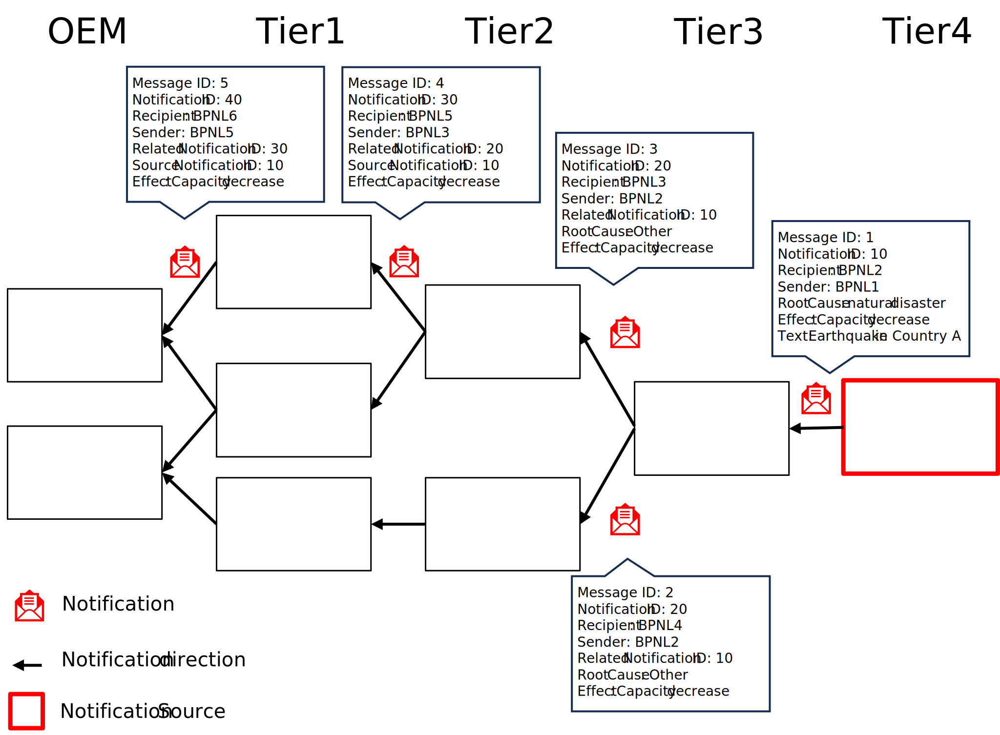
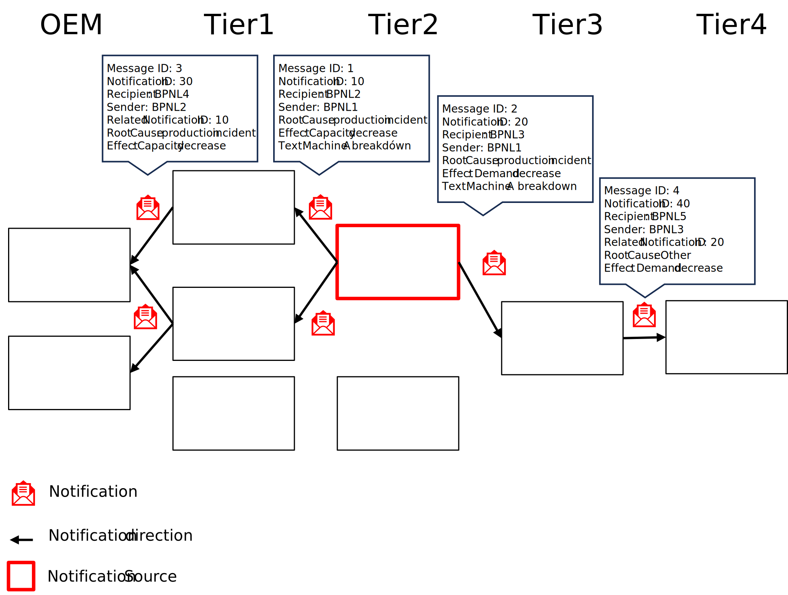

# CX-0146 Supply Chain Disruption Notifications 1.0.1

## ABSTRACT

The Catena-X *Supply Chain Disruption Notifications* Standard is created for all members of the
automotive supply chain. The aim is to have a functionality to easily and quickly inform the
affected supply chain partners in case of supply chain disruptions at some point in the value chain.
Having this information is key to be able to take the right countermeasures and make the whole value
chain more resilient. Recent incidents (e.g. semi-conductor-crisis or COVID pandemic) have
demonstrated the requirement for such a fast standardized process among all partners.

## FOR WHOM IS THE STANDARD DESIGNED

## COMPARISON WITH THE PREVIOUS VERSION OF THE STANDARD

Changed:

- Removed wrong and unused part (`"method": "POST"`) of connector asset definition

## 1 INTRODUCTION

This standard focuses on any kind of supply chain disruptions and aims to tackle the following
challenges:

- information exchange between supply chain partners regarding their short-/mid- and long-term
  demand and capacity status is slow and error prone
- lack of standards complicates the exchange of information
- lack of trust between the partners involved prevents the exchange of data
- current IT solutions provide bilateral (i.e. one-to-one) data exchange and often do not scale well
  (i.e. one-to-n)

This often leads to shortages, high expenses for "fire fighting" in the supply chain, production
disruptions, and ultimately to dissatisfied customers.

The *Supply Chain Disruption Notifications* exchange contributes to the early detection and
management of supply chain disruptions (e.g. bottlenecks, capacity surpluses, etc.).

This is enabled by the following standardized components:

- common understanding of the *Supply Chain Disruption Notifications* objects as a basis for its
  exchange between partners in a sovereign manner through a data model and the associated semantics
- application interoperability through the description of an API for the actual notification
  exchange
- processes for the actual notification provisioning in order to support the contextual and legal
  correctness

In summary, the standardization provides a unified and streamlined method for notification exchange
between supplier and customer, thus improving efficiency, reducing errors, and ensuring quick
responses to any potential supply chain related challenges.

### 1.1 AUDIENCE & SCOPE

> *This section is non-normative*

This standard is intended for:

- Data Provider
- Data Consumer
- Business Application Provider

who are involved in a customer and supplier relationship within the automotive industry.

For clarity on the roles and responsibilities of each actor, please see [Chapter 5.2](#52-actors--roles). The scope of
this standard is the exchange of *Supply Chain Disruption Notifications*. It does not cover any
specific countermeasures between partners in the one-to-one business relationship as a result of the
notification process.

Illustrations and descriptions of roles are provided to help explain concepts and processes but are
not mandatory (see [Chapter 5.2](#52-actors--roles)).

This standard requires that data consumers, providers and business application providers must adopt
the uniform business logic (according to [Chapter 5](#5-processes)), data models and data exchange protocols to
ensure interoperable data exchange.

This standard focuses on direct one-to-one business relationships between customers and suppliers.

### 1.2 CONTEXT AND ARCHITECTURE FIT

> *This section is non-normative*

This standard defines the data models and APIs required for the exchange of *Supply Chain Disruption Notifications*. Implementing it ensures that:

- all actors exchange *Supply Chain Disruption Notifications* in an identical manner.
- all actors process *Supply Chain Disruption Notifications* data in an identical manner.
- all actors exchange *Supply Chain Disruption Notifications* data only via a connector conformant to [[CX-0018]](#61-normative-references).
- all actors interpret the exchanged *Supply Chain Disruption Notifications* data in an identical manner.

The APIs must only be used in the context of Catena-X and must only be accessible via a connector
conformant to [[CX-0018]](#61-normative-references).

### 1.3 CONFORMANCE AND PROOF OF CONFORMITY

> *This section is non-normative*

Non-mandatory sections include authoring guidelines, diagrams, examples and notes. All other content
is mandatory.

The capitalized key words such as  **MAY, MUST, MUST NOT, OPTIONAL, RECOMMENDED, REQUIRED, SHOULD**
and  **SHOULD NOT**  are to be interpreted as defined in [BCP 14] [[RFC2119]](#62-non-normative-references) [[RFC8174]](#62-non-normative-references).

Participants must demonstrate conformity with Catena-X standards. Conformity Assessment Bodies (CABs)
verify that standards are correctly applied.

**Proof of Conformity for Data Models**

Participants must implement and conform to the standardized Data Models as outlined in [Chapter 3](#3-aspect-models).

**Proof of Conformity for APIs**

Participants must implement and conform to the standardized APIs as detailed in [Chapter 4](#4-application-programming-interfaces).

**Proof of Conformity for Process & Core Business Logic**

Participants must implement and conform to the *Supply Chain Disruption Notifications* core business
logic as described in [Chapter 5](#5-processes).

### 1.4 EXAMPLES

The following JSONs provide an example of the value-only serialization of the *Supply Chain Disruption Notification*
aspect model for a sample notification. The notification informs about a strike resulting in a demand
reduction between 12.12.2023 and 17.12.2023.

```json
{
  "affectedSitesSender": [
    "BPNS7588787849VQ"
  ],
  "affectedSitesRecipient": [
    "BPNS6666787765VQ"
  ],
  "materialNumberSupplier": [
    "MNR-8101-ID146955.001"
  ],
  "contentChangedAt": "2023-12-13T15:00:00+01:00",
  "startDateOfEffect": "2023-12-13T15:00:00+01:00",
  "materialNumberCustomer": [
    "MNR-7307-AU340474.002"
  ],
  "leadingRootCause": "strike",
  "effect": "demand-reduction",
  "notificationId": "urn:uuid:d8b6b4ca-ca9c-42d9-8a34-f62591a1c68a",
  "relatedNotificationId": "urn:uuid:d8b6b4ca-ca9c-42d9-8a34-f62591a1c68a",
  "sourceNotificationId": "urn:uuid:d8b6b4ca-ca9c-42d9-8a34-f62591b7d13c",
  "text": "Capacity reduction due to ongoing strike.",
  "expectedEndDateOfEffect": "2023-12-17T08:00:00+01:00",
  "status": "open"
}
```

### 1.5 TERMINOLOGY

> *This section is non-normative*

*The following terms are especially relevant for the understanding of the standard:*

| **Name** | **Description** |
| --- | --- |
| Aspect Model | An Aspect Model is a structured, machine-readable description of data. It utilizes the Turtle file format to serialize a Resource Description Framework (RDF) graph, that relates to a specific Aspect. It must follow the Semantic Aspect Meta Model (SAMM) guidelines, meaning it uses defined elements and rules from SAMM. Aspect Models help to clarify the meaning of data at runtime and should link to standardized Business Glossary terms, if available. |
| Bottleneck | A facility, function, department, or resource whose capacity is less than the demand placed upon it. For example, a bottleneck machine or work center exists where jobs are processed at a slower rate than they are demanded (Source: ASCM Supply Chain Dictionary, 17th edition). |
| Business Partner Number Legal Entity (BPNL) | A BPNL is a unique identifier for a company or partner within the Catena-X network. |
| Business Partner Number Site (BPNS) | A BPNS is a unique identifier for a specific location, such as a factory, within the Catena-X network. |
| Capacity | 1. The capability of a system to perform its expected function. 2. The capability of a worker, machine, work center, plant, or organization to produce output per time period. (Source: ASCM Supply Chain Dictionary, 17th edition) |
| Comment | A feature that allows two business partners to exchange messages about material demand and capacity, facilitating direct collaboration and quick issue resolution. |
| Comments | These are purely text-based exchanges without the transfer of documents or attachments. |
| Customer | A role within the *Supply Chain Disruption Notifications* process. Participating companies can have multiple roles at the same time. Customers provide demands to and receive capacities from suppliers. |
| Digital Twin | Based on [[CX-0002]](#61-normative-references) Standard a digital twin (DT) describes a digital representation of an asset sufficient to meet the requirements of a set of use cases. For detailed information please refer to [[CX-0002]](#61-normative-references) Digital Twins in Catena-X. |
| Material | The elements, constituents, or substances of which something is composed or can be made. Usually referred to by a material number. |
| (Material) demand | A need for a particular product or component. The demand could come from any number of sources (e.g., a customer order or forecast, an interplant requirement, a branch warehouse request for a service part, or the manufacturing of another product). At the finished goods level, demand data is usually different from sales data because demand does not necessarily result in sales (i.e., If there is no stock, there will be no sale (Source: ASCM Supply Chain Dictionary, 17th edition). Material demand may comprise multiple demand series by location and demand categories. When the term is written as one word (MaterialDemand), the term refers specifically to the respective aspect model. |
| Supplier | A role within the *Supply Chain Disruption Notifications* process. Participating companies can have multiple roles at the same time. Suppliers provide capacities to and receive demands from customers. |
| Surplus | A surplus is a situation in which an oversupply exists. |

*Table 1: List of terminology helpful for understanding the standard*

Additional terminology used in this standard can be looked up in the glossary on the association homepage.

## 2 RELEVANT PARTS OF THE STANDARD FOR SPECIFIC USE CASES

> *This section is normative*

### 2.1 SUPPLY CHAIN DISRUPTION NOTIFICATIONS

#### 2.1.1 LIST OF STANDALONE STANDARDS

The following Catena-X standards are prerequisite for the implementation of this standard and
therefore **MUST** be considered / implemented by the relevant parties specified in each of them.

| **Number** | **Standard** | **Version** |
| --- | --- | --- |
| [[CX-0001]](#61-normative-references) | EDC Discovery API | 1.0.2 |
| [[CX-0003]](#61-normative-references) | SAMM Aspect Meta Model | 1.1.0 |
| [[CX-0006]](#61-normative-references) | Registration and initial onboarding | 2.0.0 |
| [[CX-0010]](#61-normative-references) | Business Partner Number (BPN) | 2.0.0 |
| [[CX-0018]](#61-normative-references) | Dataspace Connectivity | 3.0.0 |
| [[CX-0126]](#61-normative-references) | Industry Core Part Type | 2.0.0 |

*Table 2: List of mandatory standards*

The usage of this standard **MAY** be complemented with the following Catena-X standards to further
extend the range of shortage prevention possibilities:

| **Number** | **Standard** | **Version** |
| --- | --- | --- |
| [[CX-0118]](#61-normative-references) | Delivery Information Exchange | 2.0.0 |
| [[CX-0120]](#61-normative-references) | Short Term Material Demand Exchange | 2.0.0 |
| [[CX-0121]](#61-normative-references) | Planned Production Output Exchange | 2.0.0 |
| [[CX-0122]](#61-normative-references) | Item Stock Exchange | 2.0.0 |
| [[CX-0128]](#61-normative-references) | Demand and Capacity Management Data Exchange | 2.0.0 |
| [[CX-0145]](#61-normative-references) | Days of Supply Exchange | 1.0.0 |

*Table 3: List of non-mandatory, but complementary standards*

#### 2.1.2 DATA REQUIRED

No additional data requirements.

#### 2.1.3 ADDITIONAL REQUIREMENTS

##### CONVENTIONS FOR USE CASE POLICY IN CONTEXT DATA EXCHANGE

In alignment with our commitment to data sovereignty, a specific framework governing the utilization
of data within the Catena-X use cases has been outlined. A set of specific policies on data offering
and data usage level detail the conditions under which data may be accessed, shared, and used,
ensuring compliance with legal standards.

For a comprehensive understanding of the rights, restrictions, and obligations associated with data
usage in the Catena-X ecosystem, we refer users to

- the detailed ODRL policy repository [[CX-ODRL]](#62-non-normative-references). This document provides in-depth explanations of the
  terms and conditions applied to data access and utilization, ensuring that all engagement with our data
  is conducted responsibly and in accordance with established guidelines.
- the ODRL schema template. This defines how policies used for data sharing/usage should get defined.
  Those schemas **MUST** be followed when providing services or apps for data sharing/consuming.

###### ADDITIONAL DETAILS REGARDING ACCESS POLICIES

A Data Provider may tie certain access authorizations ("Access Policies") to its data offers for
members of Catena-X and one or several Data Consumers. By limiting access to certain Participants,
Data Provider maintains control over its anti-trust obligations when sharing certain data. In
particular, Data Provider may apply Access Policies to restrict access to a particular data offer
for only one Participant identified by a specific business partner number.

- Membership
- BPNL

###### ADDITIONAL DETAILS REGARDING USAGE POLICIES

In the context of data usage policies (“Usage Policies”), Participants and related services **MUST** use
the following policy rules:

- Use Case Framework (“FrameworkAgreement”)
- at least one use case purpose (“UsagePurpose”) from the above mentioned ODRL policy repository.

Additionally, respective usage policies **MAY** include the following policy rule:

- Reference Contract (“ContractReference”).
  
Details on namespaces and ODRL policy rule values to be used for the above-mentioned types are
provided via the ODRL policy repository [[CX-ODRL]](#62-non-normative-references).

#### 2.1.4 DIGITAL TWINS AND SPECIFIC ASSET IDs

This version of the document does not define any requirements for standardized integration and
governance of digital twins for a notification. *Supply Chain Disruption Notifications* do not rely
on Asset Administration Shell or Digital Twin APIs. This standard utilizes the Catena-X Material
Global Asset ID as an optional property in the DemandAndCapacityNotification aspect model, that
needs to be compliant to standard [[CX-0126]](#61-normative-references) Industry Core: Part Type.

## 3 ASPECT MODELS

> *This section is normative*

### 3.1 ASPECT MODEL "Demand and Capacity Notification"

#### 3.1.1 INTRODUCTION

This section describes the DemandAndCapacityNotification semantic model used in the Catena-X
network. For the complete semantics and detailed description of its properties refer to the SAMM
model in [Chapter 3.1.5.1](#3151-rdf-turtle).

Business partners that are exchanging (sending and receiving) *Demand and Capacity Notifications*
**MUST** implement the data model DemandAndCapacityNotification.

Every data provider of DemandAndCapacityNotification  **MUST** provide the data conformant to the
semantic model specified in this document.

Every business application relying on DemandAndCapacityNotification  **MUST** be able to consume
data conformant to the semantic model specified in this document.

This semantic model **MUST** be made available in the central Semantic Hub.

Data consumers and data provider **MUST** comply with the license of the semantic model defined in
[Chapter 3.1.3](#313-license).

In the Catena-X data space DemandAndCapacityNotification **MUST** be exchanged via a connector
conformant to [[CX-0018]](#61-normative-references).

The JSON Payload of data providers **MUST** be conformant to the JSON Schema as specified in this
document.

The characteristics BPNL and BPNS **MUST** be used according to the standard [[CX-0010]](#61-normative-references).

#### 3.1.2 SPECIFICATIONS ARTIFACTS

The modeling of the semantic model specified in this document was done in accordance to the
"semantic-driven workflow" to create a submodel template specification [[SMT]](#62-non-normative-references).

This aspect model is written in SAMM 2.1.0 as a modeling language conformant to [[CX-0003]](#61-normative-references) as
input for the semantic driven workflow.

Like all Catena-X data models, this model is available in a machine-readable format on GitHub
conformant to [[CX-0003]](#61-normative-references).

#### 3.1.3 LICENSE

This Catena-X data model is made available under the terms of the Creative Commons Attribution 4.0
International (CC-BY-4.0) license, which is available at Creative Commons.

#### 3.1.4 IDENTIFIER OF SEMANTIC MODEL

The semantic model has the unique identifier

> `urn:samm:io.catenax.demand_and_capacity_notification:2.0.0`

This identifier **MUST** be used by the data provider to define the semantics of the data being transferred.

#### 3.1.5 FORMATS OF SEMANTIC MODEL

##### 3.1.5.1 RDF TURTLE

The RDF turtle file, an instance of the Semantic Aspect Meta Model, is the master for generating additional
file formats and serializations. It can be found under the following link:

> [https://github.com/eclipse-tractusx/sldt-semantic-models/blob/4d239fc5709f71f39c3cf13581b5bcf960905157/io.catenax.demand_and_capacity_notification/2.0.0/DemandAndCapacityNotification.ttl](https://github.com/eclipse-tractusx/sldt-semantic-models/blob/4d239fc5709f71f39c3cf13581b5bcf960905157/io.catenax.demand_and_capacity_notification/2.0.0/DemandAndCapacityNotification.ttl)

The open source command line tool of the Eclipse Semantic Modeling Framework is used for generation of
other file formats like for example a JSON Schema, aasx for Asset Administration Shell Submodel Template
or a HTML documentation.

##### 3.1.5.2 JSON SCHEMA

A JSON Schema can be generated from the RDF Turtle file. The JSON Schema defines the Value-Only payload
of the Asset Administration Shell for the API operation *"GetSubmodel"*.

##### 3.1.5.3 AASX

An AASX file **MUST** be generated from the RDF Turtle file. The AASX file defines one of the requested
artifacts for a Submodel Template Specification conformant to [[SMT]](#62-non-normative-references).

## 4 APPLICATION PROGRAMMING INTERFACES

> *This section is normative*

### 4.1 "DEMAND AND CAPACITY NOTIFICATION" API

The "DemandAndCapacityNotification API" defined in this section enables the exchange of the *Demand and Capacity Notifications* between Catena-X participants in an interoperable manner. *Figure 1* shows
a high level overview of the intended data exchange flow without including a Connector. In practice,
the data must be exchanged via a Connector as described in [Chapter 3.1.1](#311-introduction).


*Figure 1: Demand and Capacity Notification API overview*

The API relies on synchronous communication between the involved parties.

1. The data exchange is initiated by the data provider.
2. The data provider is submitting a request to the data consumer.
3. The data consumer accepts a valid request and confirms the successful receipt.

The lifecycle of a DemandAndCapacityNotification is defined by the set of states shown in *Figure 2*.
The data provider, i.e. the initiator of the *Demand and Capacity Notification*, must use the status
"open" when opening a thread for the first time.

To mark a notification as resolved, the data provider **MUST** send the updated notification, where

- the `notificationId` **MUST** be equal to the notification ID of the notification that should be updated and
- the status **MUST** be equal to "resolved".

Refer to [Chapter 5](#5-processes) for the handling of notification updates.


*Figure 2: States of the Demand and Capacity Notifications*

#### 4.1.1 PRECONDITIONS AND DEPENDENCIES

To use this standard the participants **MUST** have an existing business relationship.

To participate in the Catena-X dataspace, both the data consumer and the data provider **MUST** be registered and onboarded as defined in [[CX-006]](#61-normative-references).

A dataspace connector conformant to [[CX-0018]](#61-normative-references) **MUST** be used to make the API available to network participants.

The API endpoint defined in [Chapter 4.1.2.1](#4121-api-endpoints--resources) **MUST** therefore be offered as data asset / contract offer as defined in [[CX-0018]](#61-normative-references).

#### 4.1.2 API SPECIFICATION

##### 4.1.2.1 API ENDPOINTS & RESOURCES

Catena-X participants interested in exchanging *Demand and Capacity Notifications* **MUST** define
and implement a single endpoint supporting the HTTP POST request. The structure of the endpoint
**MAY** be freely chosen. The address of the endpoint **MUST** be provided as part of the Data Asset
defined in [Chapter 4.1.3](#413-data-asset-structure).

##### 4.1.2.2 DATA EXCHANGE

The DemandAndCapacityNotification data **MUST** be sent from the sender to the receiver using an
HTTP POST request. The data format described here **MUST** be followed for the exchange of the
*Demand and Capacity Notification*.

The endpoints are defined in the table below based on their role in the data exchange process.

>**Note:** Expressions in double curly braces \{\{\}\} must be substituted with a corresponding value.

| **Role** | **Endpoint** | **Route** | **REQUIRED** | **HTTP Method** | **Purpose** |
| --- | --- | --- | --- | --- | --- |
| Receiver | Request Endpoint | `{{DEMAND-AND-CAPACITY-NOTIFICATION-API-ENDPOINT}}` | Yes | **POST** | This endpoint receives the DemandAndCapacityNotification to the sender requests. |

*Table 4: Endpoint in the data exchange process*

The serialized JSON **MUST NOT** be larger than 15 MiB in size.

The "Demand and Capacity Notification API" endpoint **MUST** be implemented by all Catena-X
participants who wish to receive DemandAndCapacityNotification data. Senders **MUST** be able to
send DemandAndCapacityNotification object to their receivers.

The data payload itself **MUST** be a valid JSON string.

All attributes marked as *mandatory* in the aspect model standard **MUST** be included in the dataset. Attributes marked as *optional* **MAY** be included in the data set.

The usage of the attributes in the data model **MUST** follow the attribute descriptions of the respective aspect model and the definitions in [Chapter 3.1](#62-non-normative-references).

While some attributes are technically a string, not any string is valid. For example, each entry of
affectedSitesSender **MUST** be formatted as a BPNS. In that case, the aspect model will have
constraints describing how a valid value should look like.

When consuming a payload, that contains unknown properties not described within the data model but
is otherwise correct, those properties **MUST** be ignored.

**Message Header**

> **Note:** This is not the HTTP Header but rather part of the HTTP Body.

When exchanging data described in this chapter, the POST request payload **MUST** be structured as follows:

```json
{
    "header": <messageHeader>,
    "content": {
        "demandAndCapacityNotification": <DemandAndCapacityNotification>
    }
}
```

This format keeps the header, which includes metadata about the message, separated from the content,
which includes the actual data being exchanged.

The master reference for generating additional file formats and serializations is the RDF turtle file,
which is an instance of the Semantic Aspect Meta Model. The RDF turtle file for the `messageHeaderObject`
is defined in a centralized shared aspect model and can be accessed at the following URL:

> [https://github.com/eclipse-tractusx/sldt-semantic-models/blob/main/io.catenax.shared.message\_header/3.0.0/MessageHeaderAspect.ttl](https://github.com/eclipse-tractusx/sldt-semantic-models/blob/main/io.catenax.shared.message_header/3.0.0/MessageHeaderAspect.ttl)

The RDF turtle file provides detailed description on how to use the message header.

The following table lists all fields of the message header and how they are used.

| **Field** | **REQUIRED** | **Purpose** | **Datatype** | **Example value** |
| --- | --- | --- | --- | --- |
| messageId | Yes | Unique ID identifying the message. The purpose of the ID is to uniquely identify a single message, therefore it **MUST NOT** be reused. This ID must not be confused with the notification id within the payload and thus, should be different.  | UUID v4 [RFC4122] | `urn:uuid:375e75f0-913e-4b71-a96c-366fc8f6bf8f` |
| relatedMessageId | No | For the "Demand and Capacity Notification" this information **MUST NOT** be set. Correlations of notifications is handled within the payload as described in [Chapter 5](#5-processes). | UUID v4 [RFC4122] | |
| context | Yes | This field  **MUST** contain the namespace of the Demand and Capacity Notification API that is sent within the content section of the message. The version is not specified according to the SAMM version of the DemandAndCapacityNotification SAMM model in use. | URI | `CX-DemandAndCapacityNotification:1.0` |
| version | Yes | This field **MUST** specify the version of the header's aspect model that has been used to create the header. | Version of the shared aspect model MessageHeader | `3.0.0` |
| senderBpn | Yes | The business partner number (BPNL) of the responding party. | BPNL according to [[CX-0010]](#61-normative-references) | `BPNL7588787849VQ` |
| receiverBpn | Yes | The business partner number (BPNL) of the receiving party. | BPNL according to [[CX-0010]](#61-normative-references) | `BPNL6666787765VQ` |
| sentDateTime | Yes | The date and time including time zone offset on which the request has been created. | [[ISO8601]](#62-non-normative-references) with time zone | `2023-06-19T21:24:00+07:00` |

*Table 5: Message header fields used in the Demand and Capacity Notification API*

**Message Content**

The message content consists of a single `demandAndCapacityNotifcation` object containing a single
JSON-serialization of the DemandAndCapacityDemand SAMM model (see [Chapter 3](#3-aspect-models)) following the rules
defined in [Chapter 5](#5-processes).

**Message Example**

The following JSON provides an example of the value-only serialization of the *Supply Chain Disruption Notification* aspect model for a sample notification including a message header.

```json
{
  "header": {
    "senderBpn": "BPNL7588787849VQ",
    "context": "CX-DemandAndCapacityNotification:1.0",
    "messageId": "3b4edc05-e214-47a1-b0c2-1d831cdd9ba9",
    "receiverBpn": "BPNL6666787765VQ",
    "sentDateTime": "2023-06-19T21:24:00+07:00",
    "version": "3.0.0"
  },
  "content": {
    "demandAndCapacityNotification": {
      "affectedSitesSender": [
        "BPNS7588787849VQ"
      ],
      "affectedSitesRecipient": [
        "BPNS6666787765VQ"
      ],
      "materialNumberSupplier": [
        "MNR-8101-ID146955.001"
      ],
      "contentChangedAt": "2023-12-13T15:00:00+01:00",
      "startDateOfEffect": "2023-12-13T15:00:00+01:00",
      "relatedNotificationId": "urn:uuid:d05cef4a-b692-45bf-87cc-eda2d84e4c04",
      "materialNumberCustomer": [
        "MNR-7307-AU340474.002"
      ],
      "leadingRootCause": "strike",
      "materialGlobalAssetId": [
        "urn:uuid:48878d48-6f1d-47f5-8ded-a441d0d879df"
      ],
      "effect": "demand-reduction",
      "notificationId": "urn:uuid:d9452f24-3bf3-4134-b3eb-68858f1b2362",
      "text": "Capacity reduction due to ongoing strike.",
      "expectedEndDateOfEffect": "2023-12-17T08:00:00+01:00",
      "sourceNotificationId": "urn:uuid:c69cb3e4-16ad-43c3-82b9-0deac75ecf9e",
      "status": "resolved"
    }
  }
}
```

##### 4.1.2.3 UUID generation and handling

When exchanging DemandAndCapacityNotification data, the usage of UUIDv4 is **REQUIRED** in order to
reduce the probability of collision as well as to eliminate certain attack vectors. For technical
purposes the UUIDv4 **MUST** be treated as unique within the supplier-customer relationship.

The UUIDv4 **MUST** be generated according to [RFC4122](#62-non-normative-references).

##### 4.1.2.5 AVAILABLE DATA TYPES

The API **MUST** use JSON as the payload is transported via HTTPS.

#### 4.1.3 DATA ASSET STRUCTURE

The endpoints introduced in [Chapter 4.1.2](#412-api-specification) **MUST NOT** be directly called neither from a provider
nor from a consumer. Rather, these **MUST** be called via a connector conformant to [[CX-0018]](#61-normative-references).
Therefore, the endpoints **MUST** be offered as data assets. To make these assets easily identifiable
in the connector's catalog, each asset **MUST** be configured with a set of properties as described in
the corresponding sections below.

The API version described in this standard **MUST** be published in the property
[https://w3id.org/catenax/ontology/common#version](https://w3id.org/catenax/ontology/common#version)
as version `1.0` in the asset. The requester of an asset **MUST** be able to handle multiple assets
for this endpoint, being differentiated only by the version. The requester **SHOULD** choose the
asset with the highest compatible version number implemented by themselves. If the requester cannot
find a compatible version with their own, the requester **MUST** terminate the data transfer.

The following table provides an overview of the data assets that the parties **MUST** offer to be
able to provision and/or consume DemandAndCapacityNotification data.

| **Party** | **REQUIRED** | **Asset** | **Purpose** |
| --- | --- | --- | --- |
| Consumer | Yes | "Demand and Capacity Notification API" | Allows a provider to submit a *Demand and Capacity Notification*. |

*Table 6: Data assets*

**Data Asset Structure for "Demand and Capacity Notification API Endpoint"**

To receive DemandAndCapacityNotification data, the receiver **MUST** register a data asset specifying
the address of the "Demand and Capacity Notification API" Endpoint described in [Chapter 4.1.2](#412-api-specification).

The data asset **MUST** be configured with the set of properties as defined in the table below.

| **Property** | **Purpose** | **Usage & Constraints** |
| --- | --- | --- |
| ***@id*** | Identifier of the asset. | The asset ID **MUST** be unique and therefore **MUST NOT** be reused elsewhere. |
| properties.**http://purl.org/dc/terms/type** | Defines the "Demand and Capacity Notification API" endpoint according to the Catena-X taxonomy. | **MUST** be set to `{"@id": "https://w3id.org/catenax/taxonomy#DemandAndCapacityNotificationApi"}` to allow filtering the data assets catalog for the respective "Demand and Capacity Notification API". |
| properties.**https://w3id.org/catenax/ontology/common#version** | The version of the standard defining the implemented API. | **MUST** correspond to the version of the standard defining the "Demand and Capacity Notification API". The value **MUST** be set to `"1.0"` for APIs implementing this standard. |
| dataAddress.properties. **@type** | Type of the DataAddress node. | **MUST** be set to `"DataAddress"`. |
| dataAddress.properties. ***baseUrl*** | Defines the HTTPS endpoint of the corresponding "Demand and Capacity Notification API" endpoint. | The `{{DEMAND_AND_CAPACITY_NOTIFICATION_REQUEST_ENDPOINT}}` refers to an URL under which the API endpoint is available. HTTPS transport protocol **MUST** be used. |
| dataAddress.properties. ***proxyBody*** | Defines whether the endpoint allows to proxy the HTTPS body. | **MUST** be set to `"true"` to allow the API endpoint to receive a HTTPS body via the HTTPS request. |
| dataAddress.properties. ***proxyMethod*** | Defines whether the endpoint allows to proxy the HTTPS method. | **MUST** be set to `"true"` to allow the API endpoint to receive POST requests. |
| dataAddress.properties. ***type*** | Defines the type of data plane extension handling the data exchange. | **MUST** be set to `"HttpData"` to provide an API via an HTTPS proxy endpoint. |

*Table 7: Data assets request properties*

When searching the Catalog of a provider, a consumer  **MUST** use the following properties AND their
 values to identify the Data Asset specifying "Demand and Capacity Notification API". In the connector
 Data Asset descriptions the API version valid for this standard is mentioned for the property
 [https://w3id.org/catenax/ontology/common#version](https://w3id.org/catenax/ontology/common#version). The requester of a Data Asset  **MUST**
 be able to handle multiple Data Asset for this endpoint, being differentiated only by the version.
 The requester  **SHOULD** choose the Data Asset set with the highest compatible version number implemented
 by themselves. If the requester cannot find a compatible version with their own, the requester  **MUST**
 terminate the data transfer.

| **Property** | **Value** |
| --- | --- |
| properties.***dct:type*** | `{"@id": "https://w3id.org/catenax/taxonomy#DemandAndCapacityNotificationApi"}` |

*Table 8: Data assets request properties values*

Because the data asset reflects the existing contractual relationship between a customer and its suppliers,
only one data asset with the aforementioned combination of properties AND their values **MUST** be visible
to the data consumer at any time to avoid ambiguity.

An example Data Asset definition is given below.

> Note: Expressions in double curly braces \{\{\}\} must be substituted with a corresponding value.

```json
{
    "@context": {
        "@vocab": "https://w3id.org/edc/v0.0.1/ns/",
        "cx-taxo": "https://w3id.org/catenax/taxonomy#",
        "cx-common": "https://w3id.org/catenax/ontology/common#",
        "dct": "https://purl.org/dc/terms/"
    },
    "@id": "{{DEMAND_AND_CAPACITY_NOTIFICATION_API_ASSET_ID}}",                                    
    "properties": {
        "dct:type": {
            "@id": "cx-taxo:DemandAndCapacityNotificationApi"                                  
        },
        "cx-common:version": "1.0",                                              
        "description": "Demand and Capacity Notification API Endpoint"                                   
    },
    "dataAddress": {
        "@type": "DataAddress",
        "type": "HttpData",
        "proxyBody": "true",
        "proxyMethod": "true",
        "baseUrl": "{{DEMAND_AND_CAPACITY_NOTIFICATION_API_ENDPOINT}}",
        "contentType": "application/json"
    }
}
```

#### 4.1.4 ERROR HANDLING

Every API endpoint defined in [Chapter 4.1.2](#412-api-specification)  **MUST** respond to incoming requests with HTTP status codes
as described in [[RFC9110]](#62-non-normative-references). All of the following HTTP status codes, except for codes `200` and `201`,
**MUST** be interpreted as failures. Therefore, it may be sufficient for a business application to
simply check if the status code is `200` or `201` or not. If not, the request failed. The status codes
for each endpoint are defined in the following sections.

**HTTP Codes for Demand and Capacity Notification Response Endpoint**

| **Status Code** | **Description** | **Usage** |
| --- | --- | --- |
| `400` | Response body malformed or validation failed as defined in [Chapter 4.1.5](#415-validating-payload) | When the HTTP Body is not matching the API description, the consumer **MUST** respond with error code `400` |
| `401` | Not authorized | When the authorization of the response fails, the consumer **MUST** respond with error code `401` |
| `404` | Endpoint not found | When the HTTP path is not available, the consumer **MUST** respond with error code `404` |
| `405` | Method not allowed | In case the HTTP call is not a POST, the provider **MUST** respond with error code `405` |
| `503` | Service unavailable | The server is not ready to handle the request |

*Table 9: Request error handling*

Further status codes may be included in a later revision of this standard. The ability to send and
receive one status code per sent or received list item might be included in a later revision of this
standard.

##### 4.1.5 VALIDATING PAYLOAD

The following tables are supposed to answer questions regarding what business logic **MUST** be
executed when receiving a DemandAndCapacityNotification which has been formed in a specific way.

The order of rules is indicated by the 'Number' row. The rules **MUST** be executed in exactly this
order, starting from the lowest number.

The first rule that matches **MUST** be executed. All other rules **MUST** be ignored.

'value' indicates the actual value written in quotation marks and without any specific formatting
(e.g. italic).

Valid value indicates that the value is valid according to aspect model, API and process.

Invalid value indicates that the value is invalid according to aspect model, API and process.

Any value indicates that the value can by anything, valid or not.

A whitespace or an empty cell indicates that for this specific rule that row is not applicable.

| Number | 1 | |
| --- | --- | --- |
| Properties | | |
| Meta Properties | Any property | *invalid value* |
| | All other properties | *Any value* |
| Actions | Business Logic | Ignore received values |
| | Return Code | `400` - Bad Request |

| Number | 2 | |
| --- | --- | --- |
| Properties | `affectedSitesSender` | One or more BPNS do not match to the sending Connector's registered BPNS |
| Meta Properties | Any property | |
| | All other properties | *Any value* |
| Actions | Business Logic | Ignore received values |
| | Return Code | `400` - Bad Request |

| Number | 3 | |
| --- | --- | --- |
| Properties | `affectedSitesRecipient` | One or more BPNS do not match BPNS that I am responsible for |
| Meta Properties | Any property | |
| | All other properties | *Any value* |
| Actions | Business Logic | Ignore received values |
| | Return Code | `400` - Bad Request |

| Number | 4 | |
| --- | --- | --- |
| Properties | `notificationId` | Valid UUID which matches a received `notificationId` of the same partner |
| | `contentChangedAt` | Valid Timestamp which is older than or equal to the Timestamp of `contentChangedAt` from the previously received notification. |
| Meta Properties | Any property | |
| | `senderBpn` | Not equal to the `senderBpn` which originally sent the notification with this notificationId |
| | All other properties | *Valid value* |
| Actions | Business Logic | Ignore received values due to old content |
| | Return Code | `400` - Bad Request |

| Number | 5 | |
| --- | --- | --- |
| Properties | `notificationId` | Valid UUID which matches a received notificationId of the same partner |
| | `status` | Equal to "resolved" |
| Meta Properties | Any property | |
| | `senderBpn` | Not equal to the `senderBpn` which originally sent the notification with this notificationId |
| | All other properties | *Valid value* |
| Actions | Business Logic | Ignore received values |
| | Return Code | `400` - Bad Request |

| Number | 6 | |
| --- | --- | --- |
| Properties | `notificationId` | Valid UUID which matches a received `notificationId` of the same partner |
| | `contentChangedAt` | Valid Timestamp which is newer than the Timestamp of `contentChangedAt` from the previously received notification. |
| Meta Properties | Any property | |
| | All other properties | *Valid value* |
| Actions | Business Logic | Overwrite all existing values with received values |
| | Return Code | `200` - OK |

| Number | 7 | |
| --- | --- | --- |
| Properties | `notificationId` | Valid UUID which does not match any received `notificationId` of the same partner |
| Meta Properties | Any property | |
| | All other properties | *Valid value* |
| Actions | Business Logic | Accept new notification |
| | Return Code | `200` - OK |

## 5 PROCESSES

> *This section is normative*

### 5.1 SUPPLY CHAIN DISRUPTION NOTIFICATION PROCESS

*Supply Chain Disruption Notifications* (further called "notification(s)" in [Chapter 5](#5-processes))
are a collaboration functionality business partners **MAY** use to interact with each other. Focus
is to quickly inform the relevant business partners in the supply chain about an upcoming
disruption. Notifications functionality **SHOULD** be used by any value chain partner, if the
expected impact goes beyond the regular one-to-one business relationship between one-up and one-down
and might therefore be relevant for part or even the whole supply chain network. Typical cases in
real business are force major events (e.g. natural disaster, production incidents, wars, pandemics
etc.). Even though a notification **MUST** be always sent between one-up and one-down partner, the
intention is, that the recipient will further forward the adjusted notification up or down the
supply chain. If, after internal evaluation, the recipient decides to inform further business
partners, the notification **MUST** be modified and cannot simply be identically forwarded. This
results into a new notification ID.

Therefore a partner **MUST** be able to receive and process notifications. Being able to send
notifications is highly **RECOMMENDED** in order to participate in a collaborative environment and
make full use of the notifications feature. Furthermore, notifications **MUST** work in both
directions (up- and downstream). In case a business partner needs to send a notification up- and
downstream the supply chain at the same time, two individual notifications **MUST** be sent
resulting into individual notification IDs (see Figure 4).

The notification consists of a message header (see Table 5) and a notification payload (see Table 10)
which **MUST** be filled by the sender of the notification and are explained in the mentioned
tables. Mandatory (M) fields **MUST** be filled to correctly send a notification and optional (O)
fields **MAY** be filled by the sender. Once completely and correctly filled, the notification can
be shared with one-up or one-down business partners. Each partner receiving a notification **MAY**
decide, after having evaluated the impact, if they need to inform their potentially affected
business partners up- or downstream the supply chain (depending on the notification direction)
following the same process logic as written above. Each new notification **MUST** receive its
individual notification ID and a sender of a notification  **MAY** link a reference to a previously
sent notification ID or source notification ID. Only the referred notification ID itself is added to
the notification (neither content nor other information e.g. at which tier-level the incident
started). If several value chain partners e.g. refer to the same initially shared notification ID
within their notification, a recipient is able to understand the impact of the problem. The sender
of the notification **MUST** respect data privacy laws and **MUST** follow antitrust rules. Update
of further objects (e.g. MaterialDemand) is not directly part of the notifications functionality as
this happens in separate collaboration between one-up and one-down (e.g. comment function). Updating
a notification content results into an update of the ContentChangedAt using the same notification
ID. With that information the recipient is able to identify when the content of the original
notification was updated. Resolving a notification **MUST** be done only by the sender and this
update of the notification follows the same logic via new ContentChangedAt timestamp as described
before.

**Demand and Capacity Notification Payload Description**

| **Field name / Structure** | **Mandatory** / **Optional**|**Data type**|**Description**|**Example** |
| --- | --- | --- | --- | --- |
| **Notification ID** | M | UUID | Unique ID identifying the notification. | `urn:uuid:d9452f24-3bf3-4134-b3eb-68858f1b2362` |
| **Affected Sites Sender** | O | Collection - BPNS - String | The affected Business Partner site Numbers of the sender.It is RECOMMENDED to send the senderBpns. It **MUST** be possible to select multiple senderBpns. | `BPNS7588787849VQ` |
| **Affected Sites Recipient** | O | Collection - BPNS - String | The affected Business Partner site Numbers of the recipient.It is RECOMMENDED to send the recipient Bpns. It **MUST** be possible to select multiple recipient BPNS. | `BPNS6666787765VQ` |
| **Leading Root Cause** | M | Enumeration | Possible values: <br /> - strike <br /> - natural disaster <br /> - production incident <br /> - pandemic / epidemic <br /> - logistics disruption <br /> - war <br /> - other | `strike` |
| **Effect** | M | Enumeration | Notification Category / ImpactFrom a business perspective, demand or capacity reduction are the most relevant values in connection with above mentioned root causes. For technical completeness demand or capacity increase are also added to the value list. | `demand-reduction`, `capacity-reduction`, `capacity-increase`, `demand-increase` |
| **Text** | O | String | Free text description for notification (max. 4000 characters) | `"HelloWorld"` |
| **Material Number Customer** | O | Collection - ID - String | If the customer is the sender to send Customer Material number is RECOMMENDED. It **MUST** be possible to send n customer material numbers. | `MNR-7307-AU340474.002` |
| **Material Number Supplier** | O | Collection - ID - String | If the supplier is the sender sending supplier material number is RECOMMENDED. It **MUST** be possible to send n supplier material numbers. | `MNR-8101-ID146955.001` |
| **Material Global Asset ID** | O | Collection - ID - String | MaterialGlobalAssetID references a digital twin. Via a digital twin a recipient is able to identify the own affected material numbers as the digital twin connects sender and recipient material numbers. If a digital twin is available it is RECOMMENDED only exchanging the digital twin material number. | `urn:uuid:48878d48-6f1d-47f5-8ded-a441d0d879df` |
| **Start Date of Effect** | M | Timestamp | Expected start date of the impact **MUST** be shared by the sender of the message.This also applies to cases where the sending of the message and start date of the effect differ from each other. | `2023-06-05T08:00:00+02:00` |
| **Expected End Date of Effect** | O | Timestamp | Expected end date of the impact **MAY** be mentioned by the sender of the notification. | `2023-06-19T08:00:00+02:00` |
| **Status** | M | Enumeration | Notification status | `"open"`, `"resolved"` |
| **Content Changed At** | M | Timestamp | Time where any property of the notification was updated the last time. | `2023-06-19T08:00:00+02:00` |
| **Related Notification ID** | O | UUID | Unique ID identifying a previously received notification triggering the exchange of the current notification. | `urn:uuid:d05cef4a-b692-45bf-87cc-eda2d84e4c04` |
| **Source Notification ID** | O | UUID | Unique ID identifying a source notification related to the current one. | `urn:uuid:c69cb3e4-16ad-43c3-82b9-0deac75ecf9e` |

*Table 10: Demand and Capacity Notification Payload Description*

### 5.2 ACTORS & ROLES

| **Actors** | **Description** |
| --- | --- |
| Sender | The sender is the author of the notification. The sender is responsible to properly fill all necessary data fields and send the notification to its direct business partner (one-up or one-down). This means the sender acts as data provider within the notifications process and is sharing the notification with its direct business partners (one-up or one-down). Customer and supplier can both act as the sender of the notification. |
| Recipient | The recipient receives a notification from its direct business partner (one-up or one-down). The recipient needs to check the impact and might inform its further business partners up- or downstream the value chain. This means the recipient acts as a data consumer within the notifications process as the recipient is receiving the notification from its direct business partners (one-up or one-down). Customer and supplier can both act as the recipient of a notification. |
| Business application provider | The business application provider provides and operates an application/tool which enables the notifications process and follows core business logic, data model and API as described in this standard document. |

*Table 11: Overview of Actors & Roles*

### 5.3 PROCESS REPRESENTATION


*Figure 3: Visualization Notifications Process I*


*Figure 4: Visualization Notifications Process II*

## 6 REFERENCES

### 6.1 NORMATIVE REFERENCES

> *This section is normative*

| **Number** | **Standard** | **Version** |
| --- | --- | --- |
| [CX-0001] | EDC Discovery API | 1.0.2 |
| [CX-0003] | SAMM Aspect Meta Model | 1.1.0 |
| [CX-0006] | Registration and initial onboarding | 2.0.0 |
| [CX-0010] | Business Partner Number (BPN) | 2.0.0 |
| [CX-0018] | Dataspace Connectivity | 3.0.0 |
| [CX-0126] | Industry Core Part Type | 2.0.0 |

### 6.2 NON-NORMATIVE REFERENCES

> *This section is non-normative*

| **Number** | **Standard** | **Version** |
| --- | --- | --- |
| [CX-0118] | Delivery Information Exchange | 2.0.0 |
| [CX-0120] | Short-term Material Demand Exchange | 2.0.0 |
| [CX-0121] | Planned Production Output Exchange | 2.0.0 |
| [CX-0122] | Item Stock Exchange | 2.0.0 |
| [CX-0128] | Demand and Capacity Management Data Exchange | 2.0.0 |
| [CX-0145] | Days of Supply Exchange | 1.0.0 |
| [ISO8601] | ISO 8601: Date and time format | |
| [RFC2119] | Bradner, S. Key words for use in RFCs to Indicate Requirement Levels. Available online: https://datatracker.ietf.org/doc/html/rfc2119||
| [RFC4122] | A Universally Unique Identifier (UUID) URN Namespace (https://www.rfc-editor.org/rfc/rfc4122) ||
| [RFC8174] | Leiba, B. Ambiguity of Uppercase vs Lowercase in RFC 2119 Key Words. Available online: https://datatracker.ietf.org/doc/html/rfc8174 ||
| [RFC9110] | HTTP Semantics (https://www.rfc-editor.org/rfc/rfc9110) ||
| [CX-ODRL] | Catena-X ODRL Profile repository: https://github.com/catenax-eV/cx-odrl-profile |
| [SMT] | How to create a submodel template specification. Guideline. Download from: https://industrialdigitaltwin.org/wp-content/uploads/2022/12/I40-IDTA-WS-Process-How-to-write-a-SMT-FINAL-.pdf ||

### 6.3 REFERENCE IMPLEMENTATIONS

> *This section is non-normative*

Not applicable.

## ANNEXES

### FIGURES

*This section is non-normative*

| **Figure** | **Name** | **Chapter** |
| --- | --- | --- |
| Figure 1 | *Demand and Capacity Notification API overview* | [4.1](#41-demand-and-capacity-notification-api) |
| Figure 2 | *States of the* Demand and Capacity Notifications | [4.1](#41-demand-and-capacity-notification-api) |
| Figure 3 | *Visualization Notifications Process I* | [5.3](#53-process-representation) |
| Figure 4 | *Visualization Notifications Process II* | [5.3](#53-process-representation) |

*Table 14: List of Figures*

### TABLES

*This section is non-normative*

| **Table** | **Name** | **Chapter** |
| --- | --- | --- |
| Table 1 | *List of terminology helpful for understanding the standard* | [1.5](#15-terminology) |
| Table 2 | *List of mandatory standards* | [2.1.1](#211-list-of-standalone-standards) |
| Table 3 | *List of* *non-mandatory, but* *complementary standards* | [2.1.1](#211-list-of-standalone-standards) |
| Table 4 | *Endpoint in the data exchange process* | [4.1.2.2](#4122-data-exchange) |
| Table 5 | *Message header fields used in the Demand and Capacity Notification API* | [4.1.2.2](#4122-data-exchange) |
| Table 6 | *Data assets* | [4.1.3](#413-data-asset-structure) |
| Table 7 | *Data assets request properties* | [4.1.3](#413-data-asset-structure) |
| Table 8 | *Data assets request properties values* | [4.1.3](#413-data-asset-structure) |
| Table 9 | *Request error handling* | [4.1.4](#414-error-handling) |
| Table 10 | *Demand and Capacity Notification Payload Description* | [5.1](#51-supply-chain-disruption-notification-process) |
| Table 11 | *Overview of Actors & Roles* | [5.2](#52-actors--roles) |
| Table 12 | *List of normative standards* | [6.1](#61-normative-references) |
| Table 13 | *List of non-normative standards* | [6.2](#62-non-normative-references) |
| Table 14 | *List if Figures* | [Annexes](#annexes) |
| Table 15 | *List of Tables* | [Annexes](#annexes) |

*Table 15: List of Tables*

## Legal

Copyright © 2025 Catena-X Automotive Network e.V. All rights reserved. For more information, please visit [here](/copyright).
