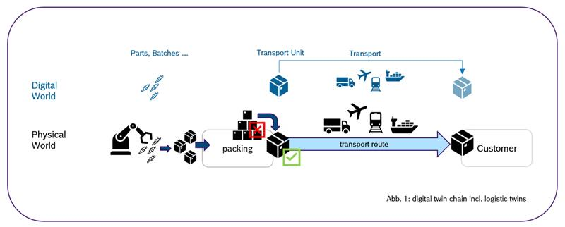

---
tags:
  - CAT/Business Application Provider
  - UC/Logistics
---

# CX-0150 Logistics Use Case v1.2.1

## ABSTRACT

This standard is used to define the basic rules to participate in the logistics use case.

The use case is based on the industry core and uses digital twins and aspect models of the industry core. Furthermore it includes
use case-specific aspect models (e.g. packingList) that go beyond the industry core and are used to make various entities in the network, such as transport units, traceable.

## FOR WHOM IS THE STANDARD DESIGNED

This standard is designed for everybody who wants to participate in the logistics use case.

The following features are provided:

- Traceability of transport (e.g. truck, ship, airplane), transport units and packing list.

## 1 INTRODUCTION

This document summarizes all standards to be supported by network participants IT infrastructure to participate for the **Logistics Use Case**. This involves protocols, semantic models and platform capabilities to be used.

### 1.1 AUDIENCE & SCOPE

> *This section is non-normative*

This document is targeting subsets of the following roles:

- Data Provider / Consumer
- Business Application Provider

The **Logistics Use Case** is only relevant in case of tracking transport units, the transport itselfs and e.g. using and providing information about GTL (global transport label according to VDA 4994 - Please refer to: https://www.vda.de/de/aktuelles/publikationen/publication/vda-4994---global-transport-label-v2.0-2023-07--ersetzt-die-vda-4902-) and the requirement to track and share information in a Catena-X compliant way.

Note: Fulfilling a use case standard by a data provider / consumer can be done in two ways:

1. Purchase a certified app for the use case. In this case the data provider / consumer does not need to prove conformity again and
2. Data Provisioning / Consumption without a certified app for the use case.

### 1.2 CONTEXT AND ARCHITECTURE FIT

> *This section is non-normative*

Traceability of parts and materials is crucial in the automotive industry to enable e.g. quality management and calculating the correct PCF value. But not just the manufacturing process or used materials have an influence to the product quality and the PCF. How these parts, batches or vehicles are conveyed and handled on the route of transport can have an impact to it. Some examples are heat or humidity to chemical products or shock to sensitive or breakable goods. It makes a difference in calculating a PCF value in case of ground shipping vs. air freight.
So, the aim of the **Logistics Use Case** is to provide additional information about the transport (used vehicles, real time information about the location etc.), the transport unit (also known as "handling unit")  and specific details of package content. It enables to track and trace the single stages of the value creation chain to enable further data driven use cases in the logistics without compromising data sovereignty.

In order to create this transparency on transport, transport unit etc. relevant data should be made available by the affected participants of a value chain in addition of the transparency on physical assets. This process is described in the standard CX - 0127 INDUSTRY CORE: PART INSTANCE 2.0.0. This standard enables data and app providers to deliver solutions for building data chains for serialized parts, batches etc.. This is achieved via the standardized creation of digital twins of vehicles, parts and materials as well as the logical linking to their sub-components (Bill of Material, BoM). The default visibility of digital twins and their respective semantic models follows the one-up/one-down principle.

By tracking and tracing back the logistic conditions of parts, batches or vehicles - suppliers, carriers etc. can quickly identify the source of any quality issues due to an incompatible treatment on the transport way. By using a digital twin for transport units and provide specific information about the packed goods via aspect model "packingList1.0", it is possible to identify the affected goods and take corrective actions to address them. Comprehensive traceability across the value creation network enables the automotive and further industries to quickly respond to any quality issues in their supply chain.



To participate in the **Logistics Use Case**, the following single standards MUST be fulfilled by all participants for which the standard is relevant:

- CX-0002 Digital Twins in Catena-X
- CX-0126 IndustryCorePartType
- CX–0127 IndustryCorePartInstance

### 1.3 CONFORMANCE AND PROOF OF CONFORMITY

> *This section is non-normative*

Sections marked as non-normative, all authoring guidelines, diagrams, examples, and notes in this specification are non-normative. Everything else in this specification is normative.

The key words **MAY**, **MUST**, **MUST NOT**, **OPTIONAL**, **RECOMMENDED**, **REQUIRED**, **SHOULD** and **SHOULD NOT** in this document are to be interpreted as described in BCP 14 [RFC2119] [RFC8174] when, and only when, they appear in all capitals, as shown here.

All participants* and their solutions will need to prove, that they are conform with the Catena-X standards. To validate that the standards are applied correctly, Catena-X employs Conformity Assessment Bodies (CABs). Please refer to: https://catena-x.net/en/catena-x-introduce-implement/certification for the process of conformity assessment and certification.

Since this document describes a set of standards to be fulfilled, participants **MUST** fulfill all mentioned standards and the respective conformity assessment criteria in addition to the specific criteria mentioned in this document.

The specific criteria defined in this document are describing the usage of the central tools as well as common tools described in the linked standardization documents and therefore compliance **SHOULD BE** checked with the tools provided for these components.

The proof of conformity for a single semantic model is done according to the general rules for proving the conformity of data provided to a semantic model or the ability to consume the corresponding data.

In terms of conformity the openAPI specification of the application or endpoints being exposed via the Tractus-X EDC or any other CX-0018 compliant connector **MUST** be checked against the standardized openAPI specification.

Examples of data assets and contract offer structure in the Tractus-X EDC or any other CX-0018 compliant connector **MUST** correspond to the described structure.

The versions of the standardization documents valid for this standard are mentioned in sections where the [standalone standards](#211-list-of-standalone-standards), [normative references](#61-normative-references) and [non-normative references](#62-non-normative-references) are listed. The valid versions are not specifically mentioned in the body text.

**Disclaimer: The operating model released by the Catena-X association will define the roadmap, content and scope for the certification process. This will include the roles, certification and further assessment procedures as well as the rollout phases.*

### 1.4 EXAMPLES

Examples for data models: See according subsection [3 Aspect Models](#3-aspect-models).

### 1.5 TERMINOLOGY

> *This section is non-normative*

**Application Programming Interface (API):**
An API is a way for two or more computer programs to communicate with each other.

**Aspect Model:**
A formal, machine-readable semantic description (expressed with RDF/turtle) of data accessible from an aspect.

Note 1 to entry: An Aspect Model must adhere to the Semantic Aspect Meta Model (SAMM), i.e., it utilizes elements and relations defined in the Semantic Aspect Meta Model and is compliant to the validity rules defined by the Semantic Aspect Meta Model.

Note 2 to entry: Aspect Models are logical data models which can be used to detail a conceptual model in order to describe the semantics of runtime data related to a concept. Further, elements of an Aspect model can/should refer to terms of a standardized Business Glossary (if existing).

*[Source: Catena-X, CX-0002, note 3 removed]*

**Asset:**
An Asset describes on Data Provider side the data set which will be shared or can be consumed by a Data Consumer.

**Asset Administration Shell (AAS):**
The AAS is a digital representation of an asset. It is a form of a digital twin.

**Bill of Material (BoM):**
A bill of material resembles the structure of a product. It is a list of all raw materials, sub-assemblies and sub-components that are needed to manufacture the end procuct. At Catena-X Traceability we consider more than one single BoM. The BoM changes during the lifecyle and therefore, we are talking about different BoMs in different lifecycles.

**Business Partner Number (BPN):**
A BPN is the unique identifier of a partner within Catena-X.

**Tractus-X Eclipse Dataspace Connector (Tractus-X EDC)**:
The Tractus-X EDC is a reference implementation for a connector conformant to CX-0018 currently acting as a de-facto standard and/or reference Implementation within Catena-X. When mentioning the Tractus-X EDC in this standard, any other CX-0018 conformant connector is also a valid option.

**HTTP:**
Hypertext Transfer Protocol (HTTP) is an application-layer protocol for transmitting hypermedia documents, such as HTML. It was designed for communication between web browsers and web servers, but it can also be used for other purposes.

**International Data Space Association (IDSA):**
The IDSA is on a mission to create the future of the global, digital economy with International Data Spaces (IDS), a secure, sovereign system of data sharing in which all participants can realize the full value of their data.

**International Data Space (IDS):**
The International Data Space enables new "smart services" and innovative business processes to work across companies and industries while ensuring that the self-determined control of data use (data sovereignty) remains in the hands of data providers.

**IDSA Protocol:**
The IDSA Protocol being used for data exchange in an International Dataspace. This includes contract negotiation.

**Part Instance:**
A part instance is a physically produced instance (e.g. serialized part, batch, just-in-sequence-part) of a part type.

**Serialized part:**
Instance of a part, where the particular instance can be uniquely identified by means of a serial number, a similar identifier (e.g. VAN) or a combination of multiple identifiers (e.g. combination of manufacturer, date and number).

**Subcomponent:**
A Subcomponent is a separate product that can be assembled into a customer product.

**Transport/Handling Unit:**
Bundle of goods inside of a closed transport packing which will not split up or added with additional goods on the route of transport unti it's final destination at the receiving company.

**UML:**
The unified modeling language (UML) is a general-purpose visual modeling language that is intended to provide a standard way to visualize the design of a system. UML provides a standard notation for many types of diagrams which can be roughly divided into three main groups: behavior diagrams, interaction diagrams, and structure diagrams.

**Vehicle Anonymised Number (VAN):**
A number mapped 1:1 to VIN, but pseudonomised.

**Vehicle Identification Number (VIN):**
The VIN number is a 17-character code assigned by the manufacturer to every vehicle, providing specific information about its make, model, year of manufacture, and other key features. It is a unique identifier that allows the vehicle to be easily tracked and identified throughout its lifespan.  Additional terminology used in this standard can be looked up in the glossary on the association homepage.

## 2 RELEVANT PARTS OF THE STANDARD FOR SPECIFIC USE CASES

> *This section is normantive*

### 2.1 DATA REQUIRED

A digital twin MUST be created for the transport itself or the transport unit by the manufacturer/supplier in case of exchanging logistic data within Catena-X. In all cases the digital twin MUST be provisioned via an Asset Administration Shell as per CX-0002 and registered in a decentral Digital Twin Registry of the data provider (or the decentral Digital Twin Registry host of the manufacturer) as described in CX-0002.

The IDS protocol as described in CX-0018 MUST be followed in the data exchange.

### 2.2 ADDITIONAL REQUIREMENTS

As the IDS protocol is being used, data MUST NOT be transferred before a corresponding contract negotiation has been successfully passed by the participants of the data exchange and a valid contract is present as described in CX-0018.

#### 2.2.1 Data asset structure

> *This section is normative*

| **Type**        | **Subject**                                      | **Version** | **Description**                                                                 |
|-----------------|--------------------------------------------------|-------------|---------------------------------------------------------------------------------|
| cx-taxo:LOGAPI  | cx-taxo:LogisticsApi | 1.0         | Enables the Catena-X Members to send and receive data in regards with the Logistics Data Exchange |

*Example:*

```json

{
    "@id": "LOGAPI",
    "@type": "Asset",
    "properties": {
        "dct:type": {
            "@id": "cx-taxo:LOGAPI"
        },
        "dct:subject": {
            "@id": "cx-taxo:LogisticsApi"
        },
        "dct:description": "Enables the Catena-X Members to send and receive data in regards with the Logistics Data Exchange",
        "cx-common:version": "1.0",
    },
    "dataAddress": {},
    "@context": {
        "dct": "http://purl.org/dc/terms/",
        "cx-taxo": "https://w3id.org/catenax/taxonomy#",
        "cx-common": "https://w3id.org/catenax/ontology/common#"
    }
}
```

#### 2.2.2 POLICY CONSTRAINTS FOR DATA EXCHANGE

In alignment with our commitment to data sovereignty, a specific framework governing the utilization of data within the Catena-X use cases has been outlined.  As part of this data sovereignty framework, conventions for access policies, for usage policies and for the constraints contained in the policies have been specified in standard 'CX-0152 Policy Constraints for Data Exchange'. This standard document CX-0152 **MUST** be followed when providing services or apps for data sharing/consuming and when sharing or consuming data in the Catena-X ecosystem. What conventions are relevant for what roles named in [1.1 AUDIENCE & SCOPE](#11-audience--scope) is specified in the CX-0152 standard document as well. CX-0152 can be found in the [standard library](https://catenax-ev.github.io/docs/standards/overview).

#### 2.2.3 Usage Policy

The “Connector Asset for Logistics” included in the EDC of a data consumer **MUST** contain a usage policy following the requirements referenced in paragraph [2.2.2](#222-policy-constraints-for-data-exchange).

The "rightOperand" for the "leftOperand" "UsagePurpose" **MUST** include the following usage purpose: **`cx.logistics.base:1`**. The legal meaning is named in CX-0152 (see [standard library](https://catenax-ev.github.io/docs/standards/overview)).

Additional more general usage policies **MAY** be included, but all the usage policies MUST contain the above mentioned usage purpose as shown in the example below.

``` json
{
  "@context": [
    "http://www.w3.org/ns/odrl.jsonld",
    "https://w3id.org/catenax/2025/9/policy/context.jsonld"
  ],
  "@type": "Set",
  "@id": "anyID",
  "permission": [
    {
      "action": "use",
      "constraint": {
        "and": [
          {
            "leftOperand": "FrameworkAgreement",
            "operator": "eq",
            "rightOperand": "DataExchangeGovernance:1.0"
          },
          {
            "leftOperand": "UsagePurpose",
            "operator": "isAnyOf",
            "rightOperand": "cx.logistics.base:1"
          }
        ]
      }
    }
  ]
}
```

#### 2.2.4 Versioning

The Aspect Models that are deployed as Digital Twins **MUST** be published in dcat:Dataset [http://www.w3.org/ns/dcat#](http://www.w3.org/ns/dcat#) in the property that holds the full URN of the Aspect Model [https://admin-shell.io/aas/3/0/HasSemantics/semanticId](https://admin-shell.io/aas/3/0/HasSemantics/semanticId). Versions are explicitly contained in the URN.
The API versions **MUST** be published in the property https://w3id.org/catenax/ontology/common#version as version X.Y in dcat:Dataset [http://www.w3.org/ns/dcat#](http://www.w3.org/ns/dcat#).
Note: Data Assets differentiated only by major version **MUST** be offered in parallel. The current standard and API versions mark the start of Life Cycle Management in Catena-X operations. Previous versions are dismissed.

### 2.3 SPECIAL DIGITAL TWINS FOR LOGISTICS AND SPECIFIC ASSET IDS

The Logistic use case uses digital twins to make a company's data available to other Catena-X partners. Basics about digital twins, which you should be familiar with to understand this section, are described in the Standard of Digital Twins (CX-0002 Digital Twins in Catena-X).

The asset's globalAssetId **MUST** be equal to the unique id used in Catena-X

The following specific asset IDs not marked as optional **MUST** be available when registering a digital twin in order to allow discovery (see  CX-0002 that provides additional information). The specific asset IDs marked as optional **MAY** be used in addition.

**Digital Twin “TransportUnit”**

In case of using a Global Transport Label (GTL) or tracking a transport unit and provide data e.g. about the packing list, it **MUST** be used a digital twin for transport unit.

Specific asset IDs are used to identify digital twins when looking up or searching for these digital twins. This is a required step by a supplier of physical assets to connect the digital twins of the transport unit to the digital twins of their physical assets. Mandatory specific asset IDs ensure that at least this information is available for the digital twin.

The following conventions for specific asset IDs apply to digital twins of "*transport unit*":

|  Key                |  Availability  |  Description                                                                                                                                                                                                                                                                                                                                                                                                                                                                                             |  Type    |
|---------------------|----------------|----------------------------------------------------------------------------------------------------------------------------------------------------------------------------------------------------------------------------------------------------------------------------------------------------------------------------------------------------------------------------------------------------------------------------------------------------------------------------------------------------------|----------|
|  manufacturerId     |  Mandatory     |  The Business Partner Number (BPNL) of the manufacturer of the part.                                                                                                                                                                                                                                                                                                                                                                                                                                     |  BPNL    |
|  Shipping Note No.  |  Mandatory     |  (dt. "Lieferschein-Nr.") Shipping Note No. of forwarding company                                                                                                                                                                                                                                                                                                                                                                                                                                          |  String  |
|  Transport Unit No.            |  Mandatory      |  Number of transport unit / handling unit                                                                                                                                                                                                                                                                                                                                                                                                                                                            |  String  |
|  Order No.          |  Mandatory     |  Shipping no. on package visible for carrier ("Referenz-Nr.")                                                                                                                                                                                                                                                                                                                                                                                                                                              |  String  |
|  digitalTwinType    |  Mandatory     |  The type of the digital twin for transport unit: "TransportUnit".<br />      DigitalTwinType was added to allow data consumers to search for all digital twins of a particular type, e.g, only for catalog parts by using `digitalTwinType="PartType"` as filter. Without this filter, a search for a particular  manufacturer part ID would not only return the digital twin of the catalog part, but also all digital twins of instances of this catalog part, i.e., of the corresponding serial parts. |  String  |
|  customerID         |  Mandatory     |  The Business Partner Number (BPN-A) of goods receiver                                                                                                                                                                                                                                                                                                                                                                                                                                                   |  BPN-A   |
|  GTL No.            |  Optional      |  Master/Mixed Label No. according to VDA 4994                                                                                                                                                                                                                                                                                                                                                                                                                                                            |  String  |

**Digital Twin “Transport”**

In case of tracking transports and provide specific data e.g. about GPS for this shipping order, it **MUST** be used a digital twin for transport.

Specific asset IDs are used to identify digital twins when looking up or searching for these digital twins. This is a required step by a supplier of physical assets to connect the digital twins of the transport to the digital twins of their physical assets. Mandatory specific asset IDs ensure that at least this information is available for the digital twin.

The following conventions for specific asset IDs apply to digital twins of "*transport*":

|  Key                    |  Availability  |  Description                                                                                                                                                                                                                                                                                                                                                                                                                                                                                    |  Type    |
|-------------------------|----------------|-------------------------------------------------------------------------------------------------------------------------------------------------------------------------------------------------------------------------------------------------------------------------------------------------------------------------------------------------------------------------------------------------------------------------------------------------------------------------------------------------|----------|
|  manufacturerId         |  Mandatory     |  The Business Partner Number (BPNL) of the manufacturer of the part.                                                                                                                                                                                                                                                                                                                                                                                                                            |  BPNL    |
|  Customer Shipping No.  |  Mandatory     |  Customer Shipping No. of Shipment order                                                                                                                                                                                                                                                                                                                                                                                                                                                        |  String  |
|  Order No.              |  Optional      |  Shipping no. on package visible for carrier (Referenz-Nr.)                                                                                                                                                                                                                                                                                                                                                                                                                                     |  String  |
|  digitalTwinType        |  Mandatory     |  The type of the digital twin for transport: "Transport".<br />      DigitalTwinType was added to allow data consumers to search for all digital twins of a particular type, e.g, only for catalog parts by using `digitalTwinType="PartType"` as filter. Without this filter, a search for a particular  manufacturer part ID would not only return the digital twin of the catalog part, but also all digital twins of instances of this catalog part, i.e., of the corresponding serial parts. |  String  |
|  customerID             |  Mandatory     |  The Business Partner Number (BPN-A) of goods receiver                                                                                                                                                                                                                                                                                                                                                                                                                                          |  BPN-A   |
|  BusinessPartnerID      |  Mandatory     |  The Business Partner Number (BPN-L) of the logistic service Provider (LSP)                                                                                                                                                                                                                                                                                                                                                                                                                     |  BPN-L   |

#### Note: Authorization - Visbility of Specific Asset IDs in the DTR

To enforce a strict need-to-know (and prevent data from being exposed to non-authorized parties), the visibility of entries in the attribute `specificAssetIds` https://admin-shell.io/aas/3/0/AssetInformation/specificAssetIds must be protected, i.e.,their visibility must be restricted to only the manufacturer of the part and the customers of the part. For that, the attribute `externalSubjectIds` (https://admin-shell.io/aas/3/0/SpecificAssetId/externalSubjectId) must be used. For more information on the semantics of the mentioned properties, see AAS Pt. 1. For more information on the use of Digital Twins in Catena-X, see CX-0002.

## 3 ASPECT MODELS

> *This section is normative*

An overview of the relevant aspect models of this standard.

- PackingList v1.0.0
- IotSensorData v2.0.0
- AssetTrackerLinks v2.0.0

If a data provider decides to provide data on aspect models of this standard they **MUST** provide the data conformant to the semantic models specified in this document.

Data consumer and data provider **MUST** comply with the license of the semantic models.

The submodel data **MUST** be transferred using the IDS Protocol as described in CX-0018.
The Tractus-X EDC as a reference implementation is **RECOMMENDED** to be used as a connector conformant to CX-0018.

Data provider **MUST** provide data as part of a digital twin of the asset for serialized parts conformant to CX–0002. The JSON Payloads of data providers **MUST** be conformant to the JSON Schemas as specified in this document.

The unique identifier of the semantic model specified in this document **MUST** be used by the data provider to define the semantics of the data being transferred.

### 3.1 ASPECT MODEL "PackingList"

#### 3.1.1 INTRODUCTION

This aspect model provides information about the packed goods inside of a transport unit. All goods of inserted parts, batches etc. and their corresponding quantity are listed and **MUST** be connected between the individual existing digital twins of them (e.g. partInstance) and the digital twin of transport unit. Only under this condition it is possible to track and especially trace the goods afterwards in case of a quality issue due to an improper treatment on the transport way in a catena-x compliant manner. Hence, the affected goods can be narrowed down and are identifiable.

#### 3.1.2 SPECIFICATIONS ARTIFACTS

The modeling of the semantic model specified in this document was done in accordance to the "semantic driven workflow" to create a submodel template specification [SMT](#62-non-normative-references).

This aspect model is written in SAMM 2.2.0 as a modeling language conformant to CX-0003 as input for the semantic driven workflow.

Like all Catena-X data models, this model is available in a machine-readable format on GitHub conformant to CX-0003.

#### 3.1.3 LICENSE

This Catena-X data model is made available under the terms of the Creative Commons Attribution 4.0 International (CC-BY-4.0) license, which is available at Creative Commons.

#### 3.1.4 IDENTIFIER OF SEMANTIC MODEL

The semantic model has the unique identifier

**urn:samm:io.catenax.packing_list:1.0.0**

#### 3.1.5 FORMATS OF SEMANTIC MODEL

##### 3.1.5.1 RDF TURTLE

The rdf turtle file, an instance of the Semantic Aspect Meta Model, is the master for generating additional file formats and serializations.

PackingList **v1.0.0**

`https://github.com/eclipse-tractusx/sldt-semantic-models/blob/main/io.catenax.packing_list/1.0.0/PackingList.ttl`

The open source command line tool of the Eclipse Semantic Modeling Framework  is used for generation of other file formats like for example a JSON Schema, AASX for Asset Administration Shell Submodel Template or a HTML documentation.

##### 3.1.5.2 JSON SCHEMA

A JSON Schema can be generated from the RDF Turtle file. The JSON Schema defines the Value-Only payload of the Asset Administration Shell for the API operation "GetSubmodel".

##### 3.1.5.3 AASX

An AASX file can be generated from the RDF Turtle file. The AASX file defines one of the requested artifacts for a Submodel Template Specification conformant to \[[SMT](#62-non-normative-references)].

#### 3.1.6 EXAMPLES

Example JSON Payload: Submodel "PackingList" for a transport unit.

```json
{
  "receiverAddress" : {
    "bpnaProperty" : "BPNA0123456789ZZ"
  },
  "listItems" : [ {
    "catenaXId" : "urn:uuid:055c1128-0375-47c8-98de-7cf802c3241d",
    "itemName" : "Valve",
    "quantity" : {
      "itemQuantityProperty" : {
        "value" : 20.0,
        "unit" : "unit:piece"
      }
    },
    "position" : 1,
    "itemDescription" : "eOMtThyhVNLWUZNRcBaQKxI"
  } ],
  "senderAddress" : {
    "bpnaProperty" : "BPNA0123456789ZZ"
  },
  "shippingDate" : "2023-02-11"
}
```

### 3.2 ASPECT MODEL "IotSensorData v2.0.0" AND "AssetTrackerLinks v2.0.0"

Ref. to CX-0105-AssetTrackingUseCase [https://catenax-ev.github.io/docs/standards/CX-0105-AssetTrackingUseCase](https://catenax-ev.github.io/docs/standards/CX-0105-AssetTrackingUseCase):

The Asset Tracking Platform aims to bring different IoT sensor networks to a standard Catena-X network and use sensor data for a variety of use cases, like:

Logistics teams can track their returnable packages and assets at any time using GEO data
Use of automatic filling level measurements to drive efficient vendor-managed inventories
users (Tier suppliers, customers, carriers, insurers, etc.) are encouraged to monitor the quality of critical materials at any time during transportation.

## 4 APPLICATION PROGRAMMING INTERFACES

There is no API in this standard version available.

## 5 PROCESSES

There is no prcoess defintion in this standard version available.

## 6 REFERENCES

### 6.1 NORMATIVE REFERENCES

> *This section is normative*

- CX-0001 EDC Discovery API 1.0
- CX-0002 Digital Twins in Catena–X 2.2
- CX-0003 SAMM Aspect Meta Model 1.1
- CX-0018 Dataspace Connectivity 3.2
- CX-0105 Asset Tracking 1.1
- CX-0126 Industry Core - Part Type 2.0
- CX-0127 Industry Core - Part Instance 2.0
- CX-0152 Policy Constraints For Data Exchange 1.0

[^1]: [https://catena-x.net/fileadmin/user_upload/Vereinsdokumente/Catena-X_IP_Regelwerk_IP_Regulations.pdf](https://catena-x.net/fileadmin/user_upload/Vereinsdokumente/Catena-X_IP_Regelwerk_IP_Regulations.pdf)
[^2]: [https://catenax-ev.github.io/docs/standards/overview](https://catenax-ev.github.io/docs/standards/overview)

### 6.2 NON-NORMATIVE REFERENCES

> *This section is non-normative*

- Tractus-X EDC Reference Implementation - [https://github.com/eclipse-tractusx/tractusx-edc](https://github.com/eclipse-tractusx/tractusx-edc)
- The Traceability KIT and sub-KITs will include further information on data asset structures, Digital Twin Submodel examples and API calls to be made.
- [SMT] How to create a submodel template specification. Guideline. Download from: [How to Create a Submodel Template Specification](https://industrialdigitaltwin.org/wp-content/uploads/2022/12/I40-IDTA-WS-Process-How-to-write-a-SMT-FINAL-.pdf)
- CX Operating Model [Operating Model](https://catenax-ev.github.io/docs/next/operating-model/why-introduction)
- Tractus-X EDC Reference Implementation - [https://github.com/eclipse-tractusx/tractusx-edc](https://github.com/eclipse-tractusx/tractusx-edc)

### 6.3 REFERENCE IMPLEMENTATIONS

> *This section is non-normative*

## ANNEXES

### FIGURES

> *This section is non-normative*

### TABLES

> *This section is non-normative*

## Legal

Copyright © 2025 Catena-X Automotive Network e.V. All rights reserved. For more information, please visit [here](/copyright).
