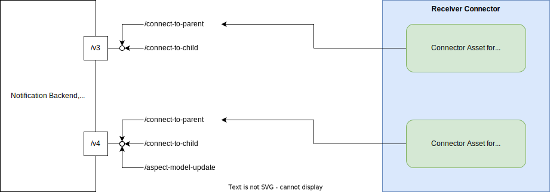

# CX-0151 Industry Core: Basics v.1.0.0

## ABSTRACT

The standard "Industry Core: Basics" defines basic features of the Industry Core. These basic features build the foundation for message-based and digital-twin-based data exchange in Catena-X.

Message-based communication or respectively data push scenarios can leverage the notification feature, whilst data pull scenarios can leverage the digital-twin-based data discovery as well as data exchange orchestration.

Use cases are intended to build upon the foundation provided by the Industry Core to support use case agnostic interoperability, reusability, monitoring and minimized entry barriers towards new use cases.

## FOR WHOM IS THE STANDARD DESIGNED

This standard is primarily intended for use cases that want to integrate Industry Core features into their use case as well as application and data providers/consumers that want to implement use cases based on Industry Core.

## 1 INTRODUCTION

This standard defines basic features of the Industry Core. The Industry Core is a shared foundation for use cases that utilize notifications, digital twins and aspect models in Catena-X.

"Industry Core: Basics" covers the foundation for message-based data exchange using notifications. Notifications are already used in several use cases, but their implementation is not yet standardized. Most use cases, although, based their implementation on the first implementation, Traceability Quality Alerts & Investigations (on which this standard is also based). This standard now defines an interoperable solution for sending and receiving notifications via connectors in Catena-X.

Digital-twin-based data exchange for material or part related data is described in two separate Catena-X standards: "Industry Core: Part Instance" and "Industry Core: PartType".
Nevertheless this document also holds guidance on when to use a digital twin for objects and information in an use-case.

A shared technical foundation offers significant advantages for dataspace participants and software providers. By minimizing the technical footprint required for multi-use-case participation and software development, it enables substantial reductions in development, maintenance costs and cross-usecase reusability.

### 1.1 AUDIENCE & SCOPE

> *This section is non-normative*

This document is targeting subsets of the following roles:

- Catena-X association committees and expert groups (developing use cases)
- Data Provider / Consumer
- Business Application Provider
- Enablement Service Provider

### 1.2 CONTEXT AND ARCHITECTURE FIT

> *This section is non-normative*

#### 1.2.1 Notifications

This standard defines a message-based data exchange within Catena-X. The message is sent from one Catena-X partner - called sender - to another Catena-X partner - called receiver - using simple messages in JSON format via Catena-X connector, as shown in the following figure:


- In the context of this standard, notifications are messages in JSON format with a standardized data format consisting of a standardized header and a use-case-specific content.
- The exchange consists of a set of operations that can be used to exchange notifications between sender and receiver. Each operation has a defined request, i.e., the notification, and a response which consists of HTTP error codes. Operations can use notifications with different data formats. It is not required to use the same notification data format for all operations.
- The exchange is done via Catena-X connectors. So, this standard also defines assets, asset properties, and usage policies that are required for implementation of the exchange.

Together, these artifacts define the message-based data exchange, called notification API. Industry Core: Basics also defines a standardized way to document all these artifacts of a notification API in Catena-X standard documents and KITs.

Use cases can define and standardize their own notification APIs. They need to extend the Industry Core notification API by adding their own business content.

- They must extend the content part of the notification data format with their own business content.
- They must define a set of operations that should be supported with the use case specific notification API.
- They also must define a name for their notification API which is, for example, used in the `dct:type` property of the connector asset.

As all use cases use the same underlying notification technology based on Industry Core, use cases still are interoperable. Data and app providers only need to implement one notification technology that is jointly used by all use cases and do not need to implement several different technologies for message-based data exchange.

To participate in the Industry Core, the following single standards must be fulfilled by all participants for which the standard is relevant:

- CX-0018 Dataspace Connectivity
- CX-0003 SAMM Aspect Meta Model

#### 1.2.2 Digital Twin - Asset Administration Shell

This section provides guidance on the consideration of digital twins as a basis for data structuring and data discovery within Catena-X. As this section is intended for guidance, it is non-normative.

Details on the exact usage of AAS and Digital Twins can be obtained in CX-0002 Digital Twins in CatenaX and CX-0003 SAMM Aspect Meta Model.

##### 1.2.2.1 General Guidance

Digital twins and their technical representation as an Asset Administration Shell within Catena-X are a crucial element for interoperability and reusability.
By leveraging an AAS-compliant Digital Twin Registry, the provisioning and publishing of object-related data via standardized submodel templates through the standardized API enables reusable data discovery and consumption mechanisms across various use cases.

However, the provisioning of a digital twin incurs certain costs. Therefore, the Industry Core provides the following guidance and highlights potential benefits:

##### Discrete Nature of Digital Twins

Digital twins should be associated with an underlying object (real or virtual) to which data will be attached. Creating a digital twin for a pure set of mass data (e.g., generic usage data) not related to a specific discrete object may be unnecessary, as it might already be represented by a data asset in dataspace terms according to CX-0018 Dataspace Connectivity.

Examples of Discrete Objects in the automotive context:

- a part number / catalog part (as described in "Industry Core: PartType")
- a serialized part / material (as described in "Industry Core: Part Instance")
- a product batch
- a quality case
- a production line
- serialized production equipment
- ...

Even with an underlying object, the usage of a digital twin might still not be necessary based on the predefined exclusive utilization of the data within a use-case. Therefore the following questions should be answered:

- Is the object and especially the data linked to it shared or likely to be shared between different use cases ?
- Is the object itself linked to different sets of data (submodels), that are individually accessed ?
- Is the object identified by different identifiers, requiring the use or translation of these identifiers for discovery mechanisms ?
- Is the object commonly accessed individually and not via mass data requests ?
- Is the data intended to be used more than once and therefore worth to be discovered ?

If all of the above questions are answered with a clear "No", a twin might be overhead for an object or data to be shared within one specific use-case.
Examples include:

- the data to be shared is a set of mass data not linked to a specific instance of an object
- the data is only being used and intended to be used by a single use-case and there is no cross-use-case relevancy anticipated

##### 1.2.2.2 Additional Recommendations and Comments

If mass data is used for analysis to generate new data applicable to a specific object (e.g., material, serialized part, batch), this data should be linked to a digital twin at that level, while the originating mass data sets are not required to be linked. For example, analytics use cases leveraging mass data sets regarding multiple objects could feed their outcome back into the digital twins of the known objects, while the potentially use-case proprietary mass data sets are not necessarily represented by digital twins or submodels.

Data that is exchanged via request and answer schemes, due to the need of additional processes to generate, may also be attached -once generated- in addition to the direct exchange.

The AAS does not alter data structures; it defines a method to link data (submodels) to objects and establishes a standardized path for data discovery.
Data Structures and Semantics should be described by semantic models to support easy consumption.

Linking data to multiple twins does not increase its persistence footprint. The Digital Twin Registry merely points to the actual data sources.

### 1.3 CONFORMANCE AND PROOF OF CONFORMITY

> *This section is non-normative*

In addition to all sections marked as non-normative, all authoring guidelines, diagrams, examples, and notes in this specification are non-normative. Everything else in this specification is normative.

The key words **MAY**, **MUST**, **MUST NOT**, **OPTIONAL**, **RECOMMENDED**, **REQUIRED**, **SHOULD** and **SHOULD NOT** in this document are to be interpreted as described in BCP 14 [RFC2119] [RFC8174] when, and only when, they appear in all capitals, as shown here.

> **Note:** With Catena-X release 25.03, it is optional for use cases to use this standard. Our goal is to introduce this standard as optional, so that use cases have enough time to adjust their standards. Therefore, Industry Core: Basis will only become mandatory with the next major release after 25.03. This gives use cases as well as Catena-X participants enough time to adjust to this new standard as - even with Industry Core: Basics becoming mandatory with the next major release - the previous major release will still be valid for one year.

All participants and their solutions will need to prove, that they are conform with the Catena-X standards. To validate that the standards are applied correctly, Catena-X employs Conformity Assessment Bodies (CABs).

- To prove conformity with the notification data format, create a JSON schema of the data format that will be used for notifications. The notification must be in JSON format, the data format must be compliant with the notification data format defined in [2.1 NOTIFICATION DATA FORMAT](#21-notification-data-format). This includes that the header must be compliant with the MessageHeader aspect model. Hand in the JSON schema to a conformity assessment body.
- To prove conformity with the mapping of the notification API to the Catena-X connector, export the asset definition from the connector. Hand in the asset definition to a conformity assessment body.
- To prove conformity with the notification API, create an OpenAPI specification for the notification API that is exposed via a connector to Catena-X. Hand in the OpenAPI specification to a conformity assessment body.

### 1.4 EXAMPLES

**Notifcation in JSON format**

```json
{
  "header": {
    "messageId": "urn:uuid:f9a97301-a000-44dd-b9d8-78488a40c6bb",
    "context": "IndustryCore-DigitalTwinEventAPI-ConnectToParent:3.0.0",
    "sentDateTime": "2024-07-05T08:13:33.20733Z",
    "senderBpn": "BPNL000000000AAA",
    "receiverBpn": "BPNL000000000ZZZ",
    "expectedResponseBy": "2024-07-08T08:13:33.20733Z",
    "version": "3.0.0"
  },
  "content": {}
}
```

**Definition for a Notification API Asset:**

```json
{
  "@id": "DigitalTwinEventAPI",
  "@type": "Asset",
  "properties": {
    "dct:type": {
      "@id": "cx-taxo:DigitalTwinEventAPI"
    },
    "cx-common:version": "3.0",
  },
  "dataAddress": {},
  "@context": {
    "dct": "http://purl.org/dc/terms/",
    "cx-taxo": "https://w3id.org/catenax/taxonomy#",
    "cx-common": "https://w3id.org/catenax/ontology/common#"
  }
}
```

**OpenAPI Specification for a Notification API**:

[Catena-X Digital Twin Event API](./assets/example-digital-twin-event-api.yaml)

### 1.5 TERMINOLOGY

> *This section is non-normative*

The following terms are especially relevant for the understanding of the standard:

**Message**: Data with a defined format exchanged between two partners, a sender and a receiver.

**Notification**: In Catena-X, notifications are JSON messages with a standardized data format consisting of a standardized header and a use-case-specific content.

**Notification API**: A message-based data exchange within Catena-X that supports a set of operations.

**Unique ID / Catena-X ID**: A Unique ID uniquely identifies a particular real-world asset. In Industry Core, these are: serialized parts (including vehicles), batches, JIS parts (Just-in-Sequence) and catalog parts. A Unique ID is a URN and has the following format: urn:uuid:\<UUIDv4\>, i.e., the NID is "uuid" and the NSS is an UUID Version 4 (as described here: https://en.wikipedia.org/wiki/Universally_unique_identifier). Unique IDs are used in several places in Industry Core, e.g., as globalAssetId for digital twins. Although they share the same format with other identifiers like, e.g., the AAS identifier, they are separate identifiers that identify different resources and should not be mistaken with these other identifiers.

## 2 RELEVANT PARTS OF THE STANDARD FOR SPECIFIC USE CASES

> *This section is normative*

### 2.1 NOTIFICATION DATA FORMAT

#### 2.1.1 DATA REQUIRED

This section defines the data format of notifications:

- Notifications MUST be in JSON format.
- Notifications MUST be compliant to the following data format:

```json
  {
    "header": {
      "messageId": "urn:uuid:f9a97301-a000-44dd-b9d8-78488a40c6bb",
      "context": "IndustryCore-DigitalTwinEventAPI-ConnectToParent:2.0.0",
      "sentDateTime": "2024-07-05T08:13:33.20733Z",
      "senderBpn": "BPNL000000000AAA",
      "receiverBpn": "BPNL000000000ZZZ",
      "expectedResponseBy": "2024-07-08T08:13:33.20733Z",
      "version": "3.0.0"
    },
    "content": {}
  }
```

- The JSON schema for this schema is available [here](./assets/notification.schema.json).
- The property `header` MUST be compliant to the aspect model [MessageHeaderAspect](#31-aspect-model-messageheaderaspect).
  - The `messageId` of a notification MUST uniquely identify a single message, therefore it MUST not be reused. No two notifications MUST share the same `messageId`. Only if a notification could not be sent because of data transfer errors, it MAY be re-sent with the same `messageId`.
  - It is RECOMMENDED to use the following format (defined in the MessageHeaderAspect aspect model) for property `context`: `<domain>-<subdomain>-<object>:<[major] version>`
    - `<domain>` SHOULD be the name of the use case that defines the notification, e.g., `IndustryCore`.
    - `<subdomain>` SHOULD be the name of the notification API, e.g., `DigitalTwinEventAPI`.
    - `<object>` SHOULD be the name of the operation for which the notification is used, e.g., `ConnectToParent`.
    - Versioning only refers to major versions in both default and fallback cases.
    - This is recommended as it allows the notification receiver to freely choose what technology to use for the backend service. If this information is not encoded into the notifcation's `context` propoerty, a backend service like a message-queue technology will not know which notification operation was invoked by the sender as the endpoint information is not available in this case (compared to a REST API backend service).
- Content and structure of the property `content` are not stanardized and MUST be defined by the use case defining the notifications API. A schema for this property MUST be defined as part of the OpenAPI specification of the notification API of the use case.

#### 2.1.2 ADDITIONAL REQUIREMENTS

No additional requirements are defined currently.

### 2.2 NOTIFICATION API DOCUMENTATION

A use case defining a notification API as part of its standard MUST document the following artifacts:

- All notification data formats MUST be documented either as separate JSON schema or (also in JSON schema) as part of the notification API's OpenAPI specification.
- The notification API MUST be documented with an OpenAPI specification that MUST be published on the Tractus-X Swagger space.
- For a standardized use case, the name of the notification API (used in property `http://purl.org/dc/terms/type`) MUST be defined in the Catena-X taxonomy published under https://w3id.org/catenax/taxonomy.
- The notification API asset in the connector MUST define the property `http://purl.org/dc/terms/type` as defined in [4.1.3 EDC DATA ASSET STRUCTURE](#413-edc-data-asset-structure).

## 3 ASPECT MODELS

> *This section is normative*

### 3.1 ASPECT MODEL "MessageHeaderAspect"

#### 3.1.1 INTRODUCTION

The Catena-X Message Header contains standardized attributes for message processing that are common across several use cases. It targets a minimal set of aspects that are required for overall message handling, but not for the processing of the business related payload part. By standardizing the message header structure, we support a harmonized modelling approach and re-use of concepts.

#### 3.1.2 SPECIFICATIONS ARTIFACTS

The modeling of the aspect model was done in accordance to the "semantic driven workflow" to create a submodel template specification [SMT](#62-non-normative-references).

The aspect model is written in SAMM 2.1.0 as a modeling language conformant to CX-0003 as input for the semantic driven workflow.

Like all Catena-X aspect models, this model is available in a machine-readable format on GitHub conformant to CX-0003: https://github.com/eclipse-tractusx/sldt-semantic-models/tree/main/io.catenax.shared.message_header

#### 3.1.3 LICENSE

This Catena-X data model is an outcome of Catena-X use case group Industry Core. This Catena-X data model is made available under the terms of the Creative Commons Attribution 4.0 International (CC-BY-4.0) license, which is available at Creative Commons[^2].

The license information is available in GitHub.

In case of doubt the license, copyright and authors information in GitHub overwrites the information in this specification document.

#### 3.1.4 IDENTIFIER OF SEMANTIC MODEL

```
urn:samm:io.catenax.shared.message_header:3.0.0#MessageHeaderAspect
```

#### 3.1.5 FORMATS OF SEMANTIC MODEL

##### 3.1.5.1 RDF TURTLE

The RDF turtle file, an instance of the Semantic Aspect Meta Model, is the master for generating additional file formats and serializations.  These can be viewed by following link: https://github.com/eclipse-tractusx/sldt-semantic-models/blob/main/io.catenax.shared.message_header/3.0.0/MessageHeaderAspect.ttl

The open source command line tool of the Eclipse Semantic Modeling Framework[^3] is used for generation of other file formats like for example a JSON Schema, aasx for Asset Administration Shell Submodel Template or a HTML documentation.

##### 3.1.5.2 JSON SCHEMA

A JSON Schema can be generated from the RDF Turtle file.

## 4 APPLICATION PROGRAMMING INTERFACES

> *This section is normative*

### 4.1 NOTIFICATION API

The notification API of a use case MUST be defined with an OpenAPI specification. In this specification, all artefacts of the API are defined, e.g., name of the API, operation names, and notification data formats.

#### 4.1.1 PRECONDITIONS AND DEPENDENCIES

- The use case MUST standardize the notification API's name. The name of the notification API (used in property `http://purl.org/dc/terms/type`) MUST be defined in the Catena-X taxonomy published under https://w3id.org/catenax/taxonomy.
- For a notification API, only the HTTP method POST is allowed.

#### 4.1.2 API SPECIFICATION

- Notification operations are modelled as endpoints (resources). For every operation, exactly one endpoint MUST be defined. This endpoint only supports the HTTP POST method.
- The path URL SHOULD be the operation name with optional "-" as word separator.
- The operationId MUST be the notification operation name. The same name SHOULD be used as `<object>` in the `context` property of the notification header. This redundancy is RECOMMENDED to allow the notification receiver to freely choose what technology to use for the backend service, e.g, a REST API or message-queue technology.
- The notification is the actual request body of the HTTP POST method. Its schema MUST also be defined in the specification.
  
**Example:** [OpenAPI specification for Digital Twin Event API](./assets/example-digital-twin-event-api.yaml) - Excerpt:

```yaml
openapi: 3.0.1
info:
openapi: 3.0.1
info:
  title: Catena-X Digital Twin Event Notification API Specification
  description: The full specification for the Catena-X Digital Twin Event Notification API (including Unique ID Push)
  license:
    name: Apache License v2.0
    url: http://apache.org/v2
  version: 3.0.0
tags:
  - name: Digital Twin Event API
    description: "API for Catena-X Digital Twin Event Notifications (including Unique ID Push)"
paths:
  /connect-to-parent:
    post:
      tags:
        - Digital Twin
      description: Receives a Unique ID Push notification to connect a digital twin with its parent digital twin (bottom-up notification)
      operationId: ConnectToParent
      requestBody:
        content:
          application/json:
            schema:
              $ref: "#/components/schemas/UniqueIdPushConnectToParentRequestBody"
      responses:
        "200":
          $ref: "#/components/responses/OK"
        "400":
          $ref: "#/components/responses/BadRequest"
        "404":
          $ref: "#/components/responses/NotFound"
```

#### 4.1.3 ERROR HANDLING

The following HTTP response codes SHOULD be defined for all notification operations:

| Code | Description | |
|------|-------------------------------------------------------------------------------------------------------------------------------------------------------------------------------------------------------------------------|---|
| 200  | OK | Indicates that the request has succeeded. |
| 4xx  | ERROR | The notification cannot be processed. |
| 5xx  | ERROR | The notification cannot be processed. |

A response body MAY also be defined (e.g., see Feedback notification operation in the example above).

These error codes are currently optional as the Catena-X connector does not yet return correct error messages from backend services. These error codes will become mandatory once the connector returns correct error messages from backend services.

#### 4.1.4 CONNECTOR ASSET STRUCTURE

For a notification API, exactly one asset in the connector MUST be defined. All notifications operations of the API must be invoked through this asset.

- The property `http://purl.org/dc/terms/type` MUST reference the name of the notification API as defined in the Catena-X taxonomy published under https://w3id.org/catenax/taxonomy.

**Example of an asset definition for a notification API:**

```json
{
  "@id": "DigitalTwinEventAPI",
  "@type": "Asset",
  "properties": {
    "dct:type": {
      "@id": "cx-taxo:DigitalTwinEventAPI"
    },
    "cx-common:version": "3.0",
  },
  "dataAddress": {},
  "@context": {
    "dct": "http://purl.org/dc/terms/",
    "cx-taxo": "https://w3id.org/catenax/taxonomy#",
    "cx-common": "https://w3id.org/catenax/ontology/common#"
  }
}
```

#### 4.1.5 VERSIONING

Versioning of the notification API MUST follow the Catena-X guidelines for versioning. For every new major version of a notification API, a new connector asset MUST be created. If, e.g., a REST API is used as backend notification receiver, the incoming notifications can be fowarded to the correct REST API version via the corresponding connector asset, as depicted in the following figure:



The API's version is not only documented in the notification's connector asset (property `https://w3id.org/catenax/ontology/common#version`), but also in the OpenAPI specification as well as in a notification's `context` property.

## 5 PROCESSES

> *This section is normative*

### 5.1 NOTIFICATION PROCESS

A notification is sent from one Catena-X partner - called sender - to another Catena-X partner - called receiver - using simple messages in JSON format via Catena-X connector, as shown in the following figure:


- The receiver provides an asset in the connector to which notifications can be sent.
- The sender initiates a contract negotiation for this asset to get a contract agreement and dataplane endpoint.
- After a successful contract negotiation, the sender sends the notification via a HTTP POST request to the receiver via the dataplane endpoint from the contract agreement.
- All notification operations are sent via the same asset using the same contract agreement.

#### 5.1.1 ACTORS AND ROLES

**Catena-X Partner:** A company participating in the Catena-X network. A partner can act as both, a notification sender or notification receiver.

**Notification Sender:** The sender of a Catena-X notification

**Notification Receiver:** The receiver of a Catena-X notification. The receiver provides an asset in the connector to which notifications can be sent.

<!-- #### 5.1.2 PROCESS REPRESENTATION -->

## 6 REFERENCES

### 6.1 NORMATIVE REFERENCES

> *This section is normative*

- CX-0018:3.3 Dataspace Connectivity
- CX-0003:1.2 SAMM Aspect Meta Model

### 6.2 NON-NORMATIVE REFERENCES

> *This section is non-normative*

[SMT] How to create a submodel template specification. Guideline. Download from: https://industrialdigitaltwin.org/wp-content/uploads/2022/12/I40-IDTA-WS-Process-How-to-write-a-SMT-FINAL-.pdf

[^1]: 

[^2]: 

[^3]: 

[^4]: 

<!-- ### 6.3 REFERENCE IMPLEMENTATIONS

> *This section is non-normative*

```text
    [Mandatory] - List reference implementations that implement the standard. 

    Example: The code found at https://github.com/eclipse-tractusx/item-relationship-service 
    presents a reference implementation that implements this standard.

    The code found at XX implements the standard.
``` -->

<!-- ## ANNEXES

### FIGURES

> *This section is non-normative*

```text
    [OPTIONAL] Add figures here if necessary. Please delete if no figures are provided
```

### TABLES

> *This section is non-normative*

```text
    [OPTIONAL] Add Tables here if necessary. Please delete if no tables are provided
``` -->

<!-- ## ABOUT THIS DOCUMENT & MOTIVATION

## DISCLAIMER & LIABILITY -->

## REVISIONS & UPDATES

| Version | Catena-X Release | Date | Changes |
| :--: | :--: | :--: | -- |
| 1.0.0  | 25.03 | 17.03.2025 | Inital creation of this standard to standardize the Notifcations API. |

## COPYRIGHT & TRADEMARKS

Copyright © 2025 Catena-X Automotive Network e.V. All rights reserved. For more information, please visit [here](/copyright).
