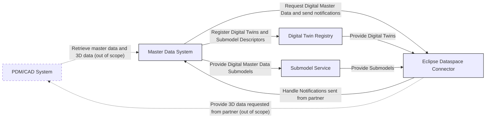
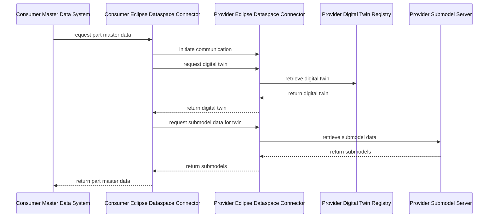
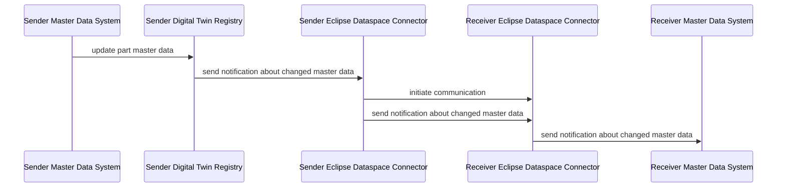

# CX-0154 Digital Master Data v.1.0.1

:::warning

The following standards was identified as not fully **backward compatibility with CX-Jupiter**  and was allowed to apply the required changes through a **fast-track process** to be included in the CX-Saturn release.
These exceptions will be released together with the  *CX-Saturn Go-Live** of all other standards on **25.11**.

**Therefore, this version of the standard is not eligible for certification yet**

:::

## ABSTRACT

The standard "Digital Master Data" shall enable a standardized, interoperable and secure exchange of structured master data across the automotive value chain to improve data consistency, traceability and collaboration.

## FOR WHOM IS THE STANDARD DESIGNED

The standard is intended for data provider/consumer and Business Application Provider that want to provide and access Digital Master Data on which assets will be created.

## 1 INTRODUCTION

The project aims to reduce data inconsistencies and manual effort in the supply chain by enabling structured exchange of 2D/3D and digital master data. It enhances efficiency in PDM and CAD systems through harmonized master data shared between OEMs and suppliers.

On a broader scale, the initiative supports the digitalization of the automotive industry by establishing standardized data exchange infrastructure. It fosters collaboration and transparency among supply chain partners, reduces operational risks, and leads to significant time and cost savings by eliminating manual processes. Additionally, it helps meet regulatory requirements and enables the development of new digital services based on real-time, accurate data.

<!-- 

Project Benefits:
- Reduction of data inconsistencies and manual efforts in the supply chain
- Improved, structured exchange of 2D and 3D data alongside digital master data
- Improved efficiency in PDM and CAD systems (and downstream processes) by leveraging harmonized master data along OEM’s and suppliers

Market Benefits:
- Acceleration of digitalization progress in the automotive industry through standardized data exchange infrastructure
- Increased collaboration and transparency between supply chain partners leading to reduced production and operational risks
- Cost and time savings due to eliminating manual processes for data preparation (e.g., 2D & 3D data)
- Meet regulatory requirements, that the industry faces
- Enabling new or improved digital services based on real-time and accurate master data

-->

### 1.1 AUDIENCE & SCOPE

> *This section is non-normative*

This standard is relevant for the following audience:

- Data Provider / Consumer
- Business Application Provider

This document focuses on Digital Master Data which is exchanged before the actual physiscal asset is created.

Out-of-scope is:

- The exchange of instance specific information (see [CX-0127 Industry Core PartInstance](https://catenax-ev.github.io/docs/standards/CX-0127-IndustryCorePartInstance))
- information that is already relevant in an existing supplier OEM-relationship (see [CX-0126 Industry Core: PartType](https://catenax-ev.github.io/docs/standards/CX-0126-IndustryCorePartType))

### 1.2 CONTEXT AND ARCHITECTURE FIT

During the development of components, there is a continuous exchange of data between  supplier and OEM. The exchanged information includes requirements, properties of components and materials, test results, as well as 2D and 3D models. The exchange of this data is not standardized yet and usually requires data transformations among the involved partners.

This initial version of the standard defines the basic data model that enables digital exchange of part master data between between partners.

To provide a general framework, the components, interactions, APIs, and data models involved in this use case are presented in this chapter.

#### Components

- **Master Data System**: Abstraction for systems provding master data. Depending on the implemention this could be a PDM system, a database or a standalone application
- **Digital Twin Registry**: Stores and manages digital twin information
- **Submodel Service**: Handles submodel data and operations
- **Eclipse Dataspace Connector (EDC)**: Reference implementation of a connector fulfilling the Dataspace Protocol (DSP) for data exchange between partners

#### Interactions

The system architecture demonstrates how components interact to facilitate master data exchange:

- **Master Data System**
  - Registers Digital Twins and Submodel Descriptors in the Digital Twin Registry
  - Provides Master Data Submodels to the Submodel Service
  - Uses the Eclipse Dataspace Connector to request digital master data and send notifications
- **Eclipse Dataspace Connector (EDC)**
  - Handles notifications sent from partners back to the Master Data System
  - Acts as the communication bridge between partners
- **Digital Twin Registry**
  - Provides Digital Twins to the Eclipse Dataspace Connector
- **Submodel Service**
  - Provides Submodels to the Eclipse Dataspace Connector

The following diagram illustrates the interactions between the named components.



>Note: As part of the part master data information regarding 2D and 3D models are exchanged to enable retrieval of these models from the respective source systems. The concrete transfer of 2D and 3D data is not part of this specification but is listed for completeness and differentiation (visible as a dashed list in the diagram).

#### APIs

The data exchange is based on existing Catena-X standards. For more details refer to chapter 4.

- Digital master data is provided in defined aspect models that are attached to a Digital Twin.
- Sending and receiving of notifications in case of updated master data.

### 1.3 CONFORMANCE AND PROOF OF CONFORMITY

> *This section is non-normative*

Sections marked as non-normative as well as all authoring guidelines, diagrams, examples, and notes in this specification are non-normative. Everything else in this specification is normative.

The key words **MAY**, **MUST**, **MUST NOT**, **OPTIONAL**, **RECOMMENDED**, **REQUIRED**, **SHOULD** and **SHOULD NOT** in this document are to be interpreted as described in BCP 14 [RFC2119] [RFC8174] when, and only when, they appear in all capitals, as shown here.

All participants and their solutions will need to prove, that they are conform with the Catena-X standards.
To validate that the standards are applied correctly, Catena-X employs Conformity Assessment Bodies (CABs).

To prove conformance with the standard a participant (consumer, provider or application developer) MUST show that they can

- provide a digital master data twin and its associated submodels to other participants
- consume a digital master data twin and its associated submodels from another participant
- publish notifications in case a digital master data twin or its associated submodels are created, updated or deleted
- receive notifications in case a digital master data twin or its associated submodels are altered by another participant

### 1.4 Examples

#### JSON Payload Digital Master Data exchange

```json
{
   "digitalMasterDataId":"urn:uuid:48878d48-6f1d-47f5-8ded-a441d0d879df",
   "basicdata":{
      "category":"Exterior",
      "description":"Injection-molded front bumper with integrated sensor mounts",
      "nomenclature":"Head Unit",
      "notes":[
         {
            "timestamp":"2025-06-17",
            "noteProperty":"Updated hole diameter from 10mm to 12mm"
         }
      ],
      "partNumber":"145SGG01.1",
      "releaseDate":"2025-03-15",
      "status":"Approved",
      "successorPart":"urn:samm:io.catenax.masterdatamanagement:a2f115cd-b9dd-4c5d-94c1-52fdf5b99a88",
      "supersededVersion":"V3.0",
      "supplier":"BPNL6666666666YY",
      "validFrom":"2024-03-15",
      "validTo":"2025-01-10",
      "version":"v3.2.1"
   },
   "engineering":{
      "electronicsData":{
         "diagnosticsAndErrorCodes":"P0420 - Catalyst System Efficiency Below Threshold",
         "flashingMethod":"UDS Flash via DoIP"
      },
      "mechanicsData":{
         "geometryData":{
            "representations":[
               {
                  "id":"Master Drawing",
                  "type":"2D_DRAWING",
                  "submodelSemanticId":"urn:samm:io.catenax.3dm:a2f115cd-b9dd-4c5d-94c1-52fdf5b99a88"
               },
               {
                  "id":"CAD MODEL",
                  "type":"3D_MODEL",
                  "submodelSemanticId":"urn:samm:io.catenax.3dm:a2f115cd-b9dd-4c5d-94c1-52fdf5b99b56"
               }
            ],
            "boundingBox":{
               "length":120.0,
               "width":45.0,
               "height":30.0,
               "unit":"mm"
            },
            "boundingSphere":{
               "value":315.0,
               "unit":"mm"
            },
            "calculatedWeight":{
               "value":2.35,
               "unit":"kg"
            },
            "calculatedWeightTolerance":"±0.5 kg or ±2%",
            "centerOfGravity":"(150.2, 75.6, 20.1) mm",
            "estimatedWeight":{
               "value":2.35,
               "unit":"kg"
            },
            "estimatedWeightTolerance":"±0.5 kg or ±2%",
            "momentOfInertia":{
               "value":0.045,
               "unit":"kg·m²"
            },
            "surfaceArea":{
               "value":200,
               "unit":"mm2"
            },
            "volume":{
               "value":400,
               "unit":"mm3"
            },
            "weightedWeight":{
               "value":2.35,
               "unit":"kg"
            },
            "weightedWeightTolerance":"±0.5 kg or ±2%"
         },
         "materialData":{
            "density":{
               "value":7850,
               "unit":"kg/m³"
            },
            "materialDescription":"Aluminum Alloy 6061-T6",
            "materialID":{
               "type":"IMDS",
               "id":"123456789"
            },
            "thermalExpansionCoefficient":"2.3 × 10⁻⁶ 1/K"
         }
      },
      "requirementInformation":"urn:samm:io.catenax.requirement:a2f115cd-b9dd-4c5d-94c1-52fdf5b99a88",
      "softwareData":{
         "securityAndEncryptionStandards":[
            "AES-256",
            "TLS 1.2",
            "Secure Boot"
         ],
         "signatureSign":"SH",
         "softwareVersion":"v3.2.1"
      }
   },
   "complianceData":{
      "homologationApprovalNumber":"E1 2007/46*1234*01",
      "safetyRelevant":true,
      "safetyRelevantFeatures":[
         "X"
      ],
      "statutoryFeature":[
         "REACH",
         "RoHS",
         "ISO 26262",
         "DBL 5307.10"
      ]
   }
}
```

#### JSON Payload Notifications

> This event payload is based on the [Catena-X Digital Twin Event Notification API Specification](https://catenax-ev.github.io/assets/files/example-digital-twin-event-api-000889369be1066b0612dd2ed5499b58.yaml).

```json
{
  "header": {
    "messageId": "urn:uuid:51BBbF0d-3784-1FBb-67Cf-fd3e5aeFa06b",
    "context": "IndustryCore-DigitalTwinEvent-<Operation>:3.0.0",
    "sentDateTime": "2007-08-31T16:47+00:00",
    "senderBpn": "BPNLNAH3KGbV0Ar6",
    "receiverBpn": "BPNLncBRFjdLU19t",
    "expectedResponseBy": "2007-08-31T16:47+00:00",
    "relatedMessageId": "b8eDBc8f-Ac4e-aFc6-2A1f-Cb61c5ea1fa7",
    "version": "3.0.0"
  },
  "content": {
    "listOfEvents": [
      {
        "eventType": "UpdateSubmodel",
        "catenaXId": "urn:uuid:d32d3b55-d222-41e9-8d19-554af53124dd",
        "submodelSemanticId": "urn:samm:io.catenax.masterdatamanagement:1.0.0#"
      }
    ]
  }
}
```

### 1.5 TERMINOLOGY

**Business Partner Number (BPN)**: A BPN is the unique identifier of a partner within Catena-X.

**Notification**: In Catena-X, notifications are JSON messages with a standardized data format consisting of a standardized header and a use-case-specific content.

## 2 RELEVANT PARTS OF THE STANDARD FOR SPECIFIC USE CASES

> *This section is normative*

### 2.1 "Digital Master Data"

#### 2.1.1 DIGITAL TWINS AND SPECIFIC ASSET IDs

The Digital Twin MUST be described as a ``PartRole``.

Specific asset IDs are used to identify digital twins when looking up or searching for these digital twins. This is a required to connect the digital twins of the engineered parts to its digital twins. Mandatory specific asset IDs ensure that at least this information is available for the digital twin.

| Key | Availability | Description | Type |
|----------------|--------|---------------------------------------------------------------------|------|
| manufacturerId | mandatory | The Business Partner Number (BPNL) of the manufacturer of the part. | BPNL |
| digitalTwinType| mandatory | The digitalTwinType has to be set to ``digitalTwinType="PartRole"``. Without this filter, a search for a particular manufacturer part ID would not only return the digital twin of the engineered part, but also all digital twins of the manufacturer that are accessible, i.e., of the corresponding serial parts and catalog parts. | String |

### 2.2 POLICY CONSTRAINTS FOR DATA EXCHANGE

In alignment with our commitment to data sovereignty, a specific framework governing the utilization of data within the Catena-X use cases has been outlined.  As part of this data sovereignty framework, conventions for access policies, for usage policies and for the constraints contained in the policies have been specified in standard 'CX-0152 Policy Constraints for Data Exchange'. This standard document CX-0152 **MUST** be followed when providing services or apps for data sharing/consuming and when sharing or consuming data in the Catena-X ecosystem. What conventions are relevant for what roles named in [1.1 AUDIENCE & SCOPE](#11-audience--scope) is specified in the CX-0152 standard document as well. CX-0152 can be found in the [standard library](https://catenax-ev.github.io/docs/standards/overview).

## 3 ASPECT MODELS

> *This section is normative*

### 3.1 ASPECT MODEL "Digital Master Data"

This semantic model, developed for the Catena-X data space, defines a standardized structure for exchanging master data on which products are engineered.

#### 3.1.1 Identifier OF SEMANTIC MODEL

The semantic model has the unique identifier:

```text
  urn:samm:io.catenax.masterdatamanagement:1.0.0#
```

> *Note:*

> - You can find the corresponding Turtle file [here](https://github.com/eclipse-tractusx/sldt-semantic-models/blob/main/io.catenax.masterdatamanagement/1.0.0/digitalmasterdata.ttl)
> - You can find the corresponding files (Documentation, JSON Schema or AASX File, etc.) [here](https://github.com/eclipse-tractusx/sldt-semantic-models/tree/main/io.catenax.digitalmasterdata/1.0.0/gen).

#### 3.1.2 Normative Criteria

This model MUST be used for providing and consuming masterdata.

### 3.2 ASPECT MODEL "MessageHeaderAspect"

The Catena-X Message Header containing standardized attributes for message processing across several use cases. This aspect is defined in standard [CX-0151](https://catenax-ev.github.io/docs/standards/CX-0151-IndustryCoreBasics) Industry Core: Basics.
The aspect `MessageHeaderAspect` is used for sending notifications to Catena-X Partners.

#### 3.2.1 IDENTIFIER OF SEMANTIC MODEL

```text
  urn:samm:io.catenax.shared.message_header:3.0.0#MessageHeaderAspect
```

> *Note:*

> - You can find the corresponding Turtle file [here](https://github.com/eclipse-tractusx/sldt-semantic-models/blob/main/io.catenax.shared.message_header/3.0.0/MessageHeaderAspect.ttl)
> - You can find the corresponding files (Documentation, JSON Schema or AASX File, etc.) [here](https://github.com/eclipse-tractusx/sldt-semantic-models/tree/main/io.catenax.shared.message_header/3.0.0/gen).

#### 3.2.2 Normative Criteria

This model MUST be applied for the usage of the API.

## 4 APPLICATION PROGRAMMING INTERFACES

> *This section is normative*

### 4.1 APIs ASSOCIATED WITH DIGITAL TWINS

This standard completely and solely builds upon the standard [CX-0002](https://catenax-ev.github.io/docs/next/standards/CX-0002-DigitalTwinsInCatenaX) Digital Twins in Catena-X.

### 4.2 NOTIFICATIONS

This standard completely and solely builds upon the standard [CX-0151](https://catenax-ev.github.io/docs/standards/CX-0151-IndustryCoreBasics) Industry Core: Basics.

## 5 PROCESSES

> *This section is normative*

### 5.1 DIGITAL MASTER DATA EXCHANGE

Part master data is requested by one Catena-X partner - called consumer - from another Catena-X partner - called provider - using simple messages in JSON format via Catena-X connector (EDC), as shown in the following figure:



The provider provides an asset in the EDC to retrieve digital twins and the respective submodels.
The consumer initiates a contract negotiation for this asset to get a contract agreement.
After a successful contract negotiation, the consumer requests a digital twin and respective submodels of the part master data via the provider's EDC dataplane endpoint.

#### 5.1.1 ACTORS AND ROLES

- Catena-X Partner: A company participating in the Catena-X network. A partner can act as both, a master data consumer and master data provider.
- Master data consumer: The partner that retrieves part master data from another partner.
- Master data provider: The partner that provides part master data to one or more partners.

### 5.2 NOTIFICATION PROCESS

A notification is sent from one Catena-X partner - called sender - to another Catena-X partner - called receiver - using simple messages in JSON format via Catena-X connector (EDC), as shown in the following figure:



The receiver provides an asset in the EDC to which notifications can be sent.
The sender initiates a contract negotiation for this asset to get a contract agreement.
After a successful contract negotiation, the sender sends the notification to the receiver via the dataplane endpoint.
All notification operations are sent via the same asset using the same contract agreement.

#### 5.2.1 ACTORS AND ROLES

- Catena-X Partner: A company participating in the Catena-X network. A partner can act as both, a notification sender or notification receiver.
- Notification Sender: The sender of a Catena-X notification.
- Notification Receiver: The receiver of a Catena-X notification. The receiver provides an asset in the connector to which notifications can be sent.

## 6 REFERENCES

### 6.1 NORMATIVE REFERENCES

> *This section is normative*

- CX-0001 EDC Discovery API v1.1
- CX-0002 Digital Twins in Catena-X v2.2.0
- CX-0003 SAMM Aspect Meta Model v1.2.0
- CX-0010 Business Partner Number v3.0.0
- CX-0018 Dataspace Connectivity v4.0.0
- CX-0151 Industry Core: Basics v.1.0.0
- CX-0152 Policy Constraints for Data Exchange v1.0.0

### 6.2 NON-NORMATIVE REFERENCES

> *This section is non-normative*

- [ISO 10303-242:2022](https://www.iso.org/standard/84667.html)
- [ISO 14306:2017](https://www.iso.org/standard/62770.html)
- [RFC 2077](https://www.rfc-editor.org/rfc/rfc2077.html)
- [VDA 231](https://webshop.vda.de/VDA/en/vda-231-301-022025)
- [prostep ivip Digital Data Package (DDP) Recommendation](https://www.prostep.org/en/medialibrary/detail?ai%5Baction%5D=detail&ai%5Bcontroller%5D=Catalog&ai%5Bd_name%5D=ddp_rec&ai%5Bd_pos%5D=31)

### 6.3 REFERENCE IMPLEMENTATIONS

> *This section is non-normative*

This section is empty.

### 6.4 LICENSES

> *This section is non-normative*

The in Section 3 referenced Aspect Models are available under the terms of the Creative Commons Attribution 4.0 International (CC-BY-4.0) license, which is available at Creative Commons.

## Legal

Copyright © 2025 Catena-X Automotive Network e.V. All rights reserved. For more information, please visit [here](/copyright).
