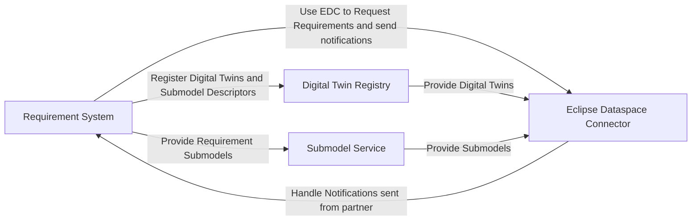
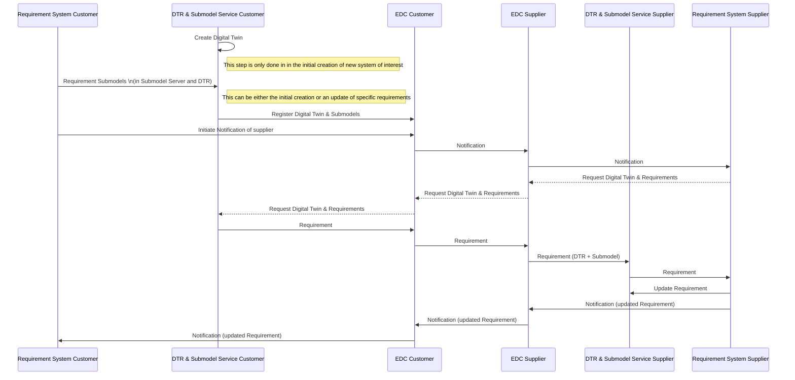

# CX-0155 Requirements Engineering v.1.1.0

## ABSTRACT

This standard focuses on the Requirement Exchange Use Case in the Engineering domain. It gives guidance and expectations to:

- data provider, that want to provide Requirements through Catena-X,
- data consumer, that want to consume Requirements through Catena-X and
- application developer/provider supporting the exchange of Requirements in Catena-X.

The standard provides information about the required

- core components,
- the mandatory and preferred data structure(e.g. for the Digital Twin Registry and EDC assets) of the entry and used semantic models and
- Processes and API patterns.

The Requirements Exchange Use Case current addresses two main scenarios:

- **Existing Requirements Engineering approaches**: The usual roles in this scenario are a data owner (usually the customer) and a data receiver (usually a supplier). The data owner writes the list of requirements as a specification and sends it to the data receiver. The receiver comments open questions and sends the feedback to the data owner. This process is done until no further open questions exist and a contract is created based on the specification.
- **Collaborative Requirements Engineering**: Sometimes both parties (customer and supplier) want to collaboratively define the requirements. In that case both stakeholders own their requirements and develop the overall specification in collaboration.

System of interest for the requirements can be either a physical product (e.g. a transmission or gearbox), a software defined product or an intended realization of a product (e.g. a product functionality such as consumer entertainment without defined system realizations).

## FOR WHOM IS THE STANDARD DESIGNED

## 1 INTRODUCTION

Starting point of all engineering projects is a defined set of requirements.
Especially in a collaborative environment such as the OEM-supplier collaboration or further customer-supplier relationships it is crucial to have an aligned set of requirements on which both sides can rely.

The Requirement Engineering standard CX-0155 introduces a unified, ReqIF-inspired foundation for the real-time, standardized, and sovereign data sharing between OEMs and suppliers in Catena-X.
It empowers stakeholders to manage, exchange, and validate requirements transparently and collaboratively across the supply chain while maintaining full control over proprietary information, enhancing interoperability, accelerating innovation, and ensuring compliance with industry standards through a flexible, structured, and trustworthy digital environment.

It can shall be applicable for most forms of products:

- **Physical products:** Requirements for the geometry (including reference coordinate systems, dimensions and masses) or the behavior for certain external conditions (e.g. thermal behavior in different environments) shall be possible to specify.
- **Software defined products:** Software functionalities (response times, signal in and outputs) and execution parameters (e.g. for simulations) shall be possible to describe with the standard.
- **Intended Realization:** For products, that are not yet defined but on a very abstract level (e.g. an entertainment system in a vehicle) the basic requirements shall be possible to describe before a defined component exists.

How these will be handled in the use cases is specified in each of the sub use cases (e.g. in CX-0154 Digital Engineering Master Data or CX-0156 Geometry).
This standard (CX-0155) is only intended to define the baseline to define and exchange the requirements.

### 1.1 AUDIENCE & SCOPE

This standard is relevant for the following audience:

- Data Provider / Consumer
- Business Application Provider

This document focuses on the Requirements Exchange in existing Customer-Supplier-Relationships.
It addresses the phase Requirements Engineering, before the creation or selection of physical asset.
Therefore, the following is out of scope:

- The exchange of instance specific information (see [CX-0127 Industry Core PartInstance](https://catenax-ev.github.io/docs/standards/CX-0127-IndustryCorePartInstance))
- The open broadcasting of requirements into the data ecosystem without defined Customer-Supplier-Relationship.
- Exchange of Master Data: For this, consider the standard [CX-0154 Digital Master Data][non-norm]

### 1.2 CONTEXT AND ARCHITECTURE FIT

Requirements Exchange usually happens in the phase, where no contract on actual products to deliver have been agreed on.
The eventually approved requirements are the baseline for the engineering, creation and production of these components.
Thus, they are a fundamental element in the engineering of products.

In todays practice, the companies have own requirements systems, from which a dedicated list of requirements can be extracted and send to the supplier as "Stakeholder Requirements Specification" (StRS) ( in German the term "Lastenheft" is used for the documents created from the Customer in that phase) [[ISO 29148:2018]].
A common format for the exchange is [ReqIF 1.2].

The supplier imports the specification in their own requirements system, analyses it and creates the "System Requirements Specification" (SrRS) addressing the possible technical realization, showing how they can meet the requirements (in German, the term "Pflichtenheft" is used for the specification from the supplier).

As common practice, the  specification can be also done via commenting the StRS requirements and iterating the comments until an agreed on StRS exists.

The standard CX-0155 Requirements Engineering will address this approach.
It introduces a semantic model for describing a requirement in a  Catena-X compliant way.
For that, the following technical components are required:

- **Requirement System**: Core component responsible for requirement management
- **Digital Twin Registry**: Stores and manages digital twin information
- **Submodel Service**: Handles submodel data and operations
- **Eclipse Dataspace Connector (EDC)**: Facilitates data exchange between partners

The system architecture demonstrates how components interact to facilitate requirement exchange:

- **Requirement System**
  - Manages overall requirements at both customer and supplier
  - Registers Digital Twins and Submodel Descriptors in the Digital Twin Registry
  - Provides Requirement Submodels to the Submodel Service
  - Uses the Eclipse Dataspace Connector to request requirements and send notifications (e.g. on updated requirements)
- **Digital Twin Registry**
  - Registers Digital Twins of assets with requirements (e.g. physical products or intended realizations)
  - Provides Digital Twins to the Eclipse Dataspace Connector
- **Submodel Service**
  - Registers submodels attached to the Digital Twins
  - Provides Submodels to the Eclipse Dataspace Connector
- **Eclipse Dataspace Connector (EDC)**
  - Acts as the communication bridge between partners (including contract negotiation and data transfer)
  - Handles notifications sent from partners back to the Requirement System



### 1.3 CONFORMANCE AND PROOF OF CONFORMITY

> *This section is non-normative*

As well as sections marked as non-normative, all authoring guidelines, diagrams, examples, and notes
in this specification are non-normative. Everything else in this specification is normative.

The key words **MAY**, **MUST**, **MUST NOT**, **OPTIONAL**, **RECOMMENDED**, **REQUIRED**, **SHOULD**
and **SHOULD NOT** in this document are to be interpreted as described in BCP 14 [RFC2119] [RFC8174]
when, and only when, they appear in all capitals, as shown here.

All participants and their solutions will need to prove, that they are conform with the Catena-X standards.
To validate that the standards are applied correctly, Catena-X employs Conformity Assessment Bodies (CABs).

Conformity to this standard must be demonstrated along the conformity assessment criteria (CACs) defined for this use case.

### 1.4 EXAMPLES

#### 1.4.1 Exemplary Requirements Exchange Process

The sequence diagram illustrates the requirement exchange flow between a Customer (e.g., an OEM) and a Supplier.
The diagram shows the core components involved in this exchange:

- Requirement Systems (on both Customer and Supplier sides)
- Digital Twin Registry (DTR) & Submodel Services
- Eclipse Dataspace Connector (EDC) for secure data exchange
- Solid lines indicate dataflow
- Dashed lines indicate initialization of a request



1. **Initial Requirement Creation**
     - Customer creates a requirement in their requirements system and registers it in their DTR and creates a submodel.
     - Customer's system sends a notification through the EDC to the Supplier
2. **Requirement Request**
     - Supplier's system requests the requirement details through the EDC
     - The requirement is transferred from Customer's DTR to Supplier's DTR and submodel service
3. **Requirement Update**
     - After processing, Supplier updates the requirement in their requirements system
     - Supplier sends a notification about the update through the EDC back to the Customer
     - Customer is notified about the requirement update
4. **Next interactions**
     - The process can be repeated for further updates or new requirements in an interactive manner between the Customer and Supplier.

#### 1.4.2 Exemplary Data Set

A requirement dataset could look like this:

```json
{
  "requirementRelations" : [ {
    "requirementRelationshipType" : "RequirementSpecialismOfRequirement",
    "relatedRequirementId" : "urn:uuid:e6b31BC2-8102-64AF-034D-C2DC35E37cEE"
  } ],
  "requirementId" : "urn:uuid:48878d48-6f1d-47f5-8ded-a441d0d879df",
  "requirementInformation" : {
    "foreignId" : "3.1.1",
    "longname" : "Plastic deformation of the bogie",
    "versionPredecessor" : {
      "versionPredecessorNumber" : "1.4.5",
      "versionPredecessorId" : "DaCfB4BD-15e7-edf0-77B6-Eb30De54aFbE"
    },
    "reqIfName" : "Plastic deformation of the bogie",
    "reqIfType" : "Functional",
    "metadata" : [ {
      "value" : "2025-11-30T00:00:00.000+02:00",
      "metadataDescription" : "Timestamp of the expected finalization of the requirement",
      "key" : "ExpectedFinalization"
    } ],
    "author" : "Lisa Dräxlmaier GmbH",
    "description" : "eOMtThyhVNLWUZNRcBaQKxI",
    "specification" : [ "https://www.prostep.org/fileadmin/prod-pay-download-8c1d/Recommendation_ReqIF_V2.2.pdf" ],
    "creationDate" : "2026-01-26T15:01:53.446Z",
    "version" : {
      "versionNumber" : "2.0.0",
      "versionId" : "fA8Df9A9-3399-89AB-32eB-e7e61Bce8cFF"
    }
  },
  "requirementStatus" : {
    "customerStatus" : [ {
      "customerStatusComment" : "Requirement needs to be evaluated",
      "customerStatusValue" : "<empty>",
      "customerStatusTimestamp" : "2026-01-26T15:01:53.449Z"
    } ],
    "supplierStatus" : [ {
      "supplierStatusTimestamp" : "2026-01-26T15:01:53.449Z",
      "supplierStatusValue" : "<empty>",
      "supplierStatusComment" : "More information needed from customer"
    } ],
    "statusValue" : "transition status",
    "statusTimestamp" : "2026-01-26T15:01:53.448Z"
  }
}
```

## 1.5 TERMINOLOGY

> *This section is non-normative*

**Attribute**:
inherent property or characteristic of an entity that can be distinguished quantitatively or qualitatively by human or automated means. [[ISO 29148:2018]]

**Condition**:
measurable qualitative or quantitative attribute that is stipulated for a requirement and that indicates a circumstance or event under which a requirement applies. [[ISO 29148:2018]]

**Constraint**:
externally imposed limitation on the system, its design, or implementation or on the process used to develop or modify a system. [[ISO 29148:2018]]

**Customer**:
In case of the Requirements Exchange use case, the customer is the person or organization that could or does receive a product or a service that is intended for or required by this person or organization. [[ISO 29148:2018]] A product may be a physical product, software product or intended realization, created by another party (see supplier). In a OEM-Supplier this is the OEM. It also referred to as data owner or "acquirer" (based on [ISO 29148:2018]: stakeholder that acquires or procures a product or service from a supplier)

**ReqIF**:
Requirements Interchange Format: The format specified by the OMG and standardized within the [ReqIF 1.2] implementation.

**Requirement**:
statement which translates or expresses a need and its associated constraints and conditions. [[ISO 29148:2018]]
A requirement may specify a function that a system must perform or a performance condition a system must achieve. [[ReqIF 1.2]]

**Requirements Engineering***:
interdisciplinary function that mediates between the domains of the [customer] and supplier to establish and maintain the requirements to be met by the system, software or service of interest. [[ISO 29148:2018]]

**Stakeholder**:
individual or organization having a right, share, claim or interest in a system or in its possession of characteristics that meet their needs and expectations. [[ISO 29148:2018]]

**Stakeholder Requirements Specification** (StRS):
Structured collection of the requirements [characteristics, context, concepts, constraints and priorities] of the stakeholder and the relationship to the external environment. [[ISO 29148:2018]]

**Supplier**:
organization or individual that enters into an agreement with the [customer] for the supply of a product or service. [[ISO 29148:2018]]

**System-of-interest**:
system whose life cycle is under consideration in the context of this document. [[ISO 29148:2018]]

**System Requirements Specification** (SyRS):
structured collection of the requirements [functions, performance, design constraints, and other attributes] for the system and its operational environments and external interfaces. [[ISO 29148:2018]]

**Part Instance**:
A part instance is a physically produced instance (e.g. serialized part, batch, just-in-sequence-part) of a part type.

**Part Role**:
A Part Role is the earliest Digital Twin representation of an intended realization within an engineered system context.

**Part Type**:
A part type is a generic (not physically produced) part on material- or catalog-level as a representation for a designed part.

Additional terminology used in this standard can be looked up in the [glossary] on the association homepage.

## 2 RELEVANT PARTS OF THE STANDARD FOR SPECIFIC USE CASES

> *This section is normative*

### 2.1 "Requirements Engineering"

#### 2.1.1 DIGITAL TWINS AND SPECIFIC ASSET IDs

The Digital Twin MUST be described either as ``PartRole`` or as ``PartType``.

You MUST use them as follows:

- If there is already a specific CatalogPart considered which needs to be further defined in the Requirements Engineering process ``PartType`` MUST be used. This should be the default case. An example is the specification of a specific gearbox configuration.
- If the requirements addressed with this standard do not address a specific catalog part but only an intended realization, the Digital Twin MUST be described as ``PartRole``. An example is the specification of an overall entertainment system.

Specific asset IDs are used to identify Digital Twins when looking up or searching for them in the data space.
Mandatory specific asset IDs ensure that at least this information is available for the Digital Twin.

In accordance with CX-0126, the following specific asset IDs MUST be used:

| Key | Availability | Description | Type |
| --- | ------------ | ----------- | ---- |
| `manufacturerId` | Mandatory | The Business Partner Number (BPNL) of the manufacturer of the part. | BPNL |
| `manufacturerPartId` | Mandatory | The ID of the type/catalog part or the intended realization from the manufacturer. | String |
| `digitalTwinType` | Mandatory | The digitalTwinType has to be set to `digitalTwinType="PartType"` or `digitalTwinType="PartRole"`. DigitalTwinType was added to allow data consumers to search for all digital twins of a particular type, e.g. only for intended realizations by using digitalTwinType="PartRole" as filter. Without this filter, a search for a particular `manufacturerPartId` would not only return the digital twin of the engineered part, but also all digital twins of the manufacturer that are accessible, i.e., of the corresponding serial parts. | String |

#### 2.1.2 POLICY CONSTRAINTS FOR DATA EXCHANGE

In alignment with our commitment to data sovereignty, a specific framework governing the utilization of data within the Catena-X use cases has been outlined.  As part of this data sovereignty framework, conventions for access policies, for usage policies and for the constraints contained in the policies have been specified in standard 'CX-0152 Policy Constraints for Data Exchange'. This standard document CX-0152 **MUST** be followed when providing services or apps for data sharing/consuming and when sharing or consuming data in the Catena-X ecosystem. What conventions are relevant for what roles named in [1.1 AUDIENCE & SCOPE](#11-audience--scope) is specified in the CX-0152 standard document as well. CX-0152 can be found in the [standard library](https://catenax-ev.github.io/docs/standards/overview).

The following usage purpose **MUST** be registered for data exchange in the use case:

| Type | Subject | Description | Version | Usage Purpose |
| ---- | ------- | ----------- | ------- | ------------- |
| cx-taxo:Engineering | cx-taxo:ReadAccessEngineering | Data consumer are allowed to use the data for <br /> • Collaborative engineering of products (e.g., 3D Designs, Simulations) <br /> • regulatory compliance use cases (e.g., material information in master data for secondary material content checks) <br />• Mock-Up and integration (e.g., collision checks in 3D) <br /> • versioning & release notifications of products (e.g., new product version that shall be used in a new product generation) <br /> • interface alignments (e.g., between interacting systems on physical, logical and functional level) <br /> They explicitly **MUST not** use the data for reverse engineering, e.g., by using material classifications for building the product themselves. | 1 | cx.engineering.base:1 |

<!---
Data consumer are allowed to use the data for
• Collaborative engineering of products (e.g., 3D Designs, Simulations)
• regulatory compliance use cases (e.g., material information in master data for secondary material content checks)
• Mock-Up and integration (e.g., collision checks in 3D)
• versioning & release notifications of products (e.g., new product version that shall be used in a new product generation)
• interface alignments (e.g., between interacting systems on physical, logical and functional level)
They explicitly MUST not use the data for reverse engineering, e.g., by using material classifications for building the product themselves.

-->

## 3 ASPECT MODELS

> *This section is normative*

### 3.1 ASPECT MODEL "REQUIREMENT"

This semantic model, developed for the Catena-X data space, defines a standardized structure for exchanging product and process requirements.
It establishes a "Requirement" aspect that includes a unique ID, detailed information, and its current status.
The model breaks down requirement information into specifics like name, type (e.g., functional, non-functional), version, description, and author.

Furthermore, it captures the status of a requirement from both the customer and supplier perspectives, including status values and timestamps.
The model also supports relationships between different requirements and allows for additional metadata and links to specification documents.

#### 3.1.1 Identifier OF SEMANTIC MODEL

The semantic model has the unique identifier:

```text
  urn:samm:io.catenax.requirements:1.0.0#
```

> *Note:*

> - The corresponding Turtle file can be found in [eclipse-tractusx/sldt-semantic-models repository](https://github.com/eclipse-tractusx/sldt-semantic-models/blob/main/io.catenax.requirements/1.0.0/requirement.ttl)
> - The corresponding files (Documentation, JSON Schema or AASX File, etc.) can be found in [eclipse-tractusx/sldt-semantic-models repository](https://github.com/eclipse-tractusx/sldt-semantic-models/tree/main/io.catenax.requirements/1.0.0/gen).

## 4 APPLICATION PROGRAMMING INTERFACES

> *This section is normative*

### 4.1 APIs ASSOCIATED WITH DIGITAL TWINS

This standard completely and solely builds upon the standard [CX-0002](https://catenax-ev.github.io/docs/next/standards/CX-0002-DigitalTwinsInCatenaX) Digital Twins in Catena-X.

#### DATA ASSET STRUCTURE

The Data Assets need to be registered in the EDC as follows:

> Note: Expressions in double curly braces \{\{\}\} must be substituted with a corresponding value.

```json
{
   "@context": {
      "dct": "http://purl.org/dc/terms/",
      "cx-taxo": "https://w3id.org/catenax/taxonomy#",
      "cx-common": "https://w3id.org/catenax/ontology/common#"
   },
   "@type": "Asset", 
   "@id": "{{CONNECTOR_ASSET_ID}}",
   "properties": {
      "dct:type": {"@id": "cx-taxo:Engineering"},
      "cx-common:version": "1.0",
      "aas-semantics:semanticId": {"@id":  "urn:samm:io.catenax.requirements:1.0.0#requirements"}   
   },
   "dataAddress": {
      "@type": "DataAddress",
      "type": "HttpData",
      "baseUrl": "{{ SUBMODEL_ENDPOINT }}",
      "proxyQueryParams": "false",
      "proxyBody": "false",
      "proxyPath": "true",
      "proxyMethod": "false",
   }
}
```

The data asset MUST contain the following properties with the corresponding values from the table above:

- ``dct:type`` for type (as @id reference), see also CX-0018
- ``cx-common:version`` for version, see also CX-0018

### 4.2 NOTIFICATIONS

This standard completely and solely builds upon the standard [CX-0151] Industry Core: Basics for notifications.

## 5 REFERENCES

[ISO 29148:2018]: #52-non-normative-references
[glossary]: https://catenax-ev.github.io/glossary
[ReqIF 1.2]: #52-non-normative-references

### 5.1 NORMATIVE REFERENCES

> *This section is normative*

- CX-0002 Digital Twins in Catena-X v2.4.0
- CX-0018 Dataspace Connectivity v4.2.0
- CX-0126 Industry Core: PartType 2.1.1
- CX-0151 Industry Core: Basics v1.0.0
- CX-0152 Policy Constraints for Data Exchange v1.0.0

[CX-0151]: https://catenax-ev.github.io/docs/standards/CX-0151-IndustryCoreBasics

### 5.2 NON-NORMATIVE REFERENCES

> *This section is non-normative*

- CX-0154 Digital Master Data v1.1.0
- [ReqIF 1.2 (July 2016)](https://www.omg.org/spec/ReqIF/About-ReqIF/)
- [ISO/IEC/IEEE 29148:2018](https://www.iso.org/standard/72089.html)

[non-norm]: #52-non-normative-references

### 5.3 REFERENCE IMPLEMENTATIONS

> *This section is non-normative*

This section is empty.

### 5.4 LICENSES

> *This section is non-normative*

The in Section 3 referenced Aspect Models are available under the terms of the Creative Commons Attribution 4.0 International (CC-BY-4.0) license, which is available at Creative Commons.

## Legal

Copyright © 2026 Catena-X Automotive Network e.V. All rights reserved. For more information, please see [Catena-X Copyright Notice](https://catenax-ev.github.io/copyright).
