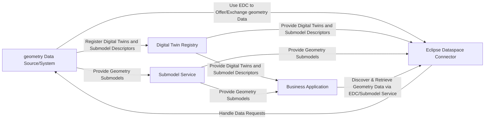

# CX-0156 Geometry v.1.0.0

## ABSTRACT

The Geometry Standard defines a common framework for the interoperable exchange and use of three-dimensional (3D) and two-dimensional (2D) data within the Catena-X ecosystem. It establishes unified standard that enable seamless integration of CAD models, mesh data, point clouds, and related spatial information from design, manufacturing, scans, or spatial metadata across diverse systems and organisations. By ensuring data integrity, accessibility, and sovereignty, the standard fosters trust, reduces integration costs, and accelerates innovation. This document provides the basis for reliable and secure 3D data handling across supply chain partners, supporting efficiency, transparency, and scalability in industrial applications.

The purpose of this standard is to provide concepts and specifications in order to allow proper data provisioning for geometry data in Catena-X.

## FOR WHOM IS THE STANDARD DESIGNED

The standard is intended for data provider/consumer and Business Application Provider that want to provide and access Geometry Data on which assets will be created.

## 1 INTRODUCTION

In an increasingly digital and interconnected industrial landscape, handling geometry data has become vital for design, simulation, quality control, logistics, and the creation of sophisticated digital twins. However, the sheer variety of formats, tools, and processes often leads to inefficiencies, incompatibilities, and integration bottlenecks. The Geometry Standard establishes a unified foundation for interoperable, scalable geometry data exchange across the Catena‑X ecosystem.

By defining an new aspect model and Geometry KIT, this standard enables seamless collaboration across OEMs, suppliers, service providers, and digital solution partners—regardless of their internal systems or organizational scale. Driven by Catena‑X’s principle of open, collaborative standardisation, the Geometry Standard ensures that stakeholders can reliably exchange, process, and integrate geometry information such as CAD models, mesh data, point clouds, and related spatial information.

### 1.1 AUDIENCE & SCOPE

> *This section is non-normative*

This standard is relevant for the following roles:

- Business Application Provider
- Data Provider / Consumer

This document focuses on the interoperable exchange and use of geometry data (such as CAD models, mesh data, point clouds, and related spatial information) and related 2D files such as PDF within the Catena-X ecosystem. It is intended for scenarios where geometry data is shared between organizations in a phase before the creation of a physical product or asset, supporting collaborative engineering, simulation, manufacturing processes.

**Out-of-scope:**

- The exchange of instance-specific geometry data after the asset is produced (see [CX-0127 Industry Core PartInstance](https://catenax-ev.github.io/docs/standards/CX-0127-IndustryCorePartInstance))
- Exchange of non-geometry master data (see [CX-0154 Digital Master Data](https://github.com/eclipse-tractusx/sldt-semantic-models/tree/main/io.catenax.digital_engineering_master_data))

The standard is designed to ensure that all relevant stakeholders in the Catena-X network can reliably provide, consume, and process geometry data in a standardized and secure manner.

### 1.2 CONTEXT AND ARCHITECTURE FIT

The geometry Data Standard is a foundational element for digital collaboration in the Catena-X ecosystem. It addresses the need for a unified approach to exchanging, accessing, and managing geometry data often a foundational information to design and produce physical products. The exchange of this data is not standardized yet and usually requires data transformations among the involved partners.

This initial version of the standard defines the basic data model that enables digital exchange of 3D/2D files and geometry data between between partners.
To provide a general framework, the components, interactions, APIs, and data models involved in this use case are presented in this chapter.

#### Components

- **Geometry Data Source/System:**: The originating system for geometry data, such as CAD or PDM systems, which create and manage geometry assets.
- **Business Application:**: Applications that consume, visualize, and/or process geometry  data, supporting use cases such as engineering, simulation, or manufacturing.
- **Digital Twin Registry:**: The Catena-X registry service where digital representations of assets (Digital Twins) and their submodel descriptors are registered and discovered.
- **Submodel Service:**: Handles submodel data and operations
- **Eclipse Dataspace Connector (EDC):**: Facilitates secure, sovereign data exchange between partners, handling access control and contract negotiation for geometry data assets.

These components interact to enable the registration, discovery, secure transfer, and consumption of geometry data across organizational boundaries in a standardized and interoperable manner.

#### Interactions

The system architecture demonstrates how components interact to facilitate geometry data exchange:

- **Geometry Data Source/System**
  - Registers Digital Twins and Submodel Descriptors in the Digital Twin Registry
  - Provides Geometry Submodels (e.g., CAD, mesh, point cloud files) to the Submodel Service
  - Uses the Eclipse Dataspace Connector (EDC) to offer and exchange geometry data
- **Business Application**
  - Discovers and retrieves geometry data via the EDC and Submodel Service
  - Consumes, visualizes, or processes geometry data for downstream use cases
- **Eclipse Dataspace Component Connector (EDC)**
  - Handles data requests sent from partners back to the geometry Data Source/System
  - Acts as the communication bridge between partners, managing access control and contract negotiation
- **Digital Twin Registry**
  - Provides Digital Twins and submodel descriptors to the EDC for discovery and access
- **Submodel Service**
  - Provides Submodels to the Eclipse Dataspace Connector

The following diagram illustrates the interactions between the named components:



> **Note:**  
> The Geometry Standard provides a framework for the interoperable exchange of geometry data, either as a separate exchange process or in conjunction with the Master Data Standard CX-0154. While the Master Data Standard does not specify the exchange or retrieval of 2D and 3D assets themselves, the Geometry Standard explicitly defines how these assets are transferred and accessed between partners. This ensures that geometry data can be exchanged directly or integrated as part of broader master data exchanges, depending on the use case.

#### APIs

The data exchange is based on existing Catena-X standards. For more details refer to chapter 4.

- geometry data is provided in defined aspect models that are attached to a Digital Twin.

### 1.3 CONFORMANCE AND PROOF OF CONFORMITY

> *This section is non-normative*

Sections marked as non-normative as well as all authoring guidelines, diagrams, examples, and notes in this specification are non-normative. Everything else in this specification is normative.

The key words **MAY**, **MUST**, **MUST NOT**, **OPTIONAL**, **RECOMMENDED**, **REQUIRED**, **SHOULD** and **SHOULD NOT** in this document are to be interpreted as described in BCP 14 [RFC2119] [RFC8174] when, and only when, they appear in all capitals, as shown here.

All participants and their solutions will need to prove that they are conform with the Catena-X standards. To validate that the standards are applied correctly, Catena-X employs Conformity Assessment Bodies (CABs).

To prove conformance with the Geometry Standard, a participant (consumer, provider, or application developer) **MUST** show that they can:

- Provide a geometry digital twin and its associated submodels to other participants.
- Consume a geometry digital twin and its associated submodels from another participant.

### 1.4 EXAMPLES

#### JSON Payload Geometry Data exchange

```JSON
{
   
  "catenaXId": "urn:uuid:055c1128-0375-47c8-98de-7cf802c3241d",
  "childItems": [
    {
      "catenaXId": "urn:uuid:055c1128-0375-47c8-98de-7cf802c3241d",
      "semanticTag": [
        "DetailLevel_0"
      ],
      "localTransform": {
        "matrix4x4": [
          "[[1.0 0.0 0.0 0.0][0.0 1.0 0.0 0.0][0.0 0.0 1.0 0.0][0.0 0.0 0.0 1.0]]"
        ]
      },
      "customTag": [
        "Bauraum"
      ]
    }
  ],
  "modelData": [
    {
      "semanticTag": [
        "DetailLevel_0"
      ],
      "customTag": [
        "Bauraum"
      ]
    }
  ],
  "localTransform": {
    "matrix4x4": [
      "[[1.0 0.0 0.0 0.0][0.0 1.0 0.0 0.0][0.0 0.0 1.0 0.0][0.0 0.0 0.0 1.0]]"
    ]
  },
  "boundingVolume": {
    "minPoint": [
      "[-1.0, -1.0, -1.0]"
    ],
    "maxPoint": [
      "[1.0, 1.0, 1.0]"
    ]
  }
}
```

### 1.5 TERMINOLOGY

**Scene Node**:  
A scene node is a fundamental element in computer graphics used to represent an object, transformation, or grouping within a scene. Scene nodes are organized hierarchically and can contain references to geometry, transformations (such as translation, rotation, scaling), or other nodes, enabling complex spatial relationships and efficient scene management.

**Scene Graph**:  
A scene graph is a hierarchical data structure commonly used in computer graphics to organize and manage the logical and spatial representation of a graphical scene. It consists of interconnected scene nodes, allowing for efficient traversal, rendering, and manipulation of complex 3D environments by capturing parent-child relationships and transformations.

**Geometry Data Structure**:  
In the context of CAD and PLM systems, a geometry data structure refers to the organization and representation of geometric entities (such as points, curves, surfaces, and solids) and their associated attributes (e.g. material properties, color, GT&D or PMI, coordinate systems, and metadata like creation date or author). In addition, geometry data structures may include references—such as links between geometric components within an assembly (e.g., parent-child relationships, constraints, or mating conditions), or associations to related engineering documents (e.g. 2D PDF, drawings, specifications, etc.). Unlike product structures described via Bill of Materials (e.g., SingleLevelBOM) in Catena-X, which focus on the relationships between physical parts or assemblies, geometry data structures define how these geometric elements, their properties, and their interconnections are stored and managed, independent of the product’s hierarchical structure.

## 2 RELEVANT PARTS OF THE STANDARD FOR SPECIFIC USE CASES

> *This section is normative*

### 2.1 DIGITAL TWINS AND SPECIFIC ASSET IDs FOR GEOMETRY

Geometry data MUST be attached to the digital twin as a submodel using the "Scene Node" aspect model (see Section 3).

The Digital Twin representing geometry data MAY be described as `PartType`, in accordance with the Catena-X Industry Core standards (see CX-0126).

Geometry data MAY be used in conjunction with master data geometry as specified in CX-0154 Digital Master Data. This enables combined or linked use of geometry and master data for comprehensive digital twin scenarios in Catena-X.

Specific asset IDs are required to uniquely identify and retrieve geometry digital twins. The following keys are mandatory and MUST be provided in the Digital Twin Registry:

| Key             | Availability | Description                                                                                                         | Type   |
| --------------- | ------------ | ------------------------------------------------------------------------------------------------------------------- | ------ |
| manufacturerId  | mandatory    | The Business Partner Number (BPNL) of the geometry data provider.                                                   | BPNL   |
| digitalTwinType | optional     | May be set to `digitalTwinType="PartType"`. This ensures correct filtering and retrieval of geometry digital twins. | String |

These requirements ensure that geometry digital twins can be reliably found, linked to their source systems, and exchanged across the Catena-X ecosystem.

The "Scene Node" aspect model (see Section 3) MUST be used for all geometry data exchanges.

All usages of `ExternalBinaryModelData` MUST ensure that the `catenaXId` property references a submodel instance of a BinaryExchange file. This means the Catena-X ID MUST resolve to a submodel that implements the BinaryExchange aspect model, which provides the metadata and access information for the actual binary file.

> **Note:**

> - The Single Level Scene Node aspect model describes the structure and metadata of a 3D object or scene. It includes a property called `modelData`, which is a set of `ExternalBinaryModelData` entities.
> - The `ExternalBinaryModelData` entity in the Single Level Scene Node model is not meant to contain the binary file itself. Instead, it acts as a reference to a separate `BinaryExchange` aspect model instance.
> - The reference is established via the `catenaXId` property in `ExternalBinaryModelData`. This ID points to the corresponding BinaryExchange submodel of the same digital twin instance for the actual binary file.
> - The BinaryExchange aspect model provides the metadata and access information for the binary file, including file type, content type, access URI.

## 3 ASPECT MODELS

> *This section is normative_

### 3.1 ASPECT MODEL "Single Level Scene Node"

The Single Level Scene Node aspect model provides a standardized structure for exchanging geometry data within the Catena-X ecosystem. It represents 3D objects and scenes through a hierarchical organization that captures both spatial relationships and metadata.

The aspect model consists of several key components:

**Core Structure:**

- A scene node represents a geometric object or grouping within a scene
- Each node can have a unique Catena-X ID for identification
- Nodes can contain child items to build hierarchical structures
- Transformations define spatial positioning and orientation
- Bounding volumes describe the spatial extent of objects

**Key Entities:**

1. **Scene Node**: The root entity containing:
   - Catena-X ID for unique identification
   - Optional child items for hierarchical structures
   - Optional local transform for positioning
   - Optional bounding volume for spatial extent
   - Optional model data references

2. **Child Data**: Represents assembled child items with:
   - Catena-X ID
   - Optional semantic and custom tags
   - Optional local transform

3. **Transform**: Defines spatial positioning using:
   - 4x4 transformation matrix for position, rotation, and scale

4. **Model Data**: Links to actual geometry data through:
   - References to external binary files via BinaryExchange
   - Semantic and custom tags for classification

#### 3.1.1 IDENTIFIER OF SEMANTIC MODEL

The semantic model has the unique identifier:

```text
  urn:samm:io.catenax.single_level_scene_node:1.0.0#
```

<!-- You can find the corresponding aspect model [here](https://github.com/eclipse-tractusx/sldt-semantic-models/pull/886/commits) -->

#### 3.1.2 Normative Criteria

This model MUST be used for providing and consuming geometry data.

## 4 APPLICATION PROGRAMMING INTERFACES

> *This section is normative*

### 4.1 APIs ASSOCIATED WITH GEOMETRY DIGITAL TWINS

This standard builds upon the [CX-0002 Digital Twins in Catena-X](https://catenax-ev.github.io/docs/next/standards/CX-0002-DigitalTwinsInCatenaX) standard for the management and exchange of digital twins and their submodels.  

Geometry data, structured according to the Single Level Scene Node aspect model, is provided as a sub-model attached to a digital twin.

## 5 PROCESSES

> *This section is normative*

### 5.1 GEOMETRY DATA EXCHANGE

Geometry data is requested by one Catena-X partner, the consumer, from another Catena-X partner, the provider, using HTTP requests in JSON format via a Catena-X connector (EDC).

1. The provider, provides an asset in the EDC Connector to retrieve digital twins and the respective submodels.
2. The consumer initiates a contract negotiation for this asset to get a contract agreement.
3. After a successful contract negotiation, the consumer requests a digital twin and respective submodels of the geometry data via the provider's EDC dataplane endpoint.

#### 5.1.1 ACTORS AND ROLES

- Catena-X Partner: A company participating in the Catena-X network. A partner can act as both, a geometry consumer and geometry provider.
- Geometry consumer: The partner that retrieves geometry from another partner.
- Geometry provider: The partner that provides geometry to one or more partners.

## 6 REFERENCES

### 6.1 NORMATIVE REFERENCES

> *This section is normative*

- [CX-0001 EDC Discovery API v1.1](https://catenax-ev.github.io/docs/next/standards/CX-0001-EDCDiscoveryAPI)
- [CX-0002 Digital Twins in Catena-X v2.2.0](https://catenax-ev.github.io/docs/next/standards/CX-0002-DigitalTwinsInCatenaX)
- [CX-0003 SAMM Aspect Meta Model v1.2.0](https://catenax-ev.github.io/docs/next/standards/CX-0003-SAMMSemanticAspectMetaModel)
- [CX-0010 Business Partner Number v3.0.0](https://catenax-ev.github.io/docs/next/standards/CX-0010-BusinessPartnerNumber)
- [CX-0018 Dataspace Connectivity v4.0.0](https://catenax-ev.github.io/docs/next/standards/CX-0018-DataspaceConnectivity)
- [CX-0126 Industry Core: PartType 2.1.0](https://catenax-ev.github.io/docs/next/standards/CX-0126-IndustryCorePartType)
- [CX-0151 Industry Core: Basics v.1.0.0](https://catenax-ev.github.io/docs/next/standards/CX-0151-IndustryCoreBasics)

### 6.2 NON-NORMATIVE REFERENCES

> *This section is non-normative*

- [ISO/IEC 9592-1:1997](https://www.iso.org/standard/29417.html)
- [ISO/IEC 19775-1:2023](https://www.iso.org/standard/82562.html)
- [ISO/IEC 12113:2022](https://www.iso.org/standard/83990.html)
- [ISO 10303-242:2022](https://www.iso.org/standard/84667.html)
- [ISO 14306:2017](https://www.iso.org/standard/62770.html)
- [RFC 2077](https://www.rfc-editor.org/rfc/rfc2077.html)
- [VDA 231](https://webshop.vda.de/VDA/en/vda-231-301-022025)
- [prostep ivip Digital Data Package (DDP) Recommendation](https://www.prostep.org/en/medialibrary/detail?ai%5Baction%5D=detail&ai%5Bcontroller%5D=Catalog&ai%5Bd_name%5D=ddp_rec&ai%5Bd_pos%5D=31)

### 6.3 REFERENCE IMPLEMENTATIONS

> *This section is non-normative*

## Legal

Copyright © 2025 Catena-X Automotive Network e.V. All rights reserved. For more information, please visit [here](/copyright).
