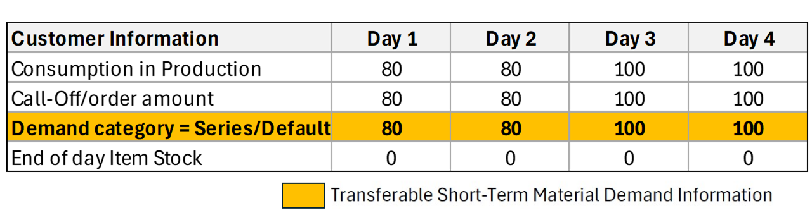
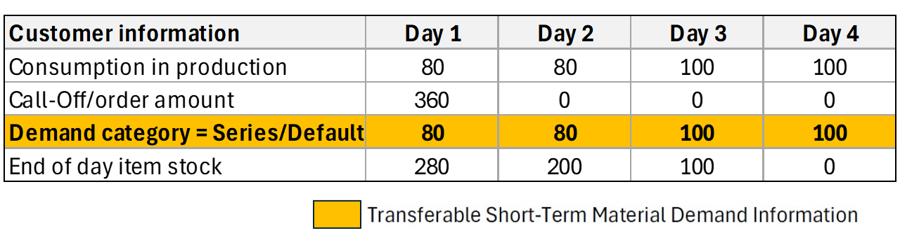
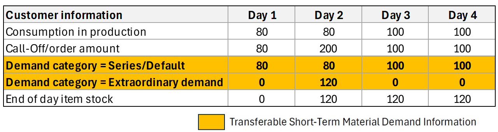
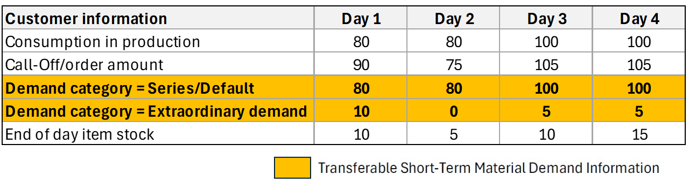
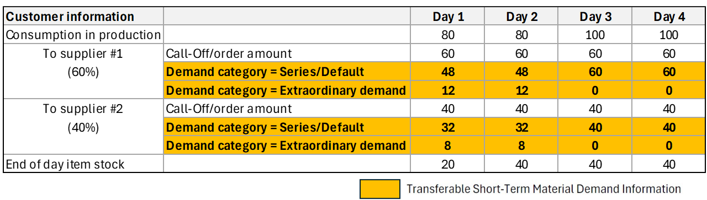
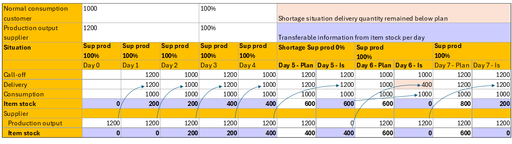
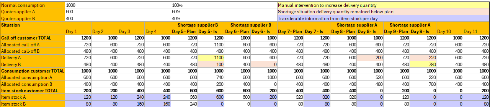
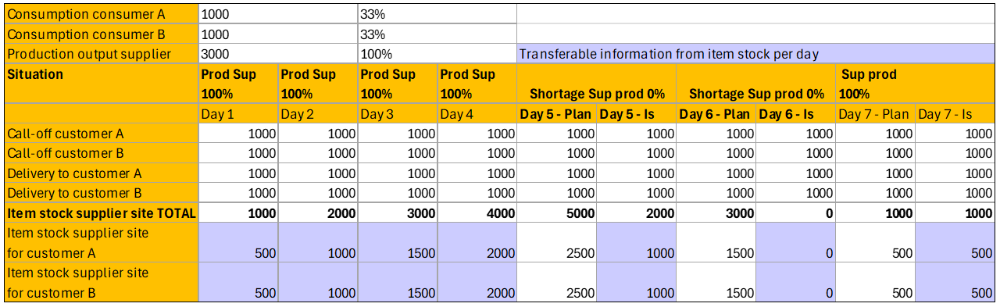

# CX-0157 Predictive Unit Real-Time Information Service (PURIS)

## ABSTRACT

The Catena-X *Predictive Unit Real-Time Information Service (PURIS)* Standard is created for all members of the
automotive supply chain.

The PURIS standard provides the key information needed to assess this situation from both sides, based on the "quid pro quo" principle. This principle is based on the idea of sharing information that is perceived as being of equal value.  The information defined in this standard adds to the information exchanged within the current EDI formats:

- **Short-Term Material Demands** to provide the customer's actual need from production.
- **Planned Production Output** reflecting the internal production planning to fulfill the customer demands.
- **Delivery Information** bridging the geographical gap between the customer and supplier facilities.
- **Item Stock** levels to better understand the current demand and supply situation.
- **Supply Chain Disruption Notifications** to inform customers and suppliers in a structured way about present and upcoming supply chain disruptions.
- **Days of Supply** providing inbound and outbound supply ranges for considered time frame.

The information exchanged provides a foundation for collaboration. It establishes a shared understanding on the supply situation between the customer and the supplier. Catena-X provides the framework (see [[CX-REG]](#62-non-normative-references)) and tools to enable the exchange of this sensitive information and take advantage of the benefits.

## 1 INTRODUCTION

In recent years, global supply chains have been significantly affected by global crises. Ever-increasing complexity and interdependencies compound this issue. As a result, small and medium-sized enterprises as well as large enterprises are exposed to an increased risk of disruptions in their supply chains. To adapt to short-term fluctuations and develop the right countermeasures, it is essential to have sound information about the current supply situation. This is commonly needed in two cases: either you 1) face a disruption you need to manage or you 2) want to detect disruptions faster.

This standard specifies the key information and ensures interoperability for the exchange of key information to detect and manage disruptions targeting a short-term period of up to 4 weeks. During a disruption, this information is often collected manually and exchanged via e.g. phone calls or e-mail correspondence. All information is partner-specific. It is intended to be used to manage or prevent disruptions.  

- **Delivery Information** allows customers and suppliers to align their views on deliveries including tracking numbers to assess the timely fulfilment of customer orders from various suppliers helping to avoid shortages and bottlenecks.
- **Short-Term Material Demand** allows customers to provide their latest material requirements, derived directly from their production schedules. This enables suppliers to identify actual needs during a disruption or may anticipate disruptions.
- **Planned Production Output** allows suppliers to provide planned production quantities. This enables customers to understand the actual supply situation during a disruption or may anticipate disruptions.
- **Item Stock** allows customers and suppliers to share their latest stock levels (inbound, outbound). This enables both parties to better align countermeasures during a disruption or anticipate disruptions.
- **Days of Supply** allows customers and suppliers to share a common metric (inbound, outbound) used during disruptions or to anticipate disruptions.
- **Supply Chain Disruption Notifications** allow customers and suppliers to receive, warn and forward disruption information in a structured way. It allows to link affected materials and sites and document measures taken.

This information is combined to provide the partners a common view on the current supply situation. This standard provides you additional definitions on how the information is assembled and how it may be combined. Additionally it provides compliance strategies.

### 1.1 AUDIENCE & SCOPE

> *This section is non-normative*

This standard is relevant for the following roles defined in [[CX-OMW]](#62-non-normative-references):

**Data Providers** willing to provide any of the following information:

- *Delivery Information*
- *Short-term Material Demand*
- *Planned Production Output*
- *Item Stock*
- *Days of Supply*
- *Supply Chain Disruption Notifications*

**Data Consumers** who are interested in requesting and receiving any of the following information:

- *Delivery Information*
- *Planned Production Output*
- *Short-term Material Demand*
- *Item Stock*
- *Days of Supply*
- *Supply Chain Disruption Notifications*

**Business Application Providers** interested in providing solutions implementing this standard.

**Advisory Services Providers** interested in supporting companies fulfilling the standard.

For clarity on the roles and responsibilities of each actor, please see [Chapter 5](#5-processes). The scope of this standard is the exchange of previously mentioned information. It does not cover any specific countermeasures between partners in a one-to-one business relationship resulting from the notification process.

Illustrations and descriptions of roles are provided to help explain concepts and processes, but these are not mandatory (see [Chapter 5](#5-processes)).

This standard requires that data consumers, data providers and business application providers must adopt the uniform business logic (according to [Chapter 5](#5-processes)), data models and data exchange protocols to ensure interoperable data exchange.

This standard focuses on direct one-to-one business relationships between customers and suppliers.

### 1.2 CONTEXT AND ARCHITECTURE FIT

> *This section is non-normative*

This standard defines the data models and APIs required for the exchange of *Supply Chain Disruption Notifications*. Implementing it ensures that:

- all actors exchange information in an identical manner.
- all actors process information data in an identical manner.
- all actors exchange information data only via a connector conformant to [[CX-0018]](#61-normative-references).
- all actors interpret the exchanged information data in an identical manner.

The APIs must only be used in the context of Catena-X and must only be accessible via a connector conformant to [[CX-0018]](#61-normative-references).

### 1.3 CONFORMANCE AND PROOF OF CONFORMITY

> *This section is non-normative*

Non-mandatory sections include authoring guidelines, diagrams, examples and notes. All other content is mandatory.

The capitalized keywords such as  **MAY, MUST, MUST NOT, OPTIONAL, RECOMMENDED, REQUIRED, SHOULD** and  **SHOULD NOT**  are to be interpreted as defined in BCP 14 ([[RFC2119]](#62-non-normative-references) [[RFC8174]](#62-non-normative-references)).

Participants must demonstrate conformity with Catena-X standards. Conformity Assessment Bodies (CABs) verify that standards are correctly applied.

**Proof of Conformity for Data Models**

Participants must implement and conform to the standardized Data Models as outlined in [Chapter 3](#3-aspect-models).

**Proof of Conformity for APIs**

Participants must implement and conform to the standardized APIs as detailed in [Chapter 4](#4-application-programming-interfaces).

**Proof of Conformity for Process & Core Business Logic**

Participants must implement and conform to the *Predictive Unit Real-Time Information Service (PURIS)* core business logic as described in [Chapter 5](#5-processes).

### 1.4 EXAMPLES

Examples of data models: See the relevant subsection [3 Aspect Models](#3-aspect-models).

### 1.5 TERMINOLOGY

> *This section is non-normative*

| **Name**                                  | **Abrev.** | **Description**                                                                                                                                                                                                                                                                                                                                                                                                                                                            |
| ----------------------------------------- | ---------- | -------------------------------------------------------------------------------------------------------------------------------------------------------------------------------------------------------------------------------------------------------------------------------------------------------------------------------------------------------------------------------------------------------------------------------------------------------------------------- |
| **Business Partner Number**               | BPN        | A BPN is the unique identifier of a partner within Catena-X as defined in [[CX-0010]](#61-normative-references).                                                                                                                                                                                                                                                                                                                                                           |
| **Business Partner Number Address**       | BPNA       | A BPNA is the unique identifier of a partner address within Catena-X as defined in [[CX-0010]](#61-normative-references).                                                                                                                                                                                                                                                                                                                                                  |
| **Business Partner Number Legal Entity**  | BPNL       | A BPNL is the unique identifier of a partner legal entity within Catena-X as defined in [[CX-0010]](#61-normative-references).                                                                                                                                                                                                                                                                                                                                             |
| **Business Partner Number Site**          | BPNS       | A BPNS is the unique identifier of a partner site within Catena-X as defined in [[CX-0010]](#61-normative-references).                                                                                                                                                                                                                                                                                                                                                     |
| **Actual time**                           | -          | Refers to the specific, real-time date and time when an event occurs during delivery.                                                                                                                                                                                                                                                                                                                                                                                      |
| **Estimated time**                        | -          | Refers to a projected or estimated time for an event or occurrence, based on calculations or predictions, rather than the exact, confirmed time.                                                                                                                                                                                                                                                                                                                           |
| **Incoterms**                             | -          | Is a combination of "International" and "Commercial Terms." Incoterms are a set of standardized international trade terms that facilitate and define the responsibilities of customers and suppliers in transactions.                                                                                                                                                                                                                                                      |
| **Origin**                                | -          | The starting point from which goods are dispatched or shipped from.                                                                                                                                                                                                                                                                                                                                                                                                        |
| **Destination**                           | -          | The final location at which the goods are to be delivered or received.                                                                                                                                                                                                                                                                                                                                                                                                     |
| **Demand**                                | -          | The quantity demanded over a given time frame. This must be greater than or equal to 0 and less than or equal to 999999999999999999.999. It allows up to 12 digits and three decimal places.                                                                                                                                                                                                                                                                               |
| **Demand series**                         | -          | The demands for a specific material over a given time period at a given demand rate, distinguished by their demand location and demand category.                                                                                                                                                                                                                                                                                                                           |
| **Demand category**                       | -          | Classification of demands used for prioritization or allocation.                                                                                                                                                                                                                                                                                                                                                                                                           |
| **Position**                              | -          | A position within an order defines the product and the quantity the supplier has to manufacture / supply for a customer. A single order may contain multiple positions for different products.                                                                                                                                                                                                                                                                             |
| **Order**                                 | -          | A request from a customer towards a supplier to manufacture / supply a given quantity of a specific product in a predefined timeframe.                                                                                                                                                                                                                                                                                                                                     |
| **Allocated Stock**                       | -          | These are products, components or materials that have already been manufactured but not yet used. These are allocated to a specific customer based on their orders and are either still in the supplier's warehouse or have already been transferred to the customer's warehouse.                                                                                                                                                                                          |
| **Provider**                              | -          | The party providing the *Item Stock* data. In the context of the *Item Stock* exchange this is: <br /> - the supplier for OUTBOUND *Item Stock* <br /> - the customer for INBOUND *Item Stock*.                                                                                                                                                                                                                                                                            |
| **Consumer**                              | -          | The party requesting and consuming the *Item Stock* data provided by the Provider. In the context of the *Item Stock* exchange this is: <br /> - the supplier for OUTBOUND *Item Stock* <br /> - the customer  INBOUND *Item Stock*.                                                                                                                                                                                                                                       |
| **Stock Location**                        | -          | The physical location of a stock specified by its corresponding BPNS and BPNA. More information on BPN/S/A is provided in [[CX-0010]](#61-normative-references).                                                                                                                                                                                                                                                                                                           |
| **Customer**                              | -          | The recipient of products ordered from / manufactured by a supplier.                                                                                                                                                                                                                                                                                                                                                                                                       |
| **Supplier**                              | -          | The supplier / manufacturer of a product.                                                                                                                                                                                                                                                                                                                                                                                                                                  |
| **Stock**                                 |            | Two-way direction of material on stock: <br /> - One can have a stock of material ready for delivery to customers <br /> - One can have a stock of material which can be used for one's production.                                                                                                                                                                                                                                                                        |
| **Material**                              | -          | The term *material* is used as a catalogue item in the meaning of the Industry Core Part Type ([[CX-0126]](#61-normative-references)). Whenever using the term *material*, it refers to products, components or items. Semi-finished goods are not included.                                                                                                                                                                                                               |
| **Production Output**                     | -          | The output quantity in a defined period of time for a component or material.                                                                                                                                                                                                                                                                                                                                                                                               |
| **Direction**                             | -          | The direction of the stock from the perspective of the data provider.                                                                                                                                                                                                                                                                                                                                                                                                      |
| **Date**                                  | -          | Date refers to the specific calendar day (current or projected) associated with the measured (or expected) inventory level. It serves as a timestamp for calculating Days of Supply, indicating when the inventory count was taken or projected.                                                                                                                                                                                                                           |
| **Days of Supply**                        | DoS        | The number of days until the current stock is expected to run out.  <br /> <br />  Days of supply of a customer:  <br />  <br /> Number of days where;  <br />  (Stock) - S(daily Demand) >= 0  <br />  <br />  Days of supply of a supplier:  <br /> <br />   Number of days where;  <br />  (Stock) - S(daily Outgoing Shipments) >= 0                                                                                                                                   |
| **Allocated Days of Supply**              | -          | Defines the number of days with allocated supply for an item stock in a given location that is available for the use in production or deliveries. The allocated days of supply are not available for other customers.                                                                                                                                                                                                                                                      |
| **Digital Twin**                          | DT         | Digital representation of an asset that provides data on aspects of the represented data following [[CX-0002]](#61-normative-references).                                                                                                                                                                                                                                                                                                                                  |
| **(decentralized) Digital Twin Registry** | dDTR / DTR | Component providing registration and discovery API implementations following [[CX-0002]](#61-normative-references). Sometimes referred to without the "decentralized" BUT in Catena-X these are always decentralized.                                                                                                                                                                                                                                                      |
| **Asset Administration Shell**            | AAS        | Technical concept for Digital Twins consisting of different standards. Application in Catena-X is described in Digital Twins in Catena-X standard ([[CX-0002]](#61-normative-references))                                                                                                                                                                                                                                                                                  |
| **Shell Descriptor**                      | -          | Technical concept of the AAS API describing metadata of an Asset Administration Shell representing a Digital Twin. It contains identification information and metadata about which submodels are available and where the data can be obtained (see [[CX-0002]](#61-normative-references) and [[IDTA-01002-3-0]](#62-non-normative-references)). There may be multiple Shell Descriptors for the same represented Asset (see [[CX-0126]](#61-normative-references)).        |
| **Submodel Descriptor**                   | -          | Technical concept of the AAS API describing metadata of Submodels within a Shell Descriptor (Asset Administration Shell) (see [[CX-0002]](#61-normative-references), [[IDTA-01002-3-0]](#62-non-normative-references)).                                                                                                                                                                                                                                                    |
| **Specific Asset Ids**                    | -          | Identifiers of the Shell Descriptor (Asset Administration Shell) that refer to common identification data for an asset/material at hand e.g., manufacturer part Id. Common specific asset ids used for identification are described in Industry Core Part Type Standard (see [[CX-0126]](#61-normative-references)).                                                                                                                                                       |
| **Asset Administration Shell Identifier** | AAS ID     | Also referred to as Shell Descriptor id, is the technical identifier of the Shell Descriptor.                                                                                                                                                                                                                                                                                                                                                                              |
| **Global Asset Id**                       | -          | Also referred to as Catena-X Id, is the Catena-X identifier for assets represented by Digital Twins (see [[CX-0126]](#61-normative-references)).                                                                                                                                                                                                                                                                                                                           |
| **Aspect**                                | -          | A domain-specific view on information and functionality associated with a specific Digital Twin with a reference to a concrete Aspect Model (see [[CX-0002]](#61-normative-references)). Within Catena-X, an aspect is formally described using the Semantic Aspect Meta Model (see [[CX-0003]](#61-normative-references)).                                                                                                                                                |
| **Semantic Id**                           | -          | Identifier including namespace to specify the semantic description of submodels using the Semantic Aspect Meta Model (SAMM). It allows partners to know the exact data format and semantics when e.g., browsing catalogs (see [[CX-0003]](#61-normative-references)).                                                                                                                                                                                                      |
| **Data Space Protocol**                   | DSP        | A set of specifications designed to facilitate interoperable data sharing between entities governed by usage control and based on Web technologies. These specifications define the schemas and protocols required for entities to publish data, negotiate Agreements, and access data as part of a Dataspace. It is governed by the International Data Spaces Association. Connectors compliant to [[CX-0018]](#61-normative-references) support the Data Space Protocol. |
| **Shared Asset Approach**                 | -          | Digital twin pattern in which each party has a twin for the same asset (Part Type). They share the same identification data in terms of specific asset ids and global asset id. The digital twins do have different technical identifiers.                                                                                                                                                                                                                                 |

*Table 1: Terminology for PURIS Standard*

Additional terminology used in this standard can be looked up in the glossary on the association's homepage.

## 2 RELEVANT PARTS OF THE STANDARD FOR SPECIFIC USE CASES

> *This section is normative*

### 2.1 DATA PROVISIONING: *PREDICTIVE UNIT REAL-TIME INFORMATION SERVICE (PURIS)* DATA MODELS

#### 2.1.1 LIST OF STANDALONE STANDARDS

The following Catena-X standards are a prerequisite for implementing this standard and therefore **MUST** be considered / implemented by the relevant parties specified in each standard.

| **Number**                            | **Standard**                        | **Version** |
| ------------------------------------- | ----------------------------------- | ----------- |
| [[CX-0001]](#61-normative-references) | Participant Agent Registration      | 1.2.0       |
| [[CX-0003]](#61-normative-references) | SAMM Aspect Meta Model              | 1.2.0       |
| [[CX-0006]](#61-normative-references) | Registration and initial onboarding | 2.0.1       |
| [[CX-0010]](#61-normative-references) | Business Partner Number (BPN)       | 3.0.1       |
| [[CX-0018]](#61-normative-references) | Dataspace Connectivity              | 4.1.1       |
| [[CX-0126]](#61-normative-references) | Industry Core Part Type             | 2.1.1       |

*Table 2: List of mandatory standards*

The usage of this standard **MAY** be complemented with the following Catena-X standards to further extend the range of shortage prevention possibilities:

| **Number**                            | **Standard**                          | **Version** |
| ------------------------------------- | ------------------------------------- | ----------- |
| [[CX-0146]](#61-normative-references) | Supply Chain Disruption Notifications | 2.0.1       |

*Table 3: List of non-mandatory, but complementary standards*

#### 2.1.2 DATA REQUIRED

The data provisioning follows the rules of Case 1 and Case 2 as described in Chapter 2 in [[CX-0126]](#61-normative-references). Thus, it follows the following design patterns:

- Usage of Digital Twins as shared assets to follow a pull approach for data.
- Usage of the specific asset IDs and further identification data for the Digital Twin for the Part Type
  (see [[CX-0126]](#61-normative-references)).
- Provisioning of the *PartTypeInformation* on supplier side (see [[CX-0126]](#61-normative-references)).

The following table provides an overview

- which partner role **MUST** provide which submodel data (based on the semantic model) by attaching it to their part type twin.
- which partner role **MUST** consume which submodel data (based on the semantic model) by reading from their partner's part type twin.

| Provider Partner Role | Consumer Partner Role | Semantic Model             | Further Information                                          |
| --------------------- | --------------------- | -------------------------- | ------------------------------------------------------------ |
| Customer              | Supplier              | Short-Term Material Demand | -                                                            |
| Customer              | Supplier              | Item Stock                 | Provided with direction `inbound`.                           |
| Customer              | Supplier              | Delivery Information       | Provisioning role depends on incoterm as defined in Table 9. |
| Customer              | Supplier              | Days of Supply             | Provided with direction `inbound`.                           |
| Supplier              | Customer              | Planned Production Output  | -                                                            |
| Supplier              | Customer              | Item Stock                 | Provided with direction `outbound`.                          |
| Supplier              | Customer              | Delivery Information       | Provisioning role depends on incoterm as defined in Table 9. |
| Supplier              | Customer              | Days of Supply             | Provided with direction `outbound`.                          |

> Table 4: Overview which semantic model is provided by which partner.

#### 2.1.3 ADDITIONAL REQUIREMENTS

##### CONVENTIONS FOR USE CASE POLICY IN CONTEXT DATA EXCHANGE

In alignment with our commitment to data sovereignty, a specific framework governing the utilization of data within the Catena-X use cases has been outlined. A set of specific policies on data offering and data usage level detail the conditions under which data may be accessed, shared, and used, ensuring compliance with legal standards.

For a comprehensive understanding of the rights, restrictions, and obligations associated with data usage in the Catena-X ecosystem, we refer users to:

- the detailed ODRL policy repository [[CX-ODRL]](#62-non-normative-references). This document provides in-depth explanations of the terms and conditions applied to data access and utilization, ensuring that all engagement with our data conducted responsibly and in accordance with established guidelines.
- the ODRL schema template. This defines how policies used for data sharing/usage should get defined. Those schemas **MUST** be followed when providing services or apps for data sharing/consuming.

###### ADDITIONAL DETAILS REGARDING ACCESS POLICIES

A Data Provider may tie certain access authorizations ("Access Policies") to its data offers for members of Catena-X and one or several Data Consumers. By limiting access to certain Participants, Data Provider maintains control over its anti-trust obligations when sharing certain data. In particular, Data Provider may apply Access Policies to restrict access to a particular data offer for only one Participant identified by a specific business partner number.

- Membership
- BPNL

###### ADDITIONAL DETAILS REGARDING USAGE POLICIES

In the context of data usage policies (“Usage Policies”), Participants and related services **MUST** use the following policy rules:

- Use Case Framework (“FrameworkAgreement”)
- at least the use case purpose (“UsagePurpose”) with right operand `cx.puris.base:1` from the above mentioned ODRL policy repository.

Additionally, respective usage policies **MAY** include the following policy rule:

- Reference Contract (“ContractReference”).
  
Details on namespaces and ODRL policy rule values to be used for the above-mentioned types are provided via the ODRL policy repository [[CX-ODRL]](#62-non-normative-references).

##### VERSIONING

The Aspect Models that are deployed as Digital Twins **MUST** be published in dcat:Dataset (http://www.w3.org/ns/dcat#) in the property that holds the full URN of the Aspect Model https://admin-shell.io/aas/3/0/HasSemantics/semanticId. Versions are explicitly contained in the URN.

The API versions **MUST** be published in the property https://w3id.org/catenax/ontology/common#version as version X.Y in dcat:Dataset (http://www.w3.org/ns/dcat#).

**Note:** Data Assets differentiated only by major versions **MUST** be offered in parallel. The current standard and API versions mark the start of Life Cycle Management in Catena-X operations. Previous versions are dismissed.

#### 2.1.4 DIGITAL TWINS AND SPECIFIC ASSET IDs

This standard follows the definitions of [[CX-0126]](#61-normative-references) to provide digital twins following the industry core. This includes the definition of identification data (Catena-X ID / Global Asset Id, Asset Administration Shell ID, Specific Asset ID) and the access restrictions.

Additionally this implies that the supplier always needs to create the digital twins first to define the Catena-X ID / Global Asset Id. The customer then looks up the supplier twin when creating his copy to use the same Catena-X ID / Global Asset Id. Table 4 describes which partner provides which information.

## 3 ASPECT MODELS

> *This section is normative*

Relevant semantic models of this standard are:

| AspectModel                                                               | Version |
| ------------------------------------------------------------------------- | ------- |
| [ShortTermDemandInformation](#31-aspect-model-short-term-material-demand) | 1.0.0   |
| [ItemStock](#32-aspect-model-item-stock)                                  | 2.0.0   |
| [PlannedProductionOutput](#33-aspect-model-planned-production-output)     | 2.0.0   |
| [DeliveryInformation](#34-aspect-model-delivery-information)              | 2.0.0   |
| [DaysOfSupply](#35-days-of-supply-aspect-model)                           | 2.0.0   |

*Table 5: Overview of aspect models specific to this standard.*

### 3.1 ASPECT MODEL "SHORT-TERM MATERIAL DEMAND"

#### 3.1.1 INTRODUCTION

This section describes the *"Short-Term Material Demand"* semantic model. It defines the demand of material, product, component or items for a customer. For the complete semantics and detailed description of its properties refer to the SAMM model in [Chapter 3.1.5.1.](#3151-rdf-turtle)

#### 3.1.2 SPECIFICATIONS ARTIFACTS

The modeling of the semantic model specified in this document was done in accordance to the "semantic-driven workflow" to create a submodel template specification [[SMT]](#62-non-normative-references).

This aspect model is written in SAMM 2.1.0 as a modeling language conformant to [[CX-0003]](#61-normative-references) as input for the semantic-driven workflow.

Like all Catena-X data models, this model is available in a machine-readable format on GitHub conformant to [[CX-0003]](#61-normative-references).

##### 3.1.2.1 SHORT-TERM MATERIAL DEMAND CATEGORY HANDLING

The Short-Term Material Demand data **MUST** consider the following demand categories shared with the DCM standard [CX-0128](#61-normative-references).

| Demand Category      | Description                                                                                                                                                                                                                              | Demand Category Code (Based on Data Model) |
| -------------------- | ---------------------------------------------------------------------------------------------------------------------------------------------------------------------------------------------------------------------------------------- | ------------------------------------------ |
| Default              | No Assignment. Use if no other category applies.                                                                                                                                                                                         | `0001`                                     |
| After-Sales          | After sales demand of spare parts                                                                                                                                                                                                        | `A1S1`                                     |
| Series               | Dependent demand e.g. production, assembly, raw material                                                                                                                                                                                 | `SR99`                                     |
| Phase-In-Period      | Ramp up of a new product or new material introduction                                                                                                                                                                                    | `PI01`                                     |
| Single-Order         | Demand outside the normal spectrum of supply                                                                                                                                                                                             | `OS01`                                     |
| Small Series         | Short time frame for demand and pose to higher volatility                                                                                                                                                                                | `OI01`                                     |
| Extraordinary Demand | Temporary demand on top of standard demand. Used e.g. in the following scenarios: <br /> - logistic optimization (e.g., full use of container) <br /> - preventing shortage by building stock (banking) <br /> - restocking safety stock | `ED01`                                     |
| Phase-Out-Period     | Ramp down; Product or material retires from the market                                                                                                                                                                                   | `PO01`                                     |

*Table 6: Short-Term Material Demand categories*

#### 3.1.3 LICENSE

This Catena-X data model is made available under the terms of the Creative Commons Attribution 4.0 International (CC-BY-4.0) license, which is available at Creative Commons.

#### 3.1.4 IDENTIFIER OF SEMANTIC MODEL

The semantic model ShortTermMaterialDemand **v1.0.0** has the unique identifier:

```text
urn:samm:io.catenax.short_term_material_demand:1.0.0
```

#### 3.1.5 FORMATS OF SEMANTIC MODEL

##### 3.1.5.1 RDF TURTLE

The RDF turtle file, an instance of the Semantic Aspect Meta Model, is the master for generating additional file formats and serializations. It can be found under the following link:

- [ShortTermMaterialDemand.ttl (v1.0.0)](https://github.com/eclipse-tractusx/sldt-semantic-models/blob/f5421109261efd37a684ca700482de1df081a3b0/io.catenax.short_term_material_demand/1.0.0/ShortTermMaterialDemand.ttl)

The open source command line tool of the Eclipse Semantic Modeling Framework is used for generation of other file formats, such as a JSON Schema, AASX for Asset Administration Shell Submodel Template or a HTML documentation.  

##### 3.1.5.2 JSON SCHEMA

A JSON Schema **MUST** be generated from the RDF Turtle file. The JSON Schema defines the Value-Only payload of the Asset Administration Shell for the API operation *"GetSubmodel"*.

##### 3.1.5.3 AASX

An AASX file can be generated from the RDF Turtle file. The AASX file defines one of the requested artifacts for a Submodel Template Specification conformant to [[SMT]](#62-non-normative-references).

#### 3.1.6 EXAMPLE DATA

Example JSON payload: Submodel "ShortTermMaterialDemand" v1.0.0

```json
{
  "materialGlobalAssetId": "urn:uuid:48878d48-6f1d-47f5-8ded-a441d0d879df",    
  "demandSeries": [
    {
      "lastUpdatedOnDateTime" : "2023-11-05T08:15:30.123-05:00",
      "expectedSupplierLocation": "BPNS8888888888XX",                          
      "demands": [
        {
          "demand": {
            "value": 180,
            "unit" : "unit:piece"
          },
          "day" : "2023-10-09"                       
        }
      ],
      "customerLocation": "BPNS9090909090YY",                                  
      "demandCategory": {
        "demandCategoryCode": "SR99"                                           
      }
    },
    {
      "expectedSupplierLocation": "BPNS8888888888XX",
      "lastUpdatedOnDateTime" : "2023-11-05T08:15:30.123-05:00",
      "demands": [
        {
          "demand": {
            "value": 100,
            "unit" : "unit:piece"
          },
          "day" : "2023-10-09"                       
        }
      ],
      "customerLocation": "BPNS5555555555XX",                                 
      "demandCategory": {
        "demandCategoryCode": "A1S1"                                           
      }
    }
  ]
}
```

### 3.2 ASPECT MODEL "ITEM STOCK"

#### 3.2.1 INTRODUCTION

This section describes the "ItemStock" semantic model used in the Catena-X network. For the complete semantics and detailed description of its properties refer to the SAMM model in [Chapter 3.2.5.1](#3151-rdf-turtle).

#### 3.2.2 SPECIFICATIONS ARTIFACTS

The modeling of the semantic model specified in this document was done in accordance to the "semantic-driven workflow" to create a submodel template specification [[SMT]](#62-non-normative-references).

This aspect model is written in SAMM 2.0.0 as a modeling language conformant to [[CX-0003]](#61-normative-references) as input for the semantic driven workflow.

Like all Catena-X data models, this model is available in a machine-readable format on GitHub conformant to [[CX-0003]](#61-normative-references).

#### 3.2.3 LICENSE

This Catena-X data model is made available under the terms of the Creative Commons Attribution 4.0 International (CC-BY-4.0) license, which is available at Creative Commons.

#### 3.2.4 IDENTIFIER OF SEMANTIC MODEL

The semantic model has the unique identifier

```text
urn:samm:io.catenax.item_stock:2.0.0
```

This identifier **MUST** be used by the data provider to define the semantics of the data being transferred.

#### 3.2.5 FORMATS OF SEMANTIC MODEL

##### 3.2.5.1 RDF TURTLE

The RDF turtle file, an instance of the Semantic Aspect Meta Model, is the master for generating additional file formats and serializations. It can be found under the following link:

- [ItemStock (v2.0.0)](https://github.com/eclipse-tractusx/sldt-semantic-models/blob/main/io.catenax.item_stock/2.0.0/ItemStock.ttl)

The open source command line tool of the Eclipse Semantic Modeling Framework is used for generation of other file formats like for example a JSON Schema, aasx for Asset Administration Shell Submodel Template or a HTML documentation.

##### 3.2.5.2 JSON SCHEMA

A JSON Schema can be generated from the RDF Turtle file. The JSON Schema defines the Value-Only payload of the Asset Administration Shell for the API operation *"GetSubmodel"*.

##### 3.2.5.3 AASX

An AASX file can be generated from the RDF Turtle file. The AASX file defines one of the requested artifacts for a Submodel Template Specification conformant to [[SMT]](#62-non-normative-references).

#### 3.2.6 EXAMPLE DATA

Example JSON payload: Submodel "ItemStock" v2.0.0

```json
{
  "materialGlobalAssetId" : "urn:uuid:48878d48-6f1d-47f5-8ded-a441d0d879df",
  "positions" : [ {
    "orderPositionReference" : {
      "supplierOrderId" : "M-Nbr-4711",
      "customerOrderId" : "C-Nbr-4711",
      "customerOrderPositionId" : "PositionId-01"
    },
    "allocatedStocks" : [ {
      "isBlocked" : false,
      "stockLocationBPNA" : "BPNA1234567890ZZ",
      "lastUpdatedOnDateTime" : "2023-04-28T14:23:00.123456+14:00",
      "quantityOnAllocatedStock" : {
        "value" : 20.0,
        "unit" : "unit:piece"
      },
      "stockLocationBPNS" : "BPNS1234567890ZZ"
    } ]
  } ],
  "direction" : "INBOUND"
}
```

### 3.3 ASPECT MODEL "PLANNED PRODUCTION OUTPUT"

#### 3.3.1 INTRODUCTION

The *Planned Production Output* defines the set of quantities of a material that will be produced for a customer until a given point in time. For the complete semantics and detailed description of its properties refer to the SAMM model in [Chapter 3.3.5.1](#3151-rdf-turtle).

#### 3.3.2 SPECIFICATIONS ARTIFACTS

The modeling of the semantic model specified in this document was done in accordance to the "semantic-driven workflow" to create a submodel template specification [[SMT]](#62-non-normative-references).

This aspect model is written in SAMM 2.1.0 as a modeling language conformant to [[CX-0003]](#61-normative-references) as input for the semantic-driven workflow.

Like all Catena-X data models, this model is available in a machine-readable format on GitHub conformant to [[CX-0003]](#61-normative-references).

#### 3.3.3 LICENSE

This Catena-X data model is made available under the terms of the Creative Commons Attribution 4.0 International (CC-BY-4.0) license, which is available at Creative Commons.

#### 3.3.4 IDENTIFIER OF SEMANTIC MODEL

The semantic model has the unique identifier

```text
urn:samm:io.catenax.planned_production_output:2.0.0
```

This identifier **MUST** be used by the data provider to define the semantics of the data being transferred.

#### 3.3.5 FORMATS OF SEMANTIC MODEL

##### 3.3.5.1 RDF TURTLE

The RDF turtle file, an instance of the Semantic Aspect Meta Model, is the master for generating additional file formats and serializations. It can be found under the following link:

- [PlannedProductionOutput (v2.0.0)](https://github.com/eclipse-tractusx/sldt-semantic-models/blob/main/io.catenax.planned_production_output/2.0.0/PlannedProductionOutput.ttl)

The open source command line tool of the Eclipse Semantic Modeling Framework is used for generation of other file formats, such as a JSON Schema, AASX for Asset Administration Shell Submodel Template or a HTML documentation.  

##### 3.3.5.2 JSON SCHEMA

A JSON Schema can be generated from the RDF Turtle file. The JSON Schema defines the Value-Only payload of the Asset Administration Shell for the API operation *"GetSubmodel"*.

##### 3.3.5.3 AASX

An AASX file can be generated from the RDF Turtle file. The AASX file defines one of the requested artifacts for a Submodel Template Specification conformant to [[SMT]](#62-non-normative-references).

#### 3.3.6 EXAMPLE DATA

Example JSON payload: Submodel "PlannedProductionOutput" v2.0.0

```json
{
  "materialGlobalAssetId":"urn:uuid:48878d48-6f1d-47f5-8ded-a441d0d879df",
  "positions":[
    {
      "lastUpdatedOnDateTime":"2023-04-01T14:23:00+01:00",
      "orderPositionReference": {
        "supplierOrderId":"M-Nbr-4711",
        "customerOrderId":"C-Nbr-4711",
        "customerOrderPositionId":"PositionId-01"
      },
      "allocatedPlannedProductionOutputs":[
        {
          "plannedProductionQuantity":{
            "value": 10,
            "unit":"unit:piece"
          },
          "productionSiteBpns":"BPNS0123456789ZZ",
          "estimatedTimeOfCompletion":"2023-04-01T14:23:00+01:00"
        },

        {
          "plannedProductionQuantity":{
            "value":20,
            "unit":"unit:piece"
          },
          "productionSiteBpns":"BPNS0123456789YZ",
          "estimatedTimeOfCompletion":"2023-04-02T14:23:00+01:00"
        },

        {
          "plannedProductionQuantity":{
            "value": 10,
            "unit":"unit:piece"
          },
          "productionSiteBpns":"BPNS0123456789ZZ",
          "estimatedTimeOfCompletion":"2023-04-03T14:23:00+01:00"
        }
      ]
    }
  ]
}
```

### 3.4 ASPECT MODEL "DELIVERY INFORMATION"

#### 3.4.1 INTRODUCTION

The *Delivery Information* semantic model defines the data and details regarding when and how products or goods are scheduled to be delivered and are actually delivered from supplier site to customer site. It includes information about order positions, material numbers and deliveries (quantity, status of the delivery and location of the delivery). It may include tracking number and incoterms as well. For the complete semantics and detailed description of its properties refer to the SAMM model in [Chapter 3.4.5.1](#3451-rdf-turtle).

#### 3.4.2 SPECIFICATIONS ARTIFACTS

The modeling of the semantic model specified in this document was done in accordance to the "semantic driven workflow" to create a submodel template specification [[SMT]](#62-non-normative-references).

This aspect model is written in SAMM 2.1.0 as a modeling language conformant to [[CX-0003]](#61-normative-references) as input for the semantic-driven workflow.

Like all Catena-X data models, this model is available in a machine-readable format on GitHub conformant to [[CX-0003]](#61-normative-references).

#### 3.4.3 LICENSE

This Catena-X data model is made available under the terms of the Creative Commons Attribution 4.0 International (CC-BY-4.0) license, which is available at Creative Commons.

#### 3.4.4 IDENTIFIER OF SEMANTIC MODEL

The semantic model has the unique identifier

```text
urn:samm:io.catenax.delivery_information:2.0.0
```

This identifier **MUST** be used by the data provider to define the semantics of the data being transferred.

#### 3.4.5 FORMATS OF SEMANTIC MODEL

##### 3.4.5.1 RDF TURTLE

The RDF turtle file, an instance of the Semantic Aspect Meta Model, is the master for generating additional file formats and serializations. It can be found under the following link:

- [DeliveryInformation (v2.0.0)](https://github.com/eclipse-tractusx/sldt-semantic-models/blob/main/io.catenax.delivery_information/2.0.0/DeliveryInformation.ttl)

The open source command line tool of the Eclipse Semantic Modeling Framework is used for generation of other file formats, such as a JSON Schema, AASX for Asset Administration Shell Submodel Template or a HTML documentation.  

##### 3.4.5.2 JSON SCHEMA

A JSON Schema can be generated from the RDF Turtle file. The JSON Schema defines the Value-Only payload of the Asset Administration Shell for the API operation *"GetSubmodel"*.

##### 3.4.5.3 AASX

An AASX file can be generated from the RDF Turtle file. The AASX file defines one of the requested artifacts for a Submodel Template Specification conformant to [[SMT]](#62-non-normative-references).

#### 3.4.6 EXAMPLE DATA

Example JSON payloads: Submodel "DeliveryInformation" v2.0.0

1\. The order has not yet departed from its origin, as indicated by the estimated values for both departure and arrival. This is an example of estimated delivery.

```json
{
  "materialGlobalAssetId" : "urn:uuid:48878d48-6f1d-47f5-8ded-a441d0d879df",
  "positions" : [ {
    "orderPositionReference" : {
      "supplierOrderId" : "M-Nbr-4711",
      "customerOrderId" : "C-Nbr-4711",
      "customerOrderPositionId" : "PositionId-01"
    },
    "deliveries" : [ {
      "lastUpdatedOnDateTime" : "2023-04-28T14:23:00.123456+14:00",
      "deliveryQuantity" : {
        "value" : 20.0,
        "unit" : "unit:piece"
      },
      "transitEvents" : [ {
          "dateTimeOfEvent": "2023-04-01T14:23:00+01:00",
          "eventType": "estimated-departure"
        },
        {
          "dateTimeOfEvent": "2023-04-05T14:23:00+01:00",
          "eventType": "estimated-arrival"
        } ],
      "trackingNumber" : "1Z9829WDE02128",
      "incoterm" : "EXW",
      "transitLocations" : {
        "destination" : {
          "bpnsProperty" : "BPNS0123456789ZZ",
          "bpnaProperty" : "BPNA0123456789ZZ"
        },
        "origin" : {
          "bpnsProperty" : "BPNS0987654321YY",
          "bpnaProperty" : "BPNA0987654321YY"
        }
      }
    } ]
  } ]
}
```

2\. The status of this delivery is currently in transit, denoted by the actual departure and estimated arrival values.

```json
{
  "materialGlobalAssetId" : "urn:uuid:48878d48-6f1d-47f5-8ded-a441d0d879df",
  "positions" : [ {
    "orderPositionReference" : {
      "supplierOrderId" : "M-Nbr-4711",
      "customerOrderId" : "C-Nbr-4711",
      "customerOrderPositionId" : "PositionId-01"
    },
    "deliveries" : [ {
      "lastUpdatedOnDateTime" : "2023-04-28T14:23:00.123456+14:00",
      "deliveryQuantity" : {
        "value" : 20.0,
        "unit" : "unit:piece"
      },
      "transitEvents" : [ {
          "dateTimeOfEvent": "2023-04-01T14:23:00+01:00",
          "eventType": "actual-departure"
        },
        {
          "dateTimeOfEvent": "2023-04-05T14:23:00+01:00",
          "eventType": "estimated-arrival"
        } ],
      "trackingNumber" : "1Z9829WDE02128",
      "incoterm" : "EXW",
      "transitLocations" : {
        "destination" : {
          "bpnsProperty" : "BPNS0123456789ZZ",
          "bpnaProperty" : "BPNA0123456789ZZ"
        },
        "origin" : {
          "bpnsProperty" : "BPNS0123456789ZZ",
          "bpnaProperty" : "BPNA0123456789ZZ"
        }
      }
    } ]
  } ]
}
```

3\. As seen from the actual departure and actual arrival values, this is an example of a completed delivery.

```json
{
  "materialGlobalAssetId" : "urn:uuid:48878d48-6f1d-47f5-8ded-a441d0d879df",
  "positions" : [ {
    "orderPositionReference" : {
      "supplierOrderId" : "M-Nbr-4711",
      "customerOrderId" : "C-Nbr-4711",
      "customerOrderPositionId" : "PositionId-01"
    },
    "deliveries" : [ {
      "lastUpdatedOnDateTime" : "2023-04-28T14:23:00.123456+14:00",
      "deliveryQuantity" : {
        "value" : 20.0,
        "unit" : "unit:piece"
      },
      "transitEvents" : [ {
           "dateTimeOfEvent": "2023-04-01T14:23:00+01:00",
           "eventType": "actual-departure"
        },
        {
          "dateTimeOfEvent": "2023-04-05T14:23:00+01:00",
          "eventType": "actual-arrival"
      } ],
      "trackingNumber" : "1Z9829WDE02128",
      "incoterm" : "EXW",
      "transitLocations" : {
        "destination" : {
          "bpnsProperty" : "BPNS0123456789ZZ",
          "bpnaProperty" : "BPNA0123456789ZZ"
        },
        "origin" : {
          "bpnsProperty" : "BPNS0123456789ZZ",
          "bpnaProperty" : "BPNA0123456789ZZ"
        }
      }
    } ]
  } ]
}
```

### 3.5 "DAYS OF SUPPLY" ASPECT MODEL

#### 3.5.1 INTRODUCTION

This section describes the *Days Of Supply* semantic model used in the Catena-X network. For the complete semantics and detailed description of its properties refer to the SAMM model in [Chapter 3.5.5.1](#3551-rdf-turtle).

#### 3.5.2 SPECIFICATIONS ARTIFACTS

The modeling of the semantic model specified in this document was done in accordance to the "semantic-driven workflow" to create a submodel template specification [[SMT]](#62-non-normative-references).

This aspect model is written in SAMM 2.1.0 as a modeling language conformant to [[CX-0003]](#61-normative-references) as input for the semantic driven workflow.

Like all Catena-X data models, this model is available in a machine-readable format on GitHub conformant to [[CX-0003]](#61-normative-references).

#### 3.5.3 LICENSE

This Catena-X data model is made available under the terms of the Creative Commons Attribution 4.0 International (CC-BY-4.0) license, which is available at Creative Commons.

#### 3.5.4 IDENTIFIER OF SEMANTIC MODEL

The semantic model has the unique identifier

```text
urn:samm:io.catenax.days_of_supply:2.0.0
```

This identifier **MUST** be used by the data provider to define the semantics of the data being transferred.

#### 3.5.5 FORMATS OF SEMANTIC MODEL

##### 3.5.5.1 RDF TURTLE

The RDF turtle file, an instance of the Semantic Aspect Meta Model, is the master for generating additional file formats and serializations. It can be found under the following link:

- [DaysOfSupply (v2.0.0)](https://github.com/eclipse-tractusx/sldt-semantic-models/blob/4d239fc5709f71f39c3cf13581b5bcf960905157/io.catenax.days_of_supply/2.0.0/DaysOfSupply.ttl)

The open source command line tool of the Eclipse Semantic Modeling Framework is used for generation of other file formats, such as a JSON Schema, AASX for Asset Administration Shell Submodel Template or a HTML documentation.  

##### 3.5.5.2 JSON SCHEMA

A JSON Schema can be generated from the RDF Turtle file. The JSON Schema defines the Value-Only payload of the Asset Administration Shell for the API operation *"GetSubmodel"*.

##### 3.5.5.3 AASX

An AASX file can be generated from the RDF Turtle file. The AASX file defines one of the requested artifacts for a Submodel Template Specification conformant to [[SMT]](#62-non-normative-references).

#### 3.5.6 EXAMPLE DATA

Example JSON payload: Submodel "DaysOfSupply" v2.0.0

The following JSONs provide an example of the value-only serialization of the "*Days Of Supply*" aspect model for Days of Supply for one (see example one) and multiple Days of Supply (see example two).

Example 1: Value-only JSON serialization of the with present day values of days of supply - "DoS for one day only".

```json
{
  "materialGlobalAssetId": "urn:uuid:48878d48-6f1d-47f5-8ded-a441d0d879df",
  "allocatedDaysOfSupply": [
    {
      "stockLocationBPNA": "BPNA1234567890ZZ",
      "lastUpdatedOnDateTime": "2023-04-28T14:23:00.123456+14:00",
      "amountOfAllocatedDaysOfSupply": [
        {
          "date": "2024-01-01T14:23:00+01:00",
          "daysOfSupply": 3.51
        }
      ],
      "stockLocationBPNS": "BPNS1234567890ZZ"
    }
  ],
  "direction": "INBOUND"
}
```

Example 2: Value-only JSON serialization of the with present day and two additional consecutive dates paired with days of supply values  - "DoS for multiple days".

```json
{
  "materialGlobalAssetId": "urn:uuid:48878d48-6f1d-47f5-8ded-a441d0d879df",
  "allocatedDaysOfSupply": [
    {
      "stockLocationBPNA": "BPNA1234567890ZZ",
      "lastUpdatedOnDateTime": "2023-04-28T14:23:00.123456+14:00",
      "amountOfAllocatedDaysOfSupply": [
        {
          "date": "2024-02-01T14:23:00+01:00",
          "daysOfSupply": 3.51
        },
        {
          "date": "2024-02-02T14:23:00+01:00",
          "daysOfSupply": 4.25
        },
        {
          "date": "2024-02-03T14:23:00+01:00",
          "daysOfSupply": 2.78
        }
      ],
      "stockLocationBPNS": "BPNS1234567890ZZ"
    }
  ],
  "direction": "INBOUND"
}
```

## 4 APPLICATION PROGRAMMING INTERFACES

> *This section is normative*

All APIs required are already covered by dependency standards, namely

- [CX-0002] APIs **MUST** be implemented by data providers and data consumers.
- [CX-0126] APIs **MAY** be implemented by data providers and data consumers to ease setting up digital twins.
- [CX-0146] APIs **MAY** be implemented by data providers and data consumers to better embed the business capabilities into processes in practice.

Configure the provided catalog datasets following the definitions of these standards and consider the [section 2](#2-relevant-parts-of-the-standard-for-specific-use-cases) for additional requirements with regard to provisioning including policy usage.

## 5 PROCESSES

> *This section is normative*

### 5.1. DELIVERY INFORMATION EXCHANGE

#### 5.1.1 DELIVERY INFORMATION PROCESS

The aim of the Catena-X standard is to enable as much transparency between business partners as possible, provided that the exchange complies with German or EU competition law. The user must be aware that competitively sensitive information from one supplier or customer must not be shared with others. This means that *Delivery Information* related to other customers or suppliers must not be disclosed under any circumstances. The exchange of information must always be direct and unidirectional.

The responsibility for the transport may vary depending on the contractual agreements. This responsibility is defined by the INCOTERM. These are official standards provided by the [International Chamber of Commerce (ICC)](#62-non-normative-references). At the time of writing this standard there are 11 different INCOTERMS.

| **Code** | **Short description**                     | **Definition**                                                                                                                                                                                                                                                                                                                                                                                                 | **Place to be specified**                                                                      |
| -------- | ----------------------------------------- | -------------------------------------------------------------------------------------------------------------------------------------------------------------------------------------------------------------------------------------------------------------------------------------------------------------------------------------------------------------------------------------------------------------- | ---------------------------------------------------------------------------------------------- |
| **EXW**  | **EXW**orks                               | The supplier makes the goods available at their premises, or at another named place. This term places the maximum obligations on the customer and minimum obligations on the supplier.                                                                                                                                                                                                                         | At the factory site or any other place                                                         |
| **FCA**  | **F**ree  **CA**rrier                     | The supplier delivers the goods, cleared for export, at a named place (possibly including the supplier's own premises). The goods can be delivered to a carrier nominated by the customer, or to another party nominated by the customer.                                                                                                                                                                      | Location of the supplier or location of the carrier                                            |
| **FAS**  | **F**ree  **A**longside  **S**hip         | The supplier delivers when the goods are placed alongside the customer's vessel at the named port of shipment. This means that the customer has to bear all costs and risks of loss of or damage to the goods from that moment.                                                                                                                                                                                | Agreed loading port (suitable only for ship loading)                                           |
| **FOB**  | **F**ree  **O**n  **B**oard               | The supplier bears all costs and risks up to the point the goods are loaded on board the vessel. The supplier's responsibility does not end at that point unless the goods are "appropriated to the contract" that is, they are "clearly set aside or otherwise identified as the contract goods".                                                                                                             | Agreed loading port (suitable only for ship loading)                                           |
| **CFR**  | **C**ost And  **FR**eight                 | The supplier pays for the carriage of the goods up to the named port of destination. Risk transfers to customer when the goods have been loaded on board the ship in the country of Export.                                                                                                                                                                                                                    | Agreed port of destination (suitable only for loading ships)                                   |
| **CIF**  | **C**ost  **I**nsurance  **F**reight      | The supplier is responsible for covering the cost, freight, and minimum insurance to transport goods to the named port of destination, with risk transferring to the customer once the goods are loaded onto the shipping vessel. The supplier handles export customs clearance, but the customer is responsible for import customs clearance, unloading, and any further transportation.                      | Agreed port of destination (suitable only for loading ships)                                   |
| **DAP**  | **D**elivered  **A**t  **P**lace          | The supplier delivers when the goods are placed at the disposal of the customer on the arriving means of transport ready for unloading at the named place of destination. The risk passes from supplier to customer from the point of destination mentioned in the contract of delivery.                                                                                                                       | Agreed delivery and destination location (usually destination terminal or customer´s location) |
| **DPU**  | **D**elivered at  **P**lace  **U**nloaded | The supplier delivers the goods, unloaded, at the named place of destination. The supplier covers all the costs of transport (export fees, carriage, unloading from main carrier at destination port and destination port charges) and assumes all risk until arrival at the destination port or terminal.                                                                                                     | Agreed delivery and destination location (usually destination terminal or customer's location) |
| **CPT**  | **C**arriage  **P**aid  **T**o            | The supplier pays for the carriage of the goods up to the named place of destination. However, the goods are considered to be delivered when the goods have been handed over to the first or main carrier, so that the risk transfers to customer upon handing goods over to that carrier at the place of shipment in the country of Export.                                                                   | Agreed destination (usually destination terminal or customer's location)                       |
| **CIP**  | **C**arriage  **I**nsurance  **P**aid     | The supplier is responsible for transporting the goods to a named place and providing insurance for the goods during transit. The risk transfers to the customer once the goods are handed over to the first carrier, but the supplier must pay transport and insurance costs to the specified destination. This term is suitable for all modes of transport, including containerized and multimodal shipments | Agreed destination (usually destination terminal or customer's location).                      |
| **DDP**  | **D**elivered  **D**uty  **P**aid         | The supplier is responsible for delivering the goods to the named place in the country of the customer, and pays all costs in bringing the goods to the destination including import duties and taxes. The supplier is not responsible for unloading.                                                                                                                                                          | Agreed delivery and destination location (usually destination terminal or customer's location) |

*Table 7: International Trade Administration. Incoterms 2020 ([*https://www.trade.gov/know-your-incoterms*](https://www.trade.gov/know-your-incoterms))*

The INCOTERMS allow three possible scenarios regarding *Delivery Information* responsibility:

| **Scenario** | **Customer responsibility**                                | **Supplier responsibility**                                |
| ------------ | ---------------------------------------------------------- | ---------------------------------------------------------- |
| 1            | Entire delivery (departure and arrival e.g., INCOTERM EXW) | None                                                       |
| 2            | None                                                       | Entire delivery (departure and arrival e.g., INCOTERM DDP) |
| 3            | Partial delivery: arrival (e.g., INCOTERM FAS)             | Partial delivery: departure (e.g., INCOTERM FAS)           |

*Table 8: Scenario overview transport responsibilities*

The following table provides an overview of the responsibilities per INCOTERM:

| **INCOTERM**                         | **Responsible for Departure** | **Responsible for Arrival** | **Risk Transfer Point**                            |
| ------------------------------------ | ----------------------------- | --------------------------- | -------------------------------------------------- |
| EX WORKS (EXW)                       | Customer                      | Customer                    | Supplier's door                                    |
| FREE CARRIER (FCA)                   | Supplier                      | Customer                    | Named place at port of loading                     |
| FREE ALONGSIDE SHIP (FAS)            | Supplier                      | Customer                    | Named placed at port of loading                    |
| FREE ON BOARD (FOB)                  | Supplier                      | Customer                    | Boarded onto vessel at named port of loading       |
| COST AND FREIGHT (CFR)               | Supplier                      | Customer                    | Arrived at named port of unloading (still boarded) |
| COST, INSURANCE AND FREIGHT (CIF)    | Supplier                      | Customer                    | Arrived at named port of unloading (still boarded) |
| CARRIAGE PAID TO (CPT)               | Supplier                      | Customer                    | Handover to carrier at port of unloading           |
| CARRIAGE AND INSURANCE PAID TO (CIP) | Supplier                      | Customer                    | Handover to carrier at port of unloading           |
| DELIVERED AT PLACE UNLOADED (DPU)    | Supplier                      | Customer                    | Unloaded at named place of customer                |
| DELIVERED AT PLACE (DAP)             | Supplier                      | Supplier                    | Available to unloaded at named place of customer   |
| DELIVERED DUTY PAID (DDP)            | Supplier                      | Supplier                    | Available to unloaded at named place of customer   |

*Table 9: Summary of the INCOTERMs with their respective transport responsiblity excluding customs.*

More details on each scenario are provided in the following sections.

##### 5.1.1.1 CUSTOMER IS RESPONSIBLE FOR THE WHOLE DELIVERY (E.G. INCOTERM EXW)

###### 5.1.1.1.1 ACTORS AND ROLES

The following actors and roles occur in the described process.

| **Actors** | **Role**                                                                                                                                                                                                                    | **Description**                                                                                                                                                                                                        |
| ---------- | --------------------------------------------------------------------------------------------------------------------------------------------------------------------------------------------------------------------------- | ---------------------------------------------------------------------------------------------------------------------------------------------------------------------------------------------------------------------- |
| Customer   | The customer submits an order. They are responsible for organizing the transportation of these parts from the origin to its destination. The customer acts as a data provider, because he is responsible for the transport. | The customer provides critical *Delivery Information* to the supplier, including estimated pick-up and arrival times, to ensure coordinated preparation and efficient handling of the ordered parts at both ends.      |
| Supplier   | The supplier manufactures parts and makes them available at their origin. The supplier acts as a data consumer, because the consumer is responsible for the transport.                                                      | The supplier provides necessary information to the customer, including details about the availability and readiness of the parts for pick-up, contributing to an effective coordination of the transportation process. |

*Table 10: Actors and roles scenario 1*

###### 5.1.1.1.2 PROCESS PRESENTATION

In this scenario, the customer is responsible for organizing the pick-up of items from the supplier's location (origin) and their transportation to the customer's location. For transparency, the supplier requests *Delivery Information* from the customer. The customer responds with both the departure times and quantities, ensuring the supplier knows when to have the items ready for pick up. Additionally, the customer informs the supplier of the items' estimated arrival times at the
destination facility.

| **Delivery information** | **-1** | **Today** | **+1** | **+2** | **+3** |
| ------------------------ | ------ | --------- | ------ | ------ | ------ |
| **Departure**            | 100    | 500       | 300    | 200    | 500    |
| **Arrival**              | 800    | 100       | 500    | 0      | 300    |

*Table 11: Delivery Information example scenario 1*

Since the semantic model applies to different scenarios, the mandatory nature of eventTypes cannot be fully addressed in the model. Data **MUST** be provided according to the following restrictions:

- The customer must provide the departure information and must provide arrival information to give a benefit back to the supplier.
- If there is no confirmed date and time, the customer can use a default estimation for the arrival information (e.g. departure date + 3 days).  

There must be a departure information because the supplier needs to know when the goods will be picked up.

There must be arrival information to give the supplier more transparency.

#### 5.1.1.2 SUPPLIER IS RESPONSIBLE FOR THE WHOLE DELIVERY (E.G. INCOTERM DDP)

##### 5.1.1.2.1 ACTORS AND ROLES

| **Actors** | **Role**                                                                                                                                                                                                                                             | **Description**                                                                                                                                                                                                                     |
| ---------- | ---------------------------------------------------------------------------------------------------------------------------------------------------------------------------------------------------------------------------------------------------- | ----------------------------------------------------------------------------------------------------------------------------------------------------------------------------------------------------------------------------------- |
| Customer   | The customer submits an order. The customer acts as a data consumer, because the supplier is responsible for the transport.                                                                                                                          | The customer submits an order at the supplier (quantity, location, preferred date).                                                                                                                                                 |
| Supplier   | The supplier manufactures parts and makes them available. They are responsible for organizing the transportation of these parts from the origin to the destination. The supplier acts as data provider, because he is responsible for the transport. | The supplier coordinates all aspects of the delivery process, including selecting transportation methods, scheduling shipments, and providing the customer with regular updates on the delivery status and estimated arrival times. |

*Table 12: Actors and roles scenario 2*

##### 5.1.1.2.2 PROCESS REPRESENTATION

In this case, the supplier takes on the responsibility of organizing the entire delivery process from their facilities (origin) to the customer's destination. This includes arranging for the transportation of the items and ensuring they reach the customer's facility. The supplier must also maintain transparency throughout the process. They inform the customer of the departure times and quantities, ensuring the customer is aware of when to expect the delivery. Furthermore, the supplier
provides updates on the delivery progress, including the estimated arrival times at the customer's facility, thus keeping the customer informed at every stage of the delivery process.

**Transport information is only provided to the customer.**

| **Delivery information** | **-1** | **Today** | **+1** | **+2** | **+3** |
| ------------------------ | ------ | --------- | ------ | ------ | ------ |
| **Departure**            | 200    | 400       | 300    | 200    | 500    |
| **Arrival**              | 600    | 300       | 500    | 10     | 300    |

*Table 13: Delivery Information example scenario 2*

As the semantic model applies to different scenarios, the mandatoryness of eventTypes can not be fully handled in the model. Data **MUST** be provided according to the following restrictions:

- The supplier must provide the estimated arrival information and must provide the departure information.
- If there is no confirmed date and time, the supplier can use a default estimation for the arrival information (e.g. departure date + 3 days).

There must be an arrival information because the customer needs to know when the goods will be available in the customer's factory.
There must be departure information, to give the customer more transparency.

#### 5.1.1.3 RESPONSIBILITY FOR THE DELIVERY IS SPLIT BETWEEN SUPPLIER AND CUSTOMER (E.G. INCOTERM FAS)

##### 5.1.1.3.1 ACTORS AND ROLES

| **Actors** | **Role**                                                                                                                                                                                                                                                                                                            | **Description**                                                                                                                                                                                                                                            |
| ---------- | ------------------------------------------------------------------------------------------------------------------------------------------------------------------------------------------------------------------------------------------------------------------------------------------------------------------- | ---------------------------------------------------------------------------------------------------------------------------------------------------------------------------------------------------------------------------------------------------------- |
| Customer   | The customer submits an order. The customer is responsible for one half of the delivery. The customer acts as a data provider, because he is responsible for one half of the transport, and as a data consumer, because the supplier is responsible for the other half of the transport.                            | The customer coordinates and manages one part of the delivery process, which includes arranging transportation for the latter half of the journey, ensuring the parts are received from the midpoint, and providing necessary information to the supplier. |
| Supplier   | The supplier manufactures parts and makes them available. The supplier is responsible for one half of the delivery. The supplier acts as a data provider, because he is responsible for one half of the transport, and as a data consumer, because the customer is responsible for the other half of the transport. | The supplier handles the initial part of the delivery process, including transporting the parts to a designated midpoint.                                                                                                                                  |

*Table 14: Actors and roles scenario 3*

##### 5.1.1.3.2 PROCESS PRESENTATION

In this case the supplier is responsible for only one part of the transport (e.g. from departure from its factory (origin) until a middle point) and the customer takes over the responsibility for the rest of the transport (e.g. from middle point to its factory (destination)). In this case both customer and supplier can request *Delivery Information* of the other party.

**Example:**

Supplier A is in charge of the initial part of the transport, handling the pick-up and delivery of items from its location to a designated middle point. Customer A takes over the transport from the middle point, needs specific details about this first leg of the journey. Therefore, Customer A requests critical *Delivery Information* from Supplier A, such as departure time, pick-up location, and the quantity of items.

| **Delivery information** | **-1** | **Today** | **+1** | **+2** | **+3** |
| ------------------------ | ------ | --------- | ------ | ------ | ------ |
| Departure                | 100    | 500       | 300    | 200    | 500    |

*Table 15: Delivery Information example scenario 3*

Customer A assumes responsibility for the transport of goods from a predetermined middle point to its destination. Therefore, to gain transparency, Supplier A requests *Delivery Information* from Customer A, such as the estimated arrival times, final destination (e.g. Customer A's factory), and the quantity of goods to be shipped.

| **Delivery information** | **-1** | **Today** | **+1** | **+2** | **+3** |
| ------------------------ | ------ | --------- | ------ | ------ | ------ |
| **Arrival**              | 800    | 100       | 500    | 0      | 300    |

*Table 16: Delivery Information example scenario 4*

As the semantic model applies to different scenarios, the mandatoryness of eventTypes can not be fully handled in the model. Data **MUST** be provided according to the following restrictions:

- The supplier must provide the departure information.
- The customer must provide the arrival information.

There must be departure information, to give the customer more transparency.

There must be arrival information, to give the supplier more transparency.

### 5.2. SHORT-TERM MATERIAL DEMAND EXCHANGE

The *Short-Term Material Demand* is intended to provide more details and insights about the customer's demand. It is not meant to replace regular and legally binding orders or call-offs between partners but to offer supplementary information. Therefore, the *Short-Term Material Demand* aspect model provides several categories that may be used to differentiate between different types of demand. The categories originate from the joint use of the aspect model of the Demand and Capacity Standard [[CX-0128]](#61-normative-references) and may not necessarily apply. Categories should only be used if they are beneficial for at least one of the partners involved. If in doubt, "Default" should always be used.  

The key purpose of the *Short-Term Material Demand* is to indicate the actual required quantities that are critical for the customer's planned production. To do so, it is recommended to use the Categories "Default" or "Series". Quantities deviating from this, e.g. to build up stock or to optimize logistics, should be mapped to "Extraordinary Demand". All other categories should be selected and used after aligning with the respective partner to ensure a mutual understanding and intention of use.

The following chapter should contribute to the understanding by providing different process representations and examples.

### 5.2.1 ACTORS AND ROLES

The following actors and roles occur in the described processes.

| **Actors**   | **Role**                                                 | **Description**                                                                                                                                                       |
| ------------ | -------------------------------------------------------- | --------------------------------------------------------------------------------------------------------------------------------------------------------------------- |
| **Supplier** | The supplier acts as the data consumer in this standard. | Is a business partner that supplies items to a customer. As such, a supplier is interested in detailed information about the customer's *Short-Term Material Demand*. |
| **Customer** | The customer acts as the data provider in this standard. | Is a business partner that procures items from suppliers and provides information about his *Short-Term Material Demand.*                                             |

*Table 17: Actors and roles Short-Term Material Demand Exchange*

### 5.2.2 PROCESS REPRESENTATIONS

#### 5.2.2.1 SINGLE SOURCING USING A SINGLE CATEGORY

In this most basic example the customer procures materials from a single supplier to fulfill its demands for a specific material. Also, the call-off or order quantities exactly match the quantities that are required for the customer's production on a daily basis.  

The following table visualizes the data which may be transferred as *Short-Term Material Demand*.


*Table 18: Single sourcing with one demand category and daily ordering*

Another scenario in this context might be that the delivery date stated in the call-off or order does not match the actual expected consumption date for the material.


*Table 19: Single sourcing with one demand category and non-daily ordering*

The additional information can be e.g. used to smooth out the supplier's production and to jointly agree between partners on a split of the total order quantity across different delivery days. The same applies for a shortage case where the supplier is not able to deliver the ordered quantity on day 1.

#### 5.2.2.2 SINGLE SOURCING USING MULTIPLE CATEGORIES

Additional information about the customer's *Short-Term Material Demand* can be provided via categories. The following example shows a scenario where the customer is signaling that the ordered amount of material on *day 2* is partially intended to build up safety stock and is not directly related to a planned consumption.


*Table 20: Single sourcing with multiple demand categories to signal stock building*

With this additional information the supplier can distinguish which quantity is the absolute minimum required to fulfill the customer's production needs and which is e.g., to build up a safety stock or to replenish stock. In the event of a production bottleneck, the supplier can suggest stretching the delivery of the additional parts. The supplier is also informed that this is not a regular increase in demand, which in turn can be used while communicating with its upstream suppliers and may therefore contribute to reduce the bullwhip effect.

In the same manner, the customer can make use of the categories e.g., to indicate that a partial quantity is attributed to logistical optimizations. This might be e.g. due to fixed container sizes. The following example shows a scenario in which one container always carries a batch of 15 pieces.


*Table 21: Single sourcing with multiple demand categories to distinguish quantities for logistical optimizations*

#### 5.2.2.3 MULTI-SOURCING WITH MULTIPLE CATEGORIES

A multi-sourcing strategy is a common approach in supply chain management to mitigate supply risks. This means that a customer works with two or more suppliers to procure equivalent materials. However, to use the *"Short-Term Material Demand Exchange"* standard, participants must comply with legal restrictions, such as competition laws. Furthermore, it is in the interests of the customer not to disclose any company secrets about existing business relationships and their extent with  
third parties.

Therefore, in case of multi-sourcing, each participant needs to prevent potential prohibited or disadvantageous data leakage during the information provisioning. Any *Short-Term Material Demand* provided must be partner-specific. In case of multi-sourcing the demand data can be e.g., broken down based on the partner's proportion of the customer's total demand volume. Using supplier-specific material numbers may support the data provisioning system-wise.  

In the following example a customer has two suppliers, that are sourced 60% and 40% respectively. Therefore demands need to be split according to the given quota. In addition to the demand directly derived from the customer's material consumption, the customer orders additional material on Day 1 and Day 2 to build up a safety stock.


*Table 22: Multi-sourcing with multiple demand categories to signal stock building*

### 5.3. PLANNED PRODUCTION OUTPUT EXCHANGE

The processes described are intended to serve as guidance and recommendation for the use of the "*Planned Production Output Exchange*" standard in different scenarios. In the field a combination of several scenarios is common practice. This process description does not claim to be exhaustive, but rather is intended to support the involved parties in finding beneficial and legally acceptable solutions.

#### 5.3.1 ACTORS AND ROLES

The following actors and roles occur in the described processes.

| **Actors**   | **Role**                                                 | **Description**                                                                                                                                                 |
| ------------ | -------------------------------------------------------- | --------------------------------------------------------------------------------------------------------------------------------------------------------------- |
| **Customer** | The customer acts as the data consumer in this standard. | A business partner that procures items from suppliers and requests information about their planned production output.                                           |
| **Supplier** | The supplier acts as the data provider in this standard. | A business partner that supplies items to customers. As such, a supplier is responsible for providing consistent and up-to-date Planned Production Output data. |

*Table 23: Actors and Roles in Planned Production Output Exchange*

#### 5.3.2 PROCESS REPRESENTATIONS

##### 5.3.2.1 SINGLE CUSTOMER SCENARIO

The most straightforward process is described as a relationship between one supplier and one customer where an item is specifically planned and produced for the customer. There are no third-party customers that procure the same material from the supplier.  

The production output is planned by the supplier on a daily basis so that this data should be provided without further adaptions to the customer. Also having multiple customers may be handled as a single customer scenario, if customer-specific material numbers are used for the production planning in the internal systems of the supplier. An example where the total *Planned Production Output* is allocated to a single customer is shown in the table below:

|                                     | **Day 1** | **Day 2** | **Day 3** | **Sum** |
| ----------------------------------- | --------- | --------- | --------- | ------- |
| **Total Planned Production Output** | 15        | 15        | 20        | 50      |
| **Allocated to Customer A**         | 15        | 15        | 20        | 50      |

*Table 24: Planned Production Output for a Single Customer Scenario*

##### 5.3.2.2 MULTIPLE CUSTOMER SCENARIO

To have multiple customers for a specific item as a supplier is a scenario that requires a proper adjustment of the *Planned Production Output* data provided by the supplier. The supplier must not simply provide the total quantities of the *Planned Production Output* to both customers since they are not specific. On the one hand, they are not helpful and, on the other hand, they cause a legal issue if they allow customers to draw conclusions about each other. A simplified illustration of the situation where the total *Planned Production Output* is allocated to different customers is shown in the table below:  

|                                     | **Day 1** | **Day 2** | **Day 3** | **Sum** |
| ----------------------------------- | --------- | --------- | --------- | ------- |
| **Total Planned Production Output** | 35        | 15        | 85        | 135     |
| **Allocated to Customer A**         | 15        | 15        | 20        | 50      |
| **Allocated to Customer B**         | 20        | 0         | 65        | 85      |

*Table 25: Planned Production Output for a Multiple Customer Scenario*

Since sharing data on a horizontal level is critical from a legal perspective, a supplier must make sure that the data he provides to a customer does not include information that allows conclusions about a competitor. This standard does not and cannot check data for being legally compliant on a semantic and technical level. Therefore, each user must make sure to comply with applicable laws when providing information.  For the allocation of *Planned Production Output* data to a specific partner, it is recommended to evaluate the following proposals:  

**Derive from orders or call-offs that have been received:**

1. get orders or call-offs
2. calculate quotations based on required amount per day / week  
3. apply quotation per day or production order

**Derive from incoming *Short-Term Material Demand*** **[[see Chapter 5.2]](#52-short-term-material-demand-exchange):**

1. request latest demand per customer per site
2. determine the required end-of-production date for each customer and site
3. calculate quotations based on the required amount per day / week  
4. apply quotations per day or production order

Potential drawbacks: heavyweight computation with external involvement

**Derive from scheduled deliveries** **[[see Chapter 5.1]](#51-delivery-information-exchange):**

1. get the estimated time of departure (ETD) for the scheduled deliveries per customer and site
2. calculate quotations based on required amount per day  
3. apply quotation per day or production order

Potential drawbacks: scheduled deliveries might be derived from produced goods (wrong circularity)

##### 5.3.2.3 NON-DAILY BASED PLANNED PRODUCTION OUTPUT

One possible scenario is that production planning is not done on a daily basis. The *Planned Production Output* is determined by a production order whose estimated date of completion does not necessarily match with the real completion date of the produced items. The example below shows a scenario where the complete production order of a supplier equals to a total of 45 items planned to be finished on the third day. However, in reality, the production will already start on the first day and will only be finished on day three.  

- In total, 45 items are planned as production output for the third day.
- The actual production starts on day one with an output of 15 items per day.
- The total planned quantity will be finished on day three.

|                               | **Day 1** | **Day 2** | **Day 3** | **Sum** |
| ----------------------------- | --------- | --------- | --------- | ------- |
| **Planned Production Output** | 0         | 0         | 45        | 45      |
| **Actual Production Output**  | 15        | 15        | 15        | 45      |

*Table 26: Non-daily-based Planned Production Output Scenario*

In this case, the accuracy of the planned production output data provided to the customer is reduced. This loss of granularity and the weakening of the information base can be particularly disadvantageous in the event of a shortage. Hence it is recommended to plan the production output on a daily basis.

However, if this is not possible the data providing supplier **SHOULD** consider working with partial completion confirmations for the already finished items that belong to a *Planned Production Output*. Confirming partially completed production orders lowers on the one hand the remaining planned production quantity and on the other hand increases the available and allocated *Item Stock* (see [[Chapter 5.4]](#54-item-stock-exchange)).  
This enables the data-consuming customer to be provided with a more accurate and up-to-date representation of the still remaining *Planned Production Output* quantities as well as with available stock data. In any case, the supplier must ensure that the information is consistent and plausible.

### 5.4. ITEM STOCK EXCHANGE

#### 5.4.1 GENERAL INFORMATION ON THE USE OF ITEM STOCK

A prerequisite to build up an *Item Stock* and allocate it to a specific customer or supplier is an existing order / call-off (build-to-order). This standard, must not be used in case of building stock without any allocation to a customer or supplier (build-to-stock).

In contrast to the Demand and Capacity Management standard [[CX-0128]](#61-normative-references), this information relates to short-term planning periods. Accordingly, neither long-term planning nor strategic planning is included in the scope. This means that only the current/actual *Item Stock* quantities are transmitted in this standard.

We distinguish between exactly two scenarios in multi sourcing. On the one hand, the exchange of information from supplier to customer and, on the other hand, from customer to supplier. In both scenarios, information must not be shared horizontally under any circumstances. This means that the *Item Stock* in relation to other customers or suppliers must not be shared.

The data exchange between the C-X participants refers to the direct business relationship among each other. In the case of consignation, the warehouse is specified via the real location - the customer/supplier site. In this case the allocated stock is not considered as taken and according to our definition as not delivered (have not yet been shipped).

#### 5.4.2 ITEM STOCK PROVISIONING WITHIN SINGLE SOURCING AND SINGLE CUSTOMER SCENARIOS

##### 5.4.2.1 ACTORS AND ROLES

The following actors and roles occur in the described processes. The common definitions are found in [Chapter 1.5](#15-terminology). This section describes respective scenarios.

| **Actors**   | **Role**                                                              | **Description**                                                                                                                                                                                                                                  |
| ------------ | --------------------------------------------------------------------- | ------------------------------------------------------------------------------------------------------------------------------------------------------------------------------------------------------------------------------------------------ |
| **Customer** | The customer acts as the data consumer and provider in this standard. | A business partner that procures items from its supplier and requests information about its allocated item stock information. The customer provides information about its own stock in relation to the assigned supplier.                        |
| **Supplier** | The supplier acts as the data consumer and provider in this standard. | A business partner that supplies items to a customer. The supplier requests the allocated item stock from the customer and provides the item stock already produced for the customer. Regardless of the site in which the item stock is located. |

*Table 27: Actors and roles item stock provisioning within single sourcing and single customer scenarios*

##### 5.4.2.2 PROCESS REPRESENTATION

Information about the item stock is exchanged between the customer and the supplier in both directions - that means the Information is exchanged from the customer to the supplier and vice versa. The representative example explains which item stock information must be exchanged. The actual and not the planned data must be queried and transmitted. The following example shows a bottleneck situation in which the supplier has a complete loss of production for one day. This
affects his ability to fulfill the demand for the next day, so he delivers only 400 pieces. Due to the given just-in-time scenario, the situation can only be partially covered by the supplier's own item stock. The exchange via item stock thus shows the consequences at an early stage and the customer can adjust its production planning.

> Note: The item stock information for supplier and customer refer always to the value at the end of the business day. The supplier's production output is the value at the end of the business day and is used for delivery and stock build-up on the following day.
>

###### RECOMMENDED PROCEDURE IN CASE OF SINGLE SOURCING WITH INFORMATION ABOUT ITEM STOCK FROM CUSTOMER AND SUPPLIER AND VIDE VERSA

> Note: In this example the calculations are as follows:
>
> - *Item Stock Customer (day n) = Item Stock Customer (day n-1) + Delivery (day n) - Consumption (day n);*
> - *also: Delivery (day n) = Production Output (day n-1) - Item Stock Supplier (day n)*
>


*Table 28: Single source example*

> Note: In this standard, only current/actual *Item Stock* quantities are transmitted.

This procedure takes into consideration the following aspects:

- The customer may share with the supplier the following information on a daily basis:
  - Information on the volumes called off by the customer
  - the supply volumes delivered in response to this call-off (covered by [[Chapter 5.1]](#51-delivery-information-exchange))
  - the consumption allocated to the supplier's products (covered by [[Chapter 5.2]](#52-short-term-material-demand-exchange))
  - the actual *Item Stock* of its products at the customer's site (covered in this chapter)
- The supplier may share with the customer the following information on a daily basis:
  - the supply volumes delivered in response to this call-off (covered by [[Chapter 5.1]](#51-delivery-information-exchange))
  - the production output allocated to the customer's products (covered by [[Chapter 5.3]](#53-planned-production-output-exchange))
  - the actual *Item Stock* of its products at the supplier's site (covered in this chapter)

#### 5.4.3 ITEM STOCK PROVISIONING WITHIN MULTI SOURCING SCENARIOS

##### 5.4.3.1 ACTORS AND ROLES

The following actors and roles occur in the described processes. The common definitions are found in [Chapter 1.5](#15-terminology). This section describes respective scenarios.

| **Actors**     | **Role**                                                   | **Description**                                                                                                                                                                                                                                                             |
| -------------- | ---------------------------------------------------------- | --------------------------------------------------------------------------------------------------------------------------------------------------------------------------------------------------------------------------------------------------------------------------- |
| **Customer**   | The customer acts as the data provider in this standard.   | A business partner that procures items from its supplier and provides information about its own stock in relation to the assigned supplier.                                                                                                                                 |
| **Supplier A** | The supplier A acts as the data consumer in this standard. | A business partner that supplies items to a customer and requests the allocated item stock from the customer. Regardless of the warehouse in which the item stock is located. Supplier A has no knowledge of the business relationship between the customer and Supplier B. |
| **Supplier B** | The supplier B acts as the data consumer in this standard. | A business partner that supplies items to a customer and requests the allocated item stock from the customer. Regardless of the site in which the item stock is located. Supplier B has no knowledge of the business relationship between the customer and Supplier A.      |

*Table 29: Actors and roles item stock provisioning within multi sourcing scenarios*

##### 5.4.3.2 PROCESS REPRESENTATION

Multi-sourcing is a common scenario in the field. Suppliers usually supply several customers with the same material/component. And customers purchase the same component types from different suppliers. Because of that, in the case of multi-sourcing, when there is no possibility of differentiating the items received from different suppliers (i.e. by using different item numbers for each supplier), the customer must be aware that competition sensitive information from one supplier must not be shared with other suppliers. After evaluating different alternatives, the following procedure is the one recommended from the item stock standardization team and legal advisors to all users in order to ensure a compliant exchange of information from customer to suppliers in the case of multi-sourcing.

In this example, the shortage situation occurs at supplier B on days 5 and 6 and at supplier A on days 8 and 9. To alleviate the shortage, a larger quantity is requested from supplier A on day 5 and from supplier B on day 9. This ensures that the bottleneck situation has no effect on the customer's production.

###### RECOMMENDED PROCEDURE IN CASE OF MULTI-SOURCING WITH INFORMATION EXCHANGE FROM CUSTOMER TO SUPPLIER: QUOTING CONSUMPTION, KEEPING TRACK OF DELIVERIES

> Note 1: in this example Item Stock A and Item Stock B make reference to the Item stock at the customer's site that is allocated respectively to supplier A and B.
>

> Note 2: in this example the calculations are as follows (example on Supplier A, also applies to Supplier B):
>
> - *Item Stock A (day n) = Item Stock A (day n-1) + Delivery A (day n) - Allocated consumption A (day n);*
> - *if Stock B (day n) = 0  then Allocated consumption A (day n  new) = Allocated consumption A (day n old)+ |Stock B (day n)|* *and Stock B (day n new)= 0*
>

> Note 3: This quote is only necessary in case keeping track of the parts supplied by different suppliers is not possible (i.e. by using different item numbers for each supplier)
>


*Table 30: Multi-source customer example*

> Note: In this standard, only current/actual *Item Stock* quantities are transmitted.

This procedure (*quoting consumption, keeping track of deliveries*) takes in consideration the following aspects:

- The customer may share with the supplier A the following information on a daily basis:
  - Information on the volumes called off by the customer but only in relation to the specific supplier ("Allocated call off A")
  - the supply volumes delivered in response to this call-off ("Delivery A") (covered by [[Chapter 5.1]](#51-delivery-information-exchange))
  - the consumption allocated to the supplier's products ("Allocated consumption A") (covered by [[Chapter 5.2]](#52-short-term-material-demand-exchange))
  - the actual *Item Stock* at the customer ("Item Stock A"), (covered in this chapter)

- The customer must not share the following information with the supplier and the supplier must not be able to derive this information from the information available to it:
  - Capacity data of other suppliers,
  - the overall volumes called off by the customers ("Call off customer TOTAL"),
  - information on the volumes called off by the customer in relation to another supplier ("Allocated call off B"),
  - the supply volumes delivered by another supplier ("Delivery B"),
  - the overall consumption delivered by all suppliers ("Consumption customer TOTAL"),
  - the consumption allocated to another supplier ("Allocated consumption B"),
  - the customer's total *Item Stock* ("Item stock customer TOTAL"), (covered in this chapter)
  - the *Item Stock* from another supplier at the customer ("Item Stock B"). (covered in this chapter)

> Note: For Supplier B, the same procedure applies in reverse.

#### 5.4.4 ITEM STOCK PROVISIONING WITHIN MULTI CUSTOMER SCENARIO

##### 5.4.4.1 ACTORS AND ROLES

The following actors and roles occur in the described processes. The common definitions are found in
[Chapter 1.5](#15-terminology). This section describes respective scenarios.

| **Actors**     | **Role**                                                 | **Description**                                                                                                                                                                            |
| -------------- | -------------------------------------------------------- | ------------------------------------------------------------------------------------------------------------------------------------------------------------------------------------------ |
| **Customer A** | The customer acts as the data consumer in this standard. | A business partner that procures items from its supplier and requests information about the supplier's allocated item stock information.                                                   |
| **Customer B** | The customer acts as the data consumer in this standard. | A business partner that procures items from its supplier and requests information about the supplier's allocated item stock information.                                                   |
| **Supplier**   | The supplier acts as the data provider in this standard. | A business partner that supplies items to more than one customer. It provides the item stock already produced for the customer. Regardless of the site in which the item stock is located. |

*Table 31: Actors and roles item stock provisioning within multi customer scenario*

##### 5.4.4.2 PROCESS REPRESENTATION

In this scenario, two customers procure the same item from one supplier. In addition to the *Item Stock*, the call-offs and the actual delivery quantity are displayed once for each day. There is a distribution of the supplier's total production output in a ratio of 1:3, i.e. each customer receives 1/3 of the planned production quantity and 1/3 is left in the supplier's warehouse. The information transmitted must be separated for each customer.  The information must not be
shared horizontally under any circumstances. This means that the *Item Stock* in relation to other customers must not be shared. On day 5 and 6, a complete production downtime occurs at the supplier. The supplier now supplies its customers from its own stock and transmits the *Item Stock* information in the corresponding ratio. From day 7, production continues as planned.

###### RECOMMENDED PROCEDURE IN CASE OF MULTI-CUSTOMER WITH SINGLE SOURCING


*Table 32: single supplier to multi customer example*

A suitable measure must be found for the allocation and provision of information. We recommend the use of the ratio or the quoting of the call-off having the sum of call-offs as the basis for quotation (see stock allocation based on 1:1 qutoation in table 32).

> Note: In this standard, only current/actual *Item Stock* quantities are transmitted.

This procedure takes in consideration the following aspects:

- The customer may share with the supplier the following information on a daily basis:
  - Information on the volumes called off by the customer
  - the supply volumes delivered in response to this call-off (covered by [[Chapter 5.1]](#51-delivery-information-exchange))
  - the consumption allocated to the supplier's products (covered by [[Chapter 5.2]](#52-short-term-material-demand-exchange))
  - the actual *Item Stock* of its products at the customer's site (covered in this chapter)

- The supplier may share with the customers the following information on a daily basis:
  - the supply volumes delivered in response to the customer's call-off (covered by [[Chapter 5.1]](#51-delivery-information-exchange))
  - the production output allocated to the customer's material or products (covered [[Chapter 5.3]](#53-planned-production-output-exchange))
  - the actual *Item Stock* of its material or products at the supplier site (covered in this chapter)

- The supplier must not share the following information with the customer and the customer must not otherwise be able to derive this information from the information available to it:
  - Capacity and delivery data of another customer,
  - the overall volumes called off by the customers,
  - the supply volumes delivered to another customer,
  - the supplier's total *Item Stock* (covered in this chapter),
  - the supplier *Item Stock* allocated for another customer (covered in this chapter)

#### 5.4.5 ITEM STOCK USE OF ASSIGNMENT TO SITES AND ADDRESSES

##### 5.4.5.1 ACTORS AND ROLES

The following actors and roles occur in the described processes. The common definitions are found in [Chapter 1.5](#15-terminology). This section describes respective scenarios.

| **Actors**   | **Role**                                                              | **Description**                                                                                                                                                                                                                           |
| ------------ | --------------------------------------------------------------------- | ----------------------------------------------------------------------------------------------------------------------------------------------------------------------------------------------------------------------------------------- |
| **Customer** | The customer acts as the data consumer and provider in this standard. | Is a business partner that procures items from its supplier and requests information about its allocated item stock information. The customer provides information about its own stock in relation to the assigned supplier.              |
| **Supplier** | The supplier acts as the data consumer and provider in this standard. | Is a business partner that supplies items to a customer. It requests the allocated item stock from the customer and provides the item stock already produced for the customer. Regardless of the site in which the item stock is located. |

*Table 33: Actors and roles item stock use of assignment to sites and addresses*

##### 5.4.5.2 PROCESS REPRESENTATION

The distinction between customer and supplier locations must be made via the unique breakdown to BPNS and BPNA. This means that a legal entity can have several sites and addresses with its BPNL and these are mapped via the BPNS and BPNA. Why is this distinction used? A location is always assigned to the customer and supplier via the site with its BPNS. However, a site can have several addresses, e.g. for delivery. Furthermore, additional addresses can belong to a site via consignation and external warehouses. It is therefore also possible that, for example, the customer address is the same as the address of the external warehouse which is assigned to the supplier. In addition, the delivery information may also be enriched in this way, because a delivery time results from the respective location with its address.

### 5.5. Days of Supply Exchange

#### 5.5.1 DAYS OF SUPPLY PROCESS

The determination of *Days of Supply,* the measure of how long stocks and projected stock will cover demand, is predicated on the establishment and allocation of inventories to specific customers or suppliers, following an existing order or call-off (Build-to-Order). This standard must not be applied in situations where inventory is built up without a specific allocation to a customer or supplier (Build-to-Stock).

This information pertains to planning periods of about 1 to 4 weeks. This approach ensures a comprehensive view that supports short-term operational planning without excluding considerations for future supply projections. Thus, this standard facilitates a balanced perspective that includes immediate availability as well as anticipated supply levels.

Consequently, neither long-term planning nor strategic planning is included in its scope.

We distinguish exactly two scenarios:

1. On one hand, the exchange of information from supplier to customer and,
2. on the other hand, from customer to supplier.

In both scenarios, information must not be shared horizontally under any circumstances. This means that the *Days of Supply* in relation to other customers or suppliers must not be shared.

The data exchange among C-X participants refers to the direct business relationship between them. In the case of consignation, the warehouse is identified through the actual location - the customer/supplier site. In this instance, the allocated stock is not considered as taken and, according to our definition, not delivered (has not yet been shipped)

#### 5.5.2 DAYS OF SUPPLY PROVISIONING WITHIN SINGLE SOURCING AND SINGLE CUSTOMER SCENARIOS

##### 5.5.2.1 ACTORS AND ROLES

The following actors and roles occur in the described processes. The common definitions are found in [Chapter 1.5](#15-terminology). This section describes respective scenarios.

| **Actors**   | **Role**                                                              | **Description**                                                                                                                                                                                                                                                                                     |
| ------------ | --------------------------------------------------------------------- | --------------------------------------------------------------------------------------------------------------------------------------------------------------------------------------------------------------------------------------------------------------------------------------------------- |
| **Customer** | The customer acts as the data consumer and provider in this standard. | A business partner that procures items from its supplier and processes inquiries about its *Days of Supply* metrics related to the allocated stock/inventories. The customer shares information regarding its own *Days of Supply* in the context of the designated supplier.                       |
| **Supplier** | The supplier acts as the data consumer and provider in this standard. | A business partner that supplies items to a customer and requests information on the *Days of Supply* for allocated stock/inventories. The supplier shares details about the *Days of Supply* for items already produced for the customer, irrespective of the location of these stock/inventories. |

*Table 34: Actors and roles days of supply provisioning within single sourcing and single customer scenarios*

##### 5.5.2.2 PROCESS REPRESENTATION

The exchange of information regarding *Days of Supply* occurs in both directions between the customer and the supplier, meaning, information is shared from the customer to the supplier and vice versa. The following example demonstrates how the object *Days of Supply* indicates the duration for which the projected stock of a period would be sufficient to meet the demands of subsequent periods, assuming no additional receipts occur during these periods. Thus, the exchange of *Days of Supply* information early on reveals potential issues, allowing the customer to adjust its production
planning accordingly.

**Note:** The *Days of Supply* information for both supplier and customer always refers to the value at the end of the business day. The supplier's production output, determined at the end of the business day, influences the *Days of Supply* for deliveries and the build up of stock for the following day.

###### RECOMMENDED PROCEDURE IN CASE OF SINGLE SOURCING WITH INFORMATION ABOUT DAYS OF SUPPLY FROM CUSTOMER AND SUPPLIER AND VICE VERSA

**Customers' Days of Supply**

This option provides a day-by-day forecast of the *Days of Supply*, incorporating the concept of dynamically adjusting the planned stock against future demands in order to anticipate material shortages. As the following table shows, in the customers' *Days of Supply* view, the stock decreases through internal demand and increases through incoming deliveries.

*Note: In this example the calculations are as follows:*

| **Customers' Days of Supply** | **Key Figures**      | **Day 0** | **Day 1** | **Day 2** | **Day 3** | **Day 4** | **Day 5** | **Day 6** |
| ----------------------------- | -------------------- | --------- | --------- | --------- | --------- | --------- | --------- | --------- |
| Production ends at 23:59:57   | Demand               |           | 40        | 60        | 50        | 50        | 60        | 50        |
| Deliveries arrive at 23:59:58 | Delivery (incoming)  |           | 0         | 60        | 100       | 0         | 0         | 40        |
| Stock Stand at 23:59:59       | Projected Item Stock | 100       | 60        | 60        | 110       | 60        | 0         | -10       |
|                               | Days of Supply       | 2.00      | 1.00      | 1.20      | 2.00      | 1.00      | 0.00      |           |

*Table 35: Single sourcing customer example*

It is assumed that the customer has an initial inventory of 100 items in the warehouse, which are relevant for the calculation of customers' *Days of Supply* for the following day(s). On day 1, a demand of 40 items is fully met by the existing inventory, leaving 60 items. This remaining stock is exactly enough to satisfy the demand on day 2 of 60 items (Demand day 1: 40 + Demand day 2: 60), resulting in a *Days of Supply* of 2.00 days.

**Days of Supply on Day 1**

On Day 1, due to no further deliveries, the projected item stock is insufficient to meet the outgoing demand expected on day 3. As a result, the Days of Supply, calculated based on the inventory at the end of day 1, is 1.00 day.

**Days of Supply on Day 2**

On day 1, 60 remained in stock. These are enough to meet the demand of 60 on day 2. With the addition of new planned receipts/stocks of 60 items on day 2, the Projected Item Stock at the end of the day remains at 60. This is sufficient to completely cover the demand for the third day (50). The remaining 10 are sufficient to cover 20 percent (10/50 = 0.2) of the demand of 50 on Day 4. The *Days of Supply* on day 2 is 1.20 days.

**Days of Supply on Day 3**

At the end of Day 3, the Projected Item Stock is 110. This is sufficient for day 4 (Demand day 4: 50 + Demand day 5: 60). The *Days of Supply* is therefore 2.00 on the third day.

**Days of Supply on Day 4**

At the end of day 4, the Projected Item Stock is 60. No further deliveries are expected/No deliveries of goods have arrived. Thus, the *Days of Supply* on day 4 is 1.00.

**Days of Supply on Day 5**

At the end of day 5, the Projected Item Stock is 0. The demand on day 6 (50) can't be met based on this Projected Item Stock. Thus, the *Days of Supply* on day 5 is 0.  

**Days of Supply on Day 6**

At the end of day 6, the Projected Item Stock is 0, and therefore cannot cover any demands in the subsequent periods.

**Suppliers' Days of Supply**

This option provides a day-by-day forecast of the *Days of Supply*, incorporating the concept of dynamically adjusting the planned stock against future demands in order to anticipate material shortages. As the following table shows, in the suppliers' Days of Supply view, the stock decreases through outgoing deliveries and increases through internal production.

*Note: In this example the calculations are as follows:*

| **Suppliers' Days of Supply**    | **Key Figures**      | **Day 0** | **Day 1** | **Day 2** | **Day 3** | **Day 4** | **Day 5** | **Day 6** |
| -------------------------------- | -------------------- | --------- | --------- | --------- | --------- | --------- | --------- | --------- |
| Shipment ends at 23:59:57        | Delivery (outgoing)  |           | 40        | 60        | 50        | 50        | 60        | 50        |
| Internal Production  at 23:59:58 | Production Output    |           | 0         | 60        | 100       | 0         | 0         | 40        |
| Stock Stand at 23:59:59          | Projected Item Stock | 100       | 60        | 60        | 110       | 60        | 0         | -10       |
|                                  | Days of Supply       | 2.00      | 1.00      | 1.20      | 2.00      | 1.00      | 0.00      |           |

*Table 36: Single sourcing supplier example*

It is assumed that the supplier has an initial inventory of 100 items in the warehouse, which are relevant for the calculation of suppliers' *Days of Supply* for the following day(s). On day 1, a delivery (outgoing) of 40 items is fully met by the existing inventory, leaving 60 items. This remaining stock is exactly enough to satisfy the delivery (outgoing) on day 2 of 60 items (Delivery (outgoing) day 1: 40 + Delivery (outgoing) day 2: 60), resulting in a *Days of Supply* of 2.00 days.

**Day 1**

On Day 1, due to no production output, the projected item stock is insufficient to meet the delivery (outgoing) expected on day 3. As a result, the *Days of Supply*, calculated based on the inventory at the end of day 1, is 1.00 day.

**Day 2**

On day 1, 60 remained in stock. These are enough to meet the delivery (outgoing) of 60 on day 2. With the addition of new planned receipts/stocks of 60 items on day 2, the Projected Item Stock at the end of the day remains at 60. This is sufficient to completely cover the delivery (outgoing) for the third day (50). The remaining 10 are sufficient to cover 20 percent (10/50 = 0.2) of the delivery (outgoing) of 50 on Day 4. The *Days of Supply* on day 2 is 1.20 days.

**Day 3**

At the end of Day 3, the Projected Item Stock is 110. This is sufficient for day 4 (Delivery (outgoing) day 4: 50 + Delivery (outgoing) day 5: 60). The *Days of Supply* is therefore 2.00 on the third day.

**Day 4**

At the end of day 4, the Projected Item Stock is 60. No further production output is expected/There is no production output. Thus, the *Days of Supply* on day 4 is 1.00.

**Day 5**

At the end of day 5, the Projected Item Stock is 0. The demand on day 6 (50) can't be met based on this Projected Item Stock. Thus, the *Days of Supply* on day 5 is 0.  

**Day 6**

At the end of day 6, the Projected Item Stock is 0, and therefore cannot cover any delivery (outgoing) in the subsequent periods.

**Important Note:**

- For more information on how to calculate the allocated Item Stock please see below in the Annex.

#### 5.5.3 DAYS OF SUPPLY MANAGEMENT WITHIN MULTI-SOURCING SCENARIOS

##### 5.5.3.1 ACTORS AND ROLES

The following actors and roles occur in the described processes. The common definitions are found in [Chapter 1.5](#15-terminology). This section describes respective scenarios.

| **Actors**     | **Role**                                                   | **Description**                                                                                                                                                                                                                                                                                              |
| -------------- | ---------------------------------------------------------- | ------------------------------------------------------------------------------------------------------------------------------------------------------------------------------------------------------------------------------------------------------------------------------------------------------------ |
| **Customer**   | The customer acts as the data provider in this standard.   | A business partner that procures items from its supplier and provides information about its own *Days of Supply* in relation to the assigned supplier.                                                                                                                                                       |
| **Supplier A** | The supplier A acts as the data consumer in this standard. | A business partner that supplies items to a customer and requests information on the *Days of Supply* for allocated stock/items from the customer. Regardless of the warehouse in which the inventory is held. Supplier A has no knowledge of the business relationship between the customer and Supplier B. |
| **Supplier B** | The supplier B acts as the data consumer in this standard. | A business partner that supplies items to a customer and requests information on the Days of Supply for allocated stock/items from the customer. Regardless of the site in which the inventory is located. Supplier B has no knowledge of the business relationship between the customer and Supplier A.     |

*Table 37: Actors and roles days of supply management within multi-sourcing scenarios*

##### 5.5.3.2 PROCESS REPRESENTATION

**Note:**  Multi-sourcing: In this case one customer has more than one supplier for one item. Customer **MUST** make sure that allocated *Days of Supply* based on Allocated Item Stock are sent to the particular supplier and **MUST** avoid horizontal exchange of competitive sensible information. On how to calculate Allocated Item Stock please see the **Annex 1**. Once the allocated item stock is calculated, the *Days of Supply* allocation is calculated using the process described in [Chapter 5.5.2.2](#5522-process-representation).

#### 5.5.4 DAYS OF SUPPLY MANAGEMENT WITHIN MULTI-CUSTOMER SCENARIO

##### 5.5.4.1 ACTORS AND ROLES

The following actors and roles occur in the described processes. The common definitions are found
in [Chapter 1.5](#15-terminology). This section describes respective scenarios.

| **Actors**     | **Role**                                                 | **Description**                                                                                                                                                                            |
| -------------- | -------------------------------------------------------- | ------------------------------------------------------------------------------------------------------------------------------------------------------------------------------------------ |
| **Customer A** | The customer acts as the data consumer in this standard. | A business partner that procures items from its supplier and requests information about the supplier's allocated item stock information.                                                   |
| **Customer B** | The customer acts as the data consumer in this standard. | A business partner that procures items from its supplier and requests information about the supplier's allocated item stock information.                                                   |
| **Supplier**   | The supplier acts as the data provider in this standard. | A business partner that supplies items to more than one customer. It provides the item stock already produced for the customer. Regardless of the site in which the item stock is located. |

*Table 38: Actors and roles days of supply management within multi-customer scenario*

##### 5.5.4.2 PROCESS REPRESENTATION

**Note:**  Multi-customer: In this case one supplier delivers the same item to more than one customer. Supplier **MUST** make sure that allocated DoS based on allocated Item Stock are sent to the particular customer and **MUST** avoid horizontal exchange of competitive sensible information. On how to calculate Allocated Item Stock please see the **Annex 2**. Once the allocated item stock is calculated, the *Days of Supply* allocation is calculated using the process described in [Chapter 5.5.2.2](#5522-process-representation).

#### 5.5.5 DAYS OF SUPPLY USE OF ASSIGNMENT TO SITES AND ADDRESSES

##### 5.5.5.1 ACTORS AND ROLES

The following actors and roles occur in the described processes. The common definitions are found in
[Chapter 1.5](#15-terminology). This section describes respective scenarios.

| **Actors**   | **Role**                                                              | **Description**                                                                                                                                                                                                                                                                                          |
| ------------ | --------------------------------------------------------------------- | -------------------------------------------------------------------------------------------------------------------------------------------------------------------------------------------------------------------------------------------------------------------------------------------------------- |
| **Customer** | The customer acts as the data consumer and provider in this standard. | Is a business partner that procures items from its supplier and requests information about its allocated Days of Supply. The customer provides information about its own Days of Supply in relation to the assigned supplier.                                                                            |
| **Supplier** | The supplier acts as the data consumer and provider in this standard. | Is a business partner that supplies items to a customer. It requests information on the Days of Supply for allocated stock/items from the customer and provides information on the Days of Supply for items already produced for the customer. Regardless of the site in which the inventory is located. |

*Table 39: Actors and roles days of supply use of assignment to sites and addresses*

##### 5.5.5.2 PROCESS REPRESENTATION

The distinction between customer and supplier locations must be made via the unique breakdown to BPNS and BPNA. This means that a legal entity can have several sites and addresses with its BPNL and these are mapped via the BPNS and BPNA. This distinction is used because a location is always assigned to the customer and supplier via the site with its BPNS. However, a site can have several addresses, e.g. for delivery. Furthermore, additional addresses can belong to a site via consignation and external warehouses. It is therefore also possible that, for example, the customer address is the same as the address of the external warehouse which is assigned to the supplier. In addition, the delivery information may also be enriched in this way, because a delivery time results from the respective location with its address.

## 6 REFERENCES

### 6.1 NORMATIVE REFERENCES

| **Number** | **Standard**                                    | **Version** |
| ---------- | ----------------------------------------------- | ----------- |
| [CX-0001]  | Participant Agent Registration                  | 1.2.0       |
| [CX-0002]  | Digital Twins in Catena-X                       | 2.3.0       |
| [CX-0003]  | SAMM Aspect Meta Model                          | 1.2.0       |
| [CX-0006]  | Registration and initial onboarding             | 2.0.1       |
| [CX-0010]  | Business Partner Number (BPN)                   | 3.0.1       |
| [CX-0018]  | Dataspace Connectivity                          | 4.1.1       |
| [CX-0053]  | Discovery Finder and BPN Discovery Service APIs | 1.1.1       |
| [CX-0126]  | Industry Core: Part Type                        | 2.1.1       |
| [CX-0146]  | Supply Chain Disruption Notifications           | 2.0.1       |

### 6.2 NON-NORMATIVE REFERENCES

> *This section is non-normative*

| **Context**      | **Link**                                                                                                                                                                                                                                   |
| ---------------- | ------------------------------------------------------------------------------------------------------------------------------------------------------------------------------------------------------------------------------------------ |
| [CX-OMW]         | Catena-X Operating Model. Read online at [catenax-ev.github.io](https://catenax-ev.github.io/docs/next/operating-model/why-introduction)                                                                                                   |
| [CX-REG]         | Catena-X Regulatory Framework. Read online at [catenax-ev.github.io](https://catenax-ev.github.io/docs/next/regulatory-framework/governance-framework)                                                                                     |
| [CX-ODRL]        | Catena-X ODRL Profile repository: https://github.com/catenax-eV/cx-odrl-profile                                                                                                                                                            |
| [RFC2119]        | Bradner, S. Key words for use in RFCs to Indicate Requirement Levels. Available online: https://datatracker.ietf.org/doc/html/rfc2119                                                                                                      |
| [RFC8174]        | Leiba, B. Ambiguity of Uppercase vs Lowercase in RFC 2119 Key Words. Available online: https://datatracker.ietf.org/doc/html/rfc8174                                                                                                       |
| [SMT]            | How to create a submodel template specification. Guideline. Download from: https://industrialdigitaltwin.org/wp-content/uploads/2022/12/I40-IDTA-WS-Process-How-to-write-a-SMT-FINAL-.pdf                                                  |
| [IDTA-01002-3-0] | Specification of the Asset Administration Shell Part 2: Application Programming Interfaces. Download from: https://industrialdigitaltwin.org/wp-content/uploads/2023/04/IDTA-01002-3-0_SpecificationAssetAdministrationShell_Part2_API.pdf |
| [ICC]            | International Chamber of Commerce (2019). Incoterms® 2020. ICC Publication No. 723E. ICC., https://2go.iccwbo.org/incoterms-2020-eng-config+book_version-Book/                                                                             |

### 6.3 REFERENCE IMPLEMENTATIONS

> *This section is non-normative*

[PURIS FOSS](https://github.com/eclipse-tractusx/puris)

## Legal

Copyright © 2026 Catena-X Automotive Network e.V. All rights reserved. For more information, please see [Catena-X Copyright Notice](https://catenax-ev.github.io/copyright).
