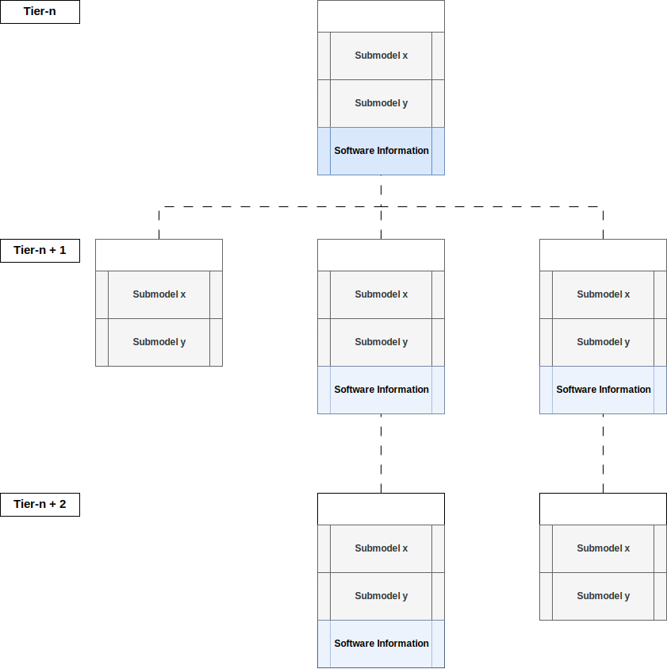
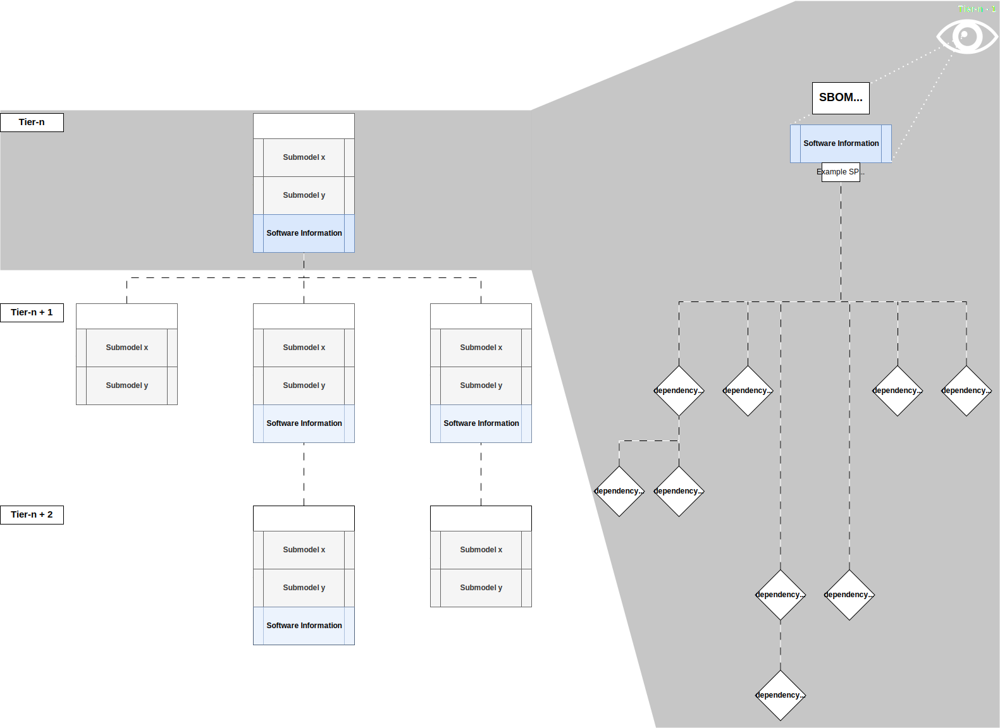
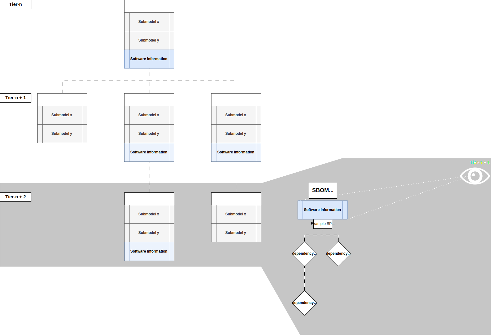
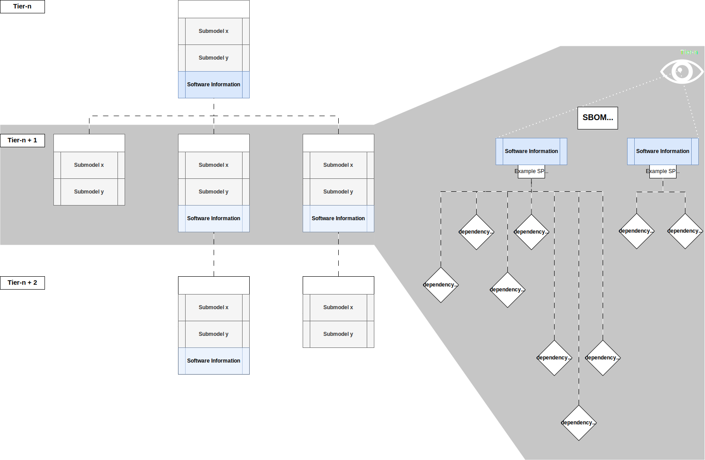

# CX-0158 Car SBOM v.1.0.0

## ABSTRACT

The SBOM (Software Bill of Materials) Use Case defines how software composition data is structured, transferred,
and propagated across the Catena-X ecosystem. It defines how participants provide, consume, and validate SBOM data
using digital twins, semantic submodels, and compliance-compliant 1-up-1-down information flows. This standard
enables traceable, secure, and interoperable SBOM exchange for embedded and standalone software across multiple
tiers of the supply chain.

## FOR WHOM IS THE STANDARD DESIGNED

The standard applies to any Catena-X participant who needs to publish or process SBOM data, particularly in the context
of embedded software, hardware/software integration, and full supply chain software transparency.

## 1 INTRODUCTION

This standard defines the basis for all SBOM-related activities in Catena-X.
It concentrates on the propagation of software composition data through the supply chain.
Follow-up standards (building on this) define the specific SBOM profiles and use cases, such as security, compliance, and license management.

### 1.1 AUDIENCE & SCOPE

This standard is relevant for the following audience:

- Tiered suppliers of software/hardware systems
- OEMs and tiered suppliers consuming or integrating software components
- Software producers and Software solution providers

This standard focuses on the mechanism of SBOM (Software Bill of Materials) propagation through the supply chain,
enabling different levels of data sharing for various business-to-business relationships / constellations, while considering the compliance ramifications that come with those.
It establishes the data standard (submodel) that is to be used for exchanging Software, Hardware-Embedded Software,
Hybrid Software / Hardware-Embedded Software, ..., SBOMs by integrating a pre-existing IDTA submodel, and specifying the underlying file format SPDX.
This sets the groundwork for different SBOM related use-cases that are defined in follow-up standards (which then each define their SPDX profile that shall be used).

Out-of-scope is:

- The structure of digital twins on the data provider side,
  e.g., if every software version receives its own digital twin.
- Runtime or dynamic SBOM generation logic.
- SBOM profile standardization for SBOM use-cases.

### 1.2 CONTEXT AND ARCHITECTURE FIT

The Software Bill of Materials (SBOM) represents a fundamental element for secure and compliant software
lifecycle management. In Catena-X, SBOM data is transferred using the digital twin mechanism supported by
a dataspace connector, semantic aspect models, and standardized submodel formats like SPDX.

Key architectural concepts include:

- Digital twins holding metadata and SBOM-related submodels
- dataspace protocol (DSP) -based data transfer respecting compliance with the 1-up-1-down principle
- Use of anonymous nodes to preserve supply chain confidentiality while ensuring downstream transparency

### 1.3 CONFORMANCE AND PROOF OF CONFORMITY

To prove conformance with this standard, the following must be fulfilled:

- Provide a digital twin with a Software Information submodel for software or software-containing products
- Correctly calculate and attach the SBOM, respecting the 1-up-1-down principle
- Implement anonymization of tiered data as required (anonymous nodes)
- Ensure proper integration with the dataspace connectivity infrastructure (e.g., EDC) for SBOM data delivery
- Provide or consume SPDX files via the submodel

### 1.4 EXAMPLES

See [Section 5.2.1](#521-example-explanation) and following, for a three-tier propagation example of SBOM composition across suppliers, showcasing SPDX integration and the different information propagation options.
Follow-up standards define use-case specific SBOM profiles and provide corresponding SPDX examples, based on the three-tier model described in the standard.

### 1.5 TERMINOLOGY

- **SBOM**: Software Bill of Materials—connected graph of software components in a product
- **Anonymous Node**: A data construct used to include SBOM data from indirect suppliers while masking supplier identity
- **SPDX**: Software Package Data Exchange—a standard format for SBOM data
- **1-up-1-down**: Compliance principle limiting direct data exchange to immediate business partners

## 2 RELEVANT PARTS OF THE STANDARD FOR SPECIFIC USE CASES

> *This section is normative*

### 2.1 "SBOM"

#### 2.1.1 DIGITAL TWINS AND SPECIFIC ASSET IDs

The Digital Twin **MUST** be described as a ``PartType``.

Specific asset IDs are used to identify digital twins when looking up or searching for these digital twins.
This is a requirement for the respective parties to locate the digital twins by identifiers they have available.
Mandatory specific asset IDs ensure that at least this information is available for the digital twin.

| Key             | Availability | Description                                                                                                                                                                                                                                                                                                          | Type   |
|-----------------|--------------|----------------------------------------------------------------------------------------------------------------------------------------------------------------------------------------------------------------------------------------------------------------------------------------------------------------------|--------|
| manufacturerId  | mandatory    | The Business Partner Number (BPNL) of the manufacturer of the part.                                                                                                                                                                                                                                                  | BPNL   |
| customerPartId  | mandatory    | The customer part ID of the part / software. This is the identifier that is used by the customer to identify the part / software.                                                                                                                                                                                    | String |
| digitalTwinType | mandatory    | The digitalTwinType has to be set to ``digitalTwinType="PartType"``. Without this filter, a search for a particular manufacturer part ID would not only return the digital twin of the engineered part, but also all digital twins of the manufacturer that are accessible, e.g., of the corresponding serial parts. | String |

## 3 ASPECT MODELS

> *This section is normative*

### 3.1 ASPECT MODEL "Software Information"

#### 3.1.1 Identifier OF SEMANTIC MODEL

The semantic model has the unique identifier:

```text
  urn:samm:io.catenax.sbom:1.0.0#
```

### 3.2 SPDX

#### 3.2.1 SPDX VERSION

The SPDX files that are referenced by the semantic model and exchanged based on this standard version **MUST** be SPDX 3.0.
The SPDX profiles are defined in the respective use-case standards.

#### 3.2.2 SPDX FORMAT

The SPDX files that are referenced by the semantic model and exchanged based on this standard version **MUST** be in JSON-LD format,
and therefore **SHOULD** have the file ending `*.spdx.jsonld`.

#### 3.2.3 SPDX Allowed RELATIONSHIPS

The list of allowed SPDX relationships that **MAY** be used; any other relationship **MUST NOT** be used:

| **SPDX Relationship** | **Description**                       |
|-----------------------|---------------------------------------|
| DEPENDS_ON            | If one dependency depends on another. |

## 4 APPLICATION PROGRAMMING INTERFACES

> *This section is normative*

### 4.1 APIs ASSOCIATED WITH DIGITAL TWINS

This standard completely and solely builds upon the standards
[CX-0002](https://catenax-ev.github.io/docs/next/standards/CX-0002-DigitalTwinsInCatenaX) Digital Twins in Catena-X
[CX-0125](https://catenax-ev.github.io/docs/next/standards/CX-0125-TraceabilityUseCase) Traceability

## 5 PROCESS

> *This section is normative*

The SBOM standard allows for the propagation of software composition data through the supply chain.
To support different business requirements, compliance constellations of network participants and IP protection requirements, the standard allows for different approaches of SBOM consolidation across the n-tier chain.
Of these different options, the standard recommends a default option (compliance by design) and gives explicit guidance and warnings for the other three.
Every participant in this use-case **MUST** use any of the options defined in this chapter:

- [Option 1](#53-tier-n-sbom-propagation-option-1): Full SBOM propagation with node anonymization
- [Option 2](#54-tier-n-sbom-propagation-option-2): Full SBOM propagation with loss of supply-chain structural information
- [Option 3](#55-tier-n-sbom-propagation-option-3): Full SBOM propagation with loss of tier-n + 2 (and greater) structural information
- [Option 4](#56-tier-n-sbom-propagation-option-4): Full SBOM propagation with complete loss of structural information

Every participant **MAY** use different option for each individual digital twin, regardless of the option used by other business partners.
This standard understands itself as the enablement of business relevant use-cases, and to support the full range of possible use-cases, all four have their applications.

The underlying principle of the propagation mechanism—regardless of the option used—is from a technical data provider and data consumer perspective the Traceability 1-up-1-down principle, using the option specific composition mechanism for the SBOM.
[Chapter 5.1 Tier-n SBOM propagation](#51-tier-n-sbom-propagation) describes in more detail how this consolidation is done in general, to support Tier-n SBOM propagation.

>**The 1-up-1-down principle**
means that every participant shall only share information with their direct business partners
(1-up: supplier, 1-down: customer).
>This principle was established for compliance reasons (e.g., with the German Bundeskartellamt), to ensure compliance by design.

### 5.1 Tier-n SBOM propagation

All participants in the supply chain require a complete SBOM that not only covers the
tier-n + 1 suppliers but also the tier-n + 2 suppliers and so on. Since the Traceability use-case
follows the 1-up-1-down principle (for compliance reasons), to achieve this tier-n
transparency, all participants must propagate their full SBOM through the supply chain,
whilst still abiding compliance rules by choosing the option that fits their situation best—as is explained below.
To this end, all participants **MUST** implement the following SBOM calculation mechanism:

Every tier-n digital twin **MUST** provide a Software Information submodel in case either of the following is true:

- The digital twin is a software product or includes software that is not included by another digital twin.
- Any one or more of the digital twin's tier n + 1 relations come with a Software Information submodel.

If a tier-n digital does have a Software Information submodel, it **MUST** contain the software information of itself and all tier n + 1 digital twins that have a Software Information submodel.

This recursive definition ensures that, as soon as software is introduced in the supply chain, the software information is propagated.

### 5.2 Compliance with the 1-up-1-down principle

When the SBOM is propagated through the supply chain, the 1-up-1-down principle is indirectly circumvented, by making
information from n-up (recursively all suppliers and their suppliers) available to n-down (recursively all customers and their customers).
Indirectly, because the information doesn't come first hand from the respective n-up data providers, but for each
customer in the chain, all SBOM information is provided by their direct suppliers as a sum of SBOM information.

**Why the method described below is still compliant with the 1-up-1-down principle:**
The 1-up-1-down principle is not required in certain situations,
e.g., if the data is required for legal/business critical reasons, not compliance relevant in the individual case, and—if needed—also anonymized appropriately.
This is the case for the Tier-n SBOM propagation for reasons such as:
e.g.,

- for security reasons, the SBOM is required in its entirety on each tier-n level of the supply chain.
  Every participant needs to do their own exhaustive security analysis.
- The same goes for license (cross-)dependencies for software.
- Fulfillment of legal obligations, such as (but not limited to):
  - European Cyber Resilience Act (CRA)
  - US Cyber Supply Chain Management and Transparency Act of 2014
  - US Executive Order 14028 on Improving the Nation's Cybersecurity
  - US NTIA Software Component Transparency
  - US Presidential Executive Orders that regularly happen on quite short notice
  - Guidance paper by the Japanese ministry of economy, trade and industry (METI) on SBOMs
  - ...
- The companies involved in that supply chain are not competitors, and their individual compliance relationship allows for sharing the data.
- ...

In all available options this standard ensures—at a minimum—the anonymization of the underlying supply chain participants.
The four options are (from a compliance perspective) ranked in the following order:

| Option   | **Compliance Criticality** | **Full SBOM propagation with ...**                                                          |
|----------|----------------------------|---------------------------------------------------------------------------------------------|
| Option 1 | Most critical              | ... node anonymization.                                                                     |
| Option 2 | Default recommendation     | ... loss of supply-chain structural information (thus removing the need for anonymization). |
| Option 3 | Less critical              | ... loss of tier-n + 2 (and greater) structural information.                                |
| Option 4 | Least critical             | ... complete loss of structural information.                                                |

Of course, with each option, the amount of information that is propagated decreases,
which is why the standard recommends Option 2 as the default option as a balance between ensuring compliance by design, and relevant information being shared.
In individual cases (e.g., for IP protection reasons) Options 3 and 4 can be the better choice in an individual case;
the same goes for Option 1, where (e.g., for business-criticality reasons and individual contractual agreements) more information is required, and also allowed to be shared (*Note: Option 1 comes with a recommendation to do an individual compliance check; every business relationship is different*).

### 5.2.1 Example explanation

All four options, described in the next sections, are based on the same example, to make them easier to understand:



>**FIGURE INFORMATION**
> In the subsequent figures within this chapter, the software structure information is exemplary outlined.
> The figures will show the Catena-X supply chain structure from above (Tier-n, Tier-n + 1, Tier-n + 2) on the left side of the figure,
> and the SPDX dependency structure on the right side of the figure.
> The SPDX dependency structure on the right is a subtree to the Catena-X supply chain structure.

In this example, we have a window of a 3-tier supply chain with participants on Tier-n, Tier-n + 1, and Tier-n + 2 level.
For each tier, we have one or multiple digital twins (which may or may not come from the same supply chain participant; this does not affect the mechanism).
Some digital twins come with software information, and some do not (e.g., Tier-n+2 as one twin with a Software Information submodel, and one without).
Submodel x and y depict arbitrary submodels that are not Software Information submodels. And the digital twin on Tier-n—while having a Software Information submodel—does not have any software dependencies itself, but depends on the two digital twins on Tier-n + 1 level, which come with Software Information submodels (remember the recursive definition from the section [5.1 Tier-n SBOM propagation](#51-tier-n-sbom-propagation)).

### 5.2.2 Example SPDX

The following example SPDX files give additional detail to the options that are explained below:

| **Option** | **Tier n + 2**                                                     | **Tier n + 1 (left)**                                            | **Tier n + 1 (right)**                                            | **Tier n**                                       |
|------------|--------------------------------------------------------------------|------------------------------------------------------------------|-------------------------------------------------------------------|--------------------------------------------------|
| OPTION 1   | [Option 1 / n + 2](assets/spdx-option-1-tier-n-plus-2.spdx.jsonld) | [Option 1 / n + 1](assets/spdx-option-1-tier-n-plus-1-left.spdx.jsonld) | [Option 1 / n + 1](assets/spdx-option-1-tier-n-plus-1-right.spdx.jsonld) | [Option 1 / n](assets/spdx-option-1-tier-n.spdx.jsonld) |
| OPTION 2   | [Option 2 / n + 2](assets/spdx-option-2-tier-n-plus-2.spdx.jsonld)      | [Option 2 / n + 1](assets/spdx-option-2-tier-n-plus-1-left.spdx.jsonld) | [Option 2 / n + 1](assets/spdx-option-2-tier-n-plus-1-right.spdx.jsonld) | [Option 2 / n](assets/spdx-option-2-tier-n.spdx.jsonld) |
| OPTION 3   | [Option 3 / n + 2](assets/spdx-option-3-tier-n-plus-2.spdx.jsonld)      | [Option 3 / n + 1](assets/spdx-option-3-tier-n-plus-1-left.spdx.jsonld) | [Option 3 / n + 1](assets/spdx-option-3-tier-n-plus-1-right.spdx.jsonld) | [Option 3 / n](assets/spdx-option-3-tier-n.spdx.jsonld) |
| OPTION 4   | [Option 4 / n + 2](assets/spdx-option-4-tier-n-plus-2.spdx.jsonld)      | [Option 4 / n + 1](assets/spdx-option-4-tier-n-plus-1-left.spdx.jsonld) | [Option 4 / n + 1](assets/spdx-option-4-tier-n-plus-1-right.spdx.jsonld) | [Option 4 / n](assets/spdx-option-4-tier-n.spdx.jsonld) |

### 5.3 Tier-n SBOM propagation: OPTION 1

>**COMPLIANCE WARNING:**
This option is the most critical one, and requires an individual compliance check for each business relationship.
Participants have to actively choose this option.\
>To still ensure anonymization of the supply chain participants, this option comes with a mandatory chain-tail anonymization method.

Any participant using this option **MUST** have confirmed the compliance conformity in regard to the business partner the SBOM is exchange with (both as the data consumer and the data provider).
When using this option, the SBOM calculation (based on the recursion described in [chapter 5.1 Tier-n SBOM propagation](#51-tier-n-sbom-propagation)) for a tier-n digital twin is done as follows:

- for each tier n + 1 digital twin, which comes with a Software Information submodel,
  a new anonymous node **MUST** be added to the digital twin's SBOM,
  which **MUST** contain the SBOM of the respective tier n + 1 digital twin
  (the anonymous node ensures chain-tail anonymization for compliance conformity).
- the SBOM of each tier n + 1 digital twin **MUST** be added in its entirety below this anonymous node.
- the anonymous node **MUST** be created in the following way, to ensure proper chain-tail anonymization,
  while still allowing for consistency across the network:

  **Input**: SPDX-File (e.g., sbom.spdx.jsonld) of the respective tier n + 1 digital twin

  **Algorithm**: SHA3-256

  **Output**: 256 bytes hex-string

  **SPDXID**: Concatenate "catena-x-sbom-option-1-" by the hex-string. Example: catena-x-sbom-option-1-0e3ce39cb337af9f6d53a21a1cf337a66836257c7d73a6bd9cf190a99dfdcab8

  **name**: "Anonymous node"

#### 5.3.1 Example on Tier-n + 2 level


Tier-n + 2 level only has one shell with Software Information, and the full tree is provided to Tier-n + 1.

#### 5.3.2 Example on Tier-n + 1 level


Tier-n + 1 level has two shells; one of them depending on the Tier-n + 1 twin.
Both Tier-n + 1 shells contain Software Information,
and the dependency to the Tier-n + 2 level is realized using the anonymous dependency node XYZ, with its respective dependencies.

#### 5.3.3 Example on Tier-n level


While the digital twin on Tier-n level does not come with its own software information,
it comes with a Software Information submodel,
containing the SBOM information from the Tier-n + 1 level.
The relationship is realized using anonymous nodes for each dependency (anonymous dependency node 1234XYZ as well as anonymous dependency node AC).

### 5.4 Tier-n SBOM propagation: OPTION 2

OPTION 2 gets rid of the anonymous nodes of OPTION 1.
This means, that while structural information is mostly preserved, there is a loss in terms of recognition potential of SBOM repetition (e.g., easy identification of equal sub-trees from different origins).
It may still allow for this, by using varying levels of data-engineering effort, depending on the data in the individual case (in terms of data volume and information density);
but the change in mechanism nonetheless removes the information that requires anonymization.
For the SBOM calculation (based on the recursion described in [chapter 5.1 Tier-n SBOM propagation](#51-tier-n-sbom-propagation)) for a tier-n digital twin:

- the SBOM of each tier-n + 1 digital twin **MUST** be added in its entirety on the root level of the tier-n  SBOM.
- anonymous nodes occurring in the tier-n + 1 digital twins (due to OPTION 1 having been used in a tier-n + m data exchange (with m being a natural number >=2)) **MAY** be removed by using the OPTION 2 mechanism.

#### 5.4.1 Example on Tier-n + 2 level


The start on Tier-n + 2 level is the same as OPTION 1, since there are no dependencies on other digital twins.

#### 5.4.2 Example on Tier-n + 1 level


On the Tier-n + 1 level the digital twin that depends on the Tier-n + 2 level propagates the dependencies by addition on the Tier-n + 1 SBOMs' root level.
>**NOTE:**\
>Since there is no flattening* of the structure, if added dependencies were calculated by different options, by default OPTION 2 propagates those along the chain.
>As an example, if the Tier-n + 2 SBOM would contain an anonymous node from a Tier-n + 3 supplier, this node would propagate with the OPTION 2 calculation method to the Tier-n + 1.\
>To remedy this, OPTION 2 allows for the removal of anonymous nodes—by applying the OPTION 2 mechanism for such anonymous node sub-trees.

>***Note on flattening**\
> Flattening means that some or all (based on which OPTION is used) dependency information is removed, and all software components are added on the root level of the SBOM.

#### 5.4.3 Example on Tier-n level


Tier-n—in this example—joins both SBOMs from the respective tier-n + 1 suppliers on the root level.

### 5.5 Tier-n SBOM propagation: OPTION 3

OPTION 3 is quite similar to OPTION 2, when it comes to tier-n + 1 SBOM information.
The big difference is, that OPTION 3 flattens the SBOM information from the chain outside the tier-n + 1 relationship.
For a tier-n digital twin, this is done (based on the recursion described in [chapter 5.1 Tier-n SBOM propagation](#51-tier-n-sbom-propagation)) by the following mechanism:

- the SBOM of each tier-n + 1 digital twin **MUST** be completely flattened (all dependency information is removed).
- all anonymous nodes **MUST** be removed.
- the flattened (and from anonymous nodes sanitized) SBOM **MUST** be added on the root level of the tier-n SBOM.

#### 5.5.1 Example on Tier-n + 2 level


Since the Tier-n + 2 SBOM in this example has no dependencies, it is the same as for OPTION 2.

#### 5.5.2 Example on Tier-n + 1 level


The SBOM on the Tier-n + 1 level, that depends on the Tier-n + 2 level, has the n + 2 SBOM information added as a flattened list on the root level.

>**NOTE:**\
>Other than in OPTION 2, any anonymous node from previous tiers (which may or may not have used OPTION 1) must be removed.

#### 5.5.3 Example on Tier-n level


In this example, the Tier-n does not have any software information to add themselves, so they join the flattened Tier-n + 1 SBOMs for the Tier-n - 1.

### 5.6 Tier-n SBOM propagation: OPTION 4

>**DATA WARNING:**\
>This option propagates the least amount of information, and is discouraged outside of cases where strong IP protection is a business desire.

OPTION 4 is simple in terms of calculation, but may remove so much information, that the shared data loses its value.
For a tier-n digital twin, this option is (based on the recursion described in [chapter 5.1 Tier-n SBOM propagation](#51-tier-n-sbom-propagation)) calculated by the following mechanism:

- the SBOM of each tier-n + 1 digital twin **MUST** be joined on the root level of the tier-n SBOM.
- the tier-n SBOM **MUST** be completely flattened.
- all anonymous nodes **MUST** be removed.

#### 5.6.1 Example on Tier-n + 2 level


This example already shows the difference to the other options: The SBOM the Tier-n + 2 makes available to the Tier-n + 1 is fully flattened, with all dependency information removed.

#### 5.6.2 Example on Tier-n + 1 level


Same goes for the Tier-n + 1 level. While the SBOM information from the Tier-n + 1 is added, the whole SBOM is flattened.

#### 5.6.3 Example on Tier-n level


On Tier-n level the flattened SBOMs are simply joined, as no own information is added to the SBOM. (if there was any, that, too, would be flattened)

### 5.7 Message Mechanism

This standard also provides a message mechanism (based on [CX-0151-IndustryCoreBasics](https://github.com/catenax-eV/product-standardization-prod/tree/main/standards/CX-0151-IndustryCoreBasics)) for the purpose of:

1) event notifications of a new SBOM being available, a SBOM being updated, or a SBOM being deleted.
2) propagation of messages related to SBOM content, such as license issues, security vulnerabilities, or compliance checks.

This standard defines the messages for scenario 1. ([event notifications](#572-sbom-event-notification-definitions)),
but leaves scenario 2. (use-case individual information that needs to be propagated) to the individual use-case standards,
building on this standard.

#### 5.7.1 SBOM Notification API asset structure

The property [[type]](http://purl.org/dc/terms/type) **MUST** reference the name of the certificate management API as defined in the Catena-X taxonomy published under [[taxonomy]](https://w3id.org/catenax/taxonomy).

| **Type**        | **Subject**                                    | **Version** | **Description**                                                    |
|-----------------|------------------------------------------------|-------------|--------------------------------------------------------------------|
| cx-taxo:SBOMAPI | cx-taxo:SoftwareBillOfMaterialsNotificationAPI | 1.0         | Offers *SBOM Notification API* for the receiving of SBOM messages. |

*Example SBOM Notification API:*

```json
{
  "@id": "SBOMAPI",
  "@type": "Asset",
  "properties": {
    "dct:type": {
      "@id": "cx-taxo:SBOMAPI"
    },
    "dct:subject": {
      "@id": "cx-taxo:SoftwareBillOfMaterialsNotificationAPI"
    },
    "dct:description": "Offers an API for the business partner(s) to send SBOM notifications to.",
    "cx-common:version": "1.0"
  },
  "dataAddress": {},
  "@context": {
    "dct": "http://purl.org/dc/terms/",
    "cx-taxo": "https://w3id.org/catenax/taxonomy#",
    "cx-common": "https://w3id.org/catenax/ontology/common#"
  }
}
```

#### 5.7.2 SBOM Event notification definitions

This standard document defines the following three notification content options:

| **eventId** | **Description**                                      |
|-------------|------------------------------------------------------|
| SBOMCreated | Notification that a new SBOM has been created.       |
| SBOMUpdated | Notification that an existing SBOM has been updated. |
| SBOMDeleted | Notification that an existing SBOM has been deleted. |

*Example:*

```json
{
  "header": {
    "messageId": "urn:uuid:f9a97301-a000-44dd-b9d8-78488a40c6bb",
    "context": "SoftwareBillOfMaterialsNotificationAPI:3.0.0",
    "sentDateTime": "2024-07-05T08:13:33.20733Z",
    "senderBpn": "BPNL000000000AAA",
    "receiverBpn": "BPNL000000000ZZZ",
    "expectedResponseBy": "2025-09-01T01:01:01.00000Z",
    "version": "1.0.0"
  },
  "content": {
    "eventId": "SBOMCreated",
    "dtrSubmodelId": "urn:uuid:12345678-1234-5678-1234-123456789012"
  }
}
```

The eventId **MUST** be one of the (above) defined event types.
The dtrSubmodelId that is specified in this message **MUST** equal the UID of the SBOM submodel in the digital twin registry.

>**Note:**\
> This does **NOT** specify the digital twin registry, in which the submodel is discoverable.
> It is still the responsibility of the data consumer to discover the digital twin registry (there might be multiple)

### 5.8 Usage Policy

The assets included in the dataspace connector of the data provider (be it for the submodel assets or the notification API asset) **MUST** contain a usage policy that includes the Catena-X Data Exchange Governance document in the latest version.

Additional more general usage policies **MAY** be included, but all the usage policies **MUST** contain the above usage purpose.

*Example Usage Policy*:

``` json
{
  "@context": [
    "http://www.w3.org/ns/odrl.jsonld",
    {
      "@vocab": "https://w3id.org/edc/v0.0.1/ns/",
      "cx-policy": "https://w3id.org/catenax/policy/"
    }
  ],
  "@type": "PolicyDefinition",
  "@id": "SBOM-usage-policy-without-contract-reference",
  "profile": "cx-policy:profile2405",
  "policy": {
    "@type": "Set",
    "permission": [
      {
        "action": "use",
        "constraint": {
          "and": [
            {
              "leftOperand": "cx-policy:FrameworkAgreement",
              "operator": "eq",
              "rightOperand": "DataExchangeGovernance:1.0"
            }
          ]
        }
      }
    ]
  }
}
```

The left operand ```"leftOperand": "cx-policy:ContractReference"``` **MUST** be included only if a bilateral framework contract exists that further governs the data-exchange between the data consumer and the data provider.

```json
{
  "leftOperand": "cx-policy:ContractReference",
  "operator": "eq",
  "rightOperand": "x12345"
}
```

## 6 REFERENCES

### 6.1 NORMATIVE REFERENCES

- CX-0001 Participant Agent Registration v1.2
- CX-0002 Digital Twins in Catena-X v2.3.0
- CX-0003 SAMM Aspect Meta Model v1.2.0
- CX-0010 Business Partner Number v3.0.1
- CX-0018 Dataspace Connectivity v4.1.1
- CX-0125 Traceability v2.2.1
- CX-0126 Industry Core: Part Type 2.1.1
- CX-0151 Industry Core: Basics v.1.0.0

### 6.2 NON-NORMATIVE REFERENCES

- SPDX specification: https://spdx.dev/specifications/
- SHA3-256 specification: https://www.nist.gov/publications/sha-3-standard-permutation-based-hash-and-extendable-output-functions

### 6.3 REFERENCE IMPLEMENTATIONS

> *This section is non-normative*

This section is an empty placeholder for a future link to the reference implementation.

## Legal

Copyright © 2026 Catena-X Automotive Network e.V. All rights reserved. For more information, please see [Catena-X Copyright Notice](https://catenax-ev.github.io/copyright).
