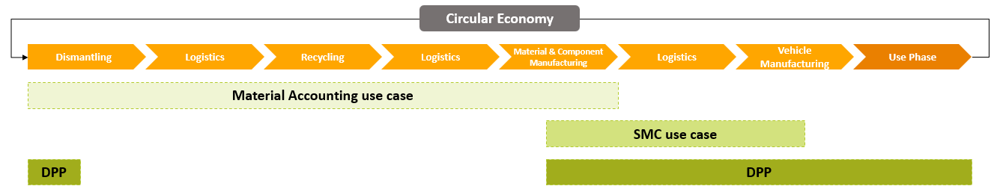
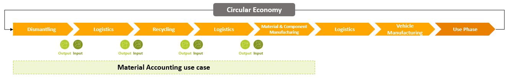

# CX-0159 Material Accounting v.1.0.0

## ABSTRACT

This document focuses on Material Accounting and its application and administration within Catena-X. The purpose of this standard is to create a technical standard and harmonized technical specifications for digital material accounting to bridge the data gap between vehicle end-of-life and vehicle production with secondary material. A seamless, traceable and verifiable data exchange of standardized data attributes in a machine-readable way related to secondary material is enabled.

The use case is based on the industry core and uses digital twins and aspect models of the industry core. In addition, it includes a
use case-specific aspect models *VehicleInformation*, *WasteCode*, *RecyclingBatch*, *Material*, *RecyclingInformation* and *Composition* that goes beyond the industry core and is used to make secondary material flows in the network traceable, through sending and receiving multilevel data along the end-of-life value chain.

## FOR WHOM IS THE STANDARD DESIGNED

This standard is designed for everybody who wants to participate in the Material Accounting use case.
The following features are provided:

- Traceability of secondary material flows, building on data attributes in the categories of materials, sources, actors, processes, batches, vehicles, component sets and components.

For further information, please refer to [chapter 1.1 AUDIENCE & SCOPE](#11-audience--scope).

## 1 INTRODUCTION

This standard defines standardized material accounting within the Catena-X network. Material accounting is a multi-stakeholder process along the reverse value chain for the purpose of material recovery, possibly stretching over the course of many years. The semantic model is presented in [chapter 3 ASPECT MODELS](#3-aspect-models) with the associated JSON schema. The standardization of the material accounting data attributes with the *VehicleInformation*, *WasteCode*, *RecyclingBatch*, *Material*, *RecyclingInformation* and *Composition* semantic models, combined with a digital-twin -based data exchange to leverage digital-twin-based data discovery, enables participants in the value chain to share information about secondary material flows in a transparent, efficient and verifiable way. Thus, consistent material balances along all stages of the reverse value chain and a verification of secondary material contents in line with
regulatory requirements are enabled, as well as further benefits supporting the implementation of the circular economy.

This document summarizes all standards to be supported by a network participant’s IT infrastructure and subsequent subcontracted
infrastructures to participate in the Material Accounting use case.

### 1.1 AUDIENCE & SCOPE

> *This section is non-normative*

The standard is of interest to all members of the automotive supply chain including suppliers, OEMs, dismantlers, recyclers and
stakeholders within the recycling industry and the circular economy, who want to

- engage in material accounting
- want to investigate a digital vehicle-to-recyclate data ecosystem of material
- provide and/or consume data on secondary materials
- create transparent, consistent and verifiable material balances along all stages of the reverse value chain
- account of secondary material flows and calculating secondary material content
- verify the fulfillment of regulatory (open or closed loop) secondary material quotas and fulfill related legal reporting obligations
- optimize usage and processing of secondary materials in recycling, refining, manufacturing and waste management
- create transparency regarding the fate of materials and the reverse value chain
- reduce manual verification and documentation efforts
- utilize as basis for other R-Strategies like Remanufacturing or Refurbishment

Especially the following roles or subsets of the following roles are targeted:

- Data Provider / Consumer

Additionally, the standard is also of interest to business application providers, software providers, enablement service providers, core  service providers and consulting services providers, who have an interest to promote material accounting or to provide products and  services related to material accounting.

The Material Accounting use case is only relevant in case of tracking materials and related information, in order to track and share
this information in a Catena-X-compliant way.

### 1.2 CONTEXT AND ARCHITECTURE FIT

> *This section is non-normative*

**The automotive industry and future sustainability objectives**

The automotive industry is undergoing significant transformation driven by the need to integrate sustainable practices and minimize ecological footprints, particularly in the realm of material accounting. Future sustainability objectives necessitate a comprehensive reduction in emissions and the use of renewable energy sources, alongside the promotion of circular economy & circular business models. Effective material accounting is crucial in this context, as it enables companies to track the processes and material flows following vehicle end-of-life, ensuring compliance with sustainability standards and regulations. By implementing standards such as Catena-X, organizations can enhance transparency and traceability within their supply chains, which is essential for achieving sustainability &resilience goals. This approach not only supports regulatory compliance but also fosters a culture of accountability and responsibility in material usage,ultimately contributing to the industry's overall sustainability efforts.

**The necessity and challenges of tracking materials**

Tracking materials is essential for the automotive industry to ensure regulatory compliance, quality assurance, and the efficiency of production processes. The challenges in this area are manifold: Companies must manage a wide variety of materials and components from different sources while ensuring that these materials meet established sustainability standards. The complexity of global supply chains, combined with the need to capture and analyze up-to-date or real-time data , presents a significant hurdle. Additionally, integrating new technologies and systems into existing architectures requires careful planning and execution. Catena-X provides a structured framework to address these challenges and enables seamless material tracking that meets both operational requirements and sustainability goals. Hence, the purpose of this standard is to create a technical standard and harmonized technical specifications for digital material accounting for physical secondary material flows. This is intended to bridge the currently prevalent data gap between vehicle end-of-life and material / component manufacturing incorporating secondary material, which many companies of the reverse value chain as well as OEMs are facing today.

**The context of material accounting in Catena-X**

In order to create this transparency on secondary material flows and related information, relevant data should be made available by the involved participants in addition to the transparency on physical assets. This process is also described in the standard [CX-0127 INDUSTRY CORE: PART INSTANCE 2.0.0](https://catenax-ev.github.io/docs/Jupiter/standards/CX-0127-IndustryCorePartInstance). Building on the Industry Core Part Instance, this Catena-X standard for material accounting enables the efficient building  and virtual representation of data chains for component sets, components and materials. This is achieved via the standardized creation of digital twins of vehicles, components, component sets and batches and the logical linking to their sub-components (Bill of Material, BoM) as well as the semantic model specific to material accounting presented in this standard. The default visibility of digital twins and their respective semantic models follows the one-up/one-down principle. Further normative Catena-X standards are listed in [chapter 5 REFERENCES](#5-references).

**Connection to the Digital Product Passport and the Secondary Material Content use case**

*Figure 1: Sequence of Material Accounting, SMC and DPP along the Vehicle Life Cycle*

To understand the role of material accounting within Catena-X, it is essential to highlight its link to the Secondary Material
Content (SMC) use case. The information generated in material accounting is intended to be processed according to the SMC semantic model, enabling a standardized provision of secondary material content data to vehicle manufacturers. Thus, the Material Accounting use case serves—among other purposes—as an upstream data source for the SMC use case.

Looking ahead, data produced in both the Material Accounting and the SMC use cases will likely become important inputs for future Digital Product Passports (DPP), particularly across the material, component, and vehicle manufacturing stages. Conversely, for end-of-life vehicles, existing DPPs will contain detailed product information that can support subsequent material accounting processes, especially during dismantling.

### 1.3 CONFORMANCE AND PROOF OF CONFORMITY

> *This section is non-normative*

As well as sections marked as non-normative, all authoring guidelines, diagrams, examples, and notes in this specification are non-normative. Everything else in this specification is normative. The key words **MAY**, **MUST**, **MUST NOT**, **OPTIONAL**, **RECOMMENDED**, **REQUIRED**, **SHOULD** and **SHOULD NOT** in this document are to be interpreted as described in BCP 14 [RFC2119] [RFC8174] when, and only when, they appear in all capitals, as shown here.

All participants and their solutions will need to prove that they are conform with the Catena-X standards. To validate that the standards are applied correctly, Catena-X employs Conformity Assessment Bodies (CABs).

### 1.4 EXAMPLES

Examples for data models: Please refer to [chapter 3 ASPECT MODELS](#3-aspect-models).

### 1.5 TERMINOLOGY

> *This section is non-normative*

The following terms are especially relevant for the understanding of the standard:

**Application Programming Interface (API)**: An API is a way for two or more computer programs to communicate with each other.

**Aspect Model**: A formal, machine-readable semantic description (expressed with RDF/turtle) of data accessible from an aspect. An Aspect Model must adhere to the Semantic Aspect Meta Model (SAMM), i.e., it utilizes elements and relations defined in the Semantic Aspect Meta Model and is compliant to the validity rules defined by the Semantic Aspect Meta Model. Aspect Models are logical data models which can be used to detail a conceptual model in order to describe the semantics of runtime data related to a concept. Further, elements of an Aspect model can/should refer to terms of a standardized Business Glossary (if existing).
[Source: Catena-X, [CX-0002](https://catenax-ev.github.io/docs/next/standards/CX-0002-DigitalTwinsInCatenaX)]

**Asset**: An Asset describes on Data Provider side the data set which will be shared or can be consumed by a Data Consumer.

**Business Partner Number (BPN)**: A BPN is the unique identifier of a partner within Catena-X.

**Circular Economy**: Economic system that uses a systemic approach to maintain a circular flow of resources by recovering, retaining, or adding to their value, while contributing to sustainable development.
[Source: CLEPA, 2024]

**Component set**: A separate product and a structured arrangement of components that can be assembled into a customer product.

**Component**: A separate product that can be assembled into a customer product, potentially consisting of sub-components.

**Component Manufacturing**: Set of production processes through which components are created from materials or sub-components.

**Dataspace Protocol (DSP)**: Protocol specification, designed to facilitate interoperable data sharing within a dataspace, currently governed by the EDWG.

**Decentralized Claims Protocol (DCP)**: Protocol specification for the exchange of verifiable credentials and presentations between a connector and a wallet as well as the issuance of such credentials by an identity provider.

**Digital Twin**: Digital representation of an asset that provides data on aspects of the represented data following [CX-0002](https://catenax-ev.github.io/docs/next/standards/CX-0002-DigitalTwinsInCatenaX).

**Dismantling**: Process whereby a product is taken apart in such a way that some parts can be reused, although the product (and the parts not intended to be reused) can no longer be reassembled and made operational.
[Source: ISO 14009:2020-12, 2020]

**End-of-life**: Life cycle stage that begins when a product is discarded and ends when the waste material of the product is returned to nature or enters another product’s life cycle.
[Source: EU 2024/1781/EC, 2024]

**End-of-life vehicle**: Vehicle which is waste, which is defined as any substance or object which the holder discards or intends to or is required to discard, or vehicle that is irreparable.
[Source: EU 2008/98/EC, 2008]

**Material**: Collective term for substances and mixtures of substances that are intended for the production of products. This may include raw materials as well as more highly processed substances and mixtures of substances. A distinction is made between primary and secondary materials.
[Source: Umweltbundesamt, 2012; VDA, 2025]

**Material Manufacturing**: Set of processes through which materials are produced, refined or transformed into usable substances or mixtures of substances for product manufacturing. Includes the extraction, processing, recycling or re-processing of primary or secondary materials that serve as inputs.

**Tractus-X Eclipse Dataspace Connector (Tractus-X EDC)**: The Tractus-X EDC is a reference implementation for a connector conformant to [CX-0018](https://catenax-ev.github.io/docs/standards/CX-0018-DataspaceConnectivity) currently acting as a de-facto standard and/or reference Implementation within Catena-X. When mentioning the Tractus-X EDC in this standard, any other [CX-0018](https://catenax-ev.github.io/docs/standards/CX-0018-DataspaceConnectivity) conformant connector is also a valid option.

**Part Instance**: A part instance is a physically produced instance (e.g. serialized part, batch, just-in-sequence-part) of a part type.

**Post-consumer Automotive**: Material generated by households or by commercial, industrial and institutional facilities in their role as end-users of the automotive product which can no longer be used for its intended purpose.
[Source: VDA, 2025]

**Post-consumer Non-automotive**: Material generated by households or by commercial, industrial and institutional facilities in their role as end-users of the non-automotive product which can no longer be used for its intended purpose.
[Source: VDA, 2025]

**Pre-consumer Automotive (also known as post-industrial Automotive)**: Material diverted from the automotive waste stream during a manufacturing process. Excluded is reutilization of materials (ReU-M) such as rework, regrind or scrap generated in a process and capable of being reclaimed within the same process that generated it.
[Source: VDA, 2025]

**Pre-consumer Non-Automotive (also known as post-industrial Non-Automotive)**: Material diverted from the non-automotive waste stream during a manufacturing process.Excluded is reutilization of materials (ReU-M) such as rework, regrind or scrap generated in a process and capable of being reclaimed within the same process that generated it.
[Source: VDA, 2025]

**Primary Material**: Substances and mixtures of substances intended for the manufacture of products and used for the first time in a production process. This may include both primary raw materials and higher processed substances and mixtures of substances.
[Source: Umweltbundesamt, 2012]

**Recycling**: Any recovery operation by which waste materials are reprocessed into products, materials or substances whether for the original or other purposes. It includes the reprocessing of organic material but does not include energy recovery and the reprocessing into materials that are to be used as fuels or for backfilling operations.
[Source: EU, 2008/98/EC, 2008]

**Reutilization Material**: Materials such as rework, regrind, or scrap materials generated within the process and capable of being reused within the same process that generated it.
[Source: EN ISO 14021:2016, 2016 + A1:2021, 2026]

**Secondary Material**: Collective term for all materials obtained from waste, by-products and production residues sources. This corresponds to the material flows pre-consumer, post-consumer and reutilization material. This includes substances and mixtures of substances that are intended for the manufacture of products. This can include both secondary raw materials and more highly processed substances and mixtures of substances. Secondary material can be used as a substitute for primary material in processes.
[Source: Umweltbundesamt, 2012; VDA, 2025]

**Vehicle Anonymised Number (VAN)**: OEM-specific hashed/pseudonymized VIN.

**Vehicle Identification Number (VIN)**: The VIN number is a 17-character code assigned by the manufacturer to every vehicle, providing specific information about its make, model, year of manufacture, and other key features. It is a unique identifier that allows the vehicle to be easily tracked and identified throughout its lifespan. Additional terminology used in this standard can be looked up in the glossary on the association homepage.

## 2 RELEVANT PARTS OF THE STANDARD FOR SPECIFIC USE CASES

> *This section is normative*

### 2.1 MATERIAL ACCOUNTING

#### 2.1.1 LIST OF STANDALONE STANDARDS

Please refer to [chapter 5 REFERENCES](#5-references) for information on normative and non-normative references.

#### 2.1.2 DATA REQUIRED

A digital twin MUST be created for the processed assets in case of exchanging material accounting data within Catena-X. In all cases the digital twin MUST be provisioned via an Asset Administration Shell as per [CX-0002](https://catenax-ev.github.io/docs/next/standards/CX-0002-DigitalTwinsInCatenaX) and registered in a decentral Digital Twin Registry of the data provider (or the decentral Digital Twin Registry host of the manufacturer) as described in [CX-0002](https://catenax-ev.github.io/docs/next/standards/CX-0002-DigitalTwinsInCatenaX).
The DSP/DCP protocol as described in [CX-0018](https://catenax-ev.github.io/docs/standards/CX-0018-DataspaceConnectivity) MUST be followed in the data exchange.

#### 2.1.3 ADDITIONAL REQUIREMENTS

As the DSP/DCP protocol is being used, data MUST NOT be transferred before a corresponding contract negotiation has been successfully passed by the participants of the data exchange and a valid contract is present as described in [CX-0018](https://catenax-ev.github.io/docs/standards/CX-0018-DataspaceConnectivity).

##### 2.1.3.1 POLICY CONSTRAINTS FOR DATA EXCHANGE

In alignment with our commitment to data sovereignty, a specific framework governing the utilization of data within the Catena-X use
cases has been outlined. As part of this data sovereignty framework, conventions for access policies, for usage policies and for the constraints contained in the policies have been specified in standard '[CX-0152](https://catenax-ev.github.io/docs/next/standards/CX-0152-PolicyConstrainsForDataExchange) Policy Constraints for Data Exchange'. This standard document CX-0152 MUST be followed when providing services or apps for data sharing/consuming and when sharing or consuming data in the Catena-X ecosystem. What conventions are relevant for what roles named in [chapter 1.1. Audience and Scope](#11-audience--scope) is specified in the [CX-0152](https://catenax-ev.github.io/docs/next/standards/CX-0152-PolicyConstrainsForDataExchange) standard document as well.

##### 2.1.3.2 DATA ASSET STRUCTURE

The Data Assets need to be registered in the EDC as follows:

Note: Expressions in double curly braces \{\{\}\} must be substituted with a corresponding value.

```json
{
   "@context": {
      "dct": "http://purl.org/dc/terms/",
      "cx-taxo": "https://w3id.org/catenax/taxonomy#",
      "cx-common": "https://w3id.org/catenax/ontology/common#"
   },
   "@type": "Asset", 
   "@id": "{{CONNECTOR_ASSET_ID}}",
   "properties": {
      "dct:type": {"@id": "cx-taxo:MaterialAccounting"},
      "cx-common:version": "1.0",
      "aas-semantics:semanticId": {"@id":  "urn:samm:io.catenax.material_accounting/1.0.0"}   
   },
   "dataAddress": {
      "@type": "DataAddress",
      "type": "HttpData",
      "baseUrl": "{{ SUBMODEL_ENDPOINT }}",
      "proxyQueryParams": "false",
      "proxyBody": "false",
      "proxyPath": "true",
      "proxyMethod": "false",
   }
}
```

The data asset MUST contain the following properties with the corresponding values from the table above:

- dct:type for type (as @id reference), see also [CX-0018](https://catenax-ev.github.io/docs/standards/CX-0018-DataspaceConnectivity)
- cx-common:version for version, see also [CX-0018](https://catenax-ev.github.io/docs/standards/CX-0018-DataspaceConnectivity)

##### 2.1.3.3 USAGE POLICY

The “Connector Asset for Material Accounting” included in the EDC of a data consumer MUST contain a usage policy following the requirements referenced in chapter [2.1.3.1 POLICY CONSTRAINTS FOR DATA EXCHANGE](#2131-policy-constraints-for-data-exchange).

The "rightOperand" for the "leftOperand" "UsagePurpose" MUST include the following usage purpose: 'cx.materialaccounting.base:1’. The legal meaning is named in [CX-0152](https://catenax-ev.github.io/docs/next/standards/CX-0152-PolicyConstrainsForDataExchange) (see standard library).
Additional more general usage policies MAY be included, but all the usage policies MUST contain the above mentioned usage purpose as shown below.

#### 2.1.4 DIGITAL TWINS AND SPECIFIC ASSET IDs

The Material Accounting use case uses digital twins to make asset material data available to other Catena-X partners. Basics about digital twins, which you should be familiar with to understand this section, are described in the Standard of Digital Twins ([CX-0002 Digital Twins in Catena-X](https://catenax-ev.github.io/docs/next/standards/CX-0002-DigitalTwinsInCatenaX)).

For the following assets, a digital twin MUST be created by data providers participating in the use case:

- Vehicle (for the participants who request/provide data on vehicles as specified in [chapter 3 ASPECT MODELS](#3-aspect-models))
- Component set (for the participants who request/provide data on component sets as specified in [chapter 3 ASPECT MODELS](#3-aspect-models))
- Component (for the participants who request/provide data on components as specified in [chapter 3 ASPECT MODELS](#3-aspect-models))
- Material (for the participants who request/provide data on materials as specified in [chapter 3 ASPECT MODELS](#3-aspect-models))
Specific asset IDs are used to identify digital twins when looking up or searching for these digital twins. This is a required step by a sender of physical assets to connect the digital twins of the vehicle/component set/component/material to the digital twins of their physical assets. The following specific asset IDs not marked as optional MUST be available when registering a digital twin in order to allow discovery (see [CX-0002](https://catenax-ev.github.io/docs/next/standards/CX-0002-DigitalTwinsInCatenaX) that provides additional information). The specific asset IDs marked as optional MAY be used in addition.

- Key ="batchId": Identifier for the specific container which contains component sets / components / materials
- Key ="globalAssetID": The ID serves as a global and unique identifier assigned to the vehicle/component set/component/material in Catena-X; at the same time, it acts as a reference key for all data associated with the vehicle/component set/component/material, regardless of which actor the data originates from. When a digital twin is registered, the vehicleCatenaXId is the globalAssetId.

The asset's globalAssetId MUST be equal to the unique id used in Catena-X.

## 3 ASPECT MODELS

> *This section is normative*

The relevant aspect models defined in this standard are *VehicleInformation*, *WasteCode*, *RecyclingBatch*, *Material*, *RecyclingInformation* and *Composition*.

If a data provider decides to provide data on aspect models of this standard they MUST provide the data conformant to the semantic models specified in this document
Data consumers and data provider MUST comply with the license of the semantic models.
The submodel data MUST be transferred using the IDS Protocol as described in [CX-0018](https://catenax-ev.github.io/docs/standards/CX-0018-DataspaceConnectivity). The Tractus-X EDC as a reference implementation is RECOMMENDED to be used as a connector conformant to [CX-0018](https://catenax-ev.github.io/docs/standards/CX-0018-DataspaceConnectivity).
Data providers MUST provide data as part of a digital twin of the asset for serialized parts conformant to [CX–0002](https://catenax-ev.github.io/docs/next/standards/CX-0002-DigitalTwinsInCatenaX). The JSON Payloads of data providers MUST be conformant to the JSON Schemas as specified in this document.
The unique identifier of the semantic model specified in this document MUST be used by the data provider to define the semantics of the data being transferred.

This aspect model contains standardized data attributes related to automotive secondary materials. All goods of processed batches, vehicles, components etc. and their corresponding weights and sources are listed and MUST be connected between the individual existing digital twins of them (e.g. partInstance) and the digital twin containing *VehicleInformation*, *WasteCode*, *RecyclingBatch*, *Material*, *RecyclingInformation* and *Composition*. Only under this condition it is possible to track and trace the materials along the end-of-life value chain and verify material balances and the fulfillment of regulatory open and closed loop recycled content quotas. By standardizing the data attributes related to secondary material flows, we support a harmonized approach to material accounting in automotive.

All participants of the Material Accounting use case MUST implement the *VehicleInformation*, *WasteCode*, *RecyclingBatch*, *Material*, *RecyclingInformation* and *Composition* aspect models and MUST be able to request, consume and provide material accounting information.

Senders of *VehicleInformation*, *WasteCode*, *RecyclingBatch*, *Material*, *RecyclingInformation* and *Composition* data MUST ensure that it aligns with the semantic models specified in this standard.

The unique identifiers for the semantic models, as specified in this standard, MUST be used to define the meaning of the data being transferred.

Business applications utilizing *VehicleInformation*, *WasteCode*, *RecyclingBatch*, *Material*, *RecyclingInformation* and *Composition* data MUST consume this data, conforming to the semantic models specified in this standard.

### 3.1 ASPECT MODEL "*VEHICLEINFORMATION*"

#### 3.1.1 INTRODUCTION

This section describes the “*VehicleInformation*” semantic model used in the Catena-X network. The “*VehicleInformation*” aspect model defines a standardized and interoperable set of vehicle attributes, including identification data, technical properties and classification information, to describe a vehicle in a consistent and machine-readable manner. For the complete semantics and detailed descriptions of its properties please refer to the SAMM model in [chapter 3.1.5.1](#3151-rdf-turtle).

#### 3.1.2 SPECIFICATIONS ARTIFACTS

The modeling of the semantic model specified in this document was done in accordance to the "semantic driven workflow" to create a submodel template specification SMT.
This aspect model is written in SAMM 2.2.0 as a modeling language conformant to [CX-0003](https://catenax-ev.github.io/docs/next/standards/CX-0003-SAMMSemanticAspectMetaModel) as input for the semantic driven workflow.
Like all Catena-X data models, this model is available in a machine-readable format on GitHub conformant to CX-0003.

#### 3.1.3 LICENSE

This Catena-X data model is made available under the terms of the Creative Commons Attribution 4.0 International (CC-BY-4.0) license, which is available at Creative Commons.

#### 3.1.4 IDENTIFIER OF SEMANTIC MODEL

The semantic model has the unique identifier
urn:samm:io.catenax.material_accounting/1.0.0/VehicleInformation.ttl

This identifier MUST be used by the data provider to define the semantics of the data being transferred.

#### 3.1.5 FORMATS OF SEMANTIC MODEL

##### 3.1.5.1 RDF TURTLE

The RDF turtle file, an instance of the Semantic Aspect Meta Model, is the master for generating additional file formats and serializations. It can be found under the following link:
[https://github.com/eclipse-tractusx/sldt-semantic-models/tree/main/io.catenax.material_accounting/1.0.0/VehicleInformation.ttl](https://github.com/eclipse-tractusx/sldt-semantic-models/tree/main/io.catenax.material_accounting/1.0.0/VehicleInformation.ttl)

The open source command line tool of the Eclipse Semantic Modeling Framework is used for generation of other file formats like for example a JSON Schema, aasx for Asset Administration Shell Submodel Template or a HTML documentation.

##### 3.1.5.2 JSON SCHEMA

A JSON Schema can be generated from the RDF Turtle file.The JSON Schema defines the Value-Only payload of the Asset Administration Shell for the API operation "GetSubmodel".

##### 3.1.5.3 AASX

An AASX file can be generated from the RDF Turtle file. The AASX file defines one of the requested artifacts for a Submodel Template Specification conformant to [SMT].

#### 3.1.6 Examples

Example JSON Payload: Model *VehicleInformation*

```json
{
  "modelIdentifier" : "E46",
  "productionDate" : "2025-01-01",
  "emptyWeight" : 1850.5,
  "driveType" : "combustion engine",
  "vehicleSeries" : "3-Series",
  "oem" : "Mercedes",
  "vehicleCondition" : "damaged",
  "wasteCodeVehicle" : "16 01 04",
  "globalAssetId" : "27a0EdcA-1BfB-9D76-35b0-f5aAc9d9b577",
  "anonymizedVin" : "WVWZZZ1JZXW000001",
  "vehicleType" : "Electric and Hybrid Vehicles (Other than passenger cars)"
}
```

#### 3.1.7 Additional Requirements

**Mandatory Data Attributes for Specific Actors**

Defined data attributes are mandatory only for specific actors on specified levels within the Material Accounting use case. Please also refer to [chapter 4.1.1](#411-actors-and-roles) for information on actors and roles.

Actors who are identified or identify themselves as a Dismantling Facility / Authorized Treatment Facility MUST provide all data attributes, if applicable, in the *VehicleInformation* aspect model to the receiver.

Actors who are identified or identify themselves as a Logistic Operator MUST provide all information provided by the previous sender, who is sending the assets transported, to the following receiver, who receives the assets transported. This ensures all information on the transported assets is passed on by Logistics Operators. Moreover, the Logistic Operator MUST provide all data attributes in the *VehicleInformation* aspect model to the receiver, updated with information on the Logistic Operator’s own process.

**Eligible Values for Specific Data Attributes**

This standard aims to standardize the language and thus eligible values (answer possibilities) for specific data attributes in the *VehicleInformation* data model, in order to make progress towards a harmonized language and naming conventions for material accounting. Hence, for specific data attributes, only certain values are eligible. Participants MUST use the following values, i.e. chose amongst the eligible values per data attribute, when sending or receiving material accounting data. The rule to set a value thus depends on the following table for all data attributes included in the table.

| Data Attribute (Field Name) | Eligible Values                                                                          |
|-----------------------------|------------------------------------------------------------------------------------------|
| vehicleType                 | Passenger Cars – Internal Combustion Engine (ICE)                                        |
|                             | Passenger Cars – Electric Vehicle (EV)                                                   |
|                             | Passenger Cars - Hybrid                                                                  |
|                             | Light Commercial Vehicles (LCVs)                                                         |
|                             | Heavy Trucks / Lorries                                                                   |
|                             | Buses and Coaches                                                                        |
|                             | Motorcycles and Scooters                                                                 |
|                             | Off-Road Vehicles / SUVs                                                                 |
|                             | Special Purpose Vehicles                                                                 |
|                             | Electric and Hybrid Vehicles (other than passenger cars)                                 |
| wasteCodeVehicle            | 16 01 04 end-of-life vehicles                                                            |
|                             | 16 01 06 end-of-life vehicles, containing neither liquids nor other hazardous components |

Table 1: Eligible Values for Specific Data Attributes in Aspect Model “*VehicleInformation*”

### 3.2 ASPECT MODEL "*WasteCode*"

#### 3.2.1 INTRODUCTION

This section describes the “*WasteCode*” semantic model used in the Catena-X network. The "*WasteCode*" aspect model defines a standardized and interoperable representation of waste categorization information, including European Waste Catalogue (EWC) codes and their descriptions, to classify vehicles, parts or materials in a consistent and machine-readable manner. For the complete semantics and detailed descriptions of its properties please refer to the SAMM model in [chapter 3.2.5.1](#3251-rdf-turtle).

#### 3.2.2 SPECIFICATIONS ARTIFACTS

The modeling of the semantic model specified in this document was done in accordance to the "semantic driven workflow" to create a submodel template specification SMT.
This aspect model is written in SAMM 2.2.0 as a modeling language conformant to [CX-0003](https://catenax-ev.github.io/docs/next/standards/CX-0003-SAMMSemanticAspectMetaModel) as input for the semantic driven workflow.
Like all Catena-X data models, this model is available in a machine-readable format on GitHub conformant to CX-0003.

#### 3.2.3 LICENSE

This Catena-X data model is made available under the terms of the Creative Commons Attribution 4.0 International (CC-BY-4.0) license, which is available at Creative Commons.

#### 3.2.4 IDENTIFIER OF SEMANTIC MODEL

The semantic model has the unique identifier
urn:samm:io.catenax.material_accounting/1.0.0/WasteCode.ttl

This identifier MUST be used by the data provider to define the semantics of the data being transferred.

#### 3.2.5 FORMATS OF SEMANTIC MODEL

##### 3.2.5.1 RDF TURTLE

The RDF turtle file, an instance of the Semantic Aspect Meta Model, is the master for generating additional file formats and serializations. It can be found under the following link:
[https://github.com/eclipse-tractusx/sldt-semantic-models/tree/main/io.catenax.material_accounting/1.0.0/WasteCode.ttl](https://github.com/eclipse-tractusx/sldt-semantic-models/tree/main/io.catenax.material_accounting/1.0.0/WasteCode.ttl)

The open source command line tool of the Eclipse Semantic Modeling Framework is used for generation of other file formats like for example a JSON Schema, aasx for Asset Administration Shell Submodel Template or a HTML documentation.

##### 3.2.5.2 JSON SCHEMA

A JSON Schema can be generated from the RDF Turtle file.The JSON Schema defines the Value-Only payload of the Asset Administration Shell for the API operation "GetSubmodel".

##### 3.2.5.3 AASX

An AASX file can be generated from the RDF Turtle file. The AASX file defines one of the requested artifacts for a Submodel Template Specification conformant to [SMT].

#### 3.2.6 Examples

Example JSON Payload: Model *WasteCode*

```json
{
  "wasteCode" : "16 01 07 oil filters",
  "globalAssetId" : "urn:uuid:070dcABA-6b08-e273-176b-3BCfbCc4D95c"
}
```

#### 3.2.7 Additional Requirements

**Mandatory Data Attributes for Specific Actors**

Defined data attributes are mandatory only for specific actors on specified levels within the Material Accounting use case. Please also refer to [chapter 4.1.1](#411-actors-and-roles) for information on actors and roles.

Actors who are identified or identify themselves as a Dismantling Facility / Authorized Treatment Facility MUST provide waste codes on Vehicle/Component Set/Component/Material level, if applicable, in the *WasteCode* aspect model to the receiver.

Actors who are identified or identify themselves as a Shredding Facility MUST provide waste codes on either on component set level (in the case the Recycler receives assets in the form of component sets) or on Component (in the case the Recycler receives assets in the form of components) level and on Material level in the *WasteCode* aspect model to the receiver.

Actors who are identified or identify themselves as a Sorting Facility, Material Recycling Facility Quality Inspection) MUST provide waste codes on Material level in the *WasteCode* aspect model to the receiver.

Actors who are identified or identify themselves as a Logistic Operator MUST provide all information provided by the previous sender, who is sending the assets transported, to the following receiver, who receives the assets transported. This ensures all information on the transported assets is passed on by Logistics Operators. Moreover, the Logistic Operator MUST provide all data attributes in the *WasteCode* aspect model to the receiver, updated with information on the Logistic Operator’s own process.

**Eligible Values for Specific Data Attributes**

This standard aims to standardize the language and thus eligible values (answer possibilities) for specific data attributes in the *WasteCode*" data model, in order to make progress towards a harmonized language and naming conventions for material accounting. Hence, for specific data attributes, only certain values are eligible. Participants MUST use the following values, i.e. chose amongst the eligible values per data attribute, when sending or receiving material accounting data. The rule to set a value thus depends on the following table for all data attributes included in the table.

| Data Attribute (Field Name) | Eligible Values                                                                                            |
|-----------------------------|------------------------------------------------------------------------------------------------------------|
| wasteCodeVehicle            | 16 01 04 end-of-life vehicles                                                                              |
|                             | 16 01 06 end-of-life vehicles, containing neither liquids nor other hazardous components                   |
| wasteCodeComponentSet       | 16 01 03 end-of-life tyres                                                                                 |
|                             | 16 01 07 oil filters                                                                                       |
|                             | 16 01 08 components containing mercury                                                                     |
|                             | 16 01 09 components containing PCBs                                                                        |
|                             | 16 01 10 explosive components (for example air bags)                                                       |
|                             | 16 01 13 brake fluids                                                                                      |
|                             | 16 01 14 antifreeze fluids containing hazardous substances                                                 |
|                             | 16 01 15 antifreeze fluids other than those mentioned in 16 01 14                                          |
|                             | 16 01 16 tanks for liquefied gas                                                                           |
|                             | 16 01 21 hazardous components other than those mentioned in 16 01 07 to 16 01 11 and 16 01 13 and 16 01 14 |
|                             | 16 01 22 components not otherwise specified                                                                |
|                             | 16 01 99 wastes not otherwise specified                                                                    |
| wasteCodeComponent          | 16 01 03 end-of-life tyres                                                                                 |
|                             | 16 01 07 oil filters                                                                                       |
|                             | 16 01 08 components containing mercury                                                                     |
|                             | 16 01 09 components containing PCBs                                                                        |
|                             | 16 01 10 explosive components (for example air bags)                                                       |
|                             | 16 01 11 brake pads containing asbestos                                                                    |
|                             | 16 01 12 brake pads other than those mentioned in 16 01 11                                                 |
|                             | 16 01 13 brake fluids                                                                                      |
|                             | 16 01 14 antifreeze fluids containing hazardous substances                                                 |
|                             | 16 01 15 antifreeze fluids other than those mentioned in 16 01 14                                          |
|                             | 16 01 16 tanks for liquefied gas                                                                           |
|                             | 16 01 21 hazardous components other than those mentioned in 16 01 07 to 16 01 11 and 16 01 13 and 16 01 14 |
|                             | 16 01 22 components not otherwise specified                                                                |
|                             | 16 01 99 wastes not otherwise specified                                                                    |
| wasteCodeMaterial           | 16 01 13 brake fluids                                                                                      |
|                             | 16 01 14 antifreeze fluids containing hazardous substances                                                 |
|                             | 16 01 15 antifreeze fluids other than those mentioned in 16 01 14                                          |
|                             | 16 01 17 ferrous metal                                                                                     |
|                             | 16 01 18 non-ferrous metal                                                                                 |
|                             | 16 01 19 Plastic                                                                                           |
|                             | 16 01 20 Glass                                                                                             |
|                             | 16 01 99 wastes not otherwise specified                                                                    |

Table 1: Eligible Values for Specific Data Attributes in Aspect Model “*WasteCode*”

### 3.3 ASPECT MODEL "*RECYCLINGBATCH*"

#### 3.3.1 INTRODUCTION

This section describes the “*Recyclingbatch*” semantic model used in the Catena-X network. The "*RecyclingBatch*" aspect model defines a standardized and interoperable representation containing information about involved actors, process steps, and batch-specific details such as identifiers and container-related properties, in a consistent and machine-readable manner. For the complete semantics and detailed descriptions of its properties please refer to the SAMM model in [chapter 3.3.5.1](#3351-rdf-turtle).

#### 3.3.2 SPECIFICATIONS ARTIFACTS

The modeling of the semantic model specified in this document was done in accordance to the "semantic driven workflow" to create a submodel template specification SMT.
This aspect model is written in SAMM 2.2.0 as a modeling language conformant to [CX-0003](https://catenax-ev.github.io/docs/next/standards/CX-0003-SAMMSemanticAspectMetaModel) as input for the semantic driven workflow.
Like all Catena-X data models, this model is available in a machine-readable format on GitHub conformant to [CX-0003](https://catenax-ev.github.io/docs/next/standards/CX-0003-SAMMSemanticAspectMetaModel).

#### 3.3.3 LICENSE

This Catena-X data model is made available under the terms of the Creative Commons Attribution 4.0 International (CC-BY-4.0) license, which is available at Creative Commons.

#### 3.3.4 IDENTIFIER OF SEMANTIC MODEL

The semantic model has the unique identifier
urn:samm:io.catenax.material_accounting/1.0.0/RecyclingBatch.ttl

This identifier MUST be used by the data provider to define the semantics of the data being transferred.

#### 3.3.5 FORMATS OF SEMANTIC MODEL

##### 3.3.5.1 RDF TURTLE

The RDF turtle file, an instance of the Semantic Aspect Meta Model, is the master for generating additional file formats and serializations. It can be found under the following link:
[https://github.com/eclipse-tractusx/sldt-semantic-models/tree/main/io.catenax.material_accounting/1.0.0/RecyclingBatch.ttl](https://github.com/eclipse-tractusx/sldt-semantic-models/tree/main/io.catenax.material_accounting/1.0.0/RecyclingBatch.ttl)

The open source command line tool of the Eclipse Semantic Modeling Framework is used for generation of other file formats like for example a JSON Schema, aasx for Asset Administration Shell Submodel Template or a HTML documentation.

##### 3.3.5.2 JSON SCHEMA

A JSON Schema can be generated from the RDF Turtle file. The JSON Schema defines the Value-Only payload of the Asset Administration Shell for the API operation "GetSubmodel".

##### 3.3.5.3 AASX

An AASX file can be generated from the RDF Turtle file. The AASX file defines one of the requested artifacts for a Submodel Template Specification conformant to [SMT].

#### 3.3.6 Examples

Example JSON Payload: Model *RecyclingBatch*

```json
{
  "container" : {
    "containerVolume" : 20000,
    "containerDescription" : "Abrollcontainer (ARC)",
    "containerWeight" : 3000.0,
    "containerTypeId" : "AB.1.16.20000.A6B3C4D0E0F0F0H1I0J0K0L1.AR20-234"
  },
  "receiver" : {
    "bpnsProperty" : "BPNS0123456789ZZ",
    "actorNumber" : "ENR-ERZ-3456",
    "actorRole" : "Dismantling Facility"
  },
  "sender" : {
    "bpnsProperty" : "BPNS0123456789ZZ",
    "actorNumber" : "ENR-ERZ-3456",
    "actorRole" : "Dismantling Facility"
  },
  "childProcessSteps" : [ {
    "weighingSlip" : "document122345",
    "lossType" : "Abrasion",
    "measurementTimestamp" : "2024-01-01T14:23:00+01:00",
    "childProcessType" : "Removal of components",
    "outputNetMass" : 9.5,
    "measurementType" : " material scale",
    "processLoss" : 0.5,
    "endTimestamp" : "2024-01-01T14:23:00+01:00",
    "startTimestamp" : "2024-01-01T14:23:00+01:00",
    "inputNetMass" : 10.0
  } ],
  "processInformation" : {
    "processType" : "Dismantling",
    "chemicalRecycling" : false,
    "mechanicalRecycling" : true,
    "treatmentProcedure" : "R4"
  },
  "globalAssetId" : "79BE6eea-0c94-b775-84cB-bEafb4AD01D8",
  "recyclingBatchId" : "BATCH-0001-9999-abcd",
  "operator" : {
    "transferId" : "TRF?2025?1001",
    "bpnsProperty" : "BPNS0123456789ZZ"
  }
}
```

#### 3.3.7 Additional Requirements

**Eligible Values for Specific Data Attributes**

This standard aims to standardize the language and thus eligible values (answer possibilities) for specific data attributes in the *RecyclingBatch* data model, in order to make progress towards a harmonized language and naming conventions for material accounting. Hence, for specific data attributes, only certain values are eligible. Participants MUST use the following values, i.e. chose amongst the eligible values per data attribute, when sending or receiving material accounting data. The rule to set a value thus depends on the following table for all data attributes included in the table.

| Data Attribute (Field Name) | Eligible Values                                                                                                                                                           |
|-----------------------------|---------------------------------------------------------------------------------------------------------------------------------------------------------------------------|  
| actorRole                   | Dismantling Facility                                                                                                                                                      |
|                             | Authorized Treatment Facility (ATF)                                                                                                                                       |
|                             | Logistic Operator                                                                                                                                                         |
|                             | Shredding Facility                                                                                                                                                        |
|                             | Sorting Facility                                                                                                                                                          |
|                             | Material Recycling Facilities                                                                                                                                             |
|                             | Quality Inspection                                                                                                                                                        |
|                             | Material Manufacturer                                                                                                                                                     |
|                             | Component Manufacturer                                                                                                                                                    |
|                             | End-of-Life Waste Processors                                                                                                                                              |
| treatmentProcedure          | R1 Energetic recovery or use as fuel (including incineration for energy generation)                                                                                       |
|                             | R2 Solvent regeneration or recovery                                                                                                                                       |
|                             | R3 Recycling or recovery of organic substances which are not used as solvents (including composting and other biological transformation processes)                        |
|                             | R4 Recycling or recovery of metals and metal compounds                                                                                                                    |
|                             | R5 Recycling or recovery of other inorganic materials                                                                                                                     |
|                             | R6 Regeneration of acids or bases                                                                                                                                         |
|                             | R7 Recovery of components used for pollution abatement                                                                                                                    |
|                             | R8 Recovery of components from catalysts                                                                                                                                  |
|                             | R9 Oil re-refining or other reuses of oil                                                                                                                                 |
|                             | R10 Land treatment resulting in benefit to agriculture or ecological improvement                                                                                          |
|                             | R11 Use of waste obtained from any of the operations numbered R1 to R10                                                                                                   |
|                             | R12 Exchange of waste for submission to any of the operations numbered R1 to R11                                                                                          |
|                             | R13 Storage of waste pending any of the operations numbered R1 to R12 (excluding temporary storage at the site of generation)                                             |
|                             | D1 Deposit into or onto land (e.g. landfill, etc.)                                                                                                                        |
|                             | D2 Land treatment (e.g. biodegradation of liquid or sludgy discards in soils, etc.)                                                                                       |
|                             | D3 Deep injection (e.g. injection of pumpable discards into wells, salt domes or naturally occurring repositories)                                                        |
|                             | D4 Surface impoundment (e.g. placement of liquid or sludge into pits, ponds or lagoons)                                                                                   |
|                             | D5 Specially engineered landfill (e.g. placement into lined cells covered and isolated)                                                                                   |
|                             | D6 Release into a water body except seas/oceans                                                                                                                           |
|                             | D7 Release into seas/oceans including sea-bed insertion                                                                                                                   |
|                             | D8 Biological treatment not specified elsewhere resulting in final compounds or mixtures discarded by any of D1 to D12                                                    |
|                             | D9 Physico-chemical treatment not specified elsewhere resulting in final compounds or mixtures discarded by any of D1 to D12 (e.g. evaporation, drying, calcination)      |
|                             | D10 Incineration on land                                                                                                                                                  |
|                             | D11 Incineration at sea                                                                                                                                                   |
|                             | D12 Permanent storage (e.g. emplacement of containers in a mine, etc.)                                                                                                    |
|                             | D13 Blending or mixing prior to submission to any of the operations numbered D1 to D12                                                                                    |
|                             | D14 Repackaging prior to submission to any of the operations numbered D1 to D13                                                                                           |
|                             | D15 Storage pending any of the operations numbered D1 to D14 (excluding temporary storage at the site of generation)                                                      |
| processType                 | Dismantling                                                                                                                                                               |
|                             | Depollution                                                                                                                                                               |
|                             | Transport                                                                                                                                                                 |
|                             | Pre-recycling                                                                                                                                                             |
|                             | Core-recycling                                                                                                                                                            |
|                             | Follow-up Recycling                                                                                                                                                       |
|                             | Material Manufacturing                                                                                                                                                    |
|                             | Component Manufacturing                                                                                                                                                   |
|                             | Residue Treatment                                                                                                                                                         |
| childProcessType            | Removal of components                                                                                                                                                     |
|                             | Compression                                                                                                                                                               |
|                             | Packaging / Labeling                                                                                                                                                      |
|                             | Drain fluids                                                                                                                                                              |
|                             | Remove refrigerant                                                                                                                                                        |
|                             | Remove battery                                                                                                                                                            |
|                             | Remove hazardous components                                                                                                                                               |
|                             | Transport                                                                                                                                                                 |
|                             | Shredding                                                                                                                                                                 |
|                             | Separation                                                                                                                                                                |
|                             | Sorting                                                                                                                                                                   |
|                             | Washing                                                                                                                                                                   |
|                             | Stripping                                                                                                                                                                 |
|                             | Heating                                                                                                                                                                   |
|                             | Melting                                                                                                                                                                   |
|                             | Filtering                                                                                                                                                                 |
|                             | Smelting                                                                                                                                                                  |
|                             | Compounding                                                                                                                                                               |
|                             | Granulation                                                                                                                                                               |
|                             | Casting                                                                                                                                                                   |
|                             | Devulcanisation                                                                                                                                                           |
|                             | Pyrolysis                                                                                                                                                                 |
|                             | Hydrometallurgy                                                                                                                                                           |
|                             | Quality Testing                                                                                                                                                           |
|                             | Rolling                                                                                                                                                                   |
|                             | Extruding                                                                                                                                                                 |
|                             | Storage                                                                                                                                                                   |
|                             | Preforming                                                                                                                                                                |
|                             | Cutting                                                                                                                                                                   |
|                             | Molding                                                                                                                                                                   |
|                             | Stamping                                                                                                                                                                  |
|                             | Pressing                                                                                                                                                                  |
|                             | Trimming                                                                                                                                                                  |
|                             | Finishing                                                                                                                                                                 |
|                             | Energy recovery                                                                                                                                                           |
|                             | Landfill disposal                                                                                                                                                         |
| lossType                    | scrap                                                                                                                                                                     |
|                             | waste                                                                                                                                                                     |
|                             | dust                                                                                                                                                                      |
|                             | off-cuts                                                                                                                                                                  |
|                             | fragments                                                                                                                                                                 |
|                             | residues                                                                                                                                                                  |
|                             | fumes                                                                                                                                                                     |
|                             | abrasion                                                                                                                                                                  |
|                             | contamination                                                                                                                                                             |
|                             | fines                                                                                                                                                                     |
|                             | slag                                                                                                                                                                      |
|                             | no significant losses                                                                                                                                                     |

Table 3: Eligible Values for Specific Data Attributes in Aspect Model “*RecyclingBatch*”

### 3.4 ASPECT MODEL "*MATERIAL*"

#### 3.4.1 INTRODUCTION

This section describes the “*Material*” semantic model used in the Catena-X network. The "*Material*" aspect model defines a standardized and interoperable representation based on VDA material classification and also covering chemical, thermal, and physical properties as well as material states, formats, and uncertainty information, in a consistent and machine-readable manner. For the complete semantics and detailed descriptions of its properties please refer to the SAMM model in [chapter 3.4.5.1](#3451-rdf-turtle).

#### 3.4.2 SPECIFICATIONS ARTIFACTS

The modeling of the semantic model specified in this document was done in accordance to the "semantic driven workflow" to create a submodel template specification SMT.
This aspect model is written in SAMM 2.2.0 as a modeling language conformant to [CX-0003](https://catenax-ev.github.io/docs/next/standards/CX-0003-SAMMSemanticAspectMetaModel) as input for the semantic driven workflow.
Like all Catena-X data models, this model is available in a machine-readable format on GitHub conformant to [CX-0003](https://catenax-ev.github.io/docs/next/standards/CX-0003-SAMMSemanticAspectMetaModel).

#### 3.4.3 LICENSE

This Catena-X data model is made available under the terms of the Creative Commons Attribution 4.0 International (CC-BY-4.0) license, which is available at Creative Commons.

#### 3.4.4 IDENTIFIER OF SEMANTIC MODEL

The semantic model has the unique identifier
urn:samm:io.catenax.material_accounting/1.0.0/Material.ttl

This identifier MUST be used by the data provider to define the semantics of the data being transferred.

#### 3.4.5 FORMATS OF SEMANTIC MODEL

##### 3.4.5.1 RDF TURTLE

The RDF turtle file, an instance of the Semantic Aspect Meta Model, is the master for generating additional file formats and serializations. It can be found under the following link:
[https://github.com/eclipse-tractusx/sldt-semantic-models/tree/main/io.catenax.material_accounting/1.0.0/Material.ttl](https://github.com/eclipse-tractusx/sldt-semantic-models/tree/main/io.catenax.material_accounting/1.0.0/Material.ttl)

The open source command line tool of the Eclipse Semantic Modeling Framework is used for generation of other file formats like for example a JSON Schema, aasx for Asset Administration Shell Submodel Template or a HTML documentation.

##### 3.4.5.2 JSON SCHEMA

A JSON Schema can be generated from the RDF Turtle file. The JSON Schema defines the Value-Only payload of the Asset Administration Shell for the API operation "GetSubmodel".

##### 3.4.5.3 AASX

An AASX file can be generated from the RDF Turtle file. The AASX file defines one of the requested artifacts for a Submodel Template Specification conformant to [SMT].

#### 3.4.6 Examples

Example JSON Payload: Model *Material*

```json
{
  "materialStatus" : "shredded",
  "materialClassification" : {
    "classificationStandard" : "VDA 231-106",
    "materialCategory" : "5",
    "materialGroup" : "5.1.a",
    "materialSubgroup" : "5.1.a"
  },
  "physicalState" : "solid",
  "materialFormat" : "Crushed Material / Flakes",
  "rangeOfUncertainty" : "+/-10%",
  "wasteCodeMaterial" : "16 01 19",
  "globalAssetId" : "urn:uuid:B9fC9bAf-E1e9-85B3-7861-CF66F6d91daC",
  "thermalCharacterization" : "Burning point",
  "chemicalCharacterization" : "LiOH"
}
```

#### 3.4.7 Additional Requirements

**Eligible Values for Specific Data Attributes**

This standard aims to standardize the language and thus eligible values (answer possibilities) for specific data attributes in the *Material* data model, in order to make progress towards a harmonized language and naming conventions for material accounting.Hence, for specific data attributes, only certain values are eligible. Participants MUST use the following values, i.e. chose amongst the eligible values per data attribute, when sending or receiving material accounting data. The rule to set a value thus depends on the following table for all data attributes included in the table.

| Data Attribute (Field Name)  | Eligible Values                                                          |
|------------------------------|--------------------------------------------------------------------------|
| materialCategory             | 1 Steel and iron materials                                               |
|                              | 2 Light alloys, cast and wrought alloys                                  |
|                              | 3 Heavy alloys, cast and wrought alloys                                  |
|                              | 4 Special metals                                                         |
|                              | 5 Polymer Materials                                                      |
|                              | 6 Process Polymers                                                       |
|                              | 7 Other materials and material compounds                                 |
|                              | 8 Electronics / Eletrics                                                 |
|                              | 9 Fuels and auxiliary means                                              |
| materialGroup                | 1.1 Steel / cast steel / sintered steel                                  |
|                              | 1.1.1 Steel / cast steel / sintered steel - unalloyed, low alloyed       |
|                              | 1.1.2 Steel / cast steel / sintered steel - high alloyed                 |
|                              | 1.2 Cast iron                                                            |
|                              | 1.2.1 Cast iron - Cast iron with lamellar graphite / tempered cast iron  |
|                              | 1.2.2 Cast iron - Cast iron with nodular graphite / vermicular cast iron |
|                              | 1.2.3 Cast iron - Highly alloyed cast iron                               |
|                              | 2.1 Aluminium and aluminium alloys                                       |
|                              | 2.1.1 Aluminium and aluminium alloys - 'Cast aluminium alloys            |
|                              | 2.1.2 Aluminium and aluminium alloys - 'Wrought aluminium alloys         |
|                              | 2.2 Magnesium and magnesium alloys                                       |
|                              | 2.2.1 Magnesium and magnesium alloys - 'Cast magnesium alloys            |
|                              | 2.2.2 Magnesium and magnesium alloys - 'Wrought magnesium alloys         |
|                              | 2.3 Titanium and titanium alloys                                         |
|                              | 3.1 Copper                                                               |
|                              | 3.2 Copper alloys                                                        |
|                              | 3.3 Zinc alloys                                                          |
|                              | 3.4 Nickel alloys                                                        |
|                              | 3.5 Lead                                                                 |
|                              | 4.1 Platinum / rhodium                                                   |
|                              | 4.2 Other special metals                                                 |
|                              | 5.1 Thermoplastics                                                       |
|                              | 5.1.a Thermoplastics - filled thermoplastics                             |
|                              | 5.1.b Thermoplastics - Unfilled Thermoplastics                           |
|                              | 5.2 Thermoplastic elastomers                                             |
|                              | 5.3 Elastomers/elastomeric compounds                                     |
|                              | 5.4 Duromers                                                             |
|                              | 5.4.1 Duromers - Polyurethane                                            |
|                              | 5.4.2 Duromers - Unsaturated Polyester                                   |
|                              | 5.4.3 Duromers - Others                                                  |
|                              | 5.5 Polymeric compounds                                                  |
|                              | 5.5.1 Polymeric compounds - Plastics                                     |
|                              | 5.5.2 Polymeric compounds -Textiles                                      |
|                              | 6.1 Lacquers                                                             |
|                              | 6.2 Adhesives, sealants                                                  |
|                              | 6.3 Underseal                                                            |
|                              | 7.1 Modified organic natural materials                                   |
|                              | 7.2 Ceramic/glass                                                        |
|                              | 7.3 Other compounds                                                      |
|                              | 8.1 Electronics                                                          |
|                              | 8.2 Electrics                                                            |
|                              | 9.1 Fuels                                                                |
|                              | 9.2 Lubricants                                                           |
|                              | 9.3 Brake Fluid                                                          |
|                              | 9.4 Coolant/other glycols                                                |
|                              | 9.5 Refrigerant                                                          |
|                              | 9.6 Washing water, battery acids                                         |
|                              | 9.7 Preservative                                                         |
|                              | 9.8 Other fuels and auxiliary means                                      |
| classificationStandard       | EN 10025                                                                 |
|                              | EN 10084                                                                 |
|                              | EN 10083                                                                 |
|                              | EN 10087                                                                 |
|                              | EN 10132                                                                 |
|                              | EN 10130                                                                 |
|                              | EN 10025-5                                                               |
|                              | EN 10216-2                                                               |
|                              | EN 10088-1/2                                                             |
|                              | EN 10029                                                                 |
|                              | EN 10083-3                                                               |
|                              | EN 10216-5                                                               |
|                              | ASTM B637                                                                |
|                              | EN 1561                                                                  |
|                              | EN 1562                                                                  |
|                              | EN 1563                                                                  |
|                              | EN 16079                                                                 |
|                              | ASTM A532                                                                |
|                              | ASTM A128                                                                |
|                              | EN 1563                                                                  |
|                              | EN 573                                                                   |
|                              | EN 1706                                                                  |
|                              | EN 1753                                                                  |
|                              | EN 1754                                                                  |
|                              | ISO 23515:2022                                                           |
|                              | ISO 197-1:1983                                                           |
|                              | EN 1179                                                                  |
|                              | EN 1774/ EN 12844                                                        |
|                              | ASTM B1022-25                                                            |
|                              | ISO 9722                                                                 |
|                              | ISO 15156                                                                |
|                              | ISO 14904                                                                |
|                              | ISO 9722                                                                 |
|                              | ISO 12725-1                                                              |
|                              | ISO 12725-2                                                              |
|                              | ISO 12725-3                                                              |
|                              | ISO 12725-4                                                              |
|                              | ISO 12725-5                                                              |
|                              | ISO 9457:2019 / EN 12659                                                 |
|                              | EN 12659                                                                 |
|                              | ISO 15093                                                                |
|                              | ISO 1043-1 / ISO 11403-1                                                 |
|                              | ISO 1043-1                                                               |
|                              | ISO 18064:2014                                                           |
|                              | ISO 1629                                                                 |
|                              | ISO 3386-1                                                               |
|                              | ISO 37                                                                   |
|                              | ISO 2811                                                                 |
|                              | ISO 3673-1                                                               |
|                              | EN 13121                                                                 |
|                              | ISO 1043-2                                                               |
|                              | ISO 9773                                                                 |
|                              | ISO 2076                                                                 |
|                              | ISO 2076                                                                 |
|                              | ISO 4618                                                                 |
|                              | ISO 2813                                                                 |
|                              | ISO 21368                                                                |
|                              | ISO 16276                                                                |
|                              | ISO 13007-1/-2                                                           |
|                              | ISO 29862                                                                |
|                              | ISO 4618 & ISO 21368                                                     |
|                              | ISO 12944                                                                |
|                              | ISO 21368                                                                |
|                              | ISO 11600                                                                |
|                              | ISO 4618                                                                 |
|                              | ISO 20501                                                                |
|                              | ISO 716                                                                  |
|                              | ISO 720                                                                  |
|                              | ISO 1893                                                                 |
|                              | ISO 2078                                                                 |
|                              | IEC 60747                                                                |
|                              | IEC 60747 / JESD5                                                        |
|                              | IEC 60063 / IEC 60115                                                    |
|                              | IEC 60384                                                                |
|                              | IEC 60205                                                                |
|                              | IPC-2221                                                                 |
|                              | IEC 60512                                                                |
|                              | ISO 13406-2 / IEC 61747                                                  |
|                              | IEC 60086                                                                |
|                              | IEC 60770 / ISO 16750                                                    |
|                              | IEC 60825                                                                |
|                              | IEC 60747 / IEC 60146                                                    |
|                              | IEC 60228                                                                |
|                              | IEC 60898                                                                |
|                              | IEC 60947                                                                |
|                              | IEC 61810                                                                |
|                              | IEC 60269                                                                |
|                              | IEC 61439                                                                |
|                              | IEC 60999                                                                |
|                              | IEC 60034                                                                |
|                              | ASTM D4814                                                               |
|                              | ISO 8217 / ASTM D975                                                     |
|                              | EN 14214 / ASTM D6751                                                    |
|                              | ASTM D4806                                                               |
|                              | ISO 15500                                                                |
|                              | ISO 14687                                                                |
|                              | ISO 9001 / SAE J300 / API SN                                             |
|                              | SAE J306 / ISO 12925-1                                                   |
|                              | ASTM D7155 / SAE J300                                                    |
|                              | ISO 6743-3 / ASTM D6158                                                  |
|                              | ISO 6743-9 / ASTM D4950                                                  |
|                              | SAE J1704                                                                |
|                              | API GL-5 / SAE J306                                                      |
|                              | ISO 4925 / SAE J1703                                                     |
|                              | ASTM D3306                                                               |
|                              | ASTM D6510                                                               |
|                              | ISO 817                                                                  |
|                              | ISO 13043                                                                |
|                              | ISO 1709                                                                 |
|                              | ISO 22241                                                                |
|                              | ISO 9227                                                                 |
|                              | Others                                                                   |
| materialStatus               | dismantled                                                               |
|                              | compressed                                                               |
|                              | packed                                                                   |
|                              | drained                                                                  |
|                              | recovered                                                                |
|                              | removed                                                                  |
|                              | loaded                                                                   |
|                              | shredded                                                                 |
|                              | separated                                                                |
|                              | sorted                                                                   |
|                              | washed                                                                   |
|                              | stripped                                                                 |
|                              | heated                                                                   |
|                              | melted                                                                   |
|                              | filtered                                                                 |
|                              | smelted                                                                  |
|                              | extruded                                                                 |
|                              | compounded                                                               |
|                              | granulated                                                               |
|                              | casted                                                                   |
|                              | devulcanized                                                             |
|                              | pyrolyzed                                                                |
|                              | purified                                                                 |
|                              | tested                                                                   |
|                              | rolled                                                                   |
|                              | molded                                                                   |
|                              | extruded                                                                 |
|                              | stored                                                                   |
|                              | preformed                                                                |
|                              | cut                                                                      |
|                              | molded                                                                   |
|                              | stamped                                                                  |
|                              | pressed                                                                  |
|                              | trimmed                                                                  |
|                              | finished                                                                 |
|                              | recovered                                                                |
|                              | disposed                                                                 |
| materialFormat               | ReUse Part                                                               |
|                              | Waste                                                                    |
|                              | Scrap                                                                    |
|                              | Baled / Compacted Blocks                                                 |
|                              | Crushed Material / Flakes                                                |
|                              | Fragments / Shards                                                       |
|                              | Fluff / Light Fraction                                                   |
|                              | Residues                                                                 |
|                              | Concentrate                                                              |
|                              | Bales / Fiber Flakes                                                     |
|                              | Melt Material                                                            |
|                              | Regranulate                                                              |
|                              | Secondary Pellets                                                        |
|                              | Powder                                                                   |
|                              | Ingots / Bricks                                                          |
|                              | Secondary Raw Material                                                   |
|                              | New Component / Part                                                     |
| physicalState                | Solid                                                                    |
|                              | Liquid                                                                   |
|                              | Gas / Vapor                                                              |
|                              | Plasma                                                                   |
| wasteCodeMaterial            | 16 01 13 brake fluids                                                    |
|                              | 16 01 14 antifreeze fluids containing hazardous substances               |
|                              | 16 01 15 antifreeze fluids other than those mentioned in 16 01 14        |
|                              | 16 01 17 ferrous metal                                                   |
|                              | 16 01 18 non-ferrous metal                                               |
|                              | 16 01 19 Plastic                                                         |
|                              | 16 01 20 Glass                                                           |
|                              | 16 01 99 wastes not otherwise specified                                  |

Table 2: Eligible Values for Specific Data Attributes in Aspect Model “*Material*”

### 3.5 ASPECT MODEL "*RECYCLINGINFORMATION*"

#### 3.5.1 INTRODUCTION

This section describes the “*RecyclingInformation*” semantic model used in the Catena-X network. The "*RecyclingInformation*" aspect model defines a standardized and interoperable representation of recycling-related material shares, including material origin, reutilization, pre- and post-consumer shares, and primary and secondary material sources, in a consistent and machine-readable manner. For the complete semantics and detailed descriptions of its properties please refer to the SAMM model in [chapter 3.5.5.1](#3551-rdf-turtle).

#### 3.5.2 SPECIFICATIONS ARTIFACTS

The modeling of the semantic model specified in this document was done in accordance to the "semantic driven workflow" to create a submodel template specification SMT.
This aspect model is written in SAMM 2.2.0 as a modeling language conformant to [CX-0003](https://catenax-ev.github.io/docs/next/standards/CX-0003-SAMMSemanticAspectMetaModel) as input for the semantic driven workflow.
Like all Catena-X data models, this model is available in a machine-readable format on GitHub conformant to [CX-0003](https://catenax-ev.github.io/docs/next/standards/CX-0003-SAMMSemanticAspectMetaModel).

#### 3.5.3 LICENSE

This Catena-X data model is made available under the terms of the Creative Commons Attribution 4.0 International (CC-BY-4.0) license, which is available at Creative Commons.

#### 3.5.4 IDENTIFIER OF SEMANTIC MODEL

The semantic model has the unique identifier
urn:samm:io.catenax.material_accounting/1.0.0/RecyclingInformation.ttl

This identifier MUST be used by the data provider to define the semantics of the data being transferred.

#### 3.5.5 FORMATS OF SEMANTIC MODEL

##### 3.5.5.1 RDF TURTLE

The RDF turtle file, an instance of the Semantic Aspect Meta Model, is the master for generating additional file formats and serializations. It can be found under the following link:
[https://github.com/eclipse-tractusx/sldt-semantic-models/tree/main/io.catenax.material_accounting/1.0.0/RecyclingInformation.ttl](https://github.com/eclipse-tractusx/sldt-semantic-models/tree/main/io.catenax.material_accounting/1.0.0/RecyclingInformation.ttl)

The open source command line tool of the Eclipse Semantic Modeling Framework is used for generation of other file formats like for example a JSON Schema, aasx for Asset Administration Shell Submodel Template or a HTML documentation.

##### 3.5.5.2 JSON SCHEMA

A JSON Schema can be generated from the RDF Turtle file. The JSON Schema defines the Value-Only payload of the Asset Administration Shell for the API operation "GetSubmodel".

##### 3.5.5.3 AASX

An AASX file can be generated from the RDF Turtle file. The AASX file defines one of the requested artifacts for a Submodel Template Specification conformant to [SMT].

#### 3.5.6 Examples

Example JSON Payload: Model *Recyclinginformation*

```json
{
  "preConsumerShares" : {
    "automotive" : 10.0,
    "nonAutomotive" : 20.0
  },
  "reutilizationMaterialShare" : 10.0,
  "origin" : "EU",
  "globalAssetId" : "15eB5aCa-fEDC-DF6b-eF45-a8f2eFbD6658",
  "postConsumerShares" : {
    "automotive" : 10.0,
    "nonAutomotive" : 20.0
  },
  "otherInformation" : "urn:uuid:d4b8d2ef-1d56-4dcd-a89b-9c887c52d3aa",
  "materialSourceShares" : {
    "secondaryMaterial" : 40.0,
    "primaryMaterial" : 60.0
  }
}
```

### 3.6 ASPECT MODEL "*COMPOSITION*"

#### 3.6.1 INTRODUCTION

This section describes the “*Composition*” semantic model used in the Catena-X network. The "*Composition*" aspect model defines a standardized and interoperable representation of material compositions, capturing material shares of a digital twin in a consistent and machine-readable manner. For the complete semantics and detailed descriptions of its properties please refer to the SAMM model in [chapter 3.6.5.1](#3651-rdf-turtle).

#### 3.6.2 SPECIFICATIONS ARTIFACTS

The modeling of the semantic model specified in this document was done in accordance to the "semantic driven workflow" to create a submodel template specification SMT.
This aspect model is written in SAMM 2.2.0 as a modeling language conformant to [CX-0003](https://catenax-ev.github.io/docs/next/standards/CX-0003-SAMMSemanticAspectMetaModel) as input for the semantic driven workflow.
Like all Catena-X data models, this model is available in a machine-readable format on GitHub conformant to [CX-0003](https://catenax-ev.github.io/docs/next/standards/CX-0003-SAMMSemanticAspectMetaModel).

#### 3.6.3 LICENSE

This Catena-X data model is made available under the terms of the Creative Commons Attribution 4.0 International (CC-BY-4.0) license, which is available at Creative Commons.

#### 3.6.4 IDENTIFIER OF SEMANTIC MODEL

The semantic model has the unique identifier
urn:samm:io.catenax.material_accounting/1.0.0/Composition.ttl

This identifier MUST be used by the data provider to define the semantics of the data being transferred.

#### 3.6.5 FORMATS OF SEMANTIC MODEL

##### 3.6.5.1 RDF TURTLE

The RDF turtle file, an instance of the Semantic Aspect Meta Model, is the master for generating additional file formats and serializations. It can be found under the following link:
[https://github.com/eclipse-tractusx/sldt-semantic-models/tree/main/io.catenax.material_accounting/1.0.0/Composition.ttl](https://github.com/eclipse-tractusx/sldt-semantic-models/tree/main/io.catenax.material_accounting/1.0.0/Composition.ttl)

The open source command line tool of the Eclipse Semantic Modeling Framework is used for generation of other file formats like for example a JSON Schema, aasx for Asset Administration Shell Submodel Template or a HTML documentation.

##### 3.6.5.2 JSON SCHEMA

A JSON Schema can be generated from the RDF Turtle file. The JSON Schema defines the Value-Only payload of the Asset Administration Shell for the API operation "GetSubmodel".

##### 3.6.5.3 AASX

An AASX file can be generated from the RDF Turtle file. The AASX file defines one of the requested artifacts for a Submodel Template Specification conformant to [SMT].

#### 3.6.6 Examples

Example JSON Payload: Model *Composition*

```json
{
  "materials" : {
    "materialWeight" : 15.11,
    "globalAssetId" : "f9ACb36c-0bbD-c9bc-1aD7-e7baaFCa8eA5"
  },
  "globalAssetId" : "urn:uuid:7146996D-C2CB-a767-96Fe-9ff2d47C75eD"
}
```

### 3.7 ADDITIONAL MANDATORY ASPECT MODELS OF CX-0127 INDUSTRY CORE PART INSTANCE

In addition to the six aspect models presented in this standard, two aspect models from [CX-0127 Industry Core Part Instance](https://catenax-ev.github.io/docs/Jupiter/standards/CX-0127-IndustryCorePartInstance) are mandatory for respective participants of the Material Accounting use case. These are the aspect models *SerialPart* (version v3.0.0 or higher) and *SingleLevelBomAsBuilt* (version v3.0.0 or higher). The aspect models *Batch*, *JustInSequencePart* and *SingleLevelUsageAsBuilt* of [CX-0127](https://catenax-ev.github.io/docs/Jupiter/standards/CX-0127-IndustryCorePartInstance) MAY be used in addition, but are not mandatory or required in the Material Accounting use case for any participant.

Actors who are identified or identify themselves as a Dismantling Facility / Authorized Treatment Facility or as a Shredding Facility MUST apply the *SerialPart* and *SingleLevelBomAsBuilt* aspect models and provide data on the included mandatory data attributes.

## 4 PROCESSES
>
> *This section is normative*

### 4.1 GENERAL INFORMATION ON THE USE OF MATERIAL ACCOUNTING

The process illustrated and described is intended to serve as guidance and recommendation for the use of the Material Accounting standard. In the field, alterations of this process in different scenarios are possible, as long as the MUST criteria of this standard are fulfilled. This process description does not claim to be exhaustive, but rather is intended to support the involved parties in finding beneficial and legally acceptable solutions.

Application internals like user journeys, process steps or workflows in an application are not standardized within Catena-X, and therefore omitted.

#### 4.1.1 ACTORS AND ROLES

The following actors and roles occur in the described processes in material accounting.

| Actors                                                                                           | Role                                                                                                          | Description                                                                                                                                                                                                                                                                                                                                                                      |
|--------------------------------------------------------------------------------------------------|---------------------------------------------------------------------------------------------------------------|----------------------------------------------------------------------------------------------------------------------------------------------------------------------------------------------------------------------------------------------------------------------------------------------------------------------------------------------------------------------------------|
| Dismantling Facility / Authorized Treatment Facility (ATF)                                       | The dismantling facility / authorized treatment facility acts as data provider and consumer in this standard. | - A business partner which procures ELVs and dismantles them into component sets, components or parts.<br/> - Requests information about the procured ELVs, their material contents and sources.<br/> - Provides information about vehicles, compositions, components and their material contents and sources.                                                                   |
| Logistic Operator                                                                                | The logistic operator acts as data provider and consumer in this standard.                                    | - A business partner which ships vehicles, compositions, components or materials from one of the business partners mentioned in this standard to another.<br/> - Requests information about the transported assets, their material contents and sources, in the form of batches.<br/> - Provides information about the transported assets, their material contents and sources.  |
| Recycler (Shredding Facility, Sorting Facility, Material Recycling Facility, Quality Inspection) | The recycler acts as data provider and consumer in this standard.                                             | - A business partner which procures vehicles, compositions or components and recycles them into recycled materials, e.g. pellets.<br/> - Requests information about the procured assets and their material contents and sources.<br/> - Provides information about the secondary materials and their sources.                                                                    |
| Material / Component Manufacturer                                                                | The material / component manufacturer acts as data provider and consumer in this standard.                    | - A business partner which uses the secondary material to manufacture materials or components.<br/> - Requests information about the secondary material, the sources and the recycling process.<br/> - Provides information about the secondary material within the components and materials and the sources.                                                                    |
| End-of-life Waste Processor                                                                      | The end-of-life waste processor acts as data consumer in this standard.                                       | - A business partner which processes waste from the end-of-life value chain, i.e. from end-of-life vehicles.<br/> - Requests information about materials contained in the waste to be processed.                                                                                                                                                                                 |

Table 4: Actors and Roles

In addition to the information mentioned for each role, every business partner provides all information which is mandatory in the aspect models as specified in [chapter 3 ASPECT MODELS](#3-aspect-models) to the receiver. This includes information on actors, processes, batches, materials and sources.

#### 4.1.2 PROCESS REPRESENTATION


Figure 2: Process Chart Material Accounting

Figure 2 illustrates the process along which material accounting aims to enable tracking of secondary material flows. In each step of the process, several specialized participants may be involved, executing multiple process steps. Thus, material accounting is a multi-stage process with data being requested, generated and provided by multiple participants.

As this process is part of the circular economy, in theory it has no defined start and end, but is rather representing continuous loops of material from vehicles being recycled into secondary materials and being re-used in vehicles. However, the defined starting point of material accounting is the moment an end-of-life vehicle, at the end of its life, arriving at the dismantling facility. The dismantling facility / authorized treatment facility drains the vehicle of all fluids and dismantles specific component sets and components. Then, batches of component sets and components and remaining vehicle shells are transported physically via a Logistic Operator to a recycling facility. The recycling process usually contains many different sub-process steps, such as shredding, sorting and and melting, depending on the materials. Batches of recycled material, e.g. in the form of pellets, are then transported via a Logistic Operator to a Material or Component Manufacturer, who provides its products containing secondary materials to OEMs / Vehicle Manufacturers. This is followed by the use phase of the vehicle.

During this process, data related to the secondary materials are continuously collected and exchanged in accordance with this standard. Each participant requests input information from the previous participants as a receiver, generates new information about the processed assets and provides this information as output, as a sender, to the following participants.

In contrast to other Catena-X use cases, it is important to note that material accounting information MAY be provided, consumed and requested over a timeframe of many years, given that a digital twin of a vehicle, component set or component is created before or during its use phase, and its data is consumed only after its end-of-life. The process of exchanging data in accordance with the Material Accounting standard is hereby triggered by the physical transfer of the respective assets.

In order to facilitate the exchange of data and enable a self-directed pull of existing data by each participant, a digital-twin-based data exchange is applied. This is leveraging the digital-twin-based data discovery.
Each participant, as a sender, MUST create a digital twin for the processed goods and provide all mandatory information as outlined in the *VehicleInformation*, *WasteCode*, *RecyclingBatch*, *Material*, *RecyclingInformation* and *Composition* aspect models as an output, providing the Batch ID. If any additional information for non-mandatory data attributes of the *VehicleInformation*, *WasteCode*, *RecyclingBatch*, *Material*, *RecyclingInformation* and *Composition* aspect models is available, it SHOULD be made available for receivers.
Data provided SHOULD be provided as accurately as possible. Data MUST be consistent with other data exchanged and updated whenever changes occur.

From a functional perspective, this approach enables a seamless and uncomplicated exchange of data on secondary materials, a verifiable tracking of secondary material balances and further process optimizations, leveraging the existing data from previous process steps in the primary and secondary value chain.

## 5 REFERENCES

### 5.1 NORMATIVE REFERENCES

> *This section is normative*

| Number                                                                                                   | Standard                                | Version     |
|----------------------------------------------------------------------------------------------------------|-----------------------------------------|-------------|
| [[CX-0001](https://catenax-ev.github.io/docs/next/standards/CX-0001-ParticipantAgentRegistration)]       | EDC Discovery API                       | 1.2         |
| [[CX-0002](https://catenax-ev.github.io/docs/next/standards/CX-0002-DigitalTwinsInCatenaX)]              | Digital Twins in Catena-X               | 2.3.0       |
| [[CX-0003](https://catenax-ev.github.io/docs/next/standards/CX-0003-SAMMSemanticAspectMetaModel)]        | SAMM Aspect Meta Model                  | 1.2.0       |
| [[CX-0018](https://catenax-ev.github.io/docs/standards/CX-0018-DataspaceConnectivity)]                   | Dataspace Connectivity                  | 4.1.1       |
| [[CX-0127](https://catenax-ev.github.io/docs/Jupiter/standards/CX-0127-IndustryCorePartInstance)]        | Industry Core Part Instance             | 2.0.2       |
| [[CX-0152](https://catenax-ev.github.io/docs/next/standards/CX-0152-PolicyConstrainsForDataExchange)]    | Policy Constraints for Data Exchange    | 1.0.0       |

Table 5: List of Mandatory Standards

### 5.2 NON-NORMATIVE REFERENCES

> *This section is non-normative*

The following standards, listed as non-normative references, are to be understood as additional guidance and information on similar use cases within the Circular Economy. Conformance with these standards is not required for conformance with the Material Accounting standard.

| Number                                                                                                           | Standard                                          | Version  |
|------------------------------------------------------------------------------------------------------------------|---------------------------------------------------|----------|
| [[CX-0125](https://catenax-ev.github.io/docs/next/standards/CX-0125-TraceabilityUseCase)]                        | Traceability Use Case                             | 2.2.1    |
| [[CX-0131](https://catenax-ev.github.io/docs/next/standards/CX-0131-CircularityCore)]                            | Circularity Core                                  | 1.1.1    |
| [[CX-0117](https://catenax-ev.github.io/docs/next/standards/CX-0117-UseCaseCircularEconomySecondaryMarketplace)] | Use Case Circular Economy – Secondary Marketplace | 1.0.0    |

Table 6: List of Non-mandatory Complementary Standards

The following KITs are to be understood as further additional guidance. Conformance with these KITs is not required for conformance with the Material Accounting standard.

- The [Circularity KIT](https://eclipse-tractusx.github.io/docs-kits/kits/circularity-kit/adoption-view/) provides further information and guidance for stakeholders to transition towards a circular economy.
- The [Traceability KIT](https://eclipse-tractusx.github.io/docs-kits/category/traceability-kit) and sub-KITs will include further information on data asset structures, Digital Twin submodel examples and API calls to be made.

### 5.3 REFERENCE IMPLEMENTATIONS

> *This section is non-normative*

There are no reference implementations available in this standard version.

## ANNEXES

### FIGURES

> *This section is non-normative*

- Figure 1: Sequence of Material Accounting, SMC and DPP along the Vehicle Life Cycle
- Figure 2: Process Chart Material Accounting

### TABLES

> *This section is non-normative*

- Table 1: Eligible Values for Specific Data Attributes in Aspect Model “*Wastecode*”
- Table 2: Eligible Values for Specific Data Attributes in Aspect Model “*Material*”
- Table 3: Eligible Values for Specific Data Attributes in Aspect Model “*Composition*”
- Table 4: Actors and Roles
- Table 5: List of Mandatory Standards
- Table 6: List of Non-mandatory Complementary Standards

## Legal

Copyright © 2026 Catena-X Automotive Network e.V. All rights reserved. For more information, please see [Catena-X Copyright Notice](https://catenax-ev.github.io/copyright).
