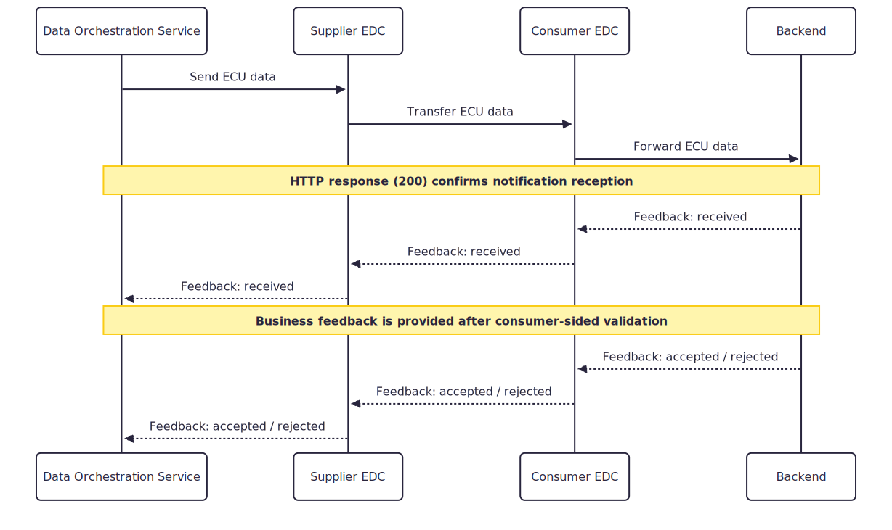
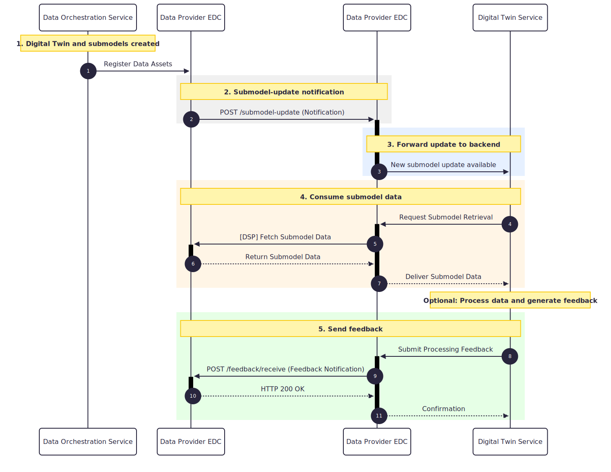
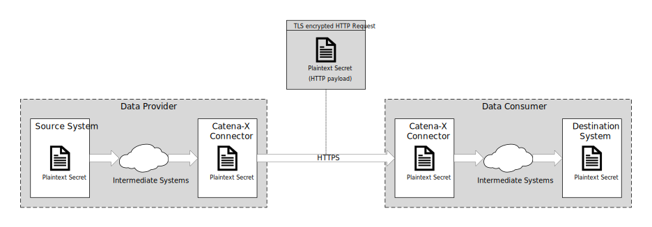
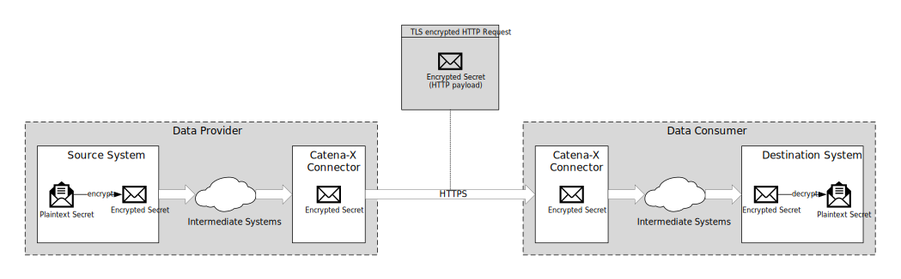

# CX-0161 ECU Crypto Material v1.0.0

## ABSTRACT

This standard defines the rules for participating in the ECU Crypto Material use case within the Catena-X ecosystem. It specifies the aspect model for ECU-related cryptographic material, the data exchange (Push Notification or Digital Twin Pull), and the associated policies required to exchange cryptographic material — such as Certificate Signing Requests (CSRs), keys, and certificates — between Data Providers (e.g., ECU suppliers) and Data Consumers (e.g., OEMs) in a standardized, sovereign, and interoperable manner.

## FOR WHOM IS THE STANDARD DESIGNED

This standard is relevant for Data Providers, Data Consumers and Business Application Providers that participate in the ECU Crypto Material use case.

## 1 INTRODUCTION

There is a growing need for standardized cryptographic information exchange related to Electronic Control Units (ECUs). Such information is required both to verify the authenticity of an ECU and to provide secure access to protected debugging or development functionalities. This use case focuses on establishing a unified format for sharing this sensitive data.

A key benefit arises for ECU manufacturers, who currently must provide similar information to many customers, e.g. OEMs (Original Equipment Manufacturer), through different interfaces, models, and interpretations. The lack of uniformity increases effort, complexity, and the risk of miscommunication. By defining a standardized format that can also be supported by Business Application Providers, this approach enables significant harmonization, reduces integration overhead, and improves interoperability across the ecosystem.

### 1.1 AUDIENCE & SCOPE

> *This section is non-normative*

This standard is relevant for Data Providers, Data Consumers and Business Application Providers.

In scope is the harmonization of data transfer between a Data Provider and a Data Consumer, meaning the data transfer from, e.g. a supplier (Tier-1) to a customer (OEM). The standard covers:

- The aspect model for CryptoMaterial
- The aspect model for SoftwareInformation
- The notification-based (push) API for transmitting ECU-related cryptographic material and receiving detailed business feedback
- Asset structures and usage policies for sovereign data exchange via Digital Twins

Not in scope is:

- Data transfer or communication between Electronic Control Units (ECU-to-ECU).
- End-to-end payload encryption mechanisms (which must be bilaterally agreed upon by Data Provider and Data Consumer — see [Section 1.2.3](#123-security-considerations)).

### 1.2 CONTEXT AND ARCHITECTURE FIT

> *This section is non-normative*

The ECU Crypto Material standard defines a structured data model that enables the exchange of ECU-related cryptographic information. This information is shared between a Data Provider and a Data Consumer.

The architecture allows a pull-based and push-based pattern:

- Data can be pushed from Data Provider to Data Consumer using the notifications according to CX-0151 Industry Core: Basics
- Data can be made accessible by the Data Provider via Digital Twins. Data Consumers query or request the information when needed.

This standalone standard enables harmonized data transfer using common aspect models.

#### 1.2.1 Crypto Material Push

The following sequence diagram illustrates the end-to-end data flow for the ECU Crypto Material push within the Catena-X ecosystem. It shows how ECU-related data is transferred from the provider-side system through the respective connectors to the consumer-side processing system, and how feedback is propagated back to the originator.

The process consists of two feedback phases. The first technical feedback (http-response) must be generated automatically. The second business-level feedback is optional.

An initial technical acknowledgement (“received”), confirming that the data has been successfully delivered to the consumer-side processing pipeline.

A subsequent business-level feedback (“accepted” or “rejected”), indicating the actual processing result of the ECU data.

Both feedback messages are propagated transparently through the EDCs or a CX-0018 compatible implementation back to the originating system, ensuring full traceability and synchronization of processing states between provider and consumer.



The term DOS in this context is used as a placeholder for the system that handles the ECU communication on the provider side. This may be a Manufacturing Execution System (MES), but it may equally be any other backend or application component responsible for preparing, sending, receiving, or processing ECU-related data and feedback. This can include a self-managed in-house solution as well as a solution provided and operated by a service provider.

#### 1.2.2 Crypto Material Pull

The following sequence diagram illustrates an example of the end-to-end data flow for the ECU Crypto Material pull within the Catena-X ecosystem. It shows how ECU-related data is obtained by a Data Consumer and connected to a processing system. The Data Consumer **SHOULD** generate a feedback notification in response to the processing results to inform the Data Provider about the validation result.



#### 1.2.3 Security Considerations

The ECU Crypto Material standard enables the exchange of cryptographic material between a Data Provider and a Data Consumer.
Since this material may include secret cryptographic keys, its secure transmission must be considered to maintain confidentiality and integrity, as well as ensure the intended security level of the material.



Catena-X provides secure connector-to-connector communication between Data Provider and Data Consumer using HTTPS.
Data transmitted via HTTPS is protected through the Transport Layer Security (TLS) protocol (see [IETF RFC 9110](#62-non-normative-references)).
The negotiation of the TLS version and cipher suite, as well as the encryption and decryption of the data, are handled by the HTTPS implementation of each participant's connector.

However, the security provided by connector-to-connector encryption is in many cases insufficient for the transmission of secret cryptographic material.
While this protects data in transit between connectors, it does not guarantee confidentiality throughout the entire data path.
Connector-to-connector encryption terminates at each participant's connector, meaning that intermediate systems at both the Data Provider's and Data Consumer's side may access secret cryptographic material in plaintext, as it is processed by the connectors and potentially other infrastructure elements.

In addition, the protection mechanism used during transmission must offer a security strength at least equal to the of the cryptographic material itself.
Otherwise, the effective security level of the transmitted cryptographic material is reduced (see [NIST SP 800-57 Part 1 Rev. 5](#62-non-normative-references)).
Such mismatches may occur because TLS versions and cipher suites differ across participants.
TLS 1.3 requires AES-128-GCM (128-bit security), while support for stronger ciphers such as AES-256-GCM or ChaChaPoly1305 (256-bit security) is only recommended (see [IETF RFC 8446](#62-non-normative-references)).
Older TLS versions may permit even weaker legacy ciphers that no longer meet modern security requirements.

To ensure continuous confidentiality from the Data Provider's source system to the Data Consumer's destination system, explicit payload-level end-to-end encryption (E2EE) is recommended.



In this approach, the chosen protection mechanism (e.g., RSA key wrapping, KEM-based encryption, PGP) and the required key exchange procedure (e.g., pre-stablished keys or secure out-of band exchange) must be bilaterally agreed upon by the Data Provider and Data Consumer.
This offers the flexibility to meet specific security requirements - including security level, algorithm selection, and infrastructure constraints - but also means that while the Catena-X transmission process and the data models are specified in this standard, the E2EE protection itself remains Data Provider-Consumer specific.

### 1.3 CONFORMANCE AND PROOF OF CONFORMITY

> *This section is normative*

Since this document describes a set of standards to be fulfilled, participants **MUST** fulfill all normative requirements, such as other Catena-X  standards and the respective conformity assessment criteria in addition to the specific criteria mentioned in this document.

To comply with this standard, the following assessment criteria **MUST** be met:

- The Data Provider / Business Application Provider **MUST** use the defined aspect model(s) in [Section 3](#3-aspect-models).
- Business Application Providers **MUST** prove their conformity by providing an OpenAPI specification of the notification API endpoints described in [Section 4](#4-application-programming-interfaces). A Business Application **MUST** provide the functionality to receive Feedback. If this functionality is used by the Data Consumer it is **OPTIONAL** and must be mutually agreed by the Data Provider and Data Consumer.
- The notification data format **MUST** be compliant with the notification data format defined in [Section 4](#4-application-programming-interfaces), including the standardized MessageHeader as described in CX-0151 Industry Core: Basics.
- Examples of the data asset and contract definition structure in their CX-0018-compliant connector **MUST** correspond to the described structure in [Section 4.2.2](#422-data-asset-structure).

### 1.4 EXAMPLES

The benefit of this standard is to provide Aspect Models which harmonize the necessary data to exchange cryptographic material concerning a physical ECU. This enables a common understanding of necessary data attributes and ECU manufacturers can leverage synergies as the same technical architecture and implementation can be used for different customers with only minor adjustments.

Examples for data models: See according subsection [Section 3](#3-aspect-models).
Examples for APIs: See according subsection [Section 4](#4-application-programming-interfaces).

### 1.5 TERMINOLOGY

> *This section is non-normative*

The following terms are especially relevant for the understanding of the standard:

- ECU: Electronic Control Unit — an embedded computer that controls one or more electrical systems or subsystems in a vehicle.
- CSR: Certificate Signing Request — a request sent to a Certificate Authority (CA) to obtain a digital certificate.
- Notification: In Catena-X, notifications are JSON messages with a standardized data format consisting of a standardized header (defined in CX-0151 Industry Core: Basics) and a use-case-specific content.
- Notification API: A message-based data exchange within Catena-X that supports a set of operations. Each use case defines its own notification API extending the base notification infrastructure.
- Symmetric Key: A secret key shared between all participants in a symmetric cryptographic scheme.
- Private Key: The private key of an asymmetric key pair.
- Public Key: The public key of an asymmetric key pair.
- Digital Certificate: A digital certificate associating an asymmetric public key with the identity of the certificate's subject.
- Secret Material: Any secret cryptographic material not considered a symmetric key or asymmetric private key (e.g. passwords, seed values).

## 2 RELEVANT PARTS OF THE STANDARD FOR SPECIFIC USE CASES

> *This section is normative*

### 2.1 ECU CRYPTO MATERIAL DATA EXCHANGE

#### 2.1.1 LIST OF STANDALONE STANDARDS

To participate in the ECU Crypto Material use case, all participants **MUST** comply with the following standalone standards:

- CX-0001 Participant Agent Registration v1.2
- CX-0018 Dataspace Connectivity v4.1.1
- CX-0127 Industry Core: Part Instance v2.0.2
- CX-0151 Industry Core: Basics v1.0.0
- CX-0152 Policy Constraints for Data Exchange v1.0.0

#### 2.1.2 DATA REQUIRED

The following data **MUST** be provided by Data Providers participating in the ECU Crypto Material use case:

- **ECU Identification Data** (via SerialPart or JustInSequencePart aspect model, see CX-0127 Industry Core: Part Instance): The serialized ECU **MUST** be identified by its Global Assset ID (globalAssetId) and local identifiers including manufacturerId (BPNL of supplier), partInstanceId, and ecuSerialNumber.

- **ECU Cryptographic Material** (via [CryptoMaterial aspect model](#31-aspect-model-cryptomaterial)): The cryptographic material associated with the ECU **MUST** be provided according to the aspect model defined in [Section 3.1](#31-aspect-model-cryptomaterial).

- **ECU Digital Twin Type** (see CX-0127 Industry Core: Part Instance): If a Digital Twin is created for an ECU participating in this use case, the Digital Twin **MUST** represent a PartInstance as defined in CX-0127 Industry Core: Part Instance. The identifiers of the Digital Twin **MUST** comply with the identification requirements of CX-0127 Industry Core: Part Instance.

The following data **MAY** be provided by Data Providers participating in the ECU Crypto Material use case:

- **ECU Software Information** (via [SoftwareInformation aspect model](#32-aspect-model-softwareinformation)): The software information associated with the ECU **MAY** be provided according to the apsect model defined in [Section 3.2](#32-aspect-model-softwareinformation).

#### 2.1.3 DIGITAL TWINS AND SPECIFIC ASSET IDs

The usage of Digital Twins for ECU data is **OPTIONAL** for this use case. The push-based notification mechanism ([Section 4](#4-application-programming-interfaces)) does not require Digital Twins. However, if a Digital Twin is created for an ECU (recommended for cross-use-case reusability), the globalAssetId used in notifications **MUST** match the globalAssetId of the Digital Twin.

If Digital Twins are created for ECUs participating in this use case, the following specific asset IDs **MUST** be provided when registering the Digital Twin (see CX-0127 Industry Core: Basics):

- Key = "ecuSerialNumber": The ECU serial number (OEM-specific serial number format).

Additionally, mandatory and optional specific asset IDs of CX-0127 Industry Core: Basics standard  apply.

The globalAssetId used for the ECU in this use case **MUST** match the globalAssetId of that Digital Twin.

#### 2.1.4 POLICY CONSTRAINTS FOR DATA EXCHANGE

In alignment with our commitment to data sovereignty, a specific framework governing the utilization of data within the Catena-X use cases has been outlined.  As part of this data sovereignty framework, conventions for access policies, for usage policies and for the constraints contained in the policies have been specified in standard 'CX-0152 Policy Constraints for Data Exchange'. This standard document CX-0152 **MUST** be followed when providing services or apps for data sharing/consuming and when sharing or consuming data in the Catena-X ecosystem. What conventions are relevant for what roles named in [1.1 AUDIENCE & SCOPE](#11-audience--scope) is specified in the CX-0152 standard document as well. CX-0152 can be found in the [standard library](https://catenax-ev.github.io/docs/standards/overview).

#### 2.1.5 Usage Policy

The "Asset for Certificate Notifications" included in the CX-0018 compliant implementation of a data consumer **MUST** contain a usage policy as specified below. The legal meaning of this usage policy will be defined and added to the CX-0152 Policy Constraints For Data Exchange standard in release 26.09.

The "rightOperand" for the "leftOperand" "UsagePurpose" **MUST** include the following usage purpose: **'cx.ecu.base:1`**.

Additional more general usage policies **MAY** be included, but all the usage policies **MUST** contain the above mentioned usage purpose as shown below.

``` json
{
  "@context": [
    "http://www.w3.org/ns/odrl.jsonld",
    "https://w3id.org/catenax/2025/9/policy/context.jsonld"
  ],
  "@type": "Set",
  "@id": "ecu-usage-policy",
  "permission": [
    {
      "action": "use",
      "constraint": {
        "and": [
          {
            "leftOperand": "FrameworkAgreement",
            "operator": "eq",
            "rightOperand": "DataExchangeGovernance:1.0"
          },
          {
            "leftOperand": "UsagePurpose",
            "operator": "isAnyOf",
            "rightOperand": "cx.ecu.base:1"
          }
        ]
      }
    }
  ]
}
```

## 3 ASPECT MODELS

> *This section is normative*

### 3.1 ASPECT MODEL "CryptoMaterial"

#### 3.1.1 INTRODUCTION

The "CryptoMaterial" aspect model defines a standardized, interoperable representation of the cryptographic material associated with an ECU instance within the Catena-X ecosystem.

Cryptographic material exchanged through this semantic model includes the cryptographic keys and other cryptographic information used to protect ECU data and functionality, verify an ECU part instances' digital identity, and enable communication with other in-vehicle or backend systems.

The model is designed to flexibly accomodate the diverse cybersecurity concepts used across customers, suppliers, and ECU types.
It accommodates varying types, quantities, formats and combinations of cryptographic material and does not prescribe a rigid configuration, therefore enabling Catena-X participants to represent their individual ECU security architectures within a consistent semantic framework.

#### 3.1.2 SUPPORTED CRYPTOGRAPHIC MATERIAL, FORMATS AND ENCODING

The following sections define the enumerations of the CryptoMaterial aspect model that specify the type, format, and encoding of cryptographic material. This ensures that Data Consumers can unambiguously interpret the payload received from the Data Provider, and that only values compliant to this standard may be transmitted.

The following table provides an overview of the permitted combinations of cryptographic material types, formats and encodings that **MUST** be used in compliance with this standard:

|Type|Format|Base64 Encoding|HEX Encoding|RFC 7468 Encoding|
|----|------|:-------------:|:----------:|:---------------:|
|Symmetric Key|Raw|✔|✔|✖|
|Private Key|PKCS#1|✔|✔|✖|
|Private Key|PKCS#8|✔|✔|✔|
|Public Key|PKCS#1|✔|✔|✖|
|Public Key|PKCS#8|✔|✔|✔|
|Public Key|Subject Public Key Info|✔|✔|✔|
|Public Key|Raw|✔|✔|✖|
|Certificate|X.509v3|✔|✔|✔|
|Certificate Signing Request|PKCS#10|✔|✔|✔|
|Secret Material|Raw|✔|✔|✖|

##### 3.1.2.1 CRYPTOGRAPHIC MATERIAL TYPES

The CryptoMaterial aspect model defines an enumeration specifying the type of cryptographic materials that are transmitted within the payload.
The cryptographic material exchanged through this semantic model **MUST** be of one of the following types:

- **Symmetric Key:**
Secret key shared between all participants in a symmetric cryptographic scheme.

- **Private Key:**
Private key of an asymmetric key pair that is used in an asymmetric cryptographic scheme.

- **Public Key:**
Public key of an asymmetric key pair that is used in an asymmetric cryptographic scheme.

- **Digital Certificate:**
Digital certificate associating an asymmetric public key with the identity of the certificate's subject.

- **Certificate Signing Request:**
Certificate signing request (CSR) for requesting the issuing of a digital certificate to a subject from a certificate authority (CA).

- **Secret Material:**
Any secret cryptographic material that is not considered a symmetric key or asymmetric private key.
Secret cryptographic material includes e.g., passwords, seed values for random number generators, or blobs of secret data.

For a detailed classification of cryptographic keys and other cryptographic information, refer to [NIST SP 800-57 Part 1](#62-non-normative-references).

>**Caution:**
>The Catena-X architecture ensures secure connector-to-connector transmission of data between the Data Provider and Data Consumer (see [section 1.2.3](#123-security-considerations)).\
>However, for secure transmission of Symmetric Keys, Private Keys, and Secret Material from the Data Provider's source system to the Data Consumer's destination system it is advised to explicitly apply appropriate cryptographic protections to the cryptographic material before exchanging it through this aspect model.\
>See [NIST SP 800-57 Part 1](#62-non-normative-references) for guidance on protection requirements and protection mechanisms regarding cryptographic keys and other cryptographic information.*

##### 3.1.2.2 CRYPTOGRAPHIC MATERIAL FORMATS

The CryptoMaterial aspect model defines an enumeration specifying the format of the cryptographic material that is used within the payload.
The cryptographic material exchanged through this semantic model **MUST** be provided in one of the following formats:

- **PKCS#1:**
PKCS#1 ASN.1 structure format for RSA private and public keys, as specified in [IETF RFC 8017](#61-normative-references).

- **PKCS#8:**
PKCS#8 ASN.1 structure format for asymmetric private keys, as specified in [IETF RFC 5958](#61-normative-references).

- **PKCS#10:**
PKCS#10 ASN.1 structure format for certificate signing requests, as specified in [IETF RFC 2986](#61-normative-references).

- **Raw:**
Raw, unformatted binary data.\
For symmetric keys and asymmetric keys this is the binary representation of the key value.

- **Subject Public Key Info:**
`SubjectPublicKeyInfo` ASN.1 structure format for asymmetric public keys, as specified in [IETF RFC 5280](#61-normative-references).

- **X.509v3:**
X.509v3 ASN.1 structure format for digital certificates, as specified in [IETF RFC 5280](#61-normative-references).

##### 3.1.2.3 CRYPTOGRAPHIC MATERIAL ENCODINGS

The CryptoMaterial aspect model defines an enumeration specifying the encoding of the cryptographic material that is used within the payload.
The cryptographic material exchanged through this semantic model **MUST** be represented in one of the following encodings:

- **Base64:**
Textual representation of arbitrary binary data as a string of Base64 characters, as specified in [IETF RFC 4648](#61-normative-references).\
In this standard, the binary ASN.1 structures for the formats PKCS#1, PKCS#8, PKCS#10, `SubjectPublicKeyInfo`, and X.509v3 **MUST** follow the Distinguished Encoding Rules (DER), as specified in [ITU-T X.690](#61-normative-references).
That is, the DER encoded ASN.1 structure is textually represented as a string of Base64 characters.

- **HEX:**
Textual representation of arbitrary binary data as a string of Base16 (also referred to as hexadecimal) characters, as specified in [IETF RFC 4648](#61-normative-references).\
The binary ASN.1 structures for the formats PKCS#1, PKCS#8, PKCS#10, `SubjectPublicKeyInfo`, and X.509v3 **MUST** follow the Distinguished Encoding Rules (DER), as specified in [ITU-T X.690](#61-normative-references).
That is, the DER encoded ASN.1 structure is textually represented as a string of Base16 characters.

- **RFC 7468:**
Textual representation of DER encoded ASN.1 structures, as specified in [IETF RFC 7468](#61-normative-references).\
In this standard, all binary ASN.1 structures supported by RFC 7468 **MUST** follow the Distinguished Encoding Rules (DER), as specified in [ITU-T X.690](#61-normative-references).
That is, the DER encoded ASN.1 structure is textually represented as a string following RFC 7468.

Cryptographic material exchanged through this semantic model **MUST** be textually represented with either Base64 or HEX. Asymmetric cryptographic material exchanged in a format supported by [IETF RFC 7468](#61-normative-references) **MAY** instead be textually represented according to the definition of RFC 7468 specified in this section.

#### 3.1.3 CRYPTOGRAPHIC MATERIALS SET

The property `cryptoMaterials` of the CryptoMaterial aspect model is the set of cryptographic materials associated with an ECU instance, where each cryptographic material is represented as an instance of `CryptoMaterialEntity`.

A Data Provider **MUST** provide at least one valid instance of `CryptoMaterialEntity` in the set `cryptoMaterials` to conform to this standard.

#### 3.1.4 SPECIFICATIONS ARTIFACTS

The modeling of the semantic model specified in this document was done in accordance to the "semantic driven workflow" to create a submodel template specification [SMT](#62-non-normative-references).

This aspect model is written in SAMM 2.2.0 as a modeling language conformant to CX-0003 SAMM Aspect Meta Model as input for the semantic driven workflow.

Like all Catena-X data models, this model is available in a machine-readable format on GitHub conformant to CX-0003 SAMM Aspect Meta Model.

#### 3.1.5 LICENSE

This Catena-X data model is made available under the terms of the Creative Commons Attribution 4.0 International (CC-BY-4.0) license, which is available at Creative Commons.

#### 3.1.6 IDENTIFIER OF SEMANTIC MODEL

The semantic model has the unique identifier

```
urn:samm:io.catenax.ecu_crypto_material:1.0.0#CryptoMaterial
```

#### 3.1.7 FORMATS OF SEMANTIC MODEL

##### 3.1.7.1 RDF TURTLE

The rdf turtle file, an instance of the Semantic Aspect Meta Model, is the master for generating additional file formats and serializations.

```
https://github.com/eclipse-tractusx/sldt-semantic-models/blob/main/io.catenax.crypto_material/1.0.0/CryptoMaterial.ttl
```

The open source command line tool of the Eclipse Semantic Modeling Framework is used for generation of other file formats like for example a JSON Schema, AASX for Asset Administration Shell Submodel Template or a HTML documentation.

##### 3.1.7.2 JSON SCHEMA

JSON schema can be generated from the RDF Turtle file.

##### 3.1.7.3 AASX

An AASX file can be generated from the RDF Turtle file.
The AASX file defines one of the requested artifacts for a Submodel Template Specification conformant to [SMT](#62-non-normative-references).

#### 3.1.8 EXAMPLES

Example JSON payload of submodel CryptoMaterial v1.0.0:

```json
{
    "globalAssetId": "urn:uuid:f21DFa1a-cbA1-eB99-172a-d8Cfb3Dc5D8f",
    "cryptoMaterials": [
        {
      "name": "ecuIdentityCsr",
      "type": "certificateSigningRequest",
      "value": "-----BEGIN CERTIFICATE REQUEST-----\nMIIBtzCCAT0CAQAwgZ8xDTALBgNVBCsMBDIwMjUxEzARBgNVBAgMClByb2R1Y3Rp...yVXgPMvdmc33ot8=\n-----END CERTIFICATE REQUEST-----",
      "format": "pkcs10",
      "encoding": "rfc7468"
    },
        {
      "name": "theftProtectionKey",
      "type": "publicKey",
      "value": "-----BEGIN PUBLIC KEY-----\nMCowBQYDK2VwAyEAyWrIP9K0XexXQxzCZq1EX4Ottktjkxo6M/2unXM5mCs=\n-----END PUBLIC KEY-----",
      "format": "subjectPublicKeyInfo",
      "encoding": "rfc7468"
    },
    {
      "name": "jtagPassword",
      "type": "secretData",
      "value": "YERl3qqILxAa7hSvhutJ3g==",
      "format": "raw",
      "encoding": "base64"
    },
    {
      "name": "vkmsInitialKey",
      "type": "symmetricKey",
      "value": "3bc531687977cbfaf2e78446cdc8518340188007ddd2b3fa06622b57302c8542",
      "format": "raw",
      "encoding": "hex"
    }
    ]
}
```

### 3.2 ASPECT MODEL "SoftwareInformation"

#### 3.2.1 INTRODUCTION

The "SoftwareInformation" aspect model defines a standardized, interoperable representation of all software components associated with an ECU part instance within the Catena-X ecosystem.

This aspect model captures the essential information that characterizes the software components deployed or flashed onto an ECU part instance, ensuring traceability of software configurations across customers and suppliers.

Data Providers and Data Consumers participating in the ECU-related data exchange defined in this standard **MAY** use the aspect model SoftwareInformation.

#### 3.2.2 SPECIFICATIONS ARTIFACTS

The modeling of the semantic model specified in this document was done in accordance to the "semantic driven workflow" to create a submodel template specification [SMT](#62-non-normative-references).

This aspect model is written in SAMM 2.1.0 as a modeling language conformant to CX-0003 SAMM Aspect Meta Model as input for the semantic driven workflow.

Like all Catena-X data models, this model is available in a machine-readable format on GitHub conformant to CX-0003 SAMM Aspect Meta Model.

#### 3.2.3 LICENSE

This Catena-X data model is made available under the terms of the Creative Commons Attribution 4.0 International (CC-BY-4.0) license, which is available at Creative Commons.

#### 3.2.4 IDENTIFIER OF SEMANTIC MODEL

The semantic model has the unique identifier

```
urn:samm:io.catenax.software_information:1.0.0#SoftwareInformation
```

#### 3.2.5 FORMATS OF SEMANTIC MODEL

##### 3.2.5.1 RDF TURTLE

The rdf turtle file, an instance of the Semantic Aspect Meta Model, is the master for generating additional file formats and serializations.

```
https://github.com/eclipse-tractusx/sldt-semantic-models/blob/main/io.catenax.software_information/1.0.0/SoftwareInformation.ttl
```

The open source command line tool of the Eclipse Semantic Modeling Framework is used for generation of other file formats like for example a JSON Schema, AASX for Asset Administration Shell Submodel Template or a HTML documentation.

##### 3.2.5.2 JSON SCHEMA

JSON schema can be generated from the RDF Turtle file.

##### 3.2.5.3 AASX

An AASX file can be generated from the RDF Turtle file.
The AASX file defines one of the requested artifacts for a Submodel Template Specification conformant to [SMT](#62-non-normative-references).

#### 3.2.6 EXAMPLES

Example JSON payload of submodel SoftwareInformation v1.0.0:

```json
{
    "globalAssetId" : "urn:uuid:454ffa8e-f88d-4ad1-be45-06981756aeb1",
    "softwareInformation" : [
        {
            "name" : "ECU Software XY12345",
            "softwareId" : "SW12345678",
            "version" : "1.2.0",
            "lastModifiedOn" : "2023-03-21T08:17:29.187Z"
        }
    ]
}
```

## 4 APPLICATION PROGRAMMING INTERFACES

> *This section is normative*

This standard allows the data either to be pushed from a Data Provider to a Data Consumer or to be appended as submodels to a Digital Twin the Data Consumer **SHOULD** consume. The Data Provider and Data Consumer can mutually agree on one way or the other. A Data Provider and a Data Consumer **MUST** agree on one data transfer process described in this standard.
In general the provisioning of detailed business feedback and the possibility to receive said feedback is **RECOMMENDED** but not **MANDATORY**. The feedback notification is identical and independent from the chosen data transfer process (push notification or Digital Twin Pull).
The Data Provider **SHOULD** ensure that access to the Digital Twin is limited to the intended Data Consumer to mitigate the risk of processing feedback notifications from non-authorized third parties.

Notifications are, in contrast to classical pull-based data offers in Catena-X, a mechanism to actively push ECU-related information from a Data Provider to a Data Consumer. Within the ECU standard, this API enables the transmission of ECU data and the asynchronous exchange of status feedback between participants. The interface therefore supports both the submission of ECU information and the subsequent update of the processing status following a predefined state model — for example, whether a submission was accepted or rejected.

This API is defined in accordance with the notification API framework of CX-0151 Industry Core: Basics. The Digital Twin Event API defined in CX-0151 Industry Core: Basics is only a reference example; for the push notification, the ECU Crypto Material use case defines its own notification API with use-case-specific endpoints and content as specified below. The standardized MessageHeader from CX-0151 Industry Core: Basics **MUST** be used for all notifications.

It is important to note that the API standardized in this standard is not a central service. Instead, it **MUST** be implemented by each participant as part of their solution or solution stack compliant with the ECU Crypto Material standard in order to enable the reception and processing of ECU data within the Catena-X dataspace.

Accordingly, this chapter describes the ECU exchange API, including the relevant endpoints that **MUST** be implemented by participants to receive ECU data and process feedback messages. It also explains how these interfaces are integrated into the Catena-X dataspace infrastructure. [Section 4.2 ECU CRYPTO MATERIAL NOTIFICATION API](#42-ecu-crypto-material-notification-api) covers sending and receiving Crypto Material push and update notifications, while [Section 4.4 PULLING DATA IN ECU CRYPTO MATERIAL](#44-pulling-data-in-ecu-crypto-material) elaborates the pull based mechanism implementing the standardized Digital Twin Event API. [Section 4.5 ECU CRYPTO MATERIAL FEEDBACK](#45-ecu-crypto-material-feedback) expands on the feedback which **SHOULD** be provided by a Data Consumer.

In addition, this chapter describes the structure of the corresponding data assets that participants **MUST** expose in order to receive ECU-related messages and status updates. Since the ECU exchange process includes bidirectional communication, the transfer of ECU-related information followed by feedback from the receiving party, both participating entities **MUST** provide the necessary data assets and a linkage to their respective APIs.

### 4.1 PRECONDITIONS AND DEPENDENCIES

The ECU Crypto Material Notification API **MUST** be published towards the network using a Data Asset/Contract Definition in terms of the IDSA Protocol as described by the reference implementation CX-0018 Dataspace Connectivity.

The CX-0018 Dataspace Connectivity compliant connector **MUST** act as a reverse proxy towards those APIs, as it holds the Data Offers linked to the respective implemented endpoints.

### 4.2 ECU CRYPTO MATERIAL NOTIFICATION API

Finally, this section defines the payload structure used to transfer ECU-related information, including identifiers for the serialized ECU, software information, and cryptographic material, enabling consistent and interoperable data exchange across participants in the Catena-X ecosystem.

 The ECU Crypto Material Notification API supports four notification operations:

1. ReceiveCryptoMaterial: Used by the Data Provider (e.g., Tier-1 supplier) to push ECU identification data and cryptographic material to the Data Consumer (e.g., OEM). The Data Consumer **MUST** provide this endpoint.

2. ReceiveCryptoMaterialUpdate: Used by the Data Provider (e.g., Tier-1 supplier) to push updates for already transferred ECU identification data and cryptographic material to the Data Consumer (e.g., OEM). The Data Consumer **MUST** provide this endpoint.

3. SubmodelUpdate: Used by the Data Provider (e.g., Tier-1 supplier) to send a list of submodel updates to the Data Consumer. Submodel updates can be of type create, update or delete. The Data Consumer **SHOULD** provide this endpoint, if the option to transfer data using Digital Twins was agreed by the Data Consumer and the Data Provider.

4. ReceiveCryptoMaterialFeedback: Used by the Data Consumer (e.g., OEM) to push processing feedback back to the Data Provider (e.g., Tier-1 supplier). The Data Provider **SHOULD** provide this endpoint.

#### 4.2.1 API SPECIFICATION

##### 4.2.1.1 API-ENDPOINTS

The ECU Crypto Material Notification API **MUST** be implemented as specified in the OpenAPI documentation. It is **OPTIONAL** to implement the endpoint paths exactly as described below, since these endpoints are not called from any supply chain partner directly but via the Tractus-X EDC or any other CX-0018 compatible implementation as part of data assets.

The API **MAY** be implemented as specified in the [openAPI](./assets/ecu-api.yml) documentation. This is a reference implementation.

The following endpoints **MUST** be defined:

|Operation|HTTP Method|Suggested Path|operationId|
|---------|-----------|--------------|-----------|
|Receive Crypto Material|POST|/receive|ReceiveCryptoMaterial|
|Receive Crypto Material Update|POST|/update|ReceiveCryptoMaterialUpdate|

The following endpoint **SHOULD** be defined:

|Operation|HTTP Method|Suggested Path|operationId|
|---------|-----------|--------------|-----------|
|Submodel Update|POST|/submodel-update|SubmodelUpdate|
|Receive Feedback|POST|/feedback/receive|ReceiveCryptoMaterialFeedback|

If the feedback functionality is implemented the provided guidelines in this standard **MUST** be followed.

##### 4.2.1.2 AVAILABLE DATA TYPES

The ECU Crypto Material Notification API **MUST** use JSON as the payload transported via HTTP.

##### 4.2.1.3 API RESOURCES & ENDPOINTS

The HTTP POST endpoints introduced in this standard **MUST** be called via Data Space Protocol.

The sending and receiving of notifications **MUST** be built on the basis of HTTP POST endpoints.

#### 4.2.2 DATA ASSET STRUCTURE

The Data Provider (e.g., supplier) and Data Consumer (e.g., OEM) **MUST** both register the following asset to receive data, submodel updates and feedback for the exchanged data.

```json
{
  "@context": {
    "cx-common": "https://w3id.org/catenax/ontology/common#",
    "cx-taxo": "https://w3id.org/catenax/taxonomy#",
    "dct": "http://purl.org/dc/terms/"
  },
  "@type": "Asset",
  "@id": "CryptoMaterialNotificationApi",
  "properties": {
    "dct:type": {
      "@id": "cx-taxo:CryptoMaterialNotificationApi"
    },
    "cx-common:version": "1.0"
  },
  "dataAddress": {
    "@type": "DataAddress",
    "type": "HttpData",
    "baseUrl": "{{httpServerWhichOffersTheHttpEndpoints}}",
    "proxyBody": true,
    "proxyPath": true,
    "proxyMethod": true
  }
}
```

#### 4.2.3 ERROR HANDLING

HTTP response codes follow the pattern recommended in CX-0151 Industry Core: Basics. The following codes **MUST** be defined for all notification operations.

The following HTTP response codes **MUST** be defined for the HTTP POST endpoint to receive an ECU Crypto Material Notification:

| Code |Description                                                                                                                                                                                                             |
|------|-------------------------------------------------------------------------------------------------------------------------------------------------------------------------------------------------------------------------|
| 200  | Notification was received successfully (technical acknowledgement).                                                                                                                                                                        |
| 400  | Request body was malformed                                                                                                                                                                                              |
| 401  | Not authorized                                                                                                                                                                                                          |
| 403  | Forbidden                                                                                                                                                                                                               |
| 405  | Method not allowed                                                                                                                                                                                                |
| 409  | A notification with the same messageId already exists.                                                                              |
| 422  | Notification cannot be accepted due to semantic reasons (e.g., ECU not known to receiver).                                                                              |

The following HTTP response codes **MUST** be defined for the HTTP POST endpoint to receive a Feedback Notification (receive-ecu-crypto-material-feedback):

| Code |Description                                                                                                                                                                                                             |
|------|-------------------------------------------------------------------------------------------------------------------------------------------------------------------------------------------------------------------------|
| 200  | Notification was received successfully (technical acknowledgement).                                                                                                                                                                        |
| 400  | Request body was malformed                                                                                                                                                                                              |
| 401  | Not authorized                                                                                                                                                                                                          |
| 403  | Forbidden                                                                                                                                                                                                               |
| 404  | The referenced relatedMessageId does not exist.                                                                                                                                                                                                  |
| 405  | Method not allowed                                                                               |

### 4.3 PUSHING DATA IN ECU CRYPTO MATERIAL

In the push-based transfer, the Data Provider (e.g., Tier-1 supplier) actively initiates the data exchange by sending the ECU information directly to the Data Consumers (e.g., OEM) notification endpoint (/receive).

The Data Provider **MUST** use the ReceiveCryptoMaterial operation to transmit the initial data set after an agreed time between Data Provider and Data Consumer. If information changes after the initial transmission (e.g., a software re-flash or certificate renewal), the Data Provider **MUST** use the ReceiveCryptoMaterialUpdate operation.

The payload **MUST** include the MessageHeader as defined in CX-0151 Industry Core: Basics. The content section of the notification **MUST** contain the specific cryptographic keys, certificates, and software identifiers associated with the physical ECU's globalAssetId as depicted in the example of [Section 4.3.1](#431-pushing-data-in-ecu-crypto-material-example)

#### 4.3.1 PUSHING DATA IN ECU CRYPTO MATERIAL EXAMPLE

```json
{
  "header": {
    "messageId": "3b4edc05-e214-47a1-b0c2-1d831cdd9ba9",
    "context": "CryptoMaterial-DataPushNotification:1.0.0",
    "sentDateTime": "2026-03-17T10:15:00Z",
    "senderBpn": "BPNL000000000001",
    "receiverBpn": "BPNL000000000002",
    "expectedResponseBy": "2026-03-20T10:15:00Z",
    "version": "3.0.0"
  },
  "content": {
    "listOfItems": [
      {
        "globalAssetId": "urn:uuid:f21dfa1a-cba1-eb99-172a-d8cfb3dc5d8f",
        "listOfData": [
          {
            "semanticId": "urn:samm:io.catenax.crypto_material:1.0.0#CryptoMaterial",
            "submodel": {
              "globalAssetId": "urn:uuid:f21dfa1a-cba1-eb99-172a-d8cfb3dc5d8f",
              "cryptoMaterials": [
                {
                  "name": "ecuIdentityCsr",
                  "type": "certificateSigningRequest",
                  "value": "-----BEGIN CERTIFICATE REQUEST-----\nMIIBtzCCAT0CAQAw...\n-----END CERTIFICATE REQUEST-----",
                  "format": "pkcs10",
                  "encoding": "rfc7468"
                },
                {
                  "name": "theftProtectionKey",
                  "type": "publicKey",
                  "value": "-----BEGIN PUBLIC KEY-----\nMCowBQYDK2VwAyEA...\n-----END PUBLIC KEY-----",
                  "format": "subjectPublicKeyInfo",
                  "encoding": "rfc7468"
                }
              ]
            }
          },
          {
            "semanticId": "urn:samm:io.catenax.serial_part:3.0.0#SerialPart",
            "submodel": {
              "globalAssetId": "urn:uuid:f21dfa1a-cba1-eb99-172a-d8cfb3dc5d8f",
              "localIdentifiers": [
                {
                  "key": "manufacturerId",
                  "value": "BPNL000000000001"
                },
                {
                  "key": "partInstanceId",
                  "value": "220115001384267902201978150063581180"
                },
                {
                  "key": "ecuSerialNumber",
                  "value": "220115001384267902201978150063581180"
                }
              ],
              "manufacturingInformation": {
                "date": "2026-03-01T08:15:30Z",
                "country": "DEU",
                "sites": [
                  {
                    "catenaXsiteId": "BPNS000000000001",
                    "function": "production"
                  }
                ]
              },
              "partTypeInformation": {
                "manufacturerPartId": "ECU-4711",
                "nameAtManufacturer": "Engine Control Unit"
              }
            }
          },
          {
            "semanticId": "urn:samm:io.catenax.software_information:1.0.0#SoftwareInformation",
            "submodel": {
              "globalAssetId": "urn:uuid:f21dfa1a-cba1-eb99-172a-d8cfb3dc5d8f",
              "softwareInformation": [
                {
                  "name": "Bootloader",
                  "softwareId": "SW-BOOT-001",
                  "version": "1.0.0",
                  "lastModifiedOn": "2026-02-15T11:22:33Z"
                },
                {
                  "name": "Application Firmware",
                  "softwareId": "SW-APP-002",
                  "version": "4.2.1",
                  "lastModifiedOn": "2026-02-28T07:45:00Z"
                }
              ]
            }
          }
        ]
      }
    ]
  }
}
```

### 4.4 PULLING DATA IN ECU CRYPTO MATERIAL

In the pull-based transfer process, the Data Consumer retrieves ECU-related information by interacting with the Data Provider’s Digital Twin Registry and Submodel Servers. This mechanism leverages the standardized Catena-X Digital Twin framework to ensure data persistence and accessibility.

#### 4.4.1 Digital Twin Requirements

For business relationships requiring pull-based access, the Data Provider **SHOULD** create one Digital Twin per physical ECU instance in accordance with CX-0002: Digital Twins in Catena-X.

To be compliant with this use case, the Digital Twin **MUST** include:

- A SerialPart or JustInSequence submodel to provide the unique hardware identity.
- A CryptoMaterial submodel containing the necessary cryptographic assets.

An optional SoftwareInformation submodel **MAY** be appended to provide firmware context.

#### 4.4.2 SUBMODEL UPDATE TRIGGER

Unlike traditional pull-based scenarios where the consumer periodically polls for data, this standard **RECOMMENDS** an active trigger to ensure synchronization.

The Data Provider **SHOULD** initiate the process by sending a SubmodelUpdate notification to the Data Consumer's endpoint. This notification acts as a "signal" that a Digital Twin or a specific submodel has been created or updated.

Upon receipt of this notification, the Data Consumer **SHOULD** perform the following steps:

Resolve the Digital Twin: Use the globalAssetId provided in the notification to locate the asset in the Data Provider's Digital Twin Registry.

Retrieve Submodels: Establish a contract and pull the CryptoMaterial and/or SoftwareInformation submodel data via the Data Provider’s EDC or CX-0018 compatible implementation.

##### 4.4.2 SUBMODEL UPDATE EXAMPLE

The following payload represents the trigger sent by the Data Provider to notify the Data Consumer that new ECU data is available for retrieval.

```json
{
  "header": {
    "messageId": "urn:uuid:4390FF3a-FF0c-DCBc-0cAD-F3B69FD9f9B2",
    "context": "CryptoMaterial-SubmodelUpdate:3.0.0",
    "sentDateTime": "2007-08-31T16:47+00:00",
    "senderBpn": "BPNLXAo7uVTsASoj",
    "receiverBpn": "BPNLN8D9H3qwn7lS",
    "expectedResponseBy": "2007-08-31T16:47+00:00",
    "relatedMessageId": "urn:uuid:f7A0A0d9-B9e7-eC7F-582C-D78Fd3Bb9642",
    "version": "3.0.0"
  },
  "content": {
    "information": "List of events about the creation, update, or deletion of submodels of digital twins.",
    "listOfEvents": [
      {
        "eventType": "CreateSubmodel",
        "globalAssetId": "urn:uuid:d32d3b55-d222-41e9-8d19-554af53124dd",
        "submodelSemanticId": "urn:samm:io.catenax.serial_part:3.0.0#SerialPart"
      },
      {
        "eventType": "CreateSubmodel",
        "globalAssetId": "urn:uuid:d33g3z35-n621-21p8-7y29-332st85122lp",
        "submodelSemanticId": "urn:samm:io.catenax.crypto_material:1.0.0#CryptoMaterial"
      }
    ]
  }
}
```

##### 4.4.3 Processing Acknowledgement

After the Data Consumer has successfully retrieved and processed the submodel data from the Data Provider’s infrastructure, they **SHOULD** provide a feedback notification as specified in [Section 4.5](#45-ecu-crypto-material-feedback) to close the communication loop.

#### 4.5 ECU CRYPTO MATERIAL FEEDBACK

The Data Consumer **SHOULD** provide feedback to the Data Provider for the obtained and potentially processed submodel data. Independent of whether the data has been pushed to the Data Consumer via the /receive endpoint or a Digital Twin pull of the Data Consumer, feedback **MUST** be provided using the /feedback/receive endpoint. The Data Provider **MUST** match the received feedback via the globalAssetId a matching submodel.

Optional feedback **MAY** be returned as a list detailing the processing status of prior notifications and submodel data (via ```statusCode```). As standardized error codes are currently out of scope, they **MAY** be agreed upon between the Data Provider and Data Consumer.

##### 4.5.1 ECU CRYPTO MATERIAL FEEDBACK Example

```json
{
  "header": {
    "messageId": "urn:uuid:83738f3d-9441-4e53-bc7d-6092385d188f",
    "context": "CryptoMaterial-Feedback:1.0.0",
    "sentDateTime": "2026-03-17T10:20:00Z",
    "senderBpn": "BPNL000000000002",
    "receiverBpn": "BPNL000000000001",
    "expectedResponseBy": "2026-03-20T10:20:00Z",
    "relatedMessageId": "urn:uuid:3b4edc05-e214-47a1-b0c2-1d831cdd9ba9",
    "version": "3.0.0"
  },
  "content": {
    "listOfItems": [
      {
        "globalAssetId": "urn:uuid:d32d3b55-d222-41e9-8d19-554af53124dd",
        "status": "OK",
        "statusMessage": "The crypto material was successfully processed.",
        "statusCode": "ECU_001"
      }
    ]
  }
}
```

## 5 PROCESSES

> *This section is normative*

There is no process definition in this standard version available.

## 6 REFERENCES

### 6.1 NORMATIVE REFERENCES

> *This section is normative*

To participate in ECU-related data exchange, the following single standards **MUST** be fulfilled by all participants for which the standard is relevant:

- CX-0001 Participant Agent Registration v1.2
- CX-0002 Digital Twins in Catena-X v2.3.0
- CX-0018 Dataspace Connectivity v4.1.1
- CX-0127 Industry Core: Part Instance v2.0.2
- CX-0151 Industry Core: Basics v1.0.0
- CX-0152 Policy Constrains for Data Exchange v1.1.0
- [IETF RFC 2886](https://www.rfc-editor.org/rfc/rfc2986.html) PKCS #10: Certification Request Syntax Specification Version 1.7
- [IETF RFC 4648](https://www.rfc-editor.org/rfc/rfc4648.html) The Base16, Base32, and Base64 Data Encodings
- [IETF RFC 5280](https://www.rfc-editor.org/rfc/rfc5280.html) Internet X.509 Public Key Infrastructure Certificate and Certificate Revocation List (CRL) Profile
- [IETF RFC 5958](https://www.rfc-editor.org/rfc/rfc5958.html) Asymmetric Key Packages
- [IETF RFC 7468](https://www.rfc-editor.org/rfc/rfc7468.html) Textual Encodings of PKIX, PKCS, and CMS Structures
- [IETF RFC 8017](https://www.rfc-editor.org/rfc/rfc8017.html) PKCS #1: RSA Cryptography Sepcification Version 2.2
- [ITU-T X.690](https://www.itu.int/rec/T-REC-X.690/en) Information Technology - ASN.1 Encoding Rules: Specification of Basic Encoding Rules (BER), Canonical Encoding Rules (CER) and Distinguished Encoding Rules (DER)

### 6.2 NON-NORMATIVE REFERENCES

> *This section is non-normative*

- [Catena-X Operating Model](https://catenax-ev.github.io/docs/next/operating-model/why-introduction)
- [IETF RFC 1421](https://www.rfc-editor.org/rfc/rfc1421.html) Privacy Enhancement for Internet Electronic Mail: Part I: Message Encryption and Authentication Procedures
- [IETF RFC 5208](https://www.rfc-editor.org/rfc/rfc5208) Public-Key Cryptography Standards (PKCS) #8: Private-Key Information Syntax Specification Version 1.2
- [IETF RFC 8446](https://www.rfc-editor.org/rfc/rfc8446) The Transport Layer Security (TLS) Protocol Version 1.3
- [IETF RFC 9110](https://www.rfc-editor.org/rfc/rfc9110.html) HTTP Semantics
- [NIST SP 800-57 Part 1 Rev. 5](https://csrc.nist.gov/pubs/sp/800/57/pt1/r5/final) Recommendation for Key Management: Part 1 - General
- CX-0125 Traceability Use Case v2.2.1 — for reference implementation of notification-based data exchange patterns

### 6.3 REFERENCE IMPLEMENTATIONS

> *This section is non-normative*

Reference implementations for the notification-based data exchange pattern can be found in the Traceability KIT and related Tractus-X repositories. The notification infrastructure established for Quality Notifications (CX-0125) can be reused as a technical baseline for the ECU Crypto Material Notification API.

The used API is provided [here](./assets/ECU-API.yml) as a reference implementation.

## Legal

Copyright © 2026 Catena-X Automotive Network e.V. All rights reserved. For more information, please visit [here](/copyright).
