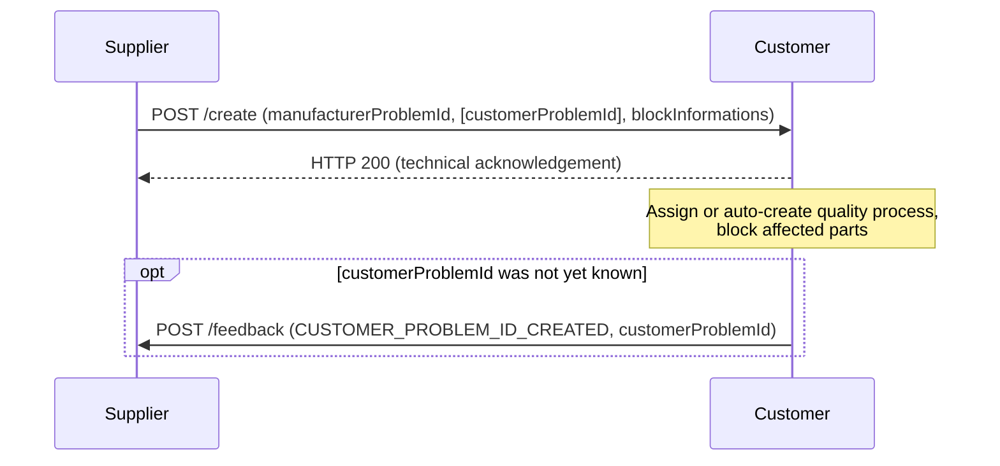
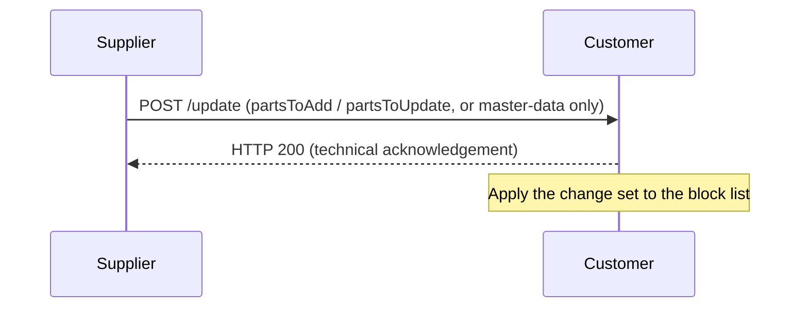
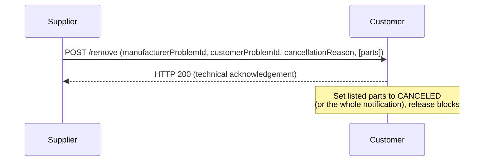
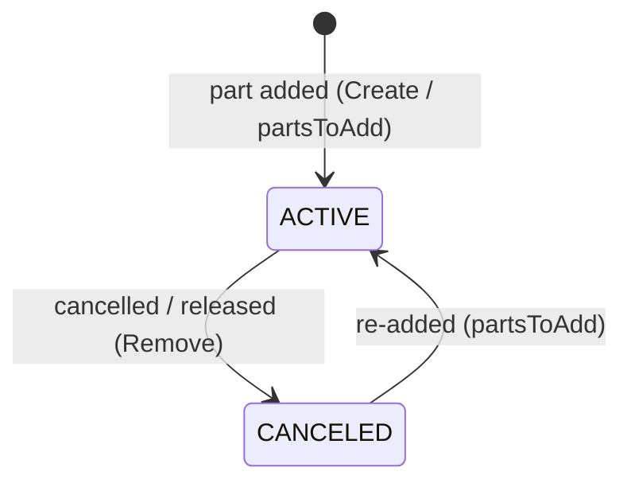

---
tags:
  - CAT/Data Provider & Consumer
  - CAT/Block
  - CAT/Quality Management
---

# CX-0164 Blocking Notifications v1.0.0

## ABSTRACT

This standard defines the exchange of block notifications between supply chain partners within the Catena-X dataspace. The blocking process enables suppliers to notify their customers about non-conforming parts that must be segregated or quarantined to prevent their use in the production process.

Block Notifications were previously specified as part of CX-0125 Traceability Standard. With the decomposition of CX-0125 into standalone standards, the Block Notification becomes an independent, self-contained standard.
Version 1.0.0 of CX-0164 introduces a Create / Update / Remove operation model plus an asynchronous Feedback channel. The "Read" of CRUD is intentionally omitted (the use case is push-only), and deletion is modelled as a reversible **Remove** that sets the affected parts to block status CANCELED rather than hard-deleting them. The API is compliant with CX-0151 Industry Core: Basics v1.0.0.
CX-0164 is a standalone standard and no longer requires CX-0125.

## FOR WHOM IS THE STANDARD DESIGNED

This standard is relevant for Business Application Providers, Data Providers, and Data Consumers who need to exchange block notifications for quality management purposes.

## 1 INTRODUCTION

### 1.1 AUDIENCE & SCOPE

> *This section is non-normative*

#### AUDIENCE

This standard is relevant for the following roles:

- **Data Provider**: Suppliers (or service providers acting on their behalf) sending block notifications to their customers
- **Data Consumer**: Customers receiving block notifications from their suppliers
- **Business Application Provider**: Providers of block-notification applications implementing the Block Notification API
- **Conformity Assessment Body**: Organizations certifying implementations against this standard

#### SCOPE

This document covers:

- The Block Notification API with Create, Update and Remove operations and Feedback
- Data models for block notifications including part-level block information
- The problem reference correlation model (`manufacturerProblemId` / `customerProblemId`)
- Connector asset structure compliant with CX-0151
- Process flows for blocking, updating, cancelling and feedback

### 1.2 CONTEXT AND ARCHITECTURE FIT

> *This section is non-normative*

The block process is a time-critical quality management process in the automotive industry. When a defect is identified, either by the supplier (self-disclosure) or by the customer (complaint), the supplier must delimit the affected parts and communicate this delimitation ("blacklist") to the customer as fast as possible, so the customer can sort out parts at goods receipt, block them on the shopfloor, or trigger downstream measures for parts already built into products.

Today this is frequently handled via Excel lists sent by e-mail or uploaded to customer portals, which is slow, error-prone and lacks reliable versioning. The Block Notification replaces this with a standardized, machine-readable exchange via the Catena-X dataspace.

The Block Notification API enables:

1. **Suppliers** to send block information to customers about defective parts
2. **Customers** to identify and block affected parts in their systems (e.g., at assembly lines or in logistics)
3. **Both parties** to track problem references and processing results
4. **Business Feedback** to be exchanged asynchronously (e.g. returning the customer reference)

This standard requires compliance with:

- CX-0018 Dataspace Connectivity for secure data exchange
- CX-0151 Industry Core: Basics for notification API structure and message header
- CX-0152 Policy Constraints for Data Exchange

### 1.3 CONFORMANCE AND PROOF OF CONFORMITY

> *This section is non-normative*

As well as sections marked as non-normative, all authoring guidelines, diagrams, examples, and notes in this specification are non-normative. Everything else in this specification is normative.

The key words **MAY**, **MUST**, **MUST NOT**, **OPTIONAL**, **RECOMMENDED**, **REQUIRED**, **SHOULD** and **SHOULD NOT** in this document are to be interpreted as described in BCP 14 RFC2119, RFC8174 when, and only when, they appear in all capitals, as shown here.

All participants and their solutions MUST implement and adhere to this standard to be certified for the Block Notifications use case.

### 1.4 EXAMPLES

> *This section is non-normative*

#### Example: Create Block Notification

> In this example `customerProblemId` is empty. The customer returns the generated reference via the Feedback message below; after that, every Update and Remove MUST carry **both** identifiers.

```json
{
  "header": {
    "messageId": "urn:uuid:f9a97301-a000-44dd-b9d8-78488a40c6bb",
    "context": "Blocking-BlockNotificationAPI-Create:1.0.0",
    "sentDateTime": "2024-07-05T08:13:33.207Z",
    "senderBpn": "BPNL000000000AAA",
    "receiverBpn": "BPNL000000000ZZZ",
    "version": "3.0.0"
  },
  "content": {
    "manufacturerProblemId": "SUP-2026-GB-0451",
    "customerProblemId": "",
    "problemDescription": "Gearboxes from production batch GB-2026-04 lose oil while driving due to faulty seal ring. Immediate blocking required.",
    "criticality": "URGENT",
    "proposedUsageDecision": "SCRAPPING",
    "supplierContactPerson": {
      "firstName": "Max",
      "lastName": "Mustermann",
      "email": "max.mustermann@company.com",
      "phone": "+49-170-1234567"
  },
    "blockInformations": [
      {
        "catenaXId": "urn:uuid:a3d0ce1a-ae83-21e6-9e9d-ec7b60ec6fad",
        "componentLevelContainment": {
          "manufacturingLocationId": "BPNAgHsSh1xydiD4",
          "integrationLevel": "S18A-19-03-400",
          "customerPartId": "884267902",
          "localIdentifiers": [
            { "key": "manufacturerId", "value": "BPNL0123456777777" },
            { "key": "partInstanceId", "value": "SN12345678" }
          ]
        },
        "periodAndVolumeLevelContainment": {
          "sizeOfProductionLot": { "itemUnit": "unit:piece", "quantityValue": 500 },
          "deliveryNoteNumber": "68988545",
          "packageNumber": "12295140916130",
          "deliveryPlace": "22610",
          "deliveryDate": "2024-07-01T00:00:00Z",
          "numberOfPartsPerDeliveryNote": { "itemUnit": "unit:piece", "quantityValue": 100 },
          "productionDate": "2024-06-28T00:00:00Z",
          "numberOfPartsPerPackage": { "itemUnit": "unit:piece", "quantityValue": 10 },
          "orderNumber": "7334663"
         },
        "locationInTheContainer": {
          "xPosition": "F",
          "yPosition": "10",
          "smallLoadCarrierLayer": "53BUN6555599345283155+000000008"
        }
      }
    ]
  }
}
```

#### Example: Feedback (Customer reference created)

```json
{
  "header": {
    "messageId": "urn:uuid:32ab2ecd-3edf-40cb-b37c-4ece34e0decd",
    "context": "Blocking-BlockNotificationAPI-Feedback:1.0.0",
    "sentDateTime": "2026-06-05T09:02:11.000Z",
    "senderBpn": "BPNL000000000ZZZ",
    "receiverBpn": "BPNL000000000AAA",
    "relatedMessageId": "urn:uuid:f9a97301-a000-44dd-b9d8-78488a40c6bb",
    "version": "3.0.0"
  },
  "content": {
    "feedbackType": "CUSTOMER_PROBLEM_ID_CREATED",
    "manufacturerProblemId": "SUP-2026-GB-0451",
    "customerProblemId": "SN-26-DP3-BC5"
  }
}
```

#### Example: Update

```json
{
  "header": {
    "messageId": "urn:uuid:83738f3d-9441-4e53-bc7d-6092385d188f",
    "context": "Blocking-BlockNotificationAPI-Update:1.0.0",
    "sentDateTime": "2026-06-06T10:00:00.000Z",
    "senderBpn": "BPNL000000000AAA",
    "receiverBpn": "BPNL000000000ZZZ",
    "relatedMessageId": "urn:uuid:f9a97301-a000-44dd-b9d8-78488a40c6bb",
    "version": "3.0.0"
  },
  "content": {
    "manufacturerProblemId": "SUP-2026-GB-0451",
    "customerProblemId": "SN-26-DP3-BC5",
    "partsToAdd": [
      {
        "catenaXId": "urn:uuid:6f8c1d2e-3a4b-4c5d-8e9f-0a1b2c3d4e5f",
        "componentLevelContainment": {
          "manufacturingLocationId": "BPNAgHsSh1xydiD4",
          "customerPartId": "884267902",
          "localIdentifiers": [
            { "key": "manufacturerId", "value": "BPNL0123456777777" },
            { "key": "partInstanceId", "value": "SN12345679" }
          ]
        }
      }
    ],
    "partsToUpdate": [
      {
        "catenaXId": "urn:uuid:a3d0ce1a-ae83-21e6-9e9d-ec7b60ec6fad",
        "componentLevelContainment": {
          "manufacturingLocationId": "BPNAgHsSh1xydiD4",
          "customerPartId": "884267902",
          "manufacturerPartId": "GB-2026-04-SEAL",
          "localIdentifiers": [
            { "key": "manufacturerId", "value": "BPNL0123456777777" },
            { "key": "partInstanceId", "value": "SN12345678" }
          ]
        }
      }
    ]
  }
}
```

#### Example: Remove (cancel parts — "free for production")

```json
{
  "header": {
    "messageId": "urn:uuid:2b7c9e10-4d5f-4a6b-8c7d-9e0f1a2b3c4d",
    "context": "Blocking-BlockNotificationAPI-Remove:1.0.0",
    "sentDateTime": "2026-06-09T07:15:00.000Z",
    "senderBpn": "BPNL000000000AAA",
    "receiverBpn": "BPNL000000000ZZZ",
    "version": "3.0.0"
  },
  "content": {
    "manufacturerProblemId": "SUP-2026-GB-0451",
    "customerProblemId": "SN-26-DP3-BC5",
    "cancellationReason": "Re-inspection cleared these parts; released for production.",
    "parts": [
      { "catenaXId": "urn:uuid:a3d0ce1a-ae83-21e6-9e9d-ec7b60ec6fad" }
    ]
  }
}
```

> Omitting `parts` cancels the **entire** block notification instead of individual parts.

### 1.5 TERMINOLOGY

> *This section is non-normative*

| Term | Description |
|------|-------------|
| Block Notification | A notification sent from a supplier to a customer indicating that certain parts should be blocked/quarantined due to quality issues |
| Manufacturer Problem ID | Unique identifier assigned by the supplier's quality management system to track the blocking problem on their side. Format example: `SUP-2026-GB-0451` |
| Customer Problem ID | Unique identifier assigned by the customer's quality management system to track the blocking problem on their side. Format example: `SN-26-DP3-BC5` |
| Problem ID Correlation | The persisted link between `manufacturerProblemId` and `customerProblemId`, enabling cross-partner problem tracking and reliable update handling |
| Block Status | Derived per-part state (`ACTIVE` or `CANCELED`); not transmitted as a field, but inferred from the operation (Create / `partsToAdd` → ACTIVE, Remove → CANCELED) |
| Catena-X ID | The globally unique identifier of a serialized part or batch within the Catena-X dataspace |
| Delivery Place | Identifier of the receiving location, composed of plant code and unloading point of the customer |
| Feedback | Asynchronous response from the notification receiver to the sender |

## 2 RELEVANT PARTS OF THE STANDARD FOR SPECIFIC USE CASES

### 2.1 BLOCK NOTIFICATIONS

#### 2.1.1 LIST OF STANDALONE STANDARDS

The following standards are referenced and MUST be implemented:

| Standard | Version | Description |
|----------|---------|-------------|
| CX-0018 | v3.0.0 or higher | Dataspace Connectivity |
| CX-0151 | v1.0.0 or higher | Industry Core: Basics **message header (MessageHeaderAspect) and notification-exchange framework only**; the Digital Twin provisioning is NOT required but recommended |
| CX-0152 | v1.0.0 or higher | Policy Constraints for Data Exchange |

Optional Standards (RECOMMENDED for enhanced functionality):

| Standard | Version | Description |
|----------|---------|-------------|
| CX-0002 | v2.2.0 or higher | Digital Twins in Catena-X (for Catena-X ID resolution) |
| CX-0127 | v2.0.0 or higher | Industry Core: Part Instance (for part identification semantics) |

#### 2.1.2 DATA REQUIRED

Problem Reference Concept

Every Block Notification carries up to two problem references:

| Attribute | Created by | Meaning |
|-------|------------|-------------|
| `manufacturerProblemId` | Supplier / Service provider system | Supplier-side reference of the blocking problem. MUST be stable across all messages (Create, Update, Remove) of the same problem|
| `customerProblemId` | Customer | Customer-side reference of the corresponding quality process (e.g. self-notification ID or issue/complaint ID).                  |

Rules:

1. The supplier MUST generate a `manufacturerProblemId` when creating a Block Notification and MUST reuse it in all subsequent Update and Remove operations for the same problem.
2. If a customer-side reference is already known to the supplier, the supplier MUST provide it as `customerProblemId` in the Create operation.
3. If no customer-side reference exists yet, the supplier MUST send the Create operation with an empty (or omitted) `customerProblemId`. The customer SHOULD create a corresponding quality process automatically and MUST return the generated `customerProblemId` to the supplier via a Feedback operation with `feedbackType: CUSTOMER_PROBLEM_ID_CREATED`.
4. Once the supplier has received the `customerProblemId`, all subsequent Update and Remove operations for this problem MUST contain both `manufacturerProblemId` and `customerProblemId`. This prevents the customer from creating duplicate quality processes.
5. The supplier (or its service provider) MUST persist the mapping `manufacturerProblemId` ↔ `customerProblemId`.

**Field Requirements by Operation:**

##### Create Operation

| Field | Requirement | Description |
|-------|------------|-------------|
| `manufacturerProblemId` | **MANDATORY** | Unique identifier assigned by supplier |
| `customerProblemId` | **OPTIONAL** | Customer-side problem reference; empty if no customer-side reference exists yet |
| `problemDescription` | **MANDATORY** | Detailed description of quality issue |
| `blockInformations` | **MANDATORY** | At least one entry; each entry identifies exactly one part by `catenaXId` (**MANDATORY**). All parts in a Create are implicitly ACTIVE, so no `blockStatus` is carried at Create |
| `criticality` | **MANDATORY** | Severity classification: `LOW`, `MEDIUM`, `HIGH`, `URGENT` |
| `proposedUsageDecision` | **RECOMMENDED** | Supplier recommendation on how to handle the affected parts: `SCRAPPING`, `REWORK`, `RETURN_TO_SUPPLIER`, `USE_AS_IS`, `PENDING_DECISION` |
| `supplierContactPerson` | **RECOMMENDED** | Contact for clarifications: `firstName`, `lastName`, `email` (MANDATORY within the object), `phone` (OPTIONAL) |
| `componentLevelContainment` | **RECOMMENDED** | Enables precise part identification |
| `periodAndVolumeLevelContainment` | **RECOMMENDED** | Enables batch-level tracking |

**Note:** At least one of `componentLevelContainment` or `periodAndVolumeLevelContainment` SHOULD be provided.

##### Update Operation

| Field | Requirement | Description |
|-------|------------|-------------|
| `manufacturerProblemId` | **MANDATORY** | References original notification |
| `customerProblemId` | **MANDATORY** once known | MUST be included as soon as it has been returned to the supplier via Feedback; ensures updates run on the same process |
| `problemDescription`, `criticality`, `proposedUsageDecision`, `supplierContactPerson` | **OPTIONAL** | Master-data fields; any may be changed after Create (e.g. re-prioritising by raising `criticality`) |
| `partsToAdd` | **OPTIONAL** | Parts to add to the blocking list. Each item carries the full block information from the Create operation; identification by `catenaXId` is **MANDATORY**. Added parts are implicitly ACTIVE |
| `partsToUpdate` | **OPTIONAL** | Parts whose attributes / containment data change. `catenaXId` is **MANDATORY**; the provided block information fully replaces the stored values (no merge). Block status is **not** changed here — use the Remove operation to cancel a part |

> A message with no `partsToAdd` / `partsToUpdate` (only master-data fields) signals a **master-data-only update**.

##### Remove Operation

The Remove operation **cancels** parts — it sets the affected parts to block status **CANCELED** ("released / free for production"). Removal is therefore always a reversible cancellation, never a hard delete; the parts remain in the record marked CANCELED.

| Field | Requirement | Description |
|-------|------------|-------------|
| `manufacturerProblemId` | **MANDATORY** | Identifies the notification |
| `customerProblemId` | **MANDATORY** once known | Customer-side problem reference |
| `cancellationReason` | **MANDATORY** | Justification for audit trail |
| `parts` | **OPTIONAL** | Catena-X IDs of the parts to cancel. If omitted, the **entire** block notification is cancelled |

##### Technical Acknowledgement vs. Business Feedback

Two response channels are distinguished and MUST NOT be mixed:

- **Technical acknowledgement (synchronous, transport level):** the receiver answers the HTTP POST with `200 OK` (message received and schema-valid) or a `4xx`/`5xx` error (see 4.1.4). This is the “message has arrived” signal. It carries no business semantics.
- **Business Feedback (asynchronous, Feedback operation):** used only for business outcomes — the generated `customerProblemId` (`CUSTOMER_PROBLEM_ID_CREATED`) or a business-level rejection (`feedbackType: ERROR`). Business outcomes are asynchronous because the receiver's quality management system processes the message after consumption.

#### 2.1.3 ADDITIONAL REQUIREMENTS

1. All data exchange MUST occur via a CX-0018 compliant connector
2. Usage Policies MUST be defined according to CX-0152
3. The sender MUST generate a unique `messageId` (UUIDv4) for each notification that MUST NOT be reused
4. The `context` field MUST follow the pattern `Blocking-BlockNotificationAPI-<Operation>:1.0.0`
5. `relatedMessageId` is **OPTIONAL** on all operations. Update, Remove and Feedback are correlated to the problem via `manufacturerProblemId` (carried in the content of every message); `relatedMessageId` MAY additionally reference a specific message (e.g. the initial Create, or — for Feedback — the message being answered).
6. The header field `version` refers to the version of the message header aspect model (currently `3.0.0` per CX-0151) and MUST NOT be confused with the API/context version.
7. **Idempotency and ordering:** Receivers MUST process messages of the same problem (`manufacturerProblemId`) in the order given by `sentDateTime`. A message whose `messageId` has already been processed MUST be ignored idempotently (duplicate delivery is safe). Re-sending the same Create or Update MUST NOT create duplicates.
**Authorization:** Update, Remove and Feedback operations for a problem MUST originate from the same business partner (`BPNL`) as the corresponding initial exchange — Update/Remove from the `senderBpn` of the initial Create, Feedback from its `receiverBpn`.

#### 2.1.4 DIGITAL TWINS AND SPECIFIC ASSET IDs

Every part referenced in a block notification MUST be identified by its Catena-X ID (`catenaXId`). The `catenaXId` is a globally unique UUID valid in the Catena-X dataspace; **it is mandatory and exists independently of whether a Digital Twin has been provisioned for the part.** Providing a `catenaXId` therefore does NOT require the partner to have rolled out Digital Twins.

Integration with Digital Twins (OPTIONAL):

- If parts have Digital Twins registered per CX-0002, the `catenaXId` used in the block notification SHOULD match the Digital Twin ID
- Receivers MAY use the Digital Twin Registry to resolve additional part information
- The Digital Twin MAY contain traceability-relevant submodels as defined in CX-0127

When Digital Twins are not available:

- The `catenaXId` is still provided (it is independent of the Digital Twin) and remains the primary identifier
- The `localIdentifiers` array and the containment fields SHOULD additionally be provided to ease part identification on the receiver side

#### 2.1.5 MESSAGE CHUNKING FOR LARGE NOTIFICATIONS

A single block notification can describe a very large blocking list (e.g. a blacklist with many thousands of serialized parts). Data pipelines in the dataspace enforce a maximum message size, so a large list MUST be split into several smaller messages that share the same `manufacturerProblemId`.

The chunking sequence is **Create-then-Update**:

1. The sender opens the problem with **one Create** message carrying the first chunk of parts in `blockInformations` (together with the master-data fields `manufacturerProblemId`, `problemDescription`, `criticality`, …).
2. The sender then transmits every remaining chunk with a separate **Update** message, placing the additional parts in the `partsToAdd` array. Each Update repeats the same `manufacturerProblemId` (and the `customerProblemId` once known) and carries its own unique `messageId`.

Only the first message of a problem is a Create; all subsequent chunk messages are Updates. The receiver treats the parts additively and aggregates them under the shared problem reference. Duplicate entries are handled idempotently (see 2.1.3, rule 7).

> The maximum parts per message is driven by the agreed pipeline message-size limit, not by a fixed count. Partners SHOULD agree the limit out of band; senders SHOULD chunk proactively rather than rely on rejection.

## 3 ASPECT MODELS

### 3.1 ASPECT MODEL "BlockNotification"

#### 3.1.1 INTRODUCTION

The Block Notification aspect model defines the data structure for exchanging block information between supply chain partners. It consists of a header (MessageHeaderAspect v3.0.0) and content-specific schemas for each operation.

#### 3.1.2 SPECIFICATIONS ARTIFACTS

The Block Notification API uses the following aspect models and schemas:

| Schema | Description |
|--------|-------------|
| `BlockNotificationCreate` | Request schema for creating a new block notification |
| `BlockNotificationUpdate` | Request schema for updating a block notification (`partsToAdd` / `partsToUpdate` + master-data fields) |
| `BlockNotificationRemove` | Request schema for the Remove operation (cancel parts or the whole notification) |
| `BlockNotificationFeedback` | Request schema for sending feedback on a notification |

|Enumeration         |Values                                                                      |
|--------------------|----------------------------------------------------------------------------|
|`Criticality`       |`LOW`, `MEDIUM`, `HIGH`, `URGENT`                                          |
|`UsageDecision`     |`SCRAPPING`, `REWORK`, `RETURN_TO_SUPPLIER`, `USE_AS_IS`, `PENDING_DECISION`|
|`FeedbackType`      |`CUSTOMER_PROBLEM_ID_CREATED`, `ERROR`                 |

#### 3.1.3 LICENSE

This Catena-X data model is made available under the terms of the Creative Commons Attribution 4.0 International (CC-BY-4.0) license, which is available at Creative Commons.

#### 3.1.4 IDENTIFIER OF SEMANTIC MODEL

The semantic model uses the following identifiers for context:

| Operation | Context Identifier |
|-----------|-------------------|
| Create | `Blocking-BlockNotificationAPI-Create:1.0.0` |
| Update | `Blocking-BlockNotificationAPI-Update:1.0.0` |
| Remove | `Blocking-BlockNotificationAPI-Remove:1.0.0` |
| Feedback | `Blocking-BlockNotificationAPI-Feedback:1.0.0` |

#### 3.1.5 FORMATS OF SEMANTIC MODEL

The data format MUST be JSON (`application/json`).

Each notification message MUST consist of:

- **header**: Compliant with MessageHeaderAspect v3.0.0
- **content**: Operation-specific payload

All timestamps MUST be formatted per ISO 8601 with timezone designator. All BPNs MUST comply with the Catena-X BPN format (BPNL/BPNS/BPNA).

## 4 APPLICATION PROGRAMMING INTERFACES

### 4.1 BLOCK NOTIFICATION API

#### 4.1.1 PRECONDITIONS AND DEPENDENCIES

Before implementing the Block Notification API:

1. Both parties MUST be registered participants in the Catena-X dataspace
2. A CX-0018 compliant connector MUST be deployed
3. Usage Policies according to CX-0152 MUST be defined
4. The `BlockNotificationAPI` asset MUST be registered in the connector

#### 4.1.2 API SPECIFICATION

The Block Notification API defines four operations:

| Operation | Method | Context | Direction |
|-----------|--------|---------|-----------|
| Create | POST | `Blocking-BlockNotificationAPI-Create:1.0.0` | Supplier → Customer |
| Update | POST | `Blocking-BlockNotificationAPI-Update:1.0.0` | Supplier → Customer |
| Remove | POST | `Blocking-BlockNotificationAPI-Remove:1.0.0` | Supplier → Customer |
| Feedback | POST | `Blocking-BlockNotificationAPI-Feedback:1.0.0` | Customer → Supplier |

All operations MUST use HTTP POST method only, as per CX-0151 requirements.

**Operation quick reference — which operation to use for which intent:**

| Business intent | Operation | Endpoint | Where in the payload |
|-----------------|-----------|----------|----------------------|
| Open a new block notification | Create | `/create` | `blockInformations` |
| Add further part(s) to an existing notification | Update | `/update` | `partsToAdd` |
| Change a part's attributes / containment data | Update | `/update` | `partsToUpdate` |
| Change notification master data (description, criticality, contact, usage decision) | Update | `/update` | master-data fields |
| Cancel / release a part — "free for production" | Remove | `/remove` | `parts` |
| Cancel the entire notification | Remove | `/remove` | omit `parts` |
| Return the `customerProblemId` or reject | Feedback | `/feedback` | `feedbackType` |

##### Create Operation

Creates a new block notification with associated block information.

- **Direction**: Supplier → Customer
- **Required Fields**: `manufacturerProblemId`, `problemDescription`, `criticality`, `blockInformations`
- **Response**: HTTP 200 = technical acknowledgement (received & valid); business outcomes via the asynchronous Feedback operation. In Case 2 the customer MUST return `feedbackType: CUSTOMER_PROBLEM_ID_CREATED` with the generated `customerProblemId`.

##### Update Operation

Updates an existing block notification. Parts are added via `partsToAdd` and changed via `partsToUpdate`:

- **`partsToAdd`**: parts to add to the block list. Each item carries the full block information from the Create operation (identification by `catenaXId` is mandatory). Added parts are implicitly ACTIVE.
- **`partsToUpdate`**: parts whose attributes / containment data change. `catenaXId` is mandatory; the provided block information fully replaces the stored values (no merge). Block status is **not** changed here — use the Remove operation to cancel a part.

Master-data fields (`problemDescription`, `criticality`, `proposedUsageDecision`, `supplierContactPerson`) MAY also be updated. A message with no `partsToAdd` / `partsToUpdate` (only master-data fields) is a **master-data-only update**.

- **Direction**: Supplier → Customer
- **Required Fields**: `manufacturerProblemId` (and `customerProblemId` once known)

##### Remove Operation

Cancels parts of a block notification by setting them to block status **CANCELED** ("released / free for production"); removal is always a reversible cancellation, never a hard delete. The `parts` array lists the Catena-X IDs to cancel; if it is omitted, the **entire** notification is cancelled. A `cancellationReason` MUST be provided for the audit trail.

- **Direction**: Supplier → Customer
- **Required Fields**: `manufacturerProblemId`, `cancellationReason` (and `customerProblemId` once known)

##### Feedback Operation

Provides structured feedback from the receiver to the sender — returning the generated `customerProblemId` or a business-level rejection. `relatedMessageId` is OPTIONAL; the feedback is correlated to the problem via `manufacturerProblemId` and MAY additionally reference the message it responds to.

The OpenAPI specification is available at: [block-notification-api-v1.0.0.yaml](./assets/block-notification-api-v1.0.0.yaml)

#### 4.1.3 EDC DATA ASSET STRUCTURE

Per CX-0151, exactly **one** connector asset MUST be defined for the Block Notification API:

```json
{
  "@id": "BlockNotificationAPI",
  "@type": "Asset",
  "properties": {
    "dct:type": {
      "@id": "https://w3id.org/catenax/taxonomy#BlockNotificationAPI"
    },
    "cx-common:version": "1.0"
  },
  "dataAddress": {
    "@type": "DataAddress",
    "type": "HttpData",
    "baseUrl": "https://your-backend.example.com/block-notification"
  },
  "@context": {
    "dct": "http://purl.org/dc/terms/",
    "cx-taxo": "https://w3id.org/catenax/taxonomy#",
    "cx-common": "https://w3id.org/catenax/ontology/common#"
  }
}
```

> **Note**: Separate assets for Receive and Update are no longer required. All operations are invoked through the single `BlockNotificationAPI` asset.

#### 4.1.4 ERROR HANDLING

The HTTP response to the POST is the **technical acknowledgement** (“message arrived”). The following codes MUST be supported:

| Code | Status | Description |
|------|--------|-------------|
| 200 | OK | Notification was processed successfully |
| 4xx | Client Error | Notification could not be processed due to client error (e.g., malformed request, authentication failure) |
| 5xx | Server Error | Notification could not be processed due to server-side error |

The technical acknowledgement carries no business semantics. Business outcomes (created customer reference, business-level rejection) MUST be communicated asynchronously via the Feedback operation.

## 5 PROCESSES

### 5.1 NOTIFICATION PROCESS

#### 5.1.1 ACTORS AND ROLES

| Actor | Role | Description |
|-------|------|-------------|
| Supplier | Sender | Initiates block notifications; sends Create, Update, Remove operations |
| Customer | Receiver | Receives block notifications; blocks affected parts; sends Feedback |

#### 5.1.2 PROCESS REPRESENTATION

##### Create Flow



##### Update Flow



##### Remove (Cancel) Flow



##### Block Status Lifecycle

Block status is a **per-part** attribute and is not carried as a field in any payload; it is derived from the operations: a part is ACTIVE once it appears in a Create or in `partsToAdd`, and becomes CANCELED when it is cancelled via the Remove operation. There is no notification-level status — the operation is conveyed by the `context` field.



- **ACTIVE**: part identified as defective, must be blocked by the customer
- **CANCELED**: block for this part has been lifted (e.g., the part was found to be safe)

## 6 REFERENCES

### 6.1 NORMATIVE REFERENCES

| Reference | Description |
|-----------|-------------|
| CX-0018 Dataspace Connectivity | Connector requirements for data exchange |
| CX-0151 Industry Core: Basics | Notification API base requirements |
| CX-0152 Policy Constraints for Data Exchange | Usage policy requirements |
| RFC 2119 | Key words for use in RFCs to Indicate Requirement Levels |
| RFC 8174 | Ambiguity of Uppercase vs Lowercase in RFC 2119 Key Words |

### 6.2 NON-NORMATIVE REFERENCES

| Reference | Description |
|-----------|-------------|
| OpenAPI Specification 3.1.1 | REST API specification standard |
| ISO 8601 | Date and time format |
| UUID RFC 4122 | Universally Unique Identifier specification |

### 6.3 REFERENCE IMPLEMENTATIONS

Reference implementations are available in the Tractus-X ecosystem:

- **Trace-X**: Open-source reference application

## ANNEXES

### FIGURES

- Figure 1: Create Flow Sequence
- Figure 2: Update Flow Sequence  
- Figure 3: Remove Flow Sequence
- Figure 4: Status Model (block status)

### TABLES

- Table 1: Referenced Standards
- Table 2: API Operations
- Table 3: Block Status Values
- Table 4: HTTP Response Codes

## Legal

Copyright © 2026 Catena-X Automotive Network e.V. All rights reserved. For more information, please visit [here](/copyright).
