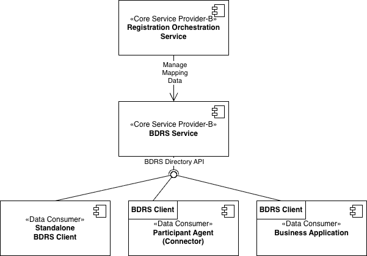

# CX-0167 BPN-DID Resolution v.1.0.0

## ABSTRACT

This standard specifies the BPN-DID Resolution Service (BDRS) as central core service that provides mapping information
between companies BPN-Ls and the matching DID under which they are reachable within the Catena-X dataspace

## FOR WHOM IS THE STANDARD DESIGNED

The standard is designed for everybody who wants to understand the process of how a Data Consumer can get access to the
offerings of a Data Provider based on the company name of the Data Provider. The mechanism described in this standard
is part of this journey. Further steps are described in [CX-0018](#dataspace-connectivity).

## 1 INTRODUCTION

### 1.1 AUDIENCE & SCOPE

> *This section is non-normative*

For certification:

- Core Service Provider-B - This role must certify against the standard

For implementation:

- Business Application Providers
- Enablement Service Providers

### 1.2 CONTEXT AND ARCHITECTURE FIT

> *This section is non-normative*

The following diagram shows a deployment view of the BDRS service embedded into the relevant
dataspace components:

The BDRS service is classified as Core Service-B. Itsdata is managed by other Core Services-B like the Registration
Orchestration Service for new Data Consumer/Provider. The service provides the `BDRS Directory API` which
allows access to the mapping data.

BDRS clients are operated by Enablement Service or Business Application Providers as part of their service
architecture. BDRS clients are used by Data Consumers to initiate the technical process of a data transfer

The client uses the `BDRS Directory API` to synchronize the whole mapping data into the local environment, so that
they can be used for local request without exposing concrete information about data transfer partners outside of
its execution context.

BDRS clients, thereby can be a standalone service instance, but are typically a component
in an existing service. E.g., the Eclipse Tractus-X EDC, the reference implementation of a participant agent
(see [CX-0018](#dataspace-connectivity)) contains a BDRS client and provides higher level APIs, that integrate
BDRS calls into the general discovery functionality.

### 1.3 CONFORMANCE AND PROOF OF CONFORMITY

> *This section is non-normative*

As well as sections marked as non-normative, all authoring guidelines, diagrams, examples, and notes
in this specification are non-normative. Everything else in this specification is normative.

The key words **MAY**, **MUST**, **MUST NOT**, **OPTIONAL**, **RECOMMENDED**, **REQUIRED**, **SHOULD**
and **SHOULD NOT** in this document are to be interpreted as described in BCP 14 [RFC2119] [RFC8174]
when, and only when, they appear in all capitals, as shown here.

Certification for this standard is only required for a Core Service Provider-B, as this role has to provide
evidence of a working solution. All other roles may use the provided api, but do not have to certify against
this standard. As it is an API specification, the conformance has to be proven by the execution of test cases
described in the CACs of this standard.

### 1.4 TERMINOLOGY

> *This section is non-normative*

The following terms are used within the normative section of the standard

- BPN-L: The Business Partner Number of the legal entity as defined in [CX-0010](#business-partner-number)
- DID: The DID of the legal entity used to participate in the Catena-X dataspace. The DID is defined in
  [CX-0049](#did-document)
- Onboarding: The process under which a company becomes member of the Catena-X dataspace.
- BPN-DID Resolution Service: The service defined by this standard.
- BDRS: Commonly used abbreviation for the Bpn-Did Resolution Service
- Core Service-B: A service that can only be executed once in a dataspace to provide seed functionality needed to
  operate the dataspace
- Core Service Provider-B: The service provider role for Core Services-B
- Enablement Service Provider: The role responsible to execute basic network services for a Data Provider/Consumer
- Business Application Provider: The role responsible for the execution of a business application that supports a
  certain use case within the Catena-X dataspace for a Data Provider/Consumer
- Data Consumer: The consuming dataspace participant acting as Data Provider/Consumer
- Data Provider: The providing dataspace participant acting as Data Provider/Consumer
- Verifiable Presentation: A cryptographic artefact, that contains Verifiable Credentials of the holder, signed by
  the holder of the credentials, see [CX-0050](#cx-specific-credentials)
- Catena-X Membership Credential: The Verifiable Credential issued by the Core Service Provider-B to provide
  evidence concerning the membership in the Catena-X dataspace by the holder, see [CX-0050](#cx-specific-credentials)

## 2 MAIN CONTENT

> *This section is normative*

The `BPN-DID Resolution Service` (short `BDRS`) is a Core Service-B that MUST be provided by the Core Service Provider-B. It
offers mapping information between the BPN-L and the corresponding DID of a legal entity. This is needed a Data Consumer to
initiate the technical process of a data transfer in cases where only the BPN-L of the Data Provider is known.

The Core Service Provider-B MUST keep the service data up-to-date, i.e., if companies are onboarded or leave the dataspace,
the corresponding mapping MUST be added/removed from the service data. The mechanism to maintain the data is out-of-scope for
this standard.

The `BDRS service` is used by `BDRS client apps`. A `BDRS client app` MUST synchronize the complete mapping data and
act as local storage for the mapping data. The app MUST provide access to single mappings to consumers that need a concrete mapping.
The mechanism to access a single mapping is out-of-scope for this standard.x

The `BDRS service` MUST exclusively provide mapping data for onboarded legal entites referenced by their BPN-Ls (as
defined in [CX-0010](#business-partner-number)). The mapped DIDs MUST furthermore follow the requirements of
[CX-0049](#did-document) and they MUST be the DIDs used or created during the Onboarding Process of the corresponding legal entity,
see [CX-0006](#onboarding-process).

### 2.1 Retrieving the mapping information from the BDRS

A `BDRS service` MUST provide an endpoint that allows to retrieve all known mappings at once in a GZipped binary stream. This endpoint
is used by `BDRS client apps` to retrieve the mapping data.

The endpoint specification is described in this [OpenApi spec](./assets/directory-api.yaml).

#### Authentication

The access to the defined endpoint is protected by the Membership Credential. For authentication and authorization
purposes, a service implementation of the relevant endpoint MUST accept a `bearer` token in the `Authorization` header
with the following properties:

- The token MUST be a Verifiable Presentation that contains the Catena-X Membership Credential as defined in
  [CX-0050](#cx-specific-credentials).

The `BDRS service` MUST check the validity of the provided Membership Credential, e.g., correct type, not expired,
not revoked, properly signed by a trusted issuer. If validity check fails, access to the mapping data MUST be denied.

## 3 REFERENCES

### 3.1 NORMATIVE REFERENCES

#### Onboarding Process

- [CX-0006 Registration and Initial Onboarding](https://catenax-ev.github.io/docs/standards/CX-0006-RegistrationAndInitialOnboarding)

#### Business Partner Number

- [CX-0010 Business Partner Number](https://catenax-ev.github.io/docs/standards/CX-0010-BusinessPartnerNumber)

#### DID Document

- [CX-0049 DID Document](https://catenax-ev.github.io/docs/standards/CX-0049-DIDDocumentSchema)

#### CX-Specific Credentials

- [CX-0050 Catena-X specific Credentials](https://catenax-ev.github.io/docs/standards/CX-0050-CXSpecificCredentials)

### 3.2 NON-NORMATIVE REFERENCES

> *This section is non-normative*

#### Dataspace Connectivity

- [CX-0018 Dataspace Connectivity](https://catenax-ev.github.io/docs/standards/CX-0018-DataspaceConnectivity)

### 3.3 REFERENCE IMPLEMENTATIONS

> *This section is non-normative*

- In the [bpn-did-resolution-service](https://github.com/eclipse-tractusx/bpn-did-resolution-service) repository
  of Eclipse Tractus-X, you find a reference implementation for this standard.
- In the [tractusx-edc](https://github.com/eclipse-tractusx/tractusx-edc) repository, a BDRS client implementation
  is available. The component is implemented as an EDC
  [extension](https://github.com/eclipse-tractusx/tractusx-edc/tree/main/edc-extensions/bdrs-client)

## ANNEXES

### FIGURES

> *This section is non-normative*

- Figure 1: The deployment architecture of the BDRS service network
- Figure 2: The OpenAPI Spec of the BDRS Directory API
  
## Legal

Copyright © 2026 Catena-X Automotive Network e.V. All rights reserved. For more information, please see [Catena-X Copyright Notice](https://catenax-ev.github.io/copyright).
