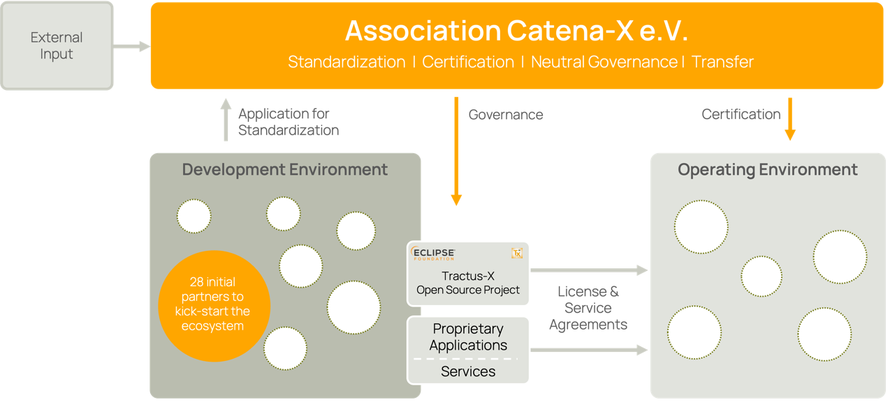

# Catena-X Ecosystem

The Catena-X ecosystem consists of three areas

1. The Catena-X Automotive Network e.V.
2. The development environment
3. The operating environment

## The Catena-X Ecosystem

The **Catena-X Automotive Network e.V.** (in the following called 'association') is responsible for standardization, certifications, and governance of the Catena-X ecosystem. The association embraces the following industry partners:

- Direct partners (e.g., OEMs, suppliers, recyclers)
- Indirect partners (e.g., business application and service providers)
- Consulting partners (e.g., research institutes, transfer centers)

Members can participate in working groups to actively shape the Catena-X ecosystem.

The association is complemented by the **development environment**. The focus of the development environment is on the one hand on the creation of standardization candidates that can be submitted into the standardization process of the association. And on the other hand, the development of open-source reference implementations and other implementations for the dataspace.

In the **operating environment**, the various open source and commercial services and business applications are operated by different providers. A detailed description of the provider roles and the associated software components can be found in Chapter 3 and Chapter 4.

The Catena-X association publishes standards with the goal of enabling interoperability, data sovereignty, and security for all participants in the data space. The ecosystem participants must comply with the standards published by the Catena-X association in order to work with the data space. Catena-X standards build on Gaia-X / International Data Space Association (IDSA) concepts and principles, industry standards, and best practices, among others, and extends these by automotive domain and use case specific requirements. By certifying ecosystem participants and software components the Catena-X Association ensures transparency and trust in the ecosystem. A certification testifies, for example, that a software component is interoperable, data sovereign and safe to use in the Catena X data space.

> Verlinkung zum Operation Model

### How to contribute / shape the ecosystem?

Contribute to...

- Specifications and Standards in the Catena-X Association
- Reference Implementations by implementing features, improvements, bugs, new service... in the Tractus-X Project that comply with the Catena-X standards.
