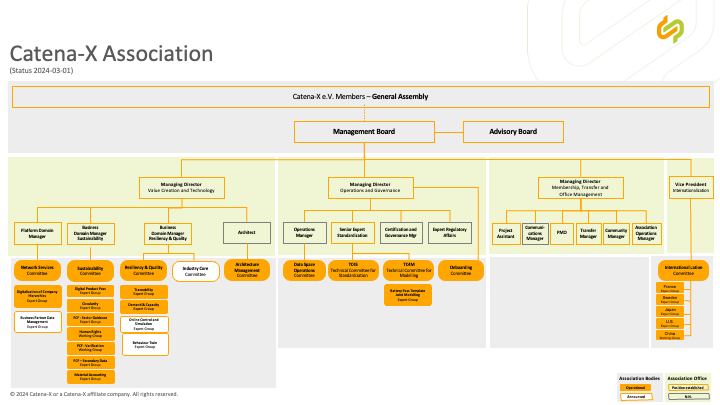

# Catena-X Organizational Structure

## Structural Organization

### Catena-X Automotive Network e.V

:::info
ToDo: Michael
:::

- Catena-X is structured along committees and expert groups
- Committees and expert groups are mapped to products or use cases
  - Role of Catena-X Association
  - Rolle der Mitarbeiter innerhalb im Verein (z.B. Expert Groups, Committees)
  - The Catena-X Automotive Network e.V. promotes, sponsors, and coordinates the overlying requirements of the Eclipse Tractus-X Project.

Committees and expert groups are advertised, selected, and established on the basis of a “requirement”. The application phases are similar and the distributors are always the Catena-X members. More information can be found [here](./overview-roles/02-02-overview-roles.md).

To get a better overview of the given committees and expert groups, there will be a SharePoint page within the member area. Information about:

- The groups
- Purpose
- Member
- Important meetings
- Milestones

Can be found there.

:::info
The sharepoint pages can only be accessed by association members.
:::

### Eclipse Tractus-X Project

:::info
ToDo: Michael
:::

- Tractus-X is structured along products (repos) or use cases
- Committers / Contributors are mapped to products or use cases
- Each contributor can propose features in sig-release
- Committers make the decision which features will be committed in the next release
- Outcome:
  - Planning: Committed, periodized backlog for a release
  - Release: Release Train

### Other Initiatives

:::info
ToDo: Michael
:::

- Other initiatives (such as M-X) can use our processes to propose...
  - Feature proposals
  - Standardization candidates (?)
