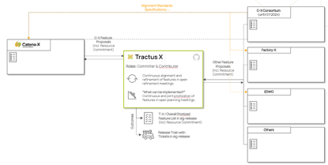
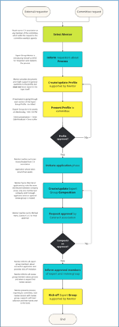
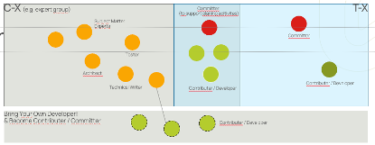

# Catena-X Organizational Structure (Aufbau-Orga)

## Structural and Process Organization

### Catena-X Automotive Network e.V

- Catena-X is structured along committees and expert groups
- Committees and expert groups are mapped to products or use cases
  - Role of Catena-X Association
  - Rolle der Mitarbeiter innerhalb im Verein (z.B. Expert Groups, Committees)
  - The Catena-X Automotive Network e.V. promotes, sponsors, and coordinates the overlying requirements of the Eclipse Tractus-X Project.

### Eclipse Tractus-X Project

- Tractus-X is structured along products (repos) or use cases
- Committers / Contributors are mapped to products or use cases
- Each contributor can propose features in sig-release
- Committers make the decision which features will be committed in the next release
- Outcome:
  - Planning: Committed, periodized backlog for a release
  - Release: Release Train

### Other Initiatives

- Other initiatives (such as M-X) can use our processes to propose...
  - Feature proposals
  - Standardization candidates (?)

## Tooling

In Eclipse Tractus-X we mainly use open-source tooling provided by the Eclipse Foundation
[https://eclipse-tractusx.github.io/community/intro](https://eclipse-tractusx.github.io/community/intro)

In Catena-X e.V., we use MS Teams and GitHub.

- Each committee and expert group have its own MS Teams (and related channels for expert groups), SharePoint (description on member level)
- They can also work with private repositories and use the Tooling infrastructure which is provided by GitHub
- Chat, etc.

Committees & Expert Groups --> Michael

## Committees are defined as follows

### Tasks

- Feature review: The committee is responsible for reviewing feature contributions to the project, ensuring that they meet the organization's standards for quality, security, and functionality.
- Feature prioritization: While the expert groups prioritize and define dependencies between their features; the committee does the same on the cross expert group level; having a focus on the organization and market needs.

Tractus-X Feature Review

- Review ideas in Tractus-X (quality)
- Provide feedback upfront to refinement and planning regarding missing details or proposal against mission/vision
- Define status/readiness for planning
- Prioritize roadmap at feature level in coordination with expert groups
- Analyze / Request details on dependencies between features
- Assign and Mentoring Expert Groups
- Can bring ideas and features to an expert group.

### Powers

### Responsibilities

The committee is responsible for developing and maintaining the organizations in regards to expert groups, election procedures, and decision-making processes. Including: Vision (1+ year plan), Mission (1+ year plan), Roadmap (1 year planning; continuous update).

### Election

### Decision Making & Communication

### Escalation Paths

## Expert Groups are defined as follows

### Tasks

### Powers

### Responsibilities

### Election

### Decision Making & Communication

### Escalation Paths

> Catena-X Roles vs. Eclipse Roles vs. Agile Roles / Committer / Contributor --> Stephan

- Process to initiate / retire a Committee / Expert Group (e.g., announcements, selections, election by board, change of members).
- Wie werden die Committees / EGs angekündigt (Mail über Vereinsverteiler, zusätzliches Townhall falls gewünscht etc.)
- Public / Private Committee / Expert Group Websites / Pages ???

## Roles in Catena-X

Committees and Expert Groups are advertised, selected, and established on the basis of a “requirement”.
The application phases are similar and the distributors are always the Catena-X members.
To get a better overview of the given committees and expert groups, there will be a SharePoint page within the member area. Information about:

- The groups
- Purpose
- Member
- Important meetings
- Milestones

Can be found there.

### Committee

### Expert Groups

New Expert Group process, created by the Network Service committee ToDo -> also add the official process provided by CX

Add pictures from operating model?

#### Expert Group vs. Experts vs. Committer relation

