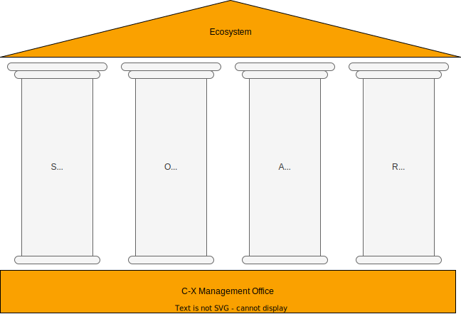
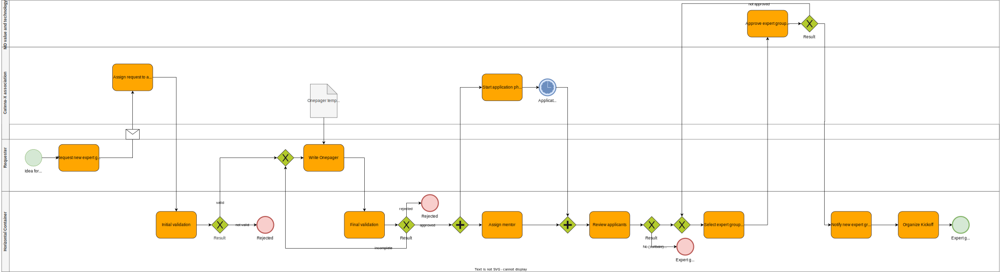

## General

The **Catena-X Automotive Network e.V.** is often referred to as 'the association'. It is important to understand that the association consists of four bodies with different tasks and responsibilities. The association bodies are:

- The Management board
- Committees
- Expert Groups
- Catena-X office

As the association, all four bodies aim to advance Catena-X as the leading global data ecosystem for the automotive value chain. In order to do so they follow the SOAR model.

- **S** = Standardizes to lay the foundation/basis for the ecosystem
- **O** = Orchestrates to structure and organize the ecosystem
- **A** = Activates by making standards applicable and relevant
- **R** = Represent as the only ones speaking for Catena-X

Please note that while this page captures the essence of the Committee and the Expert Group roles, it is not exhaustive. The dynamic nature of the association means that roles can evolve, and members of the Committee and Expert Groups may engage in additional activities beyond what is described here. The descriptions below are intended to serve as a guide, providing a clear indication of the expected contributions of the Committee and the Expert Groups, yet it allows for flexibility and adaptation as the project and its needs grow and change.

## RASIC matrix for association bodies

|  | R = Responsible; A = Accountable; S = Supportive; I = Informed; C = Consulted | Management board |  | Committee |  |  | Expert Group |  | Catena-X office |
|---|---|---|---|---|---|---|---|---|---|
|  |  | Member | [Sponsor](#board-sponsor) | [Lead](#lead-and-co-lead) | Member | [Mentor](#mentor-for-expert-groups-optional) | Lead | Member |  |
| Strategy | [Develop and maintain the Association strategy](#association-strategy) | A | R | I |  |  | I |  | S |
|  | [Develop and maintain the business domain strategy](#business-domain-strategy) | I | A,C | R | S |  | I | I | S |
|  | [Develop and maintain a strategy on functional level](#functional-level-strategy)  |  | I | A |  | C | R | S | S |
| Mgmt. of association bodies | Setup Committees | R,A |  |  |  |  |  |  | S |
|  | Close Committees | A | R | C | I |  |  |  |  |
|  | [Setup Expert Groups](#expert-group-initiation) |  | C | A |  | R |  |  | S |
|  | [Close Expert Groups](#closing-of-expert-groups) |  | C | A |  | R | C,I | I | S |
| Development | [Develop new feature requests](../../03-process-from-idea-to-production/03-01-process-from-idea-to-production.md#create-new-feature-proposal) |  |  |  |  | C | A | R |  |
|  | [Approve features requests](../../03-process-from-idea-to-production/03-01-process-from-idea-to-production.md#check-strategic-fit) |  |  |  | R | A | S | I |  |
|  | Foster the development of features by providing development resources | S |  |  |  | S |  | A,R |  |
|  | Remove impediments for the features development / for Expert Group(s) |  | C |  | S | R |  |  |  |
| Promote | [Promote the use cases of the business domain inside and outside the association](#communication) | S | C |  | R | A |  |  | S |

The RASIC should provide an overview of the tasks the Association bodies are engaging in. Each individual in the Mgmt. board, a Committee or an Expert Group is at least a "member". If one takes over additional roles, e.g. as "Lead", the responsibilities of that role are added to those as member. In detail, the responsibilities for specific individual aspects may differ slightly (but always in alignment with this overarching RASIC.

## Management board

### Association Strategy

The Management Board is responsible to develop, maintain and communicate the Association strategy. The strategy focuses on the overall mission, vision, and long-term objectives of the Association. It defines the broad purpose of the Association and its key goals.

Decisions include determining the areas of focus for the Association, establishing partnerships, and setting the overall direction. This level may also involve decisions about expanding the Association's reach or services.

The primary goal is to enhance the value provided to members and other stakeholders, ensuring the Association’s sustainability and growth. This might involve increasing membership, enhancing influence, or expanding the range of services offered.

### Tasks and Responsibilities

- Approving of requests for new Committees
- Appointment of Committee leaders
- Preliminary selection of applicants for Committees
- Approving of final composition of Committees
- Mentoring of Committees
- Last point of escalation

### Management board roles

#### Board sponsor

#### Mediation board member

## Committee

The Committee plays a pivotal role in steering the direction of the open source project. This role description serves as a framework outlining the key responsibilities and tasks associated with the Committee. It provides a structured overview of the governance, communication strategies, and operational tasks that are central to the Committee's function within the organization.

The Committee  is encouraged to embrace this adaptability, taking initiative to address emerging challenges and opportunities, and to collaborate with other Committees and Expert Groups to achieve the organization's objectives. The success of the project hinges on the proactive and collaborative efforts of the Committee to lead with vision, communicate effectively, and prioritize features that align with our mission and strategic goals.

Committees are specialized bodies appointed by the board to address specific topics or tasks relevant to the association and the related eco system. Within the Catena-X Automotive Network e.V., the purpose and mandate of these Committees are to formulate recommendations for the board's decisions regarding matters to the association, in alignment with Catena-X's roadmap and the organization's strategic direction. Which means, they are responsible for the **mission**, **vision** and the **roadmap** related to their specific topic.

The Committee is also responsible for electing and managing the needed Expert Groups to work on specific tasks.

For more information please refer to the [Framework for Committees](https://catena-x.net).

There is already a list of Committees that have been established and are currently active. The list includes the following Committees:

- Network Service Committee
- Architecture Management Committee
- ...

### Committee roles

#### Lead and Co-Lead

Every Committee must elect a Lead and a Co-Lead. Both act as first point of contact for any inquiries and requests towards the Committee. Further the leads are required to take care of the following taks:

- The leaders of the Committee appoint the Committee members based on the preliminary selection of applications by the board and their existing professional expertise.
- Creation of work packages in alignment with the other Committee members

If the leads see fit they can they can handover the exectution of the task to other Committee members or create additional roles if they see fit. The general intention for the lead role is to be first among equals by keeping the strings together.

#### Mentor for Expert Groups (optional)

For each Expert Group associated to a Committee, a member of the Committee must be nominated as mentor. The mentor should a senior matter expert in the respective field of the Expert Group. The mentor works as interface to the Expert Groups and provide mentoring to ensure the success of the Expert Group.

### Business domain strategy

The Committee is responsible for developing a clear and forward-looking strategy for the business domain. The strategy should contain a vision guides the direction for the coming years and serve as a beacon for all strategic decisions.

Decisions at this level focus on how each Expert Group can effectively contribute to the overall mission and goals of the association.

The main goal is to ensure that each Expert Group is effective in serving the members and supporting the association’s objectives.

The Committee creates a roadmap outlining key initiatives and milestones for the upcoming year. This roadmap is continuously reviewed and updated to respond to changes in the market and within the organization.

### Communication

The Committee promotes the organization and its projects within the broader community. It builds relationships with other organizations and organizes events to foster engagement and collaboration. The group works closely with committers and members of Expert Groups to ensure a deep understanding of ongoing activities and the needs of the organization.

#### Alignment with Other Committees

The Committee coordinates its activities with other Committees to ensure a unified strategy and direction.

#### Assigning and Mentoring Expert Groups

The Committee is responsible for assigning tasks to Expert Groups and providing support and mentoring to ensure their success.

#### Feature Review

The Committee reviews contributions to the projects for quality, security, and functionality to ensure they meet the organization's standards.

#### Feature Prioritization

The Committee prioritizes features on a cross-Expert Group level, focusing on the needs of the organization and the market.

### Tasks

<!--
- Feature review: The Committee is responsible for reviewing feature contributions to the project, ensuring that they meet the organization's standards for quality, security, and functionality.
- Feature prioritization: While the Expert Groups prioritize and define dependencies between their features; the Committee does the same on the cross Expert Group level; having a focus on the organization and market needs.-->
- Vision and big picture
  - Develop and maintain a forward-looking vision for the domain
  - Create a roadmap outlining key initiatives and milestones
- Gate keeping
  - Evaluate the strategic fit for standard (change) requests
  - Evaluate the strategic fit for feature requests (in Tractus-X)
  - Analyze / Request details on dependencies between features
  - Provide feedback upfront to refinement and planning regarding missing details or proposal against mission/vision
  - Prioritize roadmap at feature level in alignment with Expert Groups
  - Define status/readiness for planning
- Expert Group supervision
  - Initiate new Expert Group in their domain
  - Close Expert Groups if needed
  - Review applications for new Expert Groups
  - provide mentoring to Expert Groups (see [Mentor](#mentor-for-expert-groups-optional))
- Knowledge transfer
  - Promote the knowledge transfer for the domain to other association bodies

### Powers

### Responsibilities

### Election

### Decision Making & Communication

### Escalation Paths

## Expert Group

The aim of the Expert Groups within the Catena-X Automotive Network e.V. is to develop results together with the members in line with the association's strategic direction. The Expert Groups are [initiated](#expert-group-initiation) and managed by the related Committee. Expert Groups don't exist forever. They work on dedicated topics, present the results to the Committee and are then [retired](#closing-of-expert-groups). If a follow up is required, a new Expert Group has to be initiated.

### Functional level strategy

The functional level strategy involves the specific operational activities within a Expert Groups. It deals with the day-to-day tasks and processes that need to be executed to support the business domain strategy.

The focus lies on implementation, realisation and the delivery of tangible results.

### Tasks and responsibilities for Expert Groups

In addition to the results to be elaborated in terms of content, the working groups have to fulfil the following, overarching tasks:

- Elaboration of the strategic orientation
- Advancing standardisation
- Realisation of the strategic roadmap of the association
- Harmonisation of interests  
- Achieving majority feedback on the orientation of the association
- Identifying areas for action
- Focus on tangible results

### Existing Expert Groups

There is already a list of groups that have been established and are currently active. The list includes the following groups:

- ...
- ...
- ...

### Expert Group Initiation

Association members can join any Expert Groups by applying for open seats. The recommended size for Expert Groups is 5 to 15 core team members. Less core team members might indicated that the topic is not relevant enough to the assosciation and cause the Expert Group not being established. More core team members would make the Expert Group to inflexible and a split of the Expert Group might be considered.

The composition of the core team is considering a balance between OEM, tier-1, tier-2, tier-n and small, medium and large sized companies with up to one participant per company with one voting right per company.

The members of the core team are selected according to the following criteria:

- Proper expertise in the relevant field of the Expert Group
- Minimum availability of 20 hours per month, more is a plus
- Commitment to regular, active participation and active contribution

Based on their availability, applicants are assigned either to the core or the review team:

- The **core team** is responsible for creating and working on dedicated features. The group acts here as a requester for the features and drives the development.
- The **review team** acts as a sparring partner to the core team and provides feedback on a regular basis. The review team has no recommended team size.

#### Request Submission

Individuals or organizations interested in forming an Expert Group can reach out to the Catena-X Association. The request is then going to be assigned to an committe. The request is then added to the Committee's agenda for validation.

#### Initial validation

The Committee is going to do a initial validation of the request. If the request is deemed valid, one of the Committee members is going to be assigned to the request to serve as the Single Point of Contact (SPOC) for requestors and guides them through the initiation process. The mentor explains the process and provides necessary documents to the requestors.

#### Onepager creation

Once the request is validated, the requester has to write a onepager describing the challenge the Expert Group should tackle, what the status quo is and state the objectives the Expert Group should achieve. The requester is going to be supported by the mentor. The onepager ensures a comprehensive understanding of the group's objectives and scope.

#### Final validation

The onepager then has to be presented to the Committee. The committe then approves or disapproves the request.

#### Application Phase

Validated request are then taken over by the association which is then starting the application phase for the Expert Group. The application phase typically lasts around two to four weeks.

#### Expert Group composition

All applicants are going to be reviewed by the mentor. Based on predefined criteria the members for the Expert Group are going to be selected. If there are sufficient applicants, an optional review group may be created (see [Expert Group election](#expert-group-initiation)).

#### Expert Group approval

Once the application phase is complete, the mentor seeks final approval from managing director value and technology creation, Catena-X e.V., for the formation of the Expert Group.

#### Notification and Kick-off

Upon approval, the mentor informs all applicatns the outcome of their application (core team, review team or rejected). Core team members are invited to a kick-off for the group's inaugural meeting (usually two weeks after the application phase ended).

#### Review Group Formation

If applicable, the mentor informs all review group members about the process and schedules the first review session.

#### Kickoff

During the kickoff the mentor presents the overall process, including reporting to the Committee and the next review session with the review group. Additionally, the mentor supports with lead selection and then hands over the leadership responsibilities to the appointed leads.

### Expert Group maintenance over the life time

The composition of the Expert Groups is not static and is expected to change over the life time of the Expert Group. In any case people that want to join an existing Expert Group need to be approved the same way, as applicants for new Expert Groups. This means they need to be approved by the mentor of the Expert Group and the managing director value and technology creation.

#### Replacement of Expert Group members

If a Expert Group member is stepping down from its position, it can not be handed over to another employee of the same company. The replacement needs to be approved.

#### Adding additional members

The recommended maximal number of Expert Group members is 15. If the Expert Group has less members, new members might be added. If the number of members is greater than 15, new members might be added after consideration by the Committee.

### Closing of Expert Groups

Once a Expert Group delivered its dedicated topic, a regulated closing takes place. The Committee validates the results of the Expert Group as after the closure of the Expert Group, the responsibility for the topic transitions to the Committee. When the results are validated. The Expert Group is then officially discharged and closed by Committee.

A final documentation of the work results on the digital collaboration platform is mandatory, and every Expert Group member is required to contribute to this. The documentation is to be made accessible to every member in coordination with the office.

The closure of the Expert Committee is communicated to all members, and the results are accessible to them.

### Expert Group Decision Making & Communication

Expert Groups are required to be transparent about their work and communicate regualarely with other association members to gather their feedback.

- The Expert Group should meet on a weekly or bi-weekly schedule to align internally
- If the Expert Group has a review group a monthly exchange should be scheduled to present the work of the Expert Group and get feedback
- A quarterly sounding event should be organised to inform all associations members about the work of the Expert Group and forthcoming initiatives. This event should be aligned with next release planning, to allow ample time for the integration of any valuable feedback that may arise.

### Expert Group Escalation Paths

## Catena-X office
