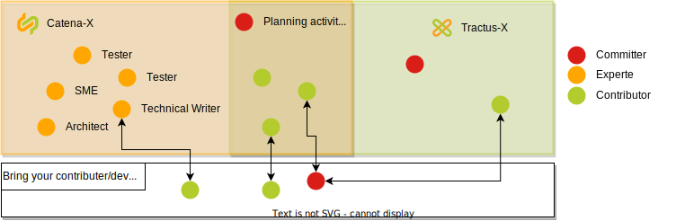

While Catena-X and Eclipse Tractus-X are formally separate organizations, they are deeply interconnected through individuals contributing to both. This structural overlap can sometimes lead to confusion, particularly regarding roles and responsibilities. The purpose of this page is to clarify these distinctions.

## Catena-X Automotive Network e.V

The **Catena-X Automotive Network e.V.** is often referred to as 'the association'. It is important to understand that the association consists of five bodies with different tasks and responsibilities. The association bodies are:

- [Management board](./management-board.md),
- [Committees](committee.md),
- [Expert Groups](./expert-group.md),
- [Working Groups](working-groups.md), and
- [Catena-X office](./catena-x-office.md).

The Association promotes, sponsors, and coordinates the overlying requirements of the Eclipse Tractus-X Project.

Committees and Expert Groups are mapped to products or use cases. They are advertised, selected, and established on the basis of a requirement. The application phases are similar and the distributors are always the Catena-X members.

### Formal decisions

Some decisions taken by association bodies must be formally approved and documented.

|   Decision                               |   Expert Group    |   Committee   |   Management Board    |
|---                                        |---                |---            |---                    |
|Setup of a new business domain/Committee   |                   |               |X                      |
|Confirm lineup of Committees               |                   |               |X                      |
|Setup of a new Expert Group                |                   |X              |                       |
|Roadmap Items                              |X                  |X              |                       |
|Standard Requests                          |X                  |X              |                       |
|Normative documents*                       |X                  |X              |X                      |
|Non-normative documents                    |X                  |X              |                       |

*\*Normative documents additionaly require an approval by the TC4S (for standard candidates) or by the DSOC (for updates of the Operating Model).*

Formal Approval Criteria:

A decision is considered formally approved if all of the following conditions are met:

- **Minimum Participation**: At least 5 members cast their votes. *Voting options: "approved", "not approved", "abstention".*

- **Majority Approval**: The number of "approved" votes exceeds the number of "not approved" votes. *Note: "Abstention" votes are not counted towards the approval calculation.*

Documentation Requirements:

- All decisions must be recorded in the meeting minutes.
- The documentation must include:
  - The names of all voting members.
  - The individual voting result for each member ("approved", "not approved", or "abstention").

### Roles and Responsibilities within the Association

- **Association Member**: This is the basic role that every employee in the of an Association Member can obtain. Being a member grants access to Associations meetings and fundamental tooling necessary for participation, such as viewing content, participating in discussions, or accessing standard resources. The role must be requested actively.
- **Other roles**: An Association Member can acquire additional roles by joining one of the Association's bodies. The rights associated with these roles are granted in addition to those already held as an Association Member.

### Escalation path

If an issue cannot be resolved by the designated Association body, it must be escalated to the appropriate higher authority. The escalation pathway is as follows:

1. **Expert Groups**: Issues should initially be addressed within the Expert Groups. If the Expert Group Members are unable to find a solution, a vote may be conducted to reach a decision. Should the vote fail to achieve a majority or if an Expert Group member raises substantial concerns regarding the outcome, the issue may be escalated.
2. **Responsible Committee**: If the Expert Groups are unable to resolve the issue, it is escalated to the responsible committee. This committee is tasked with oversight and decision-making based on broader organizational perspectives.
3. **Board Sponsors**: Should the committee find the issue beyond its scope of resolution, the matter is escalated to the Board Sponsors. These senior members of the board provide strategic guidance and authoritative decisions on escalated matters.
4. **Mediation Board Member**: As the final level of escalation, unresolved issues are directed to a Mediation Board Member. This individual is empowered to mediate and resolve high-level disputes or complex issues that could not be settled at prior levels.

<!--## DACI matrix for association bodies

- *Driver* (**D**): A single driver of overall project like the person steering a car.
- *Approver* (**A**): One or more approvers who make most project decisions, and are responsible if it fails.
- *Contributor* (**C**): Are the worker-bees who are responsible for deliverables; and with whom there is two-way communication.
- *Informed* (**I**): Those who are impacted by the project and are provided status and informed of decisions; and with whom there is one-way communication.

|  |  | Management board |  | Committee |  |  | Expert Group |  | [Catena-X office](catena-x-office.md) |
|---|---|---|---|---|---|---|---|---|---|
|  |  | Member | [Sponsor](management-board.md#board-sponsor) | [Lead](committee.md#lead-and-co-lead) | Member | [Mentor](committee.md#mentor-for-expert-groups-optional) | Lead | Member |  |
| Strategy | [Develop and maintain the Association strategy](management-board.md#association-strategy) | A | D | I |  |  | I |  | |
|  | [Develop and maintain the business domain strategy](committee.md#business-domain-strategy) | I | A | D | C |  | I | I | |
|  | [Develop and maintain a strategy on functional level](expert-group.md#functional-level-strategy)  |  | I | A |  | C | D | C | |
| Mgmt. of association bodies | Setup Committees | D, A |  |  |  |  |  |  | C |
|  | Close Committees | A | D | C | I |  |  |  |  |
|  | Setup Expert Groups |  | I | A | A | D |  |  | |
|  | [Close Expert Groups](expert-group.md#closing-of-expert-groups) |  | I | A |  | D | A | A | |
| Development | Propose new feature requests |  |  | C  | C | C | A | D |  |
|  | Approve features requests) |  |  |  | I | I | D | A,C |  |
|  | Track the progress of the feature) |  |  |  | I | I | D | A,C |  |
|  | Test and Feedback of the delivered feature) |  |  |  | I | I | D | A,C |  |
| Promote | [Promote use cases](committee.md#communication) | C | C |  | D | A |  |  | C |

The DACI should provide an overview of the tasks the Association bodies are engaging in. Each individual in the management board, a committee or an expert group is at least a "member". If one takes over additional roles, *e.g.*, as "Lead", the responsibilities of that role are added to those as member. In detail, the responsibilities for specific individual aspects may differ slightly (but always in alignment with this overarching DACI.-->

## Eclipse Tractus-X

- Tractus-X is structured along products (repos) or use cases
- Each contributor can propose features in sig-release
- Committers make the decision which features will be committed in the next release

### Roles and Responsibilities within Tractus-X

- [**Contributor**](https://eclipse-tractusx.github.io/docs/oss/contributor-committer/#contributor): Contributors are the backbone of any open source project. They are individuals who offer their skills and time to contribute to the project in various forms, such as code, documentation, design, or community support.

- [**Committer**](https://eclipse-tractusx.github.io/docs/oss/contributor-committer/#committer): Committers are contributors who have been granted the ability to directly access the project's code repository to make changes. They have a deeper level of commitment to the project and are responsible for reviewing and accepting contributions from others.

- [**Project Lead**](https://eclipse-tractusx.github.io/docs/oss/contributor-committer/#project-lead): An Eclipse Project Lead is a project committer with extended rights and responibilities. Every project can have more then one project lead, they are elected by the project committers.

## Collaboration Between Catena-X and Eclipse Tractus-X

Even if it appears to be an organisational separation, it is important to understand that Catena-X and Tractus-X must work closely together. The Expert Groups and Committees are the ones who define the features and the roadmap. The committers are the ones who implement the features and the roadmap. The experts are the ones who provide the knowledge and the expertise to the committers.

The committers are responsible for the prioritization of the features within the open-source boards. committers are also responsible for overarching topics like quality, security, and functionality. Committers are representatives of their own company and should also work/support within the Expert Groups.
