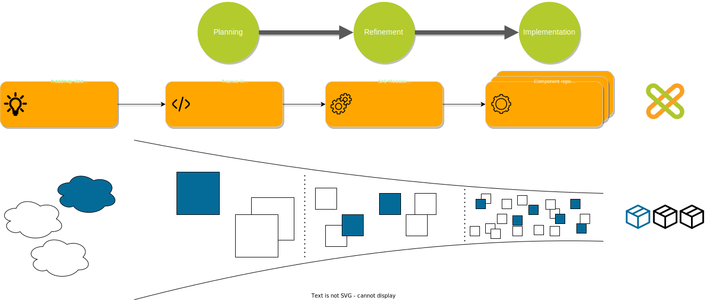

The development of open source components in Tractus-X is a collaborative effort between the association bodies (Committees and Expert Groups) and the [open source community]. The association bodies ensure that feature requests align with the strategic goals of the project, meanwhile, the open source community ensures the delivery high-quality code. Together, they ensure the interests of Catena-X and Eclipse Tractux-X are consirdered and respected.

## Phase 1: Preparation

The Preparation Phase is the foundational phase that sets the direction and scope for the entire release. It ensures that all stakeholders have a shared understanding of the release's content.

All planned work on Kits, Reference Implementation, API Specification, Protocols, Sample Data, Architecture, Documentation, Deployment Scripts or Tutorials should be announced during this phase.

### Preparation ToDo's

- [Create roadmap item]

### Preparation Milestones

- [Release Roadmap Review]

## Phase 2: Planning

This phase involves breaking down high-level requirements into detailed specifications, addressing any ambiguities, and preparing comprehensive plans that guide the subsequent development and implementation activities. The goal of this phase is to ensure that all aspects of the project are clearly understood, accurately defined, and ready to be built, reducing the risk of issues during the implementation phase.

### Planning ToDo's

- [Feature proposal creation and approval]
- [Feature proposal refinement]

### Planning milestones

- [Refinement day]
- [Draft feature freeze]
- [Release planning days]

## Phase 3: Development

The development and release phase includes the development of the software and KITs. The individual units are developed and tested in up to six increments. This is followed by final integration and end-to-end test for the software.

### Development ToDo's

- [Development (Increment 1 - 6)]

### Development milestones

- [Initial pull request]
- [Final pull request]
- [Feature freeze]
- [Release freeze]
- [E2E test]

## FAQs

**How are the open meetings communicated?**
The Catena-X association will communicate and coordinate the open refinement and open planning meetings vi the a Tractus-X [News Page](https://eclipse-tractusx.github.io/blog) and the Tractus-X [Mailing List](https://accounts.eclipse.org/mailing-list/tractusx-dev). Please make sure that you subscribe. The meetings will also be published (with meeting session and calender.ics) on the open meetings page.

**Who can propose a feature?**
Anyone can **propose a feature**, including Committees, Expert Groups, and other initiatives. However, we require a dedicated feature author for further refinement and the breakdown into implementation issues.

**How to handle dependencies?**
Dependencies can be discussed in our open refinement meetings as well as via our other communication channels (e.g. matrix chat or bilateral sessions). Please refer to our Tractus-X [communication rules](https://eclipse-tractusx.github.io/community/intro).

**Who gives access to the sig-release repository to enable planning process?**
Please refer to our Tractus-X [Getting Started Guide](https://eclipse-tractusx.github.io/docs/oss/getting-started).

<!-- OLD CONTENT THAT NEEDS TO BE INCORPORATED OR DELETED

TODO THIBAULT

# Detailed describtion of process from idea to release

In order to plan a new feature in Tractus-X several steps must be followed. Each process step is going to be executed by one of these roles:

- **Feature author**: The feature author is going to be the primary point of contact for all questions related to a feature proposal. The feature author carries the feature proposal through the validation and refinement process.
- **Topic Owner** :The topic owner validates new feature proposals for a defined topic to make sure feature proposals align with the strategy for it. The topic owner is usually going to be a Committee.
- **Committer**: *See Tractus X Committer description*

|Information|Description|
|-----------|-----------|
|Feature author|Responsible person to carry the feature proposal through the validation and refinement process|
|Description|Description of WHAT the feature proposal is about.|
|Business value|Description of WHY the feature proposal is relevant.|
|Acceptance criteria|Conditions that must be satisfied for the feature proposal to be accepted|

** There are two options regarding resource commitment:

1. If you have dedicated developer resources, your developer team will create the implementation issues at the user story level.
2. If you do not have dedicated developer resources, interested developers team can create the implementation issues.

### Feature assignment & validation

Responsible: Committee & Expert Group

Once a new feature proposal has been made for the Tractus-X project, it enters a validation phase where the Committees assigns it to the relevant Expert Group.

- **Validation:** The Committee assigns the feature to the matching Expert Group (at least two specific contacts). The Expert Group will review the proposal to ensure it aligns with the project's goals and standards.
- **Request for Additional Details:** If the proposal lacks necessary details, the reviewing bodies may ask the author for additional information or clarification.

The goal is to have features that fulfill the following **Definition of Entry (DoE)**:

- Feature author defined: The designated point of contact for any questions related to the feature during the refinement, planning and development phase (e.g., subject matter expert). Not necessarily responsible for the technical implementation of a feature.
- Feature description is available
- Required enablers are defined and aligned (e.g., architecture, infrastructure, compliance)
- High-level architecture (building-block-view)
- Key dates and milestones are defined using GitHub milestone declaration
- Business value is defined
- Test scenarios, test cases and test data are available
- Acceptance criteria are defined
- Feature estimation available (based on story points)
- Developer team for feature implementation defined
- Dependencies with other products or issues are identified and categorized via GitHub labels
- Known risks are properly addressed
- No open questions left
- First implementation issues are defined in the corresponding repository and linked to the feature (optional)
...

Ultimately, the decision regarding maturity is made jointly by the affected products and contributors in the open refinement meetings.

**Feature author responsibility in the refinement:**

- **Responding to feedback:** The author is responsible for addressing any feedback provided by the Expert Group or Committee. This may include providing additional details or making revisions to the proposal.
- **Implementation issues:** If necessary, the author may need to create implementation issues in the repository of the corresponding product to break down the feature into manageable pieces. This aids in tracking progress and facilitates easier review.
- **Timely Updates:** The author must update the feature details within the given timeframe. Prompt responses and updates are crucial to keep the proposal moving forward.

-->