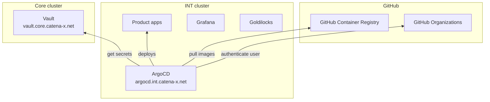

# Infrastructure

Infrastructure involves the functionality of deploying, provision of a virtual environment and tools for monitoring
applications to ensure the quality and functionality of software products. This document outlines the technology and
processes involved in our infrastructure.

## Available environments
<!-- markdown-link-check-disable -->
The following environments are currently available.

### Core Environment

| Tool  | URL                                                                |
|-------|--------------------------------------------------------------------|
| Vault | [https://vault.core.catena-x.net](https://vault.core.catena-x.net) |

### Integration Environment

| Tool       | URL                                                                        |
|------------|----------------------------------------------------------------------------|
| ArgoCD     | [https://argocd.int.catena-x.net](https://argocd.int.catena-x.net)         |
| Grafana    | [https://grafana.int.catena-x.net](https://grafana.int.catena-x.net)       |
| Goldilocks | [https://goldilocks.int.catena-x.net](https://goldilocks.int.catena-x.net) |

### Stable Environment

| Tool       | URL                                                                              |
|------------|----------------------------------------------------------------------------------|
| ArgoCD     | [https://argocd.stable.catena-x.net](https://argocd.stable.catena-x.net)         |
| Grafana    | [https://grafana.stable.catena-x.net](https://grafana.stable.catena-x.net)       |
| Goldilocks | [https://goldilocks.stable.catena-x.net](https://goldilocks.stable.catena-x.net) |

<!-- markdown-link-check-disable -->

## Environment Setup

This diagram provides an overview on how the environments are set up. In this example the integration environment is shown.
ArgoCD deploys the apps of the product teams in the int cluster by reading the configured secrets from the vault in the
core cluster and pulling the image of the service from the GHCR. With this architecture, no product team has to directly
access Azure for service deployments.



## Tools

### Argo CD

- **Purpose:** Continuous delivery tool for Kubernetes.
- **Features:**
  - Automated deployments
  - Version control of deployments
  - Rollbacks to previous versions

### Vault

- **Purpose:** Store secrets for deployment configurations.
- **Features:**
  - Secret management
  - Usable in Argo CD with Argo-Vault Plugin

### Grafana

- **Purpose:** Monitoring of resources of the product teams
- **Features:**
  - Dashboards for monitoring
  - Alerting

### Goldilocks

- **Purpose:** Resource usage recommendations for the product teams
- **Features:**
  - Resource recommendations
  - Cost savings if applied by the product teams

## Infrastructure Maintenance

- **INT-Environment:** last Sunday of each month -> Products should check their deployments after downtime

## Fair Play Policy CX-Environments

To ensure a fair use of the resources provided by the Catena-X Association, we'd like to propose a Fair Play Policy.

### Purpose

This Fair Play Policy outlines the acceptable use of resources within our platform, ensuring that all product teams have
equitable access and a positive experience. We aim to prevent misuse or excessive consumption of resources that could
negatively impact other product teams. By adhering to this policy, users contribute to maintaining a cost-efficient and
sustainable environment, ensuring that resources are available to everyone at a reasonable cost.

### Equal Access to Resources

All product teams are entitled to fair and equal access to the resources provided by our platform. No individual or
group should engage in actions that monopolize resources, impair performance, or degrade the experience of others.

### Fair Usage Guidelines

To promote fair play and responsible resource usage:

- **Reasonable Resource requests and limits**: Product teams should adhere to reasonable usage of CPU and Memory, to
  ensure optimal service for all. To get a hint on how the request/limit for your container should be, please take a
  look in Goldilocks (links can be found in the [environments](#available-environments) section). Especially CPU and Memory
  recommendations should be considered.
  Since there isn't much of a load on the systems (excluding testing before a release), the apps won't need many
  resources.
- **Monitor your Namespace in ArgoCD**: You should regularly check your resource usage, requests and limits in your
  namespace. This can be done with [Grafana](#available-environments), here you can find many dashboards, that support
  you with that.

### Consequences of Violation

If a product team is found to be in violation of this Fair Play Policy, the following actions may be taken:

- Issuing a notice to inform the product team of the violation/improper usage.
- The system team might proactively create pull requests with decreased values for resource request/limits in the
  product teams repository.
- If a product team is not responding after several attempts of communication (via GitHub, MS Teams, Email), we reserve
  the right to delete the resources created with ArgoCD by the product team. This may also apply, if no one is actively
  working on a product that is already deployed on any environment.

## How to deploy your Helm-Charts via ArgoCD

To deploy your released Helm-Charts with our ArgoCD instance, simply navigate to your environment of choice
([Environments](#available-environments)).
Next, create an [ArgoCD-App](https://argo-cd.readthedocs.io/en/stable/getting_started/#creating-apps-via-ui) with your
associated Namespace and Project.
You can store your environment specific configuration in a subfolder [like the Portal does](https://github.com/eclipse-tractusx/portal/tree/main/environments).
These values files can be used in the manifest of the Argo-App like the following:

```yaml
project: project-portal
source:
  repoURL: 'https://github.com/eclipse-tractusx/portal.git'
  path: charts/portal
  targetRevision: portal-2.3.0-alpha.1
  plugin:
    env:
      - name: AVP_SECRET
        value: vault-secret
      - name: helm_args
        value: '-f values.yaml -f ../../environments/helm-values/values-int.yaml'
destination:
  server: 'https://kubernetes.default.svc'
  namespace: product-portal
```

### Ingress configuration

In order to connect to your deployed services with a secured connection, you have to annotate you Ingresses with the following:

```yaml
metadata:
  annotations:
    cert-manager.io/cluster-issuer: "letsencrypt-prod"
```

If that annotation is not present, the cert-manager can't detect your Ingress and is not able to create a certificate for it.
Also, the tls secretName must be unique throughout your namespace. If you put your service name in the secretName, you should be good to go.
The URL of the Ingress should be unique throughout the whole cluster, since other teams are using the same url as well.
Good practice is to combine it with your service and project name.

```yaml
  tls:
    - hosts:
        - {projectName}-{serviceName}.int.catena-x.net
      secretName: tls-secret-{serviceName}
```
