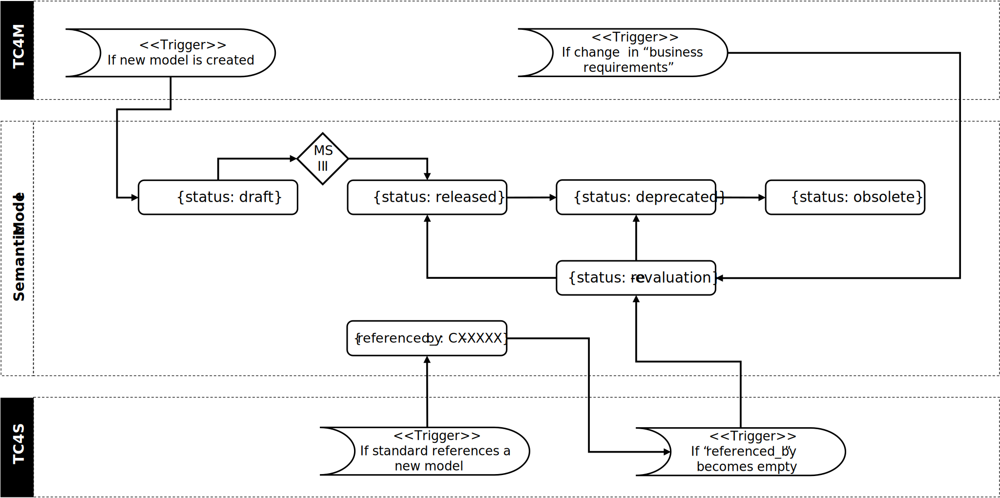

# Catena-X Governance Process for the Creation and Standardization of Semantic Models

- *Platform Capability*: Semantics
- *Version*: 1.0
- *Date*: 18.02.2025

## Abstract

This document defines the governance process for semantic models in Catena-X e.V. It defines the process of cooperation with the IDTA and serves as a guideline for all parties applying to standardize their data models. Working Groups, expert teams and Committees in Catena-X e.V. executing this process will adhere to this standard and define their work accordingly.

## Introduction and Overview

Catena-X standardized semantic models are a crucial enabler to assure interoperability between independent solutions. Only when data consumers, data providers and business application speak the "same language", data can be exchanged and embedded seamlessly between use cases and appplications which are developed by different organizatioms. A standardized semantic model is needed when:

- The consumer of the data is not known prior to the data exchange
- Multiple consumers want to access, integrate and use the data
- The data is processed by various business apps in multiple use cases

Furthermore, standardized semantic models lower the cost for making data accessible and, therefore, speed up the return of invest or even make business cases possible in the first place.

Although semantic models are build to be used as blueprints for Digital Twins ([see CX–0002](https://catenax-ev.github.io/docs/standards/CX-0002-DigitalTwinsInCatenaX)), they can be used by other data exchange mechanisms as well.

## Roles within the Process

Different roles are involved during the standardization of a semantic model. The table below describes the roles used within the standardization process:

|Role|Description|
|:----|:----|
|Applicant|An individual or group of individual Catena-X e.V. members who wish to define a semantic model. The applicant has clear requirements toward data from the perspective of a Catena-X application. The applicant is represented by a single individual responsible for the request (model steward)|
|Semantics Manager|The Catena-X Semantics Manager is knowledgeable on all the existing models within Catena-X e.V. His or her major tasks are ensuring consistency among the different domain models. The Semantics Manager is the single point of contact for applicants’ questions on modeling technique and other standardization bodies such as the IDTA. The Semantics Manager participates/manages TC4M.|
|Catena-X Model Registration Office|Catena-X maintains personnel for handling all administrative tasks like formal checks, deadline reminders and tracks a request through its lifecycle.|
|IDTA registration office|IDTA maintains personnel for handling all administrative tasks for a Submodel registration, running dedicated platforms for the storage and publication of Submodels, supports interested parties and manages the process.|
|Modeling Team|The modeling team is established as TC4M. It is a group of Catena-X modeling experts managed by the Semantics Manager. The Modeling Team assures the compliance with the Catena-X governance process for semantic models as defined in this document. Members of the modeling team have experience in developing semantic models for Catena-X use cases. And may serve as Applicants Model Stewards.|
|Modeling Expert Team|The modeling expert team is set up as a Catena-X expert team within the TC4M or as a joint IDTA/Catena-X team. The team is temporary and works on a single semantic model or a set of very closely related semantic models. The decision for setting up a new modeling expert team is done during the Proposal Verification phase by the Modeling Team.|
|Catena-X Standardization Committee|The Technical Committee for Standardization (TC4S) serves as the standardization governance body of Catena-X. The TC4S is responsible for the Catena-X standardization process. In the context of semantic models this means that a released semantic model is not necessarily to be considered standardized. A semantic model is only considered to be a standardized model, if it is referenced in the normative section of a released Catena-X standard.|

## Registration Process for Semantic Models

The following diagram illustrates the process for registration of a semantic model starting with the request and ending in publication. The process described focuses on the registration of semantic models requested by Catena-X only. The development of the model might be done jointly with the IDTA or, if applicable, with other standardization bodies. The overall process details are described further in the following sections, whereby different sections MUST pass different Milestones (see appendix for the details of MS1, MS2 and MS3).

*Figure 1 Process for Registering a Catena-X Submodel Template in IDTA*

### Proposal

In the first step, an applicant proposes to define or change a semantic model. This may be motivated by one of the following factors:

1. A semantic model was already defined by a group of partners and shall be standardized
2. IDTA already defined a semantic model which shall become a standard in Catena-X
3. A new model is proposed
4. An external standard (e.g., IEC) exists and should become a semantic model
5. An existing model requires an update (e.g. due to marked feedback or regulatory changes)

The request includes a description of the model to be created, links to relevant standards, examples of data to be transferred and a responsible model steward according to the request form. The proposal must include all necessary information and data to pass MS1. When there is a requirement for a new or modified semantic model, an applicant’s domain expert initiates the modeling process by creating a new issue in Tractus-X SLDT-semantic-models GitHub [7]. Depending on the type of request (new model, model update, model deprecation), one must use different templates for the issue.

### Initial Check

The *Catena-X Semantic Registration Office* verifies the submitted request by checking its completeness. The complete list of checks is summarized as “MS1 Criteria” and MUST be handed in with the request *managed in Tractus-X (see Link to repository)*. In case information is missing, the applicant is asked to maintain the missing information. Once the form is checked for completeness and the formal MS1 request is complete, the Catena-X Semantic Model Registration Office *hands over the request to the modeling team for discussion* on the content. The formal requirements are:

*Figure 2 Data Model Lifecycles*

#### New Model

- The proposed aspect model does not exist already in Catena-X or neighboring standardization bodies.
- The proposed aspect model does not extend an existing aspect but introduces completely new functionality
- The proposal references a Catena-X use case
- Relevant standards are mentioned/linked
- A first draft of the data structure is provided in an example

#### Update Model

- The model that should be updated exists
- The referenced use case exists
- The potential updates are discussed with all stakeholders
- The potential update will be either
  - backward compatible or
  - a (chain of) migration strategy(-ies) from all non-deprecated previous versions to the new model will be developed

#### Deprecate Model

- The model that should be deprecated exists and is not deprecated already
- The respective model does not affect existing use cases (aspect is either used in higher versions or replaced by a different aspect)
  - A shared aspect, which will be deprecated, is not used by any released aspect model

#### Re-Evaluation

Argue for or against the necessity of a new Modeling Expert Team. The applicant designates a single individual as responsible model steward.

### Proposal Verification

The modeling team verifies the content of the request.

Based on the information given in the issue description, the modeling team decides whether to approve and to progress with the development of this model. In that case, the modeling team assigns the label "MS1-Approved" and names at least one modeling expert in the GitHub issue who will support the applicant in resolving the issue. With the MS1 checklist and approval, the idea is to initiate the exchange between domain and modeling experts in an early development phase. In this way, model developers get fast feedback before investing time and effort on models for which they might not find consensus within the modeling team. The discussion of the model updates shall further create awareness of currently ongoing modeling activities across modelers and use cases to avoid duplicate models and development for the same topic.

During proposal verification, the Semantics Manager initiates the process to involve the IDTA. Target of the involvement is to decide on the participation of IDTA. It shall not take longer than two weeks to come to a decision. Interplay with models from bodies like OPC Foundation or ECLASS are considered as well.

#### Designate a Modeling Expert Team

Once the proposal is verified, the TC4M is deciding whether to designate a new Modeling Expert Team or the TC4M mandates an existing Expert Group to take over the role of a Modeling Expert Team.
If a new Modeling Expert Group shall be established, then the designated *Model Steward* will cooperate with the *Model Registration Office* who invites to join a temporary *Modeling Expert Team* according to the “Call for participants” process of Catena-X. In case of a joint development there will also be a “Call for participants” according to the process of the IDTA.

A Modeling Expert Team is tasked with creation of a semantic model. The Modeling Expert Team is a temporary group consisting of the following roles:

- Model Steward: Modeling Expert Team lead
- Catena-X Semantics Manager
- Domain Experts – resulting from the Call(s) for Participant
- (only if joint WG with IDTA) Expert on AAS modeling

The Catena-X Semantic Model Registration Office will take the lead for legal and organizational topics (e.g., assigning new members and access rights to the team members).

Depending on the decision during proposal verification the Modeling Expert Team will be setup in corporation with the IDTA. In case of a joint effort, the IDTA release process will adhere to the rules for the public track. If there will be no joint Modeling Expert Team, the Catena-X process for Modeling Expert Teams applies. Either way, a Modeling Expert Team shall propose a semantic model within six weeks.

### Designing a Semantic Model

The Modeling Expert Team shall follow the IDTA’s "semantic based workflow" defined in [5]. The concept description for Submodel used for the creation of the Submodel Template (SMT) specification shall follow the Semantic Aspect Meta Model (SAMM) as described in [CX-0003](https://catenax-ev.github.io/docs/standards/CX-0003-SAMMSemanticAspectMetaModel). Two cases are distinguished:

- There is already an existing open semantic definition available for the submodel under
consideration in some standardized way.  
  - This is the case for the already standardized aspect models of Catena-X (see [8]and [7]). In this case the joint Modeling Expert Team is mainly preparing the additionally artifacts required for a SMT specification.
- No suitable open semantic definition is available for the submodel under consideration.
  - In this case an aspect model for the new submodel template shall be part of the final SMT specification submitted for review. This aspect model in RDF (.ttl) is a Submodel CD file in this context. The semanticId of the SMT shall correspond to the unique ID of the aspect model. Additionally, ECLASS shall be considered (see [8c] ). The other mandatory artifacts of the SMT are not affected. In the case of SAMM a converter is available to create am SMT AASX and shall be used.
  - The aspect model shall be developed in Eclipse TRACTUS-X [7] and transferred together with the SMT to the IDTA’s repositories upon release.

Catena-X e.V. requires the following artifacts to be handed in for standardization:

- AAS Submodel template
- Aspect Model (turtle, SAMM, Submodel ConceptDescription)
- SMT file (XML, JSON or AASX. May be generated.)
- Value-only-Schema (JSON. May be generated.)
- Value-only-Example-Data (JSON. May be generated.)

The IDTA may require additional documents for release in its organization.
The formed Modeling Expert Team performs the modeling work to create a semantic model for the initial request. This work happens on a dedicated development branch preferably in a forked repository. As a result of this phase, the model developers propose the changes by creating a Pull-Request (PR) to commit the content of the new or updated model to the main-branch of the Tractus-X model repository [7]. The PR should link the initial issue requesting the change, e.g., by mentioning #\{Issue-Number\} in the description.

It is the task of the Catena-X Semantics Manager to check that the proposed model conforms to all items and best practices in the modeling checklist below. To indicate the conclusion of the modeling phase and that the model is ready for release and adoption, the Semantics Manager adds the label "MS2-Approved" to the PR.

#### New, Update or Deprecate Model

- [ ] the model validates with the BAMM SDS SDK in the version specified in the Readme.md of this repository by the time of the MS2 check (e.g. 'java -jar bamm-cli.jar -i \<path-to-aspect-model\> -v ). The BAMM CLI is available here and in GitHub
- [ ] use Camel-Case (e.g. "MyModelElement" or "TimeDifferenceGmtId" when in doubt follow https://google.github.io/styleguide/javaguide.html#s5.3-camel-case)
- [ ] the proposed aspect model does use deprecated or invalid shared models
- [ ] the identifiers for all model elements start with a capital letter except for properties
- [ ] the identifier for properties starts with a small letter
- [ ] all model elements at least contain the fields "name" and "description" in English language.
- [ ] no duplicate names or preferredNames within an Aspect (e.g. a Property and the referenced Characteristic should not have the same name)
- [ ] the versioning in the URN follows semantic versioning| where minor version bumps are backwards compatible and major version bumps are not backwards compatible.
- [ ] use abbreviations only when necessary and if these are sufficiently common
- [ ] avoid redundant prefixes in property names (consider adding properties to an enclosing Entity or even adapt the namespace of the model elements e.g. instead of having two properties DismantlerId and DismantlerName use an Entity Dismantler with the properties name and id or use a URN like io.catenax.dismantler:0.0.1)
- [ ] fields preferredName and description are not the same
- [ ] preferredName should be human readable and follow normal orthography (e.g.| no camel case but normal word separation)
- [ ] name of aspect is singular except if it only has one property which is a Collection List or Set. In these cases the aspect name is plural.
- [ ] units are referenced from the BAMM unit catalog whenever possible
- [ ] use constraints to make known constraints from the use case explicit in the aspect model
- [ ] when relying on external standards| they are referenced through a "see" element
- [ ] all properties with an simple type have an example value
- [ ] metadata.json exists with status "release"
- [ ] file RELEASE\_NOTES.md exists and contains entries for proposed model changes

### Review

After consensus in the Modeling Expert Team, the modeling team checks that the proposed changes align with the other models in Tractus-X [7]. The model must be ready for adoption from a modeling standpoint. The discussion of the model also helps the modeling team members to keep track of current modeling activities. If the use case and the modeling team approve the PR, the Semantics Manager assigns the label "MS3-Approved" and merges the PR into the main branch of this Tractus-X models repository [7].
New, Update or Deprecate Model

- All required reviewers have approved this PR (see reviewers section)
- The new aspect (version) will be implemented by at least one data provider
- The new aspect (version) will be consumed by at least one data consumer
- There is valid test data
- In case of a new (incompatible) major version to an existing version, a migration strategy has been developed
- The model has at least version '1.0.0'

Once the model has been “MS3-Approved”, the Catena-X Model Registration Office coordinates the handover to the Catena-X TC4S which gives final approval, triggers the opt-out period and governs the merge of the Pull Request in [product-standardization-prod](https://github.com/catenax-eV/product-standardization-prod) (Note: this repository is to become public after completing the current ramp-up phase).
In a joint scenario, the IDTA should start their review period in parallel. The Catena-X process is not affected by delays in the IDTA. Feedback from either community shall be discussed in the Modeling Expert Team.
After a successful opt-out period, the model gets the status “standardized” and shall be released via the official channels. Each stakeholder is responsible to monitor updates and deprecations via changelogs.

### Re-Evaluation

Various reasons can lead to a previously released data model (status: "Released") needing to be re-evaluated by an expert group. This is the case, for example, when the technological, business, or regulatory framework changes and/or market feedback necessitates it. In this case, the status of the data model is set to "re-evaluation." During this period, the data model initially retains its validity; however, the data model is reviewed for its current relevance and accuracy. The outcome of an evaluation can lead to the status being set to:

- "deprecated" and a new version is developed,
- "deprecated" and no new version is required (e.g., if the data model is not based on a standardized use case in Catena-X), the development of a new version while the current version is marked as "deprecated," or
- "released" if no changes are necessary.

## References and Related Documents

### References

[6]  Registration of AAS Submodel Templates for Digital Twins (IDTA Submodels). Process Description. V1.0. Digital Twin Association. Dec. 2022. Download from: https://industrialdigitaltwin.org/wp-content/uploads/2022/12/2022-12_01_IDTA_Process-Description-Registration-of-AAS-Submodel-Templates-for-Digital-Twins.pdf

[8] The Catena-X Standard Library (see [here](https://catenax-ev.github.io/docs/standards/overview)).

[8a] CX-0003 SAMM Aspect Meta Model. In [8]

[8b] CX-0002 Digital Twins in Catena-X. In [8]

[8c] CX-0044 ECLASS. In [8]

### Related Documents

[1] GitHub IDTA: https://github.com/admin-shell-io.

[1a] Submodel Templates. GitHub.: https://github.com/admin-shell-io/submodel-templates

[2] Details of the Asset Administration Shell - Part 1 (The exchange of information between partners in the value chain of Industrie 4.0): https://www.plattform-i40.de/IP/Redaktion/DE/Downloads/Publikation/Details_of_the_Asset_Administration_Shell_Part1_V3.html.

[3] Details of the Asset Administration Shell - Part 2 (Interoperability at Runtime – Exchanging Information via Application Programming Interfaces): https://www.plattform-i40.de/IP/Redaktion/DE/Downloads/Publikation/Details_of_the_Asset_Administration_Shell_Part_2_V1.html.

[4] Catena-X Operating Model (see [here](https://catenax-ev.github.io/docs/next/operating-model/why-introduction))

[5] How to Create a Submodel Template Specification. Guideline. Industrial Digital Twin Association. Dec. 2022. Download from: https://industrialdigitaltwin.org/wp-content/uploads/2022/12/I40-IDTA-WS-Process-How-to-write-a-SMT-FINAL-.pdf

[6] IP Regulations of the Association Catena-X Automotive Network e.V (see [here](https://catena-x.net/fileadmin/user_upload/Vereinsdokumente/Catena-X_IP_Regelwerk_IP_Regulations.pdf))

[7] Eclipse Tractus-X: [SLDT Semantic Models](https://github.com/eclipse-tractusx/sldt-semantic-models).

[9] Eclipse Semantic Modeling Framework (ESMF). Eclipse Semantic Modeling Framework (ESMF) | projects.eclipse.org

[10] Standards in the Catena-X data ecosystem Catena-X Standards | Catena-X

## Glossary

*Please note*: the definitions of terms are only valid in a certain context. This glossary applies only within the context of this document.
If available, definitions in the context of the Asset Administration Shell were taken from IEC 63278-1 DRAFT, July 2022.

**Aspect**
a domain-specific view on information and functionality associated with a specific Digital Twin with a reference to a concrete Aspect Model.
Note 1 to entry: An Aspect is a software service to retrieve the actual runtime data of a Digital Twin (current or aggregated) from a data source or to trigger operations. Thus, an aspect is built with an implementation that ensures that the exchanged data is compliant to the specification of the referenced Aspect Model via a defined interface.
Note 2 to entry: Aspects are registered (incl. their “API endpoint” information) with the Digital Twin to which they belong in the Digital Twin Registry.
Note 3 to entry: an aspect corresponds to a Submodel in the Asset Administration Shell

**Aspect Model**
a formal, machine-readable semantic description (expressed with RDF/turtle) of data accessible from an Aspect.
Note 1 to entry: An Aspect Model must adhere to the Semantic Aspect Meta Model (SAMM), i.e., it utilizes elements and relations defined in the Semantic Aspect Meta Model and is compliant to the validity rules defined by the Semantic Aspect Meta Model.  
Note 2 to entry: Aspect models are logical data models which can be used to detail a conceptual model in order to describe the semantics of runtime data related to a concept. Further, elements of an Aspect model can/should refer to terms of a standardized Business Glossary (if existing).
Note 3 to entry: An Aspect Model describes the semantics of a Submodel. A Submodel Template guides the creation of a Submodel conformant to the Aspect Model and the Asset Administration Shell.

**Asset Administration Shell**
standardized digital representation of an asset
[SOURCE: IEC 63278-1]

**Digital Twin**
digital representation, sufficient to meet the requirements of a set of use cases
Note 1 to entry: in this context, the entity in the definition of digital representation is typically an asset.
[SOURCE: IIC Vocabulary IIC:IIVOC:V2.3:20201025, adapted (an asset, process, or system was changed to an asset)]

**Digital Representation**
information and services representing an entity from a given viewpoint
EXAMPLE 1: examples of information are properties (e.g. maximum temperature), actual parameters (e.g. actual velocity), events (e.g. notification of status change), schematics (electrical), and visualization information (2D and 3D drawings).

EXAMPLE 2: examples of services are providing the history of the configuration data, providing the actual velocity, and providing a simulation.

EXAMPLE 3: examples of viewpoints are mechanical, electrical, or commercial characteristics.
[SOURCE: IEC 63278-1, editorial changes]

**Semantic Model**
Semantic modeling is used to depict the relationships that exist among specific values of data.
[SOURCE: LUISI, James. Pragmatic enterprise architecture: Strategies to transform information systems in the era of big data. Morgan Kaufmann, 2014.]

**Semantic Data Model**
A semantic data model represents data in terms of named sets of objects, named sets of values, named sets of relationships, and constraints over these object, value, and relationship sets. The semantics of a semantic data model are the intentional declarations: the names for object, value, and relationship sets that indicate intended membership in the various sets and the declared constraints that the data should satisfy. The data of a semantic data model is extensional and consists of instances of object identifiers and values for object and value sets and of m-tuples of instances for m-ary relationship sets. The model of a semantic-data-model instance describes intentionally a real-world domain of interest. The modeling components of the semantic data model specify the modeling elements from which a real-world model instances can be built.
[SOURCE: Embley, D.W. (2009). Semantic Data Model. In: LIU, L., ÖZSU, M.T. (eds) Encyclopedia of Database Systems. Springer, Boston, MA. https://doi.org/10.1007/978-0-387-39940-9_105]

**Submodel**
container of SubmodelElements defining a hierarchical structure consisting of SubmodelElements
[SOURCE: IEC 63278-1]

**SubmodelElement**
elements in a Submodel
[SOURCE: IEC 63278-1]

**Submodel Template**
container of Submodel template elements defining a hierarchical structure consisting of Submodel template elements
Note 1 to entry: a Submodel template is a specific kind of concept.
[SOURCE: IEC 63278-1]

**Submodel Template Element**
elements in a Submodel template
Note 1 to entry: a Submodel template element is a specific kind of concept.
[SOURCE: IEC 63278-1]

## Definitions AND Abbreviations

| Abbreviation | Meaning |
| -------- | ------- |
| AAS | Asset Administration Shell |
| CX | Catena-X |
| IDTA | Industrial Digital Twin Association |
| SAMM | Semantic Aspect Meta Model |
| SMT | Submodel Template |
| TC4M | Technical Committee for Modeling |
| TC4S | Technical Committee for Standardization |

## Appendix

### MS 1 Criteria

#### New Model

- [ ] The proposed aspect model does not exist already
- [ ] The proposed aspect model does not extend an existing aspect but introduces completely new functionality
- [ ] The proposal references a Catena-X use case
- [ ] Relevant standards are mentioned/linked
- [ ] A first draft of the data structure is provided in an example
- [ ] A modeling steward has been assigned

#### Update Model

- [ ] The model that should be updated exists
- [ ] The referenced use case exists
- [ ] The potential updates are discussed with all stakeholders
- [ ] A decision on versioning was made in consensus with the affected parties [according to the guidelines](https://github.com/eclipse-tractusx/sldt-semantic-models/blob/main/documentation/GOVERNANCE.md#versioning).
- [ ] The potential update will be either
  - [ ] backward compatible or
  - [ ] a (chain of) migration strategy(-ies) from all non-deprecated previous versions to the new model will be developed
- [ ] A modeling steward has been assigned

## Legal Note

Copyright © 2025 Catena-X Automotive Network e.V. All rights reserved. For more information, please visit [here](https://catenax-ev.github.io/copyright).
