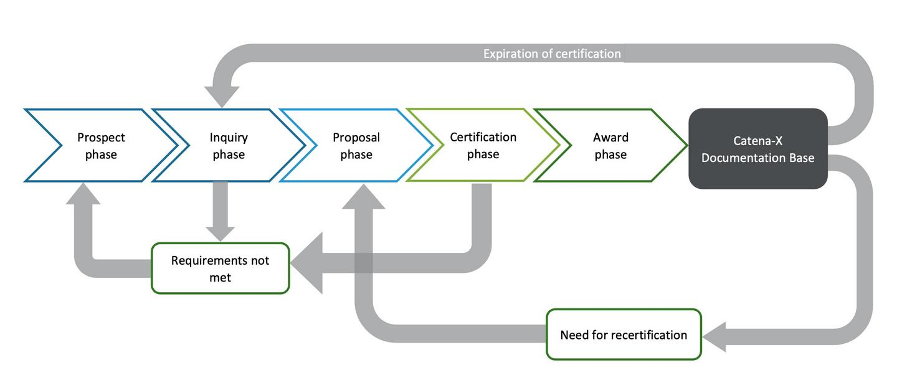
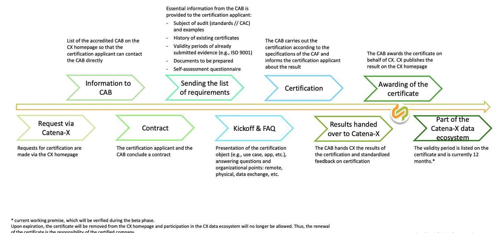
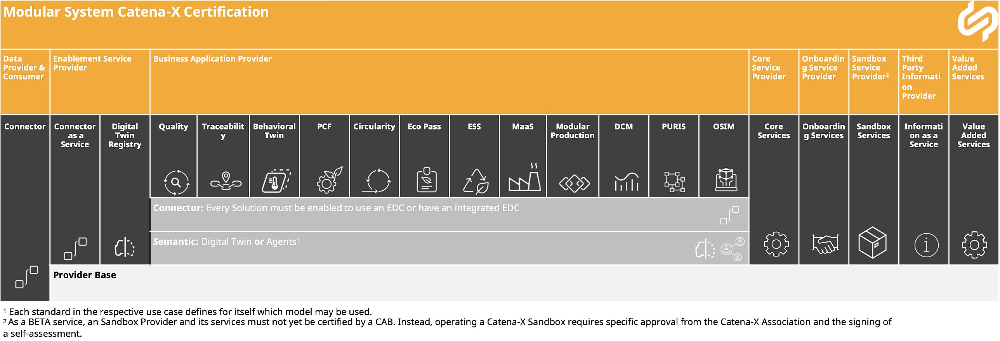
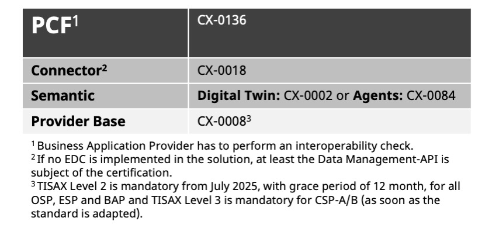

# Catena-X Certification

## Our Certification Process

The Catena-X certification process ensures that the solutions offered comply with the Catena-X principles such as data sovereignty and interoperability. Application and service providers must take this process into account, as only certified solutions can be offered on a Catena-X marketplace.

To become part of the Catena-X ecosystem, the individual components of the network must prove that they comply with our key principles. We explain here how you can become certified for Catena-X.

## What are our key principles?

The Catena-X Automotive network is based on two fundamental principles: **Interoperability** and **data sovereignty**. We firmly believe in the great added value that results from sharing data across company boundaries. We also believe that this data exchange must be based on mutually agreed guidelines to ensure security and sovereignty for all network participants. These eponymous data chains are the key idea behind our data ecosystem.

## What are the benefits of the network and why should you join?

Deeply integrated IT landscapes in modern companies enable the collection and utilisation of data that was unthinkable just a few years ago. Business processes benefit greatly from this progress and many innovations have only become possible as a result. The value of data as an asset is constantly increasing, especially as data is considered to be highly sensitive. For this reason, the next step in utilising this data across company boundaries multiplies the opportunities, but at the same time increases the risks to the same extent. Cross-company processes enable a new level of efficiency and innovation. The misuse of data, on the other hand, can lead to inefficiency and competitive disadvantages.

Thanks to the basic principles - interoperability and data sovereignty - which are firmly anchored at Catena-X, these opportunities can be exploited, and the risks minimised through updated standards and certification. The standards are the sole basis for certification and certification by Catena-X is strictly based on what a standard contains. This enables the principles to be ensured at all levels of the data ecosystem.

## How does certification contribute to the success of Catena-X?

Cross-company interactions are based to a large extent on mutual trust. Our certifications create trust through transparency and reliability based on our Catena-X standards. By establishing a certification process, we guarantee that our key principles are taken into account in every component of the network.

From the core service providers to the data connectors and every single application in the network, a standardised framework has been created to ensure beneficial participation in the network. A chain is only as strong as its weakest link. To gain trust, we need to ensure that all links are as strong as possible.

## What does the certification process look like?

  
*Certification process*

The certification process consists of a total of seven phases:

| Phases of the certification process                                         |
|-----------------------------------------------------------------------------|
| 1. Prospectphase                                                            |
| 2. Inquiryphase: Request via Catena X, Information to CAB                   |
| 3. Proposalphase: Contract, Sending the list of requirements, Kickoff & FAQ |
| 4. Certificationphase: Certification, Results handed over to Catena-X       |
| 5. Awardphase: Awarding the certificate                                     |
| 6. Catena-X: Part of the Catena-X data ecosystem                            |
| 7. Recertification: after 12 months a recertification is required           |

  
*Phases of the certification process*

## What is the framework for certification?

Certification is carried out in a modular, role-based manner in order to fulfil the different requirements of the participants in our ecosystem. These can be IT application providers, service providers or operating partners alike. The modularity enables a high degree of flexibility and reduces the effort and redundancies for all participants.

  
*Modular certification*

  
*Modular approach*

|                                                                          Phase                                                                         |                                                        Example PCF                                                       |
|:------------------------------------------------------------------------------------------------------------------------------------------------------:|:------------------------------------------------------------------------------------------------------------------------:|
|                                                  1. Determining the corresponding certification role                                                   |                                              Business Application Provider                                               |
|                                      2. Definition of the certification scope based on the respective capability                                       |                                                            PCF                                                           |
| 3. Provision of all required certificate modules including a list of standards of the Conformity Assessment Body against which conformity is checked   | Specific for PCF: CX-0136 Connector: CX-0018 Semantic: Digital Twin (CX-0002) or Agents (CX-0084) Provider Base: CX-0008 |

It is also possible to have your solution certified for several use cases or capabilities. In the case mentioned above - PCF - this would lead to synergy effects and the Connector, Semantic and Provider Base would not have to be certified a second time, as they are also included in other use cases or capabilities.

All relevant standards, including the corresponding conformity criteria, can be viewed at any time in the [Catena-X standard library](../../standards/overview.md).

### For which capabilities can I already be certified today?

- Connector
- Connector As a Service
- Digital Twin Registry
- Quality
- Traceability
- Behavioral Twin
- PCF
- Circularity
- Eco Pass
- ESS
- MaaS
- Modular Production
- DCM
- OSIM
- PURIS
- Core Services
- Onboarding Services
- Sandbox Services
- Information as a Service
- Value Added Services

## What is the current status of certification?

  
*Solution portfolio*

This overview shows in which areas and from which providers certified solutions are already available. Please click to enlarge.

## Who carries out the certification?

The standards that form the basis of our network are created and published by Catena-X e. V. We are constantly improving and expanding these standards in order to develop an ecosystem that actually supports cross-company processes. We are constantly improving and expanding these standards in order to develop an ecosystem that effectively supports cross-company processes. The standards are the sole basis for certification.

For the audit and issuing of certifications, we rely on proven audit companies that are aligned with our principles as Conformity Assessment Bodies (CABs). In the coming phases, the introduction of several CABs will also do justice to the philosophy of our decentralised ecosystem and ensure both freedom of choice for applicants and an incentive to offer high-quality services on neutral terms.

This standardised assessment of each component of the network based on a commonly agreed framework will enable a high level of transparency and comparability for all providers of services and applications for our members and users.

  
*Phases of the certification process*

## Get certified

Become part of the Catena-X network and offer your application or service in our growing ecosystem. Get in touch with one of our certification partners on the right.

Each CAB has been selected by the Catena-X Association and trained in our certification process and will guide you through the certification process. This includes the selection of the appropriate standards for your role or solution in the Catena-X ecosystem as well as the corresponding proof of conformity.  

To cover the costs of the certification process, the CAB charges a fee for each certification. The fees are transparently presented to each candidate in advance and may vary from CAB to CAB.

### Contact

**Ann-Kathrin Krause**, Certification & Governance Manager, [ann-kathrin.krause@catena-x.net](mailto:ann-kathrin.krause@catena-x.net)

**Official Catena-X CAB**, [cab@deloitte.de](mailto:cab@deloitte.de)
