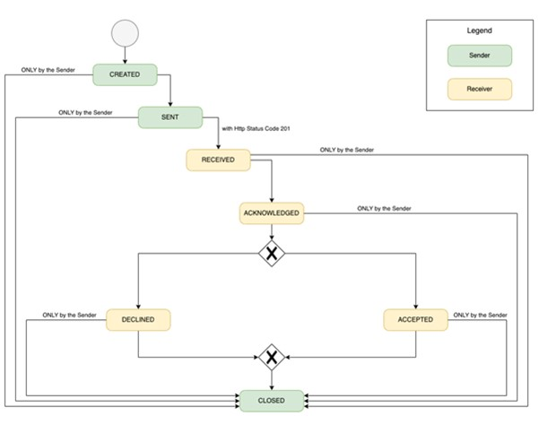
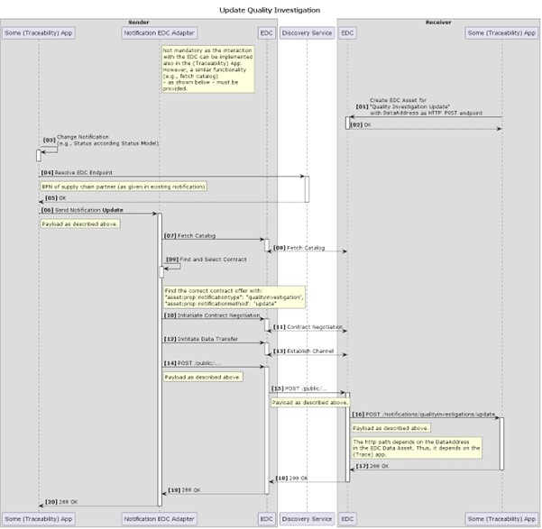
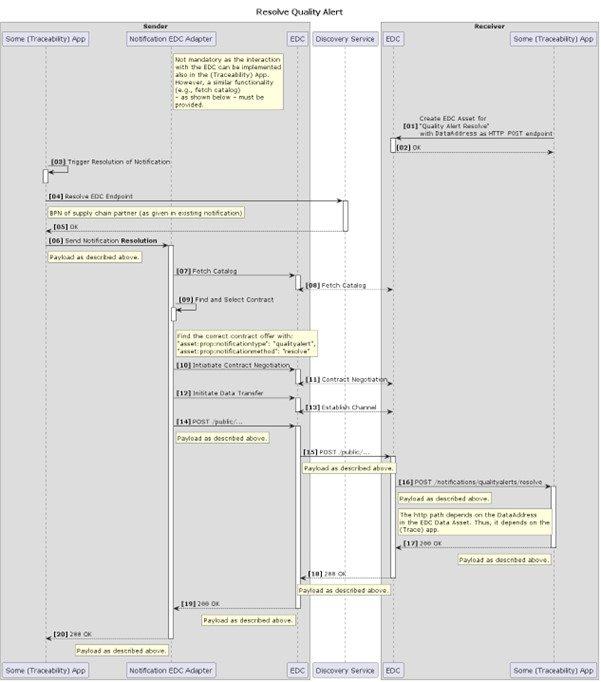

# CX-0022 Notification Process v1.1.1

## ABSTRACT

This document describes the minimal requirements of the notification
process a traceability application or application stack needs to fulfil
for being interoperable within the Catena-X platform. It also
illustrates common practices for identifying the correct receiving
endpoint when sending a notification. In that sense, the below
specification should in no way be regarded as a general solution pattern
for notifications across various use cases. The current process does not
go beyond the sending and receiving of quality notifications and quality
investigation requests.

## 1. Introduction

This document describes the minimal process to be covered by a
traceability application or application stack in order to exchange
notifications within Catena-X with other applications in an
interoperable manner.

The data formats and/or API to be built on top of the application to
support receiving notifications is described in a separate standard.

### 1.1 Audience & Scope

> *This section is non-normative*

This standard applies to the following roles:

- Data Provider / Consumer
- Business Application Provider

This standard applies to Traceability Applications or Application stacks
and participants that want to exchange quality notifications and quality
investigation data leveraging Traceability solutions.

The process described is built upon the Notification API described in
CX-0023. This standard rather describes the protocol for exchanging
updates of status for notifications exchanged via CX-0023.

### 1.2 Context

> *This section is non-normative*

The Traceability Notification API as described in a separate standard,
has to be used and implemented by all applications in order to be
interoperable.

The whole data transfer within Catena-X leverages the IDSA protocol,
which is another standard within Catena-X.

The IDSA protocol is currently being introduced by leveraging the
reference implementation of an IDSA compliant connector named Eclipse
Dataspace Connector, which is a separate standard.

### 1.3 Architecture Overview

> *This section is non-normative*

This standard does not describe an architecture. It rather describes a protocol.

The is exchanged in between Traceability applications or application stacks leveraging EDC or any other IDS compliant connector on both ends.

### 1.4 Conformance

As well as sections marked as non-normative, all authoring guidelines,
diagrams, examples, and notes in this specification are non-normative.
Everything else in this specification is normative.

The key words MAY, MUST, MUST NOT, OPTIONAL, RECOMMENDED, REQUIRED,
SHOULD and SHOULD NOT in this document are to be interpreted as
described in [BCP
14](https://datatracker.ietf.org/doc/html/bcp14) \[[RFC2119](https://www.w3.org/TR/did-core/#bib-rfc2119)\]
\[[RFC8174](https://www.w3.org/TR/did-core/#bib-rfc8174)\] when, and
only when, they appear in all capitals, as shown here.

### 1.5 Proof of conformity

> *This section is non-normative*

All participants and their solutions will need to prove they conform
with the Catena-X standards. To validate that the standards are applied
correctly, Catena-X employs Conformity Assessment Bodies (CABs).

Due to the lack of a testbed, which could be interacting with the
application or data provider/consumer to be certified, a self-assessment
is deemed sufficient at this point.

### 1.6 Examples

> *This section is non-normative*

Payload examples are given in the CX-0023 description.

### 1.7 Terminology

> *This section is non-normative*

**Business Partner Number (BPN)**

A BPN is the unique identifier of a partner within Catena-X.

**IDSA/IDSA Protocol**

Protocol being used for data exchange in an International Dataspace.
This includes contract negotiation.

**Eclipse Dataspace Connector (EDC)**\
IDS conformant Connector

**Asset Administration Shell (AAS)**

The Asset Administration Shell is a digital representation of an asset.
It is a form of a digital twin.

## 2. Notification process

The process takes place in between traceability applications or
application stacks, and the focus is on minimal interaction, which MUST
be supported by all applications participating in a quality notification
or quality investigation scenario.

Application internals like user journeys, process steps or workflows in
an application are not standardized within Catena-X, and therefore
omitted.

### 2.1 Actors and Roles

Catena-X does not standardize user-roles at the moment. The actors are
traceability applications of the companies in a supply chain.

### 2.2 Process Representation

The exchange of notifications follows the IDSA protocol.

On top, a notification state model has been described.

#### 2.2.1 Notification State Model

The notification itself has various states. The states and their cycle are described in the following picture (Figure 1):

***Figure 1: Description of Process***

The state of a notification MUST be exchanged via the notification API
\[CX-0023\].

#### 2.2.2 Processes for Sending, Updating and Resolving Notifications

Below the sequence for sending, updating, and resolving of notifications
between (traceability) applications is shown in UML sequence diagrams.
In all cases, HTTP POST requests MUST be used. The corresponding HTTP
endpoints are described in the Traceability Notification API
specification.

To read the UML sequence diagrams correctly, some remarks below:

- The shown Notification EDC Adapter is not mandatory. It is just one option to send a notification via the EDC control and data plane. It is important, that a similar functionality must be provided/implemented by the (traceability) application vendor. The Notification EDC Adapter or a similar component / functionality will not be provided as a central service from Catena-X.
- To discover where a notification MUST be sent to, the (traceability) application MUST resolve the BPN of the receiver. This can either happen through the (traceability) application holding this information in its data model, or it could - alternatively - also be resolved e.g. via a lookup of the digital twin in the central asset administration shell (AAS) registry or by using services from the BPDM use case.
- The resolution of the EDC URL for a given BPN SHOULD be done via the EDC Discovery Service API \[CX-0001\]. The entry for each EDC into this Discovery Service is done via the Catena-X Portal.
- In each UML sequence diagram the step \[01\] describes the publishing of the notification endpoints as described in the above sections.

1. **Sending and receiving of a quality investigation**

Below, the UML sequence diagram to send and receive a quality investigation is depicted.

In addition to the above-mentioned general remarks, the following remark has to be mentioned:

- The status transition from SENT to RECEIVED MUST be done by the
    > sender once it received the Http status code 201 from the receiver

***Figure 2: Send and Receive Quality Investigation***

#### 2.2.3 Sending and receiving of a quality alert (optional)

Below, the UML sequence diagram to send and receive a quality alert is depicted.

In addition to the above-mentioned general remarks, the following remark has to be mentioned:

- The status transition from SENT to RECEIVED MUST be done by the
    > sender once it received the Http status code 201 from the receiver

***Figure 3: Send and Receive Quality Alert***

#### 2.2.4 Update of a quality investigation  

Below, the UML sequence diagram to update a quality investigation is depicted.

***Figure 4: Update Quality Investigation***

#### 2.2.5 Update of a quality alert  

Below, the UML sequence diagram to update a quality alert is depicted.

***Figure 5: Update Quality Alert***

#### 2.2.6 Resolve of a quality investigation (optional)

Below, the UML sequence diagram to resolve a quality investigation is depicted.

***Figure 6: Receive Quality Investigation***

#### 2.2.7 Resolve of a quality alert (optional)

Below, the UML sequence diagram to resolve a quality alert is depicted.

***Figure 7: Resolve Quality Alert***

## 3. References

### 3.1 Normative References

- CX-0023 NOTIFICATION API
- CX-0013 IDETITY OF MEMBER COMPANIES
- CX-0001 EDC DISCOVERY SERVICE API
- CX-0010 BUSINESS PARTNER NUMBER
- CX-0002 DIGITAL TWINS IN CATENA-X
- CX-0018 ECLIPSE DATA SPACE CONNECTOR (EDC)

## Legal

Copyright © 2024 Catena-X Automotive Network e.V. All rights reserved. For more information, please visit [here](/copyright).
