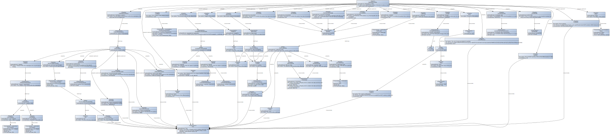

# CX-0035 Data Model: Marketplace offer v1.0.0

## Abstract

As a central component on the part of Catena-X to enable a circular
economy, a data model is needed that describes products and their
materials and components. The necessary combination of ecology and
economy to enable a functioning circular economy is realized via the
marketplace.

Products are offered and bought for this purpose. By linking with other
components, such as the product passport or circularity dashboard, the
marketplace also provides a relevant information base for calculating
scenarios, integrating R-decisions into the purchasing process or
accessing digital product passports and the digital twins behind them.

The present data model forms the basis for this. In order to make the
relevant processes in the marketplace scalable and interoperable, a
reference implementation is required.

## 1. Introduction

The data model "marketplace offer" includes all needed information to
place a marketplace offer on a marketplace. It is in the general
interest of all parties involved to be provided with the relevant
information necessary to complete the transaction intended, e.g., to buy
a used part from the marketplace.

A marketplace is a matchmaking platform that is operated by a
participant of the network. Thus, even though data models are being
generated as reference implementations and communication scenarios and
user journeys are being commonly defined, for a rapid value generation
inside the network it is essential to also provide capabilities above
and beyond the agreed network scenarios.

This mainly concerns manual interactions with the marketplace user
interface and interfaces, as direct interactions between a seller and
the marketplace or a buyer and the marketplace are not necessarily
network interoperability scenarios. Instead, they are transaction-based
interactions, such as the creation of a listing by a seller with the
intention of achieving maximum visibility for all potential buyers.

## 2. Purpose of the Document

The purpose of this document is to describe the Asset Administration
Shell submodel marketplace offer. It includes all needed information to
place a marketplace offer on a marketplace. The presented data model is
described and illustrated in the following with the entities and
properties and their interrelationships.

## 3. Scope of the Implementation

This chapter serves to situate the given reference implementation, to
outline its prerequisites and to point out its limitations.

### 3.1 Preconditions and Dependencies

Like all Catena-X data models, this model will be available in a
machine-readable format on GitHub[^3].

This aspect model is written in BAMM 2.0 as a modeling language, which
is a separate industry standard from the open manufacturing platform,
see Open Manufacturing[^4].

The data contained in this Catena-X data model is requested and
exchanged via Catena-X using an Eclipse Dataspace Connector (EDC), which
is a separate Catena-X standard and an implementation of the IDSA
standard.

### 3.2 Constraints and Limitations

There are no constraints and limitations to this reference
implementation document.

## 4. Data Model

The data model is described in BAMM and is available in the semantic hub
from which the following description originates.

### 4.1 Overview

This chapter provides the information of the structure of the BAMM
Model. It provides information about the properties, entities,
characteristics and units of the data model. Each data model references
a concrete Aspect Model.

The Meta Model is specified using the Resource Description Format (RDF)
and the Terse RDF Triple Language syntax (TTL), together with validation
rules in the Shapes Constraint Language (SHACL). Aspect models are
likewise specified in RDF/Turtle, following BAMM semantics. The
graphical representation of the MarketplaceOffer data model can be found
in the annex.

The graphical representation of the battery pass data model can be found
in the annex.

|     MarketplaceOffer    |                                                                                                 |
|-------------------------|-------------------------------------------------------------------------------------------------|
|     Description         |     Description of all   needed information to place a marketplace offer on the marketplace.    |
|     Name                | MarketplaceOffer |

### 4.2 Properties & Entities

The corresponding TTL-file for the aspect model from chapter 2.1 can be accessed via the following link:

[Semantic Hub - Marketplaceoffer](https://github.com/eclipse-tractusx/sldt-semantic-models/blob/main/io.catenax.market_place_offer/1.2.0/MarketplaceOffer.ttl)

In addition to the technical representation of the semantic model through the linked TTL-file, the file can also be imported into the official BAMM Aspect Model Editor for further use. For example, the actual aspect model can be visually displayed or an HTML documentation can be generated, encompassing all properties and entities in a table-like form.

The BAMM Aspect Model Editor is open source and can be downloaded via the official website: [BAMM Aspect Model Editor Landing Page](https://www.bosch-connected-industry.com/de/de/downloads/aspect-model-editor)

The official documentation and installation instructions can be accessed via the open manufacturing platform: [BAMM Documentation](https://openmanufacturingplatform.github.io/sds-documentation/ame-guide/4.0.2/introduction.html).

## 5. Normative References

The following references refer to related Catena-X reference
implementations and external standards. This is intended to place the
present reference implementation in the context of existing references.

### 5.1 Catena-X Reference implementations

|     CATENA-X REFERENCE   IMPLEMENTATIONS    |                                                     |
|---------------------------------------------|-----------------------------------------------------|
|     SC-009                                  |     Catena-X standardized models                    |
|     CX - 0003                               |     BAMM   Aspect Meta Model                        |
|     CX - 0010                               |     Business Partner Number                         |
|     SC-002                                  |     Catena-X   Eclipse Dataspace Connector (EDC)    |
|     SC-012                                  |     Semantic Hub                                    |
|     CX - 0034                               |     Data   Model BatteryPass                        |

### 5.2 Common Standards

IDSA: International Data Spaces Association[^5]

## Glossary

### Terms & Definitions

R-strategy: R-strategies serve to change the companies’ business mod-els in the context of the circular economy

### Abbreviations

|     Abbreviations    |     Description                              |
|----------------------|----------------------------------------------|
|     EoL              |     End of life                              |
|     OEM              |     Original   Equipment Manufacturer        |
|     BOM              |     Bill of material                         |
|     EDC              |     Eclipse   Dataspace Connector            |
|     IDSA             |     International Data Spaces Association    |

## ANNEXES

### FIGURES

[^1]: https://catena-x.net/fileadmin/user_upload/Vereinsdokumente/Catena-X_IP_Regelwerk_IP_Regulations.pdf

[^2]: https://catena-x.net/de/standardisierung/catena-x-einfuehren-umsetzen/standardisierung/standard-library

[^3]: https://github.com/eclipse-tractusx/sldt-semantic-models

[^4]: https://openmanufacturingplatform.github.io/

[^5]: https://internationaldataspaces.org/we/the-association/

## Legal

Copyright © 2025 Catena-X Automotive Network e.V. All rights reserved. For more information, please visit [here](/copyright).
