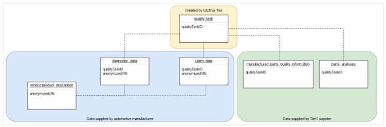

# CX-0036 Aspect Model: Quality Task v1.0.2

## 1. Introduction

This document describes the semantic model Quality Task used in the
Catena-X network.

### 1.1 Audience & Scope

> *This section is non-normative*

The described semantic model is relevant for:

- Data Provider / Consumer
- Business Application Provider

### 1.2 Context

> *This section is non-normative*

The Catena-X use case Live Quality Loops (QAX) uses multiple data models
to exchange data between automotive manufacturer (OEM) and component
supplier (TIER1). Each of these data models can be supplied
independently.

The Quality Task data model defines the root element for Catena-X-based
quality work. It describes the quality task and why two or more
companies want to work collaboratively on a quality topic.

### 1.3 Conformance

As well as sections marked as non-normative, all authoring guidelines,
diagrams, examples, and notes in this specification are non-normative.
Everything else in this specification is normative.

The key words MAY, MUST, MUST NOT, OPTIONAL, RECOMMENDED, REQUIRED,
SHOULD and SHOULD NOT in this document are to be interpreted as
described in [BCP
14](https://datatracker.ietf.org/doc/html/bcp14) \[[RFC2119](https://www.w3.org/TR/did-core/#bib-rfc2119)\]
\[[RFC8174](https://www.w3.org/TR/did-core/#bib-rfc8174)\] when, and
only when, they appear in all capitals, as shown here.

### 1.4 Proof of conformity

> *This section is non-normative*

All participants and their solutions will need to prove they conform
with the Catena-X standards. To validate that the standards are applied
correctly, Catena-X employs Conformity Assessment Bodies (CABs).

For Data Provider: To prove conformity you have to fulfill all MUST
criteria mentioned in chapter [Normative criteria for Data
Provider](#221-normative-criteria-for-data-provider).

There is no proof of conformity necessary for Data Consumer.

For Business Application Provider: To prove conformity you have to
fulfill all MUST criteria mentioned in chapter [Normative criteria for
Business Application
Provider](#222-normative-criteria-for-business-application-provider).

A model validator must be created, to prove the correctness of the data
model. A generic test set created for the model must proof the expected
results.

### 1.5 Examples

Example payload in JSON format:

```json
{
   "component":"ComponentA",
   "listOfCompanies":[
      {
         "cxBPN":"BPN-8110",
         "name":"testCompanyA",
         "email":"Horst.Schlemmer@testCompanyA.de"
      },
      {
         "cxBPN":"BPN-0711",
         "name":"testCompanyB",
         "email":"Evje.van.Dampen@testCompanyB.de"
      }
   ],
   "qualityTaskId":"BPN-811_2022_000001",
   "description":"Early Warning of vehicle model A",
   "creationDate":"2019-04-01T14:00:00",
   "title":"Early Warning A",
   "status":"new",
   "dataDeletion":"delete-data-after-closing"
}
```

### 1.6 Terminology

> *This section is non-normative*

**Business Partner Number (BPN)**

A BPN is the unique identifier of a partner within Catena-x.

## 2. Aspect Model Quality Task

### 2.1 Introduction

Catena-X use case "Live Quality Loops"(QAX) uses several Catena-X
standardized data models to exchange data:



***Figure 1: Hierarchy of Catena-X data models used in QAX***

Data models in QAX and their content:

- QualityTask is the root element and describes why companies are working together on a quality topic and what they want to do. All involved companies and their contact people are named. In addition, a flag tells what should be done with exchanged data after a QualityTask is closed.
- Vehicle.ProductDescription: This data model is a representation of one vehicle affected by this QualityTask. The model represents the vehicle when it was sold to the end-customers from an end-customers point of view: Which standard equipment was installed in the vehicle and which extra equipment was installed in the vehicle.
- Fleet.DiagnosticData: Diagnostic data coming from multiple vehicles that are affected by this QualityTask + Diagnostic data from similar vehicles that are not affected by this QualityTask.
- Fleet.ClaimData: Customer complaints that are linked to this QualityTask + Data about the exchange of potentially faulty parts
- ManufacturedPartsQualityInformation: A selection of manufacturing-related parameters that help to solve the QualtiyTask
- PartsAnalyses: Analyses results of replaced and potentially faulty parts that are linked to this QualityTask

### 2.2 Normative Criteria

The usage of the described semantic model "Quality Task" is a MUST for
Data Provider and Data Consumer that want to work together on a quality
topic over Catena-X automotive network.

#### 2.2.1 Normative criteria for Data Provider

Every data provider of "Quality Task" data MUST provide the data
conformant to the semantic model specified CX-0036.

A data provider of "Quality Task" data MUST ensure that the identifier
qualityTaskId is unique by using his Catena-X company business partner
number (see separate Catena-X standard) followed by a unique number
inside his company.

In the Catena-X data space "Quality Task" data MUST be exchanged via
Eclipse Dataspace Connector (EDC) conformant to CX-0018.

It is RECOMMEND to use Apache parquet[^3] file format together with EDC
S3 data plane for file data exchange for "Quality Task" data.

#### 2.2.2 Normative criteria for Business Application Provider

It is a MUST for Business Application Provider to support at least 2
standardized Catena-X QAX aspect models from Catena-X Release 3.0 (2 out
of Catena-X standards CX -- 0036, CX -- 0037, CX -- 0038, CX -- 0039, CX
-- 0040, CX -- 0041) to get the label "Catena-X Certified Solution" for
their quality application.

It is RECOMMEND for Business Application Provider to be able to read the
semantic model "Quality Task".

### 2.3 License

This Catena-X data model is an outcome of Catena-X use case group Live
Quality Loops (QAX). This Catena-X data model is made available under
the terms of the Creative Commons Attribution 4.0 International
(CC-BY-4.0) license, which is available at Creative Commons[^4].

The license information is available in github.

In case of doubt the license, copyright and authors information in
github overwrites the information in this specification document.

### 2.4 Identifier of Semantic Model

This semantic model "Qualtiy Task" has the unique identifier

urn:bamm:io.catenax.quality_task:1.0.0

### 2.5 Formats of Semantic Model

#### 2.5.1 RDF Turtle

The rdf turtle file, adhering to the Semantic Aspect Meta Model, is the
master for generating additional file formats and serializations. It is
provided here:

https://github.com/eclipse-tractusx/sldt-semantic-models/tree/main/io.catenax.quality_task/1.0.0

The open source command line tool of the Eclipse Semantic Modeling
Framework[^5] is used for generation of other file formats like
for example a JSON Schema, aasx for Asset Administration Shell Submodel
Template or a HTML documentation.

#### 2.5.2 JSON Schema

A JSON Schema can be generated from the RDF Turtle file using the
Eclipse ESMF tooling. The JSON Schema defines the Value-Only payload of
the Asset Administration Shell for the API operation \"GetSubmodel\".

If present, example JSON-payloads MUST validate against the generated
JSON schema.

## 3. References

### 3.1 Normative References  

- CX-0003 SEMANTIC ASPECT META MODEL  
- CX-0004 GOVERNANCE PROCESS FOR SEMANTIC MODELS  
- CX-0018 ECLPISE DATA SPACE CONNECTOR (EDC)

[^3]: https://parquet.apache.org/

[^4]: https://creativecommons.org/licenses/by/4.0/legalcode

[^5]: https://github.com/eclipse-esmf/esmf-sdk

## Legal

Copyright © 2025 Catena-X Automotive Network e.V. All rights reserved. For more information, please visit [here](/copyright).
