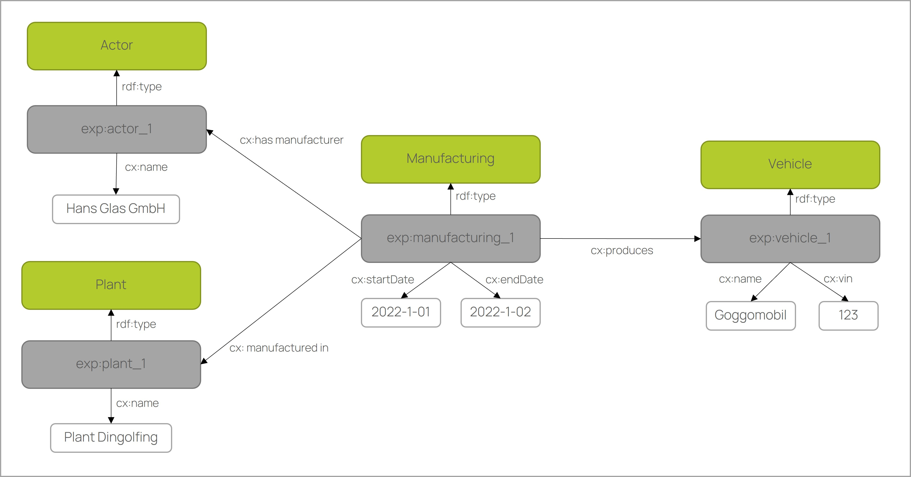

# CX-0067 Ontology Models to realize federated query in Catena-X v.1.0.0

## ABSTRACT

This standard gives fundamental guidelines to create ontology models for being used in Catena-X. It provides the semantic basis for the so called Knowledge Agent Approach that utilizes semantic web technologies for federated queries in data spaces (see Catena-X standard CX0084).

## 1. INTRODUCTION

Semantics is the art and science of understanding what data means. In the context of Catena-X this topic has a significant importance in the sense that data provider and consumer need to have the same understanding what data needs to be shared (see also [FAIR data](https://en.wikipedia.org/wiki/FAIR_data)). In the knowledge agent approach, ontologies are used to describe the semantics of data. Ontologies are similar to data models or data schemas in which the semantics and structure of data are described. In addition, ontologies provide a high degree of semantic expressiveness, i.e. formal semantics. This means that there is a logical system behind the ontologies. This allows automatic inference on data like "p-123" is_a part and part is_a physical object => "p-123" is_a physical object. Such inference enables strong typing of data. This way the machine can understand the meaning of the vocabulary 'part', that it is a physical object and not a document part or a design model part. It could be that the same vocabularies are used for different things in different data models. The formal semantics of ontologies prevent such misunderstandings in data caused by synonymity or homonymity, etc. and lead to better collaboration and interoperability among data space participants. On the other hand, the ontology-based approach represents the underlying data in assets as a graph structure. This allows flexible querying of typed and linked data.

In applying the ontology-based data modelling in Catena-X, the following fundamentals should be achieved:

- Maximise Semantics
- Reduce Complexity
- Minimise Redundancy

The aim of this standard is to make sure that ontology models are designed with the right quality and in a harmonized way that is compatible to the knowledge agents data processing mechanisms (CX0084).The ontology-based data modelling in Knowledge Agent Approach is explained in detail in section [1.2.1 MODELLING CONCEPT](#121-modelling-concept).

### 1.1 AUDIENCE & SCOPE

> *This section is non-normative*

In general, this standard applies to the usage of ontologies in Catena-X with a specific focus on the Knowledge Agents data processing pattern (CX0084). Thus, this standard does not inhibit the usage of other data models, such as SAMM standard for other Catena-X data processing patterns (e.g. for Digital Twin/Asset Administration Shell approach). If any other applications of ontologies in Catena-X emerge or already existing external ontologies shall be included/linked for Catena-X application, this standard will be revised accordingly (if applicable).

The following stakeholders are addressed in particular by this standard:

- **Business Application Providers** that create/request specific models/ model extensions to make their application and or business logic work (relevant for certification if solutions are based on knowledge agent approach for data processing).

- **Data Providers** that need to supply data and or functional logic based on given specification of an ontology model (not relevant for certification).

- **Enablement Service Providers** that offer data integration solutions, e.g. for mapping of ontology models to corporate-internal data models (relevant for certification if solutions for knowledge agent approach are provided).

- **Catena-X e.V.** will have a significant role of supervising ontology development (governance process for model development and respective quality criteria, not relevant for certification).

Created ontology models can be utilized as semantic basis for the so called "knowledge agent" approach to exchange data across Catena-X participants. This standard will reference required external standards. Furthermore, it will provide modelling guidelines that extend/restrict given W3C standards to decrease complexity and to make sure that the models are designed in a unified way compatible with CX0084 (knowledge agent standard).

### 1.2 CONTEXT AND ARCHITECTURE FIT

The knowledge agent approach uses the [Semantic Web standards](https://www.w3.org/2001/sw/wiki/Main_Page). The [Semantic Web](https://en.wikipedia.org/wiki/Semantic_Web) is the semantic extension of the Web. In the Web, the content of Web pages is exchanged in a document-based way (Web of Documents). This has the disadvantage that a direct access to a certain content of the documents is not possible. Therefore, a new concept was developed in which the contents of documents are decomposed into data and described by data models (Web of Data). At the same time, a query language was developed with which the desired content can be queried directly. In the Semantic Web, the data models are called ontologies, based on the philosophical meaning 'study of being', because the data on the Web is the digital representation of things in the real world. Semantic Web ontologies are formal languages in which data can be described unambiguously and without redundancy. This makes the ever-growing volumes of data on the web more manageable and usable to generate new knowledge. A good example is the [DBpedia project](https://en.wikipedia.org/wiki/DBpedia), which makes Wikipedia content available as data. In recent years, Semantic Web standards have been increasingly used in enterprises to create enterprise-wide [knowledge graphs](https://en.wikipedia.org/wiki/Knowledge_graph) to structure internal big data and make it queryable to create knowledge. This concept is extended in the [Knowledge Agent standard](https://catena-x.net/fileadmin/user_upload/Standard-Bibliothek/Update_September_2023/CX-0084-FederatedQueriesInDataSpaces-v1.0.0.pdf) to realize data exchange across the Catena-X dataspace.

Semantic Web Standards used in knowledge agent approach

- [OWL 2 QL Profile](https://www.w3.org/TR/owl2-profiles/#OWL_2_QL) for modelling ontologies,
- [OWL 2 RL Profile](https://www.w3.org/TR/owl2-profiles/#OWL_2_QL) for modelling common dataspace assets,
- [SKOS](https://www.w3.org/2004/02/skos/) for vocabularies,
- [RML](https://rml.io/specs/rml/) & [R2RML](https://www.w3.org/TR/2012/REC-r2rml-20120927/) for mapping data source model to asset model to provide data in an asset,
- [SHACL](https://www.w3.org/TR/shacl/) for data quality check and for describing which data is available in the asset and in which form,
- [RDF](https://www.w3.org/TR/rdf12-concepts/) for description and exchange of graph data,
- [Turtle](https://www.w3.org/TR/turtle/) for persisting,
- [SPARQL](https://www.w3.org/TR/sparql11-query/) profiles for transfering logic and querying catalogues, data and functions.

#### 1.2.1 Modelling Concept

This section explains the concept of ontology-based data modelling of the knowledge agent approach. Furthermore, it is shown how the query of distributed data in dataspaces works on the basis of this concept.

##### **Modelling with Ontologies**

In the Knowledge Agent approach, the data is modelled with the Semantic Web Ontology language [OWL](https://www.w3.org/TR/2012/REC-owl2-primer-20121211/). This enables object-oriented modelling of domains with classes, attributes and relationships. Object-oriented modelling allows the modelling of a domain from general to specific by creating subclasses. The first step is to define the main classes that describe the domain. In the case of Catena-X, five main classes were defined.

- Activity: This class comprises actions that are intentionally performed by instances of the actor over the course of the product life cycle and result in state changes in physical and conceptual objects.
- Actor: This class comprises organization, device or people, either individually or in groups, who have the potential to perform intentional actions of kinds for which someone may be held responsible.
- Physical object: This class includes objects of a material nature, which are documentation units and have physical boundaries.
- Conceptual object: This class includes non-material products, human-produced data related to physical objects. The production of such information may have been supported by the use of technical tools.
- Place: The class Place is determined by reference to the position of objects such as buildings, cities, or special geographic markers.


#### Activity-centred Modelling

A well-known approach is the activity-centered or event-based modelling. The [CIDOC CRM](https://www.cidoc-crm.org/) ontology provides this idea and the main classes used. In this approach the classes actor, place, physical object and conceptual object are connected through activities. Instead of assigning all information to the physical object. This distributed representation has several advantages:

- The life cycles of products and documents are represented separately and clearly.
- The activities have a start and end date so that the data can be queried chronologically.
- The data can be viewed and queried from different perspectives.
  - Identifies all actors (e.g. companies) involved in an activity (e.g. manufacturing).
  - Identifies all activities performed on a physical object (vehicle).
  - Finds all activities that have been performed at a place.
  - Searches for all physical objects (e.g. material) used in an activity (e.g. manufacturing).
  - Search for conceptual objects related to a physical object in an activity.


#### Core and Domain Ontologies

The concept described above is the basic modelling pattern in Knowledge Agent. We call it the [core ontology](https://w3id.org/catenax/ontology/core). Based on this ontology, specific domain ontologies can be modelled. A domain ontology can be created based on subclasses (e.g. Manufacturing is SubClassOf Activity), subrelations (e.g. has Manufacturer is SubPropertyOf has Participant) and subattributes. The domain ontology has the same structure as the core ontology, but can be extended to include additional classes. The Knowledge Agent approach uses OWL 2 QL for modeling. This is a subset of OWL 2 Full. The reason for this is that it includes most of the main features of conceptual models such as UML class diagrams and ER diagrams. It also provides polynomial time inference for large data sets.

Benefits of the basic modelling pattern:

- Easy for domain experts to understand and create new domain ontologies.
- Data is represented in datasets using the same pattern.
- Data can be queried with general queries such as 'Get All Actors' or specific queries such as 'Get Manufacturer'.


#### **Data binding**

In the ontology-based approach, the data is serialised in graph structure using the Resource Description Framework (see [RDF](https://www.w3.org/TR/rdf12-concepts/)). Each node, also called a resource, is uniquely identified by a [URI](https://www.w3.org/wiki/URI). The edges are called property in RDF Graph because each relation forms a [subject-predicate-object triple](https://www.w3.org/wiki/SubjectPredicateObject). The nodes can be linked to other nodes (so-called object property). The relations used are from the Domain Ontology. At the same time, nodes can be linked to literals (so-called datatype property). With the property rdf:type, the nodes can be instantiated with domain classes.



The RDF graphs are stored in [RDF databases](https://www.w3.org/wiki/LargeTripleStores) (so-called triple store) and can be serialised in various formats such as xml, json, ttl, etc. Different data sources such as relational databases, XML, JSON and CSV files can be mapped to RDF graphs using standardised languages such as RML and R2RML. Based on the mapping, the data can be transformed or virtualised. Virtualisation allows the data to be processed as RDF graphs without transforming it and storing it in a different location.

#### **Data Query**

The RDF graphs can be accessed using the SPARQL query language via a SPARQL HTTP protocol. SPARQL allows the definition of complex instance relationships and the search for the defined patterns in the RDF graphs.

General query example: Returns all physical objects and their name and activities.

```s
PREFIX cx: <https://w3id.org/catenax/ontology/core#>
PREFIX rdf: <http://www.w3.org/1999/02/22-rdf-syntax-ns#>
PREFIX exp: <http://www.example.com#>

select ?activity ?physicalObject
where {
  ?activity rdf:type cx:Activity.
  ?physicalObject rdf:type cx:PhysicalObject.
  ?physicalObject cx:name cx:PhysicalObject.
  ?activity cx:refersToPhysicalObject ?physicalObject.
}
```

Query result (for mime-type "text/csv"):

| ?activity   | ?physicalObject |?name|
| ----------- | ----------- | ----------- |
|exp:manufacturing_1|exp:vehicle_1|"Goggomobil"|

The same result (for mime-type "application/sparql-results+json"):

```s
{
    "head": {
        "vars": [
            "activity",
            "physicalObject",
            "name"
        ]
    },
    "results": {
        "bindings": [
            {
                "activity": {
                    "type": "uri",
                    "value": "http://www.example.com#manufacturing_1"
                },
                "physicalObject": {
                    "type": "uri",
                    "value": "http://www.example.com#vehicle_1"
                },
                "name": {
                    "type": "literal",
                    "value": "Goggomobil"
                }
            }
        ]
    }
}
```

Specific query example: Returns all vehicles and their name and manufacturing activities.

```s
PREFIX cx: <https://w3id.org/catenax/ontology/core#>
PREFIX rdf: <http://www.w3.org/1999/02/22-rdf-syntax-ns#>
PREFIX exp: <http://www.example.com#>

select ?activity ?physicalObject
where {
  ?activity rdf:type cx:Manufacturing.
  ?physicalObject rdf:type cx:Vehicle.
  ?physicalObject cx:name cx:Vehicle.
  ?activity cx:refersToPhysicalObject ?physicalObject.
}
```

Query result is the same as the first one:

| ?activity   | ?physicalObject |?name|
| ----------- | ----------- | ----------- |
|exp:manufacturing_1|exp:vehicle_1|"Goggomobil"|

#### Federated Query

An important advantage of SPARQL is that multiple repositories can be accessed from a single query. This feature gives Catena-X the great advantage of being able to query distributed data in different assets at the same time.


Federated query example: Returns all vehicle names from OEM Asset and for the same vehicles the names of the diagnosis results from Service Asset.

```s
PREFIX cx: <https://w3id.org/catenax/ontology/core#>
PREFIX rdf: <http://www.w3.org/1999/02/22-rdf-syntax-ns#>

select ?vehicleName ?vehicleVin ?diagnosisResultName
where {
  
  # OEM Asset
  SERVICE <https://catena-x.net/asset/oem/asset_1> {
    ?physicalObjectOEM rdf:type cx:Vehicle.
    ?physicalObjectOEM cx:vin ?vehicleVin.
    
    #Service Asset
    SERVICE <https://catena-x.net/asset/service/asset_2> {
      ?physicalObjectService rdf:type cx:Vehicle.
      ?physicalObjectService cx:vin ?vehicleVin.
      ?physicalObjectService cx:name ?vehicleName.
      ?activity rdf:type cx:Diagnosis.      
      ?activity cx:refersToPhysicalObject ?physicalObjectService.
      ?activity cx:refersToConceptualObject ?conceptualObject.
      ?conceptualObject cx:name ?diagnosisResultName.
    }
  }
}
```

Federated Query result (for mime-type "text/csv"):

| ?vehicleName   | ?vehicleVin | ?diagnosisResultName |
| ----------- | ----------- | ----------- |
|"Goggomobil"| "123" |"Cylinder misfire"|
|"Fliwatüt"| "0815" |"Rotor breakdown"|
|"Herbie"| "4711" |"Low Oil Pressure"|

#### Skill (Query)

A Skill in the Knowledge Agent approach is any Data/Federated Query which

- is parameterizable by a set of input variables
- is published in the dataspace as a contractible asset with a unique id
- maybe invoked either on consumer-side (by downloading the query test) or provider-side (by execution of the query)

For example, above federated query could be invoked under the assetname `SkillAsset?supplier=ListDiagnosis` and the following input parameter set (using contenttype "application/sparql-results+json")

```s
{
    "head": {
        "vars": [
            "vehicleVin"
        ]
    },
    "results": {
        "bindings": [
            {
                "vin": {
                    "type": "literal",
                    "value": "123"
                }
            },
            {
                "vin": {
                    "type": "literal",
                    "value": "4711"
                }
            }   
        ]
    }
}
```

Skill invocation result (for mime-type "text/csv"):

| ?vehicleName   | ?vehicleVin | ?diagnosisResultName |
| ----------- | ----------- | ----------- |
|"Goggomobil"| "123" |"Cylinder misfire"|
|"Herbie"| "4711" |"Low Oil Pressure"|

### 1.4 CONFORMANCE

As well as sections marked as non-normative, all authoring guidelines, diagrams,
examples, and notes in this specification are non-normative. Everything else in
this specification is normative.

The key words **MAY**, **MUST**, **MUST NOT**, **OPTIONAL**, **RECOMMENDED**,
**REQUIRED**, **SHOULD** and **SHOULD NOT** in this document document are to be
interpreted as described in BCP 14 [RFC2119] [RFC8174] when, and only when, they
appear in all capitals, as shown here.

### 1.5 PROOF OF CONFORMITY

> *This section is normative*

The type of ontology model characterized in this standard provides the basis for federated query with Knowledge Agent approach. To check for conformity, enablement service providers MUST prove to CAB (Conformity Assessment Bodies) that their offered solutions are able to process ontology models specified by this standard. Processing in this context means, that it is shown how the service to be certified opens/imports an ontology file without errors. The ontology files to be used for this conformance test MUST be retrieved from the corresponding repository governed by Catena-X e.V. [LINK](https://w3id.org/catenax). Data providers and business application providers do not need a certification against this standard by CAB.

In addition to technical conformance of the file format, the content of models also needs to be reviewed to be compliant with this standard and overall federated query approach. This proof of conformity is done by Catena-X e.V and their given governance process for semantic modelling. The corresponding organization is still to be created by Catena-X e.V. (Technical Commitee for Modelling (TC4M). Respective quality criteria are listed in section [2.1 MODELLING GUIDELINES](#21-modelling-guidelines). Thus, CAB will not review model content.

### 1.7 TERMINOLOGY

> *This section is non-normative*

| Syntax      | Description |
| ----------- | ----------- |
| Attribute| An attribute represents a characteristic of an entity/class/individual, e.g. foaf:Person foaf:name "Max". An attribute is called 'owl:DatatypeProperty' in OWL     |
| Class| A class is a set of individuals with shared structure/properties, i.e. kinds of things        |
|Data Mapping |A data mapping connects the logical data model (ontology) with the underlying external physical data model (RDB schema)|
|Instance |An instance is an object of a class |
|Knowledge graph (KG) |A knowledge graph is a graph-structured database where knowledge is represented in the ontology and instances. There are two types of KGs: RDF and Labeled Property Graphs|
|Literal |A literal represents a data value, i.e. an element with a data type (string or integer), e.g. foaf:Person foaf:name "Max"|
|Namespace|A namespace is the base URI: Example: http://www.w3.org/1999/02/22-rdf-syntax-ns# with the prefix rdf|
|Ontology|An OWL ontology is a semantic data model based on [description logic](https://en.wikipedia.org/wiki/Description_logic) that consists of classes, relations, attributes for a specific domain of interest/discourse|
|Relation |A relation represents how two individuals are connected/related, e.g. cx:Bob cx:knows cx:Tom. A relation is called 'owl:ObjectProperty' in OWL|
|Triple|A triple is statement consisting of subject-predicate-object that is defined by RDF|
|Uniform Resource Identifier (URI)|An URI is an unique identifier for a (web) resource|
|Use Case|A Use Case (description) is an excerpt/a composition of a set of domain ontologies. It lists consuming and providing roles as well as cardinality/existance constraints on classes, relations and attributes for a specific application|

## 2 MAIN CONTENT

> *This section is normative*

### 2.1 Modelling Guidelines

To facilitate the modelling process, a joint knowledge acquisition workshop with stakeholders (data producers, consumers, subject matter experts) is helpful. This workshop should have the following objectives:

- Specify the ontology domain and scope
- Collect the requirements, data sources
- Prevent misunderstanding and moderate the expectations
- Collect relevant classes, relations, attributes

This section defines modelling guidelines that help develop compliant domain ontologies based on the Core Ontology. New ontologies or adaptation of existing ontologies are created upon request of Catena-X use cases.

#### 2.1.1 Content Modelling Guidelines

This section provides guidelines for effectively developing useful and reusable ontologies.

<table>
  <tr>
    <th>ID</th>
    <th>Priority</th>
    <th>Guideline</th>
    <th>Description</th>
  </tr>
  <tr>
    <td>G11</td>
    <td>SHOULD</td>
    <td>Define business requirments</td>
    <td> - Who knows, produces, consumes the data? <br/> - State the business questions and define Asset queries <br/> - Define the source data needed for the asset</td>
  </tr>
  <tr>
    <td>G12</td>
    <td>MUST</td>
    <td>Model scope</td>
    <td> - Identify the specific classes, attributes, and relationships for source data from existing domain ontologies. If none exist, create a new ontology or extend existing domain ontologies</td>
  </tr>
  <tr>
    <td>G13a</td>
    <td>MUST</td>
    <td>Create Domain Ontology</td>
    <td> - Import the core ontology and develop the domain ontology based on the modelling concept (1.2.1 MODELLING CONCEPT) <br/> - Define import dependency in ontologies <br/> - Define turtle file name followed by 'ontology' in snake_case  <br/> - Specify title of ontology followed by 'Ontology' in title case with whitespaces (domain) + ' Ontology', e.g. 'Vehicle Ontology' <br/> - Specify version, use three integers separated with two dots <br/> - Specify author, full name(s) of main responsible(s) comma separated <br/> - Specify contributor, full name(s) domain expert(s) comma separated <br/> - Specify description, i.e. state business problem and business questions</td>
  </tr>
<tr>
    <td>G13b</td>
    <td>SHOULD</td>
    <td>Create Domain Ontology</td>
    <td> - Use a short, unambiguous domain name so that everyone can easily understand the meaning <br/> </td>
  </tr>
  <tr>
    <td>G14</td>
    <td>MUST</td>
    <td>Create Classes</td>
    <td>- Specify the (machine-readable) identifier in English <br/> - Use only noun or a phrase of nouns <br/> - Specify the (human-readable) name in English and German <br/> - Specify the definition in English, only short sentence  <br/> - Don't create subclasses unless the subclass has a specific attribute or relation. In this case, use taxonomies to type instances (see http://purl.org/dc/elements/1.1/type)</td>
  </tr>
  <tr>
    <td>G15</td>
    <td>MUST</td>
    <td>Create Relations</td>
    <td> - Specify the (machine-readable) identifier in English <br/> - Use a complete verb phrase (e.g. is part of, knows) <br/> - Specify the (human-readable) name in English and German <br/> - Specify the domain <br/> - Specify the range <br/> - Specify the definition in English, only short sentence</td>
  </tr>
  <tr>
    <td>G16</td>
    <td>MUST</td>
    <td>Create Attributes</td>
    <td> - Specify the (machine-readable) identifier in English <br/> - Use a noun or a phrase of nouns <br/> - Use class name as specifier, if the attribute is specific to the class <br/> - Specify the (human-readable) name in English and German <br/> - Specify the domain <br/> - Specify the range <br/> - Specify the definition in English, only short sentence</td>
  </tr>
  <tr>
    <td>G16</td>
    <td>MAY</td>
    <td>Define Use Cases</td>
    <td> - Select Classes, Relations, Attributes based on their (machine-readable) identifier in English <br/> - Declare consuming roles <br/> - Declare providing roles <br/> - Declare Policies</td>
  </tr>
</table>

#### 2.1.2 Technical Modelling Guidelines

Technical modelling guidelines are necessary for the correct use of ontologies in assets.

<br/>

<table>
  <tr>
    <th>ID</th>
    <th>Priority</th>
    <th>Guideline</th>
    <th>Description</th>
  </tr>
  <tr>
    <td>G21</td>
    <td>MUST</td>
    <td>Ontology export</td>
    <td> - Export ontology from editor as turtle file: (domain) + '_ontology.ttl', e.g. 'vehicle_ontology.ttl'</td>
  </tr>
  <tr>
    <td>G22</td>
    <td>MUST</td>
    <td>Resolve redundancies</td>
    <td> - All classes, relations, attributes are uniquely defined in an ontology</td>
  </tr>
  <tr>
    <td>G23</td>
    <td>MUST</td>
    <td>Ontology consistency</td>
    <td> - Check for conflicts with ontology reasoner</td>
  </tr>
  <tr>
    <td>G24</td>
    <td>SHOULD</td>
    <td>Ontology quality</td>
    <td> - Scan your ontology with the Ontology Pitfall Scanner (see https://oops.linkeddata.es/)</td>
  </tr>
  <tr>
    <td>G25</td>
    <td>MUST</td>
    <td>Ontology use</td>
    <td> - Merge domain ontologies if necessary for the assets</td>
  </tr>
  <tr>
    <td>G26</td>
    <td>SHOULD</td>
    <td>Use Case</td>
    <td> - Check use case constraints for assets depending on role</td>
  </tr>
</table>

#### 2.1.3 Syntactical Modelling Guidelines

Syntactic modeling guidelines increase comprehensibility and enable unified modeling of ontologies.

<br/>

<table>
  <tr>
    <th>ID</th>
    <th>Priority</th>
    <th>Guideline</th>
    <th>Description</th>
  </tr>
  <tr>
    <td>G31</td>
    <td>SHOULD</td>
    <td>General & Language</td>
    <td> - Avoid bad naming, consider interpretation and context <br/> - Make names more specific if it has more than one interpretation <br/> - Try to name examples, since it supports in the semantics <br/> - Use short, meaningful, unambiguous names <br/> - Use both English and German names, since it improves the semantics <br/> - Avoid omitting definitions or bad definitions <br/> - Don't use vague terms, e.g. model, data, ... <br/> - Use only US English terms and name British terms as synonyms, e.g. meter/metre <br/> - Don't use acronyms and abbreviations <br/> - Note: natural language exhibits ambiguity, inaccuracy, uncertainty, vagueness</td>
  </tr>
  <tr>
    <td>G32</td>
    <td>MUST</td>
    <td>Identifiers/URIs</td>
    <td>- Use only alphanumeric characters [A-z0-9] (IRI/URI standard) <br/> - Use PascalCase/UpperCamelCase for classes (RDF/OWL standard) <br/> - Use camelCase/lowerCamelCase for relations and attributes (RDF/OWL standard) <br/> - Use the naming convention table (see below)</td>
  </tr>
  <tr>
    <td>G33</td>
    <td>MUST</td>
    <td>Naming Conventions</td>
    <td> - Use only alphanumeric characters with whitespaces [A-z0-9 ] + Umlaute (ÄäÖöÜüß) <br/> - Use title case with whitespaces for classes and attributes for better human-readability <br/> - Use lower case with whitespaces for relations <br/> - Use the naming convention table (see below)</td>
  </tr>
</table>

**Naming convention table for identifiers and names:**

|convention|identifier|name_en|name_de|
| ----------- | ----------- | ----------- | ----------- |
|language|English|English|German|
|readability|machine-readable|human-readable|human-readable|
|terms|generic terms|business terms|business terms|
|character range|[A-z0-9]|[A-z0-9 -]|[A-z0-9 -ÄäÖöÜüß]|
|separator|none|whitespace|whitespace|
|class case|PascalCase|Title Case|Title Case|
|relation case|camelCase|lower case|lower case|
|attribute case|camelCase|Title Case|Title Case|
|acronyms|no|yes|yes|

## 3 REFERENCES

(to be completed)

### 3.1 NORMATIVE REFERENCES

```text
    [Optional] - Links to related Catena-X or external standards that need to be
    meet in order to fulfil this standard. If no external standards need to be
    met, leave empty.
```

- [OWL 2 QL Profile](https://www.w3.org/TR/owl2-profiles/#OWL_2_QL)
- [SKOS](https://www.w3.org/2004/02/skos/)
- [RML](https://rml.io/specs/rml/)
- [R2RML](https://www.w3.org/TR/2012/REC-r2rml-20120927/)
- [SHACL](https://www.w3.org/TR/shacl/)
- [RDF](https://www.w3.org/TR/rdf12-concepts/)
- [Turtle](https://www.w3.org/TR/turtle/)
- [SPARQL](https://www.w3.org/TR/sparql11-query/)
- [CX-0084-FederatedQueriesInDataSpaces-v1.0.0](https://catena-x.net/de/standard-library)

### 3.2 NON-NORMATIVE REFERENCES

> *This section is non-normative*

```text
    [Optional] – Links to further documentation that may help to understand the 
    standard but isn’t relevant for conformity assessment
```

### 3.3 REFERENCE IMPLEMENTATIONS

> *This section is non-normative*

```text
    [Optional] - List reference implementations that implement the standard. 

    The code found at https://github.com/eclipse-tractusx/item-relationship-service 
    presents a reference implementation that implements this standard.
```

## ANNEXES

### FIGURES

> *This section is non-normative*

```text
    [OPTIONAL] Add figures here if necessary. Please delete if no figures are provided
```

### TABLES

> *This section is non-normative*

```text
    [OPTIONAL] Add Tables here here if necessary. Please delete if no tables are provided
```
