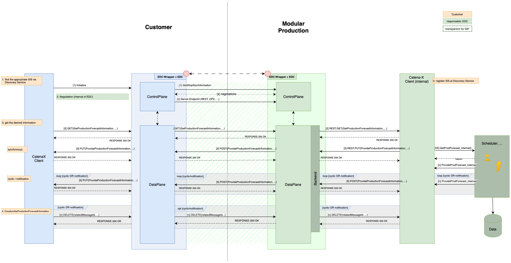

# CX-0068 MP Shop Floor Information Service API 1.0.0

## FOR WHOM IS THE STANDARD DESIGNED

## ABSTRACT

A Modular Production is part of the value chain. It therefore has to guarantee flexibility and availability on one hand and on the other hand it has to allow product flexibility together with small lot sizes. The effect of disturbances and decision in this network are not limited to a local area, but they have also a big impact to other partners in the value chain network. It is therefore necessary to communicate values from the shop floor directly to other members of the network like the customers or their substitutes like logistians. This communication is realized with the Shop-Floor-Information-Service (SIS).
For example a costumer wants to know the estimated date of production, he can therefore use the Shop-Floor-Information-Service to get the information either directly, via cyclic messages or notifications in case of changing calculated production dates. The Shop-Floor-Information-Service uses the *GetProductionForecastInformation* model and the *ProvideProductionForecastInformation* model.

## 1 INTRODUCTION

### 1.1 AUDIENCE & SCOPE

> *This section is non-normative*

This standard is relevant for

- Business Application Providers:  their role is the implementation of the Shop-Floor-Information-Service
- Data  Providers: mainly modular productions - they have to provide the data necessary for the Shop-Floor-Information-Service
- Data Consumers: e.g. tier n-1 factories, end customers or logisticians, they have to be able to process the data provided by the Shop-Floor-Information-Service

Stakeholders within Catena-X

- PURIS, DCM: capacity planning requires a forecast of the delivered products
- OSIM: the Forecast Data of the SIS can serve as input for a OSIM-simulation

### 1.2 CONTEXT AND ARCHITECTURE FIT

> *This section is non-normative*

Higher-level, external influencing factors from the supply chain, such as delays in the logistics chain for supplier parts or short-term order changes, may invalidate a production plan that has already been drawn up. Today, such short-term changes in the general conditions of the production process can often only be taken into consideration indirectly and made through manual corrections. The solution approaches in the modular production use case are aimed at increasing the flexibility of production to better leverage the existing business potential. For this purpose, services, interface, and data model definitions based on industry standards are offered with the goal of increasing the flexibility and reliability of industrial production. The shop floor is networked with the Catena-X network via the connectors standardized in Catena-X. Modular production  will offer a Shop-Floor-Information-Service  that supplies information about the production status and planning as needed by other use cases. The goal here is to enable individual production (batch size 1) at the price of series production. In particular, this is to be achieved by automating the orchestration of production resources and planning of production processes as much as possible, thus significantly reducing effort and planning times. A growth in efficiency in the sense of the OEE is achieved in that production can be reconfigured in the event of faults to continue operating as well as possible. The increased flexibility creates the space for new business models, such as the interposition of highly prioritized, lucrative orders. As a consequence not only the production is required to be flexible and fast reactive to changes, it also requires  communication of future factory output to the customers.

Both partners - a customer and a Modular Production - MUST be members of the Catena X network in order to communicate with each other.  By registering a Modular Production in advance with the Discovery Service, a customer can find it via a so-called Business Partner Number (BPN).  With the help of SSI (Self Sovereign Identity) the correct identity is guaranteed.
Customer uses the GetProductionForecastInformation call in order to request a production forecast, as specified in CX-0068. The Modular Production generates the required information internally by internal services like a scheduler and answers accordingly by calling ProvideProductionForecastInformation as specified in CX-0068. In case of a cyclic messages or notification mode, the customer has to unsubscribe from the service, if the service is not needed anymore.


The *GetProductionForecastInformation* as well as the *ProvideProductionForecastInformation* is using a AAS serialized as a JSON string which is sent through EDC mechanism:
Namely:

- *GetProductionForecastInformation* uses "GetProductionForecast" data model and
- *ProvideProductionForecastInformation* uses "ProvideProductionForecast" data model

The unsubscribe call has no corresponding data model, as it is a simple HTTP DELETE.
The JSON string is standardized in document (MP) CX - 0069 Shop-Floor-Information-Service Aspect Model v1.0.0.
The standard only describes the sending and receiving of Shop-Floor-Information-data through EDC. The object is created and handled by applications of the companies involved, but these applications are not part of the standard.

### 1.3 CONFORMANCE AND PROOF OF CONFORMITY

> *This section is non-normative*

As well as sections marked as non-normative, all authoring guidelines, diagrams,
examples, and notes in this specification are non-normative. Everything else in
this specification is normative.

The key words **MAY**, **MUST**, **MUST NOT**, **OPTIONAL**, **RECOMMENDED**,
**REQUIRED**, **SHOULD** and **SHOULD NOT** in this document document are to be
interpreted as described in BCP 14 [RFC2119] [RFC8174] when, and only when, they
appear in all capitals, as shown here.

All participants and their solutions will need to proof, that they are conform
with the Catena-X standards. To validate that the standards are applied
correctly, Catena-X employs Conformity Assessment Bodies (CABs). Please
refer to: *[!LINK Conformity Assessment]* for the process of conformity
assessment and certification.

In order to prove conformity, the participant needs to provide to the conformity assessment body:

- An example GetProductionForecastInformation-JSON as created by their solution
- An example ProvideProductionForecastInformation-JSON as created by their solution
- A proof that their solution can process the example payload JSON as listed below

In case an assessee wants to get certified WHEN requesting assessment THEN the assessee produces a letter affirming that they adhere to this standard and the letter is signed by person who has full power of attorney

Note that in a future revision of this standard it is planned to offer descriptions of test sets including test cases and test data for validating API implementations.

### 1.4 EXAMPLES

Disturbances of the supply chain always have a major impact of the following links in the chain. It is therefore necessary to inform the customers resp. their logistician as soon as possible as the real date of manufacturing might vary from the one negotiated in the contract. The Shop-Floor-Information-Service therefore gives an update about the scheduled production times to allow a better planning for both the tier n-1 customer as well as for the logistic in-between.

#### 1.4.1 Example for GetProductionForecastInformation

Example JSON string for GetProductionForecastInformation can be found in the data model standard CX-0069 Shop-Floor-Information-Service Aspect Model in chapter 2.
GetProductionForecastInformation is the request for getting Shop-Floor-Information. It contains the BPNS of the requesting partner, the customerID, which is the internal customerID in the modular production management and the the orderID, for which forecasting information are requested. In addition the requester can select one of the three communication modes synchronous (the answer will be given immediately), cyclic ( the information will be given cyclic with a negotiated cycle e.g. every day etc) and notification (changed production date. ) Each mode requires some additional parameters.

The execution of the endpoint which is used as the base URL in the asset definition is done via an EDC connection. As parameters for the execution of the endpoint are sent as path parameters, they are added to the call of the endpoint at the data plane of the EDC which will forward them to the endpoint at the modular production EDC and endpoint.

The GetProductionForecastInformation MUST be sent from the requestor of shopfloor information results to the modular production using an HTTP GET request.

An example HTTP request is provided below:

```json
GET /GetProductionForecastInformation HTTP/1.1
Host: {{internal-server}}
Content-Type: application/json
Content-Length: 1123

{
  "header": {
    "senderBpn": "BPNL1234567890SE",
    "expectedResponseBy": "2023-07-01T21:24:00+07:00",
    "context": "urn:samm:io.catenax.MP-SIS-GetProductionForecastInformation:1.x.x",
    "messageId": "00000000-0000-0000-C000-000000000046",
    "recipientBpn": "BPNL0987654321RE",
    "sentDateTime": "2023-06-19T21:24:00+07:00",
    "version": "urn:samm:io.catenax.shared.message_header:1.0.0"
  },
  "request": {
    "precisionOfForecast": {
      "timeUnit": "day",
      "value": 1
    },
    "offset": {
      "timeUnit": "day",
      "value": 1
    },
    "orderId": "0007",
    "customerId": "BPNL7588787849VQ",
    "deviationOfSchedule": {
      "timeUnit": "day",
      "value": 7
    },
    "productionForecastForAll": false,
    "versionDataModel": "urn:samm:io.catenax.shopfloor_information.production_request:1.0.0",
    "notificationInterval": {
      "timeUnit": "day",
      "value": 2
    },
    "communicationMode": "synchronous"
  }
}
```

#### 1.4.2 Example for ProvideProductionForecastInformation

Example JSON string for ProvideProductionForecastInformation can be found in the data model standard CX-0069 Shop-Floor-Information-Service Aspect Model in chapter 3.
ProvideProductionForecastInformation will return either the current forecasting results in the the case of synchronous mode. In the case of the cyclic or notification mode as well as in case of the unsubscribe mode it contains an immediate confirmation with the corresponding information. In case  of a cyclic or notification event the current forecasting information will be sent using the ProvideProductionForecastInformation mechanism.
The execution of the endpoint which is used as the base URL in the asset definition is done via an EDC connection. As parameters for the execution of the endpoint are sent as path parameters, they are added to the call of the endpoint at the data plane of the EDC which will forward them to the endpoint at the producer EDC and endpoint.

The ProvideProductionForecastInformation data MUST be sent from the modular production to the consumer of the Shop-Floor-Information using an HTTP POST request.
An example HTTP request is provided below:

```json
POST /ProvideProductionForecastInformation HTTP/1.1
Host: {{internal-server}}
Content-Type: application/json
Content-Length: 1079

{
  "header": {
    "senderBpn": "BPNL1234567890SE",
    "relatedMessageId": "00000000-0000-0000-C000-000000000042",
    "expectedResponseBy": "2023-07-02T13:00:00.000+02:00",
    "context": "urn:samm:io.catenax.MP-SIS-ProvideProductionForecastInformation:1.x.x",
    "messageId": "00000000-0000-0000-C000-000000000046",
    "recipientBpn": "BPNL0987654321RE",
    "sentDateTime": "2023-06-19T21:24:00+07:00",
    "version": "urn:samm:io.catenax.shared.message_header:1.0.0"
  },
  "productionForecastResponse": {
    "listOfForecastItems": [
      {
        "returnCode": "ok",
        "precisionOfForecast": {
          "timeUnit": "day",
          "value": 3
        },
        "reasonsForDelay": "supplyProblems",
        "positionId": "0007-3",
        "productionStatus": "itemReceived",
        "productionForecast": "2023-07-05T14:05:00.000+02:00",
        "forecastDate": "2023-07-01T14:05:20.255+02:00"
      }
    ],
    "versionDataModel": "urn:samm:io.catenax.shopfloor_information.production_response:1.0.0",
    "communicationMode": "synchronous",
    "iterationNumber": 42
  }
}
```

#### 1.4.3 Example for Unsubscribe

Unsubscribe is used to unsubscribe from receiving information in case of a cyclic or notification request.
The execution of the endpoint which is used as the base URL in the asset definition is done via an EDC connection. As parameters for the execution of the endpoint are sent as path parameters, they are added to the call of the endpoint at the data plane of the EDC which will forward them to the endpoint at the producer EDC and endpoint.
The Unsubscribe request MUST be sent from the consumer of Shop-Floor-Information results to the modular production using an HTTP DELETE request.

`http://{internal-server}/relatedMessageId/00000000-0000-0000-C000-000000000042`

The final id value should be copied from the GetProductionForecast.
An example HTTP request is seen below:

```json
DELETE /relatedMessageId/00000000-0000-0000-C000-000000000042  HTTP/1.1
Host: {{internal-server}}
```

### 1.5 TERMINOLOGY

> *This section is non-normative*

| Name | Abbreviation | Description |
|---|---|---|
| AAS | Asset Administration Shell | Specification to manage and administrate digital representations of assets (concepts, physical device, process, etc.). Used synonymously with the term "Digital Twin". |
| BPN | Business Partner Number | Business Partner Number |
| CX | Catena-X | Data ecosystem / data space for the automotive industry. |
| DCM | Demand and Capacity Management | Product within Catena-X for shortage identification. |
| DT | Digital Twin | Digital representation of an asset (concept, physical device, process, etc.). Realized using the Asset Administration Shell. Used synonymously with the term "Asset Administration Shell". |
| EDC | Eclipse Dataspace Connector | Open-Source Dataspace Connector Framework to participate in International Data Spaces. |
| JSON | JavaScript Object Notation | Json is an open standard file format and data interchange format that uses human-readable text to store and transmit data objects. |
| MP | Modular Production | Product within Catena-X for shopfloor activities |
| OSim | Online Control and Simulation | Product within Catena-X for Online Simulation along the supply chain |
| PURIS | Predictive Unit Real-Time Information System | Product within Catena-X for shortage identification. |
| SAMM | Semantic aspect meta model | Modelling specification to realize a standardized set of models with strict typing which can be used within the AAS.  SAMMs are standardized via the Semantic Layer team and can be looked up via the Semantic Hub. |
| SIS | Shop-Floor-Information-Service | Service provided by MP in order to give information from the shopfloor to customers and third parties |
| SSI | Self Sovereign Identity | Self Sovereign Identity |

Additional terminology used in this standard can be looked up in the glossary on
the association homepage.

## 2 "GetProductionForecastInformation" API

> *This section is normative*

The GetProductionForecastInformation contains the request for the forecasting data which is sent from a modular production partner to a customer or a third party on the next lower level. All participants participating using the Shop-Floor-Information-Service in the role of a a customer or third party  MUST be able to send the GetProductionForecastInformation. All participants using the Shop-Floor-Information-Service in the role of a modular production MUST be able to receive and process the GetProductionForecastInformation.

The following diagram shows the complete communication between the partners in a abstract way.
It takes place in different phases:

1. **Negotiation** between the EDC of the partners using the needed policies
2. GetProductionForecastInformation(...) - the call of the customer
3. get the desired information via ProvideProductionForecastInformation(...) - transfered by Modular Production (synchronous, cyclic or notification-like)
4. Unsubscribe from the "GetProductionForecastInformation" service to receive no further information



The two boxes in the middle represent the EDC of the partners. The communication between the respective EDC is transparent to the user (shaded). The transmission of the data for the request, as well as the response to the ProductionForecast is transmitted via the payload of the message. The immediate response (http response) does not contain any technical information.
The left side represents the customer with his different requests. On the right is the modular production with a scheduler that generates the requested answers.

## 2.1 PRECONDITIONS AND DEPENDENCIES

The GetProductionForecastInformation API MUST be published towards the network using a Data Asset/Contract Offer in terms of the Dataspace Protocol as defined by IDSA, following the Catena-X standard SOV-001.

## 2.2 API SPECIFICATION

### 2.2.1 API Endpoints & resources

When sending a request to the GetProductionForecastInformationEndpoint, the body MUST be composed out of two information objects: a *header* and a *content*. Together they form the HTTP body that MUST be formatted as JSON

The elements of the message are described in the following table:

|Field |Level |REQUIRED |Purpose |Data Type |Example Value |
|-- |-- |-- |-- |-- |-- |
|senderBpn |CX-header |mandatory |identification of the sender |string |BPNL1234567890SE |
|recipientBpn |CX-header |mandatory |identification of the recipient |string |BPNL0987654321RE |
|expectedResponseBy |CX-header |mandatory |Deadline for the first response |date |2023-07-01T21\:24\:00+07\:00 |
|messageId |CX-header |mandatory |unique ID for message will be used as requestID for the following communication  |UUID |00000000-0000-0000-C000-000000000046 |
|context |CX-header |mandatory |Information about the context the message should be considered in, e.g. "MP-Request" |string |MUST BE urn\:samm\:io.catenax.MP-SIS-GetProductionForecastInformation\:1.x.x |
|sentDateTime |CX-header |mandatory |time of request |string |2023-06-19T21\:24\:00+07\:00 |
|version |CX-header |mandatory |of Meta model used for compatibility |string |urn\:samm\:io.catenax.shared.message\_header\:1.0.0 |
|relatedMessageId |CX-header |optional |not used for request; will be used in the following parts to refer to the request |UUID |00000000-0000-0000-C000-000000000042 |
|versionDataModel |SIS-Payload |mandatory |version of the datamodel |string |urn\:samm\:io.catenax.shopfloor\_information.production\_request\:1.0.0 |
|customerId |SIS-Payload |mandatory |The internal ID of the customer of the Modular Production in order to identify the customer in the database |string |VLhpfQGTMDYpsBZxvfBoeygjb |
|orderId |SIS-Payload |mandatory |The orderID communicated between the modular production and the customer |string |0007 |
|communicationMode |SIS-Payload |mandatory |Enum describing which communication mode is used for data exchange resp. the mode of the response\: synchronous, cyclic or notification |enum |synchronous |
|productionForecast4All |SIS-Payload |mandatory |if true, the forecast for the entire order will be sent \(more precise\: latest production date of all suborders \) instead of splitting it in the suborders |bool |true |
|offset |SIS-Payload |mandatory |timespan to activating of cyclic and notification; for immediate response it should be "0" |TimeValue \[EnumTimeUnits, uint \] |\{"timeUnit"\: "day", "value"\: 1 \} |
|notificationInterval |SIS-Payload |optional if \[cyclic\] = mandatory |in case of cyclic notification it is giving the period of the notification cycles if \(communicationMode == \[cyclic\]\) =\> mandatory  |TimeValue \[EnumTimeUnits, uint \] |\{"timeUnit"\: "day", "value"\: 2 \} |
|deviationOfSchedule |SIS-Payload |optional if \[notification\] = mandatory  |in case of notification a tolerance will be defined for triggering a new notification to avoid too many notifications with smaa deviations in the forecasting date if \(communicationMode == \[notification\]\) =\> mandatory  |TimeValue \[EnumTimeUnits, uint \] |\{"timeUnit"\: "day", "value"\: 7 \} |
|precisionOfForecast |SIS-Payload |optional |Requested precision of the forecasting date default, the production defines the date in case of a requested precisionOfForecast, the modular production delivers with the required precision if the precision is not possible, an error code is send and the forecast will be the best possible precision |TimeValue \[EnumTimeUnits, uint \] |\{"timeUnit"\: "day", "value"\: 1 \} |

The following JSON object gives an example of a valid data model:

```json
{
  "header" : {
    "senderBpn" : "BPNL1234567890SE",
    "expectedResponseBy" : "2023-07-01T21:24:00+07:00",
  "context" : "urn:samm:io.catenax.MP-SIS-GetProductionForecastInformation:1.x.x",
    "messageId" : "00000000-0000-0000-C000-000000000046",
  "recipientBpn" : "BPNL0987654321RE",
    "sentDateTime" : "2023-06-19T21:24:00+07:00",
  "version" : "urn:samm:io.catenax.shared.message_header:1.0.0"
  },
  "request" : {
    "precisionOfForecast" : {
      "timeUnit" : "day",
      "value" : 1
    },
    "offset" : {
      "timeUnit" : "day",
      "value" : 1
    },
    "orderId" : "0007",
    "customerId" : "BPNL7588787849VQ",
    "deviationOfSchedule" : {
       "timeUnit" : "day",
       "value" : 7
    },
    "productionForecastForAll" : false,
  "versionDataModel" : "urn:samm:io.catenax.shopfloor_information.production_request:1.0.0",
    "notificationInterval" : {
      "timeUnit" : "day",
      "value" : 2
    },
    "communicationMode" : "synchronous"
  }
}
```

### 2.2.2 Available Data Types

The API GetProductionForecastInformation call MUST use the GetProductionForecast data model (CX-0069)

The API MUST use JSON as the payload transported via HTTPS. More information on the data objects supported by the endpoints is provided in the corresponding sections of Section 2.2.1

Communication Mode MUST be one of the following items: synchronous, cyclic and notification

EnumTimeUnits MUST be one of the following items: unit:secondUnitOfTime, unit:minuteUnitOfTime, unit:hour, unit:day, unit:week, unit:month, unit:year

### 2.2.3 EDC Data Asset Structure

The HTTP GET endpoint introduced in chapter 2.2.1 MUST NOT be called from a partner directly. Rather, it MUST be called via an EDC communication. Therefore, the endpoint MUST be offered as an EDC Data Asset.

- The latter MUST have a property “asset.properties.asset:prop:id”. This property MUST be used to identify the asset when searching the assets catalog of a supplier as well as initiating a transfer process. Because the asset reflects the contractual relationship between Shop-Floor-Information-Service partners, only one asset with the aforementioned property MUST be visible to the customer at any time to avoid ambiguity. The value for this property can be chosen freely but must be unique.
- The asset definition SHOULD contain a property “asset.properties.asset:prop.description” for a human readable description of the asset when providing the contract offer catalog for the consumer and make it easier and readable for a human what kind of data this asset contains.
- The asset definition MUST contain a property “asset.properties.asset:prop:version” containing a version number to identify if there have been updates on an asset definition.
- The latter MUST have a property “dataAddress.properties.baseUrl” with a value containing the URL of the endpoint where the function “GetProductionForecastInformation” is implemented.
- Additionally, the dataAddress property MUST contain the parameter proxyPath with a value set to TRUE to enable the possibility to use the EDC as a reverse proxy by adding parameters to the URL.

An example EDC Data Asset definition with a corresponding access / usage policy and contract definition are shown below. Note: Expressions in double curly braces \{\{\}\} must be substituted with a corresponding value.

```json
// Asset definition
{
    "asset": {
        "properties": {
            "asset:prop:id": "sis-request-01",
            "asset:prop:description": "sisRequest Endpoint",
            "asset:prop:version": "1.0.0"

        }
    },
    "dataAddress": {
        "properties": {
            "type": "HttpData",
            "baseUrl": "{{sis_REQUEST_ENDPOINT}}",
            "proxyPath": true
        }
    }
}
// Access and Usage Policy definition

    "uid": "sis-request-01-policy",
    "policy": {
        "prohibitions": [],
        "obligations": [],
        "permissions": [
            {
                "target": "sis-request-01",
                "edctype": "dataspaceconnector:permission",
                "action": {
                    "type": "USE"
                },
                "constraints": []
            }
        ]
    }
}
// Contract definition
{
    "id": "sis-request-01-contract",
    "criteria": [
        {
            "operandLeft": "asset:prop:id",
            "operator": "=",
            "operandRight": "sis-request-01"
        }
    ],
    "accessPolicyId": "sis-request-01-policy",
    "contractPolicyId": "sis-request-01-policy"
}
```

### 2.2.4 Error Handling

Every API endpoint defined in Chapter 2.2.1 MUST respond to incoming requests with HTTP status codes as described in [RFC9110]. The status codes for each endpoint are defined in the following sections.

|Status Code|Description|Usage|
|-|-|-|
|200|OK|The request has succeeded.|
|201|OK, Precision not possible|The request has succeeded. Precision is not possible, the default precision will be used|
|400|Bad request|The server cannot or will not process the request due to something that is perceived to be a client error (e.g., malformed request syntax, invalid request message framing, or deceptive request routing). |
|401|Unauthorized|Although the HTTP standard specifies "unauthorized", semantically this response means "unauthenticated". That is, the client must authenticate itself to get the requested response.|
|403|Forbidden|The client does not have access rights to the content; that is, it is unauthorized, so the server is refusing to give the requested resource.|
|420|Unknown BPNS|The BPNS which is given as parameter is not registered in the data provider database as a direct partner. |
|421|Invalid CustomerId|The customerID unknown or invalid|
|422|Invalid OrderId|The orderID not found or invalid|
|423|Invalid Notification Interval|The data field Notification interval is not set with a proper value or missing|
|424|Invalid Deviation|The data field Deviation is not set with a proper value or missing|
|425|Forbidden |The client does not have access rights to the content; that is, it is unauthorized, so the server is refusing to give the requested resource.|
|426|incomplete Request| |

## 3 "ProvideProductionForecastInformation" API

> *This section is normative*

The ProvideProductionForecastInformation  API sends the forecasting data  from a modular production to the customer or a third party on the next lower level. All participants participating using the Shop-Floor-Information-Service in the role of a a modular production MUST be able to send the ProvideProductionForecastInformation. All participants using the Shop-Floor-Information-Service in the role of a customer or additional third party MUST be able to receive and process the ProvideProductionForecastInformation.

### 3.1 PRECONDITIONS AND DEPENDENCIES

The ProvideProductionForecastInformation   API MUST be published towards the network using a Data Asset/Contract Offer in terms of the Dataspace Protocol as defined by IDSA, following the Catena-X standard SOV-001.

### 3.2 API SPECIFICATION

#### 3.2.1 API Endpoints & resources

When sending a request to the ProvideProductionForecastInformation Endpoint, the body MUST be composed out of two information objects: a header and a content. Together they form the HTTP body that MUST be formatted as JSON
Request Header

> Note: This is not the HTTP Header but rather part of the HTTP Body.

|Field |Level |REQUIRED |Purpose |Datatype |Example Value |
|-- |-- |-- |-- |-- |-- |
|version |CX-header |mandatory |of Meta model used for compatibility |string |urn\:samm\:io.catenax.shared.message\_header\:1.0.0 |
|messageId |CX-header |mandatory |unique ID for message will be used as requestID for the following communication |UUID |00000000-0000-0000-C000-000000000046 |
|context |CX-header |mandatory |Information about the context the message should be considered in, e.g. "MP-Request" |string |MUST BE urn\:samm\:io.catenax.MP-SIS-ProvideProductionForecastInformation\:1.x.x |
|sentDateTime |CX-header |mandatory |time of request |string |2023-06-19T21\:24\:00+07\:00 |
|senderBpn |CX-header |mandatory |identification of the sender |string |BPNL1234567890SE |
|recipientBpn |CX-header |mandatory |identification of the recipient |string |BPNL0987654321RE |
|expectedResponseBy |CX-header |mandatory |Deadline for the first response |date |2023-07-02T13\:00\:00.000+02\:00 |
|relatedMessageId |CX-header |optional |not used for request; will be used in the following parts to refer to the request |UUID |00000000-0000-0000-C000-000000000042 |
|versionDataModel |SIS-Payload |mandatory |version of the datamodel |string |urn\:samm\:io.catenax.shopfloor\_information.production\_response\:1.0.0 |
|iterationNo |SIS-Payload |optional |in case of cyclic or notification mode this field is used to count the iterations to keep them in the correct order  |int |42 |
|communicationMode |SIS-Payload |mandatory |Enum describing if synchronous, cyclic or notification is used for data exchange |enum |synchronous |
|ListOfForecastItems |SIS-Payload |mandatory |list containing the items corresponding to the order of this request  |List of Forecast Items | |
|ForecastItem\* |SIS-Payload | | | | |
|positionId |SIS-Payload |mandatory |field referring to the ID of this item in the order list, e.g. item number in case of productionForecastForAll =true \: provide order ID instead of position ID |UUID / string |0007-3 |
|productionForecast |SIS-Payload |mandatory |date of finalizing the production, this does not cover additional internal activities e.g. logistic |datetime |2023-07-05T14\:05\:00.000+02\:00 |
|precisionOfForecast |SIS-Payload |mandatory |precision of the forecast in form of an interval e.g. +-3days, the precision either matches to the required precision of the request or the maximal possible precision.  |TimeValue \[EnumTimeUnits, uint \] |\{ "timeUnit"\: "day", "value"\: 3 \}, |
|productionStatus |SIS-Payload |mandatory/opt |status of the production |enum \<ProductionStatus\> |itemReceived |
|forecastDate |SIS-Payload |mandatory |date of determination the forecasting status |datetime |2023-07-01T14\:05\:20.255+02\:00 |
|reasonForDelay |SIS-Payload |mandatory |in case of a delay a possible explanation |enum |supplyProblems |

The following JSON object gives an example of a valid header and payload:

```json
{
  "header": {
    "senderBpn": "BPNL7588787849VQ",
    "relatedMessageId": "d9452f24-3bf3-4134-b3eb-68858f1b2362",
    "expectedResponseBy": "2023-06-19T21:24:00+07:00",
    "context": "urn:samm:io.catenax.MP-SIS-ProvideProductionForecastInformation:1.x.x",
    "messageId": "3b4edc05-e214-47a1-b0c2-1d831cdd9ba9",
    "recipientBpn": "BPNL6666787765VQ",
    "sentDateTime": "2023-06-19T21:24:00+07:00",
    "version": "urn:samm:io.catenax.shared.message_header:1.0.0"
  },
  "productionForecastResponse": {
    "listOfForecastItems": [
      {
        "returnCode": "ok",
        "precisionOfForecast": {
          "value": 12,
          "timeUnit": "unit:secondUnitOfTime"
        },
        "reasonsForDelay": "supplyProblems",
        "positionId": "00000000-0000-0000-C000-000000000046",
        "productionStatus": "itemReceived",
        "productionForecast": "2023-06-19T21:24:00+07:00",
        "forecastDate": "2023-06-19T21:24:00+07:00"
      }
    ],
    "versionDataModel": "urn:samm:io.catenax.shopfloor_information.production_response:1.0.0",
    "communicationMode": "synchronous",
    "iterationNumber": 6
  }
}
```

#### 3.2.2 Available Data Types

The API MUST use JSON as the payload transported via HTTPS. More information on the data objects supported by the endpoints is provided in the corresponding sections of Section 3.2.1

The API ProvideProductionForecastInformation call  MUST use the ProvideProductionForecast data model (CX-0069)

Communication Mode MUST be one of the following items: synchronous, cyclic and notification

EnumTimeUnits MUST be one of the following items: unit:secondUnitOfTime, unit:minuteUnitOfTime, unit:hour, unit:day, unit:week, unit:month, unit:year

ProductionStatus MUST be one of the following items: itemReceived, itemPlanned, itemInProduction,itemCompleted, statusUndefined

reasonsForDelay MUST be one of the following items: supplyProblems, internalProblems, otherCircumstances, noInformationAvailable

#### 3.2.3 EDC Data Asset Structure

The HTTP POST endpoint introduced in chapter 3.2.1 MUST NOT be called from a partner directly. Rather, it MUST be called via an EDC communication. Therefore, the endpoint MUST be offered as an EDC Data Asset.

- The latter MUST have a property “asset.properties.asset:prop:id”. This property MUST be used to identify the asset when searching the assets catalog of a supplier as well as initiating a transfer process. Because the asset reflects the contractual relationship between Shop-Floor-Information-Service partners, only one asset with the aforementioned property MUST be visible to the customer at any time to avoid ambiguity. The value for this property can be chosen freely but must be unique.
- The asset definition SHOULD contain a property “asset.properties.asset:prop.description” for a human readable description of the asset when providing the contract offer catalog for the consumer and make it easier and readable for a human what kind of data this asset contains.
- The asset definition MUST contain a property “asset.properties.asset:prop:version” containing a version number to identify if there have been updates on an asset definition.
- The latter MUST have a property “dataAddress.properties.baseUrl” with a value containing the URL of the endpoint where the function “ProvideProductionForecast” is implemented.
- Additionally, the dataAddress property MUST contain the parameter proxyPath with a value set to TRUE to enable the possibility to use the EDC as a reverse proxy by adding parameters to the URL.

An example EDC Data Asset definition with a corresponding access / usage policy and contract definition are shown below. Note: Expressions in double curly braces \{\{\}\} must be substituted with a corresponding value.

```json
// Asset definition
{
    "asset": {
        "properties": {
            "asset:prop:id": "sis-provide-01",
            "asset:prop:description": "sisProvide Endpoint",
            "asset:prop:version": "1.0.0"

        }
    },
    "dataAddress": {
        "properties": {
            "type": "HttpData",
            "baseUrl": "{{sis_Provide_ENDPOINT}}",
            "proxyPath": true
        }
    }
}

// Access and Usage Policy definition

    "uid": "sis-provide-01-policy",
    "policy": {
        "prohibitions": [],
        "obligations": [],
        "permissions": [
            {
                "target": "sis-provide-01",
                "edctype": "dataspaceconnector:permission",
                "action": {
                    "type": "USE"
                },
                "constraints": []
            }
        ]
    }
}

// Contract definition
{
    "id": "sis-provide-01-contract",
    "criteria": [
        {
            "operandLeft": "asset:prop:id",
            "operator": "=",
            "operandRight": "sis-provide-01"
        }
    ],
    "accessPolicyId": "sis-provide-01-policy",
    "contractPolicyId": "sis-provide-01-policy"
}
```

#### 3.2.4 Error Handling

Every API endpoint defined in Chapter 2.2.1 MUST respond to incoming requests with HTTP status codes as described in [RFC9110]. The status codes for each endpoint are defined in the following sections.

|Status Code|Description|Usage|
|-|-|-|
|200|OK|The request has succeeded.|
|400|Bad request|The server cannot or will not process the request due to something that is perceived to be a client error (e.g., malformed request syntax, invalid request message framing, or deceptive request routing). |
|401|Unauthorized |Although the HTTP standard specifies "unauthorized", semantically this response means "unauthenticated". That is, the client must authenticate itself to get the requested response. |
|403|Forbidden|The client does not have access rights to the content; that is, it is unauthorized, so the server is refusing to give the requested resource. |
|420|lowerAccuracyOfPrecision|the returned data has a lower precision than requested|
|421|noForecastAvailable|No data available|

## 4 "Unsubscribe" API

> *This section is normative*

The Unsubscribe API contains the request to stop transferring forecasting data which is sent from a modular production to a customer or a third party on the next lower level. All participants using the Shop-Floor-Information-Service in the role of a a customer or third party  MUST be able to send the unsubscribe request. All participants using the Shop-Floor-Information-Service in the role of a modular production MUST be able to receive and process the unsubscribe request.

### 4.1 PRECONDITIONS AND DEPENDENCIES

The Unsubscribe API MUST be published towards the network using a Data Asset/Contract Offer in terms of the Dataspace Protocol as defined by IDSA, following the Catena-X standard SOV-001.

### 4.2 API SPECIFICATION

#### 4.2.1 API Endpoints & resources

The   unsubscribe API is implemented as an HTTP DELETE request with the relatedMessageID as a parameter, which is sent without any HTTP body.

`http://{internal-server}/relatedMessageId/00000000-0000-0000-C000-000000000042`

The parameter related messageID is defined as follows:

|Field|Level|REQUIRED|Purpose|Datatype|Example Value|
|-|-|-|-|-|-|
|relatedMessageId|CX-Header|mandatory|UUID of request messageId for identification of related messages|UUID|00000000-0000-0000-C000-000000000042|

#### 4.2.2 Available Data Types

The unsubscribe does not require any payload.

#### 4.2.3 EDC Data Asset Structure

The HTTP DELETE endpoint introduced in chapter 4.2.1 MUST NOT be called from a partner directly. Rather, it MUST be called via an EDC communication. Therefore, the endpoint MUST be offered as an EDC Data Asset.

- The latter MUST have a property “asset.properties.asset:prop:id”. This property MUST be used to identify the asset when searching the assets catalog of a supplier as well as initiating a transfer process. Because the asset reflects the contractual relationship between Shop-Floor-Information-Service partners, only one asset with the aforementioned property MUST be visible to the customer at any time to avoid ambiguity. The value for this property can be chosen freely but must be unique.
- The asset definition SHOULD contain a property “asset.properties.asset:prop.description” for a human readable description of the asset when providing the contract offer catalog for the consumer and make it easier and readable for a human what kind of data this asset contains.
- The asset definition MUST contain a property “asset.properties.asset:prop:version” containing a version number to identify if there have been updates on an asset definition.
- The latter MUST have a property “dataAddress.properties.baseUrl” with a value containing the URL of the endpoint where the function “unsubscribe” is implemented.
- Additionally, the dataAddress property MUST contain the parameter proxyPath with a value set to TRUE to enable the possibility to use the EDC as a reverse proxy by adding parameters to the URL.

An example EDC Data Asset definition with a corresponding access / usage policy and contract definition are shown below. Note: Expressions in double curly braces \{\{\}\} must be substituted with a corresponding value.

```json
// Asset definition
{
    "asset": {
        "properties": {
            "asset:prop:id": "sis-unsubscribe-01",
            "asset:prop:description": "sis-unsubscribeEndpoint",
            "asset:prop:version": "1.0.0"

        }
    },
    "dataAddress": {
        "properties": {
            "type": "HttpData",
            "baseUrl": "{{sis_unsubscribe_ENDPOINT}}",
            "proxyPath": true
        }
    }
}


// Access and Usage Policy definition

    "uid": "sis-unsubscribe-01-policy",
    "policy": {
        "prohibitions": [],
        "obligations": [],
        "permissions": [
            {
                "target": "sis-unsubscribe-01",
                "edctype": "dataspaceconnector:permission",
                "action": {
                    "type": "USE"
                },
                "constraints": []
            }
        ]
    }
}


// Contract definition
{
    "id": "sis-unsubscribe-01-contract",
    "criteria": [
        {
            "operandLeft": "asset:prop:id",
            "operator": "=",
            "operandRight": "sis-unsubscribe-01"
        }
    ],
    "accessPolicyId": "sis-unsubscribe-01-policy",
    "contractPolicyId": "sis-unsubscribe-01-policy"
}
```

#### 4.2.4 Error Handling

Every API endpoint defined in Chapter 2.2.1 MUST respond to incoming requests with HTTP status codes as described in [RFC9110]. The status codes for each endpoint are defined in the following sections.

|Status Code|Description|Usage|
|-|-|-|
|200|OK|The request has succeeded. Unsubscribe was successful|
|400|Bad Request|The server cannot or will not process the request due to something that is perceived to be a client error (e.g., malformed request syntax, invalid request message framing, or deceptive request routing).|
|401|Unauthorized|Although the HTTP standard specifies "unauthorized", semantically this response means "unauthenticated". That is, the client must authenticate itself to get the requested response.|
|403|Forbidden|The client does not have access rights to the content; that is, it is unauthorized, so the server is refusing to give the requested resource.|
|420|Unknown relatedMessageID|The combination of relatedMessageId and BPNS does not fit|

## 5 REFERENCES

### 5.1 NORMATIVE REFERENCES

### 5.2 NON-NORMATIVE REFERENCES

> *This section is non-normative*

### 5.3 REFERENCE IMPLEMENTATIONS

> *This section is non-normative*

## ANNEXES

### FIGURES

> *This section is non-normative*

### TABLES

> *This section is non-normative*

## Legal

Copyright © 2025 Catena-X Automotive Network e.V. All rights reserved. For more information, please visit [here](/copyright).
