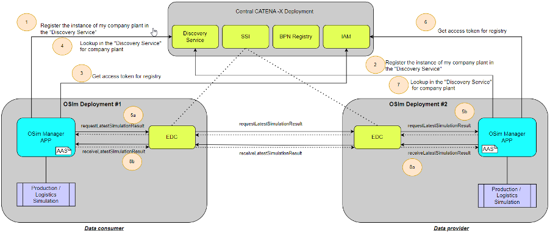

# CX-0072 OSim Process & Core Business Logic v1.0.0

## DISCLAIMER REGARDING ONLINE CONTROL AND SIMULATION DATA EXCHANGE

This document describes and standardizes certain data exchange business processes, data models and/or APIs in connection with Online Control and Simulation (OSim) solution based on the Catena-X data ecosystem. Nothing in this document is meant to determine the contractual terms and conditions for the purchase, supply, delivery or licensing of any products or services among the participants of the OSim data exchange. These terms and conditions are separately negotiated and agreed among suppliers and customers in individual purchase, supply or license agreements. In case of any inconsistencies with the content of this document, the provisions of individual agreements among the participants shall prevail over the content of this document.

## ABSTRACT

The simulation results of the Catena-X partners on the lower tier level and logistics, together with data of the company's own operations are fed into the individual simulation model as input. Considering both, plannable and unforeseeable influencing factors, this simulation model is iterated through as often as necessary until an optimal production schedule is reached and a simulation result is created. Sharing of simulation results to the next tier level is the base of the collaborative simulation approach in a short-term horizon, across the complete supply chain.

## 1. INTRODUCTION

### 1.1 AUDIENCE & SCOPE

> *This section is non-normative*

This standard is relevant for:

- Business Application Provider
- Data Provider / Consumer

The MaterialFlowSimulationResult object (see the data model description in OSim Data Model Materialflow Simulation Result) will be sent by OSim partner to another OSim partner on a higher tier level. OSim partner can be a producing company as well as a logistics company.
Every MaterialFlowSimulationResult includes information about delivery readiness of packaged material goods, like material identifier, amount, delivery time and destination.
The data provider needs to be able to create MaterialFlowSimulationResult and the receiver need to be able to interpret them. The data receiver needs to be able to use the MaterialFlowSimulationResult of lower tier partners as input for its own simulation.

This document only describes the structure of the data model in order to exchange simulation result information. Further information regarding processing or the interface will be described in OSim API.

### 1.2 CONTEXT

> *This section is non-normative*

Simulation is an important aspect of Supply Chain Management, as it allows a better precision of significance for the ability to deliver. OSim enables the exchange of simulation results between the partners extending the today’s scope of siloed simulations.

The core business logic described in this document enables companies to share data in a sovereign way as well as to utilize a common process understanding, ensuring interoperability and enabling the involved parties to achieve the following goals:

- Collaborative simulation over the supply chain
- Early reaction to delivery problems
- Early response to changes in customer requirements
- Early consideration of external disturbances/events on the process

The underlying data model is described and standardized in OSim Data Model Materialflow Simulation Result.

### 1.3 ARCHITECTURE OVERVIEW

> *This section is non-normative*

### 1.4 CONFORMANCE

As well as sections marked as non-normative, all authoring guidelines, diagrams,
examples, and notes in this specification are non-normative. Everything else in
this specification is normative.

The key words **MAY**, **MUST**, **MUST NOT**, **OPTIONAL**, **RECOMMENDED**,
**REQUIRED**, **SHOULD** and **SHOULD NOT** in this document document are to be
interpreted as described in BCP 14 [RFC2119] [RFC8174] when, and only when, they
appear in all capitals, as shown here.

### 1.5 PROOF OF CONFORMITY

> *This section is non-normative*

All participants and their solutions will need to proof, that they are conform
with the Catena-X standards. To validate that the standards are applied
correctly, Catena-X employs Conformity Assessment Bodies (CABs).

Any actor participating in the Catena-X OSim use case, MUST implement, and follow the following standards:

- The OSim core business logic – described in this document
- The OSim standardized API – described in the document OSim API
- The OSim standardized Data Model – described in the document OSim Data Model Materialflow Simulation Result

### 1.6 EXAMPLES

The example above shows a basic exchange of simulation results in the OSim partner network of the manufacturing company Werk-76.

A request is made from Werk-76 to the logistics company Log-07 as to whether a newer simulation result is available. The logistics company Log-07 then transmits directly its latest simulation results to the data recipient Werk-76, filtered to the records relevant to Werk-76. In case no simulation result is currently available, Log-07 sends a dedicated return value to the data consumer.

Note: Generally, it is up to the data provider to decide when its own simulation will be run, and with this a new simulation result will be generated. Accordingly, it is always in the hands of data consumer to ask for newer simulation results using the API described in OSim API

Now, taking into account the values received from the direct partners (including the simulation results from LOG-07), the company Werk-76 can run a material flow simulation of its own production, check the results and repeat the simulation if necessary. Subsequently, Werk-76 releases its own simulation results so that they can be queried by the partners of the higher tier level in the supply-chain.

### 1.7 TERMINOLOGY

> *This section is non-normative*

Business Partner Number (BPN)
: A BPN is the unique identifier of a partner within Catena-x

Business Partner Number (BPNL)
: A BPNL is the unique identifier of a partner within Catena-X, e.g. a company.

Business Partner Number (BPNS)
: A BPNS is the unique identifier of a partner location within Catena-X, e.g. a specific factory of a company.

OSim Process & Core Business Logic
: Shorthand name for the Catena-X Standard: CX-0072  –  OSIM Process & Core Business Logic

OSim Data Model Materialflow Simulation Result
: Shorthand name for the Catena-X Standard: CX-0087 – OSim Data Model Materialflow Simulation Result.

OSim API
: Shorthand name for the Catena-X Standard: CX-0073 – OSim API.

Online Control and Simulation (OSim)
: OSim is a Use Case in Catena-X eco system.

MaterialFlowSimulationResult
: The MaterialFlowSimulationResult is the data model, which describes the structure of the simulation result data exchanged between OSim partners.

Note: Typically there is not only one own simulation result available in the single systems of suppliers or logisticians. For this it is RECOMMENDED to introduce in the single systems a state machine, allowing to identify the for publishing relevant status. For example:

Supplier
: In the context of OSim the Supplier is the producer of goods

Customer
: In the context of OSim the Customer is the receiver of produced goods by supplier

Logistician
: In the context of OSim the Logistician transports the produced goods from supplier to the customer

OSim-Network construction and Tier-Levels
: The following picture depicts a principal construction of a OSim Network from a global perspective (not to be confused with a participant perspective, which is always a limited view to the one-up and one-down levels, logistician disregarded).

It consists of many tier companies (e.g. S1..S7) on different levels (e.g. Tier-1, Tier-2, Tier-n, Tier-n+1) with logistician companies in between (e.g. L1..L8). Depend on the complexity of the logistics between two producers it is not excluded that more than one logistician are in the chain (e.g. L1 -> L2 or L1 -> L3 -> L4)

- "Lower tier level" means direction in the network to the left and with this to the suppliers of the raw materials. The following terms are synonymously used with "Lower tier level":
  - "Previous level"
  - "Previous tier level"
  - "Lower level"
>
- "Higher tier level" means direction to the OEM. Tier-1 is the highest tier level followed by the OEM. The following terms are synonymously used with "Higher tier level":
  - "Next level"
  - "Next tier level"
  - "Higher level"

simulationRunID
: The simulationRunID is the unique identifier of a simulation result

Aspect Model
: a formal, machine-readable semantic description (expressed with RDF/turtle) of data accessible from
    an Aspect.

: Note 1 to entry: An Aspect Model must adhere to the Semantic Aspect Meta Model (SAMM), i.e., it utilizes elements and relations defined in the Semantic Aspect Meta Model and is compliant to the validity rules defined by the Semantic Aspect Meta Model.

: Note 2 to entry: Aspect model are logical data models which can be used to detail a conceptual model in order to describe the semantics of runtime data related to a concept. Further, elements of an Aspect model can/should refer to terms of a standardized Business Glossary (if existing).

Additional terminology used in this standard can be looked up in the glossary on the association homepage.

## 2 MAIN CONTENT

> *This section is normative*

Any **application provider** that develops OSim solutions has to grant the fulfillment of these requirements:

- The solution MUST be designed to require a contractual agreement in compliance with antitrust requirements in the usage environment (e.g. data contracts as a prerequisite for carrying out a data exchange). For reference see Chapter 8 and follow EDC (CX-0018) guidelines.
- The solution MUST be designed to limit visibility and/or access to concrete data content as much as necessary (e.g. data offer does not yet allow data access).
- The solution MUST be designed to require the implementation of notice and/or acknowledgement concepts to raise awareness of antitrust issues during use (e.g. helpdesk or pop-up info).
- The solution MUST be designed to ensure traceability/reconstructability of processes through appropriate documentation and at the same time data sovereignty over concrete data content (e.g. through access, deletion or destination rights).

Any **customer, supplier and logistician** (in following called with “all parties”) **in the OSim process** (i.e. data provider and/or data consumer) MUST fulfil following requirements:

- All parties are in a contractual relationship with parties in the next higher and lower tier levels that they want to exchange data and MUST agree to share data related to OSim.
- All parties MUST manage the access authorization to a OSim solution and to its related data.
- All parties in the role of data provider MUST be able to generate (e.g. with simulation tool), and release simulation results.
- Each data provider MUST have maximum one released simulation result at time
- Data providers released simulation results MUST be made accessible by authorized data consumers (e.g. logisticians or customers) of an upper level in the supply chain.
- All parties in the role of data provider MUST ensure, the authorized data consumers will get data directly relevant to him only.
- All parties in the role of data consumer MUST be able to request and receive simulation results form the next lower level in the supply chain.
- The parties SHOULD use received simulation results from lower partners for the own material flow simulation.
- It is RECOMMENDED to share simulation results of a time window of 2 to 4 weeks, as the aim of OSim is to optimize the short-term simulation.
- It is RECOMMENDED that each partner uses a professional simulation tool to generate the simulation results, so that the overall data quality can be increased.
- Alternatively, the OSim partner MAY build simulation results out of detailed planning data (e.g. generate them manually), instead of using simulation tools.

## 3 REFERENCES

### 3.1 NORMATIVE REFERENCES

CX-0002 Digital Twins in Catena-X

CX-0003 Semantic Aspect Meta Model

CX-0004 Governance Process for Semantic Models

CX-0018 Eclipse Data Space Connector (EDC)

CX-0001 EDC Discovery API, Version 1.1

CX-0087 OSim Data Model Materialflow Simulation Result

CX-0073 OSim API

### 3.2 NON-NORMATIVE REFERENCES

> *This section is non-normative*

n.a.

### 3.3 REFERENCE IMPLEMENTATIONS

> *This section is non-normative*

n.a.

## ANNEXES

### FIGURES

> *This section is non-normative*

### TABLES

> *This section is non-normative*

## Legal

Copyright © 2025 Catena-X Automotive Network e.V. All rights reserved. For more information, please visit [here](/copyright).
