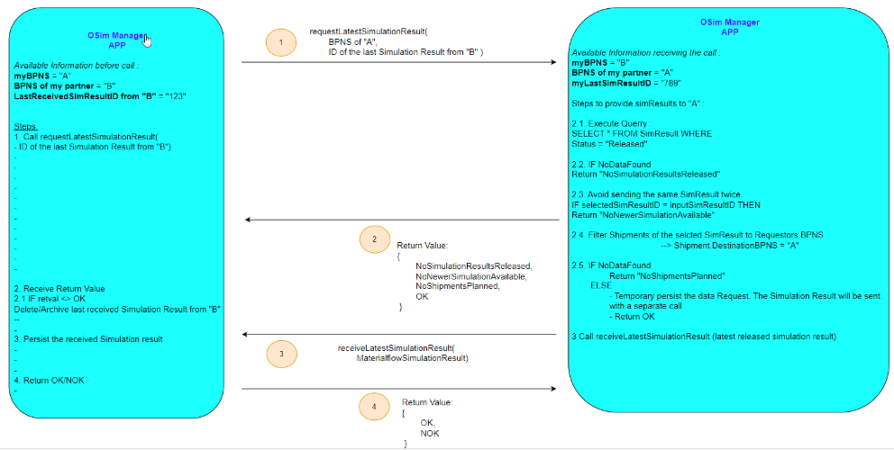

# CX-0073 OSim API v1.0.0

## DISCLAIMER REGARDING ONLINE CONTROL AND SIMULATION DATA EXCHANGE

This document describes and standardizes certain data exchange business processes, data models and/or APIs in connection with Online Control and Simulation (OSim) solution based on the Catena-X data ecosystem. Nothing in this document is meant to determine the contractual terms and conditions for the purchase, supply, delivery or licensing of any products or services among the participants of the OSim data exchange. These terms and conditions are separately negotiated and agreed among suppliers and customers in individual purchase, supply or license agreements. In case of any inconsistencies with the content of this document, the provisions of individual agreements among the participants shall prevail over the content of this document.

## ABSTRACT

The simulation results of the Catena-X partners on the lower tier level and logistics, together with data of the company's own operations are fed into the individual simulation model as input. Considering both, plannable and unforeseeable influencing factors, this simulation model is iterated through as often as necessary until an optimal production schedule is reached and a simulation result is created. Sharing of simulation results to the next tier level is the base of the collaborative simulation approach in a short-term horizon, across the complete supply chain.

## 1. INTRODUCTION

In this document, the exchange of simulation results is described and standardized.

### 1.1 AUDIENCE & SCOPE

This standard is relevant for:

- Business Application Provider
- Data Provider / Consumer

The MaterialFlowSimulationResult object (see the data model description in OSim Data Model Materialflow Simulation Result) will be send by OSim partner to another OSim partner on a higher tier level. OSim partner can be a producing company as well as a logistics company.
Every MaterialFlowSimulationResult includes information about delivery readiness of packaged material goods, like material identifier, amount, delivery time and destination.
The data provider needs to be able to create MaterialFlowSimulationResult and the receiver need to be able to interpret them. The data receiver needs to be able to use the MaterialFlowSimulationResult of lower tier partners as input for its own simulation.

The process of API communication is asynchronous and consists of two API calls: first a requestLatestSimulationResult and after that a receiveLatestSimulationResult as follows. An OSim partner of an upper level sends an API requestLatestSimulationResult to an OSim partner of the next lower level. The BPNS of the OSim partner that is to receive the simulation results is passed as a parameter. This parameter is necessary because the receiver cannot make sure that the sender of the API call is the correct recipient for the requested data, e.g. the sender could theoretically request simulation results dedicated to a competitor. The following process steps guarantee that only the correct partner will get their simulation results. The OSim partner of the next lower level confirms receipt of the message.
It is checked if the BPNS exists and it belongs to a OSim partner. In case the BPNS is unknown in the individual OSim-Network of the data provider, API returns a dedicated error code (see description of return codes in later chapter in this document) and no simulation result will be transferred.

At next the data provider determines the EDC endpoint for the received BPNS using the Discovery Service, select and filter the last simulation results for the requesting OSim partner and sends by calling the API receiveLatestSimulationResult the simulation results to the previously determined EDC end point of the BPNS.

The underlying business process is described and standardized in OSim Process & Core Business Logic.

The following picture explains the general principals of the API interactions:



### 1.2 CONTEXT

> *This section is non-normative*

In this document the APIs requestLatestSimulationResult  and receiveLatestSimulationResult are
described and standardized to ensure a consistent data exchange and data consumption through EDC
between the OSim participants. Thereby an identical interpretation of the data across companies is ensured.

The underlying MaterialFlowSimulationResult data model is standardized in the standard CX-OSIM-SEMANTICMODEL.
The business process is standardized in the standard CX-OSIM-PROCESS.

### 1.3 ARCHITECTURE OVERVIEW

> *This section is non-normative*


The requestLatestSimulationResult as well as receiveLatestSimulationResult is a AAS serialized as a JSON string which is sent through EDC. The JSON string is standardized in this document.

The standard only describes the sending and receiving of MaterialFlowSimulationResult through EDC. The object is created and handled by applications of the companies involved, but these applications are not part of the standard.

To pass through both API calls EDC reverse proxy functionality is used.

### 1.4 CONFORMANCE

As well as sections marked as non-normative, all authoring guidelines, diagrams,
examples, and notes in this specification are non-normative. Everything else in
this specification is normative.

The key words **MAY**, **MUST**, **MUST NOT**, **OPTIONAL**, **RECOMMENDED**,
**REQUIRED**, **SHOULD** and **SHOULD NOT** in this document document are to be
interpreted as described in BCP 14 [RFC2119] [RFC8174] when, and only when, they
appear in all capitals, as shown here.

### 1.5 PROOF OF CONFORMITY

> *This section is non-normative*

All participants and their solutions will need to proof, that they are conform with the Catena-X standards. To validate that the standards are applied correctly, Catena-X employs Conformity Assessment Bodies (CABs).

In order to prove conformity, the participant needs to provide to the conformity assessment body:

- An example requestLatestSimulationResult JSON as created by their solution
- An example receiveLatestSimulationResult JSON as created by their solution
- A proof that their solution can process the example payload JSON as listed below

In case an assessee wants to get certified
  When requesting assessment
  Then the assessee produces a letter affirming that they adhere to this standard
  And the letter is signed by person who has full power of attorney

Note that in a future revision of this standard it is planned to offer descriptions of test sets including test cases and test data for validating API implementations.

### 1.6 EXAMPLES

#### 1.6.1 Example for requestLatestSimulationResult

*requestLatestSimulationResult* is the request for simulation result. It contains the BPNS of the requesting OSim partner, the requestId as a request identifier when receiving result and the simulationRunId (optional) of the last received simulation result are given as parameter.

The execution of the endpoint which is used as the base URL in the asset definition is done via an EDC connection. As parameters for the execution of the endpoint are sent as path parameters, they are added to the call of the endpoint at the data plane of the EDC which will forward them to the endpoint at the producer EDC and endpoint.

Example (with simulationRunId (optional)):

**Base URL of endpoint**: http://\{internal-server\}/requestLatestSimulationResult
**URL executed to data plane in consumer edc**: http://\{dataplane-url\}/api/public/bpns/bbf461bf-28d5-4fc2-95fa-7697eb122f48/requestId/8d628899-3e6f-4666-91c3-74ee7ab88b2b/simulationRunId/50737df3-4237-4652-b092-1ef8649f6ca6

URL executed to endpoint at receiver of request of simulation result: http://\{internal-server\}/requestLatestSimulationResult/ bpns/bbf461bf-28d5-4fc2-95fa-7697eb122f48/requestId/8d628899-3e6f-4666-91c3-74ee7ab88b2b/simulationRunId/50737df3-4237-4652-b092-1ef8649f6ca6

Example (without simulationRunId (optional)):

**Base URL of endpoint**: http://\{internal-server\}/requestLatestSimulationResult
**URL executed to data plane in consumer edc**: http://\{dataplane-url\}/api/public/bpns/bbf461bf-28d5-4fc2-95fa-7697eb122f48/requestId/8d628899-3e6f-4666-91c3-74ee7ab88b2b

URL executed to endpoint at receiver of request of simulation result: http://\{internal-server\}/requestLatestSimulationResult/bpns/bbf461bf-28d5-4fc2-95fa-7697eb122f48/requestId/8d628899-3e6f-4666-91c3-74ee7ab88b2b

The *requestLatestSimulationResult* MUST be sent from the requestor of simulation results to the producer of simulation results using an HTTP GET request.

#### 1.6.2 Example for receiveLatestSimulationResult

Example JSON string for receiveLatestSimulationResult can be found in the data model standard CX-0087 OSim Data Model Materialflow Simulation Result in chapter 2.6.1 MaterialFlowSimulationResult data model JSON structure.

The execution of the endpoint which is used as the base URL in the asset definition is done via an EDC connection. As parameters for the execution of the endpoint are sent as path parameters, they are added to the call of the endpoint at the data plane of the EDC which will forward them to the endpoint at the producer EDC and endpoint.

Example:
Base URL of endpoint: http://\{internal-server\}/receiveLatestSimulationResult
**URL executed to data plane in consumer edc**: http://\{dataplane-url\}/api/public/requestId/8d628899-3e6f-4666-91c3-74ee7ab88b2b

URL executed to endpoint at producer of simulation result: http://\{internal-server\}/receiveLatestSimulationResult/requestId/8d628899-3e6f-4666-91c3-74ee7ab88b2b

The *receiveLatestSimulationResult* data MUST be sent from the provider of simulation results to the consumer of simulation results using an HTTP POST request.

### 1.7 TERMINOLOGY

> *This section is non-normative*

Business Partner Number (BPN)
: A BPN is the unique identifier of a partner within Catena-x

Business Partner Number (BPNL)
: A BPNL is the unique identifier of a partner within Catena-X, e.g. a company.

Business Partner Number (BPNS)
: A BPNS is the unique identifier of a partner location within Catena-X, e.g. a specific factory of a company.

OSim Process & Core Business Logic
: Shorthand name for the Catena-X Standard: CX-0072  –  OSIM Process & Core Business Logic

OSim Data Model Materialflow Simulation Result
: Shorthand name for the Catena-X Standard: CX-0087 – OSim Data Model Materialflow Simulation Result.

OSim API
: Shorthand name for the Catena-X Standard: CX-0073 – OSim API.

Online Control and Simulation (OSim)
: OSim is a Use Case in Catena-X eco system.

MaterialFlowSimulationResult
: The MaterialFlowSimulationResult is the data model, which describes the structure of the simulation result data exchanged between OSim partners.

Note: Typically there is not only one own simulation result available in the single systems of suppliers or logisticians. For this it is RECOMMENDED to introduce in the single systems a state machine, allowing to identify the for publishing relevant status. For example:


Supplier
: In the context of OSim the Supplier is the producer of goods

Customer
: In the context of OSim the Customer is the receiver of produced goods by supplier

Logistician
: In the context of OSim the Logistician transports the produced goods from supplier to the customer

OSim-Network construction and Tier-Levels
: The following picture depicts a principal construction of a OSim Network from a global perspective (not to be confused with a participant perspective, which is always a limited view to the one-up and one-down levels, logistician disregarded).


It consists of many tier companies (e.g. S1..S7) on different levels (e.g. Tier-1, Tier-2, Tier-n, Tier-n+1) with logistician companies in between (e.g. L1..L8). Depend on the complexity of the logistics between two producers it is not excluded that more than one logistician are in the chain (e.g. L1 -> L2 or L1 -> L3 -> L4)

- "Lower tier level" means direction in the network to the left and with this to the suppliers of the raw materials. The following terms are synonymously used with "Lower tier level":
  - "Previous level"
  - "Previous tier level"
  - "Lower level"
>
- "Higher tier level" means direction to the OEM. Tier-1 is the highest tier level followed by the OEM. The following terms are synonymously used with "Higher tier level":
  - "Next level"
  - "Next tier level"
  - "Higher level"

simulationRunID
: The simulationRunID is the unique identifier of a simulation result

Aspect Model
: a formal, machine-readable semantic description (expressed with RDF/turtle) of data accessible from
    an Aspect.

: Note 1 to entry: An Aspect Model must adhere to the Semantic Aspect Meta Model (SAMM), i.e., it utilizes elements and relations defined in the Semantic Aspect Meta Model and is compliant to the validity rules defined by the Semantic Aspect Meta Model.

: Note 2 to entry: Aspect model are logical data models which can be used to detail a conceptual model in order to describe the semantics of runtime data related to a concept. Further, elements of an Aspect model can/should refer to terms of a standardized Business Glossary (if existing).

Additional terminology used in this standard can be looked up in the glossary on the association homepage.

## 2. "REQUEST LATEST SIMULATION RESULT" API

> *This section is normative*

The requestLatestSimulationResult contains the request for the latest simulation result which is send from higher level partner to a partner on the next lower level.
All participants participating in Catena-X OSim in the role of a consumer of simulation results MUST be able to send the requestLatestSimulationResult. All participants participating in Catena-X OSim in the role of a provider of simulation results MUST be able to receive and process the requestLatestSimulationResult.

## 2.1 PRECONDITIONS AND DEPENDENCIES

The requestLatestSimulationResult API MUST be published towards the network using a Data Asset/Contract Offer in terms of the Dataspace Protocol as defined by IDSA, following the Catena-X standard SOV-001.

## 2.2 API SPECIFICATION

### 2.2.1 API Endpoints & resources

To support the exchange of requestLatestSimulationResult data, a business application MUST define a single endpoint supporting the HTTP POST request method as described in [RFC9110](https://www.rfc-editor.org/rfc/rfc9110.html). The structure of the endpoint MAY be freely chosen. The address of the endpoint MUST be provided as part of the EDC Data Asset defined in chapter 2.2.5 of this document.

### 2.2.2 Data Exchange

The *requestLatestSimulationResult* endpoint MUST be implemented by all participants who participate in the Catena-X OSIM network. Provider of simulation results MUST be able to process *requestLatestSimulationResult*.

The *requestLatestSimulationResult* data MUST be sent from the consumer of simulation results to the provider of simulation results using an HTTP GET request. The endpoint of the API MUST handle the BPNS of the requesting OSim partner, the requestId and MAY have the simulationRunID of the last received simulation result as a path parameter in the URL.

Parameters:

- bpns: is mandatory and MUST to be filled with the BPNS ID of the requestor.
- requestId (UUIDv4): is mandatory and MUST be filled with a newly created unique ID. The value of this parameter MUST be returned by the receiver of the request as an additional URL parameter. It enables the data consumer to correlate the simulation result with the previously sent request and to validate if the received simulation result has been sent by the correct data producer.
- simulationRunId (UUIDv4): is optional and MAY be filled by requestor with the ID of the last received simulation result. Otherwise, no value MUST be sent.

#### 2.2.3 UUID generation and handling

The UUIDv4 MUST be generated according to RFC 4122.

#### 2.2.4 Versioning

OSim API is versioned and follows the Semantic Versioning 2.0.0 standard. The version number for the current standard is 1.0.0 . Versioning is implemented as follows:
OSim EDC Data Assets MUST have a version number. The version MUST be according to Semantic Versioning 2.0.0. For the current release, the version number MUST be implemented as a property “asset:prop:version” with value “1.0.0”.

### 2.2.5 EDC Data Asset Structure

The HTTP GET endpoint introduced in chapter 2.2.1 MUST NOT be called from a supply chain partner directly. Rather, it MUST be called via an EDC communication. Therefore, the endpoint MUST be offered as an EDC Data Asset.

- The latter MUST have a property “asset.properties.asset:prop:id”. This property MUST be used to identify the asset when searching the assets catalog of a supplier as well as initiating a transfer process. Because the asset reflects the contractual relationship between OSim partners, only one asset with the aforementioned property MUST be visible to the customer at any time to avoid ambiguity. The value for this property can be chosen freely but must be unique.
- The asset definition SHOULD contain a property “asset.properties.asset:prop.description” for a human readable description of the asset when providing the contract offer catalog for the consumer and make it easier and readable for a human what kind of data this asset contains.
- The asset definition MUST contain a property “asset.properties.asset:prop:version” containing a version number to identify if there have been updates on an asset definition.
- The latter MUST have a property “dataAddress.properties.**baseUrl**” with a value containing the URL of the endpoint where the function **“requestlatestsimulationresult”** is implemented.
- Additionally, the dataAddress property MUST contain the parameter proxyPath with a value set to TRUE to enable the possibility to use the EDC as a reverse proxy by adding parameters to the URL.

An example EDC Data Asset definition with a corresponding access / usage policy and contract definition are shown below. Note: Expressions in double curly braces \{\{\}\} must be substituted with a corresponding value.

```json
// Asset definition
{
    "asset": {
        "properties": {
            "asset:prop:id": "osim-request-01",
            "asset:prop:description": "OSim Request Endpoint",
            "asset:prop:version": "1.0.0"

        }
    },
    "dataAddress": {
        "properties": {
            "type": "HttpData",
            "baseUrl": "{{OSIM_REQUEST_ENDPOINT}}",
            "proxyPath": true
        }
    }
}
```

```json
// Access and Usage Policy definition

    "uid": "osim-request-01-policy",
    "policy": {
        "prohibitions": [],
        "obligations": [],
        "permissions": [
            {
                "target": "osim-request-01",
                "edctype": "dataspaceconnector:permission",
                "action": {
                    "type": "USE"
                },
                "constraints": []
            }
        ]
    }
}
```

```json
// Contract definition
{
    "id": "osim-request-01-contract",
    "criteria": [
        {
            "operandLeft": "asset:prop:id",
            "operator": "=",
            "operandRight": "osim-request-01"
        }
    ],
    "accessPolicyId": "osim-request-01-policy",
    "contractPolicyId": "osim-request-01-policy"
}
```

### 2.2.6 Error Handling

Every API endpoint defined in chapter 2.2.1 MUST respond to incoming requests with HTTP status codes as described in [RFC9110]. All of the following HTTP status codes, except for code 200, MUST be interpreted as failures. Therefore, it may be sufficient for a business application to simply check if the status code is 200 or not. If not, the request failed.

| HTTP Status Code | HTTP Status Message | Description |
|:---:|---|---|
| 200 | OK | The request has succeeded. The requestLatestSimulationResult has been successfully processed in the backend system. |
| 400 | Bad request | The server cannot or will not process the request due to something that is perceived to be a client error (e.g., malformed request syntax, invalid request message framing, or deceptive request routing). |
| 401 | Unauthorized | Although the HTTP standard specifies "unauthorized", semantically this response means "unauthenticated". That is, the client must authenticate itself to get the requested response. |
| 402 | Unknown BPNS | The BPNS which is given as parameter is not registered in the data provider database as a direct partner. |
| 403 | Forbidden | The client does not have access rights to the content; that is, it is unauthorized, so the server is refusing to give the requested resource. |
| 404 | No simulation results are released | Data provider doesn’t have any **released** simulation results |
| 405 | Method not allowed | The method used to request the data was not POST |
| 406 | No newer simulation available | The simulationRunId which is given as parameter is identical to the currently released simulation run in the data provider database |
| 407 | No shipments planned | No shipments are currently planned for the requestor |
| 500 | Internal Server Error | The server has encountered a situation it does not know how to handle. |
| 503 | Service Unavailable | The server is not ready to handle the request. |

If one *requestLatestSimulationResult* aspect is transmitted in one HTTP request, the return codes MUST be used as stated in the table above.
Applications MAY choose to process valid entries from a list which also contains invalid entries. If *requestLatestSimulationResult* can be processed successfully, the status code 200 MUST be used.

Further status codes may be included in a later revision of this standard. The ability to send and receive one status code per sent or received list item might be included in a later revision of this standard.

### 2.2.7 Validating Parameter

The following tables are supposed to answer questions regarding what business logic MUST be executed when receiving a *requestLatestSimulationResult* which has been formed in a specific way.

| Number |  | 1 |
|---|---|---|
| **Properties** | BPNS | Given BPNS is not registered in the data provider database as a direct partner|
| **Actions** | Business Logic | Ignore received values |
|  | Return Code | 402 - Unknown BPNS |

## 3. "RECEIVE LATEST SIMULATION RESULT" API

> *This section is normative*

The *receiveLatestSimulationResult* contains the transfer of the latest simulation result which is sent from lower level partner to a partner on the next higher level.
All participants participating in Catena-X OSIM in the role of a provider of simulation results MUST be able to call the *receiveLatestSimulationResult*. All participants participating in Catena-X OSIM in the role of a consumer of simulation results MUST be able to receive and process the *receiveLatestSimulationResult*.

## 3.1 PRECONDITIONS AND DEPENDENCIES

The *receiveLatestSimulationResult* API MUST be published towards the network using a Data Asset/Contract Offer in terms of the Dataspace Protocol as defined by IDSA, following the Catena-X standard SOV-001.

## 3.2 API SPECIFICATION

### 3.2.1 API Endpoints & resources

To support the exchange of *receiveLatestSimulationResult* data, a business application MUST define a single endpoint supporting the HTTP POST request method as described in [RFC9110](https://www.rfc-editor.org/rfc/rfc9110.html). The structure of the endpoint MAY be freely chosen. The address of the endpoint MUST be provided as part of the EDC Data Asset defined in chapter 3.2.5 of this document.

### 3.2.2 Data Exchange

The *receiveLatestSimulationResult* endpoint MUST be implemented by all participants who participate in the Catena-X OSIM network. Consumer of simulation results MUST be able to process *receiveLatestSimulationResult*.
The endpoint MUST implement a parameter requestId transmitted by the URL which is used to correlate the sent simulation result to the previously sent request as well as to validate if the sent simulation result is being returned from the receiver of the request. The parameter requestId MUST contain the value of the requestId which has been sent to requestLatestSimulationResult. As the asset definition contains the setting proyPath set to TRUE the given parameter sent to the data plane of the EDC will be forwarded to the endpoint implementing *receiveLatestSimulationResult*.

The payload of *receiveLatestSimulationResult* corresponds the data model *MaterialflowSimulationResult* specified in OSim Data Model Materialflow Simulation Result. The usage of the attributes in the data model MUST follow the attribute descriptions in the definitions in CX-OSIM-SEMANTICMODEL. While some attributes are technically a string, not any string is valid. For example, “owner” or “recipient” MUST be formatted as a BPNS.

Only one simulation result is transmitted.

### 3.2.3 UUID generation and handling

The UUIDv4 MUST be generated according to RFC 4122.

### 3.2.4 Versioning

OSim API is versioned and follows the Semantic Versioning 2.0.0 standard. The version number for the current standard is 1.0.0 . Versioning is implemented as follows:
OSim EDC Data Assets MUST have a version number. The version MUST be according to Semantic Versioning 2.0.0. For the current release, the version number MUST be implemented as a property “asset:prop:version” with value “1.0.0”.

#### 3.2.5 Available Data Types

The API MUST use JSON as the payload transported via HTTPS.

### 3.2.6 EDC Data Asset Structure

The HTTP POST endpoint introduced in chapter 2.2.1 MUST NOT be called from a supply chain partner directly. Rather, it MUST be called via an EDC communication. Therefore, the endpoint MUST be offered as an EDC Data Asset.

- The latter MUST have a property “asset.properties.asset:prop:id”. This property MUST be used to identify the asset when searching the assets catalog of a supplier as well as initiating a transfer process. Because the asset reflects the contractual relationship between OSim partners, only one asset with the aforementioned property MUST be visible to the customer at any time to avoid ambiguity. The value for this property can be chosen freely but must be unique.
- The asset definition SHOULD contain a property “asset.properties.asset:prop.description” for a human readable description of the asset when providing the contract offer catalog for the consumer and make it easier and readable for a human what kind of data this asset contains.
- The asset definition MUST contain a property “asset.properties.asset:prop:version” containing a version number to identify if there have been updates on an asset definition.
- The latter MUST have a property “dataAddress.properties.baseUrl” with a value containing the URL of the endpoint where the function **“receivelatestsimulationresult”** is implemented.
- Additionally the dataAddress property MUST contain the following three properties with a value set to TRUE to enable the possibility to use the EDC as a reverse proxy by adding parameters to the URL (proxyPath), allowing POST requests (proxyMethod) and uploading a payload (proxyBody).

  - proxyPath
  - proxyBody
  - proxyMethod

An example EDC Data Asset definition with a corresponding access / usage policy and contract definition are shown below. Note: Expressions in double curly braces \{\{\}\} must be substituted with a corresponding value.

```json
// Asset definition
{
    "asset": {
        "properties": {
            "asset:prop:id": "osim-receive-01",
            "asset:prop:description": "OSim Receive Endpoint",
            "asset:prop:version": "1.0.0"

        }
    },
    "dataAddress": {
        "properties": {
            "type": "HttpData",
            "baseUrl": "{{OSIM_RECEIVE_ENDPOINT}}",
            "proxyPath": true,
            "proxyBody": true,
            "proxyMethod": true
        }
    }
}
```

```json
// Access and Usage Policy definition
{
    "uid": "osim-receive-01-policy",
    "policy": {
        "prohibitions": [],
        "obligations": [],
        "permissions": [
            {
                "target": "osim-receive-01",
                "edctype": "dataspaceconnector:permission",
                "action": {
                    "type": "USE"
                },
                "constraints": []
            }
        ]
    }
}
```

```json
// Contract definition
{
    "id": "osim-receive-01-contract",
    "criteria": [
        {
            "operandLeft": "asset:prop:id",
            "operator": "=",
            "operandRight": "osim-receive-01"
        }
    ],
    "accessPolicyId": "osim-receive-01-policy",
    "contractPolicyId": "osim-receive-01-policy"
}
```

### 3.2.4 Error Handling

Every API endpoint defined in chapter 3.2.1. MUST respond to incoming requests with HTTP status codes as described in [RFC9110]. All of the following HTTP status codes, except for codes 200 and 201, MUST be interpreted as failures. Therefore, it may be sufficient for a business application to simply check if the status code is 200 or 201 or not. If not, the request failed.

| HTTP Status Code | HTTP Status Message | Description |
|:---:|---|---|
| 200 | OK | The POST has succeeded. The receiveLatestSimulationResult has been successfully processed in the backend system. |
| 400 | Bad request | The server cannot or will not process the request due to something that is perceived to be a client error (e.g., malformed request syntax, invalid request message framing, or deceptive request routing). |
| 401 | Unauthorized | Although the HTTP standard specifies "unauthorized", semantically this response means "unauthenticated". That is, the client must authenticate itself to get the requested response. |
| 402 | Payload is empty | The payload of the API call is empty. |
| 403 | Forbidden | The client does not have access rights to the content; that is, it is unauthorized, so the server is refusing to give the requested resource. |
| 404 | Payload structure unknown | The payload structure is unknown or correspond not to the defined semantic model |
| 405 | Method not allowed | The method used to request the data was not POST. |
| 406 | Payload content invalid | The content of the payload is invalid. E.g. “owner unknown” |
| 500 | Internal Server Error | The server has encountered a situation it does not know how to handle. |
| 503 | Service Unavailable | The server is not ready to handle the request. |

If one receiveLatestSimulationResult aspect is transmitted in one HTTP request, the return codes MUST be used as stated in the table above.
Applications MAY choose to process valid entries from a list which also contains invalid entries. If receiveLatestSimulationResult can be processed successfully, the status code 200 MUST be used.

Further status codes may be included in a later revision of this standard. The ability to send and receive one status code per sent or received list item might be included in a later revision of this standard.

### 3.2.8 Validating Payload

The following tables are supposed to answer questions regarding what business logic MUST be executed
when receiving a receiveLatestSimulationResult which has been formed in a specific way.

| Number |  | 1 |
|---|---|---|
| **Payload** |  | MaterialflowSimulationResult |
| **Meta properties** | Any property | *Invalid value* |
|  | All other properties | *Any value* |
| **Actions** | Business Logic | Ignore received values |
|  | Return Code | 402 Payload is empty |

| Number |  | 2 |
|---|---|---|
| **Payload** |  | MaterialflowSimulationResult |
| **Meta properties** | Any property | *Invalid value* |
|  | All other properties | *Any value* |
| **Actions** | Business Logic | Ignore received values |
|  | Return Code | 404 Payload structure unknown |

| Number |  | 3 |
|---|---|---|
| **Payload** |  | MaterialflowSimulationResult |
| **Meta properties** | Any property | *Invalid value* |
|  | All other properties | *Any value* |
| **Actions** | Business Logic | Ignore received values |
|  | Return Code | 406 Payload content invalid |

## 4 REFERENCES

### 4.1 NORMATIVE REFERENCES

CX-0002 Digital Twins in Catena-X

CX-0003 Semantic Aspect Meta Model

CX-0004 Governance Process for Semantic Models

CX-0018 Eclipse Data Space Connector (EDC)

CX-0001 EDC Discovery API, Version 1.1

CX-0010 Standard for BPN (BPNS, BPNL)

CX-0087 OSim Data Model Materialflow Simulation Result

CX-0072 OSim Process & Core Business Logic

SemVer – Semantic Versioning 2.0.0 https://semver.org/

### 4.2 NON-NORMATIVE REFERENCES

> *This section is non-normative*

### 4.3 REFERENCE IMPLEMENTATIONS

> *This section is non-normative*

## ANNEXES

## Legal

Copyright © 2024 Catena-X Automotive Network e.V. All rights reserved. For more information, please visit [here](/copyright).
