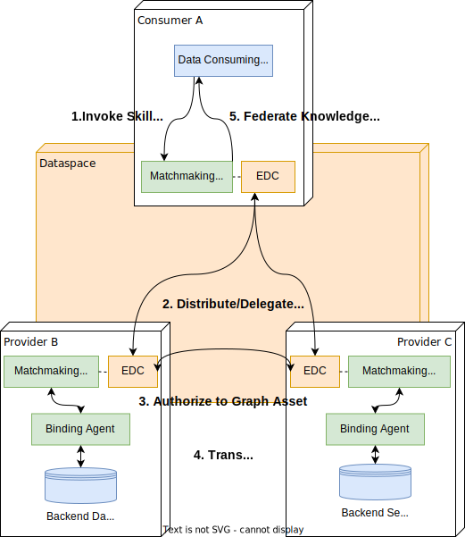
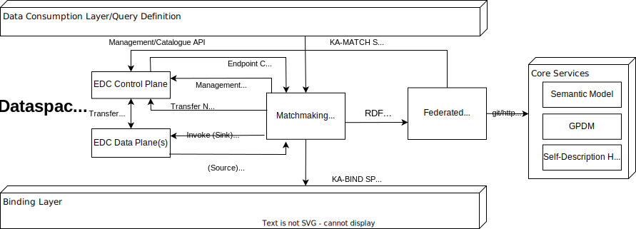

# CX-0084 Federated Queries in Data Spaces v1.1.0

## ABSTRACT

This document provides a standard for a semantically-driven and state-of-the-art compute-to-data architecture for Catena-X, the so called Knowledge Agents (KA) approach. It builds on well-established W3C-standards of the semantic web, such as OWL, SPARQL, SHACL, RDF etc. and makes these protocols usable to formulate powerful queries to the data space. Those queries can be used to answer business questions directly (comparable to a search engine) or they can be embedded in apps to include query results into workflows with more advanced visualization etc. The document addresses all stakeholders in Catena-X context that want to exchange data via the knowledge agents approach (data providers and consumers as well as app- and enablement service providers).

## FOR WHOM IS THE STANDARD DESIGNE

## COMPARISON WITH THE PREVIOUS VERSION OF THE STANDARD

- The structure of the document has been adapted to the latest template.
- [Reference implementations](#33-reference-implementations) have been added.
- Minor glitches have been corrected [here](#ka-transfer).
- Hyperlinks have been adapted following the migration of consortium to association.

## 1 INTRODUCTION

### 1.1 AUDIENCE & SCOPE

> *This section is non-normative*

The standard is relevant for the following roles:

- Business Application Provider
- Enablement Service Provider
- Data Consumer
- Data Provider

In the following, we call one of the following affected stakeholders/solutions Knowledge Agent (KA)-enabled if it passes the Conformity Assessment Criteria (CAC, see Section 1.2 and Chapter 2):

- **Business Application Provider:** Applications that use KA technology on behalf of a Dataspace Participant (e.g. a Fleet Monitor, an Incident Reporting Solution).

- **Enablement Service Provider:** Services to assist Dataspace Participants/Applications in processing data based on KA technology (e.g. a Graph Database, a Virtual Graph Binding Engine, an EDC Package).
As a second path, Companies are addressed that want to provide compute resources (for example by a server or other KA-enabled Applications or Services) based on instances/configurations of KA-enabled EDC Packages, for example a Recycling Software Specialist

- **Data Consumer:** Companies that want to use data and logic (for example by KA-enabled Applications or Services) based on instances/configurations of KA-enabled EDC Packages, such as a Recycling Company or a Tier-2 Automotive Supplier
- **Data Provider:** Companies that want to provide data (for example by a backend database or other KA-enabled Applications or Services) based on instances/configurations of KA-enabled EDC Packages, for example an Automotive OEM. Companies that want to provide functions (for example by a REST endpoint or other KA-enabled Applications or Services) based on instances/configurations of KA-enabled EDC Packages, for example a Tier1 Sensor Device Supplier

The CAC formulated in this standard comprise the following scope:

- Query and Search (Basic Mechanism, Integration in User Experiences)
- Services for making use of various federated data sources being part of a data space (Data & Function Provisioning, Logic Development & Provisioning)
- Semantic Modelling
- Publishing, Negotiation, Transfer Protocols and Policy Enforcement via IDS (EDC) connector

### 1.2 CONTEXT AND ARCHITECTURE FIT

> *This section is non-normative*

The main objective concerning the approach described in this section is to create a state-of-the-art compute-to-data architecture for automotive use cases (and beyond) based on standards and best practices around GAIA-X and W3C. To reach this aim, full semantic integration, search and query with focus on relations between entities and data sovereignty is focused. In contrast to a simple file-based data transfer, this shifts the responsibility for the

1. access,
2. authorization to the data and
3. processing of the data

from the application development to the provider and hence ultimately, the actual owner of the data.



***Figure 1: Basic Overview about Knowledge Agents approach***

The most important concepts needed for the realization are summarized in Figure 1. The App in the figure serves the consumer by gathering, analyzing, and presenting the knowledge about business questions such as: How much of a certain material can be found in a specific vehicle series? It is assumed that the data which is needed to answer such questions is distributed over the network and cannot be found at one central place.

To help collecting the data over the network, **Skills** are introduced. A Skill is a pre-formulated query (or: procedure) with limited scope such as: List all vehicle series that contain material produced in a certain location. The Skill is used to access all federated data instances via the tenant (= authentication and authorization scope) of the caller.

A skill receives input in the form of a data set (we use a JSON notation in the following example):

```csharp
[{"material":{"type":"literal","value":“Rubber”},"location":{"type":"literal","value":“Phuket”}}]
```

which drives the control flow, the filtering and aggregating  of the information, and finally producing an output data set, for example:

```csharp
[
  {"series":{"type":"uri","value":"OEM#4711"},"oem":{"type":"uri","value":"OEM"},"weightKg":{"type":"literal","datatype":"http://www.w3.org/2001/XMLSchema#float",”3.2”}},
  {"series":{"type":"uri","value":"EMO:0815"},"oem":{"type":"uri","value":"EMO"},"weightKg":{"type":"literal","datatype":"http://www.w3.org/2001/XMLSchema#float",”1.4”}}
]
```

In order to obtain the correct results in a federated system, all the participants of the skill execution need to have common understanding over the vocabulary (see following chapter). Relying on these conventions, an executor of a skill can calculate which providers are able to contribute or yield the necessary information in which sequence such that the resulting distributed operation will be performant.

This coordinating job is taken over by the **Matchmaking Agent**, an endpoint that is mandatory for any KA-enabled Dataspace Participant. For that purpose, the Matchmaking Agent supports the SPARQL specification (see chapter 3) with the effect that the dataspace can be traversed as one large data structure. Hereby, the Consumer-Side Matchmaking Agent will – as driven by the built-in federation features of SPARQL - interact with the KA-enabled EDC in order to negotiate and perform the transfer of Sub-Skills which are partial expressions of the original SPARQL command to other Dataspace Participants.

In turn, upon successful transfer of the Sub-Skill, the Provider-Side Matchmaking Agent(s) will be activated by their respective EDC. The precondition for this activation is of course that the Provider EDC first needs to offer a so-called Graph Asset:

**Graph Assets** are a variant of ordinary Data Assets (see the ANNEX) in the Catena-X EDC Standard; while Data Assets typically refer to an actual backend system (e.g., an Blob in an Object Store, an AAS server, a REST endpoint), Graph Assets introduce another intermediary instance, the so-called Binding Agent.

Simply put, the **Binding Agent** is a restricted version of the Matchmaking Agent (which speaks a profile, i.e., a subset of SPARQL specification, see the ANNEX) which is just focused on translating Sub-Skils of a particular business domain (Bill-Of-Material, Chemical Materials, Production Sites, etc.) into proper SQL- or REST based backend system calls. This scheme has several advantages:

- For different types of backend systems, business domains and usage scenarios, different Binding Agent implementations (Caching Graph Store, SQL Binding Engine, REST Binding Engine) can be switched-in without affecting both the shared dataspace/semantic model and the mostly immutable backend systems/data models as well.
- Access to the backend systems can be optimized by JIT compilation technology.
- The same backend system/data model can be used in various Graph Assets/Use Cases und different roles and policies.
- Access to the backend system is decoupled by another layer of security, such that additional types of policies (role-based row-level and attribute-level access) can be implemented in the interplay of Matchmaking and Binding Agents.
- There is a clear distinction between advanced graph operations (including type inference and transitive/recursive traversal also via EDC) on the Matchmaking Level and efficient, but more restricted and secure graph operations on the Binding/Data Level.

As mentioned earlier, essential for the realization of the idea is the creation, governance and discoverability of a well-defined semantic catalogue (the **Federated Catalogue**) which together with the data inside the Graph Assets forms a **Federated Knowledge Graph**. In this context, the definition of a Knowledge Graph (KG) as "a multi relational graph composed of entities and relations which are regarded as nodes and different types of edges, respectively" is extended with aspect of federation. We see a Federated KG as a KG where entities and relations reside physically distributed over multiple systems connected through a network and a common query language. We see semantic metadata as structural information to scope the entities and relations of the KG based on ontological principles. This is the agreement, necessary for the successful interplay of the distributed parties within the data space.

To summarize, the Knowledge Agent standard shall achieve the following abilities:

- the ability to define well-formed and composable computations/scripts (skills) which operate over various assets of various business partners.
- the ability to invoke and dynamically distribute these (sub-)skills over the relevant partners/connectors using an extensible agent interface.
- the ability to safely provide data and service assets via appropriate agent implementations which "bind" the skill to the backend execution engines (rather than mapping data).
- the ability for an agent/connector/business partner to decide
  - whether to hide particular data and computations inside a sub-skill
  - whether to delegate/federate particular computations/sub-skills to other agents
  - whether to migrate or clone an agent/asset from a partner
- the ability to describe data and service assets as well as appropriate federation policies in the IDS vocabulary in order to allow for a dynamic matchmaking of skills and agents.
- the ability to define domain/use case-based ontologies which form the vocabulary used in the skill definitions.
- the ability to visualize and develop the ontologies and skills in appropriate SDKs and User Experience components.

### 1.3 ARCHITECTURE OVERVIEW

> *This section is non-normative*

This chapter gives an overview how the concept elaborated in previous chapter should be implemented. In this context generic building blocks were defined (see Figure 3) which can be implemented with different open source or COTS solutions. In the scope of Catena-X project these building blocks are instantiated with a reference implementation based on open source components (the Knowledge Agents KIT). The detailed architecture following this reference implementation can be found here: https://eclipse-tractusx.github.io/docs-kits/24.03/kits/knowledge-agents/development-view/architecture.


***Figure 2: KA building blocks (Solid-Lines Denote Standard-Affected Layers & Components)***

In the following paragraphs, all building blocks relevant for this version of the standard are introduced:

#### Semantic (Ontology) Models

Ontologies, as defined by W3C Web Ontology Language OWL 2 (https://www.w3.org/OWL/) standard, provide the core of the KA catalogue. OWL comes with several interpretation profiles (https://www.w3.org/TR/owl2-profiles/) for different types of applications. For model checking and data validation (not part of this standard), the Rule Logic (RL) profile is used. For query answering/data processing (part of this standard), the Existential Logic (EL) profile (on the Dataspace Layer) and the Query Logic (QL) profile (on the Binding Layer) is used. Furthermore, RDF Terse Triple Language TTL (https://www.w3.org/TR/turtle/) format is used to divide/merge large ontologies into/from modular domain ontology files.

The actual guidelines for how these domain ontologies are designed such that they are consistent with other is described in the sibling standard CX-0067 Ontology Models in Catena-X.

Semantic Models are hosted in the Ontology Hub that is a central service to the dataspace based on git over http(https://www.git-scm.com/docs/http-protocol).

#### Data Consumption Layer/Query Definition

This layer comprises all applications which utilize provided data and functions of business partners to achieve a direct business impact and frameworks which simplify the development of these applications. Thus, this layer focuses on using a released Semantic Model (or a use-case/role-specific excerpt thereof) as a vocabulary to build flexible queries (Skills) and integrating these Skills in data consuming apps. Skills can be easily integrated in these apps as stored procedure. Hence, skill and app development can be decoupled to increase efficiency of the app development process.

SPARQL 1.1 specification (https://www.w3.org/TR/sparql11-query/) is used as a language and protocol to search for and process data across different business partners. As a part of this specification,  the QUERY RESULTS JSON (https://www.w3.org/TR/sparql11-results-json/) and the QUERY RESULTS XML (https://www.w3.org/TR/rdf-sparql-XMLres/) formats are used to represent both the answer sets generated by SPARQL skills and the sets of input parameters that a SPARQL skill should be applied to. For answer sets, additional formats such as the QUERY RESULTS CSV and TSV (https://www.w3.org/TR/sparql11-results-csv-tsv/) format may be supported. Required is the ability to store and invoke SPARQL queries as parameterized procedures in the dataspace; this is a KA-specific adaption to the SPARQL endpoint (the so-called KA-MATCH profile, see ANNEX) that is also captured in the concise OpenAPI specification  (https://eclipse-tractusx.github.io/docs-kits/24.03/kits/knowledge-agents/development-view/api). This API allows for an extended response behaviour which introduces a warning status (matching the HTTP response status code “203 - Non-Authoritative Information”) and an additional response header “cx_warning” that lists abnormal events or trace information that appeared during the processing in a data-sovereign manner.

#### Dataspace Layer

The base technology for building data spaces is the Eclipse Dataspace Connector (EDC) which should be extended to operate as a HTTP/S contracting & transfer facility for the SPARQL-speaking Matchmaking Agent. To resolve dataspace offers and addresses using the ontological vocabulary, the Matchmaking Agent keeps a default meta-graph, the Federated Catalogue, that is used to host the Semantic Model and that is regularly synchronized with the relevant dataspace information including the offers of surrounding business partners/EDCs.

The EDC interacts with the so-called Matchmaking Agent which is the first stage of SPARQL processing. It operates as the main invocation point to the Data Consuming Layer (using the KA-MATCH SPARQL profile). Furthermore, It operates as the main bridging point between incoming EDC transfers (from an “Agent Source” in the KA-TRANSFER SPARQL profile) and the underlying Binding Layer (speaking the KA-BIND SPARQL profile). And it implements federation by delegating any outgoing SERVICE/GRAPH contexts back to the EDC (using the KA-TRANSFER profile).



***Figure 3: Standard-Affected Dataspace Components***

Since EDC and Matchmaking Agent are bidirectionally coupled, implementations could merge Data Plane and Matchmaking Agent into a single package, the so-called Agent Plane. Agent Planes and ordinary Data Planes can co-exist due to our design choices.

The so called Federated Catalogue is an RDF data storage facility for the Matchmaking Agent. It could be an in-memory triple store (that is restored via downloading TTL and refreshing dataspace catalogues upon restart), a dedicated graph database using btree index files or even an ordinary relational database that has been adapted to fit to the chosen Matchmaking Agent implementation. One example of such an interface is the Eclipse RDF4J SAIL (https://rdf4j.org/documentation/reference/sail/) that is common for many SPARQL and RDF persistence engines.

The Federated Catalogue should initially download the complete Semantic Model that has been released for the target environment from the Ontology Hub (http://w3id.org/catenax/ontology). It should also contain a list of business partners and their roles which form the surrounding dataspace neighborhood of the tenant. For that purpose, it could use BPDM and Self-Description Hub services in order to lookup EDC addresses and additional domain information (sites, geo addresses). It should then be frequently updated with “live” information by invoking the EDC data management API to regularly obtain catalogue information.
The portion of the Semantic Model describing these meta-data (Business Partners, Sites, Addresses, Use Cases, Use Case Roles, Connectors & Assets) is called the Common domain ontology and is mandatory for all releases/excerpts of the Semantic Model (https://w3id.org/catenax/ontology/common).

All relevant profiles and asset descriptions are explained in detail in the ANNEX. The interplay of the components and their respective interfaces in Figure 3 forms the basis of interoperability between EDC and backend systems within a single business partner's environment as well as interoperability between multiple business partners' dataspace segments.

Therefore, the Conformity Assessment (CA) as well as the individual Conformity Assessment Criteria (CAC) envisaged in this standard (see #2-conformity-assessment-criteria) have a focus on verifying the capabilities and functionalities of exactly these interfaces:

- between Consuming Application and Matchmaking Agent (KA-MATCH protocol profile - see #22-cac-for-matchmaking-agent)
- between Matchmaking Agent and Binding Agents (KA-BIND protocol profile - see #24-cac-for-binding-agents and #22-cac-for-matchmaking-agent)
- between EDC and Matchmaking Agent (Management API, Negotiation API, Endpoint Callback, KA-TRANSFER Invocation and Delegation - see #21-cac-for-edc and #22-cac-for-matchmaking-agent)
- between Federated Catalogue and EDC (Management/Catalogue API - see #21-cac-for-edc and #23-cac-for-federated-catalogue)
- between Matchmaking Agent and Federated Catalogue (Storage API - see #23-cac-for-federated-catalogue and #22-cac-for-matchmaking-agent)
- between Federated Catalogue and Core Services (raw download from git branch/tag - see #23-cac-for-federated-catalogue and #25-cac-for-ontology-hub)

#### Backend Systems

Legacy IT landscape of data space participants consisting of various backend systems, such as PLM, ERP, ObjectStores mostly located in the Enterprise Intranet and hosted/goverened by the business departments. Here, the actual data sources of all Catena-X participants is originated where they are served using custom, but mission-critical business or technological APIs in specific, transaction-oriented formats. From the standpoint of Knowledge Agents, also Digital Twin servers and registries such as following the [IDTA AAS standards](https://industrialdigitaltwin.org/) can be regarded as backend systems.

#### Virtualization Layer

The data virtualization layer fulfills the function of making the company internal, department-hosted data available for cross-company data exchange scenarios, e.g. via data lakes, data warehouses or other enterprise middleware. Instead of connecting each and every backend system separatly to an external data source/sink (such as Catena-X) it often makes sense to have this additional layer on top of backend systems which orchestrates data demand and supply across the systems. Depending on company IT architecture different technologies, such as virtual SQL databases, API gateways and extraction & transformation pipelines, can be used to build up this layer.

A special case of a virtualisation is the AAS-KA Bridge which makes the AAS API accessible to the upcoming binding layer in a generic manner. This will be elaborated in a later version of this standard.

#### Binding Layer

Finally, the missing link between the Dataspace Layer and the Virtualization Layer is the Binding Layer. Hereby rather than mapping the data between different formats (e.g. Data Tables in CSV Format to and from Data Graphs in the TTL format) which is a mostly resource-consuming data transformation process, binding rather rewrites the actual queries (e.g. SPARQL into SQL, SPARQL into GraphQL or REST). In order to make this query rewriting not too complicated, a restricted subset of SPARQL is envisaged.

A special case of a binding is the KA-AAS Bridge which maps between SPARQL modules in the same layer and AAS (as the target API). This will be elaborated in a later version of this standard.

### 1.4 CONFORMANCE

As well as sections marked as non-normative, all authoring guidelines, diagrams, examples, and notes
in this specification are non-normative. Everything else in this specification is normative.

The key words **MAY**, **MUST**, **MUST NOT**, **OPTIONAL**, **RECOMMENDED**, **REQUIRED**, **SHOULD**
and **SHOULD NOT** in this document document are to be interpreted as described in BCP 14 [RFC2119] [RFC8174]
when, and only when, they appear in all capitals, as shown here.

### 1.5 PROOF OF CONFORMITY

> *This section is non-normative*

Certification against this standard is particulary relevant for Enablement Service Providers that provide solutions based on Knowledge Agents technology. All other data space participants (see audience & scope: data providers, data consumers, app providers) do not require certification but may use this standard as additional source of information if they want to use KA technology.
To validate that the standards are applied correctly, Catena-X employs Conformity Assessment Bodies (CABs).
Please refer to the association homepage for the process of conformity assessment and certification.

The Conformity Assessment Criteria (and proposed Conformity Assessment Methods) will be listed in Chapter 2 for the respective building blocks
that are relevant for KA Enablement.

Corresponding to this standard, a testbed blueprint is provided under https://eclipse-tractusx.github.io/docs-kits/kits/knowledge-agents/operation-view/testbed which covers most of the
following CACs and CAMs. Up till now there is no operated testbed available. Thus, until this situation is resolved CAB may accept a self-assessment that all CACs are fulfilled by respective Enablement Service Provider.

### 1.6 Examples

#### Data Binding

The following is an example binding in the [OBDA](https://ontop-vkg.org/tutorial/basic/university-1.html#mappings) format which translates between between RDF triples (over the Catena-X domain ontologies related to vehicles and reliablity) and an underyling relational SQL database.

```
[PrefixDeclaration]
cx-common:          https://w3id.org/catenax/ontology/common#
cx-core:            https://w3id.org/catenax/ontology/core#
cx-vehicle:         https://w3id.org/catenax/ontology/vehicle#
cx-reliability:     https://w3id.org/catenax/ontology/reliability#
uuid:        urn:uuid:
bpnl:        bpn:legal:
owl:        http://www.w3.org/2002/07/owl#
rdf:        http://www.w3.org/1999/02/22-rdf-syntax-ns#
xml:        http://www.w3.org/XML/1998/namespace
xsd:        http://www.w3.org/2001/XMLSchema#
json:             https://json-schema.org/draft/2020-12/schema#
obda:        https://w3id.org/obda/vocabulary#
rdfs:        http://www.w3.org/2000/01/rdf-schema#
oem:              urn:oem:

[MappingDeclaration] @collection [[
mappingId vehicles
target <{vehicle_id}> rdf:type cx-vehicle:Vehicle ; cx-vehicle:vehicleIdentificationNumber {van}^^xsd:string; cx-vehicle:worldManufaturerId bpnl:{localIdentifiers_manufacturerId}; cx-vehicle:productionDate {production_date}^^xsd:date.
source SELECT vehicle_id, van, localIdentifiers_manufacturerId, production_date FROM vehicles

mappingId partsvehicle
target <{gearbox_id}> cx-vehicle:isPartOf <{vehicle_id}> .
source SELECT vehicle_id, gearbox_id FROM vehicles

mappingId vehicleparts
target <{vehicle_id}> cx-vehicle:hasPart <{gearbox_id}> .
source SELECT vehicle_id, gearbox_id FROM vehicles

mappingId parts
target <{gearbox_id}> rdf:type cx-vehicle:Part ; cx-vehicle:id {gearbox_id}^^xsd:string; cx-vehicle:name {partTypeInformation_nameAtManufacturer}^^xsd:string; cx-vehicle:number {partTypeInformation_manufacturerPartId}^^xsd:string; cx-vehicle:supplier bpnl:{localIdentifiers_manufacturerId}; cx-vehicle:productionDate {production_date}^^xsd:date .
source SELECT gearbox_id, production_date, partTypeInformation_nameAtManufacturer, localIdentifiers_manufacturerId, partTypeInformation_manufacturerPartId FROM vehicles

mappingId partAnalysis
target oem:{newest_telematics_id} cx-reliability:analysedObject <{gearbox_id}>.
source SELECT gearbox_id, newest_telematics_id FROM vehicles

mappingId analysisInformation
target      oem:{id} rdf:type cx-reliability:Analysis; cx-reliability:operatingHoursOfVehicle {metadata_status_operatingHours}^^xsd:float; cx-core:startDateTime {metadata_status_date}^^xsd:dateTime; cx-core:endDateTime {metadata_status_date}^^xsd:dateTime; cx-reliability:mileageOfVehicle {metadata_status_mileage}^^xsd:int.
source SELECT id, metadata_status_operatingHours, metadata_status_date, metadata_status_mileage FROM reading

mappingId analysisResult
target oem:{id} cx-reliability:result oem:{id}/{index}.
source   SELECT id, index FROM loadspectra

mappingId loadspectrum
target      oem:{id}/{index} rdf:type cx-reliability:LoadSpectrum; cx-core:id {metadata_componentDescription}^^xsd:string; cx-core:name {metadata_projectDescription}^^xsd:string; cx-reliability:description {metadata_routeDescription}^^xsd:string; cx-reliability:countingValue {body_counts_countsName}^^xsd:string; cx-reliability:countingUnit {header_countingUnit}^^xsd:string; cx-reliability:countingMethod {header_countingMethod}^^xsd:string; cx-reliability:channels {header_channels}^^json:Object; cx-reliability:classes {body_classes}^^json:Object; cx-reliability:values {body_counts_countsList}^^json:Object .
source SELECT id, index, metadata_componentDescription, metadata_projectDescription, metadata_routeDescription, header_countingUnit, header_countingMethod, header_channels, body_classes, body_counts_countsName,  body_counts_countsList FROM loadspectra

]] 
```

#### Function Binding

The following is an example binding in the [RDF4J Repository Configuration Language](https://rdf4j.org/documentation/tools/repository-configuration/) which translates between RDF triples (over the Catena-X domain ontologies related to reliability and behavioural simulations) and an underyling relational REST backend performing a lifetime prognosis.

```
#
# Rdf4j configuration for a rul-specific remoting
#
@prefix rdf:            <http://www.w3.org/1999/02/22-rdf-syntax-ns#>.
@prefix rdfs:           <http://www.w3.org/2000/01/rdf-schema#>.
@prefix rep:            <http://www.openrdf.org/config/repository#>.
@prefix sr:             <http://www.openrdf.org/config/repository/sail#>.
@prefix sail:           <http://www.openrdf.org/config/sail#>.
@prefix sp:             <http://spinrdf.org/sp#>.
@prefix xsd:            <http://www.w3.org/2001/XMLSchema#> .
@prefix json:           <https://json-schema.org/draft/2020-12/schema#> .
@prefix dcterms:        <http://purl.org/dc/terms/> .
@prefix cx-fx:          <https://w3id.org/catenax/ontology/function#>.
@prefix cx-common:      <https://w3id.org/catenax/ontology/common#>.
@prefix cx-core:        <https://w3id.org/catenax/ontology/core#>.
@prefix cx-vehicle:     <https://w3id.org/catenax/ontology/vehicle#>.
@prefix cx-reliability: <https://w3id.org/catenax/ontology/reliability#>.
@prefix cx-behaviour:   <https://w3id.org/catenax/ontology/behaviour#>.

[] rdf:type rep:Repository ;
   rep:repositoryID "rul" ;
   rdfs:label "Remainig Useful Life Functions Repository" ;
   rep:repositoryImpl [
      rep:repositoryType "openrdf:SailRepository" ;
      sr:sailImpl [
         sail:sailType "org.eclipse.tractusx.agents:Remoting" ;
         cx-fx:supportsInvocation cx-behaviour:RemainingUsefulLife;
         cx-fx:callbackAddress <http://remoting-agent:8081/rdf4j-server/callback>;
      ]
   ].

cx-behaviour:RemainingUsefulLife rdf:type cx-fx:Function;
  dcterms:description "Remaining Useful Life is an asynchronous batch invocation."@en ;
  dcterms:title "Remaining Useful Life" ;
  cx-fx:targetUri "http://rul-backend:35553/api/v1/routine/notification";
  cx-fx:invocationMethod "POST-JSON";
  cx-common:authenticationKey "Authorization";
  cx-common:authenticationCode "Basic Zm9vOmJhcg==";
  cx-fx:invocationMethod "POST-JSON";
  cx-fx:invocationIdProperty "header.notificationID,content.requestRefId";
  cx-fx:callbackProperty "header.respondAssetId";
  cx-fx:input cx-behaviour:notification;
  cx-fx:input cx-behaviour:severity;
  cx-fx:input cx-behaviour:targetDate;
  cx-fx:input cx-behaviour:classification;
  cx-fx:input cx-behaviour:component;
  cx-fx:input cx-behaviour:observationType;
  cx-fx:input cx-behaviour:metadata;
  cx-fx:input cx-behaviour:statusDate;
  cx-fx:input cx-behaviour:statusOperatingHours;
  cx-fx:input cx-behaviour:statusMileage;
  cx-fx:input cx-behaviour:countingMethod;
  cx-fx:input cx-behaviour:countingValue;
  cx-fx:input cx-behaviour:countingUnit;
  cx-fx:input cx-behaviour:headerChannels;
  cx-fx:input cx-behaviour:bodyClasses;
  cx-fx:input cx-behaviour:bodyCountsList;
  cx-fx:result cx-behaviour:response.

cx-behaviour:notification rdf:type cx-fx:Argument;
  dcterms:description "A default notification output template."@en ;
  dcterms:title "Notification Template";
  cx-fx:argumentName ".";
  cx-fx:dataType json:Object;
  cx-fx:priority "-1"^^xsd:integer;
  cx-fx:default "{ \"content\": { \"endurancePredictorInputs\": []}}"^^json:Object.

cx-behaviour:severity rdf:type cx-fx:Argument;
  dcterms:description "Severity of the notification."@en ;
  dcterms:title "Notification Severity";
  cx-fx:argumentName "header.severity";
  cx-fx:dataType xsd:string;
  cx-fx:default "MINOR".

cx-behaviour:targetDate rdf:type cx-fx:Argument;
  dcterms:description "Target Date of the notification."@en ;
  dcterms:title "Notification Target Date";
  cx-fx:dataType xsd:dateTime;
  cx-fx:argumentName "header.targetDate".

cx-behaviour:classification rdf:type cx-fx:Argument;
  dcterms:description "Classification of the notification."@en ;
  dcterms:title "Notification Classification";
  cx-fx:argumentName "header.classification";
  cx-fx:dataType xsd:string;
  cx-fx:default "RemainingUsefulLifePredictor".

cx-behaviour:component rdf:type cx-fx:Argument;
  dcterms:description "Component of the Predicition."@en ;
  dcterms:title "Predicted Component";
  cx-fx:formsBatchGroup "true"^^xsd:boolean;
  cx-fx:argumentName "content.endurancePredictorInputs.0.componentId,content.endurancePredictorInputs.0.classifiedLoadSpectrum{https://w3id.org/catenax/ontology/behaviour#observationType}.targetComponentId".

cx-behaviour:observationType rdf:type cx-fx:Argument;
  dcterms:description "The type of observation made."@en ;
  dcterms:title "Observation Type";
  cx-fx:argumentName "content.endurancePredictorInputs.0.classifiedLoadSpectrum{https://w3id.org/catenax/ontology/behaviour#observationType}.metadata.componentDescription";
  cx-fx:dataType xsd:string.

cx-behaviour:metadata rdf:type cx-fx:Argument;
  dcterms:description "Metadata of the Loadspectrum."@en ;
  dcterms:title "Loadspectrum Metadata";
  cx-fx:argumentName "content.endurancePredictorInputs.0.classifiedLoadSpectrum{https://w3id.org/catenax/ontology/behaviour#observationType}";
  cx-fx:dataType json:Object;
  cx-fx:priority "0"^^xsd:integer;
  cx-fx:default "{ \"metadata\":{ \"projectDescription\": \"pnr_76543\", \"routeDescription\": \"logged\" }, \"bammId\": \"urn:bamm:io.openmanufacturing.digitaltwin:1.0.0#ClassifiedLoadSpectrum\" }"^^json:Object.

cx-behaviour:statusDate rdf:type cx-fx:Argument;
  dcterms:description "Time of Recording."@en ;
  dcterms:title "Loadspectrum Recording Time";
  cx-fx:dataType xsd:dateTime;
  cx-fx:argumentName "content.endurancePredictorInputs.0.classifiedLoadSpectrum{https://w3id.org/catenax/ontology/behaviour#observationType}.metadata.status.date".

cx-behaviour:statusOperatingHours rdf:type cx-fx:Argument;
  dcterms:description "Operating Hours of Target Component at Time of Recording."@en ;
  dcterms:title "Loadspectrum Operating Hours";
  cx-fx:dataType xsd:float;
  cx-fx:argumentName "content.endurancePredictorInputs.0.classifiedLoadSpectrum{https://w3id.org/catenax/ontology/behaviour#observationType}.metadata.status.operatingHours".

cx-behaviour:statusMileage rdf:type cx-fx:Argument;
  dcterms:description "Mileage of Component at Time of Recording."@en ;
  dcterms:title "Loadspectrum Mileage";
  cx-fx:dataType xsd:int;
  cx-fx:argumentName "content.endurancePredictorInputs.0.classifiedLoadSpectrum{https://w3id.org/catenax/ontology/behaviour#observationType}.metadata.status.mileage".

cx-behaviour:countingUnit rdf:type cx-fx:Argument;
  dcterms:description "Counting Unit of Load Spectrum."@en ;
  dcterms:title "Loadspectrum Counting Unit";
  cx-fx:dataType xsd:string;
  cx-fx:argumentName "content.endurancePredictorInputs.0.classifiedLoadSpectrum{https://w3id.org/catenax/ontology/behaviour#observationType}.header.countingUnit".

cx-behaviour:countingValue rdf:type cx-fx:Argument;
  dcterms:description "Counting Value Name of Load Spectrum."@en ;
  dcterms:title "Loadspectrum Counting Value";
  cx-fx:dataType xsd:string;
  cx-fx:argumentName "content.endurancePredictorInputs.0.classifiedLoadSpectrum{https://w3id.org/catenax/ontology/behaviour#observationType}.header.countingValue,content.endurancePredictorInputs.0.classifiedLoadSpectrum{https://w3id.org/catenax/ontology/behaviour#observationType}.body.counts.countsName".

cx-behaviour:countingMethod rdf:type cx-fx:Argument;
  dcterms:description "Counting Method of Load Spectrum."@en ;
  dcterms:title "Loadspectrum Counting Method";
  cx-fx:dataType xsd:string;
  cx-fx:argumentName "content.endurancePredictorInputs.0.classifiedLoadSpectrum{https://w3id.org/catenax/ontology/behaviour#observationType}.header.countingMethod".

cx-behaviour:headerChannels rdf:type cx-fx:Argument;
  dcterms:description "Channels of Load Spectrum."@en ;
  dcterms:title "Loadspectrum Channels";
  cx-fx:dataType json:Object;
  cx-fx:argumentName "content.endurancePredictorInputs.0.classifiedLoadSpectrum{https://w3id.org/catenax/ontology/behaviour#observationType}.header.channels".

cx-behaviour:bodyClasses rdf:type cx-fx:Argument;
  dcterms:description "Classes of Load Spectrum."@en ;
  dcterms:title "Loadspectrum Classes";
  cx-fx:dataType json:Object;
  cx-fx:argumentName "content.endurancePredictorInputs.0.classifiedLoadSpectrum{https://w3id.org/catenax/ontology/behaviour#observationType}.body.classes".

cx-behaviour:bodyCountsList rdf:type cx-fx:Argument;
  dcterms:description "Counts List of Load Spectrum."@en ;
  dcterms:title "Loadspectrum Counts List";
  cx-fx:dataType json:Object;
  cx-fx:argumentName "content.endurancePredictorInputs.0.classifiedLoadSpectrum{https://w3id.org/catenax/ontology/behaviour#observationType}.body.counts.countsList".

cx-behaviour:response rdf:type cx-fx:Result;
  dcterms:description "The asynchronous notification response."@en ;
  dcterms:title "Asynchronous notification response." ;
  cx-fx:callbackProperty "header.referencedNotificationID";
  cx-fx:outputProperty "content.endurancePredictorOutputs";
  cx-fx:output cx-behaviour:remainingOperatingHours;
  cx-fx:output cx-behaviour:remainingRunningDistance.

cx-behaviour:remainingOperatingHours rdf:type cx-fx:ReturnValue;
  dcterms:description "Predicted Operating Hours of Remaining Useful Life Response"@en ;
  dcterms:title "Remaining Useful Life Operating Hours" ;
  cx-fx:valuePath "0.remainingUsefulLife.remainingOperatingHours";
  cx-fx:dataType xsd:float.

cx-behaviour:remainingRunningDistance rdf:type cx-fx:ReturnValue;
  dcterms:description "Predicted Distance of Remaining Useful Life Response"@en ;
  dcterms:title "Remaining Useful Life Distance" ;
  cx-fx:valuePath "0.remainingUsefulLife.remainingRunningDistance";
  cx-fx:dataType xsd:int.
```

#### Graph Assets

The following are example dataspace asset descriptions in JSONLD which publish the virtual graphs which have been described by the previous bindings.

```
{
    "@context": {
        "rdf": "http://www.w3.org/1999/02/22-rdf-syntax-ns#",
        "rdfs": "http://www.w3.org/2000/01/rdf-schema#",
        "cx-taxo": "https://w3id.org/catenax/taxonomy#",
        "cx-common": "https://w3id.org/catenax/ontology/common#",
        "dct": "https://purl.org/dc/terms/",
        "sh": "http://www.w3.org/ns/shacl#",
        "edc": "https://w3id.org/edc/v0.0.1/ns/"
    },
    "@type": "Asset",
    "@id": "GraphAsset?oem=Reliability",
    "properties": {
        "name": "OEM Reliability Testdataset.",
        "name@de": "OEM Reliability Testdaten.",
        "description": "A graph asset offering/binding Catena-X reliability test data.",
        "description@de": "Ein Graph Angebot, welches Catena-X Testdaten zur Zuverlässigkeit beinhaltet.",
        "cx-common:version": "CX_RuL_Testdata_v1.0.0",
        "rdf:type": "cx-common:GraphAsset",
        "dct:type": {
          "@id": "cx-taxo:GraphAsset"
        },
        "contenttype": "application/json, application/xml",
        "cx-common:publishedUnderContract": "Contract?oem=Graph",
        "dc:type": "https://w3id.org/catenax/taxonomy#",
        "rdfs:isDefinedBy": "<https://w3id.org/catenax/usecase/behaviourtwin>,<https://w3id.org/catenax/ontology/core>,<https://w3id.org/catenax/ontology/vehicle>,<https://w3id.org/catenax/ontology/reliability>",
        "cx-common:implementsProtocol": "cx-common:Protocol?w3c:http:SPARQL",
        "sh:shapesGraph": "@prefix : <GraphAsset?oem=Reliability#> .\n",
        "cx-common:isFederated": "true^^xsd:boolean"
    },
    "dataAddress": {
        "id":"GraphAsset?oem=Reliability",
        "@type": "DataAddress",
        "baseUrl": "http://provisioning-agent:8080/sparql",
        "type": "cx-common:Protocol?w3c:http:SPARQL",
        "proxyPath": "false",
        "proxyMethod": "true",
        "proxyQueryParams": "true",
        "proxyBody": "true",
        "authKey": "{{oemBackendAuthKey}}",
        "authCode": "{{oemBackendAuthCode}}"
    }
}
```

```
{
    "@context": {
        "rdf": "http://www.w3.org/1999/02/22-rdf-syntax-ns#",
        "rdfs": "http://www.w3.org/2000/01/rdf-schema#",
        "cx-taxo": "https://w3id.org/catenax/taxonomy#",
        "cx-common": "https://w3id.org/catenax/ontology/common#",
        "dct": "https://purl.org/dc/terms/",
        "sh": "http://www.w3.org/ns/shacl#",
        "edc": "https://w3id.org/edc/v0.0.1/ns/"
    },
    "@type": "Asset",
    "@id": "GraphAsset?supplier=LifetimePrognosis",
    "properties": {
        "name": "SUPPLIER Lifetime Testprognosis",
        "description": "A graph asset offering/binding lifetime Catena-X test function.",
        "cx-common:version": "1.9.4-SNAPSHOT",
        "rdf:type": "cx-common:GraphAsset",
        "dct:type": {
          "@id": "cx-taxo:GraphAsset"
        },
        "contenttype": "application/json, application/xml",
        "cx-common:publishedUnderContract": "Contract?supplier=Graph",
        "rdfs:isDefinedBy": "<https://w3id.org/catenax/ontology/common>,<https://w3id.org/catenax/ontology/core>,<https://w3id.org/catenax/ontology/function>,<https://w3id.org/catenax/ontology/behaviour>",
        "cx-common:implementsProtocol": "cx-common:Protocol?w3c:http:SPARQL",
        "sh:shapesGraph": "@prefix : <GraphAsset?supplier=LifetimePrognosis#> .\n",
        "cx-common:isFederated": "true^^xsd:boolean"
    },
    "dataAddress": {
        "id": "GraphAsset?supplier=LifetimePrognosis",
        "@type": "DataAddress",
        "baseUrl": "http://remoting-agent:8081/rdf4j-server/repositories/rul",
        "type": "cx-common:Protocol?w3c:http:SPARQL",
        "proxyPath": "false",
        "proxyMethod": "true",
        "proxyQueryParams": "true",
        "proxyBody": "true",
        "authKey": "{{supplierBackendAuthKey}}",
        "authCode": "{{supplierBackendAuthCode}}"
    }
  }
```

#### Federated SparQL Query and Result

The following is an example parameterized query in SPARQL (using the Catena-X reliability and behaviour domains) which, given a vehicle identification number (@vin), performs a lifetime prognosis for its differential gear over two dataspace hops (respective OEM and SUPPLIER).

```
PREFIX cx-common:       <https://w3id.org/catenax/ontology/common#>
PREFIX cx-core:         <https://w3id.org/catenax/ontology/core#>
PREFIX cx-vehicle:      <https://w3id.org/catenax/ontology/vehicle#>
PREFIX cx-reliability:  <https://w3id.org/catenax/ontology/reliability#>
PREFIX cx-behaviour:    <https://w3id.org/catenax/ontology/behaviour#>
PREFIX rdf:             <http://www.w3.org/1999/02/22-rdf-syntax-ns#>
PREFIX rdfs:            <http://www.w3.org/2000/01/rdf-schema#>
PREFIX xsd:             <http://www.w3.org/2001/XMLSchema#>
PREFIX json:            <https://json-schema.org/draft/2020-12/schema#>
PREFIX bpnl:        <bpn:legal:>
PREFIX oem:             <GraphAsset?oem=>
PREFIX supplier:        <GraphAsset?supplier=>

################################################################
# Sample for a Federated (Consumer-Deployed) SparQL Skill which
#  - Jumps into an OEM-owned reliability graph given a set of candidate VINs
#  - Forwards reliability data to the respective supplier prognosis graph
# Author: cgjung
# (c) 2023 Catena-X assocation
################################################################

SELECT ?vin ?vehicle ?distanceKm ?timeHours WHERE {

  VALUES (?vin ?aggregate) {
      ("@vin"^^xsd:string "Differential Gear"^^xsd:string)
  }

  ?vin cx-vehicle:worldManufacturer ?oem.
  ?oem cx-common:hasConnector ?oemEDC.
  ?oemEDC cx-common:offers [
      rdfs:isDefinedBy <https://w3id.org/catenax/ontology/reliability>;
      cx-common:id ?reliabilityAssetId].
 
  SERVICE ?oemEDC { 
      GRAPH ?reliabilityAssetId {
        ?vehicle rdf:type cx-vehicle:Vehicle;
            cx-vehicle:vehicleIdentificationNumber ?van.

        ?assembly rdf:type cx-vehicle:Part;
            cx-vehicle:name ?aggregate;
            cx-vehicle:isPartOf ?vehicle;
            cx-vehicle:supplier ?supplier.
           
        ?teleAnalysis rdf:type cx-reliability:Analysis;
            cx-reliability:analysedObject ?assembly;
            cx-reliability:operatingHoursOfVehicle ?operatingTime;
            cx-reliability:mileageOfVehicle ?mileage;
            cx-core:startDateTime ?recordDate;
            cx-reliability:result [
                cx-core:id ?ls_type;
                cx-core:name ?ls_name;
                cx-reliability:countingValue ?ls_value;
                cx-reliability:countingUnit ?ls_unit;
                cx-reliability:countingMethod ?ls_method;
                cx-reliability:channels ?ls_channels;
                cx-reliability:classes ?ls_classes;
                cx-reliability:values ?ls_values
            ].
      } # OEM#GRAPH

    ?supplier cx-common:hasConnector ?supplierEDC.
    ?supplierEDC cx-common:offers [ rdfs:isDefinedBy <https://w3id.org/catenax/ontology/behaviour>; cx-common:id ?prognosisAssetId].

    SERVICE ?supplierEDC {
        GRAPH ?prognosisAssetId {
            ?invocation a cx-behaviour:RemainingUsefulLife;
                    cx-behaviour:targetDate ?recordDate;
                    cx-behaviour:component ?assembly;
                    cx-behaviour:observationType ?ls_type;
                    cx-behaviour:statusDate ?recordDate;
                    cx-behaviour:statusOperatingHours ?operatingTime;
                    cx-behaviour:statusMileage ?mileage;
                    cx-behaviour:countingValue ?ls_value;
                    cx-behaviour:countingUnit ?ls_unit;
                    cx-behaviour:countingMethod ?ls_method;
                    cx-behaviour:headerChannels ?ls_channels;
                    cx-behaviour:bodyClasses ?ls_classes;
                    cx-behaviour:bodyCountsList ?ls_values;
                    cx-behaviour:remainingOperatingHours ?timeHours;
                    cx-behaviour:remainingRunningDistance ?distanceKm.
        } # SUPPLIER#GRAPH         
    } # SUPPLIER#CATALOG

  } # OEM#CATALOG

} # SELECT
```

The following is an example parameterization input to the above Skill in the SPARQL result JSON format listing two vehicles/vins.

```
{
    "head": {
        "vars": [
            "vin"
        ]
    },
    "results": {
        "bindings": [
            {
                "vin": {
                    "type": "literal",
                    "value": "HGWQDJCIGBSKXH"
                }
            },
            {
                "vin": {
                    "type": "literal",
                    "value": "FVARQFZDICATNV"
                }
            }
        ]
    }
}
```

The following is an example result from Skill execution in SPARQL Result JSON format.

```
{
    "head": {
        "vars": [
            "vin",
            "vehicle",
            "distanceKm",
            "timeHours",
        ]
    },
    "results": {
        "bindings": [
            {
                "vin": {
                    "type": "literal",
                    "value": "HGWQDJCIGBSKXH"
                },
                "vehicle": {
                    "type": "uri",
                    "value": "urn:uuid:4796124a-1c76-4de0-bd05-a963828c0b32"
                },
                "distanceKm": {
                    "type": "literal",
                    "datatype": "http://www.w3.org/2001/XMLSchema#int",
                    "value": "4581"
                }
                "timeHours": {
                    "type": "literal",
                    "datatype": "http://www.w3.org/2001/XMLSchema#float",
                    "value": "124.9"
                },
            },
            {
                "vin": {
                    "type": "literal",
                    "value": "FVARQFZDICATNV"
                },
                "vehicle": {
                    "type": "uri",
                    "value": "urn:uuid:bcbf2a76-b56d-40eb-b840-7f4a11d93f15"
                },
                "distanceKm": {
                    "type": "literal",
                    "datatype": "http://www.w3.org/2001/XMLSchema#int",
                    "value": "33285"
                },
                "timeHours": {
                    "type": "literal",
                    "datatype": "http://www.w3.org/2001/XMLSchema#float",
                    "value": "2230.1333333333337"
                },
            }
        ]
    }
}
```

#### Skill Asset

The following is an example dataspace asset description in JSONLD which publishes the previous skill for both consumer-side and provider-side execution.

```
{
  "@context": {
    "cx-taxo": "https://w3id.org/catenax/taxonomy#",
    "cx-common": "https://w3id.org/catenax/ontology/common#",
    "dct": "https://purl.org/dc/terms/",
    "tx": "https://w3id.org/tractusx/v0.0.1/ns/",
    "edc": "https://w3id.org/edc/v0.0.1/ns/",
    "dcat": "https://www.w3.org/ns/dcat/",
    "odrl": "http://www.w3.org/ns/odrl/2/",
    "dspace": "https://w3id.org/dspace/v0.8/"
  },
  "@id": "SkillAsset?consumer=RemainingUsefulLife",
  "@type": "edc:Asset",
  "properties": {
      "cx-common:version": "v1.9.8",
      "rdf:type": "cx-common:SkillAsset",
      "dct:type": {
        "@id": "cx-taxo:SkillAsset"
      },
      "cx-common:distributionMode": "cx-common:SkillDistribution?run=all",
      "rdf:isDefinedBy": "<https://w3id.org/catenax/ontology/common>,<https://w3id.org/catenax/ontology/core>,<https://w3id.org/catenax/ontology/function>,<https://w3id.org/catenax/ontology/behaviour>",
      "name": "Remaining Useful Lifetime Skill",
      "description": "Performs a lifetime prognosis given the VIN of the respective vehicles.",
      "cx-common:publishedUnderContract": "Contract?consumer=SkillAsset",
      "contenttype": "application/json, application/xml",
      "cx-common:isFederated": "true^^xsd:boolean",
      "cx-common:implementsProtocol": "cx-common:Protocol?w3c:http:SKILL",
  },
  "privateProperties": {
      "cx-common:query": "... see above ..."
  },
  "edc:dataAddress": {
      "@type": "DataAddress",
      "proxyPath": "false",
      "type": "cx-common:Protocol?w3c:http:SKILL",
      "proxyMethod": "true",
      "proxyQueryParams": "true",
      "proxyBody": "true",
      "id": "SkillAsset?consumer=RemainingUsefulLife",
      "baseUrl": "https://w3id.org/catenax"
  },
}
```

## 2. Conformity Assessment Criteria

> *This section is normative*

### 2.1 CAC for EDC

<table>
<thead>
 <tr>
  <th>CAC</th>
  <th>Component</th>
  <th>Normative Statement</th>
  <th>Proposed Method</th>
 </tr>
</thead>
<tbody>
 <tr>
  <td>2.1.1</td>
  <td>EDC Control Plane</td>
  <td>MUST conform to the CX EDC Standard <br/></td>
  <td>See CX-0018</td>
 </tr>
 <tr>
  <td>2.1.2</td>
  <td>EDC Control Plane</td>
  <td>MUST support the “HttpProxy” transfer process type which instruments/switches between different data planes according to the asset "type".</td>
  <td>Configuration Review<br/> EDC property<br/> edc.dataplane.selector.*<br/> destinationtypes<br/> should contain<br/> HttpProxy<br/>  <br/> Data Consumers: CAB offers a TESTGRAPHASSET and a TESTSKILLASSET.<br/> Assessed Party successfully negotiates and initiates a "HttpProxy" transfer for each of those assets.<br/> Data Providers: Assessed Party offers a TESTGRAPHASSET.<br/> CAB successfully negotiates and initiates a "HttpProxy" transfer. <br/> Skill Providers: Assessed Party offers a TESTSKILLASSET.<br/> CAB successfully negotiates and initiates a "HttpProxy" transfer.</td>
 </tr>
 <tr>
  <td>2.1.3</td>
  <td>EDC Control Plane</td>
  <td>MUST register at least one KA-Enabled Data Plane</td>
  <td>Configuration Review<br/> Data Consumers: EDC property <br/> dc.dataplane.selector.*<br/> sourcetypes<br/> should contain "HttpData".<br/> Data Providers: EDC property <br/> dc.dataplane.selector.*<br/> sourcetypes<br/> should contain "cx-common:Protocol?w3c:http:SPARQL".<br/> Skill Providers: EDC property <br/> dc.dataplane.selector.*<br/> sourcetypes<br/> should contain "cx-common:Protocol?w3c:http:SKILL".<br/></td>
 </tr>
 <tr>
  <td>2.1.4</td>
  <td>EDC Control Plane</td>
  <td>SHOULD support dynamic endpoint callback listeners.<br/> OR MUST register at least one Matchmaking Agent <br/> callback endpoint as listener</td>
  <td>Code/Configuration Review<br/> EDC extension org.eclipse.edc:transfer-pull-http-dynamic-receiver is installed <br/> OR edc.receiver.http <br/> EDC property points to the Matchmaking Agent callback endpoint</td>
 </tr>
 <tr>
  <td>2.1.5</td>
  <td>EDC Control Plane</td>
  <td>MAY support an extended validation endpoint for extended <br/> graph policies which need access to a runtime context</td>
  <td>Assessed Party demonstrates an endpoint which accepts a <br/> valid transfer token together <br/> with a JSON object representing the runtime context.</td>
 </tr>
 <tr>
  <td>2.1.6</td>
  <td>EDC Data Plane</td>
  <td>MUST conform to the CX EDC Standard, <br/> specifically MUST implement the “HttpProxy” transfer process type <br/> in combination with the “HttpData” asset type</td>
  <td>See CX-0018</td>
 </tr>
 <tr>
  <td>2.1.7</td>
  <td>EDC Data Plane</td>
  <td>MUST support the “HttpProxy” transfer process type in <br/> combination with the "cx-common:Protocol?w3c:http:SPARQL" <br/> and cx-common:Protocol?w3c:http:SKILL asset types.<br/> The registered Source implementation MUST support Graph Asset specifications and support the KA-TRANSFER protocol listed in the ANNEX. <br/> In particular it must process the “cx_header” parameter <br/> MUST support the “header:Accepts” and “header:Host” asset address properties.<br/> MUST require the “proxyBody”, “proxyQueryParams” and <br/> “proxyMethod” asset address properties to be true.<br/> MUST require the “proxyPath” asset address properties to be false.<br/> MUST rewrite the query (as parameter or body)  <br/> to replace all occurrences of the asset:prop:id property <br/> by the “baseUrl” property<br/> MAY rewrite the query driven by additional asset address properties (“sh:shapeGraph”)<br/> MAY validate the query using an extended validation <br/> endpoint in the Control Plane and by deriving <br/> additional runtime context from parsing the query and the payload<br/> MUST delegate to the Matchmaking Agent using the KA-MATCH profile</td>
  <td>Code/Configuration Review<br/> Data Provider: Assessed Party offers a TESTGRAPHASSET.<br/> CAB performs the transfer and evaluates the result. <br/> Skill Provider: Assessed Party offers a TESTSKILLASSET.<br/> CAB performs transfers in remote and local mode and evaluates the results. <br/> Data Consumer: CAB offers a TESTGRAPHASSET and a TESTSKILLASSET.<br/> Assessed Party performs transfers to each of them (both remote and local mode for TESTSKILLASSET) and evaluates the results.</td>
 </tr>
</tbody>
</table>

### 2.2 CAC for Matchmaking Agent

<table>
<thead>
 <tr>
  <th>CAC</th>
  <th>Component</th>
  <th>Normative Statement</th>
  <th>Proposed Method</th>
 </tr>
</thead>
<tbody>
 <tr>
  <th>2.2.1</th>
  <td>Matchmaking Agent</td>
  <td>MUST support an endpoint callback conforming to the CX EDC Standard</td>
  <td>See CX-0018<br/> Assessed Party demonstrates a self-call with a TESTENDPOINTDATAREFERENCE tailored to a CAB-given endpoint. <br/> A subsequent self-call with a TESTENDPOINTSPARQL should hit the given CAB target. </td>
 </tr>
 <tr>
  <th>2.2.2</th>
  <td>Matchmaking Agent</td>
  <td>MUST execute “Service &lt;url&gt;” contexts where the <br/> url starts with the “edc” or “edcs” schema, <br/> by parsing the sub-context or the url <br/> for an assetName (url#assetName or “GRAPH &lt;assetName&gt;”) <br/> and subsequently engage into a "HttpProxy" <br/> negotiation/transfer process with the Control plane addressed <br/> by the url when replacing the “edc” scheme <br/> with “http” and the “edcs” scheme with “https” respectively<br/> MAY perform simultaneous negotiations/transfers due to “Service ?url” calls when "?url" <br/> is bound to multiple addresses.</td>
  <td>CAB offers TESTGRAPHASSET<br/> Assessed Party performs a TESTSERVICESPARQL to demonstrate successful delegation</td>
 </tr>
 <tr>
  <th>2.2.3</th>
  <td>Matchmaking Agent</td>
  <td>MUST support the “/agent” GET endpoint <br/> of the KA-MATCH SPARQL profile</td>
  <td>CAB offers TESTSKILLASSET<br/> Assessed Party performs a parameterized TESTGETSKILL request to successfully demonstrate invocation variants and error behaviour</td>
 </tr>
 <tr>
  <th>2.2.4</th>
  <td>Matchmaking Agent</td>
  <td>MUST implement the “/agent” POST endpoint of the <br/> KA-MATCH SPARQL profile</td>
  <td>CAB offers TESTSKILLASSET<br/> Assessed Party performs a parameterized TESTPOSTSKILL request to successfully demonstrate invocation variants and error behaviour</td>
 </tr>
 <tr>
  <th>2.2.5</th>
  <td>Matchmaking Agent</td>
  <td>MUST implement the “/agent/skill” POST endpoint <br/> of the KA-MATCH SPARQL profile</td>
  <td>Assessed Party invokes the endpoint using a TESTSKILL <br/> to successfully register a skill. <br/> Assessed Party then performs a parameterized TESTGETREGISTEREDSKILL request to successfully demonstrate invocation.</td>
 </tr>
 <tr>
  <th>2.2.6</th>
  <td>Matchmaking Agent</td>
  <td>MAY perform a realm-mapping from the tenant domain <br/>(Authentication Scheme, such as API-Key and Oauth2) <br/> into the dataspace domain (EDC tokens)</td>
  <td>Assessed Party demonstrates three TESTAUTHENTICATION calls, a successful one with a valid authentication code/token and two failing calls one with an invalid and one with a lacking code/token</td>
 </tr>
 <tr>
  <th>2.2.7</th>
  <td>Matchmaking Agent</td>
  <td>SHOULD operate on the Federated Catalogue as an RDF store.</td>
  <td>Assessed Party adds CAB control plane to its list of synchronized connectors. <br/> CAB changes its catalogue. <br/> Assessed Party demonstrates the DATASPACE skill reflecting that change</td>
 </tr>
 <tr>
  <th>2.2.8</th>
  <td>Matchmaking Agent</td>
  <td>SHOULD be able to process Ontology models along the CX Ontology Standard and OWL-EL profile</td>
  <td>See CX-0067<br/> Assessed Party performs a TESTONTOLOGIYEL query. </td>
 </tr>
</tbody>
</table>

### 2.3 CAC for Federated Catalogue

<table>
<thead>
 <tr>
  <th>CAC</th>
  <th>Component</th>
  <th>Normative Statement</th>
  <th>Proposed Method</th>
 </tr>
</thead>
<tbody>
 <tr>
  <td>2.3.1</td>
  <td>Federated Catalog</td>
  <td>MUST contain the Catena-X Ontology <br/> relevant to the respective release.</td>
  <td>CAB accesses the Catena-X Ontology in the Ontology Hub.<br/>Assessed Party performs a TESTONTOLOGY retrieval to validate they are equivalent.</td>
 </tr>
 <tr>
  <td>2.3.2</td>
  <td>Federated Catalog</td>
  <td>MUST contain data instantiating the Catena-X Common Domain Ontology (cx-common) <br/> related to the business partners of the assessed tenant</td>
  <td>Assessed Party adds CAB control plane to its list of synchronized connectors. <br/> Assessed Party performs a TESTCATALOGUE retrieval to validate the available instance data against the BPNLs including the CAB</td>
 </tr>
 <tr>
  <td>2.3.3</td>
  <td>Federated Catalog</td>
  <td>MUST frequently update catalogue data instantiating <br/> the Common Domain Ontology of the Semantic Model</td>
  <td>Assessed Party adds CAB control plane to its list of synchronized connectors. <br/> Assessed Party performs a TESTCABASSETS retrieval to demonstrate that both catalogues are synchronized.</td>
 </tr>
</tbody>
</table>

### 2.4 CAC for Binding Agents

<table>
<thead>
 <tr>
  <th>CAC</th>
  <th>Component</th>
  <th>Normative Statement</th>
  <th>Proposed Method</th>
 </tr>
</thead>
<tbody>
 <tr>
  <td>2.4.1</td>
  <td>Data Binding Agent (Only relevant for Enablement Service Provider)</td>
  <td>MUST implement the POST endpoint of the KA-BIND SPARQL profile</td>
  <td>Assessed Party performs a TESTBINDINGSPARQLPOST call to demonstrate profile support</td>
 </tr>
 <tr>
  <td>2.4.2</td>
  <td>Data Binding Agent (Only relevant for Enablement Service Provider)</td>
  <td>MAY implement the GET endpoint of the KA-BIND SPARQL profile</td>
  <td>Assessed Party performs a TESTBINDINGSPARQLGET call to demonstrate profile support</td>
 </tr>
 <tr>
  <th>2.4.5</th>
  <td>Data Binding Agent (Only relevant for Enablement Service Provider)</td>
  <td>SHOULD be able to process Ontology models along the CX Ontology Standard and OWL-QL profile</td>
  <td>See CX-0067<br/> Assessed Party performs a TESTONTOLOTYQLDATA query. </td>
 </tr>
 <tr>
  <td>2.4.3</td>
  <td>Function Binding Agent (Only relevant for Enablement Service Provider)</td>
  <td>MUST implement the POST endpoint of the KA-BIND-F profile</td>
  <td>Assessed Party performs a TESTFUNCTIONBINDINGSPARQLPOST call to demonstrate profile support</td>
 </tr>
 <tr>
  <td>2.4.4</td>
  <td>Function Binding Agent (Only relevant for Enablement Service Provider)</td>
  <td>MAY implement the GET endpoint of the KA-BIND-F profile</td>
  <td>Assessed Party performs a TESTFUNCTIONBINDINGSPARQLGET call to demonstrate profile support</td>
 </tr>
 <tr>
  <th>2.4.6</th>
  <td>Function Binding Agent (Only relevant for Enablement Service Provider)</td>
  <td>SHOULD be able to process Ontology models along the CX Ontology Standard and OWL-QL profile</td>
  <td>See CX-0067<br/> Assessed Party performs a TESTONTOLOGYQLFUNCTION query. </td>
 </tr>
</tbody>
</table>

### 2.5 CAC for Ontology Hub

<table>
<thead>
 <tr>
  <th>CAC</th>
  <th>Component</th>
  <th>Normative Statement</th>
  <th>Proposed Method</th>
 </tr>
</thead>
<tbody>
 <tr>
  <td>2.5.1</td>
  <td>Ontology Hub (only for Core Service Provider)</td>
  <td>MUST implement the git/http protocol</td>
  <td>Assessed Party authorizes the CAB for acccess. <br/> CAB uses a git client to perform the most common git operations (clone, checkout, commit/push, fetch). <br/> CAB verifies the folder layout and compliance of the files with the TTL standard.</td>
 </tr>
 <tr>
  <td>2.5.2</td>
  <td>Ontology Hub (only for Core Service Provider)</td>
  <td>MUST offer a public raw http/get access to the Catena-X ontology</td>
  <td>CAB uses an http client such as curl to test the raw file access and checks the file for compliance with the TTL standard.</td>
 </tr>
 <tr>
  <th>2.5.3</th>
  <td>Ontology Hub (only for Core Service Provider)</td>
  <td>MUST be able to host Ontology and Use Case models along the CX Ontology Standard</td>
  <td>See CX-0067<br/> CAB uploads a reference set of ontology and use case models. </td>
 </tr>
</tbody>
</table>

## 3 REFERENCES

### 3.1 NORMATIVE REFERENCES

- CX–0018 Sovereign Data Exchange
- CX–0067 Ontology Models in Catena-X
- [OWL 2 Web Ontology Language Profiles (Second Edition)](https://www.w3.org/TR/owl2-profiles/)
- [SPARQL 1.1 Query Language](https://www.w3.org/TR/sparql11-query/)
- [SPARQL Query Results JSON Format](https://www.w3.org/TR/sparql11-results-json/)
- [SPARQL Query Results XML Format](https://www.w3.org/TR/rdf-sparql-XMLres/)
- [Turtle - Terse RDF Triple Language](https://www.w3.org/TeamSubmission/turtle/)
- [Functional Requirements for Internet Resource Locators](https://www.rfc-editor.org/rfc/rfc1736)
- [Functional Requirements for Unique Resource Names](https://www.rfc-editor.org/rfc/rfc1737)
- [Uniform Resource Locators](https://www.rfc-editor.org/rfc/rfc1738)
- [Internationalized Resource Identifiers](https://www.rfc-editor.org/rfc/rfc3987)
- [git/http](https://www.git-scm.com/docs/http-protocol)

### 3.2 NON-NORMATIVE REFERENCES

> *This section is non-normative*

- [W3C Semantic Web Body of Standards](https://www.w3.org/2001/sw/wiki/Main_Page)
- [SPARQL Query Results CSV/TSV Format](https://www.w3.org/TR/sparql11-results-csv-tsv/)
- [Eclipse RDF4J Framework](https://rdf4j.org/)
- [Ontop Virtual Knowledge Graphs](https://ontop-vkg.org)

### 3.3 REFERENCE IMPLEMENTATIONS

> *This section is non-normative*

The code found at https://github.com/eclipse-tractusx/knowledge-agents-edc  presents a reference implementation that satisfies the [EDC](#21-cac-for-edc), [Matchmaking Agent](#22-cac-for-matchmaking-agent) and [Federated Catalogue](#23-cac-for-federated-catalogue) criteria.

The code found at https://github.com/eclipse-tractusx/knowledge-agents  presents reference implementations that satisfy the [Binding Agents](#24-cac-for-binding-agents) criteria.

The consortial repository at https://github.com/catenax-ng/product-ontology (will migrate to the association repository https://github.com/catenax-ev/product-ontology) and its redirection over https://w3id.org/catenax presents a reference implementation that satisfies the [Ontology Hub](#25-cac-for-ontology-hub)criteria.

## ANNEXES

### SPARQL Profiles

The SPARQL Protocol And RDF Query Language is a query language and protocol for the Semantic Web. SPARQL provides powerful constructs to search, filter, traverse and even update globally dispersed information written in the Resource Description Framework. In particular, it operates very well with self-contained sources which have been modelled using the Web Ontology Language OWL2.

OWL2 provides several profiles (language restrictions and/or computational barriers) with decreasing degrees of complexity and expressivity: RL (rule logic), EL (existential logic) and QL (query logic). The lower the degree, the more reasoning engines are likely to support the given profile in practical applications.

In that tradition, this document proposes three profiles for SPARQL

- KA-BIND for binding large-volume (virtual) data lakes and API gateways to RDF processing
- KA-MATCH building on KA-BIND for orchestrating non-trivial computations on the individual and sovereign RDF processors
- KA-TRANSFER for tunneling KA-MATCH invocations through inter-company HTTP proxy infrastructure

These profiles are meant to standardize the usage of SPARQL as a scripting language in Dataspaces.

Dataspaces are a peer-to-peer technology and requires to form contract agreements between multiple parties based on the actual data chains.

In Catena-X, for example, a Dataspace that is based on IDS/GAIA-X infrastructure, these data chains follow the deep supply chains of the Automotive Industry in order to derive previously impossible use cases in the areas of Traceability, Distributed Simulation, etc.

The profiles defined in this document are implemented in the KA API specification (https://eclipse-tractusx.github.io/docs-kits/24.03/kits/knowledge-agents/development-view/api)


***Figure 4: SPARQL profiles***

#### KA-BIND

KA-BIND restricts SPARQL 1.1 (https://www.w3.org/TR/sparql11-query/) in the following manner

- POST-GET: the endpoint should support the http verbs POST and GET
- CONTENT-TYPE: the endpoint should support at least "application/sparql-result+json" (default) and "application/sparql-result+xml" media types in its responses (and resolve the request Accepts header accordingly). The endpoint should support the "application/sparql-query" media type.
- ONLY-SELECT: only the Query Form SELECT is supported
- OWL-QL: only interoperates with the OWL2 QL profile
- DEFAULT-GRAPH: operates only on the default graph: No graph references (no GRAPH contexts, no FROM or TO clauses)
- NO-FEDERATION: no federation, i.e. interaction with remote services (no SERVICE contexts)
- BOUND-PREDICATES: no variables in the predicate of triple patterns
- NO-LITERAL-SUBJECT: no literals in the subject of triple patterns
- BOUND-TYPE-OBJECT: if the predicate is rdf:type/a then the object cannot be a variable
- NO-INVERSE: no inverse predicates (InversePath)
- NO-TRANSITIVITY: no transitive predicates (OneOrMorePath, ZeroOrMorePath, ZeroOrOnePath)
- NO-NEGATION: no negated predicates (NegatedPath)
- NO-BLANK-SOURCE-NODE: no blank nodes in the source documents (but working with anonymous nodes in the query is still allowed)

##### KA-BIND-F

KA-BIND-F (Function Restricted KA-BIND) restricts KA-BIND in the following manner:

- VALUES_STATEMENTS: The WHERE body of the SELECT query must consist of a (possibly empty) series of VALUES statements followed by a (possibly empty) series of triple patterns.

#### KA-MATCH

Let DRN (Dataspace Resource Name) be the subset of URN (Unique Resource Name which is a subset of IRI - Internationalized Resource Identifier) that denotes assets in the Dataspace. Examples in long and short-form are

```console
GraphAsset?oem=Telematics2022
https://w3id.org/catenax/ontology/common#GraphAsset?oem=Telematics2022
SkillAsset?oem=ListVehicles
https://w3id.org/catenax/ontology/common#SkillAsset?oem=ListVehicles
```

GDRN (Graph Dataspace Resource Name) is the subset of DRN which denote proper graph assets.

SDRN (Skill Dataspace Resource Name) is the subset of DRN which denote skill assets.

Let DRL (Dataspace Resource Locator) be the subset of URL (Unique Resource Locator which is also a subset of IRI) that denotes connector addresses in the Dataspace. For that purpose, we introduce the schemes "edc" and "edcs" meaning that a party has to apply the proper dataspace protocols (which could be transferred via http or https respectively) in order to manage and access the resources under these addresses.

Examples are

```console
edc://private.connector:8282
edcs://public.connector/protocol
```

If the DRL contains with an anchor part (#), we call the DRL qualified and that anchor part must url-encode a valid DRN.

Examples are

```console
edc://private.connector:8282#GraphAsset%3Foem%3DTelematics2022
edcs://public.connector/protocol#SkillAsset%3Foem$3DListVehicles
edcs://public.connector/protocol#SkillAsset%3Foem$3DListVehicles?productionDate=2023&(vehicleSeries=213&vehicleSeries=215)
```

If the DRL contains parameters, the "(" character is only allowed in the beginning of parameter keys, the ")" character is only allowed at the end of parameter values. Opening and closing parenthesis
need to match.

KA-MATCH restricts SPARQL (https://www.w3.org/TR/sparql11-query/) in the following manner

- LIMITED-FEDERATION: any SERVICE context which binds to a DRL
  - if the DRL is unqualified, it must have EXACTLY ONE GRAPH sub-context which points to a GDRN. You may use only KA-BIND inside of that GRAPH context.
  - If the DRL is qualified:
    - if it anchors a SDRN then the context must only contain a sequence of BIND statements, because the SERVICE represents a (multi-valued) skill call.
    - it must NOT have ANY GRAPH sub-context. You may use only KA-BIND inside of the service context.
- OWL-EL: only interoperates with the OWL2 EL profile
- LIMITED-GRAPH: GRAPH references (FROM, TO or GRAPH contexts) must point to a GDRN or qualified DRL anchoring a GDRN.
- NO-LITERAL-SUBJECT: no literals in the subject of triple patterns

KA-MATCH extends SPARQL in the following manner

- POST-GET-OPTIONS: the endpoint should support the http verbs POST, GET and OPTIONS - the latter for the purpose to control cross-domain scripting (which is optional, so returning an error status is sufficient).
- POST-SKILL: There MUST be a sub-path "/skill" to the SPARQL endpoint which accepts a non-empty body of media type "application/sparql-query" and contains a valid  KA-MATCH SPARQL text.  It also requires a query parameter "asset" which is a valid SDRN. It returns a success code when these conditions are met and the text could be successfully stored. In that case, you may use the asset SDRN (for example as the anchor of a qualified DRL) in future GET and POST calls. The query text can contain variable references.
- ASSET-TARGET: In both the GET and POST Http Verbs, you may use the query parameter "asset" which should be set to some qualified DRL (global dataspace asset) or DRN (local asset). If the body of the request (POST) or the query parameter (POST or GET) is a valid SPARQL query (media type "application/sparql-query") then the asset MUST anchor a valid GDRN (in which case the query should be executed as if the TO/FROM clause would be set to the GDRN). Otherwise, the asset MUST anchor a valid SDRN (in which case the previously store query text from POST-SKILL is executed). We call the query text from either the query parameter (GET), the body (POST) or the skill asset lookup (GET and POST) the resolved query.
- PARAMETRIZED-QUERY: The resolved query may contain variable references (literals or iris starting with @ e.g., "@troubleCode"^^xsd:string or \<@vin^^cx:Vehicle\>). For each referenced variable, there must be either at least one correspondingly-named query parameter (GET, POST) or the media type of the body (POST) is one of "application/sparql-results+json" or "application/sparql-results+xml" and the variable is bound there. For variables bound as query parameters, there is the option to build tuple-based combinations by using open parentheses as the prefix of a variable/parameter name "(" and a closing parentheses ")" as the suffix of a substitution.
- RUN-MODE: In combination with ASSET-TARGET, the query parameter "runMode" can be used and take any of three values "consumer", "provider" or "all" (which is the default). This determines the preferred execution location of the protocol and may result in an error (Status Code \>=400 and \<500) depending on the actual contracts and policies associated to the affected asset.
- QUERY-LANG: The query parameter "queryLn" can be used, but is currently fixed to the value "SPARQL".
- WARNINGS: KA-MATCH may indicate a successful result that has been generated with additional warnings regarding the execution with the status code "203". Both in that case as well as in case of technically unsuccessful calls (Status Code \<200 or \>299), a response header “cx_warning” bound to a JSON structure that lists abnormal events or trace information that appeared during the processing.

The cx_warning JSON structure is a list of objects which contain at least the following properties

- source-tenant
- source-asset
- target-tenant
- target-asset
- problem
- context

```csharp
[{"source-tenant":"http://consumer-control-plane:8181/management","source-asset":"urn:x-arq:DefaultGraph","target-tenant":"edcs://knowledge.dev.demo.catena-x.net/oem-edc-control/BPNL00000003COJN","target-asset":"GraphAsset?oem=Telematics20222","problem":"Failure invoking a remote batch: Result may be partial.","context":"1414472378"}]
```

Depending on data sovereignty rules, the individual fields may be shaded or replaced by pseudonyms such that they could be looked up via different (organizational)
channels if needed.

#### KA-TRANSFER

KA-TRANSFER is a variant of KA-MATCH which allows to proxy the payloads over headerless or fixed-header protocols by implementing the following "WRAP-HEADERS" strategy:

| KA-MATCH Component | KA-MATCH Name   | KA-TRANSFER Component         | KA-TRANSFER Name | Description |
|--------------------|-----------------|----------------------------|---------------|-------------|
| Request Header     | Accept          | Request URL Query Parameter| cx_accepts    | This header is integral part of the protocol, since federating agents may require a particular result format in their internal processing. |
| Response Header    | cx_warnings     | Response multi-part body   | cx_warnings   | This header is integral part of the protocol in order to annotate and analyze a robust distributed processing which is always subject to unforeseen failures. |

### Agent-Related EDC Assets

In the following, we describe the convention how agent-related assets should be defined and represented in EDC.

Agent-related assets are

- Graph Assets: Assets providing access to a binding agent. We recommend to start the identification of each graph asset using the prefix "GraphAsset".
- Skill Assets: Assets providing access to logic that is stored in the matchmaking agent. We recommend to start the identification of each skill asset using the prefix "SkillAsset".

Since asset ids are used in some technical background, they should not contain colons (":"), we recommend to identify them via url-type parameters, e.g., "GraphAsset?owner=content&property=value".

The asset definition in EDC is formulated in [JSON-LD}(https://json-ld.org/) and consists of two parts:

- the "asset" part containing a description that is part of any published/offered catalogue that contains the asset.
- the "dataAddress" part containing EDC internal routing configuration for performing data transfers from/to the asset.

The following is an example of a valid graph asset definition.
Please note that due to technical reasons, a valid definition needs to carry redundant information (such as about the type of asset) in order to mitigate version upgrades in the Catena-X standard body.

```json
{
    "@context": {
        "rdf": "http://www.w3.org/1999/02/22-rdf-syntax-ns#",
        "rdfs": "http://www.w3.org/2000/01/rdf-schema#",
        "cx-taxo": "https://w3id.org/catenax/taxonomy#",
        "cx-common": "https://w3id.org/catenax/ontology/common#",
        "dct": "https://purl.org/dc/terms/",
        "sh": "http://www.w3.org/ns/shacl#",
        "edc": "https://w3id.org/edc/v0.0.1/ns/",
        "xsd": "http://www.w3.org/2001/XMLSchema#",
        "json": "https://json-schema.org/draft/2020-12/schema#"
    },
    "@type": "Asset",
    "@id": "GraphAsset?oem=TelematicsSample",
    "properties": {
      "name": "OEM portion of the Behaviour Twin RUL/HI Testdataset.",
      "name@de": "OEM Anteil an den Verhaltenszwilling RUL/HI Testdaten.",
      "description": "A graph asset/offering mounting Carena-X Testdata for Behaviour Twin.",
      "description@de": "Ein Graph Angebot welches Catena-X Testdaten beinhaltet.",
      "cx-common:version": "CX_RuL_Testdata_v1.0.0",
      "contenttype": "application/sparql-results+json, application/sparql-results+xml",
      "cx-common:publishedUnderContract": "Contract?oem=Graph",
      "cx-common:satisfiesRole": "Role?oem=BehaviourTwin",
      "dct:type": {
        "@id": "cx-taxo:GraphAsset"
      },
      "rdf:type": "cx-common:GraphAsset",
      "rdfs:isDefinedBy": "<https://w3id.org/catenax/usecase/behaviourtwin>,<https://w3id.org/catenax/ontology/common>,<https://w3id.org/catenax/ontology/core>,<https://w3id.org/catenax/ontology/vehicle>,<https://w3id.org/catenax/ontology/vehicle-information>,<https://w3id.org/catenax/ontology/part>,<https://w3id.org/catenax/ontology/loadspectrum>",
      "cx-common:implementsProtocol": "cx-common:Protocol?w3c:http:SPARQL",
      "sh:shapesGraph": "@prefix cx-common: <https://w3id.org/catenax/ontology/common#>.
@prefix : <GraphAsset?oem=TelematicsSample#> .
@prefix cx-tele: <https://w3id.org/catenax/ontology/loadspectrums#> .
@prefix owl: <http://www.w3.org/2002/07/owl#> .
@prefix rdf: <http://www.w3.org/1999/02/22-rdf-syntax-ns#> .
@prefix xsd: <http://www.w3.org/2001/XMLSchema#> .
@prefix sh: <http://www.w3.org/ns/shacl#> .@prefix : <GraphAsset?oem=TelematicsSamplet> .

:OemLoadSpectrum rdf:type sh:NodeShape ;
  sh:targetClass cx-tele:LoadSpectrum ;
  sh:property [
        sh:path cx-tele:provisionedBy ;
        sh:hasValue <urn:bpn:legal:BPNL00000003AYRE>
    ] ;
  sh:property [
        sh:path cx-tele:Version ;
        sh:hasValue \"0\"^^xsd:long
    ] ;
  sh:property [
        sh:path cx-tele:component ;
        sh:class :SupplierParts
    ] .

:SupplierParts rdf:type sh:NodeShape ;
  sh:targetClass cx-tele:VehicleComponent ;
  sh:property [
        sh:path cx-tele:isProducedBy ;
        sh:hasValue <urn:bpn:legal:BPNL00000003B2OM>
    ] .
",
      "cx-common:isFederated": "true^^xsd:boolean"
    },
    "dataAddress": {
      "id":"GraphAsset?oem=TelematicsSample",
      "@type": "DataAddress",
      "baseUrl": "{{oemProviderAgent}}/sparql",
      "type": "cx-common:Protocol?w3c:http:SPARQL",
      "proxyPath": "false",
      "proxyMethod": "true",
      "proxyQueryParams": "true",
      "proxyBody": "true",
      "authKey": "{{oemBackendAuthKey}}",
      "authCode": "{{oemBackendAuthCode}}",
        "cx-common:acceptsContentType":"application/sparql-results+json"
    }
}
```

#### Common Asset Properties

In particular, the "asset" part of each asset description has a natural correspondence in the RDF representation of the Federated Catalogue. To
define this correspondence in the following, we assume the following prefix abbreviations to denote complete IRIs.

| Prefix    | Namespace                                            | Property Domain                |
|-----------|------------------------------------------------------|--------------------------------|
| edc       | https://w3id.org/edc/v0.0.1/ns/                      | EDC annotations                |
| rdf       | http://www.w3.org/1999/02/22-rdf-syntax-ns#        | RDF type annotations           |
| rdfs      | http://www.w3.org/2000/01/rdf-schema#              | RDF schema annotations         |
| dct       | https://purl.org/dc/terms/                  | Dublin Core annotations        |
| owl      |  http://www.w3.org/2002/07/owl#                     | OWL model annotations          |
| xsd       | http://www.w3.org/2001/XMLSchema#                  | XML schema annotations         |
| json      | https://json-schema.org/draft/2020-12/schema#        | JSON schema annotations        |
| sh        | http://www.w3.org/ns/shacl#                        | SHACL constraints              |
| cx-common | https://w3id.org/catenax/ontology/common#    | Catena-X common annotations    |
| cx-taxo   | https://w3id.org/catenax/taxonomy#           | Catena-X taxonomy declarations |

The "asset" part itself mainly consists of a "properties" section which is a set of string-based key-value pairs.
In the following table, we list those keys which are of relevance for both Graph and Skill Assets and hence are mapped to an RDF expression.
To mitigate version upgrades in the Catena-X standard body and platforms, particular properties such as `rdf:type` maybe marked deprecated
but are still mandatory in parallel to their replacements (`dct:type``). They will be removed in the next version of this standard.

| Property Key | Mandatory | Description                | RDF Representation                                     |  Example Property Value                                |
|--------------|-----|----------------------------------|--------------------------------------------|------------------------------------------------------|
| edc:id, @id  | yes | Plain Id of the Asset | BIND(&lt;value&gt; as ?asset). ?asset cx-common:id "value". | GraphAsset?oem=TelematicsSample |
| edc:name | yes | Default Name of the Asset | ?asset cx-common:name "value"^^xsd:string. | Telematics Data 2022 |
| edc:name@de | no  | German Name of the Asset | ?asset cx-common:name "value"^^xsd:string@de. | Telematik Daten 2022 |
| edc:description | no  | Default Description of the Asset   | ?asset cx-common:description "value"^^xsd:string. | Telematics Data for Series 213 from 20022 |
| edc:description@de| no  | German Description of the Asset  | ?asset cx-common:description "value"^^xsd:string@de. | Telematik Daten für BR 213 aus 20022 |
| edc:contenttype | yes | Mime Type of Asset response | ?asset cx-common:contentType "value". | application/sparql-results+json, application/sparql-results+xml |
| rdf:type | yes | Type IRI of the asset | ?asset rdf:type &lt;value&gt;.| cx-common:GraphAsset for Graphs, cx-common:SkillAsset for Skills (Deprecated in 1.1.0)|
| dct:type | yes | Type IRI of the asset | ?asset dct:type &lt;value&gt;.| cx-taxo:GraphAsset for Graphs, cx-taxo:SkillAsset for Skills (New in 1.1.0)|
| rdfs:isDefinedBy | yes | Use Case / Domain Ontology IRIs  | ?asset rdfs:isDefinedBy value.| https://w3id.org/catenax/usecase/behaviourtwin |
| cx-common:version       | no  | Version of the Asset  | ?asset cx-common:version "value".  | 1.9.3-SNAPSHOT (Prefix changed in 1.1.0 from edc:version)|
| cx-common:implementsProtocol | yes | Asset Protocol IRI | ?asset cx-common:implementsProtocol  &lt;value&gt;. | cx-common:Protocol?w3c:http:SPARQL |
| cx-common:publishedUnderContract | no | Contract IRI | ?asset cx-common:publishedUnderContract &lt;value&gt;. | Contract?oem=GraphContract |
| cx-common:satisfiesRole | yes | Use Case Role IRI | ?asset cx-common:satisfiesRole &lt;value&gt;. | Role?oem=BehaviourTwin |
| cx-common:isFederated    | yes | Determines whether this asset should be synchronized in the Federated Catalogue  | ?asset cx-common:protocol value. | true^^xsd:boolean |

#### Graph Assets and Addresses

Graph assets need a self-description in terms of the constraint language [SHACL](https://www.w3.org/TR/shacl/)

| Property Key | Mandatory | Description                | RDF Representation                                     |  Example Property Value                                |
|--------------|-----|----------------------------------|--------------------------------------------|------------------------------------------------------|
| sh:shapesGraph | yes | SHACL Description of Graph | ?asset sh:shapesGraph &lt;graph&gt;. (where the constraints can be accessed via GRAPH &lt;graph&gt; {}) | SHACL TTL |

The "dataAddress" part for Graph Assets also consists of a set of string-based key-value pairs. Since that part is not public, it will not have an RDF representation.
In the following table, we list those keys which are of relevance for Graph Assets.

| Property Key | Mandatory | Description                | Example Property Value                 |
|--------------|-----|----------------------------------|--------------------------------------------|
| edc:id | yes | Plain Id of the Graph Asset must coincide with @id and edc:id of "asset" part | GraphAsset?oem=TelematicsSample |
| edc:type | yes | Asset Protocol IRI must coincide with cx-common:implementsProtocol of "asset" part | cx-common:Protocol?w3c:http:SPARQL |
| edc:baseUrl | yes | URL of the binding Agent | https://knowledge.dev.demo.catena-x.net/conforming-agent/bind |
| edc:proxyPath | yes | must be set to “false” | false |
| edc:proxyMethod | yes | must be set to “true” | true |
| edc:proxyQueryParams | yes | must be set to "true" | true |
| edc:proxyBody | yes | must be set to "true" | true |
| edc:authKey | no | optional authentication header | X-Api-Key, Authorization |
| edc:authCode | no | optional authentication value | my-api-key, Basic Adm9axmJhcg==  |
| cx-common:acceptsContentType | no | optional fixed Accepts header forwarded to the endpoint | application/sparql-results+json |

#### Skill Assets and Addresses

The following is an example of a Skill Asset.

```json
{
    "@context": {
        "rdf": "http://www.w3.org/1999/02/22-rdf-syntax-ns#",
        "rdfs": "http://www.w3.org/2000/01/rdf-schema#",
        "cx-taxo": "https://w3id.org/catenax/taxonomy#",
        "cx-common": "https://w3id.org/catenax/ontology/common#",
        "dct": "https://purl.org/dc/terms/",
        "sh": "http://www.w3.org/ns/shacl#"
    },
    "properties": {
      "name": "Lists Vehicles By Production Date and Series",
      "description": "A sample skill asset/offering operating on vehicle/part ontology.",
      "cx-common:version": "1.9.3-SNAPSHOT",
      "contenttype": "application/json, application/xml",
      "cx-common:publishedUnderContract": "Contract?oem=Skill",
      "dct:type": {
        "@id": "cx-taxo:SkillAsset"
      },
      "rdf:type": "cx-common:SkillAsset",
      "rdfs:isDefinedBy": "<https://w3id.org/catenax/usecase/behaviourtwin>,<https://w3id.org/catenax/ontology/common>,<https://w3id.org/catenax/ontology/core>,<https://w3id.org/catenax/ontology/vehicle>,<https://w3id.org/catenax/ontology/part>",
      "cx-common:implementsProtocol": "cx-common:Protocol?w3c:http:SKILL",
      "cx-common:distributionMode": "cx-common:SkillDistribution?run=all",
      "cx-common:isFederated": "true^^xsd:boolean"
    },
    "privateProperties": {
          "cx-common:query":"SELECT ?s WHERE { ?s a <https://w3id.org/catenax/ontology/vehicle#Vehicle>; <https://w3id.org/catenax/ontology/part#productionDate> ?date. FILTER(year(?date) = \"@productionYear\"^^xsd:integer.)}"
    },
    "dataAddress": {
      "id":"SkillAsset?oem=ListVehicles",
      "@type": "DataAddress",
      "type": "cx-common:Protocol?w3c:http:SKILL",
      "proxyPath": "false",
      "proxyMethod": "true",
      "proxyQueryParams": "true",
      "proxyBody": "true"
  }
}
```

Skill assets need a public self-description which determines whether the skill can be invoked locally (at the site of the consumer), remotely (at the site of the provider) or both

| Property Key | Mandatory | Description                | RDF Representation                                     |  Example Property Value                                |
|--------------|-----|----------------------------------|--------------------------------------------|------------------------------------------------------|
| cx-common:distributionMode | yes | Distribution mode of the skill | ?asset cx-common:distributionMode &lt;value&gt; | cx-common:SkillDistribution?run=provider <br/>cx-common:SkillDistribution?run=consumer <br/> cx-common:SkillDistribution?run=all |

Please note that according to the mirroring roles of provider and consumer, the "cx-common:distributionMode" setting mirrors the approriate "runMode" query parameter (RUN-MODE) in the KA-MATCH protocol profile.
That is, a "runMode=consumer" invocation requires a "cx-common:distributionMode" of "cx-common:SkillDistribution?run=consumer" or "cx-common:SkillDistribution?run=all".
A "runMode=provider" invocation requires a "cx-common:distributionMode" of "cx-common:SkillDistribution?run=provider" or "cx-common:SkillDistribution?run=all".
A "runMode=all" will resolve to "runMode=consumer" if "cx-common:distributionMode" is set to "cx-common:SkillDistribution?run=consumer".
It will resolve to  "runMode=provider" if "cx-common:distributionMode" is set to "cx-common:SkillDistribution?run=provider".
Else it will resolve to either "runMode=consumer" or  "runMode=provider" depending on the consumer preferences/configuration.

Skill assets also use the "privateProperties" section of the "asset" definition which is a set of string-based key-value pairs that is only visible to the publisher.

| Property Key | Mandatory | Description                | RDF Representation                                     |  Example Property Value                                |
|--------------|-----|----------------------------------|--------------------------------------------|------------------------------------------------------|
| cx-common:query | yes | A valid KA-MATCH SPARQL query | SELECT ?s WHERE \{ ?s a https://w3id.org/catenax/ontology/vehicle#Vehicle.\} |

The "dataAddress" part for Skill Assets consists of the following properties.

| Property Key | Mandatory | Description                | Example Property Value                 |
|--------------|-----|----------------------------------|--------------------------------------------|
| edc:id | yes | Plain Id of the Skill Asset must coincide with @id and edc:id of "asset" part | SkillAsset?oem=ListVehicles |
| edc:baseUrl | yes | must be empty |  |
| edc:proxyPath | yes | must be set to “false” | false |
| edc:proxyMethod | yes | must be set to “true” | true |
| edc:proxyQueryParams | yes | must be set to "true" | true |
| edc:proxyBody | yes | must be set to "true" | true‚ |

## Legal

Copyright © 2024 Catena-X Automotive Network e.V. All rights reserved. For more information, please visit [here](/copyright).
