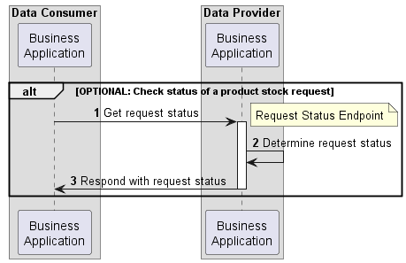
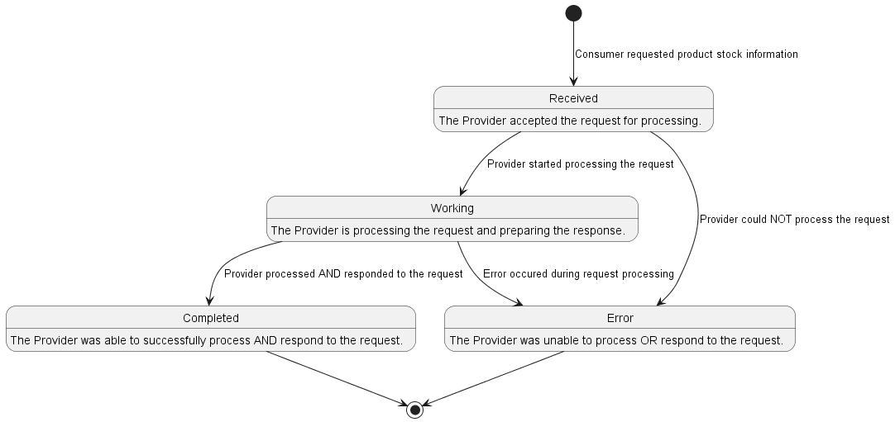

# CX-0086 PURIS Product Stock Exchange API v1.0.0

## ABSTRACT

Information about the products in stock allocated to a specific customer at a given supplier's facility
is key to early detect and evaluate supply shortage issues. However, collecting this information manually
e.g. by phone or e-mail communication is error prone and slow.

A possible countermeasure to those challenges is the exchange of *product stock* information between
Catena-X participants in an interoperable manner.

A standardized API is fundamental for facilitating such an exchange in a timely fashion, thus ensuring
that the possible solution space for mitigating the supply shortage issues is as large as possible.

## 1. INTRODUCTION

In this document an API to exchange product stock information is described and standardized.

### 1.1 AUDIENCE & SCOPE

> *This section is non-normative*

This standard is relevant for the following roles defined in [[CX-OMW]](#32-non-normative-references):

- **Data Providers** willing to provide *product stock* data
- **Data Consumers** interested in requesting and receiving *product stock* data
- **Business Application Providers**
- **Consulting Services Providers**

The scope of this standard is only the definition of a Product Stock Exchange API. The latter describes
the exchange of *product stock* data through an IDS compliant connector (e.g. [EDC](#17-terminology)). Both the request
and the response objects are created and handled by the business applications of the involved parties,
but these applications are not part of the standard.
The `ProductStock` aspect model describing the semantics of the *product stock* response is defined
in [[CX-0085]](#31-normative-references).

### 1.2 CONTEXT

A typical order-based procurement process includes a customer that places an order and a supplier
fulfilling it. During the fulfillment process the ordered products are temporary stored at the
supplier's facility waiting to be shipped to the customer. This kind of inventory is referred to as
*allocated* or *product* stock. Information about it is key to early detect and evaluate short-term
supply shortages on the customer side. Also, due to the instant availability of the product stock,
it can help solve such shortages.

This standard defines an API enabling the exchange of *product stock* information between Catena-X
participants in an interoperable manner.

### 1.3 ARCHITECTURE OVERVIEW

An architecture overview is provided in [Chapter 2](#2-product-stock-exchange-api).

### 1.4 CONFORMANCE

Sections marked as non-normative as well as all authoring guidelines, diagrams, examples, and notes
in this specification are non-normative. Everything else in this specification is normative.

The key words **MAY**, **MUST**, **MUST NOT**, **OPTIONAL**, **RECOMMENDED**, **REQUIRED**,
**SHOULD** and **SHOULD NOT** in this document document are to be interpreted as described in BCP 14
[RFC2119] [RFC8174] when, and only when, they appear in all capitals, as shown here.

### 1.5 PROOF OF CONFORMITY

> *This section is non-normative*

All participants and their solutions will need to proof, that they are conform with the Catena-X
standards. To validate that the standards are applied correctly, Catena-X employs Conformity
Assessment Bodies (CABs).

### 1.6 EXAMPLES

Examples of valid API requests and responses are given in [Chapter 2.2.1](#221-api-endpoints--resources).

### 1.7 TERMINOLOGY

> *This section is non-normative*

Aspect Model
: a formal, machine-readable semantic description (expressed with RDF/turtle) of data
accessible from an Aspect.

: *Note 1 to entry: An Aspect Model must adhere to the Semantic Aspect Meta Model (SAMM), i.e., it
  utilizes elements and relations defined in the Semantic Aspect Meta Model and is compliant to the
  validity rules defined by the Semantic Aspect Meta Model.*

: *Note 2 to entry: Aspect model are logical data models which can be used to detail a conceptual
  model in order to describe the semantics of runtime data related to a concept. Further, elements of
  an Aspect model can/should refer to terms of a standardized Business Glossary (if existing).*

: *[Source: Catena-X, CX-0002, note 3 removed]*

Business Partner Number (BPN)
:  A BPN is the unique identifier of a partner within Catena-X as defined in [[CX-0010]](#31-normative-references).

International Data Space (IDS)
: International Data Space and its protocol for data exchange
foresees an compliant connector handling contract negotiation before each data transfer and defines
a general architecture for data exchange.

Eclipse Dataspace Connector (EDC)
: The EDC is a reference implementation for an IDS compliant connector currently acting as a
de-facto standard and/or reference implementation within Catena-X.

Allocated Stock
: The ready to be shipped products available at a supplier's facility. They
are allocated to a specific customer based on the orders made by the latter.

Stock Location
: The physical location of a stock specified by its type (BPNS or BPNA) and the corresponding BPN
number. More information on BPN/S/A is provided in [[CX-0010]](#31-normative-references).

Supplier
: The supplier of a product.

Customer
: The recipient of products ordered from a supplier.

Order
: Request from a customer towards a supplier to supply a given quantity of a specific
product in a predefined time frame.

Position
: A position within an order defines the product and the quantity the supplier has to supply
for a customer. A single order may contain multiple positions for different products.

Provider
: The party providing the *product stock* data.
In the context of the Product Stock Exchange API this is the Supplier.

Consumer
: The party requesting and consuming the *product stock* data provided by the Provider.
In the context of the Product Stock Exchange API this is the Customer.

Additional terminology used in this standard can be looked up in the glossary on the association
homepage.

## 2. PRODUCT STOCK EXCHANGE API

The Product Stock Exchange API defined in this standard enables the exchange of product stock
information between Catena-X participants in an interoperable manner. *Figure 1* shows a high level
overview of the intended data exchange flow.


*Figure 1: Product Stock API overview*

The API relies on asynchronous communication between the involved parties.

1. A data exchange is initiated by a data consumer requesting product stock data.
2. Upon receiving a valid request, the data provider accepts it for further processing,
   thus confirming the receipt of the request.
3. The data provider determines the requested product stock information.
4. The data provider sends the requested product stock information to the data consumer.
5. The data consumer confirms the successful receipt of the requested product stock data
   by accepting it.

The data provider may also optionally offer an endpoint, which can be used by the data consumer to
track the status of the request it made.  *Figure 2* shows an overview of the steps involved in fetching the state of a previously made product stock request.


*Figure 2: Checking the status of a product stock request*

1. The data consumer requests the status of a previously made request.
2. The data provider determines the request's status.
3. The data provider responds instantly informing the data consumer about the request's status.

The lifecycle of a product stock request is defined by the set of states shown in *Figure 3*.


*Figure 3: States of a product stock request*

> ***Note on versioning***
> *The Product Stock Exchange API is versioned according to the Semantic Versioning 2.0.0 standard
> defined in [[SEMVER2]](#32-non-normative-references).*

## 2.1 PRECONDITIONS AND DEPENDENCIES

The Product Stock Exchange API MUST be published towards the network using a Data Asset/Contract Offer
in terms of the IDSA Protocol following the Catena-X standard SOV-001.

## 2.2 API SPECIFICATION

### 2.2.1 API Endpoints & Resources

Catena-X participants interested in exchanging *product stock* information MUST implement the
endpoints as defied in the table below based on their role in the data exchange process.

> Note: Expressions in double curly braces \{\{\}\} must be substituted with a corresponding value.

| Role | Endpoint | Route | REQUIRED | HTTP Method | Purpose |
|---------|----------|-------|:-------------:|:-----------:|---------|
| Provider | Request Endpoint | `{{PRODUCTSTOCK-REQUEST-ENDPOINT}}` | Yes | **POST** | This endpoint receives the product stock requests from a consumer. |
| Consumer | Response Endpoint | `{{PRODUCTSTOCK-RESPONSE-ENDPOINT}}` | Yes | **POST** | This endpoint receives the responses to the consumer's requests. |
| Provider | Request Status Endpoint | `{{PRODUCTSTOCK-REQUEST-ENDPOINT}}` | No | **GET** | This endpoint allows the consumer to OPTIONALLY check the current status of a request it already made. |

#### Product Stock Request

When sending a request to the Product Stock Request Endpoint, the body MUST be composed out of two
information objects: a *header* and a *content*. Together they form the HTTP body that MUST be
formated as JSON.

##### Request Header

> Note: This is not the HTTP Header but rather part of the HTTP Body.

| Field | REQUIRED | Purpose | Datatype | Example value |
|-|:-:|-|-|-|
|requestId| Yes |The `requestId` is used to match the request and the response. The `requestId` MUST be unique and therefore MUST NOT be reused. | UUID v4| `48878d48-6f1d-47f5-8ded-a441d0d879df`|
|sender | Yes | The business partner number (BPNL/S) of the requesting party. | BPN according to [[CX-0010]](#31-normative-references) | `BPNS0123456789ZZ`|
|senderEdc | No | The URL of the sender's IDS compliant connector (e.g. EDC). | URI:URL | `https://edc.sender-url.com/BPNS0123456789ZZ` |
| respondAssetId | No | The caller MAY specify the asset id defining the corresponding Product Stock Response Endpoint so that the responder does not need to look it up.<ul><li>If a `respondAssetId` value is specified, the `senderEdc` SHOULD also be set.</li><li>If `senderEdc` is not specified, then the `respondAssetId` value MUST be ignored.</li></ul> | String | `product-stock-response-api` |
|contractAgreementId | No | The ID of the contract agreement negotiated for the usage of the data asset defining the Product Stock Request Endpoint. Using the `contractAgreementId` the Provider MAY extract the contract definition, if the latter is needed. | String | `contract-definition-id:df878d48-6f1d-47f5-8ded-a441d0d879df`|
|receiver| No | The business partner number (BPNL/S) of the receiving party. | BPN according to [[CX-0010]](#31-normative-references) | `BPNS0123456789ZZ` |
|creationDate | No |The date and time including time zone offset on which the request has been created.| [[ISO8601]](#32-non-normative-references) with timezone |`2023-04-25T10:54:12+00:00`|

The following JSON object gives an example of a valid header:

```json
{
  "requestId": "48878d48-6f1d-47f5-8ded-a441d0d879df",
  "sender": "BPNS0123456789ZZ",
  "senderEdc": "https://edc.sender-company.com/",
  "respondAssetId": "product-stock-response-api",
  "contractAgreementId": "contract-definition-id:df878d48-6f1d-47f5-8ded-a441d0d879df",
  "receiver": "BPNS2345678910YY",
  "creationDate": "2023-04-25T10:54:12+00:00"
}
```

##### Request Content

The content consists of a single `productStock` object containing the list of material numbers
for which the consumer would like to receive the product stock information. Each material is
described by the following fields:

| Field | REQUIRED | Purpose | Datatype | Example value |
|-|:-:|-|-|-|
| materialNumberCustomer | Yes | The material number given by the customer MUST unambiguously identify the material on customer side. It SHOULD be used by the supplier to identify the requested material.| String | `MNR-7307-AU340474.001` |
| materialNumberSupplier | No | The material number given by the supplier MUST unambiguously identify the material on supplier side. Material number given by the supplier MAY be used by the supplier to identify the material in case the `materialNumberCustomer` is not known by the supplier.| String | `MNR-8101-ID146955.001` |
| materialNumberCatenaX | No | The material number given by the Catena-X network MUST unambiguously identify the material in the Catena-X network and MAY be used to identify the digital twin of the material. This number MAY be used instead of the `materialNumberCustomer` or the `materialNumberSupplier` to identify the material when consumer and provider both know the digital twin of the material | UUID v4 | `055c1128-0375-47c8-98de-7cf802c3241d` |

The following JSON object gives an example of a valid content:

```json
"content": {
  "productStock" : [
    {
      "materialNumberCustomer": "MNR-7307-AU340474.001",
      "materialNumberSupplier": "MNR-8101-ID146955.001",
      "materialNumberCatenaX": "urn:uuid:055c1128-0375-47c8-98de-7cf802c3241d"
    },
    {
      "materialNumberCustomer": "MNR-7307-AU340474.002"
    }
  ]
}
```

##### Request Example

```json
{
  "header": {
    "requestId": "48878d48-6f1d-47f5-8ded-a441d0d879df",
    "respondAssetId": "product-stock-response-api",
    "creationDate": "2023-04-25T10:54:12+00:00",
    "senderEdc": "https://edc.sender-company.com/",
    "sender": "BPNS0123456789ZZ",
    "receiver": "BPNS2345678910YY",
    "contractAgreementId": "contract-definition-id:df878d48-6f1d-47f5-8ded-a441d0d879df"
  },
  "content": {
    "productStock" : [
      {
        "materialNumberCustomer": "MNR-7307-AU340474.001",
        "materialNumberSupplier": "MNR-8101-ID146955.001",
        "materialNumberCatenaX": "urn:uuid:055c1128-0375-47c8-98de-7cf802c3241d"
      },
      {
        "materialNumberCustomer": "MNR-7307-AU340474.002"
      }
    ]
  }
}
```

##### Responding to a Product Stock Request

The provider MUST respond with one of the HTTP status codes defined in the corresponding section of
[Chapter 2.2.4](#224-error-handling).

The response MUST be JSON formatted and MUST contain only the `requestId` field specifying the ID
of the received product stock request.

The following JSON object gives an example of a valid response:

```json
{
  "requestId": "48878d48-6f1d-47f5-8ded-a441d0d879df"
}
```

#### Product Stock Response

When provisioning data to the Product Stock Response Endpoint, the body MUST be composed out of two
information objects: a *header* and a *content*. Together they form the HTTP body that MUST be
formatted as JSON.

##### Response Header

> Note: This is not the HTTP Header but rather part of the HTTP Body.

| Field | REQUIRED | Purpose | Datatype | Example value |
|-|:-:|-|-|-|
|requestId| Yes |The `requestId`is used to match the request and the response. The value of the field MUST be equal to the `requestId` specified in the header of the initial Product Stock Request. | UUID v4| `48878d48-6f1d-47f5-8ded-a441d0d879df`|
|sender | Yes | The business partner number (BPNL/S) of the responding party. | BPN according to [[CX-0010]](#31-normative-references) | `BPNS0123456789ZZ`|
|senderEdc | No | The URL of the sender's IDS compliant connector (e.g. EDC). | URI:URL | `https://edc.sender-url.com/BPNS0123456789ZZ` |
|contractAgreementId | No | The ID of the contract agreement negotiated for the usage of the data asset defining the Product Stock Request Endpoint. Using the `contractAgreementId` the Consumer MAY extract the contract definition and use this information to e.g. check for additional usage policies. | String | `contract-definition-id:df878d48-6f1d-47f5-8ded-a441d0d879df`|
|receiver | No | The business partner number (BPNL/S) of the receiving party. | BPN according to [[CX-0010]](#31-normative-references) | `BPNS0123456789ZZ` |
|creationDate | No |The date and time including time zone offset on which the response has been created.| [[ISO8601]](#32-non-normative-references) with timezone |`2023-04-25T10:54:12+00:00`|

The following JSON object gives an example of a valid header:

```json
{
  "requestId": "48878d48-6f1d-47f5-8ded-a441d0d879df",
  "sender": "BPNS0123456789ZZ",
  "senderEdc": "https://edc.sender-company.com/",
  "contractAgreementId": "contract-definition-id:df878d48-6f1d-47f5-8ded-a441d0d879df",
  "receiver": "BPNS2345678910YY",
  "creationDate": "2023-04-25T10:54:12+00:00"
}
```

##### Response Content

The content MUST consist of a single `productStock` object containing a list of product stocks (`allocatedStocks`).
Each product stock MUST be built according to the `ProductStock` SAMM model defined in [[CX-0085]](#31-normative-references).
An example content for a single product stock is given below.

```json
"productStock": {
  [
    {
      "materialNumberCatenaX": "48878d48-6f1d-47f5-8ded-a441d0d879df",
      "materialNumberCustomer": "MNR-7307-AU340474.002",
      "materialNumberSupplier": "MNR-8101-ID146955.001",
      "positions": [
        {
          "lastUpdatedOnDate": "2023-04-01T14:23:00.66372+01:00",
          "orderPositionReference": {
            "supplierOrderId": "M-Nbr-4711",
            "customerOrderId": "C-Nbr-4711",
            "customerOrderPositionId": "PositionId-01"
          },
          "allocatedStocks": [
            {
              "quantityOnAllocatedStock": {
                "quantityNumber": 2.5,
                "measurementUnit": "unit:litre"
              },
              "supplierStockLocation": {
                "locationKeyType": "BPNS",
                "locationKeyValue": "BPNS0123456789ZZ"
              }
            }
          ]
        }
      ]
    }
  ]
}
```

##### Response Example

```json
{
  "header": {
    "requestId": "48878d48-6f1d-47f5-8ded-a441d0d879df",
    "creationDate": "2023-04-25T10:54:12+00:00",
    "senderEdc": "https://edc.sender-company.com/",
    "sender": "BPNS0123456789ZZ",
    "receiver": "BPNS2345678910YY",
    "contractAgreementId": "contract-definition-id:df878d48-6f1d-47f5-8ded-a441d0d879df"
  },
  "content": {
    "productStock": {
      [
        {
          "materialNumberCatenaX": "48878d48-6f1d-47f5-8ded-a441d0d879df",
          "materialNumberCustomer": "MNR-7307-AU340474.002",
          "materialNumberSupplier": "MNR-8101-ID146955.001",
          "positions": [
            {
              "lastUpdatedOnDate": "2023-04-01T14:23:00.66372+01:00",
              "orderPositionReference": {
                "supplierOrderId": "M-Nbr-4711",
                "customerOrderId": "C-Nbr-4711",
                "customerOrderPositionId": "PositionId-01"
              },
              "allocatedStocks": [
                {
                  "quantityOnAllocatedStock": {
                    "quantityNumber": 2.5,
                    "measurementUnit": "unit:litre"
                  },
                  "supplierStockLocation": {
                    "locationKeyType": "BPNS",
                    "locationKeyValue": "BPNS0123456789ZZ"
                  }
                }
              ]
            }
          ]
        }
      ]
    }
  }
}
```

##### Responding to a Product Stock Response

The consumer MUST respond with one of the HTTP status codes defined in the corresponding section of
[Chapter 2.2.4](#224-error-handling).

The response MUST be JSON formatted and MUST contain only the `requestId` field specifying the ID
of the initial product stock request. The value MUST therefore be also equal to the `requestId` value
contained in the header of the Product Stock Response.

The following JSON object gives an example of a valid response:

```json
{
  "requestId": "48878d48-6f1d-47f5-8ded-a441d0d879df"
}
```

#### Product Stock Request Status

When sending a request to the Product Stock Request Status Endpoint, the body MUST be composed out
of two information objects: a *header* and a *content*. Together they form the HTTP body that MUST
be formatted as JSON.

##### Status Request Header

> Note: This is not the HTTP Header but rather part of the HTTP Body.

| Field | REQUIRED | Purpose | Datatype | Example value |
|-|:-:|-|-|-|
|requestId| Yes | The ID of an already placed product stock request, for which one would like to know the current status. The value of the field MUST be equal to the `requestId` specified in the header of the aforementioned product stock request. | UUID v4| `48878d48-6f1d-47f5-8ded-a441d0d879df`|
|sender | Yes | The business partner number (BPNL/S) of the requesting party. | BPN according to [[CX-0010]](#31-normative-references) | `BPNS0123456789ZZ`|
|senderEdc | No| The URL of the sender's IDS compliant connector (e.g. EDC). | URI:URL | `https://edc.sender-url.com/BPNS0123456789ZZ` |
|contractAgreementId| No | The ID of the contract agreement negotiated for the usage of the data asset defining the Product Stock Request Status Endpoint. Using the `contractAgreementId` the Provider MAY extract the contract definition, if the latter is needed. | String | `contract-definition-id:df878d48-6f1d-47f5-8ded-a441d0d879df`|
|receiver| No | The business partner number (BPNL/S) of the receiving party. | BPN according to [[CX-0010]](#31-normative-references) | `BPNS0123456789ZZ` |
|creationDate | No |The date and time including time zone offset on which the status request was created.| [[ISO8601]](#32-non-normative-references) with timezone |`2023-04-25T10:54:12+00:00`|

The following JSON object gives an example of a valid header:

```json
{
  "requestId": "48878d48-6f1d-47f5-8ded-a441d0d879df",
  "sender": "BPNS0123456789ZZ",
  "senderEdc": "https://edc.sender-company.com/",
  "contractAgreementId": "contract-definition-id:df878d48-6f1d-47f5-8ded-a441d0d879df",
  "receiver": "BPNS2345678910YY",
  "creationDate": "2023-04-25T10:54:12+00:00"
}
```

##### Status Request Content

The content MUST be an empty object.

The following JSON object gives an example of the only valid content:

```json
{}
```

##### Status Request Example

```json
{
  "header": {
    "requestId": "48878d48-6f1d-47f5-8ded-a441d0d879df",
    "respondAssetId": "product-stock-response-api",
    "creationDate": "2023-04-25T10:54:12+00:00",
    "senderEdc": "https://edc.sender-company.com/",
    "sender": "BPNS0123456789ZZ",
    "receiver": "BPNS2345678910YY",
    "contractAgreementId": "contract-definition-id:df878d48-6f1d-47f5-8ded-a441d0d879df"
  },
  "content": {}
}
```

##### Responding to a Product Stock Status Request

The provider MUST respond with one of the HTTP status codes defined in the corresponding section of
[Chapter 2.2.4](#224-error-handling).

The response MUST be JSON formatted and MUST contain the following fields:

- `requestId`: the ID of the product stock request, for which one would like to know the current status
- `requestState`: the current state of the request on provider side

The following table contains the list of valid request states and their meaning.
| State | Meaning |
|-------|---------|
| `Received` | The Provider accepted the request for processing. |
| `Working` | The Provider is processing the request and preparing the response. |
| `Completed` | The Provider was able to successfully process AND respond to the request. |
| `Error` | The Provider was unable to process OR respond to the request. |

More information about the different states and the transitions between them is provided in the
beginning of [Chapter 2](#2-product-stock-exchange-api).

The following JSON object gives an example of a valid response:

```json
{
  "requestId": "48878d48-6f1d-47f5-8ded-a441d0d879df",
  "requestState": "Working"
}
```

### 2.2.2 Available Data Types

The API MUST use JSON as the payload transported via HTTPS.
More information on the data objects supported by the endpoints is provided in the corresponding
sections of [Chapter 2.2.1](#221-api-endpoints--resources).

### 2.2.3 EDC Data Asset Structure

The endpoints introduced in [Chapter 2.2.1](#221-api-endpoints--resources) MUST NOT be directly called neither from a provider nor
from a consumer. Rather, these MUST be called via an IDS compliant connector (e.g. EDC). Therefore,
the endpoints MUST be offered as EDC data assets. To make this assets easily identifiable in the
connector's catalog, each asset MUST be configured with a set of properties as described in the
corresponding sections below.

The following table provides an overview of the EDC data assets that the parties MUST offer to
be able to provision and/or consume product stock information.

| Party  | REQUIRED | Asset | Purpose |
|----------|:---------:|-------|---------|
| Provider | Yes | Product Stock Request | Allows a consumer to request product stock information. |
| Consumer | Yes | Product Stock Response | Allows a consumer to receive the requested product stock information. |

#### EDC Data Asset Structure for Product Stock Request

In order to receive product stock requests, the provider MUST register an EDC data asset specifying
the address of the Product Stock Request Endpoint described in [Chapter 2.2.1](#221-api-endpoints--resources).
Implementations of the Product Stock Exchange API supporting the OPTIONAL Product Stock Request
Status Endpoint MUST also use this data asset to expose the aforementioned endpoint. Please note
the different HTTP methods (POST and GET) used to retrieve the corresponding information.

The data asset MUST be configured with the set of properties as defined in the table below.

| Property | Purpose | Usage & Constraints |
|----------|---------|---------------------|
| asset.properties.***asset:prop:apibusinessobject*** | Defines the business objects supported by the API | MUST be set to `"product-stock"` to allow filtering the data assets catalog for the Product Stock Request API. |
| asset.properties.***asset:prop:apipurpose***| Defines the purpose of the API | MUST be set to `"request"` to allow filtering the data assets catalog for the Product Stock Request API. |
| asset.properties.***asset:prop:contenttype***| Mimetype of the payload sent | Currently the standard only supports JSON-payloads. Therefore, the value MUST be set to `"application/json"`. |
| asset.properties.***asset:prop:id***| Identifier of the asset | The asset ID MUST be unique and therefore MUST NOT be reused elsewhere. |
| asset.properties.***asset:prop:name***| The name of the asset | Human readable name of this data asset. |
| asset.properties.***asset:prop:type***| The type of the asset | MUST be set to `"api"` to allow filtering the data assets catalog for the Product Stock Request API. |
| asset.properties.***asset:prop:usecase***| The use case this asset is assigned to | MAY be set to `"PURIS"` to allow filtering the data assets catalog for the Product Stock Request API. |
| asset.properties.***asset:prop:version***| The version of the standard defining the implemented API | MUST correspond to the version of the standard defining the Product Stock Exchange API. The value MUST be set to `"1.0.0"` for APIs implementing this standard. |
| dataAddress.properties.***baseUrl***| Defines the HTTPS endpoint of the corresponding Product Stock Exchange API endpoint | The `{{PRODUCTSTOCK-REQUEST-ENDPOINT}}` refers to an URL under which the API endpoint is available. HTTPS transport protocol MUST be used. |
| dataAddress.properties.***proxyBody***| Defines whether the endpoint allows to proxy the HTTPS body | MUST be set to `"true"` to allow the API endpoint to receive a HTTPS body via the HTTPS request. |
| dataAddress.properties.***proxyMethod***| Defines whether the endpoint allows to proxy the HTTPS method | MUST be set to `"true"` to allow the API endpoint to also receive POST requests. |
| dataAddress.properties.***type***| Defines the type of data plane extension handling the data exchange | MUST be set to `"HttpData"` to provide an API via an HTTPS proxy endpoint. |

When searching the data assets catalog of a provider, a consumer MUST use the following combination
of properties AND their values to identify the data asset specifying the the Product Stock Request Endpoint
described in [Chapter 2.2.1](#221-api-endpoints--resources).

| Property | Value |
|----------|:-----:|
| asset.properties.***asset:prop:type*** | `api` |
| asset.properties.***asset:prop:apibusinessobject*** | `product-stock` |
| asset.properties.***asset:prop:apipurpose*** | `request` |
| asset.properties.***asset:prop:version*** | `1.0.0` |

Because the data asset reflects the existing contractual relationship between a customer and its suppliers,
only one data asset with the aforementioned combination of properties AND their values MUST be visible
to the consumer at any time to avoid ambiguity.

An example EDC Data Asset definition is given below.

> Note: Expressions in double curly braces \{\{\}\} must be substituted with a corresponding value.

```json
{
  "asset": {
    "properties": {
      "asset:prop:apibusinessobject": "product-stock",
      "asset:prop:apipurpose": "request",
      "asset:prop:contenttype": "application/json",
      "asset:prop:id": "product-stock-request-api",
      "asset:prop:name": "Asset to request product-stock information",
      "asset:prop:type": "api",
      "asset:prop:usecase": "PURIS",
      "asset:prop:version": "1.0.0"
    }
  },
  "dataAddress": {
    "properties": {
      "baseUrl": "{{PRODUCTSTOCK-REQUEST-ENDPOINT}}",
      "proxyBody": true,
      "proxyMethod": true,
      "type": "HttpData"
    }
  }
}
```

#### EDC Data Asset Structure for Product Stock Response

In order to receive the product stock data it requsted, the consumer MUST register an EDC data asset
specifying the address of the Product Stock Response Endpoint described in [Chapter 2.2.1](#221-api-endpoints--resources).

This asset MUST be configured with the set of properties as defined in the table below.

| Property | Purpose | Usage & Constraints |
|----------|---------|---------------------|
| asset.properties.***asset:prop:apibusinessobject*** | Defines the business objects supported by the API | MUST be set to `"product-stock"` to allow filtering the data assets catalog for the Product Stock Response API. |
| asset.properties.***asset:prop:apipurpose***| Defines the purpose of the API | MUST be set to `"response"` to allow filtering the data assets catalog for the Product Stock Response API. |
| asset.properties.***asset:prop:contenttype***| Mimetype of the payload sent | Currently the standard only supports JSON-payloads. Therefore, the value MUST be set to `"application/json"`. |
| asset.properties.***asset:prop:id***| Identifier of the asset | The asset ID MUST be unique and therefore MUST NOT be reused elsewhere. |
| asset.properties.***asset:prop:name***| The name of the asset | Human readable name of this data asset. |
| asset.properties.***asset:prop:type***| The type of the asset | MUST be set to `"api"` to allow filtering the data assets catalog for the Product Stock Request API. |
| asset.properties.***asset:prop:usecase***| The use case this asset is assigned to | MAY be set to `"PURIS"` to allow filtering the data assets catalog for the Product Stock Request API. |
| asset.properties.***asset:prop:version***| The version of the standard defining the implemented API | MUST correspond to the version of the standard defining the Product Stock Exchange API. The value MUST be set to `"1.0.0"` for APIs implementing this standard. |
| dataAddress.properties.***baseUrl***| Defines the HTTPS endpoint of the corresponding Product Stock Exchange API endpoint | The `{{PRODUCTSTOCK-RESPONSE-ENDPOINT}}` refers to an URL under which the API endpoint is available. HTTPS transport protocol MUST be used. |
| dataAddress.properties.***proxyBody***| Defines whether the endpoint allows to proxy the HTTPS body | MUST be set to `"true"` to allow the API endpoint to receive a HTTPS body via the HTTPS request. |
| dataAddress.properties.***proxyMethod***| Defines whether the endpoint allows to proxy the HTTPS method | MUST be set to `"true"` to allow the API endpoint to also receive POST requests. |
| dataAddress.properties.***type***| Defines the type of data plane extension handling the data exchange | MUST be set to `"HttpData"` to provide an API via an HTTPS proxy endpoint. |

When searching the assets catalog of a consumer, a provider MUST use the following combination of
properties AND their values to identify the data asset specifying the address of the Product Stock
Response Endpoint described in [Chapter 2.2.1](#221-api-endpoints--resources).

| Property | Value |
|----------|:-----:|
| asset.properties.***asset:prop:type*** | `api` |
| asset.properties.***asset:prop:apibusinessobject*** | `product-stock` |
| asset.properties.***asset:prop:apipurpose*** | `request` |
| asset.properties.***asset:prop:version*** | `1.0.0` |

Because the asset reflects the existing contractual relationship between a customer and its suppliers,
only one asset with the aforementioned combination of properties AND their values MUST be visible
to the provider at any time to avoid ambiguity.

An example EDC Data Asset definition is given below.

> Note: Expressions in double curly braces \{\{\}\} must be substituted with a corresponding value.

```json
{
  "asset": {
    "properties": {
      "asset:prop:apibusinessobject": "product-stock",
      "asset:prop:apipurpose": "response",
      "asset:prop:contenttype": "application/json",
      "asset:prop:id": "product-stock-response-api",
      "asset:prop:name": "Asset to receive product-stock information",
      "asset:prop:type": "api",
      "asset:prop:usecase": "PURIS",
      "asset:prop:version": "1.0.0"
    },
    "dataAddress": {
      "properties": {
        "baseUrl": "{{PRODUCTSTOCK-RESPONSE-ENDPOINT}}",
        "proxyBody": true,
        "proxyMethod": true,
        "type": "HttpData"
      }
    }
  }
}
```

### 2.2.4 Error Handling

Every API endpoint defined in [Chapter 2.2.1](#221-api-endpoints--resources) MUST respond to incoming
requests with HTTP status codes as described in [[RFC9110]](#32-non-normative-references). The status
codes for each endpoint are defined in the following sections.

#### HTTP Codes for Product Stock Request Endpoint

| Status Code | Description                                         | Usage                                                                                                   |
|:-----------:|-----------------------------------------------------|---------------------------------------------------------------------------------------------------------|
|     202     | Product Stock request was accepted                  | When the request had been accepted by the provider, the latter MUST respond with status code 202         |
|     400     | Request body malformed                              | When the request BODY is not matching the API description, the provider MUST respond with error code 400 |
|     401     | Not authorized                                      | When the authorization of the request fails, the provider MUST respond with error code 401               |
|     404     | Endpoint not found                                  | When the HTTP path is not available, the provider MUST respond with error code 404                       |
|     405     | Method not allowed                                  | In case the HTTP method used is not a POST, the provider MUST respond with error code 405 |
|     422     | A request with the same ID already exists           | When the request ID (`header.requestId`) was already used for another request |

#### HTTP Codes for Product Stock Response Endpoint

| Status Code | Description                                         | Usage                                                                                                  |
|:-----------:|-----------------------------------------------------|--------------------------------------------------------------------------------------------------------|
|     202     | Product Stock Response was accepted            | When the received product stock data is accepted by the consumer, it MUST respond with status code 202      |
|     400     | Response body malformed | When the HTTP Body is not matching the API description, the consumer MUST respond with error code 400 |
|     401     | Not authorized | When the authorization of the response fails, the consumer MUST respond with error code 401 |
|     404     | Endpoint not found | When the HTTP path is not available, the consumer MUST respond with error code 404 |
|     405     | Method not allowed | In case the HTTP call is not a POST, the provider MUST respond with error code 405 |
|     422     | The request ID does not match any open request | When the request ID (`header.requestId`) does not match the ID of any open request, the consumer MUST respond with error code 422 |

#### HTTP Codes for Product Stock Request Status Endpoint

| Status Code | Description                         | Usage                                                                                                   |
|:-----------:|-------------------------------------|-------------------------------------------------------------------------------------------------------- |
|     200     | Status request was successful       | When the request was successful, the provider MUST respond with status code 200                          |
|     400     | Request body malformed              | When the request BODY is not matching the API description, the provider MUST respond with error code 400 |
|     401     | Not authorized                      | When the authorization of the request fails, the provider MUST respond with error code 401               |
|     404     | Endpoint not found                  | When the HTTP path is not available, the provider MUST respond with error code 404                       |
|     405     | Method not allowed                  | In case the HTTP method used not a GET, the provider MUST respond with error code 405                       |
|     422     | The request ID is not known | When the request ID (`header.requestId`) does not match the ID of any known request, the provider MUST respond with error code 422 |

## 3 REFERENCES

### 3.1 NORMATIVE REFERENCES

[CX-0010] Business Partner Number, Version 1.0.1

[CX-0011] Issuing Agency (Provider of BPNs)

[CX-0012] Business Partner Data Pool API

[CX-0085] Aspect Model "ProductStock", Version 1.0.0

### 3.2 NON-NORMATIVE REFERENCES

> *This section is non-normative*

[CX-OMW] Catena-X Operating Model Whitepaper. Download from:
https://catena-x.net/fileadmin/user_upload/Publikationen_und_WhitePaper_des_Vereins/CX_Operating_Model_Whitepaper_02_12_22.pdf

[ISO8601] ISO 8601: Date and time format

[RFC4122] A Universally Unique Identifier (UUID) URN Namespace
(https://www.rfc-editor.org/rfc/rfc4122)

[RFC9110] HTTP Semantics (https://www.rfc-editor.org/rfc/rfc9110)

[SEMVER2] Semantic Versioning 2.0.0 (https://semver.org/spec/v2.0.0.html)

### 3.3 REFERENCE IMPLEMENTATIONS

> *This section is non-normative*

Not applicable.

## ANNEXES

### FIGURES

> *This section is non-normative*

Not applicable.

### TABLES

> *This section is non-normative*

Not applicable.

## Legal

Copyright © 2025 Catena-X Automotive Network e.V. All rights reserved. For more information, please visit [here](/copyright).
