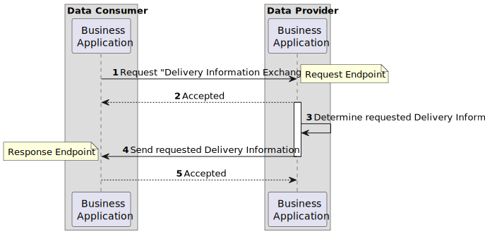
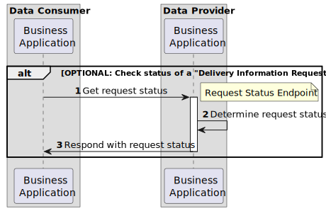
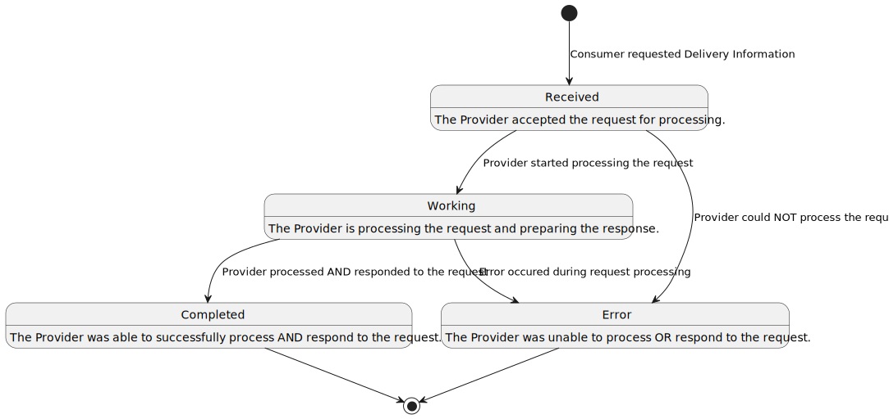

# CX-0118 Delivery Information Exchange 1.0.0

## ABSTRACT

*Delivery Information* plays a crucial role in proactively tracking, managing, and assessing the
timely fulfillment of customer orders from various suppliers in order to avoid shortages and
bottlenecks. Relying on manual methods like phone calls, or email correspondence to collect this
data can introduce errors, does not include last-minute or real-time updates, and can
potentially cause shortages.

One effective strategy to address these challenges involves the sharing of *Delivery Information*
among Catena-X business partners in an interoperable manner. Establishing a standardized semantic
definition to describe *delivery information* and a common API is a fundamental step to enable this
exchange and foster compatibility, thereby maximizing the range of solutions available for
mitigating any potential supply shortages.

## FOR WHOM IS THE STANDARD DESIGNED

## 1 INTRODUCTION

In a typical order-based manufacturing and delivery process, a customer places an order, and a
supplier undertakes the task of fulfilling it. *Delivery Information* encompasses two main
categories: logistics details and delivery metrics. Logistics details cover when and where products
are shipped, as well as the quantities involved. Delivery metrics differentiate between estimated
and actual departure and arrival times, e.g. for outbound deliveries from a supplier's factory and
inbound deliveries to a customer's factory.

Monitoring and handling *Delivery Information* effectively between suppliers and customers plays a
crucial role in optimizing the delivery processes. Early detection and resolution of
delivery-related issues hinge on the continuous tracking of this information. However, relying on
manual communication methods, like phone calls or emails, introduces the risk of errors and consumes
valuable time. Existing ERP system interfaces, primarily tailored for order planning, might not
comprehensively cover the exchange of *Delivery Information*.

To facilitate efficient exchange, it is essential to establish a standardized and semantically
defined description of *Delivery Information*. Standardizing semantics and exchange protocols
enables participants in the supply chain to share *Delivery Information* in an interoperable manner.

The proposed model includes information about departure and arrival dates, times, locations, shipped
quantities, tracking number, and other relevant logistics-related information that helps in
coordinating and ensuring the smooth planning of product deliveries to their intended destination.
It allows businesses to better plan and execute deliveries, minimize delays, and optimize their
delivery processes, stock and production planning, avoiding shortages and increasing efficiency.

### 1.1 AUDIENCE & SCOPE

> *This section is non-normative*

This document describes the *Delivery Information* semantic model used in the Catena-X network and
the associated API for exchanging *Delivery Information*. This standard is relevant for the
following roles defined in [[CX-OMW]](#62-non-normative-references):

- **Data Providers**  willing to provide *Delivery Information* data
- **Data Consumers**  interested in requesting and receiving *Delivery Information* data
- **Business Application Providers** interested in providing solutions implementing this standard
- **Consulting Services Providers** interested in supporting companies fulfilling the standard

The scope of this standard is only the *Delivery Information* aspect model and API. It describes the
exchange of *Delivery Information* data through IDS-compliant connector (e.g. EDC).

### 1.2 CONTEXT AND ARCHITECTURE FIT

> *This section is non-normative*

In a typical item procurement process, a customer initiates an order, and a supplier undertakes the
task of fulfilling it. As part of this process, the *Delivery Information* typically refers to data
or details regarding when, where and in which quantities of products or goods are shipped or are
expected to be shipped. It includes information about estimated and actual delivery dates, times,
locations, shipped quantities, and other relevant logistics-related information that helps in
coordinating and ensuring the smooth delivery planning of product deliveries to their intended
destination.

 Within the framework of the Catena-X network, this standard defines the *DeliveryInformation*
 aspect model. Its purpose is to establish a consistent and uniform interpretation and handling of
 *Delivery Information* among all interested parties, ensuring that this data is understood and
 managed in the same manner by all stakeholders.

*Figure 1* shows the high-level architecture of the *Delivery Information* exchange in the Catena-X
dataspace and the central services that are involved. Both the data provider and the data consumer
must be members of the Catena X network in order to communicate with each other. With the help of
centrally managed Identity Access Management (IAM), each participant can authenticate itself, verify
the identity of the requesting party and decide whether to authorize the request. The data provisioning
is based on an asynchronous exchange of request and response messages.


*Figure 1: High-level architecture of the Delivery Information exchange in the Catena-X network*

### 1.3 CONFORMANCE AND PROOF OF CONFORMITY

> *This section is non-normative*

As well as sections marked as non-normative, all authoring guidelines, diagrams, examples, and notes
in this specification are non-normative. Everything else in this specification is normative. The key
words **MAY**, **MUST**, **MUST NOT**, **OPTIONAL**, **RECOMMENDED**, **REQUIRED**, **SHOULD**
and **SHOULD NOT** in this document document are to be interpreted as described in [[BCP 14]](#62-non-normative-references) [[RFC2119]](#62-non-normative-references)
[[RFC8174]](#62-non-normative-references) when, and only when, they appear in all capitals, as shown here. All participants and
their solutions will need to prove, that they are conform with the Catena-X standards.

All participants and their solutions will need to prove, that they are conform with the Catena-X
standards. To validate that the standards are applied correctly, Catena-X employs Conformity
Assessment Bodies (CABs). The proof of conformity for a single semantic model is done according to
the general rules for proving the conformity of data provided to a semantic model or the ability to
consume the corresponding data. Furthermore, participants agree to follow the normative language of
this standardization document and to implement the required API-Endpoints described in [Chapter 4](#4-application-programming-interfaces).

### 1.4 EXAMPLES

The following JSONs provide an example of the value-only serialization of the
"*DeliveryInformation*" aspect model for a sample delivery.

The following example shows a value-only JSON serialization of the aspect model with estimated
departure and arrival dates. The values are located in the `transitEvents` property of the delivery.
The order has not yet departed from its origin, as is indicated by the estimated values for both
departure and arrival. This is an example of estimated delivery.

```json
{
  "materialGlobalAssetId": "urn:uuid:48878d48-6f1d-47f5-8ded-a441d0d879df",
  "materialNumberCustomer": "MNR-7307-AU340474.002",
  "materialNumberSupplier": "MNR-8101-ID146955.001",
  "positions": [
    {
      "lastUpdatedOnDateTime": "2023-04-01T14:23:00+01:00",
      "orderPositionReference": {
        "supplierOrderId": "M-Nbr-4711",
        "customerOrderId": "C-Nbr-4711",
        "customerOrderPositionId": "PositionId-01"
      },
      "deliveries": [
        {
          "deliveryQuantity": {
            "value": 20.0,
            "unit": "unit:piece"
          },
          "transitEvents": [
            {
              "dateTimeOfEvent": "2023-04-01T14:23:00+01:00",
              "eventType": "estimated-departure"
            },
            {
              "dateTimeOfEvent": "2023-04-05T14:23:00+01:00",
              "eventType": "estimated-arrival"
            }
          ],
          "trackingNumber": "1Z9829WDE02128",
          "incoterm": "EXW",
          "transitLocations": {
            "destination": {
              "bpnsProperty": "BPNS0123456789YY",
              "bpnaProperty": "BPNA0123456789YY"
            },
            "origin": {
              "bpnsProperty": "BPNS0123456789ZZ",
              "bpnaProperty": "BPNA0123456789ZZ"
            }
          }
        }
      ]
    }
  ]
}
```

The following example shows a JSON serialization of the aspect model with departure and arrival dates.
The values are located in the `transitEvents` of the delivery. The status of this delivery is currently
in transit, denoted by the actual departure and estimated arrival values.

```json
{
  "materialGlobalAssetId": "urn:uuid:48878d48-6f1d-47f5-8ded-a441d0d879df",
  "materialNumberCustomer": "MNR-7307-AU340474.002",
  "materialNumberSupplier": "MNR-8101-ID146955.001",
  "positions": [
    {
      "lastUpdatedOnDateTime": "2023-04-01T14:23:00+01:00",
      "orderPositionReference": {
        "supplierOrderId": "M-Nbr-4711",
        "customerOrderId": "C-Nbr-4711",
        "customerOrderPositionId": "PositionId-01"
      },
      "deliveries": [
        {
          "deliveryQuantity": {
            "value": 20.0,
            "unit": "unit:piece"
          },
          "transitEvents": [
            {
              "dateTimeOfEvent": "2023-04-01T14:23:00+01:00",
              "eventType": "actual-departure"
            },
            {
              "dateTimeOfEvent": "2023-04-05T14:23:00+01:00",
              "eventType": "estimated-arrival"
            }
          ],
          "trackingNumber": "1Z9829WDE02128",
          "incoterm": "EXW",
          "transitLocations": {
            "destination": {
              "bpnsProperty": "BPNS0123456789YY",
              "bpnaProperty": "BPNA0123456789YY"
            },
            "origin": {
              "bpnsProperty": "BPNS0123456789ZZ",
              "bpnaProperty": "BPNA0123456789ZZ"
            }
          }
        }
      ]
    }
  ]
}
```

The following example shows a JSON serialization of the aspect model with actual departure and arrival dates.
The values are located in the `transitEvents` of the delivery. As seen from the actual departure and actual arrival
values, this is an example of a completed delivery.

```json
{
  "materialGlobalAssetId": "urn:uuid:48878d48-6f1d-47f5-8ded-a441d0d879df",
  "materialNumberCustomer": "MNR-7307-AU340474.002",
  "materialNumberSupplier": "MNR-8101-ID146955.001",
  "positions": [
    {
      "lastUpdatedOnDateTime": "2023-04-01T14:23:00+01:00",
      "orderPositionReference": {
        "supplierOrderId": "M-Nbr-4711",
        "customerOrderId": "C-Nbr-4711",
        "customerOrderPositionId": "PositionId-01"
      },
      "deliveries": [
        {
          "deliveryQuantity": {
            "value": 20.0,
            "unit": "unit:piece"
          },
          "transitEvents": [
            {
              "dateTimeOfEvent": "2023-04-01T14:23:00+01:00",
              "eventType": "actual-departure"
            },
            {
              "dateTimeOfEvent": "2023-04-05T14:23:00+01:00",
              "eventType": "actual-arrival"
            }
          ],
          "trackingNumber": "1Z9829WDE02128",
          "incoterm": "EXW",
          "transitLocations": {
            "destination": {
              "bpnsProperty": "BPNS0123456789YY",
              "bpnaProperty": "BPNA0123456789YY"
            },
            "origin": {
              "bpnsProperty": "BPNS0123456789ZZ",
              "bpnaProperty": "BPNA0123456789ZZ"
            }
          }
        }
      ]
    }
  ]
}
```

### 1.5 TERMINOLOGY

> *This section is non-normative*

*The following terms are especially relevant for the understanding of the standard:*

| **Name** | **Abrev.** | **Description** |
| --- | --- | --- |
| Tracking number | - | A unique number that identifies a delivery from its origin to its destination during the delivery process for tracking purposes. |
| INCOTERM | - | Is a combination of "International" and "Commercial Terms." Incoterms are a set of standardized international trade terms that facilitate and define the responsibilities of customers and suppliers in transactions. |
| Actual time | - | Refers to the specific, real-time date and time when an event occurs during delivery. |
| Estimated time | - | Refers to a projected or estimated time for an event or occurrence, based on calculations or predictions, rather than the exact, confirmed time. |
| Origin | - | Is the starting point from which goods are dispatched or shipped to. |
| Destination | - | Is the final location where the goods are to be delivered or received. |
| Delivery Information | - | Provides an overview of related shipments, tracking the movement of goods and associated order details, not the physical shipment. It may represent a full shipment or a portion, like a container with varied commodities. |
| Customer | - | The recipient of products ordered from / manufactured by a supplier. |
| Supplier | - | The supplier / manufacturer of a product. |
| Identity Access Management | IAM | IAM is a security system that regulates who can access an organization's information and systems, ensuring only authorized individuals have the right level of access to prevent unauthorized entry and protect against security risks. |

*Table 1: List of terminology helpful for understanding the standard*

Additional terminology used in this standard can be looked up in the glossary on the association homepage.

## 2 RELEVANT PARTS OF THE STANDARD FOR SPECIFIC USE CASES

> *This section is normative*

### 2.1 Delivery Information

#### 2.1.1 LIST OF STANDALONE STANDARDS

The following Catena-X standards are prerequisites for the implementation of this standard and therefore **MUST**
be considered / implemented by the relevant parties specified in each of them.

| **Number** | **Standard** | **Version** |
| --- | --- | --- |
| [CX-0001] | EDC Discovery API | 1.0.2 |
| [CX-0003] | SAMM Aspect Meta Model | 1.1.0 |
| [CX-0006] | Registration and initial onboarding | 1.1.3 |
| [CX-0010] | Business Partner Number (BPN) | 2.0.0 |
| [CX-0018] | Eclipse Data Space Connector (EDC) | 2.1.0 |
| [CX-0050] | Framework Agreement Credential | 1.0.0 |

*Table 2: List of mandatory standards*

The usage of this standard may be complemented with the following Catena-X standards to further extend
the range of shortage prevention possibilities:

| **Number** | **Standard** | **Version** |
| --- | --- | --- |
| [CX-0120] | Short Term Material Demand Exchange | 1.0.0 |
| [CX-0121] | Planned Production Output Exchange | 1.0.0 |
| [CX-0122] | Item Stock Exchange | 1.0.0 |

*Table 3: List of non-mandatory complementary standards*

#### 2.1.2 DATA REQUIRED

No additional data requirements.

#### 2.1.3 ADDITIONAL REQUIREMENTS

In addition to the general Catena-X terms and conditions each data provider and data consumer MUST
consent to the "*Predictive Unit Realtime Information Service - PURIS*" framework agreement during an
onboarding process defined by the Catena-X governing body. Upon requesting data, the data consumer
MUST present the data provider with a proof of consent to the aforementioned framework agreement in
accordance with [[CX-0050]](#61-normative-references) Framework Agreement Credential. The data provider **MUST** verify the validity
of the presented proof before granting access to the requested data.

#### 2.1.4 DIGITAL TWINS AND SPECIFIC ASSET IDs

This version of the document does not define any requirements for standardized integration and governance
of digital twins.

## 3 ASPECT MODELS

> *This section is normative*

### 3.1 ASPECT MODEL "DeliveryInformation"

#### 3.1.1 INTRODUCTION

The *Delivery Information* semantic model defines the data and details regarding when and how
products or goods are scheduled to be delivered and actually delivered from one location to another.
It includes information about order positions, material numbers and deliveries (quantity, status of
the delivery and location of the delivery). It may include tracking number and incoterms as well.
For the complete semantics and detailed description of its properties refer to the SAMM model in
[Chapter 3.1.5.1](#3151-rdf-turtle).

#### 3.1.2 SPECIFICATIONS ARTIFACTS

The modeling of the semantic model specified in this document was done in accordance to the
"semantic driven workflow" to create a submodel template specification [[SMT]](#62-non-normative-references).

This aspect model is written in SAMM 2.0.0 as a modeling language conformant to [[CX-0003]](#61-normative-references)
as input for the semantic-driven workflow.

Like all Catena-X data models, this model is available in a machine-readable format on GitHub
conformant to [[CX-0003]](#61-normative-references).

#### 3.1.3 LICENSE

This Catena-X data model is made available under the terms of the Creative Commons Attribution 4.0
International (CC-BY-4.0) license, which is available at Creative Commons.

#### 3.1.4 IDENTIFIER OF SEMANTIC MODEL

The semantic model has the unique identifier

`urn:samm:io.catenax.delivery_information:1.0.0`

This identifier **MUST** be used by the data provider to define the semantics of the data being transferred.

#### 3.1.5 FORMATS OF SEMANTIC MODEL

##### 3.1.5.1 RDF TURTLE

The rdf turtle file, an instance of the Semantic Aspect Meta Model, is the master for generating
additional file formats and serializations. It can be found under the following link:

[https://github.com/eclipse-tractusx/sldt-semantic-models/blob/main/io.catenax.delivery\_information/1.0.0/DeliveryInformation.ttl](https://github.com/eclipse-tractusx/sldt-semantic-models/blob/main/io.catenax.delivery_information/1.0.0/DeliveryInformation.ttl)

The open source command line tool of the Eclipse Semantic Modeling Framework is used for generation
of other file formats like for example a JSON Schema, aasx for Asset Administration Shell Submodel
Template or a HTML documentation.

##### 3.1.5.2 JSON SCHEMA

A JSON Schema can be generated from the RDF Turtle file. The JSON Schema defines the Value-Only payload
of the Asset Administration Shell for the API operation *"GetSubmodel"*.

##### 3.1.5.3 AASX

An AASX file can be generated from the RDF Turtle file. The AASX file defines one of the requested
artifacts for a Submodel Template Specification conformant to [[SMT]](#62-non-normative-references).

## 4 APPLICATION PROGRAMMING INTERFACES

> *This section is normative*

### 4.1 DELIVERY INFORMATION API

The "Delivery Information Exchange API" defined in this section enables the exchange of *Delivery Information*
data between Catena-X participants in an interoperable manner. *Figure 2* shows a high-level overview
of the intended data exchange flow.


*Figure 2: Delivery Information API overview*

The API relies on asynchronous communication between the involved parties.

1. A data exchange is initiated by a data consumer requesting a *Delivery Information*.
2. Upon receiving a valid request, the data provider accepts it for further processing, thus confirming the receipt of the request.
3. The data provider determines the requested deliveries.
4. The data provider sends the requested *Delivery Information* to the data consumer.
5. The data consumer confirms the successful receipt of the requested *Delivery Information* by accepting it.

The data provider may also optionally offer an endpoint, which can be used by the data consumer to track
the status of the request it made. *Figure 3* shows an overview of the steps involved in fetching the
state of a previously made "Delivery Information Request".


*Figure 3: Checking the status of a "Delivery Information Request"*

1. The data consumer requests the status of a previously made request.
2. The data provider determines the request's status.
3. The data provider responds instantly informing the data consumer about the request's status.

The lifecycle of a "Delivery Information Request" is defined by the set of states shown in *Figure 4*.


*Figure 4: States of a "Delivery Information Request"*

#### 4.1.1 PRECONDITIONS AND DEPENDENCIES

To use this standard the participants **MUST** have an existing business relationship.

Each partner **MUST** be registered and onboarded according to [[CX-006] Registration and initial onboarding](#61-normative-references).
To participate in the Catena-X dataspace, the Eclipse Data Space Connector **MUST** be used to make the
API available [[CX-0018] Eclipse Data Space Connector (EDC)](#61-normative-references).

#### 4.1.2 API SPECIFICATION

##### 4.1.2.1 API ENDPOINTS & RESOURCES

Catena-X participants interested in exchanging *Delivery Information* **MUST** implement the endpoints as
defied in the table below based on their role in the data exchange process.

> Note: Expressions in double curly braces \{\{\}\} must be substituted with a corresponding value.

| **Role** | **Endpoint** | **Route** | **REQUIRED** | **HTTP Method** | **Purpose** |
| --- | --- | --- | --- | --- | --- |
| Provider | Request Endpoint | \{\{DELIVERY-INFORMATION-REQUEST-ENDPOINT\}\} | Yes | **POST** | This endpoint receives the "Delivery Information Requests" from a consumer. |
| Consumer | Response Endpoint | \{\{DELIVERY-INFORMATION-RESPONSE-ENDPOINT\}\} | Yes | **POST** | This endpoint receives the "Delivery Information Responses" to the consumer's requests. |
| Provider | Request Status Endpoint | \{\{DELIVERY-INFORMATION-REQUEST-STATUS-ENDPOINT\}\} | No | **POST** | This endpoint allows the consumer to **OPTIONALLY** check the current status of a "Delivery Information Request" it already made. |

*Table 4: Delivery Information roles in data exchange process*

##### 4.1.2.2 "Delivery Information Request"

When sending a request to the "Delivery Information Request Endpoint", the body **MUST** be composed out
of two parts: a `header` object according to the shared aspect model [`MessageHeader`](https://github.com/eclipse-tractusx/sldt-semantic-models/tree/main/io.catenax.shared.message_header) and a `content` object.
Together they form the HTTP body that **MUST** be formatted as JSON.

###### Request Header

> Note: This is not the HTTP Header but rather part of the HTTP Body.

The following table lists all fields of the message header and how they are used.

| **Field** | **REQUIRED** | **Purpose** | **Datatype** | **Example value** |
| --- | --- | --- | --- | --- |
| messageId | Yes | Unique ID identifying the message. The purpose of the ID is to uniquely identify a single message, therefore it **MUST NOT** be reused. | UUID v4 | `065e3595-c2b6-4b3e-949b-bd588a2e8f56` |
| relatedMessageId | No | For the "Delivery Information Request" this information **SHOULD NOT** be set. | UUID v4 | `172133bb-7fd3-4cde-84c5-8ae84bec3f34` |
| context | Yes | Information about the context the message should be considered in DeliveryInformation.The value **MUST** consist of two parts: constant of a given endpoint `RES-PURIS-DeliveryInformationRequest:` followed by the version number `1.0` | URI | `RES-PURIS-DeliveryInformationRequest:1.0` |
| version | Yes | This field **MUST** specify the namespace and version of the `MessageHeader` aspect model that has been used to create the message header. | Namespace and version of the shared aspect model MessageHeader | `urn:samm:io.catenax.message_header:2.0` |
| senderBpn | Yes | The business partner number (BPNL/S) of the requesting party. | BPN according to [[CX-0010]](#61-normative-references) | `BPNS0123456789ZZ` |
| receiverBpn | Yes | The business partner number (BPNL/S) of the receiving party. | BPN according to [[CX-0010]](#61-normative-references) | `BPNS2345678910YY` |
| sentDateTime | Yes | The date and time including time zone offset on which the request has been created. | [[ISO8601]](#62-non-normative-references) with time zone | `2023-04-25T10:54:12+00:00` |

*Table 5: Delivery Information message header*

The following JSON object gives an example of a valid `header`:

```json

"header":{
   "messageId":"065e3595-c2b6-4b3e-949b-bd588a2e8f56",
   "context": "RES-PURIS-DeliveryInformationRequest:1.0",
   "version": "urn:samm:io.catenax.message_header:2.0",
   "senderBpn":"BPNS0123456789ZZ",
   "receiverBpn":"BPNS2345678910YY",
   "sentDateTime":"2023-04-25T10:54:12+00:00"
}
```

###### Request Content

The content consists of a single `deliveryInformation` object containing the list of material numbers
for which the consumer would like to receive the *Delivery Information*. Each material is described
by the following fields:

| **Field** | **REQUIRED** | **Purpose** | **Datatype** | **Example value** |
| --- | --- | --- | --- | --- |
| materialNumberCustomer | Yes | The material number given by the customer **MUST** unambiguously identify the material on customer side. It **SHOULD** be used by the supplier to identify the requested material. | String | `MNR-7307-AU340474.001` |
| materialNumberSupplier | No | The material number given by the supplier **MUST** unambiguously identify the material on supplier side. Material number given by the supplier **MAY** be used by the supplier to identify the material in case the `materialNumberCustomer` is not known by the supplier. | String | `MNR-8101-ID146955.001` |
| materialGlobalAssetId | No | The material number given by the Catena-X network **MUST** unambiguously identify the material in the Catena-X network and **MAY** be used to identify the digital twin of the material. This number **MAY** be used instead of the `materialNumberCustomer` or the `materialNumberSupplier` to identify the material when consumer and provider both know the digital twin of the material | UUID v4 | `urn:uuid:055c1128-0375-47c8-98de-7cf802c3241d` |

*Table 6: Delivery Information request content*

The following JSON object gives an example of a valid `content`:

```json
"content":{
   "deliveryInformation":[
      {   
        "materialGlobalAssetId": "urn:uuid:48878d48-6f1d-47f5-8ded-a441d0d879df",
        "materialNumberCustomer": "MNR-7307-AU340474.002",
        "materialNumberSupplier": "MNR-8101-ID146955.001"
      },
      {
         "materialNumberCustomer": "MNR-5914-AU975354.001"
      }
   ]
}
```

###### Request Example

The following snippet shows an example consisting of both, the `header` and the `content` for a given
Delivery Information Request API request.

```json
{
   "header":{
      "messageId":"065e3595-c2b6-4b3e-949b-bd588a2e8f56",
      "context": "RES-PURIS-DeliveryInformationRequest:1.0",
      "version": "urn:samm:io.catenax.message_header:2.0",
      "senderBpn":"BPNS0123456789ZZ",
      "receiverBpn":"BPNS2345678910YY",
      "sentDateTime":"2023-04-25T10:54:12+00:00"
   },
   "content":{
      "deliveryInformation":[
         {  
            "materialGlobalAssetId": "urn:uuid:48878d48-6f1d-47f5-8ded-a441d0d879df",
            "materialNumberCustomer": "MNR-7307-AU340474.002",
            "materialNumberSupplier": "MNR-8101-ID146955.001"
         },
         {
            "materialNumberCustomer": "MNR-5914-AU975354.001"
         }
      ]
   }
}
```

###### Responding to a "Delivery Information Request"

The consumer **MUST** respond with one of the HTTP status codes defined in the corresponding section
of [Chapter 4.1.4](#414-error-handling).

The response **MUST** be JSON formatted and **MUST** contain only the `messageId` field specifying the
ID of the message received. The value **MUST** therefore be also equal to the `relatedMessageId` value
contained in the header of the "Delivery Information Response" described in [Chapter 4.1.2.3](#4123-delivery-information-response).

The following JSON object gives an example of a valid response:

```json
{
  "messageId":"065e3595-c2b6-4b3e-949b-bd588a2e8f56"
}
```

##### 4.1.2.3 "Delivery Information Response"

When provisioning data to the "Delivery Information Response Endpoint", the body **MUST** be composed
out of two JSON objects: a `header` according to the shared aspect model [`MessageHeader`](https://github.com/eclipse-tractusx/sldt-semantic-models/tree/main/io.catenax.shared.message_header) and a `content`.
Together they form the HTTP body that **MUST** be formatted as JSON.

###### Response Header

> Note: This is not the HTTP Header but rather part of the HTTP Body.

The following table lists all fields of the message header and how they are used.

| **Field** | **REQUIRED** | **Purpose** | **Datatype** | **Example value** |
| --- | --- | --- | --- | --- |
| messageId | Yes | Unique ID identifying the message. The purpose of the ID is to uniquely identify a single message, therefore it **MUST NOT** be reused. | UUID v4 | `7ef15130-1d0a-4563-a8e1-564d48def00e` |
| relatedMessageId | Yes | For the "Delivery Information Response" this information **MUST** be set to the `messageId` of the corresponding "Delivery Information Request" received. | UUID v4 | `065e3595-c2b6-4b3e-949b-bd588a2e8f56` |
| context | Yes | Information about the context the message should be considered in DeliveryInformation.The value **MUST** consist of two parts: constant of a given endpoint `RES-PURIS-DeliveryInformationResponse:` followed by the version number `1.0` | URI | `RES-PURIS-DeliveryInformationResponse:1.0` |
| version | Yes | This field **MUST** specify the namespace and version of the `MessageHeader` aspect model that has been used to create the message header. | Namespace and version of of the shared aspect model `MessageHeader` | `urn:samm:io.catenax.message_header:2.0` |
| senderBpn | Yes | The business partner number (BPNL/S) of the responding party. | BPN according to [[CX-0010]](#61-normative-references) | BPNS0123456789ZZ |
| receiverBpn | Yes | The business partner number (BPNL/S) of the receiving party. | BPN according to [[CX-0010]](#61-normative-references) | BPNS0123456789YY |
| sentDateTime | Yes | The date and time including time zone offset on which the request has been created. | [[ISO8601]](#62-non-normative-references) with time zone | 2023-04-25T10:54:12+00:00 |

*Table 7: Delivery Information response header*

The following JSON object gives an example of a valid `header`:

```json
"header":{
   "messageId":"7ef15130-1d0a-4563-a8e1-564d48def00e",
   "relatedMessageId": "065e3595-c2b6-4b3e-949b-bd588a2e8f56",
   "context": "RES-PURIS-DeliveryInformationResponse:1.0",
   "version": "urn:samm:io.catenax.message_header:2.0",
   "senderBpn":"BPNS2345678910ZZ",
   "receiverBpn":"BPNS0123456789YY",
   "sentDateTime":"2023-04-25T10:54:12+00:00"
}
```

###### Response Content

The content **MUST** consist of a single `deliveryInformation` object containing a list of `deliveries`.
Each *Delivery* **MUST** be built according to the "DeliveryInformation" SAMM model defined in [Chapter 3.1](#31-aspect-model-deliveryinformation).
An example content for a single `deliveryInformation` is given below.

```json
"content": {
    "deliveryInformation": [
    {
        "positions": [
        {
            "lastUpdatedOnDateTime": "2023-04-01T14:23:00+01:00",
            "orderPositionReference": {
            "supplierOrderId": "M-Nbr-4711",
            "customerOrderId": "C-Nbr-4711",
            "customerOrderPositionId": "PositionId-01"
            },
            "deliveries": [
            {
                "deliveryQuantity": {
                "value": 20.0,
                "unit": "unit:piece"
                },
                "transitEvents": [
                {
                    "dateTimeOfEvent": "2023-04-01T14:23:00+01:00",
                    "eventType": "estimated-departure"
                },
                {
                    "dateTimeOfEvent": "2023-04-05T14:23:00+01:00",
                    "eventType": "estimated-arrival"
                }
                ],
                "trackingNumber": "1Z9829WDE02128",
                "incoterm": "EXW",
                "transitLocations": {
                "destination": {
                    "bpnsProperty": "BPNS0123456789YY",
                    "bpnaProperty": "BPNA0123456789YY"
                },
                "origin": {
                    "bpnsProperty": "BPNS0123456789ZZ",
                    "bpnaProperty": "BPNA0123456789ZZ"
                }
                }
            }
            ]
        }
        ],
        "materialGlobalAssetId": "urn:uuid:48878d48-6f1d-47f5-8ded-a441d0d879df",
        "materialNumberCustomer": "MNR-7307-AU340474.002",
        "materialNumberSupplier": "MNR-8101-ID146955.001"
    }
    ]
}
```

###### Response Example

The following snippet shows an example consisting of both, the `header` and the `content` for a given
Delivery Information Response API request.

```json
{
  "header": {
    "messageId": "7ef15130-1d0a-4563-a8e1-564d48def00e",
    "relatedMessageId": "065e3595-c2b6-4b3e-949b-bd588a2e8f56",
    "context": "RES-PURIS-DeliveryInformationResponse:1.0",
    "version": "urn:samm:io.catenax.message_header:2.0",
    "senderBpn": "BPNS2345678910YY",
    "receiverBpn": "BPNS0123456789ZZ",
    "sentDateTime": "2023-04-25T10:54:12+00:00"
  },
  "content": {
    "deliveryInformation": [
      {
        "positions": [
          {
            "lastUpdatedOnDateTime": "2023-04-01T14:23:00+01:00",
            "orderPositionReference": {
              "supplierOrderId": "M-Nbr-4711",
              "customerOrderId": "C-Nbr-4711",
              "customerOrderPositionId": "PositionId-01"
            },
            "deliveries": [
              {
                "deliveryQuantity": {
                  "value": 20.0,
                  "unit": "unit:piece"
                },
                "transitEvents": [
                  {
                    "dateTimeOfEvent": "2023-04-01T14:23:00+01:00",
                    "eventType": "estimated-departure"
                  },
                  {
                    "dateTimeOfEvent": "2023-04-05T14:23:00+01:00",
                    "eventType": "estimated-arrival"
                  }
                ],
                "trackingNumber": "1Z9829WDE02128",
                "incoterm": "EXW",
                "transitLocations": {
                  "destination": {
                    "bpnsProperty": "BPNS0123456789YY",
                    "bpnaProperty": "BPNA0123456789YY"
                  },
                  "origin": {
                    "bpnsProperty": "BPNS0123456789ZZ",
                    "bpnaProperty": "BPNA0123456789ZZ"
                  }
                }
              }
            ]
          }
        ],
        "materialGlobalAssetId": "urn:uuid:48878d48-6f1d-47f5-8ded-a441d0d879df",
        "materialNumberCustomer": "MNR-7307-AU340474.002",
        "materialNumberSupplier": "MNR-8101-ID146955.001"
      }
    ]
  }
}

```

###### Responding to a "Delivery Information Response"

The consumer **MUST** respond with one of the HTTP status codes defined in the corresponding section of [Chapter 4.1.4](#414-error-handling).

The response **MUST** be JSON formatted and **MUST** contain only the `messageId` field specifying the
ID of the message received. The value **MUST** therefore be also equal to the `messageId` value contained
in the header of the "Delivery Information Response".

The following JSON object gives an example of a valid response:

```json
{
  "messageId":"7ef15130-1d0a-4563-a8e1-564d48def00e"
}
```

##### 4.1.2.4 "Delivery Information Request Status"

When sending a request to the "Delivery Information Request Status Endpoint", the body **MUST** be composed
out of two parts: a `header` object according to the shared aspect model [`MessageHeader`](https://github.com/eclipse-tractusx/sldt-semantic-models/tree/main/io.catenax.shared.message_header) and a `content` object.
Together they form the HTTP body that **MUST** be formatted as JSON.

###### Request Header

> Note: This is not the HTTP Header but rather part of the HTTP Body.

| **Field** | **REQUIRED** | **Purpose** | **Datatype** | **Example value** |
| --- | --- | --- | --- | --- |
| messageId | Yes | Unique ID identifying the message.The purpose of the ID is to uniquely identify a single message, therefore it **MUST NOT** be reused. | UUID v4 | `55fe2502-7b6d-4af4-8040-8e6c6286298c` |
| relatedMessageId | Yes | Unique ID identifying the "Delivery Information Request" message sent before. | UUID v4 | `065e3595-c2b6-4b3e-949b-bd588a2e8f56` |
| context | Yes | Information about the context that the message should be considered in DeliveryInformation.The value **MUST** consist of two parts: constant of a given endpoint `RES-PURIS-DeliveryInformationRequestStatus:` followed by the version number `1.0` | URI | `RES-PURIS-DeliveryInformationRequestStatus:1.0` |
| version | Yes | This field **MUST** specify the namespace and version of the `MessageHeader` aspect model that has been used to create the message header. | Namespace and version of the shared aspect model `MessageHeader` | `urn:samm:io.catenax.message_header:2.0` |
| senderBpn | Yes | The business partner number (BPNL/S) of the requesting party. | BPN according to [[CX-0010]](#61-normative-references) | `BPNS0123456789ZZ` |
| receiverBpn | Yes | The business partner number (BPNL/S) of the receiving party. | BPN according to [[CX-0010]](#61-normative-references) | `BPNS0123456789YY` |
| sentDateTime | Yes | The date and time including time zone offset on which the request has been created. | [[ISO8601]](#62-non-normative-references) with time zone | `2023-04-25T10:54:12+00:00` |

*Table 8: Delivery Information Request Status header*

The following JSON object gives an example of a valid `header`:

```json
"header":{
   "messageId":"55fe2502-7b6d-4af4-8040-8e6c6286298c",
   "relatedMessageId": "065e3595-c2b6-4b3e-949b-bd588a2e8f56",
   "context": "RES-PURIS-DeliveryInformationRequestStatus:1.0",
   "version": "urn:samm:io.catenax.message_header:2.0",
   "senderBpn":"BPNS0123456789ZZ",
   "receiverBpn":"BPNS2345678910YY",
   "sentDateTime":"2023-04-25T10:54:12+00:00"
}
```

###### Request Content

The content **MUST** be an empty object.

The following JSON object gives an example of a valid `content`:

```json
"content":{

}
```

###### Status Request Example

The following snippet shows an example consisting of both, the `header` and the `content` for a given
"Delivery Information Request Status API" request.

```json
{    
   "header":{
       "messageId":"55fe2502-7b6d-4af4-8040-8e6c6286298c",
       "relatedMessageId": "065e3595-c2b6-4b3e-949b-bd588a2e8f56",
       "context": "RES-PURIS-DeliveryInformationRequestStatus:1.0",
       "version": "urn:samm:io.catenax.message_header:2.0",
       "senderBpn":"BPNS0123456789ZZ",
       "receiverBpn":"BPNS2345678910YY",
       "sentDateTime":"2023-04-25T10:54:12+00:00"
    },
   "content":{
       
   }
}
```

###### Responding to a "Delivery Information Status Request"

The provider **MUST** respond with one of the HTTP status codes defined in the corresponding section of [Chapter 4.1.4](#414-error-handling).

The response **MUST** be JSON formatted and **MUST** contain the following fields:

- `messageId`: the ID of the "Delivery Information Request", for which one would like to know the current status
- `requestState`: the current state of the request on provider side

The following table contains the list of valid request states and their meaning.

| **State** | **Meaning** |
| --- | --- |
| `Received`  | The provider accepted the request for processing.  |
| `Working`  | The provider is processing the request and preparing the response.  |
| `Completed`  | The provider was able to successfully process AND respond to the request. |
| `Error` | The provider was unable to process OR respond to the request. |

*Table 9: Delivery Information valid request states*

More information about the different states and the transitions between them is provided in the
beginning of [Chapter 4.1](#41-delivery-information-api).

The following JSON object gives an example of a valid response:

```json
{
  "messageId": "065e3595-c2b6-4b3e-949b-bd588a2e8f56",
  "requestState": "Working"
}
```

##### 4.1.2.5 AVAILABLE DATA TYPES

The API **MUST** use JSON as the payload transported via HTTPS. More information on the data objects
supported by the endpoints is provided in the corresponding sections of [Chapter 4.1.2](#412-api-specification).

#### 4.1.3 EDC DATA ASSET STRUCTURE

The endpoints introduced in [Chapter 4.1.2](#412-api-specification) **MUST NOT** be directly called either from
a provider or from a consumer. Rather, these **MUST** be called via an IDS-compliant connector (e.g. EDC).
Therefore, the endpoints **MUST** be offered as EDC data assets. To make these assets easily identifiable
in the connector's catalog, each asset **MUST** be configured with a set of properties as described
in the corresponding sections below.

The following table provides an overview of the EDC data assets that the parties **MUST** offer to be
able to provide and / or consume *Delivery Information* data.

| **Party** | **REQUIRED** | **Asset** | **Purpose** |
| --- | --- | --- | --- |
| Provider | Yes | "Delivery Information Request" | Allows a consumer to request *Delivery Information*. |
| Provider | No | "Delivery Information Request Status" | Allows a consumer to check the status  of an already sent "Delivery Information Request". |
| Consumer | Yes | "Delivery Information Response" | Allows a consumer to receive the requested *Delivery Information*. |

*Table 10: EDC data assets*

##### EDC Data Asset Structure for "Delivery Information Request API Endpoint"

To receive "Delivery Information Requests", the provider **MUST** register an EDC data asset specifying
the address of the "Delivery Information Request Endpoint" described in [Chapter 4.1.2](#412-api-specification).

The data asset **MUST** be configured with the set of properties as defined in the table below.

| **Property** | **Purpose** | **Usage & Constraints** |
 --- | --- | --- |
| ***@type*** | Defines the asset type. | The asset **MUST** be set to `Asset`. |
| ***@id*** | Identifier of the asset. | The asset ID **MUST** be unique and therefore **MUST NOT** be reused elsewhere. |
| properties.**dct:type** | Defines the "Delivery Information Request API Endpoint" according to the Catena-X taxonomy. | **MUST** be set to `{"@id": "https://w3id.org/catenax/taxonomy#DeliveryInformationRequestApi"}` to allow filtering the data assets catalog for the respective "Delivery Information Request API". |
| properties.**asset:prop:type** | Defines the "Delivery Information Request API Endpoint" for filtering purposes. | **MUST** be set to `data.res.deliveryInformationRequestApi` to allow filtering the data assets catalog for the respective "Delivery Information Request API". |
| properties.**cx-common:version** | The version of the standard defining the implemented API. | **MUST** correspond to the version of the standard defining the "Delivery Information Exchange API". The value **MUST** be set to `1.0` for APIs implementing this standard. |
| dataAddress.properties.**@type** | Type of the DataAddress node. | **MUST** be set to `DataAddress`. |
| dataAddress.properties.***baseUrl*** | Defines the HTTPS endpoint of the corresponding "Delivery Information Request API Endpoint". | The `{{DELIVERY_INFORMATION_REQUEST_ENDPOINT}}` refers to a URL under which the API endpoint is available. HTTPS transport protocol **MUST** be used. |
| dataAddress.properties.***proxyBody*** | Defines whether the endpoint allows to proxy the HTTPS body. | **MUST** be set to `true` to allow the API endpoint to receive a HTTPS body via the HTTPS request. |
| dataAddress.properties.***proxyMethod*** | Defines whether the endpoint allows to proxy the HTTPS method. | **MUST** be set to `true` to allow the API endpoint to also receive POST requests. |
| dataAddress.properties.***type*** | Defines the type of data plane extension handling the data exchange. | **MUST** be set to `HttpData` to provide an API via an HTTPS proxy endpoint. |

*Table 11: EDC data assets request properties*

When searching the data assets catalog of a provider, a consumer **MUST** use the following combination
of properties AND their values to identify the data asset specifying the "Delivery Information Request Endpoint"
described in [Chapter 4.1.2](#412-api-specification).

| **Property** | **Value** |
| --- | --- |
| properties.***asset:prop:type*** | `data.res.deliveryInformationRequestApi` |
| properties.***cx-common:version*** | `1.0` |

*Table 12: EDC data assets request properties values*

Because the data asset reflects the existing contractual relationship between a customer and its suppliers,
only one data asset with the aforementioned combination of properties AND their values **MUST** be visible
to the data consumer at any time to avoid ambiguity.

An example EDC Data Asset definition is given below.

> Note: Expressions in double curly braces \{\{\}\} must be substituted with a corresponding value.

```json
{
    "@context": {
        "@vocab": "https://w3id.org/edc/v0.0.1/ns/",
        "cx-taxo": "https://w3id.org/catenax/taxonomy#",
        "cx-common": "https://w3id.org/catenax/ontology/common#",
        "dct": "https://purl.org/dc/terms/"
    },
    "@type": "Asset",
    "@id": "{{DELIVERY_INFORMATION_REQUEST_API_ASSET_ID}}",                                     
    "properties": {
        "dct:type": {
            "@id": "cx-taxo:DeliveryInformationRequestApi"                                 
        },
        "asset:prop:type": "data.res.deliveryInformationRequestApi",
        "cx-common:version": "1.0",                                              
        "description": "Delivery Information Request API Endpoint"                                   
    },
    "dataAddress": {
        "@type": "DataAddress",
        "type": "HttpData",
        "proxyBody": "true",
        "proxyMethod": "true",
        "baseUrl": "{{DELIVERY_INFORMATION_REQUEST_API_ENDPOINT}}"                          
    }
}
```

###### EDC Data Asset Structure for "Delivery Information Request Status API Endpoint"

To receive "Delivery Information Request Status" requests, the provider **MAY** register an EDC data asset
specifying the address of the "Delivery Information Request Endpoint" described in [Chapter 4.1.2](#412-api-specification).

The data asset **MUST** be configured with the set of properties as defined in the table below.

| **Property** | **Purpose** | **Usage & Constraints** |
| --- | --- | --- |
| ***@type*** | Defines the asset type. | The asset **MUST** be set to `Asset`. |
| ***@id*** | Identifier of the asset. | The asset ID **MUST** be unique and therefore **MUST NOT** be reused elsewhere. |
| properties.**dct:type** | Defines the "Delivery Information Request Status API Endpoint" according to the Catena-X taxonomy. | **MUST** be set to `{"@id": "https://w3id.org/catenax/taxonomy#DeliveryInformationRequestStatusApi"}` to allow filtering the data assets catalog for the respective "Delivery Information Request Status API". |
| properties.**asset:prop:type** | Defines the "Delivery Information Request Status API Endpoint" for filtering purposes. | **MUST** be set to `data.res.deliveryInformationRequestStatusApi` to allow filtering the data assets catalog for the respective "Delivery Information Request Status API". |
| properties.**cx-common:version** | The version of the standard defining the implemented API. | **MUST** correspond to the version of the standard defining the "Delivery Information Exchange API". The value **MUST** be set to `1.0` for APIs implementing this standard. |
| dataAddress.properties.**@type** | Type of the DataAddress node. | **MUST** be set to `DataAddress`. |
| dataAddress.properties.***baseUrl*** | Defines the HTTPS endpoint of the corresponding "Delivery Information Request Status API Endpoint". | The `{{DELIVERY_INFORMATION_REQUEST_STATUS_ENDPOINT}}` refers to a URL under which the API endpoint is available. HTTPS transport protocol **MUST** be used. |
| dataAddress.properties.***proxyBody*** | Defines whether the endpoint allows to proxy the HTTPS body. | **MUST** be set to `true` to allow the API endpoint to receive a HTTPS body via the HTTPS request. |
| dataAddress.properties.***proxyMethod*** | Defines whether the endpoint allows to proxy the HTTPS method. | **MUST** be set to `true` to allow the API endpoint to also receive POST requests. |
| dataAddress.properties.***type*** | Defines the type of data plane extension handling the data exchange. | **MUST** be set to `HttpData` to provide an API via an HTTPS proxy endpoint. |

*Table 13: EDC data assets request status properties*

When searching the data assets catalog of a provider, a consumer **MUST** use the following combination of properties AND their values to identify the data asset specifying the "Delivery Information Request Status Endpoint" described in [Chapter 4.1.2](#412-api-specification).

| **Property** | **Value** |
| --- | --- |
| properties.***asset:prop:type*** | `data.res.deliveryInformationRequestStatusApi` |
| properties.***cx-common:version*** | `1.0` |

*Table 14: EDC data assets request status properties values*

Because the data asset reflects the existing contractual relationship between a customer and its suppliers,
only one data asset with the aforementioned combination of properties AND their values **MUST** be visible
to the consumer at any time to avoid ambiguity.

An example EDC Data Asset definition is given below.

> Note: Expressions in double curly braces \{\{\}\} must be substituted with a corresponding value.

```json
{
    "@context": {
        "@vocab": "https://w3id.org/edc/v0.0.1/ns/",
        "cx-taxo": "https://w3id.org/catenax/taxonomy#",
        "cx-common": "https://w3id.org/catenax/ontology/common#",
        "dct": "https://purl.org/dc/terms/"
    },
    "@type": "Asset",
    "@id": "{{DELIVERY_INFORMATION_REQUEST_STATUS_API_ASSET_ID}}",                           
    "properties": {
        "dct:type": {
            "@id": "cx-taxo:DeliveryInformationRequestStatusApi"                              
        },
        "asset:prop:type": "data.res.deliveryInformationRequestStatusApi",
        "cx-common:version": "1.0",                                                      
        "description": "Delivery Information Request Status API Endpoint"                               
    },
    "dataAddress": {
        "@type": "DataAddress",
        "type": "HttpData",
        "proxyBody": "true",
        "proxyMethod": "true",
        "baseUrl": "{{DELIVERY_INFORMATION_REQUEST_STATUS_API_ENDPOINT}}"            
    }
}
```

###### EDC Data Asset Structure for "Delivery Information Response API Endpoint"

To receive the *Delivery Information* data it requested, the consumer **MUST** register an EDC data asset
specifying the address of the "Delivery Information Response Endpoint" described in [Chapter 4.1.2](#412-api-specification).

This asset **MUST** be configured with the set of properties as defined in the table below.

| **Property** | **Purpose** | **Usage & Constraints** |
| --- | --- | --- |
| ***@type*** | Defines the asset type. | The asset **MUST** be set to `Asset`. |
| ***@id*** | Identifier of the asset. | The asset ID **MUST** be unique and therefore **MUST NOT** be reused elsewhere. |
| properties.**dct:type** | Defines the "Delivery Information Response API Endpoint" according to the Catena-X taxonomy. | **MUST** be set to `{"@id": "https://w3id.org/catenax/taxonomy#DeliveryInformationResonseApi"}` to allow filtering the data assets catalog for the respective "Delivery Information Response API". |
| properties.**asset:prop:type** | Defines the "Delivery Information Response API Endpoint" for filtering purposes. | **MUST** be set to `data.res.deliveryInformationResponseApi` to allow filtering the data assets catalog for the respective "Delivery Information Request Status API". |
| properties.**cx-common:version** | The version of the standard defining the implemented API. | **MUST** correspond to the version of the standard defining the "Delivery Information Exchange API". The value **MUST** be set to `1.0` for APIs implementing this standard. |
| dataAddress.properties.**@type** | Type of the DataAddress node. | **MUST** be set to `DataAddress`. |
| dataAddress.properties.***baseUrl*** | Defines the HTTPS endpoint of the corresponding "Delivery Information Response API Endpoint". | The `{{DELIVERY_INFORMATION_RESPONSE_ENDPOINT}}` refers to a URL under which the API endpoint is available. HTTPS transport protocol **MUST** be used. |
| dataAddress.properties.***proxyBody*** | Defines whether the endpoint allows to proxy the HTTPS body. | **MUST** be set to `true` to allow the API endpoint to receive a HTTPS body via the HTTPS request. |
| dataAddress.properties.***proxyMethod*** | Defines whether the endpoint allows to proxy the HTTPS method. | **MUST** be set to `true` to allow the API endpoint to also receive POST requests. |
| dataAddress.properties.***type*** | Defines the type of data plane extension handling the data exchange. | **MUST** be set to `HttpData` to provide an API via an HTTPS proxy endpoint. |

*Table 15: EDC data assets response properties*

When searching the data assets catalog of a provider, a consumer **MUST** use the following combination of properties AND their values to identify the data asset specifying the the Delivery Information Response Endpoint described in [Chapter 4.1.2](#412-api-specification).

| **Property** | **Value** |
| --- | --- |
| properties.***asset:prop:type*** | `data.res.deliveryInformationResponseApi` |
| properties.***cx-common:version*** | `1.0` |

*Table 16: EDC data assets response properties values*

Because the asset reflects the existing contractual relationship between a customer and its suppliers,
only one asset with the aforementioned combination of properties AND their values **MUST** be visible
to the provider at any time to avoid ambiguity.

An example EDC Data Asset definition is given below.

> Note: Expressions in double curly braces \{\{\}\} must be substituted with a corresponding value.

```json
{
    "@context": {
        "@vocab": "https://w3id.org/edc/v0.0.1/ns/",
        "cx-taxo": "https://w3id.org/catenax/taxonomy#",
        "cx-common": "https://w3id.org/catenax/ontology/common#",
        "dct": "https://purl.org/dc/terms/"
    },
    "@type": "Asset",
    "@id": "{{DELIVERY_INFORMATION_RESPONSE_API_ASSET_ID}}",                                  
    "properties": {
        "dct:type": {
            "@id": "cx-taxo:DeliveryInformationResponseApi"                                  
        },
        "asset:prop:type": "data.res.deliveryInformationResponseApi",
        "cx-common:version": "1.0",                                                  
        "description": "Delivery Information Response API Endpoint"                                     
    },
    "dataAddress": {
        "@type": "DataAddress",
        "type": "HttpData",
        "proxyBody": "true",
        "proxyMethod": "true",
        "baseUrl": "{{DELIVERY_INFORMATION_RESPONSE_API_ENDPOINT}}"                       
    }
}
```

#### 4.1.4 ERROR HANDLING

Every API endpoint defined in [Chapter 4.1.2](#412-api-specification) **MUST** respond to incoming requests with HTTP status codes
as described in [[RFC9110]](#62-non-normative-references). The status codes for each endpoint are defined in the following sections.

##### HTTP Codes for Delivery Information Request Endpoint

| **Status Code** | **Description** | **Usage** |
| --- | --- | --- |
| 202 | Delivery Information request was accepted | When the request had been accepted by the provider, the latter **MUST** respond with status code 202 |
| 400 | Request body malformed | When the request BODY is not matching the API description, the provider **MUST** respond with error code 400 |
| 401 | Not authorized | When the authorization of the request fails, the provider **MUST** respond with error code 401 |
| 404 | Endpoint not found | When the HTTP path is not available, the provider **MUST** respond with error code 404 |
| 405 | Method not allowed | In case the HTTP method used is not a POST, the provider **MUST** respond with error code 405 |
| 422 | A request with the same message ID already exists | When the message ID (`header.messageId`) was already used for another request |

*Table 17: Request error handling*

###### HTTP Codes for Delivery Information Response Endpoint

| **Status Code** | **Description** | **Usage** |
| --- | --- | --- |
| 202 | Delivery Information response was accepted | When the received Delivery Information data is accepted by the consumer, it **MUST** respond with status code 202 |
| 400 | Response body malformed | When the HTTP Body is not matching the API description, the consumer **MUST** respond with error code 400 |
| 401 | Not authorized | When the authorization of the response fails, the consumer **MUST** respond with error code 401 |
| 404 | Endpoint not found | When the HTTP path is not available, the consumer **MUST** respond with error code 404 |
| 405 | Method not allowed | In case the HTTP method used is not a POST, the provider **MUST** respond with error code 405 |
| 422 | The message ID does not match any open request | When the message ID (`header.messageId`) does not match the ID of any open request, the consumer **MUST** respond with error code 422 |

*Table 18: Response error handling*

###### HTTP Codes for Delivery Information Request Status Endpoint

| **Status Code** | **Description** | **Usage** |
| --- | --- | --- |
| 200 | Delivery Information status request was successful | When the request was successful, the provider **MUST** respond with status code 200 |
| 400 | Request body malformed | When the request BODY is not matching the API description, the provider **MUST** respond with error code 400 |
| 401 | Not authorized | When the authorization of the request fails, the provider **MUST** respond with error code 401 |
| 404 | Endpoint not found | When the HTTP path is not available, the provider **MUST** respond with error code 404 |
| 405 | Method not allowed | In case the HTTP method used is not a POST, the provider **MUST** respond with error code 405 |
| 422 | The message ID is not known | When the message ID (`header.messageId`) does not match the ID of any known request, the provider **MUST** respond with error code 422 |

*Table 19: Request status error handling*

## 5 PROCESSES

> *This section is normative*

### 5.1 DELIVERY INFORMATION PROCESS

The aim of the Catena-X standard is to enable as much transparency between business partners as
possible, provided that the exchange complies with German or EU competition law. The user must be
aware that competitively sensitive information from one supplier or customer **MUST NOT** be shared
with others. This means that *Delivery Information* related to other customers or suppliers **MUST
NOT** be disclosed under any circumstances. The exchange of information must always be direct and
unidirectional.

The responsibility for the transport may vary depending on the contractual agreements. This
responsibility is defined by the INCOTERM. These are official standards provided by the
[International Chamber of Commerce (ICC)](#62-non-normative-references). As of today (2023) there are 11 INCOTERMS.

| **Code** | **Short description** | **Definition** | **Place to be specified** |
| --- | --- | --- | --- |
| **EXW** | **EXW**orks | The supplier makes the goods available at their premises, or at another named place. This term places the maximum obligation on the customer and minimum obligations on the supplier.  | At the factory site or any other place |
| **FCA** | **F**ree  **CA**rrier | The supplier delivers the goods, cleared for export, at a named place (possibly including the supplier's own premises). The goods can be delivered to a carrier nominated by the customer, or to another party nominated by the customer. | Location of the supplier or location of the carrier |
| **FAS** | **F**ree  **A**longside  **S**hip | The supplier delivers when the goods are placed alongside the customer's vessel at the named port of shipment. This means that the customer has to bear all costs and risks of loss of or damage to the goods from that moment. | Agreed loading port (suitable only for ship loading) |
| **FOB** | **F**ree  **O**n  **B**oard | The supplier bears all costs and risks up to the point the goods are loaded on board the vessel. The supplier's responsibility does not end at that point unless the goods are "appropriated to the contract" that is, they are "clearly set aside or otherwise identified as the contract goods". | Agreed loading port (suitable only for ship loading) |
| **CFR** | **C**ost And  **FR**eight | The supplier pays for the carriage of the goods up to the named port of destination. Risk transfers to customer when the goods have been loaded on board the ship in the country of Export.  | Agreed port of destination (suitable only for loading ships) |
| **CIF** | **C**ost  **I**nsurance  **F**reight | The supplier is responsible for covering the cost, freight, and minimum insurance to transport goods to the named port of destination, with risk transferring to the customer once the goods are loaded onto the shipping vessel. The supplier handles export customs clearance, but the customer is responsible for import customs clearance, unloading, and any further transportation. | Agreed port of destination (suitable only for loading ships) |
| **DAP** | **D**elivered  **A**t  **P**lace | The supplier delivers when the goods are placed at the disposal of the customer on the arriving means of transport ready for unloading at the named place of destination. The risk passes from supplier to customer from the point of destination mentioned in the contract of delivery. | Agreed delivery and destination location (usually destination terminal or customer´s location) |
| **DPU** | **D**elivered at  **P**lace  **U**nloaded | The supplier delivers the goods, unloaded, at the named place of destination. The supplier covers all the costs of transport (export fees, carriage, unloading from main carrier at destination port and destination port charges) and assumes all risk until arrival at the destination port or terminal. | Agreed delivery and destination location (usually destination terminal or customer's location) |
| **CPT** | **C**arriage  **P**aid  **T**o | The supplier pays for the carriage of the goods up to the named place of destination. However, the goods are considered to be delivered when the goods have been handed over to the first or main carrier, so that the risk transfers to customer upon handing goods over to that carrier at the place of shipment in the country of Export. | Agreed destination (usually destination terminal or customer's location) |
| **CIP** | **C**arriage  **I**nsurance  **P**aid | The supplier is responsible for transporting the goods to a named place and providing insurance for the goods during transit. The risk transfers to the customer once the goods are handed over to the first carrier, but the supplier must pay transport and insurance costs to the specified destination. This term is suitable for all modes of transport, including containerized and multimodal shipments | Agreed destination (usually destination terminal or customer's location) |
| **DDP** | **D**elivered  **D**uty  **P**aid | The supplier is responsible for delivering the goods to the named place in the country of the customer, and pays all costs in bringing the goods to the destination including import duties and taxes. The supplier is not responsible for unloading. | Agreed delivery and destination location (usually destination terminal or customer's location) |

*Table 20: International Trade Administration. Incoterms 2020 ([https://www.trade.gov/know-your-incoterms](https://www.trade.gov/know-your-incoterms))*

The incoterms allow three possible scenarios regarding *Delivery Information* responsibility:

| **Scenario** | **Customer responsibility** | **Supplier responsibility** |
| --- | --- | --- |
| 1 | Entire delivery (e.g., INCOTERM EXW) | None |
| 2 | None | Entire delivery (e.g., INCOTERM DDP) |
| 3 | Partial delivery: arrival (e.g., INCOTERM FAS) | Partial delivery: departure (e.g.,INCOTERM FAS) |

*Table 21: Scenario overview transport responsibilities*

More details on each scenario are provided in the following sections.

### 5.1.1 CUSTOMER IS RESPONSIBLE FOR THE WHOLE DELIVERY (E.G. INCOTERM EXW)

#### 5.1.1.1 ACTORS AND ROLES

The following actors and roles occur in the described process.

| **Actors** | **Role** | **Description** |
| --- | --- | --- |
| Customer | The customer submits an order. They are responsible for organizing the transportation of these parts from the origin to its destination. The customer acts as data provider, because he is responsible for the transport. | The customer provides critical *Delivery Information* to the supplier, including estimated pick-up and arrival times, to ensure coordinated preparation and efficient handling of the ordered parts at both ends. |
| Supplier | The supplier manufactures parts and makes them available at its origin. The supplier acts as a data consumer, because the consumer is responsible for the transport. | The supplier provides necessary information to the customer, including details about the availability and readiness of the parts for pick-up, contributing to an effective coordination of the transportation process. |

*Table 22: Actors and roles scenario 1*

#### 5.1.1.2 PROCESS PRESENTATION

In this scenario, the customer is responsible for organizing the pick-up of items from the
supplier's location (origin) and their transportation to the customer's location. For transparency,
the supplier requests *Delivery Information* from the customer. The customer responds with both the
departure times and quantities, ensuring the supplier knows when to have the items ready for pick
up. Additionally, the customer informs the supplier of the items' estimated arrival times at the
destination facility.

| **Delivery information** | **-1** | **Today** | **+1** | **+2** | **+3** |
| --- | --- | --- | --- | --- | --- |
| **Departure** | 100 | 500 | 300 | 200 | 500 |
| **Arrival** | 800 | 100 | 500 | 0 | 300 |

*Table 23: Delivery Information example scenario 1*

As the semantic model applies to different scenarios, the mandatoryness of eventTypes can not be fully
handled in the model. Data **MUST** be provided according to the following restrictions:

- The customer **MUST** provide the departure information and **MUST** provide arrival information to give a benefit back to the supplier.
- If there is no confirmed date and time, the supplier can use a default estimation for the arrival information (e.g. departure date + 3 days).

There **MUST** be a departure information because the supplier needs to know when the goods will be picked up.

There **MUST** be arrival information to give the supplier more transparency.

### 5.1.2 SUPPLIER IS RESPONSIBLE FOR THE WHOLE DELIVERY (E.G. INCOTERM DDP)

#### 5.1.2.1 ACTORS AND ROLES

| **Actors** | **Role** | **Description** |
| --- | --- | --- |
| Customer | The customer submits an order. The customer acts as a data consumer, because the supplier is responsible for the transport. | The customer submits an order at the supplier (quantity, location, preferred date).|
| Supplier | The supplier manufactures parts and makes them available. They are responsible for organizing the transportation of these parts from the orgin to the its destination.The supplier acts as data provider, because he is responsible for the transport. | The supplier coordinates all aspects of the delivery process, including selecting transportation methods, scheduling shipments, and providing the customer with regular updates on the delivery status and estimated arrival times. |

*Table 24: Actors and roles scenario 2*

#### 5.1.2.2 PROCESS REPRESENTATION

In this case, the supplier takes on the responsibility of organizing the entire delivery process
from their facilities (origin) to the customer's destination. This includes arranging for the
transportation of the items and ensuring they reach the customer's facility. The supplier must also
maintain transparency throughout the process. They inform the customer of the departure times and
quantities, ensuring the customer is aware of when to expect the delivery. Furthermore, the supplier
provides updates on the delivery progress, including the estimated arrival times at the customer's
facility, thus keeping the customer informed at every stage of the delivery process.

**Transport information is only provided to the supplier.**

| **Delivery information** | **-1** | **Today** | **+1** | **+2** | **+3** |
| --- | --- | --- | --- | --- | --- |
| **Departure** | 200 | 400 | 300 | 200 | 500 |
| **Arrival** | 600 | 300 | 500 | 10 | 300 |

*Table 25: Delivery Information example scenario 2*

As the semantic model applies to different scenarios, the mandatoryness of eventTypes can not be fully
handled in the model. Data **MUST** be provided according to the following restrictions:

- The supplier **MUST** provide the estimated arrival information and **MUST** provide the departure information.
- If there is no confirmed date and time, the supplier can use a default estimation for the arrival information (e.g. departure date + 3 days).

There **MUST** be an arrival information because the customer needs to know when the goods will be available in the customer's factory.
There **MUST** be departure information, to give the customer more transparency.

### 5.1.3 RESPONSIBILITY FOR THE DELIVERY IS SPLIT BETWEEN SUPPLIER AND CUSTOMER (E.G. INCOTERM FAS)

#### 5.1.3.1 ACTORS AND ROLES

| **Actors** | **Role** | **Description** |
| --- | --- | --- |
| Customer | The customer submits an order. The customer is responsible for one half of the delivery.The customer acts as a data provider, because he is responsible for one half of the transport, and as a data consumer, because the supplier is responsible for the other half of the transport. | The customer coordinates and manages one part of the delivery process, which includes arranging transportation for the latter half of the journey, ensuring the parts are received from the midpoint, and providing necessary information to the supplier. |
| Supplier | The supplier manufactures parts and makes them available. The supplier is responsible for one half of the delivery.The supplier acts as a data provider, because he is responsible for one half of the transport, and as a data consumer, because the customer is responsible for the other half of the transport. | The supplier handles the initial part of the delivery process, including transporting the parts to a designated midpoint. |

*Table 26: Actors and roles scenario 3*

#### 5.1.3.2 PROCESS PRESENTATION

In this case the supplier is responsible for only one part of the transport (e.g. from departure
from its factory (origin) until a middle point) and the customer takes over the responsibility for
the rest of the transport (e.g. from middle point to its factory (destination)). In this case both
customer and supplier can request *Delivery Information* of the other party.

**Example:**

Supplier A is in charge of the initial part of the transport, handling the pick-up and delivery of
items from its location to a designated middle point. Customer A takes over the transport from the
middle point, needs specific details about this first leg of the journey. Therefore, Customer A
requests critical *Delivery Information* from Supplier A, such as departure time, pick-up location,
and the quantity of items.

| **Delivery information** | **-1** | **Today** | **+1** | **+2** | **+3** |
| --- | --- | --- | --- | --- | --- |
| Departure | 100 | 500 | 300 | 200 | 500 |

*Table 27: Delivery Information example scenario 3*

Customer A assumes responsibility for the transport of goods from a predetermined middle point to
its destination. Therefore, to gain transparency, Supplier A requests *Delivery Information* from
Customer A, such as the estimated arrival times, final destination (e.g. Customer A's factory), and
the quantity of goods to be shipped.

| **Delivery information** | **-1** | **Today** | **+1** | **+2** | **+3** |
| --- | --- | --- | --- | --- | --- |
| **Arrival** | 800 | 100 | 500 | 0 | 300 |

*Table 28: Delivery Information example scenario 4*

As the semantic model applies to different scenarios, the mandatoryness of eventTypes can not be fully
handled in the model. Data **MUST** be provided according to the following restrictions:

- The supplier **MUST** provide the departure information.
- The client **MUST** provide the arrival information.

There **MUST** be departure information, to give the customer more transparency.

There **MUST** be arrival information, to give the supplier more transparency.

## 6 REFERENCES

### 6.1 NORMATIVE REFERENCES

> *This section is normative*

| **Number** | **Standard** | **Version** |
| --- | --- | --- |
| [CX-0001] | EDC Discovery API | 1.0.2 |
| [CX-0003] | SAMM Aspect Meta Model | 1.1.0 |
| [CX-0006] | Registration and initial onboarding | 1.1.3 |
| [CX-0010] | Business Partner Number (BPN) | 2.0.0 |
| [CX-0018] | Eclipse Data Space Connector (EDC) | 2.1.0 |
| [CX-0050] | Framework Agreement Credential | 1.0.0 |
| [CX-0120] | Short Term Material Demand Exchange | 1.0.0 |
| [CX-0121] | Planned Production Output Exchange | 1.0.0 |
| [CX-0122] | Item Stock Exchange | 1.0.0 |

*Table 29: List of normative standards*

### 6.2 NON-NORMATIVE REFERENCES

> *This section is non-normative*

| **Context** | **Link** |
| --- | --- |
| [CX-OMW] | Catena-X Operating Model Whitepaper. Download from: https://catena-x.net/fileadmin/user_upload/Publikationen_und_WhitePaper_des_Vereins/CX_Operating_Model_Whitepaper_02_12_22.pdf |
| [ISO8601] | ISO 8601: Date and time format |
| [RFC2119] | Bradner, S. Key words for use in RFCs to Indicate Requirement Levels. Available online: https://datatracker.ietf.org/doc/html/rfc2119
| [RFC4122] | A Universally Unique Identifier (UUID) URN Namespace (https://www.rfc-editor.org/rfc/rfc4122) |
| [RFC8174] | Leiba, B. Ambiguity of Uppercase vs Lowercase in RFC 2119 Key Words. Available online: https://datatracker.ietf.org/doc/html/rfc8174 |
| [RFC9110] | HTTP Semantics (https://www.rfc-editor.org/rfc/rfc9110) |
| [SMT] | How to create a submodel template specification. Guideline. Download from: https://industrialdigitaltwin.org/wp-content/uploads/2022/12/I40-IDTA-WS-Process-How-to-write-a-SMT-FINAL-.pdf |

*Table 30: List of non-normative standards*

### 6.3 REFERENCE IMPLEMENTATIONS

> *This section is non-normative*

Not applicable.

## Legal

Copyright © 2024 Catena-X Automotive Network e.V. All rights reserved. For more information, please visit [here](/copyright).
