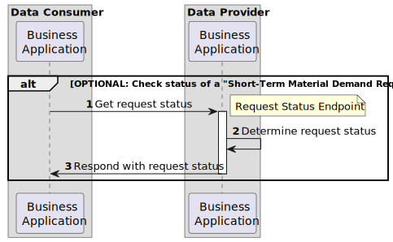
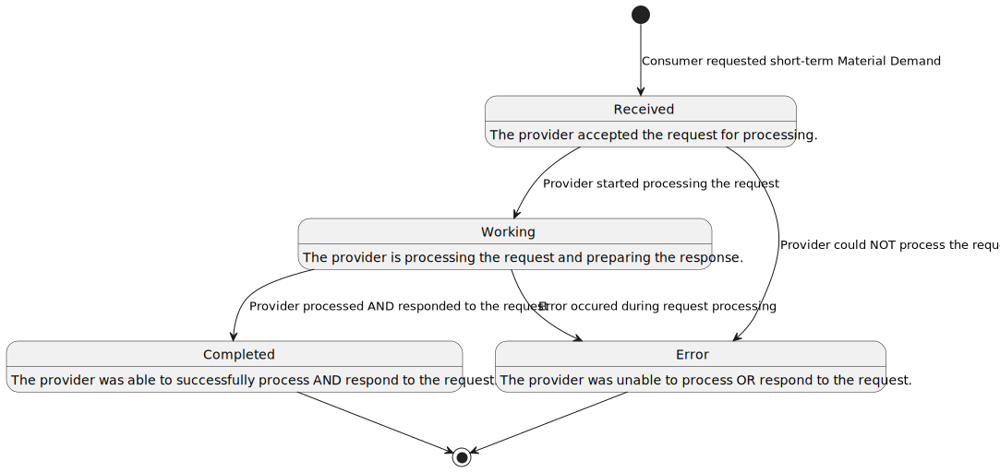
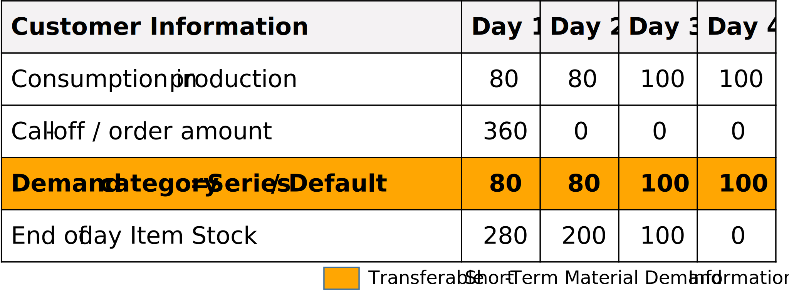

# CX - 0120 Short-Term Material Demand Exchange 1.0.0

## ABSTRACT

This document defines the standardized exchange of *Short-Term Material Demand* data within the
Catena-X network. With a focus on addressing shortages and enhancing efficiency across supply
chains, this standard aims to facilitate the consistent, reliable, and secure transmission of
*Short-Term Material Demand* data among network participants. It serves as a foundational resource
for developers, solution providers, and participants in the Catena-X network by offering
comprehensive guidance on implementing and adhering to the standardized exchange of *Short-Term
Material Demand* data. The standardization of the customer's *Short-Term Material Demand* semantics
and exchange API enables participants in the supply chain to share information about timebound
*Short-Term Material Demand* quantities at a customer's site in an interoperable manner. To give
additional context and guidance, specific process descriptions with examples are used to convey an
understanding of the application.

## FOR WHOM IS THE STANDARD DESIGNED

## 1 INTRODUCTION

In recent years global supply chains have significantly been affected by global crises.
Ever-increasing complexity and interdependencies compound this issue. As a result small and
medium-sized enterprises as well as large enterprises are exposed to an increased risk of
disruptions in their supply chains. To adapt to short-term fluctuations and develop the right
countermeasures, it is essential to have sound information about the *Short-Term Material Demand* of customers.

This document describes and standardizes a common semantic model for the *Short-Term Material
Demand* as well as an associated API to exchange *Short-Term Material Demand* information between
supply chain partners in an interoperable manner. The customer's *Short-Term Material Demand* is
semantically the quantity of a material that a customer requests from a supplier in a time horizon
of up to four weeks. It aims to supplement, not to replace or to duplicate, regular and legally
binding orders or call-offs between partners and enable customers to provide suppliers with context
regarding their demands. It is possible to distinguish in particular between those demands that are
critical for the customer's planned production and those that are additional and possibly
non-recurring, e.g. for building up safety stocks. Suppliers can use this additional information to
better coordinate their own production and demands and to proactively propose solutions in the event
of shortages.

Through the adoption of this standard, supply chain partners can efficiently communicate Short-Term
Material Demand information, that supports proactive and better-founded decision-making, responsive
inventory management, and effective allocation of resources to prevent or mitigate shortages.

### 1.1 AUDIENCE & SCOPE

> *This section is non-normative*

This standard is relevant for the following roles defined in [[CX-OMW]](#62-non-normative-references):

- **Data Providers**  willing to provide *short-term material demand* data
- **Data Consumers**  interested in requesting and receiving *short-term* *material demand* data
- **Business Application Providers** interested in providing solutions implementing this standard
- **Consulting Services Providers** interested in supporting companies fulfilling the standard

The scope of this standard is only the Planned Production Output aspect model and API. It describes
the exchange of Planned Production Output data through an IDS-compliant connector (e.g. EDC).

### 1.2 CONTEXT AND ARCHITECTURE FIT

The customer's demand is one of the key information a supplier or manufacturer uses to plan his
production. The customer order represents this demand towards the supplier or customer. The
*Short-Term Material Demand* is intended to be additional information to evaluate the partners'
supply situation. The respective orders or call-offs communicated, are still contractually binding.
The actions to take based on the material demand data described in this standard must be aligned
between the customer and supplier.

*Figure 1* shows the high-level architecture of the *Short-Term Material Demand* exchange in the
Catena-X dataspace and the central services that are involved. Both the data consumer and the data
provider must be members of the Catena X network in order to communicate with each other. With the
help of centrally managed Identity Access Management (IAM) each participant can authenticate itself,
verify the identity of the requesting party and decide whether to authorize the request. The data
provisioning is based on an asynchronous exchange of request and response messages.


*Figure 1: high-level architecture of the Short-Term Material Demand exchange in the Catena-X*

### 1.3 CONFORMANCE AND PROOF OF CONFORMITY

> *This section is non-normative*

As well as sections marked as non-normative, all authoring guidelines, diagrams, examples, and notes in this specification are non-normative. Everything else in this specification is normative. The keywords  **MAY**,  **MUST**,  **MUST NOT**,  **OPTIONAL**,  **RECOMMENDED**,  **REQUIRED**, **SHOULD** and  **SHOULD NOT** in this document document are to be interpreted as described in [BCP 14] [RFC2119] [RFC8174] when, and only when, they appear in all capitals, as shown here.

All participants and their solutions will need to prove, that they are conform with the Catena-X
standards. To validate that the standards are applied correctly, Catena-X employs Conformity
Assessment Bodies (CABs). The proof of conformity for a single semantic model is done according to
the general rules for proving the conformity of data provided to a semantic model or the ability to
consume the corresponding data. Furthermore participants agree to follow the normative language of
this standardization document and to implement the required API-Endpoints described in [Chapter 4](#4-application-programming-interfaces).

### 1.4 EXAMPLES

> *This section is non-normative*

The following example shows a value-only JSON representation of an "Short-Term Material Demand"
aspect model. It contains a demand quantity of 180 with a demand category `series` and a demand
quantity of 100 with demand category `after-sales` for a material named `spark plug`. Also the
customer location varies for the different demand series. This *Short-Term Material Demand* is the
demand that a supplier received from a customer.

```json
{
  "unitOfMeasure": "unit:piece",
  "demandRate": {                                                             
    "demandRateCode": "cw"                                                  
  },
  "materialDescriptionCustomer": "Spark Plug",
  "materialDemandId": "0157ba42-d2a8-4e28-8565-7b07830c1110",
  "materialNumberSupplier": "MNR-8101-ID146955.001",                           
  "supplier": "BPNL6666666666YY",                                              
  "changedAt": "2022-02-07T12:27:11.320Z",
  "materialGlobalAssetId": "urn:uuid:48878d48-6f1d-47f5-8ded-a441d0d879df",    
  "demandSeries": [
    {
      "expectedSupplierLocation": "BPNS8888888888XX",                          
      "demands": [
        {
          "demand": 180,
          "pointInTime": "2022-03-07T01:00:52.173-07:00"                       
        }
      ],
      "customerLocation": "BPNS8888888888XX",                                  
      "demandCategory": {
        "demandCategoryCode": "SR99"                                           
      }
    },
    {
      "expectedSupplierLocation": "BPNS8888888888XX",                          
      "demands": [
        {
          "demand": 100,
          "pointInTime": "2022-03-10T01:00:52.173-07:00"                       
        }
      ],
      "customerLocation": "BPNS7777777777XX",                                 
      "demandCategory": {
        "demandCategoryCode": "A1S1"                                           
      }
    }
  ],
  "materialNumberCustomer": "500009086",
  "customer": "BPNL8888888888XX"
}
```

### 1.5 TERMINOLOGY

> *This section is non-normative*

| **Name** | **Abrv.** | **Description** |
| --- | --- | --- |
| **Business Partner Number** | BPN | A BPN is the unique identifier of a partner within Catena-X as defined in [[CX-0010]](#61-normative-references). |
| **Business Partner Number Site** | BPNS | A BPNS is the unique identifier of a partner site within Catena-X as defined in [[CX-0010]](#61-normative-references). |
| **Business Partner Number Adress** | BPNA | A BPNA is the unique identifier of a partner address within Catena-X as defined in [[CX-0010]](#61-normative-references). |
| **Demand** | | Quantity of a demand for a given time frame. The quantity must be greater than or equal to 0 and less or equal than 999999999999999999.999. It allows up to 12 digits and 3 decimal places. |
| **Demand series** | | The demands for a dedicated material in a given time period of a given demand rate, distinguished by their demand location and demand category. |
| **Demand category** | | Classification of demands used for prioritization or allocation. |
| **Position** | | A position within an order defines the product and the quantity the supplier has to manufacture / supply for a customer. A single order may contain multiple positions for different products. |
| **Order** | | Request from a customer towards a supplier to manufacture / supply a given quantity of a specific product in a predefined time frame. |
| **Provider** | | The party providing the *Item Stock* data. <br /> In the context of the Item Stock Exchange API this is: <br /> - the supplier for *Item Stock* of direction OUTBOUND <br /> - the customer for *Item Stock* of direction INBOUND. |
| **Consumer** | | The party requesting and consuming the *Item Stock* data provided by the provider. Additional terminology used in this standard can be looked up in the glossary on the association homepage. |
| **Customer** | | The recipient of products ordered from / manufactured by a supplier. |
| **Supplier** | | The supplier / manufacturer of a product. |
| **Stock** | | Two way direction of material on stock <br /> - One can have a stock of material which is ready for delivery to customers. <br /> - One can have a stock of material which can be used for the own production. <br /> Within this document, the term material, product, component or item refers to any kind of product that may be either used as input or output of the production. Semi-finished goods are not intended to be covered. |
| **Material Number** | | Unique number of a component or material. |
| **Production Output** | | The output quantity in a defined period of time for a component or material. |

*Table 1: Terminology Short-Term Material Demand Standard*

Additional terminology used in this standard can be looked up in the glossary on the association's homepage

## 2 RELEVANT PARTS OF THE STANDARD FOR SPECIFIC USE CASES

### 2.1 "SHORT-TERM MATERIAL DEMAND"

#### 2.1.1 LIST OF STANDALONE STANDARDS

The following Catena-X standards are prerequisites for the implementation of this standard and therefore
**MUST** be considered / implemented by the relevant parties specified in each of them.

| **Number** | **Standard** |
| --- | --- |
| [[CX-0001]](#61-normative-references) | EDC Discovery API | 1.0.2 |
| [[CX-0003]](#61-normative-references) | SAMM Aspect Meta Model | 1.1.0 |
| [[CX-0006]](#61-normative-references) | Registration and initial onboarding | 1.1.3 |
| [[CX-0010]](#61-normative-references) | Business Partner Number (BPN) | 2.0.0 |
| [[CX-0018]](#61-normative-references) | Eclipse Data Space Connector (EDC) | 2.1.0 |
| [[CX-0050]](#61-normative-references) | Framework Agreement Credential | 1.0.0 |

*Table 2: List of mandatory standards*

The usage of this standard may be complemented with the following Catena-X standards to further extend
the range of shortage prevention possibilities:

| **Number** | **Standard** |
| --- | --- |
| [[CX-0118]](#61-normative-references) | Delivery Information Exchange | 1.0.0 |
| [[CX-0121]](#61-normative-references) | Planned Production Output Exchange | 1.0.0 |
| [[CX-0122]](#61-normative-references) | Item Stock Exchange | 1.0.0 |

*Table 3: List of non-mandatory complementary standards*

#### 2.1.2 DATA REQUIRED

No additional data requirements.

#### 2.1.3 ADDITIONAL REQUIREMENTS

In addition to the general Catena-X terms and conditions each data provider and data consumer  **MUST**
consent to the "Predictive Unit Realtime Information Service - PURIS" framework agreement during an
onboarding process defined by the Catena-X governing body. Upon requesting data, the data consumer
**MUST** present the data provider with a proof of consent to the aforementioned framework agreement
in accordance with [[CX-0050] Framework Agreement Credential](#61-normative-references). The data provider **MUST** verify the validity
of the presented proof before granting access to the requested data.

#### 2.1.4 DIGITAL TWINS AND SPECIFIC ASSET IDs

This version of the document does not define any requirements for standardized integration and governance
of digital twins.

## 3 ASPECT MODELS

> *This section is normative*

### 3.1 "SHORT-TERM MATERIAL DEMAND" ASPECT MODEL

#### 3.1.1 INTRODUCTION

This section describes the "Material Demand" semantic model used in The *Short-Term Material Demand* Exchange standard. It defines the demand of material, product, component or items for a customer.
The provided aspect model is automotive-agonistic, thus allowing for future integration and exchange
with non-automotive dataspaces.

#### 3.1.2 SPECIFICATIONS ARTIFACTS

The modeling of the semantic model specified in this document was done in accordance to the
"semantic driven workflow" to create a submodel template specification [[SMT]](#62-non-normative-references).

This aspect model is written in SAMM 2.0.0 as a modeling language conformant to [[CX-0003]](#61-normative-references) as
input for the semantic driven workflow.

Like all Catena-X data models, this model is available in a machine-readable format on GitHub
conformant to [[CX-0003]](#61-normative-references).

##### 3.1.2.1 SHORT-TERM MATERIAL DEMAND CATEGORY HANDLING

The Material Demand data **MUST** consider the following demand categories shared with the DCM
standard [CX-0128](#61-normative-references). These Demand Categories **MAY** be used optionally. If no categories are to be
used, the value "default" **MUST** be selected. If different categories apply, it is **RECOMMENDED**
to use them to describe certain use cases such as inventory build-up, logistics optimization or
series start-ups. This use case-specific categorization can be an important building block for the
supplier to leverage potential in the event of possible bottlenecks or supply gaps. Demand data for
demand category "Extraordinary Demand" **MAY** be set to actively indicate differences between
call-offs or orders and the demand derived from the scheduled or planned production.

| Demand Category | Description | Demand Category Code (Based on Data Model) |
| --- | --- | --- |
| Default | No Assignment | 0001 |
| After-Sales | After sales demand of spare parts | A1S1 |
| Series | Dependent demand e.g. production, assembly, raw material | SR99 |
| Phase-In-Period | Ramp up of a new product or new material introduction | PI01 |
| Single-Order | Demand outside the normal spectrum of supply | OS01 |
| Small Series | Short time frame for demand and pose to higher volatility | OI01 |
| Extraordinary Demand | Temporary demand on top of standard demand. Used e.g. in the following scenarios: <br /> - logistic optimization (e.g., full use of container) <br /> - preventing shortage by building stock (banking) <br /> - restocking safety stock | ED01 |
| Phase-Out-Period | Ramp down; Product or material retires from the market | PO01 |

*Table 4: Short-Term Material Demand categories*

##### 3.1.2.1 SHORT-TERM MATERIAL DEMAND - DEMAND-RATE HANDLING

The *demandRate* of a *Short-Term Material Demand* **MUST** be set to "d" (day). For more information
see the semantic model specified in [Chapter 3.1.5.1](#3151-rdf-turtle).

#### 3.1.3 LICENSE

This Catena-X data model is made available under the terms of the Creative Commons Attribution 4.0
International (CC-BY-4.0) license, which is available at Creative Commons.

#### 3.1.4 IDENTIFIER OF SEMANTIC MODEL

The semantic model has the unique identifier

> `urn:samm:io.catenax.material_demand:1.0.0`

This identifier **MUST** be used by the data provider to define the semantics of the data being transferred.

#### 3.1.5 FORMATS OF SEMANTIC MODEL

##### 3.1.5.1 RDF TURTLE

The rdf turtle file, an instance of the Semantic Aspect Meta Model, is the master for generating
additional file formats and serializations. It can be found under the following link:

> [https://github.com/eclipse-tractusx/sldt-semantic-models/blob/main/io.catenax.material\_demand/1.0.0/MaterialDemand.ttl](https://github.com/eclipse-tractusx/sldt-semantic-models/blob/main/io.catenax.material_demand/1.0.0/MaterialDemand.ttl)

The open source command line tool of the Eclipse Semantic Modeling Framework is used for generation
of other file formats like for example a JSON Schema, aasx for Asset Administration Shell Submodel
Template or a HTML documentation.

##### 3.1.5.2 JSON SCHEMA

A JSON Schema **MUST** be generated from the RDF Turtle file. The JSON Schema defines the Value-Only
payload of the Asset Administration Shell for the API operation "*GetSubmodel*".

##### 3.1.5.3 AASX

An AASX file can be generated from the RDF Turtle file. The AASX file defines one of the requested
artifacts for a Submodel Template Specification conformant to [[SMT]](#62-non-normative-references).

## 4 APPLICATION PROGRAMMING INTERFACES

### 4.1 "SHORT-TERM MATERIAL DEMAND" API

The "Short-Term Material Demand" defined in this section enables the exchange of *Short-Term Material Demand* data between Catena-X participants in an interoperable manner. *Figure 2* shows a high-level overview of the intended data exchange flow.


*Figure 2: High-level overview of Short-Term Material Demand data exchange*

The API relies on asynchronous communication between the involved parties.

1. A data exchange is initiated by a data consumer requesting a *Short-Term Material Demand*
2. Upon receiving a valid request, the data provider accepts it for further processing, thus confirming the receipt of the request.
3. The data provider determines the requested *Short-Term Material Demand*.
4. The data provider sends the requested *Short-Term Material Demand* to the data consumer.
5. The data consumer confirms the successful receipt of the requested *Short-Term Material Demand* by accepting it.

The data provider may also optionally offer an endpoint, which can be used by the data consumer to track the status of the request it made. *Figure 2* shows an overview of the steps involved in fetching the state of a previously made "Short-Term Material Demand Request".


*Figure 3: Checking the status of a "Short-Term Material Demand Request"*

1. The data consumer requests the status of a previously made request.
2. The data provider determines the request's status.
3. The data provider responds instantly informing the data consumer about the request's status.

The lifecycle of a "Short-Term Material Demand Request" is defined by the set of states shown in *Figure 4*.


*Figure 4: States of a "Short-term Material Demand Request"*

#### 4.1.1 PRECONDITIONS AND DEPENDENCIES

To use this standard the participants **MUST** have an existing business relationship that defines demand
and supply relationship.

Each partner **MUST** be registered and onboarded to Catena-X [CX-006](#61-normative-references). To participate in the Catena-X
dataspace, the Eclipse Data Space Connector **MUST** be used to make the API available [CX-0018](#61-normative-references)

#### 4.1.2 API SPECIFICATION

##### 4.1.2.1 API ENDPOINTS & RESOURCES

Catena-X participants interested in exchanging *Material Demand* information **MUST** implement the
endpoints as defined in the table below based on their role in the data exchange process.

> Note: Expressions in double curly braces \{\{\}\} must be substituted with a corresponding value.

| **Role** | **Endpoint** | **Route** | **REQUIRED** | **HTTP Method** | **Purpose** |
| --- | --- | --- | --- | --- | --- |
| Provider | Request Endpoint | `{{MATERIAL-DEMAND-REQUEST-ENDPOINT}}` | Yes | **POST** | This endpoint receives the "Short-Term Material Demand" Requests from a consumer. |
| Consumer | Response Endpoint | `{{MATERIAL-DEMAND-RESPONSE-ENDPOINT}}` | Yes | **POST** | This endpoint receives the "Short-Term Material Demand" responses to the consumer's requests. |
| Provider | Request Status Endpoint | `{{MATERIAL-DEMAND-STATUS-ENDPOINT}}` | No | **POST** | This endpoint allows the consumer to **OPTIONALLY** check the current status of a "Short-Term Material Demand" Request it already made. |

*Table 5: Short-Term Material Demand roles in data exchange process*

##### 4.1.2.2 SHORT-TERM MATERIAL DEMAND REQUEST

When sending a request to the "Short-Term Material Demand Request Endpoint", the body **MUST** be
composed out of two parts: a `header` object according to the shared aspect model `MessageHeader`
and a `content` object. Together they form the HTTP body that **MUST** be formatted as JSON.

###### Request Header

> Note: This is not the HTTP Header but rather part of the HTTP Body.

The following table lists all fields of the message header and how they are used.

| **Field** | **REQUIRED** | **Purpose** | **Datatype** | **Example value** |
| --- | --- | --- | --- | --- |
| messageId | Yes | Unique ID identifying the message.The purpose of the ID is to uniquely identify a single message, therefore it **MUST NOT** be reused. | UUID v4 [RFC4122] | `48878d48-6f1d-47f5-8ded-a441d0d879df` |
| relatedMessageId | No | For the "Short-Term Material Demand Request" this information **SHOULD NOT** be set. | UUID v4 [RFC4122] | `b50e7c60-31d1-4682-af01-6ab33477c3f6` |
| context | Yes | Information about the context the message should be considered in. The value **MUST** consist of two parts: constant of a given endpoint `RES-PURIS-ShortTermMaterialDemandRequest:` followed by the version number `1.0` | URI | `RES-PURIS-ShortTermMaterialDemandRequest:1.0` |
| version | Yes | This field **MUST** specify the namespace and version of the headers aspect model that has been used to create the header. | Namespace and version of the shared aspect `MessageHeader` | `urn:samm:io.catenax.message_header:2.0` |
| senderBpn | Yes | The business partner number (BPNL/S) of the requesting party. | BPN according to [[CX-0010]](#61-normative-references) | `BPNS0123456789ZZ` |
| receiverBpn | Yes | The business partner number (BPNL/S) of the receiving party. | BPN according to [[CX-0010]](#61-normative-references) | `BPNS0123456789YY` |
| sentDateTime | Yes | The date and time including time zone offset on which the request has been created. | [[ISO8601]](#62-non-normative-references) with time zone | `2023-04-25T10:54:12+00:00` |

*Table 6: Short-Term Material Demand message header*

The following JSON object gives an example of a valid `header`:

```json
"header":{
   "messageId":"48878d48-6f1d-47f5-8ded-a441d0d879df",
   "context": "RES-PURIS-ShortTermMaterialDemandRequest:1.0",
   "version": "urn:samm:io.catenax.message_header:2.0",
   "senderBpn":"BPNS0123456789ZZ",
   "receiverBpn":"BPNS2345678910YY",
   "sentDateTime":"2023-04-25T10:54:12+00:00"
}
```

###### Request Content

The content consists of a single *shortTermMaterialDemand* object containing the list of material
numbers for which the consumer would like to receive the *Material Demand* information.
Each material is described by the following fields:

| **Field** | **REQUIRED** | **Purpose** | **Datatype** | **Example value** |
| --- | --- | --- | --- | --- |
| materialNumberCustomer | Yes | The material number given by the customer **MUST** unambiguously identify the material on customer side. It **SHOULD** be used by the supplier to identify the requested material. | String | `MNR-7307-AU340474.001` |
| materialNumberSupplier | No | The material number given by the supplier **MUST** unambiguously identify the material on supplier side. Material number given by the supplier **MAY** be used by the supplier to identify the material in case the `materialNumberCustomer` is not known by the supplier. | String | `MNR-8101-ID146955.001` |
| materialNumberCatenaX | No | The material number given by the Catena-X network **MUST** unambiguously identify the material in the Catena-X network and **MAY** be used to identify the digital twin of the material. This number **MAY** be used instead of the `materialNumberCustomer` or the `materialNumberSupplier` to identify the material when consumer and provider both know the digital twin of the material | UUID v4 [RFC4122] | `urn:uuid:055c1128-0375-47c8-98de-7cf802c3241d` |

*Table 7: Short-Term Material Demand request content*

The following JSON object gives an example of a valid `content`:

```json
"content":{
   "shortTermMaterialDemand":[
      {
         "materialNumberCustomer":"MNR-7307-AU340474.001",
         "materialNumberSupplier":"MNR-8101-ID146955.001",
         "materialNumberCatenaX":"urn:uuid:055c1128-0375-47c8-98de-7cf802c3241d"
      },
      {
         "materialNumberCustomer":"MNR-7307-AU340474.002"
      }
   ]
}
```

###### Request Example

The following snippet shows an example consisting of both, the `header` and the `content` for a given
"Short Term Material Demand Request".

```json
{
   "header":{
      "messageId":"48878d48-6f1d-47f5-8ded-a441d0d879df",
      "context": "RES-PURIS-InformationObjectRequest:1.0",
      "version": "urn:samm:io.catenax.message_header:2.0",
      "senderBpn":"BPNS0123456789ZZ",
      "receiverBpn":"BPNS2345678910YY",
      "sentDateTime":"2023-04-25T10:54:12+00:00"
   },
   "content":{
      "shortTermMaterialDemand":[
         {
            "materialNumberCustomer":"MNR-7307-AU340474.001",
            "materialNumberSupplier":"MNR-8101-ID146955.001",
            "materialNumberCatenaX":"urn:uuid:055c1128-0375-47c8-98de-7cf802c3241d"
         },
         {
            "materialNumberCustomer":"MNR-7307-AU340474.002"
         }
      ]
   }
}
```

###### Responding to a "Short Term Material Demand Request"

The consumer **MUST** respond with one of the HTTP status codes defined in the corresponding section
of [Chapter 4.1.4](#414-error-handling).

The response **MUST** be JSON formatted and **MUST** contain only the `messageId` field specifying the
ID of the message received. The value **MUST** therefore be also equal to the `relatedMessageId` value
contained in the header of the "*Short Term Material Demand*" response described in [Chapter 4.1.2.3](#4123-short-term-material-demand-response).

The following JSON object gives an example of a valid response:

```json
{
  "messageId":"48878d48-6f1d-47f5-8ded-a441d0d879df"
}
```

##### 4.1.2.3 SHORT TERM MATERIAL DEMAND RESPONSE

When provisioning data to the "Short-Term Material Demand Response Endpoint", the body **MUST** be
composed out of two parts: a `header` object according to the shared aspect model `MessageHeader` and
a `content` object. Together they form the HTTP body that **MUST** be formatted as JSON.

###### Response Header

> Note: This is not the HTTP Header but rather part of the HTTP Body.

The following table lists all fields of the message header and how they are used.

| **Field** | **REQUIRED** | **Purpose** | **Datatype** | **Example value** |
| --- | --- | --- | --- | --- |
| messageId | Yes | Unique ID identifying the message. The purpose of the ID is to uniquely identify a single message, therefore it **MUST NOT** be reused. | UUID v4 [RFC4122] | `375e75f0-913e-4b71-a96c-366fc8f6bf8f` |
| relatedMessageId | Yes | For the "Short-Term Material Demand Response" this information **MUST** be set to the messageId of the corresponding "Short-Term Material Demand Request" received. | UUID v4 [RFC4122] | `48878d48-6f1d-47f5-8ded-a441d0d879df` |
| context | Yes |  Information about the context the message should be considered in. The value **MUST** consist of two parts: constant of a given endpoint `RES-PURIS-ShortTermMaterialDemandResponse:` followed by the version number `1.0` | URI | `RES-PURIS-ShortTermMaterialDemandResponse:1.0` |
| version | Yes | This field **MUST** specify the namespace and version of the header's aspect model that has been used to create the header. | Namespace and version of the shared aspect model `MessageHeader` | `urn:samm:io.catenax.message_header:2.0` |
| senderBpn | Yes | The business partner number (BPNL/S) of the responding party. | BPN according to [[CX-0010]](#61-normative-references) | `BPNS0123456789ZZ` |
| receiverBpn | Yes | The business partner number (BPNL/S) of the receiving party. | BPN according to [[CX-0010]](#61-normative-references) | `BPNS0123456789YY` |
| sentDateTime | Yes | The date and time including time zone offset on which the request has been created. | [[ISO8601]](#62-non-normative-references) with time zone | `2023-04-25T10:54:12+00:00` |

*Table 8: Short-Term Material Demand response header*

The following JSON object gives an example of a valid `header`:

```json
"header":{
   "messageId":"375e75f0-913e-4b71-a96c-366fc8f6bf8f",
   "relatedMessageId": "48878d48-6f1d-47f5-8ded-a441d0d879df",
   "context": "RES-PURIS-InformationObjectResponse:1.0",
   "version": "urn:samm:io.catenax.message_header:2.0",
   "senderBpn":"BPNS2345678910YY",
   "receiverBpn":"BPNS0123456789ZZ",
   "sentDateTime":"2023-04-25T10:54:12+00:00"
}
```

###### Response Content

The content **MUST** consist of a single `shortTermMaterialDemand` object containing a list of *Material Demands*. Each Short-Term *Material Demand* **MUST** be built according to the  `MaterialDemand` SAMM model defined in [Chapter 3.1](#31-short-term-material-demand-aspect-model). An example content for a single *Material Demand* is given below.

```json
"content": {
  "shortTermMaterialDemand":[
    {
        "unitOfMeasureIsOmitted":false,
        "demandRate":{
          "demandRateCode":"DAY"
        },
        "unitOfMeasure":"unit:piece",
        "materialDescriptionCustomer":"Spark Plug",
        "materialGlobalAssetId":"urn:uuid:48878d48-6f1d-47f5-8ded-a441d0d879df",
        "materialDemandId":"0157ba42-d2a8-4e28-8565-7b07830c1110",
        "materialNumberSupplier":"MNR-8101-ID146955.001",
        "supplier":"BPNL6666666666YY",
        "changedAt":"2023-11-05T08:15:30.123-05:00",
        "demandSeries":[
          {
              "expectedSupplierLocation":"BPNS8888888888XX",
              "demands":[
                {
                    "demand":1000,
                    "pointInTime":"2023-08-09T01:00:52.173-07:00"
                }
              ],
              "customerLocation":"BPNS8888888888XX",
              "demandCategory":{
                "demandCategoryCode":"0001"
              }
          }
        ],
        "materialNumberCustomer":"MNR-7307-AU340474.002",
        "customer":"BPNL8888888888XX"
    }
  ]
}
```

###### Response Example

The following snippet shows an example consisting of both, the `header` and the `content` for a
given *Short-Term Material Demand* Response.

```json
{
   "header":{
      "messageId":"375e75f0-913e-4b71-a96c-366fc8f6bf8f",
      "relatedMessageId":"48878d48-6f1d-47f5-8ded-a441d0d879df",
      "context":"RES-PURIS-ShortTermMaterialDemandResponse:1.0",
      "version":"urn:samm:io.catenax.message_header:2.0",
      "senderBpn":"BPNS2345678910YY",
      "receiverBpn":"BPNS0123456789ZZ",
      "sentDateTime":"2023-04-25T10:54:12+00:00"
   },
   "content":{
      "shortTermMaterialDemand":[
         {
            "unitOfMeasureIsOmitted":false,
            "demandRate":{
               "demandRateCode":"DAY"
            },
            "unitOfMeasure":"unit:piece",
            "materialDescriptionCustomer":"Spark Plug",
            "materialGlobalAssetId":"urn:uuid:48878d48-6f1d-47f5-8ded-a441d0d879df",
            "materialDemandId":"0157ba42-d2a8-4e28-8565-7b07830c1110",
            "materialNumberSupplier":"MNR-8101-ID146955.001",
            "supplier":"BPNL6666666666YY",
            "changedAt":"2023-11-05T08:15:30.123-05:00",
            "demandSeries":[
               {
                  "expectedSupplierLocation":"BPNS8888888888XX",
                  "demands":[
                     {
                        "demand":1000,
                        "pointInTime":"2023-08-09T01:00:52.173-07:00"
                     }
                  ],
                  "customerLocation":"BPNS8888888888XX",
                  "demandCategory":{
                     "demandCategoryCode":"0001"
                  }
               }
            ],
            "materialNumberCustomer":"MNR-7307-AU340474.002",
            "customer":"BPNL8888888888XX"
         }
      ]
   }
}
```

###### Invalid Data Handling

The endpoint **MUST NOT** process `shortTermMaterialDemand` objects for which the following values
are **NOT** set:

- `unitOfMeasureIsOmitted` = "false"
- `demandRate.demandRateCode` = "DAY"

###### Responding to a "Short-Term Material Demand Response"

The consumer **MUST** respond with one of the HTTP status codes defined in the corresponding section
of [Chapter 4.1.4](#414-error-handling).

The response **MUST** be JSON formatted and **MUST** contain only the `messageId` field specifying the
ID of the message received. The value **MUST** therefore be also equal to the `messageId` value contained
in the header of the Short-Term Material Demand Response.

The following JSON object gives an example of a valid response:

```json
{
  "messageId":"375e75f0-913e-4b71-a96c-366fc8f6bf8f"
}
```

##### 4.1.2.4 SHORT-TERM MATERIAL DEMAND REQUEST STATUS

When sending a request to the "Short-Term Material Demand Request Status Endpoint", the body **MUST**
be composed out of two parts: a `header` object and a `content` object. Together they form the HTTP
body that **MUST** be formatted as JSON.

###### Status Request Header

> Note: This is not the HTTP Header but rather part of the HTTP Body.

| **Field** | **REQUIRED** | **Purpose** | **Datatype** | **Example value** |
| --- | --- | --- | --- | --- |
| messageId | Yes | Unique ID identifying the message.The purpose of the ID is to uniquely identify a single message, therefore it **MUST** not be reused. | UUID v4 [RFC4122] | `1b2a5f4c-0215-4a85-9191-146931c11da8` |
| relatedMessageId | Yes | Unique ID identifying the Material Demand Request message sent before. | UUID v4 [RFC4122] | `48878d48-6f1d-47f5-8ded-a441d0d879df` |
| context | Yes |  Information about the context the message should be considered in. The value **MUST** consist of two parts: constant of a given endpoint `RES-PURIS-ShortTermMaterialDemandRequestStatus:` followed by the version number `1.0`. | URI | `RES-PURIS-ShortTermMaterialDemandRequestStatus:1.0` |
| version | Yes | This field **MUST** specify the namespace and version of the header's aspect model that has been used to create the header. | Namespace and version of the shared aspect `MessageHeader` | `urn:samm:io.catenax.message_header:2.0` |
| senderBpn | Yes | The business partner number (BPNL/S) of the requesting party. | BPN according to [[CX-0010]](#61-normative-references) | `BPNS0123456789ZZ` |
| receiverBpn | Yes | The business partner number (BPNL/S) of the receiving party. | BPN according to [[CX-0010]](#61-normative-references) | `BPNS0123456789YY` |
| sentDateTime | Yes | The date and time including time zone offset on which the request has been created. | [[ISO8601]](#62-non-normative-references) with time zone | `2023-04-25T10:54:12+00:00` |

*Table 9: Short-Term Material Demand request status header*

The following JSON object gives an example of a valid `header`:

```json
"header":{
   "messageId":"1b2a5f4c-0215-4a85-9191-146931c11da8",
   "relatedMessageId": "48878d48-6f1d-47f5-8ded-a441d0d879df",
   "context": "RES-PURIS-ShortTermMaterialDemandRequestStatus:1.0.0",
   "version": "urn:samm:io.catenax.message_header:1.0.0",
   "senderBpn":"BPNS0123456789ZZ",
   "receiverBpn":"BPNS2345678910YY",
   "sentDateTime":"2023-04-25T10:54:12+00:00"
}
```

###### Status Request Content

The `content` **MUST** be an empty object.

The following JSON object gives an example of a valid `content`:

```json
"content": {

}
```

###### Status Request Example

The following snippet shows an example consisting of both, the `header` and the `content` for a given "Short Term Material Demand Request Status API" request.

```json
{    
   "header":{
       "messageId":"1b2a5f4c-0215-4a85-9191-146931c11da8",
       "relatedMessageId": "48878d48-6f1d-47f5-8ded-a441d0d879df",
       "context": "RES-PURIS-ShortTermMaterialDemandRequestStatus:1.0",
       "version": "urn:samm:io.catenax.message_header:2.0",
       "senderBpn":"BPNS0123456789ZZ",
       "receiverBpn":"BPNS2345678910YY",
       "sentDateTime":"2023-04-25T10:54:12+00:00"
    },
   "content":{
       
   }
}
```

###### Responding to a "Short-Term Material Demand Status Request

The provider **MUST** respond with one of the HTTP status codes defined in the corresponding section
of [Chapter 4.1.4](#414-error-handling).

The response **MUST** be JSON formatted and **MUST** contain the following fields:

- `messageId`: the ID of the "Short-Term Material Demand Request", for which one would like to know the current status
- `requestState`: the current state of the request on provider side

The following table contains the list of valid request states and their meaning.

| **State** | **Meaning** |
| --- | --- |
| `Received`  | The provider accepted the request for processing.  |
| `Working`  | The provider is processing the request and preparing the response.  |
| `Completed`  | The provider was able to successfully process AND respond to the request. |
| `Error` | The provider was unable to process OR respond to the request. |

*Table 10: Short-Term Material Demand valid request states*

More information about the different states and the transitions between them is provided in the beginning
of [Chapter 4.1](#41-short-term-material-demand-api).

The following JSON object gives an example of a valid response:

```json
{
  "messageId": "48878d48-6f1d-47f5-8ded-a441d0d879df",
  "requestState": "Working"
}
```

##### 4.1.2.5 AVAILABLE DATA TYPES

The API **MUST** use JSON as the payload transported via HTTPS. More information on the data objects
supported by the endpoints is provided in the corresponding sections of [Chapter 4.1.2](#412-api-specification).

#### 4.1.3 EDC DATA ASSET STRUCTURE

The endpoints introduced in [Chapter 4.1.2](#412-api-specification) **MUST NOT** be directly called from a provider or from
a consumer. Rather, these **MUST** be called via an IDS-compliant connector (e.g. EDC). Therefore,
the endpoints **MUST** be offered as EDC data assets. To make this assets easily identifiable in the
connector's catalog, each asset **MUST** be configured with a set of properties as described in the
corresponding sections below.

The following table provides an overview of the EDC data assets that the parties **MUST** offer to
be able to provision and/or consume *Short-Term Material Demand* data.

| **Party** | **REQUIRED** | **Asset** | **Purpose** |
| --- | --- | --- | --- |
| Provider | Yes | "Short-Term Material Demand Request" | Allows a consumer to request *Material Demand* information. |
| Provider | No | "Short-Term Material Demand Request Status" | Allows a consumer to check the status for a "Short-Term Material Demand Request". |
| Consumer | Yes | "Short-Term Material Demand Response" | Allows a consumer to receive the requested *Material Demand* information. |

*Table 11: EDC data assets*

##### EDC Data Asset Structure for "Short-Term Material Demand Request API Endpoint"

In order to receive "Short-Term Material Demand Requests", the provider **MUST** register an EDC data
asset specifying the address of the "Short-Term Material Demand Request Endpoint" described in [Chapter 4.1.2](#412-api-specification).

The data asset **MUST** be configured with the set of properties as defined in the table below.

| **Property** | **Purpose** | **Usage & Constraints** |
| --- | --- | --- |
| ***@type*** | Defines the asset type. | The asset **MUST** be set to `Asset`. |
| ***@id*** | Identifier of the asset | The asset ID **MUST** be unique and therefore **MUST NOT** be reused elsewhere. |
| properties.**dct:type** | Defines the "Short-Term Material Demand API Request Endpoint" according to the Catena-X taxonomy. | **MUST** be set to `{"@id": "https://w3id.org/catenax/taxonomy#ShortTermMaterialDemandRequestApi"}` to allow filtering the data assets catalog for the respective "Short-Term Material Demand Request API". |
| properties.**asset:prop:type** | Defines the "Short-Term Material Demand Request API Endpoint" for filtering purposes. | **MUST** be set to `data.res.shortTermMaterialDemandRequestApi` to allow filtering the data assets catalog for the respective "Short-Term Material Demand Request API". |
| properties.**cx-common:version** | The version of the standard defining the implemented API | **MUST** correspond to the version of the standard defining the "Short-Term Material Demand Exchange API". The value **MUST** be set to `1.0` for APIs implementing this standard. |
| dataAddress.properties.**@type** | Type of the DataAddress node. | **MUST** be set to `DataAddress`. |
| dataAddress.properties.***baseUrl*** | Defines the HTTPS endpoint of the corresponding "Short-Term Material Demand Request API Endpoint". | The `{{SHORT_TERM_MATERIAL_DEMAND_REQUEST_ENDPOINT}}` refers to an URL under which the API endpoint is available. HTTPS transport protocol **MUST** be used. |
| dataAddress.properties.***proxyBody*** | Defines whether the endpoint allows to proxy the HTTPS body | **MUST** be set to `true` to allow the API endpoint to receive a HTTPS body via the HTTPS request. |
| dataAddress.properties.***proxyMethod*** | Defines whether the endpoint allows to proxy the HTTPS method | **MUST** be set to `true` to allow the API endpoint to also receive POST requests. |
| dataAddress.properties.***type*** | Defines the type of data plane extension handling the data exchange | **MUST** be set to `HttpData` to provide an API via an HTTPS proxy endpoint. |

*Table 12: EDC data assets request properties*

When searching the data assets catalog of a provider, a consumer **MUST** use the following combination
of properties AND their values to identify the data asset specifying the
"Short-Term Material Demand Request Endpoint" described in [Chapter 4.1.2](#412-api-specification).

| **Property** | **Value** |
| --- | --- |
| properties.***asset:prop:type*** | `data.res.shortTermMaterialDemandRequestApi` |
| properties.***cx-common:version*** | `1.0` |

*Table 13: EDC data assets request properties values*

Because the data asset reflects the existing contractual relationship between a customer and its suppliers, only one data asset with the aforementioned combination of properties AND their values **MUST** be visible to the consumer at any time to avoid ambiguity.

An example EDC Data Asset definition is given below.

> Note: Expressions in double curly braces \{\{\}\} must be substituted with a corresponding value.

```json
{
    "@context": {
        "@vocab": "https://w3id.org/edc/v0.0.1/ns/",
        "cx-taxo": "https://w3id.org/catenax/taxonomy#",
        "cx-common": "https://w3id.org/catenax/ontology/common#",
        "dct": "https://purl.org/dc/terms/"
    },
    "@type": "Asset",
    "@id": "{{SHORT_TERM_MATERIAL_DEMAND_REQUEST_API_ASSET_ID}}",                                   
    "properties": {
        "dct:type": {
            "@id": "cx-taxo:ShortTermMaterialDemandRequestApi"                                 
        },
        "asset:prop:type": "data.res.shortTermMaterialDemandRequestApi", 
        "cx-common:version": "1.0",                                              
        "description": "Short-Term Material Demand Request API Endpoint"                                     
    },
    "dataAddress": {
        "@type": "DataAddress",
        "type": "HttpData",
        "proxyBody": "true",
        "proxyMethod": "true",
        "baseUrl": "{{SHORT_TERM_MATERIAL_DEMAND_REQUEST_API_ENDPOINT}}"                            
    }
}
```

###### EDC Data Asset Structure for "Short-Term Material Demand Request Status API Endpoint"

In order to receive "Short-Term Material Demand Request Status" requests, the provider **MAY** register
an EDC data asset specifying the address of the "Short-Term Material Demand Request Endpoint" described
in [Chapter 4.1.2](#412-api-specification).

The data asset **MUST** be configured with the set of properties as defined in the table below.

| **Property** | **Purpose** | **Usage & Constraints** |
| --- | --- | --- |
| ***@type*** | Defines the asset type. | The asset **MUST** be set to `Asset`. |
| ***@id*** | Identifier of the asset | The asset ID **MUST** be unique and therefore **MUST NOT** be reused elsewhere. |
| properties.**dct:type** | Defines the "Short-Term Material Demand Request Status API Endpoint" according to the Catena-X taxonomy. | **MUST** be set to `{"@id": "https://w3id.org/catenax/taxonomy#ShortTermMaterialDemandRequestStatusApi"}` to allow filtering the data assets catalog for the respective "Short-Term Material Demand Request Status API". |
| properties.**asset:prop:type** | Defines the "Short-Term Material Demand Request Status API Endpoint" for filtering purposes. | **MUST** be set to `data.res.shortTermMaterialDemandRequestStatusApi` to allow filtering the data assets catalog for the respective "Short-Term Material Demand Request Status API". |
| properties.**cx-common:version** | The version of the standard defining the implemented API. | **MUST** correspond to the version of the standard defining the "Short-Term Material Demand Exchange API". The value **MUST** be set to `1.0` for APIs implementing this standard. |
| dataAddress.properties.**@type** | Type of the DataAddress node. | **MUST** be set to `DataAddress`. |
| dataAddress.properties.***baseUrl*** | Defines the HTTPS endpoint of the corresponding "Item Stock Request Status API Endpoint". | The `{{SHORT_TERM_MATERIAL_DEMAND_REQUEST_STATUS_ENDPOINT}}` refers to an URL under which the API endpoint is available. HTTPS transport protocol **MUST** be used. |
| dataAddress.properties.***proxyBody*** | Defines whether the endpoint allows to proxy the HTTPS body | **MUST** be set to `true` to allow the API endpoint to receive a HTTPS body via the HTTPS request. |
| dataAddress.properties.***proxyMethod*** | Defines whether the endpoint allows to proxy the HTTPS method | **MUST** be set to `true` to allow the API endpoint to also receive POST requests. |
| dataAddress.properties.***type*** | Defines the type of data plane extension handling the data exchange | **MUST** be set to `HttpData` to provide an API via an HTTPS proxy endpoint. |

*Table 14: EDC data assets request status properties*

When searching the data assets catalog of a provider, a consumer **MUST** use the following combination
of properties AND their values to identify the data asset specifying the
"Short-Term Material Demand Request Status Endpoint" described in [Chapter 4.1.2](#412-api-specification).

| **Property** | **Value** |
| --- | --- |
| properties.***asset:prop:type*** | `data.res.shortTermMaterialDemandRequestStatusApi` |
| properties.***cx-common:version*** | `1.0` |

*Table 15: EDC data assets request status properties values*

Because the data asset reflects the existing contractual relationship between a customer and its suppliers, only one data asset with the aforementioned combination of properties AND their values **MUST** be visible to the consumer at any time to avoid ambiguity.

An example EDC Data Asset definition is given below.

> Note: Expressions in double curly braces \{\{\}\} must be substituted with a corresponding value.

```json
{
    "@context": {
        "@vocab": "https://w3id.org/edc/v0.0.1/ns/",
        "cx-taxo": "https://w3id.org/catenax/taxonomy#",
        "cx-common": "https://w3id.org/catenax/ontology/common#",
        "dct": "https://purl.org/dc/terms/"
    },
    "@type": "Asset",
    "@id": "{{SHORT_TERM_MATERIAL_DEMAND_REQUEST_STATUS_API_ASSET_ID}}",                           
    "properties": {
        "dct:type": {
            "@id": "cx-taxo:ShortTermMaterialDemandRequestStatusApi"                                
        },
        "asset:prop:type": "data.res.shortTermMaterialDemandRequestStatusApi",  
        "cx-common:version": "1.0",                                                       
        "description": "Short-Term Material Demand Request Status API Endpoint"                               
    },
    "dataAddress": {
        "@type": "DataAddress",
        "type": "HttpData",
        "proxyBody": "true",
        "proxyMethod": "true",
        "baseUrl": "{{SHORT_TERM_MATERIAL_DEMAND_REQUEST_STATUS_API_ENDPOINT}}"            
    }
}
```

###### EDC Data Asset Structure for "Short-Term Material Demand Response API Endpoint"

In order to receive the *Material Demand* data it requested, the consumer **MUST** register an
EDC data asset specifying the address of the "Short-Term Material Demand Response Endpoint"
described in [Chapter 4.1.2](#412-api-specification).

This asset **MUST** be configured with the set of properties as defined in the table below.

| **Property** | **Purpose** | **Usage & Constraints** |
| --- | --- | --- |
| ***@type*** | Defines the asset type. | The asset **MUST** be set to `Asset`. |
| ***@id*** | Identifier of the asset | The asset ID **MUST** be unique and therefore **MUST NOT** be reused elsewhere. |
| properties.**dct:type** | Defines the "Short-Term Material Demand Response API Endpoint" according to the Catena-X taxonomy. | **MUST** be set to `{"@id": "https://w3id.org/catenax/taxonomy#ShortTermMaterialDemandResonseApi"}` to allow filtering the data assets catalog for the respective "Short-Term Material Demand Response API". |
| properties.**asset:prop:type** | Defines the "Short-Term Material Demand Response API Endpoint" for filtering purposes. | **MUST** be set to `data.res.shortTermMaterialDemandResponseApi` to allow filtering the data assets catalog for the respective "Short-Term Material Demand Response API". |
| properties.**cx-common:version** | The version of the standard defining the implemented API | **MUST** correspond to the version of the standard defining the "Short-Term Material Demand Exchange API". The value **MUST** be set to `1.0` for APIs implementing this standard. |
| dataAddress.properties.**@type** | Type of the DataAddress node. | **MUST** be set to `DataAddress`. |
| dataAddress.properties.***baseUrl*** | Defines the HTTPS endpoint of the corresponding "Short-Term Material Demand Response API Endpoint". | The `{{SHORT_TERM_MATERIAL_DEMAND_RESPONSE_ENDPOINT}}` refers to an URL under which the API endpoint is available. HTTPS transport protocol **MUST** be used. |
| dataAddress.properties.***proxyBody*** | Defines whether the endpoint allows to proxy the HTTPS body | **MUST** be set to `true` to allow the API endpoint to receive a HTTPS body via the HTTPS request. |
| dataAddress.properties.***proxyMethod*** | Defines whether the endpoint allows to proxy the HTTPS method | **MUST** be set to `true` to allow the API endpoint to also receive POST requests. |
| dataAddress.properties.***type*** | Defines the type of data plane extension handling the data exchange | **MUST** be set to `HttpData` to provide an API via an HTTPS proxy endpoint. |

*Table 16: EDC data assets response properties*

When searching the data assets catalog of a provider, a consumer **MUST** use the following combination of properties AND their values to identify the data asset specifying the "Short-Term Material Demand Response Endpoint" described in [Chapter 4.1.2](#412-api-specification).

| **Property** | **Value** |
| --- | --- |
| properties.***asset:prop:type*** | `data.res.shortTermMaterialDemandResponseApi` |
| properties.***cx-common:version*** | `1.0` |

*Table 17: EDC data assets response properties values*

Because the asset reflects the existing contractual relationship between a customer and its suppliers,
only one asset with the aforementioned combination of properties AND their values **MUST** be visible
to the provider at any time to avoid ambiguity.

An example EDC Data Asset definition is given below.

> Note: Expressions in double curly braces \{\{\}\} must be substituted with a corresponding value.

```json
{
    "@context": {
        "@vocab": "https://w3id.org/edc/v0.0.1/ns/",
        "cx-taxo": "https://w3id.org/catenax/taxonomy#",
        "cx-common": "https://w3id.org/catenax/ontology/common#",
        "dct": "https://purl.org/dc/terms/"
    },
    "@type": "Asset",
    "@id": "{{SHORT_TERM_MATERIAL_DEMAND_RESPONSE_API_ASSET_ID}}",                                  
    "properties": {
        "dct:type": {
            "@id": "cx-taxo:ShortTermMaterialDemandResponseApi"                                    
        },
        "asset:prop:type": "data.res.shortTermMaterialDemandResponseApi",  
        "cx-common:version": "1.0",                                                   
        "description": "Short-Term Material Demand Response API Endpoint"                                     
    },
    "dataAddress": {
        "@type": "DataAddress",
        "type": "HttpData",
        "proxyBody": "true",
        "proxyMethod": "true",
        "baseUrl": "{{SHORT_TERM_MATERIAL_DEMAND_RESPONSE_API_ENDPOINT}}"                       
    }
}
```

#### 4.1.4 ERROR HANDLING

Every API endpoint defined in [Chapter 4.1.2](#412-api-specification) **MUST** respond to incoming requests with HTTP status codes
as described in [[RFC9110]](#62-non-normative-references). The status codes for each endpoint are defined in the following sections.

##### HTTP Codes for Short-Term Material Demand Request Endpoint

| **Status Code** | **Description** | **Usage** |
| --- | --- | --- |
| 202 | Short-Term Material Demand request was accepted | When the request had been accepted by the provider, the latter **MUST** respond with status code 202 |
| 400 | Request body malformed | When the request BODY is not matching the API description, the provider **MUST** respond with error code 400 |
| 401 | Not authorized | When the authorization of the request fails, the provider **MUST** respond with error code 401 |
| 404 | Endpoint not found | When the HTTP path is not available, the provider **MUST** respond with error code 404 |
| 405 | Method not allowed | In case the HTTP method used is not a POST, the provider **MUST** respond with error code 405 |
| 422 | A request with the same message ID already exists | When the message ID (`header.messageId`) was already used for another request |

*Table 18: Request error handling*

##### HTTP Codes for Short-Term Material Demand Response Endpoint

| **Status Code** | **Description** | **Usage** |
| --- | --- | --- |
| 202 | Short-Term Material Demand response was accepted | When the received Short-Term Material Demand data is accepted by the consumer, it **MUST** respond with status code 202 |
| 400 | Response body malformed | When the HTTP Body is not matching the API description, the consumer **MUST** respond with error code 400 |
| 401 | Not authorized | When the authorization of the response fails, the consumer **MUST** respond with error code 401 |
| 404 | Endpoint not found | When the HTTP path is not available, the consumer **MUST** respond with error code 404 |
| 405 | Method not allowed | In case the HTTP method used is not a POST, the provider **MUST** respond with error code 405 |
| 422 | The message ID does not match any open request | When the message ID (`header.messageId`) does not match the ID of any open request, the consumer **MUST** respond with error code 422 |

*Table 19: Response error handling*

##### HTTP Codes for Short-Term Material Demand Request Status Endpoint

| **Status Code** | **Description** | **Usage** |
| --- | --- | --- |
| 200 | Short-Term Material Demand status request was successful | When the request was successful, the provider **MUST** respond with status code 200 |
| 400 | Request body malformed | When the request BODY is not matching the API description, the provider **MUST** respond with error code 400 |
| 401 | Not authorized | When the authorization of the request fails, the provider **MUST** respond with error code 401 |
| 404 | Endpoint not found | When the HTTP path is not available, the provider **MUST** respond with error code 404 |
| 405 | Method not allowed |In case the HTTP method used is not a POST, the provider **MUST** respond with error code 405 |
| 422 | The message ID is not known | When the message ID (`header.messageId`) does not match the ID of any known request, the provider **MUST** respond with error code 422 |

*Table 20: Request status error handling*

## 5 PROCESSES

> This section is normative

The *Short-Term Material Demand* is intended to provide more details and insights about the
customer's demand. It is not meant to replace regular and legally binding orders or call-offs
between partners but to offer supplementary information. Therefore the *Short-Term Material
Demand* aspect model provides several categories that **MAY** be used to differentiate between
different types of demand. The categories originate from the joint use of the aspect model of the
Demand and Capacity Standard [[CX-0128]](#61-normative-references) and may not necessarily apply. Categories should only
be used if they are beneficial for at least one of the partners involved. If in doubt, "Default" can
always be used.

The key purpose of the *Short-Term Material Demand* is to indicate the actual required quantities
that are critical for the customer's planned production. To do so it is **RECOMMENDED** to use the
Categories "Default" or "Series". Quantities deviating from this, e.g. to build up stock or to
optimize logistics, **MAY** be mapped to "Extraordinary Demand". All other categories should be
selected and used after aligning with with the respective partner to ensure a mutual understanding
and intention of use.

The following chapter should contribute to the understanding by providing different process
representations and examples.

### 5.1 ACTORS AND ROLES

The following actors and roles occur in the described processes.

| **Actors** | **Role** | **Description** |
| --- | --- | --- |
| **Supplier** | The supplier acts as the data consumer in this standard. | Is a business partner that supplies items to a customer. As such, a supplier is interested in detailed information about the customer's *Short-Term Material Demand*.  |
| **Customer** | The customer acts as the data provider in this standard. | Is a business partner that procures items from suppliers and provides information about his *Short-Term Material Demand.* |

*Table 21: Actors and roles*

### 5.2 PROCESS REPRESENTATIONS

#### 5.2.1 SINGLE SOURCING USING A SINGLE CATEGORY

In this most basic example the customer procures materials from a single supplier to fulfill its
demands for a specific material. Also the call-off or order quantities exactly match the quantities
that are required for the customer's production on a daily basis.

The following table visualizes the data which may be transferred as *Short-Term Material Demand*.


*Table 22: Single sourcing with one demand category and daily ordering*

Another scenario in this context might be that the delivery date stated in the call-off or order
does not match the actual expected consumption date for the material.


*Table 23: Single sourcing with one demand category and non-daily ordering*

The additional information can be e.g. used to smooth out the supplier's production and to jointly
agree between partners on a split of the total order quantity across different delivery days. The
same applies for a shortage case where the supplier is not able to deliver the ordered quantity on
day 1.

#### 5.2.2 SINGLE SOURCING USING MULTIPLE CATEGORIES

Additional information about the customer's *Short-Term Material Demand* can be provided via
categories. The following example shows a scenario where the customer is signaling that the ordered
amount of material on *day 2* is partially intended to build up safety stock and is not directly
related to a planned consumption.


*Table 24: Single sourcing with multiple demand categories to signal stock building*

With this additional information the supplier can distinguish which quantity is the absolute minimum
required to fulfill the customer's production needs and which is e.g., to build up a safety stock
or to replenish stock. In the event of a production bottleneck, the supplier can suggest stretching
the delivery of the additional parts. The supplier is also informed that this is not a regular
increase in demand, which in turn can be used while communicating with its upstream suppliers and
may therefore contribute to reduce the bullwhip effect.

In the same manner, the customer can make use of the categories e.g., to indicate that a partial
quantity is attributed to logistical optimizations. This might be e.g. due to fixed container sizes.
The following example shows a scenario in which one container always carries a batch of 15 pieces.


*Table 25: Single sourcing with multiple demand categories to distinguish quantities for logistical optimizations*

#### 5.2.3 MULTI SOURCING WITH MULTIPLE CATEGORIES

A multisourcing strategy is a common approach in supply chain management to mitigate supply risks.
This means that a customer works with two or more suppliers to procure equivalent materials.
However, to use the Short-Term Material Demand Exchange" standard, participants must comply with
legal restrictions, such as competition laws. Furthermore, it is in the interests of the customer
not to disclose any company secrets about existing business relationships and their extent with
third parties.

Therefore, in case of multisourcing, each participant needs to prevent potential prohibited or
disadvantageous data leakage during the information provisioning. Any *Short-Term Material Demand*
provided must be partner-specific. In case of multi-sourcing the demand data can be e.g., broken
down based on the partner's proportion of the customer's total demand volume. Using
supplier-specific material numbers may support the data provisioning system-wise.

In the following example a customer has two suppliers, that are sourced 60% and 40% respectively.
Therefore demands need to be split according to the given quota. In addition to the demand directly
derived from the customer's material consumption, the customer orders additional material on Day 1
and Day 2 to build up a safety stock.


*Table 26: Multi sourcing with multiple demand categories to signal stock building*

## 6 REFERENCES

### 6.1 NORMATIVE REFERENCES

| **Number** | **Standard** | **Version** |
| --- | --- | --- |
| [CX-0001] | EDC Discovery API | 1.0.2 |
| [CX-0003] | SAMM Aspect Meta Model | 1.1.0 |
| [CX-0006] | Registration and initial onboarding | 1.1.3 |
| [CX-0010] | Business Partner Number (BPN) | 2.0.0 |
| [CX-0018] | Eclipse Data Space Connector (EDC) | 2.1.0 |
| [CX-0050] | Framework Agreement Credential | 1.0.0 |
| [CX-0118] | Delivery Information Exchange | 1.0.0 |
| [CX-0121] | Planned Production Output Exchange | 1.0.0 |
| [CX-0122] | Item Stock Exchange | 1.0.0 |
| [CX-0128] | Demand and Capacity Management | 1.0.0 |

*Table 27: List of normative standards*

### 6.2 NON-NORMATIVE REFERENCES

> *This section is non-normative*

| **Context** | **Link** |
| --- | --- |
| [CX-OMW] | Catena-X Operating Model Whitepaper. Download from: https://catena-x.net/fileadmin/user_upload/Publikationen_und_WhitePaper_des_Vereins/CX_Operating_Model_Whitepaper_02_12_22.pdf |
| [ISO8601] | ISO 8601: Date and time format |
| [RFC2119] | Bradner, S. Key words for use in RFCs to Indicate Requirement Levels. Available online: https://datatracker.ietf.org/doc/html/rfc2119
| [RFC4122] | A Universally Unique Identifier (UUID) URN Namespace (https://www.rfc-editor.org/rfc/rfc4122) |
| [RFC8174] | Leiba, B. Ambiguity of Uppercase vs Lowercase in RFC 2119 Key Words. Available online: https://datatracker.ietf.org/doc/html/rfc8174 |
| [RFC9110] | HTTP Semantics (https://www.rfc-editor.org/rfc/rfc9110) |
| [SMT] | How to create a submodel template specification. Guideline. Download from: https://industrialdigitaltwin.org/wp-content/uploads/2022/12/I40-IDTA-WS-Process-How-to-write-a-SMT-FINAL-.pdf |

*Table 28: List of non-normative standards*

### 6.3 REFERENCE IMPLEMENTATIONS

> *This section is non-normative*

Not applicable
