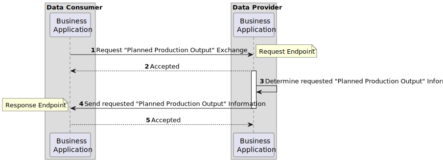
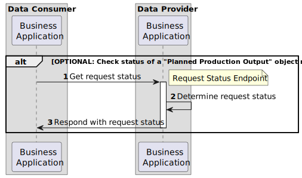
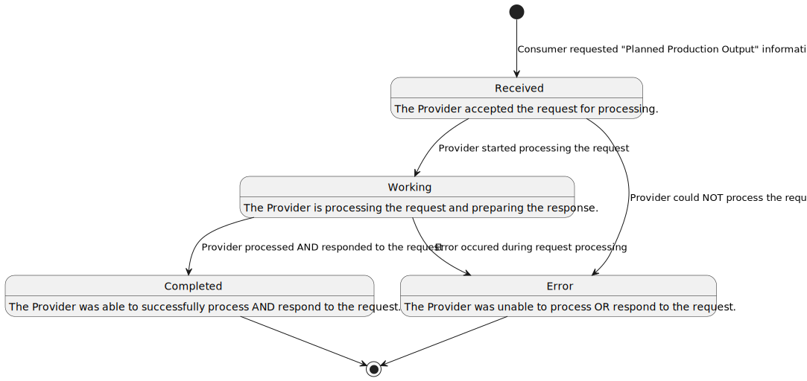

# CX-0121 Planned Production Output Exchange 1.0.0

## ABSTRACT

The supplier's *Planned Production Output* is one of the key determinants for avoiding a shortage at
the customer's site. With information about the supplier's *Planned Production Output* quantities
allocated to a specific customer, it can be monitored and predicted whether the customer demands can
be fully supplied. If this is not the case, the information can be used by the customer to derive
adequate countermeasures to keep the impact as low as possible. These measures can range, for
example, from creating an adapted production plan with the supplier, rescheduling or reducing the
customer's demand and production to, e.g. organizing an express delivery from an alternative supplier.

However, collecting the *Planned Production Output* information manually e.g. by phone or e-mail is
error prone and slow. As a result, unmet demands often remain unnoticed for too long and
unnecessarily restrict the scope for countermeasures. This often leads to shortages, costly
fire-fighting measures in the supply chain, production interruptions and ultimately to customer
dissatisfaction.

The standardization of the supplier's *Planned Production Output* semantics and exchange API enables
participants in the supply chain to share information about timebound *Planned Production Output*
quantities at a supplier's site in an interoperable manner.

## FOR WHOM IS THE STANDARD DESIGNED

## 1 INTRODUCTION

In recent years global supply chains have been significantly affected by global crises. This is
compounded by ever-increasing complexity and interdependencies. As a result small and medium-sized
enterprises as well as large enterprises are exposed to an increased risk of disruptions in their
supply chains. To adapt to short-term fluctuations and develop the right countermeasures, it is
essential to have sound information about the *Planned Production Output* of their suppliers.

This document describes and standardizes the semantic aspect model for the *Planned Production Output* as well as the associated API to exchange *Planned Production Output* information between
supply chain partners. The supplier's *Planned Production Output* is the planned quantity of a
material allocated to a specific customer in a time horizon of up to four weeks, that has not yet
been produced. It has not yet been produced and is allocated to a specific partner. The scope of
application is limited to existing business relationships and build-to-order (BTO) scenarios.
Build-to-stock (BTS) use cases with no existing business relationships are explicitly not covered.
The provided aspect model is automotive-agonistic, thus allowing the future integration and exchange
with non-automotive data spaces. In contrast to the strategic Demand and Capacity Management
standard (DCM) [[CX-0128]](#61-normative-references), the *Planned Production Output* refers to short-term production planning,
i.e. the actual utilization of existing and available capacity that resulted from capacity planning.
It shows the latest production schedule-related information for a period of up to four weeks.

### 1.1 AUDIENCE & SCOPE

> *This section is non-normative*

This standard is relevant for the following roles defined in [[CX-OMW]](#62-non-normative-references):

- **Data Providers**  willing to provide *Planned Production Output* data
- **Data Consumers**  interested in requesting and receiving *Planned Production Output* data
- **Business Application Providers** interested in providing solutions implementing this standard
- **Consulting Services Providers** interested in supporting companies fulfilling the standard

The scope of this standard is only the Planned Production Output aspect model and API. It describes
the exchange of Planned Production Output data through an IDS-compliant connector (e.g. EDC).

### 1.2 CONTEXT AND ARCHITECTURE FIT

> *This section is non-normative*

A typical order-based procurement process includes a customer who places an order and a supplier
 fulfilling it. If the ordered material is not on stock in a sufficient quantity at a supplier's
 facility (see [[CX-0122]](#61-normative-references) Item Stock Exchange) it needs to be scheduled for production. These
 quantities of scheduled production are the subject of this standard and are referred to as the
 *Planned Production Output*. To ensure that the *Planned Production Output* information will be
 interpreted, handled and exchanged in an interoperable manner between partners participating in
 Catena-X, this standard document defines the PlannedProductionOutput aspect model and the API to be
 used in the Catena-X network.

*Figure 1* shows the high-level architecture of the "Planned Production Output Exchange" in the
Catena-X dataspace and the central services that are involved. Both the data consumer and the data
provider must be members of the Catena X network in order to communicate with each other.  With the
help of centrally managed Identity Access Management (IAM) each participant can authenticate itself,
verify the identity of the requesting party and decide whether to authorize the request. The data
provisioning is based on an asynchronous exchange of request and response messages.


*Figure 1: high-level architecture of the Planned Production Output Exchange in Catena-X*

### 1.3 CONFORMANCE AND PROOF OF CONFORMITY

> *This section is non-normative*

As well as sections marked as non-normative, all authoring guidelines, diagrams, examples, and notes
in this specification are non-normative. Everything else in this specification is normative. The
keywords **MAY** , **MUST** , **MUST NOT** , **OPTIONAL** , **RECOMMENDED** , **REQUIRED** ,
**SHOULD** and **SHOULD NOT** in this document are to be interpreted as described in [BCP 14]
[RFC2119] [RFC8174] when, and only when, they appear in all capitals, as shown here.

All participants and their solutions will need to prove, that they are conform with the Catena-X
standards. To validate that the standards are applied correctly, Catena-X employs Conformity
Assessment Bodies (CABs). The proof of conformity for a single semantic model is done according to
the general rules for proving the conformity of data provided to a semantic model or the ability to
consume the corresponding data. Furthermore, participants agree to follow the normative language of
this standardization document and to implement the required API-Endpoints described in [Chapter 4](#4-application-programming-interface).

### 1.4 EXAMPLES

 The following JSON provides an example of the value-only serialization of the "PlannedProductionOutput"
 aspect model. It contains the *Planned Production Output* quantities for three consecutive days in two
 different sites (BPNS).

```json
{
   "materialGlobalAssetId":"urn:uuid:48878d48-6f1d-47f5-8ded-a441d0d879df",
   "materialNumberCustomer":"MNR-7307-AU340474.002",
   "materialNumberSupplier":"MNR-8101-ID146955.001",
   "positions":[
     {
       "lastUpdatedOnDateTime":"2023-04-01T14:23:00+01:00",
       "orderPositionReference": {
         "supplierOrderId":"M-Nbr-4711",
         "customerOrderId":"C-Nbr-4711",
         "customerOrderPositionId":"PositionId-01"
       },
       "allocatedPlannedProductionOutputs":[
         {
           "plannedProductionQuantity":{
             "value": 10,
             "unit":"unit:piece"
           },
           "productionSiteBpns":"BPNS0123456789ZZ",
           "estimatedTimeOfCompletion":"2023-04-01T14:23:00+01:00"
         },

         {
           "plannedProductionQuantity":{
             "value":20,
             "unit":"unit:piece"
           },
           "productionSiteBpns":"BPNS0123456789yZ",
           "estimatedTimeOfCompletion":"2023-04-02T14:23:00+01:00"
         },

         {
           "plannedProductionQuantity":{
             "value": 10,
             "unit":"unit:piece"
           },
           "productionSiteBpns":"BPNS0123456789ZZ",
           "estimatedTimeOfCompletion":"2023-04-03T14:23:00+01:00"
         }
       ]
     }
   ]
 }
```

### 1.5 TERMINOLOGY

> *This section is non-normative*

| **Name** | **Abrev.** | **Description** |
| --- | --- | --- |
| Allocated *Planned Production Output*  | | Quantity, site of the supplier and date with time at which production of a certain material for a certain customer is planned to be finished. |
| Aspect Model  | | A formal, machine-readable semantic description (expressed with RDF/turtle) of data accessible from an Aspect. |
| Build-to-Order | BTO | The products are manufactured based on an existing order or business relationship.  |
| Build-to-Stock | BTS | The products are manufactured without the need for an existing order or business relationship. |
| Business Partner Number | BPN | A BPN is the unique identifier of a partner within Catena-X as defined in [[CX-0010]](#61-normative-references). |
| Business Partner Number Site | BPNS | One planned and allocated production output has always one site. The site is identified by the BPNS. |
| Demand and Capacity Management | DCM | The process of determining the production capacity needed by an organization to meet changing demands for its products. In Catena-X it is represented by [[CX-0128](#61-normative-references)].  |
| Eclipse Dataspace Connector | EDC | The EDC is a reference implementation for an IDS-compliant connector, currently acting as a de-facto standard and/or reference implementation within Catena-X. |
| Supplier  | | The manufacturer or provider of a product. |
| Customer | | The recipient of products manufactured by a supplier. |
| Order | | Request from a customer towards a supplier to manufacture / supply a given quantity of a specific product in a predefined time frame. |
| Positions | | The positions refer to positions within an order of the given product for which the production outputs are transferred. The positions can be differentiated by the order position reference. If no order position reference is given, then there is only one position containing all *Planned Production Outputs* of the product. |
| Identity and Access Management | IAM | Software services that ensure the identity of technical or human users. Based on the identity, the access to sensitive information is restricted based on e.g. roles. |

*Table 1: Terminology Planned Production Output Standard*

Additional terminology used in this standard can be looked up in the glossary on the association homepage.

## 2 RELEVANT PARTS OF THE STANDARD FOR SPECIFIC USE CASES

> *This section is normative*

### 2.1 Planned Production Output Exchange

#### 2.1.1 LIST OF STANDALONE STANDARDS

The following Catena-X standards are prerequisites for the implementation of this standard and therefore
**MUST** be considered / implemented by the relevant parties specified in each of them.

| **Number** | **Standard** | **Version** |
| --- | --- | --- |
| [[CX-0001]](#61-normative-references) | EDC Discovery API | 1.0.2 |
| [[CX-0003]](#61-normative-references) | SAMM Aspect Meta Model | 1.1.0 |
| [[CX-0006]](#61-normative-references) | Registration and initial onboarding | 1.1.3 |
| [[CX-0010]](#61-normative-references) | Business Partner Number (BPN) | 2.0.0 |
| [[CX-0018]](#61-normative-references) | Eclipse Data Space Connector (EDC) | 2.1.0 |
| [[CX-0050]](#61-normative-references) | Framework Agreement Credential | 1.0.0 |

*Table 2: List of mandatory standards*

The usage of this standard may be complemented with the following Catena-X standards to further extend
the range of shortage prevention possibilities:

| **Number** | **Standard** | **Version** |
| --- | --- | --- |
| [[CX-0118]](#61-normative-references) | Delivery Information Exchange | 1.0.0 |
| [[CX-0120]](#61-normative-references) | Short-term Material Demand Exchange | 1.0.0 |
| [[CX-0122]](#61-normative-references) | Item Stock Exchange | 1.0.0 |

*Table 3: List of non-mandatory complementary standards*

#### 2.1.2 DATA REQUIRED

No additional data requirements

#### 2.1.3 ADDITIONAL REQUIREMENTS

In addition to the general Catena-X terms and conditions each data provider and data consumer **MUST**
consent to the "Predictive Unit Realtime Information Service - PURIS" framework agreement during an
onboarding process defined by the Catena-X governing body. Upon requesting data, the data consumer
**MUST** present the data provider with a proof of consent to the aforementioned framework agreement in
accordance with [[CX-0050]](#61-normative-references) Framework Agreement Credential. The data provider **MUST** verify the validity
of the presented proof before granting access to the requested data.

#### 2.1.4 DIGITAL TWINS AND SPECIFIC ASSET IDs

This version of the document does not define any requirements for standardized integration and governance
 of digital twins.

## 3 ASPECT MODEL

> *This section is normative*

### 3.1 "PLANNED PRODUCTION OUTPUT" ASPECT MODEL

#### 3.1.1 INTRODUCTION

The *Planned Production Output* defines the set of quantities of a material that will be produced for
a customer until a given point in time. For the complete semantics and detailed description of its
properties refer to the SAMM model in [Chapter 3.1.5.1](#3151-rdf-turtle).

#### 3.1.2 SPECIFICATIONS ARTIFACTS

The modeling of the semantic model specified in this document was done in accordance to the
"semantic-driven workflow" to create a submodel template specification [[SMT]](#62-non-normative-references).

This aspect model is written in SAMM 2.0.0 as a modeling language conformant to [[CX-0003]](#61-normative-references) as
input for the semantic driven workflow.

Like all Catena-X data models, this model is available in a machine-readable format on GitHub
conformant to [[CX-0003]](#61-normative-references).

#### 3.1.3 LICENSE

This Catena-X data model is made available under the terms of the Creative Commons Attribution 4.0
International (CC-BY-4.0) license, which is available at Creative Commons.

#### 3.1.4 IDENTIFIER OF SEMANTIC MODEL

The semantic model has the unique identifier

> `urn:samm:io.catenax.plannedproduction_output:1.0.0`

This identifier **MUST** be used by the data provider to define the semantics of the data being transferred.

#### 3.1.5 FORMATS OF SEMANTIC MODEL

##### 3.1.5.1 RDF TURTLE

The rdf turtle file, an instance of the Semantic Aspect Meta Model, is the master for generating additional
file formats and serializations. It can be found under the following link:

> [https://github.com/eclipse-tractusx/sldt-semantic-models/blob/main/io.catenax.planned_production_output/1.0.0/PlannedProductionOutput.ttl](https://github.com/eclipse-tractusx/sldt-semantic-models/blob/main/io.catenax.planned_production_output/1.0.0/PlannedProductionOutput.ttl)

The open source command line tool of the Eclipse Semantic Modeling Framework is used for generation of
other file formats like for example a JSON Schema, aasx for Asset Administration Shell Submodel Template
or a HTML documentation.

##### 3.1.5.2 JSON SCHEMA

A JSON Schema can be generated from the RDF Turtle file. The JSON Schema defines the Value-Only payload of the Asset Administration Shell for the API operation "*GetSubmodel*".

##### 3.1.5.3 AASX

An AASX file can be generated from the RDF Turtle file. The AASX file defines one of the requested
artifacts for a Submodel Template Specification conformant to [[SMT]](#62-non-normative-references).

## 4 APPLICATION PROGRAMMING INTERFACE

> *This section is normative*

### 4.1 "PLANNED PRODUCTION OUTPUT" API

The *Planned Production Output* API defined in this section enables the exchange of *Planned Production Output* data between Catena-X participants in an interoperable manner. *Figure 2* shows a high-level overview of the intended data exchange flow.


*Figure 2: Planned Production Output data exchange overview*

The API relies on asynchronous communication between the involved parties.

1. A data exchange is initiated by a data consumer requesting a *Planned Production Output* information.
2. Upon receiving a valid request, the data provider accepts it for further processing, thus confirming the receipt of the request.
3. The data provider determines the requested *Planned Production Output* information.
4. The data provider sends the *Planned Production Output* information to the data consumer.
5. The data consumer confirms the successful receipt of the requested *Planned Production Output* information by accepting it.

The data provider may also optionally offer an endpoint, which can be used by the data consumer to track the status of the request it made. *Figure 3* shows an overview of the steps involved in fetching the state of a previously made *Planned Production Output* request.


*Figure 3: Checking the status of a "Planned Production Output" request*

1. The data consumer requests the status of a previously made request.
2. The data provider determines the request's status.
3. The data provider responds instantly informing the data consumer about the request's status.

The lifecycle of a *Planned Production Output* request is defined by the set of states shown in *Figure 4*.


*Figure 4: States of a "Planned Production Output" request*

#### 4.1.1 PRECONDITIONS AND DEPENDENCIES

To use this standard the participants **MUST** have an existing business relationship that defines demand
and supply relationship.

Each partner **MUST** be registered and onboarded to Catena-X [CX-006](#61-normative-references). To participate in the Catena-X
dataspace, the Eclipse Data Space Connector **MUST** be used to make the API available [CX-0018](#61-normative-references)

#### 4.1.2 API SPECIFICATION

##### 4.1.2.1 API ENDPOINTS & RESOURCES

Catena-X participants interested in exchanging *Planned Production Output* information **MUST** implement
the endpoints as defined in the table below based on their role in the data exchange process.

> Note: Expressions in double curly braces \{\{\}\} must be substituted with a corresponding value.

| **Role** | **Endpoint** | **Route** | **REQUIRED** | **HTTP Method** | **Purpose** |
| --- | --- | --- | --- | --- | --- |
| Provider | Request Endpoint | `{{PLANNED-PRODUCTION-OUTPUT-REQUEST-ENDPOINT}}` | Yes | **POST** | This endpoint receives the "Planned Production Output Requests" from a consumer. |
| Consumer | Response Endpoint | `{{PLANNED-PRODUCTION-OUTPUT-RESPONSE-ENDPOINT}}` | Yes | **POST** | This endpoint receives the "Planned Production Output Responses" to the consumer's requests. |
| Provider | Request Status Endpoint | `{{PLANNED-PRODUCTION-OUTPUT-REQUEST-STATUS-ENDPOINT}}` | No | **POST** | This endpoint allows the consumer to **OPTIONALLY** check the current status of a "Planned Production Output Request" it already made. |

*Table 4:  Roles in Planned Production Output data exchange process*

##### 4.1.2.2 PLANNED PRODUCTION OUTPUT REQUEST

When sending a request to the "Planned Production Output Request Endpoint", the body **MUST** be
composed out of two json obects: a `header` object according to the shared aspect model `MessageHeader`
and a `content` object. Together they form the HTTP body that **MUST** be formated as
JSON.

###### Request Header

> Note: This is not the HTTP Header but rather part of the HTTP Body.

The following table lists all fields of the header and how they are used.

| **Field** | **REQUIRED** | **Purpose** | **Datatype** | **Example value** |
| --- | --- | --- | --- | --- |
| messageId | Yes | Unique ID identifying the message.The purpose of the ID is to uniquely identify a single message, therefore it **MUST NOT** be reused. | UUID v4 [RFC4122] | `48878d48-6f1d-47f5-8ded-a441d0d879df` |
| relatedMessageId | No | For the "Planned Production Output Request" this information **SHOULD NOT** be set. | UUID v4 [RFC4122] | `d42f9090-9d48-46c8-aad0-73392366a273` |
| context | Yes | Information about the context that the message should be considered in. The value **MUST** consist of two parts: constant of a given endpoint `RES-PURIS-PlannedProductionOutputRequest:` followed by the version number `1.0` | URI | `RES-PURIS-PlannedProductionOutputRequest:1.0` |
| version | Yes | This field **MUST** specify the namespace and version of the `MessageHeader` aspect model that has been used to create the message header. | Namespace and version of the shared aspect model `MessageHeader` | `urn:samm:io.catenax.message_header:2.0` |
| senderBpn | Yes | The business partner number (BPNL/S) of the requesting party. | BPN according to [[CX-0010]](#61-normative-references) | `BPNS0123456789ZZ` |
| receiverBpn | Yes | The business partner number (BPNL/S) of the receiving party. | BPN according to [[CX-0010]](#61-normative-references) | `BPNS0123456789YY` |
| sentDateTime | Yes | The date and time including time zone offset on which the request has been created. | [[ISO8601]](#61-normative-references) with time zone | `2023-04-25T10:54:12+00:00` |

*Table 5: Planned Production Output message header*

The following JSON object gives an example of a valid `header`:

```json
"header":{
   "messageId":"48878d48-6f1d-47f5-8ded-a441d0d879df",
   "context":"RES-PURIS-PlannedProductionOutputRequest:1.0",
   "version":"urn:samm:io.catenax.message_header:2.0",
   "senderBpn":"BPNS0123456789ZZ",
   "receiverBpn":"BPNS2345678910YY",
   "sentDateTime":"2023-04-25T10:54:12+00:00"
}
```

###### Request Content

The content consists of a single `plannedProductionOutput` object containing the list of material numbers
for which the consumer would like to receive the *Planned Production Output* information.
Each material is described by the following fields:

| **Field** | **REQUIRED** | **Purpose** | **Datatype** | **Example value** |
| --- | --- | --- | --- | --- |
| materialNumberCustomer | Yes | The material number given by the customer **MUST** unambiguously identify the material on customer side. It **SHOULD** be used by the supplier to identify the requested material. | String | `MNR-7307-AU340474.001` |
| materialNumberSupplier | No | The material number given by the supplier **MUST** unambiguously identify the material on supplier side. Material number given by the supplier **MAY** be used by the supplier to identify the material in case the `materialNumberCustomer` is not known by the supplier. | String | `MNR-8101-ID146955.001` |
| materialGlobalAssetId | No | The material number given by the Catena-X network **MUST** unambiguously identify the material in the Catena-X network and **MAY** be used to identify the digital twin of the material. This number **MAY** be used instead of the `materialNumberCustomer` or the `materialNumberSupplier` to identify the material when consumer and provider both know the digital twin of the material | UUID v4 | `urn:uuid:055c1128-0375-47c8-98de-7cf802c3241d` |

*Table 6: Planned Production Output request content*

The following JSON object gives an example of a valid `content`:

```json
"content":{
   "plannedProductionOutput":[
      {
         "materialNumberCustomer":"MNR-7307-AU340474.001",
         "materialNumberSupplier":"MNR-8101-ID146955.001",
         "materialGlobalAssetId":"urn:uuid:055c1128-0375-47c8-98de-7cf802c3241d"
      },
      {
         "materialNumberCustomer":"MNR-7307-AU340474.002"
      }
   ]
}
```

###### Request Example

The following snippet shows an example consisting of both the `header` and the `content` for a given
"*Planned Production Output* Request API" request.

```json
{
   "header":{
      "messageId":"48878d48-6f1d-47f5-8ded-a441d0d879df",
      "context":"RES-PURIS-PlannedProductionOutputRequest:1.0",
      "version":"urn:samm:io.catenax.message_header:2.0",
      "senderBpn":"BPNS0123456789ZZ",
      "receiverBpn":"BPNS2345678910YY",
      "sentDateTime":"2023-04-25T10:54:12+00:00"
   },
   "content":{
      "plannedProductionOutput":[
         {
            "materialNumberCustomer":"MNR-7307-AU340474.001",
            "materialNumberSupplier":"MNR-8101-ID146955.001",
            "materialGlobalAssetId":"urn:uuid:055c1128-0375-47c8-98de-7cf802c3241d"
         },
         {
            "materialNumberCustomer":"MNR-7307-AU340474.002"
         }
      ]
   }
}
```

###### Responding to a "Planned Production Output Request"

The consumer **MUST** respond with one of the HTTP status codes defined in the corresponding section
of [Chapter 4.1.4](#414-error-handling).

The response **MUST** be JSON formatted and **MUST** contain only the `messageId` field specifying
the ID of the message received. The value **MUST** therefore be also equal to the `relatedMessageId`
value contained in the `header` of the "Planned Production Output Response" described in [Chapter 4.1.2.3](#4123-planned-production-output-response).

The following JSON object gives an example of a valid response:

```json
{
   "messageId":"48878d48-6f1d-47f5-8ded-a441d0d879df"
}
```

##### 4.1.2.3 PLANNED PRODUCTION OUTPUT RESPONSE

When provisioning data to the "Planned Production Output Response Endpoint", the body **MUST** be composed
out of two json objects: a `header` object according to the shared aspect model `MessageHeader` and a `content`
object. Together they form the HTTP body that **MUST** be formatted as JSON.

###### Response Header

> Note: This is not the HTTP Header but rather part of the HTTP Body.

The following table lists all fields of the message header and how they are used.

| **Field** | **REQUIRED** | **Purpose** | **Datatype** | **Example value** |
| --- | --- | --- | --- | --- |
| messageId | Yes | Unique ID identifying the message.The purpose of the ID is to uniquely identify a single message, therefore it **MUST NOT** be reused. | UUID v4 | `68d220ea-a3af-4df7-a8b2-8f755c888469` |
| relatedMessageId | Yes | For the "Planned Production Output Response" this information **MUST** be set to the `messageId` of the corresponding "Planned Production Output Request" received. | UUID v4 | `48878d48-6f1d-47f5-8ded-a441d0d879df` |
| context | Yes | Information about the context that the message should be considered in. The value **MUST** consist of two parts: constant of a given endpoint `RES-PURIS-PlannedProductionOutputResponse:` followed by the version number `1.0` | URI | `RES-PURIS-PlannedProductionOutputResponse:1.0` |
| version | Yes | This field **MUST** specify the namespace and version of the `MessageHeader` aspect model that has been used to create the message header. | Namespace and version of the shared aspect model `MessageHeader` | `urn:samm:io.catenax.message_header:2.0` |
| senderBpn | Yes | The business partner number (BPNL/S) of the responding party. | BPN according to [[CX-0010]](#61-normative-references) | `BPNS0123456789ZZ` |
| receiverBpn | Yes | The business partner number (BPNL/S) of the receiving party. | BPN according to [[CX-0010]](#61-normative-references) | `BPNS0123456789YY` |
| sentDateTime | Yes | The date and time including time zone offset on which the request has been created. | [[ISO8601]](#61-normative-references) with time zone | `2023-04-25T10:54:12+00:00` |

*Table 7: Planned Production Output response header*

The following JSON object gives an example of a valid `header`:

```json
"header":{
   "messageId":"68d220ea-a3af-4df7-a8b2-8f755c888469",
   "relatedMessageId":"48878d48-6f1d-47f5-8ded-a441d0d879df",
   "context":"RES-PURIS-PlannedProductionOutputResponse:1.0",
   "version":"urn:samm:io.catenax.message_header:2.0",
   "senderBpn":"BPNS2345678910YY",
   "receiverBpn":"BPNS0123456789ZZ",
   "sentDateTime":"2023-04-25T10:54:12+00:00"
}
```

###### Response Content

The content **MUST** consist of a single `plannedProductionOutput` object containing a list of *Planned Production Outputs*.
Each Planned Production Output  **MUST**  be built according to the *PlannedProductionOutput* SAMM model defined in
[Chapter 3.1](#31-planned-production-output-aspect-model). An example content for a single *Planned Production Output* is given below.

```json
"content": {
    "plannedProductionOutput": [
    {
    "positions": [
        {
        "lastUpdatedOnDateTime": "2023-04-01T14:23:00+01:00",
        "orderPositionReference": {
            "supplierOrderId":"M-Nbr-4711",
            "customerOrderId":"C-Nbr-4711",
            "customerOrderPositionId":"PositionId-01"
        },
        "allocatedPlannedProductionOutputs":[
            {
            "plannedProductionQuantity": {
                "value": 20,
                "unit":"unit:piece"
            },
            "productionSiteBpns":"BPNS0123456789ZZ",
            "estimatedTimeOfCompletion":"2023-04-01T14:23:00+01:00"
            }
        ]
        }
    ],
    "materialGlobalAssetId":"urn:uuid:48878d48-6f1d-47f5-8ded-a441d0d879df",
    "materialNumberCustomer":"MNR-7307-AU340474.002",
    "materialNumberSupplier":"MNR-8101-ID146955.001"
    } ]
}
```

###### Response Example

The following snippet shows an example consisting of both, the `header` and the `content` object
for a given "Planned Production Output Response API" request.

```json
{
   "header":{
      "messageId":"68d220ea-a3af-4df7-a8b2-8f755c888469",
      "relatedMessageId":"48878d48-6f1d-47f5-8ded-a441d0d879df",
      "context":"RES-PURIS-PlannedProductionOutputResponse:1.0",
      "version":"urn:samm:io.catenax.message_header:2.0",
      "senderBpn":"BPNS2345678910YY",
      "receiverBpn":"BPNS0123456789ZZ",
      "sentDateTime":"2023-04-25T10:54:12+00:00"
   },
   "content":{
      "plannedProductionOutput":[
         {
            "positions":[
               {
                  "lastUpdatedOnDateTime":"2023-04-01T14:23:00+01:00",
                  "orderPositionReference":{
                     "supplierOrderId":"M-Nbr-4711",
                     "customerOrderId":"C-Nbr-4711",
                     "customerOrderPositionId":"PositionId-01"
                  },
                  "allocatedPlannedProductionOutputs":[
                     {
                        "plannedProductionQuantity":{
                           "value":20,
                           "unit":"unit:piece"
                        },
                        "productionSiteBpns":"BPNS0123456789ZZ",
                        "estimatedTimeOfCompletion":"2023-04-01T14:23:00+01:00"
                     }
                  ]
               }
            ],
            "materialGlobalAssetId":"urn:uuid:48878d48-6f1d-47f5-8ded-a441d0d879df",
            "materialNumberCustomer":"MNR-7307-AU340474.002",
            "materialNumberSupplier":"MNR-8101-ID146955.001"
         }
      ]
   }
}
```

###### Responding to a "Planned Production Output Response"

The consumer **MUST** respond with one of the HTTP status codes defined in the corresponding section
of [Chapter 4.1.4](#414-error-handling).

The response **MUST** be JSON formatted and **MUST** contain only the `messageId` field specifying the ID
of the message received. The value **MUST** therefore be also equal to the `messageId` value contained
in the `header` of the "Planned Production Output Response" described in [Chapter 4.1.2.3](#4123-planned-production-output-response).

The following JSON object gives an example of a valid response:

```json
{
   "messageId":"68d220ea-a3af-4df7-a8b2-8f755c888469"
}
```

##### 4.1.2.4 PLANNED PRODUCTION REQUEST STATUS

When sending a request to the "Planned Production Output Request Status Endpoint", the body **MUST**
be composed out of two json objects: a `header` object according to the shared aspect model `MessageHeader`
and a `content` object. Together they form the HTTP body that **MUST** be formatted as JSON.

###### Request Header

> Note: This is not the HTTP Header but rather part of the HTTP Body.

| **Field** | **REQUIRED** | **Purpose** | **Datatype** | **Example value** |
| --- | --- | --- | --- | --- |
| messageId | Yes | Unique ID identifying the message.The purpose of the ID is to uniquely identify a single message, therefore it **MUST NOT** be reused. | UUID v4 | `900b6489-0ae9-4945-b464-5bd65a7d8023` |
| relatedMessageId | Yes | Unique ID identifying the planned production output message sent before. | UUID v4 | `48878d48-6f1d-47f5-8ded-a441d0d879df` |
| context | Yes | Information about the context that the message should be considered in. The value **MUST** consist of two parts: constant of a given endpoint `RES-PURIS-PlannedProductionOutputRequestStatus:` followed by the version number `1.0` | URI | `RES-PURIS-PlannedProductionOutputRequestStatus:1.0` |
| version | Yes | This field **MUST** specify the namespace and version of the `MessageHeader` aspect model that has been used to create the message header. | Namespace and version of the shared aspect model `MessageHeader` | `urn:samm:io.catenax.message_header:2.0` |
| senderBpn | Yes | The business partner number (BPNL/S) of the requesting party. | BPN according to [[CX-0010]](#61-normative-references) | `BPNS0123456789ZZ` |
| receiverBpn | Yes | The business partner number (BPNL/S) of the receiving party. | BPN according to [[CX-0010]](#61-normative-references) | `BPNS0123456789YY` |
| sentDateTime | Yes | The date and time including time zone offset on which the request has been created. | [[ISO8601]](#61-normative-references) with time zone | `2023-04-25T10:54:12+00:00` |

*Table 8: Planned Production Output request status header*

The following JSON object gives an example of a valid `header`:

```json
"header":{
   "messageId":"900b6489-0ae9-4945-b464-5bd65a7d8023",
   "relatedMessageId":"48878d48-6f1d-47f5-8ded-a441d0d879df",
   "context":"RES-PURIS-PlannedProductionOutputRequestStatus:1.0",
   "version":"urn:samm:io.catenax.message_header:2.0",
   "senderBpn":"BPNS0123456789ZZ",
   "receiverBpn":"BPNS2345678910YY",
   "sentDateTime":"2023-04-25T10:54:12+00:00"
}
```

###### Request Content

The content **MUST** be an empty object.

The following JSON object gives an example of a valid `content`:

```json
"content": {
 
}
```

###### Request Example

The following snippet shows an example consisting of both, the `header` and the `content` for a given
"Planned Production Output Request Status API" request.

```json
{    
   "header":{
       "messageId":"900b6489-0ae9-4945-b464-5bd65a7d8023",
       "relatedMessageId":"48878d48-6f1d-47f5-8ded-a441d0d879df",
       "context":"RES-PURIS-PlannedProductionOutputRequestStatus:0.0",
       "version":"urn:samm:io.catenax.message_header:2.0",
       "senderBpn":"BPNS0123456789ZZ",
       "receiverBpn":"BPNS2345678910YY",
       "sentDateTime":"2023-04-25T10:54:12+00:00"
    },
   "content":{
       
   }
}
```

###### Responding to a "Planned Production Output Status Request"

The provider **MUST** respond with one of the HTTP status codes defined in the corresponding section
of [Chapter 4.1.4](#414-error-handling).

The response **MUST** be JSON formatted and **MUST** contain the following fields:

- `messageId`: the ID of the "Planned Production Output Request", for which one would like to know the current status
- `requestState`: the current state of the request on provider side

The following table contains the list of valid request states and their meaning.

| **State** | **Meaning** |
| --- | --- |
| `Received`  | The provider accepted the request for processing.  |
| `Working`  | The provider is processing the request and preparing the response.  |
| `Completed`  | The provider was able to successfully process AND respond to the request. |
| `Error` | The provider was unable to process OR respond to the request. |

*Table 9: Planned Production Output valid request states*

More information about the different states and the transitions between them is provided in the beginning
of [Chapter 4.1](#41-planned-production-output-api).

The following JSON object gives an example of a valid response:

```json
{
  "messageId":"48878d48-6f1d-47f5-8ded-a441d0d879df",
  "requestState":"Working"
}
```

##### 4.1.2.5 AVAILABLE DATA TYPES

The API **MUST** use JSON as the payload transported via HTTPS. More information on the data objects
supported by the endpoints is provided in the corresponding sections of [Chapter 4.1.2](#412-api-specification).

#### 4.1.3 EDC DATA ASSET STRUCTURE

The endpoints introduced in [Chapter 4.1.2](#412-api-specification) **MUST NOT** be directly called
from a provider or from a consumer. Rather, these **MUST** be called via an IDS-compliant
connector (e.g. EDC). Therefore, the endpoints **MUST** be offered as EDC data assets. To make these
assets easily identifiable in the connector's catalog, each asset **MUST** be configured with a set
of properties as described in the corresponding sections below.

The following table provides an overview of the EDC data assets that the parties **MUST** offer to be
able to provision and/or consume *Planned Production Output* data.

| **Party** | **REQUIRED** | **Asset** | **Purpose** |
| --- | --- | --- | --- |
| Provider | Yes | Planned Production Output Request | Allows a consumer to request *"Planned Production Output"* information. |
| Provider | No | Planned Production Output Request Status | Allows a consumer to check the status of an already sent *"Planned Production Output"* request. |
| Consumer | Yes | Planned Production Output Response | Allows a consumer to receive the *"Planned Production Output"* information. |

*Table 10: EDC data assets*

##### EDC Data Asset Structure for "Planned Production Output Request API"

To receive "*Planned Production Output* Requests", the provider **MUST** register an EDC data asset
specifying the address of the "Planned Production Output Request Endpoint" described in [Chapter 4.1.2](#412-api-specification).

The data asset **MUST** be configured with the set of properties as defined in the table below.

| **Property** | **Purpose** | **Usage & Constraints** |
| --- | --- | --- |
| ***@type*** | Defines the asset type. | The asset **MUST** be set to `Asset`. |
| ***@id*** | Identifier of the asset | The asset ID **MUST** be unique and therefore **MUST NOT** be reused elsewhere. |
| properties.**dct:type** | Defines the "Planned Production Output Request API Endpoint" according to the Catena-X taxonomy. | **MUST** be set to `{"@id": "https://w3id.org/catenax/taxonomy#PlannedProductionOutputRequestApi"}` to allow filtering the data assets catalog for the respective "Planned Production Output Request API". |
| properties.**asset:prop:type** | Defines the "Planned Production Output Request API Endpoint" for filtering purposes. | **MUST** be set to `data.res.plannedProductionOutputRequestApi` to allow filtering the data assets catalog for the respective "Planned Production Output Stock Request API". |
| properties.**cx-common:version** | The version of the standard defining the implemented API | **MUST** correspond to the version of the standard defining the "Planned Production Output Exchange API". The value **MUST** be set to `1.0` for APIs implementing this standard. |
| dataAddress.properties.**@type** | Type of the DataAddress node. | **MUST** be set to `DataAddress`. |
| dataAddress.properties.***baseUrl*** | Defines the HTTPS endpoint of the corresponding "Planned Production Output Request API Endpoint". | The `{{PLANNED_PRODUCTION_OUTPUT_REQUEST_ENDPOINT}}` refers to an URL under which the API endpoint is available. HTTPS transport protocol **MUST** be used. |
| dataAddress.properties.***proxyBody*** | Defines whether the endpoint allows to proxy the HTTPS body | **MUST** be set to `true` to allow the API endpoint to receive a HTTPS body via the HTTPS request. |
| dataAddress.properties.***proxyMethod*** | Defines whether the endpoint allows to proxy the HTTPS method | **MUST** be set to `true` to allow the API endpoint to also receive POST requests. |
| dataAddress.properties.***type*** | Defines the type of data plane extension handling the data exchange | **MUST** be set to `HttpData` to provide an API via an HTTPS proxy endpoint. |

*Table 11: EDC data assets request properties*

When searching the data assets catalog of a provider, a consumer **MUST** use the following combination
of properties AND their values to identify the data asset specifying the "Planned Production Output Request"
Endpoint described in [Chapter 4.1.2](http://confluence.catena-x.net/#412-api-specification).

| **Property** | **Value** |
| --- | --- |
| properties.***asset:prop:type*** | `data.res.plannedProductionOutputRequestApi` |
| properties.***cx-common:version*** | `1.0` |

*Table 12: EDC data assets request properties values*

Because the data asset reflects the existing contractual relationship between a customer and its suppliers,
only one data asset with the aforementioned combination of properties AND their values **MUST** be visible
to the consumer at any time to avoid ambiguity.

An example EDC Data Asset definition is given below.

> Note: Expressions in double curly braces \{\{\}\} must be substituted with a corresponding value.

```json
{
    "@context":{
        "@vocab":"<https://w3id.org/edc/v0.0.1/ns/>",
        "cx-taxo":"<https://w3id.org/catenax/taxonomy#>",
        "cx-common":"<https://w3id.org/catenax/ontology/common#>",
        "dct":"<https://purl.org/dc/terms/>"
    },
    "@type":"Asset",
    "@id":"{{PLANNED_PRODUCTION_OUTPUT_REQUEST_API_ASSET_ID}}",
    "properties":{
        "dct:type":{
            "@id":"cx-taxo:PlannedProductionOutputRequestApi"
        },
        "asset:prop:type": "data.res.plannedProductionOutputRequestApi",
        "cx-common:version":"1.0",
        "description":"Planned Production Output Request API"
    },
    "dataAddress":{
        "@type":"DataAddress",
        "type":"HttpData",
        "proxyBody":"true",
        "proxyMethod":"true",
        "baseUrl":"{{PLANNED_PRODUCTION_OUTPUT_REQUEST_API_ENDPOINT}}"
    }
}
```

##### EDC Data Asset Structure for "Planned Production Output Request Status API"

In order to receive "Planned Production Output Requests", the provider **MAY** register an EDC data
asset specifying the address of the "Planned Production Output Endpoint" described in [Chapter 4.1.2](#412-api-specification).

The data asset **MUST** be configured with the set of properties as defined in the table below.

| **Property** | **Purpose** | **Usage & Constraints** |
| --- | --- | --- |
| ***@type*** | Defines the asset type. | The asset **MUST** be set to `Asset`. |
| ***@id*** | Identifier of the asset | The asset ID **MUST** be unique and therefore **MUST NOT** be reused elsewhere. |
| properties.**dct:type** | Defines the "Planned Production Output Request Status API Endpoint" according to the Catena-X taxonomy. | **MUST** be set to `{"@id": "https://w3id.org/catenax/taxonomy#PlannedProductionOutputRequestStatusApi"}` to allow filtering the data assets catalog for the respective "Planned Production Output Request Status API". |
| properties.**asset:prop:type** | Defines the "Planned Production Output Request Status API Endpoint" for filtering purposes. | **MUST** be set to `data.res.plannedProductionOutputRequestStatusApi` to allow filtering the data assets catalog for the respective "Planned Production Output Stock Request Status API". |
| properties.**cx-common:version** | The version of the standard defining the implemented API | **MUST** correspond to the version of the standard defining the "Planned Production Output Exchange API". The value **MUST** be set to `1.0` for APIs implementing this standard. |
| dataAddress.properties.**@type** | Type of the DataAddress node. | **MUST** be set to `DataAddress`. |
| dataAddress.properties. ***baseUrl*** | Defines the HTTPS endpoint of the corresponding "Planned Production Output Request Status API Endpoint". | The `{{PLANNED_PRODUCTION_OUTPUT_REQUEST_STATUS_ENDPOINT}}` refers to an URL under which the API endpoint is available. HTTPS transport protocol **MUST** be used. |
| dataAddress.properties.***proxyBody*** | Defines whether the endpoint allows to proxy the HTTPS body | **MUST** be set to `true` to allow the API endpoint to receive a HTTPS body via the HTTPS request. |
| dataAddress.properties.***proxyMethod*** | Defines whether the endpoint allows to proxy the HTTPS method | **MUST** be set to `true` to allow the API endpoint to also receive POST requests. |
| dataAddress.properties.***type*** | Defines the type of data plane extension handling the data exchange | **MUST** be set to `HttpData` to provide an API via an HTTPS proxy endpoint. |

*Table 13: EDC data assets request status properties*

When searching the data assets catalog of a provider, a consumer **MUST** use the following combination
of properties AND their values to identify the data asset specifying the"Planned Production Output Request Status Endpoint"
described in [Chapter 4.1.2](#412-api-specification).

| **Property** | **Value** |
| --- | --- |
| properties.***asset:prop:type*** | `data.res.plannedProductionOutputRequestStatusApi` |
| properties.***cx-common:version*** | `1.0` |

*Table 14: EDC data assets request status properties values*

Because the data asset reflects the existing contractual relationship between a customer and its suppliers, only one data asset with the aforementioned combination of properties AND their values **MUST** be visible to the consumer at any time to avoid ambiguity.

An example EDC Data Asset definition is given below.

> Note: Expressions in double curly braces \{\{\}\} must be substituted with a corresponding value.

```json
{
    "@context":{
        "@vocab":"https://w3id.org/edc/v0.0.1/ns/",
        "cx-taxo":"https://w3id.org/catenax/taxonomy#",
        "cx-common":"https://w3id.org/catenax/ontology/common#",
        "dct":"https://purl.org/dc/terms/"
    },
    "@type":"Asset",
    "@id":"{{PLANNED_PRODUCTION_OUTPUT_REQUEST_STATUS_API_ASSET_ID}}",                         
    "properties":{
        "dct:type":{
            "@id":"cx-taxo:PlannedProductionOutputRequestStatusApi"                                
        },
        "asset:prop:type": "data.res.plannedProductionOutputRequestStatusApi",
        "cx-common:version":"1.0",                                                  
        "description":"Planned Production Output Request Status API"                            
    },
    "dataAddress":{
        "@type":"DataAddress",
        "type":"HttpData",
        "proxyBody":"true",
        "proxyMethod":"true",
        "baseUrl":"{{PLANNED_PRODUCTION_OUTPUT_REQUEST_STATUS_API_ENDPOINT}}"                  
    }
}
```

##### EDC Data Asset Structure for "Planned Production Output Response API"

In order to receive the *Planned Production Output* data it requsted, the consumer **MUST** register
an EDC data asset specifying the address of the "Planned Production OutputResponse Endpoint" described
in [Chapter 4.1.2](#412-api-specification).

This asset **MUST** be configured with the set of properties as defined in the table below.

| **Property** | **Purpose** | **Usage & Constraints** |
| --- | --- | --- |
| ***@type*** | Defines the asset type. | The asset **MUST** be set to "Asset". |
| ***@id*** | Identifier of the asset | The asset ID **MUST** be unique and therefore **MUST NOT** be reused elsewhere. |
| properties.**dct:type** | Defines the "Planned Production Output Response API Endpoint" according to the Catena-X taxonomy. | **MUST** be set to `{"@id": "https://w3id.org/catenax/taxonomy#PlannedProductionOutputResonseApi"}` to allow filtering the data assets catalog for the respective "Planned Production Output Response API". |
| properties.**asset:prop:type** | Defines the "Planned Production Output Response API Endpoint" for filtering purposes. | **MUST** be set to `data.res.plannedProductionOutputResponseApi` to allow filtering the data assets catalog for the respective "Planned Production Output Stock Response API". |
| properties.**cx-common:version** | The version of the standard defining the implemented API | **MUST** correspond to the version of the standard defining the "Planned Production Output Exchange API". The value **MUST** be set to `1.0` for APIs implementing this standard. |
| dataAddress.properties.**@type** | Type of the DataAddress node. | **MUST** be set to `DataAddress`. |
| dataAddress.properties.***baseUrl*** | Defines the HTTPS endpoint of the corresponding "Planned Production Output Response API Endpoint". | The `{{PLANNED_PRODUCTION_OUTPUT_RESPONSE_ENDPOINT}}` refers to an URL under which the API endpoint is available. HTTPS transport protocol **MUST** be used. |
| dataAddress.properties.***proxyBody*** | Defines whether the endpoint allows to proxy the HTTPS body | **MUST** be set to `true` to allow the API endpoint to receive a HTTPS body via the HTTPS request. |
| dataAddress.properties.***proxyMethod*** | Defines whether the endpoint allows to proxy the HTTPS method | **MUST** be set to `true` to allow the API endpoint to also receive POST requests. |
| dataAddress.properties.***type*** | Defines the type of data plane extension handling the data exchange | **MUST** be set to `HttpData` to provide an API via an HTTPS proxy endpoint. |

*Table 15: EDC data assets response properties*

When searching the data assets catalog of a provider, a consumer **MUST** use the following combination
of properties AND their values to identify the data asset specifying the "Planned Production Output Response Endpoint"
described in [Chapter 4.1.2](#412-api-specification).

| **Property** | **Value** |
| --- | --- |
| properties.***asset:prop:type*** | `data.res.plannedProductionOutputResponseApi` |
| properties.***cx-common:version*** | `1.0` |

*Table 16: EDC data assets response properties values*

Because the asset reflects the existing contractual relationship between a customer and its suppliers,
only one asset with the aforementioned combination of properties AND their values **MUST** be visible
to the provider at any time to avoid ambiguity.

An example EDC Data Asset definition is given below.

> Note: Expressions in double curly braces \{\{\}\} must be substituted with a corresponding value.

```json
{
    "@context":{
        "@vocab":"https://w3id.org/edc/v0.0.1/ns/",
        "cx-taxo":"https://w3id.org/catenax/taxonomy#",
        "cx-common":"https://w3id.org/catenax/ontology/common#",
        "dct":"https://purl.org/dc/terms/"
    },
    "@type":"Asset",
    "@id":"{{PLANNED_PRODUCTION_OUTPUT_RESPONSE_API_ASSET_ID}}",                                   
    "properties":{
        "dct:type":{
            "@id":"cx-taxo:PlannedProductionOutputResponseApi"                                 
        },
        "asset:prop:type": "data.res.plannedProductionOutputResponseApi",
        "cx-common:version":"1.0",                                                        
        "description":"Planned Production Output Response API"                              
    },
    "dataAddress":{
        "@type":"DataAddress",
        "type":"HttpData",
        "proxyBody":"true",
        "proxyMethod":"true",
        "baseUrl":"{{PLANNED_PRODUCTION_OUTPUT_RESPONSE_API_ENDPOINT}}"                        
    }
}
```

#### 4.1.4 ERROR HANDLING

Every API endpoint defined in [[Chapter 4.1.2]](#412-api-specification) **MUST** respond to incoming
requests with HTTP status codes as described in [[RFC9110]](#62-non-normative-references). The status
codes for each endpoint are defined in the following sections.

##### HTTP Codes for Planned Production Output Request Endpoint

| **Status Code** | **Description** | **Usage** |
| --- | --- | --- |
| 202 | Planned Production Output request was accepted | When the request had been accepted by the provider, the latter **MUST** respond with status code 202 |
| 400 | Request body malformed | When the request BODY is not matching the API description, the provider **MUST** respond with error code 400 |
| 401 | Not authorized | When the authorization of the request fails, the provider **MUST** respond with error code 401 |
| 404 | Endpoint not found | When the HTTP path is not available, the provider **MUST** respond with error code 404 |
| 405 | Method not allowed | In case the HTTP method used is not a POST, the provider **MUST** respond with error code 405 |
| 422 | A request with the same message ID already exists | When the message ID (`header.messageId`) was already used for another request |

*Table 17: request error handling*

##### HTTP Codes for Planned Production Output Response Endpoint

| **Status Code** | **Description** | **Usage** |
| --- | --- | --- |
| 202 | Planned Production Output response was accepted | When the received Planned Production Output data is accepted by the consumer, it **MUST** respond with status code 202 |
| 400 | Response body malformed | When the HTTP Body is not matching the API description, the consumer **MUST** respond with error code 400 |
| 401 | Not authorized | When the authorization of the response fails, the consumer **MUST** respond with error code 401 |
| 404 | Endpoint not found | When the HTTP path is not available, the consumer **MUST** respond with error code 404 |
| 405 | Method not allowed | In case the HTTP method used is not a POST, the provider **MUST** respond with error code 405 |
| 422 | The message ID does not match any open request | When the message ID (`header.messageId`) does not match the ID of any open request, the consumer **MUST** respond with error code 422 |

*Table 18: response error handling*

##### HTTP Codes for Planned Production Output Request Status Endpoint

| **Status Code** | **Description** | **Usage** |
| --- | --- | --- |
| 200 | Planned Production Output status request was successful | When the request was successful, the provider **MUST** respond with status code 200 |
| 400 | Request body malformed | When the request BODY is not matching the API description, the provider **MUST** respond with error code 400 |
| 401 | Not authorized | When the authorization of the request fails, the provider **MUST** respond with error code 401 |
| 404 | Endpoint not found | When the HTTP path is not available, the provider **MUST** respond with error code 404 |
| 405 | Method not allowed | In case the HTTP method used is not a POST, the provider **MUST** respond with error code 405 |
| 422 | The message ID is not known | When the message ID (`header.messageId`) does not match the ID of any known request, the provider **MUST** respond with error code 422 |

*Table 19: request status error handling*

## 5 PROCESSES

> *This section is normative*

The processes described are intended to serve as guidance and recommendation for the use of the
"*Planned Production Output Exchange*" standard in different scenarios. In the field a combination
of several scenarios is common practice. This process description does not claim to be exhaustive,
but rather is intended to support the involved parties in finding beneficial and legally acceptable
solutions.

### 5.1 ACTORS AND ROLES

The following actors and roles occur in the described processes.

| **Actors** | **Role** | **Description** |
| --- | --- | --- |
| **Customer** | The customer acts as the data consumer in this standard. | A business partner that procures items from suppliers and requests information about their planned production output.  |
| **Supplier** | The supplier acts as the data provider in this standard. | A business partner that supplies items to customers. As such, a supplier is responsible for providing consistent and up-to-date Planned Production Output data.  |

*Table 20: actors and roles*

### 5.2 PROCESS REPRESENTATIONS

**5.2.1 SINGLE CUSTOMER SCENARIO**

The most straightforward process is described as a relationship between one supplier and one
customer where an item is specifically planned and produced for the customer. There are no third
party customers that procure the same material from the supplier.

The production output is planned by the supplier on a daily basis so that this data **SHOULD** be
provided without further adaptions to the customer. Also having multiple customers may be handled as
a single customer scenario, if customer-specific material numbers are used for the production
planning in the internal systems of the supplier. An example where the total *Planned Production Output*
is allocated to a single customer is shown in the table below:

| | **Day 1** | **Day 2** | **Day 3** | **Sum** |
| --- | --- | --- | --- | --- |
| **Total Planned Production Output** | 15 | 15 | 20 | 50 |
| **Allocated to Customer A** | 15 | 15 | 20 | 50 |

*Table 21: Planned Production Output for a single customer scenario*

#### 5.2.2 MULTIPLE CUSTOMER SCENARIO

To have multiple customers for a specific item as a supplier is a scenario that requires a proper
adjustment of the *Planned Production Output* data provided by the supplier. The supplier **MUST
NOT** simply provide the total quantities of the *Planned Production Output* to both customers since
they are not specific. On the one hand, they are not helpful and, on the other hand, they cause a
legal issue if they allow customers to draw conclusions about each other. A simplified illustration
of the situation where the total *Planned Production Output* is allocated to different customers is
shown in the table below:

| | **Day 1** | **Day 2** | **Day 3** | **Sum** |
| --- | --- | --- | --- | --- |
| **Total Planned Production Output** | 35 | 15 | 85 | 135 |
| **Allocated to Customer A** | 15 | 15 | 20 | 50 |
| **Allocated to Customer B** | 20 | 0 | 65 | 85 |

*Table 22: Planned Production Output for a multiple customer scenario*

Since sharing data on a horizontal level is critical from a legal perspective a supplier **MUST**
make sure that the data he provides to a customer does not include information that allows
conclusions about a competitor. This standard does not and cannot check data for being legally
compliant on a semantic and technical level. Therefore, each user **MUST** make sure to comply with
applicable laws when providing information.  For the allocation of *Planned Production Output* data
to a specific partner, it is **RECOMMENDED** to evaluate the following proposals:

**Derive from orders or call-offs that have been received:**

1. get orders or call-offs
2. calculate quotations based on needed amounts per day / week
3. apply quotation per day or production order

**Derive from incoming Short-Term Material Demand** **[[CX-0120]](#61-normative-references):**

1. request latest demand per customer per site
2. determine the needed end of production date per customer and site
3. calculate quotations based on the needed amount per day / week
4. apply quotations per day or production order

Potential drawbacks: heavyweight computation with external involvement

**Derive from scheduled deliveries** **[[CX-0118]](#61-normative-references):**

1. get the estimated time of departure (ETD) for the scheduled deliveries per customer and site
2. calculate quotations based on needed amounts per day
3. apply quotation per day or production order

Potential drawbacks: scheduled deliveries might be derived from produced goods (wrong circularity)

#### 5.2.3 NON-DAILY BASED PLANNED PRODUCTION OUTPUT

One possible scenario is that production planning is not done on a daily basis. The planned
production output is determined by a production order whose estimated date of completion does not
necessarily matches with the real completion date of the produced items. The example below shows a
scenario where the complete production order of a supplier equals to a total of 45 items planned to
be finished on the third day. However, in reality, the production will already start on the first
day and will only be finished on day three.

- in total 45 items are planned as production output for the third day
- the actual production starts on day one with an output of 15 items per day
- the total planned quantity will be finished on day three

| | **Day 1** | **Day 2** | **Day 3** | **Sum** |
| --- | --- | --- | --- | --- |
| **Planned Production Output** | 0 | 0 | 45 | 45 |
| **Actual Production Output** | 15 | 15 | 15 | 45 |

*Table 23: Non-daily-based Planned Production Output scenario*

In this case, the accuracy of the planned production output data provided to the customer is
reduced. This loss of granularity and the weakening of the information base can be particularly
disadvantageous in the event of a shortage. Hence it is **RECOMMENDED** to plan the production
output on a daily basis.

However, if this is not possible the data providing supplier **SHOULD** consider working with
partial completion confirmations for the already finished items that belong to a *Planned Production Output*.
Confirming partially completed production orders lowers on the one hand the remaining planned production
quantity and on the other hand increases the available and allocated *Item Stock* (see [[CX-0122]](#62-non-normative-references)).  
This enables the data-consuming customer to be provided with a more accurate and up-to-date representation
of the still remaining *Planned Production Output* quantities as well as with available stock data.
In any case, the supplier must ensure that the information is consistent and plausible.

## 6 REFERENCES

### 6.1 NORMATIVE REFERENCES

| **Number** | **Standard** | **Version** |
| --- | --- | --- |
| [CX-0001] | EDC Discovery API | 1.0.2 |
| [CX-0003] | SAMM Aspect Meta Model | 1.1.0 |
| [CX-0006] | Registration and initial onboarding | 1.1.3 |
| [CX-0010] | Business Partner Number (BPN) | 2.0.0 |
| [CX-0018] | Eclipse Data Space Connector (EDC) | 2.1.0 |
| [CX-0050] | Framework Agreement Credential | 1.0.0 |
| [CX-0118] | Delivery Information Exchange | 1.0.0 |
| [CX-0120] | Short-term Material Demand Exchange | 1.0.0 |
| [CX-0122] | Item Stock Exchange | 1.0.0 |
| [CX-0128] | Demand and Capacity Management | 1.0.0 |

### 6.2 NON-NORMATIVE REFERENCES

> *This section is non-normative*

| **Context** | **Link** |
| --- | --- |
| [CX-OMW] | Catena-X Operating Model Whitepaper. Download from: https://catena-x.net/fileadmin/user_upload/Publikationen_und_WhitePaper_des_Vereins/CX_Operating_Model_Whitepaper_02_12_22.pdf |
| [ISO8601] | ISO 8601: Date and time format |
| [RFC2119] | Bradner, S. Key words for use in RFCs to Indicate Requirement Levels. Available online: https://datatracker.ietf.org/doc/html/rfc2119
| [RFC4122] | A Universally Unique Identifier (UUID) URN Namespace (https://www.rfc-editor.org/rfc/rfc4122) |
| [RFC8174] | Leiba, B. Ambiguity of Uppercase vs Lowercase in RFC 2119 Key Words. Available online: https://datatracker.ietf.org/doc/html/rfc8174 |
| [RFC9110] | HTTP Semantics (https://www.rfc-editor.org/rfc/rfc9110) |
| [SMT] | How to create a submodel template specification. Guideline. Download from: https://industrialdigitaltwin.org/wp-content/uploads/2022/12/I40-IDTA-WS-Process-How-to-write-a-SMT-FINAL-.pdf |

### 6.3 REFERENCE IMPLEMENTATIONS

> *This section is non-normative*

Not applicable.

## Legal

Copyright © 2025 Catena-X Automotive Network e.V. All rights reserved. For more information, please visit [here](/copyright).
