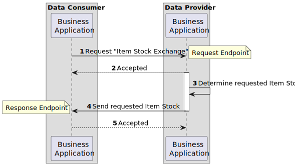
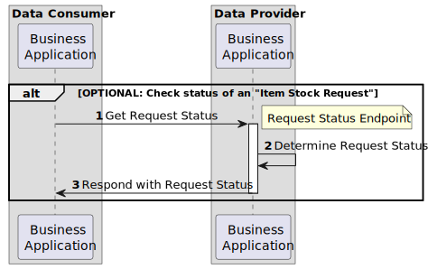
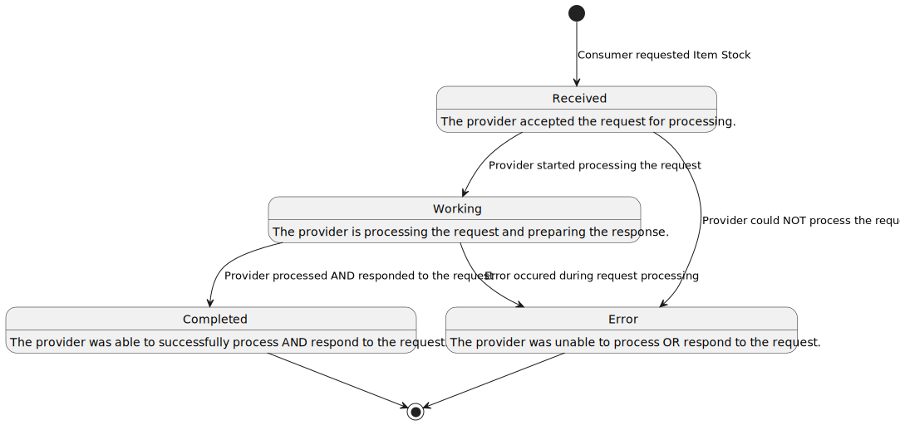

# CX-0122 Item Stock Exchange 1.0.0

## ABSTRACT

The raising and management of *Item Stock* data is the task of ERP systems. Accurate inventory
management is a decisive factor for stable delivery capability for suppliers and an important
component of secure production capability for customers. Continuous monitoring of the *Item Stock*
between suppliers and customers ensures important information for the company's own production
planning and management. This information exchange is key to early detect and evaluate supply
shortage issues. Moreover, standardized interfaces between ERP systems often exist only for order
planning and execution. However, the necessary exchanging this information manually e.g. by phone or
e-mail is error-prone and slow. To mitigate inefficient and faulty communication, this document
defines a standardized approach for exchanging *Item Stock data* in an interoperable manner. A
common description of the *Item Stock* based on a standardized semantic definition is fundamental
for facilitating such an exchange.

## FOR WHOM IS THE STANDARD DESIGNED

## COMPARISON WITH THE PREVIOUS VERSION OF THE STANDARD

This is the first version of the CX-0122 standard. The CX-0122 standard **obsoletes** the following
Catena-X standards:

- CX-0085 ProductStock Aspect Model v1.0.0
- CX-0086 Product Stock Exchange API v1.0.0

## 1 INTRODUCTION

This document defines the standardized exchange of *Item Stock* data within the Catena-X network.
The *Item Stock* semantically is the actual quantity of reserved (here called allocated) material
for a partner that has not yet been shipped from the supplier's site or has already arrived at the
customer's site and has not yet been used for production. The semantic model is presented in the
Aspect Model Notation with all individual fields, formats and associated JSON schema. The
standardization of the *ItemStock* semantic model and an exchange API enables participants in the
value chain to share information about material and product stock in a timely manner, thus ensuring
that the possible solution space for mitigating a supply shortage is maximized.

The *Item Stock* is related to a business relationship between the partners (an order / call-off
exists). The provided aspect model described in [Chapter 3.1](#31-item-stock-aspect-model) is automotive-agonistic thus allowing
the future integration and exchange with non-automotive dataspaces. Legal framework conditions and
business aspects play an important role, for example in the context of multisourcing, where no
horizontal exchange of information may take place. The aim of this standard is to ensure a secure
exchange of stock data for active monitoring and the associated prevention of bottlenecks and
shortages.

### 1.2 CONTEXT AND ARCHITECTURE FIT

> *This section is non-normative*

A typical order-based procurement process includes a customer that places an order and a supplier
fulfilling it. Material may be either on stock at the supplier's site when it has been produced and
is ready to be shipped to the customer, or at the customer's site when it has been delivered and has
not yet been used for production. Those kinds of inventories are referred to as *Item Stock*.
Information about *Item Stock* quantities it is key to early detect and evaluate short-term supply
shortages on the customer or supplier side. Also it can help reduce the total amount of stored
material within the supply chain when partners share information on their materials inventory.

*Figure 1* shows the high-level architecture of the *Item Stock* exchange in the Catena-X dataspace
and the central services that are involved. Both the data provider and the data consumer must be
members of the Catena X network in order to communicate with each other.  With the help of centrally
managed Identity Access Management (IAM) each participant can authenticate itself, verify the
identity of the requesting party and decide whether to authorize the request. The data provisioning
is based on an asynchronous exchange of request and response messages.


*Figure 1: High-level architecture of the Item Stock exchange in Catena-X*

### 1.3 CONFORMANCE AND PROOF OF CONFORMITY

> *This section is non-normative*

The sections marked as non-normative, all authoring guidelines, diagrams, examples, and notes in
this specification are non-normative. Everything else in this specification is normative. The key
words  **MAY** ,  **MUST** ,  **MUST NOT** ,  **OPTIONAL** ,  **RECOMMENDED** ,  **REQUIRED** ,
**SHOULD** and  **SHOULD NOT** in this document are to be interpreted as described in [BCP 14]
[RFC2119] [RFC8174] when, and only when, they appear in all capitals, as shown here.

All participants and their solutions will need to prove that they are conform with the Catena-X
standards. To validate that the standards are applied correctly, Catena-X employs Conformity
Assessment Bodies (CABs). The proof of conformity for a single semantic model is done according to
the general rules for proving the conformity of data provided to a semantic model or the ability to
consume the corresponding data. Furthermore participants agree to follow the normative language of
this standardization document and to implement the required API-Endpoints described in [Chapter 4](#4-application-programming-interfaces).

### 1.4 EXAMPLES

The following example shows a value-only JSON serialization of the "ItemStock" aspect model. It
represents a quantity of 20 pieces for an order position of a given material.

```json
{
  "materialGlobalAssetId": "urn:uuid:48878d48-6f1d-47f5-8ded-a441d0d879df",
  "materialNumberCustomer": "MNR-7307-AU340474.002",
  "materialNumberSupplier": "MNR-8101-ID146955.001",
  "direction": "INBOUND"    "positions": [
    {
      "lastUpdatedOnDateTime": "2023-04-01T14:23:00",
      "orderPositionReference": {
        "supplierOrderId": "M-Nbr-4711",
        "customerOrderId": "C-Nbr-4711",
        "customerOrderPositionId": "PositionId-01"
      },
      "allocatedStocks": [
        {
          "isBlocked": false,
          "stockLocationBPNA": "BPNA1234567890",
          "quantityOnAllocatedStock": {
            "value": 20.0,
            "unit": "unit:piece"
          },
          "stockLocationBPNS": "BPNS1234567890ZZ"
        }
      ]
    }
  ],
}
```

### 1.5 TERMINOLOGY

> *This section is non-normative*

| **Name** | **Abrv.** | **Description** |
| --- | --- | --- |
| **Business Partner Number** | BPN | A BPN is the unique identifier of a partner within Catena-X as defined in [[CX-0010]](#61-normative-references). |
| **Business Partner Number Site** | BPNS | A BPNS is the unique identifier of a partner site within Catena-X as defined in [[CX-0010]](#61-normative-references). |
| **Business Partner Number Address** | BPNA | A BPNA is the unique identifier of a partner address within Catena-X as defined in [[CX-0010]](#61-normative-references). |
| **Position** | | A position within an order defines the product and the quantity the supplier has to manufacture / supply for a customer. A single order may contain multiple positions for different products. |
| **Order** | | Request from a customer towards a supplier to manufacture / supply a given quantity of a specific product in a predefined time frame. |
| **Allocated Stock** | | The already manufactured and not yet been used products, components or material. They are allocated to a specific customer based on the orders made by the latter and are either still in the supplier's warehouse or already in the customer's warehouse. |
| **Provider** | | The party providing the *Item Stock* data. In the context of the *Item Stock* exchange API this is: <br /> - the supplier for *Item Stock* of direction OUTBOUND. <br /> - the customer for *Item Stock* of direction INBOUND. |
| **Consumer** | | The party requesting and consuming the *Item Stock* data provided by the provider. Additional terminology used in this standard can be looked up in the glossary on the association homepage. |
| **Stock Location** | | The physical location of a stock specified by its type (BPNS or BPNA) and the corresponding BPN number. More information on BPN/S/A is provided in [[CX-0010]](#61-normative-references). |
| **Customer** | | The recipient of products ordered from / manufactured by a supplier. |
| **Supplier** | | The supplier / manufacturer of a product. |
| **Stock** | | Two way direction of material on stock: <br /> - One can have a stock of material which is ready for delivery to customers. <br /> - One can have a stock of material which can be used for the own production. <br /> Within this document, the term material, product, component or item refers to any kind of product that may be used either as input or output of the production. Semi-finished goods are not intended to be covered. |
| **Material Number** | | Unique number of a component or material. |
| **Production Output** | | The output quantity in a defined period of time for a component or material. |

*Table 1: Terminology Item Stock Standard*

Additional terminology used in this standard can be looked up in the glossary on the association homepage.

## 2 RELEVANT PARTS OF THE STANDARD FOR SPECIFIC USE CASES

> *This section is normative*

### 2.1 "ITEM STOCK"

#### 2.1.1 LIST OF STANDALONE STANDARDS

The following Catena-X standards are prerequisites for the implementation of this standard and therefore
**MUST** be considered / implemented by the relevant parties specified in each of them.

| **Number** | **Standard** | **Version** |
| --- | --- | --- |
| [[CX-0001]](#61-normative-references) | EDC Discovery API | 1.0.2 |
| [[CX-0003]](#61-normative-references) | SAMM Aspect Meta Model | 1.1.0 |
| [[CX-0006]](#61-normative-references) | Registration and initial onboarding | 1.1.3 |
| [[CX-0010]](#61-normative-references) | Business Partner Number (BPN) | 2.0.0 |
| [[CX-0018]](#61-normative-references) | Eclipse Data Space Connector (EDC) | 2.1.0 |
| [[CX-0050]](#61-normative-references) | Framework Agreement Credential | 1.0.0 |

*Table 2: List of mandatory standards*

The usage of this standard may be complemented with the following Catena-X standards to further extend
the range of shortage prevention possibilities:

| **Number** | **Standard** | **Version** |
| --- | --- | --- |
| [[CX-0118]](#61-normative-references) | Delivery Information Exchange | 1.0.0 |
| [[CX-0120]](#61-normative-references) | Short-term Material Demand Exchange | 1.0.0 |
| [[CX-0121]](#61-normative-references) | Planned Production Output Exchange | 1.0.0 |

*Table 3: List of non-mandatory complementary standards*

#### 2.1.2 DATA REQUIRED

No additional data requirements.

#### 2.1.3 ADDITIONAL REQUIREMENTS

##### 2.1.3.1 FRAMEWORK AGREEMENT

In addition to the general Catena-X terms and conditions each data provider and data consumer **MUST**
consent to the "Predictive Unit Realtime Information Service - PURIS" framework agreement during an
onboarding process defined by the Catena-X governing body. Upon requesting data, the data consumer
MUST present the data provider with a proof of consent to the aforementioned framework agreement in
accordance with [[CX-0050]](#61-normative-references) Framework Agreement Credential. The data provider **MUST** verify the validity
of the presented proof before granting access to the requested data.

#### 2.1.4 DIGITAL TWINS AND SPECIFIC ASSET IDs

This version of the document does not define any requirements for standardized integration and
governance of digital twins.The aspect model however allows to use a digital twin´s global asset id
as an identifier for the material (*PartType*).

## 3 ASPECT MODELS

> *This section is normative*

### 3.1 "ITEM STOCK" ASPECT MODEL

#### 3.1.1 INTRODUCTION

This section describes the "ItemStock" semantic model used in the Catena-X network. For the complete
semantics and detailed description of its properties refer to the SAMM model in [Chapter 3.1.5.1](#3151-rdf-turtle).

#### 3.1.2 SPECIFICATIONS ARTIFACTS

The modeling of the semantic model specified in this document was done in accordance to the
"semantic-driven workflow" to create a submodel template specification [[SMT]](#62-non-normative-references).

This aspect model is written in SAMM 2.0.0 as a modeling language conformant to [[CX-0003]](#61-normative-references) as
input for the semantic driven workflow.

Like all Catena-X data models, this model is available in a machine-readable format on GitHub
conformant to [[CX-0003]](#61-normative-references).

#### 3.1.3 LICENSE

This Catena-X data model is made available under the terms of the Creative Commons Attribution 4.0
International (CC-BY-4.0) license, which is available at Creative Commons.

#### 3.1.4 IDENTIFIER OF SEMANTIC MODEL

The semantic model has the unique identifier

> `urn:samm:io.catenax.item_stock:1.0.0`

This identifier **MUST** be used by the data provider to define the semantics of the data being transferred.

#### 3.1.5 FORMATS OF SEMANTIC MODEL

##### 3.1.5.1 RDF TURTLE

The rdf turtle file, an instance of the Semantic Aspect Meta Model, is the master for generating additional
file formats and serializations. It can be found under the following link:

> [https://github.com/eclipse-tractusx/sldt-semantic-models/blob/main/io.catenax.item\_stock/1.0.0/ItemStock.ttl](https://github.com/eclipse-tractusx/sldt-semantic-models/blob/main/io.catenax.item_stock/1.0.0/ItemStock.ttl)

The open source command line tool of the Eclipse Semantic Modeling Framework is used for generation of
other file formats like for example a JSON Schema, aasx for Asset Administration Shell Submodel Template
or a HTML documentation.

##### 3.1.5.2 JSON SCHEMA

A JSON Schema can be generated from the RDF Turtle file. The JSON Schema defines the Value-Only payload
of the Asset Administration Shell for the API operation *"GetSubmodel"*.

##### 3.1.5.3 AASX

An AASX file **MUST** be generated from the RDF Turtle file. The AASX file defines one of the requested
artifacts for a Submodel Template Specification conformant to [[SMT]](#62-non-normative-references).

## 4 APPLICATION PROGRAMMING INTERFACES

> *This section is normative*

### 4.1 "ITEM STOCK" API

The "Item Stock API" defined in this section enables the exchange of specific *Item Stocks* between
Catena-X participants in an interoperable manner. *Figure 2* shows a high-level overview of the
intended data exchange flow.


*Figure 2: Item Stock data exchange overview*

The API relies on asynchronous communication between the involved parties.

1. A data exchange is initiated by a data consumer requesting an *Item Stock*.
2. Upon receiving a valid request, the data provider accepts it for further processing, thus confirming the receipt of the request.
3. The data provider determines the requested *Item Stock*.
4. The data provider sends the requested *Item Stock* to the data consumer.
5. The data consumer confirms the successful receipt of the requested *Item Stock* by accepting it.

The data provider may also optionally offer an endpoint, which can be used by the data consumer to track
the status of the request it made. *Figure 3* shows an overview of the steps involved in fetching the
state of a previously made *"Item Stock Request"*.


*Figure 3: Checking the status of a "Item Stock" Request*

1. The data consumer requests the status of a previously made request.
2. The data provider determines the request's status.
3. The data provider responds instantly informing the data consumer about the request's status.

The lifecycle of a "Item Stock Request" is defined by the set of states shown in *Figure 4*.


*Figure 4: States of a "Item Stock" Request*

#### 4.1.1 PRECONDITIONS AND DEPENDENCIES

To use this standard the participants **MUST** have an existing business relationship that defines demand
and supply relationship.

Each partner **MUST** be registered and onboarded to Catena-X [CX-006](#61-normative-references). To participate in the Catena-X
dataspace, the Eclipse Data Space Connector **MUST** be used to make the API available [CX-0018](#61-normative-references)

#### 4.1.2 API SPECIFICATION

##### 4.1.2.1 API ENDPOINTS & RESOURCES

Catena-X participants interested in exchanging *Item Stock* information **MUST** implement the endpoints
as defined in the table below based on their role in the data exchange process.

> Note: Expressions in double curly braces \{\{\}\} must be substituted with a corresponding value.

| **Role** | **Endpoint** | **Route** | **REQUIRED** | **HTTP Method** | **Purpose** |
| --- | --- | --- | --- | --- | --- |
| Provider | Request Endpoint | `{{ITEM-STOCK-REQUEST-ENDPOINT}}` | Yes | **POST** | This endpoint receives the "Item Stock Requests" from a consumer. |
| Consumer | Response Endpoint | `{{ITEM-STOCK-RESPONSE-ENDPOINT}}` | Yes | **POST** | This endpoint receives the "Item Stock Responses" to the consumer's requests. |
| Provider | Request Status Endpoint | `{{ITEM-STOCK-REQUEST-STATUS-ENDPOINT}}` | No | **POST** | This endpoint allows the consumer to **OPTIONALLY** check the current status of an "Item Stock Request" it already made. |

*Table 4: Roles in Item Stock data exchange process*

##### 4.1.2.2 ITEM STOCK REQUEST

When sending a request to the "Item Stock Request Endpoint", the body **MUST** be composed out of two
parts: a `header` object according to the shared aspect model `MessageHeader` and a `content` object.
Together they form the HTTP body that **MUST** be formatted as JSON.

###### Request Header

> Note: This is not the HTTP Header but rather part of the HTTP Body.

The following table lists all fields of the message header and how they are used.

| **Field** | **REQUIRED** | **Purpose** | **Datatype** | **Example value** |
| --- | --- | --- | --- | --- |
| messageId | Yes | Unique ID identifying the message. The purpose of the ID is to uniquely identify a single message, therefore it **MUST NOT** be reused. | UUID v4 [RFC4122] | `48878d48-6f1d-47f5-8ded-a441d0d879df` |
| relatedMessageId | No | For the "Item Stock Request" this field **SHOULD NOT** be set. | UUID v4 [RFC4122] | `dbaecda8-1610-4d0d-a3a4-bf4b41386535` |
| context | Yes | Information about the context that the message should be considered in. The value **MUST** consist of two parts: constant of a given endpoint `RES-PURIS-ItemStockRequest` followed by the version number `1.0` | URI | `RES-PURIS-ItemStockRequest:1.0` |
| version | Yes | This field **MUST** specify the namespace and version of the `MessageHeader` aspect model that has been used to create the message header. | Namespace and version of the shared aspect model `MessageHeader` | `urn:samm:io.catenax.message_header:2.0` |
| senderBpn | Yes | The business partner number (BPNL/S) of the requesting party. | BPN according to [[CX-0010]](#61-normative-references) | `BPNS0123456789ZZ` |
| receiverBpn | Yes | The business partner number (BPNL/S) of the receiving party. | BPN according to [[CX-0010]](#61-normative-references) | `BPNS0123456789YY` |
| sentDateTime | Yes | The date and time including time zone offset on which the request has been created. | [[ISO8601]](#62-non-normative-references) with time zone | `2023-04-25T10:54:12+00:00` |

*Table 5: Item Stock message header*

The following JSON object gives an example of a valid `header`:

```json
"header":{
   "messageId":"48878d48-6f1d-47f5-8ded-a441d0d879df",
   "context": "RES-PURIS-ItemStockRequest:1.0",
   "version": "urn:samm:io.catenax.message_header:2.0",
   "senderBpn":"BPNS0123456789ZZ",
   "receiverBpn":"BPNS2345678910YY",
   "sentDateTime":"2023-04-25T10:54:12+00:00"
}
```

###### Request Content

The content consists of a single *itemStock*object containing the list of material numbers and direction for
which the consumer would like to receive the *Item Stock* information. It is described by the following fields:

| **Field** | **REQUIRED** | **Purpose** | **Datatype** | **Example value** |
| --- | --- | --- | --- | --- |
| materialNumberCustomer | Yes | The material number given by the customer **MUST** unambiguously identify the material on customer side. It **SHOULD** be used by the supplier to identify the requested material. | String | `MNR-7307-AU340474.001` |
| materialNumberSupplier | No | The material number given by the supplier **MUST** unambiguously identify the material on supplier side. Material number given by the supplier **OR** `materialGlobalAssetId` **MUST** be used by the supplier to identify the material in case the `materialNumberCustomer` is not known by the supplier | String | `MNR-8101-ID146955.001` |
| materialGlobalAssetId | No | The material number given by the Catena-X network **MUST** unambiguously identify the material in the Catena-X network and **SHOULD** be used to identify the digital twin of the material. This number **MAY** be used instead of the `materialNumberCustomer` or the `materialNumberSupplier` to identify the material when consumer and provider both know the digital twin of the material. | UUID v4 [RFC4122] | `urn:uuid:055c1128-0375-47c8-98de-7cf802c3241d` |
| direction | Yes | The direction indicates for the respective participant whether the item stock is incoming or outgoing components/materials. The direction **MUST** be specified in order to ensure clear identification in possible applications. The direction may be either set to "INBOUND" or "OUTBOUND". The direction **MUST** be set according to the definitions of the semantic model (see [Chapter 3](#3-aspect-models)) from provider's point of view: <br /> - If a supplier provides stock information to a customer, use "OUTBOUND". <br />- If a customer provides stock information to a supplier, use "INBOUND". | String | `INBOUND` |

*Table 6: Item Stock request content*

The following JSON object gives an example of a valid `content`:

```json
"content":{
   "direction": "INBOUND",
   "itemStock":[
      {   
        "materialGlobalAssetId": "urn:uuid:48878d48-6f1d-47f5-8ded-a441d0d879df",
        "materialNumberCustomer": "MNR-7307-AU340474.002",
        "materialNumberSupplier": "MNR-8101-ID146955.001"
      },
      {
         "materialNumberCustomer":"MNR-7307-AU340474.002"
      }
   ]
}
```

###### Request Example

The following snippet shows an example consisting of both the `header` and the `content` for a given "Item Stock Request API" request.

```json
{
   "header":{
      "messageId":"48878d48-6f1d-47f5-8ded-a441d0d879df",
      "context": "RES-PURIS-ItemStockRequest:1.0",
      "version": "urn:samm:io.catenax.message_header:2.0",
      "senderBpn":"BPNS0123456789ZZ",
      "receiverBpn":"BPNS2345678910YY",
      "sentDateTime":"2023-04-25T10:54:12+00:00"
   },
   "content":{
      "direction": "INBOUND",
      "itemStock":[
         {  
            "materialGlobalAssetId": "urn:uuid:48878d48-6f1d-47f5-8ded-a441d0d879df",
            "materialNumberCustomer": "MNR-7307-AU340474.002",
            "materialNumberSupplier": "MNR-8101-ID146955.001",
         },
         {
            "materialNumberCustomer":"MNR-7307-AU340474.002"
         }
      ]
   }
}
```

###### Responding to an "Item Stock Request"

The consumer **MUST** respond with one of the HTTP status codes defined in the corresponding section
of [Chapter 4.1.4](#414-error-handling).

The response **MUST** be JSON formatted and **MUST** contain only the `messageId` field specifying the
ID of the message received. The value **MUST** therefore be also equal to the `relatedMessageId` value
contained in the header of the "Item Stock Response" described in [Chapter 4.1.2.3](#4123-item-stock-response).

The following JSON object gives an example of a valid response:

```json
{
  "messageId":"48878d48-6f1d-47f5-8ded-a441d0d879df"
}
```

##### 4.1.2.3 ITEM STOCK RESPONSE

When provisioning data to the "Item Stock Response Endpoint", the body **MUST** be composed out of
two parts: a `header` object according to the shared aspect model `MessageHeader` and a `content`
object. Together they form the HTTP body that **MUST** be formatted as JSON.

###### Response Header

> Note: This is not the HTTP Header but rather part of the HTTP Body.

The following table lists all fields of the message header and how they are used.

| **Field** | **REQUIRED** | **Purpose** | **Datatype** | **Example value** |
| --- | --- | --- | --- | --- |
| messageId | Yes | Unique ID identifying the message.The purpose of the ID is to uniquely identify a single message, therefore it **MUST NOT** be reused. | UUID v4 [RFC4122] | `fe39db5f-77b6-466c-8d5a-131eb8aa9051`|
| relatedMessageId | Yes | For the "Item Stock Response" this information **MUST** be set to the messageId of the corresponding "Item Stock Request" received. | UUID v4 [RFC4122] | `48878d48-6f1d-47f5-8ded-a441d0d879df` |
| context | Yes | Information about the context that the message should be considered in. The value **MUST** consist of two parts: constant of a given endpoint `RES-PURIS-ItemStockResponse` followed by the version number `1.0` | URI | `RES-PURIS-ItemStockResponse:1.0` |
| version | Yes | This field **MUST** specify the namespace and version of the `MessageHeader` aspect model that has been used to create the message header. | Namespace and version of the shared aspect model `MessageHeader` | `urn:samm:io.catenax.message_header:2.0` |
| senderBpn | Yes | The business partner number (BPNL/S) of the responding party. | BPN according to [[CX-0010]](#61-normative-references) | `BPNS0123456789ZZ` |
| receiverBpn | Yes | The business partner number (BPNL/S) of the receiving party. | BPN according to [[CX-0010]](#61-normative-references) | `BPNS0123456789YY` |
| sentDateTime | Yes | The date and time including time zone offset on which the request has been created. | [[ISO8601]](#62-non-normative-references) with time zone | `2023-04-25T10:54:12+00:00` |

*Table 7: Item Stock response header*

The following JSON object gives an example of a valid `header`:

```json
"header":{
   "messageId":"fe39db5f-77b6-466c-8d5a-131eb8aa9051",
   "relatedMessageId": "48878d48-6f1d-47f5-8ded-a441d0d879df",
   "context": "RES-PURIS-ItemStockResponse:1.0",
   "version": "urn:samm:io.catenax.message_header:2.0",
   "senderBpn":"BPNS2345678910YY",
   "receiverBpn":"BPNS0123456789ZZ",
   "sentDateTime":"2023-04-25T10:54:12+00:00"
}
```

###### Response Content

The content **MUST** consist of a single `itemStock` object containing a list of *Item Stocks*.
Each *Item Stock* **MUST** be built according to the "ItemStock" SAMM model defined in [Chapter 3.1.](#31-item-stock-aspect-model).
An example content for a single "ItemStock" is given below.

```json
"content": {
    "itemStock": [
    {
        "positions": [
        {
        "lastUpdatedOnDateTime": "2023-04-01T14:23:00",
        "orderPositionReference": {
            "supplierOrderId": "M-Nbr-4711",
            "customerOrderId": "C-Nbr-4711",
            "customerOrderPositionId": "PositionId-01"
        },
        "allocatedStocks": [
            {
            "isBlocked": false,
            "stockLocationBPNA": "BPNA1234567890",
            "quantityOnAllocatedStock": {
                "value": 20.0,
                "unit": "unit:piece"
            },
            "stockLocationBPNS": "BPNS1234567890ZZ"
            }
        ]
        }    
        "materialGlobalAssetId": "urn:uuid:48878d48-6f1d-47f5-8ded-a441d0d879df",
        "materialNumberCustomer": "MNR-7307-AU340474.002",
        "materialNumberSupplier": "MNR-8101-ID146955.001",
        "direction": "INBOUND"     
        }
    ]
}
```

###### Response Example

The following snippet shows an example consisting of both the `header` and the `content` for a given
"*Item Stock* Response API" request.

```json
{
   "header":{
      "messageId":"fe39db5f-77b6-466c-8d5a-131eb8aa9051",
      "relatedMessageId":"48878d48-6f1d-47f5-8ded-a441d0d879df",
      "context":"RES-PURIS-ItemStockResponse:1.0",
      "version":"urn:samm:io.catenax.message_header:2.0",
      "senderBpn":"BPNS2345678910YY",
      "receiverBpn":"BPNS0123456789ZZ",
      "sentDateTime":"2023-04-25T10:54:12+00:00"
   },
   "content":{
      "itemStock":[
         {
            "positions": [
                {
                "lastUpdatedOnDateTime": "2023-04-01T14:23:00",
                "orderPositionReference": {
                    "supplierOrderId": "M-Nbr-4711",
                    "customerOrderId": "C-Nbr-4711",
                    "customerOrderPositionId": "PositionId-01"
                },
                "allocatedStocks": [
                    {
                    "isBlocked": false,
                    "stockLocationBPNA": "BPNA1234567890",
                    "quantityOnAllocatedStock": {
                        "value": 20.0,
                        "unit": "unit:piece"
                    },
                    "stockLocationBPNS": "BPNS1234567890ZZ"
                    }
                ]
              }          
              ],  
            "materialGlobalAssetId": "urn:uuid:48878d48-6f1d-47f5-8ded-a441d0d879df",
            "materialNumberCustomer": "MNR-7307-AU340474.002",
            "materialNumberSupplier": "MNR-8101-ID146955.001",
            "direction": "INBOUND"      
        }
      ]
   }
}
```

###### Responding to an "Item Stock Response"

The consumer **MUST** respond with one of the HTTP status codes defined in the corresponding section
of [Chapter 4.1.4](#414-error-handling).

The response **MUST** be JSON formatted and **MUST** contain only the `messageId` field specifying the ID
of the message received. The value **MUST** therefore be also equal to the `messageId` value contained
in the header of the "Item Stock Response".

The following JSON object gives an example of a valid response:

```json
{
  "messageId" : "fe39db5f-77b6-466c-8d5a-131eb8aa9051"
}
```

##### 4.1.2.4 ITEM STOCK REQUEST STATUS

When sending a request to the "Item Stock Request Status Endpoint", the body **MUST** be composed out
of two Item Stocks: a `header` object according to the shared aspect model `MessageHeader` and a `content`
object. Together they form the HTTP body that **MUST** be formatted as JSON.

###### Request Header

> Note: This is not the HTTP Header but rather part of the HTTP Body.

| **Field** | **REQUIRED** | **Purpose** | **Datatype** | **Example value** |
| --- | --- | --- | --- | --- |
| messageId | Yes | Unique ID identifying the message.The purpose of the ID is to uniquely identify a single message, therefore it **MUST NOT** be reused. | UUID v4 [RFC4122] | `e8f7ee48-ac96-4e8e-99e3-b474e73f4906` |
| relatedMessageId | Yes | Unique ID identifying the "Item Stock Request" message sent before. | UUID v4 [RFC4122] | `48878d48-6f1d-47f5-8ded-a441d0d879df` |
| context | Yes | Information about the context that the message should be considered in. The value **MUST** consist of two parts: constant of a given endpoint `RES-PURIS-ItemStockRequestStatus` followed by the version number `1.0` | URI | `RES-PURIS-ItemStockRequestStatus:1.0` |
| version | Yes | This field **MUST** specify the namespace and version of the `MessageHeader` aspect model that has been used to create the message header. | Namespace and version the shared aspect model `MessageHeader`. | `urn:samm:io.catenax.message_header:2.0` |
| senderBpn | Yes | The business partner number (BPNL/S) of the requesting party. | BPN according to [[CX-0010]](#61-normative-references) | `BPNS0123456789ZZ` |
| receiverBpn | Yes | The business partner number (BPNL/S) of the receiving party. | BPN according to [[CX-0010]](#61-normative-references) | `BPNS0123456789YY` |
| sentDateTime | Yes | The date and time including time zone offset on which the request has been created. | [[ISO8601]](#62-non-normative-references) with time zone | `2023-04-25T10:54:12+00:00` |

*Table 8: Item Stock request status header*

The following JSON object gives an example of a valid `header`:

```json
"header":{
   "messageId":"e8f7ee48-ac96-4e8e-99e3-b474e73f4906",
   "relatedMessageId": "48878d48-6f1d-47f5-8ded-a441d0d879df",
   "context": "RES-PURIS-ItemStockRequestStatus:1.0",
   "version": "urn:samm:io.catenax.message_header:2.0",
   "senderBpn":"BPNS0123456789ZZ",
   "receiverBpn":"BPNS2345678910YY",
   "sentDateTime":"2023-04-25T10:54:12+00:00"
}
```

###### Request Content

The content **MUST** be an empty object.

The following JSON object gives an example of a valid content:

```json
"content":{

}
```

###### Status Request Example

The following snippet shows an example consisting of both the `header` and the `content` for a given
"Item Stock Request Status API" request.

```json
{    
   "header":{
       "messageId":"e8f7ee48-ac96-4e8e-99e3-b474e73f4906",
       "relatedMessageId": "48878d48-6f1d-47f5-8ded-a441d0d879df",
       "context": "RES-PURIS-ItemStockRequestStatus:1.0",
       "version": "urn:samm:io.catenax.message_header:2.0",
       "senderBpn":"BPNS0123456789ZZ",
       "receiverBpn":"BPNS2345678910YY",
       "sentDateTime":"2023-04-25T10:54:12+00:00"
    },
   "content":{
       
   }
}
```

###### Responding to an "Item Stock Status Request"

The provider **MUST** respond with one of the HTTP status codes defined in the corresponding section
of [Chapter 4.1.4](#414-error-handling).

The response **MUST** be JSON formatted and **MUST** contain the following fields:

- `messageId`: the ID of the "Item Stock Request", for which one would like to know the current status
- `requestState`: the current state of the request on provider side

The following table contains the list of valid request states and their meaning.

| **State** | **Meaning** |
| --- | --- |
| `Received`  | The provider accepted the request for processing.  |
| `Working`  | The provider is processing the request and preparing the response.  |
| `Completed`  | The provider was able to successfully process AND respond to the request. |
| `Error` | The provider was unable to process OR respond to the request. |

*Table 9: Item Stock valid request states*

More information about the different states and the transitions between them is provided in the
beginning of [Chapter 4.1](#41-item-stock-api).

The following JSON object gives an example of a valid response:

```json
{
  "messageId": "48878d48-6f1d-47f5-8ded-a441d0d879df",
  "requestState": "Working"
}
```

##### 4.1.2.5 AVAILABLE DATA TYPES

The API **MUST** use JSON as the payload transported via HTTPS. More information on the data objects
supported by the endpoints is provided in the corresponding sections of [Chapter 4.1.2](#412-api-specification).

#### 4.1.3 EDC DATA ASSET STRUCTURE

The endpoints introduced in [Chapter 4.1.2](#412-api-specification) **MUST NOT** be directly called from a provider or from
a consumer. Rather, these **MUST** be called via an IDS-compliant connector (e.g. EDC). Therefore,
the endpoints **MUST** be offered as EDC data assets. To make these assets easily identifiable in the
connector's catalog, each asset **MUST** be configured with a set of properties as described in the
corresponding sections below.

The following table provides an overview of the EDC data assets that the parties **MUST** offer to be
able to provision and / or consume *Item Stock* data.

| **Party** | **REQUIRED** | **Asset** | **Purpose** |
| --- | --- | --- | --- |
| Provider | Yes | "Item Stock Request" | Allows a consumer to request *Item Stock* information. |
| Provider | No | "Item Stock Request Status" | Allows a consumer to check the status for an "Item Stock Request". |
| Consumer | Yes | "Item Stock Response" | Allows a consumer to receive the requested *Item Stock* information. |

*Table 10: EDC data assets*

##### EDC Data Asset Structure for "Item Stock Request API Endpoint"

In order to receive "Item Stock Requests", the provider **MUST** register an EDC data asset specifying
the address of the "Item Stock Request Endpoint" described in [Chapter 4.1.2](#412-api-specification).

The data asset **MUST** be configured with the set of properties as defined in the table below.

| **Property** | **Purpose** | **Usage & Constraints** |
| --- | --- | --- |
| ***@type*** | Defines the asset type. | The asset **MUST** be set to `Asset`. |
| ***@id*** | Identifier of the asset | The asset ID **MUST** be unique and therefore **MUST NOT** be reused elsewhere. |
| properties.**dct:type** | Defines the "Item Stock Request API Endpoint" according to the Catena-X taxonomy. | **MUST** be set to `{"@id": "https://w3id.org/catenax/taxonomy#ItemStockRequestApi"}` to allow filtering the data assets catalog for the respective "Item Stock Request API". |
| properties.**asset:prop:type** | Defines the "Item Stock Request API Endpoint" for filtering purposes. | **MUST** be set to `data.res.itemStockRequestApi` to allow filtering the data assets catalog for the respective "Item Stock Request API". |
| properties.**cx-common:version** | The version of the standard defining the implemented API | **MUST** correspond to the version of the standard defining the "Item Stock Exchange API". The value **MUST** be set to `1.0` for APIs implementing this standard. |
| dataAddress.properties.**@type** | Type of the DataAddress node. | **MUST** be set to `DataAddress`. |
| dataAddress.properties.***baseUrl*** | Defines the HTTPS endpoint of the corresponding "Item Stock Request API Endpoint". | The `{{ITEM_STOCK_REQUEST_ENDPOINT}}` refers to an URL under which the API endpoint is available. HTTPS transport protocol **MUST** be used. |
| dataAddress.properties.***proxyBody*** | Defines whether the endpoint allows to proxy the HTTPS body | **MUST** be set to `true` to allow the API endpoint to receive a HTTPS body via the HTTPS request. |
| dataAddress.properties.***proxyMethod*** | Defines whether the endpoint allows to proxy the HTTPS method | **MUST** be set to `true` to allow the API endpoint to also receive POST requests. |
| dataAddress.properties.***type*** | Defines the type of data plane extension handling the data exchange | **MUST** be set to `HttpData` to provide an API via an HTTPS proxy endpoint. |

*Table 11: EDC data assets request properties*

When searching the data assets catalog of a provider, a consumer **MUST** use the following combination
of properties AND their values to identify the data asset specifying the "Item Stock Request Endpoint"
described in [Chapter 4.1.2](#412-api-specification).

| **Property** | **Value** |
| --- | --- |
| properties.***asset:prop:type*** | `data.res.itemStockRequestApi` |
| properties.***cx-common:version*** | `1.0` |

*Table 12: EDC data assets request properties values*

Because the data asset reflects the existing contractual relationship between a customer and its suppliers,
only one data asset with the aforementioned combination of properties AND their values **MUST** be visible
to the consumer at any time to avoid ambiguity.

An example EDC Data Asset definition is given below.

> Note: Expressions in double curly braces \{\{\}\} must be substituted with a corresponding value.

```json
{
    "@context": {
        "@vocab": "https://w3id.org/edc/v0.0.1/ns/",
        "cx-taxo": "https://w3id.org/catenax/taxonomy#",
        "cx-common": "https://w3id.org/catenax/ontology/common#",
        "dct": "https://purl.org/dc/terms/"
    },
    "@type": "Asset",
    "@id": "{{ITEM_STOCK_REQUEST_API_ASSET_ID}}",                                   
    "properties": {
        "dct:type": {
            "@id": "cx-taxo:ItemStockRequestApi"                                   
        },
        "asset:prop:type": "data.res.itemStockRequestApi",
        "cx-common:version": "1.0",                                              
        "description": "Item Stock Request API Endpoint"                                     
    },
    "dataAddress": {
        "@type": "DataAddress",
        "type": "HttpData",
        "proxyBody": "true",
        "proxyMethod": "true",
        "baseUrl": "{{ITEM_STOCK_REQUEST_API_ENDPOINT}}"                            
    }
}
```

##### EDC Data Asset Structure for "Item Stock Request Status API Endpoint"

In order to receive "Item Stock Request Status" requests, the provider **MAY** register an EDC data asset
specifying the address of the "Item Stock Request Endpoint" described in [Chapter 4.1.2](#412-api-specification).

The data asset **MUST** be configured with the set of properties as defined in the table below.

| **Property** | **Purpose** | **Usage & Constraints** |
| --- | --- | --- |
| ***@type*** | Defines the asset type. | The asset **MUST** be set to "**Asset**". |
| ***@id*** | Identifier of the asset | The asset ID **MUST** be unique and therefore **MUST NOT** be reused elsewhere. |
| properties.**dct:type** | Defines the "Item Stock Request Status API Endpoint" according to the Catena-X taxonomy. | **MUST** be set to `{"@id": "https://w3id.org/catenax/taxonomy#ItemStockRequestStatusApi"}` to allow filtering the data assets catalog for the respective "Item Stock Request Status API". |
| properties.**asset:prop:type** | Defines the "Item Stock Request Status API Endpoint" for filtering purposes. | **MUST** be set to `data.res.itemStockRequestStatusApi` to allow filtering the data assets catalog for the respective "Item Stock Request Status API". |
| properties.**cx-common:version** | The version of the standard defining the implemented API. | **MUST** correspond to the version of the standard defining the "Item Stock Exchange API". The value **MUST** be set to `1.0` for APIs implementing this standard. |
| dataAddress.properties.**@type** | Type of the DataAddress node. | **MUST** be set to `DataAddress`. |
| dataAddress.properties.***baseUrl*** | Defines the HTTPS endpoint of the corresponding "Item Stock Request Status API Endpoint". | The `{{ITEM_STOCK_REQUEST_STATUS_ENDPOINT}}` refers to an URL under which the API endpoint is available. HTTPS transport protocol **MUST** be used. |
| dataAddress.properties.***proxyBody*** | Defines whether the endpoint allows to proxy the HTTPS body | **MUST** be set to `true` to allow the API endpoint to receive a HTTPS body via the HTTPS request. |
| dataAddress.properties.***proxyMethod*** | Defines whether the endpoint allows to proxy the HTTPS method | **MUST** be set to `true` to allow the API endpoint to also receive POST requests. |
| dataAddress.properties.***type*** | Defines the type of data plane extension handling the data exchange | **MUST** be set to `HttpData` to provide an API via an HTTPS proxy endpoint. |

*Table 13: EDC data assets request status properties*

When searching the data assets catalog of a provider, a consumer **MUST** use the following combination
of properties AND their values to identify the data asset specifying the "Item Stock Request Status Endpoint"
described in [Chapter 4.1.2](#412-api-specification).

| **Property** | **Value** |
| --- | --- |
| properties.***asset:prop:type*** | "**data.res.itemStockRequestStatusApi**" |
| properties.***cx-common:version*** | **1.0** |

*Table 14: EDC data assets request status properties values*

Because the data asset reflects the existing contractual relationship between a customer and its suppliers,
only one data asset with the aforementioned combination of properties AND their values **MUST** be visible
to the consumer at any time to avoid ambiguity.

An example EDC Data Asset definition is given below.

> Note: Expressions in double curly braces \{\{\}\} must be substituted with a corresponding value.

```json
{
    "@context": {
        "@vocab": "https://w3id.org/edc/v0.0.1/ns/",
        "cx-taxo": "https://w3id.org/catenax/taxonomy#",
        "cx-common": "https://w3id.org/catenax/ontology/common#",
        "dct": "https://purl.org/dc/terms/"
    },
    "@type": "Asset",
    "@id": "{{ITEM_STOCK_REQUEST_STATUS_API_ASSET_ID}}",                           
    "properties": {
        "dct:type": {
            "@id": "cx-taxo:ItemStockRequestStatusApi"                              
        },
        "asset:prop:type": "data.res.itemStockRequestStatusApi",
        "cx-common:version": "1.0",                                                       
        "description": "Item Stock Request Status API Endpoint"                               
    },
    "dataAddress": {
        "@type": "DataAddress",
        "type": "HttpData",
        "proxyBody": "true",
        "proxyMethod": "true",
        "baseUrl": "{{ITEM_STOCK_REQUEST_STATUS_API_ENDPOINT}}"            
    }
}
```

##### EDC Data Asset Structure for "Item Stock Response API Endpoint"

In order to receive the *Item Stock* data it requested, the consumer **MUST** register an EDC data asset
specifying the address of the "Item Stock Response Endpoint" described in [Chapter 4.1.2](#412-api-specification).

This asset **MUST** be configured with the set of properties as defined in the table below.

| **Property** | **Purpose** | **Usage & Constraints** |
| --- | --- | --- |
| ***@type*** | Defines the asset type. | The asset **MUST** be set to `Asset`. |
| ***@id*** | Identifier of the asset | The asset ID **MUST** be unique and therefore **MUST NOT** be reused elsewhere. |
| properties.**dct:type** | Defines the "Item Stock Response API Endpoint" according to the Catena-X taxonomy. | **MUST** be set to `{"@id": "https://w3id.org/catenax/taxonomy#ItemStockResonseApi"}` to allow filtering the data assets catalog for the respective "Item Stock Response API". |
| properties.**asset:prop:type** | Defines the "Item Stock Response API Endpoint" for filtering purposes. | **MUST** be set to `data.res.itemStockResponseApi` to allow filtering the data assets catalog for the respective "Item Stock Response API". |
| properties.**cx-common:version** | The version of the standard defining the implemented API | **MUST** correspond to the version of the standard defining the "Item Stock Exchange API". The value **MUST** be set to `1.0` for APIs implementing this standard. |
| dataAddress.properties.**@type** | Type of the DataAddress node. | **MUST** be set to `DataAddress`. |
| dataAddress.properties.***baseUrl*** | Defines the HTTPS endpoint of the corresponding "Item Stock Response API Endpoint". | The `{{ITEM_STOCK_RESPONSE_ENDPOINT}}` refers to an URL under which the API endpoint is available. HTTPS transport protocol **MUST** be used. |
| dataAddress.properties.***proxyBody*** | Defines whether the endpoint allows to proxy the HTTPS body | **MUST** be set to `true` to allow the API endpoint to receive a HTTPS body via the HTTPS request. |
| dataAddress.properties.***proxyMethod*** | Defines whether the endpoint allows to proxy the HTTPS method | **MUST** be set to `true` to allow the API endpoint to also receive POST requests. |
| dataAddress.properties.***type*** | Defines the type of data plane extension handling the data exchange | **MUST** be set to `HttpData` to provide an API via an HTTPS proxy endpoint. |

*Table 15: EDC data assets response properties*

When searching the data assets catalog of a provider, a consumer **MUST** use the following combination
of properties AND their values to identify the data asset specifying the Item Stock Response Endpoint
described in [Chapter 4.1.2](http://confluence.catena-x.net/#412-api-specification).

| **Property** | **Value** |
| --- | --- |
| properties.***asset:prop:type*** | `data.res.itemStockResponseApi` |
| properties.***cx-common:version*** | `1.0` |

*Table 16: EDC data assets response properties values*

Because the asset reflects the existing contractual relationship between a customer and its suppliers,
only one asset with the aforementioned combination of properties AND their values **MUST** be visible
to the provider at any time to avoid ambiguity.

An example EDC Data Asset definition is given below.

> Note: Expressions in double curly braces \{\{\}\} must be substituted with a corresponding value.

```json
{
    "@context": {
        "@vocab": "https://w3id.org/edc/v0.0.1/ns/",
        "cx-taxo": "https://w3id.org/catenax/taxonomy#",
        "cx-common": "https://w3id.org/catenax/ontology/common#",
        "dct": "https://purl.org/dc/terms/"
    },
    "@type": "Asset",
    "@id": "{{ITEM_STOCK_RESPONSE_API_ASSET_ID}}",                                  
    "properties": {
        "dct:type": {
            "@id": "cx-taxo:ItemStockResponseApi"                                  
        },
        "asset:prop:type": "data.res.itemStockResponseApi",
        "cx-common:version": "1.0",                                                   
        "description": "Item Stock Response API Endpoint"                                     
    },
    "dataAddress": {
        "@type": "DataAddress",
        "type": "HttpData",
        "proxyBody": "true",
        "proxyMethod": "true",
        "baseUrl": "{{ITEM_STOCK_RESPONSE_API_ENDPOINT}}"                       
    }
}
```

#### 4.1.4 ERROR HANDLING

Every API endpoint defined in [Chapter 4.1.2](#412-api-specification) **MUST** respond to incoming requests with HTTP status codes
as described in [[RFC9110]](#62-non-normative-references). The status codes for each endpoint are defined in the following sections.

##### HTTP Codes for Item Stock Request Endpoint

| **Status Code** | **Description** | **Usage** |
| --- | --- | --- |
| 202 | Item Stock request was accepted | When the request had been accepted by the provider, the latter **MUST** respond with status code 202 |
| 400 | Request body malformed | When the request BODY is not matching the API description, the provider **MUST** respond with error code 400 |
| 401 | Not authorized | When the authorization of the request fails, the provider **MUST** respond with error code 401 |
| 404 | Endpoint not found | When the HTTP path is not available, the provider **MUST** respond with error code 404 |
| 405 | Method not allowed | In case the HTTP method used is not a POST, the provider **MUST** respond with error code 405 |
| 422 | A request with the same message ID already exists | When the message ID (`header.messageId`) was already used for another request |

*Table 17: Request error handling*

##### HTTP Codes for Item Stock Response Endpoint

| **Status Code** | **Description** | **Usage** |
| --- | --- | --- |
| 202 | Item Stock response was accepted | When the received Item Stock data is accepted by the consumer, it **MUST** respond with status code 202 |
| 400 | Response body malformed | When the HTTP Body is not matching the API description, the consumer **MUST** respond with error code 400 |
| 401 | Not authorized | When the authorization of the response fails, the consumer **MUST** respond with error code 401 |
| 404 | Endpoint not found | When the HTTP path is not available, the consumer **MUST** respond with error code 404 |
| 405 | Method not allowed | In case the HTTP method used is not a POST, the provider **MUST** respond with error code 405 |
| 422 | The message ID does not match any open request | When the message ID (`header.messageId`) does not match the ID of any open request, the consumer **MUST** respond with error code 422 |

*Table 18: Response error handling*

##### HTTP Codes for Item Stock Request Status Endpoint

| **Status Code** | **Description** | **Usage** |
| --- | --- | --- |
| 200 | Item Stock status request was successful | When the request was successful, the provider **MUST** respond with status code 200 |
| 400 | Request body malformed | When the request BODY is not matching the API description, the provider **MUST** respond with error code 400 |
| 401 | Not authorized | When the authorization of the request fails, the provider **MUST** respond with error code 401 |
| 404 | Endpoint not found | When the HTTP path is not available, the provider **MUST** respond with error code 404 |
| 405 | Method not allowed | In case the HTTP method used is not a POST, the provider **MUST** respond with error code 405 |
| 422 | The message ID is not known | When the message ID (`header.messageId`) does not match the ID of any known request, the provider **MUST** respond with error code 422 |

*Table 19: Request status error handling*

## 5 PROCESSES

> *This section is normative*

### 5.1 GENERAL INFORMATION ON THE USE OF ITEM STOCK

A prerequisite to build up an *Item Stock* and allocate it to a specific customer or supplier is an
existing order / call-off (build-to-order). This standard, **MUST NOT** be used in case of building
stock without any allocation to a customer or supplier (build-to-stock).

In contrast to the Demand and Capacity Management standard [[CX-0128]](#61-normative-references), this information relates to
short-term planning periods of 1-4 weeks. Accordingly, neither long-term planning nor strategic
planning is included in the scope. This means that only the current/actual *Item Stock* quantities
are transmitted in this standard.

We distinguish between exactly two scenarios in multi sourcing. On the one hand, the exchange of
information from supplier to customer and, on the other hand, from customer to supplier. In both
scenarios, information **MUST NOT** be shared horizontally under any circumstances. This means that
the *Item Stock* in relation to other customers or suppliers **MUST NOT** be shared.

The data exchange between the C-X participants refers to the direct business relationship among each
other. In the case of **consignation**, the warehouse is specified via the real location - the
customer/supplier site. In this case the allocated stock is not considered as taken and according to
our definition as not delivered (have not yet been shipped). This standard, must not be used in case
of building stock without any allocation to a customer or supplier (build-to-stock).

### 5.2 ITEM STOCK PROVISIONING WITHIN SINGLE SOURCING AND SINGLE CUSTOMER SCENARIOS

#### 5.2.1 ACTORS AND ROLES

The following actors and roles occur in the described processes. The common definitions are found in
[Chapter 1.5](#15-terminology). This section describes respective scenarios.

| **Actors** | **Role** | **Description** |
| --- | --- | --- |
| **Customer** | The customer acts as the data consumer and provider in this standard. | A business partner that procures items from its supplier and requests information about its allocated item stock information. The customer provides information about its own stock in relation to the assigned supplier. |
| **Supplier** | The supplier acts as the data consumer and provider in this standard. | A business partner that supplies items to a customer. The supplier requests the allocated item stock from the customer and provides the item stock already produced for the customer. Regardless of the site in which the item stock is located.  |

*Table 20: Actors and roles 1*

#### 5.2.2 PROCESS REPRESENTATION

Information about the item stock is exchanged between the customer and the supplier in both
directions - that means the Information is exchanged from the customer to the supplier and vice
versa. The representative example explains which item stock information **MUST** be exchanged.
The actual and not the planned data **MUST** be queried and transmitted. The following example shows
a bottleneck situation in which the supplier has a complete loss of production for one day. This
affects his ability to fulfill the demand for the next day, so he delivers only 200 pieces. Due to
the given just-in-time scenario, the situation can only be partially covered by the supplier's own
item stock. The exchange via item stock thus shows the consequences at an early stage and the
customer can adjust its production planning.

> Note: The item stock information for supplier and customer refer always to the value at the end
> of the business day. The supplier's production output is the value at the end of the business day
> and is used for delivery and stock build-up on the following day.

##### Recommended procedure in case of single sourcing with information about** ***Item Stock***

**from customer to supplier**  **and vice versa**

> Note: In this example the calculations are as follows:
> *Item Stock Customer (day n) = Item Stock Customer (day n-1) + Delivery (day n) - Consumption (day n);*
> *also: Delivery (day n) = Production Output (day n-1) - Item Stock Supplier (day n)*


*Table 21: Single soure example*

> Note: In this standard, only current/actual *Item Stock* quantities are transmitted.

This procedure takes into consideration the following aspects:

- The customer **MAY** share with the supplier the following information on a daily basis:
  - Information on the volumes called off by the customer
  - the supply volumes delivered in response to this call off (covered by [[CX-0118]](#61-normative-references))
  - the consumption allocated to the supplier's products (covered by [[CX-0120]](#61-normative-references))
  - the actual *Item Stock* of its products at the customer's site (covered in this standard)

- The supplier **MAY** share with the customer the following information on a daily basis:
  - the supply volumes delivered in response to this call off (covered by [[CX-0118]](#61-normative-references))
  - the production output allocated to the customer's products (covered by [[CX-0121]](#61-normative-references))
  - the actual *Item Stock* of its products at the supplier's site (covered in this standard)

### 5.3 ITEM STOCK PROVISIONING WITHIN MULTI SOURCING SCENARIOS

#### 5.3.1 ACTORS AND ROLES

The following actors and roles occur in the described processes. The common definitions are found in
[Chapter 1.5](#15-terminology). This section describes respective scenarios.

| **Actors** | **Role** | **Description** |
| --- | --- | --- |
| **Customer** | The customer acts as the data provider in this standard. | A business partner that procures items from its supplier and provides information about its own stock in relation to the assigned supplier. |
| **Supplier A** | The supplier A acts as the data consumer in this standard. | A business partner that supplies items to a customer and requests the allocated item stock from the customer. Regardless of the warehouse in which the item stock is located. Supplier A has no knowledge of the business relationship between the customer and Supplier B. |
| **Supplier B** | The supplier B acts as the data consumer in this standard. | A business partner that supplies items to a customer and requests the allocated item stock from the customer. Regardless of the site in which the item stock is located. Supplier B has no knowledge of the business relationship between the customer and Supplier A. |

*Table 22: Actors and roles 2*

#### 5.3.2 PROCESS REPRESENTATION

Multisourcing is a common scenario in the field. Suppliers usually supply several customers with the
same material/component. And customers purchase the same component types from different suppliers.
Because of that, in the case of multisourcing, when there is no possibility of differentiating the
items received from different suppliers (i.e. by using different item numbers for each supplier),
the customer **MUST** be aware that competition sensitive information from one supplier **MUST NOT**
be shared with other suppliers. After evaluating different alternatives, the following procedure is
the one recommended from the item stock standardization team and legal advisors to all users in
order to ensure a compliant exchange of information from customer to suppliers in the case of
multisourcing.

In this example, the shortage situation occurs at supplier B on days 5 and 6 and at supplier A on
days 8 and 9. To alleviate the shortage, a larger quantity is requested from supplier A on day 5 and
from supplier B on day 9. This ensures that the bottleneck situation has no effect on the customer's
production.

##### Recommended procedure in case of multisourcing with information exchange from customer to supplier: quoting consumption, keeping track of deliveries

> Note 1: in this example Item Stock A and Item Stock B make reference to the Item stock at the customer's site that is allocated respectivelly to supplier A and B.

> Note 2: in this example the calculations are as follows (example on Supplier A, also applies to Suppleir B):

- *Item Stock A (day n) = Item Stock A (day n-1) + Delivery A (day n) - Allocated consumption A (day n);*
- *if Stock B (day n) ≤ 0  then Allocated consumption A (day n  new) = Allocated consumption A (day n old)+ |Stock B (day n)|*
- *and Stock B (day n new)= 0*

> Note 3: This quote is only necessary in case keeping track of the parts supplied by different suppliers is not possible (i.e. by using different item numbers for each supplier)


*Table 23: multisource customer example*

> Note: In this standard, only current/actually *Item Stock* quanities are transmitted.

This procedure (*quoting consumption, keeping track of deliveries*) takes in consideration the following aspects:

- The customer **MAY** share with the supplier A the following information on a daily basis:
  - Information on the volumes called off by the customer but only in relation to the specific supplier ("Allocated call off A")
  - the supply volumes delivered in response to this call off ("Delivery A") (covered by [[CX-0118]](#61-normative-references))
  - the consumption allocated to the supplier's products ("Allocated consumption A") (covered by [[CX-0120]](#61-normative-references))
  - the actual *Item Stock* at the customer ("Item Stock A"), (covered in this standard)

- The customer **MUST NOT** share the following information with the supplier and the supplier must nototherwise be able to derive this information from the information available to it:
  - Capacity data of other suppliers,
  - the overall volumes called off by the customers ("Call off customer TOTAL"),
  - information on the volumes called off by the customer in relation to another supplier ("Allocated call off B"),
  - the supply volumes delivered by another supplier ("Delivery B"),
  - the overall consumption delivered by all suppliers ("Consumption customer TOTAL"),
  - the consumption allocated to another supplier ("Allocated consumption B"),
  - the customer's total *Item Stock* ("Item stock customer TOTAL"), (covered in this standard)
  - the *Item Stock* from another supplier at the customer ("Item Stock B"). (covered in this standard)

> Note: For Supplier B, the same procedure applies in reverse.

### 5.4 ITEM STOCK PROVISIONING WITHIN MULTI CUSTOMER SCENARIO

#### 5.4.1 ACTORS AND ROLES

The following actors and roles occur in the described processes. The common definitions are found in
[Chapter 1.5](#15-terminology). This section describe respective scenarios.

| **Actors** | **Role** | **Description** |
| --- | --- | --- |
| **Customer A** | The customer acts as the data consumer in this standard. | A business partner that procures items from its supplier and requests information about the supplier's allocated item stock information. |
| **Customer B** | The customer acts as the data consumer in this standard. | A business partner that procures items from its supplier and requests information about the supplier's allocated item stock information. |
| **Supplier** | The supplier acts as the data provider in this standard. | A business partner that supplies items to more than one customer. It provides the item stock already produced for the customer. Regardless of the site in which the item stock is located.  |

*Table 24: Actors and roles 3*

#### 5.4.2 PROCESS REPRESENTATION

In this scenario, two customers procure the same item from one supplier. In addition to the *Item
Stock*, the call-offs and the actual delivery quantity are displayed once for each day. There is a
distribution of the supplier's total production output in a ratio of 1:3, i.e. each customer
receives 1/3 of the planned production quantity and 1/3 is left in the supplier's warehouse. The
information transmitted **MUST** be separated for each customer.  The information **MUST NOT** be
shared horizontally under any circumstances. This means that the *Item Stock* in relation to other
customers **MUST NOT** be shared. On day 5 and 6, a complete production downtime occurs at the
supplier. The supplier now supplies its customers from its own stock and transmits the *Item Stock*
information in the corresponding ratio. From day 7, production continues as planned.

##### Recommended procedure in case of multi customer with single sourcing


*Table 25: single supplier to multi customer example*

A suitable measure **MUST** be found for the allocation and provision of information.
We **RECOMMEND** the use of the ratio or the qouting of the call-off.

> Note: In this standard, only current/actual *Item Stock* quantities are transmitted.

This procedure takes in consideration the following aspects:

- The customer **MAY** share with the supplier the following information on a daily basis:
  - Information on the volumes called off by the customer
  - the supply volumes delivered in response to this call off (covered by [[CX-0118]](#61-normative-references))
  - the consumption allocated to the supplier's products (covered by [[CX-0120]](#61-normative-references))
  - the actual *Item Stock* of its products at the customer's site (covered in this standard)

- The supplier **MAY** share with the customers the following information on a daily basis:
  - the supply volumes delivered in response to the customer's call off (covered by [[CX-0118]](#61-normative-references))
  - the production output allocated to the customer's material or products (covered [[CX-0121]](#61-normative-references))
  - the actual *Item Stock* of its material or products at the supplier site (covered in this standard)

- The supplier **MUST NOT** share the following information with the customer and the customer **MUST NOT** otherwise be able to derive this information from the information available to it:
  - Capacity and delivery data of another customer,
  - the overall volumes called off by the customers,
  - the supply volumes delivered to another customer,
  - the supplier's total *item stock* (covered in this standard),
  - the supplier *Item Stock* allocated for another customer (covered in this standard)

### 5.5 ITEM STOCK USE OF ASSIGNMENT TO SITES AND ADDRESSES

#### 5.5.1 ACTORS AND ROLES

The following actors and roles occur in the described processes. The common definitions are found in
[Chapter 1.5](#15-terminology). This section describes respective scenarios.

| **Actors** | **Role** | **Description** |
| --- | --- | --- |
| **Customer** | The customer acts as the data consumer and provider in this standard. | Is a business partner that procures items from its supplier and requests information about its allocated item stock information. The customer provides information about its own stock in relation to the assigned supplier. |
| **Supplier** | The supplier acts as the data consumer and provider in this standard. | Is a business partner that supplies items to a customer. It requests the allocated item stock from the customer and provides the item stock already produced for the customer. Regardless of the site in which the item stock is located.  |

*Table 26: Actors and roles 4*

#### 5.5.2 PROCESS REPRESENTATION

The distinction between customer and supplier locations **MUST** be made via the unique breakdown to
BPNS and BPNA. This means that a legal entity can have several sites and addresses with its BPNL and
these are mapped via the BPNS and BPNA. Why is this distinction used? A location is always assigned
to the customer and supplier via the site with its BPNS. However, a site can have several addresses,
e.g. for delivery. Furthermore, additional addresses can belong to a site via consignation and
external warehouses. It is therefore also possible that, for example, the customer address is the
same as the address of the external warehouse which is assigned to the supplier. In addition, the
delivery information **MAY** also be enriched in this way, because a delivery time results from the
respective location with its address.

## 6 REFERENCES

### 6.1 NORMATIVE REFERENCES

| **Number** | **Standard** | **Version** |
| --- | --- | --- |
| [CX-0001] | EDC Discovery API | 1.0.2 |
| [CX-0003] | SAMM Aspect Meta Model | 1.1.0 |
| [CX-0006] | Registration and initial onboarding | 1.1.3 |
| [CX-0010] | Business Partner Number (BPN) | 2.0.0 |
| [CX-0018] | Eclipse Data Space Connector (EDC) | 2.1.0 |
| [CX-0050] | Framework Agreement Credential | 1.0.0 |
| [CX-0118] | Delivery Information Exchange | 1.0.0 |
| [CX-0120] | Short-term Material Demand Exchange | 1.0.0 |
| [CX-0121] | Planned Production Output Exchange | 1.0.0 |
| [CX-0128] | Demand and Capacity Management | 1.0.0 |

### 6.2 NON-NORMATIVE REFERENCES

> *This section is non-normative*

| **Context** | **Link** |
| --- | --- |
| [CX-OMW] | Catena-X Operating Model Whitepaper. Download from: https://catena-x.net/fileadmin/user_upload/Publikationen_und_WhitePaper_des_Vereins/CX_Operating_Model_Whitepaper_02_12_22.pdf |
| [ISO8601] | ISO 8601: Date and time format |
| [RFC2119] | Bradner, S. Key words for use in RFCs to Indicate Requirement Levels. Available online: https://datatracker.ietf.org/doc/html/rfc2119
| [RFC4122] | A Universally Unique Identifier (UUID) URN Namespace (https://www.rfc-editor.org/rfc/rfc4122) |
| [RFC8174] | Leiba, B. Ambiguity of Uppercase vs Lowercase in RFC 2119 Key Words. Available online: https://datatracker.ietf.org/doc/html/rfc8174 |
| [RFC9110] | HTTP Semantics (https://www.rfc-editor.org/rfc/rfc9110) |
| [SMT] | How to create a submodel template specification. Guideline. Download from: https://industrialdigitaltwin.org/wp-content/uploads/2022/12/I40-IDTA-WS-Process-How-to-write-a-SMT-FINAL-.pdf |

### 6.3 REFERENCE IMPLEMENTATIONS

> *This section is non-normative*

Not applicable.

## Legal

Copyright © 2024 Catena-X Automotive Network e.V. All rights reserved. For more information, please visit [here](/copyright).
