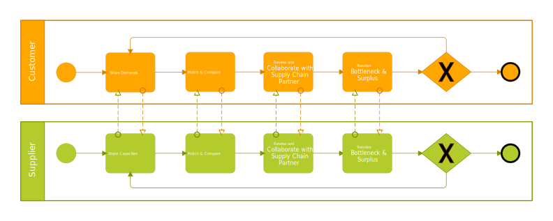
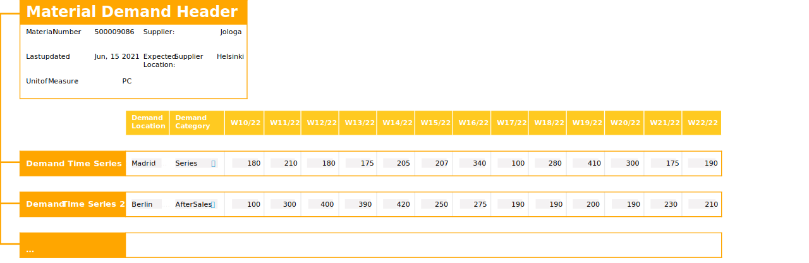
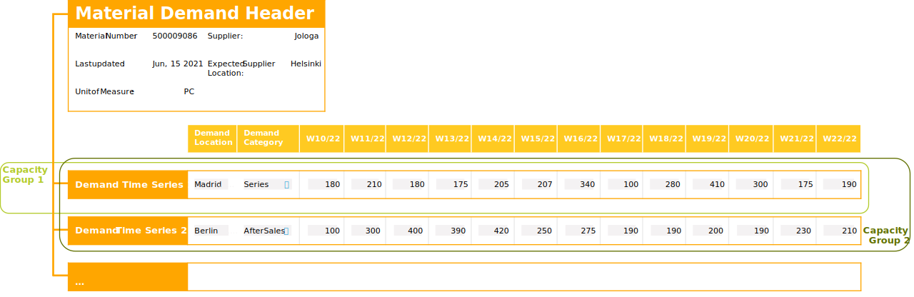
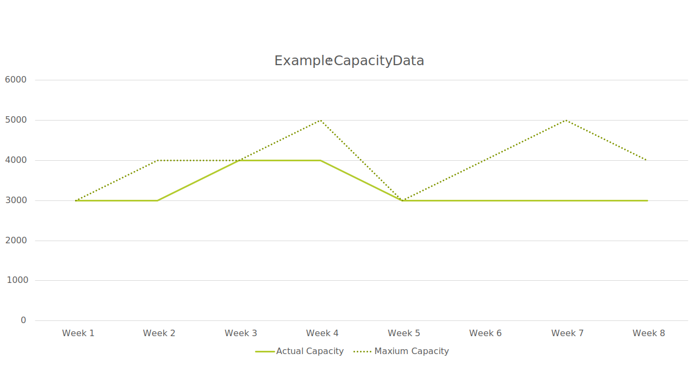
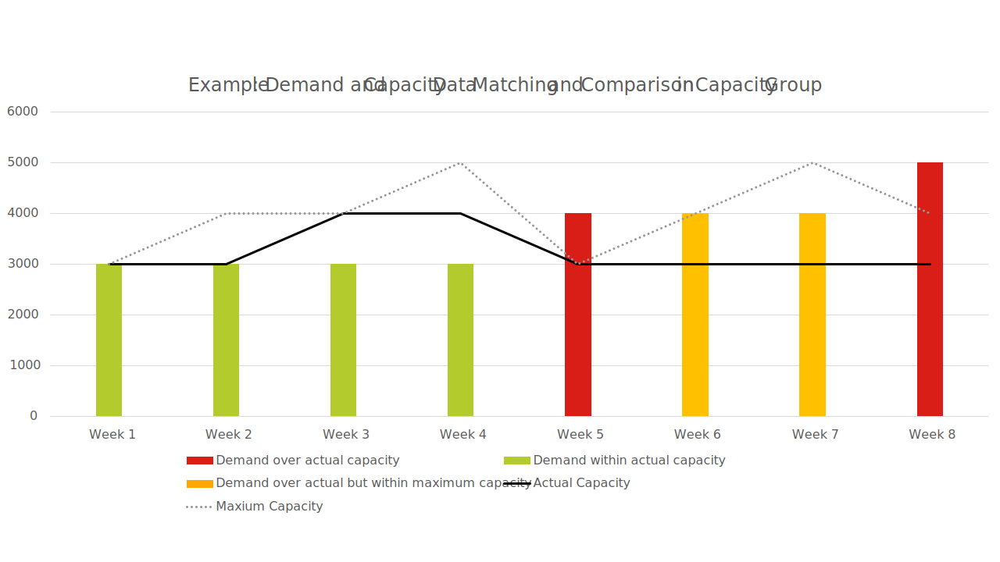
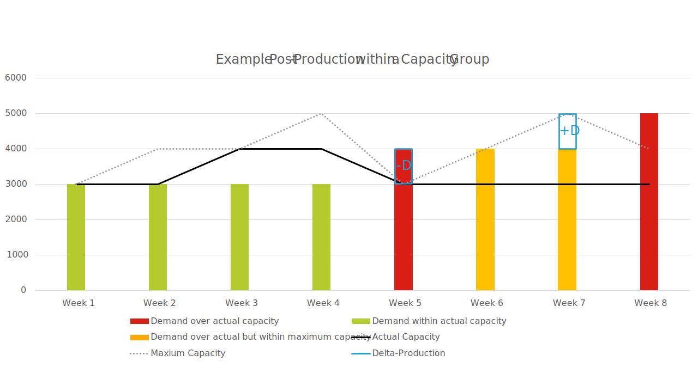

# CX-0128 Demand and Capacity Data Exchange

## ABSTRACT

The Catena-X-Standard **D**emand- and **C**apacity-**M**anagement (DCM) is for all participants of the automotive supply chain that want to **avoid** or **foresee production bottlenecks** based on rising demand planning or too low capacity planning based e.g. on drops in demand in a tactical (mid- to long-term) oriented period of time of up to 24 months in the future and beyond. **Collaboration between partners in a direct business relationship (often mentioned in this document as “one-up” and “one-down”) is a success factor.**

The Catena-X - DCM standards reach all participants (suppliers and OEM of all sizes and position in the n-tier-chain) of the supply chain with **maximum accessibility** and are orientated towards **users who are close to production** and production planning. The DCM process focuses on parts and on those materials used to manufacture parts that are of highest importance/relevance in order to provide the highest value for its users. By being like that it creates **win-win situations** for the directly involved parties as well as for the next ones along the value chain for the **ultimate goal of flexibly in fulfilling customer wishes (one-up + end customer)**.

Unlike proprietary or fully manual, resource consuming and error-prone solutions, **the standards and the solutions created on their base will be the foundation for collaborative demand and capacity management in the automotive industry** with the target of being fully interoperable to **existing solutions** (multi-customer-capable) and **granting data sovereignty**.

Resilience has become an imperative within Supply Chain Management especially over the past years. Disruptions of global Supply Chains in terms of material availability but also from logistics perspective during recent crises showed the need for additional countermeasures and technologies with regards to resiliency. Inside the volatile and highly complex surrounding of the automotive industry, several interfaces of individual IT-solutions exist inside a company and between the multiple players along the value chain. In addition, there is no common understanding of the process established across all the partners.

Demand and Capacity Management (DCM) focuses on the exchange of demand and capacity data between a customer and a supplier within their direct one-to-one business relationship. Thereby the demand information is sent by the customer to the supplier describing the planned need for a quantity of a certain material in a given calendar week. In turn, the supplier communicates back to the customer the respective information of the planned production capacity data that relates to the given quantity, material and calendar week.

On a general note, companies working as partners in a DCM environment need a common understanding to enable an interoperable exchange of DCM related data across different business partners and their systems while ensuring the data sovereignty of the individual partner.

This document is meant to describe the data models, the data exchange and a common core business logic to interpret them, thereby following the same approach for all partners involved in the DCM process.

The cross-company interactions required during the DCM process together with the corresponding common business logic are standardized in [Chapter 5](#5-processes), while the APIs are standardized in [Chapter 4](#4-application-programming-interfaces) and respective data models can be found in [Chapter 3](#3-aspect-models).

## COMPARISON WITH THE PREVIOUS VERSION OF THE STANDARD

- Merging of previous Standard documents CX-0046, CX-0047, CX-0048 into this document.
- New Content:
  - Nesting of CapacityGroups [Chapter 5.6.2](#562-capacitygroup-structure)
  - Load Factors [Chapter 5.6.4](#564-load-factors-for-capacitygroups)
  - Simulated Delta-Production (Pre-/Post-production) [Chapter 5.7.2](#572-simulated-delta-production-pre-post-production)
  - Request for Update [Chapter 5.8](#58-request-for-update-rfu)
  - Collaboration functionalities for DCM [Chapter 5.9](#59-collaboration-functionalities-for-demand-and-capacity-management)
- Changes:
  - WeekBasedMaterialDemand aspect model replaced by MaterialDemand aspect model
  - New properties in WeekBasedCapacityGroup aspect model
  - Unit of measure representation and handling in data models

All changes and novelties are implemented in all parts (API, Process and Data Model) of this document.

## 1 INTRODUCTION

### 1.1 AUDIENCE & SCOPE

> *This section is non-normative*

This document is designed for:

- Data Provider
- Data Consumer
- Business Application Provider

as participants in a DCM process.

For a better understanding of the roles and responsibility of each actor, please refer to [Chapter 5.2](#52-actors-and-roles).

The following regulations are in scope of the standard description:

DCM focuses on a period of time that lies in the future, where demand and capacities can be managed.

To run the DCM process, customers and suppliers depend on accurate planning capabilities, as well as the ability to quickly adapt to changes. How customers and suppliers calculate their respective demand or capacity data is excluded from this standardization. Derivation of measures in the respective companies is excluded, too.

Visuals/pictures as well as actors and their roles are used to exemplify concepts or processes and are not intended for mandatory use.

Standardization of data and methods in DCM context means that data consumers, data providers or business application providers must adopt a consistent core business logic, consistent data models and data exchange structures to enable an interoperable data exchange.

This document refers to a direct one-to-one business relationship between two parties (customer and supplier).

Each partner company participating in Catena-X DCM must have signed the DCM framework agreement.

### 1.2 CONTEXT AND ARCHITECTURE FIT

> *This section is non-normative*

Within this document the standard data models for the following objects, that are utilized by the use case DCM, are defined: MaterialDemand, WeekBasedCapacityGroup, IdBasedRequestForUpdate and IdBasedComment. These standards and their consistent data exchange structure ensure that:

- demand information, capacity information and comments can be provided and consumed by all companies participating in the use case DCM as customer and/or supplier.
- relevant data objects are handled and interpreted in an identical manner by all participants of the use case DCM.

Moreover, in this document the MaterialDemand API, WeekBasedCapacityGroup API, IdBasedRequestForUpdate API and IdBasedComment API are described and standardized to ensure a consistent data provision and data consumption via EDC between the use case participants. Thereby an identical interpretation of the data across different companies is ensured.

The data models must be exchanged via APIs described in this standard. For application providers, it is therefore sufficient to implement the APIs in accordance with this standard.
The APIs must only to be used in connection with Catena-X and an EDC.

### 1.2.1 Architectural Overview

General overview: the MaterialDemand, WeekBasedCapacityGroup, IdBasedRequestForUpdate as well as the IdBasedComment is a JSON string which is sent through EDC.

The JSON string is standardized in this document and contains either MaterialDemand, CapacityGroup, Request for Update or Comment information.

The standard only describes the sending and receiving of MaterialDemand, CapacityGroup, Request for Update and Comment information through EDC.

In addition the standard describes the optional usage of digital twin registries for supporting the transmission of MaterialDemands and CapacityGroups.

All four objects are created and handled by applications of the companies involved, but these applications are not part of the standard.

### 1.3 CONFORMANCE AND PROOF OF CONFORMITY

> *This section is non-normative*

As well as sections marked as non-normative, all authoring guidelines, diagrams, examples, and notes in this specification are non-normative. Everything else in this specification is normative.

The key words **MAY, MUST, MUST NOT, OPTIONAL, RECOMMENDED, REQUIRED, SHOULD** and **SHOULD NOT** in this document document are to be interpreted as described in BCP 14 [[RFC2119](#72-non-normative-references)] [[RFC8174](#72-non-normative-references)] when, and only when, they appear in all capitals, as shown here.

All participants and their solutions will need to proof, that they are conform with the Catena-X standards. To validate that the standards are applied correctly, Catena-X employs Conformity Assessment Bodies (CABs).

**Proof of Conformity for Data Models**

Any actor participating in the Catena-X DCM use case must implement and follow the DCM standardized Data Models as described in [Chapter 3](#3-aspect-models).

The proof of conformity for a single semantic model is done according to the general rules for proving the conformity of data provided to a semantic model or the ability to consume the corresponding data.

**Proof of Conformity for APIs**

Any actor participating in the Catena-X DCM use case must implement and follow the DCM standardized API as described in [Chapter 4](#4-application-programming-interfaces).

An example MaterialDemand JSON as created by their solution
An example WeekBasedCapacityGroup JSON as created by their solution
A proof that their solution can revieve and reply to an IdBasedRequestForUpdate
An example IdBasedComment JSON as created by their solution
A proof that their solution can process the example payload JSON as listed below
In case an assessee wants to get certified: When requesting assessment then the assessee produces a letter affirming that they adhere to this standard and the letter is signed by person who has full power of attorney.

Note that in a future revision of this standard it is planned to offer descriptions of test sets including test cases and test data for validating API implementations.

**Proof of Conformity for Process & Core Business Logic**

Any actor participating in the Catena-X DCM use case must implement and follow DCM core business logic as described in [Chapter 5](#5-processes).

Please be aware that dependent on the process step, different (sub-) standards may be relevant. For instance, when exchanging material demand information, only the standard API MaterialDemand as well as the standardized data model for `MaterialDemand` are relevant.

In case of exchange of capacity information, the same logic is relevant (I.e. only the standard API for CapacityGroup as well as the standardized data model for `WeekBasedCapacityGroup` must be used).

### 1.4 EXAMPLES

#### 1.4.1 Examples for Process & Core Business Logic

Any **application provider** that develops DCM solutions has to grant the fulfillment of these requirements:

- The solution has been designed to specify requirements for a trusted usage environment (e.g. identity verification and/or verification process).
- The solution is designed to require a contractual agreement in compliance with antitrust requirements in the usage environment (e.g. data contracts as a prerequisite for carrying out a data exchange). For reference see [Chapter 6](#6-framework-agreement-and-edc-policies) and follow EDC guidelines in [[CX-0018](#71-normative-references)].
- Before data exchange takes place, it must be checked whether the partner has signed the framework agreement. This check must be done in accordance to [[CX-0050](#71-normative-references)] Framework Agreement Credential.
- The solution has been designed to limit visibility and/or access to concrete data content as much as possible (e.g. data offer does not yet allow data access).
- The solution has been designed to require the implementation of notice and/or acknowledgement concepts to raise awareness of antitrust issues during use (e.g. helpdesk or pop-up info).
- The solution has been designed to ensure traceability/reconstructability of processes through appropriate documentation and at the same time data sovereignty over concrete data content (e.g. through access, deletion or destination rights).

Any **customer and supplier** in the DCM process (I.e. data provider and/or data consumer) must fulfill following requirements:

- Each partner company participating in Catena-X DCM must agree to the DCM framework agreement.
- Each application enabling and/or participating in the exchange of data as part of the demand and capacity management process must implement the core business logic defined in [Chapter 5](#5-processes).
- Standardization of data and methods in DCM means that data consumers, data providers or business application providers must adopt a consistent core business logic as defined in [Chapter 5](#5-processes) to enable an interoperable data exchange.
- Customer and supplier are in a contractual relationship with each other and agree to share data related to DCM.
- Access authorization to a DCM solution and to its related data will be self-managed by the customer and supplier companies themselves.
- Customer and supplier are technically able to apply the EDC policies in order to enable a secure collaborative data exchange.
- Customer and supplier follow the antitrust requirements.
- Customer and supplier agree on a common unit of measure (see Table 1 in [ANNEXES](#tables)) defined at product level to be used for data exchange purposes (e.g. demand & capacities).
- Both parties are technically able to participate within the DCM process.
- The supplier is be able to receive the material demand from the customer.
- The customer owns and publishes its own demand with its supplier for a period of time that lies in the future and it is highly recommended to avoid any gaps as far as possible and to share demand data at least until month 9, to ensure DCM participants to have sufficient demand data to enable a demand oriented capacity planning.
- Demand quantities refer to a period of one calendar week (weekly buckets).
- The gap between the forecasted demand and orders should be minimal. Therefore, demand should especially include any phase-in or phase-out events.
- Material demand data & quantities refer to one of the categories defined in the table in [Chapter 5.5.1](#551-detailed-description-of-demand) of this document.
- Material demand is consistent with other data exchanged via different channels/applications, e.g. call-offs/scheduling agreements.
- Material demand data is updated and provided to supplier, whenever changes occur.
- The supplier owns and publishes capacity data to the customer, referring to material demand data shared by the customer.
- Capacity values are expressed as follows:
  - the "**actual capacity**" is the planned available capacity of a supplier.
  - and the "**maximum capacity**" is the maximum releasable capacity of a supplier - see detailed definition in [Chapter 1.5](#15-terminology).
    - it may be equal or may be larger than the "actual capacity" but it must not be smaller than the "actual capacity". For an even more detailed characterization of a bottleneck a constant/agreed capacity will be added additionally in a future release (24.05). The aim of this is to give a supplier and customer a better understanding of the capacity situation.
  - When the maximum capacity is larger than the "actual capacity", the difference is called "**flexible capacity**".
- The customer is able to receive the capacity group incl. the capacity information.
- The supplier that uses the capacity group links at least one material demand information to it, however often several material demand information are linked - see [Chapter 5.6.2](#562-capacitygroup-structure).
- The aspect model `WeekBasedCapacityGroup` is used by a supplier to provide capacity information to the customer.
- Based on the aspect model `WeekBasedCapacityGroup` and `MaterialDemand`, both supplier and customer apply the matching logic defined in [Chapter 5.7](#57-comparison-of-demand-and-capacity-data-within-a-capacity-group) to ensure a common interpretation of the data.
- Business application provider, data provider or data consumer enable their DCM system to recognize the matching situation based on the table below and are able to interpret the matching result accordingly.
- The customer and supplier are able to send and receive comments to an object, which the two business partners have already been exchanged with each other. This object is identified by a concrete "ObjectID" , which is either an UUID of a WeekBasedCapacityGroup or an UUID of a MaterialDemand - see [Chapter 5.9](#59-collaboration-functionalities-for-demand-and-capacity-management).
- Customer and Supplier are capable of receiving and correctly responding to a Request for Update - see [Chapter 5.8](#58-request-for-update-rfu). Being able to send a Request for Update is recommended.

#### 1.4.2 Examples for Data Models

In this chapter, examples for the value-only serialization of `MaterialDemand`,  `WeekBasedCapacityGroup`, `IdBasedRequestForUpdate` and `IdBasedComment` payloads in JSON format are listed for reference. The attributes are described further in [Chapter 5](#5-processes). Note that the values in double curly braces \{\{\}\} need to be replaced with actual valid values.

##### 1.4.2.1  MaterialDemand data model JSON structure

> // value-only payload serialization example

```json
{
  "unitOfMeasureIsOmitted" : false,
  "demandRate" : {
    "demandRateCode" : "WKS"
  },
  "unitOfMeasure" : "unit:piece",
  "materialDescriptionCustomer" : "Spark Plug",
  "materialGlobalAssetId" : "urn:uuid:48878d48-6f1d-47f5-8ded-a441d0d879df",
  "materialDemandId" : "0157ba42-d2a8-4e28-8565-7b07830c1110",
  "materialNumberSupplier" : "MNR-8101-ID146955.001",
  "supplier" : "{{CATENAX-SUPPLIER-BPNL}}",
  "changedAt" : "2023-11-05T08:15:30.123-05:00",
  "demandSeries" : [ {
    "expectedSupplierLocation" : "{{CATENAX-SUPPLIER-BPNS}}",
    "demands" : [ {
      "demand" : 1000,
      "pointInTime" : "2023-10-09"
    } ],
    "customerLocation" : "{{CATENAX-CUSTOMER-BPNS}}",
    "demandCategory" : {
      "demandCategoryCode" : "0001"
    }
  } ],
  "materialNumberCustomer" : "MNR-7307-AU340474.002",
  "customer" : "{{CATENAX-CUSTOMER-BPNL}}"
}
```

##### 1.4.2.2 WeekBasedCapacityGroup data model JSON structure

> // value-only payload serialization example

```json
{
  "unitOfMeasureIsOmitted" : false,
  "unitOfMeasure" : "unit:piece",
  "linkedDemandSeries" : [ {
    "loadFactor" : 3.5,
    "materialNumberCustomer" : "MNR-7307-AU340474.002",
    "materialNumberSupplier" : "MNR-8101-ID146955.001",
    "customerLocation" : "{{CATENAX-CUSTOMER-BPNS}}",
    "demandCategory" : {
      "demandCategoryCode" : "0001"
    }
  } ],
  "supplier" : "{{CATENAX-SUPPLIER-BPNL}}",
  "linkedCapacityGroups" : [ "be4d8470-2de6-43d2-b5f8-2e5d3eebf3fd" ],
  "name" : "Spark Plugs on drilling machine for car model XYZ",
  "supplierLocations" : [ "{{CATENAX-SUPPLIER-BPNS}}" ],
  "capacities" : [ {
    "pointInTime" : "2022-08-01",
    "actualCapacity" : 1000,
    "maximumCapacity" : 2000,
    "deltaProductionResult" : 400
  } ],
  "changedAt" : "2023-03-10T12:27:11.320Z",
  "capacityGroupId" : "0157ba42-d2a8-4e28-8565-7b07830c1110",
  "customer" : "{{CATENAX-CUSTOMER-BPNL}}"
}
```

#### 1.4.2.3 IdBasedRequestForUpdate data model JSON structure

> // value-only payload serialization example

```json
{
  "materialDemand" : [ {
    "materialDemandId" : "0157ba42-d2a8-4e28-8565-7b07830c3456",
    "changedAt" : "2023-03-10T12:27:11.320Z"
  } ],
  "weekBasedCapacityGroup" : [ {
    "capacityGroupId" : "0157ba42-d2a8-4e28-8565-7b07830c1110",
    "changedAt" : "2023-03-10T12:27:11.320Z"
  } ]
}
```

##### 1.4.2.4 IdBasedComment data model JSON structure

> // value-only payload serialization example

```json
{
  "postedAt" : "2023-03-10T12:27:11.320Z",
  "listOfReferenceDates" : [ "2023-11-05" ],
  "author" : "someone@company.com",
  "supplier" : "{{CATENAX-SUPPLIER-BPNL}}",
  "commentType" : "information",
  "commentId" : "f5c151e4-30b5-4456-94fd-2a7b559b6121",
  "changedAt" : "2023-03-10T12:27:11.320Z",
  "commentText" : "Hello, this is a comment!",
  "requestDelete" : true,
  "objectId" : "dfeb1334-497e-4dab-97c1-4e6f4e1c0320",
  "objectType" : "urn:samm:io.catenax.week_based_capacity_group",
  "customer" : "{{CATENAX-CUSTOMER-BPNL}}"
}
```

### 1.5 TERMINOLOGY

> *This section is non-normative*

| Term            | Description                                                                                                    |
|:----------------|:---------------------------------------------------------------------------------------------------------------|
| Actual Capacity | Is the planned available capacity of a supplier, which should be approximately realistic to achieve a material output per calendar week with a certain unit of measurement for one customer. The actual capacity is based on the supplier's assessment of its own capabilities and/or inventories as well as known commitments. |
| Aspect Model    | A formal, machine-readable semantic description (expressed with RDF/turtle) of data accessible from an Aspect. **Note 1** to entry: An Aspect Model must adhere to the Semantic Aspect Meta Model (SAMM), i.e., it utilizes elements and relations defined in the Semantic Aspect Meta Model and is compliant to the validity rules defined by the Semantic Aspect Meta Model. **Note 2** to entry: Aspect model are logical data models which can be used to detail a conceptual model in order to describe the semantics of runtime data related to a concept. Further, elements of an Aspect model can/should refer to terms of a standardized Business Glossary (if existing).
| Bottleneck | A facility, function, department, or resource whose capacity is less than the demand placed upon it. For example, a bottleneck machine or work center exists where jobs are processed at a slower rate than they are demanded (Source: ASCM Supply Chain Dictionary, 17th edition). |
| Business Partner | Number Legal Entity (BPNL) A BPNL is the unique identifier of a partner within Catena-X, e.g. a company. |
| Business Partner Number Site (BPNS) | A BPNS is the unique identifier of a partner location within Catena-X, e.g. a specific factory of a company. |
| Calendar Week | A calendar week refers to all 7 days of a week. The counting of the calendar week within a year is based on the Thursday and starts at one ("1") with the week whose Thursday is first in the current year. Example: Week 1 of 2026 = Mon: 29 December 2025, Thu: 01.01.2026, Sun: 4.1.2026. |
| Capacity | 1. The capability of a system to perform its expected function. 2. The capability of a worker, machine, work center, plant, or organization to produce output per time period. (Source: ASCM Supply Chain Dictionary, 17th edition). |
| CapacityGroup | The Capacity Group is the functional entity where material demand and capacity information are matched and compared for the purpose of a collaborative DCM. When the term is written as one word (`WeekBasedCapacityGroup`), the term refers specifically to the respective aspect model. |
| Comment | A comment is foundational collaboration capability between two business partners in their individual one-up and one-down business relationship. Thereby both business partners are able to interoperable exchange messages in the individual relationship related to their exchanged material demand and capacity group information. This enables the business partners to directly collaborate with each other based on the exchanged data, while supporting the "common point of truth" and to provide context information as well as to enable a quick resolution of bottlenecks or other issues. |
| Comments | are based on an exchange of text information. No documents or attachments will be exchanged. |
| CreationEntity | The creation entity is currently only used to group CapacityGroups together in order to facilitate the usage of digital twins within the DCM use case. The Creation Entity could represent a production plant from the individual supplier-customer relationship. The meaning of Creation Entity is going to be shaped more clearly by future revisions of this standard. |
|(Simulated) Delta-Production | Simulated Delta-Production in terms of simulated pre-production and/or post-production is a valuable capability supporting suppliers to solve or level out capacity bottlenecks without modifying the actual or maximum capacity. However, this is an optional supporting function which suppliers may use. |
| Digital Twin | Based on [[CX-0002](#71-normative-references)] Standard a digital twin (DT) describes a digital representation of an asset sufficient to meet the requirements of a set of use cases. For detailed information please refer to [[CX-0002](#71-normative-references)] Digital Twins in Catena-X. |
| Linking MaterialDemand | There are two types of linking MaterialDemand: 1. Direct linking means that the CapacityGroup links at least one MaterialDemand.  2. Indirect linking means the CapacityGroup links another CapacityGroup which links at least one MaterialDemand (this way of linking CapacityGroups to MaterialDemand is considered as "Nesting" of CapacityGroup) |
| Load Factor | An optional load factor adds a numerical multiplication factor to the known Catena-X CapacityGroup for all MaterialDemands of the CapacityGroup.  The load factor is defined per material in an individual CapacityGroup by the owner of the CapacityGroup. If there would be higher than normal loads in the CapacityGroup due to certain material variants, this is taken into account by scaling linearly with the load factor. Thus, the CapacityGroup is more heavily loaded by these scaled demands. Also this load factor can act as a conversion factor, converting the demand into a deviating unit of measure that applies for the CapacityGroup e.g. time or cycles. |
| Materials | Materials is currently used to group MaterialDemands together in order to facilitate the usage of digital twins within the DCM use case.  Materials is the mirror object to CreationEntity. The meaning of Materials is going to be shaped more clearly by future revisions of this standard. |
| (Material) demand | A need for a particular product or component. The demand could come from any number of sources (e.g., a customer order or forecast, an interplant requirement, a branch warehouse request for a service part, or the manufacturing of another product). At the finished goods level, demand data is usually different from sales data because demand does not necessarily result in sales (i.e., If there is no stock, there will be no sale (Source: ASCM Supply Chain Dictionary, 17th edition). Material demand may comprise multiple demand series by location and demand categories. When the term is written as one word (`MaterialDemand`), the term refers specifically to the respective aspect model. |
| Maximum Capacity | Is the maximum releasable capacity of a supplier which should be possible to achieve a material output per calendar week with a certain unit of measurement for one customer. The maximum capacity is based on capacity-increasing measures, agreed by the parties involved. Capacity-increasing measures can be, for example, a longer utilization of the available production resources, a shift extension or additional shifts. Secondarily, additional resources can also be activated. |
| Nesting | Nesting uses one or more LinkedCapacityGroups to link material demand time series to the CapacityGroup. Nesting works indirectly and can replace the direct link to specific demand time series. The advantage of nesting is that it dynamically changes the links to material demand time series. It provides a single point of master data management. |
| Flexible Capacity | Difference/Area between maximum capacity and actual capacity. Available flexible capacity is indicated if the actual capacity is below the maximum capacity. Flexible capacity describes the remaining ability to apply capacity-increasing measures that needs no additional agreement upon the parties involved. In particular, it refers to measures to extend the weekly utilization of the available production resources. |
| Surplus (capacity) | A situation in which an oversupply exists. For example, a machine or work center exists where jobs could be processed, but demand does not require them. Synonymous: free capacity, idle capacity. |
| WeekBasedCapacityGroup | Refers to the `WeekBasedCapacityGroup` object with the same name from this standard. |

Additional terminology used in this standard can be looked up in the glossary on the association homepage.

## 2 RELEVANT PARTS OF THE STANDARD FOR SPECIFIC USE CASES

> *This section is normative*

This chapter lists all aspects of this standard that directly impact other Catena-X use cases if modified.

### 2.1 Material Demand

The data model `MaterialDemand` (`urn:samm:io.catenax.material_demand:1.0.0`) is also used by the standard "Short-Term Material Demand Exchange".

### 2.2 Digital Twins

The digital twins of parts (BoMAsPlanned) are not only used in the context of this document, but are also used by other standards in the context of Catena-X. For further information please refer to [[CX-0126](#71-normative-references)] Industry Core: Part Type.

## 3 ASPECT MODELS

> *This section is normative*

### 3.1 ASPECT MODEL "MaterialDemand"

> *This section is normative*

#### 3.1.1 INTRODUCTION

The material demand information MUST be sent from the customer to the supplier according to the API standard described in [Chapter 4.1](#41-materialdemand-api). The data format described here MUST be followed for the exchange of the material demand information.

The `MaterialDemand` data model MUST be implemented by all participants who wish to participate in the Catena-X DCM use case as a customer or supplier.

Companies that act as supplier in the Demand and Capacity Management process within Catena-X MUST be able to receive material demand information.

Companies that act as customer in the Demand and Capacity Management process within Catena-X MUST be able to send material demand information.

Companies that acts in both roles, MUST therefore be able to receive and send material demand information. It is RECOMMENDED that participating companies implement both directions of data flows (sending & receiving).

Every data provider of `MaterialDemand` data MUST provide the data conformant to the semantic model specified in this document.

The unique identifier of the semantic model specified in this document MUST be used by the data provider to define the semantics of the data being transferred.

Every business application relying on `MaterialDemand` data MUST be able to consume data conformant to the semantic model specified in this document.

This semantic model MUST be made available in the central Semantic Hub.

Data consumers and data provider MUST comply with the license of the semantic model defined in [Chapter 3.1.3](#313-license).

In the Catena-X data space `MaterialDemand` data MUST be requested and exchanged via Eclipse Dataspace Connector (EDC) conformant to [[CX-0018](#71-normative-references)] and [[CX-0002](#71-normative-references)].

The JSON Payload of data providers MUST be conformant to the JSON Schema as specified in this document.

The characteristics BPNL and BPNS MUST be used according to the standard [[CX-0010](#71-normative-references)].

#### 3.1.2 SPECIFICATION ARTIFACTS

The modeling of the semantic model specified in this document was done in accordance to the "semantic driven workflow" to create a Submodel template specification [[SMT](#72-non-normative-references)].

This aspect model is written in SAMM 2.0.0 as a modeling language conformant to [[CX-0003](#71-normative-references)] as input for the semantic driven workflow.

Like all Catena-X data models, this model is available in a machine-readable format on GitHub conformant to [[CX-0003](#71-normative-references)].

#### 3.1.3 LICENSE

This Catena-X data model is made available under the terms of the Creative Commons Attribution 4.0 International ([CC-BY-4.0](#72-non-normative-references)) license, which is available at Creative Commons.

#### 3.1.4 IDENTIFIER OF SEMANTIC MODEL

The semantic model has the unique identifier

```text
urn:samm:io.catenax.material_demand:1.0.0
```

This identifier MUST be used by the data provider to define the semantics of the data being transferred.

#### 3.1.5 FORMATS OF SEMANTIC MODEL

##### 3.1.5.1 RDF Turtle

The rdf turtle file, an instance of the Semantic Aspect Meta Model, is the master for generating additional file formats and serializations.

```text
https://github.com/eclipse-tractusx/sldt-semantic-models/blob/main/io.catenax.material_demand/1.0.0/MaterialDemand.ttl
```

The open source command line tool of the Eclipse Semantic Modeling Framework is used for generation of other file formats like for example a JSON Schema, aasx for Asset Administration Shell Submodel template or a HTML documentation.

##### 3.1.5.2 JSON Schema

A JSON Schema can be generated from the RDF Turtle file. The JSON Schema defines the Value-Only payload of the Asset Administration Shell for the API operation "GetSubmodel".

##### 3.1.5.3 aasx

An AASX file can be generated from the RDF Turtle file. The AASX file defines one of the requested artifacts for a Submodel template specification conformant to [[SMT](#72-non-normative-references)].

##### 3.1.6 SEMANTIC MODEL

Not applicable.

### 3.2 ASPECT MODEL "WeekBasedCapacityGroup"

> *This section is normative*

#### 3.2.1 INTRODUCTION

The capacity group information MUST be sent from the supplier to the customer according to the API standard described in [Chapter 4.2](#42-weekbasedcapacitygroup-api). The data format described here MUST be followed for the exchange of the capacity group information.

The `WeekBasedCapacityGroup` data model MUST be implemented by all participants who wish to participate in the Catena-X DCM use case as a customer or supplier.

Companies, who participate in the DCM use case as a supplier, MUST be able to send capacity group information.

Companies, who participate in the DCM use case as a customer, MUST be able to receive capacity group information.

Companies who participate in the DCM use case with both roles therefore MUST be able to receive and send capacity group information. It is RECOMMENDED that participating companies implement both directions of data flows (sending & receiving).

Every data provider of `WeekBasedCapacityGroup` data MUST provide the data conformant to the semantic model specified in this document.

The unique identifier of the semantic model specified in this document MUST be used by the data provider to define the semantics of the data being transferred.

Every business application relying on `WeekBasedCapacityGroup` data MUST be able to consume data conformant to the semantic model specified in this document.

This semantic model MUST be made available in the central Semantic Hub.

Data consumers and data provider MUST comply with the license of the semantic model defined in [Chapter 3.2.3](#323-license).

In the Catena-X data space `WeekBasedCapacityGroup` data MUST be requested and exchanged via Eclipse Dataspace Connector (EDC) conformant to [[CX-0018](#71-normative-references)] and [[CX-0002](#71-normative-references)].

The JSON Payload of data providers MUST be conformant to the JSON Schema as specified in this document.

The characteristics BPNL and BPNS MUST be used according to the standard [[CX-0010](#71-normative-references)].

#### 3.2.2 SPECIFICATION ARTIFACTS

The modeling of the semantic model specified in this document was done in accordance to the "semantic driven workflow" to create a Submodel template specification [[SMT](#72-non-normative-references)].

This aspect model is written in SAMM 2.0.0 as a modeling language conformant to [[CX-0003](#71-normative-references)] as input for the semantic driven workflow.

Like all Catena-X data models, this model is available in a machine-readable format on GitHub conformant to [[CX-0003](#71-normative-references)].

#### 3.2.3 LICENSE

This Catena-X data model is made available under the terms of the Creative Commons Attribution 4.0 International ([CC-BY-4.0](#72-non-normative-references)) license, which is available at Creative Commons.

#### 3.2.4 IDENTIFIER OF SEMANTIC MODEL

The semantic model has the unique identifier

```text
urn:samm:io.catenax.week_based_capacity_group:2.0.0
```

This identifier MUST be used by the data provider to define the semantics of the data being transferred.

#### 3.2.5 FORMATS OF SEMANTIC MODEL

##### 3.2.5.1 RDF Turtle

The rdf turtle file, an instance of the Semantic Aspect Meta Model, is the master for generating additional file formats and serializations.

```text
https://github.com/eclipse-tractusx/sldt-semantic-models/blob/main/io.catenax.week_based_capacity_group/2.0.0/WeekBasedCapacityGroup.ttl
```

The open source command line tool of the Eclipse Semantic Modeling Framework is used for generation of other file formats like for example a JSON Schema, aasx for Asset Administration Shell Submodel template or a HTML documentation.

##### 3.2.5.2 JSON Schema

A JSON Schema can be generated from the RDF Turtle file. The JSON Schema defines the Value-Only payload of the Asset Administration Shell for the API operation "GetSubmodel".

##### 3.2.5.3 aasx

An AASX file can be generated from the RDF Turtle file. The AASX file defines one of the requested artifacts for a Submodel template specification conformant to [[SMT](#72-non-normative-references)].

#### 3.2.6 SEMANTIC MODEL

Not applicable.

### 3.3 ASPECT MODEL "IdBasedRequestForUpdate"

> *This section is normative*

#### 3.3.1 INTRODUCTION

A request for update can be sent from the supplier to the customer or vice versa for one or more dedicated entities according to the API standard described in [Chapter 4.3](#43-requestforupdate-api).

The data format described here MUST be followed for the receipt of the `IdBasedRequestForUpdate`.

The `IdBasedRequestForUpdate` data model MUST be implemented by all participants who wish to participate in the Catena-X DCM use case as a customer or supplier to be able to receive such a request. Being able to send an `IdBasedRequestForUpdate` is OPTIONAL. It is RECOMMENDED that companies implement both ways of communication.

Every sender of an `IdBasedRequestForUpdate` MUST provide the data conformant to the semantic model specified in this document.

The unique identifier of the semantic model specified in this document MUST be used by the requester to define the semantics of the data being transferred.

Every business application relying on the `IdBasedRequestForUpdate` data MUST be able to consume data conformant to the semantic model specified in this document.

This semantic model MUST be made available in the central Semantic Hub.

Data consumers and data provider MUST comply with the license of the semantic model defined in [Chapter 3.3.3](#333-license).

In the Catena-X data space `IdBasedRequestForUpdate` data MUST be requested and exchanged via Eclipse Dataspace Connector (EDC) conformant to [[CX-0018](#71-normative-references)] and [[CX-0002](#71-normative-references)].

The JSON Payload of data requesters MUST be conformant to the JSON Schema as specified in this document.

#### 3.3.2 SPECIFICATION ARTIFACTS

The modeling of the semantic model specified in this document was done in accordance to the "semantic driven workflow" to create a Submodel template specification [[SMT](#72-non-normative-references)].

This aspect model is written in SAMM 2.0.0 as a modeling language conformant to [[CX-0003](#71-normative-references)] as input for the semantic driven workflow.

Like all Catena-X data models, this model is available in a machine-readable format on GitHub conformant to [[CX-0003](#71-normative-references)].

#### 3.3.3 LICENSE

This Catena-X data model is made available under the terms of the Creative Commons Attribution 4.0 International ([CC-BY-4.0](#72-non-normative-references)) license, which is available at Creative Commons.

#### 3.3.4 IDENTIFIER OF SEMANTIC MODEL

The semantic model has the unique identifier

```text
urn:samm:io.catenax.id_based_request_for_update:2.0.0
```

This identifier MUST be used by the data provider to define the semantics of the data being transferred.

#### 3.3.5 FORMATS OF SEMANTIC MODEL

##### 3.3.5.1 RDF Turtle

The rdf turtle file, an instance of the Semantic Aspect Meta Model, is the master for generating additional file formats and serializations.

```text
https://github.com/eclipse-tractusx/sldt-semantic-models/blob/main/io.catenax.id_based_request_for_update/2.0.0/IdBasedRequestForUpdate.ttl
```

The open source command line tool of the Eclipse Semantic Modeling Framework is used for generation of other file formats like for example a JSON Schema, aasx for Asset Administration Shell Submodel template or a HTML documentation.

##### 3.3.5.2 JSON Schema

A JSON Schema can be generated from the RDF Turtle file. The JSON Schema defines the Value-Only payload of the Asset Administration Shell for the API operation "GetSubmodel".

##### 3.3.5.3 aasx

An AASX file can be generated from the RDF Turtle file. The AASX file defines one of the requested artifacts for a Submodel template specification conformant to [[SMT](#72-non-normative-references)].

##### 3.3.6 SEMANTIC MODEL

Not applicable.

### 3.4 ASPECT MODEL "IdBasedComment"

> *This section is normative*

#### 3.4.1 INTRODUCTION

An `IdBasedComment` that refers to a `WeekBasedCapacityGroup`, it's weekly capacities, a `MaterialDemand` or it's weekly demand series can be sent from the supplier to the customer or vice versa according to the API standard described in [Chapter 4.4](#44-idbasedcomment-api).

The data format described here MUST be followed for the exchange of the `IdBasedComment` information.

The `IdBasedComment` data model MUST be implemented by all participants in the Catena-X DCM use case.

Every data provider of `IdBasedComment` data MUST provide the data conformant to the semantic model specified in this document. Every data consumer MUST be able to consume `IdBasedComment` data which is conformant to the semantic model specified.

The unique identifier of the semantic model specified in this document MUST be used by the data provider to define the semantics of the data being transferred.

This semantic model MUST be made available in the central Semantic Hub.

Data consumers and data provider MUST comply with the license of the semantic model.

In the Catena-X data space `IdBasedComment` data MUST be exchanged via Eclipse Dataspace Connector (EDC) conformant to [[CX-0018](#71-normative-references)] and [[CX-0002](#71-normative-references)].

The JSON Payload of data providers MUST be conformant to the JSON Schema as specified in this document.

The characteristics BPNL and BPNS MUST be used according to the standard [[CX-0010](#71-normative-references)].

#### 3.4.2 SPECIFICATION ARTIFACTS

The modeling of the semantic model specified in this document was done in accordance to the "semantic driven workflow" to create a Submodel template specification [[SMT](#72-non-normative-references)].

This aspect model is written in SAMM 2.0.0 as a modeling language conformant to [[CX-0003](#71-normative-references)] as input for the semantic driven workflow.

Like all Catena-X data models, this model is available in a machine-readable format on GitHub conformant to [[CX-0003](#71-normative-references)].

#### 3.4.3 LICENSE

This Catena-X data model is made available under the terms of the Creative Commons Attribution 4.0 International ([CC-BY-4.0](#72-non-normative-references)) license, which is available at Creative Commons.

#### 3.4.4 IDENTIFIER OF SEMANTIC MODEL

The semantic model has the unique identifier

```text
urn:samm:io.catenax.id_based_comment:1.0.0
```

This identifier MUST be used by the data provider to define the semantics of the data being transferred.

#### 3.4.5 FORMATS OF SEMANTIC MODEL

##### 3.4.5.1 RDF Turtle

The rdf turtle file, an instance of the Semantic Aspect Meta Model, is the master for generating additional file formats and serializations.

```text
https://github.com/eclipse-tractusx/sldt-semantic-models/blob/main/io.catenax.id_based_comment/1.0.0/IdBasedComment.ttl
```

The open source command line tool of the Eclipse Semantic Modeling Framework is used for generation of other file formats like for example a JSON Schema, aasx for Asset Administration Shell Submodel template or a HTML documentation.

##### 3.4.5.2 JSON Schema

A JSON Schema can be generated from the RDF Turtle file. The JSON Schema defines the Value-Only payload of the Asset Administration Shell for the API operation "GetSubmodel".

##### 3.4.5.3 aasx

An AASX file can be generated from the RDF Turtle file. The AASX file defines one of the requested artifacts for a Submodel template specification conformant to [[SMT](#72-non-normative-references)].

#### 3.4.6 SEMANTIC MODEL

Not applicable.

## 4 APPLICATION PROGRAMMING INTERFACES

> *This section is normative*

**HEADER**

In order to exchange data with a DCM partner, the following structure of a POST request payload MUST be adhered to.

```json
{
  "messageHeader":
      <messageHeaderObject>,

  "content":{
      "informationObject":[
        <informationObject>,
        <informationObject>
      ]
  }
}
```

This structure guarantees a separation of header and content information and allows a collection of multiple information objects in the payload. `informationObject` can be either a `MaterialDemand`, `WeekBasedCapacityGroup`, `IdBasedComment` or `IdBasedRequestForUpdate`. The rdf turtle file, an instance of the Semantic Aspect Meta Model, is the master for generating additional file formats and serializations. The rdf turtle file for the `messageHeaderObject` is defined in a centralized shared aspect model which can be found under the following link:

```text
https://github.com/eclipse-tractusx/sldt-semantic-models/blob/main/io.catenax.shared.message_header/1.0.0/MessageHeaderAspect.ttl
```

The entities and characteristics of the rdf turtle itself contain the descriptions for the usage of the message header.

**CATENA-X MEMBERSHIP VERIFICATION**

Catena-X Membership MUST be verified in accordance with  [[CX-0016](#71-normative-references)] Company Attribute Verification before any data is allowed to be exchanged via any of the following APIs

### 4.1 MaterialDemand API

> *This section is normative*

The MaterialDemand contains the material demand information which is send from the customer to the supplier.

All participants participating in Catena-X DCM in the role of a customer MUST be able to send the `MaterialDemand`. All participants participating in Catena-X DCM in the role of a supplier MUST be able to receive and process the `MaterialDemand`.

#### 4.1.1 PRECONDITIONS AND DEPENDENCIES

The `MaterialDemand` API MUST be published towards the network using a Data Asset/Contract Offer in terms of the Dataspace Protocol as defined by IDSA, following the Catena-X standard [[CX-0001](#71-normative-references)].

#### 4.1.2 API SPECIFICATION

##### 4.1.2.1 API Endpoints & Resources

To support the exchange of `MaterialDemand` data, a business application MUST define a single endpoint supporting the HTTP POST request method as described in [[RFC9110](#72-non-normative-references)]. The structure of the endpoint MAY be freely chosen. The address of the endpoint MUST be provided as part of the EDC Data Asset defined in [Chapter 4.1.2.5](#4125-edc-data-asset-structure).

##### 4.1.2.2 Data Exchange

The `MaterialDemand` data MUST be sent from the customer to the supplier using an HTTP POST request. The data format described here MUST be followed for the exchange of the material demand information.

Multiple `MaterialDemand` aspects MAY be sent in one transfer as a JSON list as described in [Chapter 4](#41-materialdemand-api). If only one `MaterialDemand` aspect is transmitted, it MUST still be sent as a list with one entry.

The serialized JSON MUST NOT be larger than 15 MiB in size.

The `MaterialDemand` endpoint MUST be implemented by all participants who wish to participate in the Catena-X DCM use case as a supplier. Customers MUST be able to send `MaterialDemand` objects to their suppliers.

The data payload itself MUST be a valid JSON string.

All attributes marked as mandatory in the aspect model standard MUST be included in the dataset. Attributes marked as 'optional' MAY be included in the data set.

The usage of the attributes in the data model MUST follow the attribute descriptions of the respective aspect model and the definitions in [Chapter 3.1](#31-aspect-model-materialdemand) as well as Table 1 in [ANNEXES](#tables).

While some attributes are technically a string, not any string is valid. For example, `expectedSupplierLocation` MUST be formatted as a BPNS.

For the data exchange between demand and capacity management applications the `demandRateCode` MUST be set to 'WKS' (= weeks) in order to indicate, that the given granularity for the demands is on the level calendar weeks.

The `pointInTime` property represents the calendar week as a date and MUST be set to a monday of the week for that specific demand. The date format MUST be in accordance with [[ISO8601](#72-non-normative-references)] and MUST be in the format YYYY-MM-DD (for example 2023-02-13) without a time zone.

The attributes `demandCategory` and `unitOfMeasure` MUST be set to one of the defined values as defined in [Tables](#tables). If the customer explicitly does not want to send a unit of measure to the supplier, then the `unitOfMeasure` property can be omitted in the payload and the `unitOfMeasureIsOmitted` flag value MUST be set to `true`.

In addition to the definitions from [Chapter 5.5](#55-provisioning-demand-data-to-supplier), the following rules have to be followed.

The data series in the `MaterialDemand` SHOULD start already from week *n+2*, where n represents the current week.

The demand for the current week (*n=0*) and the next week (*n=1*) MAY be included in the dataset. The `MaterialDemand` MUST include at least one week other than the current or the next week (meaning it may not be empty). Every week MUST NOT be included multiple times in the same `MaterialDemand`.

If the demand for one of the weeks changes, the whole dataset MUST be sent to the supplier; sending the changes only (delta update / incremental update) is not possible. By this procedure, inconsistent or incomplete data sets are avoided. One data transfer MUST contain at least one `MaterialDemand` data set.

For the combination of the attributes `supplier`, `customer` and `materialNumberCustomer` in the object `MaterialDemand`, there MUST NOT be more than one `MaterialDemand` object in existence. This means that the customer needs to collect all demands for all factories and send them aggregated as one `MaterialDemand` to the supplier.

If the demand in a certain week has the value `0`, it MUST be explicitly included as such in the `MaterialDemand`, meaning the week cannot be left out (as there is a difference between `null` and `0`). Weeks with an unknown demand (value `null`) SHOULD be left out.

##### 4.1.2.3 UUID generation and handling

When exchanging demand data, the usage of UUIDv4 is required in order to reduce the probability of collision as well as to eliminate certain attack vectors. For technical purposes the UUIDv4 MUST be treated as unique within the supplier-customer relationship. For the combination of attributes `supplier`, `customer` and `materialNumberCustomer` in the object `MaterialDemand` there MUST be exactly one unique UUIDv4.

The UUIDv4 MUST be generated according to [[RFC4122](#72-non-normative-references)].

Refer to [Chapter 4.1.2.7](#4127-validating-payload) for further handling information.

##### 4.1.2.4 Available Data Types

The API MUST use JSON as the payload transported via HTTPS.

##### 4.1.2.5 EDC Data Asset Structure

The HTTP POST endpoint introduced in [Chapter 4.1.2.1](#4121-api-endpoints--resources) MUST NOT be called from a supply chain partner directly. Rather, it MUST be called via an EDC communication. Therefore, the endpoint MUST be offered as an EDC Data Asset. The latter MUST have a property `https://purl.org/dc/terms/type` with the ID `https://w3id.org/catenax/taxonomy#DcmMaterialDemand`. It can be abbreviated if the namespaces of key and value are part of the json-ld @context object (see example below). This property SHOULD be used to identify the asset when searching the assets catalog of a supplier. Because the asset reflects the contractual relationship between a supplier and its customers, only one asset with the aforementioned property for one version MUST be visible to the customer at any time to avoid ambiguity.

The API version described in this standard document MUST be published in the in the property `https://w3id.org/catenax/ontology/common#version` as version 2.0 in the asset. The requester of an asset MUST be able to handle multiple assets for this endpoint, being differentiated only by the version. The requester SHOULD choose the asset with the highest compatible version number implemented by themselves. If the requester cannot find a compatible version with their own, the requester MUST terminate the data transfer.

Each supplier MUST ensure that only their customers have access to the asset by using access and usage policies and respective contract definitions.

An example EDC Data Asset definition is shown below.

> Note: Expressions in double curly braces \{\{\}\} must be substituted with a corresponding value.

> // Asset definition example for EDC management API v3 (non-normative)

```json
{
  "@context": {
    "edc": "https://w3id.org/edc/v0.0.1/ns/",
    "cx-common": "https://w3id.org/catenax/ontology/common#",
    "cx-taxo": "https://w3id.org/catenax/taxonomy#",
    "dct": "https://purl.org/dc/terms/"
  },
  "@id": "{{ ASSET_ID }}",
  "properties": {
    "dct:type": {
      "@id": "cx-taxo:DcmMaterialDemand"
    },
    "description": "Endpoint for provisioning of material demands",
    "cx-common:version": "2.0"
  },
  "dataAddress": {
    "@type": "DataAddress",
    "type": "HttpData",
    "baseUrl": "{{ URL-BACKEND-APPLICATION-MATERIALDEMAND-ENDPOINT }}",
    "method": "POST",
    "proxyBody": "true",
    "contentType": "application/json"
  }
}
```

##### 4.1.2.6 Error Handling

Every API endpoint defined in [Chapter 4.1.2.1](#4121-api-endpoints--resources) MUST respond to incoming requests with HTTP status codes as described in [[RFC9110](#72-non-normative-references)]. All of the following HTTP status codes, except for codes `200` and `201`, MUST be interpreted as failures. Therefore, it may be sufficient for a business application to simply check if the status code is `200` or `201` or not. If not, the request failed.

| HTTP Status Code | HTTP Status Message |  Description |
|:-----------------|:--------------------|:-------------|
| 200 | OK | The request has succeeded. The `MaterialDemand` has been successfully processed in the backend system. |
| 201 | Created | The request has succeeded and has led to the creation of a new `MaterialDemand` in the backend system. |
| 400 | Bad request | The server cannot or will not process the request due to something that is perceived to be a client error (e.g. malformed request syntax, invalid request message framing, or deceptive request routing). |
| 401 | Unauthorized | The client request has not been completed because it lacks valid authentication credentials for the requested resource. |
| 403 | Forbidden | The `MaterialDemand` in question is not available for the client (e.g. it belongs to a different company). |
| 405 | Method not allowed | The method used to request the data was not POST. |
| 422 | Unprocessable Entity | The request was well-formed but was unable to be followed due to semantic errors, e.g. the JSON payload could not be parsed. |
| 503 | Service Unavailable | The server is not ready to handle the request. |

If one `MaterialDemand` aspect is transmitted in one HTTP request, the return codes MUST be used as stated in the table above.

If a list of multiple `MaterialDemand` aspects is transmitted in one HTTP request, the status code `400` MUST be used if at least one `MaterialDemand` in the list cannot be processed. Applications MAY choose to process valid entries from a list which also contains invalid entries. If a list of multiple `MaterialDemand` aspects is transmitted in one HTTP request, and all of them can be processed successfully, the status code `200` MUST be used.

The return codes `401`, `405`, `422` and `503` in the table above MAY also be applicable to a list of multiple `MaterialDemand` aspects.

Further status codes may be included in a later revision of this standard. The ability to send and receive one status code per sent or received list item might be included in a later revision of this standard.

##### 4.1.2.7 Validating payload

The following tables are supposed to answer questions regarding what business logic MUST be executed when receiving a `MaterialDemand` which has been formed in a specific way.

The order of rules is indicated by the 'Number' row. The rules MUST be executed in exactly this order, starting from the lowest number.

The first rule that matches MUST be executed. All other rules MUST be ignored.

'value' indicates the actual value written in quotation marks and without any specific formatting (e.g. italic).

*Valid value* indicates that the value is valid according to aspect model, API and process.

*Invalid value* indicates that the value is invalid according to to aspect model, API and process.

*Any value* indicates that the value can by anything, valid or not.

A whitespace or an empty cell indicates that for this specific rule that row is not applicable.

| **Number** | 1 |  |
|---|---|---|
| **Properties** |  |  |
| **Meta Properties** | Any property | *invalid value* |
|  | All other properties | *Any value* |
| **Actions** | Business Logic | Ignore received values |
|  | Return Code | 400 - Bad Request |

| **Number** | 2 |  |
|---|---|---|
| **Properties** | customer | Customer BPNL does not match the sending EDCs registered BPNL |
| **Meta Properties** | Any property |  |
|  | All other properties | *Valid value* |
| **Actions** | Business Logic | Ignore received values |
|  | Return Code | 400 - Bad Request |

| **Number** | 3 |  |
|---|---|---|
| **Properties** | customer | Supplier does not match any Supplier BPNL that I am responsible for |
| **Meta Properties** | Any property |  |
|  | All other properties | *Valid value* |
| **Actions** | Business Logic | Ignore received values |
|  | Return Code | 400 - Bad Request |

| **Number** | 4 |  |
|---|---|---|
| **Properties** | demandRateCode  | Does not match the string 'WKS' |
| **Meta Properties** | Any property |  |
|  | All other properties | *Valid value* |
| **Actions** | Business Logic | Ignore received values |
|  | Return Code | 400 - Bad Request |

| **Number** | 5 |  |
|---|---|---|
| **Properties** | materialDemandID  | *Known value* |
|  | changedAt  | More recent than all previously received `MaterialDemand` with the same materialDemandID |
| **Meta Properties** | Any property |  |
|  | All other properties | *Valid value* |
| **Actions** | Business Logic | Overwrite all existing values |
|  | Return Code | 200 - OK |

| **Number** | 6 |  |
|---|---|---|
| **Properties** | materialDemandID  | *Unknown value*, but there exists another UUID for the exact same combination of supplier, customer and materialNumberCustomer |
|  | customer  | *Known value* |
|  | supplier  | *Known value* |
|  | materialNumberCustomer  | *Known value* |
| **Meta Properties** | Any property |  |
|  | All other properties | *Valid value* |
| **Actions** | Business Logic | Ignore received values |
|  | Return Code | 400 - Bad Request |

| **Number** | 7 |  |
|---|---|---|
| **Properties** | materialDemandID  | *Unknown value* |
| **Meta Properties** | Any property |  |
|  | All other properties | *Valid value* |
| **Actions** | Business Logic | Save as new material demand with received values |
|  | Return Code | 201 - Created |

| **Number** | 8 |  |
|---|---|---|
| **Properties** | materialDemandID  | *Known value* |
|  | changedAt  | Older than any previously received `MaterialDemand` with the same materialDemandID |
| **Meta Properties** | Any property |  |
|  | All other properties | *Any value* |
| **Actions** | Business Logic | Ignore received values |
|  | Return Code | 400 - Bad Request |

| **Number** | 9 |  |
|---|---|---|
| **Properties** | materialDemandID  | *Known value* |
|  | changedAt  | Identical to the most recent of all previously received `MaterialDemand` with the same materialDemandID |
| **Meta Properties** | Any property |  |
|  | All other properties | *Any value* |
| **Actions** | Business Logic | Overwrite all existing values with received values |
|  | Return Code | 200 - OK |

### 4.2 WeekBasedCapacityGroup API

> *This section is normative*

The `WeekBasedCapacityGroup` contains the capacity group information which is send from the supplier to the customer.

All participants participating in Catena-X DCM in the role of a supplier MUST be able to send the `WeekBasedCapacityGroup`. All participants participating in Catena-X DCM in the role of a customer MUST be able to receive and process the `WeekBasedCapacityGroup`.

#### 4.2.1 PRECONDITIONS AND DEPENDENCIES

The `WeekBasedCapacityGroup` API MUST be published towards the network using a Data Asset/Contract Offer in terms of the Dataspace Protocol as defined by IDSA, following the Catena-X standard [[CX-0001](#71-normative-references)].

#### 4.2.2 API SPECIFICATION

##### 4.2.2.1 API Endpoints & Resources

To support the exchange of `WeekBasedCapacityGroup` data, a business application MUST define a single endpoint supporting the HTTP POST request method as described in [[RFC9110](#72-non-normative-references)]. The structure of the endpoint MAY be freely chosen. The address of the endpoint MUST be provided as part of the EDC Data Asset defined in [Chapter 4.2.2.5](#4225-edc-data-asset-structure).

##### 4.2.2.2 Data Exchange

The `WeekBasedCapacityGroup` data MUST be sent from the supplier to the customer using an HTTP POST request. The data format described here MUST be followed for the exchange of the capacity group information.

Multiple `WeekBasedCapacityGroup` aspects MAY be sent in one transfer as a JSON list as described in [Chapter 4](#4-application-programming-interfaces). If only one `WeekBasedCapacityGroup` aspect is transmitted, it MUST still be sent as a list with one entry.

The serialized JSON MUST NOT be larger than 15 MiB in size.

The `WeekBasedCapacityGroup` endpoint MUST be implemented by all participants who wish to participate in the Catena-X DCM use case as a customer. Suppliers MUST be able to send `WeekBasedCapacityGroup` objects to their customers.

The data payload itself MUST be a valid JSON string.

All attributes marked as mandatory in the aspect model standard MUST be included in the dataset. Attribute marked as 'optional' MAY be included in the data set.

The usage of the attributes in the data model MUST follow the attribute descriptions of the respective aspect model and the definitions in [Chapter 5.6](#56-provisioning-capacity-data-to-customer). For example, an exact definition of the different capacities is provided there and needs to be observed.

While some attributes are technically a string, not any string is valid. For example, `supplier` MUST be formatted as a BPNL.

The `pointInTime` property represents the calendar week of a capacities series as a date and MUST be set to a monday of the week for that specific capacity. The date format MUST be in accordance with [[ISO8601](#72-non-normative-references)] and MUST be in the format YYYY-MM-DD (for example 2023-02-13) without a time zone.

The attributes `demandCategory` and `unitOfMeasure` MUST be set to one of the defined values as defined in [Chapter 3.2](#32-aspect-model-weekbasedcapacitygroup). If the supplier explicitly does not want to send a unit of measure to the customer, then the `unitOfMeasure` property can be omitted in the payload and the `unitOfMeasureIsOmitted` flag value MUST be set to `true`.

The capacities for the current week (*n=0*) and the next week (*n=1*) MAY be included in the dataset. The `WeekBasedCapacityGroup` MUST include at least one week other than the current or the next week (meaning it may not be empty). Every week MUST NOT be included multiple times in the same `WeekBasedCapacityGroup`.

If the capacity for one of the weeks changes, the whole dataset MUST be sent to the customer, sending the changes only (delta update / incremental update) is NOT possible. By this procedure, inconsistent or incomplete data sets are avoided. One data transfer MUST contain at least one `WeekBasedCapacityGroup` data set.

Additional business-process related rules are specified in [Chapter 5](#5-processes), these MUST be followed as well. For example, the process defines a capacity and how it is to be interpreted or that a demand must be consistent with other exchanged information such as call-offs. All `WeekBasedCapacityGroup` objects MUST only use a mutually agreed unit of measure (as defined in [Chapter 5.4](#54-prerequisites-for-a-collaborative-demand-and-capacity-management)).

The property `linkedDemandSeries` is used to indicate to which MaterialDemand object a `WeekBasedCapacityGroup` object refers to. More specifically, the linkedDemandSeries refers to a demand for a specific `demandCategory` / `customerLocation` / `materialNumberCustomer` combination.

One specific combination of `demandCategory` / `customerLocation` / `materialNumberCustomer` MAY be referred to in multiple `WeekBasedCapacityGroup` objects. Therefore, one `materialNumberCustomer` MAY be contained in `linkedDemandSeries` of several different `WeekBasedCapacityGroup` objects.

The order of the entries listed in the `linkedDemandSeries` of a `WeekBasedCapacityGroup` is arbitrary and MUST be treated as such.

##### 4.2.2.3 UUID generation and handling

When exchanging capacity data, the usage of UUIDv4 is required in order to reduce the probability of collision as well as to eliminate certain attack vectors. For technical purposes the UUIDv4 MUST be treated as unique within the supplier-customer relationship.

The UUIDv4 MUST be generated according to [[RFC4122](#72-non-normative-references)].

Refer to [Chapter 4.2.2.7](#4227-validating-payload) for further handling information.

##### 4.2.2.4 Available Data Types

The API MUST use JSON as the payload transported via HTTPS.

##### 4.2.2.5 EDC Data Asset Structure

The HTTP POST endpoint introduced in [Chapter 4.2.2.1](#4221-api-endpoints--resources) MUST NOT be called from a supply chain partner directly. Rather, it MUST be called via an EDC communication. Therefore, the endpoint MUST be offered as an EDC Data Asset. The latter MUST have a property `https://purl.org/dc/terms/type` with the ID `https://w3id.org/catenax/taxonomy#DcmWeekBasedCapacityGroup`. It can be abbreviated if the namespaces of key and value are part of the json-ld @context object (see example below). This property SHOULD be used to identify the asset when searching the assets catalog of a customer. Because the asset reflects the contractual relationship between a customer and its suppliers, only one asset with the aforementioned property for one version MUST be visible to the supplier at any time to avoid ambiguity.

The API version described in this standard document MUST be published in the property `https://w3id.org/catenax/ontology/common#version` as version 2.0 in the asset. The requester of an asset MUST be able to handle multiple assets for this endpoint, being differentiated only by the version. The requester SHOULD choose the asset with the highest compatible version number implemented by themselves. If the requester cannot find a compatible version with their own, the requester MUST terminate the data transfer.

Each customer MUST ensure that only their suppliers have access to the asset by using access and usage policies and respective contract definitions.

An example EDC Data Asset definition is shown below.

> Note: Expressions in double curly braces \{\{\}\} must be substituted with a corresponding value.

> // Asset definition example for EDC management API v3 (non-normative)

```json
{
  "@context": {
    "edc": "https://w3id.org/edc/v0.0.1/ns/",
    "cx-common": "https://w3id.org/catenax/ontology/common#",
    "cx-taxo": "https://w3id.org/catenax/taxonomy#",
    "dct": "https://purl.org/dc/terms/"
  },
  "@id": "{{ ASSET_ID }}",
  "properties": {
    "dct:type": {
      "@id": "cx-taxo:DcmWeekBasedCapacityGroup"
    },
    "description": "Endpoint for provisioning of Week Based Capacity Groups",
    "cx-common:version": "2.0"
  },
  "dataAddress": {
    "@type": "DataAddress",
    "type": "HttpData",
    "baseUrl": "{{ URL-BACKEND-APPLICATION-WEEKBASEDCAPACITYGROUP-ENDPOINT }}",
    "method": "POST",
    "proxyBody": "true",
    "contentType": "application/json"
  }
}
```

##### 4.2.2.6 Error Handling

Every API endpoint defined in [Chapter 4.2.2.1](#4221-api-endpoints--resources) MUST respond to incoming requests with HTTP status codes as described in [[RFC9110](#72-non-normative-references)]. All of the following HTTP status codes, except for codes `200` and `201`, MUST be interpreted as failures. Therefore, it may be sufficient for a business application to simply check if the status code is `200` or `201` or not. If not, the request failed.

| HTTP Status Code | HTTP Status Message |  Description |
|:-----------------|:--------------------|:-------------|
| 200 | OK | The request has succeeded. The `WeekBasedCapacityGroup` has been successfully processed in the backend system. |
| 201 | Created | The request has succeeded and has led to the creation of a new `WeekBasedCapacityGroup` in the backend system. |
| 400 | Bad request | The server cannot or will not process the request due to something that is perceived to be a client error (e.g., malformed request syntax, invalid request message framing, or deceptive request routing). |
| 401 | Unauthorized | The client request has not been completed because it lacks valid authentication credentials for the requested resource. |
| 403 | Forbidden | The `WeekBasedCapacityGroup` in question is not available for the client (e.g. it belongs to a different company). |
| 405 | Method not allowed | The method used to request the data was not POST. |
| 422 | Unprocessable Entity | The request was well-formed but was unable to be followed due to semantic errors, e.g. the JSON payload could not be parsed. |
| 503 | Service Unavailable | The client request has not been completed because it lacks valid authentication credentials for the requested resource. |

If one `WeekBasedCapacityGroup` aspect is transmitted in one HTTP request, the return codes MUST be used as stated in the table above.

If a list of multiple `WeekBasedCapacityGroup` aspects is transmitted in one HTTP request, the status code `400` MUST be used if at least one `WeekBasedCapacityGroup` in the list cannot be processed. Applications MAY choose to process valid entries from a list which also contains invalid entries. If a list of multiple `WeekBasedCapacityGroup` aspects is transmitted in one HTTP request, and all of them can be processed successfully, the status code `200` MUST be used.

The return codes `401`, `405`, `422` and `503` in the table above MAY also be applicable to a list of multiple `WeekBasedCapacityGroup` aspects.

Further status codes may be included in a later revision of this standard. The ability to send and receive one status code per sent or received list item might be included in a later revision of this standard.

##### 4.2.2.7 Validating Payload

The following tables are supposed to answer questions regarding what business logic MUST be executed when receiving a `WeekBasedCapacityGroup` which has been formed in a specific way.

The order of rules is indicated by the 'Number' row.

The first rule that matches MUST be executed. All other rules MUST be ignored.

'value' indicates the actual value written in quotation marks and without any specific formatting (e.g. italic).

*Valid value* indicates that the value is valid according to aspect model, API and process.

*Invalid value* indicates that the value is invalid according to to aspect model, API and process.

*Any value* indicates that the value can by anything, valid or not.

A whitespace or an empty cell indicates that for this specific rule that row is not applicable.

| **Number** | 1 |  |
|---|---|---|
| **Properties** |  |  |
| **Meta Properties** | Any property | *invalid value* |
|  | All other properties | *Any value* |
| **Actions** | Business Logic | Ignore received values |
|  | Return Code | 400 - Bad Request |

| **Number** | 2 |  |
|---|---|---|
| **Properties** | customer | Supplier BPNL does not match the sending EDCs registered BPNL |
| **Meta Properties** | Any property |  |
|  | All other properties | *Valid value* |
| **Actions** | Business Logic | Ignore received values |
|  | Return Code | 400 - Bad Request |

| **Number** | 3 |  |
|---|---|---|
| **Properties** | customer | Customer does not match any Supplier BPNL that I am responsible for |
| **Meta Properties** | Any property |  |
|  | All other properties | *Valid value* |
| **Actions** | Business Logic | Ignore received values |
|  | Return Code | 400 - Bad Request |

| **Number** | 4 |  |
|---|---|---|
| **Properties** | linkedCapacityGroups | Either both linked CapacityGroups and linkedDemandSeries contain *Any value* or do not contain a value. |
| | linkedDemandSeries | Either both linked CapacityGroups and linkedDemandSeries contain *Any value* or do not contain a value. |
| **Meta Properties** | Any property |  |
|  | All other properties | *Valid value* |
| **Actions** | Business Logic | Ignore received values |
|  | Return Code | 400 - Bad Request |

| **Number** | 5 |  |
|---|---|---|
| **Properties** | capacityGroupID  | *Known value* |
|  | changedAt  | More recent than all previously received `WeekBasedCapacityGroup` with the same capacityGroupID |
| **Meta Properties** | Any property |  |
|  | All other properties | *Valid value* |
| **Actions** | Business Logic | Overwrite all existing values |
|  | Return Code | 200 - OK |

| **Number** | 6 |  |
|---|---|---|
| **Properties** | capacityGroupID  | *Unknown value* |
| **Meta Properties** | Any property |  |
|  | All other properties | *Valid value* |
| **Actions** | Business Logic | Save as new capacity group with received values |
|  | Return Code | 201 - Created |

| **Number** | 7 |  |
|---|---|---|
| **Properties** | capacityGroupID  | *Known value* |
|  | changedAt  | Older than any previously received `WeekBasedCapacityGroup` with the same capacityGroupID |
| **Meta Properties** | Any property |  |
|  | All other properties | *Any value* |
| **Actions** | Business Logic | Ignore received values |
|  | Return Code | 400 - Bad Request |

| **Number** | 8 |  |
|---|---|---|
| **Properties** | capacityGroupID  | *Known value* |
|  | changedAt  | Identical to the most recent of all previously received `WeekBasedCapacityGroup` with the same capacityGroupID |
| **Meta Properties** | Any property |  |
|  | All other properties | *Any value* |
| **Actions** | Business Logic | Overwrite all existing values with received values |
|  | Return Code | 200 - OK |

### 4.3 RequestForUpdate API

> *This section is normative*

The Request for Update (RfU) allows either supplier or customer to request updates of some or even all `MaterialDemand` or `WeekBasedCapacityGroup` objects. For example, RfU could be used in case of updating demands as well as capacity values in the requesting application.

Customer and supplier MUST be capable of receiving and correctly responding to a RfU. Being able send a RfU is RECOMMENDED.

The correct response to a RfU entails:

1. Answering with the appropriate HTTP status code
2. If that status code is 200 OK: Sending the requested material demands and capacity groups via `MaterialDemand` API or `WeekBasedCapacityGroup` API respectively.

It is RECOMMENDED that this functionality SHOULD NOT be an end-user functionality which can be executed in an user interface.

#### 4.3.1 PRECONDITIONS AND DEPENDENCIES

The `RequestForUpdate` API MUST be published towards the network using a Data Asset/Contract Offer in terms of the Dataspace Protocol as defined by IDSA, following the Catena-X standard [[CX-0001](#71-normative-references)].

#### 4.3.2 API SPECIFICATION

##### 4.3.2.1 API Endpoints & resources

To support RequestForUpdate, a business application MUST define a single endpoint supporting the HTTP POST request method as described in [[RFC9110](#72-non-normative-references)]. The structure of the endpoint MAY be freely chosen. The address of the endpoint MUST be provided as part of the EDC Data Asset defined in [Chapter 4.3.2.4](#4324-edc-data-asset-structure).

##### 4.3.2.2 Data Exchange

The RequestForUpdate data MUST be sent from the customer to the supplier or vice versa using an HTTP POST request. The data format described here MUST be followed in order to successfully facilitate a RfU.

An empty RfU payload requests all data within the specific customer-supplier relationship.

A RfU payload MAY specify that only MaterialDemands OR WeekBasedCapacityGroups are requested within the specific customer-supplier relationship.

A RfU payload MAY specify that only certain data objects, identified by their respective UUID, are requested within the specific customer-supplier relationship.

A RfU payload MAY specify that only certain data objects, that have been updated, identified by their respective UUID and ChangedAt value, are requested within the specific customer-supplier relationship.

The following example payloads are intended to illustrate the different possible payloads of an RequestForUpdate:

RfU: Send Everything

```json
{
}
```

RfU: Send only Material Demands

```json
{
    "materialDemand": [
    ]
}
```

RfU: Send only Capacity Groups

```json
{
    "weekBasedCapacityGroups": [
    ]
}
```

RfU: Send only certain Objects

```json
{
    "materialDemand": [
        {
            "materialDemandId":"278e333d-f06b-4b59-8e95-22862f69807f"},
        {
            "materialDemandId":"46adfa5d-36b7-4a9b-9ac6-508dac500dd2"}
    ]
},
{
    "weekBasedCapacityGroup": [
        {
            "capacityGroupId":"a2fc69ac-ede7-48d3-bee5-04de665d49f0"},
        {
            "capacityGroupId":"34238729-990a-4b61-b0c6-336da7b71675"}
    ]
}
```

RfU: Send only certain Objects and only if my version is not up to date

```json
{
    "materialDemand": [
        {
            "materialDemandId":"278e333d-f06b-4b59-8e95-22862f69807f"},
        {
            "materialDemandId":"46adfa5d-36b7-4a9b-9ac6-508dac500dd2"}
    ]
},
{
    "weekBasedCapacityGroup": [
        {
            "capacityGroupId":"a2fc69ac-ede7-48d3-bee5-04de665d49f0"},
        {
            "capacityGroupId":"34238729-990a-4b61-b0c6-336da7b71675",
            "changedAt": "2023-03-08T11:44:27.701+01:00"}
    ]
}
```

##### 4.3.2.3 Available Data Types

The API MUST use JSON as the payload transported via HTTPS.

##### 4.3.2.4 EDC Data Asset Structure

The HTTP POST endpoint introduced in [Chapter 4.3.2.1](#4321-api-endpoints--resources) MUST NOT be called from a supply chain partner directly. Rather, it MUST be called via an EDC communication. Therefore, the endpoint MUST be offered as an EDC Data Asset. The latter MUST have a property `https://purl.org/dc/terms/type` with the ID `https://w3id.org/catenax/taxonomy#DcmIdBasedRequestForUpdate`. It can be abbreviated if the namespaces of key and value are part of the json-ld @context object (see example below). This property SHOULD be used to identify the asset when searching the assets catalog of a partner. Because the asset reflects the contractual relationship between two DCM partners, only one asset with the aforementioned property for one version MUST be visible to the partner at any time to avoid ambiguity.

The API version described in this standard document MUST be published in the property `https://w3id.org/catenax/ontology/common#version` as version 2.0 in the asset. The requester of an asset MUST be able to handle multiple assets for this endpoint, being differentiated only by the version. The requester SHOULD choose the asset with the highest compatible version number implemented by themselves. If the requester cannot find a compatible version with their own, the requester MUST terminate the data transfer.

Each DCM participant MUST ensure that only their business partners have access to the asset by using access and usage policies and respective contract definitions.

An example EDC Data Asset definition is shown below.

> Note: Expressions in double curly braces \{\{\}\} must be substituted with a corresponding value.

> // Asset definition example for EDC management API v3 (non-normative)

```json
{
  "@context": {
    "edc": "https://w3id.org/edc/v0.0.1/ns/",
    "cx-common": "https://w3id.org/catenax/ontology/common#",
    "cx-taxo": "https://w3id.org/catenax/taxonomy#",
    "dct": "https://purl.org/dc/terms/"
  },
  "@id": "{{ ASSET_ID }}",
  "properties": {
    "dct:type": {
      "@id": "cx-taxo:DcmIdBasedRequestForUpdate"
    },
    "description": "Endpoint for requesting updates",
    "cx-common:version": "2.0"
  },
  "dataAddress": {
    "@type": "DataAddress",
    "type": "HttpData",
    "baseUrl": "{{ URL-BACKEND-APPLICATION-IDBASEDREQUESTFORUPDATE-ENDPOINT }}",
    "method": "POST",
    "proxyBody": "true",
    "contentType": "application/json"
  }
}
```

##### 4.3.2.5 Error Handling

Every API endpoint defined in [Chapter 4.3.2.1](#4321-api-endpoints--resources) MUST respond to incoming requests with HTTP status codes as described in [[RFC9110](#72-non-normative-references)]. All of the following HTTP status codes, except for code `200` , MUST be interpreted as failures. Therefore, it may be sufficient for a business application to simply check if the status code is `200` or not. If not, the request failed.

| HTTP Status Code | HTTP Status Message |  Description |
|:-----------------|:--------------------|:-------------|
| 200 | OK | The request has succeeded. The `RequestForUpdate` has been successfully processed in the backend system. |
| 400 | Bad request | The server cannot or will not process the request due to something that is perceived to be a client error (e.g., malformed request syntax, invalid request message framing, or deceptive request routing). |
| 401 | Unauthorized | The client request has not been completed because it lacks valid authentication credentials for the requested resource. |
| 403 | Forbidden | The `RequestForUpdate` functionality is not available for the client. |
| 405 | Method not allowed | The method used to request the data was not POST. |
| 422 | Unprocessable Entity | The request was well-formed but was unable to be followed due to semantic errors, e.g. the JSON payload could not be parsed. |
| 503 | Service Unavailable | The client request has not been completed because it lacks valid authentication credentials for the requested resource. |

Because multiple material demands and capacity groups can be requested at the same time HTTP status code `200` only means that the RequestForUpdate was processed successfully and that the data objects will be sent in due time.

The requested data objects SHOULD be sent within five minutes, but definitely they MUST be sent within 24 hours.

If only a single data object is requested it MUST be sent within 10 seconds.

##### 4.3.2.6 Validating payload

Payload validation only applies to the formal layer. If a payload is correctly formed and thusly can be processed HTTP `200` is the correct response code. Even if a material demand (identified by its UUID) has been requested that does not exists within that supplier-customer relationship, HTTP `200` is the correct response code.

### 4.4 IdBasedComment API

> *This section is normative*

The `IdBasedComment` contains the information for a comment referencing the UUID of an object and can be sent from the supplier to the customer and vice versa. The `IdBasedComment` MUST reference an object UUID of a MaterialDemand or a WeekBasedCapacityGroup which is exchanged between both business partners.

All participants participating in Catena-X DCM in the role of a supplier or a customer MUST be able to send and receive the `IdBasedComment`.

#### 4.4.1 PRECONDITIONS AND DEPENDENCIES

The `IdBasedComment` API MUST be published towards the network using a Data Asset/Contract Offer in terms of the Dataspace Protocol as defined by IDSA, following the Catena-X standard [[CX-0001](#71-normative-references)].

#### 4.4.2 API SPECIFICATION

##### 4.4.2.1 API Endpoints & Resources

To support the exchange of `IdBasedComment` data, a business application MUST define a single endpoint supporting the HTTP POST request method as described in [[RFC9110](#72-non-normative-references)]. The structure of the endpoint MAY be freely chosen. The address of the endpoint MUST be provided as part of the EDC Data Asset defined in [Chapter 4.4.2.5](#4425-edc-data-asset-structure).

##### 4.4.2.2 Data Exchange

The applications of the customer and supplier MUST be able to send and receive `IdBasedComment` data using an HTTP POST request. The data format described in [Chapter 3.4](#34-aspect-model-idbasedcomment) MUST be followed for the exchange of the comment information.

Multiple `IdBasedComment` aspects MAY be sent in one transfer as a JSON list. If only one `IdBasedComment` aspect is transmitted, it MUST still be sent as a list with one entry.

The serialized JSON MUST NOT be larger than 15 MiB in size.

The `IdBasedComment` endpoint MUST be implemented by all participants who wish to participate in the Catena-X DCM use case as a customer or supplier.

The data payload itself MUST be a valid JSON string.

All attributes marked as mandatory in the respective aspect model standard MUST be included in the dataset. Attributes marked as 'optional' MAY be included in the data set.

The usage of the attributes in the data model MUST follow the attribute descriptions of the respective aspect model and the definitions in [Chapter 5.9](#59-collaboration-functionalities-for-demand-and-capacity-management).

While some attributes are technically a string, not any string is valid. For example, `objectType` MUST be as a Catena-X aspect model unique identifier (defined in [Chapter 3.1.4](#314-identifier-of-semantic-model) and [Chapter 3.2.4](#324-identifier-of-semantic-model)) without a version. For reusability reasons of the aspect model there are no enum values defined in the characteristic of this property.

The `author` MUST either be a valid email address of the sending user of the comment or a BPNL of the sending company in case the sending user wants to stay anonymous.

The comment MUST be sent with reference to an `objectId`, which MUST be either a `WeekBasedCapacityGroup` UUID or a `MaterialDemand` UUID.

The `listOfReferenceDates` property MAY contain all calendar weeks the sending user wants to refer to. The calendar weeks MUST be set to a monday of the week the commented demand or capacity belongs to without a time zone. The date format MUST be in accordance with [[ISO8601](#72-non-normative-references)] and MUST be in the format YYYY-MM-DD (for example 2023-02-13).

In case the sending user wants to delete a comment in a Catena-X partners system, the sending application MUST send the value `true` in the property `requestDelete`. As a consequence of a `true` value in the property `requestDelete`, the receiving application MUST delete the comment with the respective UUID including all its history following the GDPR. A comment deleted once MUST never be sent by the application or be stored by the receiving application again. When deleting a comment the sending application MAY send the mandatory properties plus the `requestDelete` property only.

For deletion of a comment the receiving application MAY only check if the `commentID` exists in a business partner relation between customer and supplier, in case `objectId` and or `objectType` do not match the data currently available at the receiver side.

The sending application SHOULD remember the `IdBasedComment` UUIDs created by itself, so that no other app can delete comments unauthorized.

An `IdBasedComment` SHOULD always be sent with as much information as is available, so that the receiving application can better decide how to process the comment.

For different actions that MUST be executed on a comment, there are conditional mandatory properties that the data model cannot map.

Depending on the action that must be executed on a given comment, by both receiving and sending application, the sending application MUST contain the following properties in the payload (properties in bold are defined as non-optional in the data model):

| Property \ Action | create | update | delete |
|---|---|---|---|
| **commentId** | MUST | MUST | MUST |
| **objectId** | MUST | MUST | MUST |
| **objectType** | MUST | MUST | MUST |
| **supplier** | MUST | MUST | MUST |
| **customer** | MUST | MUST | MUST |
| commentType | SHOULD - if not, receiver can set value 'default' | SHOULD - if not, receiver can set value 'default' | MAY |
| author | SHOULD - if not, receiver can set sender BPNL from EDC | SHOULD - if not, receiver can set sender BPNL from EDC | MAY |
| postedAt | SHOULD - if not, receiver can set timestamp of receipt | SHOULD - MUST NOT differ from time of creation | MAY |
| listOfReferenceDates | MAY | MAY | MAY |
| changedAt | MAY | SHOULD - if not receiver can set timestamp of receipt | MAY |
| commentText | SHOULD | SHOULD | MAY |
| requestDelete | MUST NOT | MUST NOT | MUST |

##### 4.4.2.3 UUID generation and handling

When exchanging comment data, the usage of UUIDv4 is required in order to reduce the probability of collision as well as to eliminate certain attack vectors. For technical purposes the UUIDv4 MUST be treated as unique within the supplier-customer relationship.

The UUIDv4 MUST be generated according to [[RFC4122](#72-non-normative-references)].

##### 4.4.2.4 Available Data Types

The API MUST use JSON as the payload transported via HTTPS.

##### 4.4.2.5 EDC Data Asset Structure

The HTTP POST endpoint introduced in [Chapter 4.4.2.1](#4421-api-endpoints--resources) MUST NOT be called from a supply chain partner directly. Rather, it MUST be called via an EDC communication. Therefore, the endpoint MUST be offered as an EDC Data Asset. The latter MUST have a property `https://purl.org/dc/terms/type` with the ID `https://w3id.org/catenax/taxonomy#DcmIdBasedComment`. It can be abbreviated if the namespaces of key and value are part of the json-ld @context object (see example below). This property SHOULD be used to identify the asset when searching the assets catalog of a partner. Because the asset reflects the contractual relationship between two DCM partners, only one asset with the aforementioned property for one version MUST be visible to the partner at any time to avoid ambiguity.

The API version described in this standard document MUST be published in the property `https://w3id.org/catenax/ontology/common#version` as version 2.0 in the asset. The requester of an asset MUST be able to handle multiple assets for this endpoint, being differentiated only by the version. The requester SHOULD choose the asset with the highest compatible version number implemented by themselves. If the requester cannot find a compatible version with their own, the requester MUST terminate the data transfer.

Each DCM participant MUST ensure that only their business partners have access to the asset by using access and usage policies and respective contract definitions.

An example EDC Data Asset definition is shown below.

> Note: Expressions in double curly braces \{\{\}\} must be substituted with a corresponding value.

> // Asset definition example for EDC management API v3 (non-normative)

```json
{
  "@context": {
    "edc": "https://w3id.org/edc/v0.0.1/ns/",
    "cx-common": "https://w3id.org/catenax/ontology/common#",
    "cx-taxo": "https://w3id.org/catenax/taxonomy#",
    "dct": "https://purl.org/dc/terms/"
  },
  "@id": "{{ ASSET_ID }}",
  "properties": {
    "dct:type": {
      "@id": "cx-taxo:DcmIdBasedComment"
    },
    "description": "Endpoint for receiving comments",
    "cx-common:version": "2.0"
  },
  "dataAddress": {
    "@type": "DataAddress",
    "type": "HttpData",
    "baseUrl": "{{ URL-BACKEND-APPLICATION-IDBASEDCOMMENT-ENDPOINT }}",
    "method": "POST",
    "proxyBody": "true",
    "contentType": "application/json"
  }
}
```

##### 4.4.2.6 Error Handling

Every API endpoint defined in [Chapter 4.4.2.1](#4421-api-endpoints--resources) MUST respond to incoming requests with HTTP status codes as described in [[RFC9110](#72-non-normative-references)]. All of the following HTTP status codes, except for codes `200` and `201`, MUST be interpreted as failures. Therefore, it may be sufficient for a business application to simply check if the status code is `200` or `201` or not. If not, the request failed.

| HTTP Status Code | HTTP Status Message |  Description |
|:-----------------|:--------------------|:-------------|
| 200 | OK | The request has succeeded. The `IdBasedComment` has been successfully processed in the backend system. |
| 202 | Created | The request has succeeded and has led to the creation of a new `IdBasedComment` in the backend system. |
| 400 | Bad request | The server cannot or will not process the request due to something that is perceived to be a client error (e.g., malformed request syntax, invalid request message framing, or deceptive request routing). |
| 401 | Unauthorized | The client request has not been completed because it lacks valid authentication credentials for the requested resource. |
| 403 | Forbidden | The `IdBasedComment` in question is not available for the client (e.g. it belongs to a different company). |
| 405 | Method not allowed | The method used to request the data was not POST. |
| 422 | Unprocessable Entity | The request was well-formed but was unable to be followed due to semantic errors, e.g. the JSON payload could not be parsed. |
| 503 | Service Unavailable | The client request has not been completed because it lacks valid authentication credentials for the requested resource. |

If one `IdBasedComment` aspect is transmitted in one HTTP request, the return codes MUST be used as stated in the table above.

If a list of multiple `IdBasedComment` aspects is transmitted in one HTTP request, the status code `400` MUST be used if at least one `IdBasedComment` in the list cannot be processed. Applications MAY choose to process valid entries from a list which also contains invalid entries. If a list of multiple `IdBasedComment` aspects is transmitted in one HTTP request, and all of them can be processed successfully, the status code 200 MUST be used.

The return codes `401`, `405`, `422` and `503` in the table above MAY also be applicable to a list of multiple `IdBasedComment` aspects.

Further status codes may be included in a later revision of this standard. The ability to send and receive one status code per sent or received list item might be included in a later revision of this standard.

##### 4.4.2.7 Validating Payload

The following tables are supposed to answer questions regarding what business logic MUST be executed when receiving a `IdBasedComment` which has been formed in a specific way.

The order of rules is indicated by the 'Number' row.

The first rule that matches MUST be executed. All other rules MUST be ignored.

'value' indicates the actual value written in quotation marks and without any specific formatting (e.g. italic).

*Valid value* indicates that the value is valid according to data model, API and process.

*Invalid value* indicates that the value is invalid according to data model, API and process.

*Any value* indicates that the value can by anything, valid or not.

A whitespace or an empty cell indicates that for this specific rule that row is not applicable.

| **Number** | 1 |  |
|---|---|---|
| **Properties** |  |  |
| **Meta Properties** | Any property | *invalid value* |
|  | All other properties | *Any value* |
| **Actions** | Business Logic | Ignore received values |
|  | Return Code | 400 - Bad Request |

| **Number** | 2 |  |
|---|---|---|
| **Properties** | messageHeader.header.senderBpn | Supplier BPNL does not match the sending EDCs registered BPNL |
| **Meta Properties** | Any property |  |
|  | All other properties | *Valid value* |
| **Actions** | Business Logic | Ignore received values |
|  | Return Code | 400 - Bad Request |

| **Number** | 3 |  |
|---|---|---|
| **Properties** | messageHeader.header.senderBpn | Receiver does not match any Partners BPNL that I am in a relation with |
| **Meta Properties** | Any property |  |
|  | All other properties | *Valid value* |
| **Actions** | Business Logic | Ignore received values |
|  | Return Code | 400 - Bad Request |

| **Number** | 4 |  |
|---|---|---|
| **Properties** | objectId | Does not match a UUID (`MaterialDemand` or `WeekBasedCapacityGroup`) the receiver exchanged with the sender before |
| **Meta Properties** | Any property |  |
|  | All other properties | *Valid value* |
| **Actions** | Business Logic | Ignore received values |
|  | Return Code | 403 - Forbidden |

| **Number** | 5 |  |
|---|---|---|
| **Properties** | commentId  | *Known value* |
|  | requestDelete  | `true` |
| Meta Properties | Any property |  |
|  | All other properties | *Any value* |
| **Actions** | Business Logic | Delete comment incl. all of it's history from receivers application(s) |
|  | Return Code | 200 - OK |

| **Number** | 6 |  |
|---|---|---|
| **Properties** | commentId  | *Known value* |
|  | changedAt  | More recent than all previously received `IdBasedComment` with the same commentId |
| **Meta Properties** | Any property |  |
|  | All other properties | *Valid value* |
| **Actions** | Business Logic | Overwrite all existing values |
|  | Return Code | 200 - OK |

| **Number** | 7 |  |
|---|---|---|
| **Properties** | commentId  | *Unknown value* |
| Meta Properties | Any property |  |
|  | All other properties | *Valid value* |
| **Actions** | Business Logic | Save as new comment with received values |
|  | Return Code | 201 - Created |

| **Number** | 8 |  |
|---|---|---|
| **Properties** | commentId  | *Known value* |
|  | changedAt  | Older than any previously received `IdBasedComment` with the same commentId |
| **Meta Properties** | Any property |  |
|  | All other properties | *Any value* |
| **Actions** | Business Logic | Ignore received values |
|  | Return Code | 400 - Bad Request |

### 4.5 DCM ASSET ADMINISTRATION SHELL API (AAS API)

> *This section is normative*

Data Providers MAY adopt the DCM AAS API. If they choose otherwise, none of the obligations of this section apply.

The `MaterialDemand` contains the demand information which is sent from the customer to the supplier. The supplier maintains a set of Submodels (one for each `MaterialDemand`) and registers them in their Digital Twin Registry. Both follow the definitions of [[CX-0002](#71-normative-references)].

The `WeekBasedCapacityGroup` contains the capacity information which is sent from the supplier to the customer. The customer maintains a set of Submodels (one for each `WeekBasedCapacityGroup`) and registers them in their Digital Twin Registry. Both follow the definitions of [[CX-0002](#71-normative-references)].

All Catena-X DCM participating companies, acting as a supplier, MUST be able to host and correctly expose the `MaterialDemand`-Submodel and update the customer-hosted `WeekBasedCapacityGroup`-Submodel.

All Catena-X DCM participating companies, acting as a customer, MUST be able to host and correctly expose the `WeekBasedCapacityGroup`-Submodel and update the supplier-hosted `MaterialDemand`-Submodel.

If a company acts both as a supplier and a customer they MUST be able to host and update both Submodels.

#### 4.5.1 PRECONDITIONS AND DEPENDENCIES

#### 4.5.2 API SPECIFICATION

##### 4.5.2.1 API Endpoints & Resources

Exchanging Data via the DCM AAS API requires customers and suppliers to both act in the roles of data provider and data consumer. The API is a superset of [[CX-0002](#71-normative-references)] with the following specializations:

- A supplier MUST host and expose a Submodel `MaterialDemand` via the Submodel-API as defined in [[CX-0002](#71-normative-references)].
- A customer MUST host and expose a Submodel `WeekBasedCapacityGroup` via the Submodel-API as defined in [[CX-0002](#71-normative-references)].
- Additionally, suppliers and customers MUST offer the PatchSubmodel-Operation with the content-modifier `$value` on all Submodels as defined in [[AAS Pt.2](#72-non-normative-references)].
  - A supplier MUST client-side be capable to update the `WeekBasedCapacityGroup`-Submodel hosted by the customer.
  - A customer MUST client-side be capable to update the `MaterialDemand`-Submodel hosted by the supplier.

##### 4.5.2.2 Data Exchange

Restrictions on the exchanged data can be retrieved from the data models. Additionally, the definitions of [Chapter 4.1.2.2](#4122-data-exchange) and [Chapter 4.2.2.2](#4222-data-exchange) apply.

##### 4.5.2.3 UUID generation and handling

When exchanging demand and capacity data, the usage of UUIDv4 is required in order to reduce the probability of collision as well as to eliminate certain attack vectors. For technical purposes the UUIDv4 MUST be treated as unique within the supplier-customer relationship. For the combination of attributes: supplier, customer and materialNumberCustomer in the object `MaterialDemand` there MUST be exactly one unique UUIDv4.

The UUIDv4 MUST be generated according to [[RFC4122](#72-non-normative-references)].

##### 4.5.2.4 Available Data Types

The API MUST use JSON as the payload transported via HTTPS.

###### 4.5.2.5 DTR Registration

As mandated by [[CX-0002](#71-normative-references)], all Data-Providers must provide a Digital Twin Registry and use it to link their Submodels to identified assets. Assets in the DTR are identified via `specificAssetIds`.

When registering Submodels with semanticId `MaterialDemand`, the data provider (supplier) MUST reuse the IDs mandated in [[CX-0126](#71-normative-references)], section 2.3.1.

When registering Submodels with semanticId `WeekBasedCapacityGroup`, the data provider (customer) MUST create a single `specificAssetId` with key `creationEntityId` and value a UUIDv4 as value.

All other attributes are standardized in [[CX-0002](#71-normative-references)] or [[AAS Pt.2](#72-non-normative-references)] respectively.

Example:

```json
{
  "id": "{{id of the AAS}}",
  "idShort": "{{short name of your AAS}}",
  "specificAssetIds": [
    {
      "name": "creationEntityId",
      "value": "{{someUuidV4}}",
      "externalSubjectId": {
        "type": "ExternalReference",
        "keys": [
          {
            "type": "GlobalReference",
            "value": "*"
          }
        ]
      }
    }
  ],
  "submodelDescriptors": [
    {
      "id": "{{someSubmodelId}}",
      "semanticId": {
        "type": "ExternalReference",
        "keys": [
          {
            "type": "GlobalReference",
            "value": "urn:samm:io.catenax.week_based_capacity_group:2.0.0#WeekBasedCapacityGroup"
          }
        ]
      },
      "endpoints": [
        {
          "interface": "SUBMODEL-3.0",
          "protocolInformation": {
            "href": "{{dataplane baseurl extended with the appropriate path ending on /submodel}}",
            "endpointProtocol": "HTTP",
            "endpointProtocolVersion": [
              "1.1"
            ],
            "subprotocol": "DSP",
            "subprotocolBody": "id={{ID of the edc asset the submodel is living behind}};dspEndpoint={{controlPlaneEndpoint}}",
            "subprotocolBodyEncoding": "plain",
            "securityAttributes": [
              {
                "type": "NONE",
                "key": "NONE",
                "value": "NONE"
              }
            ]
          }
        }
      ]
    }
  ]
}
```

##### 4.5.2.6 EDC Registration

Obligations for the EDC Asset Definition of the Digital Twin Registry are adopted from [[CX-0002](#71-normative-references)].

Obligations for the EDC Asset Definition of a Submodel are adopted from [[CX-0002](#71-normative-references)]. Of the example below, only the "properties"- section is defined as normative there. Please note that the example below only signifies a single registered Submodel. While bundling several Submodels into a single EDC Asset, there are no normative requirements for EDC Asset properties.

###### 4.5.2.6.1 EDC Data Asset

There are no normative statements on the section dataAddress for the EDC Asset.

```json
{
  "@context": {
    "cx-common": "https://w3id.org/catenax/ontology/common#",
    "ctx": "https://w3id.org/catenax/taxonomy#",
    "aas-semantics": "https://admin-shell.io/aas/3/0/HasSemantics/"
  },
  "@id": "{{ID for the EDC Asset}}",
  "properties": {
    "dct:type": {
      "@id": "ctx:Submodel"
    },
    "cx-common:version": "3.0",
    "aas-semantics:semanticId": "{{URN of MaterialDemand or WeekBasedCapacityGroup Submodel}}"
    },
    "dataAddress": {
      "@type": "DataAddress",
      "type": "HttpData",
      "proxyPath": "true",
      "proxyBody": "true",
      "proxyMethod": "true",
      "proxyQueryParams": "true",
      "baseUrl": "{{Submodel endpoint ending before /submodel}}"
    }
}
```

###### 4.5.2.6.2 EDC Policy Definition

This policy is an example to let a single business partner pass. It could be used as (part of) either a accessPolicy or contractPolicy.

```json
{
  "@context": {
    "@vocab": "https://w3id.org/edc/v0.0.1/ns/",
    "odrl": "http://www.w3.org/ns/odrl/2/"
  },
  "@type": "PolicyDefinition",
  "@id": "{{POLICY-DEFINITION-ID}}",
  "policy": {
    "odrl:permission": [
      {
        "odrl:action": "USE",
        "odrl:constraint": [
          {
            "odrl:leftOperand": "{{BPN attribute in Data Consumer VC}}",
            "odrl:operator": "=",
            "odrl:rightOperand": "{{hard-coded BPN of privileged consumer}}"
          }
        ]
      }
    ],
    "odrl:prohibition": [],
    "odrl:obligation": []
  }
}
```

###### 4.5.2.6.3 EDC Contract Definition

This example for an EDC contract definition connects the defined policy to the defined asset.

```json
{
  "@context": {
    "@vocab": "https://w3id.org/edc/v0.0.1/ns/"
  },
  "@type": "ContractDefinition",
  "@id": "contract-definition-id",
  "accessPolicyId": "{{POLICY-DEFINITION-ID}}",
  "contractPolicyId": "{{POLICY-DEFINITION-ID}}",
  "assetsSelector": [
    {
      "operandLeft": "https://w3id.org/edc/v0.0.1/ns/id",
      "operator": "=",
      "operandRight": "{{ID for the EDC Asset}}"
    }
  ]
}
```

##### 4.5.2.7 Error Handling

Error Handling is specified by [[CX-0002](#71-normative-references)] and [[AAS Pt.2](#72-non-normative-references)].

## 5 PROCESSES

> *This section is normative*

### 5.1 Contextual Description

The DCM process REQUIRES the following fundamental steps:

- MaterialDemands made available by a customer
- Capacities made available by a supplier
- CapacityGroups created as an entity, where MaterialDemands and capacities are matched and compared
- Optional collaboration by creation and reception of comments on already exchanged objects

The data required to run these steps MUST always be up-to-date and shared among involved partners in a direct business relationship (customers and suppliers) in order to enable a comparison process and start the collaborative approach, in case of need – for details see [Chapter 5.9](#59-collaboration-functionalities-for-demand-and-capacity-management).

Standardization of data and methods in DCM context means that data consumers, data providers or business application providers MUST adopt a consistent core business logic, consistent data models and data exchange structures to enable an interoperable data exchange.

Each partner company participating in Catena-X DCM MUST agree to the DCM framework agreement.

### 5.2 Actors and Roles

The DCM core business logic considers three general actors: the customer, the supplier and the business application provider. Please be aware, that an individual business partner may have several direct one-to-one business relationships in which he will act in different roles. For instance, in a particular one-up/one-down business relationship the business partner may act in the role of a customer of his suppliers. In a different business relationship, he may act as a supplier to his customers. All actors might have different role titles, depending on their respective organizational structures. However, all have specific responsibilities and requirements:

| Actors   | Description |
|:---------|:------------|
| **Customer** | Is a business partner that provides a demand forecast to and receives goods from its supplier. As such, a customer is responsible for providing consistent and up-to-date demands and this role is also a data consumer in regard to capacity data. |
| **Supplier** | Is a business partner that supplies goods to a customer. As such, a supplier is responsible for providing consistent and up-to-date capacities and this role is also a data consumer in regard to demand data. |
| **Business application provider** | Is a party that provides and operates an application / tool which enables demand and capacity management and follows the core business logic and other standards as described in this document. |

Examples of typically impacted roles on **customer** side are:

- Demand Planner
- Supplier Capacity Manager
- Logistic Planner/Manager
- Buyer
  
Examples of typically impacted roles on **supplier** side are:

- Production / Supply Planner
- Demand Planner
- Product Manager
- Sales Manager/Customer Service

Examples of typically impacted roles on **business application provider** side are:

- Solution / Product Manager
- Developer
- System Architect
- Operations Manager / Responsible
- Support Engineer

### 5.3 Process Representation


*Figure 1: Process Chart DCM*

Process details can be retrieved in Annex [FIGURES](#figures).

### 5.4 Prerequisites for a Collaborative Demand and Capacity Management

The following functional prerequisites MUST be met before starting data exchange:

- Customer and supplier are registered with a Catena-X operational company and follow the Catena-X guidelines
- Customer and supplier are in a contractual relationship with each other
- Among other things, they MUST agree on a common unit of measure (see Annex [TABLES](#tables)) defined at product level to be used for data exchange purposes (e.g. demand & capacities)
- Both parties are technically able to participate within the DCM process with their respective business application

Based on these prerequisites, the exchange of demand and capacity data as well as fundamental collaboration aspects are enabled.

### 5.5 Provisioning Demand Data to Supplier

#### 5.5.1 Detailed Description of Demand

A customer provides `MaterialDemand` data and respective changes to the supplier, who is responsible for producing/manufacturing and delivering the material to the customer. Thereby, the customer is acting as a data provider and the supplier as a data consumer of the exchanged MaterialDemand.

The supplier MUST be able to receive the `MaterialDemand` from the customer.

A `MaterialDemand` reflects the need for a particular product or part or component for a certain period of time in a specified quantity.

The customer owns and MUST publish its own `MaterialDemand` with its supplier for a future time period and it is highly RECOMMENDED to avoid any data gaps as far as possible (i.e. interruptions SHOULD BE avoided and consistency SHOULD BE established) and to share `MaterialDemand` data at least until month 9 in the future, to ensure DCM participants to have also sufficient data to work with.

If more `MaterialDemand` data is available (i.e. demand related to a period of time that spans beyond month 9 in the future), the customer MAY ideally provide it until month 24. If a customer has even more `MaterialDemand` data available (i.e. `MaterialDemand` related to a period of time that spans beyond month 24), he MAY also provide this to its supplier.

The `MaterialDemand` data series MAY start already from week *n+2*, where n represents the current week.

Although the `MaterialDemand` data series MAY start already from week *n+2* and can be elaborated from a technical perspective, the DCM processes have a clear focus on the tactical mid- to long-term period (typically considered from month 4 to 24) to enable a more resilient supply chain.

For further technical details refer to [Chapter 4.1.2.2](#4122-data-exchange).

Customers MUST follow the guidelines mentioned below in order to deliver real demand data with high quality and enable an efficient demand vs. capacity alignment (to be applied along the entire supply chain):

- Demand quantities MUST refer to a period of one calendar week (weekly buckets)
- The gap between the forecasted demand and firm single-orders SHOULD be minimal. Therefore, demand SHOULD especially include any phase-in or phase-out events

For a detailed process description, please refer to the illustrations in [FIGURES](#figures). The following graphic illustrates a MaterialDemand.


*Figure 2: Visualized example for Demand Data*

- MaterialDemand data and quantities MUST refer to one of the categories defined in the following table:

| Demand Category | Description | Demand Category Code (based on data model) |
|:----------------|:------------|:-------------------------------------------|
| Default | No Assignment | 0001 |
| After-Sales | After sales demand of spare parts | A1S1 |
| Series | Dependent demand e.g. production, assembly, raw material | SR99 |
| Phase-In-period | Ramp up of a new product or new material introduction | PI01 |
| Single-Order | Demand outside the normal spectrum of supply | OS01 |
| Small series | Short time frame for demand and pose to higher volatility | OI01 |
| Extraordinary demand | Demand on top of standard demand | ED01 |
| Phase-Out-period | Ramp down. Product or material retires from the market | PO01 |

- MaterialDemand MUST be consistent with other exchanged data e.g. call-offs/scheduling agreements
- MaterialDemand data MUST be updated and provided to supplier, whenever changes apply

For technical details for implementing these demand categories refer to [Chapter 3.1](#31-aspect-model-materialdemand).

Further guidelines MAY apply:

- Updating of demand data SHOULD be carried out at least once a month at a certain date or point in time during the month
- Unnecessary demand fluctuation SHOULD be avoided or limited, because a stable demand plan enables better capacity planning

### 5.5.2 Material Demand Structure

A MaterialDemand data set consists of information about the material itself and the related customer vs. supplier relationship and more detailed information about the requested quantities per time period (demand series).

For further details refer to [Chapter 3.1](#31-aspect-model-materialdemand) and [Chapter 4.1](#41-materialdemand-api).

Please find additional information in [Chapter 4.5](#45-dcm-asset-administration-shell-api-aas-api) in case DCM Asset Administration Shell is used.

#### 5.5.3 Example of a visualization of a Material Demand

In the next picture it is exemplified how the different MaterialDemand information MAY be visualized, whereas the data can be differentiated between "**header data**" and "**time series data**" :


*Figure 3: Visualized example of a material demand structure*

### 5.6 Provisioning Capacity Data to Customer

#### 5.6.1 Detailed Description of Capacity Data

The supplier MUST publish capacity data to the customer, referring to `MaterialDamand` data shared. Thereby, the supplier is acting as a data provider and the customer as a data consumer of the exchanged `CapacityGroup`.

The customer MUST be able to receive the `CapacityGroup` incl. the capacity information.

Capacity values MUST be expressed as follows:

- the "**actual capacity**" is the planned available capacity of a supplier
- and the "**maximum capacity**" is the maximum releasable capacity of a supplier  
  - it MAY be equal or MAY be larger than the "actual capacity" but MUST NOT be smaller than actual capacity. For an even more detailed characterization of a bottleneck a constant/agreed capacity will be added additionally in a future release (24.05). The aim of this is to give the supplier and customer a better understanding of the capacity situation.
- (When the maximum capacity is larger than the "actual capacity", the resulting difference is called "**flexible capacity**")

For a detailed description of capacity definitions please refer to [Chapter 1.5](#15-terminology).

For a detailed process description, please refer to the illustrations in [FIGURES](#figures).

#### 5.6.2 CapacityGroup structure

The `CapacityGroup` is the entity where `MaterialDemand` and capacity information are matched and compared for the purpose of a collaborative DCM. Thereby, the `CapacityGroup` builds the common view on the data exchanged between a customer and a supplier.

The entity `CapacityGroup` MAY be used, for example, as a means to combine capacities related to one or more machines, facilities or plants. Please see additional information in [Chapter 4.5](#45-dcm-asset-administration-shell-api-aas-api) in case DCM Asset Administration Shell is used.

For a functional `CapacityGroup` the supplier MUST link either directly or indirectly MaterialDemand. For a detailed process description, please refer to the illustrations in [FIGURES](#figures).

- Direct linking means that the `CapacityGroup` links at least one MaterialDemand
- Indirect linking means the `CapacityGroup` links another `CapacityGroup` which links at least one MaterialDemand (this way of linking CapacityGroups to MaterialDemand is considered as "Nesting" of CapacityGroups)


*Figure 4: Visualized example of possible linkage of `MaterialDemand` to `CapacityGroup`*

For the technical representation of a `CapacityGroup` the aspect model `WeekBasedCapacityGroup` is utilized.

The aspect model `WeekBasedCapacityGroup` MUST be used by a supplier to provide capacity information to the customer.

For further details refer to the semantic model in [Chapter 3.2](#32-aspect-model-weekbasedcapacitygroup) and to the APIs in [Chapter 4.2](#42-weekbasedcapacitygroup-api).

A partner acting as a supplier sends a `CapacityGroup` to his partner acting as a customer. In order to link demand series in the `CapacityGroup` between customer and supplier the following key data fields MUST be filled-in:

- `supplier`
- `customer`
- `materialNumberCustomer`
- `customerLocation`
- `demandCategory`

In case there is no (complete) matching of data between supplier and customer, it is RECOMMENDED to start collaboration - see examples in [Chapter 5.9](#59-collaboration-functionalities-for-demand-and-capacity-management).

#### 5.6.3 Example of a visualization of Capacity Data

The picture below illustrates and exemplifies:

- The solid line illustrates the actual capacity
- The dotted line illustrates the maximum capacity
- The difference between the two lines is understood as "flexible capacity"


*Figure 5: Visualized example of Capacity Data*

#### 5.6.4 Load factors for CapacityGroups

Load factors for material demand MAY be used inside the CapacityGroup by the supplier to enable a better interpretation of the demand-capacity comparison. Baseline for the usage of load factors is always the existing CapacityGroup with demands linked to it. If load factors are enabled for a CapacityGroup, the user SHOULD be able to see that:

- the original quantities from the material demands have been converted in their value size
- the unit of measurement of the sum of all demands within the CapacityGroup has been changed by these load factors, too

The unit of measurement of the sum of all demands and the unit of measurement of the capacity values SHOULD always be the same - the usage of load factors is the only exception to it.
The load factors MUST be exchanged between the supplier and the customer. This allows both parties to correctly interpret capacity and demand data.
The unit of measure of the incoming demands and the one of the capacity MAY differ. By using the load factor, only the temporary sum of all demands within this CapacityGroup are converted using the respective load factor.
Conversion factors can also be interpreted:

- as time factor, then the unit of measure of the capacity changes into a "time" (unit:secondUnitOfTime) unit of measure.
- as production cycles, like pressing cycles, stamping cylces or molding cycles with capacity group, then the unit of measure changes into a "cycle" (unit:cycle) unit of measure.

Technically, the conversion procedure using load factors does not take into account any lot size restrictions, in particular not lot size 1. I.e. the results of the conversion can reach fractional values and SHOULD NOT be rounded to avoid wrong demand and capacity comparison results.

### 5.7 Comparison of Demand and Capacity Data within a Capacity Group

Based on the aggregated demands, the capacity data will be matched, and a comparison started. This approach allows partners to timely identify imbalances (e.g. demands are higher than capacities and/or demands are lower than capacities) and facilitates solving those imbalances, utilizing the already shared data. For a detailed process description, please refer to the illustrations in [FIGURES](#figures).

#### 5.7.1 Matching Results and Resolution

Based on the `WeekBasedCapacityGroup` and `MaterialDemand` aspect models, each supplier and customer MUST apply the same logic when comparing the demand with the corresponding capacity values to ensure that the matching results are interpreted in the same way.

For a better understanding, the table below describes all scenarios that may apply in a business context.

Business application provider, data provider or data consumer MUST enable their DCM system to recognize the matching situation based on the table below and MUST be able to interpret the matching result accordingly. The DCM system MAY visualize the matching result in a respective color as well, based on the example below.

| Scenario & Week | Matching situation (MUST) | Matching result (MUST) | Color coding for example figure below (MAY) |
|:---------------:|:--------------------------|:----------------------:|:-------------------------------------------:|
| 1 | Demand = actual capacity = maximum capacity | Zero deviation | Green | #809500 |
| 2 | Demand = actual capacity < maximum capacity | Zero deviation | Green | #809500 |
| 3 | Demand < actual capacity = maximum capacity | Surplus | Green | #809500 |
| 4 | Demand < actual capacity < maximum capacity | Surplus | Green | #809500 |
| 5 | Demand > actual capacity = maximum capacity | Bottleneck | Red | #D91E18 |
| 6 | Actual capacity < demand = maximum capacity | Bottleneck | Orange | #FFA600 |
| 7 | Actual capacity < demand < maximum capacity | Bottleneck | Orange | #FFA600 |
| 8 | Actual capacity < maximum capacity < demand | Bottleneck | Red | #D91E18 |

For a better understanding of how this can be displayed in a DCM system, we provide the example below.


*Figure 6: Visualized example of Demand and Capacity Data Matching and Comparison*

In case a bottleneck or surplus is identified, a DCM collaborative alignment between customer and supplier is highly RECOMMENDED. For a detailed process description, please refer to the illustrations in [FIGURES](#figures).

By enabling the exchange of comments, a foundational collaboration capability between a customer and a supplier in their individual one-up and one-down business relationship is provided. For detailed description, please refer to [Chapter 5.9](#59-collaboration-functionalities-for-demand-and-capacity-management).

#### 5.7.2 Simulated Delta-Production (Pre-/Post-production)

##### 5.7.2.1 Business Value

Simulated Delta-Production in terms of simulated pre-production and/or post-production is a valuable capability supporting suppliers to solve or level out capacity bottlenecks without modifying the actual or maximum capacity. However, this is an optional supporting function which suppliers MAY use.

Throughout this chapter we will use the term "simulated Delta-Production" whenever we refer to a simulated pre-production and/or post-production.

By using simulated Delta-Production, the supplier has the ability to manually and/or automatically balance all types of minor capacity deficits, thus avoiding manual and time-consuming recurrent capacity maintenance, especially in cases of fluctuating demand.

Simulated Delta-Production allows the owner of a CapacityGroup to extend the capacity information by additional information and thereby to show solutions for capacity bottlenecks or planned/past shutdowns of the production resources associated with the CapacityGroup. Only the final results of simulated Delta-Production are interoperably exchanged within the DCM use case. Hence the owner of a CapacityGroup MAY insert a simulated Delta-Production value per week where needed (as shown in Fig. 7 and 8), which displays the virtual increase or decrease of the planned demand without actually changing it.

##### 5.7.2.2 Definition of simulated Delta-Production (Pre-/Post-production) in the context of CapacityGroups

Simulated Delta-Production MAY be used as a balancing option within a CapacityGroup to show where goods can be produced in advance or afterwards to cover possible capacity deficits and bottlenecks, that result from a comparison of the demand and capacity data per calendar week. Thereby a supplier is able to provide simulated Delta-Production values per calendar week in addition to the capacity data. There is no need to provide additional information regarding the delta-production duration, which could be defined for instance via purchasing and delivery agreements between the customer and the supplier. This information could rather be derived from the amount of weeks up to which simulated Delta-Production data is provided.

The simulated Delta-Production values have an impact on the demand and capacity data comparison, without actually changing the respective data. Therefore, in case a simulated Delta-Production is provided, it MUST be taken into account for the demand and capacity matching per calendar week. A positive value of a simulated Delta-Production simulates a virtual increase of the planned demand and therefore MUST be added to the actual weekly demand data when comparing to the capacity data. A negative value of a simulated Delta-Production simulates a virtual decrease of the planned demand and therefore MUST be reduced from the actual weekly demand data when comparing to the capacity data.

Simulated Delta-Production MUST NOT change the customer MaterialDemand, since it is limited to its simulation abilities.

Comments MAY be used by supplier to inform customers about further information related to simulated Delta-Production - see [Chapter 5.9](#59-collaboration-functionalities-for-demand-and-capacity-management).

The following graphs show two different examples how a simulated Delta-Production MAY look like.


*Figure 7: Visualized example of results of simulated Delta-Production (with pre-production)*


*Figure 8: Visualized example of results of simulated Delta-Production (with post-production)*

### 5.8 Request for Update (RfU)

Request for Update (RfU) allows either supplier or customer to request updates on some or even all MaterialDemands or WeekBasedCapacityGroups. For examples, RfU can be used for synchronization if both partners have inconsistencies in their data.

Customer and Supplier MUST be capable of receiving and correctly responding to a RfU. Being able to send a RfU is RECOMMENDED.

It is RECOMMENDED that this functionality SHOULD NOT be an end-user functionality which can be executed in an user interface.

For further technical information please refer to [Chapter 3.3](#33-aspect-model-idbasedrequestforupdate) and [Chapter 4.3](#43-requestforupdate-api).

### 5.9 Collaboration Functionalities for Demand and Capacity Management

The collaboration aspect is a fundamental component for a collaborative DCM. By exchanging comments, an additional capability is provided to support the alignment and collaboration between customer and supplier in their individual one-up and one-down business relationship. A comment is a kind of message or text, which refers to a data object exchanged between the two business partners, i.e. either to a MaterialDemand or a CapacityGroup. A comment can be uniquely identified within a business relationship by a CommentID, therefore the formal term of a comment is IdBasedComment.

With this feature, users benefit by having all data - even the communication to their business partners - embedded in the core process, hence enabling a common point of truth within the DCM process and a more efficient decision making.

Please notice that in this document only the sovereign and interoperable exchange of comments is described. There are no additional process descriptions for instance regarding the visualization of comments within an user interface, the creation and deletion process and respective authorizations or internal visibility modes etc. Comments are based on an exchange of text information. No documents or attachments are exchanged.

#### 5.9.1  Detailed Description of Comments

Independent of the referred object of a comment - either a MaterialDemand or a CapacityGroup, that the two business partners exchange with each other - the customer and supplier MUST be able to create, send and receive comments to an object. This object MUST be identified by a concrete "ObjectID", which MUST either be an UUID of a WeekBasedCapacityGroup or be an UUID of a MaterialDemand exchanged between the two business partners. In addition, a comment MAY refer to specific periods in time of the exchanged time series data to make the collaboration more precise. A comment exchange thereby MUST follow the standardized data formats according to [Chapter 3.4](#34-aspect-model-idbasedcomment) and MUST be processed via the described API according to [Chapter 4.4](#44-idbasedcomment-api).

Both business partners, a customer as well as a supplier, MUST be able to send and MUST be able to receive a comment for the object of a capacity group. The exchange of comments to the object of a material demand is a highly RECOMMENDED component for a collaborative Demand and Capacity Management. Therefore it is highly RECOMMENDED that both business partners, a customer as well as a supplier, SHOULD be able to send and to receive comments also for the object of a material demand. Otherwise, a partner MUST be able to at least send a feedback to the sender of a comment for a material demand.

Both business partners, a customer as well as a supplier, MUST be able to send and MUST be able to receive a comment deletion. By a successful processing of a comment deletion, the corresponding data MUST be deleted from the database of the application a business partner uses. A comment deletion thereby MUST follow the standardized data formats according to [Chapter 3.4](#34-aspect-model-idbasedcomment) and MUST be processed via the described API according to [Chapter 4.4](#44-idbasedcomment-api). A comment MAY only be deleted or updated by the party that initially created the comment.

For a better interpretation of a received comment, a comment type MUST be provided when creating a comment. It is in the responsibility of the comment receiver which actions are triggered according to the comment type. Each comment MUST refer to one of the comment types defined in the following table:

| Comment Type | Description | Comment Type Code (based on data model) |
|:-------------|:------------|:----------------------------------------|
| Information comment | Comment purely provides additional information to the exchanged data | information |
| Warning comment | Comment provides additional information, which should be considered by the receiver, who might initiate follow up activities | warning |
| Action required comment | Receiver of the comment should react on provided information | actionRequired |
| Default  | Default comment type without special classification | default |

The business partner creating a comment is able to write a message in a free text field without predefined texts as described in the corresponding data model. Thereby the individual author of the text is responsible for its content and MUST comply with antitrust guidelines. Only the business partner that initially created the comment is able to update or delete the respective comment. Updating a comment after its creation results in an update of the "changedAt" information of the comment with same commentID.

## 6 FRAMEWORK AGREEMENT AND EDC POLICIES

> *This section is normative*

Each participant of the Catena-X DCM use case MUST agree to the DCM framework agreement. Before data exchange takes place, it MUST be checked whether the partner has accepted the framework agreement. This check MUST be done in accordance with [[CX-0050](#71-normative-references)] Framework Agreement Credential. Note that all participants are obliged to comply to the key principles of the framework agreement and need to implement and use this standard accordingly. In addition, participants are free to agree confidentiality requirements individually.

A central part of managing business partner relationships within Catena-X is the definition and appliance of EDC policies, which enable and protect data exchange. Customer and supplier MUST be able to apply and enforce these policies in order to enable a secure collaborative data exchange:

| Category | Policy Name | Description |
|:---------|:------------|:------------|
| **Access Policy** | BPN-restricted Data Usage | Limit access to the data offered to a list of specified BPNs (to the connectors with the BPN attribute listed in the policy) |

## 7 REFERENCES

### 7.1 NORMATIVE REFERENCES

> *This section is normative*

[CX-0001] `v1.0.2` EDC Discovery API

[CX-0002] `v2.1.0` Digital Twins in Catena-X

[CX-0003] `v1.1.0` SAMM Aspect Meta Model

[CX-0006] `v1.1.3` Registration and initial onboarding

[CX-0010] `v2.0.0` Business Partner Number

[CX-0015] `v1.0.1` IAM & Access Control Paradigm

[CX-0016] `v1.1.0` Company Attribute Verification

[CX-0018] `v2.1.0` Eclipse Data Space Connector (EDC)

[CX-0050] `v1.0.0` Framework Agreement Credential

[CX-0126] `v1.0.0` Industry Core: Part Type

### 7.2 NON-NORMATIVE REFERENCES

> *This section is non-normative*

[ISO3166] ISO 3166 Country Codes

[SMT] How to create a Submodel template specification. Guideline. Download from: https://industrialdigitaltwin.org/wp-content/uploads/2022/12/I40-IDTA-WS-Process-How-to-write-a-SMT-FINAL-.pdf

[RFC4122] A Universally Unique IDentifier (UUID) URN Namespace (https://www.rfc-editor.org/rfc/rfc4122)

[RFC9110] HTTP Semantics (https://www.rfc-editor.org/rfc/rfc9110)

[ISO8601] Date and time format

[Creative Commons Attribution 4.0 International (CC-BY-4.0) license] (https://creativecommons.org/licenses/by/4.0/legalcode.en)

[Details of the Asset Administration Shell - Part 2] (https://www.plattform-i40.de/IP/Redaktion/EN/Downloads/Publikation/Details_of_the_Asset_Administration_Shell_Part2_V1.html)

### 7.3 REFERENCE IMPLEMENTATIONS

> *This section is non-normative*

Not applicable.

## ANNEXES

## FIGURES

> *This section is non-normative*

Following figures describe the complete DCM process with respect to main actors/roles and responsibilities.


*Figure 9: Complete DCM process*

Following figures describe the complete DCM process with reference to Digital Twin Registry.

*Figure 10: Complete DCM process with digital twins*

## TABLES

> *This section is non-normative*

Unit of Measure typically used in DCM context.

| Dimension | UN Code | Description (English) | Description (German) | UN Symbol | C-X Symbol | Reference unit used in data models |
|:----------|--------:|:----------------------|:---------------------|----------:|-----------:|:-----------------------------------|
| Mass | GRM | gram | Gramm | g | g | unit:gram |
| Mass | KGM | kilogram | Kilogramm | kg | kg | unit:kilogram |
| Mass | TNE | metric ton | Metrische Tonne | t | t | unit:tonneMetricTon |
| Mass | STN | ton (US) or short ton (UK/US) | US Tonne | ton (US) | ton | unit:tonUsOrShortTonUkorus |
| Mass | ONZ | ounce | Unze | oz | oz | unit:ounceAvoirdupois |
| Mass | LBR | pound | Pfund | lb | lb | unit:pound |
| Length | CMT | centimetre | Zentimeter | cm | cm | unit:centimetre |
| Length | MTR | metre | Meter | m | m | unit:metre |
| Length | KTM | kilometre | Kilometer | km | km | unit:kilometre |
| Length | INH | inch | Zoll | in | in | unit:inch |
| Length | FOT | foot | Fuß | ft | ft | unit:foot |
| Length | YRD | yard | Yard | yd | yd | unit:yard |
| Area | CMK | square centimetre | Quadrat-zentimeter | cm2 | cm2 | unit:squareCentimetre |
| Area | MTK | square metre | Quadratmeter | m2 | m2 | unit:squareMetre |
| Area | INK | square inch | Quadratzoll | in2 | in2 | unit:squareInch |
| Area | FTK | square foot | Quadratfuß | ft2 | ft2 | unit:squareFoot |
| Area | YDK | square yard | Quadratyard | yd2 | yd2 | unit:squareYard |
| Volume | CMQ | cubic centimeter | Kubikzentimeter | cm3 | cm3 | unit:cubicCentimetre |
| Volume | MTQ | cubic meter | Kubikmeter | m3 | m3 | unit:cubicMetre |
| Volume | INQ | cubic inch | Kubikzoll | in3 | in3 | unit:cubicInch |
| Volume | FTQ | cubic foot | Kubikfuß | ft3 | ft3 | unit:cubicFoot |
| Volume | YDQ | cubic yard | Kubikyard | yd3 | yd3 | unit:cubicYard |
| Volume | MLT | millilitrev | Millimeter | ml | ml | unit:millilitre |
| Volume | LTR | litre | Liter | l | l | unit:litre |
| Volume | HLT | hectolitre | Hektoliter | hl | hl | unit:hectolitre |
| Quantum | H87 | piece | Stück | - | pc | unit:piece |
| Quantum | SET | set | Satz | - | set | unit:set |
| Quantum | PR | pair | Paar | - | pr | unit:pair |
| Quantum | ZP | page | Blatt | - | pg | unit:page |
| Mechanic | KWH | kilowatt hour | Kilowattstunde | kW·h | kwh | unit:kilowattHour |
| Time | SEC | second [unit of time] | Sekunde [Maßeinheit der Zeit] | s | s | unit:secondUnitOfTime
| Time | MIN | minute [unit of time] | Minute [Maßeinheit der Zeit] | min | min | unit:minuteUnitOfTime |
| Time | HUR | hour | Stunde | h | h | unit:hourUnitOfTime |
| Zyklus | B7 | cycle | Zyklus | [empty] | cyl | unit:cycle |

*Table 1: Units of measurement used in DCM*
