# How: Data Space Governance

## Standardization

### Why do we standardize?

The success of the digital transformation of the automotive industry critically depends on multilateral collaboration between all stakeholders along the automotive value chain. Our growing Catena-X ecosystem will enable enormous amounts of data to be integrated and collaboratively harnessed.

However, this vision is complex: companies at various stages of the automotive value chain, such as production, delivery, or logistics, often have their own IT systems to manage their data. To ensure that these complex data volumes can be sent, received, and processed smoothly across all stages of the value chain, we need one language for all players: **common standards and frameworks**.

### What do we standardize?

The standards of our Catena-X data ecosystem define how the exchange of data and information in our network works. They are the basis for ensuring that the technologies, components, policies, and processes used are developed and operated according to uniform rules. All standards developed for the Catena-X data ecosystem are based on the technological and industry-specific requirements of the automotive industry.

The Catena-X Association publishes standards for generic core and enabling services as well as for domain-specific business applications (see KITs Chapter [KITs - Keep It Together](./../what-service-map/what-service-map.md#kits--keep-it-together)). These standards and artifacts form the basis for the development and operation of software components in the Catena-X network to ensure interoperability and data sovereignty between different software components and providers. All relevant standards are accessible in the [Catena-X standard library](https://catenax-ev.github.io/docs/standards/overview).

### How do we standardize?

Based on [Catena-X's Intellectual Property(IP)-Regulations](https://catena-x.net/wp-content/uploads/2025/03/Catena-X_IP_Regelwerk_IP_Regulations.pdf) and in compliance with applicable antitrust law, the Catena-X standardization process aims to develop and implement uniform standards for networking and data exchange in the automotive sector. A general overview of the process is depicted in Figure [Catena-X Standardization Process](./how-data-space-governance.md#how-do-we-standardize):

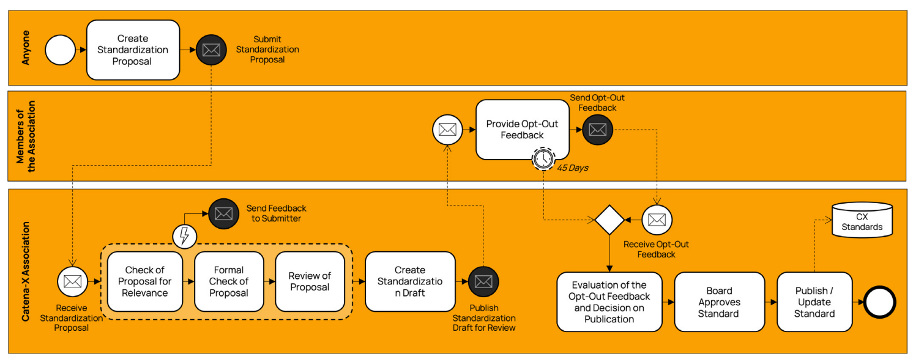
*Catena-X Standardization Process*

The [Catena-X Website](https://catena-x.net/association/standardization/) offers a comprehensive overview of the importance of standardization, how standards are being developed and the core elements of standardisation.

## Conformity Assessment and Certification

### Why do we certify?

Cross-company interactions highly rely on mutual trust. Catena-X issues certifications to provide trust via transparency and reliability based on our Catena-X standards. By setting up a certification process, we guarantee that our major principles are considered in every component of the network. Independent of size and role, core service providers or small application, a consistent framework was created to ensure beneficial participation for all participants in the network. A chain is only as strong as its weakest link, and to gain trust we need to ensure that all links are as strong as possible by encouraging the consistent use of standards and providing a quality label to those who do.

### What do we certify?

Catena-X certification is done in a modular, role-based way, to fulfill different requirements of participants in our ecosystem, whether IT application providers, service providers or onboarding partners. The modularity allows high flexibility and lowers the efforts and redundancies for all parties involved. The certification framework details all standards a company has to comply with based on their role, the goal of their service and the use-case in which they participate e.g. PLM & Quality, Sustainability, Resiliency. Catena-X standards become mandatory for certification as soon as they have been integrated into the certification framework. The Catena-X Association aims to release an update of its certification framework simultaneously with newly released standards. The most current version can always be found on the [Catena-X website](https://catena-x.net/ecosystem/certification/).

### How do we certify?

An overview of the certification process is depicted in Figure [Catena-X Certification Process](./how-data-space-governance.md#how-do-we-certify).
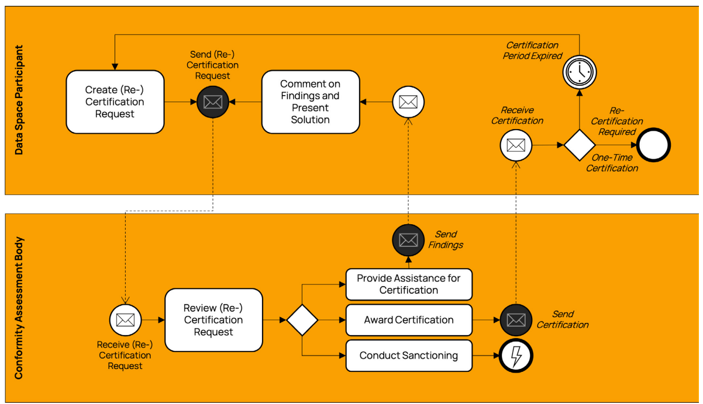
*Catena-X Certification Process*

The *Catena-X Conformity Assessment Handbook* provides a detailed description of how Catena-X conducts conformity assessment through the Conformity Assessment Bodies. The most current version can always be found on the [Catena-X Library](https://catenax-ev.github.io/docs/next/certification/certification).

Prerequisite of any certification is the registration / onboarding of the participant who wants to get certified. The registration (see Chapter [Registration](./../how-data-space-operations/how-data-space-operations.md#registration)) is ideally done before any certification request or latest started with the start of the certification request.

### Certification framework

Certifications and qualifications at Catena-X can be obtained for different types of services or solutions. The certifications are split into different "roles" indicating the type of relationship to Catena-X, as well as the"module", the specific service provided. The roles of certified companies vary between the provision of a key part of infrastructure or service ( Enablement Service Provider or Core Service provider) and complementing further solutions or services to the data space. In line with this role differentiation, the certifications have a different scope and different Catena-X standards associated with them.
 Companies shall always mention the specific role and module they have been awarded the certification in e.g. Connector, Traceability, MaaS... .

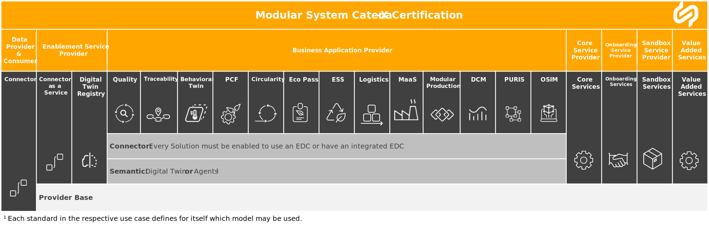  
*Certification System*

 The following figure details the standards applicable to each of the six roles and matching modules.

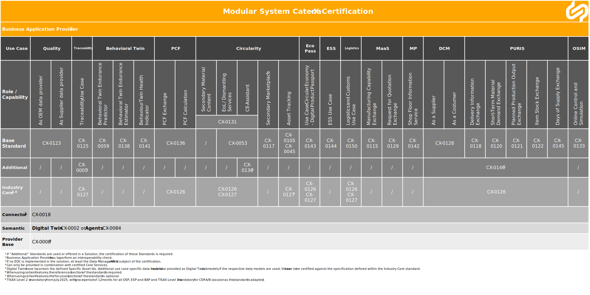

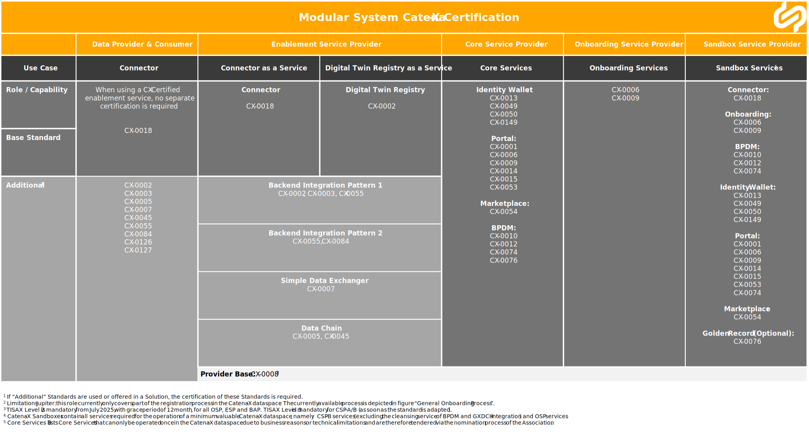

### Certification updates

Each certified partner needs to ensure conformity to the standards to be active in the data space. Every certified participant in the data space must remain compatible with at least one of the supported ecosystem releases through certification via a CAB. If there is no valid certificate after the ecosystem release tied to the respective certificate expires, Partners lose the status of certification/ qualification and are no longer listed as such on the Data Space Clearance List after the above-mentioned 120 days grace period expires. Each label is obtained after the successful completion of the Catena-X certification or qualification process.

### Further clarifications for Ecosystem Releases

For ecosystem releases, all major components of the Catena-X data ecosystem will be updated for all active and future users of the network. To offer a smooth transition to all our stakeholders to a new major release, certain measures are taken during the transitional period:

#### 1. Certification of business applications vs. internal systems that fall under the definition of a Catena-X business application*

**A business application** provides specific logic and schemas defined in a Catena-X use case (e.g., data processing, transformation functions) that is applied to input data to produce an expected output. This includes the use of Catena-X semantic models (semantic interoperability) as well as the technical data exchange using standardized protocols and API-specifications (technical interoperability). This does not apply to internal systems of an organization, such as internal databases, data lakes, data pipelines (ETL), or source systems.

Companies may want to **integrate internal systems** including company-internal business applications into the Catena-X data space. However, it is crucial that all participants can rely on a standardized data exchange to ensure stable and consistent multi-tier data chains based on data sovereignty and interoperability. Consequently, the following principles apply:

- All company-internal business applications required to maintain a stable and consistent multi-tier data exchange must comply with Catena-X standards and be certified by a CAB.
- All company-internal business applications associated with the Catena-X brand and/or offered on a Catena-X marketplace must comply with Catena-X standards and be certified by a CAB.

If an company-internal business application meets either of these criteria, Catena-X certification is mandatory.

#### 2. No Catena-X Business Applications without listing on a Certified Catena-X Marketplace

Catena-X is built on trust. All Catena-X certified business applications and services must be listed on a certified Catena-X marketplace.
Catena-X marketplace providers (i.e. CSP-A) verify that the listed business applications and services have a valid certification issued by a CAB and therefore comply with the Catena-X standards. Catena-X does not allow the provision of a solution without a marketplace listing.

In the future, there will be multiple CSP-As that enable business applications and services to be verified and listed on various marketplaces, as mentioned in chapter [Increase Decentralization of Core Services](./../outlook/outlook.md#increase-decentralization-of-core-services).

## Qualification Process

### Why do we qualify?

On the way to creating value with Catena-X, companies may be dependent on advisory services. The quality of these advisory services is decisive for the success of the participation and thus for the success of Catena-X. Catena-X can only be successful if it succeeds in integrating large parts of the automotive value chain. We assume that this will lead to a high demand for advisory services, which must be met. These advisory services must cover the needs of small and medium-sized companies as well as the needs of large companies, which have extended integration requirements.

Advisory services are hard, if not impossible, to standardize. Consequently, conformity assessment of qualified advisory services cannot take place through certification. To maintain a consistent level of quality among advisory service providers in the Catena-X data space, the Catena-X Association thus offers a qualification process that is mandatory for all advisory service providers who want to get listed in a marketplace. Advisory service providers, like all other participants active in the Catena-X data space, must adhere to the Catena-X regulatory framework and thereby confirm their full and unconditional support of our data ecosystem including its mission and standards.

### Who do we qualify?

Catena-X invites advisory service providers of all kinds to support the successful onboarding of data space participants, SMEs in particular. One of the few prerequisites is the binding commitment to provide high-quality consulting at fair and reasonable costs. Catena-X supports this endeavor with information and predefined content as well as a qualification system to prove appropriate support and consulting competencies.

Different from Catena-X Certification, Catena-X qualification is a label held by an individual. Individuals passing the assessment process and being awarded the title "Qualified Advisor" may refer to themselves as "Catena-X qualified". Companies with more than 5 employees with this qualification may refer to their entire company as "Catena-X qualified". Alternatively, if more than 50% of a company's staff is qualified, it may equally refer to the entire company as "Catena-X qualified". Any "Catena-X qualified" label has a validity of 12 months.

### How do we qualify?

With the launch of the [Catena-X Campus](https://catena-x.academy), Catena-X offers dedicated training to all interested advisory service providers. To gain the label *Qualified Advisor* on the Catena-X ecosystem, the successful completion of the *Consultant Qualification* on the *Training Area* of the Catena-X Campus is a prerequisite. This dedicated training covers all aspects relevant to advising users of the Catena-X data ecosystem, from topics concerning business impact to questions on operations & governance.

After applying for the company-related qualification, the number of employees of the applying company and the number of Catena-X qualified employees at the time of application, as well as the issue dates of these personal qualifications are checked. The validity of the most recently acquired qualification must be at least 10 months at the time of application for the company-related qualification.
The number of permanent employees at the time of application is decisive for the listing. Even if the number of employees changes within a year, the number does not have to be corrected retrospectively within the validity period of the acquired company-related qualification. A correction is only necessary in the event of requalification after one year.
The qualification is valid from receipt of payment and is only issued at this point in time. A company may only advertise with the title ‘Catena-X qualified Advisory Provider’ / ‘Catena-X qualified’ starting from the moment it receives a company-related qualification.

The Catena-X qualification process is under constant development and further, specialized modules including dedicated labels will be published soon.

## Catena-X Labels

Catena-X issues four different labels to indicate a company has been successfully certified or qualified and is compliant with Catena-X standards. This is to help customers find suitable and legitimate providers who have been assessed to comply with Catena-X standards or qualification requirements.
Each label is issued to the relevant role after achieving successful certification and/or qualification. Labels are associated with the offered services of the provider as stated in the certification framework on the  [Catena-X website](https://catena-x.net/ecosystem/certification/).

**Certified Operating Company**
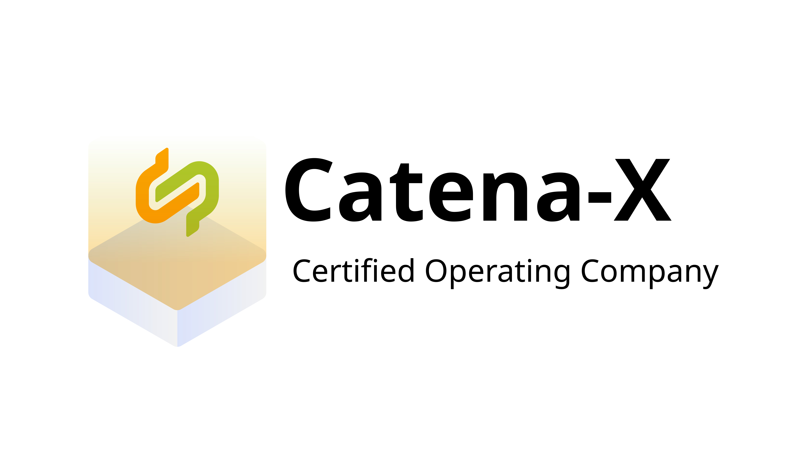

Certified operating companies are companies certified for operating core services in the Catena-X ecosystem.

**Certified Provider**  
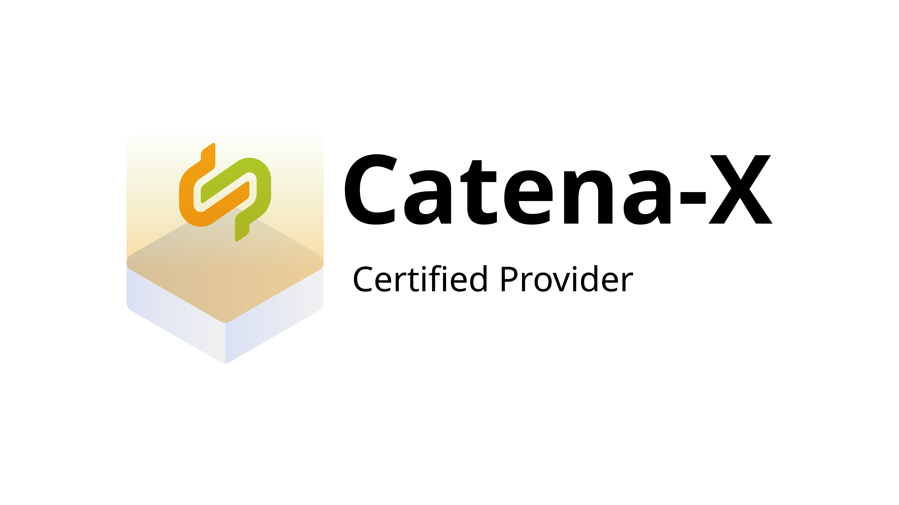

"Provider" is defined by standard [CX-0008](https://catenax-ev.github.io/docs/standards/CX-0008-RelevantStandardsForConformityAssessments) for the general participation in the data ecosystem depending on their role.

**Certified Solution**  

"Solution" is defined by standards that focus on executable software based on business domain or platform capabilities and includes but is not limited to: Application Logic, Application Programming Interface Specification, Data Access (e.g., usage policies), Payload or Meta-Data, Processes (e.g., onboarding process), Business Logic (e.g., PCF Rulebook), and Conformity Assessment Requirements. Those Solutions can be certified for several use cases or capabilities and are grouped by them.

Certified solutions specifically refers to the solutions certified.

**Qualified Advisor**
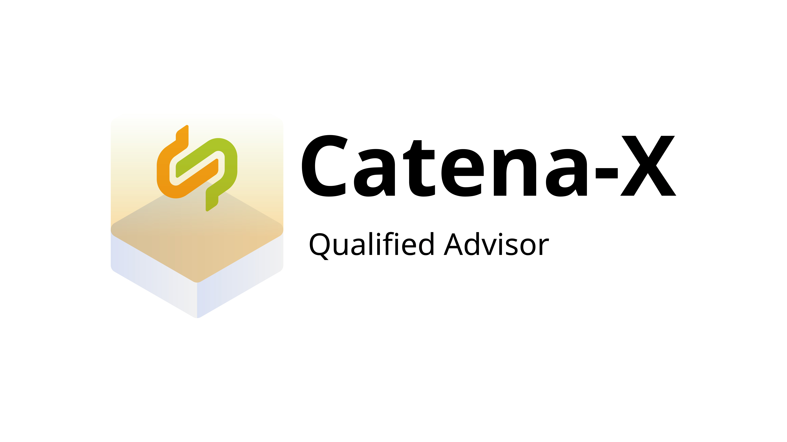
Different from Catena-X Certification, Catena-X qualification is a label held by an individual. Individuals passing the assessment process and being awarded the title "Qualified Advisor" may refer to themselves as "Catena-X qualified".

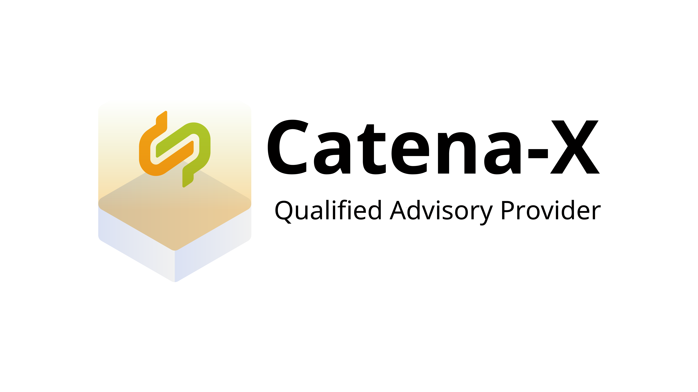
 Companies with more than 5 employees with this qualification may refer to their entire company as "Catena-X qualified" and will get the label "Qualified Advisory Provider". Alternatively, if more than 50% of a company's staff is qualified, it may equally refer to the entire company as "Catena-X qualified". Once a company meets the required number of qualified employees, it is automatically highlighted by Catena-X on the following list with an asterisk (*) and bold formatting: [Catena-X Qualified Advisor](https://catena-x.academy/catena-x-qualified-advisor/).
To use the “Advisory Provider” logo, the company simply needs to contact the Catena-X Association and complete the corresponding application form.

Any "Catena-X qualified" label has a validity of 12 months (for more details see [Qualification Process](https://catenax-ev.github.io/docs/next/operating-model/how-data-space-governance#qualification-process)).

### Scope of Labels (qualified/certified)

Both certification and qualification awards the right to hold and use a label with either the word "qualified" or a specific title combining the words "qualified" or "certified" with a role description. Labels are only to be used upon a successful completion of the certification/ qualification process. Certificates are bound to an ecosystem release, e.g. Jupiter and expire the moment, an ecosystem release is outdated (lifecycle state = deprecated). To maintain a valid label,  a certification for one of the subsequent ecosystem releases has to be completed. Labels for qualified advisors are time-bound with a validity of 12 months.

The use of older terminologies and visuals are not permitted and are therefore to be phased out within a transition period of three months since the latest release of this document, Catena-X Operating Model. Furthermore, companies shall solely use the name of the label for their role (certified operating company/ certified provider/ certified solution or respectively qualified advisor) as specified in the Catena-X Certification Framework or Regulatory Framework.
Companies or advisors are solely liable for providing the services. The certification does not provide any warranties of the quality of the work and the services of the certified companies or qualified advisor.

### Labeling guidelines

Any official Catena-X label can be downloaded from the [Catena-X repository](https://github.com/catenax-eV/cx-resources). Please refer to the "[README](https://github.com/catenax-eV/cx-resources/tree/main?tab=readme-ov-file#catena-x-resources)" with the instructions on how to obtain and use the labels. The labels are to be used in their original design only. Changes to the label, the wording, or the color scheme shall not be conducted. In any communication, the label is to be referred to with the term "Catena-X certified" or "Catena-X qualified" only. The term is exclusive to Catena-X certified companies or Catena-X qualified advisors.

## Regulatory Framework

The Catena-X Regulatory Framework for data space operations outlines the non-technical requirements and responsibilities for all stakeholders involved in the Catena-X data ecosystem. It includes detailed information on data sovereignty, mandatory use case requirements, and other regulatory considerations that are relevant and mandatory to our activities. The Regulatory Framework is made up of individual components that each govern a specific layer of our data space operations. Find all the details about the Regulatory Framework [in this chapter](https://catenax-ev.github.io/docs/regulatory-framework/governance-framework).

To understand the layers of our Regulatory Framework, Catena-X uses flight levels as a metaphor (see Figure Catena-X Governance Framework flight levels):

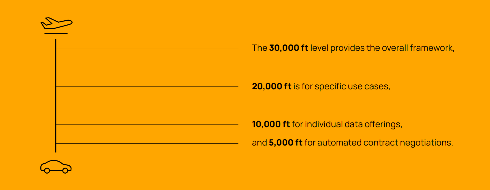
*Catena-X Flightlevels*

The Operating Model, the 10 Golden Rules and the Country Clearance List fall under the 30,000-ft level (Data Space Level) and are thus mandatory for all data space participants. At this level, the basic principles of the data ecosystem are outlined.

The Data Exchange Governance and the standardised usage policies are located at the 20,000-ft level (Use Case Level), where the fundamental requirements for data usage in a use case are defined.

**Disclaimer: The Data Exchange Governance is only temporarily located at this level. It will soon be located at the 30,000-ft level.**

The 10,000-ft level (Data Offering Level) provides guidance for data offerings by Data Providers and Consumers.

The 5,000-ft level provides guidance for data usage by Data Providers and Consumers including the conclusion of contracts via a registered connector.

Each higher level cascades into the lower ones, and the lower levels align with those above. Each level comes with specific guidelines and resources but also responsibilities for participants in our data space. Maintaining and updating our Regulatory Framework for data space operations lies within the responsibility of the Catena-X Association.
All resources and normative documents included in the regulatory framework are listed on the Catena-X website.

### Standardized modules for data exchange contracts

The Catena-X Association aims to develop further automation and scalability of the process of concluding data exchange contracts via Catena-X. Connectors will enable participants to choose from a range of modules when negotiating and agreeing on terms within the Data Exchange Governance (e.g. liability/dispute resolution/choice of law etc.). All official modules provided by the Catena-X Association are listed under the official Catena-X Open Digital Rights Language Repository.
These modules are limited to standardized data usage policies for Catena-X use cases.

### Concluding Data Exchange Contracts via Catena-X

The Catena-X Data Space enables Data Providers and Data Consumers to conclude data exchange contracts via registered connectors.
While Data Providers and Data Consumers have the option of concluding bilateral contracts (supplier contract, ...) outside of a registered connector to determine their contractual relationship for data exchange via Catena-X, the Catena-X Regulatory Framework sets out certain boundary conditions (10 Golden Rules, Data Exchange Governance...) that are binding for all data space participants and cannot be negated with bilateral contracts outside the confines of the Catena-X Regulatory Framework.
These boundary conditions, combined with the possibility to automate data exchange contract negotiations, form one of the key benefits and foundations for scaling of the Catena-X Data Space. For more information on how to conclude data exchange contracts via Catena-X, please refer to the Catena-X memorandum on how to conclude data exchange contracts.

### Governance for Non-Technical Requirements

Standardized contractual modules, as all parts of the Catena-X Regulatory Framework, are categorized as so-called **Non-Technical Requirements** (vs. technical requirements = **standards**). All Non-Technical Requirements are not subject to the technical Catena-X standardization process, governed by the Catena-X Technical Committee for Standardization, but are rather developed under the auspices of the formally responsible Committee (e.g. Catena-X Data Space Operations Committee for standardized contractual modules) and are formally approved by the Catena-X Management Board. This process mirrors the technical standardization process in order to provide accessibility, transparency and ease of understanding and differs mainly in the actors involved as governing bodies.

A general overview of the process is depicted in Figure [Catena-X process for Non-Technical Requirements](./how-data-space-governance.md#governance-for-non-technical-requirements):

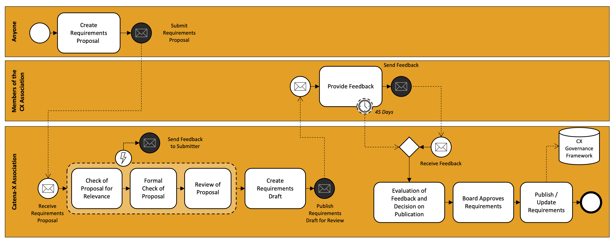
*Catena-X process for Non-Technical Requirements*

### Country Clearance List

The Catena-X association issues a [country clearance list](https://catenax-ev.github.io/docs/regulatory-framework/30000ft/country-clearance-list) that specifies countries, in which companies can be onboarded to the Catena-X data space. This list acts as mandatory guidance to all OSPs for registering participants in the Catena-X data space.

In the same document, the Catena-X association includes countries currently under clearance review. An onboarding of companies from this category is only possible after a due diligence check, followed by separate approval by the Catena-X association. A request for such a due diligence check can be requested by any OSP to the Catena-X association under [info@catena-x.net](mailto:info@catena-x.net).

## Enforcement of compliance with normative documents

An effective governance model requires clear guidelines and enforcement mechanisms to ensure that all participants comply with the agreed normative documents. This chapter focuses on how the Catena-X association proceeds if participants violate the rules and guidelines set out in the Catena-X governance framework. It describes the processes and measures that are taken to ensure compliance and to ensure that the trust and integrity of the network are maintained.

### How do we monitor violations?

The following chapter describes how monitoring generally takes place and what categories there are. The exact implementation can be found in chapter [Implementation and set-up](./how-data-space-governance.md#implementation-and-set-up).

**Active Monitoring**  
Active monitoring encompasses proactive measures to detect and address potential violations promptly. This involves checks of certificates within the network and among participants, and regular feedback collection from OSPs, CSPs and CABs regarding the certification status of their users. By actively engaging in these monitoring activities, the Catena-X community can swiftly identify deviations from established normative documents and take corrective actions to maintain compliance.

**Passive Monitoring**  
In addition to active oversight, the Catena-X Association provides a passive monitoring gateway where participants can report violations within the Catena-X data space. This point of contact serves as a confidential channel for data space participants to raise concerns or flag instances of non-compliance observed within the ecosystem. By fostering a culture of accountability and transparency, Catena-X encourages all stakeholders to actively participate in upholding the integrity of the data space.

### What are the consequences of such violations?

**Withdrawal of Certificates and Certification**  
At the foundational level, non-compliant participants face the withdrawal of their certificates and certification status. This action signifies the removal of official recognition for adhering to Catena-X standards, signaling a loss of credibility within the ecosystem. Furthermore, it limits the actions of the given party. Without a certificate, it's e.g. no longer possible to provide business apps as a BAP or participate in a use case as a DPC.

**Exclusion from Data Space Clearance List and Data Space Access**  
Participants found in violation of normative documents may be excluded from the Catena-X Data Space Clearance List, effectively barring them from accessing the data space and limiting their ability to engage in data exchange activities within the Catena-X data space. Further details about the Data Space Clearance List can be found in chapter [Implementation and set-up](./how-data-space-governance.md#implementation-and-set-up).

Depending on the nature and severity of the violation, a combination of consequences may be applied to address the non-compliance effectively. The Catena-X Association is further developing the consequences described and investigating further possibilities. Details can be found in the chapter [outlook](./../outlook/outlook.md#enforcement-of-compliance-with-normative-documents).

### Implementation and set-up

As described in Chapter [How do we monitor violations](./how-data-space-governance.md#how-do-we-monitor-violations), there are two input channels on which the Catena-X Association can receive various information.

#### Active Monitoring

For active monitoring, there is a public list showing all certified parties and apps. This list can be found [Certified Catena-X Solutions & Participants](https://catenax-ev.github.io/). This list of certified parties and solutions is updated by two roles:

##### OSP - Onboarding Service Provider

The OSP enables and supports data space participants to register, onboard and offboard to the Catena-X data space. The OSP is required to add every company successfully onboarded to the productive Catena-X data space in the Catena-X data space clearance list. This ensures, that the Data Space Clearance List contains all data space participants regardless by which OSP they were onboarded.

##### CAB - Conformity Assessment Body

The CAB is responsible for adding all certificates that are being issued to the list. This provides a clear overview of solutions that are certified and who got certified. On the one hand, this creates a clear overview of all solutions certified by Catena-X and on the other hand also the possibility of comparing whether a participant offers a solution that is still certified.

##### Data Space Clearance List - Certified Catena-X Solutions & Participants

The following figure shows the process of how OSPs & CABs can add the various participants or solutions to the Data Space Clearance List.

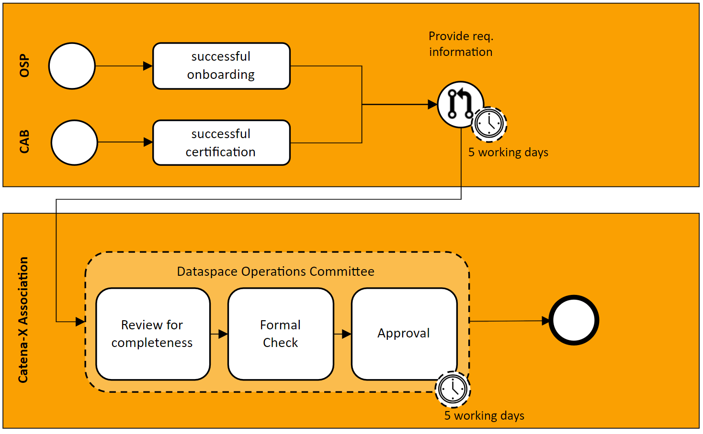  
*Catena-X Data Space Clearance List process*

| Process Step                        | Description                                                                                                                               | Input                | Output             |
| ----------------------------------- | ----------------------------------------------------------------------------------------------------------------------------------------- | -------------------- | ------------------ |
| successful onboarding/certification | The CAB or OSP is responsible for providing the mandatory data within 5 working days                                                      |                      | data provided      |
| Review data for completeness        | Review if all the mandatory data is provided and if the format is correct                                                                 | data from CAB or OSP |                    |
| Formal Check                        | Review of content by the dataspace operations committee if the provided data is valid                                                     |                      |                    |
| Decision                            | Final approval to add data to data space clearance list, in case of deny -   feedback is provided and CAB or OSP must crete a new request |                      | Approval or denial |

In order to obtain a simple overview of the various entries as well as an overall overview of the data space, various additional attributes are added to an entry. The data that an entry receives is as follows:

- Name of Legal Entity incl. BPNL
  - Roles [List - could be multiple]
  - Date of onboarding
  - Name of OSP incl. BPNL
  - If the Company has a certificate
    - Date of issue
    - Expiry date
    - Version against which was certified
    - Type of Certificate [OR]
      - Use Case [Sustainability [PCF, Circularity], Traceability, Quality, DCM, BPDM VAS]
      - Infrastructure [Enablement Service, Onboarding Service]
  - If the company is qualified
    - Date of issue
    - Expiry date
    - Type of Qualification [OR]
      - Experience
      - Qualification Process

#### Passive Monitoring

To ensure that the Catena-X association has the opportunity to investigate and record information from each party in the data space at any time, there is a confidential option to provide this to the association. For this purpose, the association offers a dedicated mailbox, which can be reached at the following E-Mail [info@catena-x.net](mailto:info@catena-x.net). The process for handling these requests is still being worked out. Details can be found in the chapter [Outlook](./../outlook/outlook.md#enforcement-of-compliance-with-normative-documents).

### Limitations

With this version of the operating model we will only establish the process (e.g. add Solutions and participants to the Data Space Clearance List) and tools (e.g. Data Space Clearance List) mentioned above. The consequences of violations, as described in the chapter [What are the consequences of such violations](./how-data-space-governance.md#what-are-the-consequences-of-such-violations), will be further refined and elaborated upon.

Further details can be found in the chapter [Outlook](./../outlook/outlook.md#enforcement-of-compliance-with-normative-documents).

## Nomination Process for unique Roles (e.g., CSP-B)

The nomination process is intended to ensure neutrality and trustworthy execution of selected roles and tasks within the Catena-X ecosystem. The Catena-X Association is responsible for the execution of the nomination process including partner selection.

The various rights and obligations of the provider are described in the Request for Tender (RFT). This is, for example, the license for operation, which can also be withdrawn in case of unfair behavior. This ensures fair awarding and safe operation of the various components. Tasks include, for example, the operation of Core Services - Section B by Core Service Providers or the certification of providers and solutions by CABs. An overview of the nomination process is depicted in Figure [Catena-X Nomination Process](./how-data-space-governance.md#nomination-process-for-unique-roles-eg-csp-b).

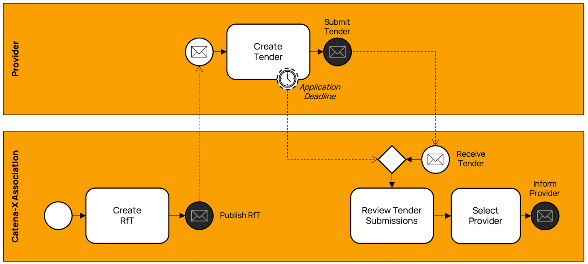
*Catena-X Nomination Process*

The process steps of the nomination process are described in detail below.

| Process Step                                            | Description                                                                                                                                                   | Input                               | Output                                                |
| ------------------------------------------------------- | ------------------------------------------------------------------------------------------------------------------------------------------------------------- | ----------------------------------- | ----------------------------------------------------- |
| Create Request for Tender (RfT)                         | The Catena-X Association is responsible for the creation of the Request   for Tender (RfT) document (e.g., for Core Services - section B)                     |                                     | RfT Document(s)                                       |
| Publish RfT on Website                                  | The Catena-X Association is responsible for the publication and   distribution of the [RfT Document on the website](https://catena-x.net).                | RfT Document(s)                     | RfT Document(s) RfT Event incl. Timeline RfT Template |
| Create and Submit Tender for selected   Core Service(s) | A provider can create and submit a tender for the published RfT.                                                                                              | RfT Document RfT Event RfT Template | Tender                                                |
| Receive and Review Submissions                          | The Catena-X Association compares the tender(s), regarding the fulfillment of   the nomination criteria and creates a short list of candidates for the board. | Tender(s)                           | Short List of Provider Candidates                     |
| Select Provider                                         | The board of the Association elects a provider with an absolute majority   vote.                                                                              | Short List of Provider Candidates   | Nomination of Provider                                |
| Inform Providers                                        | The Catena-X Association informs all provider(s) about the result of the   nomination process.                                                                |                                     |                                                       |
