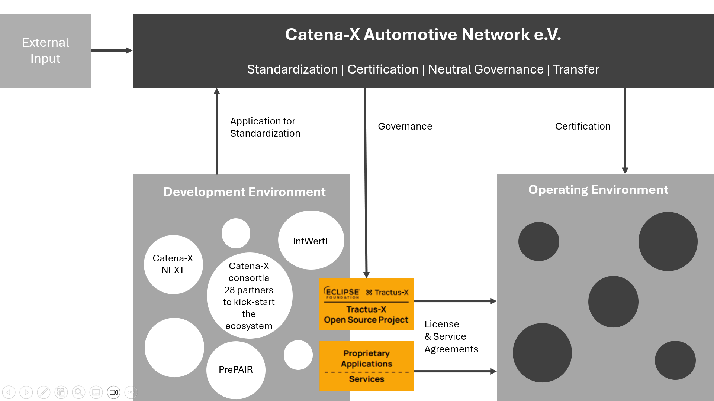
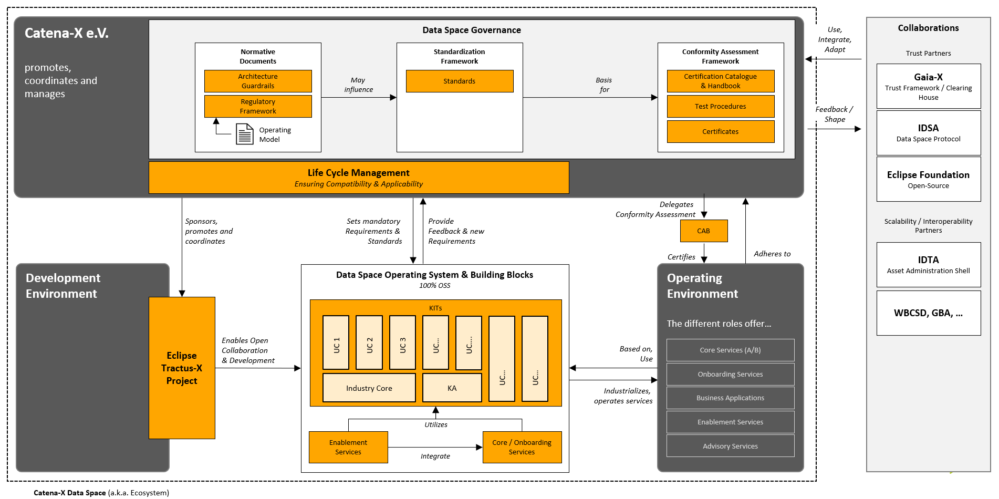

# Why: Understanding the Catena-X Data Space

## Conceptual Foundations of the Catena-X Data Ecosystem

To comprehend the components that comprise the Catena-X operating model, it is necessary to have a basic understanding of the fundamental concepts that make up the Catena-X data ecosystem (see Figure [Catena-X Data Ecosystem](#conceptual-foundations-of-the-catena-x-data-ecosystem)). The Catena-X data ecosystem consists of three areas: the Catena-X Automotive Network e. V., the development environment, and the operating environment.

*Catena-X Data Ecosystem*

The **Catena-X Automotive Network e. V.** (in the following called "Catena-X Association" or "the Association") is responsible for standardization, certifications, and governance of the Catena-X ecosystem. Members can participate in committees, working groups, and expert groups to actively shape the Catena-X ecosystem. The Catena-X Association publishes standards with the goal of enabling interoperability, data sovereignty, and security for all participants in the data space. The ecosystem participants must comply with the standards published by the Catena-X Association to work with the data space. Catena-X standards build on Gaia-X/International Data Space Association (IDSA) concepts and principles, industry standards, and best practices, among others, and extend these to the automotive domain and use case-specific requirements. By certifying ecosystem participants and software components, the Catena-X Association ensures transparency and trust in the ecosystem. A certification testifies, for example, that a software component is interoperable, data sovereign, and safe to use in the Catena-X data space. The Association is complemented by the **development environment**. The focus of the development environment is on the one hand, on the creation of standardization candidates that can be submitted into the standardization process of the association. On the other hand, the development of open-source reference implementations and other implementations for the data space. In the **operating environment**, the various open-source and commercial services and business applications are operated by different providers. A detailed description of the provider roles and the associated software components can be found in Chapter [Who: Roles in the Catena-X Ecosystem](./../who-roles-in-the-catena-x-ecosystem/who-roles-in-the-catena-x-ecosystem.md) and Chapter [What: Service Map](./../what-service-map/what-service-map.md). All three components jointly make up the Catena-X data ecosystem. In the following chapters, the roles, responsibilities, and functions of these components are described in detail.

## The Catena-X Data Ecosystem Architecture

Underlining the Catena-X data ecosystem's conceptual foundations are its individual data space components. Together, these building blocks serve as the architecture of the Catena-X data space, where each building block serves a dedicated purpose in one or several of the above-mentioned conceptual elements. An overview is depicted in Figure [Catena-X Data Ecosystem](#the-catena-x-data-ecosystem-architecture) followed by a short description of the main building blocks.

  
*Catena-X Data Ecosystem*

The global Catena-X data space is built on 5 mission-critical pillars:

- a dedicated **role concept** covering all data space participants (see Chapter [Who: Roles in the Catena-X Ecosystem](./../who-roles-in-the-catena-x-ecosystem/who-roles-in-the-catena-x-ecosystem.md))
- a Service Map of foundational software services, building blocks, and standards that form the **Catena-X Operating System** and **Business Foundation** (see Chapter [What: Service Map](./../what-service-map/what-service-map.md)),
- procedures, processes, and building blocks for a trusted, scalable, and compliant **data space operation** (see Chapter [How: Data Space Operations](./../how-data-space-operations/how-data-space-operations.md)),
- effective **data space governance** incl. standards, legal frameworks, (flight levels) and certification (see Chapter [How: Data Space Governance](./../how-data-space-governance/how-data-space-governance.md))
- an integrated and holistic **life cycle management ensuring compliance, interoperability**, and **compatibility** (see Chapter [How: Life Cycle Management](./../how-life-cycle-management/how-life-cycle-management.md))

To promote adoption and collaboration, the Catena-X data space is built upon open-source principles, under the umbrella of the Eclipse Foundation. All Catena-X reference implementations and KITs are licensed under Apache 2.0 and CY BB 4.0. In order to structure and guide the development in open-source, Catena-X installed Organizational Elements (e.g., committees in the Catena-X Association), created a working group and project in Eclipse Tractus-X and defined a scalable structure for a business-oriented development and adoption of relevant artifacts and software codes:

- Enablement Services,
- Core Services,
- Onboarding Services
- Industry Core
- and use case KITs

With regard to standardization, the Catena-X Association promotes, sponsors, and coordinates the overarching requirements of the Eclipse Tractus-X project. Standards are always linked, structured, and offered within those four elements.  

Catena-X offers use case KITs to enable a multi-vendor ecosystem of software solutions and services for each Catena-X use case. Solution and Service providers can create interoperable and data sovereign solutions and trusted services based on the Catena-X KITs and offer them on trusted marketplaces within the Catena-X Data Space ([Who: Roles in the Catena-X Ecosystem](./../who-roles-in-the-catena-x-ecosystem/who-roles-in-the-catena-x-ecosystem.md)). The marketplaces are certified marketplaces that offer interoperable solutions from different solution  providers. The Core Services as well as marketplaces are part of the cxOS and are operated by certified operating companies (see Figure [Service Map](./../what-service-map/what-service-map.md)). With this comprehensive solution portfolio, players in the automotive value chain can create business value by establishing data-driven use cases and data chains.

Trust and conformity (of services, offers, and potentially other non-automotive data spaces) are fundamental for Catena-X's acceptance, scalability, and value creation. Therefore, Catena-X chose and installed various neutral governance bodies – covering development and operation. The following partnerships and components, in sum, ensure a global data space built by best-in-class experts on trusted principles:

1. Gaia-X is the basis for our overarching Trust Framework and forms the foundation for a federated, interoperable data space with trusted identities.

2. The International Data Space Association (IDSA) provides architecture principles that enable sovereign data exchange.

3. The Eclipse Foundation hosts the official open-source development project of the Catena-X ecosystem and follows the Eclipse Foundation’s trusted development process.

4. The Catena-X Association provides industry-specific governance for the ecosystem that equally reflects the diverse interest groups within the automotive industry to serve common business needs. It also defines the vision, mission, and guiding principles for the Catena-X data space through the governance framework based on the Catena-X Statutes.

More specifically, in the **Catena-X operating environment**, the Catena-X Regulatory Framework for Data Space operation model as a reliable mutual foundation to ensure trust, interoperability, and therefore scalability. Catena-X's success largely depends on trust that every participant plays by the same, commonly set rules. By standardizing many of the relationships and agreements necessary for data exchange and bringing Catena-X use cases to life, data space participants can put their focus largely on their individual business needs rather than individual contract negotiation between business partners. Through collectively approved guidelines and templates, data exchanges on Catena-X can be seamlessly executed and operated without friction.

## Data Space Interoperability

Efforts toward achieving interoperability with and within Catena-X are integral to its success. Interoperability ensures seamless communication and interaction between various participants within the wider industry ecosystem. In alignment with the European Interoperability Framework, which defines and divides interoperability into legal, organizational, semantic, and technical interoperability, Catena-X pursues a comprehensive approach to ensure compatibility and harmonization across the entire automotive value chain.

Therefore, Catena-X aims at creating an interoperable data space, so that participants from closely related data spaces and industry ecosystems can choose to access data, services, and applications from selected partners in another data space without additional technical, organizational, or legal burdens.

This enables participants of the Catena-X data space, who are active in multiple data spaces to realize additional business value by connecting to partners beyond their own network and allows a simplified onboarding process.

1. **Technical Interoperability:**

    Technical interoperability addresses the compatibility towards the Catena-X systems, interfaces, and protocols used for data exchange within the data space. The minimum requirement to achieve interoperability with Catena-X is adopting the Data Spaces Protocol (DSP) and Decentralized Claims Protocol (DCP). Data spaces provide the basis of our technical interoperability and Catena-X embraces open technological convergence and best practices to ensure seamless integration and connectivity across many data spaces. The DSP serves similarly to the AAS as one example of industry standards that can be used to ensure technical interoperability of multiple data spaces. Additionally, the Tractus-X development environment, facilitated by the Eclipse Foundation, fosters the creation of interoperable software components like the EDC and reference implementations, promoting innovation and flexibility in system design and implementation.

2. **Semantic Interoperability:**

    Semantic interoperability ensures a common understanding and interpretation of data exchanged with and within the Catena-X data space. The Catena-X Ecosystem therefore utilizes semantic models based on the Semantic Aspect Meta Model (SAMM), an open and standardized specification for Aspect Models. Additionally, Catena-X also employs the internationally widely adopted Asset Administration Shell (AAS) as one technical implementation. The AAS supports the standard-compliant exchange of data along the entire production life cycle. Employing these models is again the minimum requirement to achieve semantic interoperability with Catena-X. Within this context, standardization efforts led by the Association, in collaboration with industry partners like the IDTA, aim to establish shared vocabularies, ontologies, and data models specific to automotive domains and use cases.

3. **Legal Interoperability:**

    Catena-X operates within a regulatory framework that establishes rights, responsibilities, and obligations governing data exchange and usage. At the most basic level, contracts need to allow potential addendum that enable the exchange with partners from other data spaces while ensuring compliance of such external data space partners with the Catena-X regulatory framework e.g. the country clearance list, the 10 golden rules, etc. To allow for a more seamless transition between Catena-X and other data spaces, compliance with the Catena-X regulatory framework should be integrated at the data space level of such external data spaces.

4. **Organizational Interoperability:**

    Organizational interoperability focuses on aligning key structures, processes, and roles across diverse stakeholders. The minimum effort to achieve organizational interoperability with Catena-X means to acknowledge the Catena-X Governance and its essential roles. This indicates that by employing Catena-X CSPs and OSPs, it's easier to access our data space effortlessly. In general, the Association plays a central role in fostering collaboration also with other initiatives like Gaia-X, IDSA, and the Eclipse Data Space Working Group.
