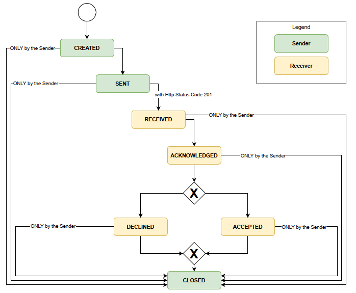
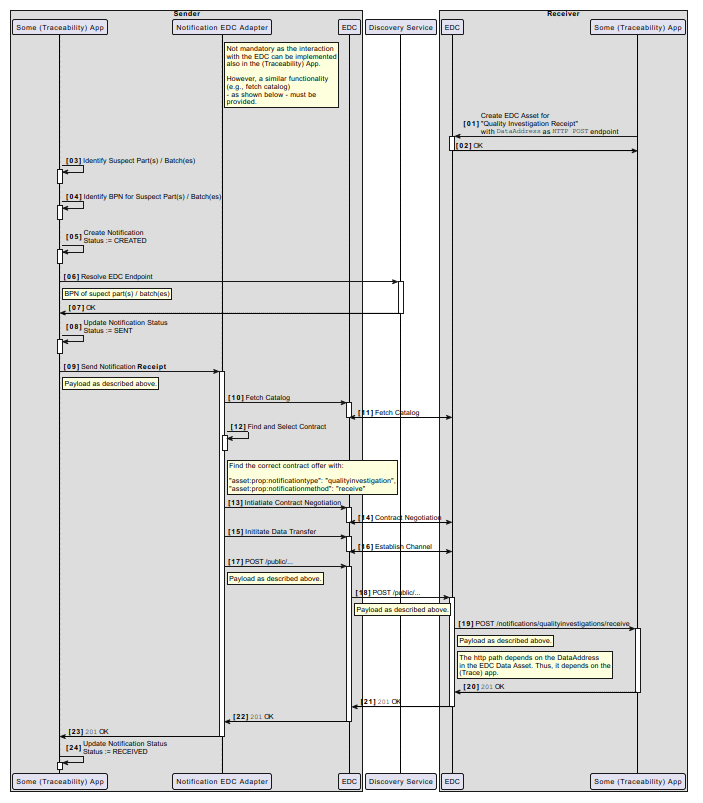

---
tags:
  - CAT/Business Application Provider
  - UC/Quality
---

# CX-0123 Quality Use Case Standard v2.1.0

## ABSTRACT

The Catena-X use case "Quality" provides the ability to detect
quality issues the earliest possible to start root cause analyses and/or to enable
an early warning feature for new quality topics. In subsequent steps, counter
measures can also be defined earlier and monitored. In sum, this reduces the
number of vehicles affected by quality issues and increases the availability of the
vehicle and built-in components. Catena-X use case "Quality" is powered
by Catena-X standard core components to share data from OEM and suppliers
based on data sharing agreements and usage policies.

## FOR WHOM IS THE STANDARD DESIGNED

```text
  See section Audience & Scope
```

## COMPARISON WITH THE PREVIOUS VERSION OF THE STANDARD

Changes compared to V2.0.0 of CX-0123:

- Update aspect model `urn:samm:io.catenax.fleet.vehicles:3.0.0`

Changes compared to V1.0.0 of CX-0123:

- Update semantic models QualityTask, PartsAnalyses, ManufacturedPartsQInformation, Fleet.DiagnosticData, Fleet.ClaimData
- Update model Fleet.Vehicles and integrate model Vehicle.ProductDescription
- New semantic models Early Warning Norification and Failure Pattern
- Update 2.1 Data Sharing Rules
- Define Notification Process and API

## 1 INTRODUCTION

The Catena-X use case "Quality" uses multiple data models to
exchange data between automotive manufacturer (OEM) and component supplier
(TIER 1) and also along the supply chain betwwen TIER N and TIER N + 1. Each of these data models can be supplied independently.
The QualityTask data model defines the root element for Catena-X-based quality
work. It describes the quality task and why two companies want to work
collaboratively on a quality topic.

### 1.1 AUDIENCE & SCOPE

> *This section is non-normative*

The standard is relevant for the following roles within the scope of the Use Case "Quality"

- Data Provider/Consumer
- Business Application Provider

In scope:

- Data sharing between OEM, TIER 1 and TIER N
- Earliest possible detection of potential issues with products and vehicles in usage
- Understanding of the root cause of the detected issues to enable earliest possible counter measure implementation and monitoring the effectiveness

### 1.2 CONTEXT AND ARCHITECTURE FIT

> *This section is non-normative*

For all participants of the Use Case "Quality" it is necessary to provide and consume the data in accordance to the standardized semantic data models in section [3 Aspect Models](#3-aspect-models) to ensure the defined interoperability requirement "free of choice application" to be able to use the established inhouse tool set for analysis.

Catena-X use case "Quality" data flow: Data is exported from existing backend systems and mapped to Catena-X aspect models - see list of relevant Catena-X aspect models for use case "Quality" in section [3 Aspect Models](#3-aspect-models)
The so generated files are transferred between different Catena-X participants using a connector conformant to [CX-0018].

### 1.3 CONFORMANCE AND PROOF OF CONFORMITY

> *This section is non-normative*

As well as sections marked as non-normative, all authoring guidelines, diagrams, examples, and notes
in this specification are non-normative. Everything else in this specification is normative.

The key words **MAY**, **MUST**, **MUST NOT**, **OPTIONAL**, **RECOMMENDED**, **REQUIRED**, **SHOULD**
and **SHOULD NOT** in this document document are to be interpreted as described in BCP 14 [RFC2119] [RFC8174]
when, and only when, they appear in all capitals, as shown here.

All participants and their solutions will need to prove, that they are conform with the Catena-X standards.
To validate that the standards are applied correctly, Catena-X employs Conformity Assessment Bodies (CABs).

Since this Use Case Quality Standard describes a set of standards to be fulfilled, participants MUST fulfill all
mentioned standards and the respective conformity assessment criteria in addition to the specific criteria mentioned in
this document.

The specific criteria described in this document are describing the usage of the central tools as well as common tools
described in the linked standardization documents and therefore compliance **SHOULD BE** checked with the tools provided
for these components.

### 1.4 EXAMPLES

### 1.5 TERMINOLOGY

> *This section is non-normative*

Business Partner Number (BPN)
: A BPN is the unique identifier of a partner within Catena-x

Connector conformant to [CX-0018]
: The e.g. Tractus-X EDC is a reference implementation of a connector for IDSA conform sovereign data exchange

Additional terminology used in this standard can be looked up in the glossary on the association homepage.

## 2 RELEVANT PARTS OF THE STANDARD FOR SPECIFIC USE CASES

> *This section is normantive*

### 2.1 "DATA SHARING RULES"

#### 2.1.1 LIST OF STANDALONE STANDARDS

To particpate in Data Provisioning for the "Quality Use Case", the following single standards **MUST** be fulfilled by all participants

- CX - 0018 Data Space Connectivity v3.0.0

#### 2.1.2 DATA REQUIRED

In order to participate in the Catena-X use case "Quality" the following single standards **MUST** be fulfilled by all participants:

CX - 0018 Data Space Connectivity v3.0.0

As OEM data provider for a Supplier as data consumer, if data is provided, I **MUST** provide the data conformant to the following aspect models:

- Aspect Model QualityTask  v2.0.0
- Aspect Model FleetDiagnosticData  v2.0.0
- Aspect Model FleetClaimData  v2.0.0
- Aspect Model FleetVehicles v3.0.0
- Aspect Model QualityTaskAttachment v2.0.0
- Aspect Model FailurePattern v1.0.0

As Supplier data provider for an OEM as data consumer, if data is provided, I **MUST** provide the data conformant to the following aspect models:

- Aspect Model QualityTask  v2.0.0
- Aspect Model PartAnalyses  v3.0.0
- Aspect Model ManufacturedPartsQualityInformation  v2.1.0
- Aspect Model QualityTaskAttachment v2.0.0
- Aspect Model FailurePattern v1.0.0

As Supplier data provider for a Supplier (TIER N) as data consumer, if data is provided, I **MUST** provide the data conformant to the following aspect models:

- Aspect Model QualityTask  v2.0.0
- Aspect Model PartAnalyses  v3.0.0
- Aspect Model ManufacturedPartsQualityInformation  v2.1.0
- Aspect Model QualityTaskAttachment v2.0.0

As OEM data provider or consumer or as Supplier data provider or consumer, if sending an early warning notification I **MUST** be compliant to the early warning notification API.

- Data provisioning and consuming **MUST** be done according the standardized semantic data models.
- The data provider defines the data content that will be provided. Provided data assets are defined in data sharing agreements and/or data usage policies.

As Business Application Provider I **MUST** support at least 2 aspect models (minimum standard): One from OEM data provider aspect model list and one from Supplier data provider aspect model list.
As Business Application Provider I **SHOULD** support the early warning notification API.

#### 2.1.3 ADDITIONAL REQUIREMENTS

```text
Data exchange between the participating partner companies is necessarily to be done for large vehicle and product populations. The data exchange therefore should be done as a file download via EDC according to the following specifications.

**Asset File type**
It is recommended to create and transfer the files in the type parquet. Exceptions:
- Attachments for the Quality task (Quality Task Attachment) should be created in ZIP format
- Failure Pattern should be transferred in JSON format

**Asset Transfers via EDC**
File transfer is recommended to be done via EDC S3 plane, The transfer via EDC http data plane is not recommended due to the big data size.
As separator between element names and properties "_" has to be used.

**S3 Data Address**
These properties are not use-case specific

| Property              | Value                        | Description                                                                                                                                                                                                                          |
|-----------------------|------------------------------|--------------------------------------------------------------------------------------------------------------------------------------------------------------------------------------------------------------------------------------|
| `edc:type`            | `"AmazonS3"`                 | This shows which data source the Data Plane will query. It also determines what other content the `dataAddress` object must hold.                                                                                                    |
| `edc:region`          | `"eu-west-1"`                | This property represents the AWS-region where the source bucket is located.                                                                                                                                                          |
| `edc:bucketName`      | `"provider-quality-bucket"`  | This is the name of the source bucket that the data to-be-transferred resides in.                                                                                                                                                    |
| `edc:keyName`         | `"path/through/provider/s3"` | This is the path of the file that shall be offered to the dataspace.                                                                                                                                                                 |
| `edc:accessKeyId`     | `"<keyId>"`                  | Amazon S3 uses this property similarly to how oauth2 client credentials use the `clientId`. Note that this can also be set during deployment-time for the whole S3-dataplane. If it's set here, it will override the default config. |
| `edc:secretAccessKey` | `"<secretAccessKey>"`        | This secret is used similarly to a `clientSecret` in oauth2 client credentials. 

**Asset Properties**
These properties will be used by the asset consumer to filter dedicated assets from the large number of assete in the catalogue.
| Property                                           | Value                                                            | Optional | Description                                                                                                                                                                                                                                                                                                                                                                                                                     |
|----------------------------------------------------|------------------------------------------------------------------|----------|---------------------------------------------------------------------------------------------------------------------------------------------------------------------------------------------------------------------------------------------------------------------------------------------------------------------------------------------------------------------------------------------------------------------------------|
| `https://purl.org/dc/terms/type`                   | `{"@id": "cx-taxo:QualityAsset"}`                                |          | CX-0018 mandates the usage of the dct:type property to signal what kind of Asset a consumer can expect behind a dcat:Dataset. In the Quality Use-Case, this is identified as `https://w3id.org/catenax/taxonomy#QualityAsset`. The expected payload this API serves is determined by the `dcat:conformsTo` property.                                                                                                            |
| `https://purl.org/dc/terms/language`               | `{"@id": https://w3id.org/idsa/code/EN}`                         | x        | This property is QM-specific. As it points to an IRI, it must be embedded in a json-object with the `@id` key. The use of this is unclear.                                                                                                                                                                                                                                                                                      |
| `https://purl.org/dc/terms/format`                 | `"application/octet-stream;type=parquet-snappy"`                 |          | This property is QM-specific. dct:format usually points to the correct IANA Media Type. As currently only parquet files are used, the type application/octet-stream with the added property type=parquet-snappy must be used. The syntax is expained [here](https://www.iana.org/assignments/media-types-parameters/media-types-parameters.xhtml). If in the future csv shall be supported, the value could also be `text/csv`. |
| `https://purl.org/dc/terms/description`            | `<whatever>`                                                     | x        | This property is QM-specific. For human-readable content, rdfs:comment is the usual property but would introduce another namespace so the dct-native property is chosen here.                                                                                                                                                                                                                                                   |
| `https://purl.org/dc/terms/conformsTo`             | `{"@id":"<urnOfTheCorrespondingAspectModel>"}`                   |          | This property is QM-specific. It holds the exact aspect-model-URN that defines the schema of the presented dataset including its version. The version in here refers to the data model's version while the EDC-property `cx-common:version` defines the version of the underlying API serving the data.                                                                                                                         |
| `http://www.w3.org/ns/dcat#qualifiedRelation`      | `{"dct:isPartOf": {"@id": "<idOfTheCorrespondingQualityTask>"}}` |          | This property is QM-specific. All Asset types defined in this Kit must include this property as it links the data behind an asset with the correct QualityTask. Note that the id of the QualityTask must be used, not the id of the EDC-Asset shielding said QualityTask.                                                                                                                                                       |
| `https://w3id.org/edc/v0.0.1/ns/type`              | `AmazonS3`                                                       |          | This property signifies the EDC data plane that the QM data will be transferred over. The expectation that this would be signalled via the dcat:DataSet-dcat:distribution property of the catalog currently isn't implemented in the EDC. Thus the data must be replicated here and is presented via the same property that the consumer-side `transferprocesses` API uses for this same signal.                                |
| `https://w3id.org/catenax/ontology/common#version` | `"1.0"`                                                          |          | CX-0018 recommends to use cx-common:version to signal the API's version. Here, the API's version is equivalent to the version of the CX-standard for the Quality domain. Creation is currently in progress as CX-0123 v1.0.0. In this EDC-property, only major and minor increments should be added.                                                                                                                            |
| `https://purl.org/dc/terms/date)`                  | `JJJJ-CW-N`                                                      | x        | This property identifies an update of an already shared catalogue asset. Day is mensioned as calender week day number, e.g. '1' means "monday"                                                                                                                                                                                                                                                                                  |

**Asset consumption**
The data provided in the asset is build from at least one of 4 to 6 structures. To assure a secure and 
smooth exchange flattening rules for the file (csv / xls / Parquet / json) must be applied. This includes checks for format and possible values for each column. If the rules are not applied correctly the mapping of content will not be possible without manual handling effort:

- Separator
As separator between element names "_" has to be used.

- Handling of "null values"
Only unique identifier properties (like VAN, serial number, ....) are set to mandatory and all other properties are set to optional. E.g.: If a car has no mileage value after a diagnostic session this property would be left empty.

- File flattening rules:
To flatten a hierarchical structure into ONE table for data providing the cross-product has to be used: 
Beginning from root entity: Do a left outer join with all children one level down. Than for every children that also has child entities: Do a left out join with all child entities one level down.
```

### Conventions for Use Case Policy in context data exchange

In alignment with our commitment to data sovereignty, a specific framework governing the utilization of data within the Catena-X use cases has been outlined. A set of specific policies on data offering and data usage level detail the conditions under which data may be accessed, shared, and used, ensuring compliance with legal standards.

For a comprehensive understanding of the rights, restrictions, and obligations associated with data usage in the Catena-X ecosystem, we refer users to

- the detailed ODRL policy repository. This document provides in-depth explanations of the terms and conditions applied to data access and utilization, ensuring that all engagement with our data is conducted responsibly and in accordance with established guidelines.
- the ODRL schema template. This defines how policies used for data sharing/usage should get defined. Those schemas MUST be followed when providing services or apps for data sharing/consuming.

**Additional Details regarding Access Policies**

A Data Provider may tie certain access authorizations ("Access Policies") to its data offers for members of Catena-X and one or several Data Consumers. By limiting access to certain Participants, Data Provider maintains control over its anti-trust obligations when sharing certain data. In particular, Data Provider may apply Access Policies to restrict access to a particular data offer for only one Participant identified by a specific business partner number:

- Membership
- BPNL

**Additional Details regarding Usage Policies**

In the context of data usage policies (“Usage Policies”), Participants and related services MUST use the following policy rules:

- Use Case Framework (“FrameworkAgreement”)
- at least one use case purpose (“UsagePurpose”) from the above mentioned [ODRL policy](https://github.com/catenax-eV/cx-odrl-profile) repository.

Additionally, respective usage policies MAY include the following policy rule:

- Reference Contract (“ContractReference”).

Details on namespaces and ODRL policy rule values to be used for the above-mentioned types are provided via the ODRL policy repository.

#### 2.1.4 DIGITAL TWINS AND SPECIFIC ASSET IDs

## 3 ASPECT MODELS

### 3.1 ASPECT MODEL "QUALITY TASK"

#### 3.1.1 INTRODUCTION

The "Quality Task" data model is the root element for Catena-X-based quality work. It is a model that can be created by the automotive manufacturer or by the supplier and describes why data is exchanged over Catena-X network between two companies, who are the responsible people in each company and what should happen with transferred data after the completion of a "Quality Task".

For data providers:
Each "Quality Task" **MUST** have a unique qualityTaskId conformant to the semantic model.

#### 3.1.2 SPECIFICATIONS ARTIFACTS

This aspect model is written in SAMM 2.1.0 as a modeling language conformant to CX-0003
  
Like all Catena-X data models, this model is available in a machine-readable format on GitHub
conformant to CX-0003.

#### 3.1.3 LICENSE

This Catena-X data model is made available under
the terms of the Creative Commons Attribution 4.0 International
(CC-BY-4.0) license, which is available at Creative Commons.

The license information is available in github.

In case of doubt the license, copyright and authors information in
github overwrites the information in this specification document.

#### 3.1.4 IDENTIFIER OF SEMANTIC MODEL

This semantic model "Qualtiy Task" has the unique identifier

```text
<urn:samm:io.catenax.quality_task:2.0.0#>
```

#### 3.1.5 FORMATS OF SEMANTIC MODEL

All formats can be generated through the turtle file and the SAMM command line interface (cli).

##### 3.1.5.1 RDF TURTLE

The rdf turtle file, an instance of the Semantic Aspect Meta Model, is the master for generating additional file formats and serializations.
It can be found in the current version 2.0.0 in the github repository.

```text
[https://github.com/eclipse-tractusx/sldt-semantic-models/blob/main/io.catenax.quality_task/2.0.0/QualityTask.ttl]
```

The open source command line tool of the Eclipse Semantic Modeling Framework is used for generation of other file formats like JSON Schema, aasx for Asset Administration Shell Submodel Template or HTML documentation.

##### 3.1.5.2 JSON SCHEMA

A JSON Schema can be generated from the RDF Turtle file. The JSON Schema defines the Value-Only payload of the Asset Administration Shell for the API operation "GetSubmodel".
It can be found in the current version in the "gen" subfolder in the github repository.

```text
[https://github.com/eclipse-tractusx/sldt-semantic-models/tree/main/io.catenax.quality_task/2.0.0/gen]
```

##### 3.1.5.3 AASX

An AASX file can be generated from the RDF Turtle file. The AASX file defines one of the requested artifacts for a Submodel Template Specification.

### 3.2 ASPECT MODEL "FLEET DIAGNOSTIC DATA"

#### 3.2.1 INTRODUCTION

The purpose of this section is the description of the "Fleet Diagnostic Data" semantic data model.

The "Fleet Diagnostic Data" semantic data model is a list diagnostic sessions.
Each diagnostic session contains of a car diagnostic that was performed in a repair shop or over-the-air.

The target is to provide diagnostic data that can be used for the purpose of early warning or root cause analysis.

The "Fleet Diagnostic Data" semantic data model is provided by an automotive manufacturer.

Each "Fleet Diagnostic Data" **MUST** contain an unique sessionId conformant to the semantic model.

#### 3.2.2 SPECIFICATIONS ARTIFACTS

This aspect model is written in SAMM 2.1.0 as a modeling language conformant to CX-0003

Like all Catena-X data models, this model is available in a machine-readable format on GitHub
conformant to CX-0003.

#### 3.2.3 LICENSE

This Catena-X data model is made available under
the terms of the Creative Commons Attribution 4.0 International
(CC-BY-4.0) license, which is available at Creative Commons.
  
The license information is available in github.
  
In case of doubt the license, copyright and authors information in
github overwrites the information in this specification document.

#### 3.2.4 IDENTIFIER OF SEMANTIC MODEL

The semantic model has the unique identifier

```text
<urn:samm:io.catenax.fleet.diagnostic_data:2.0.0#>
```

#### 3.2.5 FORMATS OF SEMANTIC MODEL

All formats can be generated through the turtle file and the SAMM command line interface (cli).

##### 3.2.5.1 RDF TURTLE

The rdf turtle file, an instance of the Semantic Aspect Meta Model, is the master for generating additional file formats and serializations.
It can be found in the current version 2.0.0 in the github repository.

```text
[https://github.com/eclipse-tractusx/sldt-semantic-models/blob/main/io.catenax.fleet.diagnostic_data/2.0.0/DiagnosticData.ttl]
```

The open source command line tool of the Eclipse Semantic Modeling Framework  is used for generation of other file formats like JSON Schema, aasx for Asset Administration Shell Submodel Template or HTML documentation.

##### 3.2.5.2 JSON SCHEMA

A JSON Schema can be generated from the RDF Turtle file. The JSON Schema defines the Value-Only payload of the Asset Administration Shell for the API operation "GetSubmodel".
It can be found in the current version in the "gen" subfolder in the github repository.

```text
[https://github.com/eclipse-tractusx/sldt-semantic-models/tree/main/io.catenax.fleet.diagnostic_data/2.0.0/gen]
```

##### 3.2.5.3 AASX

An AASX file can be generated from the RDF Turtle file. The AASX file defines one of the requested artifacts for a Submodel Template Specification.

### 3.3 ASPECT MODEL "FLEET CLAIM DATA"

#### 3.3.1 INTRODUCTION

The purpose of this section is the description of the "Fleet Claim Data" semantic data model.

The "Fleet Claim Data" semantic data model is a list of customer complaints(=claim) that are linked to the same or different "Quality Tasks".
One claim: A customer is coming to the repair shop and is indicating a potential malfunction in his car during warranty period. The repair shop tries to fix the problem - by exchanging a potential faulty component by a spare part, by a software update, ...

The "Fleet Claim Data" semantic data model is provided by an automotive manufacturer.

Each "Fleet Claim Data" **MUST** contain an unique claimId conformant to the semantic model.

#### 3.3.2 SPECIFICATIONS ARTIFACTS

This aspect model is written in SAMM 2.1.0 as a modeling language conformant to CX-0003

Like all Catena-X data models, this model is available in a machine-readable format on GitHub
conformant to CX-0003.

#### 3.3.3 LICENSE

This Catena-X data model is made available under
the terms of the Creative Commons Attribution 4.0 International
(CC-BY-4.0) license, which is available at Creative Commons.

The license information is available in github.

In case of doubt the license, copyright and authors information in
github overwrites the information in this specification document.

#### 3.3.4 IDENTIFIER OF SEMANTIC MODEL

The semantic model has the unique identifier

```text
<urn:samm:io.catenax.fleet.claim_data:2.0.0#>
```

#### 3.3.5 FORMATS OF SEMANTIC MODEL

All formats can be generated through the turtle file and the SAMM command line interface (cli).

##### 3.3.5.1 RDF TURTLE

The rdf turtle file, an instance of the Semantic Aspect Meta Model, is the master for generating additional file formats and serializations.
It can be found in the current version 2.0.0 in the github repository.

```text
[https://github.com/eclipse-tractusx/sldt-semantic-models/blob/main/io.catenax.fleet.claim_data/2.0.0/ClaimData.ttl]
```

The open source command line tool of the Eclipse Semantic Modeling Framework  is used for generation of other file formats like JSON Schema, aasx for Asset Administration Shell Submodel Template or HTML documentation.

##### 3.3.5.2 JSON SCHEMA

A JSON Schema can be generated from the RDF Turtle file. The JSON Schema defines the Value-Only payload of the Asset Administration Shell for the API operation "GetSubmodel".
It can be found in the current version in the "gen" subfolder in the github repository.

```text
[https://github.com/eclipse-tractusx/sldt-semantic-models/tree/main/io.catenax.fleet.claim_data/2.0.0/gen]
```

##### 3.3.5.3 AASX

An AASX file can be generated from the RDF Turtle file. The AASX file defines one of the requested artifacts for a Submodel Template Specification.

### 3.4 ASPECT MODEL "PARTS ANALYSES"

#### 3.4.1 INTRODUCTION

The purpose of this section is the description of the "Parts Analyses" semantic data model.

The "Parts Analyses" semantic data model is a list of analysed parts that were sent back to the component manufacturer (=supplier of the component).
Each part analysis is linked to one or more quality tasks.

The "Parts Analyses" semantic data model is provided by a component supplier.

Each dataset in "Parts Analyses" **MUST** contain an unique anonymizedVin conformant to the semantic model.

#### 3.4.2 SPECIFICATIONS ARTIFACTS

This aspect model is written in SAMM 2.1.0 as a modeling language conformant to CX-0003

Like all Catena-X data models, this model is available in a machine-readable format on GitHub
conformant to CX-0003.

#### 3.4.3 LICENSE

This Catena-X data model is made available under
the terms of the Creative Commons Attribution 4.0 International
(CC-BY-4.0) license, which is available at Creative Commons.

The license information is available in github.

In case of doubt the license, copyright and authors information in
github overwrites the information in this specification document.

#### 3.4.4 IDENTIFIER OF SEMANTIC MODEL

The semantic model has the unique identifier

```text
<urn:samm:io.catenax.parts_analyses:3.0.0#>
```

#### 3.4.5 FORMATS OF SEMANTIC MODEL

All formats can be generated through the turtle file and the SAMM command line interface (cli).

##### 3.4.5.1 RDF TURTLE

The rdf turtle file, an instance of the Semantic Aspect Meta Model, is the master for generating additional file formats and serializations.
It can be found in the current version 3.0.0 in the github repository.

```text
[https://github.com/eclipse-tractusx/sldt-semantic-models/blob/main/io.catenax.parts_analyses/3.0.0/PartsAnalyses.ttl]
```

The open source command line tool of the Eclipse Semantic Modeling Framework  is used for generation of other file formats like JSON Schema, aasx for Asset Administration Shell Submodel Template or HTML documentation.

##### 3.4.5.2 JSON SCHEMA

A JSON Schema can be generated from the RDF Turtle file. The JSON Schema defines the Value-Only payload of the Asset Administration Shell for the API operation "GetSubmodel".
It can be found in the current version in the "gen" subfolder in the github repository.

```text
[https://github.com/eclipse-tractusx/sldt-semantic-models/tree/main/io.catenax.parts_analyses/3.0.0/gen]
```

##### 3.4.5.3 AASX

An AASX file can be generated from the RDF Turtle file. The AASX file defines one of the requested artifacts for a Submodel Template Specification.

### 3.5 ASPECT MODEL "MANUFACTURED PARTS QUALITY INFORMATION"

#### 3.5.1 INTRODUCTION

The purpose of this section is the description of the "Manufactured Parts Quality Information" semantic data model.

The "Manufactured Parts Quality Information" semantic data model is a list of manufactured parts that are involved in one or more quality tasks.

The "Manufactured Parts Quality Information" semantic data model is provided by a component supplier.

Each dataset in "Manufactured Parts Quality Information" **MUST** contain at least one part identifier: This can be manufacturerSerialNumber for serial parts or manufacturerPartNumber for non-serial parts.

#### 3.5.2 SPECIFICATIONS ARTIFACTS

This aspect model is written in SAMM 2.1.0 as a modeling language conformant to CX-0003

Like all Catena-X data models, this model is available in a machine-readable format on GitHub
conformant to CX-0003.

#### 3.5.3 LICENSE

This Catena-X data model is made available under
the terms of the Creative Commons Attribution 4.0 International
(CC-BY-4.0) license, which is available at Creative Commons.

The license information is available in github.

In case of doubt the license, copyright and authors information in
github overwrites the information in this specification document.

#### 3.5.4 IDENTIFIER OF SEMANTIC MODEL

The semantic model has the unique identifier

```text
<urn:samm:io.catenax.manufactured_parts_quality_information:2.1.0#>
```

#### 3.5.5 FORMATS OF SEMANTIC MODEL

All formats can be generated through the turtle file and the SAMM command line interface (cli).

##### 3.5.5.1 RDF TURTLE

The rdf turtle file, an instance of the Semantic Aspect Meta Model, is the master for generating additional file formats and serializations.
It can be found in the current version 2.1.0 in the github repository.

```text
[https://github.com/eclipse-tractusx/sldt-semantic-models/blob/main/io.catenax.manufactured_parts_quality_information/2.1.0/ManufacturedPartsQualityInformation.ttl]
```

The open source command line tool of the Eclipse Semantic Modeling Framework  is used for generation of other file formats like JSON Schema, aasx for Asset Administration Shell Submodel Template or HTML documentation.

##### 3.5.5.2 JSON SCHEMA

A JSON Schema can be generated from the RDF Turtle file. The JSON Schema defines the Value-Only payload of the Asset Administration Shell for the API operation "GetSubmodel".
It can be found in the current version in the "gen" subfolder in the github repository.

```text
[https://github.com/eclipse-tractusx/sldt-semantic-models/tree/main/io.catenax.manufactured_parts_quality_information/2.1.0/gen]
```

##### 3.5.5.3 AASX

An AASX file can be generated from the RDF Turtle file. The AASX file defines one of the requested artifacts for a Submodel Template Specification.

### 3.6 ASPECT MODEL "FLEET VEHICLES"

#### 3.6.1 INTRODUCTION

The purpose of this section is the description of the "Fleet Vehicles" semantic data model.

The "Fleet Vehicles" semantic data model is a list of vehicles that are involved in one or more quality tasks. Each data set is a representation of a vehicle  when it was sold to the end-customer: Which equipments was installed in the vehicle, which engine(s) were installed in the vehicle, where was it built and sold.

The "Fleet Vehicles" semantic data model is provided by an automotive manufacturer.

Each dataset in "Fleet Vehicles" **MUST** contain an unique anonymizedVin conformant to the semantic model.

#### 3.6.2 SPECIFICATIONS ARTIFACTS

This aspect model is written in SAMM 2.1.0 as a modeling language conformant to CX-0003

Like all Catena-X data models, this model is available in a machine-readable format on GitHub
conformant to CX-0003.

#### 3.6.3 LICENSE

This Catena-X data model is made available under
the terms of the Creative Commons Attribution 4.0 International
(CC-BY-4.0) license, which is available at Creative Commons.

The license information is available in github.

In case of doubt the license, copyright and authors information in
github overwrites the information in this specification document.

#### 3.6.4 IDENTIFIER OF SEMANTIC MODEL

The semantic model has the unique identifier

```text
<urn:samm:io.catenax.fleet.vehicles:3.0.0#>
```

#### 3.6.5 FORMATS OF SEMANTIC MODEL

All formats can be generated through the turtle file and the SAMM command line interface (cli).

##### 3.6.5.1 RDF TURTLE

The rdf turtle file, an instance of the Semantic Aspect Meta Model, is the master for generating additional file formats and serializations.
It can be found in the current version 2.1.0 in the github repository.

```text
[https://github.com/eclipse-tractusx/sldt-semantic-models/blob/main/io.catenax.fleet.vehicles/3.0.0/Vehicles.ttl]
```

The open source command line tool of the Eclipse Semantic Modeling Framework  is used for generation of other file formats like JSON Schema, aasx for Asset Administration Shell Submodel Template or HTML documentation.

##### 3.6.5.2 JSON SCHEMA

A JSON Schema can be generated from the RDF Turtle file. The JSON Schema defines the Value-Only payload of the Asset Administration Shell for the API operation "GetSubmodel".
It can be found in the current version in the "gen" subfolder in the github repository.

```text
[https://github.com/eclipse-tractusx/sldt-semantic-models/tree/main/io.catenax.fleet.vehicles/3.0.0/gen]
```

##### 3.6.5.3 AASX

An AASX file can be generated from the RDF Turtle file. The AASX file defines one of the requested artifacts for a Submodel Template Specification.

### 3.7 ASPECT MODEL "QUALITY TASK ATTACHMENT"

#### 3.7.1 INTRODUCTION

The QualityTaskAttachment data model describes a way to exchange data and files, which are not available in the existing data models, in the context of a QualityTask.
In order to make the non-standardized data and files machine understandable, they are described using the "Quality Task Attachment" model.

#### 3.7.2 SPECIFICATIONS ARTIFACTS

This aspect model is written in SAMM 2.1.0 as a modeling language conformant to CX-0003

Like all Catena-X data models, this model is available in a machine-readable format on GitHub
conformant to CX-0003.

#### 3.7.3 LICENSE

This Catena-X data model is made available under
the terms of the Creative Commons Attribution 4.0 International
(CC-BY-4.0) license, which is available at Creative Commons.

The license information is available in github.

In case of doubt the license, copyright and authors information in
github overwrites the information in this specification document.

#### 3.7.4 IDENTIFIER OF SEMANTIC MODEL

The semantic model has the unique identifier

```text
<urn:samm:io.catenax.quality_task_attachment:2.0.0#>
```

#### 3.7.5 FORMATS OF SEMANTIC MODEL

All formats can be generated through the turtle file and the SAMM command line interface (cli).

##### 3.7.5.1 RDF TURTLE

The rdf turtle file, an instance of the Semantic Aspect Meta Model, is the master for generating additional file formats and serializations.
It can be found in the current version 2.0.0 in the github repository.

```text
[https://github.com/eclipse-tractusx/sldt-semantic-models/blob/main/io.catenax.quality_task_attachment/2.0.0/QualityTaskAttachment.ttl]
```

The open source command line tool of the Eclipse Semantic Modeling Framework  is used for generation of other file formats like JSON Schema, aasx for Asset Administration Shell Submodel Template or HTML documentation.

##### 3.7.5.2 JSON SCHEMA

A JSON Schema can be generated from the RDF Turtle file. The JSON Schema defines the Value-Only payload of the Asset Administration Shell for the API operation "GetSubmodel".
It can be found in the current version in the "gen" subfolder in the github repository.

```text
[https://github.com/eclipse-tractusx/sldt-semantic-models/tree/main/io.catenax.quality_task_attachment/2.0.0/gen]
```

##### 3.7.5.3 AASX

An AASX file can be generated from the RDF Turtle file. The AASX file defines one of the requested artifacts for a Submodel Template Specification.

### 3.8 ASPECT MODEL "EARLY WARNING NOTIFICATION"

#### 3.8.1 INTRODUCTION

The data model "Early Warning Notification" describes the payload of a notification used in case of an early warning. An early warning represents an anomaly that is found in the shared data. This notification is used to inform the partner company and initiate further analyses steps.

#### 3.8.2 SPECIFICATIONS ARTIFACTS

This aspect model is written in SAMM 2.1.0 as a modeling language conformant to CX-0003

Like all Catena-X data models, this model is available in a machine-readable format on GitHub
conformant to CX-0003.

#### 3.8.3 LICENSE

This Catena-X data model is made available under
the terms of the Creative Commons Attribution 4.0 International
(CC-BY-4.0) license, which is available at Creative Commons.
  
The license information is available in github.
  
In case of doubt the license, copyright and authors information in
github overwrites the information in this specification document.

#### 3.8.4 IDENTIFIER OF SEMANTIC MODEL

The semantic model has the unique identifier

```text
<urn:samm:io.catenax.early_warning_notification:1.0.0#>
```

#### 3.8.5 FORMATS OF SEMANTIC MODEL

All formats can be generated through the turtle file and the SAMM command line interface (cli).

##### 3.8.5.1 RDF TURTLE

The rdf turtle file, an instance of the Semantic Aspect Meta Model, is the master for generating additional file formats and serializations.
It can be found in the current version 1.0.0 in the github repository.

```text
[https://github.com/eclipse-tractusx/sldt-semantic-models/blob/main/io.catenax.early_warning_notification/1.0.0/EarlyWarningNotification.ttl]
```

The open source command line tool of the Eclipse Semantic Modeling Framework  is used for generation of other file formats like JSON Schema, aasx for Asset Administration Shell Submodel Template or HTML documentation.

##### 3.8.5.2 JSON SCHEMA

A JSON Schema can be generated from the RDF Turtle file. The JSON Schema defines the Value-Only payload of the Asset Administration Shell for the API operation "GetSubmodel".
It can be found in the current version in the "gen" subfolder in the github repository.

```text
[https://github.com/eclipse-tractusx/sldt-semantic-models/tree/main/io.catenax.early_warning_notification/1.0.0/gen]
```

##### 3.8.5.3 AASX

An AASX file can be generated from the RDF Turtle file. The AASX file defines one of the requested artifacts for a Submodel Template Specification.

### 3.9 ASPECT MODEL "FAILURE PATTERN"

#### 3.9.1 INTRODUCTION

The Failure Pattern data model provides the option to identify one specific hardware or software failure in a vehicle, system or product based on a data signature without analysing the faulty hardware.
The utilisation of a failure pattern is divided into two phases. In a first step, the pattern must be derived. Unique identified root causes from e.g. physical analyses of products serve as a database.
Data in a temporal context, such as failure codes from electronic control units, are analysed using e.g. machine learning algorithms.
Afterwards data patterns are derived that differentiate between the occurrence and non-occurrence of an error. Failure patterns can then be used to check e.g. the effectiveness of quality measures.

#### 3.9.2 SPECIFICATIONS ARTIFACTS

This aspect model is written in SAMM 2.1.0 as a modeling language conformant to CX-0003

Like all Catena-X data models, this model is available in a machine-readable format on GitHub
conformant to CX-0003.

#### 3.9.3 LICENSE

This Catena-X data model is made available under
the terms of the Creative Commons Attribution 4.0 International
(CC-BY-4.0) license, which is available at Creative Commons.

The license information is available in github.

In case of doubt the license, copyright and authors information in
github overwrites the information in this specification document.

#### 3.9.4 IDENTIFIER OF SEMANTIC MODEL

The semantic model has the unique identifier

```text
<urn:samm:io.catenax.failure_pattern:1.0.0#>
```

#### 3.9.5 FORMATS OF SEMANTIC MODEL

All formats can be generated through the turtle file and the SAMM command line interface (cli).

##### 3.9.5.1 RDF TURTLE

The rdf turtle file, an instance of the Semantic Aspect Meta Model, is the master for generating additional file formats and serializations.
It can be found in the current version 1.0.0 in the github repository.

```text
[https://github.com/eclipse-tractusx/sldt-semantic-models/blob/main/io.catenax.failure_pattern/1.0.0/FailurePattern.ttl]
```

The open source command line tool of the Eclipse Semantic Modeling Framework  is used for generation of other file formats like JSON Schema, aasx for Asset Administration Shell Submodel Template or HTML documentation.

##### 3.9.5.2 JSON SCHEMA

A JSON Schema can be generated from the RDF Turtle file. The JSON Schema defines the Value-Only payload of the Asset Administration Shell for the API operation "GetSubmodel".
It can be found in the current version in the "gen" subfolder in the github repository.

```text
[https://github.com/eclipse-tractusx/sldt-semantic-models/tree/main/io.catenax.failure_pattern/1.0.0/gen]
```

##### 3.9.5.3 AASX

An AASX file can be generated from the RDF Turtle file. The AASX file defines one of the requested artifacts for a Submodel Template Specification.

## 4 APPLICATION PROGRAMMING INTERFACES

> *This section is normantive*

### 4.1 NOTIFICATION API

Notifications are - in contrast to classical data offers in Catena-X - a way to push data from a sender to a receiver. For now, this notification API is limited to the sending and receiving of early warning notifications as well as the update of the notification status (following a predefined [State Model](#5121-notification-state-model)).

The API is used as part of the notification process of quality management. It is important to note that this API is designed such that it is based on and extends the QUALITY NOTIFICATION API defined in [CX - 0125 TRACEABILITY USE CASE]. Both may be merged in a future version.

In this regard it is important to mention, that the API standardized here is not a central API, but an API to be implemented into each participant's quality or traceability solution or solution stack in order to be able to receive information related to early warning and/or quality issues and notifications in the first place.

So, this chapter describes this early warning notification API with its relevant API endpoints to be created by each supporting quality or traceability solution or solution stack and their integration into the IDSA Protocol and/or the Tractus-X EDC as a reference implementation. On top this chapter describes the Data Asset Structure within the participant who wants to be able to receive notifications and/or updates to notifications. As the notification process includes bi-directional status communication, both entities in a process **MUST** provide these Data Assets and a linkage to corresponding APIs. Furthermore there is also a description of the payload of the notifications for early warning.

#### 4.1.1 PRECONDITIONS AND DEPENDENCIES

Application providers **MUST** prove their conformity by providing:

- An openAPI specification of the endpoints described.
- Examples of the data asset and contract definition structure in their Tractus-X EDC or any other CX-0018 compliant connector.

The Early Warning Notification API **MUST** be published towards the network using a Data Asset/Contract Definition in terms of the IDSA Protocol as described by the reference implementation [CX - 0018 DATASPACE CONNECTIVITY].

The Tractus-X EDC as a reference implementation **SHOULD** BE used and is referenced in this document. Other connectors fulfilling the same standards towards Catena-X **MAY** be leveraged as well.

It is of importance to mention, that there **MUST** be an API available behind each of the data offers described in the Tractus-X EDC, which works according to the openAPI specifications description.

Nevertheless, the APIs are **OPTIONAL** to follow the same structure, as there could even be APIs taking over the job of several of the endpoints mentioned.

The Tractus-X EDC **SHOULD** act as a reverse proxy towards those APIs, as it holds the Data Offers linked to the respective implemented endpoints.

#### 4.1.2 API SPECIFICATION

##### 4.1.2.1 API-ENDPOINTS

The quality notification API **MUST** be implemented as specified in the [openAPI](./assets/earlywarningnotification-1-0-0.yaml) documentation.

In fact, it is **OPTIONAL** to implement the endpoint paths exactly as described in the [openAPI](./assets/earlywarningnotification-1-0-0.yaml)). The reason is that those endpoints are not called from any supply chain partner directly. Rather, they are called from the Tractus-X EDC as part of data assets. In that sense, it is just important to implement endpoints that can process the defined request body and respond with the HTTP status codes and - if required - reply with the defined response body.

The data assets will act similar to a reverse proxy for the notification endpoints, therefore rather the data assets are of significance, which **SHOULD** be exposed towards Catena-X through the Data Offer Catalogues in the Tractus-X EDC or any other CX-0018 compliant connector.

##### 4.1.2.2 AVAILABLE DATA TYPES

The quality notification API **MUST** use JSON as the payload transported via HTTP.

##### 4.1.2.3 API RESOURCES & ENDPOINTS

The HTTP POST endpoints introduced in this standard **MUST** be called via Data Space Protocol.

The sending and receiving of notifications **MUST** be built on the basis of HTTP POST endpoints.

#### 4.1.3 DATA ASSET STRUCTURE

##### 4.1.3.1 DATA ASSET FOR NOTIFICATION RECEIVE ENDPOINT FOR EARLY WARNING NOTIFICATION RECEIPT

When using the Tractus-X EDC, the following asset **MUST** be registered. Other connectors implementing the IDSA Protocol require a similar data asset with the same structure and provisioning towards Catena-X.

```json  
{
  "@context": {
      "cx-common": "https://w3id.org/catenax/ontology/common#",
      "cx-taxo": "https://w3id.org/catenax/taxonomy#",
      "dct": "https://purl.org/dc/terms/"
  },
  "@type": "Asset",
  "@id": "earlywarningnotificationnotification-receive",
  "properties": {
      "dct:type": {
          "@id": "cx-taxo:ReceiveEarlyWarningNotification"
      },
      "cx-common:version": "1.2"
  },
  "dataAddress": {
      ...
  }
}  
```

The variable \{\{httpServerWhichOffersTheHttpEndpoint\}\} **MUST** be set to the HTTP server that offers the endpoint. The path /qualityinvestigations/receive **MAY** align with the HTTP POST path as stated in Section 4.1.2.1. In that sense it can change dependent on the quality or traceability application.

##### 4.1.3.2 DATA ASSET FOR NOTIFICATION UPDATE ENDPOINT FOR EARLY WARNING NOTIFICATION UPDATE

When using the Tractus-X EDC the following asset **MUST** be registered. Other connectors implementing the IDSA Protocol require a similar data asset with the same structure and provisioning towards Catena-X.

```json
{
  "@context": {
      "cx-common": "https://w3id.org/catenax/ontology/common#",
      "cx-taxo": "https://w3id.org/catenax/taxonomy#",
      "dct": "https://purl.org/dc/terms/"
  },
  "@type": "Asset",
  "@id": "earlywarningnotification-update",
  "properties": {
      "dct:type": {
          "@id": "cx-taxo:UpdateEarlyWarningNotification"
      },
      "cx-common:version": "1.2"
  },
  "dataAddress": {
      ...
  }
}   
```

The variable \{\{httpServerWhichOffersTheHttpEndpoint\}\} **MUST** be set to the HTTP server that offers the endpoint. The path /qualityinvestigations/update **MAY** align with the HTTP POST path as stated in Section 4.1.2.1. In that sense it can change dependent on the quality or traceability application.

### 4.1.4 VERSIONING

The API version described in this standard document **MUST** be published in the property https://w3id.org/catenax/ontology/common#version as version 2.0 in dcat:Dataset (http://www.w3.org/ns/dcat#).

### 4.1.5 EXAMPLES

Example 1: Early Warning Notification

```text
I as a partner in an Early Warning project discover a potential quality issue while analysing the common quality data set that was exchanged previously. I want to inform my partner to perform a verfication on his side and want to communicate this data securely and sovereign to him.
```

## 5 PROCESSES

> *This section is normantive*

### 5.1 NOTIFICATION PROCESS

This chapter describes the minimum requirements for the notification process and does not go beyond the sending and receiving of early warning notifications. It also illustrates common practices for identifying the correct receiving endpoint when sending a notification. For this purpose, a protocol is described that will be exchanged between quality applications or application
stacks leveraging Tractus-X EDC or any other CX-0018 compliant connector on both ends.

The notification process therefore takes place between quality or traceability applications or application stacks, and the focus is on minimal interaction, which **MUST** be supported by all applications participating in an early warning notification scenario.

Application internals like user journeys, process steps or workflows in an application are not standardized within Catena-X, and therefore omitted.

Note that the process described here is same as the one described for Quality Notification defined in [CX - 0125 TRACEABILITY USE CASE]

#### 5.1.1 ACTORS AND ROLES

Catena-X does not standardize user-roles at the moment. The actors are quality applications of the companies in a supply chain.

#### 5.1.2 PROCESS REPRESENTATION

The exchange of notifications follows the IDSA protocol.

On top, a notification state model has been described.

##### 5.1.2.1 NOTIFICATION STATE MODEL

The notification itself has various states. The states and their cycle are described in the following figure:



***Figure 1: Description of Process***

The state of a notification MUST be exchanged via the [4.1. EARLY WARNING Notification API](#41-notification-api).

##### 5.1.2.2 PROCESSES FOR SENDING AND UPDATING EARLY WARNING NOTIFICATIONS

Below the sequence for sending and updating of notifications
between (quality or traceability) applications is shown in UML sequence diagrams
In all cases, HTTP POST requests **MUST** be used. The corresponding HTTP
endpoints are described in chapter [4.1 EARLY WARNING Notification API](#41-notification-api).

To read the UML sequence diagrams correctly, some remarks below:

- The shown Notification Tractus-X EDC Adapter is **OPTIONAL**. It is just one
  option to send a notification via the Tractus-X EDC control and data plane. It
  is important, that a similar functionality **MUST** be
  provided/implemented by the (quality or traceability) application vendor. The
  Notification Tractus-X EDC Adapter or a similar component / functionality will
  not be provided as a central service from Catena-X.

- To discover where a notification **MUST** be sent to, the (quality or traceability)
  application **MUST** resolve the BPN of the receiver. This can either
  happen through the (quality or traceability) application holding this
  information in its data model, or it could - alternatively - also be
  resolved e.g. via a lookup of the digital twin in the central asset
  administration shell (AAS) registry or by using services from the
  BPDM use case.

- The resolution of the Tractus-X EDC URL for a given BPN **SHOULD BE** done via the
  EDC Discovery Service API \[CX-0001\]. The entry for each Tractus-X EDC into
  this Discovery Service is done via the Catena-X Portal.

- In each UML sequence diagram the step \[01\] describes the
  publishing of the notification endpoints as described in the above
  sections.

###### 5.1.2.2.1  SENDING AND RECEIVING OF AN EARLY WARNING NOTIFICATION OR A QUALITY INVESTIGATION

Below, the UML sequence diagram to send and receive an early warning notification is depicted. This is the same as sending and receiving a quality notification.

In addition to the above-mentioned general remarks, the following remark
has to be mentioned:

- The status transition from SENT to RECEIVED **MUST** be done by the

> sender once it received the Http status code 201 from the receiver. This status is not communicated from the sender to the receiver.



***Figure 2: Send and Receive Early Warning or Quality Notification***

###### 5.1.2.2.2 UPDATE OF AN EARLY WARNING NOTIFICATION OR A QUALITY INVESTIGATION

Below, the UML sequence diagram to update an early warning notification is
depicted. This is the same as updating a quality notification.


***Figure 3: Update Early Warning or Quality Investigation***

## 6 REFERENCES

### 6.1 NORMATIVE REFERENCES

> *This section is normantive*

- CX - 0001 EDC Discovery API v1.0.2
- CX - 0003 SAMM Aspect Meta Model v1.1.0
- CX - 0018 Data Space Connectivity v3.0.0
- CX - 0125 Traceability Use Case v2.0.0

### 6.2 NON-NORMATIVE REFERENCES

### 6.3 REFERENCE IMPLEMENTATIONS

## ANNEXES

### FIGURES

### TABLES

## Legal

Copyright © 2025 Catena-X Automotive Network e.V. All rights reserved. For more information, please visit [here](/copyright).
