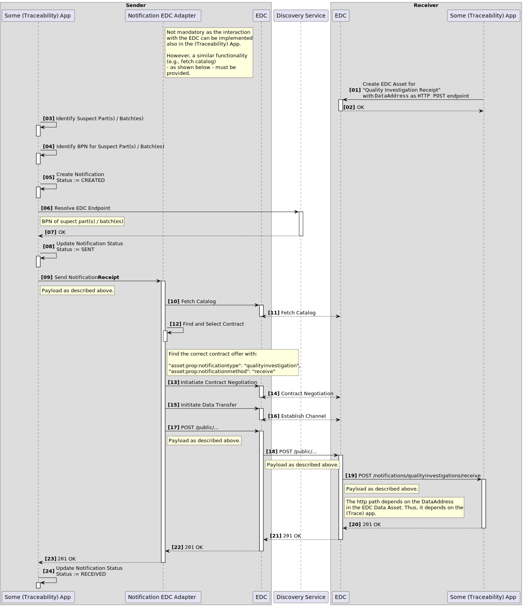
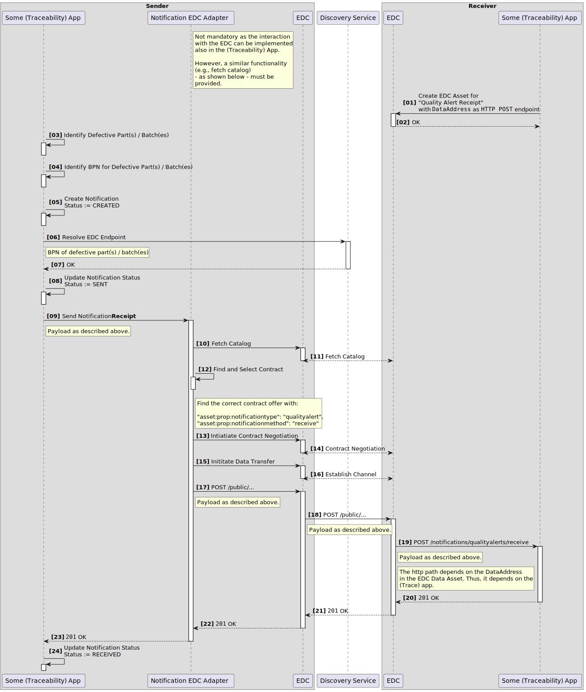
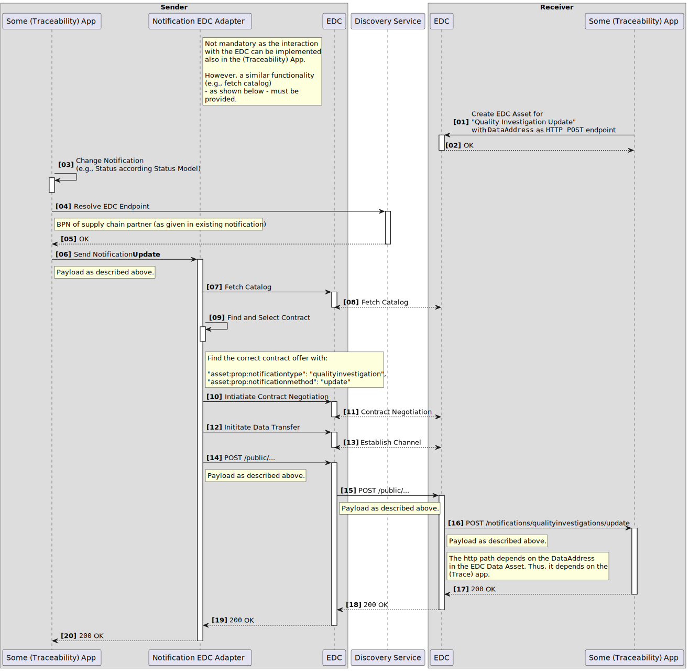
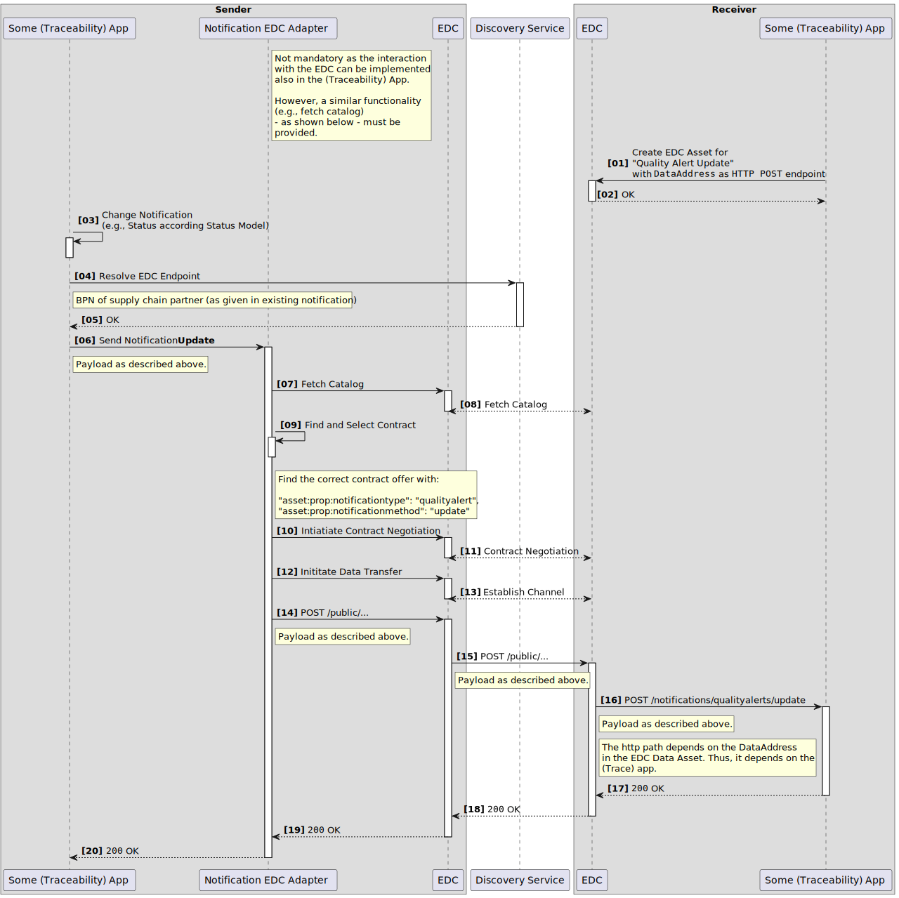

---
tags:
  - CAT/Business Application Provider
  - UC/Traceability
---

# CX-0125 Traceability Use Case v2.1.0

## ABSTRACT

This standard is used to define the basic rules to participate in the Traceability Use Case.

The use case is based on the industry core and uses the digital twins and aspect models of the industry core. Furthermore it includes
use case-specific aspect models (e.g. TractionBatteryCode) that go beyond the industry core and are used to make various entities in the network, such as parts, traceable.

In addition, this document contains necessary standards for applications to send standardized notifications to exchange Quality Investigations, Quality Alerts and Block Informations in Catena-X. Quality Investigations refer to sending standardised notifications to suppliers (top-down) while Quality Alerts and Block Informations refer to sending notifications to customers (bottom-up). Those notifications will **enable the industry to exchange upon quality issues** and based on that to **actively initiate immediate measures** in a more standardised, integrated, accelerated and precise manner. This document describes the minimal requirements of the notification processes a traceability application or application stack needs to fulfill for being interoperable within the Catena-X platform as well as the specific API endpoints and their integration into IDSA conform data assets.

## FOR WHOM IS THE STANDARD DESIGNED

This standard is designed for everybody who wants to participate in the traceability use case.

The following features are provided:

- Traceability of products (e.g. vehicles), parts and material (physical assets)
- Notification of quality issues within the value chain
- Notification of block information to actively initiate an immediate measure within the value chain

## COMPARISON WITH THE PREVIOUS VERSION OF THE STANDARD

- Enhanced existing content of [Section ABSTRACT](#abstract), [Section FOR WHOM IS THE STANDARD DESIGNED](#for-whom-is-the-standard-designed), [Section 1.1](#11-audience--scope), [Section 1.2](#12-context-and-architecture-fit) with new information regarding block informations in context with the existing Quality Investigations and Quality Alerts.
- Renamed [Section 2.1](#21-data-exchange-for-quality-and-block-notifications) title from *Quality Notifications and Data Exchange* to *Data Exchange for Quality and Block Notifications* and adapted existing content with additional information.
- Adapted existing content of [Section 2.1.3](#213-additional-requirements) with bug fixes and additional information for the new Block Notification function.
- Added new [Section 4.2.](#42-block-notification-api) to describe the new Block Notification API.
- Added new [Section 5.2.](#52-block-notification-process) to describe the new Block Notification process.

> Note: This release (**25.03**) contains **minor changes**!

## 1 INTRODUCTION

This document summarizes all standards to be supported by a network participants IT infrastructure to participate for the **Use Case Traceability**. This involves protocols, semantic models and platform capabilities to be used.

### 1.1 AUDIENCE & SCOPE

> *This section is non-normative*

This document is targeting subsets of the following roles:

- Data Provider (only for notifications) / Consumer
- Business Application Provider
- Enablement Service Provider

Furthermore, this standard applies to Traceability Applications or Application stacks and participants that

- want to provide (only for notifications) and/or consume data
- want to exchange quality issues and block informations data leveraging Traceability solutions (not to be a general solution pattern for notifications across various use cases (api, process), only for sending, receiving and updating of quality notifications or block notifications in a traceability context)

Note: Fulfilling a use-case standard by a data provider / consumer can be done in two ways:

1. Purchase a certified app for the use-case. In this case the data provider / consumer does not need to prove conformity again and
2. Data Provisioning / Consumption without a certified app for the use-case.

### 1.2 CONTEXT AND ARCHITECTURE FIT

> *This section is non-normative*

Traceability of parts and materials is crucial in the automotive industry to enable e.g. quality management and circular economy. So, the aim of the Use Case Traceability is to trace physical parts and materials across the entire value creation chain to enable data driven use cases over all n-tier levels without compromising data sovereignty.

In order to create this transparency on physical assets, relevant data must be made available by all participants of a value chain. This process is described in the standard **CX - 0127 INDUSTRY CORE: PART INSTANCE 2.0.0.** This standard enables data and app providers to deliver solutions for building data chains for serialized parts or batches. This is achieved via the standardized creation of digital twins of vehicles, parts and materials as well as the logical linking to their sub-components (Bill of Material, BoM). The default visibility of digital twins and their respective semantic models follows the one-up/one-down principle.

By tracking and tracing back the sourcing of serialized parts or batches, manufactures can quickly identify the source of any quality issue and take corrective actions to address them. Comprehensive traceability across the value creation network enables the automotive and further industries to **quickly respond to any quality issues** and based on that to **actively initiate immediate measures** in their supply chain. Standardized Quality Investigations, Quality Alerts and Block Informations based on Part Instance digital twins may be used for this purpose within the Catena-X network.

The following figure provides an overview of the architecture of all components involved in relation to quality and block notifications.


***Figure 1: Architecture Overview***

### 1.3 CONFORMANCE AND PROOF OF CONFORMITY

> *This section is non-normative*

Sections marked as non-normative, all authoring guidelines, diagrams, examples, and notes in this specification are non-normative. Everything else in this specification is normative.

The key words **MAY**, **MUST**, **MUST NOT**, **OPTIONAL**, **RECOMMENDED**, **REQUIRED**, **SHOULD** and **SHOULD NOT** in this document are to be interpreted as described in BCP 14 [RFC2119] [RFC8174] when, and only when, they appear in all capitals, as shown here.

All participants\* and their solutions will need to prove, that they are conform with the Catena-X standards. To validate that the standards are applied correctly, Catena-X employs Conformity Assessment Bodies (CABs). Please refer to: https://catena-x.net/en/catena-x-introduce-implement/certification for the process of conformity assessment and certification.

Since this document describes a set of standards to be fulfilled, participants **MUST** fulfill all mentioned standards and the respective conformity assessment criteria in addition to the specific criteria mentioned in this document.

The specific criteria defined in this document are describing the usage of the central tools as well as common tools described in the linked standardization documents and therefore compliance **SHOULD BE** checked with the tools provided for these components.

The proof of conformity for a single semantic model is done according to the general rules for proving the conformity of data provided to a semantic model or the ability to consume the corresponding data.

In terms of conformity the openAPI specification of the application or endpoints being exposed via the Tractus-X EDC or any other CX-0018 compliant connector **MUST** be checked against the standardized openAPI specification.

Examples of data assets and contract offer structure in the Tractus-X EDC or any other CX-0018 compliant connector **MUST** correspond to the described structure.

The versions of the standardization documents valid for this standard are mentioned in sections where the [standalone standards](#211-list-of-standalone-standards), [normative references](#61-normative-references) and [non-normative references](#62-non-normative-references) are listed. The valid versions are not specifically mentioned in the body text.

\**Disclaimer: The operating model released by the Catena-X association will define the roadmap, content and scope for the certification process. This will include the roles, certification and further assessment procedures as well as the rollout phases.*

### 1.4 EXAMPLES

Examples for data models: See according subsection [3 Aspect Models](#3-aspect-models).

Examples for APIs: See according subsection [4 APPLICATION PROGRAMMING INTERFACES](#4-application-programming-interfaces)

### 1.5 TERMINOLOGY

> *This section is non-normative*

**Application Programming Interface (API):**
An API is a way for two or more computer programs to communicate with each other.

**Aspect Model:**
A formal, machine-readable semantic description (expressed with RDF/turtle) of data accessible from an aspect.

Note 1 to entry: An Aspect Model must adhere to the Semantic Aspect Meta Model (SAMM), i.e., it utilizes elements and relations defined in the Semantic Aspect Meta Model and is compliant to the validity rules defined by the Semantic Aspect Meta Model.

Note 2 to entry: Aspect Models are logical data models which can be used to detail a conceptual model in order to describe the semantics of runtime data related to a concept. Further, elements of an Aspect model can/should refer to terms of a standardized Business Glossary (if existing).

*[Source: Catena-X, CX-0002, note 3 removed]*

**Asset:**
An Asset describes on Data Provider side the data set which will be shared or can be consumed by a Data Consumer.

**Asset Administration Shell (AAS):**
The AAS is a digital representation of an asset. It is a form of a digital twin.

**Bill of Material (BoM):**
A bill of material resembles the structure of a product. It is a list of all raw materials, sub-assemblies and sub-components that are needed to manufacture the end procuct. At Catena-X Traceability we consider more than one single BoM. The BoM changes during the lifecyle and therefore, we are talking about different BoMs in different lifecycles.

**Business Partner Number (BPN):**
A BPN is the unique identifier of a partner within Catena-X.

**Tractus-X Eclipse Dataspace Connector (Tractus-X EDC)**:
The Tractus-X EDC is a reference implementation for a connector conformant to CX-0018 currently acting as a de-facto standard and/or reference Implementation within Catena-X. When mentioning the Tractus-X EDC in this standard, any other CX-0018 conformant connector is also a valid option.

**HTTP:**
Hypertext Transfer Protocol (HTTP) is an application-layer protocol for transmitting hypermedia documents, such as HTML. It was designed for communication between web browsers and web servers, but it can also be used for other purposes.

**International Data Space Association (IDSA):**
The IDSA is on a mission to create the future of the global, digital economy with International Data Spaces (IDS), a secure, sovereign system of data sharing in which all participants can realize the full value of their data.

**International Data Space (IDS):**
The International Data Space enables new "smart services" and innovative business processes to work across companies and industries while ensuring that the self-determined control of data use (data sovereignty) remains in the hands of data providers.

**IDSA Protocol:**
The IDSA Protocol being used for data exchange in an International Dataspace. This includes contract negotiation.

**Part Instance:**
A part instance is a physically produced instance (e.g. serialized part, batch, just-in-sequence-part) of a part type.

**Serialized part:**
Instance of a part, where the particular instance can be uniquely identified by means of a serial number, a similar identifier (e.g. VAN) or a combination of multiple identifiers (e.g. combination of manufacturer, date and number).

**Subcomponent:**
A Subcomponent is a separate product that can be assembled into a customer product.

**UML:**
The unified modeling language (UML) is a general-purpose visual modeling language that is intended to provide a standard way to visualize the design of a system. UML provides a standard notation for many types of diagrams which can be roughly divided into three main groups: behavior diagrams, interaction diagrams, and structure diagrams.

**Vehicle Anonymised Number (VAN):**
A number mapped 1:1 to VIN, but pseudonomised.

**Vehicle Identification Number (VIN):**
The VIN number is a 17-character code assigned by the manufacturer to every vehicle, providing specific information about its make, model, year of manufacture, and other key features. It is a unique identifier that allows the vehicle to be easily tracked and identified throughout its lifespan.  Additional terminology used in this standard can be looked up in the glossary on the association homepage.

## 2 RELEVANT PARTS OF THE STANDARD FOR SPECIFIC USE CASES

> *This section is normative*

### 2.1 "DATA EXCHANGE FOR QUALITY AND BLOCK NOTIFICATIONS"

This chapter describes and collects necessary standards for applications that enable the standardized exchange of Notifications for Quality Alerts, Quality Investigations and Block Informations in Catena-X. While Quality Investigations refer to sending standardised notifications to suppliers (top-down), Quality Alerts and Block Information refer to sending notifications to customers (bottom-up). Those notifications will **enable the industry to exchange upon quality issues** and based on that to **actively initiate immediate measures** in a more standardised, integrated, accelerated and precise manner.

It is tightly bound to the Industry Core, as quality issues and block information should reference batches and/or serialized part instances as described in the standard **CX - 0127 INDUSTRY CORE: PART INSTANCE**.

The standards for Traceability and Industry Core: Part Instance serve as an enabler for the standardized exchange of quality issues or block informations as possibly immediate measure by introducing network-wide unique identifiers for serialized parts or batches. Its linked standards are to be used in order to be interoperable.

#### 2.1.1 LIST OF STANDALONE STANDARDS

> *This section is normative*

To participate in Notifications, the following single standards **MUST** be fulfilled by all participants for which the standard is relevant:

- CX-0001 EDC DISCOVERY API 1.0.2
- CX-0002 DIGITAL TWINS IN CATENA-X 2.2.0
- CX-0018 DATASPACE CONNECTIVITY 3.0.0
- CX-0127 INDUSTRY CORE: PART INSTANCE 2.0.0

#### 2.1.2 DATA REQUIRED

A digital twin **MAY** be created for serialized part or batch of materials produced by the manufacturer.
The digital twin **MUST** be provisioned via an Asset Administration Shell as per CX-0002 and registered in a decentral Digital Twin Registry of the data provider (or the decentral Digital Twin Registry host of the manufacturer) as described in CX-0002.

The IDS protocol as described in CX-0018 **MUST** be followed in the data exchange.

#### 2.1.3 ADDITIONAL REQUIREMENTS

As the IDS protocol is being used, data **MUST NOT** be transferred before a corresponding contract negotiation has been successfully passed by the participants of the data exchange and a valid contract is present as described in CX-0018.

##### Data Exchange for Quality Notifications

The described [Quality Notification Process](#51-quality-notification-process) and especially status schema **MUST** be supported.

The described [Quality Notification API](#41-quality-notification-api) **MUST** be provisioned in order to receive Quality Alerts or Quality Investigation. The required data offers for Quality Alerts and Quality Investigations **MUST** be created and linked to the described endpoints of the Quality Notification API.

##### Data Exchange for Block Notifications

The described [Block Notification Process](#52-block-notification-process) and especially status schema **MAY** be supported.

The described [Block Notification API](#42-block-notification-api) **MAY** be provisioned in order to receive and update Block Informations. The required data offers for Block Informations **MUST** be created and linked to the described endpoints of the Block Notification API in case Block Notifications will be provided.

#### Conventions for Use Case Policy in context data exchange

In alignment with our commitment to data sovereignty, a specific framework governing the utilization of data within the Catena-X use cases has been outlined. A set of specific policies on data offering and data usage level detail the conditions under which data may be accessed, shared, and used, ensuring compliance with legal standards.

For a comprehensive understanding of the rights, restrictions, and obligations associated with data usage in the Catena-X ecosystem, we refer users to

- the detailed [ODRL policy repository](https://github.com/catenax-eV/cx-odrl-profile). This document provides in-depth explanations of the terms and conditions applied to data access and utilization, ensuring that all engagement with our data is conducted responsibly and in accordance with established guidelines.
- the ODRL schema template. This defines how policies used for data sharing/usage should get defined. Those schemas **MUST** be followed when providing services or apps for data sharing/consuming.

##### Additional Details regarding Access Policies

A Data Provider may tie certain access authorizations ("Access Policies") to its data offers for members of Catena-X and one or several Data Consumers. By limiting access to certain Participants, Data Provider maintains control over its anti-trust obligations when sharing certain data. In particular, Data Provider may apply Access Policies to restrict access to a particular data offer for only one Participant identified by a specific business partner number:

- Membership
- BPNL

##### Additional Details regarding Usage Policies

In the context of data usage policies (“Usage Policies”), Participants and related services **MUST** use the following policy rules:

- Use Case Framework (“FrameworkAgreement”)
- at least one use case purpose (“UsagePurpose”) from the above mentioned [ODRL policy repository](https://github.com/catenax-eV/cx-odrl-profile).

Additionally, respective usage policies **MAY** include the following policy rule:

- Reference Contract (“ContractReference”).

Details on namespaces and ODRL policy rule values to be used for the above-mentioned types are provided via the [ODRL policy repository](https://github.com/catenax-eV/cx-odrl-profile).

##### Versioning

The Aspect Models that are deployed as Digital Twins **MUST** be published in dcat:Dataset (http://www.w3.org/ns/dcat#) in the property that holds the full URN of the Aspect Model https://admin-shell.io/aas/3/0/HasSemantics/semanticId. Versions are explicitly contained in the URN.
The API versions **MUST** be published in the property https://w3id.org/catenax/ontology/common#version as version X.Y in dcat:Dataset (http://www.w3.org/ns/dcat#).
Note: Data Assets differentiated only by major version **MUST** be offered in parallel. The current standard and API versions mark the start of Life Cycle Management in Catena-X operations. Previous versions are dismissed.

## 3 ASPECT MODELS

> *This section is normative*

An overview of the relevant aspect models of this standard.

- TractionBatteryCode

If a data provider decides to provide data on aspect models of this standard they **MUST** provide the data conformant to the semantic models specified in this document.

Data consumers and data provider **MUST** comply with the license of the semantic models.

The submodel data **MUST** be transferred using the IDS Protocol as described in CX-0018.
The Tractus-X EDC as a reference implementation is **RECOMMENDED** to be used as a connector conformant to CX-0018.

Data providers **MUST** provide data as part of a digital twin of the asset for serialized parts conformant to CX–0002. The JSON Payloads of data providers **MUST** be conformant to the JSON Schemas as specified in this document.

The unique identifier of the semantic model specified in this document **MUST** be used by the data provider to define the semantics of the data being transferred.

### 3.1 ASPECT MODEL "TractionBatteryCode"

#### 3.1.1 INTRODUCTION  

This semantic model describes a submodel for a digital twin of a traction battery or a respective subcomponent (pack, module or cell). This aspect model provides information about the traction battery code of a battery component. A traction battery code is an identification code according to GB/T 34014-2017 which has to be provided when exporting automotive traction batteries to the People's Republic of China. In addition to the traction battery code, the model also contains classification of the corresponding battery component and all subcomponents.

On the lowest level, the cell level, the model contains only the traction battery code for the cell and the information on the classification which describes if the corresponding part is a cell, a module or a pack. On the middle level, the module level, the model contains the same information for the module (code and classification). In addition to that, however, it also includes a list of the cells information that are assembled into the module. Analogue to this, on pack level, the model contains the information of the pack itself as well as the information of the modules assembled into the pack and the cells assembled into the modules.

By accessing this aspect you can get all traction battery codes that are a part of the corresponding part of the traction battery.

Note: The presented aspect model is in version 2.0.0 and **optional**.

#### 3.1.2 SPECIFICATIONS ARTIFACTS

The modeling of the semantic model specified in this document was done in accordance to the "semantic driven workflow" to create a submodel template specification [SMT](#62-non-normative-references).

This aspect model is written in SAMM 2.1.0 as a modeling language conformant to CX-0003 as input for the semantic driven workflow.

Like all Catena-X data models, this model is available in a machine-readable format on GitHub conformant to CX-0003.

#### 3.1.3 LICENSE

This Catena-X data model is made available under the terms of the Creative Commons Attribution 4.0 International (CC-BY-4.0) license, which is available at Creative Commons.

#### 3.1.4 IDENTIFIER OF SEMANTIC MODEL

The semantic model has the unique identifier

**urn:samm:io.catenax.traction_battery_code:2.0.0#TractionBatteryCode**

#### 3.1.5 FORMATS OF SEMANTIC MODEL

##### 3.1.5.1 RDF TURTLE

The rdf turtle file, an instance of the Semantic Aspect Meta Model, is the master for generating additional file formats and serializations.

TractionBatteryCode **v2.0.0** (optional)

https://github.com/eclipse-tractusx/sldt-semantic-models/blob/main/io.catenax.traction_battery_code/2.0.0/TractionBatteryCode.ttl

The open source command line tool of the Eclipse Semantic Modeling Framework is used for generation of other file formats like for example a JSON Schema, AASX for Asset Administration Shell Submodel Template or a HTML documentation.

##### 3.1.5.2 JSON SCHEMA

A JSON Schema can be generated from the RDF Turtle file. The JSON Schema defines the Value-Only payload of the Asset Administration Shell for the API operation "GetSubmodel".

##### 3.1.5.3 AASX

An AASX file can be generated from the RDF Turtle file. The AASX file defines one of the requested artifacts for a Submodel Template Specification conformant to \[[SMT](#62-non-normative-references)].

#### 3.1.6 EXAMPLES

Example JSON Payload: Submodel "TractionBatteryCode" for a Battery Cell.

```json
{
  "productType": "cell",
  "tractionBatteryCode": "X12CCPM27KLPCLE662382320"
}
```

Example JSON Payload: Submodel "TractionBatteryCode" for a Battery Module

```json
{
  "productType": "module",
  "tractionBatteryCode": "B54MCPM27KLPCLE6A7519857",
  "subcomponents": [
    {
      "productType": "cell",
      "tractionBatteryCode": "X12CCPM27KLPCLE662382320"
    },
    {
      "productType": "cell",
      "tractionBatteryCode": "X12CCPM27KLPCLE662382321"
    }
  ]
}
```

Example JSON Payload: Submodel "TractionBatteryCode" For a Battery Pack

```json
{
  "productType": "pack",
  "tractionBatteryCode": "4A6PCPM27KLPCLE742946319",
  "subcomponents": [
    {
      "productType": "module",
      "tractionBatteryCode": "B54MCPM27KLPCLE6A7519857",
      "subcomponents": [
        {
          "productType": "cell",
          "tractionBatteryCode": "X12CCPM27KLPCLE662382320"
        },
        {
          "productType": "cell",
          "tractionBatteryCode": "X12CCPM27KLPCLE662382321"
        }
      ]
    },
    {
      "productType": "module",
      "tractionBatteryCode": "B54MCPM27KLPCLE6A7519858",
      "subcomponents": [
        {
          "productType": "cell",
          "tractionBatteryCode": "X12CCPM27KLPCLE662382322"
        },
        {
          "productType": "cell",
          "tractionBatteryCode": "X12CCPM27KLPCLE662382323"
        }
      ]
    }
  ]
}
```

### 3.2 ASPECT MODEL "Special Characteristics"

#### 3.2.1 INTRODUCTION

Special Characteristics of a product are information about the adequate robustness of the product, which must be measured because they are difficult to maintain during production.

Special Characteristics are:

- suitable for communicating, product quality and securing in the supply chain.
- Characteristics that require increased care in order to avoid production issues and ensure the quality of the products.
- defined and recorded with the supplier during development.

This semantic model can stores figures of characteristics of a product and is linked to the digital twin of the product. The digital twin can have several characteristics defined. The recorded figures of the characteristic can be exchanged between two partners with this data model. The data model contains information (measurements) about the properties of the product.

One digital twin can have more than one special characteristic defined. The semantic model is designed in the way, that all kind of characeristics can be exchanged between partners. The chapter "Examples" will show some kind of special characteristics.

Note: The presented aspect model is in version 1.0.0 and optional.

#### 3.2.2 SPECIFICATIONS ARTIFACTS

The modeling of the semantic model specified in this document was done in accordance to the "semantic driven workflow" to create a submodel template specification [SMT](#62-non-normative-references).

This aspect model is written in SAMM 2.1.0 as a modeling language conformant to CX-0003 as input for the semantic driven workflow.

Like all Catena-X data models, this model is available in a machine-readable format on GitHub conformant to CX-0003.

#### 3.2.3 LICENSE

This Catena-X data model is made available under the terms of the Creative Commons Attribution 4.0 International (CC-BY-4.0) license, which is available at Creative Commons.

#### 3.2.4 IDENTIFIER OF SEMANTIC MODEL

The semantic model has the unique identifier:

urn:samm:io.catenax.special_characteristics:1.0.0#SpecialCharacteristics

#### 3.2.5 FORMATS OF SEMANTIC MODEL

##### 3.2.5.1 RDF TURTLE

The rdf turtle file, an instance of the Semantic Aspect Meta Model, is the master for generating additional file formats and serializations.

SpecialCharacteristics v1.0.0 (optional)

[https://github.com/eclipse-tractusx/sldt-semantic-models/blob/main/io.catenax.special_characteristics.measurement/1.0.0/SpecialCharacteristicMeasurement.ttl](https://github.com/eclipse-tractusx/sldt-semantic-models/blob/main/io.catenax.special_characteristics.measurement/1.0.0/SpecialCharacteristicMeasurement.ttl)
The open source command line tool of the Eclipse Semantic Modeling Framework is used for generation of other file formats like for example a JSON Schema, AASX for Asset Administration Shell Submodel Template or a HTML documentation.

##### 3.2.5.2 JSON SCHEMA

A JSON Schema can be generated from the RDF Turtle file. The JSON Schema defines the Value-Only payload of the Asset Administration Shell for the API operation "GetSubmodel".

##### 3.2.5.3 AASX

An AASX file can be generated from the RDF Turtle file. The AASX file defines one of the requested artifacts for a Submodel Template Specification conformant to \[[SMT](#62-non-normative-references)].

#### 3.2.6 EXAMPLES

Example JSON Payload: Submodel "SpecialCharacteristicMeasurement" for a simple measurement.

```json
{
  "localIdentifiers": [
    {
      "value": "SN12345678",
      "key": "partInstanceId"
    }
  ],
  "customerPartId": "PRT-12345",
  "revisionIndex": "01",
  "manufacturerId": "BPNL000000000000",
  "measurementType": "simpleMeasurement",
  "characteristicId": "S1",
  "results": [
    {
      "identifier": "measurementPoint23",
      "description": "This text gives you context to the related measurement to help to put it into the necessary context.",
      "unit": "unit:hectopascal",
      "value": 12.09,
      "measurementTimestamp": "2024-12-16T11:46:57.767+01:00"
    }
  ]
}
```

Example JSON Payload: Submodel "SpecialCharacteristicMeasurement" for a functional measurement.

```json
{
  "localIdentifiers": [
    {
      "value": "SN12345678",
      "key": "partInstanceId"
    }
  ],
  "customerPartId": "PRT-12345",
  "revisionIndex": "01",
  "manufacturerId": "BPNL000000000000",
  "measurementType": "simpleMeasurement",
  "characteristicId": "S1",
  "results": [
    {
      "identifier": "measurementPoint23",
      "description": "This text gives you context to the related measurement to help to put it into the necessary context.",
      "value": 1.0,
      "measurementTimestamp": "2024-12-16T11:46:57.767+01:00"
    }
  ]
}
```

Example JSON Payload: Submodel "SpecialCharacteristicMeasurement" for a qualitative measurement.

```json
{
  "localIdentifiers": [
    {
      "value": "SN12345678",
      "key": "partInstanceId"
    }
  ],
  "customerPartId": "PRT-12345",
  "revisionIndex": "01",
  "manufacturerId": "BPNL000000000000",
  "measurementType": "simpleMeasurement",
  "characteristicId": "S1",
  "results": [
    {
      "identifier": "measurementPoint23",
      "description": "This text gives you context to the related measurement to help to put it into the necessary context. extracted_image:https://www.example.com/test_image_measurementPoint23.jpg",
      "value": 5.0,
      "measurementTimestamp": "2024-12-16T11:46:57.767+01:00"
    }
  ]
}
```

## 4 APPLICATION PROGRAMMING INTERFACES

> *This section is normative*

### 4.1 QUALITY NOTIFICATION API  

Notifications are - in contrast to classical data offers in Catena-X - a way to push data from a sender to a receiver. For now, this notification API is limited to the sending and receiving of quality notifications as well as the update of the notification status (following a predefined [State Model](#5121-notification-state-model)). The API is used as part of the notification process of traceability.

In this regard it is important to mention, that the API standardized here is not a central API, but an API to be implemented into each participant's traceability solution or solution stack in order to be able to receive information related to quality issues and notifications in the first place.

So, this chapter describes this quality notification API with its relevant API endpoints to be created by each traceability solution or solution stack and their integration into the IDSA Protocol and/or the Tractus-X EDC as a reference implementation. On top this chapter describes the Data Asset Structure within the participant who wants to be able to receive notifications and/or updates to notifications. As the notification process includes bi-directional status communication, both entities in a process **MUST** provide these Data Assets and a linkage to corresponding APIs. Furthermore there is also a description of the payload of the notifications for quality investigations and quality alerts.

#### 4.1.1 PRECONDITIONS AND DEPENDENCIES

Application providers **MUST** prove their conformity by providing:

- An openAPI specification of the endpoints described.

- Examples of the data asset and contract definition structure in their Tractus-X EDC or any other CX-0018 compliant connector.

The Quality Notification API **MUST** be published towards the network using a Data Asset/Contract Definition in terms of the IDSA Protocol as described by the reference implementation [CX - 0018 DATASPACE CONNECTIVITY].

The Tractus-X EDC as a reference implementation **SHOULD** BE used and is referenced in this document. Other connectors fulfilling the same standards towards Catena-X **MAY** be leveraged as well.

It is of importance to mention, that there **MUST** be an API available behind each of the data offers described in the Tractus-X EDC, which works according to the openAPI specifications description.

Nevertheless, the APIs are **OPTIONAL** to follow the same structure, as there could even be APIs taking over the job of several of the endpoints mentioned.

The Tractus-X EDC **SHOULD** act as a reverse proxy towards those APIs, as it holds the Data Offers linked to the respective implemented endpoints.

#### 4.1.2 API SPECIFICATION

##### 4.1.2.1 API-ENDPOINTS

The quality notification API **MUST** be implemented as specified in the [openAPI](./assets/notifications-1-2-1.yaml) documentation.

In fact, it is **OPTIONAL** to implement the endpoint paths exactly as described in the [openAPI](./assets/notifications-1-2-1.yaml). The reason is that those endpoints are not called from any supply chain partner directly. Rather, they are called from the Tractus-X EDC as part of data assets. In that sense, it is just important to implement endpoints that can process the defined request body and respond with the HTTP status codes and - if required - reply with the defined response body.

The data assets will act similar to a reverse proxy for the notification endpoints, therefore rather the data assets are of significance, which **SHOULD** be exposed towards Catena-X through the Data Offer Catalogues in the Tractus-X EDC or any other CX-0018 compliant connector.

##### 4.1.2.2 AVAILABLE DATA TYPES

The quality notification API **MUST** use JSON as the payload transported via HTTP.

##### 4.1.2.3 API RESOURCES & ENDPOINTS

The HTTP POST endpoints introduced in this standard **MUST** be called via Data Space Protocol.

The sending and receiving of notifications **MUST** be built on the basis of HTTP POST endpoints.

#### 4.1.3 DATA ASSET STRUCTURE

##### 4.1.3.1 DATA ASSET FOR NOTIFICATION RECEIVE ENDPOINT FOR QUALITY INVESTIGATION RECEIPT

When using the Tractus-X EDC, the following asset **MUST** be registered. Other connectors implementing the IDSA Protocol require a similar data asset with the same structure and provisioning towards Catena-X.

```json
{
  "@context": {
    "cx-common": "https://w3id.org/catenax/ontology/common#",
    "cx-taxo": "https://w3id.org/catenax/taxonomy#",
    "dct": "https://purl.org/dc/terms/"
  },
  "@type": "Asset",
  "@id": "qualityinvestigationnotification-receive",
  "properties": {
    "dct:type": {
      "@id": "cx-taxo:ReceiveQualityInvestigationNotification"
    },
    "cx-common:version": "1.2"
  },
  "dataAddress": {
    ...
  }
}  
```

The variable \{\{httpServerWhichOffersTheHttpEndpoint\}\} **MUST** be set to the HTTP server that offers the endpoint. The path /qualityinvestigations/receive **MAY** align with the HTTP POST path as stated in Section 4.1.2.1. In that sense it can change dependent on the traceability application.

##### 4.1.3.2 DATA ASSET FOR NOTIFICATION RECEIVE ENDPOINT FOR QUALITY ALERT RECEIPT

When using the Tractus-X EDC, the following asset **MUST** be registered. Other connectors implementing the IDSA Protocol require a similar data asset with the same structure and provisioning towards Catena-X.

```json
{
  "@context": {
    "cx-common": "https://w3id.org/catenax/ontology/common#",
    "cx-taxo": "https://w3id.org/catenax/taxonomy#",
    "dct": "https://purl.org/dc/terms/"
  },
  "@type": "Asset",
  "@id": "qualityalertnotification-receipt",
  "properties": {
    "dct:type": {
      "@id": "cx-taxo:ReceiveQualityAlertNotification"
    },
    "cx-common:version": "1.2"
  },
  "dataAddress": {
    ...
  }
}
```

The variable \{\{httpServerWhichOffersTheHttpEndpoint\}\} **MUST** be set to the HTTP server that offers the endpoint. The path /qualityalerts/receive **MAY** align with the HTTP POST path as stated in Section 4.1.2.1. In that sense it can change dependent on the traceability application.

##### 4.1.3.3 DATA ASSET FOR NOTIFICATION UPDATE ENDPOINT FOR QUALITY INVESTIGATION UPDATE

When using the Tractus-X EDC the following asset **MUST** be registered. Other connectors implementing the IDSA Protocol require a similar data asset with the same structure and provisioning towards Catena-X.

```json
{
  "@context": {
    "cx-common": "https://w3id.org/catenax/ontology/common#",
    "cx-taxo": "https://w3id.org/catenax/taxonomy#",
    "dct": "https://purl.org/dc/terms/"
  },
  "@type": "Asset",
  "@id": "qualityinvestigationnotification-update",
  "properties": {
    "dct:type": {
      "@id": "cx-taxo:UpdateQualityInvestigationNotification"
    },
    "cx-common:version": "1.2"
  },
  "dataAddress": {
    ...
  }
}   

```

The variable \{\{httpServerWhichOffersTheHttpEndpoint\}\} **MUST** be set to the HTTP server that offers the endpoint. The path /qualityinvestigations/update **MAY** align with the HTTP POST path as stated in Section 4.1.2.1. In that sense it can change dependent on the traceability application.

##### 4.1.3.4 DATA ASSET FOR NOTIFICATION UPDATE ENDPOINT FOR QUALITY ALERT UPDATE

When using the Tractus-X EDC the following asset **MUST** be registered. Other connectors implementing the IDSA Protocol require a similar data asset with the same structure and provisioning towards Catena-X.

```json
{
  "@context": {
    "cx-common": "https://w3id.org/catenax/ontology/common#",
    "cx-taxo": "https://w3id.org/catenax/taxonomy#",
    "dct": "https://purl.org/dc/terms/"
  },
  "@type": "Asset",
  "@id": "qualityalertnotification-update",
  "properties": {
    "dct:type": {
      "@id": "cx-taxo:UpdateQualityAlertNotification"
    },
    "cx-common:version": "1.2"
  },
  "dataAddress": {
    ...
  }
}

```

The variable \{\{httpServerWhichOffersTheHttpEndpoint\}\s} **MUST** be set to the HTTP server that offers the endpoint. The path /qualityalerts/update **MAY** align with the HTTP POST path as stated in Section 4.1.2.1. In that sense it can change dependent on the traceability application.

### 4.1.4 VERSIONING

The API version described in this standard document **MUST** be published in the property https://w3id.org/catenax/ontology/common#version as version 2.0 in dcat:Dataset (http://www.w3.org/ns/dcat#).

### 4.1.5 EXAMPLES

Example 1: Quality Investigation

```text
I as a customer discover a quality issue during assembly with several parts of a specific supplier. I want to inform my supplier to perform a quality investigation on his side and want to communicate this data securely and sovereign to him.
```

Example 2: Quality Alert

```text
I as a supplier discover a problem with specific batches or serialized parts on my end affecting also parts already shipped. I want to communicate this data securely and sovereign to my customers.  
```

### 4.2 BLOCK NOTIFICATION API

Equal to quality notifications, block notifications are a form of data exchange to transfer information about defective parts in a standardized way. Quality notifications in general and quality alerts in particular can be used for the (first) mainly unstructured contact between business partners to initiate e.g. a supplier self-disclosure. Block notifications, in contrast, are structured messages. They are used to report parts with critical defects, enriched with specific information, directly to business partners, as an immediate measure potentially following a preceding quality alert.

In this way, the customer can react quickly and precisely locate the parts based on the block information and sort them out at an early stage to prevent subsequent damage or major recalls and thus save costs and ensure a high quality of the vehicles, delivered to the customer. Block notifications should therefore significantly simplify the data exchange of block information in a standardized way and improve speed and quality.

The Block Notification API **MAY** be implemented as an **OPTIONAL** feature by this standard version. However, it is **RECOMMENDED** to provide this feature as soon as possible as block notifications **MAY** become mandatory in future releases.

#### 4.2.1 PRECONDITIONS AND DEPENDENCIES

Application providers **MUST** prove their conformity by providing: An openAPI specification of the endpoints described. Examples of the data asset and contract definition structure in their Tractus-X EDC or any other CX-0018 compliant connector.

The Block Notification API **MUST** be published towards the network using a Data Asset/Contract Definition in terms of the IDSA Protocol as described by the reference implementation CX-0018.

The Eclipse Dataspace Connector as a reference implementation **SHOULD BE** used and is referenced in this document. Other connectors fulfilling the same standards towards Catena-X **MAY** be leveraged as well.

It is of importance to mention, that there **MUST** be an API available behind each of the data offers described in the dataspace connector, which works according to the openAPI specifications description. Nevertheless, the APIs are **OPTIONAL** to follow the same structure, as there could even be APIs taking over the job of several of the endpoints mentioned.

The dataspace connector **SHOULD** act as a reverse proxy towards those APIs, as it holds the Data Offers linked to the respective implemented endpoints.

#### 4.2.2 API SPECIFICATION

##### 4.2.2.1 API-ENDPOINTS

The block notification API **MUST** be implemented as specified in the [openAPI](./assets/CX0125_block-notifications-1-0-0.yaml) documentation.

In fact, it is **OPTIONAL** to implement the endpoint paths exactly as described above. The reason is that those endpoints are not called from any supply chain partner directly. Rather, they are called from the Tractus-X EDC as part of data assets. In that sense, it is just important to implement endpoints that can process the defined request body and respond with the HTTP status codes and - if required - reply with the defined response body.

The data assets will act similar to a reverse proxy for the notification endpoints, therefore rather the data assets are of significance, which **SHOULD** be exposed towards Catena-X through the Data Offer Catalogues in the Tractus-X EDC or any other CX-0018 compliant connector.

##### 4.2.2.2 AVAILABLE DATA TYPEs

The block notification API **MUST** use JSON as the payload transported via HTTP.

##### 4.2.2.3 API RESOURCES & ENDPOINTS

The HTTP POST endpoints introduced in this standard **MUST** be called via Data Space Protocol.

The sending and receiving of block notifications **MUST** be built on the basis of HTTP POST endpoints.

#### 4.2.3 DATA ASSET STRUCTURE

##### 4.2.3.1 DATA ASSET FOR BLOCK NOTIFICATION ENDPOINT TO RECEIVE NEW BLOCK INFORMATIONS

When using the Tractus-X EDC, the following asset **MUST** be registered. Other connectors implementing the IDSA Protocol require a similar data asset with the same structure and provisioning towards Catena-X.

```json
{
  "@context": {
    "cx-common": "https://w3id.org/catenax/ontology/common#",
    "cx-taxo": "https://w3id.org/catenax/taxonomy#",
    "dct": "https://purl.org/dc/terms/"
  },
  "@type": "Asset",
  "@id": "blocknotification-receive",
  "properties": {
    "dct:type": {
      "@id": "cx-taxo:ReceiveBlockNotification"
    },
    "cx-common:version": "1.0"
  },
  "dataAddress": {
    ...
  }
}
```

The variable \{\{httpServerWhichOffersTheHttpEndpoint\}\} **MUST** be set to the HTTP server that offers the endpoint. The path /blocknotification/receive **MAY** align with the HTTP POST path as stated in section [4.2.2.1 API-Endpoints](#4221-api-endpoints). In that sense it can change dependent on the traceability application.

##### 4.2.3.2 DATA ASSET FOR BLOCK NOTIFICATION ENDPOINT TO UPDATE EXISTING BLOCK INFORMATIONS

When using the Tractus-X EDC the following asset **MUST** be registered. Other connectors implementing the IDSA Protocol require a similar data asset with the same structure and provisioning towards Catena-X.

```json
{
  "@context": {
    "cx-common": "https://w3id.org/catenax/ontology/common#",
    "cx-taxo": "https://w3id.org/catenax/taxonomy#",
    "dct": "https://purl.org/dc/terms/"
  },
  "@type": "Asset",
  "@id": "blocknotification-update",
  "properties": {
    "dct:type": {
      "@id": "cx-taxo:UpdateBlockNotification"
    },
    "cx-common:version": "1.0"
  },
  "dataAddress": {
    ...
  }
}

```

The variable \{\{httpServerWhichOffersTheHttpEndpoint\}\} **MUST** be set to the HTTP server that offers the endpoint. The path /blocknotification/update **MAY** align with the HTTP POST path as stated in section [4.2.2.1 API-Endpoints](#4221-api-endpoints) In that sense it can change dependent on the traceability application.

### 4.2.4 VERSIONING

The API version described in this standard document **MUST** be published in the property https://w3id.org/catenax/ontology/common#version as version 2.0 in dcat:Dataset (http://www.w3.org/ns/dcat#).

### 4.2.5 EXAMPLES

To get an overview on how the block notifications could look like, examples for receive new block informations and udpate existing block informations via a Block Notification are depicted below.

#### 4.2.5.1 RECEIVE NEW BLOCK INFORMATIONS

Excerpt of a possible JSON payload example for receiving new block informations:

```json
{
  "header": {
    "messageId": "urn:uuid:32ab2Ecd-3Edf-10cB-b37C-4eCE34e0dEcD",
    "context": "Traceability-BlockNotification:1.0.0",
    "sentDateTime": "2024-10-07T10:15+00:00",
    "senderBpn": "BPNLTrEBJIeGGrw6",
    "receiverBpn": "BPNLuAnzbC13jPVL",
    "expectedResponseBy": "2024-10-07T10:15+00:00",
    "relatedMessageId": "5caf7a2D-7267-279c-Adea-1659b2CC9520",
    "version": "3.0.0"
  },
  "content": {
    "notificationStatus": "SENT",
    "blockInformations": [
      {
        "catenaXId": "1C52A072-e637-C10b-Ed2A-Ec6Cc665d8Cb",
        "blockStatus": "ACTIVE",
        "componentLevelContainment": {
          "manufacturingLocationId": "BPNAFhVL36CREvSm",
          "integrationLevel": "S18A-19-03-400",
          "customerPartId": "884267902",
          "localIdentifiers": [
            {
              "key": "manufacturerId",
              "value": "BPNL0123456789ZZ"
            },
            {
              "key": "partInstanceId",
              "value": "SN12345678"
            },
            {
              "key": "customKey:ecuSerialNumber",
              "value": "220115001384267902201978150063581180"
            }
          ]
        },
        "periodAndVolumeLevelContainment": {
          "sizeOfProductionLot": {
            "itemUnit": "unit:piece",
            "quantityValue": 20
          },
          "deliveryNoteNumber": "68988545",
          "packageNumber": "12295140916130",
          "deliveryPlace": "22610",
          "deliveryDate": "2024-10-07T10:15+00:00",
          "numberOfPartsPerDeliveryNote": {
            "itemUnit": "unit:piece",
            "quantityValue": 20
          },
          "productionDate": "2024-10-07T10:15+00:00",
          "numberOfPartsPerPackage": {
            "itemUnit": "unit:piece",
            "quantityValue": 20
          },
          "orderNumber": "7334663"
        },
        "locationInTheContainer": {
          "xPosition": "F",
          "yPosition": "10",
          "smallLoadCarrierLayer": "53BUN6555599345283155+000000008"
        }
      }
    ]
  }
}
```

#### 4.2.5.2 UPDATE EXISTING BLOCK INFORMATIONS

Excerpt of a possible JSON payload example for updating existing block informations:

```json
{
  "header": {
    "messageId": "cbcb58aA-583b-B203-3bf9-3Ac0e8Ea7D9f",
    "context": "Traceability-BlockNotification:1.0.0",
    "sentDateTime": "2024-10-07T10:15+00:00",
    "senderBpn": "BPNLkcWT2EaXKdE9",
    "receiverBpn": "BPNLO8Lg3pfco1RE",
    "expectedResponseBy": "2024-10-07T10:15+00:00",
    "relatedMessageId": "626f223a-fc4D-A9b5-aaCB-9d4b76793096",
    "version": "3.0.0"
  },
  "content": {
    "notificationStatus": "SENT",
    "blockInformations": [
      {
        "catenaXId": "580d3adf-1981-44a0-a214-13d6ceed9379",
        "blockStatus": "CANCELED"
      },
      {
        "catenaXId": "6a3cA7E1-1682-5F25-FE1d-cF112433C2f4",
        "blockStatus": "CANCELED"
      },
      {
        "catenaXId": "550d3swf-1845-55sw-a2s8-13d6ceed4265",
        "blockStatus": "CANCELED"
      }
    ]
  }
}
```

## 5 PROCESSES

> *This section is normative*

### 5.1 QUALITY NOTIFICATION PROCESS

This chapter describes the minimum requirements for the notification process and does not go beyond the sending and receiving of quality notifications. It also illustrates common practices for identifying the correct receiving endpoint when sending a notification. For this purpose, a protocol is described that will be exchanged between traceability applications or application stacks leveraging Tractus-X EDC or any other CX-0018 compliant connector on both ends.

The notification process therefore takes place between traceability applications or application stacks, and the focus is on minimal interaction, which **MUST** be supported by all applications participating in a quality notification or quality investigation scenario.

Application internals like user journeys, process steps or workflows in an application are not standardized within Catena-X, and therefore omitted.

#### 5.1.1 ACTORS AND ROLES

Catena-X does not standardize user-roles at the moment. The actors are traceability applications of the companies in a supply chain.

#### 5.1.2 PROCESS REPRESENTATION

The exchange of notifications follows the IDSA protocol.

On top, a notification state model has been described.

##### 5.1.2.1 NOTIFICATION STATE MODEL

The notification itself has various states. The states and their cycle are described in the following figure:


***Figure 2: Description of Process***

The state of a notification MUST be exchanged via the [Notification API](#41-quality-notification-api).

##### 5.1.2.2 PROCESSES FOR SENDING AND UPDATING NOTIFICATIONS

Below the sequence for sending and updating of notifications between (traceability) applications is shown in UML sequence diagrams In all cases, HTTP POST requests **MUST** be used. The corresponding HTTP endpoints are described in chapter [Notification API](#41-quality-notification-api).

To read the UML sequence diagrams correctly, some remarks below:

- The shown Notification Tractus-X EDC Adapter is not mandatory. It is just one option to send a notification via the Tractus-X EDC control and data plane. It is important, that a similar functionality must be provided/implemented by the (traceability) application vendor. The Notification Tractus-X EDC Adapter or a similar component / functionality will not be provided as a central service from Catena-X.

- To discover where a notification **MUST** be sent to, the (traceability)
  application **MUST** resolve the BPN of the receiver. This can either
  happen through the (traceability) application holding this
  information in its data model, or it could - alternatively - also be
  resolved e.g. via a lookup of the digital twin in the central asset
  administration shell (AAS) registry or by using services from the
  BPDM use case.

- The resolution of the Tractus-X EDC URL for a given BPN SHOULD be done via the
  EDC Discovery Service API \[CX-0001\]. The entry for each Tractus-X EDC into
  this Discovery Service is done via the Catena-X Portal.

- In each UML sequence diagram the step \[01\] describes the
  publishing of the notification endpoints as described in the above
  sections.

###### 5.1.2.2.1 SENDING AND RECEIVING OF A QUALITY INVESTIGATION

Below, the UML sequence diagram to send and receive a quality
investigation is depicted.

In addition to the above-mentioned general remarks, the following remark
has to be mentioned:

- The status transition from SENT to RECEIVED **MUST** be done by the

> sender once it has received the HTTP status code 201 from the receiver. This status is not communicated from the sender to the receiver.



***Figure 3: Send and Receive Quality Investigation***

###### 5.1.2.2.2 SENDING AND RECEIVING OF A QUALITY ALERT

Below, the UML sequence diagram to send and receive a quality alert is
depicted.

In addition to the above-mentioned general remarks, the following remark
has to be mentioned:

- The status transition from SENT to RECEIVED **MUST** be done by the

> sender once it has received the HTTP status code 201 from the receiver. This status is not communicated from the sender to the receiver.



***Figure 4: Send and Receive Quality Alert***

###### 5.1.2.2.3 UPDATE OF A QUALITY INVESTIGATION

Below, the UML sequence diagram to update a quality investigation is
depicted.



***Figure 5: Update Quality Investigation***

###### 5.1.2.2.4 UPDATE OF A QUALITY ALERT

Below, the UML sequence diagram to update a quality alert is depicted.



***Figure 6: Update Quality Alert***

### 5.2 BLOCK NOTIFICATION PROCESS

While quality notifications are primarily aimed at contact between business partners, block notifications represent an **extended form of data exchange in order to actively initiate an immediate measure** to block or sort out the produced parts at the customer's production or logistics. As the quality notifications, block notifications take place between traceability applications or other application stacks, so that this functionality must be implemented by both business partners application.

In this case, block notifications include a **notification status similar to quality notifications** to track communication, but **also include a new status model** for each individual part of the block notification to provide additional information. For example, whether the part was blocked or whether the process to block a part was canceled.

#### 5.2.1 ACTORS AND ROLES

Catena-X does not standardize user-roles at the moment. The actors are traceability applications of the companies in a supply chain.

#### 5.2.2 PROCESS REPRESENTATION

The exchange of notifications follows the IDSA protocol. On top, a block notification state model has been described additionally to the existing quality notification process.

##### 5.2.2.1 BLOCK NOTIFICATION STATE MODEL

In order to track the blocking process in the Catena X network, a defined status model is used for each part of the block notification:


***Figure 7: Description of the Block Process***

- ACTIVE means that the part has been identified as a damaged and safety-critical part and must therefore be blocked on the customer side.
- PART_BLOCKED is used when the recipient has received the block notification and actually blocks / sorts out the damaged parts as a measure.
- CANCELED serves as the update status of the component originally identified to be blocked if the supplier subsequently determines that the original part does meet safety requirements, is not damaged or that the information was sent by mistake. This status can also be set by the manufacturer if, after an (initial) analysis, the part does not require a block.

The status of a notification and the block status of each part of the notification **MUST** be exchanged via the API described in chapter [4.2. Block Notification API](#42-block-notification-api).

##### 5.2.2.2 PROCESSES FOR SENDING AND UPDATING BLOCK INFORMATIONS

Below the sequence for sending and updating of block informations via Block Notifications between (traceability) applications is shown in UML sequence diagrams In all cases, HTTP POST requests **MUST** be used. The corresponding HTTP endpoints are described in chapter [4.2.2.1 API-ENDPOINTS](#4221-api-endpoints).

To read the UML sequence diagrams correctly, some remarks below:

- The shown Notification Tractus-X EDC Adapter is not mandatory. It is just one option to send a block notification via the Tractus-X EDC control and data plane. It is important, that a similar functionality must be provided/implemented by the (traceability) application vendor. The Block Notification Tractus-X EDC Adapter or a similar component / functionality will not be provided as a central service from Catena-X.
- To discover where a block notification **MUST** be sent to, the (traceability)
  application **MUST** resolve the BPN of the receiver. This can either
  happen through the (traceability) application holding this
  information in its data model, or it could - alternatively - also be
  resolved e.g. via a lookup of the digital twin in the central asset
  administration shell (AAS) registry or by using services from the
  BPDM use case.
- The resolution of the Tractus-X EDC URL for a given BPN **SHOULD** be done via the
  EDC Discovery Service API \[CX-0001\]. The entry for each Tractus-X EDC into
  this Discovery Service is done via the Catena-X Portal.
- In each UML sequence diagram the step [01] describes the publishing of the notification endpoints as described in the above sections.

###### 5.2.2.2.1 SENDING AND RECEIVING OF BLOCK INFORMATION VIA A BLOCK NOTIFICATION

Below, the UML sequence diagram to send and receive new block informations is depicted.

In addition to the above-mentioned general remarks, the following remark has to be mentioned:

> The status transition of the block notification from SENT to RECEIVED **MUST** be done by the sender once it has received the HTTP status code 201 from the receiver. This status is not communicated from the sender to the receiver.


**Figure 8: Send new block informations via a Block Notification**

###### 5.2.2.2.2 UPDATE AN EXISTING BLOCK INFORMATION VIA A BLOCK NOTIFICATION

Below, the UML sequence diagram to update existing block informations is depicted.

In addition to the above-mentioned general remarks, the following remark has to be mentioned:

> The status transition of the block notification from SENT to RECEIVED **MUST** be done by the sender once it has received the HTTP status code 201 from the receiver. This status is not communicated from the sender to the receiver.


***Figure 9: Update an existing block information via a Block Notification***

## 6 REFERENCES

### 6.1 NORMATIVE REFERENCES

> *This section is normative*

- CX-0001 EDC Discovery API 1.0.2
- CX-0002 Digital Twins in Catena–X 2.2.0
- CX-0003 SAMM Aspect Meta Model 1.1.0
- CX-0018 Dataspace Connectivity 3.0.0
- CX-0127 Industry Core - Part Instance 2.0.0
- Tractus-X EDC Reference Implementation - https://github.com/eclipse-tractusx/tractusx-edc

[^1]: https://catena-x.net/fileadmin/user_upload/Vereinsdokumente/Catena-X_IP_Regelwerk_IP_Regulations.pdf

[^2]: https://catena-x.net/de/standard-library

### 6.2 NON-NORMATIVE REFERENCES

> *This section is non-normative*

- The Traceability KIT and sub-KITs will include further information on data asset structures, Digital Twin Submodel examples and API calls to be made.
- [SMT] How to create a submodel template specification. Guideline. Download from: https://industrialdigitaltwin.org/wp-content/uploads/2022/12/I40-IDTA-WS-Process-How-to-write-a-SMT-FINAL-.pdf
- CX Operating Model [https://catenax-ev.github.io/docs/operating-model/why-introduction](https://catenax-ev.github.io/docs/operating-model/why-introduction)

### 6.3 REFERENCE IMPLEMENTATIONS

> *This section is non-normative*

## ANNEXES

### FIGURES

> *This section is non-normative*

### TABLES

> *This section is non-normative*

## Legal

Copyright © 2025 Catena-X Automotive Network e.V. All rights reserved. For more information, please visit [here](/copyright).
