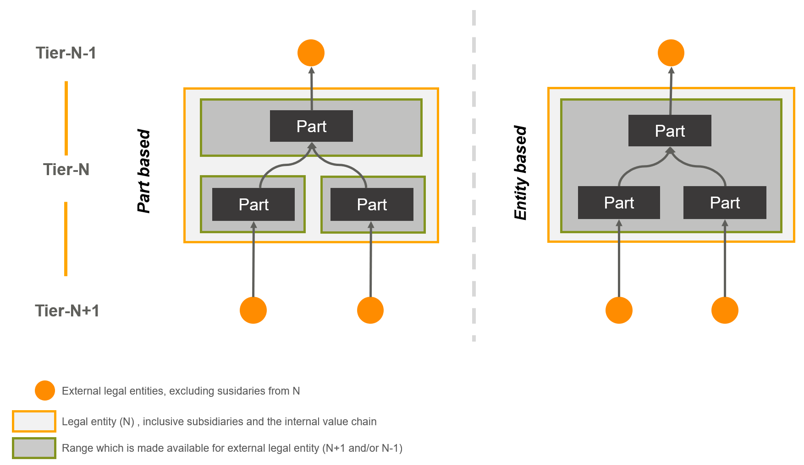

# How: Data Space Operations

This chapter provides an overview of the key processes and compliance requirements for onboarding to the Catena-X data space. It covers the data exchange process based on Self Sovereign Identities (SSI) for offering, exchanging, and using data. Finally, guidelines and support options for the use of connectors are described.

## Onboarding Process

The onboarding process consists of the (i) registration process and (ii) registration approval process and can be extended by the (iii) technical integration process in accordance with the CX-0006 standard (see Figure [Onboarding Process](./how-data-space-operations.md#onboarding-process)). To join the data space, all participants must complete the registration process. To exchange data with partners, participants must also complete the technical integration process and sign the General Data Exchange Framework.

*Onboarding Process*

### Registration

During the registration process, all participants must add their company data, select their company role(s), and submit their registration via the registration service of the CSP-B or one of the OSPs (see Chapter [Onboarding Service Provider](./../who-roles-in-the-catena-x-ecosystem/who-roles-in-the-catena-x-ecosystem.md#onboarding-service-provider)). The registration service of the OSP is integrated into the general registration service of the CSP-B, e.g. using the registration API (CX-0009) and the IAM & Access Control for Single Sign-On (SSO). Subsequently, all participants must confirm their selected company role(s) and the regulatory framework including role-specific terms and conditions via the CSP-B registration service.

### Registration Approval

After confirmation, a BPNL (if not yet available) and an identity wallet with the "BPNL" and "Catena-X Membership" credentials are created by the CSP-B as part of the registration approval step. Each participant can collect their proof of identity, credentials and other verifiable information (e.g., roles, rights, services) in their identity wallet. The self-descriptions (SD) of newly registered legal entities and connectors are validated by the GXDCH (see Chapter [Gaia-X Compliance](./how-data-space-operations.md#gaia-x-compliance)). This includes the signing and issuing of credentials to the identity wallet of a DPC, providing proof of Gaia-X compliance and notarization of the legal entity.

### Technical Integration

After registration, participants can start the technical integration process (e.g., create technical users, regsiter connectors) to enable technical interaction with other participants. The technical user enables a company to link their connectors to its identity wallet. The connector registration is required to ensure that a connector can be searched and discoverd by other participants within the data space.

### Managing Company Hierarchies

After successful registration, participants can create and manage their company hierarchies. With release 24.08, Catena-X Business Partner Data Management allows you to create and manage sites and additional addresses for your legal entities. In a future version, it will also be possible to create and manage relationships between two legal entities (e.g., subsidiaries). This is relevant, for example, for the various connector usage scenarios as described [here](../../operating-model/how-data-space-operations/how-data-space-operations.md#edc-deployment-and-usage-premises).

## Gaia-X Compliance

The Gaia-X Digital Clearing House (GXDCH) is an external service that maximizes trust within the Catena-X data space, and data space interoperability with other initiatives based on the Gaia-X Trust Framework. The GXDCH enables the validation of legal entities, ensures Gaia-X compliance, and creates an eIDAS conform digital signature (self-description) for all data space participants. There is one GXDCH provider for the Catena-X data space, which is nominated and managed by the Catena-X Association. To ensure compliance with the Catena-X onboarding process, the CSP-B must connect to the GXDCH.

## Implementation of the Self Sovereign Identity Concept

Self-Sovereign Identity (SSI) is the next step beyond user-centric identity, and that means it begins at the same place: the user must be central to the administration of identity. That requires not just the interoperability of a user’s identity across multiple locations, with the user’s consent, but also true user control of that digital identity, creating user autonomy. In Catena-X there are several different components to implement the SSI approach. This includes the Issuer Component and the BPN DID Resolution Service (BDRS) which is currently classified as Core Service B due to the current state of our technical architecture, and is accordingly also managed by the CSP-B. In addition to the Issuer Component, the CSP-B also operates an Identity Wallet and the Authority Schema Registry. The Authority Schema Registry is managed by the Catena-X Association, which has nominated and commissioned the CSP-B to operate this service. To enable a stable and secure operation, the CSP-B can put the schemas in a dedicated repository. The CSP-B must use the currently operational version in the Catena-X data space. All the components can be seen in the Service Map (see Chapter [What: Service Map](./../what-service-map/what-service-map.md)) This concept will evolve in future releases, the details of which can be found in Chapter [Further Integration of SSI Technologies](./../outlook/outlook.md#further-integration-of-ssi-technologies).

## Data Exchange based on SSI

With the latest Catena-X release the processes to participate in a use case as well as to offer, exchange, and use data are updated as follows (see Figure [Data Exchange Process](./how-data-space-operations.md#data-exchange-based-on-ssi)):

*Data Exchange Process*
> Note: the flow is a comprehensive picture of the actual interactions taking place. It covers the presentation flow. The issuance flow is not visualized.

1. **Initiate Secure Token Creation**

   Retrieve a One-Time-Token (OTT) to allow the provider to request Verifiable Presentations (VP) within a pre-defined, authorized scope.

2. **Query catalog/offers**

    With the query of the data provider catalog, the consumer EDC submits the previously generated one-time token to allow the provider to call the VP under #3.

3. **Query VP**

    The provider calls the consumer wallet with the provided One-Time-Pad (OTP). The consumer wallet validates the (One-Time-Token) OTT and if successful, submits the VP.

4. **Validate VP**

    The provider connector validates the VP and matches the consumer VP scope with the available data offer policy rules configured.

5. **Submit catalog**

    Upon successful validation (by the provider EDC), all data offers, where the data access policies set by the provider match the verified credentials owned by the data consumer, are sent to the customer. Any data offers that require verified credentials that the data consumer does not have will not be sent/published to the data consumer. Participation in a Catena-X Use Case requires the selection of at least one standardized purpose. The list of standardized Catena-X purposes can be found in the official [Catena-X Open Digital Rights Language (ODRL) profile](https://github.com/catenax-eV/cx-odrl-profile).

6. **Manual checking of data offering policies**

    Configured data offer policies must be manually checked by the data consumer.
    - If a purpose is specified, the purpose must be validated internally by the data consumer. The purpose may refer to an individual contract concluded between the data consumer and the data provider. The data consumer must review the contract and decide whether the policies are acceptable for the specific data offering based on the established policies (see next step 7).
    - If no purpose is specified, the negotiation can start immediately, as the access and usage policies are automatically technically enforced and validated by the connectors.

7. **Decision on the purpose of the data offer**

    Based on step 6 individual data contract validation, the data consumer must decide whether to proceed with the negotiation or whether to disagree with the individual purpose. If there is disagreement, the negotiation should not be started. If there is consent, the data consumer can start the negotiation.

8. **Contract negotiation**

    The data consumer starts the contract negotiation by sending a request for an agreement/contract.

9. **Contract conclusion/success**

    The connector of the data provider receives the negotiation requests, validates the access and usage policies of the specific data offer requested by the data provider, and matches it with the VP of the data consumer. If the data consumer has all relevant credentials, the agreement is successfully concluded, and an agreement log is stored in both connectors.

10. **Data transfer**

    Data transmission/access by the data consumer can take place as long as the contract is active.

## EDC Deployment and Usage Premises

Each data space participant has its own organizational structure, consisting of different legal entities and/or subsidiaries. Depending on the organizational structures, data space participants must consider how to organize the representation of their organization in the Catena-X data space. This includes considerations for setting up connector instances regarding organizational, technical, and legal conditions. The following premises apply:

- The data exchange always takes place between two legal entities, as only their representatives can sign legally binding contracts.
- Legal entities must be registered and known in the data space.
- To represent a legal entity in the data space, an associated business partner number (BPNL) is required.
- The deployment and use of at least one connector (e.g., EDC) per company (i.e. legal entity) for data exchange is mandatory.  
- To minimize effort and costs, it is recommended that a parent company provides a connector that can also be used by subsidiaries. A technical description of this will follow soon.
- The connector negotiates data usage between endpoints (data plane) by synchronizing access and usage policies between data providers and data consumers.
- There is no data processing or reviewing of data within the connector itself.
- Data usage takes place instead at the endpoints of the data providers or data consumers, respectively.
- Data usage with respect to location and assignment to computer instances/platforms is independent of the runtime environment of the connector itself.

There are various options for organizational structures and data exchange scenarios such as “one legal entity and one site in one country”, “one legal entity and multiple sites in one country” or “one legal entity and multiple sites in different countries”.
For more details on possible connector usage scenarios, please refer to our [Onboarding Guide](https://catena-x.net/fileadmin/user_upload/04_Einfuehren_und_umsetzen/Onboarding/OnboardingGuide_LargeEnterprises_V1.1.pdf). This includes also the different options to obtain a connector, e.g., it can be acquired via an ESP, it can be self-developed or adapted from open-source, or it can be part of a business application from a BAP. If the data exchange does not take place between several legal entities within Catena-X as defined above, no EDC is required. An example would be the connection of the CSP-B to the GXDCH. For this connection no connector is needed, because this is not an exchange of data between two legal entities within Catena-X.

## Supply Chain Visibility (BETA)

*This chapter is released as beta, which therefore is as of now not normative and may change significantly in subsequent iterations. The aim is to provide a definition and a guideline for 1U1D.  In doing so, we want to start the review of the definition - so that we have long-term an overview of which use case has which requirement.*

Catena-X is committed to making sovereign data exchange easy to use. This includes not just technical aspects but also support compliance scenarios, for example in terms of anti-trust legislation, confidentiality clauses in supply contracts, etc..  

The resulting guideline for supply chain visibility in Catena-X data space is known as the “One Up / One Down Rule” (1U1D-Rule). This means that each company in the supply chain can only use and share data with its direct suppliers (One Down / N+1) and customers (One Up / N-1). It ensures that companies receive enough information to fulfill their specific tasks and to enable Catena-X to fulfill use cases throughout the entire value chain, but at the same time retain control over access to sensitive data.

In practice, the situation is more complex. For example, a legal entity may have other subsidiaries that are part of the same value chain or there may be various assembly steps before a product is handed over to the customer. Therefore, there are two possibilities in Catena-X to apply the 1U1D rule in this case, part-based visibility and entity-based visibility.

  
*1U1D visibility*

The figure shows a generic section of the value chain. The basic principle - one up (N-1) exchange data with the customer and one down (N+1) exchange data with the supplier is generally valid. The number of external legal entities depends on the respective business relationships starting from the Tier-N. The orange box represents the Tier-N, including all internal value creation processes and all internal subsidiaries. The individual parts show the process by which they are sourced from different suppliers and assembled into a new product. The green box shows which information can be used by the external parties.

Besides this implementation suppliers and customers have to agree on how the 1U1D-Rule applies to their specific contractual agreement and use case. For example, if there are agreements in place to handle directed parts or ad-hoc agreements to handle a critical supply situation, supply chain visibility may be extended.

The default standard for part relationships is defined in Catena-X Standards [CX-0126](../../standards/CX-0126-IndustryCorePartType/CX-0126-IndustryCorePartType.md) and [CX-0127](../../standards/CX-0127-IndustryCorePartInstance/CX-0127-IndustryCorePartInstance.md). An overarching explanation can be found in the [Tractus-X KITS](https://eclipse-tractusx.github.io/docs-kits/category/industry-core-kit).

### Part-based visibility

Part-based visibility makes a more granular distinction in data exchange than the entity-based approach, as it differentiates between the individual components. For example, only data about the part that is directly related to an external legal entity is provided or requested. This means that the entire value chain is not transparent. For the functionality of the use cases in Catena-X, the relationship between the various parts must still be known, even if not all of them are provided. In this figure, data is exchanged with Tier-X-1 (1Up) only via the part that has a direct relationship with it.

### Entity-based visibility

In comparison to part-based visibility, entity-based visibility does not differentiate between the individual subcomponents or the assemblies. This means that all subparts and process steps of the respective other legal entity (One Up / N-1) or (One Down / N+1) are provided. In this figure, data is exchanged with Tier-X-1 (1Up) about the part that has a direct relationship with it and the assemblies. It is recommended that supply chain visibility respects symmetrical relationships where granularity of data visibility is equivalent on supplier and customer side.
